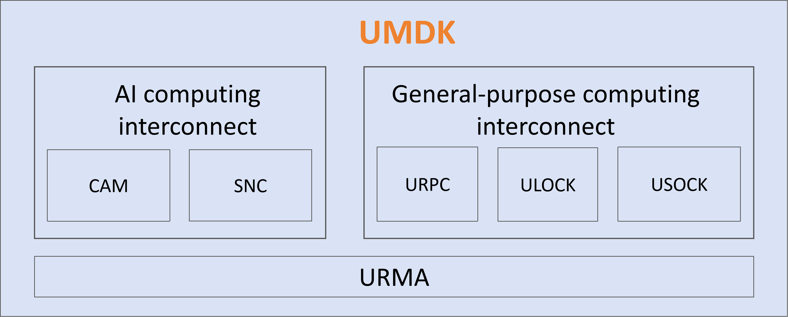

# UMDK
#### 1. UMDK Introduction
Lingqu UnifiedBus Memory Development Kit (UMDK) is a distributed communication software library centered around memory semantics. It provides high-performance communication interfaces for data center networks, within super nodes, and between cards inside servers, enabling and unleashing the hardware capabilities of the Lingqu bus.



#### 2. Component Introduction
1. URMA: Unifies memory semantics, provides remote memory operation methods such as unilateral, bilateral, and atomic operations, serving as the foundation for communication between applications.
It offers two types of interfaces: one is the northbound application programming interface, which provides communication APIs for applications, and the other is the southbound driver programming interface, which offers APIs for driver developers to access the UMDK.

2. CAM: SuperPOD communication acceleration library, providing high-performance training and promotion communication acceleration based on Lingqu superPOD affinity. It can connect to mainstream communities such as vllm, SGlang, and VeRL in the northbound direction and connect to Ascend superPOD hardware and networking in the southbound direction.

3. URPC: Unified remote procedure call, supporting Lingqu-native high-performance RPC communication between hosts and devices, as well as RPC acceleration.

4. ULOCK: Unified State synchronization, featuring native Lingqu high-performance state synchronization with distributed lock support, accelerates global resource allocation for distributed applications such as databases.

5. USOCK: Compatible with standard socket API, enabling TCP applications to enhance network communication performance with zero modifications.

#### 3. Build and install
1. Build Environment Requirements
- Kernel version：kernel 6.6
- You also need to install the following dependency packages：

```bash
  yum install -y rpm-build
  yum install -y make
  yum install -y cmake
  yum install -y gcc
  yum install -y gcc-c++
  yum install -y glibc-devel
  yum install -y openssl-devel
  yum install -y glib2-devel
  yum install -y libnl3-devel
  yum install -y kernel-devel  # ubcore is necessary from openEuler kernel
```

2. Build Instructions
- You can build and install the UMDK RPM package using the following methods:

```bash
  mkdir -p /root/rpmbuild/SOURCES/
  tar -czf /root/rpmbuild/SOURCES/umdk-26.06.0.tar.gz --exclude=.git `ls -A`
  rpmbuild -ba umdk.spec
```

- RPM build options
```bash
  $ --with asan                              option, i.e. disable asan by default
  $ --with test                              option, i.e. disable test by default
  $ --with urma                              option, i.e. disable urma by default
  $ --with urpc                              option, i.e. disable urpc by default
  $ --with dlock                             option, i.e. disable dlock by default
  $ --with ums                               option, i.e. disable ums by default
  $ --define 'kernel_version 6.6.92'         option, specify kernel version
  $ --define 'rpm_release  0'                option, specify release version
```

3. Install Instructions
- Runtime Dependencies: Ensure that prerequisite drivers are loaded. If not, please load them manually
```bash
cd /lib/modules/$(uname -r)/kernel/drivers
insmod ub/ubfi/ubfi.ko.xz  cluster=1     # When using a VF network device, it is necessary to remove the cluster=1 parameter.
insmod iommu/ummu-core/ummu-core.ko.xz
cd /lib/modules/$(uname -r)/kernel/drivers/ub/hisi-ub/kernelspace
insmod ummu/drivers/ummu.ko.xz ipver=609
insmod ubus/ubus.ko.xz ipver=609  cc_en=0  um_entry_size=1
insmod ubus/vendor/hisi/hisi_ubus.ko.xz msg_wait=2000 fe_msg=1 um_entry_size1=0 cfg_entry_offset=512
insmod ubase/ubase.ko.xz
insmod unic/unic.ko.xz tx_timeout_reset_bypass=1
insmod cdma/cdma.ko.xz

```
- Install the RPM package
```bash
rpm -ivh /root/rpmbuild/RPMS/*/umdk*.rpm
cp -f /usr/bin/urma_perftest /usr/local/bin/
modprobe ubcore
modprobe uburma
cd /lib/modules/$(uname -r)/kernel/drivers
insmod ub/hisi-ub/kernelspace/udma/udma.ko.xz dfx_switch=1 ipver=609 fast_destroy_tp=0 jfc_arm_mode=2
modprobe ubagg # If multi-path support is required
modprobe ums # if ums is required
```
-  Add permissions
```bash
# If you do not have the required permissions, you need to add them manually.
chmod 755 /usr/lib64/liburma*
```

4. Build URMA with Bazel (workspace root: `src/urma`)

From the UMDK repository root, install Bazel plus headers/libs used by the URMA Bazel graph. If you already ran the package list in step 1, you still need `bazel` (and ensure `libnl3-devel` is present; it is required by `urma_ubagg`/UVS paths).

```bash
yum install -y bazel libnl3-devel openssl-devel zlib-devel

cd src/urma
# Typical release build for AArch64, including UDMA hardware glue (liburma_udma.so)
bazel build --config=release --config=arm64 --define=build_udma=true //...
```

If **libummu** was built and installed manually (not via `libummu-devel` RPM), configure the linker before using `--define=build_udma=true`:

- Installed to the system default path (e.g. `make install` with `CMAKE_INSTALL_PREFIX=/usr`, then `sudo ldconfig`): no extra Bazel flags; the command above is enough.
- Installed to a custom prefix (e.g. `/usr/local/lib64`): pass the library directory to Bazel and set rpath for runtime loading:

```bash
cd src/urma
bazel build --config=release --config=arm64 --define=build_udma=true \
  --linkopt=-L/usr/local/lib64 \
  --linkopt=-Wl,-rpath,/usr/local/lib64 \
  //...
```

Replace `/usr/local/lib64` with your actual `libummu.so` directory. After install, run `sudo ldconfig` if the path is listed in `/etc/ld.so.conf.d/`.

Optional Bazel configurations (pick the architecture config that matches the host; `x86_64` is also defined in `.bazelrc`):

```bash
# Release without UDMA user library (AArch64)
bazel build --config=release --config=arm64 //...

# Release with UDMA on x86_64 (on AArch64 hosts use `--config=arm64` instead)
bazel build --config=release --config=x86_64 --define=build_udma=true //...

# Debug + AddressSanitizer / LeakSanitizer (useful for local diagnosis)
bazel build --config=debug --config=asan //...

# ThreadSanitizer on urma_common with cycle profiling enabled
bazel build --config=tsan --define=perf_cycle=true //:urma_common

# Build only the hardware abstraction target with UDMA enabled
bazel build --define=build_udma=true //:hw
```

Install built shared libraries (run as root or with `sudo`; create `/usr/lib64/urma` if it does not exist). `liburma_udma.so` is produced only when `build_udma=true` was used in the build command.

```bash
cd src/urma/bazel-bin
install -D -m 0755 libtpsa.so /usr/lib64/libtpsa.so
install -D -m 0755 liburma.so /usr/lib64/liburma.so
install -D -m 0755 liburma_common.so /usr/lib64/liburma_common.so
install -D -m 0755 liburma_ubagg.so /usr/lib64/urma/liburma_ubagg.so
install -D -m 0755 liburma_udma.so /usr/lib64/urma/liburma_udma.so
```

#### 4. Contributing

We warmly welcome contributions from developers. If you have discovered a bug or would like to discuss ideas, please feel free to [send an email to the development mailing list](https://openeuler.org/zh/community/mailing-list) or [submit an issue](https://atomgit.com/openeuler/umdk/issues) 。

#### 5. LICENSES

The license for code, please refer to [LICENSES](./LICENSES/README)

The license for documents in doc directory, please refer to [LICENSE](./doc/LICENSE)
