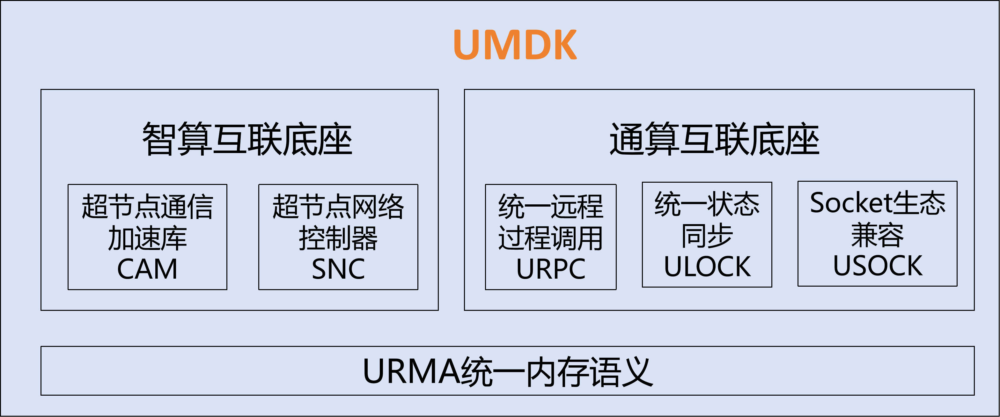

# UMDK
#### 一、UMDK介绍
灵衢内存语义开发包（UMDK）是一套以内存语义为核心的分布式通信软件库。
为数据中心网络、超节点内、服务器内的卡与卡之间提供高性能的通信接口，使能和释放灵衢总线的硬件能力。



#### 二、组件介绍
1. URMA：统一内存语义，提供了单边、双边、原子操作等远端内存操作方式，是应用之间通信的基础。提供两类接口，一是北向应用编程接口，为应用提供通信API，二是南向驱动编程接口，为驱动开发者提供接入UMDK的API。

2. CAM：超节点通信加速库，提供灵衢超节点亲和的高性能训推通信加速，北向可对接vllm/SGlang/VeRL等主流社区，南向亲和昇腾超节点硬件及组网

3. URPC：统一远程过程调用，支持灵衢原生高性能主机间和设备间RPC通信，以及RPC加速。

4. ULOCK：统一状态同步，支持灵衢原生高性能状态同步，包含分布式锁DLock等，加速数据库等分布式应用全局资源分配。

5. USOCK：UB通信生态构建，兼容标准Socket编程接口，使能TCP应用零修改提升网络通信性能。

#### 三、编译运行
1. 编译环境要求
- 编译环境：kernel 6.6
- 同时你需要安装以下依赖包：

```bash
  yum install -y rpm-build
  yum install -y make
  yum install -y cmake
  yum install -y gcc
  yum install -y gcc-c++
  yum install -y glibc-devel
  yum install -y openssl-devel
  yum install -y glib2-devel
  yum install -y libnl3-devel
  yum install -y kernel-devel  # ubcore is necessary from openEuler kernel
```

2. 编译指导
- 您可以通过以下方式构建和安装umdk rpm包：

```bash
  mkdir -p /root/rpmbuild/SOURCES/
  tar -czf /root/rpmbuild/SOURCES/umdk-26.06.0.tar.gz --exclude=.git `ls -A`
  rpmbuild -ba umdk.spec
```

- RPM 编译选项
```bash
  $ --with asan                              option, i.e. disable asan by default
  $ --with test                              option, i.e. disable test by default
  $ --with urma                              option, i.e. disable urma by default
  $ --with urpc                              option, i.e. disable urpc by default
  $ --with dlock                             option, i.e. disable dlock by default
  $ --with ums                               option, i.e. disable ums by default
  $ --define 'kernel_version 6.6.92'         option, specify kernel version
  $ --define 'rpm_release  0'                option, specify release version
```

3. 部署指导
- 运行时依赖请检查前置驱动已加载，如未加载请手动加载
```bash
cd /lib/modules/$(uname -r)/kernel/drivers
insmod ub/ubfi/ubfi.ko.xz  cluster=1       # 使用vf网卡时需要将cluster=1参数去除
insmod iommu/ummu-core/ummu-core.ko.xz
cd /lib/modules/$(uname -r)/kernel/drivers/ub/hisi-ub/kernelspace
insmod ummu/drivers/ummu.ko.xz ipver=609
insmod ubus/ubus.ko.xz ipver=609  cc_en=0  um_entry_size=1
insmod ubus/vendor/hisi/hisi_ubus.ko.xz msg_wait=2000 fe_msg=1 um_entry_size1=0 cfg_entry_offset=512
insmod ubase/ubase.ko.xz
insmod unic/unic.ko.xz tx_timeout_reset_bypass=1
insmod cdma/cdma.ko.xz

```
- 安装rpm包
```bash
rpm -ivh /root/rpmbuild/RPMS/*/umdk*.rpm
cp -f /usr/bin/urma_perftest /usr/local/bin/
modprobe ubcore
modprobe uburma
cd /lib/modules/$(uname -r)/kernel/drivers
insmod ub/hisi-ub/kernelspace/udma/udma.ko.xz dfx_switch=1 ipver=609 fast_destroy_tp=0 jfc_arm_mode=2
modprobe ubagg #如果需要使能多路径
modprobe ums # 如果需要使能ums
```
-  添加权限
```bash
#如果没有权限，需要手动添加权限
chmod -R 777 /usr/lib64/urma
chmod 777 /dev/ummu/tid
chmod 755 /usr/lib64/liburma*
```

4. 使用 Bazel 脚本编译、打包、安装和卸载 URMA（工作区根目录：`src/urma`）

在 UMDK 仓库根目录下，进入 `src/urma` 运行脚本。脚本会在编译前检查编译依赖，并在安装前检查运行依赖；已满足的依赖不会处理，缺失的依赖会通过 `yum install -y` 安装。因此请确认 yum 源可用，并在存在缺失依赖时使用具备安装权限的用户执行。

```bash
cd src/urma
# 典型 AArch64 Release 包构建，包含 UDMA 和 libummu。
./urma_bazel.sh compile --config=release --config=arm64 --define=build_udma=true
```

`compile` 命令会通过 Bazel 构建固定的 URMA 打包产物，生成与 RPM 安装效果对齐的 rootfs，写入 `metadata/urma_version`，并在 `src/urma` 下生成 `urma-bazel-<timestamp>.tar.gz`。打包完成后，脚本会清理中间产物，包括 `urma_version`、`bazel-urma-package` 和 Bazel 便捷软链接。

该流程不需要手动安装或链接系统中的 `libummu`。脚本会从 `src/urma/WORKSPACE` 或 `src/urma/bazel/urma_deps.bzl` 读取 `LIBUMMU_REMOTE`、`LIBUMMU_COMMIT`、`LIBUMMU_VERSION` 和 `LIBUMMU_ABI_VERSION`，将指定 commit 拉取到 `src/urma/third_party/libummu`，通过 Bazel 编译，并随 URMA 一起打入 tar 包。

如果环境上已经存在 `libummu`，当前逻辑如下：

- `compile` 不使用系统已安装的 `libummu`，始终使用 `src/urma/third_party/libummu` 中配置 commit 对应的源码。
- `install` 会安装 tar 包内置的 `libummu` 文件；如果 `/usr/lib64/libummu.so*` 等同路径文件或软链接已存在，会被包内产物替换。
- `remove` 不会卸载通过 yum 安装的三方依赖，也不会删除随包安装的 `libummu` 内容。

`compile` 后面的参数会继续传给 `bazel build`，因此仍可按需选择架构和诊断配置：

```bash
cd src/urma

# x86_64 Release 包构建。
./urma_bazel.sh compile --config=release --config=x86_64 --define=build_udma=true

# Debug + AddressSanitizer / LeakSanitizer。
./urma_bazel.sh compile --config=debug --config=asan --define=build_udma=true

# 开启 ThreadSanitizer，并启用周期性能统计。
./urma_bazel.sh compile --config=tsan --define=perf_cycle=true --define=build_udma=true
```

将生成的 tar 包复制到目标环境后，解压并使用包内脚本安装。`install` 和 `remove` 需要使用 **root** 或 **sudo** 执行；脚本会按 `metadata/install_manifest` 安装文件，刷新 `ldconfig`，在存在 `restorecon` 时恢复 SELinux 上下文，并在可用时重启 rsyslog。`remove` 命令只卸载 manifest 中的 URMA/UDMA/TPSA 自有安装内容，不会卸载通过 yum 安装的三方库，也会保留随包安装的 libummu 内容。

```bash
# 在目标环境执行。
mkdir -p /tmp/urma-bazel
tar -xzf urma-bazel-<timestamp>.tar.gz -C /tmp/urma-bazel
/tmp/urma-bazel/urma_bazel.sh install

# 后续卸载 URMA/UDMA/TPSA 打包安装内容。
/tmp/urma-bazel/urma_bazel.sh remove
```

也可以直接从归档文件执行安装或卸载：

```bash
cd src/urma
./urma_bazel.sh install urma-bazel-<timestamp>.tar.gz
./urma_bazel.sh remove urma-bazel-<timestamp>.tar.gz
```

#### 四、参与贡献

我们非常欢迎开发者提交贡献, 如果您发现了一个bug或者有一些想法想要交流，欢迎[发邮件到dev列表](https://openeuler.org/zh/community/mailing-list) 或者[提交一个issue](https://atomgit.com/openeuler/umdk/issues) 。

#### 五、许可

代码使用的许可证详见[LICENSES](./LICENSES/README)

doc目录下的文档使用许可证详见[LICENSE](./doc/LICENSE)
