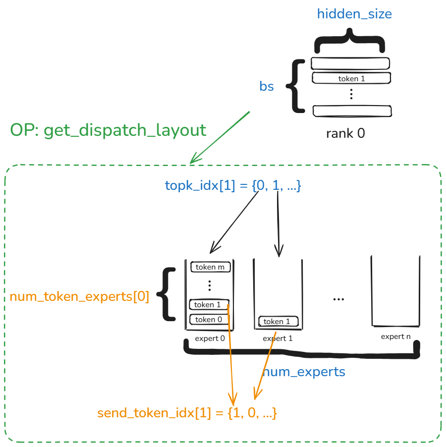
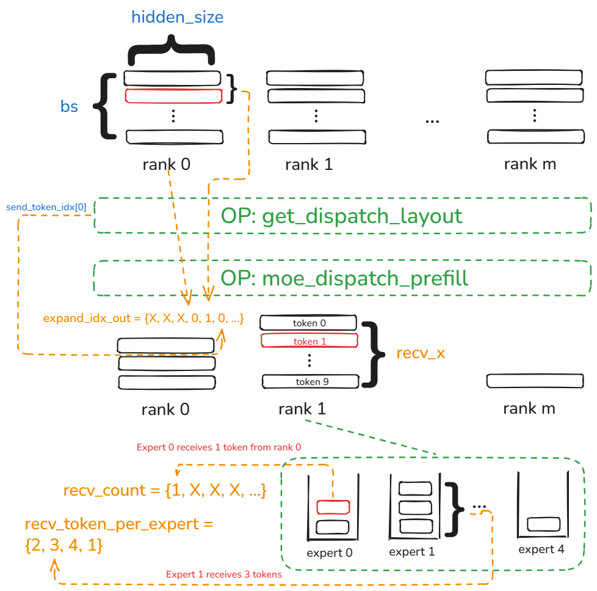
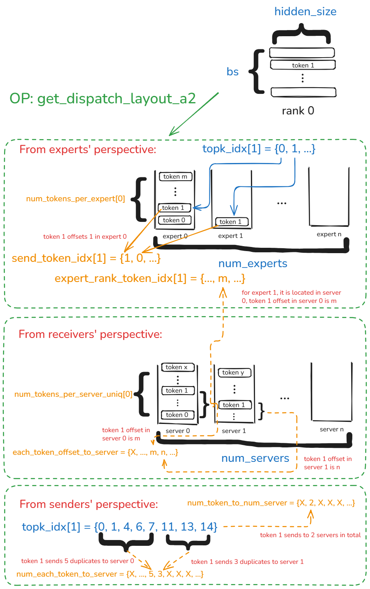

# CAM API指南
## CAM简介
CAM是Huawei昇腾NPU超节点通信加速器(Communication Accelerator for Maxtrix)的简称，提供EP（Expert Parallelism）通信加速库、PD（Prefill & Decode）分离场景高性能KVCache传输和KVC池化、AFD（Attention-FFN Disaggregation）通信加速库、RL(Reinforcement Learning)权重传输等特性。

## CAM架构
（To be done）

## CAM API
### 1. 高性能EP通信库
CAM在umdk_cam_op_lib库中提供高性能Python通信和通算融合接口供用户使用，用户可以方便的在主流昇腾推理框架（如vllm-ascend, sglang-kernel-npu等）导入该通信库并调用接口使用。
#### 1.1 Dispatch & Combine类接口
#### 1.1.1 moe_dispatch_shmem ▶
##### 1.1.1.1 接口原型 
```python
moe_dispatch_shmem(
    Tensor x, 
    Tensor expert_ids, 
    Tensor scales, 
    Tensor x_active_mask, 
    int ep_world_size, 
    int ep_rank_id, 
    int moe_expert_num, 
    int tp_world_size, 
    int tp_rank_id, 
    int expert_shard_type, 
    int shared_expert_num, 
    int shared_expert_rank_num, 
    int quant_mode, 
    int global_bs, 
    int expert_token_nums_type, 
    int ext_info)
-> output: List[Tensor]
```
##### 1.1.1.2 接口描述 
基于SHMEM类内存的Dispatch接口，用以在EP通信阶段将token分发至不同的专家以供后续的操作。该接口需配合moe_combine_shmem配套使用。
##### 1.1.1.3 入参 
| **📌参数** | **🔧类型** | **✅是否必选** | **📋取值说明** | **📝描述** |
|----------|----------|--------------|--------------|----------|
|x|Tensor|必选|形状:(batch_size, hidden_size)|输入Token|
|expert_ids|Tensor|必选|形状:(batch_size, top_k)|目的专家ID信息|
|scales|Tensor|可选|非空时为float类型，存在共享专家时形状:(m+1,h), 不存在共享专家时形状(m, h),其中m为共享专家数|量化参数|
|x_active_mask|Tensor|可选|暂不支持，传入None|--|
|ep_world_size|int|必选|只支持如下取值：[8, 16, 32, 64, 128, 144, 256, 288]|EP通信域内的rank数|
|ep_rank_id|int|必选|[0, ep_world_size-1]|EP通信域内rank ID号|
|moe_expert_num|int|必选|[1, 512]|MoE专家数|
|tp_world_size|int|必选|暂不支持，传入0|--|
|tp_rank_id|int|必选|暂不支持，传入0|--|
|expert_shard_type|int|必选|暂不支持，传入0|--|
|shared_expert_num|int|必选|不支持非1的值，传入1|共享专家数量|
|shared_expert_rank_num|int|必选|[0, ep_world_size-1]|共享专家卡号|
|quant_mode|int|必选|非量化传0，量化传2|量化模式|
|global_bs|int|必选|根据实际情况传入，由实际内存大小约束|EP通信域全局BS大小|
|expert_token_nums_type|int|必选|传入0：输出每个专家处理的token数量；传入1：输出每个专家处理的token前缀和。|输出expert_token_nums_out的数据格式|
|ext_info|int|必选|--|SHMEM初始化后返回的基地址指针|
##### 1.1.1.4 返回值 
函数返回值是一个由Tensor构成的List，依次存放：expand_x, dynamic_scales, expand_idx, expert_token_nums, ep_send_count, tp_send_count和expand_scales.
| **📌参数** | **🔧类型** | **📋取值说明** | **📝描述** |
|----------|----------|--------------|----------|
|expand_x|Tensor|当前rank是共享专家时，形状:(rank_size * batch_size / shared_expert_num, hidden_size);当前rank是路由专家时，形状：(expert_num_per_rank * rank_size * batch_size, hidden_size)|每个rank上所有专家的token|
|dynamic_scales|Tensor|形状同expand_x的第一维，即:当前rank是共享专家时，形状:(rank_size * batch_size / shared_expert_num);当前rank是路由专家时，形状：(expert_num_per_rank * rank_size * batch_size)|量化参数信息|
|expand_idx|Tensor|形状：(batch_size, top_k)|在目标专家内，仅排序当前rank的token时，当前rank发出的token各自的排序ID|
|expert_token_nums|Tensor|(expert_num_on_rank)|当前rank上每个专家收到的token数|
|ep_send_count|Tensor|形状：(expert_num_per_rank * ep_world_size)|每个专家从每个rank收到的token数|
|tp_send_count|Tensor|--|暂不支持，无意义|
|expand_scales|Tensor|--|暂不支持，无意义|
##### 1.1.1.5 约束和注意事项 ⚠️
1. 入参形状需严格满足上述入参描述中的形状定义。
2. 当量化模式开启时，expand_x的数据类型为int8类型，而不开启量化时其数据类型为bfloat16类型。
3. 当前接口不支持A2环境调用。
4. 当前接口不支持并发调用。
5. 当前接口在GE图模式下不支持动态图， 不支持fullgraph=true的选项。
6. 当前x入参的输入格式不支持bfloat16类型。
7. 当前不支持共享专家功能。
8. 用户应保证ext_info地址合法性。
9. 除满足上述形状约束外，其他参数取值要求：
 - top_k当前仅支持8
 - 需要满足：(moe_expert_num + shared_expert_rank_num) ≤ CAM_MAX_EXPERT_NUM, 当前最大专家数为512
 - 需要满足: moe_expert_num % (ep_world_size - shared_expert_rank_num) == 0
 - 需要满足：moe_expert_num / (ep_world_size - shared_expert_rank_num) ≤ MAX_EXPERT_PER_RANK, 当前该值设置为32
 - 需要满足： (ep_world_size + block_num -1) / block_num ≤ MULTI_RANK_SIZE
 - 需要满足： 如果shared_expert_rank_num不为0，则ep_world_size需要为其整数倍，切ep_world_size ≠ shared_expert_rank_num
 - 需要满足：(batch_size * hidden_size * ep_world_size * expert_num_per_rank * 2)小于ext_info指向的地址空间大小
#### 1.1.2 moe_combine_shmem ▶
##### 1.1.2.1 接口原型 
```python
moe_combine_shmem(
    Tensor expand_x, 
    Tensor expert_ids, 
    Tensor expand_idx, 
    Tensor ep_send_counts, 
    Tensor expert_scales, 
    Tensor tp_send_counts, 
    Tensor x_active_mask, 
    Tensor activation_scale, 
    Tensor weight_scale, 
    Tensor group_list, 
    Tensor expand_scales, 
    int ep_world_size, 
    int ep_rank_id, 
    int moe_expert_num, 
    int tp_world_size, 
    int tp_rank_id, 
    int expert_shard_type, 
    int shared_expert_num, 
    int shared_expert_rank_num, 
    int global_bs, 
    int comm_quant_mode, 
    int ext_info, 
    int out_dtype, 
    int group_list_type)
-> output: Tensor
```
##### 1.1.2.2 接口描述 
基于SHMEM类内存的Combine接口，用以在EP通信阶段将分发至不同的专家的token回合以供后续的操作。该接口需配合moe_dispatch_shmem配套使用。
##### 1.1.2.3 入参 
| **📌参数** | **🔧类型** | **✅是否必选** | **📋取值说明** | **📝描述** |
|----------|----------|--------------|--------------|----------|
|expand_x|Tensor|必选|形状同dispatch的出参expand_x|dispatch分发至各专家上的token|
|expert_ids|Tensor|必选|形状:(batch_size, top_k)|目的专家ID信息|
|expand_idx|Tensor|必选|形状:(batch_size, top_k)|在目标专家内，仅排序当前rank的token时，按照rank发出的token各自的排序ID|
|ep_send_counts|Tensor|必选|形状:(expert_num_per_rank * ep_world_size)|每个专家从每个rank收到的token数|
|expert_scales|Tensor|必选|形状：（batch_size, top_k）|合并token时需要的权重|
|tp_send_count|Tensor|可选|暂不支持，传入int32类型的tensor[0]即可|--|
|x_active_mask|Tensor|可选|暂不支持，传入None|--|
|activation_scale|Tensor|可选|暂不支持，传入None|--|
|weight_scale|Tensor|可选|暂不支持，传入None|--|
|group_list|Tensor|可选|暂不支持，传入None|--|
|expand_scales|Tensor|可选|暂不支持，传入None|--|
|ep_world_size|int|必选|只支持如下取值：[8, 16, 32, 64, 128, 144, 256, 288]|EP通信域内的rank数|
|ep_rank_id|int|必选|[0, ep_world_size-1]|EP通信域内rank ID号|
|moe_expert_num|int|必选|[1, 512]|MoE专家数|
|tp_world_size|int|必选|暂不支持，传入1|--|
|tp_rank_id|int|必选|暂不支持，传入0|--|
|expert_shard_type|int|必选|暂不支持，传入0|--|
|shared_expert_num|int|必选|不支持非1的值，传入1|共享专家数量|
|shared_expert_rank_num|int|必选|[0, ep_world_size-1]|共享专家卡号|
|global_bs|int|必选|根据实际情况传入，由实际内存大小约束|EP通信域全局BS大小|
|out_dtype|int|必选|暂不支持，传入0|--|
|comm_quant_mode|int|必选|非量化传0，量化传2|量化模式|
|group_list_type|int|必选|暂不支持，传入0|--|
|ext_info|int|必选|--|SHMEM初始化后返回的基地址指针|
##### 1.1.2.4 返回值 
函数返回值是一个Tensor，存放expand_x信息。
| **📌参数** | **🔧类型** | **📋取值说明** | **📝描述** |
|----------|----------|--------------|----------|
|expand_x|Tensor|形状:(batch_size, hidden_size)|合并后的token信息|
##### 1.1.2.5 约束和注意事项 ⚠️
1. 入参形状需严格满足上述入参描述中的形状定义。
2. 当前接口不支持A2环境调用。
3. 当前接口不支持并发调用。
4. 当前接口在GE图模式下不支持动态图， 不支持fullgraph=true的选项。
5. 当前不支持共享专家功能。
6. 用户应保证ext_info地址合法性。
7. 除满足上述形状约束外，其他参数取值要求：
 - top_k当前仅支持8
 - 需要满足：(moe_expert_num + shared_expert_rank_num) ≤ CAM_MAX_EXPERT_NUM, 当前最大专家数为512
 - 需要满足: moe_expert_num % (ep_world_size - shared_expert_rank_num) == 0
 - 需要满足：moe_expert_num / (ep_world_size - shared_expert_rank_num) ≤ MAX_EXPERT_PER_RANK, 当前该值设置为32
 - 需要满足： (ep_world_size + block_num -1) / block_num ≤ MULTI_RANK_SIZE, 
 - 需要满足： 如果shared_expert_rank_num不为0，则ep_world_size需要为其整数倍，切ep_world_size ≠ shared_expert_rank_num
 - 需要满足：(batch_size * hidden_size * ep_world_size * expert_num_per_rank * 2)小于ext_info指向的地址空间大小

 #### 1.1.3 get_dispatch_layout ▶
##### 1.1.3.1 接口原型 
```python
get_dispatch_layout(
    Tensor topk_idx, 
    int num_experts, 
    int num_ranks)
-> output: tuple(Tensor, Tensor)
```
##### 1.1.3.2 接口描述 

A3代际Prefill阶段Dispatch使用的前置接口，用以在当前rank将Token拓展TopK份之后按照专家粒度重排，方便后续的分发操作。该接口需配合moe_dispatch_prefill和moe_combine_prefill使用。
##### 1.1.3.3 入参 
| **📌参数** | **🔧类型** | **✅是否必选** | **📋取值说明** | **📝描述** |
|----------|----------|--------------|--------------|----------|
|topk_idx|Tensor|必选|形状:(batch_size, topk)， int64类型|目标专家的ID信息|
|num_experts|int|必选|取值范围：(0, 512]|MOE专家数|
|num_ranks|int|必选|取值范围：[1, 384]|EP通信域rank数|
##### 1.1.3.4 返回值 
函数返回值是一个2个Tensor构成的Tuple，分别存放：number_tokens_per_expert和send_token_idx.
| **📌参数** | **🔧类型** | **📋取值说明** | **📝描述** |
|----------|----------|--------------|----------|
|number_tokens_per_expert|Tensor|形状：（num_experts）|当前rank上发送给每个专家的token个数|
|send_token_idx|Tensor|形状：(batch_size, top_k)|当前rank上，发送给每个专家的token在以专家重排分桶后，其在桶里的第几个位置|
##### 1.1.3.5 约束和注意事项 ⚠️
1. 入参形状需严格满足上述入参描述中的形状定义。
2. 当前接口只支持A3环境调用。
4. 当前接口不支持并发调用。
5. 当前接口不支持入图使用。
6. 除满足上述形状约束外，其他参数取值要求：
 - top_k取值范围：(0， 16]
 - batch_size取值范围：(0, 8000]
 - 需要满足: num_experts % num_ranks == 0
 - 需要满足：num_experts >= num_ranks

 #### 1.1.4 moe_dispatch_prefill ▶
##### 1.1.4.1 接口原型 
```python
moe_dispatch_prefill(
    Tensor x, 
    Tensor topk_idx, 
    Tensor topk_weights, 
    Tensor num_tokens_per_expert, 
    Tensor send_token_idx_small, 
    str group_ep, 
    int rank, 
    int num_ranks, 
    bool use_quant) 
-> output: tuple(Tensor, Tensor, Tensor, Tensor, Tensor)
```
##### 1.1.4.2 接口描述 

A3代际Prefill阶段Dispatch接口，将Token按照topk_idx的规则发送给对应专家。
##### 1.1.4.3 入参 
| **📌参数** | **🔧类型** | **✅是否必选** | **📋取值说明** | **📝描述** |
|----------|----------|--------------|--------------|----------|
|x|Tensor|必选|形状:(batch_size, hidden_size), 支持bf16, float16类型|本卡发送的token|
|topk_idx|Tensor|必选|形状:(batch_size, topk)， 数据类型为int64|每个token的目标专家ID信息|
|topk_weights|Tensor|必选|形状:(batch_size, topk)， 数据类型为float32|每个token的topk个目标专家的权重信息|
|number_tokens_per_expert|Tensor|必选|形状：（num_experts），数据类型为int|当前rank上发送给每个专家的token个数|
|send_token_idx_small|Tensor|必选|形状：(batch_size, top_k), 数据类型为int|当前rank上，发送给每个专家的token在以专家重排分桶后，其在桶里的第几个位置|
|group_ep|str|必选|--|HCCL通信域名称|
|rank|int|必选|[0, num_ranks)|本卡在通信域中的rankID|
|num_ranks|int|必选|[2, 384]|EP通信域rank数|
|use_quant|bool|必选|True: 开启量化； False: 关闭量化|Dispatch量化指示符|
##### 1.1.4.4 返回值 
函数返回值是一个5个Tensor构成的Tuple，分别存放：recv_x, dynamic_scales_out, expand_idx_out, recv_count, recv_token_per_expert.
| **📌参数** | **🔧类型** | **📋取值说明** | **📝描述** |
|----------|----------|--------------|----------|
|recv_x|Tensor|形状：(recv_token_num, hidden_size), 其中recv_token_num为本卡收到的token个数。当use_quant为true时，数据类型为int8, false时数据类型与入参x一致|当前rank上收到的token信息|
|dynamic_scales_out|Tensor|形状：(recv_token_num), 数据类型为float.当use_quant为false时该值没有意义。|当前rank上收到token的动态量化scale信息|
|expand_idx_out|Tensor|形状：(recv_token_num * 3), 数据类型为int|本卡收到的token信息三元组，每组三个数的含义依次为：token的源rank, token在源rank的序号（BS视角），token在源rank时topk专家扩展重排后的序号（专家视角）|
|recv_count|Tensor|形状：(num_experts), 数据类型为int|当前rank上每个专家从每个rank收到的收到token数，为前缀和|
|recv_tokens_per_expert|Tensor|形状：(local_expert_num), 数据类型为int64|当前rank上每个专家收到的token信息|
##### 1.1.4.5 约束和注意事项 ⚠️
1. 入参形状需严格满足上述入参描述中的形状定义。
2. 当前接口只支持A3环境调用。
3. 当前接口不支持并发调用。
4. 当前接口不支持入图使用。
5. 除满足上述形状约束外，其他参数取值要求：
 - 需要满足：BS取值范围[1, 8K]
 - 需要满足: num_ranks取值范围[2, 384]
 - 需要满足: num_experts取值范围(0, 512]
 - 需要满足: topk取值范围(0, 16]
 - 需要满足: (num_experts % num_ranks) == 0
 - 需要满足: 配置全局宏HCCL_BUFFERSIZE=4096
 - 需要满足：num_experts >= num_ranks

 #### 1.1.5 moe_combine_prefill ▶
##### 1.1.5.1 接口原型 
```python
moe_combine_prefill(
    Tensor x, 
    Tensor topk_idx, 
    Tensor topk_weights, 
    Tensor src_idx, 
    Tensor send_head,
    str group_ep, 
    int rank, 
    int num_ranks) 
-> output: Tensor
```
##### 1.1.5.2 接口描述 

A3代际Prefill阶段Combine接口，将按照topk_idx的规则发送给对应专家的token，按照topk_weights指定的权重收回。
##### 1.1.5.3 入参 
| **📌参数** | **🔧类型** | **✅是否必选** | **📋取值说明** | **📝描述** |
|----------|----------|--------------|--------------|----------|
|x|Tensor|必选|形状:(recv_token_num, hidden_size), 支持bf16, float16类型|本卡dispatch阶段收集到的token|
|topk_idx|Tensor|必选|形状:(batch_size, topk)， 数据类型为int64|每个token的目标专家ID信息|
|topk_weights|Tensor|必选|形状:(batch_size, topk)， 数据类型为float32|每个token的topk个目标专家的权重信息|
|src_idx|Tensor|形状：(recv_token_num * 3), 数据类型为int|本卡收到的token信息三元组，每组三个数的含义依次为：token的源rank, token在源rank的序号（BS视角），token在源rank时topk专家扩展重排后的序号（专家视角）。对应moe_dispatch_prefill的出参expand_idx_out|
|send_head|Tensor|形状：(num_experts), 数据类型为int|当前rank上每个专家从每个rank收到的收到token的动态量化scale信息，该信息按照一维排开。对应moe_dispatch_prefill的出参recv_count|
|group_ep|str|必选|--|HCCL通信域名称|
|rank|int|必选|[0, num_ranks)|本卡在通信域中的rankID|
|num_ranks|int|必选|[2, 384]|EP通信域rank数|
##### 1.1.5.4 返回值 
函数返回值是一个Tensor，存放combine_x信息。
| **📌参数** | **🔧类型** | **📋取值说明** | **📝描述** |
|----------|----------|--------------|----------|
|combine_x|Tensor|形状：(batch_size, hidden_size)。数据类型与x一致|当前rank上收到的token信息|
##### 1.1.5.5 约束和注意事项 ⚠️
1. 入参形状需严格满足上述入参描述中的形状定义。
2. 当前接口只支持A3环境调用。
3. 当前接口不支持并发调用。
4. 当前接口不支持入图使用。
5. 除满足上述形状约束外，其他参数取值要求：
 - 需要满足：BS取值范围[1, 8K]
 - 需要满足: num_ranks取值范围[2, 384]
 - 需要满足: num_experts取值范围(0, 512]
 - 需要满足: topk取值范围(0, 16]
 - 需要满足: (num_experts % num_ranks) == 0
 - 需要满足: 配置全局宏HCCL_BUFFERSIZE=4096
 - 需要满足：num_experts >= num_ranks
6. combine_x精度校验标准
 - 非量化场景下平均相对误差为千分之五
 - 量化场景下平均相对误差为百分之一

 #### 1.1.6 get_dispatch_layout_a2 ▶
##### 1.1.6.1 接口原型 
```python
get_dispatch_layout_a2(
    Tensor topk_idx, 
    int num_experts, 
    int num_ranks)
-> output: tuple(Tensor, Tensor)
```
##### 1.1.6.2 接口描述 

A2代际Prefill阶段Dispatch使用的前置接口，用以在当前rank将Token拓展TopK份(存在共享专家时，此处为(topK+1)份)之后按照专家粒度重排，方便后续的分发操作。该接口需配合moe_dispatch_prefill_a2和moe_combine_prefill_a2使用。
##### 1.1.6.3 入参 
| **📌参数** | **🔧类型** | **✅是否必选** | **📋取值说明** | **📝描述** |
|----------|----------|--------------|--------------|----------|
|topk_idx|Tensor|必选|形状:(batch_size, topk)， int64类型，取值范围：[0, num_experts)|目标专家的ID信息|
|num_experts|int|必选|取值范围：(0, 256]|MOE专家数|
|num_ranks|int|必选|当前仅支持16|EP通信域rank数|
##### 1.1.6.4 返回值 
函数返回值是一个2个Tensor构成的Tuple，分别存放：number_tokens_per_expert和notify_send_data.
| **📌参数** | **🔧类型** | **📋取值说明** | **📝描述** |
|----------|----------|--------------|----------|
|number_tokens_per_expert|Tensor|形状：（num_experts）,int类型|当前rank上发送给每个专家的token个数|
|notify_send_data|Tensor|形状：(num_experts * EXPERT_DATA_SIZE + server_num + max_bs * (1 + 2* server_num + num_experts)), 数据类型为int。当前EXPERT_DATA_SIZE=4097，max_bs=4096。七个部分的形状信息：<br> 1. num_tokens_per_expert, 形状：（num_experts）；<br> 2. num_token_per_server_uniq, 形状：（num_experts）；<br> 3. num_each_token_to_server, 形状：（max_bs * num_server）;<br> 4. each_token_to_num_server, 形状：（max_bs）;<br> 5. each_token_offset_to_server, 形状：（max_bs * num_server）；<br> 6. send_token_idx, 形状：（max_bs * num_experts）；<br> 7. expert_rank_token_idx, 形状：（num_experts， max_bs）；<br> |由七个部分组成的tensor,分别表示<br> 1. 每个expert从本卡收到的token数目；<br> 2. 每个server从本卡接收到的token数目（去重）；<br> 3. 本卡每个token发往每个server的个数；<br> 4. 本卡每个token发往的server个数；<br> 5. 本卡每个token发往每个server,token的顺序偏移。<br> 6. 本卡每个token按照专家维度分桶，在桶中的序号偏移。<br> 7. 每个专家收到的每个token，其对应的each_token_offset_to_server值|
##### 1.1.6.5 约束和注意事项 ⚠️
1. 入参形状需严格满足上述入参描述中的形状定义。
2. 当前接口只支持A2环境调用。
3. 当前接口不支持并发调用。
4. 当前接口不支持入图使用。
5. 当前接口不支持共享专家。
6. 除满足上述形状约束外，其他参数取值要求：
 - top_k取值范围：(2， 16]
 - 需要满足: num_experts % num_ranks == 0
 - 需要满足: num_ranks % 8 == 0
 - 需要配置：export HCCL_INTRA_PCIE_ENABLE = 1, export HCCL_INTRA_ROCE_ENABLE = 0

 #### 1.1.7 moe_dispatch_prefill_a2 ▶
##### 1.1.7.1 接口原型 
```python
moe_dispatch_prefill_a2(
    Tensor x, 
    Tensor topk_idx, 
    Tensor topk_weights, 
    Tensor num_tokens_per_expert,
 	Tensor notify_send_data, 
    str group_ep, 
    int rank, 
    int num_ranks, 
    bool use_quant) 
-> output: Tensor[]
```
##### 1.1.7.2 接口描述 

A2代际Prefill阶段Dispatch接口，将Token按照topk_idx的规则发送给对应专家。
##### 1.1.7.3 入参 
| **📌参数** | **🔧类型** | **✅是否必选** | **📋取值说明** | **📝描述** |
|----------|----------|--------------|--------------|----------|
|x|Tensor|必选|形状:(batch_size, hidden_size), 支持bf16, float16类型|本卡发送的token|
|topk_idx|Tensor|必选|形状:(batch_size, topk)， 数据类型为int64，取值范围[0, num_experts)|每个token的目标专家ID信息|
|topk_weights|Tensor|必选|形状:(batch_size, topk)， 数据类型为float32|每个token的topk个目标专家的权重信息|
|number_tokens_per_expert|Tensor|必选|形状：（num_experts），数据类型为int|当前rank上发送给每个专家的token个数|
|notify_send_data|Tensor|必选|形状：(num_experts * EXPERT_DATA_SIZE + server_num + max_bs * (1 + 2* server_num + num_experts)), 数据类型为int|get_dispatch_layout_a2的输出，含义参考该部分的描述|
|group_ep|str|必选|--|HCCL通信域名称|
|rank|int|必选|[0, num_ranks)|本卡在通信域中的rankID|
|num_ranks|int|必选|当前只支持16|EP通信域rank数|
|use_quant|bool|必选|False: 不开启量化, 当前版本暂不支持量化|Dispatch量化指示符|
##### 1.1.7.4 返回值 
函数返回值是一个8个Tensor构成的List，分别存放：recv_x, dynamic_scales_out, expand_idx_out, ep_rank_token_cnt, offset_inner, offset_outer, count_outer, expand_scales.
| **📌参数** | **🔧类型** | **📋取值说明** | **📝描述** |
|----------|----------|--------------|----------|
|recv_x|Tensor|形状：(recv_token_num, hidden_size), 其中recv_token_num为本卡收到的token个数。当use_quant为true时，数据类型为int8, false时数据类型与入参x一致。|当前rank上收到的token信息|
|dynamic_scales_out|Tensor|形状：(recv_token_num), 数据类型为float.当use_quant为false时该值没有意义。|当前rank上收到token的动态量化scale信息|
|expand_idx_out|Tensor|形状：(maxbs, num_experts), 数据类型为int|本卡发出的token在同一专家内的序号|
|ep_rank_token_cnt|Tensor|形状：(num_experts, num_ranks), 数据类型为int|每个专家从不同rank接收的token数量|
|offset_inner|Tensor|形状：(2, max_bs, num_experts), 数据类型为int|token给对应专家的偏移，仅存放当前卡对端server的同号卡信息|
|offset_outer|Tensor|形状：(max_bs, num_experts), 数据类型为int|token发送给对应server的token序号|
|count_outer|Tensor|形状：(max_bs), 数据类型为int|token发送到server的数量|
|expand_scales|Tensor|形状：(num_recv_tokens), 数据类型为float|接收token时对应到topk_weights中的权重|
##### 1.1.7.5 约束和注意事项 ⚠️
1. 入参形状需严格满足上述入参描述中的形状定义。
2. 当前接口只支持A2环境调用。
3. 当前接口不支持并发调用。
4. 当前接口不支持入图使用。
5. 当前接口不支持共享专家。
6. 除满足上述形状约束外，其他参数取值要求：
 - 需要满足：BS取值范围[1, 4K]
 - 需要满足: num_experts取值范围(0, 256]
 - 需要满足: topk取值范围(2, 16]
 - 需要满足: (num_experts % num_ranks) == 0
 - 需要满足: (num_ranks % 8) == 0
 - 需要满足: hidden_size取值范围(0， 7168]且(hidden_size % 32) == 0
 - 需要满足: 配置全局宏HCCL_BUFFERSIZE=4096
 - 需要配置：export HCCL_INTRA_PCIE_ENABLE = 1, export HCCL_INTRA_ROCE_ENABLE = 0

 #### 1.1.8 moe_combine_prefill_a2 ▶
##### 1.1.8.1 接口原型 
```python
moe_combine_prefill_a2(
    Tensor x, 
    Tensor topk_idx, 
    Tensor topk_weights, 
    Tensor src_idx, 
    Tensor send_head, 
    Tensor expand_scales, 
    Tensor offset_inner, 
    Tensor offset_outer, 
    Tensor count_outer, 
    str group_ep, 
    int rank, 
    int num_ranks)
-> output: Tensor
```
##### 1.1.8.2 接口描述 

A2代际Prefill阶段Combine接口，将按照topk_idx的规则发送给对应专家的token，按照topk_weights指定的权重收回。
##### 1.1.8.3 入参 
| **📌参数** | **🔧类型** | **✅是否必选** | **📋取值说明** | **📝描述** |
|----------|----------|--------------|--------------|----------|
|x|Tensor|必选|形状:(recv_token_num, hidden_size), 支持bf16, float16类型|本卡dispatch阶段收集到的token|
|topk_idx|Tensor|必选|形状:(batch_size, topk)， 数据类型为int64, 取值范围[0, num_experts)|每个token的目标专家ID信息|
|topk_weights|Tensor|必选|形状:(batch_size, topk)， 数据类型为float32|每个token的topk个目标专家的权重信息|
|src_idx|Tensor|必选|形状：(max_bs, num_experts), 数据类型为int|对应moe_dispatch_prefill_a2的出参expand_idx_out|
|send_head|Tensor|必选|形状：(num_experts), 数据类型为int|对应moe_dispatch_prefill_a2的出参ep_rank_token_cnt|
|expand_scales|Tensor|必选|形状：(num_recv_tokens), 数据类型为float|对应moe_dispatch_prefill_a2的出参expand_scales|
|offset_inner|Tensor|必选|形状：(2, max_bs, num_experts), 数据类型为int|对应moe_dispatch_prefill_a2的出参offset_inner|
|offset_outer|Tensor|必选|形状：(max_bs, num_experts), 数据类型为int|对应moe_dispatch_prefill_a2的出参offset_outer|
|count_outer|Tensor|形状：(max_bs), 数据类型为int|对应moe_dispatch_prefill_a2的出参count_outer|
|group_ep|str|必选|--|HCCL通信域名称|
|rank|int|必选|[0, num_ranks)|本卡在通信域中的rankID|
|num_ranks|int|必选|当前只支持16|EP通信域rank数|
##### 1.1.8.4 返回值 
函数返回值是一个Tensor，存放combine_x信息。
| **📌参数** | **🔧类型** | **📋取值说明** | **📝描述** |
|----------|----------|--------------|----------|
|combine_x|Tensor|形状：(batch_size, hidden_size)。数据类型与x一致|当前rank上收到的token信息。|
##### 1.1.8.5 约束和注意事项 ⚠️
1. 入参形状需严格满足上述入参描述中的形状定义。
2. 当前接口只支持A2环境调用。
3. 当前接口不支持并发调用。
4. 当前接口不支持入图使用。
5. 当前接口不支持共享专家。
6. 除满足上述形状约束外，其他参数取值要求：
 - 需要满足：BS取值范围[1, 4K]
 - 需要满足: num_experts取值范围(0, 256]
 - 需要满足: topk取值范围[2, 16]
 - 需要满足: (num_experts % num_ranks) == 0
 - 需要满足: hidden_size取值范围(0， 7168]且(hidden_size % 32) == 0
 - 需要满足: 配置全局宏HCCL_BUFFERSIZE=4096
 - 需要配置：export HCCL_INTRA_PCIE_ENABLE = 1, export HCCL_INTRA_ROCE_ENABLE = 0

 #### 1.1.9 fused_deep_moe ▶
##### 1.1.9.1 接口原型 
```python
fused_deep_moe(
    Tensor x, 
    Tensor expert_ids, 
    Tensor[] gmm1_weight, 
    Tensor[] gmm1_weight_scale, 
    Tensor[] gmm2_weight, 
    Tensor[] gmm2_weight_scale, 
    Tensor expert_scales, 
    Tensor? expert_smooth_scales, \
    Tensor? x_active_mask, 
    str group_ep, 
    int ep_rank_size, 
    int ep_rank_id, 
    int moe_expert_num, 
    int shared_expert_num, 
    int shared_expert_rank_num, 
    int quant_mode, 
    int global_bs) 
-> output: Tensor[]
```
##### 1.1.9.2 接口描述 
用于MoE Decode阶段的通算大融合算子，通过融合[Dispatch + FFN(GMM1 + Swiglu + GMM2) + Combine]实现高效的模型推理和专家选择，适用于分布式训练和推理场景。
##### 1.1.9.3 入参 
| **📌参数** | **🔧类型** | **✅是否必选** | **📋取值说明** | **📝描述** |
|----------|----------|--------------|--------------|----------|
|x|Tensor|必选|形状:(batch_size, token_length), 支持bf16, float16类型|本卡dispatch阶段待处理的token|
|expert_ids|Tensor|必选|形状:(batch_size, topk)， 数据类型为int32, 取值范围[-1, num_experts)，-1用于占位使用，一个token不允许重复发给同一个专家|每个token的目标专家ID信息|
|gmm1_weight|Tensor[]|必选|耦合模式下，只有一个Tensor, 形状:(localExpertNum, token_length, gmm1_hidden_size); 分离模式下，包含localExpertNum个Tensor, 每个Tensor形状：（token_length, gmm1_hidden_size），数据类型为int8|GMM1的权重矩阵列表，支持耦合模式和分离模式|
|gmm1_weight_scale|Tensor[]|必选|耦合模式下，只有一个Tensor, 形状:(localExpertNum, gmm1_hidden_size); 分离模式下，包含localExpertNum个Tensor, 每个Tensor形状：（gmm1_hidden_size），数据类型为float32|GMM1的权重矩阵量化时使用的缩放系数列表，支持耦合模式和分离模式|
|gmm2_weight|Tensor[]|必选|耦合模式下，只有一个Tensor, 形状:(localExpertNum, gmm1_hidden_size/2, token_length); 分离模式下，包含localExpertNum个Tensor, 每个Tensor形状：（gmm1_hidden_size/2, token_length），数据类型为int8|GMM2的权重矩阵列表，支持耦合模式和分离模式|
|gmm2_weight_scale|Tensor[]|必选|耦合模式下，只有一个Tensor, 形状:(localExpertNum, token_length); 分离模式下，包含localExpertNum个Tensor, 每个Tensor形状：（token_length），数据类型为float32|GMM2的权重矩阵量化时使用的缩放系数列表，支持耦合模式和分离模式|
|expert_scales|Tensor|必选|形状：(batch_size, topk), 数据类型为float32|每个专家的权重，combine阶段使用|
|expert_smooth_scales|Tensor|可选|--|预留参数，暂不参与计算|
|x_active_mask|Tensor|可选|形状： (batch_size)，数据类型bool，取值范围[true, false]，true值一定要在false之前|预留参数，传入None|
|group_ep|str|必选|字符串长度范围：(0, 128), 且需要保证是有效的通信域名称|HCCL通信域名称|
|ep_rank_size|int|必选|需要满足：(ep_rank_size * MoeExpertNumPerRank) ≤ 512且ep_rank_size > 0|EP通信域大小|
|ep_rank_id|int|必选|[0, ep_rank_size)|本卡在通信域中的rankID|
|moe_expert_num|int|必选|需要满足：(ep_rank_size - shared_expert_rank_num) % moe_expert_num == 0|MOE专家数量|
|shared_expert_num|int|必选|当前仅支持传1|共享专家数量|
|shared_expert_rank_num|int|必选|需要满足：(ep_rank_size - shared_expert_rank_num) % moe_expert_num == 0且shared_expert_rank_num < ep_rank_size|共享专家卡数量|
|quant_mode|int|必选|预留入参，当前只支持传0|量化模式|
|global_bs|int|必选|若所有卡的token数量一致，可以传入0或者batch_size * ep_rank_size; 若所有卡的token数量不一致，需要传入max_batch_size * ep_rank_size|所有卡的最大token总数|
##### 1.1.9.4 返回值 
函数返回值是一个Tensor列表，存放combine_x和expert_token_nums信息。
| **📌参数** | **🔧类型** | **📋取值说明** | **📝描述** |
|----------|----------|--------------|----------|
|combine_x|Tensor|形状：(batch_size, token_length)。数据类型与x一致|当前rank上token经各个专家处理后汇聚的结果|
|expert_token_nums|Tensor|形状：(local_expert_num)。数据类型为int64|本卡各个专家收到的token数量|
##### 1.1.9.5 约束和注意事项 ⚠️
1. 入参形状需严格满足上述入参描述中的形状定义。
2. 当前接口只支持A3环境调用。
3. 当前接口不支持并发调用。极端情况下在单次forward中连续调用相同算子会产生未定义行为，这种场景需要在算子执行间添加torch.npu.synchronize()避免潜在的异步时序问题。
4. 当前接口图模式只支持AclGraph模式。
5. 当前接口不支持共享专家。
6. Batch_size小于16时非目标场景，其性能相对于小算子拼接可能劣化，建议性能对比后决策使用。
7. 除满足上述形状约束外，其他参数取值要求：
 - 需要满足：BS取值范围[0, 256]
 - 需要满足: token_length取值范围[1024， 7168]且(token_length % 256) == 0
 - 需要满足: gmm1_hiden_size取值范围[1024， 6144]且(gmm1_hiden_size % 256) == 0
 - 需要满足: topk取值范围[0, 12]且应保证小于等于专家数
 - 需要满足：global_bs ≥ 0 且保证（global_bs % ep_rank_size） == 0
 - 需要满足: 路由专家卡需满足local_expert_num ≤ (aivnum / 2)，其中aivnum为硬件aiv核心数
 - 需要满足: gmm1_weight, gmm1_weight_scale, gmm2_weight, gmm2_weight_scale四个入参的模式必须统一，不能一部分耦合模式一部分分离模式
 - 需要满足: HCCL_BUFFERSIZE环境变量配置应不小于[(ep_rank_size * max_batch_size * moe_expert_num_per_rank * total_length * sizeof(x) * 2) / 1024 / 1024]向上取整