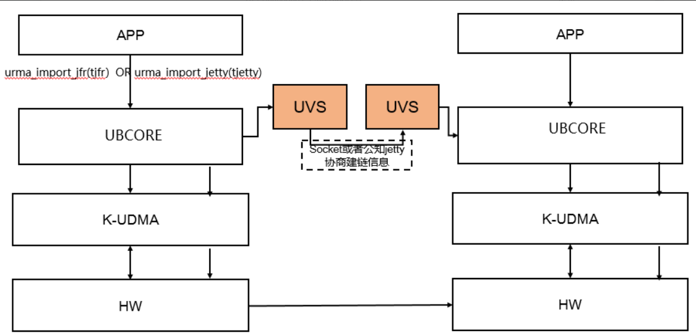
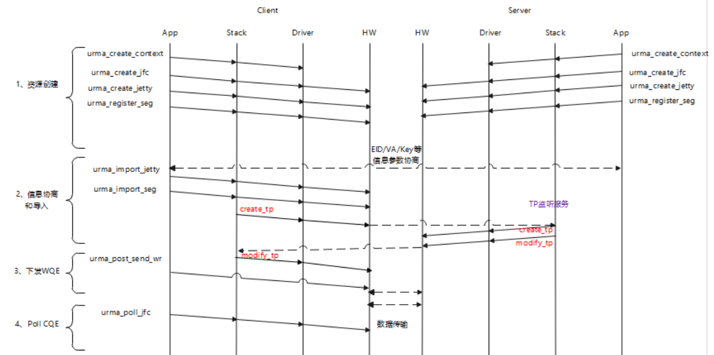

# 修订记录

1.  修订记录表

| 修订时间 | 修订章节 | 修订内容简介 | 修复问题单连接或问题背景 | 修订人员 |
| --- | --- | --- | --- | --- |
| 2026.2.12 | ALL | 文档基线 | | @qianguoxin、@jerry_lilijun、@wuyuyan_98、@pinchen2025、@autoreconf、@heyu_1014、@wdmmsyf |

---

# 目 录

- [修订记录](#修订记录)

- [1 使用约束与限制](#1-使用约束与限制)
    - [1.1 版本配套约束](#11-版本配套约束)

- [2 URMA用户态API](#2-urma用户态api)
    - [2.1 编程示例](#21-编程示例)
        - [2.1.1 管理面](#211-管理面)
        - [2.1.2 控制面](#212-控制面)
        - [2.1.3 数据面](#213-数据面)
            - [2.1.3.1 单边read/write](#2131-单边readwrite)
            - [2.1.3.2 双边send/recv](#2132-双边sendrecv)
        - [2.1.4 开源示例](#214-开源示例)
    - [2.2 管理面](#22-管理面)
        - [2.2.1 初始化](#221-初始化)
            - [2.2.1.1 urma_init](#2211-urma_init)
                - [2.2.1.1.1 urma_init_attr_t](#22111-urma_init_attr_t)
                - [2.2.1.1.2 urma_status_t](#22112-urma_status_t)
            - [2.2.1.2 urma_uninit](#2212-urma_uninit)
        - [2.2.2 设备及上下文](#222-设备及上下文)
            - [2.2.2.1 device](#2221-device)
                - [2.2.2.1.1 urma_get_device_list](#22211-urma_get_device_list)
                - [2.2.2.1.2 urma_free_device_list](#22212-urma_free_device_list)
                - [2.2.2.1.3 urma_get_device_by_name](#22213-urma_get_device_by_name)
                - [2.2.2.1.4 urma_get_device_by_eid](#22214-urma_get_device_by_eid)
                - [2.2.2.1.5 urma_query_device](#22215-urma_query_device)
            - [2.2.2.2 eid](#2222-eid)
                - [2.2.2.2.1 urma_get_eid_list](#22221-urma_get_eid_list)
                - [2.2.2.2.2 urma_free_eid_list](#22222-urma_free_eid_list)
            - [2.2.2.3 uasid](#2223-uasid)
                - [2.2.2.3.1 urma_get_uasid](#22231-urma_get_uasid)
            - [2.2.2.4 context](#2224-context)
                - [2.2.2.4.1 urma_create_context](#22241-urma_create_context)
                - [2.2.2.4.2 urma_delete_context](#22242-urma_delete_context)
                - [2.2.2.4.3 urma_set_context_opt](#22243-urma_set_context_opt)
            - [2.2.2.5 net addr](#2225-net-addr)
                - [2.2.2.5.1 urma_get_net_addr_list](#22251-urma_get_net_addr_list)
                - [2.2.2.5.2 urma_free_net_addr_list](#22252-urma_free_net_addr_list)
        - [2.2.3 安全](#223-安全)
            - [2.2.3.1 urma_alloc_token_id](#2231-urma_alloc_token_id)
                - [2.2.3.1.1 urma_token_id_t](#22311-urma_token_id_t)
                - [2.2.3.1.2 urma_token_id_flag_t](#22312-urma_token_id_flag_t)
            - [2.2.3.2 urma_alloc_token_id_ex](#2232-urma_alloc_token_id_ex)
            - [2.2.3.3 urma_free_token_id](#2233-urma_free_token_id)
    - [2.3 控制面](#23-控制面)
        - [2.3.1 Jetty相关](#231-jetty相关)
            - [2.3.1.1 JFC](#2311-jfc)
                - [2.3.1.1.1 urma_create_jfc](#23111-urma_create_jfc)
                - [2.3.1.1.2 urma_modify_jfc](#23112-urma_modify_jfc)
                - [2.3.1.1.3 urma_delete_jfc](#23113-urma_delete_jfc)
                - [2.3.1.1.4 urma_delete_jfc_batch](#23114-urma_delete_jfc_batch)
            - [2.3.1.2 JFCE](#2312-jfce)
                - [2.3.1.2.1 urma_create_jfce](#23121-urma_create_jfce)
                - [2.3.1.2.2 urma_delete_jfce](#23122-urma_delete_jfce)
            - [2.3.1.3 JFAE](#2313-jfae)
                - [2.3.1.3.1 urma_get_async_event](#23131-urma_get_async_event)
                - [2.3.1.3.2 urma_ack_async_event](#23132-urma_ack_async_event)
            - [2.3.1.4 JFS](#2314-jfs)
                - [2.3.1.4.1 urma_create_jfs](#23141-urma_create_jfs)
                - [2.3.1.4.2 urma_modify_jfs](#23142-urma_modify_jfs)
                - [2.3.1.4.3 urma_query_jfs](#23143-urma_query_jfs)
                - [2.3.1.4.4 urma_delete_jfs](#23144-urma_delete_jfs)
                - [2.3.1.4.5 urma_delete_jfs_batch](#23145-urma_delete_jfs_batch)
                - [2.3.1.4.6 urma_flush_jfs](#23146-urma_flush_jfs)
            - [2.3.1.5 JFR](#2315-jfr)
                - [2.3.1.5.1 urma_create_jfr](#23151-urma_create_jfr)
                - [2.3.1.5.2 urma_modify_jfr](#23152-urma_modify_jfr)
                - [2.3.1.5.3 urma_query_jfr](#23153-urma_query_jfr)
                - [2.3.1.5.4 urma_delete_jfr](#23154-urma_delete_jfr)
                - [2.3.1.5.5 urma_delete_jfr_batch](#23155-urma_delete_jfr_batch)
                - [2.3.1.5.6 urma_import_jfr](#23156-urma_import_jfr)
                - [2.3.1.5.7 urma_import_jfr_ex](#23157-urma_import_jfr_ex)
                - [2.3.1.5.8 urma_unimport_jfr](#23158-urma_unimport_jfr)
            - [2.3.1.6 Jetty](#2316-jetty)
                - [2.3.1.6.1 urma_create_jetty](#23161-urma_create_jetty)
                - [2.3.1.6.2 urma_modify_jetty](#23162-urma_modify_jetty)
                - [2.3.1.6.3 urma_query_jetty](#23163-urma_query_jetty)
                - [2.3.1.6.4 urma_delete_jetty](#23164-urma_delete_jetty)
                - [2.3.1.6.5 urma_delete_jetty_batch](#23165-urma_delete_jetty_batch)
                - [2.3.1.6.6 urma_import_jetty](#23166-urma_import_jetty)
                - [2.3.1.6.7 urma_import_jetty_ex](#23167-urma_import_jetty_ex)
                - [2.3.1.6.8 urma_unimport_jetty](#23168-urma_unimport_jetty)
                - [2.3.1.6.9 urma_bind_jetty](#23169-urma_bind_jetty)
                - [2.3.1.6.10 urma_bind_jetty_ex](#231610-urma_bind_jetty_ex)
                - [2.3.1.6.11 urma_unbind_jetty](#231611-urma_unbind_jetty)
                - [2.3.1.6.12 urma_flush_jetty](#231612-urma_flush_jetty)
                - [2.3.1.6.13 urma_import_jetty_async](#231613-urma_import_jetty_async)
                - [2.3.1.6.14 urma_unimport_jetty_async](#231614-urma_unimport_jetty_async)
                - [2.3.1.6.15 urma_bind_jetty_async](#231615-urma_bind_jetty_async)
                - [2.3.1.6.16 urma_unbind_jetty_async](#231616-urma_unbind_jetty_async)
                - [2.3.1.6.17 urma_create_notifier](#231617-urma_create_notifier)
                - [2.3.1.6.18 urma_delete_notifier](#231618-urma_delete_notifier)
                - [2.3.1.6.19 urma_wait_notify](#231619-urma_wait_notify)
                - [2.3.1.6.20 urma_ack_notify](#231620-urma_ack_notify)
            - [2.3.1.7 Jetty Group](#2317-jetty-group)
                - [2.3.1.7.1 urma_create_jetty_grp](#23171-urma_create_jetty_grp)
                - [2.3.1.7.2 urma_delete_jetty_grp](#23172-urma_delete_jetty_grp)
        - [2.3.2 Segment](#232-segment)
            - [2.3.2.1 urma_register_seg](#2321-urma_register_seg)
                - [2.3.2.1.1 urma_seg_cfg_t](#23211-urma_seg_cfg_t)
                - [2.3.2.1.2 urma_reg_seg_flag_t](#23212-urma_reg_seg_flag_t)
                - [2.3.2.1.3 urma_target_seg_t](#23213-urma_target_seg_t)
                - [2.3.2.1.4 urma_seg_t](#23214-urma_seg_t)
                - [2.3.2.1.5 urma_ubva_t](#23215-urma_ubva_t)
                - [2.3.2.1.6 urma_seg_attr_t](#23216-urma_seg_attr_t)
                - [2.3.2.1.7 urma_token_t](#23217-urma_token_t)
            - [2.3.2.2 urma_unregister_seg](#2322-urma_unregister_seg)
            - [2.3.2.3 urma_import_seg](#2323-urma_import_seg)
                - [2.3.2.3.1 urma_import_seg_flag_t](#23231-urma_import_seg_flag_t)
            - [2.3.2.4 urma_unimport_seg](#2324-urma_unimport_seg)
        - [2.3.3 TP Channel](#233-tp-channel)
            - [2.3.3.1 urma_get_tpn](#2331-urma_get_tpn)
            - [2.3.3.2 urma_modify_tp](#2332-urma_modify_tp)
                - [2.3.3.2.1 urma_tp_cfg_t](#23321-urma_tp_cfg_t)
                - [2.3.3.2.2 urma_tp_cfg_flag_t](#23322-urma_tp_cfg_flag_t)
                - [2.3.3.2.3 urma_tp_attr_t](#23323-urma_tp_attr_t)
                - [2.3.3.2.4 urma_tp_mod_flag_t](#23324-urma_tp_mod_flag_t)
                - [2.3.3.2.5 urma_tp_state_t](#23325-urma_tp_state_t)
                - [2.3.3.2.6 urma_tp_attr_mask_t](#23326-urma_tp_attr_mask_t)
            - [2.3.3.3 urma_get_tp_list](#2333-urma_get_tp_list)
                - [2.3.3.3.1 urma_get_tp_cfg_t](#23331-urma_get_tp_cfg_t)
                - [2.3.3.3.2 urma_get_tp_cfg_flag_t](#23332-urma_get_tp_cfg_flag_t)
                - [2.3.3.3.3 urma_tp_info_t](#23333-urma_tp_info_t)
            - [2.3.3.4 urma_get_tp_attr](#2334-urma_get_tp_attr)
                - [2.3.3.4.1 urma_tp_attr_value_t](#23341-urma_tp_attr_value_t)
            - [2.3.3.5 urma_set_tp_attr](#2335-urma_set_tp_attr)
    - [2.4 数据面](#24-数据面)
        - [2.4.1 post](#241-post)
            - [2.4.1.1 urma_post_jfs_wr](#2411-urma_post_jfs_wr)
                - [2.4.1.1.1 urma_jfs_wr_t](#24111-urma_jfs_wr_t)
                - [2.4.1.1.2 urma_rw_wr_t](#24112-urma_rw_wr_t)
                - [2.4.1.1.3 urma_send_wr_t](#24113-urma_send_wr_t)
                - [2.4.1.1.4 urma_cas_wr_t](#24114-urma_cas_wr_t)
                - [2.4.1.1.5 urma_faa_wr_t](#24115-urma_faa_wr_t)
                - [2.4.1.1.6 urma_opcode_t](#24116-urma_opcode_t)
                - [2.4.1.1.7 urma_jfs_wr_flag_t](#24117-urma_jfs_wr_flag_t)
                - [2.4.1.1.8 urma_place_order_t](#24118-urma_place_order_t)
                - [2.4.1.1.9 urma_sge_t](#24119-urma_sge_t)
                - [2.4.1.1.10 urma_sg_t](#241110-urma_sg_t)
            - [2.4.1.2 urma_post_jfr_wr](#2412-urma_post_jfr_wr)
                - [2.4.1.2.1 urma_jfr_wr_t](#24121-urma_jfr_wr_t)
            - [2.4.1.3 urma_post_jetty_send_wr](#2413-urma_post_jetty_send_wr)
            - [2.4.1.4 urma_post_jetty_recv_wr](#2414-urma_post_jetty_recv_wr)
        - [2.4.2 poll相关](#242-poll相关)
            - [2.4.2.1 urma_poll_jfc](#2421-urma_poll_jfc)
                - [2.4.2.1.1 urma_cr_t](#24211-urma_cr_t)
                - [2.4.2.1.2 urma_cr_status_t](#24212-urma_cr_status_t)
                - [2.4.2.1.3 urma_cr_opcode_t](#24213-urma_cr_opcode_t)
                - [2.4.2.1.4 urma_cr_flag_t](#24214-urma_cr_flag_t)
                - [2.4.2.1.5 urma_cr_token_t](#24215-urma_cr_token_t)
            - [2.4.2.2 urma_rearm_jfc](#2422-urma_rearm_jfc)
            - [2.4.2.3 urma_wait_jfc](#2423-urma_wait_jfc)
            - [2.4.2.4 urma_ack_jfc](#2424-urma_ack_jfc)
        - [2.4.3 read/write](#243-readwrite)
            - [2.4.3.1 urma_write](#2431-urma_write)
            - [2.4.3.2 urma_read](#2432-urma_read)
        - [2.4.4 send/recv](#244-sendrecv)
            - [2.4.4.1 urma_send](#2441-urma_send)
            - [2.4.4.2 urma_recv](#2442-urma_recv)
    - [2.5 其他](#25-其他)
        - [2.5.1 扩展](#251-扩展)
            - [2.5.1.1 urma_user_ctl](#2511-urma_user_ctl)
                - [2.5.1.1.1 urma_user_ctl_in_t](#25111-urma_user_ctl_in_t)
                - [2.5.1.1.2 urma_user_ctl_out_t](#25112-urma_user_ctl_out_t)
        - [2.5.2 日志](#252-日志)
            - [2.5.2.1 urma_register_log_func](#2521-urma_register_log_func)
                - [2.5.2.1.1 urma_log_cb_t](#25211-urma_log_cb_t)
            - [2.5.2.2 urma_unregister_log_func](#2522-urma_unregister_log_func)
            - [2.5.2.3 urma_log_get_level](#2523-urma_log_get_level)
                - [2.5.2.3.1 urma_vlog_level_t](#25231-urma_vlog_level_t)
            - [2.5.2.4 urma_log_set_level](#2524-urma_log_set_level)
            - [2.5.2.5 urma_log_get_thread_tag](#2525-urma_log_get_thread_tag)
            - [2.5.2.6 urma_log_set_thread_tag](#2526-urma_log_set_thread_tag)
        - [2.5.3 宏定义](#253-宏定义)

- [3 URMA内核态API](#3-urma内核态api)
    - [3.1 编程示例](#31-编程示例)
        - [3.1.1 管理面](#311-管理面)
        - [3.1.2 控制面](#312-控制面)
        - [3.1.3 数据面](#313-数据面)
            - [3.1.3.1 双边send/recv](#3131-双边sendrecv)
    - [3.2 设备及上下文管理](#32-设备及上下文管理)
        - [3.2.1 ubcore_register_device](#321-ubcore_register_device)
            - [3.2.1.1 ubcore_device](#3211-ubcore_device)
            - [3.2.1.2 ubcore_ops](#3212-ubcore_ops)
            - [3.2.1.3 ubcore_device_cfg](#3213-ubcore_device_cfg)
            - [3.2.1.4 ubcore_device_cfg_mask](#3214-ubcore_device_cfg_mask)
            - [3.2.1.5 ubcore_rc_cfg](#3215-ubcore_rc_cfg)
            - [3.2.1.6 ubcore_hash_table](#3216-ubcore_hash_table)
            - [3.2.1.7 ubcore_ht_param](#3217-ubcore_ht_param)
            - [3.2.1.8 ubcore_eid_table](#3218-ubcore_eid_table)
            - [3.2.1.9 ubcore_eid_entry](#3219-ubcore_eid_entry)
            - [3.2.1.10 ubcore_cg_device](#32110-ubcore_cg_device)
            - [3.2.1.11 ubcore_sip_table](#32111-ubcore_sip_table)
            - [3.2.1.12 ubcore_sip_entry](#32112-ubcore_sip_entry)
            - [3.2.1.13 ubcore_logic_device](#32113-ubcore_logic_device)
            - [3.2.1.14 ubcore_port_kobj](#32114-ubcore_port_kobj)
            - [3.2.1.15 ubcore_vtp_bitmap](#32115-ubcore_vtp_bitmap)
        - [3.2.2 ubcore_unregister_device](#322-ubcore_unregister_device)
        - [3.2.3 ubcore_stop_requests](#323-ubcore_stop_requests)
        - [3.2.4 ubcore_alloc_ucontext](#324-ubcore_alloc_ucontext)
            - [3.2.4.1 ubcore_ucontext](#3241-ubcore_ucontext)
            - [3.2.4.2 ubcore_udrv_priv](#3242-ubcore_udrv_priv)
        - [3.2.5 ubcore_free_ucontext](#325-ubcore_free_ucontext)
        - [3.2.6 ubcore_register_client](#326-ubcore_register_client)
            - [3.2.6.1 ubcore_client](#3261-ubcore_client)
        - [3.2.7 ubcore_unregister_client](#327-ubcore_unregister_client)
        - [3.2.8 ubcore_set_client_ctx_data](#328-ubcore_set_client_ctx_data)
        - [3.2.9 ubcore_get_client_ctx_data](#329-ubcore_get_client_ctx_data)
        - [3.2.10 ubcore_get_eid_list](#3210-ubcore_get_eid_list)
            - [3.2.10.1 ubcore_eid_info](#32101-ubcore_eid_info)
            - [3.2.10.2 ubcore_eid](#32102-ubcore_eid)
        - [3.2.11 ubcore_free_eid_list](#3211-ubcore_free_eid_list)
        - [3.2.12 ubcore_query_device_attr](#3212-ubcore_query_device_attr)
            - [3.2.12.1 ubcore_device_attr](#32121-ubcore_device_attr)
            - [3.2.12.2 ubcore_pattern](#32122-ubcore_pattern)
            - [3.2.12.3 ubcore_guid](#32123-ubcore_guid)
            - [3.2.12.4 ubcore_device_cap](#32124-ubcore_device_cap)
            - [3.2.12.5 ubcore_device_feat](#32125-ubcore_device_feat)
            - [3.2.12.6 ubcore_atomic_feat](#32126-ubcore_atomic_feat)
            - [3.2.12.7 ubcore_slice](#32127-ubcore_slice)
            - [3.2.12.8 ubcore_congestion_ctrl_alg](#32128-ubcore_congestion_ctrl_alg)
            - [3.2.12.9 ubcore_port_attr](#32129-ubcore_port_attr)
        - [3.2.13 ubcore_query_device_status](#3213-ubcore_query_device_status)
            - [3.2.13.1 ubcore_device_status](#32131-ubcore_device_status)
            - [3.2.13.2 ubcore_port_status](#32132-ubcore_port_status)
            - [3.2.13.3 ubcore_port_state](#32133-ubcore_port_state)
            - [3.2.13.4 ubcore_speed](#32134-ubcore_speed)
            - [3.2.13.5 ubcore_link_width](#32135-ubcore_link_width)
        - [3.2.14 ubcore_cgroup_reg_dev](#3214-ubcore_cgroup_reg_dev)
        - [3.2.15 ubcore_cgroup_unreg_dev](#3215-ubcore_cgroup_unreg_dev)
        - [3.2.16 ubcore_cgroup_try_charge](#3216-ubcore_cgroup_try_charge)
            - [3.2.16.1 struct ubcore_cg_object](#32161-struct-ubcore_cg_object)
            - [3.2.16.2 enum ubcore_resource_type](#32162-enum-ubcore_resource_type)
        - [3.2.17 ubcore_cgroup_uncharge](#3217-ubcore_cgroup_uncharge)
        - [3.2.18 ubcore_get_mtu](#3218-ubcore_get_mtu)
            - [3.2.18.1 ubcore_mtu](#32181-ubcore_mtu)
        - [3.2.19 ubcore_recv_req](#3219-ubcore_recv_req)
            - [3.2.19.1 ubcore_req_host](#32191-ubcore_req_host)
            - [3.2.19.2 ubcore_req](#32192-ubcore_req)
            - [3.2.19.3 ubcore_msg_opcode](#32193-ubcore_msg_opcode)
        - [3.2.20 ubcore_recv_resp](#3220-ubcore_recv_resp)
            - [3.2.20.1 ubcore_resp](#32201-ubcore_resp)
        - [3.2.21 ubcore_get_device_by_eid](#3221-ubcore_get_device_by_eid)
            - [3.2.21.1 ubcore_transport_type](#32211-ubcore_transport_type)
    - [3.3 segment管理](#33-segment管理)
        - [3.3.1 ubcore_alloc_token_id](#331-ubcore_alloc_token_id)
            - [3.3.1.1 ubcore_token_id_flag](#3311-ubcore_token_id_flag)
            - [3.3.1.2 ubcore_udata](#3312-ubcore_udata)
            - [3.3.1.3 ubcore_token_id](#3313-ubcore_token_id)
        - [3.3.2 ubcore_free_token_id](#332-ubcore_free_token_id)
        - [3.3.3 ubcore_register_seg](#333-ubcore_register_seg)
            - [3.3.3.1 ubcore_seg_cfg](#3331-ubcore_seg_cfg)
            - [3.3.3.2 ubcore_token](#3332-ubcore_token)
            - [3.3.3.3 ubcore_reg_seg_flag](#3333-ubcore_reg_seg_flag)
            - [3.3.3.4 ubcore_target_seg](#3334-ubcore_target_seg)
            - [3.3.3.5 ubcore_seg](#3335-ubcore_seg)
            - [3.3.3.6 ubcore_ubva](#3336-ubcore_ubva)
            - [3.3.3.7 ubcore_seg_attr](#3337-ubcore_seg_attr)
        - [3.3.4 ubcore_unregister_seg](#334-ubcore_unregister_seg)
        - [3.3.5 ubcore_import_seg](#335-ubcore_import_seg)
            - [3.3.5.1 ubcore_target_seg_cfg](#3351-ubcore_target_seg_cfg)
            - [3.3.5.2 ubcore_import_seg_flag](#3352-ubcore_import_seg_flag)
        - [3.3.6 ubcore_unimport_seg](#336-ubcore_unimport_seg)
    - [3.4 Jetty管理](#34-jetty管理)
        - [3.4.1 JFC管理](#341-jfc管理)
            - [3.4.1.1 ubcore_create_jfc](#3411-ubcore_create_jfc)
                - [3.4.1.1.1 ubcore_jfc_cfg](#34111-ubcore_jfc_cfg)
                - [3.4.1.1.2 ubcore_jfc_flag](#34112-ubcore_jfc_flag)
                - [3.4.1.1.3 ubcore_comp_callback_t](#34113-ubcore_comp_callback_t)
                - [3.4.1.1.4 ubcore_event_callback_t](#34114-ubcore_event_callback_t)
                - [3.4.1.1.5 ubcore_jfc](#34115-ubcore_jfc)
            - [3.4.1.2 ubcore_modify_jfc](#3412-ubcore_modify_jfc)
                - [3.4.1.2.1 ubcore_jfc_attr](#34121-ubcore_jfc_attr)
                - [3.4.1.2.2 ubcore_jfc_attr_mask](#34122-ubcore_jfc_attr_mask)
            - [3.4.1.3 ubcore_delete_jfc](#3413-ubcore_delete_jfc)
            - [3.4.1.4 ubcore_delete_jfc_batch](#3414-ubcore_delete_jfc_batch)
        - [3.4.2 JFS管理](#342-jfs管理)
            - [3.4.2.1 ubcore_create_jfs](#3421-ubcore_create_jfs)
                - [3.4.2.1.1 ubcore_jfs_cfg](#34211-ubcore_jfs_cfg)
                - [3.4.2.1.2 ubcore_jfs_flag](#34212-ubcore_jfs_flag)
                - [3.4.2.1.3 ubcore_transport_mode](#34213-ubcore_transport_mode)
                - [3.4.2.1.4 ubcore_jfs](#34214-ubcore_jfs)
                - [3.4.2.1.5 ubcore_jetty_id](#34215-ubcore_jetty_id)
            - [3.4.2.2 ubcore_modify_jfs](#3422-ubcore_modify_jfs)
                - [3.4.2.2.1 ubcore_jfs_attr](#34221-ubcore_jfs_attr)
                - [3.4.2.2.2 ubcore_jfs_attr_mask](#34222-ubcore_jfs_attr_mask)
                - [3.4.2.2.3 ubcore_jetty_state](#34223-ubcore_jetty_state)
            - [3.4.2.3 ubcore_query_jfs](#3423-ubcore_query_jfs)
            - [3.4.2.4 ubcore_delete_jfs](#3424-ubcore_delete_jfs)
            - [3.4.2.5 ubcore_delete_jfs_batch](#3425-ubcore_delete_jfs_batch)
            - [3.4.2.6 ubcore_flush_jfs](#3426-ubcore_flush_jfs)
                - [3.4.2.6.1 ubcore_cr](#34261-ubcore_cr)
                - [3.4.2.6.2 ubcore_cr_status](#34262-ubcore_cr_status)
                - [3.4.2.6.3 ubcore_cr_opcode](#34263-ubcore_cr_opcode)
                - [3.4.2.6.4 ubcore_cr_flag](#34264-ubcore_cr_flag)
                - [3.4.2.6.5 ubcore_cr_token](#34265-ubcore_cr_token)
        - [3.4.3 JFR管理](#343-jfr管理)
            - [3.4.3.1 ubcore_create_jfr](#3431-ubcore_create_jfr)
                - [3.4.3.1.1 ubcore_jfr_cfg](#34311-ubcore_jfr_cfg)
                - [3.4.3.1.2 ubcore_jfr_flag](#34312-ubcore_jfr_flag)
                - [3.4.3.1.3 ubcore_jfr](#34313-ubcore_jfr)
            - [3.4.3.2 ubcore_modify_jfr](#3432-ubcore_modify_jfr)
                - [3.4.3.2.1 ubcore_jfr_attr](#34321-ubcore_jfr_attr)
                - [3.4.3.2.2 ubcore_jfr_attr_mask](#34322-ubcore_jfr_attr_mask)
                - [3.4.3.2.3 ubcore_jfr_state](#34323-ubcore_jfr_state)
            - [3.4.3.3 ubcore_query_jfr](#3433-ubcore_query_jfr)
            - [3.4.3.4 ubcore_delete_jfr](#3434-ubcore_delete_jfr)
            - [3.4.3.5 ubcore_delete_jfr_batch](#3435-ubcore_delete_jfr_batch)
            - [3.4.3.6 ubcore_import_jfr](#3436-ubcore_import_jfr)
                - [3.4.3.6.1 ubcore_tjetty_cfg](#34361-ubcore_tjetty_cfg)
                - [3.4.3.6.2 ubcore_import_jetty_flag](#34362-ubcore_import_jetty_flag)
                - [3.4.3.6.3 ubcore_target_type](#34363-ubcore_target_type)
                - [3.4.3.6.4 ubcore_jetty_grp_policy](#34364-ubcore_jetty_grp_policy)
                - [3.4.3.6.5 ubcore_tjetty](#34365-ubcore_tjetty)
                - [3.4.3.6.6 ubcore_tp](#34366-ubcore_tp)
                - [3.4.3.6.7 ubcore_vtpn](#34367-ubcore_vtpn)
                - [3.4.3.6.8 ubcore_vtp_state](#34368-ubcore_vtp_state)
            - [3.4.3.7 ubcore_import_jfr_ex](#3437-ubcore_import_jfr_ex)
                - [3.4.3.7.1 ubcore_active_tp_cfg](#34371-ubcore_active_tp_cfg)
                - [3.4.3.7.2 ubcore_active_tp_attr](#34372-ubcore_active_tp_attr)
            - [3.4.3.8 ubcore_unimport_jfr](#3438-ubcore_unimport_jfr)
        - [3.4.4 Jetty管理](#344-jetty管理)
            - [3.4.4.1 ubcore_create_jetty](#3441-ubcore_create_jetty)
                - [3.4.4.1.1 ubcore_jetty_cfg](#34411-ubcore_jetty_cfg)
                - [3.4.4.1.2 ubcore_jetty_flag](#34412-ubcore_jetty_flag)
                - [3.4.4.1.3 ubcore_jetty](#34413-ubcore_jetty)
            - [3.4.4.2 ubcore_modify_jetty](#3442-ubcore_modify_jetty)
                - [3.4.4.2.1 ubcore_jetty_attr](#34421-ubcore_jetty_attr)
                - [3.4.4.2.2 ubcore_jetty_attr_mask](#34422-ubcore_jetty_attr_mask)
            - [3.4.4.3 ubcore_query_jetty](#3443-ubcore_query_jetty)
            - [3.4.4.4 ubcore_delete_jetty](#3444-ubcore_delete_jetty)
            - [3.4.4.5 ubcore_delete_jetty_batch](#3445-ubcore_delete_jetty_batch)
            - [3.4.4.6 ubcore_flush_jetty](#3446-ubcore_flush_jetty)
            - [3.4.4.7 ubcore_import_jetty](#3447-ubcore_import_jetty)
            - [3.4.4.8 ubcore_import_jetty_ex](#3448-ubcore_import_jetty_ex)
            - [3.4.4.9 ubcore_unimport_jetty](#3449-ubcore_unimport_jetty)
            - [3.4.4.10 ubcore_bind_jetty](#34410-ubcore_bind_jetty)
            - [3.4.4.11 ubcore_bind_jetty_ex](#34411-ubcore_bind_jetty_ex)
            - [3.4.4.12 ubcore_unbind_jetty](#34412-ubcore_unbind_jetty)
            - [3.4.4.13 ubcore_import_jetty_async](#34413-ubcore_import_jetty_async)
                - [3.4.4.13.1 ubcore_import_cb](#344131-ubcore_import_cb)
            - [3.4.4.14 ubcore_unimport_jetty_async](#34414-ubcore_unimport_jetty_async)
                - [3.4.4.14.1 ubcore_unimport_cb](#344141-ubcore_unimport_cb)
            - [3.4.4.15 ubcore_bind_jetty_async](#34415-ubcore_bind_jetty_async)
                - [3.4.4.15.1 ubcore_bind_cb](#344151-ubcore_bind_cb)
            - [3.4.4.16 ubcore_unbind_jetty_async](#34416-ubcore_unbind_jetty_async)
                - [3.4.4.16.1 ubcore_unbind_cb](#344161-ubcore_unbind_cb)
        - [3.4.5 Jetty Group管理](#345-jetty-group管理)
            - [3.4.5.1 ubcore_create_jetty_grp](#3451-ubcore_create_jetty_grp)
                - [3.4.5.1.1 ubcore_jetty_grp_flag](#34511-ubcore_jetty_grp_flag)
                - [3.4.5.1.2 ubcore_jetty_grp_cfg](#34512-ubcore_jetty_grp_cfg)
                - [3.4.5.1.3 ubcore_jetty_group](#34513-ubcore_jetty_group)
            - [3.4.5.2 ubcore_delete_jetty_grp](#3452-ubcore_delete_jetty_grp)
    - [3.5 异步事件](#35-异步事件)
        - [3.5.1 ubcore_register_event_handler](#351-ubcore_register_event_handler)
            - [3.5.1.1 ubcore_event_handler](#3511-ubcore_event_handler)
            - [3.5.1.2 ubcore_event](#3512-ubcore_event)
            - [3.5.1.3 ubcore_event_type](#3513-ubcore_event_type)
        - [3.5.2 ubcore_unregister_event_handler](#352-ubcore_unregister_event_handler)
    - [3.6 Post WR操作](#36-post-wr操作)
        - [3.6.1 ubcore_post_jfs_wr](#361-ubcore_post_jfs_wr)
            - [3.6.1.1 ubcore_jfs_wr](#3611-ubcore_jfs_wr)
            - [3.6.1.2 ubcore_opcode](#3612-ubcore_opcode)
            - [3.6.1.3 ubcore_jfs_wr_flag](#3613-ubcore_jfs_wr_flag)
            - [3.6.1.4 ubcore_rw_wr](#3614-ubcore_rw_wr)
            - [3.6.1.5 ubcore_sg](#3615-ubcore_sg)
            - [3.6.1.6 ubcore_sge](#3616-ubcore_sge)
            - [3.6.1.7 ubcore_send_wr](#3617-ubcore_send_wr)
            - [3.6.1.8 ubcore_cas_wr](#3618-ubcore_cas_wr)
            - [3.6.1.9 ubcore_faa_wr](#3619-ubcore_faa_wr)
        - [3.6.2 ubcore_post_jfr_wr](#362-ubcore_post_jfr_wr)
            - [3.6.2.1 ubcore_jfr_wr](#3621-ubcore_jfr_wr)
        - [3.6.3 ubcore_post_jetty_send_wr](#363-ubcore_post_jetty_send_wr)
        - [3.6.4 ubcore_post_jetty_recv_wr](#364-ubcore_post_jetty_recv_wr)
    - [3.7 完成记录](#37-完成记录)
        - [3.7.1 ubcore_poll_jfc](#371-ubcore_poll_jfc)
        - [3.7.2 ubcore_rearm_jfc](#372-ubcore_rearm_jfc)
    - [3.8 ubcore面向UVS接口](#38-ubcore面向uvs接口)
        - [3.8.1 ubcore_set_port_netdev](#381-ubcore_set_port_netdev)
        - [3.8.2 ubcore_unset_port_netdev](#382-ubcore_unset_port_netdev)
        - [3.8.3 ubcore_put_port_netdev](#383-ubcore_put_port_netdev)
        - [3.8.4 ubcore_add_ueid](#384-ubcore_add_ueid)
            - [3.8.4.1 ubcore_ueid_cfg](#3841-ubcore_ueid_cfg)
        - [3.8.5 ubcore_delete_ueid](#385-ubcore_delete_ueid)
        - [3.8.6 ubcore_config_device](#386-ubcore_config_device)
        - [3.8.7 ubcore_add_sip](#387-ubcore_add_sip)
            - [3.8.7.1 ubcore_sip_info](#3871-ubcore_sip_info)
            - [3.8.7.2 ubcore_net_addr](#3872-ubcore_net_addr)
            - [3.8.7.3 ubcore_net_addr_type](#3873-ubcore_net_addr_type)
            - [3.8.7.4 ubcore_net_addr_union](#3874-ubcore_net_addr_union)
        - [3.8.8 ubcore_delete_sip](#388-ubcore_delete_sip)
    - [3.9 DFX接口](#39-dfx接口)
        - [3.9.1 ubcore_query_stats](#391-ubcore_query_stats)
            - [3.9.1.1 ubcore_stats_key](#3911-ubcore_stats_key)
            - [3.9.1.2 ubcore_stats_val](#3912-ubcore_stats_val)
        - [3.9.2 ubcore_query_resource](#392-ubcore_query_resource)
            - [3.9.2.1 ubcore_res_key](#3921-ubcore_res_key)
            - [3.9.2.2 ubcore_res_val](#3922-ubcore_res_val)
    - [3.10 驱动自定义接口](#310-驱动自定义接口)
        - [3.10.1 ubcore_user_control](#3101-ubcore_user_control)
            - [3.10.1.1 ubcore_user_ctl](#31011-ubcore_user_ctl)
            - [3.10.1.2 ubcore_user_ctl_in](#31012-ubcore_user_ctl_in)
            - [3.10.1.3 ubcore_user_ctl_out](#31013-ubcore_user_ctl_out)
    - [3.11 异步事件分发接口](#311-异步事件分发接口)
        - [3.11.1 ubcore_dispatch_async_event](#3111-ubcore_dispatch_async_event)
    - [3.12 内存映射接口](#312-内存映射接口)
        - [3.12.1 ubcore_umem_get](#3121-ubcore_umem_get)
            - [3.12.1.1 ubcore_umem](#31211-ubcore_umem)
            - [3.12.1.2 ubcore_umem_flag](#31212-ubcore_umem_flag)
        - [3.12.2 ubcore_umem_release](#3122-ubcore_umem_release)
        - [3.12.3 ubcore_umem_find_best_page_size](#3123-ubcore_umem_find_best_page_size)
    - [3.13 其他API](#313-其他api)
        - [3.13.1 ubcore_dispatch_mgmt_event](#3131-ubcore_dispatch_mgmt_event)
            - [3.13.1.1 ubcore_mgmt_event](#31311-ubcore_mgmt_event)
            - [3.13.1.2 ubcore_mgmt_event_type](#31312-ubcore_mgmt_event_type)
        - [3.13.2 ubcore_get_tp_list](#3132-ubcore_get_tp_list)
            - [3.13.2.1 ubcore_get_tp_cfg](#31321-ubcore_get_tp_cfg)
            - [3.13.2.2 ubcore_get_tp_cfg_flag](#31322-ubcore_get_tp_cfg_flag)
            - [3.13.2.3 ubcore_tp_info](#31323-ubcore_tp_info)
            - [3.13.2.4 ubcore_tp_handle](#31324-ubcore_tp_handle)
        - [3.13.3 ubcore_set_tp_attr](#3133-ubcore_set_tp_attr)
            - [3.13.3.1 ubcore_tp_attr_value](#31331-ubcore_tp_attr_value)
        - [3.13.4 ubcore_get_tp_attr](#3134-ubcore_get_tp_attr)
        - [3.13.5 ubcore_exchange_tp_info](#3135-ubcore_exchange_tp_info)

- [4 URMA用户态驱动接口](#4-urma用户态驱动接口)

- [5 URMA内核态驱动接口](#5-urma内核态驱动接口)
    - [5.1 内核态UB设备管理接口](#51-内核态ub设备管理接口)
        - [5.1.1 UB设备注册接口](#511-ub设备注册接口)
            - [5.1.1.1 ubcore_device](#5111-ubcore_device)
            - [5.1.1.2 ubcore_eid_entry](#5112-ubcore_eid_entry)
            - [5.1.1.3 ubcore_eid_table](#5113-ubcore_eid_table)
            - [5.1.1.4 ubcore_sip_info](#5114-ubcore_sip_info)
            - [5.1.1.5 ubcore_sip_entry](#5115-ubcore_sip_entry)
            - [5.1.1.6 ubcore_sip_table](#5116-ubcore_sip_table)
            - [5.1.1.7 ubcore_port_kobj](#5117-ubcore_port_kobj)
            - [5.1.1.8 ubcore_eid_attr](#5118-ubcore_eid_attr)
            - [5.1.1.9 ubcore_logic_device](#5119-ubcore_logic_device)
            - [5.1.1.10 ubcore_vtp_bitmap](#51110-ubcore_vtp_bitmap)
            - [5.1.1.11 ubcore_ops](#51111-ubcore_ops)
            - [5.1.1.12 ubcore_transport_type](#51112-ubcore_transport_type)
        - [5.1.2 UB设备解注册接口](#512-ub设备解注册接口)
        - [5.1.3 内存映射接口](#513-内存映射接口)
            - [5.1.3.1 ubcore_umem](#5131-ubcore_umem)
            - [5.1.3.2 ubcore_umem_flag](#5132-ubcore_umem_flag)
        - [5.1.4 内存反映射接口](#514-内存反映射接口)
        - [5.1.5 查找内存最优页面大小接口](#515-查找内存最优页面大小接口)
        - [5.1.6 获取MTU接口](#516-获取mtu接口)
        - [5.1.7 获取ue接口](#517-获取ue接口)
            - [5.1.7.1 查询ue_idx接口](#5171-查询ue_idx接口)
            - [5.1.7.2 查询ue状态接口](#5172-查询ue状态接口)
        - [5.1.8 发送和接口消息接口](#518-发送和接口消息接口)
            - [5.1.8.1 发送请求ops接口](#5181-发送请求ops接口)
                - [5.1.8.1.1 ubcore_req](#51811-ubcore_req)
                - [5.1.8.1.2 ubcore_msg_opcode](#51812-ubcore_msg_opcode)
            - [5.1.8.2 发送响应ops接口](#5182-发送响应ops接口)
                - [5.1.8.2.1 ubcore_resp_host](#51821-ubcore_resp_host)
                - [5.1.8.2.2 ubcore_resp](#51822-ubcore_resp)
            - [5.1.8.3 接收请求接口](#5183-接收请求接口)
                - [5.1.8.3.1 ubcore_req_host](#51831-ubcore_req_host)
            - [5.1.8.4 接收响应接口](#5184-接收响应接口)
            - [5.1.8.5 热迁移请求和响应](#5185-热迁移请求和响应)
                - [5.1.8.5.1 ubcore_function_mig_req](#51851-ubcore_function_mig_req)
                - [5.1.8.5.2 ubcore_mig_resp_status](#51852-ubcore_mig_resp_status)
                - [5.1.8.5.3 ubcore_function_mig_resp](#51853-ubcore_function_mig_resp)
        - [5.1.9 设备属性查询ops接口](#519-设备属性查询ops接口)
        - [5.1.10 设备状态查询ops接口](#5110-设备状态查询ops接口)
        - [5.1.11 设备属性配置ops接口](#5111-设备属性配置ops接口)
            - [5.1.11.1 ubcore_device_cfg](#51111-ubcore_device_cfg)
            - [5.1.11.2 ubcore_device_cfg_mask](#51112-ubcore_device_cfg_mask)
            - [5.1.11.3 ubcore_rc_cfg](#51113-ubcore_rc_cfg)
            - [5.1.11.4 ubcore_pattern](#51114-ubcore_pattern)
        - [5.1.12 设备绑定ops接口](#5112-设备绑定ops接口)
        - [5.1.13 设备解除绑定ops接口](#5113-设备解除绑定ops接口)
        - [5.1.14 设备添加端口ops接口](#5114-设备添加端口ops接口)
        - [5.1.15 配置端口和netdev映射](#5115-配置端口和netdev映射)
        - [5.1.16 解除端口和netdev映射](#5116-解除端口和netdev映射)
    - [5.2 内核态ID配置、地址配置ops接口](#52-内核态id配置地址配置ops接口)
        - [5.2.1 配置网络地址ops接口](#521-配置网络地址ops接口)
            - [5.2.1.1 ubcore_net_addr](#5211-ubcore_net_addr)
            - [5.2.1.2 ubcore_net_addr_type](#5212-ubcore_net_addr_type)
        - [5.2.2 删除网络地址ops接口](#522-删除网络地址ops接口)
        - [5.2.3 配置UEID ops接口](#523-配置ueid-ops接口)
            - [5.2.3.1 ubcore_ueid_cfg](#5231-ubcore_ueid_cfg)
        - [5.2.4 删除UEID ops接口](#524-删除ueid-ops接口)
        - [5.2.5 配置Funtion热迁移状态ops接口](#525-配置funtion热迁移状态ops接口)
            - [5.2.5.1 ubcore_mig_state](#5251-ubcore_mig_state)
    - [5.3 内核态context管理ops接口](#53-内核态context管理ops接口)
        - [5.3.1 context创建ops接口](#531-context创建ops接口)
            - [5.3.1.1 ubcore_ucontext](#5311-ubcore_ucontext)
            - [5.3.1.2 ubcore_udrv_priv](#5312-ubcore_udrv_priv)
            - [5.3.1.3 ubcore_udata](#5313-ubcore_udata)
        - [5.3.2 context销毁ops接口](#532-context销毁ops接口)
    - [5.4 内核态mmap接口](#54-内核态mmap接口)
        - [5.4.1 mmap ops接口](#541-mmap-ops接口)
    - [5.5 内核态资源管理ops接口](#55-内核态资源管理ops接口)
        - [5.5.1 TP协商和配置管理](#551-tp协商和配置管理)
            - [5.5.1.1 TPG创建ops接口](#5511-tpg创建ops接口)
                - [5.5.1.1.1 ubcore_tpg_cfg](#55111-ubcore_tpg_cfg)
                - [5.5.1.1.2 ubcore_tpg_ext](#55112-ubcore_tpg_ext)
                - [5.5.1.1.3 ubcore_tpg](#55113-ubcore_tpg)
            - [5.5.1.2 TPG销毁ops接口](#5512-tpg销毁ops接口)
            - [5.5.1.3 TP创建和使用流程](#5513-tp创建和使用流程)
            - [5.5.1.4 TP参数协商](#5514-tp参数协商)
            - [5.5.1.5 TP创建ops接口](#5515-tp创建ops接口)
                - [5.5.1.5.1 ubcore_tp_cfg](#55151-ubcore_tp_cfg)
                - [5.5.1.5.2 ubcore_tp_cfg_flag](#55152-ubcore_tp_cfg_flag)
                - [5.5.1.5.3 ubcore_transport_mode](#55153-ubcore_transport_mode)
                - [5.5.1.5.4 ubcore_tp_state](#55154-ubcore_tp_state)
                - [5.5.1.5.5 ubcore_tp_ext](#55155-ubcore_tp_ext)
                - [5.5.1.5.6 ubcore_tp_flag](#55156-ubcore_tp_flag)
                - [5.5.1.5.7 ubcore_tp_cc_alg](#55157-ubcore_tp_cc_alg)
                - [5.5.1.5.8 ubcore_tp](#55158-ubcore_tp)
            - [5.5.1.6 TP修改ops接口](#5516-tp修改ops接口)
                - [5.5.1.6.1 ubcore_tp_attr](#55161-ubcore_tp_attr)
                - [5.5.1.6.2 ubcore_tp_attr_mask](#55162-ubcore_tp_attr_mask)
                - [5.5.1.6.3 ubcore_tp_mod_flag](#55163-ubcore_tp_mod_flag)
            - [5.5.1.7 TP销毁ops接口](#5517-tp销毁ops接口)
            - [5.5.1.8 多TP创建ops接口](#5518-多tp创建ops接口)
            - [5.5.1.9 多TP销毁ops接口](#5519-多tp销毁ops接口)
            - [5.5.1.10 多TP修改ops接口](#55110-多tp修改ops接口)
            - [5.5.1.11 查询拥塞控制算法模板ops接口](#55111-查询拥塞控制算法模板ops接口)
                - [5.5.1.11.1 ubcore_cc_entry](#551111-ubcore_cc_entry)
            - [5.5.1.12 VTPN分配ops接口](#55112-vtpn分配ops接口)
                - [5.5.1.12.1 ubcore_vtpn](#551121-ubcore_vtpn)
            - [5.5.1.13 VTPN释放ops接口](#55113-vtpn释放ops接口)
            - [5.5.1.14 VTP创建ops接口](#55114-vtp创建ops接口)
                - [5.5.1.14.1 ubcore_vtp_cfg](#551141-ubcore_vtp_cfg)
                - [5.5.1.14.2 ubcore_vtp_cfg_flag](#551142-ubcore_vtp_cfg_flag)
                - [5.5.1.14.3 ubcore_vtp](#551143-ubcore_vtp)
            - [5.5.1.15 VTP销毁ops接口](#55115-vtp销毁ops接口)
            - [5.5.1.16 VTP修改ops接口](#55116-vtp修改ops接口)
                - [5.5.1.16.1 ubcore_vtp_attr](#551161-ubcore_vtp_attr)
                - [5.5.1.16.2 ubcore_vtp_attr_mask](#551162-ubcore_vtp_attr_mask)
            - [5.5.1.17 UTP创建ops接口](#55117-utp创建ops接口)
                - [5.5.1.17.1 ubcore_utp_cfg](#551171-ubcore_utp_cfg)
                - [5.5.1.17.2 ubcore_utp_cfg_flag](#551172-ubcore_utp_cfg_flag)
                - [5.5.1.17.3 ubcore_utp](#551173-ubcore_utp)
            - [5.5.1.18 UTP销毁ops接口](#55118-utp销毁ops接口)
            - [5.5.1.19 CTP创建ops接口](#55119-ctp创建ops接口)
                - [5.5.1.19.1 ubcore_ctp_cfg](#551191-ubcore_ctp_cfg)
                - [5.5.1.19.2 ubcore_ctp](#551192-ubcore_ctp)
            - [5.5.1.20 CTP销毁ops接口](#55120-ctp销毁ops接口)
        - [5.5.2 JFC管理接口](#552-jfc管理接口)
            - [5.5.2.1 JFC创建ops接口](#5521-jfc创建ops接口)
            - [5.5.2.2 JFC修改ops接口](#5522-jfc修改ops接口)
            - [5.5.2.3 JFC销毁ops接口](#5523-jfc销毁ops接口)
            - [5.5.2.4 JFC rearm ops接口](#5524-jfc-rearm-ops接口)
        - [5.5.3 JFS管理接口](#553-jfs管理接口)
            - [5.5.3.1 JFS创建ops接口](#5531-jfs创建ops接口)
            - [5.5.3.2 JFS修改ops接口](#5532-jfs修改ops接口)
            - [5.5.3.3 JFS查询ops接口](#5533-jfs查询ops接口)
            - [5.5.3.4 JFS flush ops接口](#5534-jfs-flush-ops接口)
            - [5.5.3.5 JFS销毁ops接口](#5535-jfs销毁ops接口)
        - [5.5.4 JFR管理接口](#554-jfr管理接口)
            - [5.5.4.1 JFR创建ops接口](#5541-jfr创建ops接口)
            - [5.5.4.2 JFR修改ops接口](#5542-jfr修改ops接口)
            - [5.5.4.3 JFR查询ops接口](#5543-jfr查询ops接口)
            - [5.5.4.4 JFR销毁ops接口](#5544-jfr销毁ops接口)
            - [5.5.4.5 JFR导入ops接口](#5545-jfr导入ops接口)
            - [5.5.4.6 JFR反导入ops接口](#5546-jfr反导入ops接口)
        - [5.5.5 Jetty管理接口](#555-jetty管理接口)
            - [5.5.5.1 Jetty创建ops接口](#5551-jetty创建ops接口)
            - [5.5.5.2 Jetty修改ops接口](#5552-jetty修改ops接口)
            - [5.5.5.3 Jetty查询ops接口](#5553-jetty查询ops接口)
            - [5.5.5.4 Jetty销毁ops接口](#5554-jetty销毁ops接口)
            - [5.5.5.5 Jetty导入ops接口](#5555-jetty导入ops接口)
            - [5.5.5.6 Jetty反导入ops接口](#5556-jetty反导入ops接口)
            - [5.5.5.7 Jetty bind ops接口](#5557-jetty-bind-ops接口)
            - [5.5.5.8 Jetty unbind ops接口](#5558-jetty-unbind-ops接口)
            - [5.5.5.9 Jetty flush ops接口](#5559-jetty-flush-ops接口)
        - [5.5.6 Jetty group管理接口](#556-jetty-group管理接口)
            - [5.5.6.1 Jetty group创建ops接口](#5561-jetty-group创建ops接口)
            - [5.5.6.2 Jetty group销毁ops接口](#5562-jetty-group销毁ops接口)
        - [5.5.7 segment和token管理接口](#557-segment和token管理接口)
            - [5.5.7.1 token_id分配ops接口](#5571-token_id分配ops接口)
            - [5.5.7.2 token_id释放ops接口](#5572-token_id释放ops接口)
            - [5.5.7.3 segment注册ops接口](#5573-segment注册ops接口)
            - [5.5.7.4 segment反注册ops接口](#5574-segment反注册ops接口)
            - [5.5.7.5 segment导入ops接口](#5575-segment导入ops接口)
            - [5.5.7.6 segment反导入ops接口](#5576-segment反导入ops接口)
        - [5.5.8 dscp-vl映射管理接口](#558-dscp-vl映射管理接口)
            - [5.5.8.1 dscp-vl映射配置接口](#5581-dscp-vl映射配置接口)
            - [5.5.8.2 dscp-vl映射查询接口](#5582-dscp-vl映射查询接口)
        - [5.5.9 其他ops接口](#559-其他ops接口)
            - [5.5.9.1 驱动自定义控制user_ctl ops接口](#5591-驱动自定义控制user_ctl-ops接口)
        - [5.5.10 内核态异常事件上报接口](#5510-内核态异常事件上报接口)
            - [5.5.10.1 Jetty异步事件回调接口](#55101-jetty异步事件回调接口)
            - [5.5.10.2 异步事件分发接口](#55102-异步事件分发接口)
        - [5.5.11 内核态状态查询和DFX 接口](#5511-内核态状态查询和dfx-接口)
            - [5.5.11.1 统计查询ops接口](#55111-统计查询ops接口)
            - [5.5.11.2 资源查询ops接口](#55112-资源查询ops接口)
        - [5.5.12 内核态数据面接口](#5512-内核态数据面接口)
            - [5.5.12.1 JFS发送WR ops接口](#55121-jfs发送wr-ops接口)
            - [5.5.12.2 JFR接收WR ops接口](#55122-jfr接收wr-ops接口)
            - [5.5.12.3 Jetty发送WR ops接口](#55123-jetty发送wr-ops接口)
            - [5.5.12.4 Jetty接收WR ops接口](#55124-jetty接收wr-ops接口)
            - [5.5.12.5 rearm JFC ops接口](#55125-rearm-jfc-ops接口)
            - [5.5.12.6 轮询 JFC ops接口](#55126-轮询-jfc-ops接口)

- [6 UVS编程接口](#6-uvs编程接口)
    - [6.1 uvs_set_topo_info](#61-uvs_set_topo_info)
    - [6.2 编程示例](#62-编程示例)

# 1 使用约束与限制


1、数据面参数合法性由API调用者保证，URMA只校验入参的一级指针是否为空；指针对应的类型的成员变量为指针的，不执行空指针校验。

2、管理面参数URMA会校验由API调用者构造的参数指针（包含用户构造的二级指针），不会校验由URMA（包含驱动）创建的结构体的内部指针。

3、管理面参数指针校验针对URMA和驱动来说遵循谁使用谁校验的基本原则，同时不允许对API调用者授权范围外的环境产生恶意影响。


urma框架的API不支持任意并发调用，如使用jetty对象与销毁jetty对应并发等会导致不可预期的异常，需要用户保证调用逻辑正确。

这些对象包括urma_context、jetty、segment、jfc、jfr、jfs等。

## 1.1 版本配套约束

---
# 2 URMA用户态API

## 2.1 编程示例

本节示例主要基于URMA_TM_RM传输模式的jetty，具体配置（如Jetty depth等）需由用户确定。用户也可自行尝试其他用法（如其他传输模式）。

图1 基本流程


下面分管理面、控制面、数据面分别展示参数填写、API使用。反初始化和初始化相关操作对称，且不涉及复杂参数填写，故不再赘述。

### 2.1.1 管理面

- Initiator和Target分别调用[3.2.1.1](#2211-urma_init) [urma_init](#2211-urma_init)初始化资源。

```c
urma_init_attr_t init_attr = {
    .token = 0,
    .uasid = 0
};
urma_init(&init_attr);
```

- Initiator和Target分别获取device和eid（以使用一个device，一个eid为例），查询device属性（规格等）。

```c
int dev_num = 1;
urma_device_t **device_list = urma_get_device_list(&dev_num);
// 用户从设备列表中选取设备urma_dev
urma_device_attr_t dev_attr = {0};
urma_query_device(urma_dev, &dev_attr);
uint32_t eid_cnt = 1;
urma_eid_info_t *eid_list = urma_get_eid_list(urma_dev, &eid_cnt);
// 用户从eid列表中选取eid对应的eid_index，下面以eid_list[0]为例
uint32_t eid_index = eid_list[0].eid_index;
```

- Initiator和Target分别创建 urma_ctx上下文。

urma_context_t *urma_ctx = [3.2.2.4.1](#22241-urma_create_context) [urma_create_context](#22241-urma_create_context)(urma_dev, eid_index);

### 2.1.2 控制面

- Initiator和Target分别创建jfc。

```c
urma_jfc_cfg_t jfc_cfg = {
    .depth = 64,
    .flag = {.value = 0},
    .ceqn = 0,
    .jfce = nullptr,
    .user_ctx = 0,
};
urma_jfc_t *jfc = urma_create_jfc(urma_ctx, &jfc_cfg);
```

- Initiator和Target分别创建jfr。

```c
static urma_token_t test_token = {
    .token = 0xABCDEF, // 由用户确定
};
urma_jfr_cfg_t jfr_cfg = {
    .depth = 64,
    .flag.bs.tag_matching = URMA_NO_TAG_MATCHING,
    .flag.bs.order_type = 0,
    .trans_mode = URMA_TM_RM,
    .min_rnr_timer = URMA_TYPICAL_MIN_RNR_TIMER,
    .jfc = jfc,
    .token_value = test_token,
    .id = 0,
    .max_sge = 1
};
urma_jfr_t *jfr = urma_create_jfr(urma_ctx, &jfr_cfg);
```

- Initiator和Target分别创建jetty。

```c
urma_jfs_cfg_t jfs_cfg = {
    .depth = 256,
    .flag.bs.order_type = 0,
    .flag.bs.multi_path = 0,
    .trans_mode = URMA_TM_RM,
    .priority = URMA_MAX_PRIORITY, /* Highest priority */
    .max_sge = 1,
    .max_inline_data = 0,
    .rnr_retry = URMA_TYPICAL_RNR_RETRY,
    .err_timeout = URMA_TYPICAL_ERR_TIMEOUT,
    .jfc = jfc,
    .user_ctx = (uint64_t)NULL
};
urma_jetty_cfg_t jetty_cfg = {
    .flag.bs.share_jfr = 1,
    .jfs_cfg = jfs_cfg,
    .shared.jfr = jfr
};
urma_jetty_t *jetty = urma_create_jetty(urma_ctx, &jetty_cfg);
```

- Initiator和Target分配各自的数据buffer，并将该数据buffer注册为segment。

```c
// 以分配4KB对齐的1GB buffer为例
#define PAGE_SIZE (0x1 << PAGE_SHIFT) // 4KB
#define MEM_SIZE 0x40000000 // 1GB
void *va = memalign(PAGE_SIZE, MEM_SIZE);
(void)memset(va, 0, MEM_SIZE);
urma_reg_seg_flag_t flag = {
    .bs.token_policy = URMA_TOKEN_NONE,
    .bs.cacheable = URMA_NON_CACHEABLE,
    .bs.access = URMA_ACCESS_READ | URMA_ACCESS_WRITE | URMA_ACCESS_ATOMIC,
    .bs.token_id_valid = 0,
    .bs.reserved = 0
};
urma_seg_cfg_t seg_cfg = {
    .va = (uint64_t)va,
    .len = MEM_SIZE,
    .token_id = NULL,
    .token_value = test_token,
    .flag = flag,
    .user_ctx = (uintptr_t)NULL,
    .iova = 0
};
urma_target_seg_t *local_tseg = urma_register_seg(urma_ctx, &seg_cfg);
```

- Initiator和Target交换jetty和segment信息，可以通过带外socket，或带内公知Jetty通道。

```c
// 获取对端info
urma_seg_t remote_seg = {
    .ubva.eid = info-\>eid;
    .ubva.uasid = info-\>uasid;
    .ubva.va = info-\>seg_va;
    .len = info-\>seg_len;
    .attr.value = info-\>seg_flag;
    .token_id = info-\>seg_token_id;
};
urma_jetty_id_t remote_jetty_id = info-\>jetty_id;
```

- Initiator和Target导入对端jetty和segment信息。

```c
urma_rjetty_t remote_jetty = {
    .jetty_id = remote_jetty_id,
    .trans_mode = URMA_TM_RM,
    .type = URMA_JETTY,
    .tp_type = URMA_RTP,
    .flag.bs.order_type = 0,
    .flag.bs.share_tp = 0
};
urma_target_jetty_t *t_jetty = urma_import_jetty(urma_ctx, &remote_jetty, &test_token);
urma_import_seg_flag_t flag = {
    .bs.cacheable = URMA_NON_CACHEABLE,
    .bs.access = URMA_ACCESS_READ | URMA_ACCESS_WRITE | URMA_ACCESS_ATOMIC,
    .bs.mapping = URMA_SEG_NOMAP,
    .bs.reserved = 0
};
urma_target_seg_t *import_tseg = urma_import_seg(urma_ctx, &remote_seg, &test_token, 0, flag);
```

### 2.1.3 数据面

数据面主要分单边read/write、双边send/recv。单边指对端处理器可以不参与，双边则是对端必须参与。

#### 2.1.3.1 单边read/write

read、write所需准备的参数、API使用方式差不多，差别在wr src、dst相反，opcode不同。

```c
// read/write共同参数准备
urma_sge_t src_sge = {
    .addr = (uint64_t)va,
    .len = MSG_SIZE,
    .tseg = local_tseg
};
urma_sge_t dst_sge = {
    .addr = remote_seg.ubva.va,
    .len = MSG_SIZE,
    .tseg = import_tseg
};
urma_sg_t src_sg = {
    .sge = &src_sge,
    .num_sge = 1
};
urma_sg_t dst_sg = {
    .sge = &dst_sge,
    .num_sge = 1
};
/* 先示例write */
// write是把本端src_sg的数据写到对端dst_sg
urma_rw_wr_t rw = {
    .src = src_sg,
    .dst = dst_sg
};
urma_jfs_wr_t wr = {
    .opcode = URMA_OPC_WRITE,
    .flag.bs.complete_enable = 1,
    .flag.bs.inline_flag = 0,
    .tjetty = t_jetty,
    .rw = rw,
    .next = NULL
};
urma_jfs_wr_t *bad_wr = NULL;
urma_post_jetty_send_wr(jetty, &wr, &bad_wr);
urma_cr_t cr = {0};
urma_poll_jfc(jfc, 1, &cr);
/* read示例 */
// read是把对端dst_sg数据读到本端src_sg
rw.src = dst_sg;
rw.dst = src_sg;
wr.rw = rw;
wr.opcode = URMA_OPC_READ;
urma_post_jetty_send_wr(ctx-\>jetty, &wr, &bad_wr);
urma_poll_jfc(jfc, 1, &cr);
```

poll操作说明：从上面可以看出，post、poll是异步通信，post下发通信任务wr（work request）触发通信，poll尝试获取完成信息cr（completion record）。post后立马poll，通信可能尚未完成，poll的返回值\--cr cnt可能为0，表示暂无cr。因此，需要一些手段在通信完成时再去获取cr，这些手段分为轮询、中断。轮询指循环调poll，直至poll到成功/失败的cr。注意轮询不建议写成死循环，建议在poll间插入sleep，同时设置最大轮询次数。中断指利用硬件中断通知通信完成，相比轮询用起来更复杂，但能更大发挥异步特点。

```c
/* 轮询示例 */
for (int i = 0; i < MAX_POLL_JFC_CNT; i++) {
    cnt = urma_poll_jfc(jfc, 1, &cr);
    if (cnt < 0) {
        fprintf(stderr, "Failed to poll jfc, return_value of urma_poll_jfc is %d\n", cnt);
        return -1;
    } else if (cnt \> 0) {
        if (cr.status == URMA_CR_SUCCESS) {
            return 0;
        } else {
            fprintf(stderr, "Failed to poll jfc, cr_status:%d\n", cr.status);
            return -1;
        }
    }
    usleep(SLEEP_TIME);
}
/* 中断示例 */
cnt = urma_wait_jfc(jfce, 1, TIMEOUT, &ev_jfc);
if (cnt < 0 || (cnt == 1 && jfc != ev_jfc)) {
    fprintf(stderr, "Failed to wait jfc\n");
    return -1;
}
cnt = urma_poll_jfc(jfc, 1, &cr);
if (cnt <= 0 || cr.status != URMA_CR_SUCCESS) {
    return -1;
}
uint32_t ack_cnt = 1;
urma_ack_jfc((urma_jfc_t **)&ev_jfc, &ack_cnt, 1);
if (urma_rearm_jfc(jfc, false) != URMA_SUCCESS) {
    return -1;
}
```

#### 2.1.3.2 双边send/recv

双边操作也是把数据从本端seg发到对端seg，它和单边write的差异主要在于post。双边操作不仅需要本端调[3.4.1.3](#2413-urma_post_jetty_send_wr) [urma_post_jetty_send_wr](#2413-urma_post_jetty_send_wr)下发发送任务，还需要对端调[3.4.1.4](#2414-urma_post_jetty_recv_wr) [urma_post_jetty_recv_wr](#2414-urma_post_jetty_recv_wr)准备接收。图示中post recv先于post send调用，这并非强制要求，本端的报文到对端时若发现recv wr还未下发，会暂时缓存在对端buffer，但为了保证通信性能，并且避免耗尽对端buffer，建议对端预先post一批recv wr，并且每次消耗后要及时补充。至于poll操作，双边操作两端都post了，相应两端都可以poll，poll的具体使用请参考[3.1.3.1](#2131-单边readwrite) [单边read/write](#2131-单边readwrite)，这里不再赘述。

Target post recv示例：

```c
// 预先post一批recv wr
uint64_t offset = MSG_SIZE;
for (int i = 0; i < RECV_BATCH_CNT; i++) {
    if (offset + MSG_SIZE \> MEM_SIZE) {
        return NULL;
    }
    src_sge.addr = (uint64_t)va + offset;
    src_sge.len = MSG_SIZE;
    src_sge.tseg = local_tseg;
    src_sg.sge = &src_sge;
    src_sg.num_sge = 1;
    wr.src = src_sg;
    wr.user_ctx = offset;
    wr.next = NULL;
    if (urma_post_jetty_recv_wr(jetty, &wr, &bad_wr) != URMA_SUCCESS) {
        fprintf(stderr, "Failed to recv %i in server jfr thread\n", i);
        return NULL;
    }
    offset += MSG_SIZE;
}
// poll到成功的cr后，补充消耗的recv wr
if (cr.opcode == URMA_CR_OPC_SEND) {
    if (urma_post_jetty_recv_wr(jetty, &wr, &bad_wr) != URMA_SUCCESS) {
        fprintf(stderr, "Failed to recv in server jetty thread\n");
        return NULL;
    }
}
```

Initiator post send示例：

```c
urma_sge_t src_sge = {
    .addr = (uint64_t)va
    .len = MSG_SIZE,
    .tseg = local_tseg
};
urma_sg_t src_sg = {
    .sge = &src_sge,
    .num_sge = 1
};
urma_send_wr_t send_wr = {
    .src = src_sg,
    .tseg = local_tseg
};
urma_jfs_wr_t jfs_wr = {
    .opcode = URMA_OPC_SEND,
    .flag.bs.complete_enable = 1,
    .tjetty = t_jetty,
    .send = send_wr,
    .next = NULL
};
urma_jfs_wr_t *bad_jfs_wr = NULL;
urma_post_jetty_send_wr(jetty, &jfs_wr, &bad_jfs_wr);
```

### 2.1.4 开源示例

开源代码中的编程示例链接：

<https://atomgit.com/openeuler/umdk/blob/master/src/urma/examples/urma_sample.c>

编译、使用方法可参考：

<https://atomgit.com/openeuler/umdk/blob/master/src/urma/examples/README.md>

编译方法也可参考《URMA安装部署用户手册》。

手动编译的结果在：src/build/urma/examples/urma_sample

rpm包安装的结果在：/usr/bin/urma_sample

## 2.2 管理面

### 2.2.1 初始化

#### 2.2.1.1 urma_init

1.  头文件

#include "urma_api.h"

2.  原型

[3.2.1.1.2](#22112-urma_status_t) [urma_status_t](#22112-urma_status_t) urma_init([3.2.1.1.1](#22111-urma_init_attr_t) [urma_init_attr_t](#22111-urma_init_attr_t) *conf);

3.  描述

初始化URMA的执行环境。不支持多线程调用此接口。不支持与urma_register_sysfs_dev、urma_unregister_provider_ops并发调用。

4.  参数

@param[in] [Required] conf: urma init attr, a random uasid will be assigned when conf is null.

5.  返回值

Return: 0 on success, other value on error.

##### 2.2.1.1.1 urma_init_attr_t

定义文件: [urma_types.h](../../../src/urma/lib/urma/core/include/urma_types.h)

```c
typedef struct urma_init_attr {
    uint64_t token; /* [Optional] security token */
    uint32_t uasid; /* [Optional] uasid to set and reserve. If the parameter is 0, the system will randomly assign a non-0 value. */
} urma_init_attr_t;
```

##### 2.2.1.1.2 urma_status_t

```c
typedef int urma_status_t;
```

定义文件: [urma_opcode.h](../../../src/urma/lib/urma/core/include/urma_opcode.h)

```c
#define URMA_SUCCESS 0
#define URMA_EAGAIN EAGAIN // Resource temporarily unavailable
#define URMA_ENOMEM ENOMEM // Failed to allocate memory
#define URMA_ENOPERM EPERM // Operation not permitted
#define URMA_ETIMEOUT ETIMEDOUT // Operation time out
#define URMA_EINVAL EINVAL // Invalid argument
#define URMA_EEXIST EEXIST // Exist
#define URMA_EINPROGRESS EINPROGRESS
#define URMA_FAIL 0x1000 /* 0x1000 */
```

#### 2.2.1.2 urma_uninit

1.  头文件

#include "urma_api.h"

2.  原型

[3.2.1.1.2](#22112-urma_status_t) [urma_status_t](#22112-urma_status_t) urma_uninit(void);

定义文件: [urma_types.h](../../../src/urma/lib/urma/core/include/urma_types.h)

3.  描述

urma语义环境反初始化。会释放uasid。不支持多线程调用此接口。不支持与urma_register_sysfs_dev、urma_unregister_provider_ops并发调用。

4.  参数

void

5.  返回值

Return: 0 on success, other value on error.

### 2.2.2 设备及上下文

#### 2.2.2.1 device

##### 2.2.2.1.1 urma_get_device_list

1.  头文件

#include "urma_api.h"

2.  原型

[urma_device_t](#_ZH-CN_TOPIC_0000002521872497-chtext) **urma_get_device_list(int *num_devices);

定义文件: [urma_api.h](../../../src/urma/lib/urma/core/include/urma_api.h)

3.  描述

获取设备列表。支持多线程操作重入操作。

4.  参数

@param[out] num_devices: number of urma device.

5.  返回值

Return: pointer array of urma_device; NULL means no device returned.

6.  备注

Note: urma_free_device_list() needs to be called to free memory.

7.  [urma_device_t](#_ZH-CN_TOPIC_0000002521872497-chtext)

定义文件: [urma_types.h](../../../src/urma/lib/urma/core/include/urma_types.h)

```c
typedef struct urma_device {
    char name[URMA_MAX_NAME]; /* [Public] urma device\'s name, the names of devices
    in different transport modes are different. */
    char path[URMA_MAX_PATH]; /* [Public] urma device\'s path in sysfs. */
    urma_transport_type_t type; /* [Public] urma device\'s transport type. */
    struct urma_provider_ops_t *ops; /* [Private] urma device driver\'s ops. */
    struct urma_sysfs_dev_t *sysfs_dev; /* [Private] internal device corresponding to the urma device */
} urma_device_t;
```

8.  [urma_transport_type_t](#_ZH-CN_TOPIC_0000002489912702-chtext)

定义文件: [urma_types.h](../../../src/urma/lib/urma/core/include/urma_types.h)

```c
typedef enum urma_transport_type {
    URMA_TRANSPORT_INVALID = -1,
    URMA_TRANSPORT_UB = 0,
    URMA_TRANSPORT_MAX
} urma_transport_type_t;
```

9.  [urma_provider_ops_t](#_ZH-CN_TOPIC_0000002489752726-chtext)

定义文件: [urma_types.h](../../../src/urma/lib/urma/core/include/urma_types.h)

```c
typedef struct urma_provider_ops {
    const char *name;
    urma_device_attr_t attr;
    urma_match_entry_t *match_table;
    urma_status_t (*init)(urma_init_attr_t *conf);
    urma_status_t (*uninit)(void);
    /* Device OPs */
    urma_status_t (*query_device)(urma_device_t *dev, urma_device_attr_t *dev_attr);
    urma_context_t *(*create_context)(urma_device_t *dev, uint32_t eid_index, int dev_fd);
    urma_status_t (*delete_context)(urma_context_t *ctx);
    urma_status_t (*get_uasid)(uint32_t *uasid); /* obsolete */
} urma_provider_ops_t;
```

10. [urma_match_entry_t](#_ZH-CN_TOPIC_0000002496889932-chtext)

定义文件: [urma_provider.h](../../../src/urma/lib/urma/core/include/urma_provider.h)

```c
typedef struct urma_match_entry {
    uint16_t vendor_id;
    uint16_t device_id;
} urma_match_entry_t;
```

11. [urma_sysfs_dev_t](#_ZH-CN_TOPIC_0000002521992509-chtext)

定义文件: [urma_types.h](../../../src/urma/lib/urma/core/include/urma_types.h)

```c
typedef struct urma_sysfs_dev {
    char dev_name[URMA_MAX_NAME];
    char sysfs_path[URMA_MAX_SYSFS_PATH];
    char driver_name[URMA_MAX_NAME];
    urma_transport_type_t transport_type; /* transport type */
    urma_driver_t *driver;
    urma_device_t *urma_device;
    urma_device_attr_t dev_attr;
    uint16_t device_id;
    uint16_t vendor_id;
    struct ub_list node; /* Add to device list */
    uint32_t flag;
    struct timespec time_created;
} urma_sysfs_dev_t;
```

12. [urma_driver_t](#_ZH-CN_TOPIC_0000002496570596-chtext)

```c
typedef struct urma_driver {
    struct urma_provider_ops_t *ops;
    struct ub_list node; /* Add to driver list */
} urma_driver_t;
```

13. [ub_list](#_ZH-CN_TOPIC_0000002528650589-chtext)

```c
struct ub_list {
    struct ub_list *prev, *next;
};
```

##### 2.2.2.1.2 urma_free_device_list

1.  头文件

#include "urma_api.h"

2.  原型

void urma_free_device_list([urma_device_t](#_ZH-CN_TOPIC_0000002521872497-chtext) **device_list);

定义文件: [urma_api.h](../../../src/urma/lib/urma/core/include/urma_api.h)

3.  描述

释放设备列表。在使用完device_list之后调用。支持多线程操作重入操作。

4.  参数

@param[in] [Required] device_list: pointer array of urma_device, return value of urma_get_device_list.


由调用者保证参数device_list来自[3.2.2.1.1](#22211-urma_get_device_list) [urma_get_device_list](#22211-urma_get_device_list)接口返回，参数内部指针等合法性由这些接口保证，本接口不再重复进行校验；否则可能导致调用者进程异常退出。

5.  返回值

void

##### 2.2.2.1.3 urma_get_device_by_name

1.  头文件

#include "urma_api.h"

2.  原型

[urma_device_t](#_ZH-CN_TOPIC_0000002521872497-chtext) *urma_get_device_by_name(char *dev_name);

定义文件: [urma_api.h](../../../src/urma/lib/urma/core/include/urma_api.h)

3.  描述

根据设备名称dev_name获取其句柄。基于urma_get_device_list封装。支持多线程操作重入操作。

4.  参数

@param[in] [Required] dev_name: device\'s name;

5.  返回值

Return: urma_device; NULL means no device returned;

##### 2.2.2.1.4 urma_get_device_by_eid

1.  头文件

#include "urma_api.h"

2.  原型

[urma_device_t](#_ZH-CN_TOPIC_0000002521872497-chtext) *urma_get_device_by_eid([urma_eid_t](#_ZH-CN_TOPIC_0000002521872509-chtext) eid, [urma_transport_type_t](#_ZH-CN_TOPIC_0000002489912702-chtext) type);

定义文件: [urma_api.h](../../../src/urma/lib/urma/core/include/urma_api.h)

3.  描述

根据设备eid获取其句柄。基于[3.2.2.1.1](#22211-urma_get_device_list) [urma_get_device_list](#22211-urma_get_device_list)封装。支持多线程操作重入操作。

4.  参数

@param[in] [Required] eid: device\'s eid;

@param[in] [Required] type: device\'s transport type;

5.  返回值

Return: pointer of urma_device; NULL means no device returned.

##### 2.2.2.1.5 urma_query_device

1.  头文件

#include "urma_api.h"

2.  原型

[3.2.1.1.2](#22112-urma_status_t) [urma_status_t](#22112-urma_status_t) urma_query_device([urma_device_t](#_ZH-CN_TOPIC_0000002521872497-chtext) *dev, [urma_device_attr_t](#_ZH-CN_TOPIC_0000002521872503-chtext) *dev_attr);

定义文件: [urma_api.h](../../../src/urma/lib/urma/core/include/urma_api.h)

3.  描述

查询设备属性dev_attr，包括设备的ID信息（EID、GUID）；最大JFC数量及深度，最大JFS、JFR、Jetty、Jetty group的数量及深度；以及各个物理端口的状态和最大带宽等信息。支持多线程操作重入操作。

4.  参数

@param[in] [Required] dev: urma_device;

@param[out] dev_attr: Return device attributes, user needs to allocate and free the memory;

5.  返回值

Return: 0 on success, other value on error.

6.  [urma_device_attr_t](#_ZH-CN_TOPIC_0000002521872503-chtext)

定义文件: [urma_types.h](../../../src/urma/lib/urma/core/include/urma_types.h)

```c
typedef struct urma_device_attr {
    urma_guid_t guid; /* [Public] */
    urma_device_cap_t dev_cap; /* [Public] capabilities of device. */
    uint8_t port_cnt; /* [Public] port number of device. */
    struct urma_port_attr_t port_attr[MAX_PORT_CNT];
    uint32_t reserved_jetty_id_min;
    uint32_t reserved_jetty_id_max;
} urma_device_attr_t;
```

7.  [urma_guid_t](#_ZH-CN_TOPIC_0000002489752730-chtext)

定义文件: [urma_types.h](../../../src/urma/lib/urma/core/include/urma_types.h)

```c
typedef struct urma_guid {
    uint8_t raw[URMA_GUID_SIZE];
} urma_guid_t;
```

8.  [urma_device_cap_t](#_ZH-CN_TOPIC_0000002521992515-chtext)

定义文件: [urma_types.h](../../../src/urma/lib/urma/core/include/urma_types.h)

```c
typedef struct urma_device_cap {
    urma_device_feature_t feature; /* [Public] support feature of device, such as OOO, LS etc. */
    uint32_t max_jfc; /* [Public] max number of jfc supported by the device. */
    uint32_t max_jfs; /* [Public] max number of jfs supported by the device. */
    uint32_t max_jfr; /* [Public] max number of jfr supported by the device. */
    uint32_t max_jetty; /* [Public] max number of jetty supported by the device. */
    uint32_t max_jetty_grp; /* [Public] max number of jetty group supported by the device. */
    uint32_t max_jetty_in_jetty_grp; /* [Public] max number of jetty per jetty group supported by the device. */
    uint32_t max_jfc_depth; /* [Public] max depth of jfc supported by the device. */
    uint32_t max_jfs_depth; /* [Public] max depth of jfs supported by the device. */
    uint32_t max_jfr_depth; /* [Public] max depth of jfr supported by the device. */
    uint32_t max_jfs_inline_len; /* [Public] max inline length(byte) supported by the jfs. */
    uint32_t max_jfs_sge; /* [Public] max number of sge supported by the jfs. */
    uint32_t max_jfs_rsge; /* [Public] max number of remote sge supported by the jfs. */
    uint32_t max_jfr_sge; /* [Public] max number of sge supported by the jfr. */
    uint64_t max_msg_size; /* [Public] max message size supported by the device. */
    uint32_t max_read_size;
    uint32_t max_write_size;
    uint32_t max_cas_size;
    uint32_t max_swap_size;
    uint32_t max_fetch_and_add_size;
    uint32_t max_fetch_and_sub_size;
    uint32_t max_fetch_and_and_size;
    uint32_t max_fetch_and_or_size;
    uint32_t max_fetch_and_xor_size;
    urma_atomic_feature_t atomic_feat; /* [Public] support atomic feature of device */
    uint16_t trans_mode; /* [Public] bit OR of supported transport modes */
    uint16_t sub_trans_mode_cap; /* [Public] bit OR of supported transport modes cap, urma_sub_trans_mode_cap_t */
    uint16_t congestion_ctrl_alg; /* [Public] one or more mode from urma_congestion_ctrl_alg_t */
    uint32_t ceq_cnt; /* [Public] ceq_cnt */
    uint32_t max_tp_in_tpg; /* [Public] max tp in tpg */
    uint32_t max_eid_cnt; /* [Public] max eid count */
    uint64_t page_size_cap; /* [Public] page size capability, must include PAGE_SIZE(4k) */
    uint32_t max_oor_cnt; /* [Public] max OOR window size by packet, only for user tp */
    uint32_t mn; /* [Public] only for user tp */
    uint32_t max_netaddr_cnt; /* [Public] only for user tp */
    urma_order_type_cap_t rm_order_cap;
    urma_order_type_cap_t rc_order_cap;
    urma_tp_type_cap_t rm_tp_cap;
    urma_tp_type_cap_t rc_tp_cap;
    urma_tp_type_cap_t um_tp_cap;
    urma_tp_feature_t tp_feature;
} urma_device_cap_t;
```

9.  [urma_device_feature_t](#_ZH-CN_TOPIC_0000002489912708-chtext)

定义文件: [urma_types.h](../../../src/urma/lib/urma/core/include/urma_types.h)

```c
typedef union urma_device_feature {
    struct {
        uint32_t oor : 1; /* [Public] URMA_OUT_OF_ORDER_RECEIVING. */
        uint32_t jfc_per_wr : 1; /* [Public] URMA_JFC_PER_WR. */
        uint32_t stride_op : 1; /* [Public] URMA_STRIDE_OP. */
        uint32_t load_store_op : 1; /* [Public] URMA_LOAD_STORE_OP. */
        uint32_t non_pin : 1; /* [Public] URMA_NON_PIN. */
        uint32_t pmem : 1; /* [Public] URMA_PERSISTENCE_MEM. */
        uint32_t jfc_inline : 1; /* [Public] URMA_JFC_INLINE. */
        uint32_t spray_en : 1; /* [Public] URMA_SPRAY_ENABLE for UDP port. */
        uint32_t selective_retrans : 1; /* [Public] URMA_SELECTIVE_RETRANS. */
        uint32_t live_migrate : 1; /* [Public] support live migration. */
        uint32_t dca : 1; /* [Public] for user tp */
        uint32_t jetty_grp : 1; /* [Public] support jetty group. */
        uint32_t error_suspend : 1; /* [Public] support suspend jetty or jfs on error. */
        uint32_t outorder_comp : 1; /* [Public] support out-of-order completion. */
        uint32_t mn : 1; /* [Public] for user tp */
        uint32_t clan : 1; /* [Public] for user tp */
        uint32_t muti_seg_per_token_id : 1;
        uint32_t reserved : 15;
    } bs;
    uint32_t value;
} urma_device_feature_t;
```

10. [urma_atomic_feature_t](#_ZH-CN_TOPIC_0000002489752732-chtext)

定义文件: [urma_types.h](../../../src/urma/lib/urma/core/include/urma_types.h)

```c
typedef union urma_atomic_feature {
    struct {
        uint32_t cas : 1;
        uint32_t swap : 1;
        uint32_t fetch_and_add : 1;
        uint32_t fetch_and_sub : 1;
        uint32_t fetch_and_and : 1;
        uint32_t fetch_and_or : 1;
        uint32_t fetch_and_xor : 1;
        uint32_t reserved : 25;
    } bs;
    uint32_t value;
} urma_atomic_feature_t;
```

11. [urma_sub_trans_mode_cap_t](#_ZH-CN_TOPIC_0000002528411323-chtext)

```c
typedef enum urma_sub_trans_mode_cap {
    URMA_RC_TP_DST_ORDERING = 0x1, /* rc mode with tp dst ordering */
    URMA_RC_TA_DST_ORDERING = 0x1 << 1, /* rc mode with ta dst ordering */
    URMA_RC_USER_TP = 0x1 << 2, /* rc mode with user tp */
} urma_sub_trans_mode_cap_t;
```

12. [urma_congestion_ctrl_alg_t](#_ZH-CN_TOPIC_0000002528409915-chtext)

定义文件: [urma_types.h](../../../src/urma/lib/urma/core/include/urma_types.h)

```c
typedef enum urma_congestion_ctrl_alg {
    URMA_CC_NONE = 0x1 << URMA_TP_CC_NONE,
    URMA_CC_DCQCN = 0x1 << URMA_TP_CC_DCQCN,
    URMA_CC_DCQCN_AND_NETWORK_CC = 0x1 << URMA_TP_CC_DCQCN_AND_NETWORK_CC,
    URMA_CC_LDCP = 0x1 << URMA_TP_CC_LDCP,
    URMA_CC_LDCP_AND_CAQM = 0x1 << URMA_TP_CC_LDCP_AND_CAQM,
    URMA_CC_LDCP_AND_OPEN_CC = 0x1 << URMA_TP_CC_LDCP_AND_OPEN_CC,
    URMA_CC_HC3 = 0x1 << URMA_TP_CC_HC3,
    URMA_CC_DIP = 0x1 << URMA_TP_CC_DIP,
    URMA_CC_ACC = 0x1 << URMA_TP_CC_ACC
} urma_congestion_ctrl_alg_t;
```

13. [urma_order_type_cap_t](#_ZH-CN_TOPIC_0000002491667086-chtext)

定义文件: [urma_types.h](../../../src/urma/lib/urma/core/include/urma_types.h)

```c
typedef union urma_order_type_cap {
    struct {
        uint32_t ot : 1;
        uint32_t oi : 1;
        uint32_t ol : 1;
        uint32_t no : 1;
        uint32_t reserved : 28;
    } bs;
    uint32_t value;
} urma_order_type_cap_t;
```

14. [urma_tp_type_cap_t](#_ZH-CN_TOPIC_0000002491827052-chtext)

定义文件: [urma_types.h](../../../src/urma/lib/urma/core/include/urma_types.h)

```c
typedef union urma_tp_type_cap {
    struct {
        uint32_t rtp : 1;
        uint32_t ctp : 1;
        uint32_t utp : 1;
        uint32_t reserved : 29;
    } bs;
    uint32_t value;
} urma_tp_type_cap_t;
```

15. [urma_tp_feature_t](#_ZH-CN_TOPIC_0000002523906825-chtext)

定义文件: [urma_types.h](../../../src/urma/lib/urma/core/include/urma_types.h)

```c
typedef union urma_tp_feature {
    struct {
        uint32_t rm_multi_path : 1;
        uint32_t rc_multi_path : 1;
        uint32_t reserved : 30;
    } bs;
    uint32_t value;
} urma_tp_feature_t;
```

16. [urma_port_attr_t](#_ZH-CN_TOPIC_0000002521872505-chtext)

一个URMA物理设备可包含一个或者多个port。active mtu不能超过max mtu之值。

定义文件: [urma_types.h](../../../src/urma/lib/urma/core/include/urma_types.h)

```c
typedef struct urma_port_attr {
    urma_mtu_t max_mtu; /* [Public] MTU_256, MTU_512, MTU_1024 etc. */
    urma_port_state_t state; /* [Public] PORT_DOWN, PORT_INIT, PORT_ACTIVE */
    urma_link_width_t active_width; /* [Public] link width: X1, X2, X4. */
    urma_speed_t active_speed; /* [Public] bandwidth. */
    urma_mtu_t active_mtu; /* [Public] current effective mtu. */
} urma_port_attr_t;
```

17. [urma_mtu_t](#_ZH-CN_TOPIC_0000002521872507-chtext)

定义文件: [urma_types.h](../../../src/urma/lib/urma/core/include/urma_types.h)

```c
typedef enum urma_mtu {
    URMA_MTU_256 = 1,
    URMA_MTU_512,
    URMA_MTU_1024,
    URMA_MTU_2048,
    URMA_MTU_4096,
    URMA_MTU_8192,
} urma_mtu_t;
```

18. [urma_port_state_t](#_ZH-CN_TOPIC_0000002521992517-chtext)

定义文件: [urma_types.h](../../../src/urma/lib/urma/core/include/urma_types.h)

```c
typedef enum urma_port_state {
    URMA_PORT_NOP = 0,
    URMA_PORT_DOWN,
    URMA_PORT_INIT,
    URMA_PORT_ARMED,
    URMA_PORT_ACTIVE,
    URMA_PORT_ACTIVE_DEFER,
} urma_port_state_t;
```

19. [urma_link_width_t](#_ZH-CN_TOPIC_0000002489752734-chtext)

定义文件: [urma_types.h](../../../src/urma/lib/urma/core/include/urma_types.h)

```c
typedef enum urma_link_width {
    URMA_LINK_X1 = 0x1,
    URMA_LINK_X2 = 0x1 << 1,
    URMA_LINK_X4 = 0x1 << 2,
    URMA_LINK_X8 = 0x1 << 3,
    URMA_LINK_X16 = 0x1 << 4,
    URMA_LINK_X32 = 0x1 << 5,
} urma_link_width_t;
```

20. [urma_speed_t](#_ZH-CN_TOPIC_0000002489912710-chtext)

定义文件: [urma_types.h](../../../src/urma/lib/urma/core/include/urma_types.h)

```c
typedef enum urma_speed {
    URMA_SP_10M = 0,
    URMA_SP_100M,
    URMA_SP_1G,
    URMA_SP_2_5G,
    URMA_SP_5G,
    URMA_SP_10G,
    URMA_SP_14G,
    URMA_SP_25G,
    URMA_SP_40G,
    URMA_SP_50G,
    URMA_SP_100G,
    URMA_SP_200G,
    URMA_SP_400G,
    URMA_SP_800G,
} urma_speed_t;
```

#### 2.2.2.2 eid

##### 2.2.2.2.1 urma_get_eid_list

1.  头文件

#include "urma_api.h"

2.  原型

[urma_eid_info_t](#_ZH-CN_TOPIC_0000002489912704-chtext) * urma_get_eid_list([urma_device_t](#_ZH-CN_TOPIC_0000002521872497-chtext) *dev, uint32_t *cnt);

定义文件: [urma_api.h](../../../src/urma/lib/urma/core/include/urma_api.h)

3.  描述

查询设备当前有效的eid信息列表。支持多线程操作重入操作。

受操作系统sysfs缓存大小限制（一页），每个namespace的每个urma设备最多支持获取80个EID。

需用户调用[3.2.2.2.2](#22222-urma_free_eid_list) [urma_free_eid_list](#22222-urma_free_eid_list)()释放相关资源。

4.  参数

@param[in] [Required] dev: urma_device;

@param[out] cnt: Return the number of valid eids;

5.  返回值

If it succeeds, it will return the eid_info array pointer. If it fails, it will return NULL.

6.  [urma_eid_info_t](#_ZH-CN_TOPIC_0000002489912704-chtext)

定义文件: [urma_types.h](../../../src/urma/lib/urma/core/include/urma_types.h)

```c
typedef struct urma_eid_info {
    urma_eid_t eid;
    uint32_t eid_index; /* 0\~UBCORE_MAX_EID_CNT -1 */
} urma_eid_info_t;
```

7.  [urma_eid_t](#_ZH-CN_TOPIC_0000002521872509-chtext)

定义文件: [urma_types.h](../../../src/urma/lib/urma/core/include/urma_types.h)

```c
typedef union urma_eid {
    uint8_t raw[URMA_EID_SIZE]; /* Network Order */
    struct {
        uint64_t reserved; /* If IPv4 mapped to IPv6, == 0 */
        uint32_t prefix; /* If IPv4 mapped to IPv6, == 0x0000ffff */
        uint32_t addr; /* If IPv4 mapped to IPv6, == IPv4 addr */
    } in4;
    struct {
        uint64_t subnet_prefix;
        uint64_t interface_id;
    } in6;
} urma_eid_t;
```

##### 2.2.2.2.2 urma_free_eid_list

1.  头文件

#include "urma_api.h"

2.  原型

void urma_free_eid_list([urma_eid_info_t](#_ZH-CN_TOPIC_0000002489912704-chtext) *eid_list);

定义文件: [urma_api.h](../../../src/urma/lib/urma/core/include/urma_api.h)

3.  描述

释放urma_get_eid_list返回的eid信息列表。

4.  参数

@param[in] [Required] eid_list: The eid array pointer to be released


由调用者保证参数eid_list来自[3.2.2.2.1](#22221-urma_get_eid_list) [urma_get_eid_list](#22221-urma_get_eid_list)接口返回，参数内部指针等合法性由这些接口保证，本接口不再重复进行校验；否则可能导致调用者进程异常退出。

5.  返回值

void

#### 2.2.2.3 uasid

##### urma_get_smac

1.  头文件

#include "urma_api.h"

2.  原型

urma_status_t urma_get_smac(const urma_context_t *ctx, uint8_t *mac);

定义文件: [urma_api.h](../../../src/urma/lib/urma/core/include/urma_api.h)

3.  描述

获取源MAC地址。

4.  参数

@param[in] [Required] ctx: the created urma context pointer;

@param[out] [Required] mac: the mac address of source;

5.  返回值

Return: 0 on success, other value on error.

##### urma_get_dmac

1.  头文件

#include "urma_api.h"

2.  原型

urma_status_t urma_get_dmac(const urma_context_t *ctx, const urma_net_addr_t *net_addr, uint8_t *mac);

定义文件: [urma_api.h](../../../src/urma/lib/urma/core/include/urma_api.h)

3.  描述

获取目的MAC地址。

4.  参数

@param[in] [Required] ctx: the created urma context pointer;

@param[in] [Required] net_addr: the ip info (type and net_addr are valid, vlan, mac, prefix_len will not be used);

@param[out] [Required] mac: the mac address of dest;

5.  返回值

Return: 0 on success, other value on error.

##### urma_get_eid_by_ip

1.  头文件

#include "urma_api.h"

2.  原型

urma_status_t urma_get_eid_by_ip(const urma_context_t *ctx, const urma_net_addr_t *net_addr, urma_eid_t *eid);

定义文件: [urma_api.h](../../../src/urma/lib/urma/core/include/urma_api.h)

3.  描述

根据IP地址获取EID。

4.  参数

@param[in] [Required] ctx: the created urma context pointer;

@param[in] [Required] net_addr: the ip info (type and net_addr are valid);

@param[out] [Required] eid: device eid;

5.  返回值

Return: 0 on success, other value on error.

##### urma_get_ip_by_eid

1.  头文件

#include "urma_api.h"

2.  原型

urma_status_t urma_get_ip_by_eid(const urma_context_t *ctx, const urma_eid_t *eid, urma_net_addr_t *net_addr);

定义文件: [urma_api.h](../../../src/urma/lib/urma/core/include/urma_api.h)

3.  描述

根据EID获取IP地址。

4.  参数

@param[in] [Required] ctx: the created urma context pointer;

@param[in] [Required] eid: device eid;

@param[out] [Required] net_addr: the ip info (type and net_addr are valid);

5.  返回值

Return: 0 on success, other value on error.

##### 2.2.2.3.1 urma_get_uasid

1.  头文件

#include "urma_api.h"

2.  原型

[3.2.1.1.2](#22112-urma_status_t) [urma_status_t](#22112-urma_status_t) urma_get_uasid(uint32_t *uasid);

定义文件: [urma_api.h](../../../src/urma/lib/urma/core/include/urma_api.h)

3.  描述

获取uasid。

4.  参数

@param[out] uasid: the address to put uasid

5.  返回值

Return: 0 on success, other value on error.

#### 2.2.2.4 context

##### 2.2.2.4.1 urma_create_context

1.  头文件

#include "urma_api.h"

2.  原型

[urma_context_t](#_ZH-CN_TOPIC_0000002489912714-chtext) *urma_create_context([urma_device_t](#_ZH-CN_TOPIC_0000002521872497-chtext) *dev, uint32_t eid_index)

定义文件: [urma_api.h](../../../src/urma/lib/urma/core/include/urma_api.h)

3.  描述

为设备创建urma上下文。

4.  参数

@param[in] [Required] dev: urma device, by get_device apis.

@param[in] [Required] eid_index: device\'s eid index.

5.  返回值

Return: urma context pointer on success, NULL on error.

6.  [urma_context_t](#_ZH-CN_TOPIC_0000002489912714-chtext)

定义文件: [urma_types.h](../../../src/urma/lib/urma/core/include/urma_types.h)

```c
typedef struct urma_context {
    struct urma_device_t *dev; /* [Private] point to the corresponding urma device. */
    struct urma_ops_t *ops; /* [Private] operation of urma device. */
    int dev_fd; /* [Private] fd of urma device\'s sysfs file. */
    int async_fd; /* [Private] fd of urma device\'s async event file. */
    pthread_mutex_t mutex; /* [Private] mutex of urma context. */
    urma_eid_t eid; /* [Public] eid of urma device. */
    uint32_t eid_index;
    uint32_t uasid; /* [Public] uasid of current process. */
    struct urma_ref_t ref; /* [Private] reference count of urma context. */
    urma_context_aggr_mode_t aggr_mode; /* [Public] aggregated mode of urma context. */
} urma_context_t;
```

7.  [urma_ops_t](#_ZH-CN_TOPIC_0000002524152197-chtext)

定义文件: [urma_types.h](../../../src/urma/lib/urma/core/include/urma_types.h)

```c
typedef struct urma_ops {
    /* OPs name */
    const char *name;
    /* Jetty OPs */
    urma_jfc_t *(*create_jfc)(urma_context_t *ctx, urma_jfc_cfg_t *jfc_cfg);
    urma_status_t (*modify_jfc)(urma_jfc_t *jfc, urma_jfc_attr_t *attr);
    urma_status_t (*delete_jfc)(urma_jfc_t *jfc);
    urma_status_t (*delete_jfc_batch)(urma_jfc_t **jfc, int jfc_num, urma_jfc_t **bad_jfc);
    urma_jfs_t *(*create_jfs)(urma_context_t *ctx, urma_jfs_cfg_t *jfs);
    urma_status_t (*modify_jfs)(urma_jfs_t *jfs, urma_jfs_attr_t *attr);
    urma_status_t (*query_jfs)(urma_jfs_t *jfs, urma_jfs_cfg_t *cfg, urma_jfs_attr_t *attr);
    int (*flush_jfs)(urma_jfs_t *jfs, int cr_cnt, urma_cr_t *cr);
    urma_status_t (*delete_jfs)(urma_jfs_t *jfs);
    urma_status_t (*delete_jfs_batch)(urma_jfs_t **jfs_arr, int jfs_num, urma_jfs_t **bad_jfs);
    urma_jfr_t *(*create_jfr)(urma_context_t *ctx, urma_jfr_cfg_t *jfr);
    urma_status_t (*modify_jfr)(urma_jfr_t *jfr, urma_jfr_attr_t *attr);
    urma_status_t (*query_jfr)(urma_jfr_t *jfr, urma_jfr_cfg_t *cfg, urma_jfr_attr_t *attr);
    urma_status_t (*delete_jfr)(urma_jfr_t *jfr);
    urma_status_t (*delete_jfr_batch)(urma_jfr_t **jfr_arr, int jfr_num, urma_jfr_t **bad_jfr);
    urma_target_jetty_t *(*import_jfr)(urma_context_t *ctx, urma_rjfr_t *rjfr, urma_token_t *token);
    urma_status_t (*unimport_jfr)(urma_target_jetty_t *target_jfr);
    urma_status_t (*advise_jfr)(urma_jfs_t *jfs, urma_target_jetty_t *tjfr);
    urma_status_t (*unadvise_jfr)(urma_jfs_t *jfs, urma_target_jetty_t *tjfr);
    urma_status_t (*advise_jfr_async)(urma_jfs_t *jfs, urma_target_jetty_t *tjfr, urma_advise_async_cb_func cb_fun,
    void *cb_arg);
    urma_jetty_t *(*create_jetty)(urma_context_t *ctx, urma_jetty_cfg_t *jetty_cfg);
    urma_status_t (*modify_jetty)(urma_jetty_t *jetty, urma_jetty_attr_t *jetty_attr);
    urma_status_t (*query_jetty)(urma_jetty_t *jetty, urma_jetty_cfg_t *cfg, urma_jetty_attr_t *attr);
    int (*flush_jetty)(urma_jetty_t *jetty, int cr_cnt, urma_cr_t *cr);
    urma_status_t (*delete_jetty)(urma_jetty_t *jetty);
    urma_status_t (*delete_jetty_batch)(urma_jetty_t **jetty_arr, int jetty_num, urma_jetty_t **bad_jetty);
    urma_target_jetty_t *(*import_jetty)(urma_context_t *ctx, urma_rjetty_t *rjetty, urma_token_t *rjetty_token);
    urma_status_t (*unimport_jetty)(urma_target_jetty_t *target_jetty);
    urma_status_t (*advise_jetty)(urma_jetty_t *jetty, urma_target_jetty_t *tjetty);
    urma_status_t (*unadvise_jetty)(urma_jetty_t *jetty, urma_target_jetty_t *tjetty);
    urma_status_t (*advise_jetty_async)(urma_jetty_t *jetty, urma_target_jetty_t *tjetty,
    urma_advise_async_cb_func cb_fun, void *cb_arg);
    urma_status_t (*bind_jetty)(urma_jetty_t *jetty, urma_target_jetty_t *tjetty);
    urma_status_t (*unbind_jetty)(urma_jetty_t *jetty);
    urma_jetty_grp_t *(*create_jetty_grp)(urma_context_t *ctx, urma_jetty_grp_cfg_t *cfg);
    urma_status_t (*delete_jetty_grp)(urma_jetty_grp_t *jetty_grp);
    urma_jfce_t *(*create_jfce)(urma_context_t *ctx);
    urma_status_t (*delete_jfce)(urma_jfce_t *jfce);
    /**
    * Get tpn of current jetty
    * @param[in] jetty: the jetty pointer created before
    * Return: 0 or positive as correct tpn; negative as get tpn failure
    */
    int (*get_tpn)(urma_jetty_t *jetty);
    int (*modify_tp)(urma_context_t *ctx, uint32_t tpn, urma_tp_cfg_t *cfg, urma_tp_attr_t *attr,
    urma_tp_attr_mask_t mask);
    /* Control plane OPs */
    urma_status_t (*get_tp_list)(urma_context_t *ctx, urma_get_tp_cfg_t *cfg, uint32_t *tp_cnt,
    urma_tp_info_t *tp_list);
    urma_status_t (*set_tp_attr)(const urma_context_t *ctx, const uint64_t tp_handle, const uint8_t tp_attr_cnt,
    const uint32_t tp_attr_bitmap, const urma_tp_attr_value_t *tp_attr);
    urma_status_t (*get_tp_attr)(const urma_context_t *ctx, const uint64_t tp_handle, uint8_t *tp_attr_cnt,
    uint32_t *tp_attr_bitmap, urma_tp_attr_value_t *tp_attr);
    urma_target_jetty_t *(*import_jetty_ex)(urma_context_t *ctx, urma_rjetty_t *rjetty, urma_token_t *token_value,
    urma_active_tp_cfg_t *active_tp_cfg);
    urma_target_jetty_t *(*import_jfr_ex)(urma_context_t *ctx, urma_rjfr_t *rjfr, urma_token_t *token_value,
    urma_active_tp_cfg_t *active_tp_cfg);
    urma_status_t (*bind_jetty_ex)(urma_jetty_t *jetty, urma_target_jetty_t *tjetty,
    urma_active_tp_cfg_t *active_tp_cfg);
    /* Segment OPs */
    urma_token_id_t *(*alloc_token_id)(urma_context_t *ctx);
    urma_token_id_t *(*alloc_token_id_ex)(urma_context_t *ctx, urma_token_id_flag_t flag);
    urma_status_t (*free_token_id)(urma_token_id_t *token_id);
    urma_target_seg_t *(*register_seg)(urma_context_t *ctx, urma_seg_cfg_t *seg_cfg);
    urma_status_t (*unregister_seg)(urma_target_seg_t *target_seg);
    urma_target_seg_t *(*import_seg)(urma_context_t *ctx, urma_seg_t *seg, urma_token_t *token, uint64_t addr,
    urma_import_seg_flag_t flag);
    urma_status_t (*unimport_seg)(urma_target_seg_t *target_seg);
    /* Events OPs */
    urma_status_t (*get_async_event)(urma_context_t *ctx, urma_async_event_t *event);
    void (*ack_async_event)(urma_async_event_t *event);
    /* Other OPs */
    int (*user_ctl)(urma_context_t *ctx, urma_user_ctl_in_t *in, urma_user_ctl_out_t *out);
    /* Dataplane OPs */
    urma_status_t (*post_jfs_wr)(urma_jfs_t *jfs, urma_jfs_wr_t *wr, urma_jfs_wr_t **bad_wr);
    urma_status_t (*post_jfr_wr)(urma_jfr_t *jfr, urma_jfr_wr_t *wr, urma_jfr_wr_t **bad_wr);
    urma_status_t (*post_jetty_send_wr)(urma_jetty_t *jetty, urma_jfs_wr_t *wr, urma_jfs_wr_t **bad_wr);
    urma_status_t (*post_jetty_recv_wr)(urma_jetty_t *jetty, urma_jfr_wr_t *wr, urma_jfr_wr_t **bad_wr);
    int (*poll_jfc)(urma_jfc_t *jfc, int cr_cnt, urma_cr_t *cr);
    urma_status_t (*rearm_jfc)(urma_jfc_t *jfc, bool solicited_only);
    int (*wait_jfc)(urma_jfce_t *jfce, uint32_t jfc_cnt, int time_out, urma_jfc_t *jfc[]);
    void (*ack_jfc)(urma_jfc_t *jfc[], uint32_t nevents[], uint32_t jfc_cnt);
    /* Jetty async OPs */
    urma_target_jetty_t *(*import_jetty_async)(urma_notifier_t *notifier, const urma_rjetty_t *rjetty,
    const urma_token_t *token_value, uint64_t user_ctx, int timeout);
    urma_status_t (*unimport_jetty_async)(urma_target_jetty_t *target_jetty);
    urma_status_t (*bind_jetty_async)(urma_notifier_t *notifier, urma_jetty_t *jetty, urma_target_jetty_t *tjetty,
    uint64_t user_ctx, int timeout);
    urma_status_t (*unbind_jetty_async)(urma_jetty_t *jetty);
    urma_notifier_t *(*create_notifier)(urma_context_t *ctx);
    urma_status_t (*delete_notifier)(urma_notifier_t *notifier);
    int (*wait_notify)(urma_notifier_t *notifier, uint32_t cnt, urma_notify_t *notify, int timeout);
    void (*ack_notify)(uint32_t cnt, urma_notify_t *notify);
} urma_ops_t;
```

8.  [urma_ref_t](#_ZH-CN_TOPIC_0000002524072163-chtext)

定义文件: [urma_types.h](../../../src/urma/lib/urma/core/include/urma_types.h)

```c
typedef struct urma_ref {
#ifndef \_\_cplusplus
    atomic_ulong atomic_cnt;
#else
    std::atomic_ulong atomic_cnt;
#endif
} urma_ref_t;
```

9.  [urma_context_aggr_mode_t](#_ZH-CN_TOPIC_0000002528412247-chtext)

定义文件: [urma_types.h](../../../src/urma/lib/urma/core/include/urma_types.h)

```c
typedef enum urma_context_aggr_mode {
    URMA_AGGR_MODE_STANDALONE,
    URMA_AGGR_MODE_ACTIVE_BACKUP,
    URMA_AGGR_MODE_BALANCE,
} urma_context_aggr_mode_t;
```

##### 2.2.2.4.2 urma_delete_context

1.  头文件

#include "urma_api.h"

2.  原型

[3.2.1.1.2](#22112-urma_status_t) [urma_status_t](#22112-urma_status_t) urma_delete_context([urma_context_t](#_ZH-CN_TOPIC_0000002489912714-chtext) *ctx);

定义文件: [urma_api.h](../../../src/urma/lib/urma/core/include/urma_api.h)

3.  描述

释放设备上下文。

4.  参数

@param[in] [Required] ctx: handle of the created context.


由调用者保证参数ctx来自[3.2.2.4.1](#22241-urma_create_context) [urma_create_context](#22241-urma_create_context)接口返回，参数内部指针等合法性由这些接口保证，本接口不再重复进行校验；否则可能导致调用者进程异常退出。

5.  返回值

Return: 0 on success, other value on error.

##### 2.2.2.4.3 urma_set_context_opt

1.  头文件

#include "urma_api.h"

2.  原型

[3.2.1.1.2](#22112-urma_status_t) [urma_status_t](#22112-urma_status_t) urma_set_context_opt([urma_context_t](#_ZH-CN_TOPIC_0000002489912714-chtext) *ctx, [urma_opt_name_t](#_ZH-CN_TOPIC_0000002492112452-chtext) opt_name, const void *opt_value, size_t opt_len);

定义文件: [urma_api.h](../../../src/urma/lib/urma/core/include/urma_api.h)

3.  描述

设置上下文可选项。

4.  参数

@param[in] [Required] ctx: handle of the created context.

@param[in] [Required] opt_name: name of option.

@param[in] [Required] opt_value: opt value pointer.

@param[in] [Required] opt_len: len of opt_value.

5.  返回值

Return: 0 on success, other value on error.

6.  [urma_opt_name_t](#_ZH-CN_TOPIC_0000002492112452-chtext)

定义文件: [urma_types.h](../../../src/urma/lib/urma/core/include/urma_types.h)

```c
typedef enum urma_context_opt_name {
    URMA_OPT_AGGR_MODE,
} urma_opt_name_t;
```

#### 2.2.2.5 net addr

##### 2.2.2.5.1 urma_get_net_addr_list

1.  头文件

#include "urma_api.h"

2.  原型

[urma_net_addr_info_t](#_ZH-CN_TOPIC_0000002489752786-chtext) *urma_get_net_addr_list([urma_context_t](#_ZH-CN_TOPIC_0000002489912714-chtext) *ctx, uint32_t *cnt)

定义文件: [urma_api.h](../../../src/urma/lib/urma/core/include/urma_api.h)

3.  描述

根据urma上下文，从内核态获取用户建链需要的net address，以数组形式返回。

4.  参数

@param[in] ctx: the created urma context pointer;

@param[out] cnt: numer of net address info

5.  返回值

Return: pointer of net address list; NULL on error。

6.  [urma_net_addr_info_t](#_ZH-CN_TOPIC_0000002489752786-chtext)

定义文件: [urma_types.h](../../../src/urma/lib/urma/core/include/urma_types.h)

```c
typedef struct urma_net_addr_info {
    urma_net_addr_t netaddr;
    uint32_t index;
} urma_net_addr_info_t;
```

7.  [urma_net_addr_t](#_ZH-CN_TOPIC_0000002489912762-chtext)

定义文件: [urma_types.h](../../../src/urma/lib/urma/core/include/urma_types.h)

```c
typedef struct urma_net_addr {
    sa_family_t sin_family; /* AF_INET/AF_INET6 */
    union {
        struct in_addr in4;
        struct in6_addr in6;
    };
    uint64_t vlan;
    uint8_t mac[URMA_MAC_BYTES];
    uint32_t prefix_len;
} urma_net_addr_t;
```

##### 2.2.2.5.2 urma_free_net_addr_list

1.  头文件

#include "urma_api.h"

2.  原型

void urma_free_net_addr_list([urma_net_addr_info_t](#_ZH-CN_TOPIC_0000002489752786-chtext) *net_addr_list);

定义文件: [urma_api.h](../../../src/urma/lib/urma/core/include/urma_api.h)

3.  描述

释放通过[3.2.2.5.1](#22251-urma_get_net_addr_list) [urma_get_net_addr_list](#22251-urma_get_net_addr_list)()获取的net address信息。

4.  参数

@param[in] net_addr_list: pointer of net address list


由调用者保证参数net_addr_list来自[3.2.2.5.1](#22251-urma_get_net_addr_list) [urma_get_net_addr_list](#22251-urma_get_net_addr_list)接口返回，参数内部指针等合法性由这些接口保证，本接口不再重复进行校验；否则可能导致调用者进程异常退出。并且释放之后用户不应再访问该net_addr_list指针。

5.  返回值

void

### 2.2.3 安全

#### 2.2.3.1 urma_alloc_token_id

1.  头文件

#include "urma_api.h"

2.  原型

[3.2.3.1.1](#22311-urma_token_id_t) [urma_token_id_t](#22311-urma_token_id_t) *urma_alloc_token_id([urma_context_t](#_ZH-CN_TOPIC_0000002489912714-chtext) *ctx);

3.  描述

请求分配token id，用于向protection表注册segment。

4.  参数

@param[in] [Required] ctx: specifies the urma context;

5.  返回值

Return: pointer to token_id on success, NULL on error.

##### 2.2.3.1.1 urma_token_id_t

定义文件: [urma_types.h](../../../src/urma/lib/urma/core/include/urma_types.h)

```c
typedef struct urma_token_id {
    urma_context_t *urma_ctx;
    uint32_t token_id;
    uint64_t handle;
    urma_ref_t ref;
} urma_token_id_t;
```

##### 2.2.3.1.2 urma_token_id_flag_t

定义文件: [urma_types.h](../../../src/urma/lib/urma/core/include/urma_types.h)

```c
typedef union urma_token_id_flag {
    struct {
        uint32_t multi_seg : 1;
        uint32_t reserved : 31;
    } bs;
    uint32_t value;
} urma_token_id_flag_t;
```

#### 2.2.3.2 urma_alloc_token_id_ex

1.  头文件

#include "urma_api.h"

2.  原型

[3.2.3.1.1](#22311-urma_token_id_t) [urma_token_id_t](#22311-urma_token_id_t) *urma_alloc_token_id_ex([urma_context_t](#_ZH-CN_TOPIC_0000002489912714-chtext) *ctx, [3.2.3.1.2](#22312-urma_token_id_flag_t) [urma_token_id_flag_t](#22312-urma_token_id_flag_t) flag);

定义文件: [urma_types.h](../../../src/urma/lib/urma/core/include/urma_types.h)

3.  描述

[3.2.3.1](#2231-urma_alloc_token_id) [urma_alloc_token_id](#2231-urma_alloc_token_id)()扩展接口，增加flag参数控制用table mode还是entry mode。若用table mode，注册的seg地址需按页对齐。

4.  参数

@param[in] [Required] ctx: specifies the urma context;

@param[in] [Required] flag: decides the mode of token id. use table mode if enable multi_seg in flag.

5.  返回值

Return: pointer to token_id on success, NULL on error.

#### 2.2.3.3 urma_free_token_id

1.  头文件

#include "urma_api.h"

2.  原型

[3.2.1.1.2](#22112-urma_status_t) [urma_status_t](#22112-urma_status_t) urma_free_token_id([3.2.3.1.1](#22311-urma_token_id_t) [urma_token_id_t](#22311-urma_token_id_t) *token_id)

3.  描述

释放token id。

4.  参数

@param[in] [Required] token_id: Specifies the token id to be released;


由调用者保证参数token_id来自[3.2.3.1](#2231-urma_alloc_token_id) [urma_alloc_token_id](#2231-urma_alloc_token_id)接口返回，参数内部指针等合法性由这些接口保证，本接口不再重复进行校验；否则可能导致调用者进程异常退出。

5.  返回值

Return: 0 on success, other value on error

## 2.3 控制面

### 2.3.1 Jetty相关

#### 2.3.1.1 JFC

##### 2.3.1.1.1 urma_create_jfc

1.  头文件

#include "urma_api.h"

2.  原型

[urma_jfc_t](#_ZH-CN_TOPIC_0000002521872513-chtext) *urma_create_jfc([urma_context_t](#_ZH-CN_TOPIC_0000002489912714-chtext) *ctx, [urma_jfc_cfg_t](#_ZH-CN_TOPIC_0000002489912716-chtext) *jfc_cfg);

定义文件: [urma_api.h](../../../src/urma/lib/urma/core/include/urma_api.h)

3.  描述

根据配置创建jfc。

4.  参数

@param[in] [Required] ctx: the urma context created before;

@param[in] [Required] jfc_cfg: configuration including: depth, flag, jfce, user context;


正常时，JFC的队列深度配置不足，可能会影响应用的正常运行。异常时，硬件可能构造错误CR通知应用Jetty或JFS的状态发生了变化，构造的错误CR类型包括URMA_CR_WR_FLUSH_ERR_DONE和URMA_CR_WR_SUSPEND_ERR_DONE，也应为JFC预留足够的空间来存放硬件构造的CR，否则JFC会发生溢出。故推荐按照JFC队列深度 \>= 关联jetty的队列深度总和 / 每多少个WR生成一个CR来配置（默认为1）+ 关联jetty数。

5.  返回值

Return: the handle of created jfc, not NULL on success; NULL on error.

6.  [urma_jfc_cfg_t](#_ZH-CN_TOPIC_0000002489912716-chtext)

定义文件: [urma_types.h](../../../src/urma/lib/urma/core/include/urma_types.h)

```c
typedef struct urma_jfc_cfg {
    uint32_t depth; /* [Required] the depth of jfc, no greater than urma_device_cap_t-\>jfc_depth */
    urma_jfc_flag_t flag; /* [Optional] see urma_jfc_flag_t, set flag.value to be 0 by default */
    uint32_t ceqn; /* [Optional] event queue id, no greater than urma_device_cap_t-\>ceq_cnt
    set to 0 by default */
    urma_jfce_t *jfce; /* [Required] the event of jfc */
    uint64_t user_ctx; /* [Optional] private data of jfc, set to NULL by default */
} urma_jfc_cfg_t;
```

7.  [urma_jfc_flag_t](#_ZH-CN_TOPIC_0000002489752740-chtext)

定义文件: [urma_types.h](../../../src/urma/lib/urma/core/include/urma_types.h)

```c
typedef union urma_jfc_flag {
    struct {
        uint32_t lock_free : 1;
        uint32_t jfc_inline : 1;
        uint32_t reserved : 30;
    } bs;
    uint32_t value;
} urma_jfc_flag_t;
```

8.  [urma_jfce_t](#_ZH-CN_TOPIC_0000002489752796-chtext)

定义文件: [urma_types.h](../../../src/urma/lib/urma/core/include/urma_types.h)

```c
typedef struct urma_jfce {
    urma_context_t *urma_ctx; /* [Private] point to urma context. */
    int fd; /* [Private] fd of completed event. */
    struct urma_ref_t ref; /* [Private] reference count of urma context. */
} urma_jfce_t;
```

9.  [urma_jfc_t](#_ZH-CN_TOPIC_0000002521872513-chtext)

定义文件: [urma_types.h](../../../src/urma/lib/urma/core/include/urma_types.h)

```c
typedef struct urma_jfc {
    urma_context_t *urma_ctx; /* [Private] point to urma context. */
    urma_jfc_id_t jfc_id; /* [Public] see urma_jetty_id. */
    urma_jfc_cfg_t jfc_cfg; /* [Public] storage jfc config. */
    uint64_t handle;
    pthread_mutex_t event_mutex;
    pthread_cond_t event_cond;
    uint32_t comp_events_acked;
    uint32_t async_events_acked;
} urma_jfc_t;
```

10. [urma_jfc_id_t](#_ZH-CN_TOPIC_0000002521992525-chtext)

typedef struct [urma_jetty_id_t](#_ZH-CN_TOPIC_0000002492112454-chtext) urma_jfc_id_t;

##### 2.3.1.1.2 urma_modify_jfc

1.  头文件

#include "urma_api.h"

2.  原型

[3.2.1.1.2](#22112-urma_status_t) [urma_status_t](#22112-urma_status_t) urma_modify_jfc([urma_jfc_t](#_ZH-CN_TOPIC_0000002521872513-chtext) *jfc, [3.3.1.1.2](#23112-urma_modify_jfc) [urma_modify_jfc](#23112-urma_modify_jfc) *attr);

定义文件: [urma_api.h](../../../src/urma/lib/urma/core/include/urma_api.h)

3.  描述

修改JFC属性。

4.  参数

@param[in] [Required] jfc: specify JFC;

@param[in] [Required] attr: attributes to be modified. 支持修改JFC的两种中断抑制参数：CQE消息个数、中断间隔时间。

5.  返回值

Return: 0 on success, other value on error.

6.  ?.1.urma_jfc_attr_t

定义文件: [urma_types.h](../../../src/urma/lib/urma/core/include/urma_types.h)

```c
typedef struct urma_jfc_attr {
    uint32_t mask; /* mask value, refer to urma_jfc_attr_mask_t */
    uint16_t moderate_count;
    uint16_t moderate_period; /* in micro seconds */
} urma_jfc_attr_t;
```

7.  ?.2.urma_jfc_attr_mask_t

定义文件: [urma_types.h](../../../src/urma/lib/urma/core/include/urma_types.h)

```c
typedef enum urma_jfc_attr_mask {
    JFC_MODERATE_COUNT = 0x1,
    JFC_MODERATE_PERIOD = 0x1 << 1
} urma_jfc_attr_mask_t;
```

##### 2.3.1.1.3 urma_delete_jfc

1.  头文件

#include "urma_api.h"

2.  原型

[3.2.1.1.2](#22112-urma_status_t) [urma_status_t](#22112-urma_status_t) urma_delete_jfc([urma_jfc_t](#_ZH-CN_TOPIC_0000002521872513-chtext) *jfc);

定义文件: [urma_api.h](../../../src/urma/lib/urma/core/include/urma_api.h)

3.  描述

删除JFC。删除成功后，JFC不能再被访问。


由调用者保证调用urma_delete_jfc接口时，其它依赖jfc的urma对象（例如jetty，jfs和jfr）的生存周期已经结束，否则可能导致use_after_free问题。

4.  参数

@param[in] [Required] jfc: handle of the created jfc;


由调用者保证参数jfc来自[3.3.1.1.1](#23111-urma_create_jfc) [urma_create_jfc](#23111-urma_create_jfc)接口返回，参数内部指针等合法性由这些接口保证，本接口不再重复进行校验；否则可能导致调用者进程异常退出。

5.  返回值

Return: 0 on success, other value on error.

##### 2.3.1.1.4 urma_delete_jfc_batch

1.  头文件

#include "urma_api.h"

2.  原型

[3.2.1.1.2](#22112-urma_status_t) [urma_status_t](#22112-urma_status_t) urma_delete_jfc_batch([urma_jfc_t](#_ZH-CN_TOPIC_0000002521872513-chtext) **jfc_arr, int jfc_num, urma_jfc_t **bad_jfc);

定义文件: [urma_api.h](../../../src/urma/lib/urma/core/include/urma_api.h)

3.  描述

批删除JFC。删除成功后，相关JFC都不能再被访问。如果删除失败，返回删除失败的第一个JFC的地址并退出。

4.  参数

@param[in] [Required] jfc_arr: the array of the jfc pointer;

@param[in] [Required] jfc_num: array length;

@param[out] [Required] bad_jfc: the address of the first failed jfc pointer;

5.  返回值

Return: 0 on success, EINVAL on invalid parameter, other value on other batch delete errors.


1\. 会优先按序对数组中全部输入的jfc进行检查，存在空指针会直接返回bad_jfc，不进入批量删除操作；

2\. 由于本接口需要将整个数组一次下发删除操作，所以必须保证全部jfc是属于同一个dev；

3\. 只有接口返回失败才会填写bad_jfc，否则为默认传入值。

##### urma_alloc_jfc

1.  头文件

#include "urma_api.h"

2.  原型

urma_status_t urma_alloc_jfc(urma_context_t *urma_ctx, urma_jfc_cfg_t *cfg, urma_jfc_t **jfc);

定义文件: [urma_api.h](../../../src/urma/lib/urma/core/include/urma_api.h)

3.  描述

分配JFC资源。

4.  参数

@param[in] [Required] ctx: the urma context created before;

@param[in] [Required] cfg: configuration of jfc;

@param[out] [Required] jfc: the address to put the handle of allocated jfc;

5.  返回值

Return: 0 on success, other value on error.

##### urma_free_jfc

1.  头文件

#include "urma_api.h"

2.  原型

urma_status_t urma_free_jfc(urma_jfc_t *jfc);

定义文件: [urma_api.h](../../../src/urma/lib/urma/core/include/urma_api.h)

3.  描述

释放已分配的JFC。释放后，jfc指针不再允许被访问。

4.  参数

@param[in] [Required] jfc: the jfc allocated before;

5.  返回值

Return: 0 on success, other value on error.

##### urma_active_jfc

1.  头文件

#include "urma_api.h"

2.  原型

urma_status_t urma_active_jfc(urma_jfc_t *jfc);

定义文件: [urma_api.h](../../../src/urma/lib/urma/core/include/urma_api.h)

3.  描述

激活已分配的JFC。激活后JFC才能接收完成记录。

4.  参数

@param[in] [Required] jfc: the jfc allocated before;

5.  返回值

Return: 0 on success, other value on error.

##### urma_deactive_jfc

1.  头文件

#include "urma_api.h"

2.  原型

urma_status_t urma_deactive_jfc(urma_jfc_t *jfc);

定义文件: [urma_api.h](../../../src/urma/lib/urma/core/include/urma_api.h)

3.  描述

去激活已激活的JFC。

4.  参数

@param[in] [Required] jfc: the jfc actived before;

5.  返回值

Return: 0 on success, other value on error.

##### urma_set_jfc_opt

1.  头文件

#include "urma_api.h"

2.  原型

urma_status_t urma_set_jfc_opt(urma_jfc_t *jfc, uint64_t opt, void *buf, uint32_t len);

定义文件: [urma_api.h](../../../src/urma/lib/urma/core/include/urma_api.h)

3.  描述

设置JFC选项。

4.  参数

@param[in] [Required] jfc: the jfc allocated before;

@param[in] [Required] opt: the opt to change cfg of jfc;

@param[in] [Required] len: the len of the opt value (byte);

@param[in] [Required] buf: the buffer containing the value to set;

5.  返回值

Return: 0 on success, other value on error.

##### urma_get_jfc_opt

1.  头文件

#include "urma_api.h"

2.  原型

urma_status_t urma_get_jfc_opt(urma_jfc_t *jfc, uint64_t opt, void *buf, uint32_t len);

定义文件: [urma_api.h](../../../src/urma/lib/urma/core/include/urma_api.h)

3.  描述

获取JFC选项。

4.  参数

@param[in] [Required] jfc: the jfc allocated before;

@param[in] [Required] opt: the opt to change cfg of jfc;

@param[in] [Required] len: the len of the opt value (byte);

@param[out] [Required] buf: the buffer to store the value;

5.  返回值

Return: 0 on success, other value on error.

#### 2.3.1.2 JFCE

##### 2.3.1.2.1 urma_create_jfce

1.  头文件

#include "urma_api.h"

2.  原型

[urma_jfce_t](#_ZH-CN_TOPIC_0000002489752796-chtext) *urma_create_jfce([urma_context_t](#_ZH-CN_TOPIC_0000002489912714-chtext) *ctx);

定义文件: [urma_api.h](../../../src/urma/lib/urma/core/include/urma_api.h)

3.  描述

创建JFCE。同一个进程的多个JFC可以对应一个JFCE。

4.  参数

@param[in] [Required] ctx: the urma context created before;

5.  返回值

Return: the address of created jfce, not NULL on success, NULL on error.

##### 2.3.1.2.2 urma_delete_jfce

1.  头文件

#include "urma_api.h"

2.  原型

[3.2.1.1.2](#22112-urma_status_t) [urma_status_t](#22112-urma_status_t) urma_delete_jfce([urma_jfce_t](#_ZH-CN_TOPIC_0000002489752796-chtext) *jfce);

定义文件: [urma_api.h](../../../src/urma/lib/urma/core/include/urma_api.h)

3.  描述

删除JFCE。删除成功后，JFCE不能再被用于等待JFC事件，无法访问。

4.  参数

@param[in] [Required] jfce: the jfce to be deleted;


由调用者保证参数jfc来自[3.3.1.2.1](#23121-urma_create_jfce) [urma_create_jfce](#23121-urma_create_jfce)接口返回，参数内部指针等合法性由这些接口保证，本接口不再重复进行校验；否则可能导致调用者进程异常退出。

5.  返回值

Return: 0 on success, other value on error

#### 2.3.1.3 JFAE

##### 2.3.1.3.1 urma_get_async_event

1.  头文件

#include "urma_api.h"

2.  原型

[3.2.1.1.2](#22112-urma_status_t) [urma_status_t](#22112-urma_status_t) urma_get_async_event([urma_context_t](#_ZH-CN_TOPIC_0000002489912714-chtext) *ctx, [urma_async_event_t](#_ZH-CN_TOPIC_0000002489752798-chtext) *event);

定义文件: [urma_api.h](../../../src/urma/lib/urma/core/include/urma_api.h)

3.  描述

查询设备或JETTY相关的异步事件。

4.  参数

@param[in] [Required] ctx: handle of the created urma context;

@param[out] [Required] event: the address to put event.

5.  返回值

Return: 0 on success, other value on error.

6.  [urma_async_event_t](#_ZH-CN_TOPIC_0000002489752798-chtext)

定义文件: [urma_types.h](../../../src/urma/lib/urma/core/include/urma_types.h)

```c
typedef struct urma_async_event {
    /* may be SW queue error, may be HW port error */
    const urma_context_t *urma_ctx;
    union {
        urma_jfc_t *jfc;
        urma_jfs_t *jfs;
        urma_jfr_t *jfr;
        urma_jetty_t *jetty;
        urma_jetty_grp_t *jetty_grp;
        uint32_t port_id;
        uint32_t eid_idx;
    } element;
    urma_async_event_type_t event_type;
    void *priv;
} urma_async_event_t;
```

7.  [urma_async_event_type_t](#_ZH-CN_TOPIC_0000002521872571-chtext)

定义文件: [urma_opcode.h](../../../src/urma/lib/urma/core/include/urma_opcode.h)

```c
typedef enum urma_async_event_type {
    URMA_EVENT_JFC_ERR,
    URMA_EVENT_JFS_ERR,
    URMA_EVENT_JFR_ERR,
    URMA_EVENT_JFR_LIMIT,
    URMA_EVENT_JETTY_ERR,
    URMA_EVENT_JETTY_LIMIT,
    URMA_EVENT_JETTY_GRP_ERR,
    URMA_EVENT_PORT_ACTIVE,
    URMA_EVENT_PORT_DOWN,
    URMA_EVENT_DEV_FATAL,
    URMA_EVENT_EID_CHANGE, // eid change, HNM and other management roles will be modified.
    URMA_EVENT_ELR_ERR, /* Entity level error */
    URMA_EVENT_ELR_DONE /* Entity flush done */
} urma_async_event_type_t;
```

##### 2.3.1.3.2 urma_ack_async_event

1.  头文件

#include "urma_api.h"

2.  原型

void urma_ack_async_event([urma_async_event_t](#_ZH-CN_TOPIC_0000002489752798-chtext) *event);

定义文件: [urma_api.h](../../../src/urma/lib/urma/core/include/urma_api.h)

3.  描述

对异步事件做出应答。


事件的port_id不应该在调用这个api之后被取消引用。

4.  参数

@param[in] event: the address to ack event；

5.  返回值

Return: void

#### 2.3.1.4 JFS

##### 2.3.1.4.1 urma_create_jfs

1.  头文件

#include "urma_api.h"

2.  原型

[urma_jfs_t](#_ZH-CN_TOPIC_0000002489752746-chtext) *urma_create_jfs([urma_context_t](#_ZH-CN_TOPIC_0000002489912714-chtext) *ctx, [urma_jfs_cfg_t](#_ZH-CN_TOPIC_0000002521992529-chtext) *jfs_cfg);

定义文件: [urma_api.h](../../../src/urma/lib/urma/core/include/urma_api.h)

3.  描述

创建JFS。一个JFS只允许一个进程使用，进程中多线程可同时使用。进程根据实际需要创建一个或者多个。JFS的深度以WR为单位。

4.  参数

@param[in] [Required] ctx: the urma context created before;

@param[in] [Required] jfs_cfg: address to pu the jfs config;

5.  返回值

Return: the handle of created jfs, not NULL on success, NULL on error.

6.  [urma_jfs_cfg_t](#_ZH-CN_TOPIC_0000002521992529-chtext)

定义文件: [urma_types.h](../../../src/urma/lib/urma/core/include/urma_types.h)

```c
typedef struct urma_jfs_cfg {
    uint32_t depth; /* [Required] the depth of jfs, defaut urma_device_cap_t-\>jfs_depth */
    urma_jfs_flag_t flag; /* [Optional] see urma_jfs_flag_t definition */
    urma_transport_mode_t trans_mode; /* [Required] transport mode, must be supported by the device */
    uint8_t priority; /* [Optional] set the priority of JFS, ranging from [0, 15]
    Services with low delay need to set high priority. */
    uint8_t max_sge; /* [Optional] max sge count in one wr, defaut urma_device_cap_t-\>max_jfs_sge */
    uint8_t max_rsge; /* [Optional] max remote sge count in one wr, defaut urma_device_cap_t-\>max_jfs_sge */
    uint32_t max_inline_data; /* [Optional] the max inline data size of JFS. if the parameter is 0,
    the system will assign device\'s max inline data length. */
    uint8_t rnr_retry; /* [Optional] number of times that jfs will resend packets before report error,
    when the remote side is not ready to receive (RNR), ranging from [0, 7],
    the value 0 means never retry and,
    the value 7 means retry infinite number of times for RDMA devices */
    uint8_t err_timeout; /* [Optional] the timeout before report error, ranging from [0, 31],
    the actual timeout in usec is caculated by: 4.096*(2\^err_timeout) */
    urma_jfc_t *jfc; /* [Required] need to specify jfc */
    uint64_t user_ctx; /* [Optional] private data of jfs */
} urma_jfs_cfg_t;
```


err_timeout取值范围0\~31，实际超时值计算方法：Timeout=4.096us*（2\^ err_timeout）

7.  [urma_jfs_flag_t](#_ZH-CN_TOPIC_0000002489912722-chtext)

定义文件: [urma_types.h](../../../src/urma/lib/urma/core/include/urma_types.h)

```c
typedef union urma_jfs_flag {
    struct {
        uint32_t lock_free : 1; /* default as 0, lock protected */
        uint32_t error_suspend : 1; /* 0: error continue; 1: error suspend */
        uint32_t outorder_comp : 1; /* 0: not support; 1: support out-of-order completion */
        uint32_t order_type : 8; /* (0x0): default, auto config by driver */
        /* (0x1): OT, target ordering */
        /* (0x2): OI, initiator ordering */
        /* (0x3): OL, low layer ordering */
        /* (0x4): UNO, unreliable non ordering */
        uint32_t multi_path : 1; /* 1: multi-path, 0: single path, for ubagg only. */
        uint32_t ctp_rc_mul_path_mode : 1; /* 1: ctp rc mode multi-path */
        uint32_t reserved : 19;
    } bs;
    uint32_t value;
} urma_jfs_flag_t;
```


1\. error_suspend

为0表示JFS的Exception Mode为Exception continue，意味着JFS出现错误后，不需要用户任何处理，JFS还可继续工作。

为1表示JFS的Exception Mode为Exception suspend，意味着JFS出现错误后，需要被用户处理后才可恢复继续工作。

2\. outorder_comp

是否支持乱序完成。传输模式为RC或RM时支持，UM时不支持。

8.  ?.3.urma_order_type_t

定义文件: [urma_types.h](../../../src/urma/lib/urma/core/include/urma_types.h)

```c
typedef enum urma_order_type {
    URMA_DEF_ORDER,
    URMA_OT, // target ordering
    URMA_OI, // initiator ordering
    URMA_OL, // low layer ordering
    URMA_NO // unreliable non ordering
} urma_order_type_t;
```

9.  [urma_jfs_t](#_ZH-CN_TOPIC_0000002489752746-chtext)

定义文件: [urma_types.h](../../../src/urma/lib/urma/core/include/urma_types.h)

```c
typedef struct urma_jfs {
    urma_context_t *urma_ctx; /* [Private] point to urma context. */
    urma_jfs_id_t jfs_id; /* [Public] see urma_jetty_id. */
    urma_jfs_cfg_t jfs_cfg; /* [Public] storage jfs config. */
    uint64_t handle;
    pthread_mutex_t event_mutex;
    pthread_cond_t event_cond;
    uint32_t async_events_acked;
} urma_jfs_t;
```

10. [urma_jfs_id_t](#_ZH-CN_TOPIC_0000002521872519-chtext)

typedef struct [urma_jetty_id_t](#_ZH-CN_TOPIC_0000002492112454-chtext) urma_jfs_id_t;

##### 2.3.1.4.2 urma_modify_jfs

1.  头文件

#include "urma_api.h"

2.  原型

[3.2.1.1.2](#22112-urma_status_t) [urma_status_t](#22112-urma_status_t) urma_modify_jfs([urma_jfs_t](#_ZH-CN_TOPIC_0000002489752746-chtext) *jfs, [urma_jfs_attr_t](#_ZH-CN_TOPIC_0000002489912724-chtext) *attr);

定义文件: [urma_api.h](../../../src/urma/lib/urma/core/include/urma_api.h)

3.  描述

修改JFS的属性。

4.  参数

@param[in] [Required] jfs: the jfs created before;

@param[in] [Required]attr: attributes to be modified.

5.  返回值

Return: 0 on success, other value on error.

6.  [urma_jfs_attr_t](#_ZH-CN_TOPIC_0000002489912724-chtext)

定义文件: [urma_types.h](../../../src/urma/lib/urma/core/include/urma_types.h)

```c
typedef struct urma_jfs_attr {
    uint32_t mask; /* mask value refer to urma_jfs_attr_mask_t */
    urma_jfs_state_t state;
} urma_jfs_attr_t;
```

7.  ?.2.urma_jfs_attr_mask_t

定义文件: [urma_types.h](../../../src/urma/lib/urma/core/include/urma_types.h)

```c
typedef enum urma_jfs_attr_mask {
    JFS_STATE = 0x1
} urma_jfs_attr_mask_t;
```

8.  [urma_jfs_state_t](#_ZH-CN_TOPIC_0000002521872521-chtext)

typedef urma_jetty_state_t urma_jfs_state_t;

##### 2.3.1.4.3 urma_query_jfs

1.  头文件

#include "urma_api.h"

2.  原型

[3.2.1.1.2](#22112-urma_status_t) [urma_status_t](#22112-urma_status_t) urma_query_jfs([urma_jfs_t](#_ZH-CN_TOPIC_0000002489752746-chtext) *jfs, [urma_jfs_cfg_t](#_ZH-CN_TOPIC_0000002521992529-chtext) *cfg, [urma_jfs_attr_t](#_ZH-CN_TOPIC_0000002489912724-chtext) *attr);

定义文件: [urma_api.h](../../../src/urma/lib/urma/core/include/urma_api.h)

3.  描述

查询JFS的配置和属性。支持多线程操作重入操作。

4.  参数

@param[in] [Required] jfs: the jfs created before;

@param[out] [Required]cfg: config of jfs；

@param[out] [Required]attr: attributes of jfs;

5.  返回值

Return: 0 on success, other value on error.

##### 2.3.1.4.4 urma_delete_jfs

1.  头文件

#include "urma_api.h"

2.  原型

[3.2.1.1.2](#22112-urma_status_t) [urma_status_t](#22112-urma_status_t) urma_delete_jfs([urma_jfs_t](#_ZH-CN_TOPIC_0000002489752746-chtext) *jfs);

定义文件: [urma_api.h](../../../src/urma/lib/urma/core/include/urma_api.h)

3.  描述

删除JFS。删除成功后，JFS不能再被访问。

4.  参数

@param[in] [Required] jfs: the jfs created before;


由调用者保证参数jfs来自[3.3.1.4.1](#23141-urma_create_jfs) [urma_create_jfs](#23141-urma_create_jfs)接口返回，参数内部指针等合法性由这些接口保证，本接口不再重复进行校验；否则可能导致调用者进程异常退出。

5.  返回值

Return: 0 on success, other value on error.

##### 2.3.1.4.5 urma_delete_jfs_batch

1.  头文件

#include "urma_api.h"

2.  原型

[3.2.1.1.2](#22112-urma_status_t) [urma_status_t](#22112-urma_status_t) urma_delete_jfs_batch([urma_jfs_t](#_ZH-CN_TOPIC_0000002489752746-chtext) **jfs_arr, int jfs_num, urma_jfs_t **bad_jfs);

定义文件: [urma_api.h](../../../src/urma/lib/urma/core/include/urma_api.h)

3.  描述

批删除JFS。删除成功后，相关JFS不能再被访问。如果删除失败，返回删除失败的第一个JFS的地址并退出。

4.  参数

@param[in] [Required] jfs_arr: the array of the jfs pointer;

@param[in] [Required] jfs_num: array length;

@param[out] [Required] bad_jfs: the address of the first failed jfs pointer;

5.  返回值

Return: 0 on success, EINVAL on invalid parameter, other value on other batch delete errors.


1\. 会优先按序对数组中全部输入的jfs进行检查，存在空指针会直接返回bad_jfs，不进入批量删除操作；

2\. 由于本接口需要将整个数组一次下发删除操作，所以必须保证全部jfs是属于同一个dev；

3\. 只有接口返回失败才会填写bad_jfs，否则为默认传入值。

##### 2.3.1.4.6 urma_flush_jfs

1.  头文件

#include "urma_api.h"

2.  原型

int urma_flush_jfs([3.3.1.4.6](#23146-urma_flush_jfs) [urma_flush_jfs](#23146-urma_flush_jfs) *jfs, int cr_cnt, [3.4.2.1.1](#24211-urma_cr_t) [urma_cr_t](#24211-urma_cr_t) *cr);

定义文件: [urma_api.h](../../../src/urma/lib/urma/core/include/urma_api.h)

3.  描述

JFS状态切为Error态，或poll到status为URMA_CR_WR_SUSPEND_DONE的cr后调用，将post给JFS但未完成的wr，以cr的形式poll回来。

4.  参数

@param[in] [Required] jfs: the jfs created before;

@param[in] [Required] cr_cnt: Number of CR expected to be received;

@param[out] [Required] cr: Address for storing CR;

5.  返回值

Return: the number of CR returned, 0 means no CR returned, -1 on error.


若执行成功，则出参cr status为URMA_CR_WR_FLUSH_ERR。

##### urma_alloc_jfs

1.  头文件

#include "urma_api.h"

2.  原型

urma_status_t urma_alloc_jfs(urma_context_t *urma_ctx, urma_jfs_cfg_t *cfg, urma_jfs_t **jfs);

定义文件: [urma_api.h](../../../src/urma/lib/urma/core/include/urma_api.h)

3.  描述

分配JFS资源。

4.  参数

@param[in] [Required] ctx: the urma context created before;

@param[in] [Required] cfg: configuration of jfs;

@param[out] [Required] jfs: the address to put the handle of allocated jfs;

5.  返回值

Return: 0 on success, other value on error.

##### urma_free_jfs

1.  头文件

#include "urma_api.h"

2.  原型

urma_status_t urma_free_jfs(urma_jfs_t *jfs);

定义文件: [urma_api.h](../../../src/urma/lib/urma/core/include/urma_api.h)

3.  描述

释放已分配的JFS。释放后，jfs指针不再允许被访问。

4.  参数

@param[in] [Required] jfs: the jfs allocated before;

5.  返回值

Return: 0 on success, other value on error.

##### urma_active_jfs

1.  头文件

#include "urma_api.h"

2.  原型

urma_status_t urma_active_jfs(urma_jfs_t *jfs);

定义文件: [urma_api.h](../../../src/urma/lib/urma/core/include/urma_api.h)

3.  描述

激活已分配的JFS。激活后JFS才能提交工作请求。

4.  参数

@param[in] [Required] jfs: the jfs allocated before;

5.  返回值

Return: 0 on success, other value on error.

##### urma_deactive_jfs

1.  头文件

#include "urma_api.h"

2.  原型

urma_status_t urma_deactive_jfs(urma_jfs_t *jfs);

定义文件: [urma_api.h](../../../src/urma/lib/urma/core/include/urma_api.h)

3.  描述

去激活已激活的JFS。

4.  参数

@param[in] [Required] jfs: the jfs actived before;

5.  返回值

Return: 0 on success, other value on error.

##### urma_set_jfs_opt

1.  头文件

#include "urma_api.h"

2.  原型

urma_status_t urma_set_jfs_opt(urma_jfs_t *jfs, uint64_t opt, void *buf, uint32_t len);

定义文件: [urma_api.h](../../../src/urma/lib/urma/core/include/urma_api.h)

3.  描述

设置JFS选项。

4.  参数

@param[in] [Required] jfs: the jfs allocated before;

@param[in] [Required] opt: the opt to change cfg of jfs;

@param[in] [Required] len: the len of the opt value (byte);

@param[in] [Required] buf: the buffer to store the value;

5.  返回值

Return: 0 on success, other value on error.

##### urma_get_jfs_opt

1.  头文件

#include "urma_api.h"

2.  原型

urma_status_t urma_get_jfs_opt(urma_jfs_t *jfs, uint64_t opt, void *buf, uint32_t len);

定义文件: [urma_api.h](../../../src/urma/lib/urma/core/include/urma_api.h)

3.  描述

获取JFS选项。

4.  参数

@param[in] [Required] jfs: the jfs allocated before;

@param[in] [Required] opt: the opt to change cfg of jfs;

@param[in] [Required] len: the len of the opt value (byte);

@param[out] [Required] buf: the buffer to store the value;

5.  返回值

Return: 0 on success, other value on error.

#### 2.3.1.5 JFR

##### 2.3.1.5.1 urma_create_jfr

1.  头文件

#include "urma_api.h"

2.  原型

[urma_jfr_t](#_ZH-CN_TOPIC_0000002521992537-chtext) *urma_create_jfr([urma_context_t](#_ZH-CN_TOPIC_0000002489912714-chtext) *ctx, [urma_jfr_cfg_t](#_ZH-CN_TOPIC_0000002489752752-chtext) *jfr_cfg);

定义文件: [urma_api.h](../../../src/urma/lib/urma/core/include/urma_api.h)

3.  描述

创建JFR。一个JFR只允许一个进程使用，进程中多线程同时使用。进程根据实际需要可创建一个或者多个JFR。JFR的深度以WR为单位。

4.  参数

@param[in] [Required] ctx: the urma context created before;

@param[in] [Required] jfr_cfg: address to put the jfr config;

5.  返回值

Return: the handle of created jfr, not NULL on success, NULL on error.

6.  [urma_jfr_cfg_t](#_ZH-CN_TOPIC_0000002489752752-chtext)

定义文件: [urma_types.h](../../../src/urma/lib/urma/core/include/urma_types.h)

```c
typedef struct urma_jfr_cfg {
    uint32_t id; /* [Optional] specify jfr id. If the parameter is 0,
    the system will randomly assign a non-0 value. */
    uint32_t depth; /* [Required] total depth, include berth, default urma_device_cap_t-\>jfr_depth. */
    urma_jfr_flag_t flag; /* [Optional] whether is in TAG_matching, whether is in DC/IDC mode. */
    urma_transport_mode_t trans_mode; /* [Required] transport mode, must be supported by the device */
    uint8_t max_sge; /* [Optional] max sge count in one wr, default urma_device_cap_t-\>max_jfr_sge. */
    uint8_t min_rnr_timer; /* [Optional] the minimum RNR NACK timer, ranging from [0, 31], i.e.
    the time before jfr sends NACK to the sender for the reason of "ready to receive" */
    urma_jfc_t *jfc; /* [Required] need to specify jfc. */
    urma_token_t token_value; /* [Required] specify token_value for jfr. */
    uint64_t user_ctx; /* [Optional] private data of jfr */
} urma_jfr_cfg_t;
```


min_rnr_timer的值对应的时间定义如下：

5\'b00000 :655.36ms 5\'b10000 :2.56ms

5\'b00001 :0.01ms 5\'b10001 :3.84ms

5\'b00010 :0.02ms 5\'b10010 :5.12ms

5\'b00011 :0.03ms 5\'b10011 :7.68ms

5\'b00100 :0.04ms 5\'b10100 :10.24ms

5\'b00101 :0.06ms 5\'b10101 :15.36ms

5\'b00110 :0.08ms 5\'b10110 :20.48ms

5\'b00111 :0.12ms 5\'b10111 :30.72ms

5\'b01000 :0.16ms 5\'b11000 :40.96ms

5\'b01001 :0.24ms 5\'b11001 :61.44ms

5\'b01010 :0.32ms 5\'b11010 :81.92ms

5\'b01011 :0.48ms 5\'b11011 :122.88ms

5\'b01100 :0.64ms 5\'b11100 :163.84ms

5\'b01101 :0.96ms 5\'b11101 :245.76ms

5\'b01110 :1.28ms 5\'b11110 :327.68ms

5\'b01111 :1.92ms 5\'b11111 :491.52ms

7.  [urma_jfr_flag_t](#_ZH-CN_TOPIC_0000002521872525-chtext)

定义文件: [urma_types.h](../../../src/urma/lib/urma/core/include/urma_types.h)

```c
typedef union urma_jfr_flag {
    struct {
        uint32_t token_policy : 3; /* 0: URMA_TOKEN_NONE
        1: URMA_TOKEN_PLAIN_TEXT
        2: URMA_TOKEN_SIGNED
        3: URMA_TOKEN_ALL_ENCRYPTED
        4: URMA_TOKEN_RESERVED */
        uint32_t tag_matching : 1; /* 0: URMA_NO_TAG_MATCHING.
        1: URMA_WITH_TAG_MATCHING. */
        uint32_t lock_free : 1;
        uint32_t order_type : 8; /* (0x0): default, auto config by driver */
        /* (0x1): OT, target ordering */
        /* (0x2): OI, initiator ordering */
        /* (0x3): OL, low layer ordering */
        /* (0x4): UNO, unreliable non ordering */
        uint32_t reserved : 19;
    } bs;
    uint32_t value;
} urma_jfr_flag_t;
```

8.  [urma_transport_mode_t](#_ZH-CN_TOPIC_0000002521992519-chtext)

定义文件: [urma_types.h](../../../src/urma/lib/urma/core/include/urma_types.h)

```c
typedef enum urma_transport_mode {
    URMA_TM_RM = 0x1, /* Reliable message */
    URMA_TM_RC = 0x1 << 1, /* Reliable connection */
    URMA_TM_UM = 0x1 << 2, /* Unreliable message */
} urma_transport_mode_t;
```

9.  [urma_jfr_t](#_ZH-CN_TOPIC_0000002521992537-chtext)

定义文件: [urma_types.h](../../../src/urma/lib/urma/core/include/urma_types.h)

```c
typedef struct urma_jfr {
    urma_context_t *urma_ctx; /* [Private] point to urma context. */
    urma_jfr_id_t jfr_id; /* [Public] see urma_jetty_id. */
    urma_jfr_cfg_t jfr_cfg; /* [Public] storage jfr config. */
    uint64_t handle;
    pthread_mutex_t event_mutex;
    pthread_cond_t event_cond;
    uint32_t async_events_acked;
} urma_jfr_t;
```

10. [urma_jfr_id_t](#_ZH-CN_TOPIC_0000002489912730-chtext)

typedef [urma_jetty_id_t](#_ZH-CN_TOPIC_0000002492112454-chtext) urma_jfr_id_t;

##### 2.3.1.5.2 urma_modify_jfr

1.  头文件

#include "urma_api.h"

2.  原型

[3.2.1.1.2](#22112-urma_status_t) [urma_status_t](#22112-urma_status_t) urma_modify_jfr([urma_jfr_t](#_ZH-CN_TOPIC_0000002521992537-chtext) *jfr, [urma_jfr_attr_t](#_ZH-CN_TOPIC_0000002521872527-chtext) *attr);

定义文件: [urma_api.h](../../../src/urma/lib/urma/core/include/urma_api.h)

3.  描述

修改JFR的属性。

4.  参数

@param[in] [Required] jfr: specify JFR;

@param[in] [Required] attr: attributes to be modified;

5.  返回值

Return: 0 on success, other value on error.

6.  [urma_jfr_attr_t](#_ZH-CN_TOPIC_0000002521872527-chtext)

定义文件: [urma_types.h](../../../src/urma/lib/urma/core/include/urma_types.h)

```c
typedef struct urma_jfr_attr {
    uint32_t mask; // mask value refer to urma_jfr_attr_mask_t
    uint32_t rx_threshold;
    urma_jfr_state_t state;
} urma_jfr_attr_t;
```

7.  ?.2.urma_jfr_attr_mask_t

定义文件: [urma_types.h](../../../src/urma/lib/urma/core/include/urma_types.h)

```c
typedef enum urma_jfr_attr_mask {
    JFR_RX_THRESHOLD = 0x1,
    JFR_STATE = 0x1 << 1
} urma_jfr_attr_mask_t;
```

8.  [urma_jfr_state_t](#_ZH-CN_TOPIC_0000002489912732-chtext)

定义文件: [urma_opcode.h](../../../src/urma/lib/urma/core/include/urma_opcode.h)

```c
typedef enum urma_jfr_state {
    URMA_JFR_STATE_RESET = 0,
    URMA_JFR_STATE_READY,
    URMA_JFR_STATE_ERROR
} urma_jfr_state_t;
```

##### 2.3.1.5.3 urma_query_jfr

1.  头文件

#include "urma_api.h"

2.  原型

[3.2.1.1.2](#22112-urma_status_t) [urma_status_t](#22112-urma_status_t) urma_query_jfr([urma_jfr_t](#_ZH-CN_TOPIC_0000002521992537-chtext) *jfr, [urma_jfr_cfg_t](#_ZH-CN_TOPIC_0000002489752752-chtext) *cfg, [urma_jfr_attr_t](#_ZH-CN_TOPIC_0000002521872527-chtext) *attr);

定义文件: [urma_api.h](../../../src/urma/lib/urma/core/include/urma_api.h)

3.  描述

查询JFR的配置和属性。

4.  参数

@param[in] [Required] jfr: specify JFR;

@param[out] [Required] cfg: config of jfr;

@param[out] [Required] attr: attributes of jfr;

5.  返回值

Return: 0 on success, other value on error.

##### 2.3.1.5.4 urma_delete_jfr

1.  头文件

#include "urma_api.h"

2.  原型

[3.2.1.1.2](#22112-urma_status_t) [urma_status_t](#22112-urma_status_t) urma_delete_jfr([urma_jfr_t](#_ZH-CN_TOPIC_0000002521992537-chtext) *jfr);

定义文件: [urma_api.h](../../../src/urma/lib/urma/core/include/urma_api.h)

3.  描述

删除JFR。

4.  参数

@param[in] [Required] jfr: the jfr created before;

5.  返回值

Return: 0 on success, other value on error.


1\. 由调用者保证参数jfr来自[3.3.1.5.1](#23151-urma_create_jfr) [urma_create_jfr](#23151-urma_create_jfr)接口返回，参数内部指针等合法性由这些接口保证，本接口不再重复进行校验；否则可能导致调用者进程异常退出。

2\. 由调用者保证调用urma_delete_jfr接口时，其它依赖jfr的urma对象(使用共享jfr的jetty）的生存周期已经结束，否则可能导致use_after_free问题。

##### 2.3.1.5.5 urma_delete_jfr_batch

1.  头文件

#include "urma_api.h"

2.  原型

[3.2.1.1.2](#22112-urma_status_t) [urma_status_t](#22112-urma_status_t) urma_delete_jfr_batch([urma_jfr_t](#_ZH-CN_TOPIC_0000002521992537-chtext) **jfr_arr, int jfr_num, urma_jfr_t **bad_jfr);

定义文件: [urma_api.h](../../../src/urma/lib/urma/core/include/urma_api.h)

3.  描述

批删除JFR。删除成功后，JFR不能再被访问。如果删除失败，返回删除失败的第一个JFR的地址并退出。

4.  参数

@param[in] [Required] jfr_arr: the array of the jfr pointer;

@param[in] [Required] jfr_num: array length;

@param[out] [Required] bad_jfr: the address of the first failed jfr pointer;

5.  返回值

Return: 0 on success, EINVAL on invalid parameter, other value on other batch delete errors.


1\. 会优先按序对数组中全部输入的jfr进行检查，存在空指针会直接返回bad_jfr，不进入批量删除操作；

2\. 由于本接口需要将整个数组一次下发删除操作，所以必须保证全部jfr是属于同一个dev；

3\. 只有接口返回失败才会填写bad_jfr，否则为默认传入值。

##### 2.3.1.5.6 urma_import_jfr

1.  头文件

#include "urma_api.h"

2.  原型

[urma_target_jetty_t](#_ZH-CN_TOPIC_0000002521992545-chtext) *urma_import_jfr([urma_context_t](#_ZH-CN_TOPIC_0000002489912714-chtext) *ctx, [urma_rjfr_t](#_ZH-CN_TOPIC_0000002489752758-chtext) *rjfr, [3.3.2.1.7](#23217-urma_token_t) [urma_token_t](#23217-urma_token_t) *token_value);

定义文件: [urma_api.h](../../../src/urma/lib/urma/core/include/urma_api.h)

3.  描述

导入远端JFR信息，包括注册其token到本地。

4.  参数

@param[in] [Required] ctx: the urma context created before;

@param[in] [Required] rjfr: the information of remote jfr to import into user node, trans_mode required, trans_mode same to create_jfr trans_mode;

@param[in] [Required] token_value: token_valueto put into output jetty/protection table;

5.  返回值

Return: the address of target jfr, not NULL on success, NULL on error.

6.  [urma_rjfr_t](#_ZH-CN_TOPIC_0000002489752758-chtext)

定义文件: [urma_types.h](../../../src/urma/lib/urma/core/include/urma_types.h)

```c
typedef struct urma_rjfr {
    urma_jfr_id_t jfr_id; /* see urma_jetty_id */
    urma_transport_mode_t trans_mode;
    urma_import_jetty_flag_t flag;
    urma_tp_type_t tp_type;
} urma_rjfr_t;
```

7.  [urma_import_jetty_flag_t](#_ZH-CN_TOPIC_0000002491952470-chtext)

定义文件: [urma_types.h](../../../src/urma/lib/urma/core/include/urma_types.h)

```c
typedef union urma_import_jetty_flag {
    struct {
        uint32_t token_policy : 3;
        uint32_t order_type : 8; /* (0x0): default, auto config by driver */
        /* (0x1): OT, target ordering */
        /* (0x2): OI, initiator ordering */
        /* (0x3): OL, low layer ordering */
        /* (0x4): UNO, unreliable non ordering */
        uint32_t share_tp : 1; /* 1: shared tp; 0: non-shared tp. When rc mode is not ta dst ordering,
        this flag can only be set to 0. */
        uint32_t reserved : 20;
    } bs;
    uint32_t value;
} urma_import_jetty_flag_t;
```

8.  [urma_tp_type_t](#_ZH-CN_TOPIC_0000002524152199-chtext)

定义文件: [urma_types.h](../../../src/urma/lib/urma/core/include/urma_types.h)

```c
typedef enum urma_tp_type {
    URMA_RTP,
    URMA_CTP,
    URMA_UTP
} urma_tp_type_t;
```

9.  [urma_target_jetty_t](#_ZH-CN_TOPIC_0000002521992545-chtext)

定义文件: [urma_types.h](../../../src/urma/lib/urma/core/include/urma_types.h)

```c
typedef struct urma_target_jetty {
    urma_context_t *urma_ctx; /* [Private] point to urma context. */
    urma_jetty_id_t id; /* [Private] see urma_jetty_id. */
    uint64_t handle;
    urma_transport_mode_t trans_mode;
    urma_tp_t tp;
    urma_target_type_t type; // todo supplementary target type
    urma_import_jetty_flag_t flag;
    urma_jetty_grp_policy_t policy;
    urma_tp_type_t tp_type;
} urma_target_jetty_t;
```

10. [urma_jetty_id_t](#_ZH-CN_TOPIC_0000002492112454-chtext)

定义文件: [urma_types.h](../../../src/urma/lib/urma/core/include/urma_types.h)

```c
typedef struct urma_jetty_id {
    urma_eid_t eid;
    uint32_t uasid; /* maybe zero(stand for kernel) or non-zero(stand for app) */
    uint32_t id;
} urma_jetty_id_t;
```

11. [urma_tp_t](#_ZH-CN_TOPIC_0000002489912738-chtext)

定义文件: [urma_types.h](../../../src/urma/lib/urma/core/include/urma_types.h)

```c
typedef struct urma_tp {
    uint32_t tpn; /* vtpn */
} urma_tp_t;
```

12. [urma_target_type_t](#_ZH-CN_TOPIC_0000002489752762-chtext)

定义文件: [urma_types.h](../../../src/urma/lib/urma/core/include/urma_types.h)

```c
typedef enum urma_target_type {
    URMA_JFR = 0,
    URMA_JETTY,
    URMA_JETTY_GROUP
} urma_target_type_t;
```

13. [urma_jetty_grp_policy_t](#_ZH-CN_TOPIC_0000002524072165-chtext)

定义文件: [urma_types.h](../../../src/urma/lib/urma/core/include/urma_types.h)

```c
typedef enum urma_jetty_grp_policy {
    URMA_JETTY_GRP_POLICY_RR = 0,
    URMA_JETTY_GRP_POLICY_HASH_HINT = 1
} urma_jetty_grp_policy_t;
```

##### 2.3.1.5.7 urma_import_jfr_ex

1.  头文件

#include "urma_api.h"

2.  原型

[urma_target_jetty_t](#_ZH-CN_TOPIC_0000002521992545-chtext) *urma_import_jfr_ex([urma_context_t](#_ZH-CN_TOPIC_0000002489912714-chtext) *ctx, [urma_rjfr_t](#_ZH-CN_TOPIC_0000002489752758-chtext) *rjfr, [3.3.2.1.7](#23217-urma_token_t) [urma_token_t](#23217-urma_token_t) *token_value, [urma_import_jfr_ex_cfg_t](#_ZH-CN_TOPIC_0000002521872535-chtext) *cfg);

定义文件: [urma_api.h](../../../src/urma/lib/urma/core/include/urma_api.h)

3.  描述

[3.3.1.5.6](#23156-urma_import_jfr) [urma_import_jfr](#23156-urma_import_jfr)()扩展接口，增加入参urma_import_jfr_ex_cfg_t *cfg。

4.  参数

@param[in] [Required] ctx: the urma context created before;

@param[in] [Required] rjfr: the information of remote jfr to import into user node, trans_mode required, trans_mode same to create_jfr trans_mode;

@param[in] [Required] token_value: token to put into output jetty/protection table;

@param[in] [Required] cfg: tp active configuration to exchange with target;

5.  返回值

Return: the address of target jfr, not NULL on success, NULL on error

6.  [urma_import_jfr_ex_cfg_t](#_ZH-CN_TOPIC_0000002521872535-chtext)

typedef struct [urma_active_tp_cfg_t](#_ZH-CN_TOPIC_0000002525470775-chtext) urma_import_jfr_ex_cfg_t;

7.  [urma_active_tp_cfg_t](#_ZH-CN_TOPIC_0000002525470775-chtext)

定义文件: [urma_types.h](../../../src/urma/lib/urma/core/include/urma_types.h)

```c
typedef struct urma_active_tp_cfg {
    uint64_t tp_handle;
    uint64_t peer_tp_handle;
    uint64_t tag;
    urma_active_tp_attr_t tp_attr;
} urma_active_tp_cfg_t;
```

8.  [urma_active_tp_attr_t](#_ZH-CN_TOPIC_0000002528696683-chtext)

定义文件: [urma_types.h](../../../src/urma/lib/urma/core/include/urma_types.h)

```c
typedef struct urma_active_tp_attr {
    uint32_t tx_psn;
    uint32_t rx_psn;
    uint64_t reserved;
} urma_active_tp_attr_t;
```

##### 2.3.1.5.8 urma_unimport_jfr

1.  头文件

#include "urma_api.h"

2.  原型

[3.2.1.1.2](#22112-urma_status_t) [urma_status_t](#22112-urma_status_t) urma_unimport_jfr([urma_target_jetty_t](#_ZH-CN_TOPIC_0000002521992545-chtext) *target_jfr);

定义文件: [urma_api.h](../../../src/urma/lib/urma/core/include/urma_api.h)

3.  描述

unimport远端JFR。操作成功后，进程不可访问这个远端JFR。

4.  参数

@param[in] [Required] target_jfr: the target jfr to unimport;


由调用者保证参数target_jfr来自[3.3.1.5.6](#23156-urma_import_jfr) [urma_import_jfr](#23156-urma_import_jfr)接口返回，参数内部指针等合法性由这些接口保证，本接口不再重复进行校验；否则可能导致调用者进程异常退出。

5.  返回值

Return: 0 on success, other value on error.

##### urma_alloc_jfr

1.  头文件

#include "urma_api.h"

2.  原型

urma_status_t urma_alloc_jfr(urma_context_t *urma_ctx, urma_jfr_cfg_t *cfg, urma_jfr_t **jfr);

定义文件: [urma_api.h](../../../src/urma/lib/urma/core/include/urma_api.h)

3.  描述

分配JFR资源。

4.  参数

@param[in] [Required] ctx: the urma context created before;

@param[in] [Required] cfg: configuration of jfr;

@param[out] [Required] jfr: the address to put the handle of allocated jfr;

5.  返回值

Return: 0 on success, other value on error.

##### urma_free_jfr

1.  头文件

#include "urma_api.h"

2.  原型

urma_status_t urma_free_jfr(urma_jfr_t *jfr);

定义文件: [urma_api.h](../../../src/urma/lib/urma/core/include/urma_api.h)

3.  描述

释放已分配的JFR。释放后，jfr指针不再允许被访问。

4.  参数

@param[in] [Required] jfr: handle of the allocated jfr;

5.  返回值

Return: 0 on success, other value on error.

##### urma_active_jfr

1.  头文件

#include "urma_api.h"

2.  原型

urma_status_t urma_active_jfr(urma_jfr_t *jfr);

定义文件: [urma_api.h](../../../src/urma/lib/urma/core/include/urma_api.h)

3.  描述

激活已分配的JFR。激活后JFR才能接收消息。

4.  参数

@param[in] [Required] jfr: handle of the allocated jfr;

5.  返回值

Return: 0 on success, other value on error.

##### urma_deactive_jfr

1.  头文件

#include "urma_api.h"

2.  原型

urma_status_t urma_deactive_jfr(urma_jfr_t *jfr);

定义文件: [urma_api.h](../../../src/urma/lib/urma/core/include/urma_api.h)

3.  描述

去激活已激活的JFR。

4.  参数

@param[in] [Required] jfr: the jfr actived before;

5.  返回值

Return: 0 on success, other value on error.

##### urma_set_jfr_opt

1.  头文件

#include "urma_api.h"

2.  原型

urma_status_t urma_set_jfr_opt(urma_jfr_t *jfr, uint64_t opt, void *buf, uint32_t len);

定义文件: [urma_api.h](../../../src/urma/lib/urma/core/include/urma_api.h)

3.  描述

设置JFR选项。

4.  参数

@param[in] [Required] jfr: handle of the allocated jfr;

@param[in] [Required] opt: the opt to change cfg of jfr;

@param[in] [Required] len: the len of the opt value (byte);

@param[in] [Required] buf: the buffer to store the value;

5.  返回值

Return: 0 on success, other value on error.

##### urma_get_jfr_opt

1.  头文件

#include "urma_api.h"

2.  原型

urma_status_t urma_get_jfr_opt(urma_jfr_t *jfr, uint64_t opt, void *buf, uint32_t len);

定义文件: [urma_api.h](../../../src/urma/lib/urma/core/include/urma_api.h)

3.  描述

获取JFR选项。

4.  参数

@param[in] [Required] jfr: handle of the allocated jfr;

@param[in] [Required] opt: the opt to change cfg of jfr;

@param[in] [Required] len: the len of the opt value (byte);

@param[out] [Required] buf: the buffer to store the value;

5.  返回值

Return: 0 on success, other value on error.

#### 2.3.1.6 Jetty

##### 2.3.1.6.1 urma_create_jetty

1.  头文件

#include "urma_api.h"

2.  原型

[urma_jetty_t](#_ZH-CN_TOPIC_0000002489912746-chtext) *urma_create_jetty([urma_context_t](#_ZH-CN_TOPIC_0000002489912714-chtext) *ctx, [urma_jetty_cfg_t](#_ZH-CN_TOPIC_0000002489752766-chtext) *jetty_cfg);

定义文件: [urma_api.h](../../../src/urma/lib/urma/core/include/urma_api.h)

3.  描述

创建Jetty。一个Jetty只允许一个进程使用，进程中多线程可同时使用。进程根据实际需要创建一个或者多个jetty。

4.  参数

@param[in] [Required] ctx: the urma context created before;

@param[in] [Required] jetty_cfg: pointer of the jetty config;


1\. 用户指定的jetty id可能已被占用，应以实际分配出的id为准。

2\. UB设备只支持Jetty绑定共享JFR，用户创建Jetty之前必须先创建接收共享JFR，创建Jetty时，必须传入JFR指针和接收JFC指针。

3\. Jetty的深度以WR为单位。jfc的深度要是jfr和jfs的深度和，否则会存在数据丢失的情况。

5.  返回值

Return: the handle of created jetty, not NULL on success, NULL on error.

6.  [urma_jetty_cfg_t](#_ZH-CN_TOPIC_0000002489752766-chtext)

定义文件: [urma_types.h](../../../src/urma/lib/urma/core/include/urma_types.h)

```c
typedef struct urma_jetty_cfg {
    uint32_t id; /* [Optional] user specified jetty id. */
    urma_jetty_flag_t flag; /* [Optional] Connection or connection less */
    /* send configuration */
    urma_jfs_cfg_t jfs_cfg; /* [Required] see urma_jfs_cfg_t */
    /* recv configuration */
    union {
        struct {
            urma_jfr_t *jfr; /* [Optional] shared jfr to receive msg */
            urma_jfc_t *jfc; /* [Optional] To replace the jfc related to the above jfr */
        } shared; /* [Required] */
        urma_jfr_cfg_t *jfr_cfg; /* deprecated */
    };
    urma_jetty_grp_t *jetty_grp; /* [Optional] user specified jetty group. */
    uint64_t user_ctx; /* [Optional] private data of jetty */
} urma_jetty_cfg_t;
```

7.  [urma_jetty_flag_t](#_ZH-CN_TOPIC_0000002521872541-chtext)

定义文件: [urma_types.h](../../../src/urma/lib/urma/core/include/urma_types.h)

```c
typedef union urma_jetty_flag {
    struct {
        uint32_t share_jfr : 1; /* 0: URMA_NO_SHARE_JFR.
        1: URMA_SHARE_JFR. */
        uint32_t reserved : 31;
    } bs;
    uint32_t value;
} urma_jetty_flag_t;
```


UB设备只支持share_jfr指定为URMA_SHARE \_JFR.

8.  [urma_jetty_grp_t](#_ZH-CN_TOPIC_0000002524152201-chtext)

```c
struct urma_jetty_grp {
    urma_context_t *urma_ctx;
    urma_jetty_id_t jetty_grp_id;
    urma_jetty_grp_cfg_t cfg;
    uint32_t jetty_cnt;
    urma_jetty_t **jetty_list;
    pthread_mutex_t list_mutex;
    uint64_t handle; /* use to quickly get uobj of jetty group in kernel module */
    pthread_mutex_t event_mutex;
    pthread_cond_t event_cond;
    uint32_t async_events_acked;
};
```

9.  [urma_jetty_grp_cfg_t](#_ZH-CN_TOPIC_0000002527065929-chtext)

定义文件: [urma_types.h](../../../src/urma/lib/urma/core/include/urma_types.h)

```c
typedef struct urma_jetty_grp_cfg {
    char name[URMA_MAX_NAME];
    urma_jetty_grp_flag_t flag;
    urma_token_t token_value; /* [Required] specify token_value for Jetty group. */
    uint32_t id; /* [Optional] specify Jetty group id.
    If the parameter is 0, UMDK will assign a non_0 value. */
    urma_jetty_grp_policy_t policy; /* Hash or RR(on default) */
    uint64_t user_ctx; /* [Optional] private data of jetty */
} urma_jetty_grp_cfg_t;
```

10. [urma_jetty_grp_flag_t](#_ZH-CN_TOPIC_0000002521872565-chtext)

定义文件: [urma_types.h](../../../src/urma/lib/urma/core/include/urma_types.h)

```c
typedef union urma_jetty_grp_flag {
    struct {
        uint32_t token_policy : 3; /* 0: URMA_TOKEN_NONE
        1: URMA_TOKEN_PLAIN_TEXT
        2: URMA_TOKEN_SIGNED
        3: URMA_TOKEN_ALL_ENCRYPTED
        4: URMA_TOKEN_RESERVED */
        uint32_t reserved : 29;
    } bs;
    uint32_t value;
} urma_jetty_grp_flag_t;
```

11. [urma_jetty_t](#_ZH-CN_TOPIC_0000002489912746-chtext)

```c
struct urma_jetty_grp {
    urma_context_t *urma_ctx;
    urma_jetty_id_t jetty_grp_id;
    urma_jetty_grp_cfg_t cfg;
    uint32_t jetty_cnt;
    urma_jetty_t **jetty_list;
    pthread_mutex_t list_mutex;
    uint64_t handle; /* use to quickly get uobj of jetty group in kernel module */
    pthread_mutex_t event_mutex;
    pthread_cond_t event_cond;
    uint32_t async_events_acked;
};
```

##### 2.3.1.6.2 urma_modify_jetty

1.  头文件

#include "urma_api.h"

2.  原型

[3.2.1.1.2](#22112-urma_status_t) [urma_status_t](#22112-urma_status_t) urma_modify_jetty([urma_jetty_t](#_ZH-CN_TOPIC_0000002489912746-chtext) *jetty, [urma_jetty_attr_t](#_ZH-CN_TOPIC_0000002521872543-chtext) *attr);

定义文件: [urma_api.h](../../../src/urma/lib/urma/core/include/urma_api.h)

3.  描述

修改Jetty属性。


UB设备的Jetty只支持使用共享JFR，不支持修改Jetty水线。

4.  参数

@param[in] [Required] jetty: specify jetty;

@param[in] [Required] attr: attributes to be modified;

5.  返回值

Return: 0 on success, other value on error.

6.  [urma_jetty_attr_t](#_ZH-CN_TOPIC_0000002521872543-chtext)

定义文件: [urma_types.h](../../../src/urma/lib/urma/core/include/urma_types.h)

```c
typedef struct urma_jetty_attr {
    uint32_t mask; // mask value refer to urma_jetty_attr_mask_t
    uint32_t rx_threshold;
    urma_jetty_state_t state;
} urma_jetty_attr_t;
```

7.  ?.2.urma_jetty_attr_mask_t

定义文件: [urma_types.h](../../../src/urma/lib/urma/core/include/urma_types.h)

```c
typedef enum urma_jetty_attr_mask {
    JETTY_RX_THRESHOLD = 0x1,
    JETTY_STATE = 0x1 << 1
} urma_jetty_attr_mask_t;
```

8.  [urma_jetty_state_t](#_ZH-CN_TOPIC_0000002489912748-chtext)

定义文件: [urma_opcode.h](../../../src/urma/lib/urma/core/include/urma_opcode.h)

```c
typedef enum urma_jetty_state {
    URMA_JETTY_STATE_RESET = 0,
    URMA_JETTY_STATE_READY,
    URMA_JETTY_STATE_SUSPENDED,
    URMA_JETTY_STATE_ERROR
} urma_jetty_state_t;
```

##### 2.3.1.6.3 urma_query_jetty

1.  头文件

#include "urma_api.h"

2.  原型

[3.2.1.1.2](#22112-urma_status_t) [urma_status_t](#22112-urma_status_t) urma_query_jetty([urma_jetty_t](#_ZH-CN_TOPIC_0000002489912746-chtext) *jetty, [urma_jetty_cfg_t](#_ZH-CN_TOPIC_0000002489752766-chtext) *cfg, [urma_jetty_attr_t](#_ZH-CN_TOPIC_0000002521872543-chtext) *attr)

定义文件: [urma_api.h](../../../src/urma/lib/urma/core/include/urma_api.h)

3.  描述

查询Jetty配置和属性。支持多线程操作重入操作。

4.  参数

@param[in] [Required] jetty: the jetty created before;

@param[out] [Required] cfg: config to query;

@param[out] [Required] attr: attributes to query;

5.  返回值

Return: 0 on success, other value on error.


对于采用share jfr的jetty，[3.3.1.6.3](#23163-urma_query_jetty) [urma_query_jetty](#23163-urma_query_jetty)不会查询jfr的属性，请使用[3.3.1.5.3](#23153-urma_query_jfr) [urma_query_jfr](#23153-urma_query_jfr)进行查询。

##### 2.3.1.6.4 urma_delete_jetty

1.  头文件

#include "urma_api.h"

2.  原型

[3.2.1.1.2](#22112-urma_status_t) [urma_status_t](#22112-urma_status_t) urma_delete_jetty([urma_jetty_t](#_ZH-CN_TOPIC_0000002489912746-chtext) *jetty);

定义文件: [urma_api.h](../../../src/urma/lib/urma/core/include/urma_api.h)

3.  描述

删除Jetty。删除成功的Jetty不能再被访问。不支持多线程操作重入操作。

4.  参数

@param[in] [Required] jetty: the jetty created before;

5.  返回值

Return: 0 on success, other value on error.

##### 2.3.1.6.5 urma_delete_jetty_batch

1.  头文件

#include "urma_api.h"

2.  原型

[3.2.1.1.2](#22112-urma_status_t) [urma_status_t](#22112-urma_status_t) urma_delete_jetty_batch([urma_jetty_t](#_ZH-CN_TOPIC_0000002489912746-chtext) **jetty_arr, int jetty_num, urma_jetty_t **bad_jetty);

定义文件: [urma_api.h](../../../src/urma/lib/urma/core/include/urma_api.h)

3.  描述

批删除Jetty。删除成功后，相关Jetty不能再被访问。如果删除失败，返回删除失败的第一个Jetty的地址并退出。

4.  参数

@param[in] [Required] jetty_arr: the array of the jetty pointer;

@param[in] [Required] jetty_num: array length;

@param[out] [Required] bad_jetty: the address of the first failed jetty pointer;

5.  返回值

Return: 0 on success, EINVAL on invalid parameter, other value on other batch delete errors.


1\. 会优先按序对数组中全部输入的jetty进行检查，存在空指针会直接返回bad_jetty，不进入批量删除操作；

2\. 由于本接口需要将整个数组一次下发删除操作，所以必须保证全部jetty是属于同一个dev；

3\. 只有接口返回失败才会填写bad_jetty，否则为默认传入值。

##### 2.3.1.6.6 urma_import_jetty

1.  头文件

#include "urma_api.h"

2.  原型

[urma_target_jetty_t](#_ZH-CN_TOPIC_0000002521992545-chtext) *urma_import_jetty([urma_context_t](#_ZH-CN_TOPIC_0000002489912714-chtext) *ctx, [urma_rjetty_t](#_ZH-CN_TOPIC_0000002489912752-chtext) *rjetty, [3.3.2.1.7](#23217-urma_token_t) [urma_token_t](#23217-urma_token_t) *token_value);

定义文件: [urma_api.h](../../../src/urma/lib/urma/core/include/urma_api.h)

3.  描述

导入远端Jetty信息。

支持无连接类型的jetty和连接类型的jetty进行导入操作，导入操作不会和本地的某个jetty建立连接关系。

支持多线程操作重入操作。

4.  参数

@param[in] [Required] ctx: the urma context created before;

@param[in] [Required] rjetty: information of remote jetty to import, including jetty id and mode, trans_mode same to create_jetty trans_mode;

@param[in] [Required] token_value: token to put into output jetty protection table;

5.  返回值

Return: the address of target jetty, not NULL on success, NULL on error.


ubcore等待UVS的最大响应时间为30s，如果import任务发送给UVS后30秒内得不到响应，就会返回import失败给用户。

6.  [urma_rjetty_t](#_ZH-CN_TOPIC_0000002489912752-chtext)

定义文件: [urma_types.h](../../../src/urma/lib/urma/core/include/urma_types.h)

```c
typedef struct urma_rjetty {
    urma_jetty_id_t jetty_id;
    urma_transport_mode_t trans_mode;
    urma_jetty_grp_policy_t policy;
    urma_target_type_t type;
    urma_import_jetty_flag_t flag;
    urma_tp_type_t tp_type;
} urma_rjetty_t;
```

##### 2.3.1.6.7 urma_import_jetty_ex

1.  头文件

#include "urma_api.h"

2.  原型

[urma_target_jetty_t](#_ZH-CN_TOPIC_0000002521992545-chtext) *urma_import_jetty_ex([urma_context_t](#_ZH-CN_TOPIC_0000002489912714-chtext) *ctx, [urma_rjetty_t](#_ZH-CN_TOPIC_0000002489912752-chtext) *rjetty, [3.3.2.1.7](#23217-urma_token_t) [urma_token_t](#23217-urma_token_t) *token_value, [urma_import_jetty_ex_cfg_t](#_ZH-CN_TOPIC_0000002521872549-chtext) *cfg);

定义文件: [urma_api.h](../../../src/urma/lib/urma/core/include/urma_api.h)

3.  描述

[3.3.1.6.6](#23166-urma_import_jetty) [urma_import_jetty](#23166-urma_import_jetty)的扩展接口，增加参数[urma_import_jetty_ex_cfg_t](#_ZH-CN_TOPIC_0000002521872549-chtext) *cfg。

4.  参数

@param[in] [Required] ctx: the urma context created before;

@param[in] [Required] rjetty: information of remote jetty to import, including jetty id and trans_mode,trans_mode same to create_jetty trans_mode;

@param[in] [Required] token_value: token to put into output jetty protection table;

@param[in] [Required] cfg: tp active configuration to exchange with target;

5.  返回值

Return: the address of target jetty, not NULL on success, NULL on error.

6.  [urma_import_jetty_ex_cfg_t](#_ZH-CN_TOPIC_0000002521872549-chtext)

typedef struct [urma_active_tp_cfg_t](#_ZH-CN_TOPIC_0000002525470775-chtext) urma_import_jetty_ex_cfg_t;

##### 2.3.1.6.8 urma_unimport_jetty

1.  头文件

#include "urma_api.h"

2.  原型

[3.2.1.1.2](#22112-urma_status_t) [urma_status_t](#22112-urma_status_t) urma_unimport_jetty([urma_target_jetty_t](#_ZH-CN_TOPIC_0000002521992545-chtext) *tjetty);

定义文件: [urma_api.h](../../../src/urma/lib/urma/core/include/urma_api.h)

3.  描述

unimport远端Jetty信息。操作成功后，进程不可访问这个远端jetty。支持多线程操作重入操作。

4.  参数

@param[in] [Required] tjetty: the target jetty to unimport;


由调用者保证参数tjetty来自[3.3.1.6.6](#23166-urma_import_jetty) [urma_import_jetty](#23166-urma_import_jetty)接口返回，参数内部指针等合法性由这些接口保证，本接口不再重复进行校验；否则可能导致调用者进程异常退出。

5.  返回值

Return: 0 on success, other value on error.

##### 2.3.1.6.9 urma_bind_jetty

1.  头文件

#include "urma_api.h"

2.  原型

[3.2.1.1.2](#22112-urma_status_t) [urma_status_t](#22112-urma_status_t) urma_bind_jetty([urma_jetty_t](#_ZH-CN_TOPIC_0000002489912746-chtext) *jetty, [urma_target_jetty_t](#_ZH-CN_TOPIC_0000002521992545-chtext) *tjetty)

定义文件: [urma_api.h](../../../src/urma/lib/urma/core/include/urma_api.h)

3.  描述

绑定远端target Jetty，建立连接。


1\. bind的Jetty和target Jetty必须是RC模式，不支持非RC模式Jetty间进行bind。

2\. 只能和一个target Jetty成功建立连接；如需切换target Jetty进行建立新的连接，需要先unbind操作，成功后再与target Jetty建立新的连接关系。即连接是本地的Jetty和远端target Jetty一对一的关系，不允许多对一或者一对多的连接关系。

3\. 连接成功后，从Jetty发出的所有消息将发送到tjetty指定的节点。

4\. 支持多线程操作重入操作。

4.  参数

@param[in] [Required] jetty: local jetty to construct the transport channel;

@param[in] [Required] tjetty: target jetty imported before;

5.  返回值

Return: 0 on success, URMA_EEXIST if the jetty has been binded, other value on error.


1\. jetty或者tjetty的模式不为RC，返回URMA_ENOPERM错误。

2\. jetty或者tjetty为NULL，返回URMA_EINVAL。

3\. 对jetty和tjetty的重入操作，返回URMA_SUCCESS。

##### 2.3.1.6.10 urma_bind_jetty_ex

1.  头文件

#include "urma_api.h"

2.  原型

[3.2.1.1.2](#22112-urma_status_t) [urma_status_t](#22112-urma_status_t) urma_bind_jetty_ex([urma_jetty_t](#_ZH-CN_TOPIC_0000002489912746-chtext) *jetty, [urma_target_jetty_t](#_ZH-CN_TOPIC_0000002521992545-chtext) *tjetty, [urma_bind_jetty_ex_cfg_t](#_ZH-CN_TOPIC_0000002524072167-chtext) *cfg);

定义文件: [urma_api.h](../../../src/urma/lib/urma/core/include/urma_api.h)

3.  描述

[3.3.1.6.9](#23169-urma_bind_jetty) [urma_bind_jetty](#23169-urma_bind_jetty)扩展接口，增加参数urma_bind_jetty_ex_cfg_t *cfg。

4.  参数

@param[in] [Required] jetty: local jetty to construct the transport channel;

@param[in] [Required] tjetty: target jetty imported before;

@param[in] [Required] cfg: tp active configuration to exchange with target;

5.  返回值

Return: 0 on success, URMA_EEXIST if the jetty has been binded, other value on error.

6.  [urma_bind_jetty_ex_cfg_t](#_ZH-CN_TOPIC_0000002524072167-chtext)

typedef struct [urma_active_tp_cfg_t](#_ZH-CN_TOPIC_0000002525470775-chtext) urma_bind_jetty_ex_cfg_t;

##### 2.3.1.6.11 urma_unbind_jetty

1.  头文件

#include "urma_api.h"

2.  原型

[3.2.1.1.2](#22112-urma_status_t) [urma_status_t](#22112-urma_status_t) urma_unbind_jetty([urma_jetty_t](#_ZH-CN_TOPIC_0000002489912746-chtext) *jetty)

定义文件: [urma_api.h](../../../src/urma/lib/urma/core/include/urma_api.h)

3.  描述

解绑远端Jetty，断开连接。


1\. unbind的Jetty必须是RC模式，不支持非RC模式Jetty进行unbind。

2\. 解绑定成功后，Jetty无法发送任何消息，需等待重新和某个target Jetty建立新的绑定关系，才可以通过该Jetty发送消息。

3\. 支持多线程操作重入操作

4.  参数

@param[in] [Required] jetty: local jetty to deconstruct the transport channel;

5.  返回值

Return: 0 on success, other value on error.

##### 2.3.1.6.12 urma_flush_jetty

1.  头文件

#include "urma_api.h"

2.  原型

int urma_flush_jetty([urma_jetty_t](#_ZH-CN_TOPIC_0000002489912746-chtext) *jetty, int cr_cnt, [3.4.2.1.1](#24211-urma_cr_t) [urma_cr_t](#24211-urma_cr_t) *cr);

定义文件: [urma_api.h](../../../src/urma/lib/urma/core/include/urma_api.h)

3.  描述

Jetty状态切为Error态，或poll到status为URMA_CR_WR_SUSPEND_DONE的cr后调用，将post给Jetty但未完成的wr，以cr的形式poll回来。

4.  参数

@param[in] [Required] jetty: local jetty to deconstruct the transport channel;

@param[in] [Required] cr_cnt: Number of CR expected to be received;

@param[out] [Required] cr: Address for storing CR;

5.  返回值

Return: the number of CR returned, 0 means no CR returned, -1 on error.


若执行成功，则出参cr status为URMA_CR_WR_FLUSH_ERR。

##### 2.3.1.6.13 urma_import_jetty_async

1.  头文件

#include "urma_api.h"

2.  原型

[urma_target_jetty_t](#_ZH-CN_TOPIC_0000002521992545-chtext) *urma_import_jetty_async([urma_notifier_t](#_ZH-CN_TOPIC_0000002524152205-chtext) *notifier, const [urma_rjetty_t](#_ZH-CN_TOPIC_0000002489912752-chtext) *rjetty, const [3.3.2.1.7](#23217-urma_token_t) [urma_token_t](#23217-urma_token_t) *token_value, uint64_t user_ctx, int timeout);

定义文件: [urma_api.h](../../../src/urma/lib/urma/core/include/urma_api.h)

3.  描述

[3.3.1.6.6](#23166-urma_import_jetty) [urma_import_jetty](#23166-urma_import_jetty)的异步版本。

4.  参数

@param[in] [Required] notifier: data structure used for sensing asynchronous link establishment results;

@param[in] [Required] rjetty: information of remote jetty to import, including jetty id and trans_mode, trans_mode same to create_jetty trans_mode;

@param[in] [Required] token_value: token to put into output jetty protection table;

@param[in] [Required] user_ctx: user_ctx create by user;

@param[in] [Required] timeout: task timeout set by user (milliseconds);

5.  返回值

Return: the address of target jetty, not NULL on success, NULL on error.

6.  [urma_notifier_t](#_ZH-CN_TOPIC_0000002524152205-chtext)

定义文件: [urma_types.h](../../../src/urma/lib/urma/core/include/urma_types.h)

```c
typedef struct urma_notifier {
    urma_context_t *urma_ctx;
    int fd;
    void *incomplete_tjetty_list;
} urma_notifier_t;
```

##### 2.3.1.6.14 urma_unimport_jetty_async

1.  头文件

#include "urma_api.h"

2.  原型

[3.2.1.1.2](#22112-urma_status_t) [urma_status_t](#22112-urma_status_t) urma_unimport_jetty_async([urma_target_jetty_t](#_ZH-CN_TOPIC_0000002521992545-chtext) *tjetty);

定义文件: [urma_api.h](../../../src/urma/lib/urma/core/include/urma_api.h)

3.  描述

[3.3.1.6.8](#23168-urma_unimport_jetty) [urma_unimport_jetty](#23168-urma_unimport_jetty)的异步版本。

4.  参数

@param[in] [Required] tjetty: the target jetty to unimport;

5.  返回值

Return: 0 on success, other value on error.

##### 2.3.1.6.15 urma_bind_jetty_async

1.  头文件

#include "urma_api.h"

2.  原型

[3.2.1.1.2](#22112-urma_status_t) [urma_status_t](#22112-urma_status_t) urma_bind_jetty_async([urma_notifier_t](#_ZH-CN_TOPIC_0000002524152205-chtext) *notifier, [urma_jetty_t](#_ZH-CN_TOPIC_0000002489912746-chtext) *jetty, [urma_target_jetty_t](#_ZH-CN_TOPIC_0000002521992545-chtext) *tjetty, uint64_t user_ctx, int timeout);

定义文件: [urma_api.h](../../../src/urma/lib/urma/core/include/urma_api.h)

3.  描述

[3.3.1.6.9](#23169-urma_bind_jetty) [urma_bind_jetty](#23169-urma_bind_jetty)的异步版本。

4.  参数

@param[in] [Required] notifier: data structure used for sensing asynchronous link establishment results;

@param[in] [Required] jetty: local jetty to construct the transport channel;

@param[in] [Required] tjetty: target jetty imported before;

@param[in] [Required] user_ctx: user_ctx create by user;

@param[in] [Required] timeout: task timeout set by user (milliseconds);

5.  返回值

Return: 0 on success, URMA_EEXIST if the jetty has been binded, other value on error.

##### 2.3.1.6.16 urma_unbind_jetty_async

1.  头文件

#include "urma_api.h"

2.  原型

[3.2.1.1.2](#22112-urma_status_t) [urma_status_t](#22112-urma_status_t) urma_unbind_jetty_async([urma_jetty_t](#_ZH-CN_TOPIC_0000002489912746-chtext) *jetty)；

定义文件: [urma_api.h](../../../src/urma/lib/urma/core/include/urma_api.h)

3.  描述

支持异步unbind。

解绑定远端Jetty。

1）unbind的Jetty必须是RC模式，不支持非RC模式Jetty进行unbind。

2）解绑定成功后，Jetty无法发送任何消息，需等待重新和某个target Jetty建立新的绑定关系，才可以通过该Jetty发送消息。

支持多线程操作重入操作。

4.  参数

@param[in] [Required] jetty: local jetty to deconstruct the transport channel;

5.  返回值

Return: 0 on success, other value on error


由调用者保证参数jetty来自[3.3.1.6.1](#23161-urma_create_jetty) [urma_create_jetty](#23161-urma_create_jetty)接口返回，tjetty来自[3.3.1.6.16](#231616-urma_unbind_jetty_async) [urma_unbind_jetty_async](#231616-urma_unbind_jetty_async)接口返回，参数内部指针等合法性由这些接口保证，本接口不再重复进行校验；否则可能导致调用者进程异常退出。

##### 2.3.1.6.17 urma_create_notifier

1.  头文件

#include "urma_api.h"

2.  原型

[urma_notifier_t](#_ZH-CN_TOPIC_0000002524152205-chtext) *urma_create_notifier([urma_context_t](#_ZH-CN_TOPIC_0000002489912714-chtext) *ctx);

定义文件: [urma_api.h](../../../src/urma/lib/urma/core/include/urma_api.h)

3.  描述

创建通知异步建链结果的结构体变量。

4.  参数

@param[in] [Required] ctx: the urma context created before;

5.  返回值

Return: the address of urma notifier, not NULL on success, NULL on error.

##### 2.3.1.6.18 urma_delete_notifier

1.  头文件

#include "urma_api.h"

2.  原型

[3.2.1.1.2](#22112-urma_status_t) [urma_status_t](#22112-urma_status_t) urma_delete_notifier([urma_notifier_t](#_ZH-CN_TOPIC_0000002524152205-chtext) *notifier);

定义文件: [urma_api.h](../../../src/urma/lib/urma/core/include/urma_api.h)

3.  描述

删除通知异步建链结果的结构体变量。

4.  参数

@param[in] [Required] notifier: data structure used for sensing asynchronous link establishment results;


由调用者保证参数jetty来自[3.3.1.6.17](#231617-urma_create_notifier) [urma_create_notifier](#231617-urma_create_notifier)接口返回，参数内部指针等合法性由这些接口保证，本接口不再重复进行校验；否则可能导致调用者进程异常退出。

5.  返回值

Return: 0 on success, other value on error.

##### 2.3.1.6.19 urma_wait_notify

1.  头文件

#include "urma_api.h"

2.  原型

int urma_wait_notify([urma_notifier_t](#_ZH-CN_TOPIC_0000002524152205-chtext) *notifier, uint32_t cnt, [urma_notify_t](#_ZH-CN_TOPIC_0000002492112460-chtext) *notify, int timeout);

定义文件: [urma_api.h](../../../src/urma/lib/urma/core/include/urma_api.h)

3.  描述

等待异步建链结果。

4.  参数

@param[in] [Required] notifier: data structure used for sensing asynchronous link establishment results;

@param[in] [Required] cnt: expected number of target jetty to return;

@param[out] [Required] notify: created by user to store target jetty results;

@param[in] [Required] timeout: max time to wait (milliseconds), timeout = 0: return immediately even if no events are ready, timeout = -1: an infinite timeout;

5.  返回值

Return: the number of target jetty returned, 0 means no target jetty returned, -1 on error.

6.  [urma_notify_t](#_ZH-CN_TOPIC_0000002492112460-chtext)

定义文件: [urma_types.h](../../../src/urma/lib/urma/core/include/urma_types.h)

```c
typedef struct urma_notify {
    urma_notify_type_t type;
    urma_status_t status;
    uint64_t user_ctx;
    union {
        urma_target_jetty_t *tjetty; /* IMPORT */
        urma_jetty_t *jetty; /* BIND */
    };
} urma_notify_t;
```

7.  [urma_notify_type_t](#_ZH-CN_TOPIC_0000002524072171-chtext)

定义文件: [urma_types.h](../../../src/urma/lib/urma/core/include/urma_types.h)

```c
typedef enum urma_notify_type {
    URMA_IMPORT_JETTY_NOTIFY = 0,
    URMA_BIND_JETTY_NOTIFY
} urma_notify_type_t;
```

##### 2.3.1.6.20 urma_ack_notify

1.  头文件

#include "urma_api.h"

2.  原型

[3.2.1.1.2](#22112-urma_status_t) [urma_status_t](#22112-urma_status_t) urma_ack_notify([urma_context_t](#_ZH-CN_TOPIC_0000002489912714-chtext) *ctx, uint32_t cnt, [urma_notify_t](#_ZH-CN_TOPIC_0000002492112460-chtext) *notify);

定义文件: [urma_api.h](../../../src/urma/lib/urma/core/include/urma_api.h)

3.  描述

This interface is no longer functional and will be removed later.

Keep parameter checks to ensure the function works as before.

4.  参数

@param[in] [Required] ctx: the created urma context pointer;

@param[in] [Required] cnt: notify array count;

@param[in] [Required] notify: notify array to be acknowledged;

5.  返回值

Return: 0 on success, other value on error.

##### urma_alloc_jetty

1.  头文件

#include "urma_api.h"

2.  原型

urma_status_t urma_alloc_jetty(urma_context_t *urma_ctx, urma_jetty_cfg_t *cfg, urma_jetty_t **jetty);

定义文件: [urma_api.h](../../../src/urma/lib/urma/core/include/urma_api.h)

3.  描述

分配Jetty资源。Jetty是一对JFS和JFR的集合。

4.  参数

@param[in] [Required] ctx: the urma context created before;

@param[in] [Required] cfg: configuration of jetty;

@param[out] [Required] jetty: the address to put the handle of allocated jetty;

5.  返回值

Return: 0 on success, other value on error.

##### urma_free_jetty

1.  头文件

#include "urma_api.h"

2.  原型

urma_status_t urma_free_jetty(urma_jetty_t *jetty);

定义文件: [urma_api.h](../../../src/urma/lib/urma/core/include/urma_api.h)

3.  描述

释放已分配的Jetty。释放后，jetty指针不再允许被访问。

4.  参数

@param[in] [Required] jetty: handle of the allocated jetty;

5.  返回值

Return: 0 on success, other value on error.

##### urma_active_jetty

1.  头文件

#include "urma_api.h"

2.  原型

urma_status_t urma_active_jetty(urma_jetty_t *jetty);

定义文件: [urma_api.h](../../../src/urma/lib/urma/core/include/urma_api.h)

3.  描述

激活已分配的Jetty。激活后Jetty才能进行数据传输。

4.  参数

@param[in] [Required] jetty: handle of the allocated jetty;

5.  返回值

Return: 0 on success, other value on error.

##### urma_deactive_jetty

1.  头文件

#include "urma_api.h"

2.  原型

urma_status_t urma_deactive_jetty(urma_jetty_t *jetty);

定义文件: [urma_api.h](../../../src/urma/lib/urma/core/include/urma_api.h)

3.  描述

去激活已激活的Jetty。

4.  参数

@param[in] [Required] jetty: handle of the allocated jetty;

5.  返回值

Return: 0 on success, other value on error.

##### urma_set_jetty_opt

1.  头文件

#include "urma_api.h"

2.  原型

urma_status_t urma_set_jetty_opt(urma_jetty_t *jetty, uint64_t opt, void *buf, uint32_t len);

定义文件: [urma_api.h](../../../src/urma/lib/urma/core/include/urma_api.h)

3.  描述

设置Jetty选项。

4.  参数

@param[in] [Required] jetty: handle of the allocated jetty;

@param[in] [Required] opt: the opt to change cfg of jetty;

@param[in] [Required] len: the len of the opt value (byte);

@param[in] [Required] buf: the buffer to store the value;

5.  返回值

Return: 0 on success, other value on error.

##### urma_get_jetty_opt

1.  头文件

#include "urma_api.h"

2.  原型

urma_status_t urma_get_jetty_opt(urma_jetty_t *jetty, uint64_t opt, void *buf, uint32_t len);

定义文件: [urma_api.h](../../../src/urma/lib/urma/core/include/urma_api.h)

3.  描述

获取Jetty选项。

4.  参数

@param[in] [Required] jetty: handle of the allocated jetty;

@param[in] [Required] opt: the opt to change cfg of jetty;

@param[in] [Required] len: the len of the opt value (byte);

@param[out] [Required] buf: the buffer to store the value;

5.  返回值

Return: 0 on success, other value on error.

#### 2.3.1.7 Jetty Group

Jetty group管理API包括创建、删除Jetty group等API。


部分芯片不支持Jetty group管理的API。

##### 2.3.1.7.1 urma_create_jetty_grp

1.  头文件

#include "urma_api.h"

2.  原型

[urma_jetty_grp_t](#_ZH-CN_TOPIC_0000002524152201-chtext) *urma_create_jetty_grp([urma_context_t](#_ZH-CN_TOPIC_0000002489912714-chtext) *ctx, [urma_jetty_grp_cfg_t](#_ZH-CN_TOPIC_0000002527065929-chtext) *cfg)；

定义文件: [urma_api.h](../../../src/urma/lib/urma/core/include/urma_api.h)

3.  描述

用户创建一个指定名称的Jetty group。Jetty group是多个Jetty的组合，组合中的Jetty必须是同一个节点上的资源。

4.  参数

@param[in] [Required] ctx: the urma context created before;

@param[in] [Required] cfg: pointer of the jetty group config;

5.  返回值

Return: 若创建成功，返回非空的urma_jetty_grp_t指针；若同名的Jetty group已经存在，返回已经创建的非空的urma_jetty_grp_t指针。若创建失败，则返回NULL。

##### 2.3.1.7.2 urma_delete_jetty_grp

1.  头文件

#include "urma_api.h"

2.  原型

[3.2.1.1.2](#22112-urma_status_t) [urma_status_t](#22112-urma_status_t) urma_delete_jetty_grp([urma_jetty_grp_t](#_ZH-CN_TOPIC_0000002524152201-chtext) *jetty_grp);

定义文件: [urma_api.h](../../../src/urma/lib/urma/core/include/urma_api.h)

3.  描述

销毁Jetty group。默认只允许Jetty group owner调用该接口。

4.  参数

@param[in] [Required] jetty_grp: the Jetty group created before;


由调用者保证参数jetty_grp来自[3.3.1.7.1](#23171-urma_create_jetty_grp) [urma_create_jetty_grp](#23171-urma_create_jetty_grp)接口返回，参数内部指针等合法性由这些接口保证，本接口不再重复进行校验；否则可能导致调用者进程异常退出。

5.  返回值

Return: 0 on success, other value on error.

### 2.3.2 Segment

segment API包括注册和反注册segment，导入和反导入segment等API。

#### 2.3.2.1 urma_register_seg

1.  头文件

#include "urma_api.h"

2.  原型

[3.3.2.1.3](#23213-urma_target_seg_t) [urma_target_seg_t](#23213-urma_target_seg_t) *urma_register_seg([urma_context_t](#_ZH-CN_TOPIC_0000002489912714-chtext) *ctx, [3.3.2.1.1](#23211-urma_seg_cfg_t) [urma_seg_cfg_t](#23211-urma_seg_cfg_t) *seg_cfg);

3.  描述

向function entity设备注册本端segment信息（包括内存段的UBVA地址和长度）。

4.  参数

@param[in] [Required] ctx: the created urma context pointer;

@param[in] [Required] seg_cfg: Specify cfg of seg to be registered, including address, len, key, and so on;


1\. 鲲鹏950芯片UBMMU模块支持应用不指定key，由ubmmu内部自动产生key。

2\. 用户提供的va不可为0。

5.  返回值

Return: pointer to target segment on success, NULL on error.

##### 2.3.2.1.1 urma_seg_cfg_t

定义文件: [urma_types.h](../../../src/urma/lib/urma/core/include/urma_types.h)

```c
typedef struct urma_seg_cfg {
    uint64_t va; /* specify the address of the segment to be registered */
    uint64_t len; /* specify the length of the segment to be registered */
    urma_token_id_t *token_id;
    urma_token_t token_value; /* Security authentication for access */
    urma_reg_seg_flag_t flag;
    uint64_t user_ctx;
    uint64_t iova; /* user iova, maybe zero-based-address */
} urma_seg_cfg_t;
```

##### 2.3.2.1.2 urma_reg_seg_flag_t

定义文件: [urma_types.h](../../../src/urma/lib/urma/core/include/urma_types.h)

```c
typedef union urma_reg_seg_flag {
    struct {
        uint32_t token_policy : 3; /* 0: URMA_TOKEN_NONE.
        1: URMA_TOKEN_PLAIN_TEXT.
        2: URMA_TOKEN_SIGNED.
        3: URMA_TOKEN_ALL_ENCRYPTED.
        4: URMA_TOKEN_RESERVED. */
        uint32_t cacheable : 1; /* 0: URMA_NON_CACHEABLE.
        1: URMA_CACHEABLE. */
        uint32_t dsva : 1;
        uint32_t access : 6; /* (0x1): URMA_ACCESS_LOCAL_ONLY.
        (0x1 << 1): URMA_ACCESS_READ.
        (0x1 << 2): URMA_ACCESS_WRITE.
        (0x1 << 3): URMA_ACCESS_ATOMIC. */
        uint32_t non_pin : 1; /* 0: segment pages pinned.
        1: segment pages non-pinned. */
        uint32_t user_iova : 1; /* 0: segment without user iova addr.
        1: segment with user iova addr. */
        uint32_t token_id_valid : 1; /* 0: token id in cfg is invalid.
        1: token id in cfg is valid. */
        uint32_t reserved : 18;
    } bs;
    uint32_t value;
} urma_reg_seg_flag_t;
```


关于urma_reg_seg_flag_t：

1\. 无论用户指定任何标识，segment权限默认具有本端读、写和原子操作权限；

2\. 指定URMA_ACCESS_LOCAL_ONLY标识的情况下，不允许再指定其他标识，否则urma将会拦截此错误配置；

3\. 只有不指定URMA_ACCESS_LOCAL_ONLY，才允许指定其他标识，此时segment权限除默认的本端读、写和原子操作权限，远端权限按照用户配置生效；

4\. 配置URMA_ACCESS_WRITE标识，必须也配置URMA_ACCESS_READ标识，否则urma将会拦截此错误配置；

5\. 配置URMA_ACCESS_ATOMIC标识，必须也配置URMA_ACCESS_READ和URMA_ACCESS_WRITE标识，否则urma将会拦截此错误配置。

##### 2.3.2.1.3 urma_target_seg_t

定义文件: [urma_types.h](../../../src/urma/lib/urma/core/include/urma_types.h)

```c
typedef struct urma_target_seg {
    urma_seg_t seg; /* [Private] see urma_seg_t. */
    uint64_t user_ctx; /* [Private] private data of segment */
    uint64_t mva; /* [Public] mapping addr when import remote seg. */
    urma_context_t *urma_ctx; /* [Private] point to urma context. */
    urma_token_id_t *token_id; /* When registering seg, it is a valid address; when importing seg, it is NULL */
    uint64_t handle;
} urma_target_seg_t;
```

##### 2.3.2.1.4 urma_seg_t

定义文件: [urma_types.h](../../../src/urma/lib/urma/core/include/urma_types.h)

```c
typedef struct urma_seg {
    urma_ubva_t ubva; /* [Public] ubva of segment. */
    uint64_t len; /* [Public] length of segment. */
    urma_seg_attr_t attr; /* [Public] include: access flag, token policy, cacheability. */
    uint32_t token_id; /* [Private] match token */
} urma_seg_t;
```

##### 2.3.2.1.5 urma_ubva_t

定义文件: [urma_types.h](../../../src/urma/lib/urma/core/include/urma_types.h)

```c
typedef struct urma_ubva {
    urma_eid_t eid;
    uint32_t uasid; // 24 bit for UB; 16 bit for IB
    uint64_t va;
} \_\_attribute\_\_((packed)) urma_ubva_t;
```

##### 2.3.2.1.6 urma_seg_attr_t

定义文件: [urma_types.h](../../../src/urma/lib/urma/core/include/urma_types.h)

```c
typedef union urma_seg_attr {
    struct {
        uint32_t token_policy : 3; /* 0: URMA_TOKEN_NONE.
        1: URMA_TOKEN_PLAIN_TEXT.
        2: URMA_TOKEN_SIGNED.
        3: URMA_TOKEN_ALL_ENCRYPTED.
        4: URMA_TOKEN_RESERVED. */
        uint32_t cacheable : 1; /* 0: URMA_NON_CACHEABLE.
        1: URMA_CACHEABLE. */
        uint32_t dsva : 1;
        uint32_t access : 6; /* (0x1): URMA_ACCESS_LOCAL_WRITE.
        (0x1 << 1): URMA_ACCESS_REMOTE_READ.
        (0x1 << 2): URMA_ACCESS_REMOTE_WRITE.
        (0x1 << 3): URMA_ACCESS_REMOTE_ATOMIC.
        (0x1 << 4): URMA_ACCESS_REMOTE_INVALIDATE. */
        uint32_t non_pin : 1; /* 0: segment pages pinned.
        1: segment pages non-pinned. */
        uint32_t user_iova : 1; /* 0: segment without user iova addr.
        1: segment with user iova addr. */
        uint32_t user_token_id : 1; /* 0: token_id is allocated and should be freed by urma.
        1: token_id is allocated by user in urma_seg_cfg. */
        uint32_t reserved : 18;
    } bs;
    uint32_t value;
} urma_seg_attr_t;
```

##### 2.3.2.1.7 urma_token_t

定义文件: [urma_types.h](../../../src/urma/lib/urma/core/include/urma_types.h)

```c
typedef struct urma_token {
    uint32_t token;
} urma_token_t;
```

#### 2.3.2.2 urma_unregister_seg

1.  头文件

#include "urma_api.h"

2.  原型

[3.2.1.1.2](#22112-urma_status_t) [urma_status_t](#22112-urma_status_t) urma_unregister_seg([3.3.2.1.3](#23213-urma_target_seg_t) [urma_target_seg_t](#23213-urma_target_seg_t) *target_seg)

定义文件: [urma_types.h](../../../src/urma/lib/urma/core/include/urma_types.h)

3.  描述

反注册本端segment。

4.  参数

@param[in] [Required] target_seg: target segment to be unregistered;


由调用者保证参数target_seg来自[3.3.2.1](#2321-urma_register_seg) [urma_register_seg](#2321-urma_register_seg)接口返回，参数内部指针等合法性由这些接口保证，本接口不再重复进行校验；否则可能导致调用者进程异常退出。

5.  返回值

Return: 0 on success, other value on error.

#### 2.3.2.3 urma_import_seg

1.  头文件

#include "urma_api.h"

2.  原型

[3.3.2.1.3](#23213-urma_target_seg_t) [urma_target_seg_t](#23213-urma_target_seg_t) *urma_import_seg([urma_context_t](#_ZH-CN_TOPIC_0000002489912714-chtext) *ctx, [3.3.2.1.4](#23214-urma_seg_t) [urma_seg_t](#23214-urma_seg_t) *seg, [3.3.2.1.7](#23217-urma_token_t) [urma_token_t](#23217-urma_token_t) *token_value, uint64_t addr, [3.3.2.3.1](#23231-urma_import_seg_flag_t) [urma_import_seg_flag_t](#23231-urma_import_seg_flag_t) flag);

3.  描述

向function entity设备注册对端segment信息（包括内存段的UBVA地址和长度）。


1\. 该接口将填好MMU页表和和UBMMU页表。

ctx用于定位TPA的范围，找到对应FUNCTION ENTITY设备上的TPA-UBVA的映射表，并填写。

填写MVA-UBVA不依赖于ctx，该表是共享的表。

2\. flag若指定映射segment的空间到本地进程空间，将调用mmap分配进程的VA。

3\. 支持多线程操作重入操作。

4.  参数

@param[in] [Required] ctx: the created urma context pointer;

@param[in] [Required] seg: handle of memory segment to import;

@param[in] [Required] token_value: token to put into output protection table;

@param[in] [Optional] addr: the virtual address to which the segment will be mapped;

@param[in] [Required] flag: flag to indicate the import attribute of memory segment;

5.  返回值

Return: pointer to target segment on success, NULL on error.

##### 2.3.2.3.1 urma_import_seg_flag_t

定义文件: [urma_types.h](../../../src/urma/lib/urma/core/include/urma_types.h)

```c
typedef union urma_import_seg_flag {
    struct {
        uint32_t cacheable : 1; /* 0: URMA_NON_CACHEABLE.
        1: URMA_CACHEABLE. */
        uint32_t access : 6; /* (0x1): URMA_ACCESS_LOCAL_WRITE.
        (0x1 << 1): URMA_ACCESS_REMOTE_READ.
        (0x1 << 2): URMA_ACCESS_REMOTE_WRITE.
        (0x1 << 3): URMA_ACCESS_REMOTE_ATOMIC.
        (0x1 << 4)：URMA_ACCESS_REMOTE_INVALIDATE.
        */
        uint32_t mapping : 1; /* 0: URMA_SEG_NOMAP/
        1: URMA_SEG_MAPPED. */
        uint32_t reserved : 24;
    } bs;
    uint32_t value;
} urma_import_seg_flag_t;
```

#### 2.3.2.4 urma_unimport_seg

1.  头文件

#include "urma_api.h"

2.  原型

[3.2.1.1.2](#22112-urma_status_t) [urma_status_t](#22112-urma_status_t) urma_unimport_seg([3.3.2.1.3](#23213-urma_target_seg_t) [urma_target_seg_t](#23213-urma_target_seg_t) *tseg);

定义文件: [urma_types.h](../../../src/urma/lib/urma/core/include/urma_types.h)

3.  描述

unimport对端segment信息。unimport成功后，应用不可继续访问该segment。

若segment的空间存在到本地进程的映射。解除过程将调用free释放MVA。解除成功后，MVA不可继续访问。

支持多线程操作重入操作。

4.  参数

@param[in] [Required] tseg: the address of the target segment to unimport;

5.  返回值

Return: 0 on success, other value on error.


由调用者保证参数tseg来自[3.3.2.3](#2323-urma_import_seg) [urma_import_seg](#2323-urma_import_seg)接口返回，参数内部指针等合法性由这些接口保证，本接口不再重复进行校验；否则可能导致调用者进程异常退出。

### 2.3.3 TP Channel

TP层传输通道资源TP Channel相关接口。

#### 2.3.3.1 urma_get_tpn

1.  头文件

#include "urma_api.h"

2.  原型

int urma_get_tpn([urma_jetty_t](#_ZH-CN_TOPIC_0000002489912746-chtext) *jetty);

3.  描述

根据用户传入的jetty指针，从驱动中获取对应的tpn。


该接口只用于UB协议的用户建链方案，应当在调用[3.3.1.6.1](#23161-urma_create_jetty) [urma_create_jetty](#23161-urma_create_jetty)接口之后调用。

4.  参数

@param[in] [Required] jetty: the created jetty pointer

5.  返回值

Return: \>= 0 on success, return as tpn; < 0 on error。

#### 2.3.3.2 urma_modify_tp

1.  头文件

#include "urma_api.h"

2.  原型

int urma_modify_tp([urma_context_t](#_ZH-CN_TOPIC_0000002489912714-chtext) *ctx, uint32_t tpn, [3.3.3.2.1](#23321-urma_tp_cfg_t) [urma_tp_cfg_t](#23321-urma_tp_cfg_t) *cfg, [3.3.3.2.3](#23323-urma_tp_attr_t) [urma_tp_attr_t](#23323-urma_tp_attr_t) *attr, [3.3.3.2.6](#23326-urma_tp_attr_mask_t) [urma_tp_attr_mask_t](#23326-urma_tp_attr_mask_t) mask);

3.  描述

修改tp状态。在bind jetty后调用。

4.  参数

@param[in] ctx: the created urma context pointer;

@param[in] tpn: tpn of tp created before;

@param[in] cfg: tp configurations filled by user;

@param[in] attr: tp attributes filled by user;

@param[in] mask: bitmap configurations for tp attributes

5.  返回值

Return: 0 on success; other values on error.

##### 2.3.3.2.1 urma_tp_cfg_t

定义文件: [urma_types.h](../../../src/urma/lib/urma/core/include/urma_types.h)

```c
typedef struct urma_tp_cfg {
    urma_tp_cfg_flag_t flag; /* flag of initial tp */
    /* transport layer attributes */
    urma_transport_mode_t trans_mode;
    uint8_t retry_num;
    uint8_t retry_factor; /* for calculate the time slot to retry */
    uint8_t ack_timeout;
    uint8_t dscp;
    uint32_t oor_cnt; /* OOR window size: by packet */
} urma_tp_cfg_t;
```

##### 2.3.3.2.2 urma_tp_cfg_flag_t

定义文件: [urma_types.h](../../../src/urma/lib/urma/core/include/urma_types.h)

```c
typedef union urma_tp_cfg_flag {
    struct {
        uint32_t target : 1; /* 0: initiator, 1: target */
        uint32_t loopback : 1;
        uint32_t dca_enable : 1;
        /* for the bonding case, the hardware selects the port
        * ignoring the port of the tp context and
        * selects the port based on the hash value
        * along with the information in the bonding group table.
        */
        uint32_t bonding : 1;
        uint32_t reserved : 28;
    } bs;
    uint32_t value;
} urma_tp_cfg_flag_t;
```

##### 2.3.3.2.3 urma_tp_attr_t

定义文件: [urma_types.h](../../../src/urma/lib/urma/core/include/urma_types.h)

```c
typedef struct urma_tp_attr {
    urma_tp_mod_flag_t flag;
    uint32_t peer_tpn;
    urma_tp_state_t state;
    uint32_t tx_psn;
    uint32_t rx_psn;
    urma_mtu_t mtu;
    uint8_t cc_pattern_idx;
    uint32_t oos_cnt; /* out of standing packet cnt */
    uint32_t local_net_addr_idx;
    urma_net_addr_t peer_net_addr;
    uint16_t data_udp_start;
    uint16_t ack_udp_start;
    uint8_t udp_range;
    uint8_t hop_limit;
    uint32_t flow_label;
    uint8_t port_id;
    uint8_t mn; /* 0\~15, a packet contains only one msg if mn is set as 0 */
    urma_transport_type_t peer_trans_type;
} urma_tp_attr_t;
```

##### 2.3.3.2.4 urma_tp_mod_flag_t

定义文件: [urma_types.h](../../../src/urma/lib/urma/core/include/urma_types.h)

```c
typedef union urma_tp_mod_flag {
    struct {
        uint32_t oor_en : 1; /* out of order receive, 0: disable 1: enable */
        uint32_t sr_en : 1; /* selective retransmission, 0: disable 1: enable */
        uint32_t cc_en : 1; /* congestion control algorithm, 0: disable 1: enable */
        uint32_t cc_alg : 4; /* The value is ubcore_tp_cc_alg_t */
        uint32_t spray_en : 1; /* spray with src udp port, 0: disable 1: enable */
        uint32_t clan : 1; /* clan domain, 0: disable 1: enable */
        uint32_t reserved : 23;
    } bs;
    uint32_t value;
} urma_tp_mod_flag_t;
```

##### 2.3.3.2.5 urma_tp_state_t

定义文件: [urma_types.h](../../../src/urma/lib/urma/core/include/urma_types.h)

```c
typedef enum urma_tp_state {
    URMA_TP_STATE_RESET = 0,
    URMA_TP_STATE_PASSIVE,
    URMA_TP_STATE_ACTIVE,
    URMA_TP_STATE_BRAKE,
    URMA_TP_STATE_ERROR
} urma_tp_state_t;
```

##### 2.3.3.2.6 urma_tp_attr_mask_t

定义文件: [urma_types.h](../../../src/urma/lib/urma/core/include/urma_types.h)

```c
typedef union urma_tp_attr_mask {
    struct {
        uint32_t flag : 1;
        uint32_t peer_tpn : 1;
        uint32_t state : 1;
        uint32_t tx_psn : 1;
        uint32_t rx_psn : 1; /* modify both rx psn and tx psn when restore tp */
        uint32_t mtu : 1;
        uint32_t cc_pattern_idx : 1;
        uint32_t oos_cnt : 1;
        uint32_t local_net_addr_idx : 1;
        uint32_t peer_net_addr : 1;
        uint32_t data_udp_start : 1;
        uint32_t ack_udp_start : 1;
        uint32_t udp_range : 1;
        uint32_t hop_limit : 1;
        uint32_t flow_label : 1;
        uint32_t port_id : 1;
        uint32_t mn : 1;
        uint32_t peer_trans_type : 1;
        uint32_t reserved : 14;
    } bs;
    uint32_t value;
} urma_tp_attr_mask_t;
```

#### 2.3.3.3 urma_get_tp_list

1.  头文件

#include "urma_api.h"

2.  原型

[3.2.1.1.2](#22112-urma_status_t) [urma_status_t](#22112-urma_status_t) urma_get_tp_list([urma_context_t](#_ZH-CN_TOPIC_0000002489912714-chtext) *ctx, [3.3.3.3.1](#23331-urma_get_tp_cfg_t) [urma_get_tp_cfg_t](#23331-urma_get_tp_cfg_t) *cfg, uint32_t *tp_cnt, [3.3.3.3.3](#23333-urma_tp_info_t) [urma_tp_info_t](#23333-urma_tp_info_t) *tp_list);

定义文件: [urma_types.h](../../../src/urma/lib/urma/core/include/urma_types.h)

3.  描述

获取可用的tp列表。

4.  参数

@param[in] [Required] ctx: the created urma context pointer;

@param[in] [Required] tp_cfg: tp configuration to get;

@param[in && out] [Required] tp_cnt: tp_cnt is the length of tp_list buffer as in parameter; tp_cnt is the number of tp as out parameter;

@param[out] [Required] tp_list: tp list to get, the buffer is allocated by user;

5.  返回值

Return: 0 on success, other value on error.

##### 2.3.3.3.1 urma_get_tp_cfg_t

定义文件: [urma_types.h](../../../src/urma/lib/urma/core/include/urma_types.h)

```c
typedef struct urma_get_tp_cfg {
    urma_get_tp_cfg_flag_t flag;
    urma_transport_mode_t trans_mode;
    urma_eid_t local_eid;
    urma_eid_t peer_eid;
} urma_get_tp_cfg_t;
```

##### 2.3.3.3.2 urma_get_tp_cfg_flag_t

定义文件: [urma_types.h](../../../src/urma/lib/urma/core/include/urma_types.h)

```c
typedef union urma_get_tp_cfg_flag {
    struct {
        uint32_t ctp : 1;
        uint32_t rtp : 1;
        uint32_t utp : 1;
        uint32_t uboe : 1;
        uint32_t pre_defined : 1;
        uint32_t dynamic_defined : 1;
        uint32_t reserved : 26;
    } bs;
    uint32_t value;
} urma_get_tp_cfg_flag_t;
```

##### 2.3.3.3.3 urma_tp_info_t

定义文件: [urma_types.h](../../../src/urma/lib/urma/core/include/urma_types.h)

```c
typedef struct urma_tp_info {
    uint64_t tp_handle;
} urma_tp_info_t;
```

#### 2.3.3.4 urma_get_tp_attr

1.  头文件

#include "urma_api.h"

2.  原型

[3.2.1.1.2](#22112-urma_status_t) [urma_status_t](#22112-urma_status_t) urma_get_tp_attr(const [urma_context_t](#_ZH-CN_TOPIC_0000002489912714-chtext) *ctx, const uint64_t tp_handle, uint8_t *tp_attr_cnt, uint32_t *tp_attr_bitmap, [3.3.3.4.1](#23341-urma_tp_attr_value_t) [urma_tp_attr_value_t](#23341-urma_tp_attr_value_t) *tp_attr);

定义文件: [urma_types.h](../../../src/urma/lib/urma/core/include/urma_types.h)

3.  描述

获取tp属性。

4.  参数

@param[in] [Required] ctx: the created urma context pointer;

@param[in] [Required] tp_handle: tp_handle got by urma_get_tp_list;

@param[in] [Required] tp_attr_cnt: number of tp attributions;

@param[in] [Required] tp_attr_bitmap: tp attributions bitmap

@param[in] [Required] tp_attr: tp attribution values to set;


tp_attr_bitmap各bit和tp_attr字段对应关系如下（字段含义见[3.3.3.4.1](#23341-urma_tp_attr_value_t) [urma_tp_attr_value_t](#23341-urma_tp_attr_value_t)）：

0-retry_times_init: 3 bit 1-at: 5 bit 2-SIP: 128 bit

3-DIP: 128 bit 4-SMA: 48 bit 5-DMA: 48 bit

6-vlan_id: 12 bit 7-vlan_en: 1 bit 8-dscp: 6 bit

9-at_times: 5 bit 10-sl: 4 bit 11-ttl: 8 bit

5.  返回值

Return: 0 on success, other value on error.

##### 2.3.3.4.1 urma_tp_attr_value_t

```c
#pragma pack(1)
```

定义文件: [urma_types.h](../../../src/urma/lib/urma/core/include/urma_types.h)

```c
typedef struct urma_tp_attr_value {
    uint8_t retry_times_init : 3;
    uint8_t at : 5; // ack timeout
    uint8_t sip[URMA_IP_ADDR_BYTES]; // src ip
    uint8_t dip[URMA_IP_ADDR_BYTES]; // dst ip
    uint8_t sma[URMA_MAC_BYTES]; // src mac
    uint8_t dma[URMA_MAC_BYTES]; // dst mac
    uint16_t vlan_id : 12;
    uint8_t vlan_en : 1;
    uint8_t dscp : 6; // differentiated services code point
    uint8_t at_times : 5; // ack timeout max times
    uint8_t sl : 4; // service level
    uint8_t ttl; // time to live
    uint8_t reserved[78];
} urma_tp_attr_value_t;
#pragma pack()
```

#### 2.3.3.5 urma_set_tp_attr

1.  头文件

#include "urma_api.h"

2.  原型

[3.2.1.1.2](#22112-urma_status_t) [urma_status_t](#22112-urma_status_t) urma_set_tp_attr(const [urma_context_t](#_ZH-CN_TOPIC_0000002489912714-chtext) *ctx, const uint64_t tp_handle, const uint8_t tp_attr_cnt, const uint32_t tp_attr_bitmap, const [3.3.3.4.1](#23341-urma_tp_attr_value_t) [urma_tp_attr_value_t](#23341-urma_tp_attr_value_t) *tp_attr);

定义文件: [urma_types.h](../../../src/urma/lib/urma/core/include/urma_types.h)

3.  描述

设置tp属性值。

4.  参数

@param[in] [Required] ctx: the created urma context pointer;

@param[in] [Required] tp_handle: tp_handle got by urma_get_tp_list;

@param[in] [Required] tp_attr_cnt: number of tp attributions;

@param[in] [Required] tp_attr_bitmap: tp attributions bitmap;

@param[in] [Required] tp_attr: tp attribution values to set;

5.  返回值

Return: 0 on success, other value on error.

## 2.4 数据面

### 2.4.1 post

#### 2.4.1.1 urma_post_jfs_wr

1.  头文件

#include "urma_api.h"

2.  原型

[3.2.1.1.2](#22112-urma_status_t) [urma_status_t](#22112-urma_status_t) urma_post_jfs_wr([urma_jfs_t](#_ZH-CN_TOPIC_0000002489752746-chtext) *jfs, [3.4.1.1.1](#24111-urma_jfs_wr_t) [urma_jfs_wr_t](#24111-urma_jfs_wr_t) *wr, [3.4.1.1.1](#24111-urma_jfs_wr_t) [urma_jfs_wr_t](#24111-urma_jfs_wr_t) **bad_wr);

3.  描述

发起单边、双边或者原子操作的请求。待操作成功后，应用可poll JFC获得完成消息。

可使用JFS关联的JFC查询CR。

可以指定ordering和其他的flag。

支持多线程操作重入操作。

4.  参数

@param[in] jfs: the jfs created before, which is used to put command;

@param[in] wr: the posting request all information, including src addr, dst addr, len, jfc, flag, ordering etc.

@param[out] bad_wr: the first of failure request.

5.  返回值

Return: 0 on success, other value on error


由调用者保证参数jfs来自[3.3.1.4.1](#23141-urma_create_jfs) [urma_create_jfs](#23141-urma_create_jfs)接口返回，参数内部指针等合法性已由urma_create_jfs接口保证，该接口不再重复进行校验；否则可能导致调用者进程异常退出。

##### 2.4.1.1.1 urma_jfs_wr_t

定义文件: [urma_types.h](../../../src/urma/lib/urma/core/include/urma_types.h)

```c
typedef struct urma_jfs_wr {
    urma_opcode_t opcode;
    urma_jfs_wr_flag_t flag;
    urma_target_jetty_t *tjetty;
    uint64_t user_ctx; // completion data
    union {
        urma_rw_wr_t rw;
        urma_send_wr_t send;
        urma_cas_wr_t cas;
        urma_faa_wr_t faa;
    };
    struct urma_jfs_wr_t *next;
} urma_jfs_wr_t;
```

##### 2.4.1.1.2 urma_rw_wr_t

定义文件: [urma_types.h](../../../src/urma/lib/urma/core/include/urma_types.h)

```c
typedef struct urma_rw_wr {
    urma_sg_t src; // including total data length. src is local va for write, and remote va for read.
    urma_sg_t dst; // dst is remote va for write, and local va for read.
    uint8_t target_hint; // required when using jetty group
    uint64_t notify_data; // notify data or imm data in host byte order;
} urma_rw_wr_t;
```


- 根据UB协议，write和read操作只支持一个远端sge。因此对于write操作，dst.num_sge必须为1，对于read操作，src.num_sge必须为1。超出部分sge可能被网卡忽略，也可能导致数据面操作失败，取决于底层硬件的实现。

- urma还支持write_with_notify特性，在将信息写到远端内存后，在远端不产生CQE，也不消耗RQE。对于write_with_notify，dst.num_sge = 2, notify data表示待写入到对端的notify数据，dst[1]表示notify地址和target segment； dst[0]含义与write一致，表示src sg待写入的远端内存信息。支持dst[0]和dst[1]源于不同的target segment。Notify长度固定为8B。

##### 2.4.1.1.3 urma_send_wr_t

定义文件: [urma_types.h](../../../src/urma/lib/urma/core/include/urma_types.h)

```c
typedef struct urma_send_wr {
    urma_sg_t src; // including total data length
    uint8_t target_hint; // required when using jetty group
    uint64_t imm_data; // imm_data in host byte order;
    urma_target_seg_t *tseg; /* tseg used only when send with invalidate */
} urma_send_wr_t;
```

##### 2.4.1.1.4 urma_cas_wr_t

定义文件: [urma_types.h](../../../src/urma/lib/urma/core/include/urma_types.h)

```c
typedef struct urma_cas_wr {
    urma_sge_t *dst; // len is the data length of CAS operation
    urma_sge_t *src; // local address for destination original value writeback, len represents the buffer length.
    union { // Value compared with destination value
        uint64_t cmp_data; // When the len <= 8B, it indicates the CMP value.
        uint64_t cmp_addr; // When the len \> 8B, it indicates the data address.
    };
    union { // If destination value is the same as cmp_data, destination value will be changed to swap_data
        uint64_t swap_data; // When the len <= 8B, it indicates the swap value.
        uint64_t swap_addr; // When the len \> 8B, it indicates the data address.
    };
} urma_cas_wr_t;
```

##### 2.4.1.1.5 urma_faa_wr_t

定义文件: [urma_types.h](../../../src/urma/lib/urma/core/include/urma_types.h)

```c
typedef struct urma_faa_wr {
    urma_sge_t *dst; // len is the data length of FAA operation
    urma_sge_t *src; // local address for destination original value writeback, len represents the buffer length.
    union {
        uint64_t operand; // When the len <= 8B, it indicates the operand value.
        uint64_t operand_addr; // When the len \> 8B, it indicates the data address.
    };
} urma_faa_wr_t;
```

##### 2.4.1.1.6 urma_opcode_t

定义文件: [urma_types.h](../../../src/urma/lib/urma/core/include/urma_types.h)

```c
typedef enum urma_opcode {
    URMA_OPC_WRITE = 0x00,
    URMA_OPC_WRITE_IMM = 0x01,
    URMA_OPC_WRITE_NOTIFY = 0x02, // not support result will return for URMA_OPC_WRITE_NOTIFY
    URMA_OPC_READ = 0x10,
    URMA_OPC_CAS = 0x20,
    URMA_OPC_SWAP = 0x21,
    URMA_OPC_FADD = 0x22,
    URMA_OPC_FSUB = 0x23,
    URMA_OPC_FAND = 0x24,
    URMA_OPC_FOR = 0x25,
    URMA_OPC_FXOR = 0x26,
    URMA_OPC_SEND = 0x40, // remote JFR/jetty ID
    URMA_OPC_SEND_IMM = 0x41, // remote JFR/jetty ID
    URMA_OPC_SEND_INVALIDATE = 0x42, // remote JFR/jetty ID and seg token id
    URMA_OPC_NOP = 0x51,
    URMA_OPC_WRITE_ATOMIC = 0x60, // Non-standard definition of OPCODE
    URMA_OPC_LAST
} urma_opcode_t;
```

##### 2.4.1.1.7 urma_jfs_wr_flag_t

定义文件: [urma_types.h](../../../src/urma/lib/urma/core/include/urma_types.h)

```c
typedef union urma_jfs_wr_flag {
    struct {
        uint32_t place_order : 2; /* 0: There is no order with other WR
        1: relax order
        2: strong order
        3: reserve */ /* see urma_order_type_t */
        uint32_t comp_order : 1; /* 0: There is no completion order with othwe WR.
        1: Completion order with previous WR. */
        uint32_t fence : 1; /* 0: There is not fence.
        1: Fence with previous read and atomic WR */
        uint32_t solicited_enable : 1; /* 0: There is not solicited.
        1: solicited. It will trigger an event on remote side */
        uint32_t complete_enable : 1; /* 0: Do not notify local process after the task is complete.
        1: Notify local process after the task is completed. */
        uint32_t inline_flag : 1; /* 0: not inline.
        1: inline data. */
        uint32_t reserved : 25;
    } bs;
    uint32_t value;
} urma_jfs_wr_flag_t;
```


- 如果jetty/jfs是UM模式，那么WR不支持fence, place_order和comp_order

- 如果jetty/jfs是完成乱序模式，那么WR不支持fence, place_order和comp_order

- 当Jetty/JFS是RM或RC模式，并且配置成完成保序模式时，如果WR指定了comp_order，代表接收侧cqe上报是保序的，发送的报文会带comp_order标志。

##### 2.4.1.1.8 urma_place_order_t

定义文件: [urma_opcode.h](../../../src/urma/lib/urma/core/include/urma_opcode.h)

```c
typedef enum urma_place_order{
    URMA_NO_ORDER = 0, // No order
    URMA_RELAX_ORDER, // Relax order
    URMA_STRONG_ORDER // Strong order
} urma_place_order_t;
```

##### 2.4.1.1.9 urma_sge_t

定义文件: [urma_types.h](../../../src/urma/lib/urma/core/include/urma_types.h)

```c
typedef struct urma_sge {
    uint64_t addr;
    uint32_t len;
    urma_target_seg_t *tseg;
} urma_sge_t;
```

##### 2.4.1.1.10 urma_sg_t

定义文件: [urma_types.h](../../../src/urma/lib/urma/core/include/urma_types.h)

```c
typedef struct urma_sg {
    urma_sge_t *sge;
    uint32_t num_sge;
} urma_sg_t;
```

#### 2.4.1.2 urma_post_jfr_wr

1.  头文件

#include "urma_api.h"

2.  原型

[3.2.1.1.2](#22112-urma_status_t) [urma_status_t](#22112-urma_status_t) urma_post_jfr_wr([3.4.1.2.1](#24121-urma_jfr_wr_t) [urma_jfr_wr_t](#24121-urma_jfr_wr_t)*jfr, [3.4.1.2.1](#24121-urma_jfr_wr_t) [urma_jfr_wr_t](#24121-urma_jfr_wr_t) *wr, [3.4.1.2.1](#24121-urma_jfr_wr_t) [urma_jfr_wr_t](#24121-urma_jfr_wr_t) **bad_wr)

定义文件: [urma_types.h](../../../src/urma/lib/urma/core/include/urma_types.h)

3.  描述

发起接收操作填recv buffer的请求。待接收操作成功后，应用可poll JFC获得完成消息。

可使用JFR关联的JFC存放cqe。

支持多线程操作重入操作。

4.  参数

@param[in] jfr: the jfr created before, which is used to put command;

@param[in] wr: the posting request all information, including sge, flag.

@param[out] bad_wr: the first of failure request.

5.  返回值

返回执行结果：0 on success, other value on error。


由调用者保证参数jfr来自[3.3.1.5.1](#23151-urma_create_jfr) [urma_create_jfr](#23151-urma_create_jfr)接口返回，参数内部指针等合法性已由urma_create_jfr接口保证，该接口不再重复进行校验；否则可能导致调用者进程异常退出。

##### 2.4.1.2.1 urma_jfr_wr_t

定义文件: [urma_types.h](../../../src/urma/lib/urma/core/include/urma_types.h)

```c
typedef struct urma_jfr_wr {
    urma_sg_t src; // includeing buffer length
    uint64_t user_ctx; // completion data, eg. wr id
    struct urma_jfr_wr_t *next;
} urma_jfr_wr_t;
```


IB场景下urma_jfr_wr中src包含len为0的sge时对应的行为由网卡驱动和硬件决定，mlnx cx5环境下可能会产生不可预知的错误。

#### 2.4.1.3 urma_post_jetty_send_wr

1.  头文件

#include "urma_api.h"

2.  原型

[3.2.1.1.2](#22112-urma_status_t) [urma_status_t](#22112-urma_status_t) urma_post_jetty_send_wr([urma_jetty_t](#_ZH-CN_TOPIC_0000002489912746-chtext) *jetty, [3.4.1.1.1](#24111-urma_jfs_wr_t) [urma_jfs_wr_t](#24111-urma_jfs_wr_t) *wr, [3.4.1.1.1](#24111-urma_jfs_wr_t) [urma_jfs_wr_t](#24111-urma_jfs_wr_t) **bad_wr)

定义文件: [urma_types.h](../../../src/urma/lib/urma/core/include/urma_types.h)

3.  描述

发起单边、双边或者原子操作的请求。待操作成功后，应用可poll JFC获得完成消息。由于Jetty为共享JFR，此接口实际上向Jetty关联的共享JFR提交接收请求。

可使用jetty发送通道关联的JFC查询CR。

可以指定ordering和其他的flag。

支持多线程操作重入操作。

4.  参数

@param[in] jetty: the jetty created before, which is used to put command;

@param[in] wr: the posting request all information, including src addr, dst addr, len, jfc, flag, ordering etc.

@param[out] bad_wr: the first of failure request.

5.  返回值

Return: 0 on success, other value on error


由调用者保证参数jetty来自[3.3.1.6.1](#23161-urma_create_jetty) [urma_create_jetty](#23161-urma_create_jetty)接口返回，参数内部指针等合法性已由urma_create_jetty接口保证，该接口不再重复进行校验；否则可能导致调用者进程异常退出。

#### 2.4.1.4 urma_post_jetty_recv_wr

1.  头文件

#include "urma_api.h"

2.  原型

[3.2.1.1.2](#22112-urma_status_t) [urma_status_t](#22112-urma_status_t) urma_post_jetty_recv_wr([urma_jetty_t](#_ZH-CN_TOPIC_0000002489912746-chtext) *jetty, [3.4.1.2.1](#24121-urma_jfr_wr_t) [urma_jfr_wr_t](#24121-urma_jfr_wr_t) *wr, [3.4.1.2.1](#24121-urma_jfr_wr_t) [urma_jfr_wr_t](#24121-urma_jfr_wr_t)**bad_wr)

3.  描述

发起接收操作填recv buffer的请求。待接收操作成功后，应用可poll JFC获得完成消息。

可使用jetty关联的JFC存放cqe。

支持多线程操作重入操作。

4.  参数

@param[in] jetty: the jetty created before, which is used to put command;

@param[in] wr: the posting request all information, including sge, flag.

@param[out] bad_wr: the first of failure request.

5.  返回值

Return: 0 on success, other value on error


由调用者保证参数jetty来自[3.3.1.6.1](#23161-urma_create_jetty) [urma_create_jetty](#23161-urma_create_jetty)接口返回，参数内部指针等合法性已由urma_create_jetty接口保证，该接口不再重复进行校验；否则可能导致调用者进程异常退出。

### 2.4.2 poll相关

#### 2.4.2.1 urma_poll_jfc

1.  头文件

#include "urma_api.h"

2.  原型

int urma_poll_jfc([urma_jfc_t](#_ZH-CN_TOPIC_0000002521872513-chtext) *jfc, int cr_cnt, [3.4.2.1.1](#24211-urma_cr_t) [urma_cr_t](#24211-urma_cr_t) *cr)

3.  描述

调用urma_poll_jfc轮询JFC，轮询的结果返回到参数cr指定的地址中。cr数据结构包括了请求执行的结果，传输的数据长度，错误类型等信息。

支持多线程操作重入操作。

4.  参数

@param[in] jfc: jetty completion queue to poll

@param[in] cr_cnt: the expected number of completion record to get

@param[out] cr: the completion record array to fill at least cr_cnt completion records

5.  返回值

Return: the number of completion record returned, 0 means no completion record returned, -1 on error

6.  备注

Note that: at most 16 completion records can be polled for RDMA device


由调用者保证参数jfc来自[3.3.1.1.1](#23111-urma_create_jfc) [urma_create_jfc](#23111-urma_create_jfc)接口返回，参数内部指针等合法性已由urma_create_jfc接口保证，该接口不再重复进行校验；否则可能导致调用者进程异常退出。

由调用者保证参数cr_cnt与cr指定地址个数一致，接口内仅对cr_cnt做非0校验。否则可能导致调用者进程异常退出。

##### 2.4.2.1.1 urma_cr_t

定义文件: [urma_types.h](../../../src/urma/lib/urma/core/include/urma_types.h)

```c
typedef struct urma_cr {
    urma_cr_status_t status;
    uint64_t user_ctx; // user_ctx related to a work request
    urma_cr_opcode_t opcode; // Only for recv
    urma_cr_flag_t flag; // indicate notify data or swap data is valid or not
    uint32_t completion_len; // The number of bytes transferred
    uint32_t local_id; // Local jetty ID, or JFS ID, or JFR ID, depends on flag
    urma_jetty_id_t remote_id; // Valid only for receiving CR. The remote jetty where the
    // received msg comes from Jetty ID or JFS ID, depends on flag.
    union {
        uint64_t imm_data; // Valid only for receiving CR: send/write/read with imm.
        urma_cr_token_t invalid_token; // Valid only for receiving CR: send with invalidate.
    };
    uint32_t tpn ; // TP number or TPG number
    uintptr_t user_data; // e.g. use as pointer to local jetty struct.
} urma_cr_t;
```

##### 2.4.2.1.2 urma_cr_status_t

定义文件: [urma_opcode.h](../../../src/urma/lib/urma/core/include/urma_opcode.h)

```c
typedef enum urma_cr_status { // completion record status
    URMA_CR_SUCCESS = 0,
    URMA_CR_UNSUPPORTED_OPCODE_ERR, /* Opcode in the WR is not supported */
    URMA_CR_LOC_LEN_ERR, /* Local data too long error */
    URMA_CR_LOC_OPERATION_ERR, /* Local operation err */
    URMA_CR_LOC_ACCESS_ERR, /* Access to local memory error */
    URMA_CR_REM_RESP_LEN_ERR, /* Local Operation Error, with sub-status of Remote Response Length Error */
    URMA_CR_REM_UNSUPPORTED_REQ_ERR,
    URMA_CR_REM_OPERATION_ERR, /* Error when target jetty can not complete the operation */
    URMA_CR_REM_ACCESS_ABORT_ERR, /* Error when target jetty access memory error or abort the operation */
    URMA_CR_ACK_TIMEOUT_ERR, /* Retransmission exceeds the maximum number of times */
    URMA_CR_RNR_RETRY_CNT_EXC_ERR, /* RNR retries exceeded the maximum number: remote jfr has no buffer */
    URMA_CR_WR_FLUSH_ERR, /* Jetty in the error state, and the hardware has processed the WR. */
    URMA_CR_WR_SUSPEND_DONE, /* Hardware constructs a fake CQE, and user_ctx is invalid. */
    URMA_CR_WR_FLUSH_ERR_DONE, /* Hardware constructs a fake CQE, and user_ctx is invalid. */
    URMA_CR_WR_UNHANDLED, /* Return of flush jetty/jfs, and the hardware has not processed the WR. */
    URMA_CR_LOC_DATA_POISON, /* Local Data Poison */
    URMA_CR_REM_DATA_POISON, /* Remote Data Poison */
} urma_cr_status_t;
```

##### 2.4.2.1.3 urma_cr_opcode_t

定义文件: [urma_opcode.h](../../../src/urma/lib/urma/core/include/urma_opcode.h)

```c
typedef enum urma_cr_opcode {
    URMA_CR_OPC_SEND = 0x00,
    URMA_CR_OPC_SEND_WITH_IMM,
    URMA_CR_OPC_SEND_WITH_INV,
    URMA_CR_OPC_WRITE_WITH_IMM,
} urma_cr_opcode_t;
```

##### 2.4.2.1.4 urma_cr_flag_t

定义文件: [urma_types.h](../../../src/urma/lib/urma/core/include/urma_types.h)

```c
typedef union urma_cr_flag {
    struct {
        uint8_t s_r : 1; // Indicate CR stands for sending or receiving, 0: send, 1: recv.
        uint8_t jetty : 1; // Indicate CR stands for jetty or jfs/jfr, 0: jfs/jfr, 1: jetty.
        uint8_t suspend_done : 1; // Real CR associated with the WR, user_ctx is valid
        uint8_t flush_err_done : 1; // Real CR associated with the WR, user_ctx is valid
        uint8_t reserved : 4;
    } bs;
    uint8_t value;
} urma_cr_flag_t;
```

##### 2.4.2.1.5 urma_cr_token_t

定义文件: [urma_types.h](../../../src/urma/lib/urma/core/include/urma_types.h)

```c
typedef struct urma_cr_token {
    uint32_t token_id;
    urma_token_t token_value;
} urma_cr_token_t;
```

#### 2.4.2.2 urma_rearm_jfc

1.  头文件

#include "urma_api.h"

2.  原型

[3.2.1.1.2](#22112-urma_status_t) [urma_status_t](#22112-urma_status_t) urma_rearm_jfc([urma_jfc_t](#_ZH-CN_TOPIC_0000002521872513-chtext) *jfc, bool solicited_only)

定义文件: [urma_types.h](../../../src/urma/lib/urma/core/include/urma_types.h)

3.  描述

重新设置jfc的事件通知机制。在应用调用urma_wait_jfc返回之后需要调用该函数重新设置通知机制

4.  参数

@param[in] jfc: jetty completion queue to arm to interrupt mode

@param[in] solicited_only: indicate it will trigger event only for packets with solicited flag.

5.  返回值

Return: 0 on success, other value on error


由调用者保证参数jfc来自[3.3.1.1.1](#23111-urma_create_jfc) [urma_create_jfc](#23111-urma_create_jfc)接口返回，参数内部指针等合法性已由urma_create_jfc接口保证，该接口不再重复进行校验；否则可能导致调用者进程异常退出。

#### 2.4.2.3 urma_wait_jfc

1.  头文件

#include "urma_api.h"

2.  原型

int urma_wait_jfc([urma_jfce_t](#_ZH-CN_TOPIC_0000002489752796-chtext) *jfce, uint32_t jfc_cnt, int time_out, [urma_jfc_t](#_ZH-CN_TOPIC_0000002521872513-chtext) *jfc[])

3.  描述

等待某个JFC产生新的JFCE，该操作阻塞调用进程。若进程被唤醒，则jfc handle返回到指定的地址中。应用需要进一步调用urma_poll_jfc来获得cr


中断模式的要严格保证urma_wait_jfc，[3.4.2.1](#2421-urma_poll_jfc) [urma_poll_jfc](#2421-urma_poll_jfc)和[3.4.2.4](#2424-urma_ack_jfc) [urma_ack_jfc](#2424-urma_ack_jfc)的相对顺序，否则可能会产生意外结果。

4.  参数

@param[in] jfce: jetty event channel to wait on

@param[in] jfc_cnt: expected jfc count to return

@param[in] time_out: max time to wait (milliseconds),

timeout = 0: return immediately even if no events are ready，

timeout=-1: an infinite timeout

@param[out] jfc: address to put the jfc handle

5.  返回值

Return: the number of jfc returned, 0 means no jfc returned, -1 on error


由调用者保证参数jfce来自[3.3.1.2.1](#23121-urma_create_jfce) [urma_create_jfce](#23121-urma_create_jfce)接口返回，参数内部指针等合法性已由urma_create_jfce接口保证，该接口不再重复进行校验；否则可能导致调用者进程异常退出。

由调用者保证jfc_cnt与jfc中地址个数一致，接口内仅校验jfc_cnt非0。否则可能导致调用者进程异常退出。

Repeatedly calling this API without calling [urma_poll_jfc] may lead to number of jfc which is larger than expected in IP provider. This error is controllable.

#### 2.4.2.4 urma_ack_jfc

1.  头文件

#include "urma_api.h"

2.  原型

void urma_ack_jfc([urma_jfc_t](#_ZH-CN_TOPIC_0000002521872513-chtext) *jfc[], uint32_t nevents[], uint32_t jfc_cnt)

3.  描述

确认jfc产生的完成事件被处理完毕。

4.  参数

@param[in] jfc: jfc pointer array to be acknowledged;

@param[in] nevents: event count array to be acknowledged;

@param[in] jfc_cnt: number of elements in the array

5.  返回值

Return: void


由调用者保证参数jfc来自[3.4.2.3](#2423-urma_wait_jfc) [urma_wait_jfc](#2423-urma_wait_jfc)接口返回，参数内部指针等合法性已由urma_wait_jfc接口保证，该接口不再重复进行校验；否则可能导致调用者进程异常退出。

由调用者保证参数jfc的地址个数、nevents的数组元素个数和jfc_cnt数量一致，接口内仅校验jfc_cnt非0。否则可能导致调用者进程异常退出。

### 2.4.3 read/write

#### 2.4.3.1 urma_write

1.  头文件

#include "urma_api.h"

2.  原型

[3.2.1.1.2](#22112-urma_status_t) [urma_status_t](#22112-urma_status_t) urma_write([urma_jfs_t](#_ZH-CN_TOPIC_0000002489752746-chtext) *jfs, [urma_target_jetty_t](#_ZH-CN_TOPIC_0000002521992545-chtext)*target_jfr, [3.3.2.1.3](#23213-urma_target_seg_t) [urma_target_seg_t](#23213-urma_target_seg_t) *dst_tseg, [3.3.2.1.3](#23213-urma_target_seg_t) [urma_target_seg_t](#23213-urma_target_seg_t)*src_tseg, uint64_t dst, uint64_t src, uint32_t len, [3.4.1.1.7](#24117-urma_jfs_wr_flag_t) [urma_jfs_wr_flag_t](#24117-urma_jfs_wr_flag_t) flag, uint64_t user_ctx);

3.  描述

调用urma_write发起单边操作的write操作请求，将指定的本地内存起始位置的数据，发送指定字节数据到指定的目的地址。write请求最终完成之前，应用不能修改本地内存内容。待成功把数据写到远端节点后，应用可poll JFC获得完成消息。

使用的默认的JFS进行发送，使用JFS关联的JFC存放cqe，ordering和flag均为默认值

支持多线程操作重入操作。

4.  参数

@param[in] jfs: the jfs created before, which is used to put command;

@param[in] target_jfr: destination jetty receiver;

@param[in] dst_tseg: the dst target seg imported before;

@param[in] src_tseg: the src target seg registered before;

@param[in] dst: destination address(mapping va on user node or rva in ubva on home node) to be written into

@param[in] src: source address(local process address space) to fetch data

@param[in] len: the data len to be written

@param[in] flag: flag to control jfs work request attribute

@param[in] user_ctx: the user context, such as request id(rid) etc.

5.  返回值

Return: 0 on success, other value on error


由调用者保证参数jfs来自[3.3.1.4.1](#23141-urma_create_jfs) [urma_create_jfs](#23141-urma_create_jfs)接口返回，dst_tseg来自[3.3.2.3](#2323-urma_import_seg) [urma_import_seg](#2323-urma_import_seg)接口返回，src_tseg来自[3.3.2.1](#2321-urma_register_seg) [urma_register_seg](#2321-urma_register_seg)接口返回，否则可能导致调用者进程异常退出。参数内部指针等合法性已由这些接口保证，本接口不再重复进行校验。

#### 2.4.3.2 urma_read

1.  头文件

#include "urma_api.h"

2.  原型

[3.2.1.1.2](#22112-urma_status_t) [urma_status_t](#22112-urma_status_t) urma_read([urma_jfs_t](#_ZH-CN_TOPIC_0000002489752746-chtext) *jfs, [urma_target_jetty_t](#_ZH-CN_TOPIC_0000002521992545-chtext)*target_jfr, [3.3.2.1.3](#23213-urma_target_seg_t) [urma_target_seg_t](#23213-urma_target_seg_t) *dst_tseg, urma_target_seg_t *src_tseg, uint64_t dst, uint64_t src, uint32_t len, [3.4.1.1.7](#24117-urma_jfs_wr_flag_t) [urma_jfs_wr_flag_t](#24117-urma_jfs_wr_flag_t) flag, uint64_t user_ctx);

3.  描述

调用urma_read发起单边操作的read操作请求，从指定的远端地址读数据到指定的本地缓存起始位置中，参数中指定了读取字节数。read请求最终完成之前，应用不能修改本地缓存内容。待成功把数据从远端节点读到本地内存后，应用可poll JFC获得完成消息。

使用的默认的JFS进行发送，使用JFS关联的JFC存放cqe，ordering和flag均为默认值。

支持多线程操作重入操作。

4.  参数

@param[in] jfs: the jfs created before, which is used to put command;

@param[in] target_jfr: destination jetty receiver;

@param[in] dst_tseg: the seg registered before;

@param[in] src_tseg: the target seg imported before;

@param[in] dst: destination address(local process address space) to be written into

@param[in] src: source address(mapping va or rva in ubva) to fetch data

@param[in] len: the data len to be written

@param[in] flag: the flag to control jfs work request attribute

@param[in] user_ctx: the user context, such as request id(rid) etc.

5.  返回值

Return: 0 on success, other value on error


由调用者保证参数jfs来自[3.3.1.4.1](#23141-urma_create_jfs) [urma_create_jfs](#23141-urma_create_jfs)接口返回，dst_tseg来自[3.3.2.3](#2323-urma_import_seg) [urma_import_seg](#2323-urma_import_seg)接口返回，src_tseg来自[3.3.2.1](#2321-urma_register_seg) [urma_register_seg](#2321-urma_register_seg)接口返回，否则可能导致调用者进程异常退出。参数内部指针等合法性已由这些接口保证，本接口不再重复进行校验。

### 2.4.4 send/recv

#### 2.4.4.1 urma_send

1.  头文件

#include "urma_api.h"

2.  原型

[3.2.1.1.2](#22112-urma_status_t) [urma_status_t](#22112-urma_status_t)urma_send([urma_jfs_t](#_ZH-CN_TOPIC_0000002489752746-chtext) *jfs, [urma_target_jetty_t](#_ZH-CN_TOPIC_0000002521992545-chtext) *target_jfr, [3.3.2.1.3](#23213-urma_target_seg_t) [urma_target_seg_t](#23213-urma_target_seg_t) *src_tseg, uint64_t src, uint32_t len, [3.4.1.1.7](#24117-urma_jfs_wr_flag_t) [urma_jfs_wr_flag_t](#24117-urma_jfs_wr_flag_t) flag, uint64_t user_ctx);

3.  描述

调用urma_send发起双边操作的send操作请求，将指定的本地缓存起始位置的数据，发送指定字节数据到指定的目的地址。send请求最终完成之前，应用不能修改本地缓存内容。待成功把数据写到远端节点后，应用可poll JFC获得完成消息。

使用的jetty id和jfc id，ordering和flag均为默认值。

支持多线程操作重入操作。

4.  参数

@param[in] jfs: the jfs created before, which is used to put command;

@param[in] target_jfr: destination jetty receiver(with full qualified jfr id);

@param[in] src_tseg: the seg registered before;

@param[in] src: source address for sending;

@param[in] len: data length;

@param[in] flag: flag to control jfs work request attribute

@param[in] user_ctx: the user context, such as request id(rid) etc;

5.  返回值

Return: 0 on success, other value on error.


由调用者保证参数jfs来自[3.3.1.4.1](#23141-urma_create_jfs) [urma_create_jfs](#23141-urma_create_jfs)接口返回，target_jfr来自[3.3.1.5.6](#23156-urma_import_jfr) [urma_import_jfr](#23156-urma_import_jfr)接口返回，src_tseg来自[3.3.2.1](#2321-urma_register_seg) [urma_register_seg](#2321-urma_register_seg)接口返回，否则可能导致调用者进程异常退出。参数内部指针等合法性已由这些接口保证，本接口不再重复进行校验。

#### 2.4.4.2 urma_recv

1.  头文件

#include "urma_api.h"

2.  原型

[3.2.1.1.2](#22112-urma_status_t) [urma_status_t](#22112-urma_status_t) urma_recv([urma_jfr_t](#_ZH-CN_TOPIC_0000002521992537-chtext) *jfr, [3.3.2.1.3](#23213-urma_target_seg_t) [urma_target_seg_t](#23213-urma_target_seg_t) *recv_tseg, uint64_t buf, uint32_t len, uint64_t user_ctx)

3.  描述

调用urma_recv发起双边操作recv操作请求，将指定的本地缓存，放到jetty对应的接收队列。待成功接收远端发来的数据后，应用可poll JFC或者等待jfc事件获得完成消息。

支持多线程操作重入操作。

4.  参数

@param[in] jfr: jetty receiver;

@param[in] recv_tseg: the locally registered segment before for receiving;

@param[in] buf: buffer address for receiving;

@param[in] len: buffer length;

@param[in] user_ctx: the user context, such as request id(rid) etc;

5.  返回值

Return: 0 on success, other value on error


由调用者保证参数jfr来自[3.3.1.5.1](#23151-urma_create_jfr) [urma_create_jfr](#23151-urma_create_jfr)接口返回，recv_tseg来自[3.3.2.1](#2321-urma_register_seg) [urma_register_seg](#2321-urma_register_seg)接口返回，否则可能导致调用者进程异常退出。参数内部指针等合法性已由这些接口保证，本接口不再重复进行校验。

## 2.5 其他

### 2.5.1 扩展

#### 2.5.1.1 urma_user_ctl

1.  头文件

#include "urma_api.h"

2.  原型

[3.2.1.1.2](#22112-urma_status_t) [urma_status_t](#22112-urma_status_t) urma_user_ctl([urma_context_t](#_ZH-CN_TOPIC_0000002489912714-chtext) *ctx, [3.5.1.1.1](#25111-urma_user_ctl_in_t) [urma_user_ctl_in_t](#25111-urma_user_ctl_in_t) *in, [3.5.1.1.2](#25112-urma_user_ctl_out_t) [urma_user_ctl_out_t](#25112-urma_user_ctl_out_t) *out)

3.  描述

开放接口，用户可以直接使用该接口操作驱动，具体输入参数需要符合硬件驱动要求。

4.  参数

@param[in] ctx: the created urma context pointer;

@param[in] in: user ioctl cmd;

@param[out] out: result of execution;

5.  返回值

Return: 0 on success, other value on error


由调用者保证参数ctx来自[3.2.2.4.1](#22241-urma_create_context) [urma_create_context](#22241-urma_create_context)接口返回，参数内部指针等合法性已由urma_create_context接口保证，该接口不再重复进行校验；否则可能导致调用者进程异常退出。

##### 2.5.1.1.1 urma_user_ctl_in_t

定义文件: [urma_types.h](../../../src/urma/lib/urma/core/include/urma_types.h)

```c
typedef struct urma_user_ctl_in {
    uint64_t addr; /* [Required] the address of the input parameter buffer. */
    uint32_t len; /* [Required] the length of the input parameter buffer */
    /*
    * Opcode is simultaneously recognized by user and driver.
    * User opcode should be distinguished with enum urma_user_ctl_ops_t, which is only used by URMA.
    */
    uint32_t opcode; /* [Required] */
} urma_user_ctl_in_t;
```

##### 2.5.1.1.2 urma_user_ctl_out_t

定义文件: [urma_types.h](../../../src/urma/lib/urma/core/include/urma_types.h)

```c
typedef struct urma_user_ctl_out {
    uint64_t addr; /* [Optional] the address of the output parameter buffer. */
    uint32_t len; /* [Optional] the length of the output parameter buffer */
    uint32_t reserved;
} urma_user_ctl_out_t;
```

### 2.5.2 日志

#### 2.5.2.1 urma_register_log_func

1.  头文件

#include "urma_api.h"

2.  原型

[3.2.1.1.2](#22112-urma_status_t) [urma_status_t](#22112-urma_status_t)urma_register_log_func([3.5.2.1.1](#25211-urma_log_cb_t) [urma_log_cb_t](#25211-urma_log_cb_t) func)

定义文件: [urma_types.h](../../../src/urma/lib/urma/core/include/urma_types.h)

3.  描述

用户注册指定的日志函数

4.  参数

@param[in] func: log callback func

5.  返回值

Return: 0 on success, other value on error

##### 2.5.2.1.1 urma_log_cb_t

typedef void (*urma_log_cb_t)(int level, char *message);

#### 2.5.2.2 urma_unregister_log_func

1.  头文件

#include "urma_api.h"

2.  原型

[3.2.1.1.2](#22112-urma_status_t) [urma_status_t](#22112-urma_status_t) urma_unregister_log_func(void)

定义文件: [urma_types.h](../../../src/urma/lib/urma/core/include/urma_types.h)

3.  描述

解注册用户指定的日志函数，使用urma默认的syslog()

4.  参数

NA

5.  返回值

Return: 0 on success, other value on error

#### 2.5.2.3 urma_log_get_level

1.  头文件

#include "urma_api.h"

2.  原型

[3.5.2.3.1](#25231-urma_vlog_level_t) [urma_vlog_level_t](#25231-urma_vlog_level_t) urma_log_get_level(void)

3.  描述

应用获得日志级别信息。

4.  参数

NA

5.  返回值

Return: 返回日志级别urma_vlog_level_t

##### 2.5.2.3.1 urma_vlog_level_t

定义文件: [urma_types.h](../../../src/urma/lib/urma/core/include/urma_types.h)

```c
typedef enum urma_vlog_level {
    URMA_VLOG_LEVEL_EMERG = 0,
    URMA_VLOG_LEVEL_ALERT = 1,
    URMA_VLOG_LEVEL_CRIT = 2,
    URMA_VLOG_LEVEL_ERR = 3,
    URMA_VLOG_LEVEL_WARNING = 4,
    URMA_VLOG_LEVEL_NOTICE = 5,
    URMA_VLOG_LEVEL_INFO = 6,
    URMA_VLOG_LEVEL_DEBUG = 7,
    URMA_VLOG_LEVEL_MAX = 8,
} urma_vlog_level_t;
```

#### 2.5.2.4 urma_log_set_level

1.  头文件

#include "urma_api.h"

2.  原型

void urma_log_set_level([3.5.2.3.1](#25231-urma_vlog_level_t) [urma_vlog_level_t](#25231-urma_vlog_level_t) level)

定义文件: [urma_types.h](../../../src/urma/lib/urma/core/include/urma_types.h)

3.  描述

应用设置日志级别信息。

4.  参数

@param[in] level: log level to set;

5.  返回值

Return: void

#### 2.5.2.5 urma_log_get_thread_tag

1.  头文件

#include "urma_api.h"

2.  原型

const char* urma_log_get_thread_tag(void);

3.  描述

获取用户自定义的日志标记（线程粒度）。

4.  参数

NA

5.  返回值

Return: const char *

#### 2.5.2.6 urma_log_set_thread_tag

1.  头文件

#include "urma_api.h"

2.  原型

void urma_log_set_thread_tag(const char* tag);

3.  描述

设置用户自定义的日志标记（线程粒度）。

4.  参数

@param[in] tag: log tag per thread;

5.  返回值

Return: void

### 2.5.3 宏定义

定义文件: [urma_opcode.h](../../../src/urma/lib/urma/core/include/urma_opcode.h)

```c
#define URMA_TOKEN_NONE 0 /* Indicates the verification policy of the key. */
#define URMA_TOKEN_PLAIN_TEXT 1
#define URMA_TOKEN_SIGNED 2
#define URMA_TOKEN_ALL_ENCRYPTED 3
#define URMA_TOKEN_RESERVED 4
#define URMA_TOKEN_ID_INVALID 0
#define URMA_TOKEN_ID_VALID 1
#define URMA_DSVA_DISABLE 0 /* Indicates whether it is a segment of dsva. */
#define URMA_DSVA_ENABLE 1
#define URMA_NON_CACHEABLE 0 /* Indicates whether the segment can be cached by multiple hosts. */
#define URMA_CACHEABLE 1
#define URMA_ACCESS_LOCAL_ONLY (0x1 << 0)
#define URMA_ACCESS_READ (0x1 << 1)
#define URMA_ACCESS_WRITE (0x1 << 2)
#define URMA_ACCESS_ATOMIC (0x1 << 3)
#define URMA_LOCAL_MEMORY 0 /* Indicates that the physical memory is remote. */
#define URMA_REMOTE_MEMORY 1
#define URMA_SEG_NOMAP 0 /* Indicates that the current process has mapped this segment */
#define URMA_SEG_MAPPED 1
#define URMA_ADDR_TYPE_MVA 0
#define URMA_ADDR_TYPE_UBVA 1
#define URMA_COMPLETE_ENABLE 1 /* Notify the source after the task is completed. */
#define URMA_COMPLETE_DISABLE 0 /* Do not notify the source after the task is complete. */
#define URMA_COMPLETE_TYPE_JFC 0 /* Complete notification via JFC. */
#define URMA_COMPLETE_TYPE_CF 1 /* Complete notification via DDR address */
#define URMA_DEPENDENCY_NONE 0 /* There is no dependency between commands. */
#define URMA_DEPENDENCY_FIRST 1 /* Subsequent commands depend on the execution result of the current command. */
#define URMA_DEPENDENCY_DELAY 2 /* The current command is executed only when the command that the preamble depends on is executed \
successfully. */
```

定义文件: [urma_opcode.h](../../../src/urma/lib/urma/core/include/urma_opcode.h)

```c
#define URMA_NOTIFY_DISABLE 0 /* The destination is not notified when the task is completed. */
#define URMA_NOTIFY_ENABLE 1 /* Notify the destination when the task is completed. */
#define URMA_NOTIFY_TYPE_JFC 0 /* Complete notification via JFC. */
#define URMA_NOTIFY_TYPE_RVA 1 /* Complete notification via DDR address. */
#define URMA_INLINE_DISABLE 0 /* The data is generated by source_address assignment. */
#define URMA_INLINE_ENABLE 1 /* The data is carried in the command. */
#define URMA_SOLICITED_DISABLE 0 /* There is no interruption when notifying through JFC. */
#define URMA_SOLICITED_ENABLE 1 /* Interrupt occurred while notifying via JFC. */
#define URMA_FENCE_DISABLE 0 /* There is no fence. */
#define URMA_FENCE_ENABLE 1 /* Fence with previous WRs. */
#define URMA_REGULAR 1 /* regular, specifies stride format. */
#define URMA_IRREGULAR 0 /* irregular, specifies S/G format. */
#define URMA_NO_TAG_MATCHING 0
#define URMA_WITH_TAG_MATCHING 1
#define URMA_NONPOST_LS 0
#define URMA_POST_LS 1
#define URMA_NO_SHARE_JFR 0
#define URMA_SHARE_JFR 1
#define URMA_TYPICAL_RNR_RETRY 7 /* typical value of rnr retry for jfs cfg */
#define URMA_TYPICAL_ERR_TIMEOUT 17 /* typical value of err_timeout for jfs cfg */
#define URMA_TYPICAL_MIN_RNR_TIMER 12 /* typical value of min_rnr_timer for jfr cfg */
#define URMA_MAX_PRIORITY 15
#define URMA_SUCCESS 0
#define URMA_EAGAIN EAGAIN /* Resource temporarily unavailable */
#define URMA_ENOMEM ENOMEM /* Failed to allocate memory */
#define URMA_ENOPERM EPERM /* Operation not permitted */
#define URMA_ETIMEOUT ETIMEDOUT /* Operation time out */
#define URMA_EINVAL EINVAL /* Invalid argument */
#define URMA_EEXIST EEXIST /* Exist */
#define URMA_EINPROGRESS EINPROGRESS
#define URMA_FAIL 0x1000 /* 0x1000 */
```

---
# 3 URMA内核态API

内核态应用，例如smc-r，和支持用户态进程的应用，例如uburma，复用同一套URMA内核态API接口。用 udata区分用户态和内核态，传入udata=NULL表示内核态，udata！=NULL表示用户态。

## 3.1 编程示例

先注册client，然后回调add函数（根据用户需求，自定义）

1.  内核态收发包流程图


### 3.1.1 管理面

- 内核态URMA通信需要向ubcore注册客户端及回调函数，从而取得ubcore_device用于通信，首先创建客户端结构体

```c
static int mymod_ubcore_add_device(struct ubcore_device *ubc_dev);
static void mymod_ubcore_remove_device(struct ubcore_device *ubc_dev, void *client_ctx);
struct ubcore_client g_mymod_ubcore_client = {
    .list_node = LIST_HEAD_INIT(g_mymod_ubcore_client.list_node),
    .client_name = "mymod",
    .add = mymod_ubcore_add_device,
    .remove = mymod_ubcore_remove_device,
};
```

- 可以使用全局链表在回调函数中将ubc_device存下来用于后续通信

```c
struct mymod_dev_priv {
    struct list_head list;
    struct ubcore_device *ubc_dev;
    /* other priv data
    * \...
    * \...
    * \... */
};
DEFINE_SPINLOCK(priv_list_lock);
struct list_head priv_list_head = LIST_HEAD_INIT(priv_list_head);
static int mymod_ubcore_add_device(struct ubcore_device *ubc_dev)
{
    struct mymod_dev_priv *priv = kzalloc(sizeof(struct mymod_dev_priv), GFP_KERNEL);
    priv-\>ubc_dev = ubc_dev;
    spin_lock(&priv_list_lock);
    list_add_tail(&priv-\>list, &priv_list_head);
    spin_unlock(&priv_list_lock);
    ubcore_set_client_ctx_data(ubc_dev, &g_mymod_ubcore_client, priv); // 第三个参数会记录在client_ctx中，在remove回调时成为入参
}
```

- 反注册回调函数中释放私有结构体，也可以选择遍历链表进行释放

```c
static void mymod_ubcore_remove_device(struct ubcore_device *ubc_dev, void *client_ctx)
{
    struct mymod_dev_priv *priv = client_ctx;
    if (priv == NULL)
    return;
    spin_lock(&priv_list_lock);
    list_del(&priv-\>list, &priv_list_head);
    spin_unlock(&priv_list_lock);
    return ;
}
```

- 内核模块init/exit时注册/反注册ubcore cilent

- 注：ubcore_register_client对于已经存在的ubcore_device会直接串行调用回调，若不考虑动态新增设备的复杂情况，注册客户端后就可以使用全局链表中的设备做通信

```c
static int \_\_init mymod_init(void)
{
    int ret = 0;
    ret = ubcore_register_client(&g_mymod_ubcore_client);
    if (ret != 0) {
        pr_err("Register ubcore client failed.\n");
        return ret;
    }
    pr_info("Register ubcore client success.\n");
    /* create communication resources
    * \...
    * \...
    * \...*/
    return 0;
}
static void \_\_exit mymod_exit(void)
{
    /* release communication resources
    * \...
    * \...
    * \...*/
    ubcore_unregister_client(&g_mymod_ubcore_client);
}
```

### 3.1.2 控制面

- client和server分别创建jfc

```c
void my_jfce(struct ubcore_jfc *jfc){
    // 用户自定义如何处理cqe
}
struct ubcore_jfc_cfg jfc_cfg = {
    .depth = 64,
    .flag = {.value = 0},
    .ceqn = 0,
    .jfc_context = NULL,
}
struct ubcore_jfc *jfc = ubcore_create_jfc(ubc_dev, &jfc_cfg, my_jfce, NULL, NULL);
```

- client和server分别创建jfr

```c
struct ubcore_jfr_cfg jfr_cfg = {
    .depth = 64;
    .flag.bs.token_policy = UBCORE_TOKEN_NONE;
    .trans_mode = UBCORE_TP_RM;
    .eid_index = eid_index;
    .max_sge = 1;
    .jfc = jfc;
};
ubcore_create_jfr(urma_dev, &jfr_cfg, NULL, NULL);
```

- client和server分别创建jetty

```c
struct ubcore_jetty_cfg jetty_cfg = {
    .id = jetty_id;
    .flag.bs.share_jfr = 1;
    .trans_mode = UBCORE_TP_RM;
    .eid_index = eid_index;
    .jfs_depth = 64;
    .priority = 0; /* Highest priority */
    .max_send_sge = 1;
    .max_send_rsge = 1;
    .jfr_depth = 64;
    .max_recv_sge = 1;
    .send_jfc = tx_jfc;
    .recv_jfc = rx_jfc;
    .jfr = jfr;
};
ubcore_create_jetty(ubc_dev, &jetty_cfg, NULL, NULL);
```

- client和server分配各自的数据buffer，并将该数据buffer注册为segment

```c
// 以分配4KB的buffer为例
#define BUFFER_SIZE (0x1 << PAGE_SHIFT)
union ubcore_reg_seg_flag flag = {
    .bs.token_policy = UBCORE_TOKEN_NONE,
    .bs.cacheable = UBCORE_NON_CACHEABLE,
    .bs.access = (UBCORE_ACCESS_READ | UBCORE_ACCESS_WRITE),
    .bs.token_id_valid = 0,
    .bs.reserved = 0
};
void *va = kzalloc(BUFFER_SIZE, GFP_KERNEL);
struct ubcore_seg_cfg cfg = {
    .va = va;
    .len = BUFFER_SIZE;
    .flag = flag;
};
struct ubcore_target_seg *local_tseg = ubcore_register_seg(ubc_dev, &cfg, NULL);
```

- client和server交换jetty信息，可以通过带外socket，或带内公知Jetty通道。以公知Jetty为例

```c
struct ubcore_tjetty_cfg tjetty_cfg = {
    .id.eid = dst_eid;
    .id.id = jetty_id;
    .flag.bs.token_policy = UBCORE_TOKEN_NONE;
    .tp_type = UBCORE_CTP;
    .trans_mode = UBCORE_TP_RM;
    .type = UBCORE_JETTY;
    .eid_index = eid_index;
};
struct ubcore_tjetty *tjetty = ubcore_import_jetty(ubc_dev, &tjetty_cfg, NULL);
```

### 3.1.3 数据面

#### 3.1.3.1 双边send/recv

双边操作是把数据从本端seg发到对端seg。双边操作既需要本端调ubcore_post_jetty_send_wr下发发送任务，又需要对端调ubcore_post_jetty_recv_wr准备接收。本端的报文到对端时若发现recv wr还未下发，会暂时缓存在对端buffer，为了保证通信性能，并且避免耗尽对端buffer，建议对端预先post一批recv wr，并且每次消耗后要及时补充。

Server端post recv wr

```c
/* post recv wr */
struct ubcore_jfr_wr rx_wr;
struct ubcore_sge rx_sge;
struct ubcore_jfr_wr *jfr_bad_wr = NULL;
rx_wr.user_ctx = user_ctx;
rx_wr.src.sge = &rx_sge;
rx_wr.src.num_sge = 1;
rx_sge.tseg = local_tseg; /* 之前register得到的tseg */
rx_sge.addr = local_tseg-\>seg.ubva.va;
rx_sge.len = BUFFER_SIZE;
ret = ubcore_post_jetty_recv_wr(jetty, &rx_wr, &jfr_bad_wr);
if (ret != 0) {
    pr_err("post jetty recv wr failed.\n");
    return NULL;
}
```

Client端post send wr

```c
/* post send wr */
struct ubcore_sge tx_sge = { 0 };
struct ubcore_jfs_wr tx_wr = { 0 };
struct ubcore_jfs_wr *jfs_bad_wr = NULL;
tx_wr.user_ctx = user_ctx;
tx_wr.opcode = UBCORE_OPC_SEND;
tx_wr.send.src.sge = &tx_sge;
tx_wr.flag.bs.complete_enable = 1;
tx_wr.tjetty = tjetty;
tx_sge.tseg = local_tseg;
tx_sge.addr = local_tseg-\>seg.ubva.va;
tx_sge.len = tx_size; /* 实际发送的数据长度 */
ret = ubcore_post_jetty_send_wr(jetty, &tx_wr, &jfs_bad_wr);
if (ret != 0) {
    pr_err("post jetty send wr failed.\n");
    return NULL;
}
```

post wr后当发送/接收完成后可以通过poll操作尝试获取完成信息。可以使用轮询或者中断的方式获取（见[3.1.3.1](#2131-单边readwrite) [单边read/write](#2131-单边readwrite)）在内核态建议使用中断。

```c
/* 中断+napi 获取并处理接收完成信息，补充recv wr例子 */
#define MY_NAPI_RX_WEIGHT 64
struct my_napi_struct {
    struct ubcore_jfc *rx_jfc;
    struct napi_struct napi;
}
void handle_rx_wc(struct ubcore_cr rx_cr)
{
    /* 用户自定义处理完成信息 */
}
int my_napi_rx_poll(struct napi_struct *napi, int budget)
{
    struct ubcore_jfc *rx_jfc = container_of(napi, struct my_napi_struct, napi)-\>rx_jfc;
    struct ubcore_cr rx_cr[MY_NAPI_RX_WEIGHT];
    int left, max_num, actual_num, i, ret;
    int done = 0;
    while(done < budget) {
        left = budget - done;
        max_num = min(MY_NAPI_RX_WEIGHT, left);
        actual_num = ubcore_poll_jfc(rx_jfc, max_num, rx_cr);
        if (actual_num < 0) {
            pr_info("poll jfc failed\n");
            break;
        }
        for (i = 0; i < actual_num; i++) {
            handle_rx_wc(rx_cr[i]);
            done++;
        }
    }
    ubcore_rearm_jfc(rx_jfc, false);
}
```

## 3.2 设备及上下文管理

### 3.2.1 ubcore_register_device

1.  头文件

#include "ubcore_uapi.h"

2.  原型

int ubcore_register_device([4.2.1.1](#3211-ubcore_device) [ubcore_device](#3211-ubcore_device) *dev);

3.  描述

向 ubcore 注册一个UB设备。

4.  参数

@param[in] dev: the ubcore device;

5.  返回值

Return: 0 on success, other value on error

#### 3.2.1.1 ubcore_device

```c
struct ubcore_device {
    struct list_head list_node; /* add to device list */
    /* driver fills start */
    char dev_name[UBCORE_MAX_DEV_NAME];
    struct device *dma_dev;
    struct device dev;
    struct net_device *netdev;
    ubcore_ops *ops;
    ubcore_transport_type transport_type;
    ubcore_device_attr attr;
    struct attribute_group
    *group[UBCORE_MAX_ATTR_GROUP]; /* driver may fill group [1] */
    /* driver fills end */
    ubcore_device_cfg cfg;
    /* port management */
    struct list_head port_list;
    /* For ubcore client */
    struct rw_semaphore client_ctx_rwsem;
    struct list_head client_ctx_list;
    struct list_head event_handler_list;
    struct rw_semaphore event_handler_rwsem;
    ubcore_hash_table ht[UBCORE_HT_NUM]; /* to be replaced with uobj */
    /* protect from unregister device */
    atomic_t use_cnt;
    struct completion comp;
    bool dynamic_eid; /* Assign eid dynamically with netdev notifier */
    ubcore_eid_table eid_table;
    ubcore_cg_device cg_device;
    ubcore_sip_table sip_table;
    /* logic device list and mutex */
    ubcore_logic_device ldev;
    struct mutex ldev_mutex;
    struct list_head ldev_list;
    /* ue_idx to uvs_instance mapping */
    void **ue2uvs_table;
    struct rw_semaphore ue2uvs_rwsem;
    /* for vtp audit */
    ubcore_vtp_bitmap vtp_bitmap;
};
```

#### 3.2.1.2 ubcore_ops

```c
struct ubcore_ops {
    struct module *owner; /* kernel driver module */
    char driver_name[UBCORE_MAX_DRIVER_NAME]; /* user space driver name */
    uint32_t abi_version; /* abi version of kernel driver */
    /**
    * add a function entity id (eid) to ub device (for uvs)
    * @param[in] dev: the ubcore_device handle;
    * @param[in] ue_idx: ue_idx;
    * @param[in] cfg: eid and the upi of ue to which the eid belongs can be specified;
    * @return: the index of eid/upi, less than 0 indicating error
    */
    int (*add_ueid)(struct ubcore_device *dev, uint16_t ue_idx,
    struct ubcore_ueid_cfg *cfg);
    /**
    * delete a function entity id (eid) to ub device (for uvs)
    * @param[in] dev: the ubcore_device handle;
    * @param[in] ue_idx: ue_idx;
    * @param[in] cfg: eid and the upi of ue to which the eid belongs can be specified;
    * @return: 0 on success, other value on error
    */
    int (*delete_ueid)(struct ubcore_device *dev, uint16_t ue_idx,
    struct ubcore_ueid_cfg *cfg);
    /**
    * query device attributes
    * @param[in] dev: the ub device handle;
    * @param[out] attr: attributes for the driver to fill in
    * @return: 0 on success, other value on error
    */
    int (*query_device_attr)(struct ubcore_device *dev,
    struct ubcore_device_attr *attr);
    /**
    * query device status
    * @param[in] dev: the ub device handle;
    * @param[out] status: status for the driver to fill in
    * @return: 0 on success, other value on error
    */
    int (*query_device_status)(struct ubcore_device *dev,
    struct ubcore_device_status *status);
    /**
    * query resource
    * @param[in] dev: the ub device handle;
    * @param[in] key: resource type and key;
    * @param[in/out] val: addr and len of value
    * @return: 0 on success, other value on error
    */
    int (*query_res)(struct ubcore_device *dev, struct ubcore_res_key *key,
    struct ubcore_res_val *val);
    /**
    * config device
    * @param[in] dev: the ub device handle;
    * @param[in] cfg: device configuration
    * @return: 0 on success, other value on error
    */
    int (*config_device)(struct ubcore_device *dev,
    struct ubcore_device_cfg *cfg);
    /**
    * set ub network address
    * @param[in] dev: the ub device handle;
    * @param[in] net_addr: net_addr to set
    * @param[in] index: index by sip table
    * @return: 0 on success, other value on error
    */
    int (*add_net_addr)(struct ubcore_device *dev,
    struct ubcore_net_addr *net_addr, uint32_t index);
    /**
    * unset ub network address
    * @param[in] dev: the ub device handle;
    * @param[in] idx: net_addr idx by sip table entry
    * @return: 0 on success, other value on error
    */
    int (*delete_net_addr)(struct ubcore_device *dev, uint32_t idx);
    /**
    * allocate a context from ubep for a user process
    * @param[in] dev: the ub device handle;
    * @param[in] eid: function entity id (eid) index to set;
    * @param[in] udrv_data: user space driver data
    * @return: pointer to user context on success, null or error,
    */
    struct ubcore_ucontext *(*alloc_ucontext)(
    struct ubcore_device *dev, uint32_t eid_index,
    struct ubcore_udrv_priv *udrv_data);
    /**
    * free a context to ubep
    * @param[in] uctx: the user context created before;
    * @return: 0 on success, other value on error
    */
    int (*free_ucontext)(struct ubcore_ucontext *uctx);
    /**
    * mmap doorbell or jetty buffer, etc
    * @param[in] uctx: the user context created before;
    * @param[in] vma: linux vma including vm_start, vm_pgoff, etc;
    * @return: 0 on success, other value on error
    */
    int (*mmap)(struct ubcore_ucontext *ctx, struct vm_area_struct *vma);
    /* segment part */
    /** alloc token id to ubep
    * @param[in] dev: the ub device handle;
    * @param[in] flag: token_id_flag;
    * @param[in] udata: ucontext and user space driver data
    * @return: token id pointer on success, NULL on error
    */
    struct ubcore_token_id *(*alloc_token_id)(
    struct ubcore_device *dev, union ubcore_token_id_flag flag,
    struct ubcore_udata *udata);
    /** free key id from ubep
    * @param[in] token_id: the token id alloced before;
    * @return: 0 on success, other value on error
    */
    int (*free_token_id)(struct ubcore_token_id *token_id);
    /** register segment to ubep
    * @param[in] dev: the ub device handle;
    * @param[in] cfg: segment attributes and configurations
    * @param[in] udata: ucontext and user space driver data
    * @return: target segment pointer on success, NULL on error
    */
    struct ubcore_target_seg *(*register_seg)(struct ubcore_device *dev,
    struct ubcore_seg_cfg *cfg,
    struct ubcore_udata *udata);
    /** unregister segment from ubep
    * @param[in] tseg: the segment registered before;
    * @return: 0 on success, other value on error
    */
    int (*unregister_seg)(struct ubcore_target_seg *tseg);
    /** import a remote segment to ubep
    * @param[in] dev: the ub device handle;
    * @param[in] cfg: segment attributes and import configurations
    * @param[in] udata: ucontext and user space driver data
    * @return: target segment handle on success, NULL on error
    */
    struct ubcore_target_seg *(*import_seg)(
    struct ubcore_device *dev, struct ubcore_target_seg_cfg *cfg,
    struct ubcore_udata *udata);
    /** unimport seg from ubep
    * @param[in] tseg: the segment imported before;
    * @return: 0 on success, other value on error
    */
    int (*unimport_seg)(struct ubcore_target_seg *tseg);
    /** add port for bound device
    * @param[in] dev: the ub device handle;
    * @param[in] port_cnt: port count
    * @param[in] port_list: port list
    * @return: target segment handle on success, NULL on error
    */
    int (*add_port)(struct ubcore_device *dev, uint32_t port_cnt,
    uint32_t *port_list);
    /* jetty part */
    /**
    * create jfc with ubep.
    * @param[in] dev: the ub device handle;
    * @param[in] cfg: jfc attributes and configurations
    * @param[in] udata: ucontext and user space driver data
    * @return: jfc pointer on success, NULL on error
    */
    struct ubcore_jfc *(*create_jfc)(struct ubcore_device *dev,
    struct ubcore_jfc_cfg *cfg,
    struct ubcore_udata *udata);
    /**
    * modify jfc from ubep.
    * @param[in] jfc: the jfc created before;
    * @param[in] attr: ubcore jfc attr;
    * @param[in] udata: ucontext and user space driver data
    * @return: 0 on success, other value on error
    */
    int (*modify_jfc)(struct ubcore_jfc *jfc, struct ubcore_jfc_attr *attr,
    struct ubcore_udata *udata);
    /**
    * destroy jfc from ubep.
    * @param[in] jfc: the jfc created before;
    * @return: 0 on success, other value on error
    */
    int (*destroy_jfc)(struct ubcore_jfc *jfc);
    /**
    * batch destroy jfc from ubep.
    * @param[in] jfc_arr: the jfc array created before;
    * @param[in] jfc_num: jfc array length;
    * @param[out] bad_jfc_index: when delete err, return jfc index in the array;
    * @return: 0 on success, other value on error
    */
    int (*destroy_jfc_batch)(struct ubcore_jfc **jfc_arr, int jfc_num,
    int *bad_jfc_index);
    /**
    * rearm jfc.
    * @param[in] jfc: the jfc created before;
    * @param[in] solicited_only: rearm notify by message marked with solicited flag
    * @return: 0 on success, other value on error
    */
    int (*rearm_jfc)(struct ubcore_jfc *jfc, bool solicited_only);
    /**
    * create jfs with ubep.
    * @param[in] dev: the ub device handle;
    * @param[in] cfg: jfs attributes and configurations
    * @param[in] udata: ucontext and user space driver data
    * @return: jfs pointer on success, NULL on error
    */
    struct ubcore_jfs *(*create_jfs)(struct ubcore_device *dev,
    struct ubcore_jfs_cfg *cfg,
    struct ubcore_udata *udata);
    /**
    * modify jfs from ubep.
    * @param[in] jfs: the jfs created before;
    * @param[in] attr: ubcore jfs attr;
    * @param[in] udata: ucontext and user space driver data
    * @return: 0 on success, other value on error
    */
    int (*modify_jfs)(struct ubcore_jfs *jfs, struct ubcore_jfs_attr *attr,
    struct ubcore_udata *udata);
    /**
    * query jfs from ubep.
    * @param[in] jfs: the jfs created before;
    * @param[out] cfg: jfs configurations;
    * @param[out] attr: ubcore jfs attributes;
    * @return: 0 on success, other value on error
    */
    int (*query_jfs)(struct ubcore_jfs *jfs, struct ubcore_jfs_cfg *cfg,
    struct ubcore_jfs_attr *attr);
    /**
    * flush jfs from ubep.
    * @param[in] jfs: the jfs created before;
    * @param[in] cr_cnt: the maximum number of CRs expected to be returned;
    * @param[out] cr: the addr of returned CRs;
    * @return: the number of CR returned, 0 means no completion record returned, -1 on error
    */
    int (*flush_jfs)(struct ubcore_jfs *jfs, int cr_cnt,
    struct ubcore_cr *cr);
    /**
    * destroy jfs from ubep.
    * @param[in] jfs: the jfs created before;
    * @return: 0 on success, other value on error
    */
    int (*destroy_jfs)(struct ubcore_jfs *jfs);
    /**
    * batch destroy jfs from ubep.
    * @param[in] jfs_arr: the jfs array created before;
    * @param[in] jfs_num: jfs array length;
    * @param[out] bad_jfs_index: when error, return error jfs index in the array;
    * @return: 0 on success, other value on error
    */
    int (*destroy_jfs_batch)(struct ubcore_jfs **jfs_arr, int jfs_num,
    int *bad_jfs_index);
    /**
    * create jfr with ubep.
    * @param[in] dev: the ub device handle;
    * @param[in] cfg: jfr attributes and configurations
    * @param[in] udata: ucontext and user space driver data
    * @return: jfr pointer on success, NULL on error
    */
    struct ubcore_jfr *(*create_jfr)(struct ubcore_device *dev,
    struct ubcore_jfr_cfg *cfg,
    struct ubcore_udata *udata);
    /**
    * modify jfr from ubep.
    * @param[in] jfr: the jfr created before;
    * @param[in] attr: ubcore jfr attr;
    * @param[in] udata: ucontext and user space driver data
    * @return: 0 on success, other value on error
    */
    int (*modify_jfr)(struct ubcore_jfr *jfr, struct ubcore_jfr_attr *attr,
    struct ubcore_udata *udata);
    /**
    * query jfr from ubep.
    * @param[in] jfr: the jfr created before;
    * @param[out] cfg: jfr configurations;
    * @param[out] attr: ubcore jfr attributes;
    * @return: 0 on success, other value on error
    */
    int (*query_jfr)(struct ubcore_jfr *jfr, struct ubcore_jfr_cfg *cfg,
    struct ubcore_jfr_attr *attr);
    /**
    * destroy jfr from ubep.
    * @param[in] jfr: the jfr created before;
    * @return: 0 on success, other value on error
    */
    int (*destroy_jfr)(struct ubcore_jfr *jfr);
    /**
    * batch destroy jfr from ubep.
    * @param[in] jfr_arr: the jfr array created before;
    * @param[in] jfr_num: jfr array length;
    * @param[out] bad_jfr_index: when error, return error jfr index in the array;
    * @return: 0 on success, other value on error
    */
    int (*destroy_jfr_batch)(struct ubcore_jfr **jfr_arr, int jfr_num,
    int *bad_jfr_index);
    /**
    * import jfr to ubep.
    * @param[in] dev: the ub device handle;
    * @param[in] cfg: remote jfr attributes and import configurations
    * @param[in] udata: ucontext and user space driver data
    * @return: target jfr pointer on success, NULL on error
    */
    struct ubcore_tjetty *(*import_jfr)(struct ubcore_device *dev,
    struct ubcore_tjetty_cfg *cfg,
    struct ubcore_udata *udata);
    /**
    * import jfr to ubep by control plane.
    * @param[in] dev: the ub device handle;
    * @param[in] cfg: remote jfr attributes and import configurations;
    * @param[in] active_tp_cfg: tp configuration to active;
    * @param[in] udata: ucontext and user space driver data
    * @return: target jfr pointer on success, NULL on error
    */
    struct ubcore_tjetty *(*import_jfr_ex)(
    struct ubcore_device *dev, struct ubcore_tjetty_cfg *cfg,
    struct ubcore_active_tp_cfg *active_tp_cfg,
    struct ubcore_udata *udata);
    /**
    * unimport jfr from ubep.
    * @param[in] tjfr: the target jfr imported before;
    * @return: 0 on success, other value on error
    */
    int (*unimport_jfr)(struct ubcore_tjetty *tjfr);
    /**
    * create jetty with ubep.
    * @param[in] dev: the ub device handle;
    * @param[in] cfg: jetty attributes and configurations
    * @param[in] udata: ucontext and user space driver data
    * @return: jetty pointer on success, NULL on error
    */
    struct ubcore_jetty *(*create_jetty)(struct ubcore_device *dev,
    struct ubcore_jetty_cfg *cfg,
    struct ubcore_udata *udata);
    /**
    * modify jetty from ubep.
    * @param[in] jetty: the jetty created before;
    * @param[in] attr: ubcore jetty attr;
    * @param[in] udata: ucontext and user space driver data
    * @return: 0 on success, other value on error
    */
    int (*modify_jetty)(struct ubcore_jetty *jetty,
    struct ubcore_jetty_attr *attr,
    struct ubcore_udata *udata);
    /**
    * query jetty from ubep.
    * @param[in] jetty: the jetty created before;
    * @param[out] cfg: jetty configurations;
    * @param[out] attr: ubcore jetty attributes;
    * @return: 0 on success, other value on error
    */
    int (*query_jetty)(struct ubcore_jetty *jetty,
    struct ubcore_jetty_cfg *cfg,
    struct ubcore_jetty_attr *attr);
    /**
    * flush jetty from ubep.
    * @param[in] jetty: the jetty created before;
    * @param[in] cr_cnt: the maximum number of CRs expected to be returned;
    * @param[out] cr: the addr of returned CRs;
    * @return: the number of CR returned, 0 means no completion record returned, -1 on error
    */
    int (*flush_jetty)(struct ubcore_jetty *jetty, int cr_cnt,
    struct ubcore_cr *cr);
    /**
    * destroy jetty from ubep.
    * @param[in] jetty: the jetty created before;
    * @return: 0 on success, other value on error
    */
    int (*destroy_jetty)(struct ubcore_jetty *jetty);
    /**
    * batch destroy jetty from ubep.
    * @param[in] jetty_arr: the jetty array created before;
    * @param[in] jetty_num: jetty array length;
    * @param[out] bad_jetty_index: when error, return error jetty index in the array;
    * @return: 0 on success, other value on error
    */
    int (*destroy_jetty_batch)(struct ubcore_jetty **jetty_arr,
    int jetty_num, int *bad_jetty_index);
    /**
    * import jetty to ubep.
    * @param[in] dev: the ub device handle;
    * @param[in] cfg: remote jetty attributes and import configurations
    * @param[in] udata: ucontext and user space driver data
    * @return: target jetty pointer on success, NULL on error
    */
    struct ubcore_tjetty *(*import_jetty)(struct ubcore_device *dev,
    struct ubcore_tjetty_cfg *cfg,
    struct ubcore_udata *udata);
    /**
    * import jetty to ubep by control plane.
    * @param[in] dev: the ub device handle;
    * @param[in] cfg: remote jetty attributes and import configurations
    * @param[in] active_tp_cfg: tp configuration to active
    * @param[in] udata: ucontext and user space driver data
    * @return: target jetty pointer on success, NULL on error
    */
    struct ubcore_tjetty *(*import_jetty_ex)(
    struct ubcore_device *dev, struct ubcore_tjetty_cfg *cfg,
    struct ubcore_active_tp_cfg *active_tp_cfg,
    struct ubcore_udata *udata);
    /**
    * unimport jetty from ubep.
    * @param[in] tjetty: the target jetty imported before;
    * @return: 0 on success, other value on error
    */
    int (*unimport_jetty)(struct ubcore_tjetty *tjetty);
    /**
    * bind jetty from ubep.
    * @param[in] jetty: the jetty created before;
    * @param[in] tjetty: the target jetty imported before;
    * @param[in] udata: ucontext and user space driver data
    * @return: 0 on success, other value on error
    */
    int (*bind_jetty)(struct ubcore_jetty *jetty,
    struct ubcore_tjetty *tjetty,
    struct ubcore_udata *udata);
    /**
    * bind jetty from ubep by control plane.
    * @param[in] jetty: the jetty created before;
    * @param[in] tjetty: the target jetty imported before;
    * @param[in] active_tp_cfg: tp configuration to active;
    * @param[in] udata: ucontext and user space driver data
    * @return: 0 on success, other value on error
    */
    int (*bind_jetty_ex)(struct ubcore_jetty *jetty,
    struct ubcore_tjetty *tjetty,
    struct ubcore_active_tp_cfg *active_tp_cfg,
    struct ubcore_udata *udata);
    /**
    * unbind jetty from ubep.
    * @param[in] jetty: the jetty binded before;
    * @return: 0 on success, other value on error
    */
    int (*unbind_jetty)(struct ubcore_jetty *jetty);
    /**
    * create jetty group to ubep.
    * @param[in] dev: the ub device handle;
    * @param[in] cfg: pointer of the jetty group config;
    * @param[in] udata: ucontext and user space driver data
    * @return: jetty group pointer on success, NULL on error
    */
    struct ubcore_jetty_group *(*create_jetty_grp)(
    struct ubcore_device *dev, struct ubcore_jetty_grp_cfg *cfg,
    struct ubcore_udata *udata);
    /**
    * destroy jetty group to ubep.
    * @param[in] jetty_grp: the jetty group created before;
    * @return: 0 on success, other value on error
    */
    int (*delete_jetty_grp)(struct ubcore_jetty_group *jetty_grp);
    /**
    * create tpg.
    * @param[in] dev: the ub device handle;
    * @param[in] cfg: tpg init attributes
    * @param[in] udata: ucontext and user space driver data
    * @return: tp pointer on success, NULL on error
    */
    struct ubcore_tpg *(*create_tpg)(struct ubcore_device *dev,
    struct ubcore_tpg_cfg *cfg,
    struct ubcore_udata *udata);
    /**
    * destroy tpg.
    * @param[in] tp: tp pointer created before
    * @return: 0 on success, other value on error
    */
    int (*destroy_tpg)(struct ubcore_tpg *tpg);
    /**
    * get tpid list by control plane.
    * @param[in] dev: ubcore device pointer created before
    * @param[in] cfg: tpid configuration to be matched
    * @param[in && out] tp_cnt: tp_cnt is the length of tp_list buffer as in parameter;
    * tp_cnt is the number of tp as out parameter
    * @param[out] tp_list: tp list to get, the buffer is allocated by user;
    * @param[in && out] udata: ucontext and user space driver data
    * @return: 0 on success, other value on error
    */
    int (*get_tp_list)(struct ubcore_device *dev,
    struct ubcore_get_tp_cfg *cfg, uint32_t *tp_cnt,
    struct ubcore_tp_info *tp_list,
    struct ubcore_udata *udata);
    /**
    * set tp attributions by control plane.
    * @param[in] dev: ubcore device pointer created before;
    * @param[in] tp_handle: tp_handle got by ubcore_get_tp_list;
    * @param[in] tp_attr_cnt: number of tp attributions;
    * @param[in] tp_attr_bitmap: tp attributions bitmap, current bitmap is as follow:
    * 0-retry_times_init: 3 bit 1-at: 5 bit 2-SIP: 128 bit
    * 3-DIP: 128 bit 4-SMA: 48 bit 5-DMA: 48 bit
    * 6-vlan_id: 12 bit 7-vlan_en: 1 bit 8-dscp: 6 bit
    * 9-at_times: 5 bit 10-sl: 4 bit 11-tti: 8 bit
    * @param[in] tp_attr: tp attribution values to set;
    * @param[in && out] udata: ucontext and user space driver data;
    * @return: 0 on success, other value on error
    */
    int (*set_tp_attr)(struct ubcore_device *dev, const uint64_t tp_handle,
    const uint8_t tp_attr_cnt,
    const uint32_t tp_attr_bitmap,
    const struct ubcore_tp_attr_value *tp_attr,
    struct ubcore_udata *udata);
    /**
    * get tp attributions by control plane.
    * @param[in] dev: ubcore device pointer created before;
    * @param[in] tp_handle: tp_handle got by ubcore_get_tp_list;
    * @param[out] tp_attr_cnt: number of tp attributions;
    * @param[out] tp_attr_bitmap: tp bitmap, the same as tp_attr_bitmap in set_tp_attr;
    * @param[out] tp_attr: tp attribution values to get;
    * @param[in && out] udata: ucontext and user space driver data;
    * @return: 0 on success, other value on error
    */
    int (*get_tp_attr)(struct ubcore_device *dev, const uint64_t tp_handle,
    uint8_t *tp_attr_cnt, uint32_t *tp_attr_bitmap,
    struct ubcore_tp_attr_value *tp_attr,
    struct ubcore_udata *udata);
    /**
    * active tp by control plane.
    * @param[in] dev: ubcore device pointer created before
    * @param[in] active_cfg: tp configuration to active
    * @return: 0 on success, other value on error
    */
    int (*active_tp)(struct ubcore_device *dev,
    struct ubcore_active_tp_cfg *active_cfg);
    /**
    * deactivate tp by control plane.
    * @param[in] dev: ubcore device pointer created before
    * @param[in] tp_handle: tp_handle value got before
    * @param[in] udata: [Optional] udata should be NULL when called
    * by kernel application and be valid when called
    * by user space application
    * @return: 0 on success, other value on error
    */
    int (*deactive_tp)(struct ubcore_device *dev,
    union ubcore_tp_handle tp_handle,
    struct ubcore_udata *udata);
    /**
    * create tp.
    * @param[in] dev: the ub device handle;
    * @param[in] cfg: tp init attributes
    * @param[in] udata: ucontext and user space driver data
    * @return: tp pointer on success, NULL on error
    */
    struct ubcore_tp *(*create_tp)(struct ubcore_device *dev,
    struct ubcore_tp_cfg *cfg,
    struct ubcore_udata *udata);
    /**
    * modify tp.
    * @param[in] tp: tp pointer created before
    * @param[in] attr: tp attributes
    * @param[in] mask: attr mask indicating the attributes to be modified
    * @return: 0 on success, other value on error
    */
    int (*modify_tp)(struct ubcore_tp *tp, struct ubcore_tp_attr *attr,
    union ubcore_tp_attr_mask mask);
    /**
    * modify user tp.
    * @param[in] dev: the ub device handle
    * @param[in] tpn: tp number of the tp created before
    * @param[in] cfg: user configuration of the tp
    * @param[in] attr: tp attributes
    * @param[in] mask: attr mask indicating the attributes to be modified
    * @return: 0 on success, other value on error
    */
    int (*modify_user_tp)(struct ubcore_device *dev, uint32_t tpn,
    struct ubcore_tp_cfg *cfg,
    struct ubcore_tp_attr *attr,
    union ubcore_tp_attr_mask mask);
    /**
    * destroy tp.
    * @param[in] tp: tp pointer created before
    * @return: 0 on success, other value on error
    */
    int (*destroy_tp)(struct ubcore_tp *tp);
    /**
    * create multi tp.
    * @param[in] dev: the ub device handle;
    * @param[in] cnt: the number of tp, must be less than or equal to 32;
    * @param[in] cfg: array of tp init attributes
    * @param[in] udata: array of ucontext and user space driver data
    * @param[out] tp: pointer array of tp
    * @return: created tp cnt, 0 on error
    */
    int (*create_multi_tp)(struct ubcore_device *dev, uint32_t cnt,
    struct ubcore_tp_cfg *cfg,
    struct ubcore_udata *udata,
    struct ubcore_tp **tp);
    /**
    * modify multi tp.
    * @param[in] cnt: the number of tp;
    * @param[in] tp: pointer array of tp created before
    * @param[in] attr: array of tp attributes
    * @param[in] mask: array of attr mask indicating the attributes to be modified
    * @param[in] fail_tp: pointer of tp failed to modify
    * @return: modified successfully tp cnt, 0 on error
    */
    int (*modify_multi_tp)(uint32_t cnt, struct ubcore_tp **tp,
    struct ubcore_tp_attr *attr,
    union ubcore_tp_attr_mask *mask,
    struct ubcore_tp **fail_tp);
    /**
    * destroy multi tp.
    * @param[in] cnt: the number of tp;
    * @param[in] tp: pointer array of tp created before
    * @return: destroyed tp cnt, 0 on error
    */
    int (*destroy_multi_tp)(uint32_t cnt, struct ubcore_tp **tp);
    /**
    * allocate vtp.
    * @param[in] dev: the ub device handle;
    * @return: vtpn pointer on success, NULL on error
    */
    struct ubcore_vtpn *(*alloc_vtpn)(struct ubcore_device *dev);
    /**
    * free vtpn.
    * @param[in] vtpn: vtpn pointer allocated before
    * @return: 0 on success, other value on error
    */
    int (*free_vtpn)(struct ubcore_vtpn *vtpn);
    /**
    * create vtp.
    * @param[in] dev: the ub device handle;
    * @param[in] cfg: vtp init attributes
    * @param[in] udata: ucontext and user space driver data
    * @return: vtp pointer on success, NULL on error
    */
    struct ubcore_vtp *(*create_vtp)(struct ubcore_device *dev,
    struct ubcore_vtp_cfg *cfg,
    struct ubcore_udata *udata);
    /**
    * destroy vtp.
    * @param[in] vtp: vtp pointer created before
    * @return: 0 on success, other value on error
    */
    int (*destroy_vtp)(struct ubcore_vtp *vtp);
    /**
    * create utp.
    * @param[in] dev: the ub device handle;
    * @param[in] cfg: utp init attributes
    * @param[in] udata: ucontext and user space driver data
    * @return: utp pointer on success, NULL on error
    */
    struct ubcore_utp *(*create_utp)(struct ubcore_device *dev,
    struct ubcore_utp_cfg *cfg,
    struct ubcore_udata *udata);
    /**
    * destroy utp.
    * @param[in] utp: utp pointer created before
    * @return: 0 on success, other value on error
    */
    int (*destroy_utp)(struct ubcore_utp *utp);
    /**
    * create ctp.
    * @param[in] dev: the ub device handle;
    * @param[in] cfg: ctp init attributes
    * @param[in] udata: ucontext and user space driver data
    * @return: ctp pointer on success, NULL on error
    */
    struct ubcore_ctp *(*create_ctp)(struct ubcore_device *dev,
    struct ubcore_ctp_cfg *cfg,
    struct ubcore_udata *udata);
    /**
    * destroy ctp.
    * @param[in] ctp: ctp pointer created before
    * @return: 0 on success, other value on error
    */
    int (*destroy_ctp)(struct ubcore_ctp *ctp);
    /**
    * UE send msg to MUE device.
    * @param[in] dev: UE or MUE device;
    * @param[in] msg: msg to send;
    * @return: 0 on success, other value on error
    */
    int (*send_req)(struct ubcore_device *dev, struct ubcore_req *msg);
    /**
    * MUE send msg to UE device.
    * @param[in] dev: MUE device;
    * @param[in] msg: msg to send;
    * @return: 0 on success, other value on error
    */
    int (*send_resp)(struct ubcore_device *dev,
    struct ubcore_resp_host *msg);
    /**
    * query cc table to get cc pattern idx
    * @param[in] dev: the ub device handle;
    * @param[in] cc_entry_cnt: cc entry cnt;
    * @return: return NULL on fail, otherwise, return cc entry array
    */
    struct ubcore_cc_entry *(*query_cc)(struct ubcore_device *dev,
    uint32_t *cc_entry_cnt);
    /**
    * bond slave net device
    * @param[in] bond: bond netdev;
    * @param[in] slave: slave netdev;
    * @param[in] upper_info: change upper event info;
    * @return: 0 on success, other value on error
    */
    int (*bond_add)(struct net_device *bond, struct net_device *slave,
    struct netdev_lag_upper_info *upper_info);
    /**
    * unbond slave net device
    * @param[in] bond: bond netdev;
    * @param[in] slave: slave netdev;
    * @return: 0 on success, other value on error
    */
    int (*bond_remove)(struct net_device *bond, struct net_device *slave);
    /**
    * update slave net device
    * @param[in] bond: bond netdev;
    * @param[in] slave: slave netdev;
    * @param[in] lower_info: change lower state event info;
    * @return: 0 on success, other value on error
    */
    int (*slave_update)(struct net_device *bond, struct net_device *slave,
    struct netdev_lag_lower_state_info *lower_info);
    /**
    * operation of user ioctl cmd.
    * @param[in] dev: the ub device handle;
    * @param[in] user_ctl: kdrv user control command pointer;
    * Return: 0 on success, other value on error
    */
    int (*user_ctl)(struct ubcore_device *dev,
    struct ubcore_user_ctl *user_ctl);
    /** data path ops */
    /**
    * post jfs wr.
    * @param[in] jfs: the jfs created before;
    * @param[in] wr: the wr to be posted;
    * @param[out] bad_wr: the first failed wr;
    * @return: 0 on success, other value on error
    */
    int (*post_jfs_wr)(struct ubcore_jfs *jfs, struct ubcore_jfs_wr *wr,
    struct ubcore_jfs_wr **bad_wr);
    /**
    * post jfr wr.
    * @param[in] jfr: the jfr created before;
    * @param[in] wr: the wr to be posted;
    * @param[out] bad_wr: the first failed wr;
    * @return: 0 on success, other value on error
    */
    int (*post_jfr_wr)(struct ubcore_jfr *jfr, struct ubcore_jfr_wr *wr,
    struct ubcore_jfr_wr **bad_wr);
    /**
    * post jetty send wr.
    * @param[in] jetty: the jetty created before;
    * @param[in] wr: the wr to be posted;
    * @param[out] bad_wr: the first failed wr;
    * @return: 0 on success, other value on error
    */
    int (*post_jetty_send_wr)(struct ubcore_jetty *jetty,
    struct ubcore_jfs_wr *wr,
    struct ubcore_jfs_wr **bad_wr);
    /**
    * post jetty receive wr.
    * @param[in] jetty: the jetty created before;
    * @param[in] wr: the wr to be posted;
    * @param[out] bad_wr: the first failed wr;
    * @return: 0 on success, other value on error
    */
    int (*post_jetty_recv_wr)(struct ubcore_jetty *jetty,
    struct ubcore_jfr_wr *wr,
    struct ubcore_jfr_wr **bad_wr);
    /**
    * poll jfc.
    * @param[in] jfc: the jfc created before;
    * @param[in] cr_cnt: the maximum number of CRs expected to be polled;
    * @return: 0 on success, other value on error
    */
    int (*poll_jfc)(struct ubcore_jfc *jfc, int cr_cnt,
    struct ubcore_cr *cr);
    /**
    * query_stats. success to query and buffer length is enough
    * @param[in] dev: the ub device handle;
    * @param[in] key: type and key value of the ub device to query;
    * @param[in/out] val: address and buffer length of query results
    * @return: 0 on success, other value on error
    */
    int (*query_stats)(struct ubcore_device *dev,
    struct ubcore_stats_key *key,
    struct ubcore_stats_val *val);
    /**
    * config function migrate state.
    * @param[in] dev: the ub device handle;
    * @param[in] ue_idx: ue id;
    * @param[in] cnt: config count;
    * @param[in] cfg: eid and the upi of ue to which the eid belongs can be specified;
    * @param[in] state: config state (start, rollback and finish)
    * @return: config success count, -1 on error
    */
    int (*config_function_migrate_state)(struct ubcore_device *dev,
    uint16_t ue_idx, uint32_t cnt,
    struct ubcore_ueid_cfg *cfg,
    enum ubcore_mig_state state);
    /**
    * modify vtp.
    * @param[in] vtp: vtp pointer to be modified;
    * @param[in] attr: vtp attr, tp that we want to change;
    * @param[in] mask: attr mask;
    * @return: 0 on success, other value on error
    */
    int (*modify_vtp)(struct ubcore_vtp *vtp, struct ubcore_vtp_attr *attr,
    union ubcore_vtp_attr_mask *mask);
    /**
    * query ue index.
    * @param[in] dev: the ub device handle;
    * @param[in] devid: ue devid to query
    * @param[out] ue_idx: ue id;
    * @return: 0 on success, other value on error
    */
    int (*query_ue_idx)(struct ubcore_device *dev,
    struct ubcore_devid *devid, uint16_t *ue_idx);
    /**
    * config dscp-vl mapping
    * @param[in] dev:the ub dev handle;
    * @param[in] dscp: the dscp value array
    * @param[in] vl: the vl value array
    * @param[in] num: array num
    * @return: 0 on success, other value on error
    */
    int (*config_dscp_vl)(struct ubcore_device *dev, uint8_t *dscp,
    uint8_t *vl, uint8_t num);
    /**
    * query ue stats, for migration currently.
    * @param[in] dev: the ub device handle;
    * @param[in] cnt: array count;
    * @param[in] ue_idx: ue id array;
    * @param[out] stats: ue counters
    * @return: 0 on success, other value on error
    */
    int (*query_ue_stats)(struct ubcore_device *dev, uint32_t cnt,
    uint16_t *ue_idx, struct ubcore_ue_stats *stats);
    /**
    * query dscp-vl mapping
    * @param[in] dev:the ub dev handle;
    * @param[in] dscp: the dscp value array
    * @param[in] num: array num
    * @param[out] vl: the vl value array
    * @return: 0 on success, other value on error
    */
    int (*query_dscp_vl)(struct ubcore_device *dev, uint8_t *dscp,
    uint8_t num, uint8_t *vl);
    /**
    * When UVS or UB dataplane is running:
    * 1. disassociate_ucontext != NULL means support rmmod driver.
    * 2. disassociate_ucontext == NULL means rmmod driver will fail because module is in use.
    * If disassociate_ucontext != NULL:
    * 1. When remove MUE/UE device, will call it;
    * 2. When remove MUE device, will not call it because there are no uctx.
    * @param[in] uctx: the ubcore_ucontext
    */
    void (*disassociate_ucontext)(struct ubcore_ucontext *uctx);
};
```

#### 3.2.1.3 ubcore_device_cfg

```c
struct ubcore_device_cfg {
    uint16_t ue_idx; /* ue id or mue id. e.g: bdf id */
    union ubcore_device_cfg_mask mask;
    struct ubcore_rc_cfg rc_cfg;
    uint32_t slice; /* TA slice size byte */
    uint8_t pattern; /* 0: pattern1; 1: pattern3 */
    bool virtualization;
    uint32_t suspend_period; /* us */
    uint32_t suspend_cnt; /* TP resend cnt */
    uint32_t min_jetty_cnt;
    uint32_t max_jetty_cnt;
    uint32_t min_jfr_cnt;
    uint32_t max_jfr_cnt;
    uint32_t reserved_jetty_id_min;
    uint32_t reserved_jetty_id_max;
};
```

#### 3.2.1.4 ubcore_device_cfg_mask

```c
union ubcore_device_cfg_mask {
    struct {
        uint32_t rc_cnt : 1;
        uint32_t rc_depth : 1;
        uint32_t slice : 1;
        uint32_t pattern : 1;
        uint32_t virtualization : 1;
        uint32_t suspend_period : 1;
        uint32_t suspend_cnt : 1;
        uint32_t min_jetty_cnt : 1;
        uint32_t max_jetty_cnt : 1;
        uint32_t min_jfr_cnt : 1;
        uint32_t max_jfr_cnt : 1;
        uint32_t reserved_jetty_id_min : 1;
        uint32_t reserved_jetty_id_max : 1;
        uint32_t reserved : 19;
    } bs;
    uint32_t value;
};
```

#### 3.2.1.5 ubcore_rc_cfg

```c
struct ubcore_rc_cfg {
    uint32_t rc_cnt; /* rc queue count */
    uint32_t depth;
};
```

#### 3.2.1.6 ubcore_hash_table

```c
struct ubcore_hash_table {
    ubcore_ht_param p;
    struct hlist_head *head;
    /* Prevent the same jetty
    * from being bound by different tjetty
    */
    ubcore_jetty_id rc_tjetty_id;
    spinlock_t lock;
    struct kref kref;
};
```

#### 3.2.1.7 ubcore_ht_param

```c
struct ubcore_ht_param {
    uint32_t size;
    uint32_t node_offset; /* offset of hlist node in the hash table object */
    uint32_t key_offset;
    uint32_t key_size;
    int (*cmp_f)(void *obj, const void *key);
    void (*free_f)(void *obj);
    void (*get_f)(void *obj);
};
```

#### 3.2.1.8 ubcore_eid_table

```c
struct ubcore_eid_table {
    uint32_t eid_cnt;
    ubcore_eid_entry *eid_entries;
    spinlock_t lock;
};
```

#### 3.2.1.9 ubcore_eid_entry

```c
struct ubcore_eid_entry {
    ubcore_eid eid;
    uint32_t eid_index;
    struct net *net;
    bool valid;
};
```

#### 3.2.1.10 ubcore_cg_device

```c
struct ubcore_cg_device {
#ifdef CONFIG_CGROUP_RDMA
    struct rdmacg_device dev;
#endif
};
```

#### 3.2.1.11 ubcore_sip_table

```c
struct ubcore_sip_table {
    struct mutex lock;
    uint32_t max_sip_cnt;
    ubcore_sip_entry *entry;
    DECLARE_BITMAP(index_bitmap, UBCORE_MAX_SIP);
};
```

#### 3.2.1.12 ubcore_sip_entry

```c
struct ubcore_sip_entry {
    ubcore_sip_info sip_info;
    atomic_t uvs_cnt;
    uint64_t reserve;
};
```

#### 3.2.1.13 ubcore_logic_device

```c
struct ubcore_logic_device {
    struct device *dev;
    ubcore_port_kobj port[UBCORE_MAX_PORT_CNT];
    struct list_head node; /* add to ldev list */
    possible_net_t net;
    ubcore_device *ub_dev;
    const struct attribute_group *dev_group[UBCORE_ATTR_GROUP_MAX];
};
```

#### 3.2.1.14 ubcore_port_kobj

```c
struct ubcore_port_kobj {
    struct kobject kobj;
    ubcore_device *dev;
    uint8_t port_id;
};
```

#### 3.2.1.15 ubcore_vtp_bitmap

```c
struct ubcore_vtp_bitmap {
    struct mutex lock;
    uint32_t max_vtp_cnt;
    uint64_t *bitmap;
};
```

### 3.2.2 ubcore_unregister_device

1.  头文件

#include "ubcore_uapi.h"

2.  原型

void ubcore_unregister_device([4.2.1.1](#3211-ubcore_device) [ubcore_device](#3211-ubcore_device) *dev)

3.  描述

UDMA驱动卸载时主动调用，解注册UB设备

4.  参数

@param[in] dev: the ubcore device;

5.  返回值

void

### 3.2.3 ubcore_stop_requests

1.  头文件

#include "ubcore_api.h"

2.  原型

void **ubcore_stop_requests**([4.2.1.1](#3211-ubcore_device) [ubcore_device](#3211-ubcore_device) *dev);

3.  描述

UDMA驱动调用该接口停流

4.  参数

@param[in] dev: the ubcore device;

5.  返回值

void

### 3.2.4 ubcore_alloc_ucontext

1.  头文件

#include "ubcore_uapi.h"

2.  原型

[4.2.4.1](#3241-ubcore_ucontext) [ubcore_ucontext](#3241-ubcore_ucontext) *ubcore_alloc_ucontext([4.2.1.1](#3211-ubcore_device) [ubcore_device](#3211-ubcore_device) *dev, uint32_t eid_index, [4.2.4.2](#3242-ubcore_udrv_priv) [ubcore_udrv_priv](#3242-ubcore_udrv_priv) *udrv_data);

3.  描述

Application specifies the device to allocate an context.

4.  参数

@param[in] dev: ubcore_device found by add ops in the client.

@param[in] eid_index: function entity id (eid) index to set;

@param[in] udrv_data (optional): ucontext and user space driver data

5.  返回值

ubcore_ucontext pointer on success, NULL on fail.

Note: this API is called only by uburma representing user-space application, not by other kernel modules.

#### 3.2.4.1 ubcore_ucontext

```c
struct ubcore_ucontext {
    ubcore_device *ub_dev;
    ubcore_eid eid;
    uint32_t eid_index;
    void *jfae; /* jfae uobj */
    [struct ubcore_cg_object](#32161-struct-ubcore_cg_object) cg_obj;
    atomic_t use_cnt;
};
```

#### 3.2.4.2 ubcore_udrv_priv

```c
struct ubcore_udrv_priv {
    uint64_t in_addr;
    uint32_t in_len;
    uint64_t out_addr;
    uint32_t out_len;
};
```

### 3.2.5 ubcore_free_ucontext

1.  头文件

#include "ubcore_uapi.h"

2.  原型

void ubcore_free_ucontext([4.2.1.1](#3211-ubcore_device) [ubcore_device](#3211-ubcore_device) *dev, [4.2.4.1](#3241-ubcore_ucontext) [ubcore_ucontext](#3241-ubcore_ucontext) *ucontext);

3.  描述

Free the allocated context.

4.  参数

@param[in] dev: device to free context.

@param[in] ucontext: handle of the allocated context.

Note: this API is called only by uburma representing user-space application, not by other kernel modules

### 3.2.6 ubcore_register_client

1.  头文件

#include "ubcore_uapi.h"

2.  原型

int ubcore_register_client([4.2.6.1](#3261-ubcore_client) [ubcore_client](#3261-ubcore_client) *new_client);

3.  描述

向 ubcore 注册一个内核态应用客户端，例如uburma。

4.  参数

@param[in] [Required] dev: the ubcore_device handle;

@param[in] [Required] new_client: ubcore client to be registered

5.  返回值

Return: 0 on success, other value on error

#### 3.2.6.1 ubcore_client

```c
struct ubcore_client {
    struct list_head list_node;
    char *client_name;
    int (*add)(ubcore_device *dev);
    void (*remove)(ubcore_device *dev, void *client_ctx);
    /* The driver needs to stay and resolve the memory mapping first, */
    /* and then release the jetty resources. */
    void (*stop)(ubcore_device *dev, void *client_ctx);
};
```

### 3.2.7 ubcore_unregister_client

1.  头文件

#include "ubcore_uapi.h"

2.  原型

void ubcore_unregister_client([4.2.6.1](#3261-ubcore_client) [ubcore_client](#3261-ubcore_client) *rm_client);

3.  描述

注销一个ubcore内核态应用客户端

4.  参数

@param[in] [Required] rm_client: ubcore client to be unregistered

5.  返回值

NA

### 3.2.8 ubcore_set_client_ctx_data

1.  头文件

#include "ubcore_uapi.h"

2.  原型

void ubcore_set_client_ctx_data([4.2.1.1](#3211-ubcore_device) [ubcore_device](#3211-ubcore_device) *dev, [4.2.6.1](#3261-ubcore_client) [ubcore_client](#3261-ubcore_client) *client, void *data);

3.  描述

内核态应用客户端设置ubcore设备的私有数据

4.  参数

@param[in] dev: the ubcore_device handle;

@param[in] client: ubcore client pointer;

@param[in] data: client private data to be set;

5.  返回值

NA

### 3.2.9 ubcore_get_client_ctx_data

1.  头文件

#include "ubcore_uapi.h"

2.  原型

void *ubcore_get_client_ctx_data([4.2.1.1](#3211-ubcore_device) [ubcore_device](#3211-ubcore_device) *dev, [4.2.6.1](#3261-ubcore_client) [ubcore_client](#3261-ubcore_client) *client);

3.  描述

内核态应用客户端获取ubcore设备的私有数据

4.  参数

@param[in] dev: the ubcore_device handle;

@param[in] client: ubcore client pointer;

5.  返回值

client private data set before.

用户调用ubcore_set_client_ctx_data设置过的data指针，可能为NULL

### 3.2.10 ubcore_get_eid_list

1.  头文件

#include "ubcore_api.h"

2.  原型

[4.2.10.1](#32101-ubcore_eid_info) [ubcore_eid_info](#32101-ubcore_eid_info) *ubcore_get_eid_list([4.2.1.1](#3211-ubcore_device) [ubcore_device](#3211-ubcore_device) *dev, uint32_t *cnt);

3.  描述

查询设备当前有效的eid信息（包括eid和eid_index）数组;

4.  参数

@param[in] [Required] dev: the ubcore device;

@param[out] [Required] cnt: eid cnt;

5.  返回值

成功返回eid_info数组指针，元素个数为cnt；失败返回NULL；由用户调用ubcore_free_eid_list释放

#### 3.2.10.1 ubcore_eid_info

```c
struct ubcore_eid_info {
    ubcore_eid eid;
    uint32_t eid_index; /* 0\~MAX_EID_CNT -1 */
};
```

#### 3.2.10.2 ubcore_eid

```c
union ubcore_eid {
    uint8_t raw[UBCORE_EID_SIZE];
    struct {
        uint64_t reserved;
        uint32_t prefix;
        uint32_t addr;
    } in4;
    struct {
        uint64_t subnet_prefix;
        uint64_t interface_id;
    } in6;
};
```

### 3.2.11 ubcore_free_eid_list

1.  头文件

#include "ubcore_api.h"

2.  原型

void ubcore_free_eid_list([4.2.10.1](#32101-ubcore_eid_info) [ubcore_eid_info](#32101-ubcore_eid_info) *eid_list);

3.  描述

ubcore_free_eid_list释放ubcore_get_eid_list返回的eid_list

4.  参数

@param[in] eid_list: the eid list to be freed;

5.  返回值

void

### 3.2.12 ubcore_query_device_attr

1.  头文件

#include "ubcore_uapi.h"

2.  原型

int ubcore_query_device_attr([4.2.1.1](#3211-ubcore_device) [ubcore_device](#3211-ubcore_device) *dev, [4.2.12.1](#32121-ubcore_device_attr) [ubcore_device_attr](#32121-ubcore_device_attr) *attr);

3.  描述

查询多个ubep device的属性和功能

4.  参数

@param[in] [Required] dev: ubcore_device;

@param[out] attr: Return device attributes, user needs to allocate and free the memory;

5.  返回值

Return: 0 on success, other value on error

#### 3.2.12.1 ubcore_device_attr

```c
struct ubcore_device_attr {
    ubcore_guid guid;
    uint16_t fe_idx;
    ubcore_device_cap dev_cap;
    uint32_t reserved_jetty_id_min;
    uint32_t reserved_jetty_id_max;
    ubcore_port_attr port_attr[UBCORE_MAX_PORT_CNT];
    uint8_t port_cnt;
    bool virtualization; /* In VM or not, must set by driver when register device */
    bool tp_maintainer; /* device used to maintain TP resource */
    ubcore_pattern pattern;
};
```

#### 3.2.12.2 ubcore_pattern

```c
enum ubcore_pattern {
    UBCORE_PATTERN_1 = 0,
    UBCORE_PATTERN_3
};
```

#### 3.2.12.3 ubcore_guid

```c
struct ubcore_guid {
    uint8_t raw[UBCORE_GUID_SIZE];
};
```

#### 3.2.12.4 ubcore_device_cap

```c
struct ubcore_device_cap {
    ubcore_device_feat feature;
    uint32_t max_jfc;
    uint32_t max_jfs;
    uint32_t max_jfr;
    uint32_t max_jetty;
    uint32_t max_tp_cnt;
    uint32_t max_tpg_cnt;
    /* max_vtp_cnt_per_fe * max_fe_cnt Equal to the number of VTPs on the entire card */
    uint32_t max_vtp_cnt_per_fe;
    uint32_t max_jetty_grp;
    uint32_t max_jetty_in_jetty_grp;
    uint32_t max_rc; /* max rc queues */
    uint32_t max_jfc_depth;
    uint32_t max_jfs_depth;
    uint32_t max_jfr_depth;
    uint32_t max_rc_depth; /* max depth of each rc queue */
    uint32_t max_jfs_inline_size;
    uint32_t max_jfs_sge;
    uint32_t max_jfs_rsge;
    uint32_t max_jfr_sge;
    uint64_t max_msg_size;
    uint32_t max_read_size;
    uint32_t max_write_size;
    uint32_t max_cas_size;
    uint32_t max_swap_size;
    uint32_t max_fetch_and_add_size;
    uint32_t max_fetch_and_sub_size;
    uint32_t max_fetch_and_and_size;
    uint32_t max_fetch_and_or_size;
    uint32_t max_fetch_and_xor_size;
    /* max read command outstanding count in the function entity */
    uint64_t max_rc_outstd_cnt;
    uint32_t max_sip_cnt_per_fe;
    uint32_t max_dip_cnt_per_fe;
    uint32_t max_seid_cnt_per_fe;
    uint16_t trans_mode; /* one or more from ubcore_transport_mode_t */
    uint16_t sub_trans_mode_cap; /* one or more from ubcore_sub_trans_mode_cap */
    uint16_t congestion_ctrl_alg; /* one or more mode from ubcore_congestion_ctrl_alg_t */
    uint16_t ceq_cnt; /* completion vector count */
    uint32_t max_tp_in_tpg;
    uint32_t max_utp_cnt;
    uint32_t max_oor_cnt; /* max OOR window size by packet */
    uint32_t mn;
    uint32_t min_slice; /* 32K, 64K */
    uint32_t max_slice; /* 256K, 64K */
    ubcore_atomic_feat atomic_feat;
    uint32_t max_eid_cnt;
    uint32_t max_upi_cnt;
    uint32_t max_netaddr_cnt;
    uint16_t max_fe_cnt; /* PF: greater than or equal to 0; FE: must be 0 */
    uint64_t page_size_cap;
};
```

#### 3.2.12.5 ubcore_device_feat

```c
union ubcore_device_feat {
    struct {
        uint32_t oor : 1;
        uint32_t jfc_per_wr : 1;
        uint32_t stride_op : 1;
        uint32_t load_store_op : 1;
        uint32_t non_pin : 1;
        uint32_t pmem : 1;
        uint32_t jfc_inline : 1;
        uint32_t spray_en : 1;
        uint32_t selective_retrans : 1;
        uint32_t live_migrate : 1;
        uint32_t dca : 1;
        uint32_t jetty_grp : 1;
        uint32_t err_suspend : 1;
        uint32_t outorder_comp : 1;
        uint32_t mn : 1;
        uint32_t clan : 1;
        uint32_t muti_seg_per_token_id : 1;
        uint32_t reserved : 15;
    } bs;
    uint32_t value;
};
```

#### 3.2.12.6 ubcore_atomic_feat

```c
union ubcore_atomic_feat {
    struct {
        uint32_t cas : 1;
        uint32_t swap : 1;
        uint32_t fetch_and_add : 1;
        uint32_t fetch_and_sub : 1;
        uint32_t fetch_and_and : 1;
        uint32_t fetch_and_or : 1;
        uint32_t fetch_and_xor : 1;
        uint32_t reserved : 25;
    } bs;
    uint32_t value;
};
```

#### 3.2.12.7 ubcore_slice

```c
enum ubcore_slice {
    UBCORE_SLICE_32K = 1 << 15,
    UBCORE_SLICE_64K = 1 << 16,
    UBCORE_SLICE_128K = 1 << 17,
    UBCORE_SLICE_256K = 1 << 18
};
```

#### 3.2.12.8 ubcore_congestion_ctrl_alg

```c
enum ubcore_congestion_ctrl_alg {
    UBCORE_CC_NONE = 0x1 << UBCORE_TP_CC_NONE,
    UBCORE_CC_DCQCN = 0x1 << UBCORE_TP_CC_DCQCN,
    UBCORE_CC_DCQCN_AND_NETWORK_CC = 0x1 << UBCORE_TP_CC_DCQCN_AND_NETWORK_CC,
    UBCORE_CC_LDCP = 0x1 << UBCORE_TP_CC_LDCP,
    UBCORE_CC_LDCP_AND_CAQM = 0x1 << UBCORE_TP_CC_LDCP_AND_CAQM,
    UBCORE_CC_LDCP_AND_OPEN_CC = 0x1 << UBCORE_TP_CC_LDCP_AND_OPEN_CC,
    UBCORE_CC_HC3 = 0x1 << UBCORE_TP_CC_HC3,
    UBCORE_CC_DIP = 0x1 << UBCORE_TP_CC_DIP,
    UBCORE_CC_ACC = 0x1 << UBCORE_TP_CC_ACC
};
```

#### 3.2.12.9 ubcore_port_attr

```c
struct ubcore_port_attr {
    ubcore_mtu max_mtu;
};
```

### 3.2.13 ubcore_query_device_status

1.  头文件

#include "ubcore_uapi.h"

2.  原型

int ubcore_query_device_status([4.2.1.1](#3211-ubcore_device) [ubcore_device](#3211-ubcore_device) *dev, [4.2.13.1](#32131-ubcore_device_status) [ubcore_device_status](#32131-ubcore_device_status) *status);

3.  描述

应用查询设备状态。

4.  参数

@param[in] [Required] dev: ubcore device, by get_device apis.

@param[out] [Required] status: status returned to client.

5.  返回值

0 on success, other value on error

#### 3.2.13.1 ubcore_device_status

```c
struct ubcore_device_status {
    ubcore_port_status port_status[UBCORE_MAX_PORT_CNT];
};
```

#### 3.2.13.2 ubcore_port_status

```c
struct ubcore_port_status {
    ubcore_port_state state; /* PORT_DOWN, PORT_INIT, PORT_ACTIVE */
    ubcore_speed active_speed; /* bandwidth */
    ubcore_link_width active_width; /* link width: X1, X2, X4 */
    ubcore_mtu active_mtu;
};
```

#### 3.2.13.3 ubcore_port_state

```c
enum ubcore_port_state {
    UBCORE_PORT_NOP = 0,
    UBCORE_PORT_DOWN,
    UBCORE_PORT_INIT,
    UBCORE_PORT_ARMED,
    UBCORE_PORT_ACTIVE,
    UBCORE_PORT_ACTIVE_DEFER
};
```

#### 3.2.13.4 ubcore_speed

```c
enum ubcore_speed {
    UBCORE_SP_10M = 0,
    UBCORE_SP_100M,
    UBCORE_SP_1G,
    UBCORE_SP_2_5G,
    UBCORE_SP_5G,
    UBCORE_SP_10G,
    UBCORE_SP_14G,
    UBCORE_SP_25G,
    UBCORE_SP_40G,
    UBCORE_SP_50G,
    UBCORE_SP_100G,
    UBCORE_SP_200G,
    UBCORE_SP_400G,
    UBCORE_SP_800G
};
```

#### 3.2.13.5 ubcore_link_width

```c
enum ubcore_link_width {
    UBCORE_LINK_X1 = 0x1,
    UBCORE_LINK_X2 = 0x1 << 1,
    UBCORE_LINK_X4 = 0x1 << 2,
    UBCORE_LINK_X8 = 0x1 << 3,
    UBCORE_LINK_X16 = 0x1 << 4,
    UBCORE_LINK_X32 = 0x1 << 5
};
```

### 3.2.14 ubcore_cgroup_reg_dev

1.  头文件

#include "ubcore_uapi.h"

2.  原型

void ubcore_cgroup_reg_dev([4.2.1.1](#3211-ubcore_device) [ubcore_device](#3211-ubcore_device) *dev);

3.  描述

将设备加入到cgroup，支持对资源进行计数控制

4.  参数

@param[in] [Required] dev: ubcore device, by get_device apis.

5.  返回值

void

### 3.2.15 ubcore_cgroup_unreg_dev

1.  头文件

#include "ubcore_uapi.h"

2.  原型

void ubcore_cgroup_unreg_dev([4.2.1.1](#3211-ubcore_device) [ubcore_device](#3211-ubcore_device) *dev);

3.  描述

将设备从cgroup移除

4.  参数

@param[in] [Required] dev: ubcore device, by get_device apis.

5.  返回值

无

### 3.2.16 ubcore_cgroup_try_charge

1.  头文件

#include "ubcore_uapi.h"

2.  原型

int ubcore_cgroup_try_charge([4.2.16.1](#32161-struct-ubcore_cg_object) [struct ubcore_cg_object](#32161-struct-ubcore_cg_object) *cg_obj, [4.2.1.1](#3211-ubcore_device) [ubcore_device](#3211-ubcore_device) *dev, [4.2.16.2](#32162-enum-ubcore_resource_type) [enum ubcore_resource_type](#32162-enum-ubcore_resource_type) type);

3.  描述

尝试消耗一次设备上的资源计数

4.  参数

@param[in] [Required] cg_obj: the cgroup obj;

@param[in] [Required] dev: the ubcore device handle;

@param[in] type: the cgroup resource type

5.  返回值

0 on success, other value on error

#### 3.2.16.1 struct ubcore_cg_object

```c
struct ubcore_cg_object {
#ifdef CONFIG_CGROUP_RDMA
    struct rdma_cgroup *cg;
#endif
};
```

#### 3.2.16.2 enum ubcore_resource_type

```c
enum ubcore_resource_type {
    UBCORE_RESOURCE_HCA_HANDLE = 0,
    UBCORE_RESOURCE_HCA_OBJECT,
    UBCORE_RESOURCE_HCA_MAX
};
```

当前支持两种资源类型，分别是

UBCORE_RESOURCE_HCA_HANDLE ：对context进行计数

UBCORE_RESOURCE_HCA_OBJECT： 对如下资源进行计数

token, segement, target_seg, jfr, jfs, jfc, target_jfr, jetty, target jetty, jetty_group

### 3.2.17 ubcore_cgroup_uncharge

1.  头文件

#include "ubcore_uapi.h"

2.  原型

int ubcore_cgroup_uncharge([4.2.16.1](#32161-struct-ubcore_cg_object) [struct ubcore_cg_object](#32161-struct-ubcore_cg_object) *cg_obj, [4.2.1.1](#3211-ubcore_device) [ubcore_device](#3211-ubcore_device) *dev, [4.2.16.2](#32162-enum-ubcore_resource_type) [enum ubcore_resource_type](#32162-enum-ubcore_resource_type) type);

3.  描述

释放一次设备上的资源计数

4.  参数

@param[in] [Required] cg_obj: the cgroup obj;

@param[in] [Required] dev: the ubcore device handle;

@param[in] type: the cgroup resource type.

5.  返回值

void

### 3.2.18 ubcore_get_mtu

1.  头文件

#include "ubcore_api.h"

2.  原型

[4.2.18.1](#32181-ubcore_mtu) [ubcore_mtu](#32181-ubcore_mtu) ubcore_get_mtu(int mtu);

3.  描述

获得UB MTU的值。由驱动调用。

4.  参数

@param[in] [Required] mtu: specifies the MTU value of the NIC interface.

5.  返回值

The MTU of the UB protocol, this value removes the length of the network layer, transport layer, transaction layer header and ICRC.

#### 3.2.18.1 ubcore_mtu

```c
enum ubcore_mtu {
    UBCORE_MTU_256 = 1,
    UBCORE_MTU_512,
    UBCORE_MTU_1024,
    UBCORE_MTU_2048,
    UBCORE_MTU_4096,
    UBCORE_MTU_8192
};
```

### 3.2.19 ubcore_recv_req

1.  头文件

#include "ubcore_api.h"

2.  原型

int ubcore_recv_req([4.2.1.1](#3211-ubcore_device) [ubcore_device](#3211-ubcore_device) *dev, [4.2.19.1](#32191-ubcore_req_host) [ubcore_req_host](#32191-ubcore_req_host) *req);

3.  描述

ubcore用于接收请求消息。当驱动接收到消息，调用该接口把数据传递给ubcore。驱动分配和释放msg的空间。

4.  参数

@param[in] dev: TPF device;

@param[in] msg: received msg;

5.  返回值

0 on success, other value on error

#### 3.2.19.1 ubcore_req_host

```c
struct ubcore_req_host {
    uint16_t src_fe_idx;
    ubcore_req req;
};
```

#### 3.2.19.2 ubcore_req

```c
struct ubcore_req {
    uint32_t msg_id;
    ubcore_msg_opcode opcode;
    uint32_t len;
    uint8_t data[0];
};
```

#### 3.2.19.3 ubcore_msg_opcode

```c
enum ubcore_msg_opcode {
    /* 630 Verion msg start */
    UBCORE_MSG_CREATE_VTP = 0x0,
    UBCORE_MSG_DESTROY_VTP = 0x1,
    UBCORE_MSG_ALLOC_EID = 0x2,
    UBCORE_MSG_DEALLOC_EID = 0x3,
    UBCORE_MSG_CONFIG_DEVICE = 0x4,
    UBCORE_MSG_VTP_STATUS_NOTIFY = 0x5, // TPF notify PF/VF
    /* 630 Verion msg end. Do not change! */
    /* 930 Verion msg start. */
    UBCORE_MSG_UPDATE_EID_TABLE_NOTIFY = 0x6, // TPF notify PF/VF
    UBCORE_MSG_FE2TPF_TRANSFER = 0x7, // FE-TPF common transfer
    /* 930 Verion msg end. */
    /* 630 Verion msg start */
    UBCORE_MSG_STOP_PROC_VTP_MSG = 0x10, // Live migration
    UBCORE_MSG_QUERY_VTP_MIG_STATUS = 0x11, // Live migration
    UBCORE_MSG_FLOW_STOPPED = 0x12, // Live migration
    UBCORE_MSG_MIG_ROLLBACK = 0x13, // Live migration
    UBCORE_MSG_MIG_VM_START = 0x14, // Live migration
    UBCORE_MSG_NEGO_VER = 0x15, // Verion negotiation, processed by backend ubcore.
    /* 630 Verion msg start end. Do not change! */
    /* 930 Verion msg start. */
    UBCORE_MSG_NOTIFY_FASTMSG_DRAIN = 0x16,
    /* 930 Verion msg end. */
    UBCORE_MSG_UPDATE_NET_ADDR = 0x17,
    UBCORE_MSP_UPDATE_EID = 0x18
};
```

### 3.2.20 ubcore_recv_resp

1.  头文件

#include "ubcore_api.h"

2.  原型

int ubcore_recv_resp([4.2.1.1](#3211-ubcore_device) [ubcore_device](#3211-ubcore_device) *dev, [4.2.20.1](#32201-ubcore_resp) [ubcore_resp](#32201-ubcore_resp)*resp);

3.  描述

ubcore用于接收响应消息。当驱动接收到消息，调用该接口把数据传递给ubcore。驱动分配和释放msg的空间。

4.  参数

@param[in] dev: VF or PF device;

@param[in] msg: received msg;

5.  返回值

0 on success, other value on error

#### 3.2.20.1 ubcore_resp

```c
struct ubcore_resp {
    uint32_t msg_id;
    ubcore_msg_opcode opcode;
    uint32_t len;
    uint8_t data[0];
};
```

### 3.2.21 ubcore_get_device_by_eid

1.  头文件

#include "ubcore_uapi.h"

2.  原型

[4.2.1.1](#3211-ubcore_device) [ubcore_device](#3211-ubcore_device) *ubcore_get_device_by_eid([4.2.10.2](#32102-ubcore_eid) [ubcore_eid](#32102-ubcore_eid), [4.2.21.1](#32211-ubcore_transport_type) [ubcore_transport_type](#32211-ubcore_transport_type) type);

3.  描述

根据eid和传输类型找到UB设备

4.  参数

@param[in] eid: the eid of device;

@param[in] type: transport type;

5.  返回值

ubcore device pointer on success, NULL on error

#### 3.2.21.1 ubcore_transport_type

```c
enum ubcore_transport_type {
    UBCORE_TRANSPORT_INVALID = -1,
    UBCORE_TRANSPORT_UB = 0,
    UBCORE_TRANSPORT_MAX
};
```

## 3.3 segment管理

### 3.3.1 ubcore_alloc_token_id

1.  头文件

#include "ubcore_uapi.h"

2.  原型

[4.3.1.3](#3313-ubcore_token_id) [ubcore_token_id](#3313-ubcore_token_id)*ubcore_alloc_token_id([4.2.1.1](#3211-ubcore_device) [ubcore_device](#3211-ubcore_device) *dev, [4.3.1.1](#3311-ubcore_token_id_flag) [ubcore_token_id_flag](#3311-ubcore_token_id_flag) flag, [4.3.1.2](#3312-ubcore_udata) [ubcore_udata](#3312-ubcore_udata) *udata);

3.  描述

内核态应用传入设备指针申请token id，用户态应用通过udata指明token id所属的上下文申请token id。Key id表示一个UBMMU内存地址空间，两个用户态进程不能共享同一个token id，但一个应用的两个segment可以共享同一个token id。内核态的两个segment也可以共享同一个token id。

4.  参数

@param[in] [Required] dev: the ubcore device handle;

@param[in] flag: token_id_flag;

@param[in] [Required] udata：ucontext and user space driver data;

5.  返回值

成功则返回token id指针，失败返回NULL

#### 3.3.1.1 ubcore_token_id_flag

```c
union ubcore_token_id_flag {
    struct {
        uint32_t pa : 1;
        uint32_t multi_seg : 1;
        uint32_t reserved : 30;
    } bs;
    uint32_t value;
};
```

#### 3.3.1.2 ubcore_udata

```c
struct ubcore_udata {
    ubcore_ucontext *uctx;
    ubcore_udrv_priv *udrv_data;
};
```

#### 3.3.1.3 ubcore_token_id

```c
struct ubcore_token_id {
    ubcore_device *ub_dev;
    ubcore_ucontext *uctx;
    uint32_t token_id; // driver fill
    ubcore_token_id_flag flag;
    atomic_t use_cnt;
};
```

### 3.3.2 ubcore_free_token_id

1.  头文件

#include "ubcore_uapi.h"

2.  原型

int ubcore_free_token_id([4.3.1.3](#3313-ubcore_token_id) [ubcore_token_id](#3313-ubcore_token_id) *token_id);

3.  描述

释放UB设备注册的token id

4.  参数

@param[in] [Required] token_id：the token_id id alloced before;

5.  返回值

0 on success, other value on error

### 3.3.3 ubcore_register_seg

1.  头文件

#include "ubcore_uapi.h"

2.  原型

[4.3.3.4](#3334-ubcore_target_seg) [ubcore_target_seg](#3334-ubcore_target_seg) *ubcore_register_seg([4.2.1.1](#3211-ubcore_device) [ubcore_device](#3211-ubcore_device) *dev, [4.3.3.1](#3331-ubcore_seg_cfg) [ubcore_seg_cfg](#3331-ubcore_seg_cfg) *cfg, [4.3.1.2](#3312-ubcore_udata) [ubcore_udata](#3312-ubcore_udata) *udata);

3.  描述

指定内核va地址、长度、flag，token value注册内存

注册时支持用户指定token id或不指定token id，如果用户没有指定token id，则输出返回新的token id。服务器端应用可以将返回的tseg中的seg字段传递给客户端，供客户端导入和读写。注册segment时，如果指定了remote write或remote atomic权限，那么应用也必须指定local write权限。

4.  参数

@param[in] [Required] dev: the ubcore device handle;

@param[in] [Required] cfg：segment configurations;

@param[in] [Required] udata: ucontext and user space driver data;

5.  返回值

成功返回target segment指针，失败返回NULL

#### 3.3.3.1 ubcore_seg_cfg

```c
struct ubcore_seg_cfg {
    uint64_t va;
    uint64_t len;
    uint32_t eid_index;
    ubcore_token_id *token_id;
    ubcore_token token_value;
    ubcore_reg_seg_flag flag;
    uint64_t user_ctx;
    uint64_t iova;
};
```

#### 3.3.3.2 ubcore_token

```c
struct ubcore_token {
    uint32_t token;
};
```

#### 3.3.3.3 ubcore_reg_seg_flag

```c
#define UBCORE_ACCESS_LOCAL_ONLY 0x1
#define UBCORE_ACCESS_READ (0x1 << 1)
#define UBCORE_ACCESS_WRITE (0x1 << 2)
#define UBCORE_ACCESS_ATOMIC (0x1 << 3)
union ubcore_reg_seg_flag {
    struct {
        uint32_t token_policy : 3;
        uint32_t cacheable : 1;
        uint32_t dsva : 1;
        uint32_t access : 6;
        uint32_t non_pin : 1;
        uint32_t user_iova : 1;
        uint32_t token_id_valid : 1;
        uint32_t pa : 1;
        uint32_t reserved : 17;
    } bs;
    uint32_t value;
};
```


1、注册segment时，无论用户指定任何标识，segment权限默认具有本端读、写和原子操作权限；

2、注册segment时，指定UBCORE_ACCESS_LOCAL_ONLY标识的情况下，不允许再指定其他标识，否则urma将会拦截此错误配置；

3、注册segment时，只有不指定UBCORE_ACCESS_LOCAL_ONLY，才允许指定其他标识，此时segment权限除默认的本端读、写和原子操作权限，远端权限按照用户配置生效；

4、注册segment时，配置UBCORE_ACCESS_WRITE标识，必须也配置UBCORE_ACCESS_READ标识，否则urma将会拦截此错误配置；

5、注册segment时，配置UBCORE_ACCESS_ATOMIC标识，必须也配置UBCORE_ACCESS_READ和UBCORE_ACCESS_WRITE标识，否则urma将会拦截此错误配置。

#### 3.3.3.4 ubcore_target_seg

```c
struct ubcore_target_seg {
    ubcore_device *ub_dev;
    ubcore_ucontext *uctx;
    ubcore_seg seg;
    uint64_t mva;
    ubcore_token_id *token_id;
    atomic_t use_cnt;
};
```

#### 3.3.3.5 ubcore_seg

```c
struct ubcore_seg {
    ubcore_ubva ubva;
    uint64_t len;
    ubcore_seg_attr attr;
    uint32_t token_id;
};
```

#### 3.3.3.6 ubcore_ubva

```c
struct ubcore_ubva {
    ubcore_eid eid;
    uint64_t va;
} \_\_packed;
```

#### 3.3.3.7 ubcore_seg_attr

```c
union ubcore_seg_attr {
    struct {
        uint32_t token_policy : 3;
        uint32_t cacheable : 1;
        uint32_t dsva : 1;
        uint32_t access : 6;
        uint32_t non_pin : 1;
        uint32_t user_iova : 1;
        uint32_t user_token_id : 1;
        uint32_t pa : 1;
        uint32_t reserved : 17;
    } bs;
    uint32_t value;
};
```

### 3.3.4 ubcore_unregister_seg

1.  头文件

#include "ubcore_uapi.h"

2.  原型

int ubcore_unregister_seg([4.3.3.4](#3334-ubcore_target_seg) [ubcore_target_seg](#3334-ubcore_target_seg) *tseg);

3.  描述

注销segment。服务器端应用注销segment之前，应该自行确认客户端应用已经反导入了这个segment；同时应该保证服务器端应用不再使用tseg进行数据面操作。

4.  参数

@param[in] [Required] tseg: 注册得到的tseg指针;

5.  返回值

Return: 0 on success, other value on erron

### 3.3.5 ubcore_import_seg

1.  头文件

#include "ubcore_uapi.h"

2.  原型

[4.3.3.4](#3334-ubcore_target_seg) [ubcore_target_seg](#3334-ubcore_target_seg) *ubcore_import_seg([4.2.1.1](#3211-ubcore_device) [ubcore_device](#3211-ubcore_device) *dev, [4.3.5.1](#3351-ubcore_target_seg_cfg) [ubcore_target_seg_cfg](#3351-ubcore_target_seg_cfg) *cfg, [4.3.1.2](#3312-ubcore_udata) [ubcore_udata](#3312-ubcore_udata) *udata);

3.  描述

用户传入UBVA、长度、token id，token value等信息导入远端内存。应用需要保证远端segment配置信息为有效值，例如token value与注册时指定的token value相符。

4.  参数

@param[in] [Required] dev: ubcore_device指针;

@param[in] [Required] cfg：待导入的远端segment配置信息;

@param[in] [Required] udata: 用户态驱动自定义数据。内核态应用直接调用该接口时，填NULL;

5.  返回值

Return: pointer to target segment on success, NULL on error

#### 3.3.5.1 ubcore_target_seg_cfg

```c
struct ubcore_target_seg_cfg {
    ubcore_seg seg;
    ubcore_import_seg_flag flag;
    uint64_t mva; /* optional */
    ubcore_token token_value;
};
```

#### 3.3.5.2 ubcore_import_seg_flag

```c
union ubcore_import_seg_flag {
    struct {
        uint32_t cacheable : 1;
        uint32_t access : 6;
        uint32_t mapping : 1;
        uint32_t reserved : 24;
    } bs;
    uint32_t value;
};
```

### 3.3.6 ubcore_unimport_seg

1.  头文件

#include "ubcore_uapi.h"

2.  原型

int ubcore_unimport_seg([4.3.3.4](#3334-ubcore_target_seg) [ubcore_target_seg](#3334-ubcore_target_seg) *tseg);

3.  描述

反导入远端内存。应用unimport 这个tseg之前，需要保证数据面不再使用tseg读写。

4.  参数

@param[in] [Required] tseg: the address of the target segment to unimport;

5.  返回值

Return: 0 on success, other value on error

## 3.4 Jetty管理

### 3.4.1 JFC管理

#### 3.4.1.1 ubcore_create_jfc

1.  头文件

#include "ubcore_uapi.h"

2.  原型

[4.4.1.1.5](#34115-ubcore_jfc) [ubcore_jfc](#34115-ubcore_jfc) *ubcore_create_jfc([4.2.1.1](#3211-ubcore_device) [ubcore_device](#3211-ubcore_device) *dev, [4.4.1.1.1](#34111-ubcore_jfc_cfg) [ubcore_jfc_cfg](#34111-ubcore_jfc_cfg) *cfg,

[4.4.1.1.3](#34113-ubcore_comp_callback_t) [ubcore_comp_callback_t](#34113-ubcore_comp_callback_t) jfce_handler, [4.4.1.1.4](#34114-ubcore_event_callback_t) [ubcore_event_callback_t](#34114-ubcore_event_callback_t) jfae_handler, [4.3.1.2](#3312-ubcore_udata) [ubcore_udata](#3312-ubcore_udata) *udata);

3.  描述

用户传入深度（以CR为单位）、EQ ID，flag（lock free，jfc_inline）等参数创建JFC。创建成功返回的实际JFC深度不小于用户的传入的深度。

用户创建JFC时，传入完成事件回调函数和异步事件回调函数，驱动调用回调函数将事件通知给用户。用户还可以传入自定义jfc_context。

用户可以关联一个JFC创建一个或多个JFS，JFR或jetty，发送和接收完成也可以共享一个JFC。

为了防止JFC溢出，建议应用：

（1）JFC的深度可以设置成所有共享它的JFS、JFR或jetty深度总和。

（2）应用应该及时读取完成记录，保证JFC不溢出，否则将会上报JFC异步事件。应用可以使用轮询的方式不间断的读取完成记录；也可以事件触发，在回调函数中读取完成记录。

硬件可能构造错误CR通知应用Jetty或JFS的状态发生了变化，构造的错误CR类型包括UBCORE_CR_WR_FLUSH_ERR_DONE和UBCORE_CR_WR_SUSPEND_ERR_DONE，应用应该为JFC预留足够的空间来存放硬件构造的CR，否则JFC会发生溢出。

4.  参数

@param[in] [Required] dev：ubcore_device指针;

@param[in] [Required] cfg: jfc配置信息;

@param[in] [Required] jfce_handler: 完成事件回调函数;

@param[in] [Required] jfae_handler: 异步事件回调函数;

@param[in] [Required] udata: 用户态驱动自定义数据。内核态应用直接调用该接口时，填NULL;

5.  返回值

Return: the handle of created jfc, not NULL on success; NULL on error

##### 3.4.1.1.1 ubcore_jfc_cfg

```c
struct ubcore_jfc_cfg {
    uint32_t depth;
    ubcore_jfc_flag flag;
    uint32_t ceqn;
    void *jfc_context;
};
```

eq_id：表示JFC使用的EQ编号，从0到device中的num_comp_vectors - 1

##### 3.4.1.1.2 ubcore_jfc_flag

```c
union ubcore_jfc_flag {
    struct {
        uint32_t lock_free : 1;
        uint32_t jfc_inline : 1;
        uint32_t reserved : 30;
    } bs;
    uint32_t value;
};
```

##### 3.4.1.1.3 ubcore_comp_callback_t

typedef void (*ubcore_comp_callback_t)([4.4.1.1.5](#34115-ubcore_jfc) [ubcore_jfc](#34115-ubcore_jfc) *jfc);

##### 3.4.1.1.4 ubcore_event_callback_t

```c
typedef void (*ubcore_event_callback_t)(ubcore_event *event,
ubcore_ucontext *ctx);
```

##### 3.4.1.1.5 ubcore_jfc

```c
struct ubcore_jfc {
    ubcore_device *ub_dev;
    ubcore_ucontext *uctx;
    ubcore_jfc_cfg jfc_cfg;
    uint32_t id; /* allocated by driver */
    ubcore_comp_callback_t jfce_handler;
    ubcore_event_callback_t jfae_handler;
    uint64_t urma_jfc; /* user space jfc pointer */
    struct hlist_node hnode;
    atomic_t use_cnt;
};
```

#### 3.4.1.2 ubcore_modify_jfc

1.  头文件

#include "ubcore_uapi.h"

2.  原型

int ubcore_modify_jfc([4.4.1.1.5](#34115-ubcore_jfc) [ubcore_jfc](#34115-ubcore_jfc) *jfc, [4.4.1.2.1](#34121-ubcore_jfc_attr) [ubcore_jfc_attr](#34121-ubcore_jfc_attr)r *attr, [4.3.1.2](#3312-ubcore_udata) [ubcore_udata](#3312-ubcore_udata) *udata);

3.  描述

修改JFC的事件过滤属性，按照CR个数（moderate_count）和间隔（moderate_period）来抑制事件的上报。

4.  参数

@param[in] [Required] jfc: specify JFC;

@param[in] [Required] attr: attributes to be modified;

@param[in] [Required] udata: 用户态驱动自定义数据。内核态应用直接调用该接口时，填NULL;

5.  返回值

Return: 0 on success, other value on error

##### 3.4.1.2.1 ubcore_jfc_attr

```c
struct ubcore_jfc_attr {
    uint32_t mask; /* mask value refer to enum ubcore_jfc_attr_mask */
    uint16_t moderate_count;
    uint16_t moderate_period; /* in micro seconds */
};
```

##### 3.4.1.2.2 ubcore_jfc_attr_mask

```c
enum ubcore_jfc_attr_mask {
    UBCORE_JFC_MODERATE_COUNT = 0x1,
    UBCORE_JFC_MODERATE_PERIOD = 0x1 << 1
};
```

#### 3.4.1.3 ubcore_delete_jfc

1.  头文件

#include "ubcore_uapi.h"

2.  原型

int ubcore_delete_jfc([4.4.1.1.5](#34115-ubcore_jfc) [ubcore_jfc](#34115-ubcore_jfc) *jfc);

3.  描述

销毁JFC。如果尚有其他JFS、JFR或jetty还在使用JFC，则返回销毁失败。

4.  参数

@param[in] [Required] jfc: handle of the created jfc;

5.  返回值

Return: 0 on success, other value on error

#### 3.4.1.4 ubcore_delete_jfc_batch

1.  头文件

#include "ubcore_uapi.h"

2.  原型

int ubcore_delete_jfc_batch([4.4.1.1.5](#34115-ubcore_jfc) [ubcore_jfc](#34115-ubcore_jfc) **jfc_arr, int jfc_num, int *bad_jfc_index);

3.  描述

批量销毁jfc

4.  参数

@param[in] jfc_arr: the jfc array created before;

@param[in] jfc_num: jfc array length;

@param[out] bad_jfc_index: when error, return error jfc index in the array;

5.  返回值

0 on success, EINVAL on invalid parameter, other value on other batch delete errors.


1、如果发生删除失败的情况（包括非法的参数），接口会在第一个删除失败的jfc返回，在这个jfc之前的jfc都会被正常删除。

### 3.4.2 JFS管理

#### 3.4.2.1 ubcore_create_jfs

1.  头文件

#include "ubcore_uapi.h"

2.  原型

[4.4.2.1.4](#34214-ubcore_jfs) [ubcore_jfs](#34214-ubcore_jfs) *ubcore_create_jfs([4.2.1.1](#3211-ubcore_device) [ubcore_device](#3211-ubcore_device) *dev, [4.4.2.1.1](#34211-ubcore_jfs_cfg) [ubcore_jfs_cfg](#34211-ubcore_jfs_cfg) *cfg,

[4.4.1.1.4](#34114-ubcore_event_callback_t) [ubcore_event_callback_t](#34114-ubcore_event_callback_t) jfae_handler, [4.3.1.2](#3312-ubcore_udata) [ubcore_udata](#3312-ubcore_udata) *udata);

3.  描述

用户传入深度（以WR为单位）、关联的JFC、flag（lock free）、优先级、sge数、最大inline长度、优先级、rnr_rertry, err_timeout等参数创建RM或UM模式的JFS。用户指定的规格，例如sge数、rsge（当前只支持等于1）最大inline长度不能超过设备的规格。创建成功的JFS深度、sge和inline长度都不小于用户指定的规格。

用户创建JFS时，可以传入自定义jfs_context和异步事件回调函数。

创建JFS时可以配置事务层重传参数，rnr_rertry表示对端接收未就绪导致的重传次数， err_timeout是事务层超时上报错误时间。

4.  参数

@param[in] [Required] dev：ubcore_device指针;

@param[in] [Required] cfg: jfs配置信息;

@param[in] [Required] jfae_handler: 异步事件回调函数;

@param[in] [Required] udata: 用户态驱动自定义数据。内核态应用直接调用该接口时，填NULL;

5.  返回值

Return: the handle of created jfs, not NULL on success, NULL on error

##### 3.4.2.1.1 ubcore_jfs_cfg

```c
struct ubcore_jfs_cfg {
    uint32_t depth;
    ubcore_jfs_flag flag;
    ubcore_transport_mode trans_mode;
    uint32_t eid_index;
    uint8_t priority;
    uint8_t max_sge;
    uint8_t max_rsge;
    uint32_t max_inline_data;
    uint8_t rnr_retry;
    uint8_t err_timeout;
    void *jfs_context;
    ubcore_jfc *jfc;
};
```

##### 3.4.2.1.2 ubcore_jfs_flag

```c
enum ubcore_order_type {
    UBCORE_DEF_ORDER,
    UBCORE_OT, // target ordering
    UBCORE_OI, // initiator ordering
    UBCORE_OL, // low layer ordering
    UBCORE_NO // unreliable non ordering
};
union ubcore_jfs_flag {
    struct {
        uint32_t lock_free : 1;
        uint32_t error_suspend : 1;
        uint32_t outorder_comp : 1;
        uint32_t order_type : 8; /* (0x0): default, auto config by driver */
        /* (0x1): OT, target ordering */
        /* (0x2): OI, initiator ordering */
        /* (0x3): OL, low layer ordering */
        /* (0x4): UNO, unreliable non ordering */
        uint32_t multi_path : 1;
        uint32_t ctp_rc_mul_path_mode : 1; /* 1: ctp rc mode multi-path */
        uint32_t reserved : 19;
    } bs;
    uint32_t value;
};
```

outorder_comp为1时，表示完成乱序模式，WR不支持fence, place_order和comp_order；

##### 3.4.2.1.3 ubcore_transport_mode

```c
enum ubcore_transport_mode {
    UBCORE_TP_RM = 0x1, /* Reliable message */
    UBCORE_TP_RC = 0x1 << 1, /* Reliable connection */
    UBCORE_TP_UM = 0x1 << 2 /* Unreliable message */
};
```

##### 3.4.2.1.4 ubcore_jfs

```c
struct ubcore_jfs {
    ubcore_device *ub_dev;
    ubcore_ucontext *uctx;
    ubcore_jfs_cfg jfs_cfg;
    ubcore_jetty_id jfs_id; /* driver fill jfs_id-\>id */
    ubcore_event_callback_t jfae_handler;
    uint64_t urma_jfs; /* user space jfs pointer */
    struct hlist_node hnode;
    atomic_t use_cnt;
    struct kref ref_cnt;
    struct completion comp;
    ubcore_hash_table *tptable; /* Only for devices not natively supporting RM mode */
};
```

##### 3.4.2.1.5 ubcore_jetty_id

```c
struct ubcore_jetty_id {
    ubcore_eid eid;
    uint32_t id;
};
```

#### 3.4.2.2 ubcore_modify_jfs

1.  头文件

#include "ubcore_uapi.h"

2.  原型

int ubcore_modify_jfs( [4.4.2.1.4](#34214-ubcore_jfs) [ubcore_jfs](#34214-ubcore_jfs) *jfs, [4.4.2.2.1](#34221-ubcore_jfs_attr) [ubcore_jfs_attr](#34221-ubcore_jfs_attr) *attr, [4.3.1.2](#3312-ubcore_udata) [ubcore_udata](#3312-ubcore_udata) *udata);

3.  描述

UB Core调用UBN厂商驱动修改JFS，支持修改RX WR的最低水位和状态

4.  参数

@param[in] [Required] jfs: specify JFs;

@param[in] [Required] attr: attributes to be modified;

@param[in] [Required] udata: 用户态驱动自定义数据。内核态应用直接调用该接口时，填NULL;

5.  返回值

Return: 0 on success, other value on error

##### 3.4.2.2.1 ubcore_jfs_attr

```c
struct ubcore_jfs_attr {
    uint32_t mask; /* mask value refer to ubcore_jfs_attr_mask_t */
    ubcore_jetty_state state;
};
```

##### 3.4.2.2.2 ubcore_jfs_attr_mask

```c
enum ubcore_jfs_attr_mask {
    UBCORE_JFS_STATE = 0x1
};
```

##### 3.4.2.2.3 ubcore_jetty_state

```c
enum ubcore_jetty_state {
    UBCORE_JETTY_STATE_RESET = 0,
    UBCORE_JETTY_STATE_READY,
    UBCORE_JETTY_STATE_SUSPENDED,
    UBCORE_JETTY_STATE_ERROR
};
```

#### 3.4.2.3 ubcore_query_jfs

1.  头文件

#include "ubcore_uapi.h"

2.  原型

int ubcore_query_jfs([4.4.2.1.4](#34214-ubcore_jfs) [ubcore_jfs](#34214-ubcore_jfs) *jfs, [4.4.2.1.1](#34211-ubcore_jfs_cfg) [ubcore_jfs_cfg](#34211-ubcore_jfs_cfg) *cfg, [4.4.2.2.1](#34221-ubcore_jfs_attr) [ubcore_jfs_attr](#34221-ubcore_jfs_attr) *attr);

3.  描述

查询JFS配置和属性，需要指定JFS。

4.  参数

@param[in] [Required] jfs: specify JFs;

@param[out] [Required] cfg: attributes to be query;

@param[out] [Required] attr: attributes to be query;

5.  返回值

Return: 0 on success, other value on error

#### 3.4.2.4 ubcore_delete_jfs

1.  头文件

#include "ubcore_uapi.h"

2.  原型

int ubcore_delete_jfs([4.4.2.1.4](#34214-ubcore_jfs) [ubcore_jfs](#34214-ubcore_jfs) *jfs);

3.  描述

删除一个已经创建的jfs

4.  参数

@param[in] [Required] jfs: the jfs created before;

5.  返回值

Return: 0 on success, other value on error

#### 3.4.2.5 ubcore_delete_jfs_batch

1.  头文件

#include "ubcore_uapi.h"

2.  原型

int ubcore_delete_jfs_batch([4.4.2.1.4](#34214-ubcore_jfs) [ubcore_jfs](#34214-ubcore_jfs) **jfs_arr, int jfs_num, int *bad_jfs_index);

3.  描述

批量删除jfs

4.  参数

@param[in] jfs_arr: the jfs array created before;

@param[in] jfs_num: jfs array length;

@param[out] bad_jfs_index: when error, return error jfs index in the array;

5.  返回值

0 on success, EINVAL on invalid parameter, other value on other batch delete errors.


1、如果发生删除失败的情况（包括非法的参数），接口会在第一个删除失败的jfs返回，在这个jfs之前的jfs都会被正常删除。

#### 3.4.2.6 ubcore_flush_jfs

1.  头文件

#include "ubcore_uapi.h"

2.  原型

int ubcore_flush_jfs([4.4.2.1.4](#34214-ubcore_jfs) [ubcore_jfs](#34214-ubcore_jfs) *jfs, int cr_cnt, [4.4.2.6.1](#34261-ubcore_cr) [ubcore_cr](#34261-ubcore_cr) *cr);

3.  描述

udma驱动把jfs中未被硬件执行的wr，通过cr返回给应用。

4.  参数

@param[in] [Required] jfs: the jfs created before;

@param[in] [Required] cr_cnt: 希望收到完成记录的个数;

@param[out] [Required] cr: 存放完成记录信息的地址;

5.  返回值

the number of completion record returned, 0 means no completion record returned, -1 on error

##### 3.4.2.6.1 ubcore_cr

```c
struct ubcore_cr {
    ubcore_cr_status status;
    uint64_t user_ctx;
    ubcore_cr_opcode opcode;
    ubcore_cr_flag flag;
    uint32_t completion_len; /* The number of bytes transferred */
    uint32_t local_id; /* Local jetty ID, or JFS ID, or JFR ID, depending on flag */
    /* Valid only for receiving CR. The remote jetty where received msg
    * comes from, may be jetty ID or JFS ID, depending on flag.
    */
    ubcore_jetty_id remote_id;
    union {
        uint64_t imm_data; /* Valid only for received CR */
        struct ubcore_cr_token invalid_token;
    };
    uint32_t tpn;
    uintptr_t user_data; /* Use as pointer to local jetty struct */
};
```

##### 3.4.2.6.2 ubcore_cr_status

```c
/* Must be consistent with urma_cr_status_t */
enum ubcore_cr_status { // completion record status
    UBCORE_CR_SUCCESS = 0,
    UBCORE_CR_UNSUPPORTED_OPCODE_ERR,
    UBCORE_CR_LOC_LEN_ERR, // Local data too long error
    UBCORE_CR_LOC_OPERATION_ERR, // Local operation err
    UBCORE_CR_LOC_ACCESS_ERR, // Access to local memory error when WRITE_WITH_IMM
    UBCORE_CR_REM_RESP_LEN_ERR,
    UBCORE_CR_REM_UNSUPPORTED_REQ_ERR,
    UBCORE_CR_REM_OPERATION_ERR,
    /* Memory access protection error occurred in the remote node */
    UBCORE_CR_REM_ACCESS_ABORT_ERR,
    UBCORE_CR_ACK_TIMEOUT_ERR,
    /* RNR retries exceeded the maximum number: remote jfr has no buffer */
    UBCORE_CR_RNR_RETRY_CNT_EXC_ERR,
    UBCORE_CR_FLUSH_ERR,
    UBCORE_CR_WR_SUSPEND_DONE,
    UBCORE_CR_WR_FLUSH_ERR_DONE,
    UBCORE_CR_WR_UNHANDLED,
    UBCORE_CR_LOC_DATA_POISON,
    UBCORE_CR_REM_DATA_POISON
};
```

##### 3.4.2.6.3 ubcore_cr_opcode

```c
enum ubcore_cr_opcode {
    UBCORE_CR_OPC_SEND = 0x00,
    UBCORE_CR_OPC_SEND_WITH_IMM,
    UBCORE_CR_OPC_SEND_WITH_INV,
    UBCORE_CR_OPC_WRITE_WITH_IMM
};
```

##### 3.4.2.6.4 ubcore_cr_flag

```c
union ubcore_cr_flag {
    struct {
        uint8_t s_r : 1; /* Indicate CR stands for sending or receiving */
        uint8_t jetty : 1; /* Indicate id in the CR stands for jetty or JFS/JFR */
        uint8_t suspend_done : 1;
        uint8_t flush_err_done : 1;
        uint8_t reserved : 4;
    } bs;
    uint8_t value;
};
```

##### 3.4.2.6.5 ubcore_cr_token

```c
struct ubcore_cr_token {
    uint32_t token_id;
    ubcore_token token_value;
};
```

### 3.4.3 JFR管理

#### 3.4.3.1 ubcore_create_jfr

1.  头文件

#include "ubcore_uapi.h"

2.  原型

[4.4.3.1.3](#34313-ubcore_jfr) [ubcore_jfr](#34313-ubcore_jfr) *ubcore_create_jfr([4.2.1.1](#3211-ubcore_device) [ubcore_device](#3211-ubcore_device) *dev, [4.4.3.1.1](#34311-ubcore_jfr_cfg) [ubcore_jfr_cfg](#34311-ubcore_jfr_cfg) *cfg,

[4.4.1.1.4](#34114-ubcore_event_callback_t) [ubcore_event_callback_t](#34114-ubcore_event_callback_t) jfae_handler, [4.3.1.2](#3312-ubcore_udata) [ubcore_udata](#3312-ubcore_udata) *udata);

3.  描述

用户传入深度（以WR为单位）、关联的JFC、flag（lock free、token策略）、sge数、token value、min_rnr_timer等参数创建RM或UM模式的JFR。创建成功的JFR深度、sge都不小于用户指定的规格。

JFR ID可以标识一项服务，因此用户可以指定JFR ID创建JFR。用户创建JFR时，可以传入自定义jfr_context和异步事件回调函数。创建JFR时只能配置事务层重传参数，min_rnr_timer表示接收端未就绪超时时间，超过时间发送NACK给发送端。

4.  参数

@param[in] [Required] dev：ubcore_device指针;

@param[in] [Required] cfg: jfr配置信息;

@param[in] [Required] jfae_handler: 异步事件回调函数;

@param[in] [Required] udata: 用户态驱动自定义数据。内核态应用直接调用该接口时，填NULL;

5.  返回值

Return: the handle of created jfr, not NULL on success, NULL on error

##### 3.4.3.1.1 ubcore_jfr_cfg

```c
struct ubcore_jfr_cfg {
    uint32_t id; /* user may assign id */
    uint32_t depth;
    ubcore_jfr_flag flag;
    ubcore_transport_mode trans_mode;
    uint32_t eid_index;
    uint8_t max_sge;
    uint8_t min_rnr_timer;
    ubcore_token token_value;
    ubcore_jfc *jfc;
    void *jfr_context;
};
```

##### 3.4.3.1.2 ubcore_jfr_flag

```c
union ubcore_jfr_flag {
    struct {
        /* 0: UBCORE_TOKEN_NONE
        * 1: UBCORE_TOKEN_PLAIN_TEXT
        * 2: UBCORE_TOKEN_SIGNED
        * 3: UBCORE_TOKEN_ALL_ENCRYPTED
        * 4: UBCORE_TOKEN_RESERVED
        */
        uint32_t token_policy : 3;
        uint32_t tag_matching : 1;
        uint32_t lock_free : 1;
        uint32_t order_type : 8; /* (0x0): default, auto config by driver */
        /* (0x1): OT, target ordering */
        /* (0x2): OI, initiator ordering */
        /* (0x3): OL, low layer ordering */
        /* (0x4): UNO, unreliable non ordering */
        uint32_t reserved : 19;
    } bs;
    uint32_t value;
};
```

##### 3.4.3.1.3 ubcore_jfr

```c
struct ubcore_jfr {
    ubcore_device *ub_dev;
    ubcore_ucontext *uctx;
    ubcore_jfr_cfg jfr_cfg;
    ubcore_jetty_id jfr_id; /* driver fill jfr_id-\>id */
    ubcore_event_callback_t jfae_handler;
    uint64_t urma_jfr; /* user space jfr pointer */
    struct hlist_node hnode;
    atomic_t use_cnt;
    struct kref ref_cnt;
    struct completion comp;
    ubcore_hash_table *tptable; /* Only for devices not natively supporting RM mode */
};
```

#### 3.4.3.2 ubcore_modify_jfr

1.  头文件

#include "ubcore_uapi.h"

2.  原型

int ubcore_modify_jfr([4.4.3.1.3](#34313-ubcore_jfr) [ubcore_jfr](#34313-ubcore_jfr) *jfr, [4.4.3.2.1](#34321-ubcore_jfr_attr) [ubcore_jfr_attr](#34321-ubcore_jfr_attr) *attr, [4.3.1.2](#3312-ubcore_udata) [ubcore_udata](#3312-ubcore_udata) *udata);

3.  描述

修改JFR水线。当JFR中的WR（recv buffer）低于水线将触发JFR_LIMIT低水线异步事件，调用JFR的异步事件回调函数jfae_handler。应用获取到异步事件后，应该调用post_recv补充WR。应用设置的水线不能超过JFR深度，0表示不希望触发水线机制。修改水线时，应该考虑当前JFR存在的WR数，如果应用设定的水线大于当前JFR中存在的WR数，即刻就会收到低水线事件。

4.  参数

@param[in] [Required] jfr: specify JFR;

@param[in] [Required] attr: attributes to be modified;

@param[in] [Required] udata: 用户态驱动自定义数据。内核态应用直接调用该接口时，填NULL;

5.  返回值

Return: 0 on success, other value on error

##### 3.4.3.2.1 ubcore_jfr_attr

```c
struct ubcore_jfr_attr {
    uint32_t mask; /* mask value refer to enum ubcore_jfr_attr_mask */
    uint32_t rx_threshold;
    ubcore_jfr_state state;
};
```

##### 3.4.3.2.2 ubcore_jfr_attr_mask

```c
enum ubcore_jfr_attr_mask {
    UBCORE_JFR_RX_THRESHOLD = 0x1,
    UBCORE_JFR_STATE = 0x1 << 1
};
```

##### 3.4.3.2.3 ubcore_jfr_state

```c
enum ubcore_jfr_state {
    UBCORE_JFR_STATE_RESET = 0,
    UBCORE_JFR_STATE_READY,
    UBCORE_JFR_STATE_ERROR
};
```

#### 3.4.3.3 ubcore_query_jfr

1.  头文件

#include "ubcore_uapi.h"

2.  原型

int ubcore_query_jfr([4.4.3.1.3](#34313-ubcore_jfr) [ubcore_jfr](#34313-ubcore_jfr) *jfr, [4.4.3.1.1](#34311-ubcore_jfr_cfg) [ubcore_jfr_cfg](#34311-ubcore_jfr_cfg) *cfg, [4.4.3.2.1](#34321-ubcore_jfr_attr) [ubcore_jfr_attr](#34321-ubcore_jfr_attr) *attr);

3.  描述

查询JFR配置和属性，需要指定JFR。

4.  参数

@param[in] [Required] jfr: specify JFR;

@param[out] [Required] cfg: attributes to be query;

@param[out] [Required] attr: attributes to be query;

5.  返回值

Return: 0 on success, other value on error

#### 3.4.3.4 ubcore_delete_jfr

1.  头文件

#include "ubcore_uapi.h"

2.  原型

int ubcore_delete_jfr([4.4.3.1.3](#34313-ubcore_jfr) [ubcore_jfr](#34313-ubcore_jfr) *jfr);

3.  描述

destroy jfr from ubcore device.

4.  参数

@param[in] [Required] jfr: the jfr created before;

5.  返回值

Return: 0 on success, other value on error

#### 3.4.3.5 ubcore_delete_jfr_batch

1.  头文件

#include "ubcore_uapi.h"

2.  原型

int ubcore_delete_jfr_batch([4.4.3.1.3](#34313-ubcore_jfr) [ubcore_jfr](#34313-ubcore_jfr) **jfr_arr, int jfr_num, int *bad_jfr_index);

3.  描述

批量删除jfr

4.  参数

@param[in] jfr_arr: the jfr array created before;

@param[in] jfr_num: jfr array length;

@param[out] bad_jfr_index: when error, return error jfr index in the array;

5.  返回值

0 on success, EINVAL on invalid parameter, other value on other batch delete errors.


1、如果发生删除失败的情况（包括非法的参数），接口会在第一个删除失败的jfr返回，在这个jfr之前的jfr都会被正常删除。

#### 3.4.3.6 ubcore_import_jfr

1.  头文件

#include "ubcore_uapi.h"

2.  原型

[4.4.3.6.5](#34365-ubcore_tjetty) [ubcore_tjetty](#34365-ubcore_tjetty) *ubcore_import_jfr([4.2.1.1](#3211-ubcore_device) [ubcore_device](#3211-ubcore_device) *dev, [4.4.3.6.1](#34361-ubcore_tjetty_cfg) [ubcore_tjetty_cfg](#34361-ubcore_tjetty_cfg) *cfg, [4.3.1.2](#3312-ubcore_udata) [ubcore_udata](#3312-ubcore_udata) *udata);

3.  描述

导入用户输入远端JFR信息，包括jfr id（包含eid），token value，传输模式等导入JFR，接口返回target jetty指针。应用应该保证传入的远端JFR信息真实有效，否则使用target jetty向远端JFR发送消息将会失败。

导入RM类型的JFR隐含与远端节点建链功能。导入UM类型的JFR隐含创建unreliable tp（其实是远端地址句柄）功能，记录在target jetty的tp中。

4.  参数

@param[in] [Required] dev：ubcore_device指针;

@param[in] [Required] cfg: jfr配置信息;

@param[in] [Required] udata: 用户态驱动自定义数据。内核态应用直接调用该接口时，填NULL;

5.  返回值

Return: the address of target jfr, not NULL on success, NULL on error

##### 3.4.3.6.1 ubcore_tjetty_cfg

```c
struct ubcore_tjetty_cfg {
    ubcore_jetty_id
    id; /* jfr, jetty or jetty group id to be imported */
    ubcore_import_jetty_flag flag;
    ubcore_transport_mode trans_mode;
    uint32_t eid_index;
    ubcore_target_type type;
    ubcore_jetty_grp_policy policy;
    ubcore_token token_value; /* jfr, jetty or jetty group token_value to be imported */
};
```

##### 3.4.3.6.2 ubcore_import_jetty_flag

```c
union ubcore_import_jetty_flag {
    struct {
        uint32_t token_policy : 3;
        uint32_t order_type : 8; /* (0x0): default, auto config by driver */
        /* (0x1): OT, target ordering */
        /* (0x2): OI, initiator ordering */
        /* (0x3): OL, low layer ordering */
        /* (0x4): UNO, unreliable non ordering */
        uint32_t share_tp : 1;
        uint32_t reserved : 20;
    } bs;
    uint32_t value;
};
```

##### 3.4.3.6.3 ubcore_target_type

enum ubcore_target_type { UBCORE_JFR = 0, UBCORE_JETTY, UBCORE_JETTY_GROUP };

##### 3.4.3.6.4 ubcore_jetty_grp_policy

```c
enum ubcore_jetty_grp_policy {
    UBCORE_JETTY_GRP_POLICY_RR = 0,
    UBCORE_JETTY_GRP_POLICY_HASH_HINT = 1
};
```

##### 3.4.3.6.5 ubcore_tjetty

```c
struct ubcore_tjetty {
    ubcore_device *ub_dev;
    ubcore_ucontext *uctx;
    ubcore_tjetty_cfg cfg;
    ubcore_tp *tp;
    ubcore_vtpn *vtpn;
    atomic_t use_cnt;
    struct mutex lock;
};
```

##### 3.4.3.6.6 ubcore_tp

```c
struct ubcore_tp {
    uint32_t tpn; /* driver assigned in creating tp */
    uint32_t peer_tpn;
    ubcore_device *ub_dev;
    ubcore_tp_flag flag; /* indicate initiator or target, etc */
    uint32_t local_net_addr_idx;
    struct ubcore_net_addr peer_net_addr;
    /* only for RC START */
    union {
        ubcore_eid local_eid;
        ubcore_jetty_id local_jetty;
    };
    union {
        union ubcore_eid peer_eid;
        struct ubcore_jetty_id peer_jetty;
    };
    /* only for RC END */
    ubcore_transport_mode trans_mode;
    ubcore_tp_state state;
    uint32_t rx_psn;
    uint32_t tx_psn;
    ubcore_mtu mtu;
    uint16_t data_udp_start; /* src udp port start, for multipath data */
    uint16_t ack_udp_start; /* src udp port start, for multipath ack */
    uint8_t udp_range; /* src udp port range, for both multipath data and ack */
    uint8_t port_id; /* optional, physical port, only for non-bonding */
    uint8_t retry_num;
    uint8_t retry_factor;
    uint8_t ack_timeout;
    uint8_t dscp;
    uint8_t cc_pattern_idx;
    uint8_t hop_limit;
    struct ubcore_tpg *tpg; /* NULL if no tpg, eg. UM mode */
    uint32_t oor_cnt; /* out of order window size for recv: packet cnt */
    uint32_t oos_cnt; /* out of order window size for send: packet cnt */
    struct ubcore_tp_ext tp_ext; /* driver fill in creating tp */
    struct ubcore_tp_ext peer_ext; /* ubcore fill before modifying tp */
    atomic_t use_cnt;
    struct hlist_node hnode; /* driver inaccessible */
    struct kref ref_cnt;
    struct completion comp;
    uint32_t flow_label;
    uint8_t mn; /* 0\~15, a packet contains only one msg if mn is set as 0 */
    ubcore_transport_type
    peer_trans_type; /* Only for user tp connection */
    struct mutex lock; /* protect TP state */
    void *priv; /* ubcore private data for tp management */
    uint32_t ue_idx;
};
```

##### 3.4.3.6.7 ubcore_vtpn

```c
struct ubcore_vtpn {
    uint32_t vtpn; /* driver fills */
    ubcore_device *ub_dev;
    /* ubcore private, inaccessible to driver */
    ubcore_transport_mode trans_mode;
    /* vtpn key start */
    ubcore_eid local_eid;
    union ubcore_eid peer_eid;
    uint32_t local_jetty;
    uint32_t peer_jetty;
    /* vtpn key end */
    uint32_t eid_index;
    struct mutex state_lock;
    ubcore_vtp_state state; /* protect by state_lock */
    struct hlist_node hnode; /* key: eid + jetty */
    struct hlist_node vtpn_hnode; /* key: vtpn */
    atomic_t use_cnt;
    struct kref ref_cnt;
    struct completion comp;
    struct list_head node; /* vtpn node in vtpn_wait_list */
    struct list_head list; /* vtpn head to restore tjetty/jetty/cb node */
    struct list_head
    disconnect_list; /* vtpn head to restore disconnect vtpn node */
    uint64_t tp_handle;
    uint64_t peer_tp_handle;
    uint64_t tag;
    bool uspace; /* true: user space; false: kernel space */
};
```

##### 3.4.3.6.8 ubcore_vtp_state

```c
enum ubcore_vtp_state {
    UBCORE_VTPS_RESET = 0,
    UBCORE_VTPS_READY = 1,
    UBCORE_VTPS_WAIT_DESTROY = 2,
};
```

#### 3.4.3.7 ubcore_import_jfr_ex

1.  头文件

#include "ubcore_uapi.h"

2.  原型

```c
struct ubcore_tjetty *
ubcore_import_jfr_ex(ubcore_device *dev,
ubcore_tjetty_cfg *cfg,
ubcore_active_tp_cfg *active_tp_cfg,
ubcore_udata *udata);
```

3.  描述

通过管控面导入用户输入远端JFR信息，包括jfr id（包含eid），token value，传输模式等导入JFR，接口返回target jetty指针。应用应该保证传入的远端JFR信息真实有效，否则使用target jetty向远端JFR发送消息将会失败。

导入RM类型的JFR隐含与远端节点建链功能。导入UM类型的JFR隐含创建unreliable tp（其实是远端地址句柄）功能，记录在target jetty的tp中。

4.  参数

@param[in] dev: the ubcore device handle;

@param[in] cfg: remote jfr attributes and import configurations;

@param[in] active_tp_cfg: tp configuration to active;

@param[in] udata (optional): ucontext and user space driver data；

5.  返回值

target jfr pointer on success, NULL on error

##### 3.4.3.7.1 ubcore_active_tp_cfg

```c
struct ubcore_active_tp_cfg {
    ubcore_tp_handle tp_handle;
    ubcore_tp_handle peer_tp_handle;
    uint64_t tag;
    ubcore_active_tp_attr tp_attr;
};
```

##### 3.4.3.7.2 ubcore_active_tp_attr

```c
struct ubcore_active_tp_attr {
    uint32_t tx_psn;
    uint32_t rx_psn;
    uint64_t reserved;
};
```

#### 3.4.3.8 ubcore_unimport_jfr

1.  头文件

#include "ubcore_uapi.h"

2.  原型

int ubcore_unimport_jfr([4.4.3.6.5](#34365-ubcore_tjetty) [ubcore_tjetty](#34365-ubcore_tjetty) *tjfr);

3.  描述

反导入远端JFR。unimport JFR时，隐含：减少tp的引用计数，减到零时触发拆链流程。

反导入target jetty将会释放tjfr结构体，应用需要保证已经使用target JFR发起的请求都已经poll JFC得到完成记录（包括错误）。

4.  参数

@param[in] [Required] tjfr: the target jfr imported before;

5.  返回值

Return: 0 on success, other value on error

### 3.4.4 Jetty管理

#### 3.4.4.1 ubcore_create_jetty

1.  头文件

#include "ubcore_uapi.h"

2.  原型

[4.4.4.1.3](#34413-ubcore_jetty) [ubcore_jetty](#34413-ubcore_jetty) *ubcore_create_jetty([4.2.1.1](#3211-ubcore_device) [ubcore_device](#3211-ubcore_device) *dev, [4.4.4.1.1](#34411-ubcore_jetty_cfg) [ubcore_jetty_cfg](#34411-ubcore_jetty_cfg) *cfg,

[4.4.1.1.4](#34114-ubcore_event_callback_t) [ubcore_event_callback_t](#34114-ubcore_event_callback_t) jfae_handler, [4.3.1.2](#3312-ubcore_udata) [ubcore_udata](#3312-ubcore_udata) *udata);

3.  描述

创建RM\RC\UM模式的Jetty。创建Jetty时，用户需要传入发送配置参数，例如发送深度、关联的发送JFC、发送sge数、最大inline长度、优先级、rnr_rertry、 err_timeout等参数。用户创建Jetty时，可以传入自定义jetty_context和异步事件回调函数。

UB设备只支持Jetty绑定共享JFR，用户创建Jetty之前必须先创建接收共享JFR，创建Jetty时，必须传入JFR指针和接收JFC指针。

创建成功的jetty的发送深度、发送sge和inline长度，独占式的接收深度、接收sge不小于用户指定的规格。

与创建JFR类似，用户可以指定Jetty ID创建Jetty。对于每个PF或VF来说，Jetty ID和JFR ID复用同一个空间，不能重复。

支持cfg中指定jetty group指针，新创建的jetty自动加入jetty group。销毁jetty时，自动将jetty从jetty group中删除。

4.  参数

@param[in] [Required] dev：ubcore_device指针;

@param[in] [Required] cfg: jetty配置信息;

@param[in] [Required] jfae_handler: 异步事件回调函数;

@param[in] [Required] udata: 用户态驱动自定义数据。内核态应用直接调用该接口时，填NULL;

5.  返回值

Return: the handle of created jetty, not NULL on success, NULL on error

##### 3.4.4.1.1 ubcore_jetty_cfg

```c
struct ubcore_jetty_cfg {
    uint32_t id; /* user may assign id */
    ubcore_jetty_flag flag;
    ubcore_transport_mode trans_mode;
    uint32_t eid_index;
    uint32_t jfs_depth;
    uint8_t priority;
    uint8_t max_send_sge;
    uint8_t max_send_rsge;
    uint32_t max_inline_data;
    uint8_t rnr_retry;
    uint8_t err_timeout;
    uint32_t jfr_depth; /* deprecated */
    uint8_t min_rnr_timer; /* deprecated */
    uint8_t max_recv_sge; /* deprecated */
    ubcore_token token_value; /* deprecated */
    ubcore_jfc *send_jfc;
    ubcore_jfc *recv_jfc; /* must set */
    ubcore_jfr *jfr; /* must set, shared jfr */
    ubcore_jetty_group
    *jetty_grp; /* [Optional] user specified jetty group */
    void *jetty_context;
};
```

##### 3.4.4.1.2 ubcore_jetty_flag

```c
union ubcore_jetty_flag {
    struct {
        uint32_t share_jfr : 1; /* 0: URMA_NO_SHARE_JFR. 1: URMA_SHARE_JFR. */
        uint32_t lock_free : 1;
        uint32_t error_suspend : 1;
        uint32_t outorder_comp : 1;
        uint32_t order_type : 8; /* (0x0): default, auto config by driver */
        /* (0x1): OT, target ordering */
        /* (0x2): OI, initiator ordering */
        /* (0x3): OL, low layer ordering */
        /* (0x4): UNO, unreliable non ordering */
        uint32_t multi_path : 1;
        uint32_t reserved : 19;
    } bs;
    uint32_t value;
};
```

##### 3.4.4.1.3 ubcore_jetty

```c
struct ubcore_jetty {
    ubcore_device *ub_dev;
    ubcore_ucontext *uctx;
    ubcore_jetty_cfg jetty_cfg;
    ubcore_jetty_id jetty_id; /* driver fill jetty_id-\>id */
    ubcore_tjetty *remote_jetty; // bind to remote jetty
    ubcore_event_callback_t jfae_handler;
    uint64_t urma_jetty; /* user space jetty pointer */
    struct hlist_node hnode;
    atomic_t use_cnt;
    struct kref ref_cnt;
    struct completion comp;
    ubcore_hash_table *tptable; /* Only for devices not natively supporting RM mode */
};
```

#### 3.4.4.2 ubcore_modify_jetty

1.  头文件

#include "ubcore_uapi.h"

2.  原型

int ubcore_modify_jetty([4.4.4.1.3](#34413-ubcore_jetty) [ubcore_jetty](#34413-ubcore_jetty) *jetty, [4.4.4.2.1](#34421-ubcore_jetty_attr) [ubcore_jetty_attr](#34421-ubcore_jetty_attr) *attr, [4.3.1.2](#3312-ubcore_udata) [ubcore_udata](#3312-ubcore_udata) *udata);

3.  描述

修改jetty水线，只支持修改非共享JFR类型的jetty水线。当jetty中的WR（recv buffer）低于水线将触发JETTY_LIMIT异步事件，调用jetty的异步事件回调函数jfae_handler。应用获取到异步事件后，应该调用post_recv补充WR。应用设置的水线不能超过jetty的接收深度，0表示不希望触发水线机制。如果应用设定的水线大于当前jetty中存在的接收WR数，即刻就会收到低水线事件。

4.  参数

@param[in] [Required] jetty: specify jetty;

@param[in] [Required] attr: attributes to be modified;

@param[in] [Required] udata: 用户态驱动自定义数据。内核态应用直接调用该接口时，填NULL;

5.  返回值

Return: 0 on success, other value on error

##### 3.4.4.2.1 ubcore_jetty_attr

```c
struct ubcore_jetty_attr {
    uint32_t mask; /* mask value refer to enum ubcore_jetty_attr_mask */
    uint32_t rx_threshold;
    ubcore_jetty_state state;
};
```

##### 3.4.4.2.2 ubcore_jetty_attr_mask

```c
enum ubcore_jetty_attr_mask {
    UBCORE_JETTY_RX_THRESHOLD = 0x1,
    UBCORE_JETTY_STATE = 0x1 << 1
};
```

#### 3.4.4.3 ubcore_query_jetty

1.  头文件

#include "ubcore_uapi.h"

2.  原型

int ubcore_query_jetty([4.4.4.1.3](#34413-ubcore_jetty) [ubcore_jetty](#34413-ubcore_jetty) *jetty, [4.4.4.1.1](#34411-ubcore_jetty_cfg) [ubcore_jetty_cfg](#34411-ubcore_jetty_cfg) *cfg, [4.4.4.2.1](#34421-ubcore_jetty_attr) [ubcore_jetty_attr](#34421-ubcore_jetty_attr) *attr);

3.  描述

查询Jetty配置和属性，需要指定Jetty。

4.  参数

@param[in] [Required] jetty: specify jetty;

@param[out] [Required] cfg: cfg to be query;

@param[out] [Required] attr: attributes to be query;

5.  返回值

Return: 0 on success, other value on error

#### 3.4.4.4 ubcore_delete_jetty

1.  头文件

#include "ubcore_uapi.h"

2.  原型

int ubcore_delete_jetty([4.4.4.1.3](#34413-ubcore_jetty) [ubcore_jetty](#34413-ubcore_jetty) *jetty);

3.  描述

销毁jetty。删除jetty之前，应用应该保证没有其他节点的应用还在使用这个jetty。

4.  参数

@param[in] [Required] jetty: the jetty created before;

5.  返回值

Return: 0 on success, other value on error


由调用者保证参数jetty来自ubcore_create_jetty接口返回，参数内部指针等合法性已由ubcore_create_jetty接口保证，该接口不再重复进行校验；否则可能导致调用者进程异常退出。

#### 3.4.4.5 ubcore_delete_jetty_batch

1.  头文件

#include "ubcore_uapi.h"

2.  原型

int ubcore_delete_jetty_batch([4.4.4.1.3](#34413-ubcore_jetty) [ubcore_jetty](#34413-ubcore_jetty) **jetty_arr, int jetty_num, int *bad_jetty_index);

3.  描述

批量销毁jetty。删除jetty之前，应用应该保证没有其他节点的应用还在使用这个jetty。

4.  参数

@param[in] jetty_arr: the jetty array created before;

@param[in] jetty_num: jetty array length;

@param[out] bad_jetty_index: when error, return error jetty index in the array;

5.  返回值

0 on success, EINVAL on invalid parameter, other value on other batch delete errors.


1、由调用者保证参数jetty来自ubcore_create_jetty接口返回，参数内部指针等合法性已由ubcore_create_jetty接口保证，该接口不再重复进行校验；否则可能导致调用者进程异常退出。

2、如果发生删除失败的情况（包括非法的参数），接口会在第一个删除失败的jetty返回，在这个jetty之前的jetty都会被正常删除。

#### 3.4.4.6 ubcore_flush_jetty

1.  头文件

#include "ubcore_uapi.h"

2.  原型

int ubcore_flush_jetty([4.4.4.1.3](#34413-ubcore_jetty) [ubcore_jetty](#34413-ubcore_jetty) *jetty, int cr_cnt, [4.4.2.6.1](#34261-ubcore_cr) [ubcore_cr](#34261-ubcore_cr) *cr);

3.  描述

udma驱动把jetty中未被硬件执行的wr，通过cr返回给应用。

4.  参数

@param[in] [Required] jetty: the jetty created before;

@param[in] [Required] cr_cnt: the maximum number of CRs expected to be returned;

@param[out] [Required] cr: the addr of returned CRs

5.  返回值

Return: the number of completion record returned, 0 means no completion record returned, -1 on error

#### 3.4.4.7 ubcore_import_jetty

1.  头文件

#include "ubcore_uapi.h"

2.  原型

[4.4.3.6.5](#34365-ubcore_tjetty) [ubcore_tjetty](#34365-ubcore_tjetty) *ubcore_import_jetty([4.2.1.1](#3211-ubcore_device) [ubcore_device](#3211-ubcore_device) *dev, [4.4.4.1.1](#34411-ubcore_jetty_cfg) [ubcore_jetty_cfg](#34411-ubcore_jetty_cfg) *cfg, [4.3.1.2](#3312-ubcore_udata) [ubcore_udata](#3312-ubcore_udata) *udata);

3.  描述

用户输入远端jetty或者jetty group信息，包括jetty id（包含eid），token value，传输模式等导入jetty，接口返回target jetty指针。导入RM类型的jetty隐含与远端节点建链功能。导入UM类型的jetty隐含创建unreliable tp（其实是远端地址句柄）功能，记录在target jetty的tp中。

当导入jetty_group，只支持导入RM和UM类型的jetty group。如果导入RM模式的jetty，如果尚未与对端建链，隐含与对端建链，创建的tp指针保存在target jetty指针中。如果导入UM类的数据结构，将会创建目的地址句柄。支持多次导入相同配置的jetty group。应用需要保证jetty group配置真实有效，否则数据面无法将数据通过tjetty发送到对端。

4.  参数

@param[in] [Required] dev：the ubcore device handle;

@param[in] [Required] cfg: remote jetty attributes and import configurations;

@param[in] [Required] udata: 用户态驱动自定义数据。内核态应用直接调用该接口时，填NULL;

5.  返回值

Return: the address of target jetty, not NULL on success, NULL on error

#### 3.4.4.8 ubcore_import_jetty_ex

1.  头文件

#include "ubcore_uapi.h"

2.  原型

```c
struct ubcore_tjetty *ubcore_import_jetty_ex(ubcore_device *dev,
ubcore_tjetty_cfg *cfg, ubcore_active_tp_cfg *active_tp_cfg,
ubcore_udata *udata);
```

3.  描述

通过管控面，用户输入远端jetty或者jetty group信息，包括jetty id（包含eid），token value，传输模式等导入jetty，接口返回target jetty指针。导入RM类型的jetty隐含与远端节点建链功能。导入UM类型的jetty隐含创建unreliable tp（其实是远端地址句柄）功能，记录在target jetty的tp中。

当导入jetty_group，只支持导入RM和UM类型的jetty group。如果导入RM模式的jetty，如果尚未与对端建链，隐含与对端建链，创建的tp指针保存在target jetty指针中。如果导入UM类的数据结构，将会创建目的地址句柄。支持多次导入相同配置的jetty group。应用需要保证jetty group配置真实有效，否则数据面无法将数据通过tjetty发送到对端。

4.  参数

@param[in] dev: the ubcore device handle;

@param[in] cfg: remote jetty attributes and import configurations

@param[in] active_tp_cfg: tp configuration to active

@param[in] udata (optional): ucontext and user space driver data

5.  返回值

target jetty pointer on success, NULL on error

#### 3.4.4.9 ubcore_unimport_jetty

1.  头文件

#include "ubcore_uapi.h"

2.  原型

int ubcore_unimport_jetty([4.4.3.6.5](#34365-ubcore_tjetty) [ubcore_tjetty](#34365-ubcore_tjetty) *tjetty);

3.  描述

反导入远端jetty或者jetty group。unimport Jetty隐含：减少tjetty保存的tp的引用计数，减到零时触发拆链流程。

反导入target jetty将会释放tjetty结构体，应用需要保证已经使用target jetty发起的请求都已经poll JFC得到完成记录（包括错误）。

4.  参数

@param[in] [Required] tjetty: the target jetty to unimport;

5.  返回值

Return: 0 on success, other value on error

#### 3.4.4.10 ubcore_bind_jetty

1.  头文件

#include "ubcore_uapi.h"

2.  原型

int ubcore_bind_jetty(struct [4.4.4.1.3](#34413-ubcore_jetty) [ubcore_jetty](#34413-ubcore_jetty) *jetty, [4.4.3.6.5](#34365-ubcore_tjetty) [ubcore_tjetty](#34365-ubcore_tjetty) *tjetty, [4.3.1.2](#3312-ubcore_udata) [ubcore_udata](#3312-ubcore_udata) *udata);

3.  描述

bind接口针对RC类型的jetty，将本端RC类型jetty指针与已经导入的RC类型target jetty指针，进行一对一绑定。

bind可以一方单独完成，不依赖对端已经导入jetty，也不要求对端同时调用bind jetty接口。bind功能还隐含创建RC类型TP，保存在tjetty中。主动调用bind完成者才具有发送和接收功能。被动响应bind请求的一方，底层会创建RC类型的TP与jetty关联，能接收消息、但不能发送消息。

4.  参数

@param[in] [Required] jetty: local jetty to construct the transport channel;

@param[in] [Required] tjetty: target jetty imported before;

@param[in] [Required] udata: 用户态驱动自定义数据。内核态应用直接调用该接口时，填NULL;

5.  返回值

Return: 0 on success, other value on error

6.  备注

Note: A local jetty can be binded with only one remote jetty. Only supported by jetty under URMA_TM_RC.

#### 3.4.4.11 ubcore_bind_jetty_ex

1.  头文件

#include "ubcore_uapi.h"

2.  原型

```c
int ubcore_bind_jetty_ex(ubcore_jetty *jetty, ubcore_tjetty *tjetty,
ubcore_active_tp_cfg *active_tp_cfg, ubcore_udata *udata);
```

3.  描述

通过管控面，bind接口针对RC类型的jetty，将本端RC类型jetty指针与已经导入的RC类型target jetty指针，进行一对一绑定。

bind可以一方单独完成，不依赖对端已经导入jetty，也不要求对端同时调用bind jetty接口。bind功能还隐含创建RC类型TP，保存在tjetty中。主动调用bind完成者才具有发送和接收功能。被动响应bind请求的一方，底层会创建RC类型的TP与jetty关联，能接收消息、但不能发送消息。

4.  参数

@param[in] jetty: local jetty to bind;

@param[in] tjetty: target jetty imported before;

@param[in] active_tp_cfg: tp configuration to active;

@param[in] udata (optional): ucontext and user space driver data

5.  返回值

0 on success, other value on error

6.  备注

Note: A local jetty can be binded with only one remote jetty. Only supported by jetty under URMA_TM_RC.

#### 3.4.4.12 ubcore_unbind_jetty

1.  头文件

#include "ubcore_uapi.h"

2.  原型

int ubcore_unbind_jetty([4.4.4.1.3](#34413-ubcore_jetty) [ubcore_jetty](#34413-ubcore_jetty) *jetty);

3.  描述

解除本地jetty与远端jetty的绑定关系。通信的双方必须各自调用该接口，解除已经建立的绑定关系。隐含销毁jetty关联的RC TP（保存在tjetty中），但不销毁对端的RC TP。

4.  参数

@param[in] [Required] jetty: local jetty to unbind;

5.  返回值

Return: 0 on success, other value on error

#### 3.4.4.13 ubcore_import_jetty_async

1.  头文件

#include "ubcore_uapi.h"

2.  原型

[4.4.4.1.3](#34413-ubcore_jetty) [ubcore_jetty](#34413-ubcore_jetty) *ubcore_import_jetty_async([4.2.1.1](#3211-ubcore_device) [ubcore_device](#3211-ubcore_device) *dev, [4.4.3.6.1](#34361-ubcore_tjetty_cfg) [ubcore_tjetty_cfg](#34361-ubcore_tjetty_cfg) *cfg, int timeout, [4.4.4.13.1](#344131-ubcore_import_cb) [ubcore_import_cb](#344131-ubcore_import_cb) *cb,[4.3.1.2](#3312-ubcore_udata) [ubcore_udata](#3312-ubcore_udata) *udata);

3.  描述

支持异步import。

用户输入远端jetty或者jetty group信息，包括jetty id（包含eid），token value，传输模式等导入jetty，接口返回target jetty指针。导入RM类型的jetty隐含与远端节点建链功能。导入UM类型的jetty隐含创建unreliable tp（其实是远端地址句柄）功能，记录在target jetty的tp中。

当导入jetty_group，只支持导入RM和UM类型的jetty group。如果导入RM模式的jetty，如果尚未与对端建链，隐含与对端建链，创建的tp指针保存在target jetty指针中。如果导入UM类的数据结构，将会创建目的地址句柄。支持多次导入相同配置的jetty group。应用需要保证jetty group配置真实有效，否则数据面无法将数据通过tjetty发送到对端。

4.  参数

@param[in] [Required] dev：the ubcore device handle;

@param[in] [Required] cfg: remote jetty attributes and import configurations;

@param[in] [Required] timeout: max time to wait (milliseconds)

@param[in] [Required] cb: callback function pointer with custom user argument

@param[in] [Required] udata: 用户态驱动自定义数据。内核态应用直接调用该接口时，填NULL;

5.  返回值

@return: target jetty pointer on success, NULL on error

##### 3.4.4.13.1 ubcore_import_cb

```c
struct ubcore_import_cb {
    void *user_arg; /* uburma_tjetty */
    void (*callback)(ubcore_tjetty *tjetty, int status,
    void *user_arg);
};
```

#### 3.4.4.14 ubcore_unimport_jetty_async

1.  头文件

#include "ubcore_uapi.h"

2.  原型

int ubcore_unimport_jetty_async([4.4.3.6.5](#34365-ubcore_tjetty) [ubcore_tjetty](#34365-ubcore_tjetty) *tjetty, int timeout, [4.4.4.14.1](#344141-ubcore_unimport_cb) [ubcore_unimport_cb](#344141-ubcore_unimport_cb) *cb);

3.  描述

反导入远端jetty或者jetty group。unimport Jetty隐含：减少tjetty保存的tp的引用计数，减到零时触发拆链流程。

反导入target jetty将会释放tjetty结构体，应用需要保证已经使用target jetty发起的请求都已经poll JFC得到完成记录（包括错误）。

4.  参数

@param[in] [Required] tjetty: the target jetty to unimport;

@param[in] [Required] timeout: max time to wait (milliseconds);

@param[in] [Required] cb: callback function pointer with custom user argument;

5.  返回值

@return: 0 on success, other value on error

##### 3.4.4.14.1 ubcore_unimport_cb

```c
struct ubcore_unimport_cb {
    void *user_arg;
    void (*callback)(int status, void *user_arg);
};
```

#### 3.4.4.15 ubcore_bind_jetty_async

1.  头文件

#include "ubcore_uapi.h"

2.  原型

int ubcore_bind_jetty_async([4.4.4.1.3](#34413-ubcore_jetty) [ubcore_jetty](#34413-ubcore_jetty) *jetty, [4.4.3.6.5](#34365-ubcore_tjetty) [ubcore_tjetty](#34365-ubcore_tjetty) *tjetty, int timeout, [4.4.4.15.1](#344151-ubcore_bind_cb) [ubcore_bind_cb](#344151-ubcore_bind_cb) *cb, [4.3.1.2](#3312-ubcore_udata) [ubcore_udata](#3312-ubcore_udata) *udata);

3.  描述

bind接口针对RC类型的jetty，将本端RC类型jetty指针与已经导入的RC类型target jetty指针，进行一对一绑定。

bind可以一方单独完成，不依赖对端已经导入jetty，也不要求对端同时调用bind jetty接口。bind功能还隐含创建RC类型TP，保存在tjetty中。主动调用bind完成者才具有发送和接收功能。被动响应bind请求的一方，底层会创建RC类型的TP与jetty关联，能接收消息、但不能发送消息。

4.  参数

@param[in] [Required] jetty: local jetty to construct the transport channel;

@param[in] [Required] tjetty: target jetty imported before;

@param[in] [Required] timeout: max time to wait (milliseconds);

@param[in] [Required] cb: callback function pointer with custom user argument;

@param[in] [Required] udata: 用户态驱动自定义数据。内核态应用直接调用该接口时，填NULL;

5.  返回值

Return: 0 on success, other value on error

6.  备注

Note: A local jetty can be binded with only one remote jetty. Only supported by jetty under URMA_TM_RC.

##### 3.4.4.15.1 ubcore_bind_cb

```c
struct ubcore_bind_cb {
    void *user_arg; /* uburma_tjetty */
    void (*callback)(ubcore_jetty *jetty,
    ubcore_tjetty *tjetty, int status,
    void *user_arg);
};
```

#### 3.4.4.16 ubcore_unbind_jetty_async

1.  头文件

#include "ubcore_uapi.h"

2.  原型

int ubcore_unbind_jetty_async([4.4.4.1.3](#34413-ubcore_jetty) [ubcore_jetty](#34413-ubcore_jetty) *jetty, int timeout, [4.4.4.16.1](#344161-ubcore_unbind_cb) [ubcore_unbind_cb](#344161-ubcore_unbind_cb) *cb);

3.  描述

解除本地jetty与远端jetty的绑定关系。通信的双方必须各自调用该接口，解除已经建立的绑定关系。隐含销毁jetty关联的RC TP（保存在tjetty中），但不销毁对端的RC TP。

4.  参数

@param[in] [Required] jetty: local jetty to unbind;

@param[in] [Required] timeout: max time to wait (milliseconds);

@param[in] [Required] cb: callback function pointer with custom user argument;

5.  返回值

Return: 0 on success, other value on error

##### 3.4.4.16.1 ubcore_unbind_cb

```c
struct ubcore_unbind_cb {
    void *user_arg;
    void (*callback)(int status, void *user_arg);
};
```

### 3.4.5 Jetty Group管理

#### 3.4.5.1 ubcore_create_jetty_grp

1.  头文件

#include "ubcore_uapi.h"

2.  原型

[4.4.5.1.3](#34513-ubcore_jetty_group) [ubcore_jetty_group](#34513-ubcore_jetty_group) *ubcore_create_jetty_grp([4.2.1.1](#3211-ubcore_device) [ubcore_device](#3211-ubcore_device) *dev, [4.4.5.1.2](#34512-ubcore_jetty_grp_cfg) [ubcore_jetty_grp_cfg](#34512-ubcore_jetty_grp_cfg) *cfg,

[4.4.1.1.4](#34114-ubcore_event_callback_t) [ubcore_event_callback_t](#34114-ubcore_event_callback_t) jfae_handler, [4.3.1.2](#3312-ubcore_udata) [ubcore_udata](#3312-ubcore_udata) *udata);

3.  描述

用户指定token、最大jetty数、传输模式等参数创建jetty group，返回jetty group数据结构中包含分配的jetty group id，后续应用可以传入返回的jetty group指针创建jetty。应用可以通过查询device capability得到单个jetty group支持的最大jetty数。

目前只支持RM类型的jetty group。Jetty group中创建的jetty必须与group的传输模式相符。服务器端应用可以将jetty group的id，token和传输模式传输到客户端应用，供后者导入jetty group。

Jetty group收到消息，但jetty group没有有效的jetty时，将调用jfae_handler回调函数上报异步事件。

4.  参数

@param[in] [Required] dev：ubcore_device指针;

@param[in] [Required] cfg: jetty group配置信息;

@param[in] [Required] jfae_handler: 异步事件回调函数;

@param[in] [Required] udata: 用户态驱动自定义数据。内核态应用直接调用该接口时，填NULL;

5.  返回值

Return: etty group pointer on success, NULL on error

##### 3.4.5.1.1 ubcore_jetty_grp_flag

```c
union ubcore_jetty_grp_flag {
    struct {
        uint32_t token_policy : 3;
        uint32_t reserved : 29;
    } bs;
    uint32_t value;
};
```

##### 3.4.5.1.2 ubcore_jetty_grp_cfg

```c
struct ubcore_jetty_grp_cfg {
    char name[UBCORE_JETTY_GRP_MAX_NAME];
    uint32_t eid_index;
    ubcore_jetty_grp_flag flag;
    ubcore_token token_value;
    uint32_t id;
    ubcore_jetty_grp_policy policy;
    uint64_t user_ctx;
};
```

##### 3.4.5.1.3 ubcore_jetty_group

```c
struct ubcore_jetty_group {
    ubcore_device *ub_dev;
    ubcore_ucontext *uctx;
    ubcore_jetty_grp_cfg jetty_grp_cfg;
    ubcore_jetty_id jetty_grp_id; /* driver fill jetty_grp_id-\>id */
    uint32_t jetty_cnt; /* current jetty cnt in the jetty group */
    ubcore_jetty **jetty;
    ubcore_event_callback_t jfae_handler;
    uint64_t urma_jetty_grp; /* user space jetty_grp pointer */
    struct mutex lock; /* Protect jetty array */
};
```

#### 3.4.5.2 ubcore_delete_jetty_grp

1.  头文件

#include "ubcore_uapi.h"

2.  原型

int ubcore_delete_jetty_grp([4.4.5.1.3](#34513-ubcore_jetty_group) [ubcore_jetty_group](#34513-ubcore_jetty_group) *jetty_grp);

3.  描述

删除jetty group。应用必须保证删除jetty group之前，已经删除其中的所有jetty。

4.  参数

@param[in] [Required] jetty_grp: 待删除的jetty group指针;

5.  返回值

Return: 0 on success, other value on error

## 3.5 异步事件

### 3.5.1 ubcore_register_event_handler

1.  头文件

#include "ubcore_uapi.h"

2.  原型

void ubcore_register_event_handler([4.2.1.1](#3211-ubcore_device) [ubcore_device](#3211-ubcore_device) *dev, [4.5.1.1](#3511-ubcore_event_handler) [ubcore_event_handler](#3511-ubcore_event_handler) *handler);

3.  描述

注册异常事件处理句柄。ubcore_register_event_handler由内核应用或者ubcore的client端，例如uburma模块调用，向ubcore注册，UB Core将handler添加到设备的handler链表中。只有端口、TP、ID_change和设备类型的异步事件，才会调用处理句柄中的event_callback函数。

4.  参数

@param[in] [Required] dev：包含厂商自定义的设备私有数据;

@param[out] [Required] event: async_event handler to be unregistered

5.  返回值

Return: void

#### 3.5.1.1 ubcore_event_handler

```c
struct ubcore_event_handler {
    void (*event_callback)(ubcore_event *event,
    ubcore_event_handler *handler);
    struct list_head node;
};
```

#### 3.5.1.2 ubcore_event

```c
struct ubcore_event {
    struct ubcore_device *ub_dev;
    union {
        ubcore_jfc *jfc;
        ubcore_jfs *jfs;
        ubcore_jfr *jfr;
        ubcore_jetty *jetty;
        ubcore_jetty_group *jetty_grp;
        ubcore_tp *tp;
        ubcore_vtp *vtp;
        uint32_t port_id;
        uint32_t eid_idx;
    } element;
    ubcore_event_type event_type;
};
```

#### 3.5.1.3 ubcore_event_type

```c
enum ubcore_event_type {
    UBCORE_EVENT_JFC_ERR = 0,
    UBCORE_EVENT_JFS_ERR,
    UBCORE_EVENT_JFR_ERR,
    UBCORE_EVENT_JFR_LIMIT_REACHED,
    UBCORE_EVENT_JETTY_ERR,
    UBCORE_EVENT_JETTY_LIMIT_REACHED,
    UBCORE_EVENT_JETTY_GRP_ERR,
    UBCORE_EVENT_PORT_ACTIVE,
    UBCORE_EVENT_PORT_DOWN,
    UBCORE_EVENT_DEV_FATAL,
    UBCORE_EVENT_EID_CHANGE,
    UBCORE_EVENT_TP_ERR,
    UBCORE_EVENT_TP_SUSPEND,
    UBCORE_EVENT_TP_FLUSH_DONE,
    UBCORE_EVENT_ELR_ERR,
    UBCORE_EVENT_ELR_DONE,
    UBCORE_EVENT_MIGRATE_VTP_SWITCH,
    UBCORE_EVENT_MIGRATE_VTP_ROLLBACK
};
```

### 3.5.2 ubcore_unregister_event_handler

1.  头文件

#include "ubcore_uapi.h"

2.  原型

void ubcore_unregister_event_handler([4.2.1.1](#3211-ubcore_device) [ubcore_device](#3211-ubcore_device) *dev, [4.5.1.1](#3511-ubcore_event_handler) [ubcore_event_handler](#3511-ubcore_event_handler) *handler);

3.  描述

注销异步事件事件处理接口。ubcore_unregister_event_handler由内核应用或者ubcore的client端调用，向UBN协议栈反注册，UBcore将handler从设备的handler链表中移除。

4.  参数

@param[in] [Required] dev：包含厂商自定义的设备私有数据;

@param[in] [Required] handler: async_event handler to be unregistered

5.  返回值

Return: void

## 3.6 Post WR操作

### 3.6.1 ubcore_post_jfs_wr

1.  头文件

#include "ubcore_uapi.h"

2.  原型

int ubcore_post_jfs_wr([4.4.2.1.4](#34214-ubcore_jfs) [ubcore_jfs](#34214-ubcore_jfs) *jfs, [4.6.1.1](#3611-ubcore_jfs_wr) [ubcore_jfs_wr](#3611-ubcore_jfs_wr) *wr, [4.6.1.1](#3611-ubcore_jfs_wr) [ubcore_jfs_wr](#3611-ubcore_jfs_wr) **bad_wr);

3.  描述

向JFS发起单边、双边或者原子操作等请求。支持使用next指针批量下发请求。应用也可以通过该接口发起invalid segment请求。

应用可poll JFS关联的JFC获得完成记录（包括执行错误）。如果创建JFC时指定了jfce_handler，操作完成或错误时，jfce_handler被调用通知到应用。获得完成记录前，应用不能unimport请求中包含的target jetty、target segment，不能使用WR涉及到的segment内存区间。如果应用指定inline发送，inline长度不能超过JFS的max_inline_data，则接口返回即可修改WR涉及到的内存。

应用保证on-flight（积发起未获取到完成记录）的请求不超过JFS的深度。如果多个JFS关联到同一个JFC，应用还应该保证JFC不会发生溢出。

JFS只能向相同传输（RM或UM）类型的远端JFR（已经导入为target jetty）发送请求。

4.  参数

@param[in] jfs: the jfs created before, which is used to put command;

@param[in] wr: the posting request all information, including src addr, dst addr, len, jfc, flag, ordering etc;

@param[out] bad_wr: the first of failure request.

5.  返回值

Return: 0 on success, other value on error

#### 3.6.1.1 ubcore_jfs_wr

```c
struct ubcore_jfs_wr {
    ubcore_opcode opcode;
    ubcore_jfs_wr_flag flag;
    uint64_t user_ctx;
    ubcore_tjetty *tjetty;
    union {
        ubcore_rw_wr rw;
        ubcore_send_wr send;
        ubcore_cas_wr cas;
        ubcore_faa_wr faa;
    };
    struct ubcore_jfs_wr *next;
};
```

#### 3.6.1.2 ubcore_opcode

```c
enum ubcore_opcode {
    UBCORE_OPC_WRITE = 0x00,
    UBCORE_OPC_WRITE_IMM = 0x01,
    UBCORE_OPC_WRITE_NOTIFY = 0x02,
    UBCORE_OPC_READ = 0x10,
    UBCORE_OPC_CAS = 0x20,
    UBCORE_OPC_SWAP = 0x21,
    UBCORE_OPC_FADD = 0x22,
    UBCORE_OPC_FSUB = 0x23,
    UBCORE_OPC_FAND = 0x24,
    UBCORE_OPC_FOR = 0x25,
    UBCORE_OPC_FXOR = 0x26,
    UBCORE_OPC_SEND = 0x40, // remote JFR/jetty ID
    UBCORE_OPC_SEND_IMM = 0x41, // remote JFR/jetty ID
    UBCORE_OPC_SEND_INVALIDATE = 0x42, // remote JFR/jetty ID and seg token id
    UBCORE_OPC_NOP = 0x51,
    UBCORE_OPC_WRITE_ATOMIC = 0x60, // Non-standard definition of OPCODE
    UBCORE_OPC_LAST
};
```

#### 3.6.1.3 ubcore_jfs_wr_flag

```c
union ubcore_jfs_wr_flag {
    struct {
        /* 0: There is no order with other WR.
        * 1: relax order.
        * 2: strong order.
        * 3: reserve.
        */
        uint32_t place_order : 2;
        /* 0: There is no completion order with other WR
        * 1: Completion order with previous WR.
        */
        uint32_t comp_order : 1;
        /* 0: There is no fence.
        * 1: Fence with previous read and atomic WR
        */
        uint32_t fence : 1;
        /* 0: not solicited.
        * 1: solicited. It will trigger an event
        * on remote side
        */
        uint32_t solicited_enable : 1;
        /* 0: Do not notify local process
        * after the task is complete.
        * 1: Notify local process
        * after the task is completed.
        */
        uint32_t complete_enable : 1;
        /* 0: No inline.
        * 1: Inline data.
        */
        uint32_t inline_flag : 1;
        uint32_t reserved : 25;
    } bs;
    uint32_t value;
};
```


- solicited_enable：表示希望对端接收到该请求时，产生完成记录的同时也产生完成事件。

- complete_enable：本端产生完成记录

- inline_flag：inline发送，对应的内存免注册，可以不填本地target segmet；接口返回后，应用即可以访问相应的内存

- fence：等待前面的read和atomic完成后，才发送当前WR

- comp_order：如果WR指定了comp_order，代表接收侧r-cqe上报是保序的，发送的报文会带comp_order标志；

- place_order: 事务序，控制是否按序执行请求，strong表示等待前面的标注relax和strong的WR完成后，才能执行改WR；relax请求之间没有序的保证；no order没有任何执行序的限制


- 如果jetty/jfs是UM模式，那么WR不支持fence, place_order和comp_order

- 如果jetty/jfs是完成乱序模式，那么WR不支持fence, place_order和comp_order

- 当Jetty/JFS是RM或RC模式，并且配置成完成保序模式时，如果WR指定了comp_order，代表接收侧cqe上报是保序的，发送的报文会带comp_order标志。

#### 3.6.1.4 ubcore_rw_wr

```c
struct ubcore_rw_wr {
    ubcore_sg src;
    ubcore_sg dst;
    uint8_t target_hint; /* hint of jetty in a target jetty group */
    uint64_t notify_data; /* notify data or immeditate data in host byte order */
};
```


对于write和write_imm操作，src表示本地内存信息，dst[0]表示远端目的内存信息，dst.num_sge = 1，只能写入到连续远端地址；

对于read操作，src表示远端源内存信息，src.num_sge = 1, 只能从连续远端地址读数据， dst表示本地目的内存信息；

对于write notify操作，dst.num_sge = 2, notify data表示待写入到对端的notify数据，dst[1]表示notify地址和target segen； dst[0]含义与write一致，表示src sg待写入的远端内存信息。支持dst[0]和dst[1]源于不同的target segment。

#### 3.6.1.5 ubcore_sg

```c
struct ubcore_sg {
    ubcore_sge *sge;
    uint32_t num_sge;
};
```

#### 3.6.1.6 ubcore_sge

```c
struct ubcore_sge {
    uint64_t addr;
    uint32_t len;
    ubcore_target_seg *tseg;
};
```

#### 3.6.1.7 ubcore_send_wr

```c
struct ubcore_send_wr {
    ubcore_sg src;
    uint8_t target_hint; /* hint of jetty in a target jetty group */
    uint64_t imm_data; /* immeditate data in host byte order */
    ubcore_target_seg *tseg; /* Used only when send with invalidate */
};
```

#### 3.6.1.8 ubcore_cas_wr

```c
struct ubcore_cas_wr {
    ubcore_sge *dst; /* len is the data length of CAS operation */
    ubcore_sge *src; /* Local address for destination original value written back */
    union {
        uint64_t cmp_data; /* When the len <= 8B, it indicates the CMP value. */
        uint64_t cmp_addr; /* When the len \> 8B, it indicates the data address. */
    };
    union {
        /* If destination value is the same as cmp_data,
        * destination value will be change to swap_data.
        */
        uint64_t swap_data;
        uint64_t swap_addr;
    };
};
```

#### 3.6.1.9 ubcore_faa_wr

```c
struct ubcore_faa_wr {
    ubcore_sge *dst; /* len in the sge is the length of faa at remote side */
    ubcore_sge *src; /* Local address for destination original value written back */
    union {
        uint64_t operand; /* Addend */
        uint64_t operand_addr;
    };
};
```

### 3.6.2 ubcore_post_jfr_wr

1.  头文件

#include "ubcore_uapi.h"

2.  原型

int ubcore_post_jfr_wr([4.4.3.1.3](#34313-ubcore_jfr) [ubcore_jfr](#34313-ubcore_jfr) *jfr, [4.6.2.1](#3621-ubcore_jfr_wr) [ubcore_jfr_wr](#3621-ubcore_jfr_wr) *wr, [4.6.2.1](#3621-ubcore_jfr_wr) [ubcore_jfr_wr](#3621-ubcore_jfr_wr) **bad_wr);

3.  描述

向JFR发起接收操作填recv buffer的请求。应用可poll JFC获得完成消息（包括错误），也可以通过JFC的jfce_handler获得完成事件。支持以next方式批量下发接收请求。未获得完成记录之前应用不能访问已经提交的recv buffer。每收到一个对端发来的Send，Send with invalidate, Send/Write immediate，Write notify都会消耗一个WR内的recv buffer，应用应该保证recv buffer长度不小于接收到的消息长度。应用应该保证JFR不会溢出，需要及时补充recv buffer来保证收到消息时，JFR中有可用的recv buffer。

4.  参数

@param[in] jfr: the jfr created before, which is used to put command;

@param[in] wr: the posting request all information, including sge, flag;

@param[out] bad_wr: the first of failure request.

5.  返回值

成功返回零，失败返回非零

#### 3.6.2.1 ubcore_jfr_wr

```c
struct ubcore_jfr_wr {
    ubcore_sg src;
    uint64_t user_ctx;
    struct ubcore_jfr_wr *next;
};
```

### 3.6.3 ubcore_post_jetty_send_wr

1.  头文件

#include "ubcore_uapi.h"

2.  原型

int ubcore_post_jetty_send_wr([4.4.4.1.3](#34413-ubcore_jetty) [ubcore_jetty](#34413-ubcore_jetty) *jetty, [4.6.1.1](#3611-ubcore_jfs_wr) [ubcore_jfs_wr](#3611-ubcore_jfs_wr) *wr, [4.6.1.1](#3611-ubcore_jfs_wr) [ubcore_jfs_wr](#3611-ubcore_jfs_wr) **bad_wr);

3.  描述

向jetty发起单边、双边或者原子操作等请求，功能与post_jfs_wr类似。Jetty只能向相同传输（RM、RC或UM）类型的远端jetty发送请求。

4.  参数

@param[in] jetty: the jetty created before, which is used to put command;

@param[in] wr: the posting request all information, including src addr, dst addr, len, jfc, flag, ordering etc;

@param[out] bad_wr: the first of failure request.

5.  返回值

Return: 0 on success, other value on error

### 3.6.4 ubcore_post_jetty_recv_wr

1.  头文件

#include "ubcore_uapi.h"

2.  原型

int ubcore_post_jetty_recv_wr([4.4.4.1.3](#34413-ubcore_jetty) [ubcore_jetty](#34413-ubcore_jetty) *jetty, [4.6.2.1](#3621-ubcore_jfr_wr) [ubcore_jfr_wr](#3621-ubcore_jfr_wr) *wr, [4.6.2.1](#3621-ubcore_jfr_wr) [ubcore_jfr_wr](#3621-ubcore_jfr_wr) **bad_wr);

3.  描述

向jetty发起接收操作填recv buffer的请求。功能与post_jfr_recv_wr类似。由于Jetty为共享JFR，此接口实际上上Jetty关联的共享JFR提交接收请求。

4.  参数

@param[in] jetty: the jetty created before, which is used to put command;

@param[in] wr: the posting request all information, including sge, flag;

@param[out] bad_wr: the first of failure request.

5.  返回值

Return: 0 on success, other value on error

## 3.7 完成记录

### 3.7.1 ubcore_poll_jfc

1.  头文件

#include "ubcore_uapi.h"

2.  原型

int ubcore_poll_jfc([4.4.1.1.5](#34115-ubcore_jfc) [ubcore_jfc](#34115-ubcore_jfc) *jfc, int cr_cnt, [4.4.2.6.1](#34261-ubcore_cr) [ubcore_cr](#34261-ubcore_cr) *cr);

3.  描述

应用从JFC中读取完成记录（CR）。应用提交请求后，应该及时从关联的JFC获取完成记录，避免CR溢出。

4.  参数

@param[in] jfc: jetty completion queue to poll;

@param[in] cr_cnt: the maximum number of CRs expected to be polled;

@param[out] cr: the completion record array to fill at least cr_cnt completion records.

5.  返回值

Return: the number of completion record returned, 0 means no completion record returned, -1 on error

6.  备注

Note that: at most 16 completion records can be polled for RDMA device

### 3.7.2 ubcore_rearm_jfc

1.  头文件

#include "ubcore_uapi.h"

2.  原型

int ubcore_rearm_jfc([4.4.1.1.5](#34115-ubcore_jfc) [ubcore_jfc](#34115-ubcore_jfc) *jfc, bool solicited_only);

3.  描述

使能JFC的事件通知机制，当JFC新产生一个完成记录时，完成事件聚合条件满足时，JFC对应的CEQ中也会放置一个新的完成事件，后续驱动处理中断时，将调用JFC的jfce_handler通知新的完成事件。调用该接口时JFC中已经存在的完成记录，是否产生完成事件由驱动自定义实现，不保证产生完成事件。一次调用只能产生一个事件通知，得到事件通知后，应用需要调用该函数重新设置通知机制。

solicited_only置位后，接收到"发送端设置了solicited的WR，包括Send，Send/Write immediate，Send with invalidate"并产生完成记录时，才在接收端上报事件。Rearm对失败的发送或接收WR有效，不受solicited_only约束。

4.  参数

@param[in] jfc: jetty completion queue to arm to interrupt mode;

@param[in] solicited_only: indicate it will trigger event only for packets with solicited flag.

5.  返回值

Return: 0 on success, other value on error

## 3.8 ubcore面向UVS接口

### 3.8.1 ubcore_set_port_netdev

1.  头文件

#include "ubcore_api.h"

2.  原型

int ubcore_set_port_netdev([4.2.1.1](#3211-ubcore_device) [ubcore_device](#3211-ubcore_device) *dev, struct net_device *ndev, unsigned int port_id);

3.  描述

Invoke ndev bind port_id, called only by driver

4.  参数

@param[in] dev: the ubcore device;

@param[in] ndev: The netdev corresponding to the initial port;

@param[in] port_id: The physical port_id is the same as the port_id presented in the sysfs file, and port_id is configured in TP during link establishment.

5.  返回值

Return: 0 on success, other value on error

### 3.8.2 ubcore_unset_port_netdev

1.  头文件

#include "ubcore_api.h"

2.  原型

int ubcore_unset_port_netdev([4.2.1.1](#3211-ubcore_device) [ubcore_device](#3211-ubcore_device) *dev, struct net_device *ndev, unsigned int port_id);

3.  描述

Invoke ndev unbind port_id, called only by driver

4.  参数

@param[in] dev: the ubcore device;

@param[in] ndev: The netdev corresponding to the initial port;

@param[in] port_id: The physical port_id is the same as the port_id presented in the sysfs file, and port_id is configured in TP during link establishment.

5.  返回值

Return: 0 on success, other value on error

### 3.8.3 ubcore_put_port_netdev

1.  头文件

#include "ubcore_api.h"

2.  原型

void ubcore_put_port_netdev([4.2.1.1](#3211-ubcore_device) [ubcore_device](#3211-ubcore_device) *dev);

3.  描述

Invoke ndev unbind port_id, called only by driver

4.  参数

@param[in] dev：ubcore_device指针.

5.  返回值

Return: void

### 3.8.4 ubcore_add_ueid

1.  头文件

#include "ubcore_uapi.h"

2.  原型

int ubcore_add_ueid([4.2.1.1](#3211-ubcore_device) [ubcore_device](#3211-ubcore_device) *dev, uint16_t ue_idx, [4.8.4.1](#3841-ubcore_ueid_cfg) [ubcore_ueid_cfg](#3841-ubcore_ueid_cfg) *cfg);

3.  描述

由uvs调用，给设备新增EID；虚拟化场景下，可以指定新增EID所属UPI

4.  参数

@param[in] dev：ubcore_device指针;

@param[in] ue_idx：ue_eid;

@param[in] cfg：待添加的UEID信息，包含EID、UPI值和EID index.

5.  返回值

Return: the index of eid/upi, less than 0 indicating error

#### 3.8.4.1 ubcore_ueid_cfg

```c
struct ubcore_ueid_cfg {
    ubcore_eid eid;
    uint32_t upi;
    uint32_t eid_index;
    guid_t guid;
};
```

### 3.8.5 ubcore_delete_ueid

1.  头文件

#include "ubcore_uapi.h"

2.  原型

int ubcore_delete_ueid([4.2.1.1](#3211-ubcore_device) [ubcore_device](#3211-ubcore_device) *dev, uint16_t ue_idx, [4.8.4.1](#3841-ubcore_ueid_cfg) [ubcore_ueid_cfg](#3841-ubcore_ueid_cfg) *cfg);

3.  描述

由uvs调用，从设备删除一个EID.

4.  参数

@param[in] dev：ubcore_device指针;

@param[in] ue_idx：ue_idx;

@param[in] cfg：待删除的UEID信息，包含EID、UPI值和EID index.

5.  返回值

Return: 0 on success, other value on error

### 3.8.6 ubcore_config_device

1.  头文件

#include "ubcore_uapi.h"

2.  原型

int ubcore_config_device([4.2.1.1](#3211-ubcore_device) [ubcore_device](#3211-ubcore_device) *dev, [4.2.1.3](#3213-ubcore_device_cfg) [ubcore_device_cfg](#3213-ubcore_device_cfg) *cfg);

3.  描述

uvs配置function属性

4.  参数

@param[in] dev：ubcore_device指针;

@param[in] cfg：设备配置信息.

5.  返回值

Return: 0 on success, other value on error

### 3.8.7 ubcore_add_sip

1.  头文件

#include "ubcore_api.h"

2.  原型

int ubcore_add_sip([4.8.7.1](#3871-ubcore_sip_info) [ubcore_sip_info](#3871-ubcore_sip_info) *sip, uint32_t *sip_idx);

3.  描述

云管理系统通过Uvs调用ubcore的接口设置建链使用的设备名和sip信息。

4.  参数

@param[in] sip：Specify the sip information used to establish the link, including device name, Specify the sip information used to establish the link, including device name;

@param[in] sip_idx: sip_idx.

5.  返回值

Return: 0 on success, other value on error

#### 3.8.7.1 ubcore_sip_info

```c
struct ubcore_sip_info {
    char dev_name[UBCORE_MAX_DEV_NAME];
    ubcore_net_addr addr;
    uint32_t prefix_len;
    uint8_t port_cnt;
    uint8_t port_id[UBCORE_MAX_PORT_CNT];
    uint32_t mtu;
    char netdev_name[UBCORE_MAX_DEV_NAME]; /* for change mtu */
    bool is_active;
};
```

#### 3.8.7.2 ubcore_net_addr

```c
struct ubcore_net_addr {
    ubcore_net_addr_type type;
    ubcore_net_addr_union net_addr;
    uint64_t vlan; /* available for UBOE */
    uint8_t mac[UBCORE_MAC_BYTES]; /* available for UBOE */
    uint32_t prefix_len;
};
```

#### 3.8.7.3 ubcore_net_addr_type

```c
enum ubcore_net_addr_type {
    UBCORE_NET_ADDR_TYPE_IPV4 = 0,
    UBCORE_NET_ADDR_TYPE_IPV6
};
```

#### 3.8.7.4 ubcore_net_addr_union

```c
union ubcore_net_addr_union {
    uint8_t raw[UBCORE_NET_ADDR_BYTES];
    struct {
        uint64_t reserved1;
        uint32_t reserved2;
        uint32_t addr;
    } in4;
    struct {
        uint64_t subnet_prefix;
        uint64_t interface_id;
    } in6;
};
```

### 3.8.8 ubcore_delete_sip

1.  头文件

#include "ubcore_api.h"

2.  原型

int ubcore_delete_sip([4.8.7.1](#3871-ubcore_sip_info) [ubcore_sip_info](#3871-ubcore_sip_info) *sip);

3.  描述

云管理系统通过Uvs调用ubcore的接口删除sip信息。

4.  参数

@param[in] sip：Specify the sip information used to establish the link, including device name, sip, mac, vlan, physical port list.

5.  返回值

Return: 0 on success, other value on error

## 3.9 DFX接口

本节只定义DFX函数，DFX接口中的数据结构定义见《UMDK URMA驱动编程接口说明书》

### 3.9.1 ubcore_query_stats

1.  头文件

#include "ubcore_uapi.h"

2.  原型

int ubcore_query_stats([4.2.1.1](#3211-ubcore_device) [ubcore_device](#3211-ubcore_device) *dev, [4.9.1.1](#3911-ubcore_stats_key) [ubcore_stats_key](#3911-ubcore_stats_key) *key, [4.9.1.2](#3912-ubcore_stats_val) [ubcore_stats_val](#3912-ubcore_stats_val) *val);

3.  描述

查询设备的统计信息

4.  参数

@param[in] [Required] dev：ubcore_device指针;

@param[in] [Required] key：指定待查询信息的类型和key值;

@param[in/out] [Required] val：返回查询结果的存放地址和实际数据的长度.

5.  返回值

0表示查询成功，非0表示查询失败。Val中指定的buffer足够时，查询操作成功，返回实际填写的数据长度；Buffer不足时，返回失败，驱动填期望的buffer长度。

#### 3.9.1.1 ubcore_stats_key

```c
struct ubcore_stats_key {
    uint8_t type; /* stats type, refer to enum ubcore_stats_key_type */
    uint32_t key; /* key can be tpn/tpgn/jetty_id/token_id/ctx_id/etc */
};
```

#### 3.9.1.2 ubcore_stats_val

```c
struct ubcore_stats_val {
    /* this addr is alloc and free by ubcore,
    * refer to struct ubcore_stats_com_val
    */
    uint64_t addr;
    /* [in/out] real length filled when success
    * to query and buffer length enough;
    * expected length filled and return failure when buffer length not enough
    */
    uint32_t len;
};
```

### 3.9.2 ubcore_query_resource

1.  头文件

#include "ubcore_uapi.h"

2.  原型

int ubcore_query_resource([4.2.1.1](#3211-ubcore_device) [ubcore_device](#3211-ubcore_device) *dev, [4.9.2.1](#3921-ubcore_res_key) [ubcore_res_key](#3921-ubcore_res_key) *key, [4.9.2.2](#3922-ubcore_res_val) [ubcore_res_val](#3922-ubcore_res_val) *val);

3.  描述

query_res为一个函数指针，是ubcore_ops_t结构体成员，在ubcore_register_device接口调用时由厂商驱动向UBN协议栈注册。query_res提供设备级资源使用情况查询，例如Jetty创建数目和VF的UPI等。

4.  参数

@param[in] [Required] dev：ubcore_device指针;

@param[in] [Required] key：指定待查询信息的类型和key值;

@param[in/out] [Required] val：返回查询结果的存放地址和实际数据的长度.

5.  返回值

0表示查询成功，非0表示查询失败。Val中指定的buffer足够时，查询操作成功，返回实际填写的数据长度；Buffer不足时，返回失败，驱动填期望的buffer长度。

#### 3.9.2.1 ubcore_res_key

```c
struct ubcore_res_key {
    uint8_t type; /* refer to ubcore_res_key_type_t */
    uint32_t key; /* as UPI, key is ue_idx */
    uint32_t key_ext; /* only for vtp */
    uint32_t key_cnt; /* only for rc */
};
```

#### 3.9.2.2 ubcore_res_val

```c
struct ubcore_res_val {
    uint64_t addr; /* allocated and free by ubcore */
    /* in&out. As a input parameter,
    * it indicates the length allocated by the ubcore
    * As a output parameter, it indicates the actual data length.
    */
    uint32_t len;
};
```

## 3.10 驱动自定义接口

本节只定义DFX函数，DFX接口中的数据结构定义见《UMDK URMA驱动编程接口说明书》

### 3.10.1 ubcore_user_control

1.  头文件

#include "ubcore_uapi.h"

2.  原型

int ubcore_user_control([4.2.1.1](#3211-ubcore_device) [ubcore_device](#3211-ubcore_device) *dev, [4.10.1.1](#31011-ubcore_user_ctl) [ubcore_user_ctl](#31011-ubcore_user_ctl) *k_user_ctl);

3.  描述

内核态应用调用该接口来让UDMA驱动驱动执行user_ctl命令

4.  参数

@param[in] dev: the ubcore device handle;

@param[in] k_user_ctl: async_event handler to be registered. Note: the handler will be called when driver reports an async_event with ubcore_dispatch_async_event.

5.  返回值

0 on success, other value on error

#### 3.10.1.1 ubcore_user_ctl

```c
struct ubcore_user_ctl {
    ubcore_ucontext *uctx;
    ubcore_user_ctl_in in;
    ubcore_user_ctl_out out;
    ubcore_udrv_priv udrv_data;
};
```

#### 3.10.1.2 ubcore_user_ctl_in

```c
struct ubcore_user_ctl_in {
    uint64_t addr;
    uint32_t len;
    uint32_t opcode;
};
```

#### 3.10.1.3 ubcore_user_ctl_out

```c
struct ubcore_user_ctl_out {
    uint64_t addr;
    uint32_t len;
    uint32_t reserved;
};
```

## 3.11 异步事件分发接口

### 3.11.1 ubcore_dispatch_async_event

1.  头文件

#include "ubcore_api.h"

2.  原型

void ubcore_dispatch_async_event([4.5.1.2](#3512-ubcore_event) [ubcore_event](#3512-ubcore_event) *event);

3.  描述

用于异步事件的分发。一旦发生设备异常，芯片会通过硬件中断上报给UDMA驱动，UDMA驱动解析中断信息，查找到异常设备，并调用ubcore_dispatch_async_event将异常上报给UB Core协议栈；UB Core协议栈进一步通知更上层的client。

设备异常包括Link状态切换、RAS异常等。

4.  参数

@param[in] event: asynchronous event.

5.  返回值

void

## 3.12 内存映射接口

### 3.12.1 ubcore_umem_get

1.  头文件

#include "ubcore_api.h"

2.  原型

[4.12.1.1](#31211-ubcore_umem) [ubcore_umem](#31211-ubcore_umem) *ubcore_umem_get([4.2.1.1](#3211-ubcore_device) [ubcore_device](#3211-ubcore_device) *dev, uint64_t va,

uint64_t len, [4.12.1.2](#31212-ubcore_umem_flag) [ubcore_umem_flag](#31212-ubcore_umem_flag) flag)

3.  描述

UDMA驱动需要分配Jetty队列和非sva情况下segment的物理内存并进行DMA映射时主动调用。

4.  参数

@param[in] dev: the ubcore device;

@param[in] va: the VA address to be mapped;

@param[in] len: Length of the address space to be allocated and mapped by DMA;

@param[in] flag: Attribute flags.

5.  返回值

umem ptr on success, ERR_PTR on error

#### 3.12.1.1 ubcore_umem

```c
struct ubcore_umem {
    struct ubcore_device *ub_dev;
    struct mm_struct *owning_mm;
    uint64_t length;
    uint64_t va;
    union ubcore_umem_flag flag;
    struct sg_table sg_head;
    uint32_t nmap;
};
```

#### 3.12.1.2 ubcore_umem_flag

```c
union ubcore_umem_flag {
    struct {
        uint32_t non_pin : 1; /* 0: pinned to physical memory. 1: non pin. */
        uint32_t writable : 1; /* 0: read-only. 1: writable. */
        uint32_t reserved : 30;
    } bs;
    uint32_t value;
};
```

### 3.12.2 ubcore_umem_release

1.  头文件

#include "ubcore_api.h"

2.  原型

void ubcore_umem_release([4.12.1.1](#31211-ubcore_umem) [ubcore_umem](#31211-ubcore_umem) *umem);

3.  描述

释放umem物理内存，解除DMA映射

4.  参数

@param[in] [Required]umem: the ubcore umem created before.

5.  返回值

void

### 3.12.3 ubcore_umem_find_best_page_size

1.  头文件

#include "ubcore_api.h"

2.  原型

uint64_t ubcore_umem_find_best_page_size([4.12.1.1](#31211-ubcore_umem) [ubcore_umem](#31211-ubcore_umem) *umem, uint64_t page_size_bitmap, uint64_t va)

3.  描述

查找当前segment最优页面大小。

4.  参数

@param[in] umem: umem struct, return of ubcore_umem_get;

@param[in] page_size_bitmap: bitmap of HW supported page sizes, must include PAGE_SIZE;

@param[in] va: Initial address of this segment.

5.  返回值

Return: 早于5.3的内核版本，返回固定大小4k；5.3及之后的内核版本，当内存不支持获取最优页面大小，返回0；否则返回最优页面大小。

## 3.13 其他API

### 3.13.1 ubcore_dispatch_mgmt_event

1.  头文件

#include "ubcore_api.h"

2.  原型

void ubcore_dispatch_mgmt_event([4.13.1.1](#31311-ubcore_mgmt_event) [ubcore_mgmt_event](#31311-ubcore_mgmt_event) *event);

3.  描述

UB设备分发驱动管理事件。由UDMA调用。

4.  参数

@param[in] event: event message, including event type, eid_info, etc.

5.  返回值

void

#### 3.13.1.1 ubcore_mgmt_event

```c
struct ubcore_mgmt_event {
    ubcore_device *ub_dev;
    union {
        ubcore_eid_info *eid_info;
    } element;
    ubcore_mgmt_event_type event_type;
};
```

#### 3.13.1.2 ubcore_mgmt_event_type

```c
enum ubcore_mgmt_event_type {
    UBCORE_MGMT_EVENT_EID_ADD,
    UBCORE_MGMT_EVENT_EID_RMV,
};
```

### 3.13.2 ubcore_get_tp_list

1.  头文件

#include "ubcore_uapi.h"

2.  原型

```c
int ubcore_get_tp_list(ubcore_device *dev, ubcore_get_tp_cfg *cfg,
uint32_t *tp_cnt, ubcore_tp_info *tp_list, ubcore_udata *udata);
```

3.  描述

从UB设备中获取tp列表

4.  参数

@param[in] dev: ubcore device pointer created before;

@param[in] cfg: configuration to be matched;

@param[in && out] tp_cnt: tp_cnt is the length of tp_list buffer as in parameter; tp_cnt is the number of tp as out parameter;

@param[out] tp_list: tp info list to get;

@param[in && out] udata: ucontext and user space driver data.

5.  返回值

0 on success, other value on error

#### 3.13.2.1 ubcore_get_tp_cfg

```c
struct ubcore_get_tp_cfg {
    ubcore_get_tp_cfg_flag flag;
    ubcore_transport_mode trans_mode;
    ubcore_eid local_eid;
    ubcore_eid peer_eid;
};
```

#### 3.13.2.2 ubcore_get_tp_cfg_flag

```c
union ubcore_get_tp_cfg_flag {
    struct {
        uint32_t ctp : 1;
        uint32_t rtp : 1;
        uint32_t utp : 1;
        uint32_t uboe : 1;
        uint32_t pre_defined : 1;
        uint32_t dynamic_defined : 1;
        uint32_t reserved : 26;
    } bs;
    uint32_t value;
};
```

#### 3.13.2.3 ubcore_tp_info

```c
struct ubcore_tp_info {
    ubcore_tp_handle tp_handle;
};
```

#### 3.13.2.4 ubcore_tp_handle

```c
union ubcore_tp_handle {
    struct {
        uint64_t tpid : 24;
        uint64_t tpn_start : 24;
        uint64_t tp_cnt : 5;
        uint64_t ctp : 1;
        uint64_t rtp : 1;
        uint64_t utp : 1;
        uint64_t uboe : 1;
        uint64_t pre_defined : 1;
        uint64_t dynamic_defined : 1;
        uint64_t reserved : 5;
    } bs;
    uint64_t value;
};
```

### 3.13.3 ubcore_set_tp_attr

1.  头文件

#include "ubcore_uapi.h"

2.  原型

```c
int ubcore_set_tp_attr(ubcore_device *dev, const uint64_t tp_handle,
const uint8_t tp_attr_cnt, const uint32_t tp_attr_bitmap,
const ubcore_tp_attr_value *tp_attr, ubcore_udata *udata);
```

3.  描述

通过管控面设置tp属性

4.  参数

@param[in] dev: ubcore device pointer created before;

@param[in] tp_handle: tp_handle got by ubcore_get_tp_list;

@param[in] tp_attr_cnt: number of tp attributions;

@param[in] tp_attr_bitmap: tp attributions bitmap, current bitmap is as follow:

```c
* 0-retry_times_init: 3 bit 1-at: 5 bit 2-SIP: 128 bit
* 3-DIP: 128 bit 4-SMA: 48 bit 5-DMA: 48 bit
* 6-vlan_id: 12 bit 7-vlan_en: 1 bit 8-dscp: 6 bit
```

* 9-at_times: 5 bit 10-sl: 4 bit 11-tti: 8 bit

@param[in] tp_attr: tp attribution values to set;

@param[in && out] udata: ucontext and user space driver data.

5.  返回值

0 on success, other value on error

#### 3.13.3.1 ubcore_tp_attr_value

```c
struct ubcore_tp_attr_value {
    uint8_t retry_times_init : 3;
    uint8_t at : 5;
    uint8_t sip[UBCORE_IP_ADDR_BYTES];
    uint8_t dip[UBCORE_IP_ADDR_BYTES];
    uint8_t sma[UBCORE_MAC_BYTES];
    uint8_t dma[UBCORE_MAC_BYTES];
    uint16_t vlan_id : 12;
    uint8_t vlan_en : 1;
    uint8_t dscp : 6;
    uint8_t at_times : 5;
    uint8_t sl : 4;
    uint8_t ttl;
    uint8_t reserved[78];
};
```

### 3.13.4 ubcore_get_tp_attr

1.  头文件

#include "ubcore_uapi.h"

2.  原型

```c
int ubcore_get_tp_attr(ubcore_device *dev, const uint64_t tp_handle, uint8_t *tp_attr_cnt,
uint32_t *tp_attr_bitmap, ubcore_tp_attr_value *tp_attr, ubcore_udata *udata);
```

3.  描述

通过管控面获取tp属性

4.  参数

@param[in] dev: ubcore device pointer created before;

@param[in] tp_handle: tp_handle got by ubcore_get_tp_list;

@param[in] tp_attr_cnt: number of tp attributions;

@param[in] tp_attr_bitmap: tp attributions bitmap, current bitmap is as follow:

```c
* 0-retry_times_init: 3 bit 1-at: 5 bit 2-SIP: 128 bit
* 3-DIP: 128 bit 4-SMA: 48 bit 5-DMA: 48 bit
* 6-vlan_id: 12 bit 7-vlan_en: 1 bit 8-dscp: 6 bit
```

* 9-at_times: 5 bit 10-sl: 4 bit 11-tti: 8 bit

@param[in] tp_attr: tp attribution values to set;

@param[in && out] udata: ucontext and user space driver data.

5.  返回值

0 on success, other value on error

### 3.13.5 ubcore_exchange_tp_info

1.  头文件

#include "ubcore_uapi.h"

2.  原型

```c
int ubcore_exchange_tp_info(ubcore_device *dev,
ubcore_get_tp_cfg *cfg, uint64_t tp_handle,
uint32_t tx_psn, uint64_t *peer_tp_handle,
uint32_t *rx_psn, ubcore_udata *udata);
```

3.  描述

交换UB设备的tp信息

4.  参数

@param[in] dev: ubcore device pointer created before;

@param[in] cfg: configuration to be matched;

@param[in] tp_handle: local tp handle;

@param[in] tx_psn: local packet sequence number;

@param[out] peer_tp_handle: tp_handle got by ubcore_exchange_tp_info;

@param[out] rx_psn: remote packet sequence number;

@param[in] [Optional] udata: udata should be NULL when called by kernel application and be valid when called by user space application.

5.  返回值

0 on success, other value on error

---
# 4 URMA用户态驱动接口

\-\-\--暂不刷新

---
# 5 URMA内核态驱动接口

## 5.1 内核态UB设备管理接口

UDMA驱动加载时注册设备到UB Core中，同时提供ops函数。

### 5.1.1 UB设备注册接口

1.  头文件

#include "ubcore_api.h"

2.  原型

int ubcore_register_device(struct ubcore_device *dev);

3.  描述

向 ubcore 注册一个UB设备。

4.  参数

@param[in] dev: the ubcore device;

5.  返回值

Return: 0 on success, other value on error

#### 5.1.1.1 ubcore_device

```c
struct ubcore_device {
    struct list_head list_node; /* add to device list */
    /* driver fills start */
    char dev_name[UBCORE_MAX_DEV_NAME];
    struct device *dma_dev;
    struct device dev;
    struct net_device *netdev;
    struct ubcore_ops *ops;
    enum ubcore_transport_type transport_type;
    struct ubcore_device_attr attr;
    struct attribute_group *group[UBCORE_MAX_ATTR_GROUP]; /* driver may fill group [1] */
    /* driver fills end */
    struct ubcore_device_cfg cfg;
    /* port management */
    struct list_head port_list;
    /* For ubcore client */
    struct rw_semaphore client_ctx_rwsem;
    struct list_head client_ctx_list;
    struct list_head event_handler_list;
    struct rw_semaphore event_handler_rwsem;
    struct ubcore_hash_table ht[UBCORE_HT_NUM]; /* to be replaced with uobj */
    /* protect from unregister device */
    atomic_t use_cnt;
    struct completion comp;
    bool dynamic_eid; /* Assign eid dynamically with netdev notifier */
    struct ubcore_eid_table eid_table;
    struct ubcore_cg_device cg_device;
    struct ubcore_sip_table sip_table;
    /* logic device list and mutex */
    struct ubcore_logic_device ldev;
    struct mutex ldev_mutex;
    struct list_head ldev_list;
    /* ue_idx to uvs_instance mapping */
    void **ue2uvs_table;
    struct rw_semaphore ue2uvs_rwsem;
    /* for vtp audit */
    struct ubcore_vtp_bitmap vtp_bitmap;
};
```

#### 5.1.1.2 ubcore_eid_entry

```c
struct ubcore_eid_entry {
    union ubcore_eid eid;
    uint32_t eid_index;
    struct net *net;
    bool valid;
};
```

#### 5.1.1.3 ubcore_eid_table

```c
struct ubcore_eid_table {
    uint32_t eid_cnt;
    struct ubcore_eid_entry *eid_entries;
    spinlock_t lock;
};
```

#### 5.1.1.4 ubcore_sip_info

```c
struct ubcore_sip_info {
    char dev_name[UBCORE_MAX_DEV_NAME];
    struct ubcore_net_addr addr;
    uint32_t prefix_len;
    uint8_t port_cnt;
    uint8_t port_id[UBCORE_MAX_PORT_CNT];
    uint32_t mtu;
    char netdev_name[UBCORE_MAX_DEV_NAME]; */* for change mtu */*
    bool is_active;
};
```

#### 5.1.1.5 ubcore_sip_entry

```c
struct ubcore_sip_entry {
    struct ubcore_sip_info sip_info;
    atomic_t uvs_cnt;
    uint64_t reserve;
};
```

#### 5.1.1.6 ubcore_sip_table

```c
struct ubcore_sip_table {
    struct mutex lock;
    uint32_t max_sip_cnt;
    struct ubcore_sip_entry *entry;
    DECLARE_BITMAP(index_bitmap, UBCORE_MAX_SIP);
};
```

#### 5.1.1.7 ubcore_port_kobj

```c
struct ubcore_port_kobj {
    struct kobject kobj;
    struct ubcore_device *dev;
    uint8_t port_id;
};
```

#### 5.1.1.8 ubcore_eid_attr

```c
struct ubcore_eid_attr {
    char name[UBCORE_EID_GROUP_NAME_LEN];
    uint32_t eid_idx;
    struct device_attribute attr;
};
```

#### 5.1.1.9 ubcore_logic_device

```c
struct ubcore_logic_device {
    struct device *dev;
    struct ubcore_port_kobj port[UBCORE_MAX_PORT_CNT];
    struct list_head node; */* add to ldev list */*
    possible_net_t net;
    struct ubcore_device *ub_dev;
    const struct attribute_group *dev_group[UBCORE_ATTR_GROUP_MAX];
};
```

#### 5.1.1.10 ubcore_vtp_bitmap

```c
struct ubcore_vtp_bitmap {
    struct mutex lock;
    uint32_t max_vtp_cnt;
    uint64_t *bitmap;
};
```

#### 5.1.1.11 ubcore_ops

```c
struct ubcore_ops {
    struct module *owner; */* kernel driver module */*
    char driver_name[UBCORE_MAX_DRIVER_NAME]; */* user space driver name */*
    uint32_t abi_version; */* abi version of kernel driver */*
    */***
    ** add a function entity id (eid) to ub device (for uvs)*
    *** @param*[in] dev: the ubcore_device handle;*
    *** @param*[in] ue_idx: ue_idx;*
    *** @param*[in] cfg: eid and the upi of ue to which the eid belongs can be specified;*
    *** @return*: the index of eid/upi, less than 0 indicating error*
    **/*
    int (*add_ueid)(struct ubcore_device *dev, uint16_t ue_idx,
    struct ubcore_ueid_cfg *cfg);
    */***
    ** delete a function entity id (eid) to ub device (for uvs)*
    *** @param*[in] dev: the ubcore_device handle;*
    *** @param*[in] ue_idx: ue_idx;*
    *** @param*[in] cfg: eid and the upi of ue to which the eid belongs can be specified;*
    *** @return*: 0 on success, other value on error*
    **/*
    int (*delete_ueid)(struct ubcore_device *dev, uint16_t ue_idx,
    struct ubcore_ueid_cfg *cfg);
    */***
    ** query device attributes*
    *** @param*[in] dev: the ub device handle;*
    *** @param*[out] attr: attributes for the driver to fill in*
    *** @return*: 0 on success, other value on error*
    **/*
    int (*query_device_attr)(struct ubcore_device *dev,
    struct ubcore_device_attr *attr);
    */***
    ** query device status*
    *** @param*[in] dev: the ub device handle;*
    *** @param*[out] status: status for the driver to fill in*
    *** @return*: 0 on success, other value on error*
    **/*
    int (*query_device_status)(struct ubcore_device *dev,
    struct ubcore_device_status *status);
    */***
    ** query resource*
    *** @param*[in] dev: the ub device handle;*
    *** @param*[in] key: resource type and key;*
    *** @param*[in/out] val: addr and len of value*
    *** @return*: 0 on success, other value on error*
    **/*
    int (*query_res)(struct ubcore_device *dev, struct ubcore_res_key *key,
    struct ubcore_res_val *val);
    */***
    ** config device*
    *** @param*[in] dev: the ub device handle;*
    *** @param*[in] cfg: device configuration*
    *** @return*: 0 on success, other value on error*
    **/*
    int (*config_device)(struct ubcore_device *dev,
    struct ubcore_device_cfg *cfg);
    */***
    ** set ub network address*
    *** @param*[in] dev: the ub device handle;*
    *** @param*[in] net_addr: net_addr to set*
    *** @param*[in] index: index by sip table*
    *** @return*: 0 on success, other value on error*
    **/*
    int (*add_net_addr)(struct ubcore_device *dev,
    struct ubcore_net_addr *net_addr, uint32_t index);
    */***
    ** unset ub network address*
    *** @param*[in] dev: the ub device handle;*
    *** @param*[in] idx: net_addr idx by sip table entry*
    *** @return*: 0 on success, other value on error*
    **/*
    int (*delete_net_addr)(struct ubcore_device *dev, uint32_t idx);
    */***
    ** allocate a context from ubep for a user process*
    *** @param*[in] dev: the ub device handle;*
    *** @param*[in] eid: function entity id (eid) index to set;*
    *** @param*[in] udrv_data: user space driver data*
    *** @return*: pointer to user context on success, null or error,*
    **/*
    struct ubcore_ucontext *(*alloc_ucontext)(
    struct ubcore_device *dev, uint32_t eid_index,
    struct ubcore_udrv_priv *udrv_data);
    */***
    ** free a context to ubep*
    *** @param*[in] uctx: the user context created before;*
    *** @return*: 0 on success, other value on error*
    **/*
    int (*free_ucontext)(struct ubcore_ucontext *uctx);
    */***
    ** mmap doorbell or jetty buffer, etc*
    *** @param*[in] uctx: the user context created before;*
    *** @param*[in] vma: linux vma including vm_start, vm_pgoff, etc;*
    *** @return*: 0 on success, other value on error*
    **/*
    int (*mmap)(struct ubcore_ucontext *ctx, struct vm_area_struct *vma);
    */* segment part */*
    */** alloc token id to ubep*
    *** @param*[in] dev: the ub device handle;*
    *** @param*[in] flag: token_id_flag;*
    *** @param*[in] udata: ucontext and user space driver data*
    *** @return*: token id pointer on success, NULL on error*
    **/*
    struct ubcore_token_id *(*alloc_token_id)(
    struct ubcore_device *dev, union ubcore_token_id_flag flag,
    struct ubcore_udata *udata);
    */** free key id from ubep*
    *** @param*[in] token_id: the token id alloced before;*
    *** @return*: 0 on success, other value on error*
    **/*
    int (*free_token_id)(struct ubcore_token_id *token_id);
    */** register segment to ubep*
    *** @param*[in] dev: the ub device handle;*
    *** @param*[in] cfg: segment attributes and configurations*
    *** @param*[in] udata: ucontext and user space driver data*
    *** @return*: target segment pointer on success, NULL on error*
    **/*
    struct ubcore_target_seg *(*register_seg)(struct ubcore_device *dev,
    struct ubcore_seg_cfg *cfg,
    struct ubcore_udata *udata);
    */** unregister segment from ubep*
    *** @param*[in] tseg: the segment registered before;*
    *** @return*: 0 on success, other value on error*
    **/*
    int (*unregister_seg)(struct ubcore_target_seg *tseg);
    */** import a remote segment to ubep*
    *** @param*[in] dev: the ub device handle;*
    *** @param*[in] cfg: segment attributes and import configurations*
    *** @param*[in] udata: ucontext and user space driver data*
    *** @return*: target segment handle on success, NULL on error*
    **/*
    struct ubcore_target_seg *(*import_seg)(
    struct ubcore_device *dev, struct ubcore_target_seg_cfg *cfg,
    struct ubcore_udata *udata);
    */** unimport seg from ubep*
    *** @param*[in] tseg: the segment imported before;*
    *** @return*: 0 on success, other value on error*
    **/*
    int (*unimport_seg)(struct ubcore_target_seg *tseg);
    */** add port for bound device*
    *** @param*[in] dev: the ub device handle;*
    *** @param*[in] port_cnt: port count*
    *** @param*[in] port_list: port list*
    *** @return*: target segment handle on success, NULL on error*
    **/*
    int (*add_port)(struct ubcore_device *dev, uint32_t port_cnt,
    uint32_t *port_list);
    */* jetty part */*
    */***
    ** create jfc with ubep.*
    *** @param*[in] dev: the ub device handle;*
    *** @param*[in] cfg: jfc attributes and configurations*
    *** @param*[in] udata: ucontext and user space driver data*
    *** @return*: jfc pointer on success, NULL on error*
    **/*
    struct ubcore_jfc *(*create_jfc)(struct ubcore_device *dev,
    struct ubcore_jfc_cfg *cfg,
    struct ubcore_udata *udata);
    */***
    ** modify jfc from ubep.*
    *** @param*[in] jfc: the jfc created before;*
    *** @param*[in] attr: ubcore jfc attr;*
    *** @param*[in] udata: ucontext and user space driver data*
    *** @return*: 0 on success, other value on error*
    **/*
    int (*modify_jfc)(struct ubcore_jfc *jfc, struct ubcore_jfc_attr *attr,
    struct ubcore_udata *udata);
    */***
    ** destroy jfc from ubep.*
    *** @param*[in] jfc: the jfc created before;*
    *** @return*: 0 on success, other value on error*
    **/*
    int (*destroy_jfc)(struct ubcore_jfc *jfc);
    */***
    ** batch destroy jfc from ubep.*
    *** @param*[in] jfc_arr: the jfc array created before;*
    *** @param*[in] jfc_num: jfc array length;*
    *** @param*[out] bad_jfc_index: when delete err, return jfc index in the array;*
    *** @return*: 0 on success, other value on error*
    **/*
    int (*destroy_jfc_batch)(struct ubcore_jfc **jfc_arr, int jfc_num,
    int *bad_jfc_index);
    */***
    ** rearm jfc.*
    *** @param*[in] jfc: the jfc created before;*
    *** @param*[in] solicited_only: rearm notify by message marked with solicited flag*
    *** @return*: 0 on success, other value on error*
    **/*
    int (*rearm_jfc)(struct ubcore_jfc *jfc, bool solicited_only);
    */***
    ** create jfs with ubep.*
    *** @param*[in] dev: the ub device handle;*
    *** @param*[in] cfg: jfs attributes and configurations*
    *** @param*[in] udata: ucontext and user space driver data*
    *** @return*: jfs pointer on success, NULL on error*
    **/*
    struct ubcore_jfs *(*create_jfs)(struct ubcore_device *dev,
    struct ubcore_jfs_cfg *cfg,
    struct ubcore_udata *udata);
    */***
    ** modify jfs from ubep.*
    *** @param*[in] jfs: the jfs created before;*
    *** @param*[in] attr: ubcore jfs attr;*
    *** @param*[in] udata: ucontext and user space driver data*
    *** @return*: 0 on success, other value on error*
    **/*
    int (*modify_jfs)(struct ubcore_jfs *jfs, struct ubcore_jfs_attr *attr,
    struct ubcore_udata *udata);
    */***
    ** query jfs from ubep.*
    *** @param*[in] jfs: the jfs created before;*
    *** @param*[out] cfg: jfs configurations;*
    *** @param*[out] attr: ubcore jfs attributes;*
    *** @return*: 0 on success, other value on error*
    **/*
    int (*query_jfs)(struct ubcore_jfs *jfs, struct ubcore_jfs_cfg *cfg,
    struct ubcore_jfs_attr *attr);
    */***
    ** flush jfs from ubep.*
    *** @param*[in] jfs: the jfs created before;*
    *** @param*[in] cr_cnt: the maximum number of CRs expected to be returned;*
    *** @param*[out] cr: the addr of returned CRs;*
    *** @return*: the number of CR returned, 0 means no completion record returned, -1 on error*
    **/*
    int (*flush_jfs)(struct ubcore_jfs *jfs, int cr_cnt,
    struct ubcore_cr *cr);
    */***
    ** destroy jfs from ubep.*
    *** @param*[in] jfs: the jfs created before;*
    *** @return*: 0 on success, other value on error*
    **/*
    int (*destroy_jfs)(struct ubcore_jfs *jfs);
    */***
    ** batch destroy jfs from ubep.*
    *** @param*[in] jfs_arr: the jfs array created before;*
    *** @param*[in] jfs_num: jfs array length;*
    *** @param*[out] bad_jfs_index: when error, return error jfs index in the array;*
    *** @return*: 0 on success, other value on error*
    **/*
    int (*destroy_jfs_batch)(struct ubcore_jfs **jfs_arr, int jfs_num,
    int *bad_jfs_index);
    */***
    ** create jfr with ubep.*
    *** @param*[in] dev: the ub device handle;*
    *** @param*[in] cfg: jfr attributes and configurations*
    *** @param*[in] udata: ucontext and user space driver data*
    *** @return*: jfr pointer on success, NULL on error*
    **/*
    struct ubcore_jfr *(*create_jfr)(struct ubcore_device *dev,
    struct ubcore_jfr_cfg *cfg,
    struct ubcore_udata *udata);
    */***
    ** modify jfr from ubep.*
    *** @param*[in] jfr: the jfr created before;*
    *** @param*[in] attr: ubcore jfr attr;*
    *** @param*[in] udata: ucontext and user space driver data*
    *** @return*: 0 on success, other value on error*
    **/*
    int (*modify_jfr)(struct ubcore_jfr *jfr, struct ubcore_jfr_attr *attr,
    struct ubcore_udata *udata);
    */***
    ** query jfr from ubep.*
    *** @param*[in] jfr: the jfr created before;*
    *** @param*[out] cfg: jfr configurations;*
    *** @param*[out] attr: ubcore jfr attributes;*
    *** @return*: 0 on success, other value on error*
    **/*
    int (*query_jfr)(struct ubcore_jfr *jfr, struct ubcore_jfr_cfg *cfg,
    struct ubcore_jfr_attr *attr);
    */***
    ** destroy jfr from ubep.*
    *** @param*[in] jfr: the jfr created before;*
    *** @return*: 0 on success, other value on error*
    **/*
    int (*destroy_jfr)(struct ubcore_jfr *jfr);
    */***
    ** batch destroy jfr from ubep.*
    *** @param*[in] jfr_arr: the jfr array created before;*
    *** @param*[in] jfr_num: jfr array length;*
    *** @param*[out] bad_jfr_index: when error, return error jfr index in the array;*
    *** @return*: 0 on success, other value on error*
    **/*
    int (*destroy_jfr_batch)(struct ubcore_jfr **jfr_arr, int jfr_num,
    int *bad_jfr_index);
    */***
    ** import jfr to ubep.*
    *** @param*[in] dev: the ub device handle;*
    *** @param*[in] cfg: remote jfr attributes and import configurations*
    *** @param*[in] udata: ucontext and user space driver data*
    *** @return*: target jfr pointer on success, NULL on error*
    **/*
    struct ubcore_tjetty *(*import_jfr)(struct ubcore_device *dev,
    struct ubcore_tjetty_cfg *cfg,
    struct ubcore_udata *udata);
    */***
    ** import jfr to ubep by control plane.*
    *** @param*[in] dev: the ub device handle;*
    *** @param*[in] cfg: remote jfr attributes and import configurations;*
    *** @param*[in] active_tp_cfg: tp configuration to active;*
    *** @param*[in] udata: ucontext and user space driver data*
    *** @return*: target jfr pointer on success, NULL on error*
    **/*
    struct ubcore_tjetty *(*import_jfr_ex)(
    struct ubcore_device *dev, struct ubcore_tjetty_cfg *cfg,
    struct ubcore_active_tp_cfg *active_tp_cfg,
    struct ubcore_udata *udata);
    */***
    ** unimport jfr from ubep.*
    *** @param*[in] tjfr: the target jfr imported before;*
    *** @return*: 0 on success, other value on error*
    **/*
    int (*unimport_jfr)(struct ubcore_tjetty *tjfr);
    */***
    ** create jetty with ubep.*
    *** @param*[in] dev: the ub device handle;*
    *** @param*[in] cfg: jetty attributes and configurations*
    *** @param*[in] udata: ucontext and user space driver data*
    *** @return*: jetty pointer on success, NULL on error*
    **/*
    struct ubcore_jetty *(*create_jetty)(struct ubcore_device *dev,
    struct ubcore_jetty_cfg *cfg,
    struct ubcore_udata *udata);
    */***
    ** modify jetty from ubep.*
    *** @param*[in] jetty: the jetty created before;*
    *** @param*[in] attr: ubcore jetty attr;*
    *** @param*[in] udata: ucontext and user space driver data*
    *** @return*: 0 on success, other value on error*
    **/*
    int (*modify_jetty)(struct ubcore_jetty *jetty,
    struct ubcore_jetty_attr *attr,
    struct ubcore_udata *udata);
    */***
    ** query jetty from ubep.*
    *** @param*[in] jetty: the jetty created before;*
    *** @param*[out] cfg: jetty configurations;*
    *** @param*[out] attr: ubcore jetty attributes;*
    *** @return*: 0 on success, other value on error*
    **/*
    int (*query_jetty)(struct ubcore_jetty *jetty,
    struct ubcore_jetty_cfg *cfg,
    struct ubcore_jetty_attr *attr);
    */***
    ** flush jetty from ubep.*
    *** @param*[in] jetty: the jetty created before;*
    *** @param*[in] cr_cnt: the maximum number of CRs expected to be returned;*
    *** @param*[out] cr: the addr of returned CRs;*
    *** @return*: the number of CR returned, 0 means no completion record returned, -1 on error*
    **/*
    int (*flush_jetty)(struct ubcore_jetty *jetty, int cr_cnt,
    struct ubcore_cr *cr);
    */***
    ** destroy jetty from ubep.*
    *** @param*[in] jetty: the jetty created before;*
    *** @return*: 0 on success, other value on error*
    **/*
    int (*destroy_jetty)(struct ubcore_jetty *jetty);
    */***
    ** batch destroy jetty from ubep.*
    *** @param*[in] jetty_arr: the jetty array created before;*
    *** @param*[in] jetty_num: jetty array length;*
    *** @param*[out] bad_jetty_index: when error, return error jetty index in the array;*
    *** @return*: 0 on success, other value on error*
    **/*
    int (*destroy_jetty_batch)(struct ubcore_jetty **jetty_arr,
    int jetty_num, int *bad_jetty_index);
    */***
    ** import jetty to ubep.*
    *** @param*[in] dev: the ub device handle;*
    *** @param*[in] cfg: remote jetty attributes and import configurations*
    *** @param*[in] udata: ucontext and user space driver data*
    *** @return*: target jetty pointer on success, NULL on error*
    **/*
    struct ubcore_tjetty *(*import_jetty)(struct ubcore_device *dev,
    struct ubcore_tjetty_cfg *cfg,
    struct ubcore_udata *udata);
    */***
    ** import jetty to ubep by control plane.*
    *** @param*[in] dev: the ub device handle;*
    *** @param*[in] cfg: remote jetty attributes and import configurations*
    *** @param*[in] active_tp_cfg: tp configuration to active*
    *** @param*[in] udata: ucontext and user space driver data*
    *** @return*: target jetty pointer on success, NULL on error*
    **/*
    struct ubcore_tjetty *(*import_jetty_ex)(
    struct ubcore_device *dev, struct ubcore_tjetty_cfg *cfg,
    struct ubcore_active_tp_cfg *active_tp_cfg,
    struct ubcore_udata *udata);
    */***
    ** unimport jetty from ubep.*
    *** @param*[in] tjetty: the target jetty imported before;*
    *** @return*: 0 on success, other value on error*
    **/*
    int (*unimport_jetty)(struct ubcore_tjetty *tjetty);
    */***
    ** bind jetty from ubep.*
    *** @param*[in] jetty: the jetty created before;*
    *** @param*[in] tjetty: the target jetty imported before;*
    *** @param*[in] udata: ucontext and user space driver data*
    *** @return*: 0 on success, other value on error*
    **/*
    int (*bind_jetty)(struct ubcore_jetty *jetty,
    struct ubcore_tjetty *tjetty,
    struct ubcore_udata *udata);
    */***
    ** bind jetty from ubep by control plane.*
    *** @param*[in] jetty: the jetty created before;*
    *** @param*[in] tjetty: the target jetty imported before;*
    *** @param*[in] active_tp_cfg: tp configuration to active;*
    *** @param*[in] udata: ucontext and user space driver data*
    *** @return*: 0 on success, other value on error*
    **/*
    int (*bind_jetty_ex)(struct ubcore_jetty *jetty,
    struct ubcore_tjetty *tjetty,
    struct ubcore_active_tp_cfg *active_tp_cfg,
    struct ubcore_udata *udata);
    */***
    ** unbind jetty from ubep.*
    *** @param*[in] jetty: the jetty binded before;*
    *** @return*: 0 on success, other value on error*
    **/*
    int (*unbind_jetty)(struct ubcore_jetty *jetty);
    */***
    ** create jetty group to ubep.*
    *** @param*[in] dev: the ub device handle;*
    *** @param*[in] cfg: pointer of the jetty group config;*
    *** @param*[in] udata: ucontext and user space driver data*
    *** @return*: jetty group pointer on success, NULL on error*
    **/*
    struct ubcore_jetty_group *(*create_jetty_grp)(
    struct ubcore_device *dev, struct ubcore_jetty_grp_cfg *cfg,
    struct ubcore_udata *udata);
    */***
    ** destroy jetty group to ubep.*
    *** @param*[in] jetty_grp: the jetty group created before;*
    *** @return*: 0 on success, other value on error*
    **/*
    int (*delete_jetty_grp)(struct ubcore_jetty_group *jetty_grp);
    */***
    ** create tpg.*
    *** @param*[in] dev: the ub device handle;*
    *** @param*[in] cfg: tpg init attributes*
    *** @param*[in] udata: ucontext and user space driver data*
    *** @return*: tp pointer on success, NULL on error*
    **/*
    struct ubcore_tpg *(*create_tpg)(struct ubcore_device *dev,
    struct ubcore_tpg_cfg *cfg,
    struct ubcore_udata *udata);
    */***
    ** destroy tpg.*
    *** @param*[in] tp: tp pointer created before*
    *** @return*: 0 on success, other value on error*
    **/*
    int (*destroy_tpg)(struct ubcore_tpg *tpg);
    */***
    ** get tpid list by control plane.*
    *** @param*[in] dev: ubcore device pointer created before*
    *** @param*[in] cfg: tpid configuration to be matched*
    *** @param*[in && out] tp_cnt: tp_cnt is the length of tp_list buffer as in parameter;*
    ** tp_cnt is the number of tp as out parameter*
    *** @param*[out] tp_list: tp list to get, the buffer is allocated by user;*
    *** @param*[in && out] udata: ucontext and user space driver data*
    *** @return*: 0 on success, other value on error*
    **/*
    int (*get_tp_list)(struct ubcore_device *dev,
    struct ubcore_get_tp_cfg *cfg, uint32_t *tp_cnt,
    struct ubcore_tp_info *tp_list,
    struct ubcore_udata *udata);
    */***
    ** set tp attributions by control plane.*
    *** @param*[in] dev: ubcore device pointer created before;*
    *** @param*[in] tp_handle: tp_handle got by ubcore_get_tp_list;*
    *** @param*[in] tp_attr_cnt: number of tp attributions;*
    *** @param*[in] tp_attr_bitmap: tp attributions bitmap, current bitmap is as follow:*
    ** 0-retry_times_init: 3 bit 1-at: 5 bit 2-*SIP: *128 bit*
    ** 3-*DIP: *128 bit 4-*SMA: *48 bit 5-*DMA: *48 bit*
    ** 6-vlan_id: 12 bit 7-vlan_en: 1 bit 8-dscp: 6 bit*
    ** 9-at_times: 5 bit 10-sl: 4 bit 11-tti: 8 bit*
    *** @param*[in] tp_attr: tp attribution values to set;*
    *** @param*[in && out] udata: ucontext and user space driver data;*
    *** @return*: 0 on success, other value on error*
    **/*
    int (*set_tp_attr)(struct ubcore_device *dev, const uint64_t tp_handle,
    const uint8_t tp_attr_cnt,
    const uint32_t tp_attr_bitmap,
    const struct ubcore_tp_attr_value *tp_attr,
    struct ubcore_udata *udata);
    */***
    ** get tp attributions by control plane.*
    *** @param*[in] dev: ubcore device pointer created before;*
    *** @param*[in] tp_handle: tp_handle got by ubcore_get_tp_list;*
    *** @param*[out] tp_attr_cnt: number of tp attributions;*
    *** @param*[out] tp_attr_bitmap: tp bitmap, the same as tp_attr_bitmap in set_tp_attr;*
    *** @param*[out] tp_attr: tp attribution values to get;*
    *** @param*[in && out] udata: ucontext and user space driver data;*
    *** @return*: 0 on success, other value on error*
    **/*
    int (*get_tp_attr)(struct ubcore_device *dev, const uint64_t tp_handle,
    uint8_t *tp_attr_cnt, uint32_t *tp_attr_bitmap,
    struct ubcore_tp_attr_value *tp_attr,
    struct ubcore_udata *udata);
    */***
    ** active tp by control plane.*
    *** @param*[in] dev: ubcore device pointer created before*
    *** @param*[in] active_cfg: tp configuration to active*
    *** @return*: 0 on success, other value on error*
    **/*
    int (*active_tp)(struct ubcore_device *dev,
    struct ubcore_active_tp_cfg *active_cfg);
    */***
    ** deactivate tp by control plane.*
    *** @param*[in] dev: ubcore device pointer created before*
    *** @param*[in] tp_handle: tp_handle value got before*
    *** @param*[in] udata: [Optional] udata should be NULL when called*
    ** by kernel application and be valid when called*
    ** by user space application*
    *** @return*: 0 on success, other value on error*
    **/*
    int (*deactive_tp)(struct ubcore_device *dev,
    union ubcore_tp_handle tp_handle,
    struct ubcore_udata *udata);
    */***
    ** create tp.*
    *** @param*[in] dev: the ub device handle;*
    *** @param*[in] cfg: tp init attributes*
    *** @param*[in] udata: ucontext and user space driver data*
    *** @return*: tp pointer on success, NULL on error*
    **/*
    struct ubcore_tp *(*create_tp)(struct ubcore_device *dev,
    struct ubcore_tp_cfg *cfg,
    struct ubcore_udata *udata);
    */***
    ** modify tp.*
    *** @param*[in] tp: tp pointer created before*
    *** @param*[in] attr: tp attributes*
    *** @param*[in] mask: attr mask indicating the attributes to be modified*
    *** @return*: 0 on success, other value on error*
    **/*
    int (*modify_tp)(struct ubcore_tp *tp, struct ubcore_tp_attr *attr,
    union ubcore_tp_attr_mask mask);
    */***
    ** modify user tp.*
    *** @param*[in] dev: the ub device handle*
    *** @param*[in] tpn: tp number of the tp created before*
    *** @param*[in] cfg: user configuration of the tp*
    *** @param*[in] attr: tp attributes*
    *** @param*[in] mask: attr mask indicating the attributes to be modified*
    *** @return*: 0 on success, other value on error*
    **/*
    int (*modify_user_tp)(struct ubcore_device *dev, uint32_t tpn,
    struct ubcore_tp_cfg *cfg,
    struct ubcore_tp_attr *attr,
    union ubcore_tp_attr_mask mask);
    */***
    ** destroy tp.*
    *** @param*[in] tp: tp pointer created before*
    *** @return*: 0 on success, other value on error*
    **/*
    int (*destroy_tp)(struct ubcore_tp *tp);
    */***
    ** create multi tp.*
    *** @param*[in] dev: the ub device handle;*
    *** @param*[in] cnt: the number of tp, must be less than or equal to 32;*
    *** @param*[in] cfg: array of tp init attributes*
    *** @param*[in] udata: array of ucontext and user space driver data*
    *** @param*[out] tp: pointer array of tp*
    *** @return*: created tp cnt, 0 on error*
    **/*
    int (*create_multi_tp)(struct ubcore_device *dev, uint32_t cnt,
    struct ubcore_tp_cfg *cfg,
    struct ubcore_udata *udata,
    struct ubcore_tp **tp);
    */***
    ** modify multi tp.*
    *** @param*[in] cnt: the number of tp;*
    *** @param*[in] tp: pointer array of tp created before*
    *** @param*[in] attr: array of tp attributes*
    *** @param*[in] mask: array of attr mask indicating the attributes to be modified*
    *** @param*[in] fail_tp: pointer of tp failed to modify*
    *** @return*: modified successfully tp cnt, 0 on error*
    **/*
    int (*modify_multi_tp)(uint32_t cnt, struct ubcore_tp **tp,
    struct ubcore_tp_attr *attr,
    union ubcore_tp_attr_mask *mask,
    struct ubcore_tp **fail_tp);
    */***
    ** destroy multi tp.*
    *** @param*[in] cnt: the number of tp;*
    *** @param*[in] tp: pointer array of tp created before*
    *** @return*: destroyed tp cnt, 0 on error*
    **/*
    int (*destroy_multi_tp)(uint32_t cnt, struct ubcore_tp **tp);
    */***
    ** allocate vtp.*
    *** @param*[in] dev: the ub device handle;*
    *** @return*: vtpn pointer on success, NULL on error*
    **/*
    struct ubcore_vtpn *(*alloc_vtpn)(struct ubcore_device *dev);
    */***
    ** free vtpn.*
    *** @param*[in] vtpn: vtpn pointer allocated before*
    *** @return*: 0 on success, other value on error*
    **/*
    int (*free_vtpn)(struct ubcore_vtpn *vtpn);
    */***
    ** create vtp.*
    *** @param*[in] dev: the ub device handle;*
    *** @param*[in] cfg: vtp init attributes*
    *** @param*[in] udata: ucontext and user space driver data*
    *** @return*: vtp pointer on success, NULL on error*
    **/*
    struct ubcore_vtp *(*create_vtp)(struct ubcore_device *dev,
    struct ubcore_vtp_cfg *cfg,
    struct ubcore_udata *udata);
    */***
    ** destroy vtp.*
    *** @param*[in] vtp: vtp pointer created before*
    *** @return*: 0 on success, other value on error*
    **/*
    int (*destroy_vtp)(struct ubcore_vtp *vtp);
    */***
    ** create utp.*
    *** @param*[in] dev: the ub device handle;*
    *** @param*[in] cfg: utp init attributes*
    *** @param*[in] udata: ucontext and user space driver data*
    *** @return*: utp pointer on success, NULL on error*
    **/*
    struct ubcore_utp *(*create_utp)(struct ubcore_device *dev,
    struct ubcore_utp_cfg *cfg,
    struct ubcore_udata *udata);
    */***
    ** destroy utp.*
    *** @param*[in] utp: utp pointer created before*
    *** @return*: 0 on success, other value on error*
    **/*
    int (*destroy_utp)(struct ubcore_utp *utp);
    */***
    ** create ctp.*
    *** @param*[in] dev: the ub device handle;*
    *** @param*[in] cfg: ctp init attributes*
    *** @param*[in] udata: ucontext and user space driver data*
    *** @return*: ctp pointer on success, NULL on error*
    **/*
    struct ubcore_ctp *(*create_ctp)(struct ubcore_device *dev,
    struct ubcore_ctp_cfg *cfg,
    struct ubcore_udata *udata);
    */***
    ** destroy ctp.*
    *** @param*[in] ctp: ctp pointer created before*
    *** @return*: 0 on success, other value on error*
    **/*
    int (*destroy_ctp)(struct ubcore_ctp *ctp);
    */***
    ** UE send msg to MUE device.*
    *** @param*[in] dev: UE or MUE device;*
    *** @param*[in] msg: msg to send;*
    *** @return*: 0 on success, other value on error*
    **/*
    int (*send_req)(struct ubcore_device *dev, struct ubcore_req *msg);
    */***
    ** MUE send msg to UE device.*
    *** @param*[in] dev: MUE device;*
    *** @param*[in] msg: msg to send;*
    *** @return*: 0 on success, other value on error*
    **/*
    int (*send_resp)(struct ubcore_device *dev,
    struct ubcore_resp_host *msg);
    */***
    ** query cc table to get cc pattern idx*
    *** @param*[in] dev: the ub device handle;*
    *** @param*[in] cc_entry_cnt: cc entry cnt;*
    *** @return*: return NULL on fail, otherwise, return cc entry array*
    **/*
    struct ubcore_cc_entry *(*query_cc)(struct ubcore_device *dev,
    uint32_t *cc_entry_cnt);
    */***
    ** bond slave net device*
    *** @param*[in] bond: bond netdev;*
    *** @param*[in] slave: slave netdev;*
    *** @param*[in] upper_info: change upper event info;*
    *** @return*: 0 on success, other value on error*
    **/*
    int (*bond_add)(struct net_device *bond, struct net_device *slave,
    struct netdev_lag_upper_info *upper_info);
    */***
    ** unbond slave net device*
    *** @param*[in] bond: bond netdev;*
    *** @param*[in] slave: slave netdev;*
    *** @return*: 0 on success, other value on error*
    **/*
    int (*bond_remove)(struct net_device *bond, struct net_device *slave);
    */***
    ** update slave net device*
    *** @param*[in] bond: bond netdev;*
    *** @param*[in] slave: slave netdev;*
    *** @param*[in] lower_info: change lower state event info;*
    *** @return*: 0 on success, other value on error*
    **/*
    int (*slave_update)(struct net_device *bond, struct net_device *slave,
    struct netdev_lag_lower_state_info *lower_info);
    */***
    ** operation of user ioctl cmd.*
    *** @param*[in] dev: the ub device handle;*
    *** @param*[in] user_ctl: kdrv user control command pointer;*
    ** Return: 0 on success, other value on error*
    **/*
    int (*user_ctl)(struct ubcore_device *dev,
    struct ubcore_user_ctl *user_ctl);
    */** data path ops */*
    */***
    ** post jfs wr.*
    *** @param*[in] jfs: the jfs created before;*
    *** @param*[in] wr: the wr to be posted;*
    *** @param*[out] bad_wr: the first failed wr;*
    *** @return*: 0 on success, other value on error*
    **/*
    int (*post_jfs_wr)(struct ubcore_jfs *jfs, struct ubcore_jfs_wr *wr,
    struct ubcore_jfs_wr **bad_wr);
    */***
    ** post jfr wr.*
    *** @param*[in] jfr: the jfr created before;*
    *** @param*[in] wr: the wr to be posted;*
    *** @param*[out] bad_wr: the first failed wr;*
    *** @return*: 0 on success, other value on error*
    **/*
    int (*post_jfr_wr)(struct ubcore_jfr *jfr, struct ubcore_jfr_wr *wr,
    struct ubcore_jfr_wr **bad_wr);
    */***
    ** post jetty send wr.*
    *** @param*[in] jetty: the jetty created before;*
    *** @param*[in] wr: the wr to be posted;*
    *** @param*[out] bad_wr: the first failed wr;*
    *** @return*: 0 on success, other value on error*
    **/*
    int (*post_jetty_send_wr)(struct ubcore_jetty *jetty,
    struct ubcore_jfs_wr *wr,
    struct ubcore_jfs_wr **bad_wr);
    */***
    ** post jetty receive wr.*
    *** @param*[in] jetty: the jetty created before;*
    *** @param*[in] wr: the wr to be posted;*
    *** @param*[out] bad_wr: the first failed wr;*
    *** @return*: 0 on success, other value on error*
    **/*
    int (*post_jetty_recv_wr)(struct ubcore_jetty *jetty,
    struct ubcore_jfr_wr *wr,
    struct ubcore_jfr_wr **bad_wr);
    */***
    ** poll jfc.*
    *** @param*[in] jfc: the jfc created before;*
    *** @param*[in] cr_cnt: the maximum number of CRs expected to be polled;*
    *** @return*: 0 on success, other value on error*
    **/*
    int (*poll_jfc)(struct ubcore_jfc *jfc, int cr_cnt,
    struct ubcore_cr *cr);
    */***
    ** query_stats. success to query and buffer length is enough*
    *** @param*[in] dev: the ub device handle;*
    *** @param*[in] key: type and key value of the ub device to query;*
    *** @param*[in/out] val: address and buffer length of query results*
    *** @return*: 0 on success, other value on error*
    **/*
    int (*query_stats)(struct ubcore_device *dev,
    struct ubcore_stats_key *key,
    struct ubcore_stats_val *val);
    */***
    ** config function migrate state.*
    *** @param*[in] dev: the ub device handle;*
    *** @param*[in] ue_idx: ue id;*
    *** @param*[in] cnt: config count;*
    *** @param*[in] cfg: eid and the upi of ue to which the eid belongs can be specified;*
    *** @param*[in] state: config state (start, rollback and finish)*
    *** @return*: config success count, -1 on error*
    **/*
    int (*config_function_migrate_state)(struct ubcore_device *dev,
    uint16_t ue_idx, uint32_t cnt,
    struct ubcore_ueid_cfg *cfg,
    enum ubcore_mig_state state);
    */***
    ** modify vtp.*
    *** @param*[in] vtp: vtp pointer to be modified;*
    *** @param*[in] attr: vtp attr, tp that we want to change;*
    *** @param*[in] mask: attr mask;*
    *** @return*: 0 on success, other value on error*
    **/*
    int (*modify_vtp)(struct ubcore_vtp *vtp, struct ubcore_vtp_attr *attr,
    union ubcore_vtp_attr_mask *mask);
    */***
    ** query ue index.*
    *** @param*[in] dev: the ub device handle;*
    *** @param*[in] devid: ue devid to query*
    *** @param*[out] ue_idx: ue id;*
    *** @return*: 0 on success, other value on error*
    **/*
    int (*query_ue_idx)(struct ubcore_device *dev,
    struct ubcore_devid *devid, uint16_t *ue_idx);
    */***
    ** config dscp-vl mapping*
    *** @param*[in] dev:the ub dev handle;*
    *** @param*[in] dscp: the dscp value array*
    *** @param*[in] vl: the vl value array*
    *** @param*[in] num: array num*
    *** @return*: 0 on success, other value on error*
    **/*
    int (*config_dscp_vl)(struct ubcore_device *dev, uint8_t *dscp,
    uint8_t *vl, uint8_t num);
    */***
    ** query ue stats, for migration currently.*
    *** @param*[in] dev: the ub device handle;*
    *** @param*[in] cnt: array count;*
    *** @param*[in] ue_idx: ue id array;*
    *** @param*[out] stats: ue counters*
    *** @return*: 0 on success, other value on error*
    **/*
    int (*query_ue_stats)(struct ubcore_device *dev, uint32_t cnt,
    uint16_t *ue_idx, struct ubcore_ue_stats *stats);
    */***
    ** query dscp-vl mapping*
    *** @param*[in] dev:the ub dev handle;*
    *** @param*[in] dscp: the dscp value array*
    *** @param*[in] num: array num*
    *** @param*[out] vl: the vl value array*
    *** @return*: 0 on success, other value on error*
    **/*
    int (*query_dscp_vl)(struct ubcore_device *dev, uint8_t *dscp,
    uint8_t num, uint8_t *vl);
    */***
    ** When UVS or UB dataplane is running:*
    ** 1. disassociate_ucontext != NULL means support rmmod driver.*
    ** 2. disassociate_ucontext == NULL means rmmod driver will fail because module is in use.*
    ** If disassociate_ucontext !=* NULL:
    ** 1. When remove MUE/UE device, will call it;*
    ** 2. When remove MUE device, will not call it because there are no uctx.*
    *** @param*[in] uctx: the ubcore_ucontext*
    **/*
    void (*disassociate_ucontext)(struct ubcore_ucontext *uctx);
};
```

#### 5.1.1.12 ubcore_transport_type

```c
enum ubcore_transport_type {
    UBCORE_TRANSPORT_INVALID = -1,
    UBCORE_TRANSPORT_UB = 0,
    UBCORE_TRANSPORT_MAX
};
```

### 5.1.2 UB设备解注册接口

1.  头文件

#include "ubcore_api.h"

2.  原型

void ubcore_unregister_device(struct ubcore_device *dev)

3.  描述

UDMA驱动卸载时主动调用，解注册UB设备

4.  参数

@param[in] dev: the ubcore device;

5.  返回值

NA

### 5.1.3 内存映射接口

1.  头文件

#include "ubcore_api.h"

2.  原型

struct ubcore_umem *ubcore_umem_get(struct ubcore_device *dev, uint64_t va,

uint64_t len, union ubcore_umem_flag flag)

3.  描述

UDMA驱动需要分配Jetty队列和非sva情况下segment的物理内存并进行DMA映射时主动调用。

4.  参数

@param[in] dev: the ubcore device;

@param[in] va: the VA address to be mapped.

@param[in] len: Length of the address space to be allocated and mapped by DMA.

@param[in] flag: Attribute flags

5.  返回值

umem ptr on success, ERR_PTR on error

#### 5.1.3.1 ubcore_umem

```c
struct ubcore_umem {
    struct ubcore_device *ub_dev;
    struct mm_struct *owning_mm;
    uint64_t length;
    uint64_t va;
    union ubcore_umem_flag flag;
    struct sg_table sg_head;
    uint32_t nmap;
};
```

#### 5.1.3.2 ubcore_umem_flag

```c
union ubcore_umem_flag {
    struct {
        uint32_t non_pin : 1; /* 0: pinned to physical memory. 1: non pin. */
        uint32_t writable : 1; /* 0: read-only. 1: writable. */
        uint32_t reserved : 30;
    } bs;
    uint32_t value;
};
```

### 5.1.4 内存反映射接口

1.  头文件

#include "ubcore_api.h"

2.  原型

void ubcore_umem_release(struct ubcore_umem *umem);

3.  描述

释放umem物理内存，解除DMA映射

4.  参数

@param[in] [Required]umem: the ubcore umem created before

5.  返回值

NA

### 5.1.5 查找内存最优页面大小接口

1.  头文件

#include "ubcore_api.h"

2.  原型

uint64_t ubcore_umem_find_best_page_size(struct ubcore_umem *umem, uint64_t page_size_bitmap, uint64_t va)

3.  描述

查找当前segment最优页面大小。

4.  参数

@param[in] umem: umem struct, return of ubcore_umem_get;

@param[in] page_size_bitmap: bitmap of HW supported page sizes, must include PAGE_SIZE;

@param[in] va: Initial address of this segment.

5.  返回值

Return: 早于5.3的内核版本，返回固定大小4k；5.3及之后的内核版本，当内存不支持获取最优页面大小，返回0；否则返回最优页面大小。

### 5.1.6 获取MTU接口

1.  头文件

#include "ubcore_api.h"

2.  原型

enum ubcore_mtu ubcore_get_mtu(int mtu);

3.  描述

获得UB MTU的值。由驱动调用。

4.  参数

@param[in] [Required] mtu: specifies the MTU value of the NIC interface.

5.  返回值

The MTU of the UB protocol, this value removes the length of the network layer, transport layer, transaction layer header and ICRC.

### 5.1.7 获取ue接口

#### 5.1.7.1 查询ue_idx接口

1.  头文件

#include "ubcore_api.h"

2.  原型

int (*query_ue_idx)(struct ubcore_device *dev, struct ubcore_devid *devid, uint16_t *ue_idx);

3.  描述

查询ue_idx的值。

4.  参数

@param[in] dev: the ub device handle;

@param[in] devid: ue devid to query

@param[out] ue_idx: ue id;

5.  返回值

*0 on success, other value on error*。

#### 5.1.7.2 查询ue状态接口

1.  头文件

#include "ubcore_api.h"

2.  原型

int (*query_ue_stats)(struct ubcore_device *dev, uint32_t cnt,

uint16_t *ue_idx, struct ubcore_ue_stats *stats);

3.  描述

查询ue状态。

4.  参数

@param[in] dev: the ub device handle;

@param[in] cnt: array count;

@param[in] ue_idx: ue id array;

@param[out] stats: ue counters

5.  返回值

*0 on success, other value on error*。

### 5.1.8 发送和接口消息接口

#### 5.1.8.1 发送请求ops接口

1.  头文件

#include "ubcore_types.h"

2.  原型

int (*send_req)(struct ubcore_device *dev, struct ubcore_req *msg);

3.  描述

用于在VM向HOST或者SPU发送请求消息

4.  参数

@param[in] dev: VF or PF device;

@param[in] msg: msg to send;

5.  返回值

0 on success, other value on error

##### 5.1.8.1.1 ubcore_req

```c
struct ubcore_req {
    uint32_t msg_id;
    enum ubcore_msg_opcode opcode;
    uint32_t len;
    uint8_t data[];
};
```

##### 5.1.8.1.2 ubcore_msg_opcode

```c
enum ubcore_msg_opcode {
    */* 630 Verion msg start */*
    UBCORE_MSG_CREATE_VTP = 0x0,
    UBCORE_MSG_DESTROY_VTP = 0x1,
    UBCORE_MSG_ALLOC_EID = 0x2,
    UBCORE_MSG_DEALLOC_EID = 0x3,
    UBCORE_MSG_CONFIG_DEVICE = 0x4,
    UBCORE_MSG_VTP_STATUS_NOTIFY = 0x5, *// MUE notify MUE/UE*
    UBCORE_MSG_UPDATE_EID_TABLE_NOTIFY = 0x6, *// MUE notify MUE/UE*
    UBCORE_MSG_UE2MUE_TRANSFER = 0x7, *// UE-MUE common transfer*
    UBCORE_MSG_STOP_PROC_VTP_MSG = 0x10, *// Live migration*
    UBCORE_MSG_QUERY_VTP_MIG_STATUS = 0x11, *// Live migration*
    UBCORE_MSG_FLOW_STOPPED = 0x12, *// Live migration*
    UBCORE_MSG_MIG_ROLLBACK = 0x13, *// Live migration*
    UBCORE_MSG_MIG_VM_START = 0x14, *// Live migration*
    UBCORE_MSG_NEGO_VER = 0x15, *// Verion negotiation, processed by backend ubcore.*
    UBCORE_MSG_NOTIFY_FASTMSG_DRAIN = 0x16,
    UBCORE_MSG_UPDATE_NET_ADDR = 0x17,
    UBCORE_MSP_UPDATE_EID = 0x18
};
```

#### 5.1.8.2 发送响应ops接口

1.  头文件

#include "ubcore_types.h"

2.  原型

int (*send_resp)(struct ubcore_device *dev, struct ubcore_resp_host *msg);

3.  描述

用于HOST或者SPU向VM发送响应消息

4.  参数

@param[in] dev: TPF device;

@param[in] msg: msg to send;

5.  返回值

0 on success, other value on error

##### 5.1.8.2.1 ubcore_resp_host

```c
struct ubcore_req_host {
    uint16_t src_fe_idx;
    struct ubcore_req req;
};
```

##### 5.1.8.2.2 ubcore_resp

```c
struct ubcore_resp {
    uint32_t msg_id;
    enum ubcore_msg_opcode opcode;
    uint32_t len;
    uint8_t data[];
};
```

#### 5.1.8.3 接收请求接口

1.  头文件

#include "ubcore_api.h"

2.  原型

int ubcore_recv_req(struct ubcore_device *dev, struct ubcore_req_host *req);

3.  描述

ubcore用于接收请求消息。当驱动接收到消息，调用该接口把数据传递给ubcore。驱动分配和释放msg的空间。

4.  参数

@param[in] dev: TPF device;

@param[in] req: received msg;

5.  返回值

0 on success, other value on error

##### 5.1.8.3.1 ubcore_req_host

```c
struct ubcore_req_host {
    uint16_t src_fe_idx;
    struct ubcore_req req;
};
```

#### 5.1.8.4 接收响应接口

1.  头文件

#include "ubcore_api.h"

2.  原型

int ubcore_recv_resp(struct ubcore_device *dev, struct ubcore_resp *resp);

3.  描述

ubcore用于接收响应消息。当驱动接收到消息，调用该接口把数据传递给ubcore。驱动分配和释放msg的空间。

4.  参数

@param[in] dev: VF or PF device;

@param[in] msg: received msg;

5.  返回值

0 on success, other value on error

#### 5.1.8.5 热迁移请求和响应

迁移驱动和qemu对接，感知迁移的各个状态：在停流时要通知UVS停止处理删除和新建连接请求，需要查询UVS是否完成了迁移目的端新建连接，停流完成时通知UVS停流完成，回滚时通知UVS发生回滚，目的端虚机起来后通知UVS.

##### 5.1.8.5.1 ubcore_function_mig_req

```c
struct ubcore_function_mig_req {
    uint16_t mig_fe_idx;
};
```

##### 5.1.8.5.2 ubcore_mig_resp_status

```c
enum ubcore_mig_resp_status {
    UBCORE_MIG_MSG_PROC_SUCCESS,
    UBCORE_MIG_MSG_PROC_FAILURE,
    UBCORE_VTP_MIG_COMPLETE,
    UBCORE_VTP_MIG_UNCOMPLETE
};
```

##### 5.1.8.5.3 ubcore_function_mig_resp

```c
struct ubcore_function_mig_resp {
    uint16_t mig_fe_idx;
    enum ubcore_mig_resp_status status;
};
```

### 5.1.9 设备属性查询ops接口

1.  头文件

#include "ubcore_types.h"

2.  原型

int (*query_device_attr)(struct ubcore_device *dev, struct ubcore_device_attr *attr);

3.  描述

ubcore在UB设备注册后，调用该接口查询并保存设备的属性。

4.  参数

@param[in] dev: the ub device handle;

@param[out] attr: attributes for the driver to fill in

5.  返回值

0 on success, other value on error

### 5.1.10 设备状态查询ops接口

1.  头文件

#include "ubcore_types.h"

2.  原型

int (*query_device_status)(struct ubcore_device *dev, struct ubcore_device_status *status);

3.  描述

query_device_status为一个函数指针，是ubcore_ops_t结构体成员，在ubcore_register_device接口调用时由厂商驱动向UB协议栈注册；用户接口层面，UB协议栈向用户提供查询相应的查询API接口，UB协议栈调用该接口，从驱动得到设备状态后直接返回给应用。

4.  参数

@param[in] dev: the ub device handle;

@param[out] status: status for the driver to fill in

5.  返回值

0 on success, other value on error

### 5.1.11 设备属性配置ops接口

1.  头文件

#include "ubcore_types.h"

2.  原型

int (*config_device)(struct ubcore_device *dev, struct ubcore_device_cfg *cfg);

3.  描述

管理员或者云管理系统通过uvs，调用该接口配置设备属性。

4.  参数

@param[in] dev: the ub device handle;

@param[in] cfg: device configuration

5.  返回值

0 on success, other value on error

#### 5.1.11.1 ubcore_device_cfg

```c
struct ubcore_device_cfg {
    uint16_t ue_idx; */* ue id or mue id. e.g: bdf id */*
    union ubcore_device_cfg_maskmask;
    struct ubcore_rc_cfg rc_cfg;
    uint32_t slice; */* TA slice size byte */*
    uint8_t pattern; */* 0: pattern1; 1: pattern3 */*
    bool virtualization;
    uint32_t suspend_period; */* us */*
    uint32_t suspend_cnt; */* TP resend cnt */*
    uint32_t min_jetty_cnt;
    uint32_t max_jetty_cnt;
    uint32_t min_jfr_cnt;
    uint32_t max_jfr_cnt;
    uint32_t reserved_jetty_id_min;
    uint32_t reserved_jetty_id_max;
};
```

#### 5.1.11.2 ubcore_device_cfg_mask

```c
union ubcore_device_cfg_mask {
    struct {
        uint32_t rc_cnt : 1;
        uint32_t rc_depth : 1;
        uint32_t slice : 1;
        uint32_t pattern : 1;
        uint32_t virtualization : 1;
        uint32_t suspend_period : 1;
        uint32_t suspend_cnt : 1;
        uint32_t min_jetty_cnt : 1;
        uint32_t max_jetty_cnt : 1;
        uint32_t min_jfr_cnt : 1;
        uint32_t max_jfr_cnt : 1;
        uint32_t reserved_jetty_id_min : 1;
        uint32_t reserved_jetty_id_max : 1;
        uint32_t reserved : 19;
    } bs;
    uint32_t value;
};
```

#### 5.1.11.3 ubcore_rc_cfg

```c
struct ubcore_rc_cfg {
    uint32_t rc_cnt; /* rc queue count */
    uint32_t depth;
};
```

#### 5.1.11.4 ubcore_pattern

```c
enum ubcore_pattern {
    UBCORE_PATTERN_1 = 0,
    UBCORE_PATTERN_3
};
```

### 5.1.12 设备绑定ops接口

1.  头文件

#include "ubcore_types.h"

2.  原型

int (*bond_add)(struct net_device *bond, struct net_device *slave, struct netdev_lag_upper_info *upper_info);

3.  描述

bond slave net devic

4.  参数

@param[in] bond: bond netdev;

@param[in] slave: slave netdev;

@param[in] upper_info: change upper event info;

5.  返回值

0 on success, other value on error

### 5.1.13 设备解除绑定ops接口

1.  头文件

#include "ubcore_types.h"

2.  原型

int (*bond_remove)(struct net_device *bond, struct net_device *slave);

3.  描述

unbond slave net device

4.  参数

@param[in] bond: bond netdev;

@param[in] slave: slave netdev;

5.  返回值

0 on success, other value on error

### 5.1.14 设备添加端口ops接口

1.  头文件

#include "ubcore_types.h"

2.  原型

int (*add_port)(struct ubcore_device *dev, uint32_t port_cnt, uint32_t *port_list);

3.  描述

ubcore接收到添加端口的命令后，调用udma驱动对bond设备添加端口。Udma驱动将端口信息添加到bonding group table中。

4.  参数

@param[in] dev: the ub device handle;

@param[in] port_cnt: port count

@param[in] port_list: port list

5.  返回值

0 on success, other value on error

### 5.1.15 配置端口和netdev映射

1.  头文件

#include "ubcore_api.h"

2.  原型

int ubcore_set_port_netdev(struct ubcore_device *dev, struct net_device *ndev,

unsigned int port_id);

3.  描述

配置ubcore_device的物理端口与netdev设备的绑定关系；

4.  参数

@param[in] dev: the ubcore device;

@param[in] ndev: The netdev corresponding to the initial port

@param[in] port_id: The physical port_id is the same as the port_id presented in the sysfs file, and port_id is configured in TP during link establishment.

5.  返回值

0 on success, other value on error

### 5.1.16 解除端口和netdev映射

1.  头文件

#include "ubcore_api.h"

2.  原型

int ubcore_unset_port_netdev(struct ubcore_device *dev, struct net_device *ndev,

unsigned int port_id);

3.  描述

解除ubcore_device的物理端口与netdev设备的绑定关系；

4.  参数

@param[in] dev: the ubcore device;

@param[in] ndev: The netdev corresponding to the initial port

@param[in] port_id: The physical port_id is the same as the port_id presented in the sysfs file, and port_id is configured in TP during link establishment.

5.  返回值

0 on success, other value on error

## 5.2 内核态ID配置、地址配置ops接口

本节描述ubcore和UDMA驱动之间EID及网络地址配置接口。

### 5.2.1 配置网络地址ops接口

1.  头文件

#include "ubcore_types.h"

2.  原型

int (*add_net_addr)(struct ubcore_device *dev, struct ubcore_net_addr *net_addr,

uint32_t index);

3.  描述

UB Core调用UDMA驱动设置网络地址等信息。

4.  参数

@param[in] dev: the ub device handle;

@param[in] net_addr: net_addr to set

@param[in] index: index by sip table

5.  返回值

0 on success, other value on error

#### 5.2.1.1 ubcore_net_addr

```c
struct ubcore_net_addr {
    enum ubcore_net_addr_type type;
    union ubcore_net_addr_union net_addr;
    uint64_t vlan; */* available for UBOE */*
    uint8_t mac[UBCORE_MAC_BYTES]; */* available for UBOE */*
    uint32_t prefix_len;
};
```

#### 5.2.1.2 ubcore_net_addr_type

```c
enum ubcore_net_addr_type {
    UBCORE_NET_ADDR_TYPE_IPV4 = 0,
    UBCORE_NET_ADDR_TYPE_IPV6
};
```

### 5.2.2 删除网络地址ops接口

1.  头文件

#include "ubcore_types.h"

2.  原型

int (*delete_net_addr)(struct ubcore_device *dev, uint32_t idx);

3.  描述

UB Core调用UDMA驱动删除网络地址等信息。

4.  参数

@param[in] dev: the ub device handle;

@param[in] idx: net_addr idx by sip table entry

5.  返回值

0 on success, other value on error

### 5.2.3 配置UEID ops接口

1.  头文件

#include "ubcore_types.h"

2.  原型

int (*add_ueid)(struct ubcore_device *dev, uint16_t ue_idx, struct ubcore_ueid_cfg *cfg);

3.  描述

UB Core统调用UDMA驱动配置function的eid和upi。驱动在此接口实现以下功能：

（1）添加seid表，由于eid idx是前端带到后端的，网卡需要支持根据指定的idx添加eid，需要在add ueid的接口中增加入参idx；eid idx是VF内编址的。

（2）配置UPI + EID -\> FE_IDX的映射表，主要用于收包方向查找VF

4.  参数

@param[in] dev: the ubcore_device handle;

@param[in] ue_idx: ue_idx;

@param[in] cfg: eid and the upi of fe to which the eid belongs can be specified;

5.  返回值

the index of eid/upi, less than 0 indicating error


UB Core统一使用add_ueid接口配置eid和upi，包括虚拟化场景和非虚拟化场景，pattern1和pattern3。

（1）虚拟化场景只能通过TPF配置VF的EID

（2）非虚拟化配置pattern3 EID，使用function本身对应的dev指针配置，fe_idx写入0xFFFF，upi填有效值

（3）非虚拟化配置pattern1 EID，使用function本身对应的dev指针配置，fe_idx写入0xFFFF，upi填无效值（0）

#### 5.2.3.1 ubcore_ueid_cfg

```c
struct ubcore_ueid_cfg {
    union ubcore_eid eid;
    uint32_t upi;
    uint32_t eid_index;
    guid_t guid;
};
```

### 5.2.4 删除UEID ops接口

1.  头文件

#include "ubcore_types.h"

2.  原型

int (*delete_ueid)(struct ubcore_device *dev, uint16_t ue_idx, struct ubcore_ueid_cfg *cfg);

3.  描述

UB Core调用UDMA驱动删除VF或者PF的EID和UPI值。

4.  参数

@param[in] dev: the ubcore_device handle;

@param[in] ue_idx: ue_idx;

@param[in] cfg: eid and the upi of fe to which the eid belongs can be specified;

5.  返回值

0 on success, other value on error

### 5.2.5 配置Funtion热迁移状态ops接口

1.  头文件

#include "ubcore_types.h"

2.  原型

int (*config_function_migrate_state)(

struct ubcore_device *dev, uint16_t ue_idx, uint32_t cnt,

struct ubcore_ueid_cfg *cfg, enum ubcore_mig_state state);

3.  描述

迁移时，迁移源端虚机被销毁时，由于第三方节点没有完成vtp到tp的切换，因此，需要额外配置表项标示该虚机正在迁移，当迁移源端收到该虚机的消息时，不会因为虚机被销毁而丢消息。同理，发生回滚时，迁移目的端需要设置为回滚状态，迁移源端需要将迁移状态恢复为普通状态。

4.  参数

@param[in] dev: the ub device handle;

@param[in] ue_idx: ue id;

@param[in] cnt: config count;

@param[in] cfg: eid and the upi of fe to which the eid belongs can be specified;

@param[in] state: config state (start, rollback and finish)

5.  返回值

config success count, -1 on error

#### 5.2.5.1 ubcore_mig_state

```c
enum ubcore_mig_state {
    UBCORE_MIG_STATE_START,
    UBCORE_MIG_STATE_ROLLBACK,
    UBCORE_MIG_STATE_FINISH
};
```

## 5.3 内核态context管理ops接口

本节描述UBCore和UB内核态驱动之间URMA context生命周期接口。

### 5.3.1 context创建ops接口

1.  头文件

#include "ubcore_types.h"

2.  原型

struct ubcore_ucontext *(*alloc_ucontext)(struct ubcore_device *dev,

uint32_t eid_index, struct ubcore_udrv_priv *udrv_data);

3.  描述

UB Core调用UDMA驱动创建URMA context。

4.  参数

@param[in] dev: the ub device handle;

@param[in] eid: function entity id (eid) index to set;

@param[in] udrv_data: user space driver data

5.  返回值

pointer to user context on success, null or error,

#### 5.3.1.1 ubcore_ucontext

```c
struct ubcore_ucontext {
    struct ubcore_device *ub_dev;
    union ubcore_eid eid;
    uint32_t eid_index;
    void *jfae; */* jfae uobj */*
    struct ubcore_cg_object cg_obj;
    atomic_t use_cnt;
};
```

#### 5.3.1.2 ubcore_udrv_priv

```c
struct ubcore_udrv_priv {
    uint64_t in_addr;
    uint32_t in_len;
    uint64_t out_addr;
    uint32_t out_len;
};
```

#### 5.3.1.3 ubcore_udata

```c
struct ubcore_udata {
    struct ubcore_ucontext *uctx;
    struct ubcore_udrv_priv *udrv_data;
};
```

### 5.3.2 context销毁ops接口

1.  头文件

#include "ubcore_types.h"

2.  原型

int (*free_ucontext)(struct ubcore_ucontext *uctx);

3.  描述

UB Core调用UDMA驱动销毁URMA Context。

4.  参数

@param[in] uctx: the user context created before;

5.  返回值

0 on success, other value on error

## 5.4 内核态mmap接口

### 5.4.1 mmap ops接口

1.  头文件

#include "ubcore_types.h"

2.  原型

int (*mmap)(struct ubcore_ucontext *ctx, struct vm_area_struct *vma);

3.  描述

UB Core调用UDMA驱动映射jetty的doorbell等物理空间。

4.  参数

@param[in] uctx: the user context created before;

@param[in] vma: linux vma including vm_start, vm_pgoff, etc;

5.  返回值

0 on success, other value on error

## 5.5 内核态资源管理ops接口

本节描述UBCore和UB内核态驱动之间的控制面接口。主要包括Jetty资源的生命周期和Segment生命周期（包括安全token）的接口。UBCore负责连接关系协商和路由通信关系建立，驱动负责硬件强相关的真正的连接资源管理。

### 5.5.1 TP协商和配置管理

TP是两个node/multi-path dev之间的物理连接群或者Jetty之间逻辑连接。由transport type来指定。



#### 5.5.1.1 TPG创建ops接口

1.  头文件

#include "ubcore_types.h"

2.  原型

struct ubcore_tpg *(*create_tpg)(struct ubcore_device *dev, struct ubcore_tpg_cfg *cfg, struct ubcore_udata *udata);

3.  描述

创建TP Group，支持RC或者RM类型

4.  参数

@param[in] dev: the ub device handle;

DPU智能网卡上，dev是TPF的设备指针，或者用于建链的设备指针；鲲鹏950上dev可能为PF。

@param[in] cfg: tpg init attributes

@param[in] udata: ucontext and user space driver data

5.  返回值

tp pointer on success, NULL on error

##### 5.5.1.1.1 ubcore_tpg_cfg

```c
struct ubcore_tpg_cfg {
    */* transaction layer attributes */*
    union ubcore_eidlocal_eid;
    union ubcore_eidpeer_eid;
    */* tranport layer attributes */*
    enum ubcore_transport_modetrans_mode;
    uint8_t dscp;
    enum ubcore_tp_cc_alg cc_alg;
    uint8_t cc_pattern_idx;
    uint32_t tp_cnt;
    struct ubcore_net_addrlocal_net_addr;
};
```

##### 5.5.1.1.2 ubcore_tpg_ext

```c
struct ubcore_tpg_ext {
    uint64_t addr;
    uint32_t len;
};
```

##### 5.5.1.1.3 ubcore_tpg

```c
struct ubcore_tpg {
    uint32_t tpgn;
    struct ubcore_device *ub_dev;
    struct ubcore_tpg_cfgtpg_cfg; */* filled by ubcore when creating tp */*
    struct ubcore_tpg_exttpg_ext; */* filled by ubn driver when creating tp */*
    struct ubcore_tpg_ext peer_ext; */* filled by ubcore before modifying tp */*
    struct ubcore_tp *
    tp_list[UBCORE_MAX_TP_CNT_IN_GRP]; *// UBCORE_MAX_TP_CNT_IN_GRP=32*
    struct hlist_node hnode; */* driver inaccessible */*
    struct kref ref_cnt;
    struct mutex mutex;
    uint32_t ue_idx;
    uint32_t peer_tpgn; *// Only for tpg audit with peer, driver inaccessible*
};
```

#### 5.5.1.2 TPG销毁ops接口

1.  头文件

#include "ubcore_types.h"

2.  原型

int (*destroy_tpg)(struct ubcore_tpg *tpg);

3.  描述

destroy_tpg为一个函数指针，是ubcore_ops_t结构体成员，在ubcore_register_device接口调用时由厂商驱动向UB协议栈注册

4.  参数

@param[in] tp: tp pointer created before

5.  返回值

0 on success, other value on error

#### 5.5.1.3 TP创建和使用流程



1、客户端和服务端创建进程上下文、Jetty队列和Segment资源；

2、两端应用先进行EID/VA/TOKEN等必要的双边通信信息参数协商。

3、客户端随后调用urma_import_jfr/urma_import_jetty函数；这两个函数的入参均包含远端地址信息，它们都会隐式调用create_tpg和create_tp接口创建TPG和TP（相同的远端地址信息，只会在第一次创建时生成TPG和TP的上下文，后续返回已创建的TPG/TP Index并增加TPG/TP引用计数即可），将TPG/TP index返回用户态驱动和lib；

4、应用通过Post Send接口下发WQE，用户态驱动需要在WQE中填入tpgn，芯片根据tpgn选路。

#### 5.5.1.4 TP参数协商

TP参数协商可以采用公知Jetty或Socket方式进行TP参数协商，协商参数参考TP属性域段表。


| TP属性域段 | 域段描述 |
| --- | --- |
| local flag | 包含：本地节点拥塞控制算法 |
| remote flag | 包含：远端拥塞控制算法 |
| local_net_addr | 本地节点network address |
| peer_net_addr | 远端节点network address |
| local_eid | 本地节点EID, TA连接时使用 |
| peer_eid | 远端节点EID, TA连接时使用 |
| trans_mode | 传输服务类型，分三种：URMA_TM_RM，URMA_TM_RC，URMA_TM_UM |
| State | TP状态，分四种：Reset, RTR, RTS, Error |
| rx_psn | 期待接收的PSN |
| tx_psn | 发送方向初始PSN |
| local MTU | 本地节点maximum transfer unit，最大传输单元 |
| remote MTU | 远端maximum transfer unit，最大传输单元 |
| local tpn | 本地节点TP编号 |
| remote tpn | 远端TP编号 |
| tp cnt | tp数量（需要协商，但不放到tp context中） |
| slice | 报文分片大小 |

#### 5.5.1.5 TP创建ops接口

1.  头文件

#include "ubcore_types.h"

2.  原型

struct ubcore_tp *(*create_tp)(struct ubcore_device *dev, struct ubcore_tp_cfg *cfg, struct ubcore_udata *udata);

3.  描述

若指定tpg，则从tpg中创建一个tp；否则，直接创建tp。

对于鲲鹏950、DPU智能网卡等UB设备，创建RC模式和RM模式的tp是，tpg必须为非NULL；但鲲鹏920F ，tpg可以为NULL。

4.  参数

@param[in] dev: the ub device handle;

@param[in] cfg: tp init attributes

@param[in] udata: ucontext and user space driver data

5.  返回值

返回TP对象。成功，返回ubcore_tp_t的结构体地址；失败，返回NULL。

##### 5.5.1.5.1 ubcore_tp_cfg

```c
struct ubcore_tp_cfg {
    union ubcore_tp_cfg_flag flag; /* flag of initial tp */
    /* transaction layer attributes */
    union {
        union ubcore_eid local_eid;
        struct ubcore_jetty_idlocal_jetty;
    };
    uint16_t ue_idx; /* rc mode only */
    union {
        union ubcore_tp_cfg peer_eid;
        struct ubcore_jetty_id peer_jetty;
    };
    /* tranport layer attributes */
    enum ubcore_transport_modetrans_mode;
    uint8_t retry_num;
    uint8_t retry_factor; /* for calculate the time slot to retry */
    uint8_t ack_timeout;
    uint8_t dscp; /* priority */
    uint32_t oor_cnt; /* OOR window size: by packet */
    struct ubcore_tpg *tpg; /* NULL if no tpg, eg.UM mode */
};
```

##### 5.5.1.5.2 ubcore_tp_cfg_flag

```c
union ubcore_tp_cfg_flag {
    struct {
        uint32_t target : 1; /* 0: initiator, 1: target */
        uint32_t loopback : 1;
        uint32_t ack_resp : 1;
        uint32_t dca_enable : 1;
        /* for the bonding case, the hardware selects the port
        * ignoring the port of the tp context and
        * selects the port based on the hash value
        * along with the information in the bonding group table.
        */
        uint32_t bonding : 1;
        uint32_t reserved : 27;
    } bs;
    uint32_t value;
};
```

##### 5.5.1.5.3 ubcore_transport_mode

```c
enum ubcore_transport_mode {
    UBCORE_TP_RM = 0x1, /* Reliable message */
    UBCORE_TP_RC = 0x1 << 1, /* Reliable connection */
    UBCORE_TP_UM = 0x1 << 2 /* Unreliable message */
};
```

##### 5.5.1.5.4 ubcore_tp_state

```c
enum ubcore_tp_state {
    UBCORE_TP_STATE_RESET = 0,
    UBCORE_TP_STATE_RTR,
    UBCORE_TP_STATE_RTS,
    UBCORE_TP_STATE_SUSPENDED,
    UBCORE_TP_STATE_ERR
};
```

##### 5.5.1.5.5 ubcore_tp_ext

```c
struct ubcore_tp_ext {
    uint64_t addr;
    uint32_t len;
};
```

##### 5.5.1.5.6 ubcore_tp_flag

```c
union ubcore_tp_flag {
    struct {
        uint32_t target : 1; */* 0: initiator, 1: target */*
        uint32_t oor_en : 1; */* out of order receive, 0: disable 1: enable */*
        uint32_t sr_en : 1; */* selective retransmission, 0: disable 1: enable */*
        uint32_t cc_en : 1; */* congestion control algorithm, 0: disable 1: enable */*
        uint32_t cc_alg : 4; */* The value is ubcore_tp_cc_alg_t */*
        uint32_t spray_en : 1; */* spray with src udp port, 0: disable 1: enable */*
        uint32_t loopback : 1;
        uint32_t ack_resp : 1;
        uint32_t dca_enable : 1; */* dynamic connection, 0: disable 1: enable */*
        uint32_t bonding : 1;
        uint32_t clan : 1;
        uint32_t reserved : 18;
    } bs;
    uint32_t value;
};
```

##### 5.5.1.5.7 ubcore_tp_cc_alg

```c
enum ubcore_tp_cc_alg {
    UBCORE_TP_CC_NONE = 0,
    UBCORE_TP_CC_DCQCN,
    UBCORE_TP_CC_DCQCN_AND_NETWORK_CC,
    UBCORE_TP_CC_LDCP,
    UBCORE_TP_CC_LDCP_AND_CAQM,
    UBCORE_TP_CC_LDCP_AND_OPEN_CC,
    UBCORE_TP_CC_HC3,
    UBCORE_TP_CC_DIP,
    UBCORE_TP_CC_ACC,
    UBCORE_TP_CC_NUM
};
```

##### 5.5.1.5.8 ubcore_tp

```c
struct ubcore_tp {
    uint32_t tpn; */* driver assigned in creating tp */*
    uint32_t peer_tpn;
    struct ubcore_device *ub_dev;
    union ubcore_tp_flag flag; */* indicate initiator or target, etc */*
    uint32_t local_net_addr_idx;
    struct ubcore_net_addr peer_net_addr;
    */* only for RC START */*
    union {
        union ubcore_eid local_eid;
        struct ubcore_jetty_id local_jetty;
    };
    union {
        union ubcore_eid peer_eid;
        struct ubcore_jetty_id peer_jetty;
    };
    */* only for RC END */*
    enum ubcore_transport_mode trans_mode;
    enum ubcore_tp_state state;
    uint32_t rx_psn;
    uint32_t tx_psn;
    enum ubcore_mtu mtu;
    uint16_t data_udp_start; */* src udp port start, for multipath data */*
    uint16_t ack_udp_start; */* src udp port start, for multipath ack */*
    uint8_t udp_range; */* src udp port range, for both multipath data and ack */*
    uint8_t port_id; */* optional, physical port, only for non-bonding */*
    uint8_t retry_num;
    uint8_t retry_factor;
    uint8_t ack_timeout;
    uint8_t dscp;
    uint8_t cc_pattern_idx;
    uint8_t hop_limit;
    struct ubcore_tpg *tpg; */* NULL if no tpg, eg. UM mode */*
    uint32_t oor_cnt; */* out of order window size for recv: packet cnt */*
    uint32_t oos_cnt; */* out of order window size for send: packet cnt */*
    struct ubcore_tp_ext tp_ext; */* driver fill in creating tp */*
    struct ubcore_tp_ext peer_ext; */* ubcore fill before modifying tp */*
    atomic_t use_cnt;
    struct hlist_node hnode; */* driver inaccessible */*
    struct kref ref_cnt;
    struct completion comp;
    uint32_t flow_label;
    uint8_t mn; */* 0\~15, a packet contains only one msg if mn is set as 0 */*
    enum ubcore_transport_type
    peer_trans_type; */* Only for user tp connection */*
    struct mutex lock; */* protect TP state */*
    void *priv; */* ubcore private data for tp management */*
    uint32_t ue_idx;
};
```

#### 5.5.1.6 TP修改ops接口

1.  头文件

#include "ubcore_types.h"

2.  原型

int (*modify_tp)(struct ubcore_tp *tp, struct ubcore_tp_attr *attr, union ubcore_tp_attr_mask mask);

3.  描述

修改TP的属性、状态。UDMA驱动根据参数修改TP context，并通过消息通道通知芯片修改TP属性和状态。驱动返回modify成功，ubcore根据attr和mask值，修改入参tp中的信息。

4.  参数

@param[in] tp: tp pointer created before

@param[in] attr: tp attributes

@param[in] mask: attr mask indicating the attributes to be modified

5.  返回值

0 on success, other value on error

##### 5.5.1.6.1 ubcore_tp_attr

```c
struct ubcore_tp_attr {
    union ubcore_tp_mod_flag flag;
    uint32_t peer_tpn;
    enum ubcore_tp_state state;
    uint32_t tx_psn;
    uint32_t rx_psn;
    enum ubcore_mtu mtu;
    uint8_t cc_pattern_idx;
    struct ubcore_tp_ext peer_ext;
    uint32_t oos_cnt; */* out of standing packet cnt */*
    uint32_t local_net_addr_idx;
    struct ubcore_net_addr peer_net_addr;
    uint16_t data_udp_start;
    uint16_t ack_udp_start;
    uint8_t udp_range;
    uint8_t hop_limit;
    uint32_t flow_label;
    uint8_t port_id;
    uint8_t mn; */* 0\~15, a packet contains only one msg if mn is set as 0 */*
    enum ubcore_transport_type
    peer_trans_type; */* Only for user tp connection */*
};
```

##### 5.5.1.6.2 ubcore_tp_attr_mask

```c
union ubcore_tp_attr_mask {
    struct {
        uint32_t flag : 1;
        uint32_t peer_tpn : 1;
        uint32_t state : 1;
        uint32_t tx_psn : 1;
        uint32_t rx_psn : 1; */* modify both rx psn and tx psn when restore tp */*
        uint32_t mtu : 1;
        uint32_t cc_pattern_idx : 1;
        uint32_t peer_ext : 1;
        uint32_t oos_cnt : 1;
        uint32_t local_net_addr_idx : 1;
        uint32_t peer_net_addr : 1;
        uint32_t data_udp_start : 1;
        uint32_t ack_udp_start : 1;
        uint32_t udp_range : 1;
        uint32_t hop_limit : 1;
        uint32_t flow_label : 1;
        uint32_t port_id : 1;
        uint32_t mn : 1;
        uint32_t peer_trans_type : 1; */* user tp only */*
        uint32_t reserved : 13;
    } bs;
    uint32_t value;
};
```

##### 5.5.1.6.3 ubcore_tp_mod_flag

```c
union ubcore_tp_mod_flag {
    struct {
        uint32_t oor_en : 1; */* out of order receive, 0: disable 1: enable */*
        uint32_t sr_en : 1; */* selective retransmission, 0: disable 1: enable */*
        uint32_t cc_en : 1; */* congestion control algorithm, 0: disable 1: enable */*
        uint32_t cc_alg : 4; */* The value is ubcore_tp_cc_alg_t */*
        uint32_t spray_en : 1; */* spray with src udp port, 0: disable 1: enable */*
        uint32_t clan : 1; */* clan domain, 0: disable 1: enable */*
        uint32_t reserved : 23;
    } bs;
    uint32_t value;
};
```

#### 5.5.1.7 TP销毁ops接口

1.  头文件

#include "ubcore_types.h"

2.  原型

int (*destroy_tp)(struct ubcore_tp *tp);

3.  描述

destroy_tp为一个函数指针，是ubcore_ops_t结构体成员，在ubcore_register_device接口调用时由厂商驱动向UB协议栈注册。

4.  参数

@param[in] tp: tp pointer created before

5.  返回值

0 on success, other value on error

#### 5.5.1.8 多TP创建ops接口

1.  头文件

#include "ubcore_types.h"

2.  原型

int (*create_multi_tp)(struct ubcore_device *dev, uint32_t cnt, struct ubcore_tp_cfg *cfg,

struct ubcore_udata *udata, struct ubcore_tp **tp);

3.  描述

从指定tpg中或者直接创建多个tp，新建的tp可以属于相同或者不同的tpg。UDMA第一次创建tp失败时即返回

4.  参数

@param[in] dev: the ub device handle;

@param[in] cnt: the number of tp, must be less than or equal to 32;

@param[in] cfg: array of tp init attributes

@param[in] udata: array of ucontext and user space driver data

@param[out] tp: pointer array of tp

5.  返回值

created tp cnt, 0 on error

#### 5.5.1.9 多TP销毁ops接口

1.  头文件

#include "ubcore_types.h"

2.  原型

int (*destroy_multi_tp)(uint32_t cnt, struct ubcore_tp **tp);

3.  描述

销毁多个tp，UDMA第一次销毁tp失败时即返回。

4.  参数

@param[in] cnt: the number of tp;

@param[in] tp: pointer array of tp created before

5.  返回值

destroyed tp cnt, 0 on error

#### 5.5.1.10 多TP修改ops接口

1.  头文件

#include "ubcore_types.h"

2.  原型

int (*modify_multi_tp)(uint32_t cnt, struct ubcore_tp **tp, struct ubcore_tp_attr *attr,

union ubcore_tp_attr_mask *mask, struct ubcore_tp **fail_tp);

3.  描述

Modify多个tp的属性。UDMA第一次修改失败即返回

4.  参数

@param[in] cnt: the number of tp;

@param[in] tp: pointer array of tp created before

@param[in] attr: array of tp attributes

@param[in] mask: array of attr mask indicating the attributes to be modified

@param[in] fail_tp: pointer of tp failed to modify

5.  返回值

modified successfully tp cnt, 0 on error

#### 5.5.1.11 查询拥塞控制算法模板ops接口

1.  头文件

#include "ubcore_types.h"

2.  原型

struct ubcore_cc_entry *(*query_cc)(struct ubcore_device *dev, uint32_t *cc_entry_cnt);

3.  描述

查询拥塞控制模板，例如：


4.  参数

@param[in] dev: the ub device handle;

@param[in] cc_entry_cnt: cc entry cnt;

5.  返回值

return NULL on fail, otherwise, return cc entry array

##### 5.5.1.11.1 ubcore_cc_entry

```c
struct ubcore_cc_entry {
    enum ubcore_tp_cc_alg alg;
    uint8_t cc_pattern_idx;
    uint8_t cc_priority;
} \_\_packed;
```

#### 5.5.1.12 VTPN分配ops接口

1.  头文件

#include "ubcore_types.h"

2.  原型

struct ubcore_vtpn *(*alloc_vtpn)(struct ubcore_device *dev);

3.  描述

分配一个空闲的vtpn号。

4.  参数

@param[in] dev: the ub device handle;

5.  返回值

vtpn pointer on success, NULL on error

##### 5.5.1.12.1 ubcore_vtpn

```c
struct ubcore_vtpn {
    uint32_t vtpn; */* driver fills */*
    struct ubcore_device *ub_dev;
    */* ubcore private, inaccessible to driver */*
    enum ubcore_transport_mode trans_mode;
    */* vtpn key start */*
    union ubcore_eid local_eid;
    union ubcore_eid peer_eid;
    uint32_t local_jetty;
    uint32_t peer_jetty;
    */* vtpn key end */*
    uint32_t eid_index;
    struct mutex state_lock;
    enum ubcore_vtp_state state; */* protect by state_lock */*
    struct hlist_node hnode; */* key: eid + jetty */*
    struct hlist_node vtpn_hnode; */* key: vtpn */*
    atomic_t use_cnt;
    struct kref ref_cnt;
    struct completion comp;
    struct list_head node; */* vtpn node in vtpn_wait_list */*
    struct list_head list; */* vtpn head to restore tjetty/jetty/cb node */*
    struct list_head
    disconnect_list; */* vtpn head to restore disconnect vtpn node */*
    uint64_t tp_handle;
    uint64_t peer_tp_handle;
    uint64_t tag;
    bool uspace; */* true: user space; false: kernel space */*
};
```

#### 5.5.1.13 VTPN释放ops接口

1.  头文件

#include "ubcore_types.h"

2.  原型

int (*free_vtpn)(struct ubcore_vtpn *vtpn);

3.  描述

@param[in] vtpn: vtpn pointer allocated before

4.  参数

@param[in] [Required] rm_client: 待注销的内核态应用客户端.

5.  返回值

0 on success, other value on error

#### 5.5.1.14 VTP创建ops接口

1.  头文件

#include "ubcore_types.h"

2.  原型

struct ubcore_vtp *(*create_vtp)(struct ubcore_device *dev,

struct ubcore_vtp_cfg *cfg, struct ubcore_udata *udata);

3.  描述

将VTP映射到TPG、UTP或Clan domain TP。

4.  参数

@param[in] dev: the ub device handle;

@param[in] cfg: vtp init attributes

@param[in] udata: ucontext and user space driver data

5.  返回值

vtp pointer on success, NULL on error

##### 5.5.1.14.1 ubcore_vtp_cfg

```c
struct ubcore_vtp_cfg {
    uint16_t fe_idx; // vfid or pfid
    uint32_t vtpn;
    uint32_t local_jetty;
    /* key start */
    union ubcore_eid local_eid;
    union ubcore_eid peer_eid;
    uint32_t peer_jetty;
    /* key end */
    union ubcore_vtp_cfg_flag flag;
    enum ubcore_transport_mode trans_mode;
    union {
        struct ubcore_tpg *tpg;
        struct ubcore_tp *tp;
        struct ubcore_utp *utp; // idx of dip
        struct ubcore_ctp *ctp; /* valid when clan is true */
    };
};
```

##### 5.5.1.14.2 ubcore_vtp_cfg_flag

```c
union ubcore_vtp_cfg_flag {
    struct {
        uint32_t clan_tp : 1;
        uint32_t migrate : 1;
        uint32_t reserve : 30;
    } bs;
    uint32_t value;
};
```

##### 5.5.1.14.3 ubcore_vtp

```c
struct ubcore_vtp {
    struct ubcore_device *ub_dev;
    struct ubcore_vtp_cfg cfg; */* driver fills */*
    struct hlist_node hnode; */* driver inaccessible */*
    uint32_t role; */* current side is initiator, target or duplex */*
    struct kref ref_cnt;
    uint32_t eid_idx;
    uint32_t upi;
    bool share_mode;
};
```

#### 5.5.1.15 VTP销毁ops接口

1.  头文件

#include "ubcore_types.h"

2.  原型

int (*destroy_vtp)(struct ubcore_vtp *vtp);

3.  描述

销毁指定的VTP，解除VTP到TPG、UTP或Clan domain TP的映射关系。

4.  参数

@param[in] vtp: vtp pointer created before

5.  返回值

0 on success, other value on error

#### 5.5.1.16 VTP修改ops接口

1.  头文件

#include "ubcore_types.h"

2.  原型

int (*modify_vtp)(struct ubcore_vtp *vtp, struct ubcore_vtp_attr *attr,

union ubcore_vtp_attr_mask *mask);

3.  描述

UB数据面发送报文的时候，根据wqe中携带的vtpn找到vtp表项中记录的TP进行发包；迁移后，需要将vtp表中记录的TP切换为到迁移目的端的TP，如果依赖云管理面刷新位置表触发TP的切换，当第三方节点规模大的时候，表项刷新时间长，会导致停流时间变长。因此，当迁移源端停流以后，收到来自第三方节点的数据面消息，此时在回复的响应消息中携带迁移状态，第三方节点的网卡上报异步事件通知UVS修改vtp表中的tp；

4.  参数

@param[in] vtp: vtp pointer to be modified;

@param[in] attr: vtp attr, tp that we want to change;

@param[in] mask: attr mask;

5.  返回值

0 on success, other value on error

##### 5.5.1.16.1 ubcore_vtp_attr

```c
struct ubcore_vtp_attr {
    union {
        struct ubcore_tpg *tpg;
        struct ubcore_tp *tp;
        struct ubcore_utp *utp; // idx of dip
        struct ubcore_ctp *ctp; /* clan domain */
    } tp;
};
```

##### 5.5.1.16.2 ubcore_vtp_attr_mask

```c
union ubcore_vtp_attr_mask {
    struct {
        uint32_t tp : 1;
        uint32_t reserved : 31;
    } bs;
    uint32_t value;
};
```

#### 5.5.1.17 UTP创建ops接口

1.  头文件

#include "ubcore_types.h"

2.  原型

struct ubcore_utp *(*create_utp)(struct ubcore_device *dev,

struct ubcore_utp_cfg *cfg, struct ubcore_udata *udata);

3.  描述

创建UM类型TP，即UTP。UDMA驱动添加UTP表项，配置SIP index，DIP等信息

4.  参数

@param[in] dev: the ub device handle;

@param[in] cfg: utp init attributes

@param[in] udata: ucontext and user space driver data

5.  返回值

utp pointer on success, NULL on error

##### 5.5.1.17.1 ubcore_utp_cfg

```c
struct ubcore_utp_cfg {
    /* transaction layer attributes */
    union ubcore_utp_cfg_flag flag;
    uint16_t udp_start; // src udp port start
    uint8_t udp_range; // src udp port range
    uint32_t local_net_addr_idx;
    struct ubcore_net_addr peer_net_addr;
    uint32_t flow_label;
    uint8_t dscp;
    uint8_t hop_limit;
    uint32_t port_id;
    enum ubcore_mtu mtu;
};
```

##### 5.5.1.17.2 ubcore_utp_cfg_flag

```c
union ubcore_utp_cfg_flag {
    struct {
        uint32_t loopback : 1;
        uint32_t spray_en : 1;
        uint32_t clan : 1;
        uint32_t reserved : 29;
    } bs;
    uint32_t value;
};
```

##### 5.5.1.17.3 ubcore_utp

```c
struct ubcore_utp {
    uint32_t utpn; */* driver fills */*
    struct ubcore_device *ub_dev;
    struct ubcore_utp_cfg utp_cfg; */* filled by ubcore when createing utp. */*
    struct hlist_node hnode;
    struct kref ref_cnt;
    uint32_t ue_idx;
};
```

#### 5.5.1.18 UTP销毁ops接口

1.  头文件

#include "ubcore_types.h"

2.  原型

int (*destroy_utp)(struct ubcore_utp *utp);

3.  描述

销毁UTP，UDMA驱动删除UTP表项。

4.  参数

@param[in] utp: utp pointer created before

5.  返回值

0 on success, other value on error

#### 5.5.1.19 CTP创建ops接口

1.  头文件

#include "ubcore_types.h"

2.  原型

struct ubcore_ctp *(*create_ctp)(struct ubcore_device *dev,

struct ubcore_ctp_cfg *cfg, struct ubcore_udata *udata);

3.  描述

创建clan domain简易TP（即CTP）

4.  参数

@param[in] dev: the ub device handle;

@param[in] cfg: ctp init attributes

@param[in] udata: ucontext and user space driver data

5.  返回值

ctp pointer on success, NULL on error

##### 5.5.1.19.1 ubcore_ctp_cfg

```c
struct ubcore_ctp_cfg {
    struct ubcore_net_addr peer_net_addr;
    uint32_t cna_len;
};
```

##### 5.5.1.19.2 ubcore_ctp

```c
struct ubcore_ctp {
    uint32_t ctpn; */* driver fills */*
    struct ubcore_device *ub_dev;
    struct ubcore_ctp_cfg ctp_cfg; */* filled by ubcore when createing cp. */*
    atomic_t use_cnt;
    struct hlist_node hnode;
    struct kref ref_cnt;
    struct completion comp;
    uint32_t ue_idx;
};
```

#### 5.5.1.20 CTP销毁ops接口

1.  头文件

#include "ubcore_types.h"

2.  原型

int (*destroy_ctp)(struct ubcore_ctp *ctp);

3.  描述

销毁clan domain简易TP。

4.  参数

@param[in] ctp: ctp pointer created before

5.  返回值

0 on success, other value on error

### 5.5.2 JFC管理接口

#### 5.5.2.1 JFC创建ops接口

1.  头文件

#include "ubcore_types.h"

2.  原型

struct ubcore_jfc *(*create_jfc)(struct ubcore_device *dev, struct ubcore_jfc_cfg *cfg, struct ubcore_udata *udata);

3.  描述

UB Core调用UDMA驱动创建JFC。

4.  参数

@param[in] dev: the ub device handle;

@param[in] cfg: jfc attributes and configurations

@param[in] udata: ucontext and user space driver data

5.  返回值

jfc pointer on success, NULL on error

#### 5.5.2.2 JFC修改ops接口

1.  头文件

#include "ubcore_types.h"

2.  原型

int (*modify_jfc)(struct ubcore_jfc *jfc, struct ubcore_jfc_attr *attr, struct ubcore_udata *udata);

3.  描述

UB Core调用UDMA驱动修改JFC

4.  参数

@param[in] jfc: the jfc created before;

@param[in] attr: ubcore jfc attr;

@param[in] udata: ucontext and user space driver data

5.  返回值

0 on success, other value on error

#### 5.5.2.3 JFC销毁ops接口

1.  头文件

#include "ubcore_types.h"

2.  原型

int (*destroy_jfc)(struct ubcore_jfc *jfc);

3.  描述

注销一个ubcore内核态应用客户端

4.  参数

@param[in] jfc: the jfc created before;

5.  返回值

@return: 0 on success, other value on error

#### 5.5.2.4 JFC rearm ops接口

1.  头文件

#include "ubcore_types.h"

2.  原型

int (*rearm_jfc)(struct ubcore_jfc *jfc, bool solicited_only);

3.  描述

UB Core调用UDMA驱动使能JFC的中断。

4.  参数

@param[in] jfc: the jfc created before;

@param[in] solicited_only: rearm notify by message marked with solicited flag

指示是否solicited，即接收到的请求带有solicited标志产生的cqe才产生事件。

5.  返回值

0 on success, other value on error

### 5.5.3 JFS管理接口

#### 5.5.3.1 JFS创建ops接口

1.  头文件

#include "ubcore_types.h"

2.  原型

struct ubcore_jfs *(*create_jfs)(struct ubcore_device *dev, struct ubcore_jfs_cfg *cfg, struct ubcore_udata *udata);

3.  描述

UB Core调用UDMA驱动创建JFS。

4.  参数

@param[in] dev: the ub device handle;

@param[in] cfg: jfs attributes and configurations

@param[in] udata: ucontext and user space driver data

5.  返回值

jfs pointer on success, NULL on error

#### 5.5.3.2 JFS修改ops接口

1.  头文件

#include "ubcore_types.h"

2.  原型

int (*modify_jfs)(struct ubcore_jfs *jfs, struct ubcore_jfs_attr *attr,

struct ubcore_udata *udata);

3.  描述

UB Core调用UDMA驱动修改JFS，支持修改RX WR/WQE的最低水位和状态。

4.  参数

@param[in] jfs: the jfs created before;

@param[in] attr: ubcore jfs attr;

@param[in] udata: ucontext and user space driver data

5.  返回值

0 on success, other value on error

#### 5.5.3.3 JFS查询ops接口

1.  头文件

#include "ubcore_types.h"

2.  原型

int (*query_jfs)(struct ubcore_jfs *jfs, struct ubcore_jfs_cfg *cfg, struct ubcore_jfs_attr *attr);

3.  描述

指定JFS查询JFS配置和属性。支持多线程操作重入操作。

4.  参数

@param[in] jfs: the jfs created before;

@param[out] cfg: jfs configurations;

@param[out] attr: ubcore jfs attributes;

5.  返回值

0 on success, other value on error

#### 5.5.3.4 JFS flush ops接口

1.  头文件

#include "ubcore_types.h"

2.  原型

int (*flush_jfs)(struct ubcore_jfs *jfs, int cr_cnt, struct ubcore_cr *cr);

3.  描述

UDMA驱动把jfs中未被硬件执行的wr，通过cr返回给应用。

4.  参数

@param[in] jfs: the jfs created before;

@param[in] cr_cnt: the maximum number of CRs expected to be returned;

@param[out] cr: the addr of returned CRs;

5.  返回值

the number of CR returned, 0 means no completion record returned, -1 on error

#### 5.5.3.5 JFS销毁ops接口

1.  头文件

#include "ubcore_types.h"

2.  原型

int (*destroy_jfs)(struct ubcore_jfs *jfs);

3.  描述

UB Core调用UDMA驱动销毁JFS。

4.  参数

@param[in] jfs: the jfs created before;

5.  返回值

0 on success, other value on error

### 5.5.4 JFR管理接口

#### 5.5.4.1 JFR创建ops接口

1.  头文件

#include "ubcore_types.h"

2.  原型

struct ubcore_jfr *(*create_jfr)(struct ubcore_device *dev,

struct ubcore_jfr_cfg *cfg,

struct ubcore_udata *udata);

3.  描述

UB Core调用UDMA驱动创建JFR。

4.  参数

@param[in] dev: the ub device handle;

@param[in] cfg: jfr attributes and configurations

@param[in] udata: ucontext and user space driver data

5.  返回值

jfr pointer on success, NULL on error

#### 5.5.4.2 JFR修改ops接口

1.  头文件

#include "ubcore_types.h"

2.  原型

int (*modify_jfr)(struct ubcore_jfr *jfr, struct ubcore_jfr_attr *attr,

struct ubcore_udata *udata);

3.  描述

UB Core调用UDMA驱动修改JFR

4.  参数

@param[in] jfr: the jfr created before;

@param[in] attr: ubcore jfr attr;

@param[in] udata: ucontext and user space driver data

5.  返回值

0 on success, other value on error

#### 5.5.4.3 JFR查询ops接口

1.  头文件

#include "ubcore_types.h"

2.  原型

int (*query_jfr)(struct ubcore_jfr *jfr, struct ubcore_jfr_cfg *cfg,

struct ubcore_jfr_attr *attr);

3.  描述

指定JFR查询JFR配置和属性。支持多线程操作重入操作。

4.  参数

@param[in] jfr: the jfr created before;

@param[out] cfg: jfr configurations;

@param[out] attr: ubcore jfr attributes;

5.  返回值

0 on success, other value on error

#### 5.5.4.4 JFR销毁ops接口

1.  头文件

#include "ubcore_types.h"

2.  原型

int (*destroy_jfr)(struct ubcore_jfr *jfr);

3.  描述

UB Core调用UDMA驱动销毁JFR。

4.  参数

@param[in] jfr: the jfr created before;

5.  返回值

0 on success, other value on error

#### 5.5.4.5 JFR导入ops接口

1.  头文件

#include "ubcore_types.h"

2.  原型

struct ubcore_tjetty *(*import_jfr)(struct ubcore_device *dev,

struct ubcore_tjetty_cfg *cfg,

struct ubcore_udata *udata);

3.  描述

UB Core调用UDMA驱动导入JFR。

4.  参数

@param[in] dev: the ub device handle;

@param[in] cfg: remote jfr attributes and import configurations

@param[in] udata: ucontext and user space driver data

5.  返回值

target jfr pointer on success, NULL on error

#### 5.5.4.6 JFR反导入ops接口

1.  头文件

#include "ubcore_types.h"

2.  原型

int (*unimport_jfr)(struct ubcore_tjetty *tjfr);

3.  描述

UB Core调用UDMA驱动反导入JFR

4.  参数

@param[in] tjfr: the target jfr imported before;

5.  返回值

0 on success, other value on error

### 5.5.5 Jetty管理接口

#### 5.5.5.1 Jetty创建ops接口

1.  头文件

#include "ubcore_types.h"

2.  原型

struct ubcore_jetty *(*create_jetty)(struct ubcore_device *dev,

struct ubcore_jetty_cfg *cfg,

struct ubcore_udata *udata);

3.  描述

UB Core调用UDMA驱动创建Jetty。

4.  参数ubco

@param[in] dev: the ub device handle;

@param[in] cfg: jetty attributes and configurations

@param[in] udata: ucontext and user space driver data

5.  返回值

jetty pointer on success, NULL on error

#### 5.5.5.2 Jetty修改ops接口

1.  头文件

#include "ubcore_types.h"

2.  原型

int (*modify_jetty)(struct ubcore_jetty *jetty, struct ubcore_jetty_attr *attr,

struct ubcore_udata *udata);

3.  描述

UB Core调用UDMA驱动修改Jetty，支持修改RX WR的最低水位和状态。

4.  参数

@param[in] jetty: the jetty created before;

@param[in] attr: ubcore jetty attr;

@param[in] udata: ucontext and user space driver data

5.  返回值

0 on success, other value on error

#### 5.5.5.3 Jetty查询ops接口

1.  头文件

#include "ubcore_types.h"

2.  原型

int (*query_jetty)(struct ubcore_jetty *jetty, struct ubcore_jetty_cfg *cfg,

struct ubcore_jetty_attr *attr);

3.  描述

指定Jetty查询Jetty配置和属性。

4.  参数

@param[in] jetty: the jetty created before;

@param[out] cfg: jetty configurations;

@param[out] attr: ubcore jetty attributes;

5.  返回值

0 on success, other value on error

#### 5.5.5.4 Jetty销毁ops接口

1.  头文件

#include "ubcore_uapi.h"

2.  原型

int (*destroy_jetty)(struct ubcore_jetty *jetty);

3.  描述

UB Core调用UDMA驱动销毁Jetty。

4.  参数

@param[in] jetty: the jetty created before;

5.  返回值

0 on success, other value on error

#### 5.5.5.5 Jetty导入ops接口

1.  头文件

#include "ubcore_types.h"

2.  原型

struct ubcore_tjetty *(*import_jetty)(struct ubcore_device *dev,

struct ubcore_tjetty_cfg *cfg,

struct ubcore_udata *udata);

3.  描述

UB Core调用UDMA驱动导入Jetty或者Jetty group。

4.  参数

@param[in] dev: the ub device handle;

@param[in] cfg: remote jetty attributes and import configurations

@param[in] udata: ucontext and user space driver data

5.  返回值

target jetty pointer on success, NULL on error

#### 5.5.5.6 Jetty反导入ops接口

1.  头文件

#include "ubcore_types.h"

2.  原型

int (*unimport_jetty)(struct ubcore_tjetty *tjetty);

3.  描述

UB Core调用UDMA驱动反导入Jetty或者Jetty group。

4.  参数

@param[in] tjetty: the target jetty imported before;

5.  返回值

0 on success, other value on error

#### 5.5.5.7 Jetty bind ops接口

1.  头文件

#include "ubcore_types.h"

2.  原型

int (*bind_jetty)(struct ubcore_jetty *jetty, struct ubcore_tjetty *tjetty,

struct ubcore_udata *udata);

3.  描述

UB Core调用UDMA驱动导入bind Jetty。

4.  参数

@param[in] jetty: the jetty created before;

@param[in] tjetty: the target jetty imported before;

@param[in] udata: ucontext and user space driver data

5.  返回值

0 on success, other value on error

#### 5.5.5.8 Jetty unbind ops接口

1.  头文件

#include "ubcore_types.h"

2.  原型

int (*unbind_jetty)(struct ubcore_jetty *jetty);

3.  描述

UB Core调用UDMA驱动unbind Jetty。

4.  参数

@param[in] jetty: the jetty binded before;

5.  返回值

0 on success, other value on error

#### 5.5.5.9 Jetty flush ops接口

1.  头文件

#include "ubcore_types.h"

2.  原型

int (*flush_jetty)(struct ubcore_jetty *jetty, int cr_cnt, struct ubcore_cr *cr);

3.  描述

注销一个ubcore内核态应用客户端

4.  参数

@param[in] jetty: the jetty created before;

@param[in] cr_cnt: the maximum number of CRs expected to be returned;

@param[out] cr: the addr of returned CRs;

5.  返回值

the number of CR returned, 0 means no completion record returned, -1 on error

### 5.5.6 Jetty group管理接口

#### 5.5.6.1 Jetty group创建ops接口

1.  头文件

#include "ubcore_types.h"

2.  原型

struct ubcore_jetty_group *(*create_jetty_grp)(struct ubcore_device *dev,

struct ubcore_jetty_grp_cfg *cfg, struct ubcore_udata *udata);

3.  描述

创建新的jetty group，支持指定id和token。只支持RM模式。

4.  参数

@param[in] dev: the ub device handle;

@param[in] cfg: pointer of the jetty group config;

@param[in] udata: ucontext and user space driver data

5.  返回值

jetty group pointer on success, NULL on error

#### 5.5.6.2 Jetty group销毁ops接口

1.  头文件

#include "ubcore_types.h"

2.  原型

int (*delete_jetty_grp)(struct ubcore_jetty_group *jetty_grp);

3.  描述

调用该API销毁Jetty group。销毁成功， Jetty group不能再被用于执行接收消息和存放接收buffer。

4.  参数

@param[in] jetty_grp: the jetty group created before;

5.  返回值

0 on success, other value on error

### 5.5.7 segment和token管理接口

#### 5.5.7.1 token_id分配ops接口

1.  头文件

#include "ubcore_types.h"

2.  原型

struct ubcore_token_id *(*alloc_token_id)(struct ubcore_device *dev, union ubcore_token_id_flag flag,

struct ubcore_udata *udata);

3.  描述

UB Core调用UDMA驱动分配token id。

4.  参数

@param[in] dev: the ub device handle;

**@**param*[in] flag: token_id_flag;*

@param[in] udata: ucontext and user space driver data

5.  返回值

token id pointer on success, NULL on error

#### 5.5.7.2 token_id释放ops接口

1.  头文件

#include "ubcore_types.h"

2.  原型

int (*free_token_id)(struct ubcore_token_id *token_id);

3.  描述

UB Core调用UDMA驱动释放token id。

4.  参数

@param[in] token_id: the token id alloced before;

5.  返回值

0 on success, other value on error

#### 5.5.7.3 segment注册ops接口

1.  头文件

#include "ubcore_types.h"

2.  原型

struct ubcore_target_seg *(*register_seg)(struct ubcore_device *dev,

struct ubcore_seg_cfg *cfg,

struct ubcore_udata *udata);

3.  描述

UB Core调用UDMA驱动注册segment

4.  参数

@param[in] dev: the ub device handle;

@param[in] cfg: segment attributes and configurations

@param[in] udata: ucontext and user space driver data

5.  返回值

target segment pointer on success, NULL on error

#### 5.5.7.4 segment反注册ops接口

1.  头文件

#include "ubcore_types.h"

2.  原型

int (*unregister_seg)(struct ubcore_target_seg *tseg);

3.  描述

UB Core调用UDMA驱动反注册segment和token。

4.  参数

@param[in] tseg: the segment registered before;

5.  返回值

0 on success, other value on error

#### 5.5.7.5 segment导入ops接口

1.  头文件

#include "ubcore_types.h"

2.  原型

struct ubcore_target_seg *(*import_seg)(struct ubcore_device *dev,

struct ubcore_target_seg_cfg *cfg,

struct ubcore_udata *udata);

3.  描述

UB Core调用UDMA驱动导入segment。

4.  参数

@param[in] dev: the ub device handle;

@param[in] cfg: segment attributes and import configurations

@param[in] udata: ucontext and user space driver data

5.  返回值

target segment handle on success, NULL on error

#### 5.5.7.6 segment反导入ops接口

1.  头文件

#include "ubcore_types.h"

2.  原型

int (*unimport_seg)(struct ubcore_target_seg *tseg);

3.  描述

UB Core调用UDMA驱动反导入远端segment和token。

4.  参数

@param[in] tseg: the segment imported before;

5.  返回值

0 on success, other value on error

### 5.5.8 dscp-vl映射管理接口

#### 5.5.8.1 dscp-vl映射配置接口

1.  头文件

#include "ubcore_types.h"

2.  原型

int (*config_dscp_vl)(struct ubcore_device *dev, uint8_t *dscp,

uint8_t *vl, uint8_t num);

3.  描述

配置dscp-vl映射关系。

4.  参数

@param[in] dev:the ub dev handle;

@param[in] dscp: the dscp value array

@param[in] vl: the vl value array

@param[in] num: array num

5.  返回值

0 on success, other value on error

#### 5.5.8.2 dscp-vl映射查询接口

1.  头文件

#include "ubcore_types.h"

2.  原型

int (*query_dscp_vl)(struct ubcore_device *dev, uint8_t *dscp,

uint8_t num, uint8_t *vl);

3.  描述

查询dscp-vl映射关系。

4.  参数

@param[in] dev:the ub dev handle;

@param[in] dscp: the dscp value array

@param[in] num: array num

@param[out] vl: the vl value array

5.  返回值

0 on success, other value on error

### 5.5.9 其他ops接口

#### 5.5.9.1 驱动自定义控制user_ctl ops接口

1.  头文件

#include "ubcore_types.h"

2.  原型

int (*user_ctl)(struct ubcore_device *dev, struct ubcore_user_ctl *user_ctl);

3.  描述

UB Core调用UDMA驱动执行user ctl命令

4.  参数

@param[in] dev: the ub device handle;

@param[in] user_ctl: kdrv user control command pointer;

5.  返回值

0 on success, other value on error

### 5.5.10 内核态异常事件上报接口

#### 5.5.10.1 Jetty异步事件回调接口

1.  头文件

#include "ubcore_types.h"

2.  原型

typedef void (*ubcore_event_callback_t)(struct ubcore_event *event, struct ubcore_ucontext *ctx);

3.  描述

ubcore_event_callback_t为一个函数指针，是JFS、JFR、Jetty、JFC和Jetty group结构体成员，在创建Jetty或者JFC时由UB Core协议栈注册到内核态驱动。一旦发生JFS、JFR、Jetty、JFC和Jetty group异常，芯片会通过硬件中断上报给UDMA驱动，UDMA驱动解析中断信息，查找到异常JFS、JFR、Jetty、JFC和Jetty group，并调用ubcore_event_callback将异常上报给UB Core协议栈。

4.  参数

@param[in] [Required] event: 异常事件描述结构体，包括设备编号、Jetty类型编号和异常事件类型等，UB Core根据该域段选择不同的后处理策略。

@param[in] [Required] ctx: UB Core协议栈定义的上下文信息，通过该域段可以找到对应的JFAE（Jetty For Asyn Event）

5.  返回值

NA

#### 5.5.10.2 异步事件分发接口

1.  头文件

#include "ubcore_api.h"

2.  原型

void ubcore_dispatch_async_event(struct ubcore_event *event);

3.  描述

用于异步事件的分发。一旦发生设备异常，芯片会通过硬件中断上报给UDMA驱动，UDMA驱动解析中断信息，查找到异常设备，并调用ubcore_dispatch_async_event将异常上报给UB Core协议栈；UB Core协议栈进一步通知更上层的client。

设备异常包括Link状态切换、RAS异常等。

4.  参数

@param[in] event: asynchronous event;

5.  返回值

NA

### 5.5.11 内核态状态查询和DFX 接口

芯片状态查询需要下沉至内核态，实现内核态驱动与用户态DFX工具通信。

#### 5.5.11.1 统计查询ops接口

1.  头文件

#include "ubcore_uapi.h"

2.  原型

int (*query_stats)(struct ubcore_device *dev, struct ubcore_stats_key *key,

struct ubcore_stats_val *val);

3.  描述

query_stats为一个函数指针。query_stats提供设备级统计信息查询，统计信息包括报文收发包、设备实时运行状态等。

4.  参数

@param[in] dev: the ub device handle;

@param[in] key: type and key value of the ub device to query;

@param[in/out] val: address and buffer length of query results

5.  返回值

0 on success, other value on error

#### 5.5.11.2 资源查询ops接口

1.  头文件

#include "ubcore_types.h"

2.  原型

int (*query_res)(struct ubcore_device *dev, struct ubcore_res_key *key,

struct ubcore_res_val *val);

3.  描述

query_res为一个函数指针。query_res提供设备级资源使用情况查询，例如Jetty创建数目和VF的UPI等。

4.  参数

@param[in] dev: the ub device handle;

@param[in] key: resource type and key;

@param[in/out] val: addr and len of value

5.  返回值

0 on success, other value on error

### 5.5.12 内核态数据面接口

#### 5.5.12.1 JFS发送WR ops接口

1.  头文件

#include "ubcore_types.h"

2.  原型

int (*post_jfs_wr)(struct ubcore_jfs *jfs, struct ubcore_jfs_wr *wr,

struct ubcore_jfs_wr **bad_wr);

3.  描述

发起单边、双边或者原子操作的请求。待操作成功后，应用可poll JFC获得完成消息。可以指定ordering和其他的flag。

4.  参数

@param[in] jfs: the jfs created before;

@param[in] wr: the wr to be posted;

@param[out] bad_wr: the first failed wr;

5.  返回值

0 on success, other value on error

#### 5.5.12.2 JFR接收WR ops接口

1.  头文件

#include "ubcore_types.h"

2.  原型

int (*post_jfr_wr)(struct ubcore_jfr *jfr, struct ubcore_jfr_wr *wr,

struct ubcore_jfr_wr **bad_wr);

3.  描述

发起接收操作填recv buffer的请求。待接收操作成功后，应用可poll JFC获得完成消息。

4.  参数

@param[in] jfr: the jfr created before;

@param[in] wr: the wr to be posted;

@param[out] bad_wr: the first failed wr;

5.  返回值

0 on success, other value on error

#### 5.5.12.3 Jetty发送WR ops接口

1.  头文件

#include "ubcore_types.h"

2.  原型

int (*post_jetty_send_wr)(struct ubcore_jetty *jetty, struct ubcore_jfs_wr *wr,

struct ubcore_jfs_wr **bad_wr);

3.  描述

发起单边、双边或者原子操作的请求。待操作成功后，应用可poll JFC获得完成消息。可以指定ordering和其他的flag。

4.  参数

@param[in] jetty: the jetty created before;

@param[in] wr: the wr to be posted;

@param[out] bad_wr: the first failed wr;

5.  返回值

0 on success, other value on error

#### 5.5.12.4 Jetty接收WR ops接口

1.  头文件

#include "ubcore_types.h"

2.  原型

int (*post_jetty_recv_wr)(struct ubcore_jetty *jetty, struct ubcore_jfr_wr *wr,

struct ubcore_jfr_wr **bad_wr);

3.  描述

发起接收操作填recv buffer的请求。待接收操作成功后，应用可poll JFC获得完成消息。

4.  参数

@param[in] jetty: the jetty created before;

@param[in] wr: the wr to be posted;

@param[out] bad_wr: the first failed wr;

5.  返回值

0 on success, other value on error

#### 5.5.12.5 rearm JFC ops接口

1.  头文件

#include "ubcore_types.h"

2.  原型

int (*rearm_jfc)(struct ubcore_jfc *jfc, bool solicited_only);

3.  描述

重新设置jfc的事件通知机制。在应用调用wait_jfc返回之后需要调用该函数重新设置通知机制.

4.  参数

@param[in] jfc: the jfc created before;

@param[in] solicited_only: rearm notify by message marked with solicited flag

5.  返回值

0 on success, other value on error

#### 5.5.12.6 轮询 JFC ops接口

1.  头文件

#include "ubcore_types.h"

2.  原型

int (*poll_jfc)(struct ubcore_jfc *jfc, int cr_cnt, struct ubcore_cr *cr);

3.  描述

轮询JFC，轮询的结果返回到参数cr指定的地址中。cr数据结构包括了请求执行的结果，传输的数据长度，错误类型等信息。

4.  参数

@param[in] jfc: the jfc created before;

@param[in] cr_cnt: the maximum number of CRs expected to be polled;

5.  返回值

0 on success, other value on error

---
# 6 UVS编程接口

## 6.1 uvs_set_topo_info

1.  头文件

#include "uvs_api.h"

2.  原型

int **uvs_set_topo_info**(void **topo*, uint32_t *topo_num*);

3.  场景

计算场景

4.  描述

设置拓扑信息到ubagg模块和ubcore模块。拓扑信息由MXE模块传入。

5.  参数

*@param[in] topo: topo info of one bonding device*

*@param[in] topo_num: number of bonding devices*

6.  返回值

*Return: 0 on success, other value on error*

## 6.2 编程示例
