# 目 录 {#目-录 .Contents}

[1 修订记录 [1](#修订记录)](#修订记录)

[2 UMDK综述 [2](#umdk综述)](#umdk综述)

[3 URMA简介 [3](#urma简介)](#urma简介)

[3.1 基础概念 [4](#基础概念)](#基础概念)

[3.1.1 UB [4](#ub)](#ub)

[3.1.2 UBVA地址模型 [4](#ubva地址模型)](#ubva地址模型)

[3.1.3 Segment [4](#segment)](#segment)

[3.1.4 Jetty [4](#jetty)](#jetty)

[3.1.5 UBoE [4](#uboe)](#uboe)

[4 Quick start [6](#quick-start)](#quick-start)

[5 URMA架构 [8](#urma架构)](#urma架构)

[5.1 管理面 [8](#管理面)](#管理面)

[5.1.1 分布式管控 [10](#分布式管控)](#分布式管控)

[5.1.1.1 可靠建链协议 [10](#可靠建链协议)](#可靠建链协议)

[5.1.1.2 共享传输层 [10](#共享传输层)](#共享传输层)

[5.1.1.3 前后端分离建链 [13](#前后端分离建链)](#前后端分离建链)

[5.1.1.4 建链状态机管理 [14](#建链状态机管理)](#建链状态机管理)

[5.1.2 集中式管控 [16](#集中式管控)](#集中式管控)

[5.1.2.1 端侧-管理面建链 [16](#端侧-管理面建链)](#端侧-管理面建链)

[5.1.2.2 感知传输层的建链 [16](#感知传输层的建链)](#感知传输层的建链)

[5.1.2.3 不感知传输层的建链 [18](#不感知传输层的建链)](#不感知传输层的建链)

[5.2 控制面 [19](#控制面)](#控制面)

[5.2.1 上下文管理 [19](#上下文管理)](#上下文管理)

[5.2.2 Jetty管理 [21](#jetty管理)](#jetty管理)

[5.2.3 Segment管理 [23](#segment管理)](#segment管理)

[5.2.4 异常事件 [27](#异常事件)](#异常事件)

[5.2.4.1 flush jetty [28](#flush-jetty)](#flush-jetty)

[5.2.5 设备属性 [30](#设备属性)](#设备属性)

[5.2.6 token安全传输 [33](#token安全传输)](#token安全传输)

[5.3 数据面 [33](#数据面)](#数据面)

[5.3.1 单边操作 [35](#单边操作)](#单边操作)

[5.3.2 双边操作 [37](#双边操作)](#双边操作)

[5.3.3 完成记录 [39](#完成记录)](#完成记录)

[6 关键特性介绍 [43](#关键特性介绍)](#关键特性介绍)

[6.1 特性树 [43](#特性树)](#特性树)

[6.2 设备聚合 [62](#设备聚合)](#设备聚合)

[6.2.1 聚合设备基本概念 [62](#聚合设备基本概念)](#聚合设备基本概念)

[6.2.2 聚合设备基本使用流程 [67](#聚合设备基本使用流程)](#聚合设备基本使用流程)

[6.2.3 聚合设备特性列表和约束 [70](#聚合设备特性列表和约束)](#聚合设备特性列表和约束)

[6.3 虚拟化 [71](#虚拟化)](#虚拟化)

[6.3.1 容器 [71](#容器)](#容器)

[6.3.2 虚拟机 [73](#虚拟机)](#虚拟机)

[6.4 工具手册 [73](#工具手册)](#工具手册)

[6.4.1 urma_perftest [73](#urma_perftest)](#urma_perftest)

[6.4.2 urma_admin [88](#urma_admin)](#urma_admin)

[6.5 DFX维测 [93](#dfx维测)](#dfx维测)

[6.5.1 URMA日志 [93](#urma日志)](#urma日志)

[7 生态兼容 [95](#生态兼容)](#生态兼容)

[7.1 RoUB [95](#roub)](#roub)

[7.2 IPoURMA [98](#ipourma)](#ipourma)

[7.3 UMS [101](#ums)](#ums)

[8 性能规格 [106](#性能规格)](#性能规格)

[9 网络安全 [108](#网络安全)](#网络安全)

[9.1 UB访问控制 [108](#ub访问控制)](#ub访问控制)

[9.1.1 应用场景 [108](#应用场景)](#应用场景)

[9.1.2 功能原理 [109](#功能原理)](#功能原理)

[9.1.3 权限分配流程 [109](#权限分配流程)](#权限分配流程)

[9.1.4 权限无效化流程 [111](#权限无效化流程)](#权限无效化流程)

[9.2 内存访问控制 [111](#内存访问控制)](#内存访问控制)

# 修订记录

  ---------------------------------------------------------------------------------------------------------------------------------------------------------------------
  修订时间    修订章节   修订内容简介   修复问题单连接或问题背景   修订人员
  ----------- ---------- -------------- -------------------------- ----------------------------------------------------------------------------------------------------
  2026.2.12   ALL        文档基线                                  \@qianguoxin、@lairuilang、@wanghang73、@eingesch、@chenjingwei0113、@duelu、@autoreconf、@wdmmsyf

  ---------------------------------------------------------------------------------------------------------------------------------------------------------------------

# UMDK综述

1.  


灵衢内存语义开发包（Unified Memory Development Kit, UMDK）是一套以内存语义为核心的分布式通信软件库，为数据中心网络内的主机之间、设备之间以及主机和设备之间提供高性能的通信接口，使能和释放灵衢总线的硬件能力。UMDK包含以下组件：

1.  URMA（Unified Remote Memory Access）：UB（Unified Bus）通信基础库，通过屏蔽底层不同硬件驱动的差异，为上层用户提供了统一的单边、双边、原子等操作远端内存的方式，是应用之间通信的基础。为此，URMA提供两大类接口，一是北向应用编程接口，为应用提供通信API，二是南向驱动编程接口，为驱动开发者提供接入UMDK的API。

2.  URPC（Unified Remote Process Call）：高性能RPC库，支持灵衢原生高性能主机间和设备间RPC通信，以及RPC加速。

3.  ULOCK（Unified Lock）：高性能分布式锁，支持灵衢原生高性能状态同步，加速数据库等分布式应用全局资源分配。

4.  USOCK（Unified Socket）：灵衢通信生态构建，兼容标准Socket编程接口，使能TCP应用零修改提升网络通信性能。

# URMA简介

URMA（Unified Remote Memory Access，统一远程内存访问）是UMDK的核心基础通信库，其设计理念是通过统一的内存访问语义，实现高效、灵活的分布式内存操作。URMA为上层应用提供了统一的编程接口，支持单边操作、双边消息、原子操作等多种访问远端内存的方式，屏蔽了底层不同硬件的驱动差异。

在系统架构上，URMA提供南北向两类接口：北向面向应用，提供简洁的通信API；南向面向驱动开发者，定义标准的接入规范，便于不同硬件融入UB生态。

在实际业务中，URMA不仅为数据中心的各类业务提供了高带宽、低时延的消息通信与数据转发基础能力，也为上层更高级的语义编排功能奠定了基础。它能够显著降低大数据业务的端到端通信时延，并为HPC、AI等高性能计算场景提供关键的高性能数据服务支撑。

URMA及其周边组件架构如下图所示：

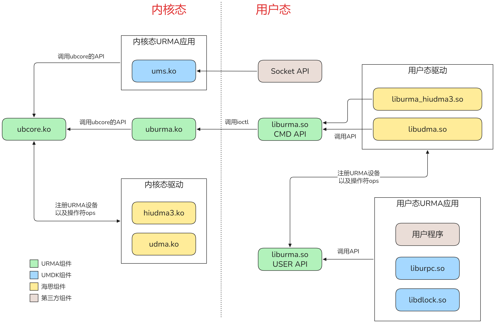

- ubcore.ko：URMA 核心模块，提供基础能力，向上为内核态应用提供接口，向下支持内核态驱动接入。

- uburma.ko：将 ubcore.ko 的功能封装为系统调用，供用户态使用。

- liburma.so（CMD API）：用户态驱动接口层，封装 uburma.ko 的系统调用，为用户态驱动提供调用入口。

- liburma.so（USER API）：用户态应用接口层，向上为用户程序提供接口，向下支持用户态驱动注册。

[3.1 基础概念](#基础概念)

## 基础概念

### UB

Unified Bus，灵衢统一总线，包含终端、交换机和软件。

### UBVA地址模型

UBVA，Unified Bus Virtual Address，是UBUS总线上的分级的虚拟地址，支持对总线的多个节点共享内存进行统一编址，打破了各个节点地址边界，允许应用通过VA进行跨节点寻址和数据访问。由EID和VA地址两个部分组成。

### Segment

Segment是一段连续的VA地址空间，同时分配物理内存来对应到一个segment。由segment home节点创建。User侧的APP把segment映射到进程虚拟地址空间，通过被映射地址直接访问远端内存。segment的VA地址和user进程映射的VA可以相同，也可以不同。VA地址相同的场景，即DSVA场景。

### Jetty

Jetty 是事务层的统一操作接口，可视为事务执行的"港口"，用于管理提交的IO任务或接收的消息的队列。Jetty 主要分为以下几类：

1.  JFS（Jetty for send）：用于提交发送任务（WQE，Work Queue Element）。

2.  JFR（Jetty for receive）：用于提交接收任务。

3.  JFC（Jetty for completion）：用于存放发送、接收任务的完成队列记录（CQE，Completion Queue Element）。

4.  Jetty：具有JFS、JFR两者的功能，同时支持提交发送和接收任务。

### UBoE

UB over Ethernet, UBoE是指UB事务层和传输层语义承载在Ethernet/IP上的报文格式。如下图所示，ETH头之后可选的，可以使用OPtag携带增强的负载均衡、拥塞控制和网络隔离特性字段。Optag格式定义在ETH网链路层协议族维护，此处仅为参考。


# 编译安装

## RPM包编译

**方法一：独立编译URMA RPM包**

1. 进入UMDK工程根目录下

2. 打包源码：

```bash
tar -czf /root/rpmbuild/SOURCES/umdk-25.12.0.tar.gz --exclude=.git `ls -A`
```

3. 编译RPM包：

```bash
rpmbuild -ba umdk.spec --with urma
```

**方法二：make install 编译安装**

1. 进入UMDK/src工程根目录下

2. 创建并进入构建目录：

```bash
mkdir build
cd build
```

3. 配置并编译安装：

```bash
cmake .. -D BUILD_ALL=disable -D BUILD_URMA=enable
make install -j
```

## URMA RPM安装

说明：URMA需要调用URMA组件的能力，需要提前安装好URMA软件。

```bash
rpm -ivh /root/rpmbuild/RPMS/aarch64/umdk-urma-*.rpm
```

# Quick start

本章介绍了URMA通信的基本流程。为使读者在深入细节前建立整体认识，本章以客户端-服务器模型为例，展示URMA通信的四个核心阶段：资源准备、连接建立、数据传输和资源释放。

URMA通信流程可分为四个主要阶段：

**阶段一：资源准备**

在此阶段，应用程序需要完成底层通信框架的初始化和关键资源的创建。首先调用初始化函数创建上下文，后续的URMA操作都是在上下文粒度进行的。随后创建通信端点（Jetty、JFR、JFS、JFC），为后续的数据收发提供通道。同时，应用程序还需在本地注册用于数据交换的内存区域（Segment），这些内存将被暴露给UB硬件访问。

**阶段二：连接建立**

连接建立阶段负责构建通信双方的数据通路。应用程序需要自行获取对等端资源的ID、地址和访问权限信息，这些信息通常通过带外机制传输。获得必要信息后，应用程序通过导入操作将远程资源（包括Jetty和Segment ）映射到本地。这个过程建立了端到端的逻辑连接，使得本地应用能够像操作本地内存一样引用远程资源。

**阶段三：数据传输**

数据传输阶段是实现核心功能的关键环节。应用程序通过提交工作请求（WR，Work Request）到Jetty来启动数据传输操作，这些请求描述了操作类型、源目标地址和大小等参数。 系统异步处理这些请求，应用程序则通过轮询JFC来确认操作执行结果。主要操作类型包括：

- 双边SEND/RECV操作：基于接收方缓冲区的传统消息传递模式，注意发送端的SEND操作需要在接收端已下发RECV操作之后才能成功。

- 单边READ/WRITE操作：直接读写远端内存，无需远程CPU参与。

**阶段四：流程终止**

流程终止阶段确保系统资源的正确释放和环境的清理。按照与创建相反的顺序，应用程序首先销毁Jetty和Segment，最后销毁上下文并卸载URMA通信框架。

以一个简单的客户端-服务器模型为例，应用程序流程如下：

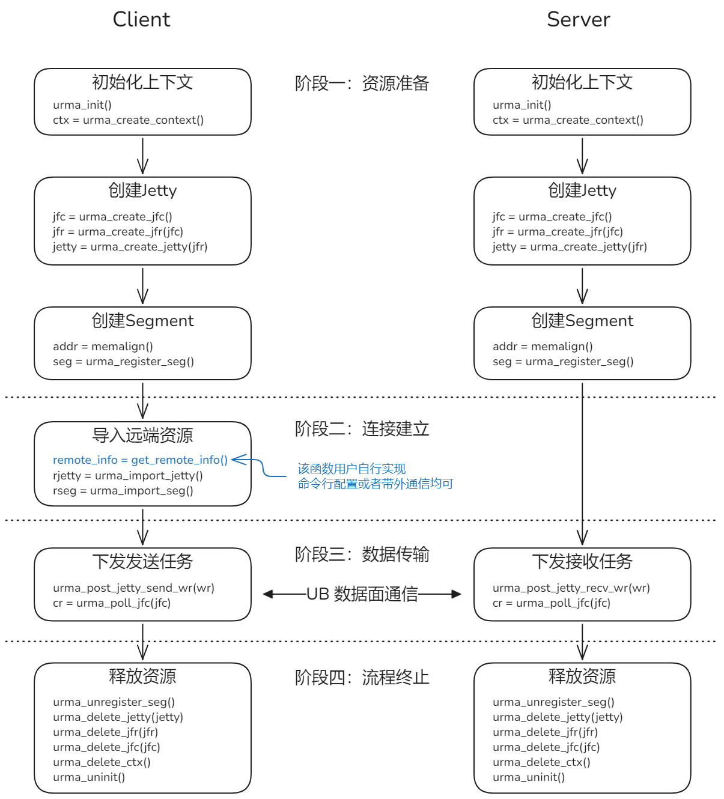

示例程序参见：

URMA用户态编程示例

# URMA架构

URMA架构主要包括：管理面、控制面和数据面三部分。

URMA的控制面和数据面类比于RDMA，是基于UB事务层概念的功能平面，其中控制面（Control Plane）用于管理UB的jetty、segment等事务层对象，数据面（Data Plane）负责基于UB事务层的数据面传输，是URMA高性能的核心。管理面（Management Plane）是管理事务层与传输层对应管理和传输层管理的平面，具备灵活的部署形态，是管理URMA建链的核心平面。

[5.1 管理面](#管理面)

[5.2 控制面](#控制面)

[5.3 数据面](#数据面)

## 管理面

URMA管理面是基于UB事务层Jetty事务对象，提供传输层连接管理服务的软件模块。管理面在UB协议栈的层级关系如下所示：

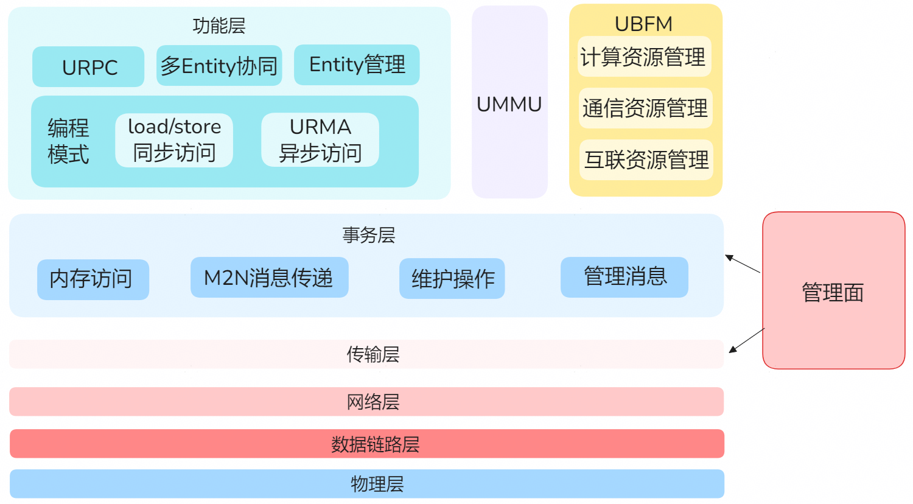

上图中，UBFM是 UB Domain的管理者，负责 Domain内的互连、通信和计算资源管理，动态处理系统运行过程中产生的事件。

UMMU是UB的内存管理单元（UB Memory Management Unit）。

管理面是指是管理事务层与传输层对应管理和传输层管理的平面。

URMA协议栈根据底层硬件差异分别支持分布式管控和集中式管控。区别如下图所示。


分布式管控


集中式管控

### 分布式管控

URMA协议的事务层主要通过URMA API呈现，传输层通常不对外暴露，用户在建链过程中会创建或复用传输层，因此需要有一个控制平面负责维护传输层的创建、状态机等生命周期的维护，因此需要创建了管控面的概念。

分布式管控是指管理面与事务层和传输层的协议软件采用分布式的方式部署在端侧，用于完成端侧事务层建链。当前SDI6.0的硬件形态支持分布式管控。

分布式管控的核心在于基于事务层与传输层分离的软件架构进行建链管理。

#### 可靠建链协议

URMA管控面负责针对可靠连接模式提供建链管理手段，此协议行为称为可靠建链协议。

发起端与目的端的可靠建链协议

（1）发起端节点（Initiator）建链流程中，创建本地传输层，连接管理模块向目的端节点（Target）连接管理模块发送连接请求，如下图 CONN_REQ所示

（2）目的端节点连接管理模块接收到连接请求后，通知协议框架和协议驱动，在本节点创建传输层，并切换传输层至RTR状态；然后目的端节点连接管理模块向发起端节点连接管理模块发送连接响应，如下图 CONN_REP所示。

（3）发起端节点连接管理模块收到连接响应后，通知协议框架和协议驱动，将本端节点传输层切换至RTS状态；然后发送端连接管理模块向目的端连接管理节点发送连接确认，如下图CONN_ACK所示。


#### 共享传输层

两端同时发起建链的场景，为了节省传输层资源，创建共享传输层协议。

共享传输层是指发起端节点与目的端节点完成建链的基础上，目的端节点向发起端节点发起建链的操作。下图所示为此场景的共享对等传输层，即节点A向节点B发起建链创建的传输层，在节点B向节点A发起建链时，将会共享此传输层。


下图所示为此场景共享传输层的协议，交互流程如下：

（1）目的端节点发起建链，经查询已存在传输层，则共享传输层，不再创建传输层；目的端节点连接管理模块向发起端节点连接管理模块发送共享对等传输层连接请求，如下图CONN_REUSE_REQ所示；

（2）发起端连接管理模块收到共享对等传输层连接请求后，查询本节点已存在传输层，则共享传输层，不再创建传输层；发起端连接管理模块向目的端连接管理模块发送共享对等传输层连接响应，如下图CONN_REUSE_REP所示。

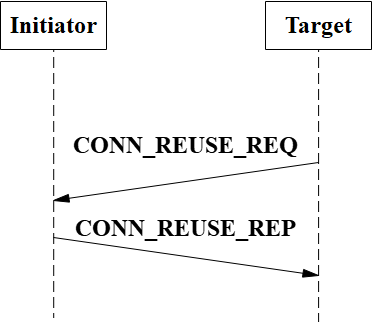

此外，管理面还提供了拒绝连接协议和拆链协议，流程如下：

- 拒绝连接协议

下图所示为本场景的连接拒绝行为。协议交互流程如下：

（1）发起端节点发起建链，此节点上连接管理模块向目的端节点的连接管理模块发送连接请求，如下图CONN_REQ所示；

（2）目的端节点连接管理模块接收到连接请求，在本节点检查连接请求，包括必要的事务层和传输层的配置权限检查，本流程所述场景，目的端节点检查不通过，此节点连接管理模块回复连接拒绝消息，如下图CONN_REJ所示；

（3）发起端节点连接管理模块收到连接拒绝消息，执行错误回滚流程，包括本端传输层资源选择性销毁（在传输层复用场景不销毁）、事务层资源销毁，并返回建链失败执行结果，流程结束。


- 拆链通知协议

本流程描述了拆链场景的各节点行为，本流程特点是对等节点仅发送单条拆链通知。协议交互流程如下：

（1）发起端节点用户进程发起拆链，或进程退出等场景协议框架自动发起拆链，若两端处于共享对等传输层场景，则用户触发拆链后，本节点连接管理模块向目的端连接管理模块发送拆链通知，如下图DCONN_NOTIFY所示；拆链消息发送完成，本节点自动切换到作为目的节点的建链状态，可参考下章节的建链状态机管理，等待目的端节点的拆链通知；

（2）目的端节点连接管理模块收到拆链通知，通知协议框架、协议驱动进入拆链流程，本节点自动切换到发起端建链状态；在本节点发起拆链操作时，本节点从发起端建链状态切换到REST状态，销毁本地传输层资源；同时目的端节点的连接管理模块向发起端节点的连接管理模块发送拆链通知，如下图 DCONN_NOTIFY所示；

（3）发起端节点连接管理模块收到断链通知，通知协议框架、协议驱动进入拆链流程，本节点在流程（1）切换到目的端建链状态，此后切换到拆链完成状态，销毁本地传输层资源，拆链流程结束。

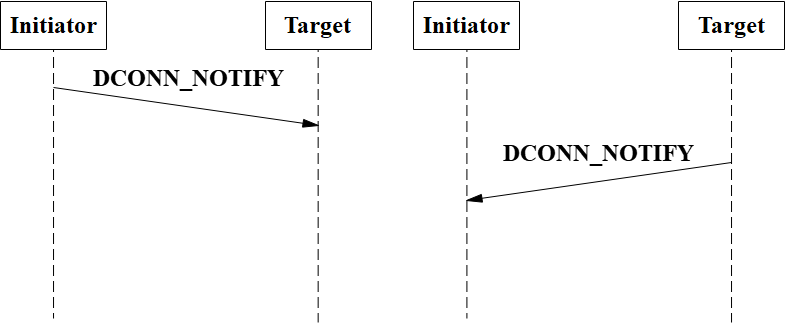

#### 前后端分离建链

为了保证安全隔离，URMA协议栈设置了前后端分离的部署方式，前端负责对接用户管理事务层资源，后端管控面负责传输层生命周期的维护。

下图所示为连接管理模块与应用进程前后端分离部署形态，在A、B两节点上分别启动虚拟机，应用进程运行在虚拟机VM上。在A、B两节点上部署有附属设备，所述附属设备可采用的形式包括但不限于：（1）节点硬件附属设备，如虚拟化领域的DPU设备；（2）部署在软件隔离内存的虚拟设备等。附属设备通常称后端设备，该部署模式下，连接管理模块的配置与应用进程进行系统隔离。在附属设备上部署守护进程，连接管理模块在守护进程中运行，为前端VM中的多应用进程提供建链和拆链服务。系统管理员在后端设备上访问连接管理模块，通过命令行等方式完成连接管理模块的查询和组网配置等管理。

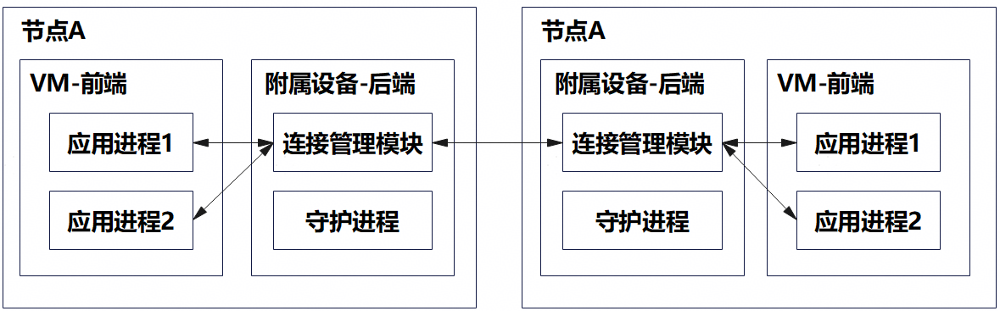

下图所示为连接管理模块采用独立部署方式场景，隔离恶意攻击的实现方法，以VM前后端实施例进行说明。应用进程部署在VM前端节点，与外部网络、数据交互，存在被恶意攻击的风险，连接管理模块部署在后端的附属设备上，与应用进程部署在不同的操作系统上。当应用进程受到外部恶意攻击时，通过系统隔离攻击无法渗透到连接管理模块，可保证部署在节点设备上的事务层、传输层和用户信息安全。

独立灵活部署的连接管理模块，优势如下：

（1）隔离部署限制攻击范围，提升安全性

云安全场景采用前后端+虚机分离部署，前端用户进程与后续管理模块隔离，攻击者针对用户进程进行恶意攻击时，恶意代码难以渗透到后端管理模块，控制面核心功能不受影响，同时能够限制攻击范围。

（2）前后端隔离，防止权限提升

只有经过授权的人员和进程才有权限访问和操作后端管理模块，云安全场景，针对前端进程仅分配所需最低权限，针对用户进程的攻击限制在虚机和容器范围，能够防止攻击权限提升从而访问后端系统资源。

（3）系统稳定，部署灵活

后端管理模块采用灵活的部署方式，如跨节点、分布式或节点集中式管控等方式，用于满足不同组网场景的需求。管理模块采用独立部署形态，能够降低用户进程异常崩溃等影响。管理模块独立进程部署形态，便于维护人员开展故障排查和维护管理。


#### 建链状态机管理

下图为建链状态机管理的示例，建链状态机管理流程如下：

结合图14说明建链、拆链和共享对等传输层、连接拒绝等流程的状态机切换：

（1）发起端用户触发建链，本地创建传输层资源，发起端处于reset状态，发送连接请求至目的端（1401），发起端切换为REQ sent状态；

（2）目的端用户触发建链，处于reset状态，目的端接收连接请求完成后（1404），切换为REQ received状态；目的端创建传输层资源，向发起端发送连接回复（1405），发送完成后切换为REP sent状态；

（3）发起端未收到连接回复而触发超时（1402），切换到timeout的暂态，然后自动切换（1403）到reset，建链流程失败；

（4）发起端处于REQ sent状态时，若收到连接请求消息（1408），则切换到peer compare状态，比较两端信息判断本节点处于发起端还是目的端，若此时未收到连接请求消息，则判断属于发起端（1409）,仍然自动切换回REQ sent状态；若此时已经收到连接请求消息，则判断处于目的端（1410），自动切换到REQ received状态；

（5）发起端处于REQ sent状态时，若收到连接响应消息（1411），则切换到REP received状态，完成本端传输层状态切换后，自动发送连接确认（1412），自动切换到Initiator established状态；

（6）本步骤接步骤（2）目的端流程，目的端处于REP sent状态时，若收到连接确认（1413），则切换到Target established状态；若未收到连接确认而触发超时（1406），则切换到timeout瞬态，并自动切换（1407）到reset状态，目的端建链流程失败；至此建链流程结束；

（7）在共享对等传输层场景，目的端节点用户触发建链操作时，此节点发送共享对等传输层连接请求（1414），然后切换到REUSE sent状态，等待对应连接响应；

（8）发起端节点收到共享对等传输层连接请求（1415），切换到REUSE received瞬态；如果在发起端节点共享连接请求检查通过则发送共享对等传输层连接响应到目的端（1416），并切换到reused状态；如果在发起端节点共享连接请求检查不通过则发送连接共享对等传输层连接拒绝消息（1419），并切换回Initiator established状态；

（9）本步骤接步骤（7）的目的端流程，目的端节点处于REUSE sent状态，若未收到共享连接回复消息而触发超时（1417），则切换回Target established状态；若收到共享对等传输层连接回复（1418），则切换到reused暂态；至此共享对等传输层流程结束；

（10）处于reused状态的任一节点，若用户先触发拆链，此节点发送拆链通知（1420），则此节点切换到NOTIFY sent on reuse暂态，此节点自动切换（1423）到Target established状态；此节点若收到拆链通知（1424），则切换到NOTIFY received瞬态，销毁传输层资源后，自动切换（1407）到reset状态；

（10）处于reused状态的任一节点，若先收到拆链通知（1421），则此节点切换到NOTIFY received on reuse暂态，此节点自动切换（1422）到Initiator established状态；若此节点上用户触发拆链并发送拆链通知（1424），则此节点切换到NOTIFY sent瞬态，并启动切换（1425）到reset状态，至此拆链流程结束。

图示说明如下：

**(1)reset：**建链初始状态；

**(2)REQ sent：**发送连接请求完成状态；

**(3)timeout：**超时状态；

**(4)peer compare：**发起端/目的端切换比较状态；

**(5)REP received：**接收连接响应完成状态；

**(6)Initiator established：**发起端建链完成状态；

**(7)NOTIFY sent：**拆链通知发送完成状态；

**(8)Reuse received：**接收共享对等传输层连接请求完成状态；

**(9)NOTIFY received on reuse：**共享对等传输层接收拆链通知完成状态；

**(10)NOTIFY sent on reuse：**共享对等传输层发送拆链通知完成状态；

**(11)reused：**共享对等传输层状态；

**(12)REQ received：**接收连接请求完成状态；

**(13)REP sent：**发送连接响应完成状态；

**(14)Target established：**目的端建链完成状态；

**(15)NOTIFY received：**接收拆链通知完成状态；

**(16)Reuse sent：**发送共享对等传输层连接请求完成状态。


### 集中式管控

集中式管控是指管理面与事务层和传输层的协议软件采用分离的方式部署，其中管理面部署在管控节点，协议软件部署在端侧节点，这种形态称为带外部署。在集中式管控形态中，也具有与带外形态不同的部署方式，即类似于分布式管控，管理面与协议软件均部署在端侧节点，无额外的管控节点，这种形态称为带内部署。当前KunPeng CPU、NPU等硬件形态支持集中式管控。

#### 端侧-管理面建链

集中式管控的主要流程是端侧用户通过URMA协议栈向管理面申请分配传输层资源，完成传输层信息交换之后，端侧触发传输层的状态切换，切换为激活态，则UB协议栈具备通信能力；拆链流程中，端侧触发传输层的状态切换，切换为去激活态，则连接断开，不具备通信能力。

#### 感知传输层的建链

基于建链元语，用户可选择使用感知传输层的建链。建链流程大致如下：

1.  获取传输层；

2.  交换事务层、传输层信息；

3.  导入对端事务层对象，完成建链。

建链和拆链流程参考下图：

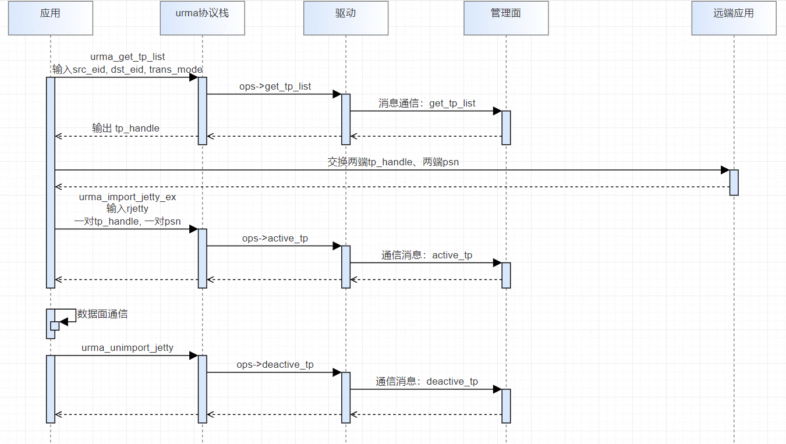

相关的URMA API（用户态为例）

/\*\*\
\* get available tp list from control plane.\
\* \@param\[in\] \[Required\] ctx: the created urma context pointer;\
\* \@param\[in\] \[Required\] tp_cfg: tp configuration to get;\
\* \@param\[in && out\] \[Required\] tp_cnt: tp_cnt is the length of tp_list buffer as in parameter;\
\* tp_cnt is the number of tp as out parameter;\
\* \@param\[out\] \[Required\] tp_list: tp list to get, the buffer is allocated by user;\
\* Return: 0 on success, other value on error\
\*/\
urma_status_t urma_get_tp_list(urma_context_t \*ctx, urma_get_tp_cfg_t \*cfg, uint32_t \*tp_cnt,\
urma_tp_info_t \*tp_list);

/\*\*\
\* Import a remote jetty by control plane.\
\* Note: trans_mode from rjetty should be the same as the trans_mode of get_tp_list,\
\* users should obey this rule in case of unexpected errors.\
\* \@param\[in\] \[Required\] ctx: the urma context created before;\
\* \@param\[in\] \[Required\] rjetty: information of remote jetty to import, including jetty id and trans_mode,\
\* trans_mode same to create_jetty trans_mode;\
\* \@param\[in\] \[Required\] token_value: token to put into output jetty protection table;\
\* \@param\[in\] \[Required\] cfg: tp active configuration to exchange with target;\
\* Return: the address of target jetty, not NULL on success, NULL on error\
\*/\
urma_target_jetty_t \*urma_import_jetty_ex(urma_context_t \*ctx, urma_rjetty_t \*rjetty,\
urma_token_t \*token_value, urma_import_jetty_ex_cfg_t \*cfg);

/\*\*\
\* Bind jetty: construct the transport channel between local jetty and remote jetty by control plane.\
\* Note: trans_mode from tjetty should be the same as the trans_mode of get_tp_list,\
\* users should obey this rule in case of unexpected errors.\
\* \@param\[in\] \[Required\] jetty: local jetty to construct the transport channel;\
\* \@param\[in\] \[Required\] tjetty: target jetty imported before;\
\* Return: 0 on success, URMA_EEXIST if the jetty has been binded, other value on error;\
\* \@param\[in\] \[Required\] cfg: tp active configuration to exchange with target;\
\* Note: A local jetty can be binded with only one remote jetty. Only supported by jetty under URMA_TM_RC.\
\*/\
urma_status_t urma_bind_jetty_ex(urma_jetty_t \*jetty, urma_target_jetty_t \*tjetty,\
urma_bind_jetty_ex_cfg_t \*cfg);

用户关注基于感知传输层的urma API使用流程。

#### 不感知传输层的建链

在集中式管控建链方案中，URMA还提供了不感知传输层的建链方案，即用户无需进行传输层相关的API操作，创建事务层jetty等资源后，通过不感知传输层API触发建链流程，URMA内部适配层基于感知传输层的流程封装，具体流程如下：

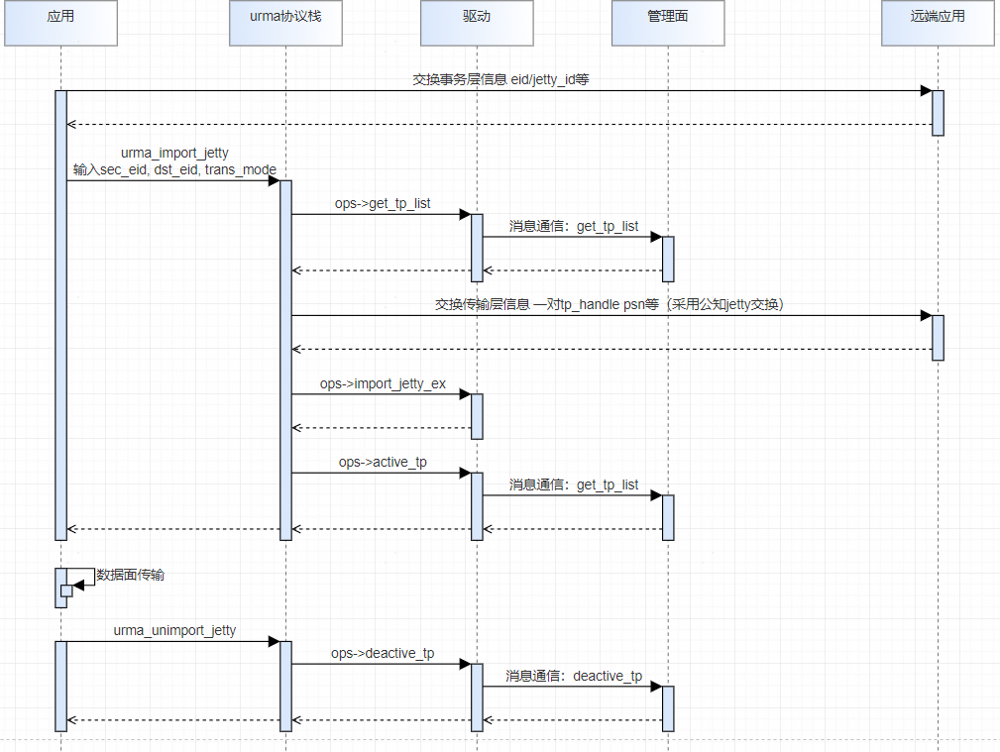

相关的URMA API

/\*\*\
\* Import a remote jetty.\
\* \@param\[in\] \[Required\] ctx: the urma context created before;\
\* \@param\[in\] \[Required\] rjetty: information of remote jetty to import, including jetty id and trans_mode,\
\* trans_mode same to create_jetty trans_mode;\
\* \@param\[in\] \[Required\] token_value: token to put into output jetty protection table;\
\* Return: the address of target jetty, not NULL on success, NULL on error\
\*/\
urma_target_jetty_t \*urma_import_jetty(urma_context_t \*ctx, urma_rjetty_t \*rjetty,\
urma_token_t \*token_value);

/\*\*\
\* Bind jetty: construct the transport channel between local jetty and remote jetty.\
\* \@param\[in\] \[Required\] jetty: local jetty to construct the transport channel;\
\* \@param\[in\] \[Required\] tjetty: target jetty imported before;\
\* Return: 0 on success, URMA_EEXIST if the jetty has been binded, other value on error\
\* Note: A local jetty can be binded with only one remote jetty. Only supported by jetty under URMA_TM_RC.\
\*/\
urma_status_t urma_bind_jetty(urma_jetty_t \*jetty, urma_target_jetty_t \*tjetty);

用户关注基于不感知传输层的URMA API使用流程。

## 控制面

### 上下文管理

1.  概述

URMA支持不同的硬件平台，在初始化时需要配置对应的provider，同时指定使用的设备，创建出上下文。

2.  应用场景

URMA的上下文管理需要在应用运行初期执行，后续的Jetty、Segment管理和数据面操作都依赖该操作。

3.  使用说明

    1.  调用*urma_init*函数配置使用的平台和配置uasid。uasid不指定时由系统随机分配，指定uasid时可能导致函数执行失败。

    <!-- -->

    1.  调用*urma_query_device*函数查询设备的属性，获取eid等信息。如果应用已经获取设备的eid，则该步骤可不执行。

    2.  调用*urma_create_context*函数创建设备上下文。一个进程创建的资源总和（包括硬件doorbell寄存器，Jetty，Segment等），与其他进程相互隔离。

\-\-\--结束


typedef struct urma_context {\
struct urma_device \*dev; /\* \[Private\] point to the corresponding urma device. \*/\
struct urma_ops \*ops; /\* \[Private\] operation of urma device. \*/\
int dev_fd; /\* \[Private\] fd of urma device\'s sysfs file. \*/\
int async_fd; /\* \[Private\] fd of urma device\'s async event file. \*/\
pthread_mutex_t mutex; /\* \[Private\] mutex of urma context. \*/\
urma_eid_t eid; /\* \[Public\] eid of urma device. \*/\
uint32_t eid_index;\
uint32_t uasid; /\* \[Public\] uasid of current process. \*/\
struct urma_ref ref; /\* \[Private\] reference count of urma context. \*/\
} urma_context_t;

1.  struct urma_device \*dev: 这是一个指向 urma_device 结构体的指针，它包含了与特定 URMA 设备相关的信息，如设备的属性、操作函数等。

2.  struct urma_ops \*ops: 这也是一个指针，指向 urma_ops 结构体，它定义了与 URMA 设备交互的操作集合，如打开、关闭、读写等。

3.  int dev_fd: 这是一个整型变量，表示到 URMA 设备 sysfs 文件的文件描述符。sysfs 是 Linux 内核提供的一种接口，允许用户空间程序通过文件系统接口访问内核数据结构，如设备的状态信息。

4.  int async_fd: 这也是一个整型变量，表示到 URMA 设备异步事件文件的文件描述符。这个文件描述符用于接收设备产生的异步事件通知，比如数据传输完成、错误发生等。

5.  pthread_mutex_t mutex: 这是一个互斥锁，用于同步对 urma_context_t 结构体中数据的访问。在多线程环境中，互斥锁保证了在任何时候只有一个线程可以修改结构体中的数据，防止数据竞争。

6.  urma_eid_t eid: 这是一个 urma_eid_t 类型的变量，表示 URMA 设备的全局唯一标识符（eid，Endpoint ID）。在 RoCE（RDMA over Converged Ethernet）网络中，eid 是用来标识网络上的一个端点。

7.  uint32_t eid_index: 这是一个无符号32位整数，可能用于索引或标识与 eid 相关的额外信息，比如在设备上下文中这个eid的特定位置。

8.  uint32_t uasid: 这也是一个无符号32位整数，表示当前进程的 User Assisted Segment Identifier (UASID)。

9.  struct urma_ref ref: 这是一个 urma_ref 结构体的实例，用于跟踪 urma_context_t 的引用计数。

### Jetty管理

1.  概述

URMA执行资源管理通过Jetty进行管理。Jetty为URMA软件操作对象，借助Jetty UBEP和软件实现消息交互。Jetty主要用于消息语义接收、发送以及内存语义的命令下发。Jetty为进程独享，根据用途的不同Jetty可细分为Jetty、Jetty For Send（JFS）、Jetty For Receive（JFR）、Jetty For Complete（JFC）。

1.  **Jetty（码头，港口）**：Jetty是URMA中的全功能通信对象，它既支持发送（发送数据到其他Jetty）也支持接收（接收来自其他Jetty的数据）。Jetty对象包含一个发送队列（SQ，Send Queue Buffer）用于提交工作单元（WQE，Work Queue Entry），同时它还关联了一个JFC（Jetty for Complete，完成的Jetty）来管理数据传输的完成状态。Jetty可以独立使用，或者在单向模型中，作为JFS和JFR的组合。

2.  **JFS（Jetty for Sending）**：JFS是Jetty的一个变体，它专用于发送操作。在单向模型的Initiator（发起者）侧，JFS用于提交DMA任务或者发送消息。JFS仅包含一个SQ，不支持接收操作，只做Send操作或单边UDMA操作。JFS通常与JFR配合使用，节省接收缓冲资源。

3.  **JFR（Jetty for Receiving）**：JFR是另一个Jetty的变体，专用于接收操作。在单向模型的Target（目标）侧，JFR用于准备接收消息的资源，它包含一个接收队列（RQ，Receive Queue Buffer）。JFR仅做Recv操作，不支持发送。JFR通常与JFS一起工作，提供单向通信的接收端点。

4.  **JFC（Jetty for Complete）**：JFC是Jetty的辅助实体，它不直接参与数据传输，但对Jetty、JFS和JFR的完成状态进行管理。每个Jetty、JFS或JFR都需要一个JFC来记录数据传输的完成情况。JFC包含一个完成队列（CQ，Complete Queue Buffer），用于poll完成事件（CQE，Complete Queue Entry）。

    1.  应用场景

在进行具体的read，write，send，receive等操作前需要建立相关的jetty资源，后续的read,write,send,receive等操作都依赖创建的jetty资源。

2.  注意事项

创建JFC时指定相关的JFCE，才能以中断模式等待完成事件和获取完成记录，JFCE:接收完成事件的通道，内核态JFCE实现为文件，用户态实现为打开的JFCE文件句柄

3.  使用说明

1\. 使用Jetty实现消息语义的编程框架如下图所示，其中JFC为轮询模式，没有绑定JFCE：

1.  消息语义使用示例


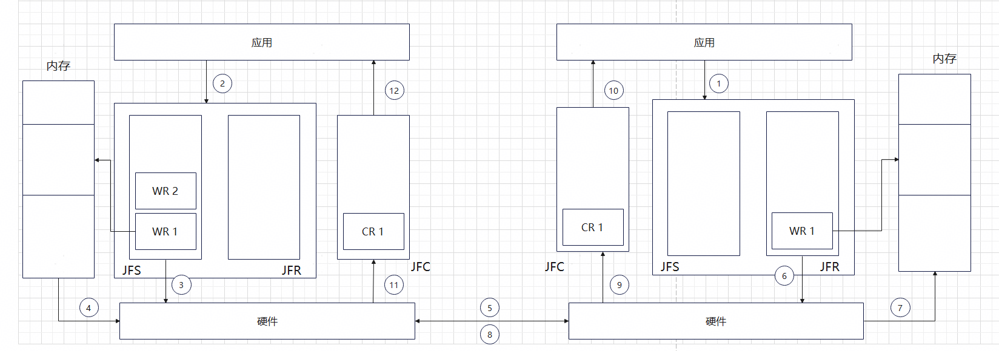

2.中断模式使用JFCE的编程框架如下图所示：

2.  JFC中断模式编程示例


### Segment管理

1.  概述

Segment是URMA对被内存事务指令访问的内存进行管理和访问的抽象数据结构。Segment是一段连续的UBA地址空间，同时分配物理内存来对应到一个segment。在URMA单边内存访问的编程模型中，Segment是基础的内存管理对象，Target侧创建Segment并注册，Initiator侧申请使用远端的Segment，构造出Target Segment（包含TokenId，ubva等），然后才能继续访问远端内存。

**UBVA地址模型**

2.  应用场景

urma语义的内存管理

**注册内存registe_seg：允许设备访问进程的一段内存**

- 权限：本地写、远程读、远程写、远程原子

- 与RDMA不同点：无需提前创建PD，需要传入key（可能修改）

**访问远端内存之前，先导入内存import_seg**

- 添加Segment访问表项，验证本进程具有访问segment的权限

- RDMA应用无需导入mr，直接通过带外通道将server进程的va和rkey交换到到client，client即可使用va和rkey进行rdma操作

- URMA每个client注册segment传入不同的派生key

- 使用bond设备进行import_segment时，seg中的eid不能为空，否则发不到对端 ；使用裸udma设备并不会有此限制且udma并不会对seg中的内容进行检查判空

  1.  注意事项

\(1\) 本地用户对远端内存读写时，本地buf和远端内存必须提前调用urma_register_seg注册到设备, 不使用必须调用urma_unregister_seg注销。

\(2\) 应用使用远端内存读写之前，必须调用urma_import_seg获取target_segment

\(3\) 注册segment时，如果声明了remote write或者remote atomic权限，那么应用也必须同时声明local write权限，否则注册失败

2.  使用说明

\(1\) 使用本地内存：申请va，调用urma_register_seg注册segment。

\(2\) 释放本地内存：调用urma_unregister_seg注销segment。

\(3\) 使用远端内存：urma_import_segment获取targ_segment和mva。

\(4\) 释放远端内存：unimport_segment注销segment。

typedef struct urma_seg {\
urma_ubva_t ubva; /\* \[Public\] ubva of segment. \*/\
uint64_t len; /\* \[Public\] length of segment. \*/\
urma_seg_attr_t attr; /\* \[Public\] include: access flag, token policy, cacheability. \*/\
uint32_t token_id; /\* \[Private\] match token \*/\
} urma_seg_t;

typedef struct urma_target_seg {\
urma_seg_t seg; /\* \[Private\] see urma_seg_t. \*/\
uint64_t user_ctx; /\* \[Private\] private data of segment \*/\
uint64_t mva; /\* \[Public\] mapping addr when import remote seg. \*/\
urma_context_t \*urma_ctx; /\* \[Private\] point to urma context. \*/\
urma_token_id_t \*token_id; /\* When registering seg, it is a valid address; when importing seg, it is NULL \*/\
uint64_t handle;\
} urma_target_seg_t;

register与import出的对象为urma_target_seg_t

基于segment实现内存语义的编程框架如下图所示：

1.  内存语义编程示例


**单端内存访问**：

- **Read**:

<!-- -->

- 用户（Initiator）在Jetty的发送队列（SQ）中发起一次URMA读事务。

- udma驱动从SQ队列中读取一个服务队列元素（SQE），解析其中的指令信息。

- 用户端的事务处理单元（TP）将读请求封装成报文，发送给目标端（Target）。

- 目标端接收到请求后，事务引擎从指定的内存区域读取数据。

- 目标端的TP将数据封装成报文，发送回用户端。

- 用户端接收数据后，将其放置到mr指定的缓冲区。

<!-- -->

- **Write**:

<!-- -->

- 用户在Jetty的发送队列中发起一次URMA写事务。

- 用户从SQ读取SQE并解析信息。

- 用户根据SQE的信息，从本地内存中获取数据，组装成报文，发送给目标端。

- 目标端接收到报文后，事务引擎将数据存储到指定的内存区域。

- 目标端执行完操作后，发送事务完成确认（TAACK）给用户端。

- 用户端的TP接收到TAACK后，将其封装成报文并发送给用户

### 异常事件

1.  概述

应用发送硬件无法处理的WR，访问超出本端或远端内存的权限，驱动方面cq、sq、rq队列溢出，驱动卸载，驱动elr复位，端口状态异常等情况下，硬件将上报异常事件。

应用获取发生的异常类型、具体的异常的对象：异常的上下文、端口、JFS、JFC、JFR等。异常事件处理是通过urma_get_async_event和urma_ack_async_event两个接口来实现的。这两个接口主要用于在用户态处理来自内核态的异步事件通知。


/\* softub currently only report URMA_EVENT_JFC_ERR and URMA_EVENT_JETTY_ERR; other events are not handled in softub;\*/\
URMA_EVENT_JFC_ERR,\
URMA_EVENT_JFS_ERR,\
URMA_EVENT_JFR_ERR,\
URMA_EVENT_JFR_LIMIT, /\* Jfr Flow Record,over flow \*/\
URMA_EVENT_JETTY_ERR,\
URMA_EVENT_JETTY_LIMIT, /\* Jetty Flow Record,over flow \*/\
URMA_EVENT_JETTY_GRP_ERR, /\* Jetty Asynchronous Error Event Reporting \*/\
URMA_EVENT_PORT_ACTIVE, /\* The port status is currently active \*/\
URMA_EVENT_PORT_DOWN, /\* The port status is currently down \*/\
URMA_EVENT_DEV_FATAL,\
URMA_EVENT_EID_CHANGE, /\* eid change, HNM and other management roles will be modified \*/\
URMA_EVENT_ELR_ERR, /\* ELR Reset,Entity level error \*/\
URMA_EVENT_ELR_DONE /\* Entity flush done \*/

2.  应用场景

urma异常场景

3.  注意事项

应用删除某个对象（例如JFS，JFR，JFC，Jetty）之前，如果获得过该对象产生的异常事件时，必须调用确认异常接口（urma_ack_async_event），然后才能删除该对象。

4.  使用说明

（1）用户调用urma_get_async_event接口获取异常事件；

（2）用户根据异常事件类型，进行分类处理，例如打印log信息；

（3）用户调用urma_ack_async_event接口，通知UMDK已经处理完异常；

1.  **urma_get_async_event:**

\* 功能：这个接口用于从URMA的异步事件队列中获取事件。当内核检测到与URMA资源（如Jetty、JFC、JFS等）相关的异常或状态变化时，它会将这些事件记录到异步事件队列中。用户态的驱动程序通过调用urma_get_async_event来轮询这个队列，获取最新的异常事件。

\* 参数：通常需要一个urma_context_t类型的上下文指针，这个指针是在urma_create_context时创建的，用于与内核进行通信。

\* 返回值：urma_get_async_event会返回urma_status_t告知用户函数的完成情况，调用成功返回0，其他值表示接口调用失败，参数中的event的指针指向获取的事件。

2.  **urma_ack_async_event:**

\* 功能：urma_ack_async_event用于向内核确认已经处理了某个异常事件。当用户态驱动程序通过urma_get_async_event获取到一个事件后，处理完相关逻辑，通常需要调用urma_ack_async_event来告诉内核这个事件已经被处理，可以被清理或进一步处理

\* 参数：通常需要提供之前从urma_get_async_event获取的urma_async_event_t结构体，这样内核可以知道哪个事件已经被确认

#### flush jetty

URMA支持对jetty队列里面的wr进行flush，具体使用分成以下4种场景：

1.  tp error导致jetty切换到suspended状态，有outstanding wr。

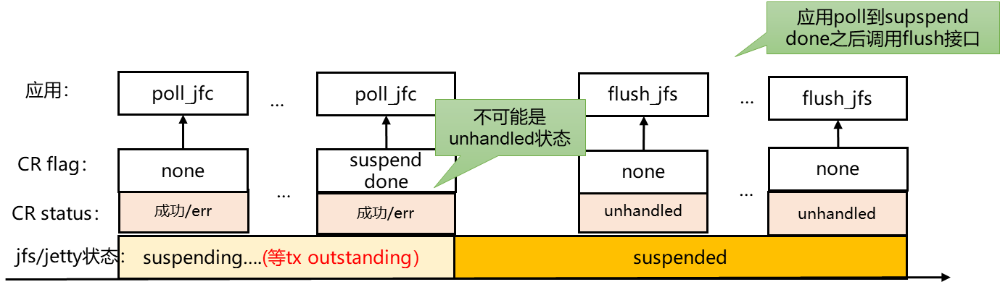（1）有保序需求时，应用才需要flush，目的是根据顺序重试WR

（2）JFS无序模式，应用从supspend done可以直接到ready，继续发送

（3）SO类型WQE由于等待，虽然将wqe拿到TP，但是没有处理，这时上报ERR

2.  tp error导致jetty切换到suspended状态，硬件无outstanding wr，硬件构造suspend done。


硬件构造suspend done的场景：

（1）应用modify jetty到suspend状态完成

3.  硬件将jetty切换到error状态，有outstanding wr。


必须等待jetty所有tx和rx outstanding rqe都完成，并上报cqe之后，才能上报flush err done，原因如下：

（1）如果报文指定到jetty，硬件已经从JFR取到rqe，即认为是outstanding rqe；

（2）如果不等outstanding rqe完成，软件无法安全的释放rqe内存，因为可能硬件还在访问这段内存；

（3）如果不等outstanding rqe完成，硬件就上报flush done，还有两种后果： （a）软件可能删除jetty，那么rqe完成时，硬件无法上报rx cqe；（b）软件还可能创建新的jetty，恰好jetty id相同，那么硬件将上报错误rx cqe，导致严重错误。

4.  硬件或应用将jetty切换到error状态，硬件构造flush_err_done, 硬件无outstanding wr。


硬件构造flush_err_done的场景：

（1）应用modify jetty 到err完成；

（2）硬件主动将jetty置错，但是没有outstanding wr。

### 设备属性

UB设备属性包含大致分为三类：只读且不变的设备资源规格、可读可写的设备配置信息、只读且可变的设备端口状态。目前URMA框架通过sysfs文件系统统一呈现，路径如下，这些文件可以直接通过cat、echo等命令进行操作：


设备属性的详细情况如下：


UB传输层的设备属性依赖于UB驱动的实现。

1.  URMA设备属性

  -----------------------------------------------------------------------------------------------------------------------------------------------------------------------------
  属性                 可读   可写   可变   备注                                                                                                                 UB   IB   IP
  -------------------- ------ ------ ------ -------------------------------------------------------------------------------------------------------------------- ---- ---- ----
  eid                  √      √      √      设备eid                                                                                                              √    √    √

  guid                 √      x      x      设备guid                                                                                                             √    x    x

  feature              √      x      x      设备支持的feature，包含OOO(out_of_order)、jfc_per_wr、stride_op、load_store_op、non_pin、pmem（persistence_mem）等   √    √    √

  max_jfc              √      x      x      设备支持创建jfc的最大个数                                                                                            √    √    √

  max_jfs              √      x      x      设备支持创建jfs的最大个数                                                                                            √    √    √

  max_jfr              √      x      x      设备支持创建jfr的最大个数                                                                                            √    √    √

  max_jfc_depth        √      x      x      jfc支持配置队列深度的最大值                                                                                          √    √    √

  max_jfs_depth        √      x      x      jfs支持配置队列深度的最大值                                                                                          √    √    √

  max_jfr_depth        √      x      x      jfr支持配置队列深度的最大值                                                                                          √    √    √

  max_jfs_inline_len   √      x      x      jfs支持消息inline的最大值，单位byte                                                                                  √    √    x

  max_jfs_sge          √      x      x      jfs支持单个wr里面包含sge的最大个数                                                                                   √    √    √

  max_jfr_sge          √      x      x      jfr支持单个wr里面包含sge的最大个数                                                                                   √    √    √

  max_msg_size         √      x      x      设备支持传输消息的最大值，单位byte                                                                                   √    √    x

  tp_mode              √      x      x      设备传输层模式，枚举值：SRM（shared reliable message）、RC（reliable connection）、UM（unreliable message）          √    √    √

  port_count           √      x      x      设备拥有的port数                                                                                                     √    √    √

  max_mtu              √      x      x      端口可配置的最大MTU值，枚举值：MTU_256, MTU_512, MTU_1024等                                                          √    √    √

  state                √      x      √      端口状态，枚举值：PORT_DOWN, PORT_INIT, PORT_ARMED，PORT_ACTIVE，PORT_ACTIVE_DEFER                                   √    √    √

  active_width         √      x      √      端口活跃的链路带宽，枚举值：WIDTH_X1，WIDTH_X2，WIDTH_X4                                                             √    √    x

  active_speed         √      x      √      端口活跃的速率，枚举值：SP_10M， SP_100M，SP_1G，SP_10G，SP_25G，SP_40G，SP_100G等                                   √    √    x

  active_mtu           √      x      √      网卡设备端口活跃的MTU值, 枚举值：MTU_256, MTU_512, MTU_1024等                                                        √    √    √
  -----------------------------------------------------------------------------------------------------------------------------------------------------------------------------

URMA设备属性可以通过urma_admin工具查询和配置，具体使用方式见工具演示章节

### token安全传输

## 数据面

**传输模式-RM、RC、UM**

**URMA_TM_RC：Reliable Connection**

- 建立一对一的绑定关系，只能向绑定的jetty发送消息，可以访问目标进程内的segment。

- **保证可靠，支持保序**

- 一个jetty只能与一个目标进程建立连接，发送消息。不支持一对多通信。

**URMA_TM_RM：Reliable Message**

- Jetty之间/jfs与jfr之间建立多个连接关系，可以向多个节点不同目标进程的jetty/jfr发送消息，也可以访问多个节点不同进程的segment。

- **保证可靠，支持保序/不保序**

- JFS到目标进程间只能通过源端保序，时延增大。

**URMA_TM_UM：Unreliable Message**

- Jetty之间/jfs与jfr之间不存在连接关系，可以向多个节点不同目标进程的jetty/jfr发送消息，不支持单边语义。

- **不保证可靠和有序**

- 不具备连接无法实现保序，底层不保证可靠。

**可靠与保序介绍**

**URMA_TM_RC：Reliable Connection**

- Jetty之间由唯一TP连接，顺序发出的WR在目的端被顺序执行。

- 原生支持FENCE保序，执行序，完成序。

- 底层对数据进行ACK和失败重传，保证可靠性。

**URMA_TM_UM：Unreliable Message**

- 同一个jetty/jfs到目的进程不创建连接。

- 不保序。

- 底层使用不保证可靠性。

**URMA_TM_RM：Reliable Message**

- 应用角度一个jetty/jfs可以和多个远端jetty/jfr通信，反映为无连接。

- 基于XRC的实现

<!-- -->

- 同一个jetty/jfs到目的进程只创建一个jetty连接，顺序发出的WR在目的端被顺序执行。

- 原生支持FENCE保序，执行序，完成序。

<!-- -->

- 基于RC的实现：不支持执行序，完成序

<!-- -->

- 同一个jetty/jfs到目的进程创建多个QP连接，无法保证WR被顺序执行。

不同传输模式如下图所示：


单边、双边操作对连续/非连续操作地址的支持如下表格所示：

1.  


URMA over IP 发送报文最大支持1G，即1个WR里面所有sge长度相加之和最大不超过1G。

### 单边操作

1.  概述

UMDK单边操作提供了read write语义，类似于IB的read/write接口，需要知道本地的地址和对端的地址，进行单边操作时只有本端进程在操作，不需要对端的应用感知。

UMDK单边操作缓存支持本端连续内存、非连续内存和远端连续内存。urma_read，urma_write只支持连续地址的读写。urma_post_jfs_wr支持本端以sgl的形式访问非连续地址。

UMDK支持立即数的写操作，见urma_post_jfs_wr接口，所写的立即数将出现在接收端的完成记录（completion record）中。

根据UB协议，write和read操作只支持一个远端sge。因此对于write操作，dst.num_sge必须为1，对于read操作，src.num_sge必须为1。超出部分sge网卡将忽略。

单边操作的write操作中，需要设置urma_jfs_wr_flag中的fence标志开启是否保序，单边操作最大值可以在环境上通过cat /sys/class/ubcore/udma1/max_write_size查看

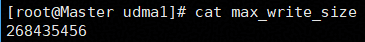

2.  应用场景

UMDK单边操作不需要对端的CPU参与，不同于双边操作send/recv一般用于传输一些控制信息，单边操作read/write适用于大规模的数据传输。

3.  注意事项

（1）用户发送和接收的本地缓存必须事先调用urma_register_seg注册到设备

（2）对于IB传输层，JFS向某个JFR发送消息之前，必须调用urma_advise_jfr通知UMDK建立从JFS到JFR的传输通道。UB JFS天然具有一对多通信能力，发送消息之前无需调用urma_advise_jfr这个步骤。

（3）不同的传输层最大发送消息大小有所不同，可以通过查询设备属性获取发送消息的规格。

（4）上述单边、双边和原子操作都是非阻塞的，操作返回成功仅表示命令已经添加到发送或者接受队列，并不意味着已经全部完成。UMDK支持以轮询或中断方式获知单边、双边或原子操作是否已经完成。完成记录（completion record）用来描述操作完成信息。操作完成后，硬件会将完成记录写到JFC完成队列中。当用户轮询JFC时，UMDK读取完成队列的完成记录返回给用户。单边、双边、原子等操作的完成记录将默认写入JFS或JFR所关联的JFC中。UB设备支持在JFS command（即WQE）中指定完成记录待写入的JFC id。


URMA的单边语义报文参考业界RDMA通用实现，存在与RDMA类似的安全风险，受限于数据中心信任网络内使用。

4.  使用说明

UMDK单边读/写的过程为：

1 调用urma_read，urma_write或urma_post_jfs_wr提交一个读或写的请求至先前注册好的jfs。

2 调用urma_poll_jfc进行轮询，查看jfc中是否有cqe到来，当urma_poll_jfc返回值大于0时，即表示轮询到有cqe,表示此次读操作完成。请求完成后，用户才能重新使用（修改或释放）发送消息缓存

- **urma_post_jetty_send_wr**：这个函数用于发起单边操作的请求，比如写入远程内存。函数参数包括jetty（命令执行的端口）、wr（包含源地址、目的地址、长度等信息的发送请求）和bad_wr（用于存储发送失败的wr）。如果操作成功，函数返回0，否则返回错误代码。

- **urma_read**：这个函数允许应用程序从远程内存中读取数据，同样不需要远程进程的参与。

- **urma_write**：这个函数允许应用程序向远程内存写入数据，同样不需要远程进程的响应。注意，URMA的单边写操作不支持notify远端，但支持携带IMM（Immediate）数据，这是一种可以附加到消息中的小块数据，用于传递额外的信息。

- 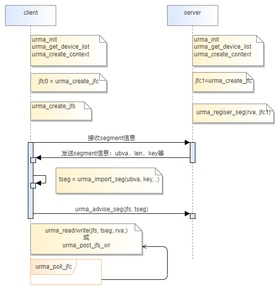

### 双边操作

1.  概述

消息语义提供了双边Messaging服务，类似于UDP/TCP socket接口或IB的send/receive接口。UMDK的消息语义是异步非阻塞的，消息接收端需要显示地接收消息，接收完成后读取消息继续其他处理。

UMDK支持一对多消息语义：从同一个JFS向不同的JFR发送消息，这些JFR可能位于不同的远端节点或进程。

UMDK支持以inline方式发送消息，当消息小于UMDK inline阈值时，将UMDK将自动以inline方式发送消息，减少DMA开销以提高发送性能。

UMDK双边操作对本端和远端均支持连续内存和非连续内存。urma_send与urma_recv只支持连续地址。urma_post_jfs_wr和urma_post_jfr_wr支持本端和远端使用连续地址或sgl类型的非连续地址。

UMDK支持向接收端发送立即数，见urma_post_jfs_wr接口，所发送的立即数将出现在接收端的完成记录（completion record）中。

2.  应用场景

消息语义应用广泛，例如实现MPI send、recv消息发送，RPC语义，实现UCX的am消息语义等

3.  注意事项

（1）用户发送和接收的本地缓存必须事先调用urma_register_seg注册到设备

（2）对于IB传输层，JFS向某个JFR发送消息之前，必须调用urma_advise_jfr通知UMDK建立从JFS到JFR的传输通道。UB JFS天然具有一对多通信能力，发送消息之前无需调用urma_advise_jfr这个步骤。

（3）不同的传输层最大发送消息大小有所不同，可以通过查询设备属性获取发送消息的规格。

4.  使用说明

接收消息过程为

（1）调用urma recv或urma_post_jfr_wr提交一个接收请求，将本地接收缓存添加到jfr中

（2）调用urma_poll_jfc轮询接收请求，请求完成后，用户才能从接收缓存中读取消息内容

为了提高吞吐量服务器端可以批量提交多个接收请求。每成功接收到一个消息后，向JFR补充新的接收请求。或者当JFR的接收请求数低于某个阈值时，向JFR补充新的接收请求。

接收端通过完成记录中的接收长度获得具体收到的有效消息长度，也通过完成记录获知发送端是否发送了立即数。

发送消息过程为：

（1）用户调用urma send或urma_post_jfs_wr通过JFS提交一个发送请求，

（2）调用urma_poll_jfc轮询接收请求，请求完成后，用户才能重新使用（修改或释放）发送消息缓存

- **urma_post_jetty_send_wr**：在双边操作中，这个函数同样用于发起请求，但发送的数据可能会被远程进程接收和处理。

- **urma_recv**：接收方使用这个函数从远程内存接收数据。

- **urma_send**：发送方使用这个函数向远程内存发送数据，支持携带IMM数据，并且可以设置为with invalid，这意味着即使目标地址无效，操作也会继续执行。

### 完成记录

1.  概述

上述单边、双边和原子操作都是非阻塞的，操作返回成功仅表示命令已经添加到发送或者接受队列，并不意味着已经全部完成。UMDK支持以轮询或中断方式获知单边、双边或原子操作是否已经完成。完成记录（completion record）用来描述操作完成信息。操作完成后，硬件会将完成记录写到JFC完成队列中。当用户轮询JFC时，UMDK读取完成队列的完成记录返回给用户。

单边、双边、原子等操作的完成记录将默认写入JFS或JFR所关联的JFC中。UB设备支持在JFS command（即WQE）中指定完成记录待写入的JFC id。

2.  应用场景

轮询方式应用于低时延场景，用户通过不断查询完成记录，获取操作的执行状态以进行下一步操作，不断轮询操作将提高CPU占用率。中断方式应用于通信不太频繁的场景，用户线程以睡眠状态等待完成事件，CPU开销小，当完成事件发生时，UMDK将唤醒等待的线程。

3.  注意事项

（1）用户调用urma_recv时，接收完成时总会产生一个完成记录。用户调用urma_read/write/cas/fao/send时，默认操作将会产生一个完成记录；如果JFC处于事件使能状态（armed）也默认将产生一个完成事件。

（2）如果用户使用urma_post_jfs_wr批量发送请求时，用户可以指定是否产生完成记录或者完成事件；

（3）用户提交操作（包括单边、双边、原子等）时，需要自行保证完成记录待写入的JFC不会溢出

（4）如果JFC中尚有未读取的完成记录，那么urma_rearm_jfc将返回失败

（5）urma_modify_jetty/jfs切换至ERROR/SUSPEND状态会产生完成记录，需要自行保证完成记录待写入的JFC不会溢出

4.  使用说明

中断模式等待完成事件的流程如下：

（1）调用urma_rearm_jfc使能完成事件；

（2）提交JFS操作（包括单边、双边、原子等），指定需要完成记录和完成时间

（3）调用urma_wait_jfc阻塞等待一个完成事件，返回产生完成事件的JFC；UMDK将默认去使能JFC完成事件

（4）判断返回的JFC和提交JFS操作所有的JFC相符合

（5）循环调用urma_poll_jfc读取完成记录，直到没有新的完成记录为止

（6）回到步骤（1）重新开启事件


轮询方式poll到完成事件的流程如下：

用户调用urma_poll_jfc以轮询方式查询完成记录，轮询是一种非阻塞的查询完成记录的方式，如果完成队列为空，则用户获取不到完成记录。完成记录的使用说明如下：

（1）用户通过完成记录的状态字段得知操作是否成功完成，如果出错，完成记录的状态字段反应出操作出错的原因；

（2）完成长度表示已经成功执行的数据长度，例如发送长度或接收消息长度

（3）如果完成记录为JFS类型，则用户可以修改或释放操作对应的本地缓存

（4）如果完成记录为JFR类型，表示用户可以从接收缓存中读取消息；

（5）如果notify_data标志位使能，则完成记录中还携带了立即数

（6）用户通过完成记录的completion_record_data中的操作上下文（例如urma_read api中的user_ctx参数），关联到具体某个操作

**中断接口推荐顺序：**


5.  触发场景

以下场景将触发JFC生成一条完成记录：

1、在执行常规数据面操作过程中，若遇到不支持的操作类型、消息长度超出系统允许上限、请求格式不符合规范要求，或本端及对端访问的内存资源已被注销等异常情况，在提交工作请求的操作成功前提下，会生成一条完成记录。

2、Flush 操作正常完成，未发生任何异常或错误

3、Jetty/JFS 成功切换至 SUSPEND 状态

4、Jetty/JFS 成功切换至 ERROR 状态

# 关键特性介绍


[6.1 特性树](#特性树)

[6.2 设备聚合](#设备聚合)

[6.3 虚拟化](#虚拟化)

[6.4 工具手册](#工具手册)

[6.5 DFX维测](#dfx维测)

## 特性树

+-------------+----------------------+-------------------------+-------------------------------------------------------------+------------------------+-------------------------------------------------------+---------+----------+
| 特性Level 1 | 特性Level 2          | 特性Level 3             | 特性Level 4                                                 | 特性Level 5            | 特性描述                                              | 鲲鹏950 | 昇腾910D |
+:============+:=====================+:========================+:============================================================+:=======================+:======================================================+:========+:=========+
| 管理面接口  | URMA初始化           | init/unint              | 基本能力                                                    |                        | 初始化/反初始化URMA运行环境                           | √       | √        |
|             |                      |                         +-------------------------------------------------------------+------------------------+-------------------------------------------------------+---------+----------+
|             |                      |                         | token                                                       |                        | 指定安全token                                         | ×       | ×        |
|             |                      |                         +-------------------------------------------------------------+------------------------+-------------------------------------------------------+---------+----------+
|             |                      |                         | uasid                                                       |                        | 指定进程的uasid                                       | ×       | ×        |
|             +----------------------+-------------------------+-------------------------------------------------------------+------------------------+-------------------------------------------------------+---------+----------+
|             | URMA设备及上下文管理 | get/free_device_list    |                                                             |                        | 获取/释放设备列表                                     | √       | √        |
|             |                      +-------------------------+-------------------------------------------------------------+------------------------+-------------------------------------------------------+---------+----------+
|             |                      | get_device_by_name      |                                                             |                        | 通过设备名称获取设备                                  | √       | √        |
|             |                      +-------------------------+-------------------------------------------------------------+------------------------+-------------------------------------------------------+---------+----------+
|             |                      | get_device_by_eid       |                                                             |                        | 通过EID获取设备                                       | √       | √        |
|             |                      +-------------------------+-------------------------------------------------------------+------------------------+-------------------------------------------------------+---------+----------+
|             |                      | query_device            |                                                             |                        | 查询设备属性                                          | √       | √        |
|             |                      +-------------------------+-------------------------------------------------------------+------------------------+-------------------------------------------------------+---------+----------+
|             |                      | create/delete_context   |                                                             |                        | 创建/删除设备上下文                                   | √       | √        |
|             +----------------------+-------------------------+-------------------------------------------------------------+------------------------+-------------------------------------------------------+---------+----------+
|             | JFC基础能力管理      | create/delete_jfc       | 基本能力                                                    |                        | 创建/删除JFC                                          | √       | √        |
|             |                      |                         +-------------------------------------------------------------+------------------------+-------------------------------------------------------+---------+----------+
|             |                      |                         | cfg.flag.jfc_inline                                         |                        | 支持inline配置                                        | √       | √        |
|             |                      +-------------------------+-------------------------------------------------------------+------------------------+-------------------------------------------------------+---------+----------+
|             |                      | delete_jfc_batch        |                                                             |                        | 批量删除JFC                                           | ×       | ×        |
|             |                      +-------------------------+-------------------------------------------------------------+------------------------+-------------------------------------------------------+---------+----------+
|             |                      | modify_jfc              | moderate_count/moderate_period                              |                        | 修改JFC中断抑制参数                                   | ×       | ×        |
|             +----------------------+-------------------------+-------------------------------------------------------------+------------------------+-------------------------------------------------------+---------+----------+
|             | JFS基础能力管理      | create/delete_jfs       | 基本能力                                                    |                        | 创建/删除JFS                                          | √       | √        |
|             |                      |                         +-------------------------------------------------------------+------------------------+-------------------------------------------------------+---------+----------+
|             |                      |                         | lock_free                                                   |                        | 免锁模式，驱动内并发操作不加锁，由业务保证线程安全    | √       | √        |
|             |                      |                         +-------------------------------------------------------------+------------------------+-------------------------------------------------------+---------+----------+
|             |                      |                         | error_suspend                                               |                        | 数据面异常置错                                        | √       | √        |
|             |                      |                         +-------------------------------------------------------------+------------------------+-------------------------------------------------------+---------+----------+
|             |                      |                         | outorder_comp                                               |                        | 乱序上报完成事件                                      | √       | √        |
|             |                      |                         +-------------------------------------------------------------+------------------------+-------------------------------------------------------+---------+----------+
|             |                      |                         | order_type                                                  | OT                     | target ordering 目的端保序                            | √       | √        |
|             |                      |                         |                                                             |                        |                                                       |         |          |
|             |                      |                         | （保序模式）                                                |                        |                                                       |         |          |
|             |                      |                         |                                                             +------------------------+-------------------------------------------------------+---------+----------+
|             |                      |                         |                                                             | OI                     | initiator ordering 源端保序                           | √       | √        |
|             |                      |                         |                                                             +------------------------+-------------------------------------------------------+---------+----------+
|             |                      |                         |                                                             | OL                     | low layer ordering 通道（硬件）保序                   | √       | √        |
|             |                      |                         |                                                             +------------------------+-------------------------------------------------------+---------+----------+
|             |                      |                         |                                                             | UNO                    | unreliable non ordering 无序                          | √       | √        |
|             |                      |                         +-------------------------------------------------------------+------------------------+-------------------------------------------------------+---------+----------+
|             |                      |                         | multi_path                                                  |                        | 设备多路径能力                                        | √       | √        |
|             |                      |                         +-------------------------------------------------------------+------------------------+-------------------------------------------------------+---------+----------+
|             |                      |                         | ctp_rc_mul_path_mode                                        |                        | 针对RC模式CTP通信的多路径能力                         | √       | √        |
|             |                      |                         +-------------------------------------------------------------+------------------------+-------------------------------------------------------+---------+----------+
|             |                      |                         | trans_mode                                                  | RM                     | 无连接可靠传输模式                                    | √       | √        |
|             |                      |                         |                                                             +------------------------+-------------------------------------------------------+---------+----------+
|             |                      |                         |                                                             | RC                     | 连接可靠传输模式                                      | √       | √        |
|             |                      |                         |                                                             +------------------------+-------------------------------------------------------+---------+----------+
|             |                      |                         |                                                             | UM                     | 无连接不可靠传输模式                                  | √       | √        |
|             |                      |                         +-------------------------------------------------------------+------------------------+-------------------------------------------------------+---------+----------+
|             |                      |                         | priority                                                    |                        | 配置优先级                                            | √       | √        |
|             |                      |                         +-------------------------------------------------------------+------------------------+-------------------------------------------------------+---------+----------+
|             |                      |                         | max_inline_data                                             |                        | 支持配置inline大小                                    | √       | √        |
|             |                      |                         +-------------------------------------------------------------+------------------------+-------------------------------------------------------+---------+----------+
|             |                      |                         | rnr_retry                                                   |                        | 支持配置rnr等重试次数                                 | √       | √        |
|             |                      |                         +-------------------------------------------------------------+------------------------+-------------------------------------------------------+---------+----------+
|             |                      |                         | err_timeout                                                 |                        | 支持配置错误超时时间                                  | √       | √        |
|             |                      +-------------------------+-------------------------------------------------------------+------------------------+-------------------------------------------------------+---------+----------+
|             |                      | delete_jfs_batch        |                                                             |                        | 批量删除JFS                                           | √       | √        |
|             |                      +-------------------------+-------------------------------------------------------------+------------------------+-------------------------------------------------------+---------+----------+
|             |                      | modify_jfs              | state                                                       |                        | 修改JFS的状态机                                       | √       | √        |
|             +----------------------+-------------------------+-------------------------------------------------------------+------------------------+-------------------------------------------------------+---------+----------+
|             | JFR基础能力管理      | create/delete_jfr       | 基本能力                                                    |                        |                                                       | √       | √        |
|             |                      |                         +-------------------------------------------------------------+------------------------+-------------------------------------------------------+---------+----------+
|             |                      |                         | 指定jfr_id                                                  |                        |                                                       | √       | √        |
|             |                      |                         +-------------------------------------------------------------+------------------------+-------------------------------------------------------+---------+----------+
|             |                      |                         | token_policy                                                | NONE                   | 不携带TokenValue                                      | √       | √        |
|             |                      |                         |                                                             |                        |                                                       |         |          |
|             |                      |                         | 安全策略                                                    |                        |                                                       |         |          |
|             |                      |                         |                                                             +------------------------+-------------------------------------------------------+---------+----------+
|             |                      |                         |                                                             | PLAIN_TEXT             | 传输TokenValue明文                                    | √       | √        |
|             |                      |                         |                                                             +------------------------+-------------------------------------------------------+---------+----------+
|             |                      |                         |                                                             | SIGNED                 | 加密传输TokenValue，明文传输PLD                       | √       | √        |
|             |                      |                         |                                                             +------------------------+-------------------------------------------------------+---------+----------+
|             |                      |                         |                                                             | ALL_ENCRYPTED          | 加密传输TokenValue和PLD                               | ×       | ×        |
|             |                      |                         +-------------------------------------------------------------+------------------------+-------------------------------------------------------+---------+----------+
|             |                      |                         | lock_free                                                   |                        | 免锁模式                                              | √       | √        |
|             |                      |                         +-------------------------------------------------------------+------------------------+-------------------------------------------------------+---------+----------+
|             |                      |                         | order_type                                                  | OT                     | target ordering 目的端保序                            | √       | √        |
|             |                      |                         |                                                             |                        |                                                       |         |          |
|             |                      |                         | （保序模式）                                                |                        |                                                       |         |          |
|             |                      |                         |                                                             +------------------------+-------------------------------------------------------+---------+----------+
|             |                      |                         |                                                             | OI                     | initiator ordering 源端保序                           | √       | √        |
|             |                      |                         |                                                             +------------------------+-------------------------------------------------------+---------+----------+
|             |                      |                         |                                                             | OL                     | low layer ordering 通道（硬件）保序                   | √       | √        |
|             |                      |                         |                                                             +------------------------+-------------------------------------------------------+---------+----------+
|             |                      |                         |                                                             | UNO                    | unreliable non ordering 无序                          | √       | √        |
|             |                      |                         +-------------------------------------------------------------+------------------------+-------------------------------------------------------+---------+----------+
|             |                      |                         | trans_mode                                                  | RM                     | 无连接可靠传输模式                                    | √       | √        |
|             |                      |                         |                                                             |                        |                                                       |         |          |
|             |                      |                         | 配置传输层类型                                              |                        |                                                       |         |          |
|             |                      |                         |                                                             +------------------------+-------------------------------------------------------+---------+----------+
|             |                      |                         |                                                             | RC                     | 连接可靠传输模式                                      | √       | √        |
|             |                      |                         |                                                             +------------------------+-------------------------------------------------------+---------+----------+
|             |                      |                         |                                                             | UM                     | 无连接不可靠传输模式                                  | √       | √        |
|             |                      |                         +-------------------------------------------------------------+------------------------+-------------------------------------------------------+---------+----------+
|             |                      |                         | min_rnr_timer                                               |                        | 配置rnr最小重试时间                                   | √       | √        |
|             |                      +-------------------------+-------------------------------------------------------------+------------------------+-------------------------------------------------------+---------+----------+
|             |                      | delete_jfr_batch        |                                                             |                        | 批量删除JFR                                           | √       | √        |
|             |                      +-------------------------+-------------------------------------------------------------+------------------------+-------------------------------------------------------+---------+----------+
|             |                      | modify_jfr              | rx_threshold                                                |                        | 修改RX WQ的最低水位                                   | √       | √        |
|             |                      |                         +-------------------------------------------------------------+------------------------+-------------------------------------------------------+---------+----------+
|             |                      |                         | state                                                       |                        | 修改JFR的状态机                                       | √       | √        |
|             |                      +-------------------------+-------------------------------------------------------------+------------------------+-------------------------------------------------------+---------+----------+
|             |                      | import/unimport_jfr     |                                                             |                        | 导入/反导入远端JFR                                    | √       | √        |
|             |                      +-------------------------+-------------------------------------------------------------+------------------------+-------------------------------------------------------+---------+----------+
|             |                      | import_jfr_async        |                                                             |                        | 异步导入源端JFR                                       | √       | √        |
|             +----------------------+-------------------------+-------------------------------------------------------------+------------------------+-------------------------------------------------------+---------+----------+
|             | jetty基础能力管理    | create/delete_jetty     | 基本能力                                                    |                        | 创建/删除Jetty                                        | √       | √        |
|             |                      |                         +-------------------------------------------------------------+------------------------+-------------------------------------------------------+---------+----------+
|             |                      |                         | jetty_cfg                                                   |                        | 配置特性与JFS&JFR一致                                 | √       | √        |
|             |                      |                         +-------------------------------------------------------------+------------------------+-------------------------------------------------------+---------+----------+
|             |                      |                         | jetty_id                                                    |                        | 指定jetty id                                          | √       | √        |
|             |                      |                         +-------------------------------------------------------------+------------------------+-------------------------------------------------------+---------+----------+
|             |                      |                         | share_jfr                                                   |                        | 配置共享JFR                                           | √       | √        |
|             |                      |                         +-------------------------------------------------------------+------------------------+-------------------------------------------------------+---------+----------+
|             |                      |                         | jetty_grp                                                   |                        | 配置Jetty Group                                       | ×       | ×        |
|             |                      +-------------------------+-------------------------------------------------------------+------------------------+-------------------------------------------------------+---------+----------+
|             |                      | delete_jetty_batch      |                                                             |                        | 批量删除Jetty                                         | √       | √        |
|             |                      +-------------------------+-------------------------------------------------------------+------------------------+-------------------------------------------------------+---------+----------+
|             |                      | modify_jetty            | state                                                       |                        | 修改Jetty状态                                         | √       | √        |
|             |                      |                         +-------------------------------------------------------------+------------------------+-------------------------------------------------------+---------+----------+
|             |                      |                         | rx_threshold                                                |                        | 修改RX WQ的最低水位                                   | ×       | ×        |
|             |                      +-------------------------+-------------------------------------------------------------+------------------------+-------------------------------------------------------+---------+----------+
|             |                      | import/unimport_jetty   | 基本能力                                                    |                        | 导入/反导入远端jetty                                  | √       | √        |
|             |                      |                         +-------------------------------------------------------------+------------------------+-------------------------------------------------------+---------+----------+
|             |                      |                         | tp_type                                                     | RTP                    | 可靠传输模式                                          | √       | √        |
|             |                      |                         |                                                             |                        |                                                       |         |          |
|             |                      |                         | 选择使用的TP类型                                            |                        |                                                       |         |          |
|             |                      |                         |                                                             +------------------------+-------------------------------------------------------+---------+----------+
|             |                      |                         |                                                             | CTP                    | 轻量级传输模式                                        | √       | √        |
|             |                      |                         |                                                             +------------------------+-------------------------------------------------------+---------+----------+
|             |                      |                         |                                                             | UTP                    | 不可靠传输模式                                        | √       | √        |
|             |                      +-------------------------+-------------------------------------------------------------+------------------------+-------------------------------------------------------+---------+----------+
|             |                      | bind/unbind_jetty       |                                                             |                        | bind/unbind远端jetty                                  | √       | √        |
|             |                      +-------------------------+-------------------------------------------------------------+------------------------+-------------------------------------------------------+---------+----------+
|             |                      | import_jetty_async      |                                                             |                        | 异步导入远端Jetty                                     | ×       | ×        |
|             |                      +-------------------------+-------------------------------------------------------------+------------------------+-------------------------------------------------------+---------+----------+
|             |                      | bind_jetty_async        |                                                             |                        | 异步bind源端Jetty                                     | ×       | ×        |
|             +----------------------+-------------------------+-------------------------------------------------------------+------------------------+-------------------------------------------------------+---------+----------+
|             | JFCE基础能力管理     | create/delete_jfce      |                                                             |                        | 创建/删除JFCE                                         | √       | √        |
|             +----------------------+-------------------------+-------------------------------------------------------------+------------------------+-------------------------------------------------------+---------+----------+
|             | 异步事件上报         | get_async_event         | 查询jetty异常                                               |                        |                                                       | √       | √        |
|             |                      |                         +-------------------------------------------------------------+------------------------+-------------------------------------------------------+---------+----------+
|             |                      |                         | port异常                                                    |                        |                                                       | √       | √        |
|             |                      |                         +-------------------------------------------------------------+------------------------+-------------------------------------------------------+---------+----------+
|             |                      |                         | 设备异常                                                    |                        |                                                       | √       | √        |
|             |                      |                         +-------------------------------------------------------------+------------------------+-------------------------------------------------------+---------+----------+
|             |                      |                         | Entity异常                                                  |                        |                                                       | √       | √        |
|             |                      +-------------------------+-------------------------------------------------------------+------------------------+-------------------------------------------------------+---------+----------+
|             |                      | ack_async_event         |                                                             |                        | 用户响应异步事件                                      | √       | √        |
|             +----------------------+-------------------------+-------------------------------------------------------------+------------------------+-------------------------------------------------------+---------+----------+
|             | segment管理          | register/unregister_seg | 基本功能                                                    |                        | 注册/反注册内存                                       | √       | √        |
|             |                      |                         +-------------------------------------------------------------+------------------------+-------------------------------------------------------+---------+----------+
|             |                      |                         | token_policy                                                |                        | 指定key验证策略                                       | √       | √        |
|             |                      |                         +-------------------------------------------------------------+------------------------+-------------------------------------------------------+---------+----------+
|             |                      |                         | cacheable                                                   |                        | 是否使能缓存                                          | √       | √        |
|             |                      |                         +-------------------------------------------------------------+------------------------+-------------------------------------------------------+---------+----------+
|             |                      |                         | access                                                      | LOCAL_ONLY             |                                                       | √       | √        |
|             |                      |                         |                                                             |                        |                                                       |         |          |
|             |                      |                         | 访问控制权限                                                |                        |                                                       |         |          |
|             |                      |                         |                                                             +------------------------+-------------------------------------------------------+---------+----------+
|             |                      |                         |                                                             | ACCESS_READ            |                                                       | √       | √        |
|             |                      |                         |                                                             +------------------------+-------------------------------------------------------+---------+----------+
|             |                      |                         |                                                             | ACCESS_WRITE           |                                                       | √       | √        |
|             |                      |                         |                                                             +------------------------+-------------------------------------------------------+---------+----------+
|             |                      |                         |                                                             | ACCESS_ATOMIC          |                                                       | √       | √        |
|             |                      |                         +-------------------------------------------------------------+------------------------+-------------------------------------------------------+---------+----------+
|             |                      |                         | non_pin                                                     |                        | 是否支持no_pin住内存                                  | ×       | ×        |
|             |                      |                         +-------------------------------------------------------------+------------------------+-------------------------------------------------------+---------+----------+
|             |                      |                         | user_iova                                                   |                        | 是否使用iova                                          | ×       | ×        |
|             |                      |                         +-------------------------------------------------------------+------------------------+-------------------------------------------------------+---------+----------+
|             |                      |                         | token_id_valid                                              |                        | 是否指定token_id                                      | √       | √        |
|             |                      +-------------------------+-------------------------------------------------------------+------------------------+-------------------------------------------------------+---------+----------+
|             |                      | import/unimport_seg     | 基本功能                                                    |                        | 导入/导出远端内存                                     | √       | √        |
|             |                      |                         +-------------------------------------------------------------+------------------------+-------------------------------------------------------+---------+----------+
|             |                      |                         | cacheable                                                   |                        | 是否使能缓存                                          | √       | √        |
|             |                      |                         +-------------------------------------------------------------+------------------------+-------------------------------------------------------+---------+----------+
|             |                      |                         | mapping                                                     |                        | 是否映射到本地地址                                    | √       | √        |
|             +----------------------+-------------------------+-------------------------------------------------------------+------------------------+-------------------------------------------------------+---------+----------+
|             | JFC拓展能力管理      | alloc/free_jfc          |                                                             |                        | 申请/释放JFC内存                                      | √       | √        |
|             |                      +-------------------------+-------------------------------------------------------------+------------------------+-------------------------------------------------------+---------+----------+
|             |                      | active/deactive_jfc     |                                                             |                        | 硬件使能/失效JFC                                      | √       | √        |
|             |                      +-------------------------+-------------------------------------------------------------+------------------------+-------------------------------------------------------+---------+----------+
|             |                      | set/get_jfc_opt         | 基本能力                                                    |                        | 设置/获取JFC属性                                      | √       | √        |
|             |                      |                         +-------------------------------------------------------------+------------------------+-------------------------------------------------------+---------+----------+
|             |                      |                         | 基本属性                                                    |                        | 创建JFC的基本属性                                     | √       | √        |
|             |                      |                         +-------------------------------------------------------------+------------------------+-------------------------------------------------------+---------+----------+
|             |                      |                         | CQE_BASE_ADDR                                               |                        | CQE的地址                                             | √       | √        |
|             |                      |                         +-------------------------------------------------------------+------------------------+-------------------------------------------------------+---------+----------+
|             |                      |                         | JFC_ID                                                      |                        | JFC的ID                                               | √       | √        |
|             |                      |                         +-------------------------------------------------------------+------------------------+-------------------------------------------------------+---------+----------+
|             |                      |                         | JFC_DB_ADDR                                                 |                        | CQ队列Doorbell地址                                    | √       | √        |
|             |                      |                         +-------------------------------------------------------------+------------------------+-------------------------------------------------------+---------+----------+
|             |                      |                         | JFC_DB_STATUS                                               |                        | JFC Doorbell的状态                                    | ×       | ×        |
|             |                      |                         +-------------------------------------------------------------+------------------------+-------------------------------------------------------+---------+----------+
|             |                      |                         | JFC_PI                                                      |                        | JFC任务队列的PI值                                     | √       | √        |
|             |                      |                         +-------------------------------------------------------------+------------------------+-------------------------------------------------------+---------+----------+
|             |                      |                         | JFC_PI_TYPE                                                 |                        | JFC任务队列PI指代的类型（绝对值/相对值）              | √       | √        |
|             |                      |                         +-------------------------------------------------------------+------------------------+-------------------------------------------------------+---------+----------+
|             |                      |                         | JFC_CI                                                      |                        | JFC任务队列的CI值                                     | √       | √        |
|             +----------------------+-------------------------+-------------------------------------------------------------+------------------------+-------------------------------------------------------+---------+----------+
|             | JFS拓展能力管理      | alloc/free_jfs          |                                                             |                        | 申请/释放JFS内存                                      | √       | √        |
|             |                      +-------------------------+-------------------------------------------------------------+------------------------+-------------------------------------------------------+---------+----------+
|             |                      | active/deactive_jfs     |                                                             |                        | 硬件使能/失效JFS                                      | √       | √        |
|             |                      +-------------------------+-------------------------------------------------------------+------------------------+-------------------------------------------------------+---------+----------+
|             |                      | set/get_jfs_opt         | 基本能力                                                    |                        | 设置/获取JFS属性                                      | √       | √        |
|             +----------------------+-------------------------+-------------------------------------------------------------+------------------------+-------------------------------------------------------+---------+----------+
|             | JFR拓展能力管理      | alloc/free_jfr          |                                                             |                        | 申请/释放JFR内存                                      | √       | √        |
|             |                      +-------------------------+-------------------------------------------------------------+------------------------+-------------------------------------------------------+---------+----------+
|             |                      | active/deactive_jfr     |                                                             |                        | 硬件使能/失效JFR                                      | √       | √        |
|             |                      +-------------------------+-------------------------------------------------------------+------------------------+-------------------------------------------------------+---------+----------+
|             |                      | set/get_jfr_opt         | 基本能力                                                    |                        | 设置/获取JFR属性                                      | √       | √        |
|             +----------------------+-------------------------+-------------------------------------------------------------+------------------------+-------------------------------------------------------+---------+----------+
|             | Jetty拓展能力管理    | alloc/free_jetty        |                                                             |                        | 申请/释放JETTY内存                                    | √       | √        |
|             |                      +-------------------------+-------------------------------------------------------------+------------------------+-------------------------------------------------------+---------+----------+
|             |                      | active/deactive_jetty   |                                                             |                        | 硬件使能/失效JETTY                                    | √       | √        |
|             |                      +-------------------------+-------------------------------------------------------------+------------------------+-------------------------------------------------------+---------+----------+
|             |                      | set/get_jetty_opt       | 基本能力                                                    |                        | 设置/获取JETTY属性                                    | √       | √        |
|             +----------------------+-------------------------+-------------------------------------------------------------+------------------------+-------------------------------------------------------+---------+----------+
|             | 感知TP建链           | get_tp_list             |                                                             |                        | 静态查询可用TP                                        | √       | √        |
|             |                      +-------------------------+-------------------------------------------------------------+------------------------+-------------------------------------------------------+---------+----------+
|             |                      | get/set_tp_attr         |                                                             |                        | 获取/设置TP属性                                       | √       | √        |
|             |                      +-------------------------+-------------------------------------------------------------+------------------------+-------------------------------------------------------+---------+----------+
|             |                      | import_jetty_ex         |                                                             |                        | 指定TP建链                                            | √       | √        |
+-------------+----------------------+-------------------------+-------------------------------------------------------------+------------------------+-------------------------------------------------------+---------+----------+
|             | 设备聚合管理         | 基础能力                |                                                             |                        | 使用聚合设备创建上下文                                | √       | √        |
+-------------+----------------------+-------------------------+-------------------------------------------------------------+------------------------+-------------------------------------------------------+---------+----------+
|             |                      | 配置拓扑信息            |                                                             |                        | 配置设备聚合拓扑信息                                  | √       | √        |
+-------------+----------------------+-------------------------+-------------------------------------------------------------+------------------------+-------------------------------------------------------+---------+----------+
|             | IP over URMA         | 基础能力                |                                                             |                        | 呈现TCP/IP协议栈设备，对下对接URMA                    | √       | √        |
+-------------+----------------------+-------------------------+-------------------------------------------------------------+------------------------+-------------------------------------------------------+---------+----------+
|             | Verbs over URMA      | 基础能力                |                                                             |                        | 呈现RDMA协议栈设备，对下对接URMA                      | √       | √        |
+-------------+----------------------+-------------------------+-------------------------------------------------------------+------------------------+-------------------------------------------------------+---------+----------+
|             |                      |                         |                                                             |                        |                                                       |         |          |
+-------------+----------------------+-------------------------+-------------------------------------------------------------+------------------------+-------------------------------------------------------+---------+----------+
|                                                                                                                                                                                                                                  |
+-------------+----------------------+-------------------------+-------------------------------------------------------------+------------------------+-------------------------------------------------------+---------+----------+
| 数据面接口  | post操作             | post_jfs_wr             |                                                             |                        |                                                       | √       | √        |
|             |                      +-------------------------+-------------------------------------------------------------+------------------------+-------------------------------------------------------+---------+----------+
|             |                      | post_jfr_wr             |                                                             |                        |                                                       | √       | √        |
|             |                      +-------------------------+-------------------------------------------------------------+------------------------+-------------------------------------------------------+---------+----------+
|             |                      | post_jetty_send_wr      |                                                             |                        |                                                       | √       | √        |
|             |                      +-------------------------+-------------------------------------------------------------+------------------------+-------------------------------------------------------+---------+----------+
|             |                      | post_jetty_recv_wr      |                                                             |                        |                                                       | √       | √        |
|             +----------------------+-------------------------+-------------------------------------------------------------+------------------------+-------------------------------------------------------+---------+----------+
|             | 发送配置             | 执行序                  | none                                                        |                        |                                                       | √       | √        |
|             |                      |                         +-------------------------------------------------------------+------------------------+-------------------------------------------------------+---------+----------+
|             |                      |                         | RO                                                          |                        | 弱保序                                                | √       | √        |
|             |                      |                         +-------------------------------------------------------------+------------------------+-------------------------------------------------------+---------+----------+
|             |                      |                         | SO                                                          |                        | 强保序                                                | √       | √        |
|             |                      +-------------------------+-------------------------------------------------------------+------------------------+-------------------------------------------------------+---------+----------+
|             |                      | 完成序                  |                                                             |                        | 是否保序                                              | √       | √        |
|             |                      +-------------------------+-------------------------------------------------------------+------------------------+-------------------------------------------------------+---------+----------+
|             |                      | fence操作               |                                                             |                        |                                                       | √       | √        |
|             |                      +-------------------------+-------------------------------------------------------------+------------------------+-------------------------------------------------------+---------+----------+
|             |                      | solicited使能           |                                                             |                        |                                                       | √       | √        |
|             |                      +-------------------------+-------------------------------------------------------------+------------------------+-------------------------------------------------------+---------+----------+
|             |                      | 配置完成事件产生        |                                                             |                        |                                                       | √       | √        |
|             |                      +-------------------------+-------------------------------------------------------------+------------------------+-------------------------------------------------------+---------+----------+
|             |                      | 配置是否inline          |                                                             |                        |                                                       | √       | √        |
|             |                      +-------------------------+-------------------------------------------------------------+------------------------+-------------------------------------------------------+---------+----------+
|             |                      | 支持免import seg        |                                                             |                        |                                                       | todo    | todo     |
|             +----------------------+-------------------------+-------------------------------------------------------------+------------------------+-------------------------------------------------------+---------+----------+
|             | 内存连续             | sgl配置                 | 远端send/recv支持不连续，本端read/write/send/recv支持不连续 |                        |                                                       | √       | √        |
|             |                      +-------------------------+-------------------------------------------------------------+------------------------+-------------------------------------------------------+---------+----------+
|             |                      | wr_list配置             |                                                             |                        |                                                       | √       | √        |
|             +----------------------+-------------------------+-------------------------------------------------------------+------------------------+-------------------------------------------------------+---------+----------+
|             | 单边操作             | read                    | 仅支持1个src sge                                            |                        |                                                       | √       | √        |
|             |                      +-------------------------+-------------------------------------------------------------+------------------------+-------------------------------------------------------+---------+----------+
|             |                      | write                   | 仅支持1个dst sge                                            |                        |                                                       | √       | √        |
|             |                      |                         +-------------------------------------------------------------+------------------------+-------------------------------------------------------+---------+----------+
|             |                      |                         | 支持notify远端                                              |                        |                                                       | √       | √        |
|             |                      |                         +-------------------------------------------------------------+------------------------+-------------------------------------------------------+---------+----------+
|             |                      |                         | 支持携带IMM数据                                             |                        |                                                       | √       | √        |
|             |                      |                         +-------------------------------------------------------------+------------------------+-------------------------------------------------------+---------+----------+
|             |                      |                         | 支持write_with_atomic_add                                   |                        |                                                       | √       | √        |
|             +----------------------+-------------------------+-------------------------------------------------------------+------------------------+-------------------------------------------------------+---------+----------+
|             | 双边操作             | send                    |                                                             |                        |                                                       | √       | √        |
|             |                      |                         +-------------------------------------------------------------+------------------------+-------------------------------------------------------+---------+----------+
|             |                      |                         | 支持携带IMM数据                                             |                        |                                                       | √       | √        |
|             |                      |                         +-------------------------------------------------------------+------------------------+-------------------------------------------------------+---------+----------+
|             |                      |                         | with invalid                                                |                        |                                                       | √       | √        |
|             |                      +-------------------------+-------------------------------------------------------------+------------------------+-------------------------------------------------------+---------+----------+
|             |                      | recv                    |                                                             |                        |                                                       | √       | √        |
|             +----------------------+-------------------------+-------------------------------------------------------------+------------------------+-------------------------------------------------------+---------+----------+
|             | 原子操作             | cas                     |                                                             |                        |                                                       | ×       | ×        |
|             |                      |                         +-------------------------------------------------------------+------------------------+-------------------------------------------------------+---------+----------+
|             |                      |                         | 支持mask                                                    |                        |                                                       | ×       | ×        |
|             |                      +-------------------------+-------------------------------------------------------------+------------------------+-------------------------------------------------------+---------+----------+
|             |                      | faa                     |                                                             |                        |                                                       | ×       | ×        |
|             |                      |                         +-------------------------------------------------------------+------------------------+-------------------------------------------------------+---------+----------+
|             |                      |                         | 支持mask                                                    |                        |                                                       | ×       | ×        |
|             +----------------------+-------------------------+-------------------------------------------------------------+------------------------+-------------------------------------------------------+---------+----------+
|             | 完成操作             | poll_jfc                | 支持产生多个CR                                              |                        |                                                       | √       | √        |
|             |                      |                         +-------------------------------------------------------------+------------------------+-------------------------------------------------------+---------+----------+
|             |                      |                         | CR解析                                                      | status                 | 携带完成状态                                          | √       | √        |
|             |                      |                         |                                                             +------------------------+-------------------------------------------------------+---------+----------+
|             |                      |                         |                                                             | flag.s_r               | 携带是接收还是发送完成                                | √       | √        |
|             |                      |                         |                                                             +------------------------+-------------------------------------------------------+---------+----------+
|             |                      |                         |                                                             | opcode                 | 接收端CR携带发送端操作类型                            | √       | √        |
|             |                      |                         |                                                             +------------------------+-------------------------------------------------------+---------+----------+
|             |                      |                         |                                                             | user_ctx               | 携带user_ctx私有数据                                  | √       | √        |
|             |                      |                         |                                                             +------------------------+-------------------------------------------------------+---------+----------+
|             |                      |                         |                                                             | completion_len         | 携带完成长度                                          | √       | √        |
|             |                      |                         |                                                             +------------------------+-------------------------------------------------------+---------+----------+
|             |                      |                         |                                                             | local_id               | 携带本端jetty_id                                      | √       | √        |
|             |                      |                         |                                                             +------------------------+-------------------------------------------------------+---------+----------+
|             |                      |                         |                                                             | remote_id              | 接收端携带远端jetty信息                               | √       | √        |
|             |                      |                         |                                                             +------------------------+-------------------------------------------------------+---------+----------+
|             |                      |                         |                                                             | imm_data               | 携带IMM数据                                           | √       | √        |
|             |                      +-------------------------+-------------------------------------------------------------+------------------------+-------------------------------------------------------+---------+----------+
|             |                      | rearm_jfc               |                                                             |                        |                                                       | √       | √        |
|             |                      |                         +-------------------------------------------------------------+------------------------+-------------------------------------------------------+---------+----------+
|             |                      |                         | solicited_only                                              |                        | 配置是否只针对带solicited标记的报文产生事件           | √       | √        |
|             |                      +-------------------------+-------------------------------------------------------------+------------------------+-------------------------------------------------------+---------+----------+
|             |                      | wait_jfc                |                                                             |                        | 等待某个jfce的多个JFC产生事件                         | √       | √        |
|             |                      +-------------------------+-------------------------------------------------------------+------------------------+-------------------------------------------------------+---------+----------+
|             |                      | ack_jfc                 |                                                             |                        | 确认多个JFC产生的事件被处理完毕                       | √       | √        |
+-------------+----------------------+-------------------------+-------------------------------------------------------------+------------------------+-------------------------------------------------------+---------+----------+
|                                                                                                                                                                                                                                  |
+-------------+----------------------+-------------------------+-------------------------------------------------------------+------------------------+-------------------------------------------------------+---------+----------+
| DFX接口     | urma_admin配置       | eid                     |                                                             |                        |                                                       | ×       | ×        |
|             |                      +-------------------------+-------------------------------------------------------------+------------------------+-------------------------------------------------------+---------+----------+
|             |                      | upi                     | PF配置                                                      |                        |                                                       | ×       | ×        |
|             |                      |                         +-------------------------------------------------------------+------------------------+-------------------------------------------------------+---------+----------+
|             |                      |                         | VF配置                                                      |                        |                                                       | ×       | ×        |
|             +----------------------+-------------------------+-------------------------------------------------------------+------------------------+-------------------------------------------------------+---------+----------+
|             | urma_admin查询       | 设备列表                |                                                             |                        | 查询所有设备的基本信息，包含trans_mode、eid、status等 |         |          |
|             |                      +-------------------------+-------------------------------------------------------------+------------------------+-------------------------------------------------------+---------+----------+
|             |                      | 设备属性                | device_cap                                                  | feature                | 硬件特性                                              | √       | √        |
|             |                      |                         |                                                             +------------------------+-------------------------------------------------------+---------+----------+
|             |                      |                         |                                                             | max_jfc                | 硬件支持创建jfc个数上限                               | √       | √        |
|             |                      |                         |                                                             +------------------------+-------------------------------------------------------+---------+----------+
|             |                      |                         |                                                             | max_jfs                | 硬件支持创建jfs个数上限                               | √       | √        |
|             |                      |                         |                                                             +------------------------+-------------------------------------------------------+---------+----------+
|             |                      |                         |                                                             | max_jfr                | 硬件支持创建jfr数上限                                 | √       | √        |
|             |                      |                         |                                                             +------------------------+-------------------------------------------------------+---------+----------+
|             |                      |                         |                                                             | max_jetty              | 硬件支持创建jetty个数上限                             | √       | √        |
|             |                      |                         |                                                             +------------------------+-------------------------------------------------------+---------+----------+
|             |                      |                         |                                                             | max_jetty_in_jetty_grp | 硬件支持创建jetty group个数上限                       | √       | √        |
|             |                      |                         |                                                             +------------------------+-------------------------------------------------------+---------+----------+
|             |                      |                         |                                                             | jfc_depth              | 硬件支持创建jfc最大深度                               | √       | √        |
|             |                      |                         |                                                             +------------------------+-------------------------------------------------------+---------+----------+
|             |                      |                         |                                                             | jfs_depth              | 硬件支持创建jfs最大深度                               | √       | √        |
|             |                      |                         |                                                             +------------------------+-------------------------------------------------------+---------+----------+
|             |                      |                         |                                                             | jfr_depth              | 硬件支持创建jfr最大深度                               | √       | √        |
|             |                      |                         |                                                             +------------------------+-------------------------------------------------------+---------+----------+
|             |                      |                         |                                                             | max_jfs_inline_size    | 硬件支持最大发送inline大小                            | √       | √        |
|             |                      |                         |                                                             +------------------------+-------------------------------------------------------+---------+----------+
|             |                      |                         |                                                             | max_jfs_sge            | 硬件支持jfs中最大seg个数                              | √       | √        |
|             |                      |                         |                                                             +------------------------+-------------------------------------------------------+---------+----------+
|             |                      |                         |                                                             | max_jfs_rsge           | 硬件支持jfs中最大rseg个数                             | √       | √        |
|             |                      |                         |                                                             +------------------------+-------------------------------------------------------+---------+----------+
|             |                      |                         |                                                             | max_jfr_sge            | 硬件支持jfr中最大seg个数                              | √       | √        |
|             |                      |                         |                                                             +------------------------+-------------------------------------------------------+---------+----------+
|             |                      |                         |                                                             | max_msg_size           | 硬件支持最大messages大小                              | √       | √        |
|             |                      |                         |                                                             +------------------------+-------------------------------------------------------+---------+----------+
|             |                      |                         |                                                             | max_read_size          | 硬件支持read语义内容上限                              | √       | √        |
|             |                      |                         |                                                             +------------------------+-------------------------------------------------------+---------+----------+
|             |                      |                         |                                                             | max_write_size         | 硬件支持write语义内容上限                             | √       | √        |
|             |                      |                         |                                                             +------------------------+-------------------------------------------------------+---------+----------+
|             |                      |                         |                                                             | max_cas_size           | 硬件支持cas语义内容上限                               | √       | √        |
|             |                      |                         |                                                             +------------------------+-------------------------------------------------------+---------+----------+
|             |                      |                         |                                                             | max_swap_size          | 硬件支持swap语义内容上限                              | √       | √        |
|             |                      |                         |                                                             +------------------------+-------------------------------------------------------+---------+----------+
|             |                      |                         |                                                             | max_fetch_and_add_size | 硬件支持fetch_and_add语义内容上限                     | √       | √        |
|             |                      |                         |                                                             +------------------------+-------------------------------------------------------+---------+----------+
|             |                      |                         |                                                             | max_fetch_and_sub_size | 硬件支持fetch_and_sub语义内容上限                     | √       | √        |
|             |                      |                         |                                                             +------------------------+-------------------------------------------------------+---------+----------+
|             |                      |                         |                                                             | max_fetch_and_and_size | 硬件支持fetch_and_and语义内容上限                     | √       | √        |
|             |                      |                         |                                                             +------------------------+-------------------------------------------------------+---------+----------+
|             |                      |                         |                                                             | max_fetch_and_or_size  | 硬件支持fetch_and_or语义内容上限                      | √       | √        |
|             |                      |                         |                                                             +------------------------+-------------------------------------------------------+---------+----------+
|             |                      |                         |                                                             | max_fetch_and_xor_size | 硬件支持fetch_and_xor语义内容上限                     | √       | √        |
|             |                      |                         |                                                             +------------------------+-------------------------------------------------------+---------+----------+
|             |                      |                         |                                                             | atomic_feat            |                                                       | √       | √        |
|             |                      |                         |                                                             +------------------------+-------------------------------------------------------+---------+----------+
|             |                      |                         |                                                             | trans_mode             |                                                       | √       | √        |
|             |                      |                         |                                                             +------------------------+-------------------------------------------------------+---------+----------+
|             |                      |                         |                                                             | congestion_ctrl_alg    |                                                       | √       | √        |
|             |                      |                         |                                                             +------------------------+-------------------------------------------------------+---------+----------+
|             |                      |                         |                                                             | ceq_cnt                |                                                       | √       | √        |
|             |                      |                         |                                                             +------------------------+-------------------------------------------------------+---------+----------+
|             |                      |                         |                                                             | max_tp_in_tpg          |                                                       | √       | √        |
|             |                      |                         |                                                             +------------------------+-------------------------------------------------------+---------+----------+
|             |                      |                         |                                                             | max_eid_cnt            |                                                       | √       | √        |
|             |                      |                         |                                                             +------------------------+-------------------------------------------------------+---------+----------+
|             |                      |                         |                                                             | page_size_cap          |                                                       | √       | √        |
|             |                      |                         |                                                             +------------------------+-------------------------------------------------------+---------+----------+
|             |                      |                         |                                                             | max_oor_cnt            |                                                       | √       | √        |
|             |                      |                         |                                                             +------------------------+-------------------------------------------------------+---------+----------+
|             |                      |                         |                                                             | mn                     |                                                       | √       | √        |
|             |                      |                         |                                                             +------------------------+-------------------------------------------------------+---------+----------+
|             |                      |                         |                                                             | max_netaddr_cnt        |                                                       | √       | √        |
|             |                      |                         |                                                             +------------------------+-------------------------------------------------------+---------+----------+
|             |                      |                         |                                                             | rm_order_cap           |                                                       | √       | √        |
|             |                      |                         |                                                             +------------------------+-------------------------------------------------------+---------+----------+
|             |                      |                         |                                                             | rc_order_cap           |                                                       | √       | √        |
|             |                      |                         |                                                             +------------------------+-------------------------------------------------------+---------+----------+
|             |                      |                         |                                                             | rm_tp_cap              |                                                       | √       | √        |
|             |                      |                         |                                                             +------------------------+-------------------------------------------------------+---------+----------+
|             |                      |                         |                                                             | rc_tp_cap              |                                                       | √       | √        |
|             |                      |                         |                                                             +------------------------+-------------------------------------------------------+---------+----------+
|             |                      |                         |                                                             | um_tp_cap              |                                                       | √       | √        |
|             |                      |                         |                                                             +------------------------+-------------------------------------------------------+---------+----------+
|             |                      |                         |                                                             | tp_feature             |                                                       | √       | √        |
|             |                      |                         |                                                             +------------------------+-------------------------------------------------------+---------+----------+
|             |                      |                         |                                                             | priority_info          |                                                       | √       | √        |
|             |                      |                         +-------------------------------------------------------------+------------------------+-------------------------------------------------------+---------+----------+
|             |                      |                         | port_cnt                                                    |                        |                                                       | √       | √        |
|             |                      |                         +-------------------------------------------------------------+------------------------+-------------------------------------------------------+---------+----------+
|             |                      |                         | port_attr                                                   | max_mtu                |                                                       | √       | √        |
|             |                      |                         |                                                             +------------------------+-------------------------------------------------------+---------+----------+
|             |                      |                         |                                                             | state                  |                                                       | √       | √        |
|             |                      |                         |                                                             +------------------------+-------------------------------------------------------+---------+----------+
|             |                      |                         |                                                             | active_width           |                                                       | √       | √        |
|             |                      |                         |                                                             +------------------------+-------------------------------------------------------+---------+----------+
|             |                      |                         |                                                             | active_speed           |                                                       | √       | √        |
|             |                      |                         |                                                             +------------------------+-------------------------------------------------------+---------+----------+
|             |                      |                         |                                                             | active_mtu             |                                                       | √       | √        |
|             |                      +-------------------------+-------------------------------------------------------------+------------------------+-------------------------------------------------------+---------+----------+
|             |                      | upi                     |                                                             |                        |                                                       |         |          |
|             +----------------------+-------------------------+-------------------------------------------------------------+------------------------+-------------------------------------------------------+---------+----------+
|             | urma_perftest        | perftest测试类型配置    | send_lat                                                    |                        | 发送时延测试                                          | √       | √        |
|             |                      |                         +-------------------------------------------------------------+------------------------+-------------------------------------------------------+---------+----------+
|             |                      |                         | read_lat                                                    |                        | 读时延测试                                            | √       | √        |
|             |                      |                         +-------------------------------------------------------------+------------------------+-------------------------------------------------------+---------+----------+
|             |                      |                         | write_lat                                                   |                        | 写时延测试                                            | √       | √        |
|             |                      |                         +-------------------------------------------------------------+------------------------+-------------------------------------------------------+---------+----------+
|             |                      |                         | atomic_lat                                                  |                        | 原子操作时延测试                                      | √       | √        |
|             |                      |                         +-------------------------------------------------------------+------------------------+-------------------------------------------------------+---------+----------+
|             |                      |                         | send_bw                                                     |                        | 发送带宽测试                                          | √       | √        |
|             |                      |                         +-------------------------------------------------------------+------------------------+-------------------------------------------------------+---------+----------+
|             |                      |                         | read_bw                                                     |                        | 读带宽测试                                            | √       | √        |
|             |                      |                         +-------------------------------------------------------------+------------------------+-------------------------------------------------------+---------+----------+
|             |                      |                         | write_bw                                                    |                        | 写带宽测试                                            | √       | √        |
|             |                      |                         +-------------------------------------------------------------+------------------------+-------------------------------------------------------+---------+----------+
|             |                      |                         | atomic_bw                                                   |                        | 原子操作带宽测试                                      | √       | √        |
|             |                      +-------------------------+-------------------------------------------------------------+------------------------+-------------------------------------------------------+---------+----------+
|             |                      | perftest运行参数配置    | all                                                         |                        | 运行2\~2\^15范围内，2整数次幂递增长度                 | √       | √        |
|             |                      |                         +-------------------------------------------------------------+------------------------+-------------------------------------------------------+---------+----------+
|             |                      |                         | atomic_type                                                 |                        | 选择原子操作类型：cas/faa                             | √       | √        |
|             |                      |                         +-------------------------------------------------------------+------------------------+-------------------------------------------------------+---------+----------+
|             |                      |                         | simplex_mode                                                |                        | 选择单工模式jfs/jfr运行                               | √       | √        |
|             |                      |                         +-------------------------------------------------------------+------------------------+-------------------------------------------------------+---------+----------+
|             |                      |                         | bidirectional                                               |                        | 选择双向模式运行，仅用于带宽测试                      | √       | √        |
|             |                      |                         +-------------------------------------------------------------+------------------------+-------------------------------------------------------+---------+----------+
|             |                      |                         | jfc_depth                                                   |                        | 配置jfc深度                                           | √       | √        |
|             |                      |                         +-------------------------------------------------------------+------------------------+-------------------------------------------------------+---------+----------+
|             |                      |                         | dev                                                         |                        | 指定设备名称                                          | √       | √        |
|             |                      |                         +-------------------------------------------------------------+------------------------+-------------------------------------------------------+---------+----------+
|             |                      |                         | duration                                                    |                        | 指定运行时长，单位s                                   | √       | √        |
|             |                      |                         +-------------------------------------------------------------+------------------------+-------------------------------------------------------+---------+----------+
|             |                      |                         | use_jfce                                                    |                        | 选择中断通知方式                                      | √       | √        |
|             |                      |                         +-------------------------------------------------------------+------------------------+-------------------------------------------------------+---------+----------+
|             |                      |                         | eid_idx                                                     |                        | 指定EID index                                         | √       | √        |
|             |                      |                         +-------------------------------------------------------------+------------------------+-------------------------------------------------------+---------+----------+
|             |                      |                         | err_timeout                                                 |                        | 指定异常上报时间                                      | √       | √        |
|             |                      |                         +-------------------------------------------------------------+------------------------+-------------------------------------------------------+---------+----------+
|             |                      |                         | user_flat_api                                               |                        | 使用urma_send/urma_recv等flat类型API运行              | √       | √        |
|             |                      |                         +-------------------------------------------------------------+------------------------+-------------------------------------------------------+---------+----------+
|             |                      |                         | cpu_freq_f                                                  |                        | 获取CPU频率两种途径差异超过门限，产生告警打印         | √       | √        |
|             |                      |                         +-------------------------------------------------------------+------------------------+-------------------------------------------------------+---------+----------+
|             |                      |                         | help                                                        |                        | 帮助模式                                              | √       | √        |
|             |                      |                         +-------------------------------------------------------------+------------------------+-------------------------------------------------------+---------+----------+
|             |                      |                         | inline_size                                                 |                        | 配置inline值                                          | √       | √        |
|             |                      |                         +-------------------------------------------------------------+------------------------+-------------------------------------------------------+---------+----------+
|             |                      |                         | share_jfr                                                   |                        | 支持创建jetty时指定jfr                                | √       | √        |
|             |                      |                         +-------------------------------------------------------------+------------------------+-------------------------------------------------------+---------+----------+
|             |                      |                         | jettys                                                      |                        | 配置jetty/jfs/jfr数量                                 | √       | √        |
|             |                      |                         +-------------------------------------------------------------+------------------------+-------------------------------------------------------+---------+----------+
|             |                      |                         | token_policy                                                |                        | 配置token传输策略                                     | √       | √        |
|             |                      |                         +-------------------------------------------------------------+------------------------+-------------------------------------------------------+---------+----------+
|             |                      |                         | iters                                                       |                        | 配置运行循环次数                                      | √       | √        |
|             |                      |                         +-------------------------------------------------------------+------------------------+-------------------------------------------------------+---------+----------+
|             |                      |                         | no_peak                                                     |                        | 指定不输出峰值，仅用于带宽测试                        | √       | √        |
|             |                      |                         +-------------------------------------------------------------+------------------------+-------------------------------------------------------+---------+----------+
|             |                      |                         | jfs_post_list                                               |                        | 指定发送端wr链表串联数量                              | √       | √        |
|             |                      |                         +-------------------------------------------------------------+------------------------+-------------------------------------------------------+---------+----------+
|             |                      |                         | lock_free                                                   |                        | 配置jetty免锁模式                                     | √       | √        |
|             |                      |                         +-------------------------------------------------------------+------------------------+-------------------------------------------------------+---------+----------+
|             |                      |                         | priority                                                    |                        | 配置jetty调度优先级                                   | √       | √        |
|             |                      |                         +-------------------------------------------------------------+------------------------+-------------------------------------------------------+---------+----------+
|             |                      |                         | trans_mode                                                  |                        | 选择传输模式：RC/RM/UM                                | √       | √        |
|             |                      |                         +-------------------------------------------------------------+------------------------+-------------------------------------------------------+---------+----------+
|             |                      |                         | port                                                        |                        | 指定端口号                                            | √       | √        |
|             |                      |                         +-------------------------------------------------------------+------------------------+-------------------------------------------------------+---------+----------+
|             |                      |                         | cq_num                                                      |                        | 发送端在指定数量个wr中，产生一个cr                    | √       | √        |
|             |                      |                         +-------------------------------------------------------------+------------------------+-------------------------------------------------------+---------+----------+
|             |                      |                         | jfs_post_list                                               |                        | 指定接收端wr链表串联数量                              | √       | √        |
|             |                      |                         +-------------------------------------------------------------+------------------------+-------------------------------------------------------+---------+----------+
|             |                      |                         | jfr_depth                                                   |                        | 配置jfr深度                                           | √       | √        |
|             |                      |                         +-------------------------------------------------------------+------------------------+-------------------------------------------------------+---------+----------+
|             |                      |                         | size                                                        |                        | 配置传输字节长度，单位Byte                            | √       | √        |
|             |                      |                         +-------------------------------------------------------------+------------------------+-------------------------------------------------------+---------+----------+
|             |                      |                         | server                                                      |                        | 配置server端IP地址，格式xx.xx.xx.xx                   | √       | √        |
|             |                      |                         +-------------------------------------------------------------+------------------------+-------------------------------------------------------+---------+----------+
|             |                      |                         | jfs_depth                                                   |                        | 配置jfs深度                                           | √       | √        |
|             |                      |                         +-------------------------------------------------------------+------------------------+-------------------------------------------------------+---------+----------+
|             |                      |                         | warm_up                                                     |                        | 选择预热模式运行                                      | √       | √        |
|             |                      |                         +-------------------------------------------------------------+------------------------+-------------------------------------------------------+---------+----------+
|             |                      |                         | infinite                                                    |                        | 配置无限测试模式，仅支持BW测试，默认2s打印一次数据    | √       | √        |
|             |                      |                         +-------------------------------------------------------------+------------------------+-------------------------------------------------------+---------+----------+
|             |                      |                         | single_path                                                 |                        | 配置聚合设备性能测试使用但路径模式                    | √       | √        |
|             |                      |                         +-------------------------------------------------------------+------------------------+-------------------------------------------------------+---------+----------+
|             |                      |                         | inf_period_ms                                               |                        | 配置以ms为统计单位打印性能数据                        | √       | √        |
|             |                      |                         +-------------------------------------------------------------+------------------------+-------------------------------------------------------+---------+----------+
|             |                      |                         | rate_limit                                                  |                        | 配置速率上限（默认单位：Gbps）                        | √       | √        |
|             |                      |                         +-------------------------------------------------------------+------------------------+-------------------------------------------------------+---------+----------+
|             |                      |                         | rate_units                                                  |                        | 配置速率单位                                          | √       | √        |
|             |                      |                         +-------------------------------------------------------------+------------------------+-------------------------------------------------------+---------+----------+
|             |                      |                         | burst_size                                                  |                        | 在配置限速时，配置单个循环里发包大小上限              | √       | √        |
|             |                      |                         +-------------------------------------------------------------+------------------------+-------------------------------------------------------+---------+----------+
|             |                      |                         | enable_ipv6                                                 |                        | 配置使能ipv6作为监听IP                                | √       | √        |
|             |                      |                         +-------------------------------------------------------------+------------------------+-------------------------------------------------------+---------+----------+
|             |                      |                         | enable_credit                                               |                        | 使能发包限制任务个数                                  | √       | √        |
|             |                      |                         +-------------------------------------------------------------+------------------------+-------------------------------------------------------+---------+----------+
|             |                      |                         | credit_threshold                                            |                        | 配置发包限速的水线                                    | √       | √        |
|             |                      |                         +-------------------------------------------------------------+------------------------+-------------------------------------------------------+---------+----------+
|             |                      |                         | credit_notify_cnt                                           |                        | 配置在接收者收到指定数量后通知发送者                  | √       | √        |
|             |                      |                         +-------------------------------------------------------------+------------------------+-------------------------------------------------------+---------+----------+
|             |                      |                         | jettys_pre_jfr                                              |                        | 配置每个JFR共享的次数                                 | √       | √        |
|             |                      |                         +-------------------------------------------------------------+------------------------+-------------------------------------------------------+---------+----------+
|             |                      |                         | seg_pre_jetty                                               |                        | 配置每个jetty的sge个数                                | √       | √        |
|             |                      |                         +-------------------------------------------------------------+------------------------+-------------------------------------------------------+---------+----------+
|             |                      |                         | enable_imm                                                  |                        | 配置使能immediate语义                                 | √       | √        |
|             |                      |                         +-------------------------------------------------------------+------------------------+-------------------------------------------------------+---------+----------+
|             |                      |                         | enable_err_continue                                         |                        | 配置使能异常继续特性                                  | √       | √        |
|             |                      |                         +-------------------------------------------------------------+------------------------+-------------------------------------------------------+---------+----------+
|             |                      |                         | notify_data                                                 |                        | 启用 write_with_notify，其值由硬件保证                | √       | √        |
|             |                      |                         +-------------------------------------------------------------+------------------------+-------------------------------------------------------+---------+----------+
|             |                      |                         | sge_num                                                     |                        | 配置wr内sge个数                                       | √       | √        |
|             |                      |                         +-------------------------------------------------------------+------------------------+-------------------------------------------------------+---------+----------+
|             |                      |                         | enable_write_dirty                                          |                        | 启用写脏功能并设置写脏周期                            | √       | √        |
|             |                      |                         +-------------------------------------------------------------+------------------------+-------------------------------------------------------+---------+----------+
|             |                      |                         | pair_num                                                    |                        | 启用多路径模式，并配置连接个数                        | √       | √        |
|             |                      |                         +-------------------------------------------------------------+------------------------+-------------------------------------------------------+---------+----------+
|             |                      |                         | async_import                                                |                        | 启用异步建链                                          | ×       | ×        |
|             |                      |                         +-------------------------------------------------------------+------------------------+-------------------------------------------------------+---------+----------+
|             |                      |                         | tp_aware                                                    |                        | 启用感知tp的建链方式                                  | √       | √        |
|             |                      |                         +-------------------------------------------------------------+------------------------+-------------------------------------------------------+---------+----------+
|             |                      |                         | tp_reuse                                                    |                        | 启用tp复用模式                                        | √       | √        |
|             |                      |                         +-------------------------------------------------------------+------------------------+-------------------------------------------------------+---------+----------+
|             |                      |                         | ctp                                                         |                        | 启用ctp作为传输层资源                                 | √       | √        |
|             |                      |                         +-------------------------------------------------------------+------------------------+-------------------------------------------------------+---------+----------+
|             |                      |                         | jetty_id                                                    |                        | 指定jetty td                                          | √       | √        |
|             |                      |                         +-------------------------------------------------------------+------------------------+-------------------------------------------------------+---------+----------+
|             |                      |                         | wait_jfc_timeout                                            |                        | 配置中断模式中等待时间                                | √       | √        |
+-------------+----------------------+-------------------------+-------------------------------------------------------------+------------------------+-------------------------------------------------------+---------+----------+
|                                                                                                                                                                                                                                  |
+-------------+----------------------+-------------------------+-------------------------------------------------------------+------------------------+-------------------------------------------------------+---------+----------+
| 运行环境    | OS                   | EulerOS                 | V2R8                                                        |                        |                                                       |         |          |
|             |                      |                         +-------------------------------------------------------------+------------------------+-------------------------------------------------------+---------+----------+
|             |                      |                         | V2R9                                                        |                        |                                                       |         |          |
|             |                      |                         +-------------------------------------------------------------+------------------------+-------------------------------------------------------+---------+----------+
|             |                      |                         | V2R10                                                       |                        |                                                       |         |          |
|             |                      +-------------------------+-------------------------------------------------------------+------------------------+-------------------------------------------------------+---------+----------+
|             |                      | openEuler               | 22.03                                                       |                        |                                                       |         |          |
|             |                      +-------------------------+-------------------------------------------------------------+------------------------+-------------------------------------------------------+---------+----------+
|             |                      | HCE                     | 2.0 2403                                                    |                        |                                                       |         |          |
|             +----------------------+-------------------------+-------------------------------------------------------------+------------------------+-------------------------------------------------------+---------+----------+
|             |                      |                         | 3.0.2506                                                    |                        |                                                       |         |          |
|             +----------------------+-------------------------+-------------------------------------------------------------+------------------------+-------------------------------------------------------+---------+----------+
|             | 平台                 | 物理机                  |                                                             |                        |                                                       |         |          |
|             |                      +-------------------------+-------------------------------------------------------------+------------------------+-------------------------------------------------------+---------+----------+
|             |                      | 虚拟机                  |                                                             |                        |                                                       |         |          |
|             |                      +-------------------------+-------------------------------------------------------------+------------------------+-------------------------------------------------------+---------+----------+
|             |                      | 容器                    |                                                             |                        |                                                       |         |          |
+-------------+----------------------+-------------------------+-------------------------------------------------------------+------------------------+-------------------------------------------------------+---------+----------+
|             |                      |                         |                                                             |                        |                                                       |         |          |
+-------------+----------------------+-------------------------+-------------------------------------------------------------+------------------------+-------------------------------------------------------+---------+----------+

## 设备聚合

urma提供了基于多设备聚合能力，达成带宽倍增、故障切换和负载均衡效果。另外，聚合设备能够屏蔽复杂的组网拓扑，简化用法，提供用户友好的UB基础通信能力。

### 聚合设备基本概念

通算业务中，用户通常使用2平面\*8节点的1D Full-Mesh组网、2平面\*16节点的2D Full-mesh组网两种部署形态。

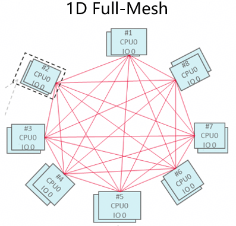 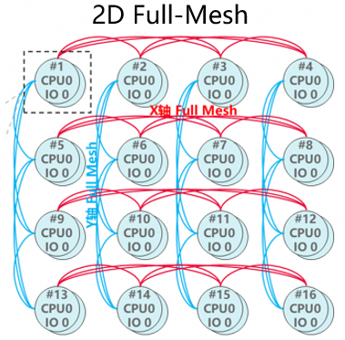

以1D Full-Mesh组网为例，该拓扑包含8个节点，每个节点有2个IODie，分别位于两个完全对称的平面。每个IODie配备9个物理端口，其中7个端口用于与同平面内其他7个节点的IODie直连，两平面连接方式完全一致。在此拓扑中，同一平面内任意两个节点IODie之间均有且只有一个直连的物理端口。

每个IODie上有一个或多个UB设备，每个UB设备上配置了两类EID：primary EID和port EID。port EID仅具备访问其对应直连端口的权限，支持CTP和RTP通信；primary EID则可访问该IODie所有物理端口，支持与同平面所有节点进行CTP通信。

为简化用户对复杂拓扑及多类EID的感知，URMA将同一节点两个IODie上的UB设备聚合为一个虚拟URMA设备，称为聚合设备，并将两个UB设备上的所有EID聚合成一个统一的bonding EID。用户可直接通过聚合设备的bonding EID进行通信，无需了解底层拓扑结构或区分primary EID跟port EID。

聚合设备根据用户配置的通信模式，查询拓扑选择合适的EID进行通信，在此基础上，还实现了带宽聚合、故障切换功能。URMA聚合设备支持三种聚合模式：

**单设备模式/Standalone**：最简单的聚合形式，实际仅使用一个物理设备。主要用于屏蔽拓扑和EID类型。

**主备模式/ActiveBackup**：高可用性方案，实际仅使用一个物理设备。当主设备故障时，将流量切换到备用设备。

**负载均衡模式/Balance**：带宽聚合方案，同时使用多个设备提升吞吐量，支持RR轮询等方式实现负载均衡。此外当其中一个设备故障时，将其上流量切换到其他设备。

主备模式/ActiveBackup：


负载均衡模式/Balance：


相关接口参见：URMA编程API用户手册的详细说明，包括：urma_set_context_opt等API。

如果想要直接使用UB设备通信，需要查询组网拓扑。URMA管理工具提供了urma_admin show topo命令来查询拓扑信息，该工具展示聚合设备EID（bondingEID）、primaryEID和portEID之间的逻辑组网关系。**注意：物理端口能否通信与硬件状态有关。此工具仅支持查询EID之间的逻辑组网关系，不代表按照此逻辑组网对应的物理端口一定能够通信。**

**show topo命令使用示例**

本示例为8节点、2个IODie的硬件环境，查询node2、node4之间直连的一对普通设备EID。

在node4执行urma_admin show topo，输出格式如下：

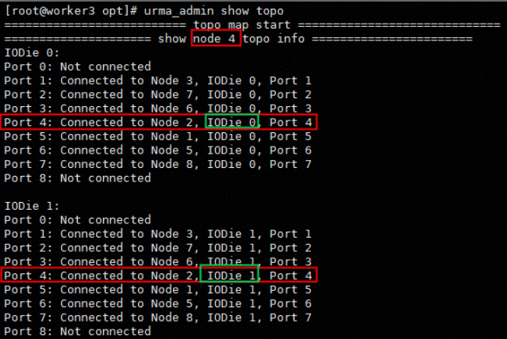

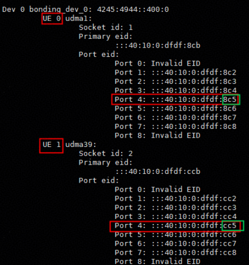

node2执行urma_admin show topo：

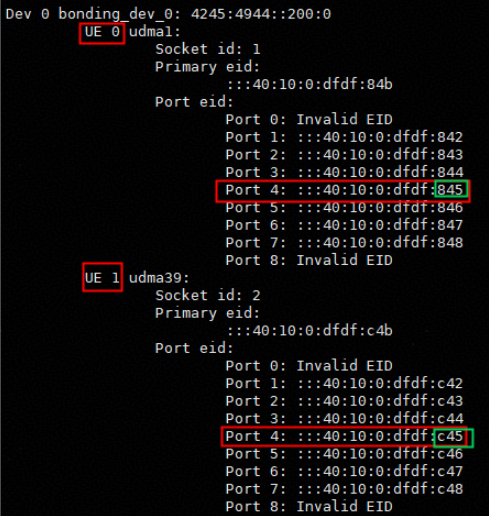

以上输出说明node2-node4之间

IODIE0：

- （node4, port4）(node2, port4)连通

- :::40:10:00:dfdf:8c5和:::40:10:00:dfdf:845连通

IODIE1：

- （node4, port4）和(node2, port4)连通

- :::40:10:00:dfdf:8c5和:::40:10:00:dfdf:845连通

### 聚合设备基本使用流程

- 自举建链场景

自举建链指的是使用 URMA 公知 jetty 作为建链信息交换通道的建链方法。整体流程如图所示：


自举建链场景需要使用公知 jetty，公知 jetty 必须配置 trans_mode = URMA_TM_RM 并且启用多路径选项。在有数据收发保序要求的场景下，建议设置 jfs_wr 中的 place_order = URMA_STRONG_ORDER

- 一般数据传输场景

一般数据传输的场景推荐使用非公知 jetty 并且使用单路径 RC 模式。

需要注意的是在这种传输场景下，必须双方都完成 bind_jetty 操作之后两端才能进行双边通信。

整体代码与上面一致，下图为 urma_bind_jetty 的流程：


UB采用了事务层与传输层分离的架构，协议定义了传输层的类型：RTP（可靠传输层）、CTP（简易传输层）、UTP（不可靠传输层）。

单路径是RC模式基于RTP，多路径是RM模式基于CTP。

单路径RM模式接口只知道对端jetty信息但不知道本端绑定哪个jetty，用户使用RQE进行双端操作，RQE无法确定从哪个jfr中收取数据

RC模式下的bind操作可以绑定双端jetty

bonding设备不感知TP。

### 聚合设备特性列表和约束

- 使用约束

1\. 在 鲲鹏950 的场景下，聚合设备只有一个，并且名称一定为 bonding_dev_0；

2\. 单路径模式的 jetty 和多路径模式的 jetty 之间无法通信，只有两端的 jetty 单路径、多路径的选项参数一致才能通信；

3\. 不同 jetty 的单路径、多路径模式以及传输模式可以支持的能力有所差异；

4\. 在使用聚合设备的场景下，传输层使用 TP/CTP 的选择仅和创建 jetty 和 jfs/jfr 的时候设定的参数有关，urma_import_jetty 中传入的 rjetty flag 中的 CTP 参数会被忽略。

- 聚合设备的特性列表

  1.  聚合设备的特性列表

+---------------+---------+---------------+-------------+---------------+----------+------------------+--------------------+-------------------+
| 设备名        | EID个数 | 模式          | 使用RTP/CTP | 传输模式      | 环回传输 | 最大send报文大小 | 可靠性保障         | 可联通EID         |
+:==============+:========+:==============+:============+:==============+:=========+:=================+:===================+:==================+
| bonding_dev_0 | 1       | jetty多路径   | CTP         | RM（ROI保序） | 否       | 4kB              | 有TA ACK           | 任意节点的agg EID |
|               |         |               |             |               |          |                  |                    |                   |
|               |         |               |             |               |          |                  | 无重传             |                   |
|               |         |               |             +---------------+----------+                  +--------------------+                   |
|               |         |               |             | RC（ROL保序） | 否       |                  | 无可靠保障机制     |                   |
|               |         +---------------+-------------+---------------+----------+------------------+--------------------+                   |
|               |         | jetty单路径   | RTP         | RC（ROL保序） | 是       | 64kB             | 与单设备RC模式一致 |                   |
|               |         +---------------+-------------+---------------+----------+------------------+--------------------+                   |
|               |         | jfs/jfr多路径 | CTP         | RM（ROI保序） | 否       | 4kB              | 有TA ACK           |                   |
|               |         |               |             |               |          |                  |                    |                   |
|               |         |               |             |               |          |                  | 无重传             |                   |
+---------------+---------+---------------+-------------+---------------+----------+------------------+--------------------+-------------------+

- 聚合设备支持urma特性API梳理

聚合设备已经支持大部分URMA API，现列举不支持的URMA API及其影响：

1.  聚合设备不支持urma特性API

+---------------------------------------------+----------------------------------------------------------------------------------+
| 聚合设备不支持的URMA API列表                | 功能和影响                                                                       |
+:============================================+:=================================================================================+
| urma_query_jfs                              | 用于查询jfs的状态，主要为DFX功能，非必要功能接口                                 |
+---------------------------------------------+----------------------------------------------------------------------------------+
| urma_flush_jfs                              | 清空jfs软件队列，功能接口，应用不要求所有下发的sqe必须上报，则不依赖此功能       |
+---------------------------------------------+----------------------------------------------------------------------------------+
| urma_advise_jfr/urma_unadvise_jfr           | 非UB功能API                                                                      |
+---------------------------------------------+----------------------------------------------------------------------------------+
| urma_query_jetty                            | 用于查询jetty的状态和接收端配置水线，主要为DFX功能，非必要功能接口               |
|                                             |                                                                                  |
|                                             | \*说明：jetty作为接收端的配置水线功能，鲲鹏950硬件当前不支持                     |
+---------------------------------------------+----------------------------------------------------------------------------------+
| urma_flush_jetty                            | 清空jetty发送软件队列，功能接口，应用不要求所有下发的sqe必须上报，则不依赖此功能 |
+---------------------------------------------+----------------------------------------------------------------------------------+
| urma_advise_jetty_async                     | 非UB功能API                                                                      |
+---------------------------------------------+----------------------------------------------------------------------------------+
| urma_create_jetty_grp/urma_delete_jetty_grp | 创建和删除jetty grp，功能接口                                                    |
|                                             |                                                                                  |
| urma_get_tpn                                | 当前管控面不支持此能力                                                           |
|                                             |                                                                                  |
| urma_modify_tp                              | 当前管控面不支持此能力                                                           |
+---------------------------------------------+----------------------------------------------------------------------------------+

## 虚拟化

一个UB物理设备可以包含一份或多份设备资源（UE，UB Entity），同时也可以拥有一个或多个物理端口（Port）。在Host访问设备资源时，访问请求可以从任意一个端口进入并访问到相应的设备资源，这意味着这些端口是由多份设备资源共享的。当系统将多份设备资源分配给不同用户使用时，这些资源之间需要具备一定的隔离性。

UB设备支持实现多个Port，不同UB设备之间可以通过这些端口进行通信。UE是UB设备中一份具备隔离性的设备资源集合，它不仅是一个可寻址的实体，还提供了特定功能，并描述了该实体所占用的设备资源。通过设备间的Port互联，软件可以访问到UE所对应的设备资源。UE作为UB设备对自身资源进行划分的基本单元，为用户提供了管理设备资源的方式。UB设备允许用户对资源进行更细粒度的划分，因此在实际使用中可能出现多个UE同时依赖某一类资源配置来提供服务的情况。

### 容器

在容器环境中，为实现URMA物理设备的灵活管理，URMA引入了逻辑设备机制。每个物理设备仅属于一个命名空间，但可以在不同的命名空间中创建逻辑设备，每个逻辑设备同样只属于一个命名空间。逻辑设备作为独立的访问接口，仅在所属命名空间内可见，且名称与物理设备相同。此外，URMA设备上的EID可配置命名空间属性，并绑定到对应命名空间的逻辑设备上，EID同样仅在其所属的命名空间中可见。删除逻辑设备时，其上的EID会自动迁移回原物理设备。

基于逻辑设备的管理机制，容器中的URMA支持以下两种工作模式：

- **自动模式**：系统自动管理逻辑设备的生命周期。当创建或销毁一个命名空间时，系统会自动在该命名空间中创建或销毁所有URMA物理设备对应的逻辑设备。所有容器均可直接识别并使用这些URMA设备，无需用户进行额外配置。

- **手动模式**：逻辑设备的创建与删除完全由用户主动控制。用户可根据需要，为指定的URMA物理设备在特定命名空间中创建逻辑设备，并可灵活调整物理设备所属的命名空间。

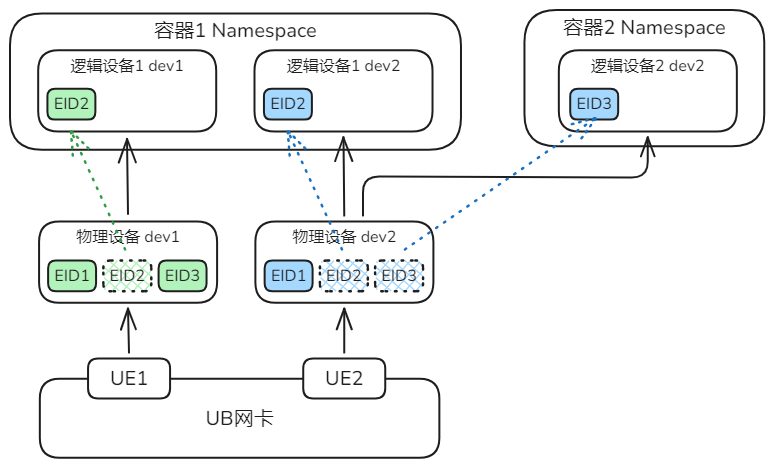

URMA提供了一组命令来配置设备和EID。

创建、删除逻辑设备：

urma_admin dev create_logic_dev \<dev_name\> \<netns\>

urma_admin dev delete_logic_dev \<dev_name\> \<netns\>

设置EID的命名空间：

urma_admin dev set_logic_dev_eid \<dev_name\> \<netns\> \<eid_idx\>

设置逻辑设备模式：手动模式、自动模式

urma_admin dev set_logic_dev_mode \<dev_name\> \<ns_mode\>

设置物理设备的命名空间

urma_admin dev set_ns \<dev_name\> \<netns\>

### 虚拟机

UB网卡的UE直通到虚机中，虚机和裸机中的URMA使用没有区别

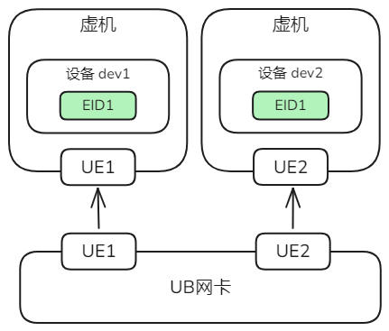

## 工具手册


命令行参数分为必选和可选两类，必选项采用\<\>描述，可选项采用\[\]描述。

### urma_perftest

用于urma时延和带宽测试的性能工具。涵盖收发、读、写、原子操作等四类语义，每种语义支持时延和带宽测试。区分server端和client端分别起urma_perftest进程开展测试并输出测试结果。

1.  命令格式

Usage: urma_perftest command \[command options\]\
urma_perftest URMA perftest tool\
Command syntax:\
read_lat Test for read latency.\
write_lat Test for write latency.\
send_lat Test for send latency.\
atomic_lat Test for atomic latency.\
read_bw Test for read bandwidth.\
write_bw Test for write bandwidth.\
send_bw Test for send bandwidth.\
atomic_bw Test for atomic bandwidth.

2.  功能描述

收发时延测试server端：urma_perftest send_lat -d \<DEV_NAME\> -s \[SIZE\] -n \[ITERATIONS\]\
收发时延测试client端：urma_perftest send_lat -d \<DEV_NAME\> -s \[SIZE\] -n \[ITERATIONS\] -S \<SERVER_IP\>\
\
读时延测试server端：urma_perftest read_lat -d \<DEV_NAME\> -s \[SIZE\] -n \[ITERATIONS\]\
读时延测试client端：urma_perftest read_lat -d \<DEV_NAME\> -s \[SIZE\] -n \[ITERATIONS\] -S \<SERVER_IP\>\
\
写时延测试server端：urma_perftest write_lat -d \<DEV_NAME\> -s \[SIZE\] -n \[ITERATIONS\]\
写时延测试client端：urma_perftest write_lat -d \<DEV_NAME\> -s \[SIZE\] -n \[ITERATIONS\] -S \<SERVER_IP\>\
\
原子操作时延测试server端：urma_perftest atomic_lat -d \<DEV_NAME\> -s \[SIZE\] -n \[ITERATIONS\] -A cas\
原子操作时延测试client端：urma_perftest atomic_lat -d \<DEV_NAME\> -s \[SIZE\] -n \[ITERATIONS\] -S \<SERVER_IP\> -A cas\
\
收发带宽测试server端：urma_perftest send_bw -d \<DEV_NAME\> -s \[SIZE\] -n \[ITERATIONS\]\
收发带宽测试client端：urma_perftest send_bw -d \<DEV_NAME\> -s \[SIZE\] -n \[ITERATIONS\] -S \<SERVER_IP\>\
\
读带宽测试server端：urma_perftest read_bw -d \<DEV_NAME\> -s \[SIZE\] -n \[ITERATIONS\]\
读带宽测试client端：urma_perftest read_bw -d \<DEV_NAME\> -s \[SIZE\] -n \[ITERATIONS\] -S \<SERVER_IP\>\
\
写带宽测试server端：urma_perftest write_bw -d \<DEV_NAME\> -s \[SIZE\] -n \[ITERATIONS\]\
写带宽测试client端：urma_perftest write_bw -d \<DEV_NAME\> -s \[SIZE\] -n \[ITERATIONS\] -S \<SERVER_IP\>\
\
原子操作带宽测试server端：urma_perftest atomic_bw -d \<DEV_NAME\> -s \[SIZE\] -n \[ITERATIONS\] -A cas\
原子操作带宽测试client端：urma_perftest atomic_bw -d \<DEV_NAME\> -s \[SIZE\] -n \[ITERATIONS\] -S \<SERVER_IP\> -A cas

3.  参数说明

urma_perftest参数

Options:\
-a, \--all\[order\] Run sizes from 2 till 2\^23 (default 2\^16), order: exponent of 2.\
-A, \--atomic_type \<type\> Specify atomic type, {cas\|faa}.\
-b, \--simplex_mode Run with simplex mode(jfs/jfr), duplex jetty mode for reserved.\
-B, \--bidirection Measure bidirectional bandwidth (default unidirectional).\
-c, \--jfc_inline Enable jfc_inline to upgrade latency performance.\
-C, \--jfc_depth \<dep\> Size of jfc depth (default 4096 for bw, 1024 for ip bw, 1 for lat).\
-d, \--dev \<dev_name\> The name of ubep device.\
-D, \--duration \<second\> Run test for a customized period of seconds, this cfg covers iters.\
-e, \--use_jfce use jfc event.\
\--eid_idx Specified eid index of device.\
-E, \--err_timeout \<time\> the timeout before report error, ranging from \[0, 31\],\
the actual timeout in usec is caculated by: 4.096\*(2\^err_timeout).\
-f, \--use_flat_api Choose to use flat API, only works in SIMPLEX mode.\
-F, \--cpu_freq_f To report warnings when CPU frequency drifts, default as NOT.\
-h, \--help Show help info.\
-I, \--inline_size \<size\> Max size of message to be sent in inline.\
-j, \--share_jfr \<true/false\> share jfr on create jetty.\
-J, \--jettys \<num of jetty\> Num of jettys(default 1).\
-K, \--token_policy \<policy\> default 0: NONE, 1: PLAIN_TEXT, 2: SIGNED, 3: ALL_ENCRYPTED.\
-n, \--iters \<iters\> Number of exchanges (at least 5, default 10000).\
-N, \--no_peak Cancel peak-bw calculation.\
-l, \--jfs_post_list \<size\> Post list of send WQEs of \<list size\> size.\
-L, \--lock_free Jetty\'s interior is unlocked.\
-O, \--priority set the priority of JFS, ranging from \[0, 15\].\
-p, \--trans_mode \<mode\> Transport mode: 0 for RM(default), 1 for RC, 2 for UM.\
-P, \--port \<id\> Server port for bind or connect, default 21115.\
-Q, \--cq_mod \<num\> Generate Cqe only after \<\--cq-mod\> completion.\
-r, \--jfr_post_list \<size\> Post list of receive WQEs of \<list size\> size.\
-R, \--jfr_depth \<dep\> Size of jfr depth (default 512 for BW, 1 for LAT).\
-s, \--size \<size\> Size of message to exchange (default 2).\
-S, \--server \<ip\> Server ip for bind or connect, default: 127.0.0.1 .\
-T, \--jfs_depth \<dep\> Size of jfs depth (default 128 for BW, 1 for LAT).\
-w, \--warm_up Choose to use warm_up function, only for read/write/atomic bw test.\
-y, \--infinite\[second\] Run perftest infinitely, only available for BW test.\
Print period for infinite mode, default 2 seconds.\
\--single_path, Bonding device works in single path mode.\
\--inf_period_ms Print period (ms) for infinite mode. Must be a multiple of 50. if set, value of infinite will be overwrite.\
\--rate_limit \<rate\> Set the maximum rate of sent packages. default unit is \[Gbps\].\
\--rate_units \<units\> Set the units for rate, MBps (M), Gbps (G)(default) or Kpps (P).\
\--burst_size \<size\> Set the amount of pkts to send in a burst when using rate limiter.\
\--sub_trans_mode \<sub_mode\> Sub transport mode: 0 for non ordering(default), 1 for TA dest ordering (only valid for trans_mode RC).\
\--enable_ipv6 enable ipv6 for server ip. default disable.\
\--enable_credit enable send credit, default: disable.\
\--credit_threshold \<num\> Exceed the threshold and do not send, default: jfr_depth \* 3 / 4.\
\--credit_notify_cnt \<num\> Notify the send side after recv packets, default: jfr_depth / 4.\
\--jettys_pre_jfr \<num\> How many jettys share a jfr.\
\--seg_pre_jetty enable a segment for each Jetty, default: disable.\
\--enable_imm enable immediate data for write or send, default: disable.\
\--enable_err_continue Enable continue running when cr errors, default: disable.\
\--notify_data \<value\> enable write_with_notify, value is ensured by hardware.\
\--enable_user_tp Enable user tp for UB device, if enable,UVS is not required. default: disable.\
\--oor_en Enable out of order for user_tp, default: disable.\
\--spray_en Enable multipathing for user_tp, default: disable.\
\--cc_en Enable congestion control for user_tp, default: disable.\
\--cc_alg \<num\> Set congestion Control Algorithm for user_tp, \[0, 7\], default: 0.\
\--retry_num \<num\> Set retry num for user_tp, default: 7.\
\--ack_timeout \<num\> Set ack timeout for user_tp, default: 15.\
\--sge_num \<num\> Set sge_num for wr, default: 1.\
\--enable_write_dirty \<time\> Enable write dirty and set the period of write dirty, default: disable.\
\--pair_num \<num\> Enable multiplayer model and set the number of connection, default: disable.\
\--async_import Enable asynchronous connection establishment\
\--tp_aware Enable tp aware connect, default: disable.\
\--tp_reuse Reuse tp in RM mode if enable tp aware, default: disable.\
\--ctp Use ctp, default: disable.\
\--jetty_id Set the jetty_id, default: 0.\
\--wait_jfc_timeout Set timeout parameter for urma_wait_jfc (in milliseconds),\
timeout = 0: return immediately even if no events are ready,\
timeout = -1: an infinite timeout,\
default: 1000(1s).

+---------------+---------------------+----------+------------------------------------------------------------------------------------------------------------------------------------------------------------------------------------------------------------------------------------------------------------+--------------+--------------------------------------+--------------------------------+
| 符号          | 参数名称            | 参数类型 | 说明                                                                                                                                                                                                                                                       | 是否输入参数 | 取值范围                             | 默认取值                       |
+:==============+:====================+:=========+:===========================================================================================================================================================================================================================================================+:=============+:=====================================+:===============================+
| -a            | all                 | uint32_t | 是否自动测试并输出包长从2到2\^23结果，注意该参数与-s冲突；                                                                                                                                                                                                 | 可选         | 1\~23                                | 16                             |
|               |                     |          |                                                                                                                                                                                                                                                            |              |                                      |                                |
|               |                     |          | 可选参数指定order(即2次幂数)                                                                                                                                                                                                                               |              |                                      |                                |
+---------------+---------------------+----------+------------------------------------------------------------------------------------------------------------------------------------------------------------------------------------------------------------------------------------------------------------+--------------+--------------------------------------+--------------------------------+
| -A            | atomic_type         | enum     | 原子操作类型                                                                                                                                                                                                                                               | 是           | cas或faa                             | cas                            |
+---------------+---------------------+----------+------------------------------------------------------------------------------------------------------------------------------------------------------------------------------------------------------------------------------------------------------------+--------------+--------------------------------------+--------------------------------+
| -b            | simplex_mode        | bool     | 是否开启simplex_mode也就是单工模式。在 simplex 模式下，数据传输只在一个方向上进行，例如 JFS (Just a Flash Storage) 或 JFR (Just a Flash RAM)。                                                                                                             | 否           | \-                                   | 默认关闭                       |
+---------------+---------------------+----------+------------------------------------------------------------------------------------------------------------------------------------------------------------------------------------------------------------------------------------------------------------+--------------+--------------------------------------+--------------------------------+
| -B            | bidirection         | bool     | 这个选项的作用是在进行带宽测试时，测量数据在两个方向上的传输速率，即从发送方到接收方，以及从接收方返回到发送方的速率。在默认情况下，如果没有使用 -B 选项，测试工具会默认执行单向带宽测试，仅测量数据从发送方到接收方的传输速率。                           | 否           | \-                                   | 默认关闭                       |
+---------------+---------------------+----------+------------------------------------------------------------------------------------------------------------------------------------------------------------------------------------------------------------------------------------------------------------+--------------+--------------------------------------+--------------------------------+
| -c            | jfc_inline          | bool     | 是否启用jfc_inline，启动时，它允许将小数据包（通常小于8字节或16字节）直接写入到CQE（Completion Queue Entry，完成队列项）中                                                                                                                                 | 否           | \-                                   | 默认关闭                       |
+---------------+---------------------+----------+------------------------------------------------------------------------------------------------------------------------------------------------------------------------------------------------------------------------------------------------------------+--------------+--------------------------------------+--------------------------------+
| -C            | jfc_depth           | uint32_t | jfc深度，对于带宽测试（bw），默认的JFC深度是 4096；对于IP带宽测试（ip bw），默认的JFC深度是 1024；对于延迟测试（lat），默认的JFC深度是1                                                                                                                    | 是           | 0 \~ U32_MAX                         | 时延测试：1                    |
|               |                     |          |                                                                                                                                                                                                                                                            |              |                                      |                                |
|               |                     |          |                                                                                                                                                                                                                                                            |              |                                      | 带宽测试4096                   |
+---------------+---------------------+----------+------------------------------------------------------------------------------------------------------------------------------------------------------------------------------------------------------------------------------------------------------------+--------------+--------------------------------------+--------------------------------+
| -d            | dev                 | char \*  | 设备名称                                                                                                                                                                                                                                                   | 是           | \-                                   | \-                             |
+---------------+---------------------+----------+------------------------------------------------------------------------------------------------------------------------------------------------------------------------------------------------------------------------------------------------------------+--------------+--------------------------------------+--------------------------------+
| -D            | duration            | uint32_t | 指定用例运行时长，单位s，注意该配置与-n冲突，该设置会覆盖掉iter                                                                                                                                                                                            | 是           | 4 \~ U32_MAX                         | 5                              |
+---------------+---------------------+----------+------------------------------------------------------------------------------------------------------------------------------------------------------------------------------------------------------------------------------------------------------------+--------------+--------------------------------------+--------------------------------+
| -e            | use_jfce            | bool     | 是否采用事件通知机制                                                                                                                                                                                                                                       | 否           | \-                                   | 默认关闭                       |
+---------------+---------------------+----------+------------------------------------------------------------------------------------------------------------------------------------------------------------------------------------------------------------------------------------------------------------+--------------+--------------------------------------+--------------------------------+
| \--eid idx    | eid index           | uint32_t | EID（Entity ID）是网络通信中设备的唯一标识符，它在URMA的上下文中用于定义和管理网络通信的端点。                                                                                                                                                             |              |                                      |                                |
+---------------+---------------------+----------+------------------------------------------------------------------------------------------------------------------------------------------------------------------------------------------------------------------------------------------------------------+--------------+--------------------------------------+--------------------------------+
| -E            | err_timeout         | uint8_t  | 创建jfs或jetty时，指定作为发送端的错误超时参数，超时时间为4.096\*(2\^err_timeout)                                                                                                                                                                          | 是           | 0\~31                                | 17                             |
+---------------+---------------------+----------+------------------------------------------------------------------------------------------------------------------------------------------------------------------------------------------------------------------------------------------------------------+--------------+--------------------------------------+--------------------------------+
| -f            | use_flat_api        | bool     | 指定采用urma_send/urma_recv/urma_read/urma_write等四种数据面接口，必须搭配jfs/jfr使用,flat API 是相对于更底层的接口,仅在 simplex mode 下有效                                                                                                               | 否           | \-                                   | 默认关闭                       |
+---------------+---------------------+----------+------------------------------------------------------------------------------------------------------------------------------------------------------------------------------------------------------------------------------------------------------------+--------------+--------------------------------------+--------------------------------+
| -F            | cpu_freq_f          | bool     | 采用不同算法获取CPU负载差异较大时，是否上报异常告警                                                                                                                                                                                                        | 否           | \-                                   | 默认关闭                       |
+---------------+---------------------+----------+------------------------------------------------------------------------------------------------------------------------------------------------------------------------------------------------------------------------------------------------------------+--------------+--------------------------------------+--------------------------------+
| -h            | help                | \-       | 打印使用说明                                                                                                                                                                                                                                               | 否           | \-                                   | \-                             |
+---------------+---------------------+----------+------------------------------------------------------------------------------------------------------------------------------------------------------------------------------------------------------------------------------------------------------------+--------------+--------------------------------------+--------------------------------+
| -I(ASCII 73)  | inline_size         | uint32_t | 内联值                                                                                                                                                                                                                                                     | 是           | 0\~912                               | 时延测试默认220，带宽测试默认0 |
+---------------+---------------------+----------+------------------------------------------------------------------------------------------------------------------------------------------------------------------------------------------------------------------------------------------------------------+--------------+--------------------------------------+--------------------------------+
| -j            | share_jfr           | bool     | 是否采用共享jfr                                                                                                                                                                                                                                            | 是           | true/false                           | 默认关闭                       |
+---------------+---------------------+----------+------------------------------------------------------------------------------------------------------------------------------------------------------------------------------------------------------------------------------------------------------------+--------------+--------------------------------------+--------------------------------+
| -J            | jettys              | uint32_t | jetty的数量                                                                                                                                                                                                                                                | 是           | 1\~NA\*                              | 1                              |
|               |                     |          |                                                                                                                                                                                                                                                            |              |                                      |                                |
|               |                     |          | \*说明：jetty数量理论上限取决于/sys/class/ubcore/udmaxx/max_jetty规格，与芯片能力有关，因此不设置人为上限；管控面多jetty场景，会针对每对jetty消耗tp资源，因此用例能否执行，也取决于管控面配置的tp上限，这一上限不在端侧urma_perftest工具说明，取决于管控面 |              | NA\*参见jetty数量的说明              |                                |
|               |                     |          |                                                                                                                                                                                                                                                            |              |                                      |                                |
|               |                     |          |                                                                                                                                                                                                                                                            |              | 取65535与芯片真实jetty数量上限的小值 |                                |
+---------------+---------------------+----------+------------------------------------------------------------------------------------------------------------------------------------------------------------------------------------------------------------------------------------------------------------+--------------+--------------------------------------+--------------------------------+
| -K            | token_policy        | uint32_t | 配置token_policy策略                                                                                                                                                                                                                                       | 是           | 0\~3                                 | 0                              |
+---------------+---------------------+----------+------------------------------------------------------------------------------------------------------------------------------------------------------------------------------------------------------------------------------------------------------------+--------------+--------------------------------------+--------------------------------+
| -n            | iters               | uint64_t | 迭代次数，注意该参数与-D冲突                                                                                                                                                                                                                               | 是           | 最小值为5 ，默认值为1000             | 带宽测试：50000                |
|               |                     |          |                                                                                                                                                                                                                                                            |              |                                      |                                |
|               |                     |          |                                                                                                                                                                                                                                                            |              |                                      | 时延测试：10000                |
+---------------+---------------------+----------+------------------------------------------------------------------------------------------------------------------------------------------------------------------------------------------------------------------------------------------------------------+--------------+--------------------------------------+--------------------------------+
| -N            | no_peak             | bool     | 取消带宽的峰值计算，注意该参数仅用于带宽测试                                                                                                                                                                                                               | 否           | \-                                   | 默认关闭                       |
+---------------+---------------------+----------+------------------------------------------------------------------------------------------------------------------------------------------------------------------------------------------------------------------------------------------------------------+--------------+--------------------------------------+--------------------------------+
| -l(ASCII 108) | jfs_post_list       | uint32_t | 发送端WQE的数量                                                                                                                                                                                                                                            | 是           | 与其他参数相关                       | 1                              |
+---------------+---------------------+----------+------------------------------------------------------------------------------------------------------------------------------------------------------------------------------------------------------------------------------------------------------------+--------------+--------------------------------------+--------------------------------+
| -L            | lock_free           | bool     | 命令中使用-L, \--lock_free选项时，Jetty内部的数据结构将被配置为无锁的。                                                                                                                                                                                    | 否           | \-                                   | 默认关闭                       |
+---------------+---------------------+----------+------------------------------------------------------------------------------------------------------------------------------------------------------------------------------------------------------------------------------------------------------------+--------------+--------------------------------------+--------------------------------+
| -O            | priority            | uint8_t  | 配置jfs的权限                                                                                                                                                                                                                                              | 是           | 0\~15                                | 15                             |
+---------------+---------------------+----------+------------------------------------------------------------------------------------------------------------------------------------------------------------------------------------------------------------------------------------------------------------+--------------+--------------------------------------+--------------------------------+
| -p            | trans_mode          | uint32_t | 配置urma的传输模式，0是RM模式，1是RC模式，2是UM模式                                                                                                                                                                                                        | 是           | 0\~2                                 | 0                              |
+---------------+---------------------+----------+------------------------------------------------------------------------------------------------------------------------------------------------------------------------------------------------------------------------------------------------------------+--------------+--------------------------------------+--------------------------------+
| -P            | port                | uint16_t | socket连接使用的端口号                                                                                                                                                                                                                                     | 是           | 无限定                               | 21115                          |
+---------------+---------------------+----------+------------------------------------------------------------------------------------------------------------------------------------------------------------------------------------------------------------------------------------------------------------+--------------+--------------------------------------+--------------------------------+
| -Q            | cq_mod              | uint32_t | 发送端每隔多少次产生一次cq                                                                                                                                                                                                                                 | 是           | 1\~1024                              | 100                            |
+---------------+---------------------+----------+------------------------------------------------------------------------------------------------------------------------------------------------------------------------------------------------------------------------------------------------------------+--------------+--------------------------------------+--------------------------------+
| -r            | jfr_post_list       | uint32_t | 接收端WQE的数量                                                                                                                                                                                                                                            | 是           | 无限定，具体参见说明                 | 1                              |
+---------------+---------------------+----------+------------------------------------------------------------------------------------------------------------------------------------------------------------------------------------------------------------------------------------------------------------+--------------+--------------------------------------+--------------------------------+
| -R            | jfr_depth           | uint32_t | 接收端jetty的深度                                                                                                                                                                                                                                          | 是           | 1\~32768                             | 收发时延/收发带宽测试：512     |
|               |                     |          |                                                                                                                                                                                                                                                            |              |                                      |                                |
|               |                     |          | 实际上是32768与真实芯片最大jfr深度的最大值，两者取小值作为上限                                                                                                                                                                                             |              |                                      | 其他测试：1                    |
+---------------+---------------------+----------+------------------------------------------------------------------------------------------------------------------------------------------------------------------------------------------------------------------------------------------------------------+--------------+--------------------------------------+--------------------------------+
| -s            | size                | uint32_t | 传送单包的大小，注意该参数与-a冲突，两个参数不要同时使用                                                                                                                                                                                                   | 是           | 无限定                               | 原子操作测试：固定为8          |
|               |                     |          |                                                                                                                                                                                                                                                            |              |                                      |                                |
|               |                     |          |                                                                                                                                                                                                                                                            |              |                                      | 带宽测试：65536                |
|               |                     |          |                                                                                                                                                                                                                                                            |              |                                      |                                |
|               |                     |          |                                                                                                                                                                                                                                                            |              |                                      | 时延测试：2                    |
+---------------+---------------------+----------+------------------------------------------------------------------------------------------------------------------------------------------------------------------------------------------------------------------------------------------------------------+--------------+--------------------------------------+--------------------------------+
| -S            | server              | char \*  | server端的ip，格式为X.X.X.X，是client端的必填项，默认值是127.0.0.1                                                                                                                                                                                         | 是           | 无限定                               | 127.0.0.1                      |
+---------------+---------------------+----------+------------------------------------------------------------------------------------------------------------------------------------------------------------------------------------------------------------------------------------------------------------+--------------+--------------------------------------+--------------------------------+
| -T            | jfs_depth           | uint32_t | 发送端jetty的深度                                                                                                                                                                                                                                          | 是           | 1\~15000                             | 带宽测试：128                  |
|               |                     |          |                                                                                                                                                                                                                                                            |              |                                      |                                |
|               |                     |          |                                                                                                                                                                                                                                                            |              |                                      | 时延测试：1                    |
+---------------+---------------------+----------+------------------------------------------------------------------------------------------------------------------------------------------------------------------------------------------------------------------------------------------------------------+--------------+--------------------------------------+--------------------------------+
| -w            | warm_up             | bool     | 指定运行perftest之前开启预热模式,仅在读/写/原子操作的带宽测试中可生效                                                                                                                                                                                      | 否           | \-                                   | 默认关闭                       |
+---------------+---------------------+----------+------------------------------------------------------------------------------------------------------------------------------------------------------------------------------------------------------------------------------------------------------------+--------------+--------------------------------------+--------------------------------+
| -y            | infinite            | uint32_t | 带宽测试下指定无限模式；                                                                                                                                                                                                                                   | 可选         | \-                                   | 2                              |
|               |                     |          |                                                                                                                                                                                                                                                            |              |                                      |                                |
|               |                     |          | 可选参数指定间隔打印数据的时间，单位秒，默认为2秒                                                                                                                                                                                                          |              |                                      |                                |
+---------------+---------------------+----------+------------------------------------------------------------------------------------------------------------------------------------------------------------------------------------------------------------------------------------------------------------+--------------+--------------------------------------+--------------------------------+
| \--           | single_path         | bool     | 聚合设备工作模式选项，开启意味着所有网络流量都将通过聚合设备中的一个选定的物理接口传输                                                                                                                                                                     | 可选         |                                      | false                          |
+---------------+---------------------+----------+------------------------------------------------------------------------------------------------------------------------------------------------------------------------------------------------------------------------------------------------------------+--------------+--------------------------------------+--------------------------------+
|               | inf_period_ms       | uint32_t | 配置ms级打印带宽信息。infinite mode为持续进行的带宽（BW）测试                                                                                                                                                                                              | 可选         | 50的倍数                             | 0                              |
|               |                     |          |                                                                                                                                                                                                                                                            |              |                                      |                                |
|               |                     |          | 最小粒度50ms，并且必须是50ms的倍数，同时需要配置-y的时候生效。当既配置-y时间，又配置\--inf_period_ms参数，会已\--inf_period_ms为主。注意：会存在2ms内的误差                                                                                                |              |                                      |                                |
+---------------+---------------------+----------+------------------------------------------------------------------------------------------------------------------------------------------------------------------------------------------------------------------------------------------------------------+--------------+--------------------------------------+--------------------------------+
| \-            | rate_limit          | uint32_t | 设置限速值，默认单位是Gbps                                                                                                                                                                                                                                 | 可选         | 无限定                               | 0                              |
+---------------+---------------------+----------+------------------------------------------------------------------------------------------------------------------------------------------------------------------------------------------------------------------------------------------------------------+--------------+--------------------------------------+--------------------------------+
| \-            | rate_units          | char     | 限速值的单位，MBps (M), Gbps (G)(default) or Kpps (P)                                                                                                                                                                                                      | 可选         | \[MGP\]                              | G                              |
+---------------+---------------------+----------+------------------------------------------------------------------------------------------------------------------------------------------------------------------------------------------------------------------------------------------------------------+--------------+--------------------------------------+--------------------------------+
| \-            | burst_size          | uint32_t | 每次连续发送多少个报文，用于均衡流量,这个选项允许你指定在使用流量限制器（rate limiter）时，每次发送数据包（packets）的批量大小                                                                                                                             | 可选         | 无限定，配置过大会导致限速不准确     | jfs_depth配置值                |
+---------------+---------------------+----------+------------------------------------------------------------------------------------------------------------------------------------------------------------------------------------------------------------------------------------------------------------+--------------+--------------------------------------+--------------------------------+
|               | sub_trans_mode      | uint32_t | 指定sub_transport_mode，只在RC模式下配置，用于RS性能测试。0 表示非排序（Non-Ordering）模式，这是默认设置。1 表示目标地址排序（TA Dest Ordering）模式，这个选项只在 trans_mode 设置为 RC（Reliable Connection）时有效。                                     | 可选         | 0\~2                                 | 0                              |
+---------------+---------------------+----------+------------------------------------------------------------------------------------------------------------------------------------------------------------------------------------------------------------------------------------------------------------+--------------+--------------------------------------+--------------------------------+
|               | enable_ipv6         | bool     | server_ip使能IPv6，-S配置IPv6地址时必须配置该参数                                                                                                                                                                                                          | 可选         |                                      | 默认关闭                       |
+---------------+---------------------+----------+------------------------------------------------------------------------------------------------------------------------------------------------------------------------------------------------------------------------------------------------------------+--------------+--------------------------------------+--------------------------------+
|               | enable_credit       | bool     | 在send测试时，是否开启credit流控，开启会导致流量下降                                                                                                                                                                                                       | 否           |                                      | 默认关闭                       |
+---------------+---------------------+----------+------------------------------------------------------------------------------------------------------------------------------------------------------------------------------------------------------------------------------------------------------------+--------------+--------------------------------------+--------------------------------+
|               | credit_threshold    | uint32_t | 指定发送端判断收包来不及处理的阈值。配置过大可能丢包。具体需要根据实际情况配置                                                                                                                                                                             | 是           | 不限定                               | jfr_depth \* 3 / 4             |
+---------------+---------------------+----------+------------------------------------------------------------------------------------------------------------------------------------------------------------------------------------------------------------------------------------------------------------+--------------+--------------------------------------+--------------------------------+
|               | credit_notify_cnt   | uint32_t | 这个参数用于配置在接收方接收到一定数量的包后，向发送方发送通知的机制。这里的 \<num\> 是一个可配置的数值，用于设置接收方在多少个包之后发送一次通知给发送方。                                                                                                | 是           | 不限定                               | jfr_depth / 4                  |
+---------------+---------------------+----------+------------------------------------------------------------------------------------------------------------------------------------------------------------------------------------------------------------------------------------------------------------+--------------+--------------------------------------+--------------------------------+
|               | jettys_pre_jfr      | uint32_t | 指定多少个jetty共享一个jfr                                                                                                                                                                                                                                 | 可选         | 不限定                               | jettys                         |
+---------------+---------------------+----------+------------------------------------------------------------------------------------------------------------------------------------------------------------------------------------------------------------------------------------------------------------+--------------+--------------------------------------+--------------------------------+
|               | seg_pre_jetty       | bool     | 使能每个jetty都配置一个seg用于测试                                                                                                                                                                                                                         | 可选         |                                      | 默认关闭                       |
+---------------+---------------------+----------+------------------------------------------------------------------------------------------------------------------------------------------------------------------------------------------------------------------------------------------------------------+--------------+--------------------------------------+--------------------------------+
|               | enable_imm          | bool     | 使能imm测试                                                                                                                                                                                                                                                | 可选         |                                      | 默认关闭                       |
+---------------+---------------------+----------+------------------------------------------------------------------------------------------------------------------------------------------------------------------------------------------------------------------------------------------------------------+--------------+--------------------------------------+--------------------------------+
|               | enable_err_continue | bool     | 当发生cr错误时，使能继续发包                                                                                                                                                                                                                               | 可选         |                                      | 默认关闭                       |
+---------------+---------------------+----------+------------------------------------------------------------------------------------------------------------------------------------------------------------------------------------------------------------------------------------------------------------+--------------+--------------------------------------+--------------------------------+
|               | notify_data         | uint64_t | 使能 write_notify操作，地址必须与硬件相适配，否者会有异常                                                                                                                                                                                                  | 可选         | 无限定                               | 0                              |
+---------------+---------------------+----------+------------------------------------------------------------------------------------------------------------------------------------------------------------------------------------------------------------------------------------------------------------+--------------+--------------------------------------+--------------------------------+
|               | enable_user_tp      | bool     | 使能用户态建链，当这个选项被启用时，用户 TP 可以用于数据传输，而无需使用通用虚拟交换机（UVS）                                                                                                                                                              | 可选         |                                      | 默认关闭                       |
+---------------+---------------------+----------+------------------------------------------------------------------------------------------------------------------------------------------------------------------------------------------------------------------------------------------------------------+--------------+--------------------------------------+--------------------------------+
|               | oor_en              | bool     | 用户态建链开启乱序选择                                                                                                                                                                                                                                     | 可选         |                                      | 默认关闭                       |
+---------------+---------------------+----------+------------------------------------------------------------------------------------------------------------------------------------------------------------------------------------------------------------------------------------------------------------+--------------+--------------------------------------+--------------------------------+
|               | spray_en            | bool     | 用户态建链开启多路径                                                                                                                                                                                                                                       | 可选         |                                      | 默认关闭                       |
+---------------+---------------------+----------+------------------------------------------------------------------------------------------------------------------------------------------------------------------------------------------------------------------------------------------------------------+--------------+--------------------------------------+--------------------------------+
|               | cc_en               | bool     | 用户态建链开启拥塞控制算法                                                                                                                                                                                                                                 | 可选         |                                      | 默认关闭                       |
+---------------+---------------------+----------+------------------------------------------------------------------------------------------------------------------------------------------------------------------------------------------------------------------------------------------------------------+--------------+--------------------------------------+--------------------------------+
|               | cc_alg              | uint32_t | 用户态建链配置拥塞控制算法                                                                                                                                                                                                                                 | 可选         | \[0, 7\]                             | 0                              |
+---------------+---------------------+----------+------------------------------------------------------------------------------------------------------------------------------------------------------------------------------------------------------------------------------------------------------------+--------------+--------------------------------------+--------------------------------+
|               | retry_num           | uint32_t | 用户态建链配置重试次数                                                                                                                                                                                                                                     | 可选         |                                      | 7                              |
+---------------+---------------------+----------+------------------------------------------------------------------------------------------------------------------------------------------------------------------------------------------------------------------------------------------------------------+--------------+--------------------------------------+--------------------------------+
|               | ack_timeout         | uint32_t | 用户态建链配置ack超时时间                                                                                                                                                                                                                                  | 可选         |                                      | 15                             |
+---------------+---------------------+----------+------------------------------------------------------------------------------------------------------------------------------------------------------------------------------------------------------------------------------------------------------------+--------------+--------------------------------------+--------------------------------+
|               | sge_num             | uint32_t | 配置单wr多sge测试                                                                                                                                                                                                                                          | 可选         |                                      | 默认关闭                       |
+---------------+---------------------+----------+------------------------------------------------------------------------------------------------------------------------------------------------------------------------------------------------------------------------------------------------------------+--------------+--------------------------------------+--------------------------------+
|               | enable_write_dirty  | bool     | 使能写入脏数据的功能                                                                                                                                                                                                                                       | 可选         |                                      | false                          |
+---------------+---------------------+----------+------------------------------------------------------------------------------------------------------------------------------------------------------------------------------------------------------------------------------------------------------------+--------------+--------------------------------------+--------------------------------+
|               | pair_num            | uint32_t | server端应设置为client个数；client端应设置为server个数；设置后，会自动修改jetty数目保持一致                                                                                                                                                                | 可选         |                                      | 1                              |
+---------------+---------------------+----------+------------------------------------------------------------------------------------------------------------------------------------------------------------------------------------------------------------------------------------------------------------+--------------+--------------------------------------+--------------------------------+
|               | async_import        | \-       | 启用异步建链                                                                                                                                                                                                                                               | 可选         |                                      |                                |
+---------------+---------------------+----------+------------------------------------------------------------------------------------------------------------------------------------------------------------------------------------------------------------------------------------------------------------+--------------+--------------------------------------+--------------------------------+
|               | tp_aware            | bool     | 用于启用传输路径（Transport Path，TP）感知的连接                                                                                                                                                                                                           | 可选         |                                      | false                          |
+---------------+---------------------+----------+------------------------------------------------------------------------------------------------------------------------------------------------------------------------------------------------------------------------------------------------------------+--------------+--------------------------------------+--------------------------------+
|               | tp_reuse            | bool     | 允许在 RM 模式下复用传输路径（TP）                                                                                                                                                                                                                         |              |                                      | false                          |
+---------------+---------------------+----------+------------------------------------------------------------------------------------------------------------------------------------------------------------------------------------------------------------------------------------------------------------+--------------+--------------------------------------+--------------------------------+
|               | ctp                 | uint32_t | CTP是一个简化版的传输层，它不进行连接管理（无连接                                                                                                                                                                                                          | 可选         | /\* 0: default, tp; 1: ctp \*/       | 0                              |
+---------------+---------------------+----------+------------------------------------------------------------------------------------------------------------------------------------------------------------------------------------------------------------------------------------------------------------+--------------+--------------------------------------+--------------------------------+
|               | jetty_id            | uint32_t | 可以自主设定jetty_id值，必须唯一                                                                                                                                                                                                                           | 可选         |                                      | 0                              |
+---------------+---------------------+----------+------------------------------------------------------------------------------------------------------------------------------------------------------------------------------------------------------------------------------------------------------------+--------------+--------------------------------------+--------------------------------+
|               | wait_jfc_timeout    | int32_t  | 为urma_wait_jfc接口增加超时参数设置（单位：毫秒）；                                                                                                                                                                                                        | 可选         |                                      | 1000                           |
|               |                     |          |                                                                                                                                                                                                                                                            |              |                                      |                                |
|               |                     |          | 超时时长=0：立即返回即使没有完成事件                                                                                                                                                                                                                       |              |                                      |                                |
|               |                     |          |                                                                                                                                                                                                                                                            |              |                                      |                                |
|               |                     |          | 超时时长=-1：无限等待                                                                                                                                                                                                                                      |              |                                      |                                |
|               |                     |          |                                                                                                                                                                                                                                                            |              |                                      |                                |
|               |                     |          | 超时时长默认设置为1000毫秒（1秒）。                                                                                                                                                                                                                        |              |                                      |                                |
+---------------+---------------------+----------+------------------------------------------------------------------------------------------------------------------------------------------------------------------------------------------------------------------------------------------------------------+--------------+--------------------------------------+--------------------------------+


urma_perftest的参数值一般不做校验，用户需要按推荐范围配置；配置超过范围的配置，不保证正常运行。


**urma_perftest参数隐含关系**

1.  冲突的配置原则上不允许同时配置，否则无法预期哪种配置生效，例如-a和-s、-D和-n等；

2.  参数-d和client端的-S为必填项，否则用例无法进行，其他参数可选择配置；

3.  写操作不支持配置-e，否则会返回错误；

4.  读/原子操作未使用inline_size，配置-I会提示不生效，并且inline_size强制取0；

5.  -J多个jetty仅能在带宽测试中配置，在时延测试用配置会返回错误；

6.  -N无峰值计算配置仅用于带宽测试，时延测试配置会返回失败；

7.  当前对-n、-T、-J、-I、-R和-Q有严格的范围限制，具体参见上表，超出返回会告警提示并返回失败；

8.  原子操作语义配置-s不等于8时，产生告警提示并返回失败；

9.  当配置jfs_post_list/jfr_post_list超过1，在带宽测试中，迭代模式(-n)下，若迭代次数不能整除jfs_post_list/jfr_post_list则产生告警提示并返回失败；

10. 当配置jfs_post_list超过1，在带宽测试中，cq_mod为0时，将强制取其等于jfs_post_list；

11. 当配置jfs_post_list超过1，在带宽测试中，cq_mod不为0时，若jfs_post_list不能整除cq_mod，则产生告警提示并返回失败；

12. 在收发带宽测试中，当jfr_depth/jfs_depth不能被jfr_post_list整除时，会上报异常告警，但不会返回失败；

13. 双边操作-B只能配合带宽测试，时延测试配置-B会报错；

14. 配置-f只能在配置-b的前提下，否则会报错；

15. 不同测试内容下参数配置不当，用例本身会自动修改取值，包括但不限于：

- 迭代模式(-n)下，jfs_depth超过迭代次数，将强制取迭代次数；

- 迭代模式(-n)的写操作用例中，jfr_depth超过迭代次数，将强制取迭代次数；

- 传送单包大小超过限定值(8192)，并且配置-a、-e，cq_mod为0时，将强制取1，cq_mod超过1将产生告警提示；

- cq_mod超过jfs深度，将强制取jfs深度；

- 配置-a，则默认传送单包的大小范围是2\~8388608；

- 配置时延模式(-D)，则迭代次数自动初始化为0，no_peak自动打开，此时若配置-e或者-a，则产生告警提示并返回失败；

  1.  当配置jfs_post_list超过1，在带宽测试中，若jfs_depth小于jfs_post_list，则产生告警并返回失败；

  2.  UM模式下，参数size的大小不应该超过MTU大小，如果size大小超过MTU，其行为不可预测，可能会成功也可能会失败。

  3.  只有带宽测试才支持配置限速；配置infinite模式下，不支持配置限速；atomic和双向send测试不支持配置限速模式。

  4.  infinite模式(-y)与write_imm和send测试的bidirection 模式(-B)冲突。

  5.  在部分芯片上才支持用户态建链，enable_user_tp与sub_trans_mode 2 配合使用，其他建链参数配置需要与驱动配合，否者可能存在断流风险。

  6.  write_imm的测试模型跟send_recv一致。

  7.  sge_num最大配置值依赖芯片限制，同时size必须被sge_num整除。

  8.  多sge测试依赖芯片支持，部分芯片（例如1822 roce）无法正常运行。

  9.  试用共享jfr时，cfg-\>jfr_depth \* (cfg-\>jettys / cfg-\>jettys_pre_jfr)) 必须大于等于 (cfg-\>jettys \* cfg-\>jfr_post_list) 。

  10. 如果要启用安全认证建链，需要同时配置ca_path、cert_path、prkey_path这三个选项，且保证使用的是IB、IP设备。

  11. jfs_post_list、jfr_post_list、jfr_depth参数会影响限流的门限值，use_jfce参数会影响-B双向函数流程 暂不支持加入


- 只有带宽测试才支持配置限速；atomic和双向send测试不支持配置限速模式。

- 软件限速场景，实际生效值会比配置值小，报文长度越小，偏差越大。

- 限速值需要小于实际最大带宽。

- 配置\--rate_units P时，\--rate_limit不能配置太小，否者会表现为卡住，brust_size不能大于pps,否则无法进行。

- send_imm测试，DPU智能网卡等部分芯片不支持。

  1.  示例

      1.  hiroce gids 或者show_gids查询dev_name和server_ip，例如图示如下，dev_name: mlx5_0, server_ip：X.X.X.X

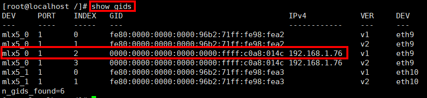

1.  执行urma_perftest -h查看命令行


2.  在X.X.X.X server，执行:

urma_perftest write_lat -d hrn0_0 -n 100000 -a -I 128

3.  Y.Y.Y.Y client，执行

urma_perftest write_lat -d hrn0_0 -S 10.151.151.77 -n 100000 -a -I 128

4.  检查结果


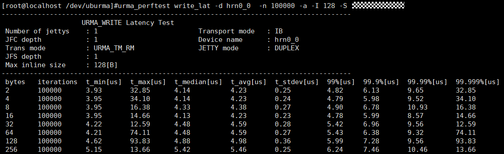

5.  配置限速

urma_perftest write_bw -d hrn0_0 -a \--rate_limit 0.1 \--rate_units G \--burst_size 1\
urma_perftest write_bw -d hrn0_0 -a -S 10.151.151.77 \--rate_limit 0.1 \--rate_units G \--burst_size 1


\-\-\--结束

### urma_admin

urma框架通过sysfs呈现设备不同粒度资源的属性，包含jetty资源的各种属性、端口的状态等。urma_admin工具可以通过命令行直接查询设备属性和状态，并可以配置部分属性，例如 更新eid、切换eid更新模式、查询设备属性等。

1.  命令格式

Usage: urma_admin command \[command options\]\
urma_admin URMA configuration tool, chips do not support some values, which might be invalid.\
Command syntax:\
show \[\--dev\] \[\--whole\] show all UB devices info.\
show topo \[node_id\] show topo_info of the specified node.\
when node_id is empty, will show the current node.\
add_eid \<\--dev\> \<\--idx\> \[\--ns /proc/\$pid/ns/net\] add eid of UB device, only for uvs,\
control plane not support.\
del_eid \<\--dev\> \<\--idx\> del eid of UB device, only for uvs,\
control plane not support.\
set_eid_mode \<\--dev\> \[\--eid_mode\] change eid mode of MUE device, only for\
uvs, control plane not support.\
set_reserved_jetty \<\--dev\> \<\--min_id\> \<\--max_id\> set reserved jetty id range.\
show_stats \<\--dev\> \<\--resource_type\> \<\--key\> show run stats of UB device,\
control plane not support.\
show_res \<\--dev\> \<\--resource_type\> \<\--key\> \[\--key_ext\]\
\<\--key_cnt\> show resources of UB device.\
list_res \<\--dev\> \<\--resource_type\> \[\--key\] \[\--key_ext\]\
\[\--key_cnt\] list resources of UB device.\
set_ns_mode \<\--ns_mode (exclusive: 0) \| (shared: 1) \> set ns mode for UB devices.\
set_dev_ns \<\--dev\> \<\--ns /proc/\$pid/ns/net\> set net namespace of UB device.\
Options:\
-h, \--help show help info.\
-d, \--dev \<dev_name\> the name of UB device.\
-e, \--eid \<eid\> the eid of UB device.\
-m, \--eid_mode \<eid_mode\> the eid mode of UB device,/\
(change to dynamic_mode: cmd with -m,\
change to static_mode: cmd without -m).\
-v, \--ue_idx \<ue_idx\> the ue_idx of ubep device.\
\" when ue_idx == 0xffff or empty, it refers to MUE.\
-i, \--idx \<idx\> idx defaults to 0.\
-w, \--whole show whole information.\
-R, \--resource_type \<type\> config stats type with 1(tp_id/vtp, not support)/\
2(tp, not support)/3(tpg, not support)/4(jfs)/\
5(jfr)/6(jetty)/\
7(jetty group, not support)/8(dev).\
config res type with 1(tp_id/vtp, not support)/\
2(tp, not support)/3(tpg, not support)/\
4(utp, not support)/5(jfs)/6(jfr)/7(jetty)/\
8(jetty group)/9(jfc)/10(rc)/11(seg)/\
12(dev ta, not support)/13(dev tp, not support).\
-k, \--key \<key\> config stats/res key, config stats key with: .\
1(tp_id/vtpn, not support)/2(tpn, not support)/\
3(tpgn, not support)/4(jfs_id)/5(jfr_id)/\
6(jetty_id)/7(jetty group id, not support)/\
8(dev, no key)\
config res key with:\
1(tp_id/vtpn, not support)/2(tpn, not support)/\
3(tpgn, not support)/4(utpn, not support)/\
5(jfs_id)/6(jfr_id)/7(jetty_id)/\
8(jetty group id)/9(jfc_id)/\
10(rc_id, not support)/11(token_id)/\
12(eid, not support)/13(eid, not support).\
-K, \--key_ext \<key_ext\> config key_ext for tp_id/vtp res.\
-C, \--key_cnt \<key\> config key_cnt for rc res.\
-n, \--ns \</proc/\$pid/ns/net\> ns path.\
-M, \--ns_mode \<0 or 1\> ns_mode with (exclusive: 0) \| (shared: 1).\
-l, \--min_id \<0 - U32_MAX\> min reserved jetty id, U32_MAX means invalid.\
-u, \--max_id \<0 - U32_MAX\> max reserved jetty id, U32_MAX means invalid.

2.  功能描述

urma_admin show \--dev \<DEV_NAME\> \--whole 用于查询设备属性信息\
urma_admin add_eid \--dev \<DEV_NAME\> \--idx \[NUM\] \--ns \[进程net路径\]，用于给设备设置静态eid, idx 来源于uvs ueid表项序号， \--ns 是可选项，用于容器场景设置eid。\
urma_admin del_eid \--dev \<DEV_NAME\> \--idx \[NUM\] , 用于删除设备的静态eid, idx 也来源于uvs ueid表项序号。\
urma_admin set_eid_mode \--dev \<DEV_NAME\> -m/\--eid_mode，带-m参数切换eid动态模式，不带参数切换eid静态模式。\
urma_admin set_reserved_jetty \--dev \<DEV_NAME\> -l/\--min_id \<MIN_ID\> -u/\--max_id \<MAX_ID\>，设置保留的jetty id范围（MIN_ID、MAX_ID：\[0,U32_MAX)）。\
urma_admin show_stats \--dev \<DEV_NAME\> \--resource_type \[TYPE\] \--key \[KEY\] 用于查询 jfs/jfr/jetty/jetty_group 类型的 tx rx pktx、bytes、pkt_err的数目\
urma_admin show_topo ，显示bonding设备的拓扑信息。\
urma_admin show_res \--dev \<DEV_NAME\> \--resource_type \<TYPE\> \--key \<KEY\> \--key_ext \[KEY_EXT\] \--key_cnt \[KEY_CNT\] 用户查询jfs/jfr/jetty/jetty_grp/jfc/rc/seg/dev_ta_ctx 属性信息。\
urma_admin list_res \--dev \<DEV_NAME\> \--resource_type \<TYPE\> \--key \<KEY\> \--key_ext \[KEY_EXT\] \--key_cnt \[KEY_CNT\] 用户查询jfs/jfr/jetty/jetty_grp/jfc/rc/seg 列表信息。\
urma_admin set_ns_mode \--ns_mode \<NS_MODE\>，用于设置namespace的模式。\
urma_admin set_dev_ns \--dev \<DEV_NAME\> \--ns \<NS\>，用于设置设备的namespace。

3.  参数说明

    1.  

+------+------------------+--------------------------------------------------------------------------------------------------------------------------------------------------------------------------------------------------------------------------------------------------+------------------------------------+--------------------------------------------------------------------+----------+
| 参数 | 参数全称         | 描述                                                                                                                                                                                                                                             | 是否输入参数                       | 取值范围                                                           | 默认取值 |
+:=====+:=================+:=================================================================================================================================================================================================================================================+:===================================+:===================================================================+:=========+
| -h   | \--help          | 查询帮助信息                                                                                                                                                                                                                                     | 非必选                             | 无限度                                                             | 无       |
+------+------------------+--------------------------------------------------------------------------------------------------------------------------------------------------------------------------------------------------------------------------------------------------+------------------------------------+--------------------------------------------------------------------+----------+
| -d   | \--dev           | 指定某个dev名称                                                                                                                                                                                                                                  | 必选                               | 不超过63字节的字符串                                               | 无       |
+------+------------------+--------------------------------------------------------------------------------------------------------------------------------------------------------------------------------------------------------------------------------------------------+------------------------------------+--------------------------------------------------------------------+----------+
| -e   | \--eid           | 指定某个eid值                                                                                                                                                                                                                                    | 必选                               | 4-16                                                               | 无       |
+------+------------------+--------------------------------------------------------------------------------------------------------------------------------------------------------------------------------------------------------------------------------------------------+------------------------------------+--------------------------------------------------------------------+----------+
| -m   | \--eid_mode      | 指定eid动态模式切换，配置表示使用动态eid模式                                                                                                                                                                                                     | 不输入                             | NA                                                                 | 无       |
+------+------------------+--------------------------------------------------------------------------------------------------------------------------------------------------------------------------------------------------------------------------------------------------+------------------------------------+--------------------------------------------------------------------+----------+
| -v   | \--ue_idx        | 指UB定设备idx，urma开源fe演进为ue                                                                                                                                                                                                                | 必选                               | 0\~65535                                                           | 无       |
+------+------------------+--------------------------------------------------------------------------------------------------------------------------------------------------------------------------------------------------------------------------------------------------+------------------------------------+--------------------------------------------------------------------+----------+
| -i   | \--idx           | 指定某个idx值                                                                                                                                                                                                                                    | 必选                               | 0\~65535                                                           | 无       |
+------+------------------+--------------------------------------------------------------------------------------------------------------------------------------------------------------------------------------------------------------------------------------------------+------------------------------------+--------------------------------------------------------------------+----------+
| -w   | \--whole         | 指定查询设备整个信息                                                                                                                                                                                                                             | 不输入                             | NA                                                                 | 无       |
+------+------------------+--------------------------------------------------------------------------------------------------------------------------------------------------------------------------------------------------------------------------------------------------+------------------------------------+--------------------------------------------------------------------+----------+
| -R   | \--resource_type | 指定资源的类型， 例如：                                                                                                                                                                                                                          | 必选                               | show_stats【4-8】                                                  | 无       |
|      |                  |                                                                                                                                                                                                                                                  |                                    |                                                                    |          |
|      |                  | show_stats type 【4-8】jfs/jfr/jetty/jetty group\[**not support**\]/dev                                                                                                                                                                          |                                    | show_res 【5-12】                                                  |          |
|      |                  |                                                                                                                                                                                                                                                  |                                    |                                                                    |          |
|      |                  | show_res type 【5-12】jfs/jfr/jetty/jetty_grp/jfc/rc/seg/dev_ta_ctx属性                                                                                                                                                                          |                                    |                                                                    |          |
+------+------------------+--------------------------------------------------------------------------------------------------------------------------------------------------------------------------------------------------------------------------------------------------+------------------------------------+--------------------------------------------------------------------+----------+
| -k   | \--key           | 指定key的数值                                                                                                                                                                                                                                    | 必选                               | 详见描述部分                                                       | 无       |
|      |                  |                                                                                                                                                                                                                                                  |                                    |                                                                    |          |
|      |                  | show_stats type 1(tp_id/vtpn, not support)/2(tpn, not support)/3(tpgn, not support)/4(jfs_id)/5(jfr_id)/6(jetty_id)/7(jetty group id, not support)/8(dev, no key)                                                                                |                                    |                                                                    |          |
|      |                  |                                                                                                                                                                                                                                                  |                                    |                                                                    |          |
|      |                  | show_res type 1(tp_id/vtpn, not support)/2(tpn, not support)/3(tpgn, not support)/4(utpn, not support)/5(jfs_id)/6(jfr_id)/7(jetty_id)/8(jetty group id)/9(jfc_id)/10(rc_id, not support)/11(token_id)/12(eid, not support)/13(eid, not support) |                                    |                                                                    |          |
+------+------------------+--------------------------------------------------------------------------------------------------------------------------------------------------------------------------------------------------------------------------------------------------+------------------------------------+--------------------------------------------------------------------+----------+
| -K   | \--key_ext       | 指定配置key的扩展信息                                                                                                                                                                                                                            | 必选                               | 0\~UINT_MAX                                                        | 无       |
+------+------------------+--------------------------------------------------------------------------------------------------------------------------------------------------------------------------------------------------------------------------------------------------+------------------------------------+--------------------------------------------------------------------+----------+
| -C   | \--key_cnt       | 指定key的数量                                                                                                                                                                                                                                    | show_res场景必选；list_res场景可选 | 0\~UINT_MAX（理论值，实际上限取决于resource_type和对应的芯片规格） | 无       |
+------+------------------+--------------------------------------------------------------------------------------------------------------------------------------------------------------------------------------------------------------------------------------------------+------------------------------------+--------------------------------------------------------------------+----------+
| -n   | \--ns            | 指定eid 的namespace                                                                                                                                                                                                                              | 必选                               | 长度小于128的字符串                                                | 无       |
|      |                  |                                                                                                                                                                                                                                                  |                                    |                                                                    |          |
|      |                  |                                                                                                                                                                                                                                                  |                                    | 格式：/proc/\$pid/ns/net                                           |          |
+------+------------------+--------------------------------------------------------------------------------------------------------------------------------------------------------------------------------------------------------------------------------------------------+------------------------------------+--------------------------------------------------------------------+----------+
| -M   | \--ns_mode       | 制定ns的模式                                                                                                                                                                                                                                     | 必选                               | exclusive: 0 \|shared : 1                                          | 无       |
+------+------------------+--------------------------------------------------------------------------------------------------------------------------------------------------------------------------------------------------------------------------------------------------+------------------------------------+--------------------------------------------------------------------+----------+
| -l   | \--min_id        | jetty_id在min_id\~max_id之间的jetty是公知jetty，这里配置min_id的值                                                                                                                                                                               | 必选                               | 0 - U32_MAX                                                        | 无       |
+------+------------------+--------------------------------------------------------------------------------------------------------------------------------------------------------------------------------------------------------------------------------------------------+------------------------------------+--------------------------------------------------------------------+----------+
| -u   | \--max_id        | jetty_id在min_id\~max_id之间的jetty是公知jetty，这里配置max_id的值                                                                                                                                                                               | 必选                               | 0 - U32_MAX                                                        | 无       |
+------+------------------+--------------------------------------------------------------------------------------------------------------------------------------------------------------------------------------------------------------------------------------------------+------------------------------------+--------------------------------------------------------------------+----------+


\[\]为可选参数，\<\>为必选参数。

urma_admin show -w参数说明：

1.  atomic_feature：按照比特位组合取值，具体如下：

compare_and_swap，取值为1；

swap，取值为2；

fetch_and_add，取值为4；

fetch_and_sub，取值为8；

fetch_and_or，取值为16；

fetch_and_xor，取值为32；

例如atomic_feature取值为0x5，表示\[compare_and_swap(1) fetch_and_add(4)\]

2.  trans_mode：按照比特位组合取值，具体如下

RM(Reliable message)，取值为1；

RC(Reliable connection)，取值为2；

UM(Unreilable message)，取值为4

例如trans_mode取值为0x7，表示\[RM(Reliable message, 1) RC(Reliable connection, 2) UM(Unreilable message, 4)\]

3.  congestion_ctrl_alg：按照比特位组合取值，具体如下

NONE，取值为1

DCQCN，取值为2

DCQCN_AND_NETWORK_CC，取值为4

LDCP，取值为8

LDCP_AND_CAQM，取值为16

LDCP_AND_OPEN_CC，取值为32

HC3，取值为64

DIP，取值为128

ACC，取值为256

例如congestion_ctrl_alg取值为0x13，表示\[NONE(1) DCQCN(2) LDCP_AND_CAQM(16)\]

示例:

\# urma_admin set_upi -d ubep_beta -v 1 \--i 2 \--upi 10\
\# urma_admin show_upi -d ubep_beta -v 1

\# urma_admin add_eid \--dev ubep_beta \--idx 1\
\# urma_admin add_eid \--dev ubep_beta \--idx 1 \--ns /proc/11962/ns/net

\# urma_admin del_eid \--dev ubep_beta \--idx 1

\# urma_admin set_eid_mode -d ubep_beta -m\
\# urma_admin set_eid_mode -d ubep_beta

\# urma_admin show_stats -d ubep_beta \--resource_type 5 \--key 2

\# urma_admin show_res -d ubep_beta \--resource_type 5 \--key 1 -C 1\
\# urma_admin list_res -d ubep_beta \--resource_type 5 \--key 1\
\# urma_admin set_ns_mode -M 0\
\# urma_admin set_reserved_jetty -d bonding_dev_0 -l 0 -u 4294967295


urma_admin 的操作会使用rsyslog进行日志记录到/var/log/umdk/urma/urma_admin.log文件中，其日志记录和切割转储能力依赖rsyslog和logrotate工具。如果短期频繁调用命令，会导致日志无法切割。

-e/\--eid参数当前已无实际作用，当前仍保留，规划删除中。

## DFX维测

URMA DFX能力主要包括URMA日志，此外urma_admin也具备部分维测能力，具体参考urma_admin工具手册章节。

### URMA日志

URMA整体使用OS自带的rsyslog工具来实现日志重定向打印特性，对应配置路径为/etc/rsyslog.d/\*.conf；使用OS自带的logrotate实现日志切割和压缩转储等特性，对应配置路径为/etc/logrotate.d/\*\*。产品可以按照需要修改配置文件达到不同的需要。


1.  日志文件按照阈值大小转储依赖系统esyslog工具，需要单独安装和配置。

2.  日志分区空间容量不足时，自动删除老的压缩文件，也依赖esyslog工具，需要单独安装和配置。

3.  日志文件的用户组和权限也可以通过配置/etc/rsyslog.d/\*.conf文件来配置，以下为示例。

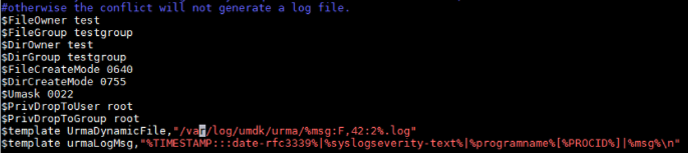

1.  日志接管

URMA支持用户态日志接管，可以通过注册函数将日志统一导到应用指定的框架中打印。

typedef void(\*urma_log_cb_t)(int level, char \*message);\
urma_status_t **urma_register_log_func**(urma_log_cb_t func);\
urma_status_t **urma_unregister_log_func**(void);

# 生态兼容

[7.1 RoUB](#roub)

[7.2 IPoURMA](#ipourma)

[7.3 UMS](#ums)

## RoUB

当前 Verbs 接口是 RDMA 编程的核心，广泛用于高性能网络。为了兼容标准 Verbs 语义，避免直接修改上层应用，我们引入了中间适配层**RoUB**(RDMA over UB)。RoUB实现了URMA能力到标准 Verbs 接口的透明映射，使现有基于libibverbs的RDMA应用无需代码改动即可使用URMA能力。


RDMA over UB 会基于系统中已有的 UB 设备动态创建对应的 IB 设备，因此对这些 IB 设备的操作能力受限于底层 UB 设备的实际功能与规格。

1.  上下文视图

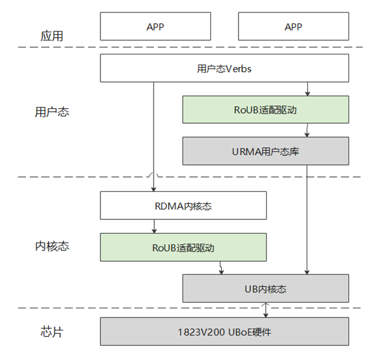

- **用户应用** 通过标准 libibverbs 调用 RDMA verbs。

- **RoUB 用户态库** 负责把这些调用包装为内部实现，并通过 liburma 调用 URMA 用户态库。

- **RoUB 内核驱动** 向 Linux RDMA 子系统注册 ib_device，并把资源请求映射到 **UBcore**。

- **UBcore** 负责底层硬件发现、资源分配的统一入口。

  1.  总体架构

      1.  

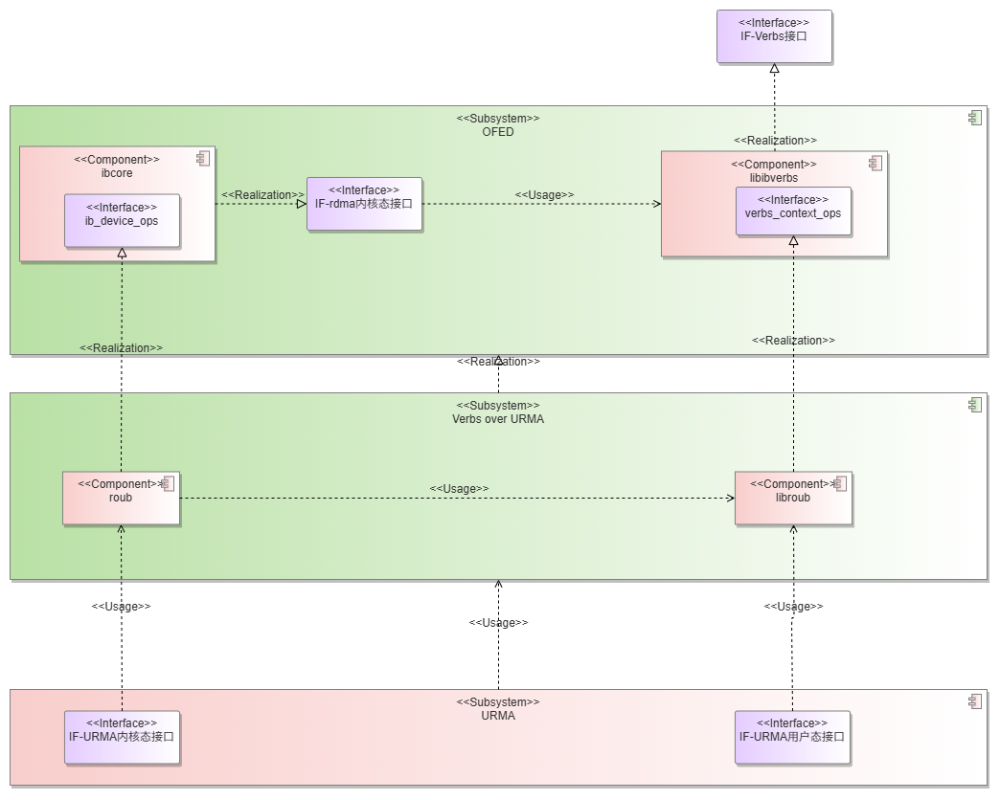

**libroub.so**:

1\. 北向对接用户态Verbs接口。

2\. 南向通过API调用与liburma.so对接。

3\. 创建与URMA设备上下文绑定的Verbs设备上下文，实现Verbs设备用户态接口。

4\. 通过调用urma API使能UB硬件，支撑RDMA建链和通信对接UB硬件。

**roub.ko**

1\. 北向对接内核态RDMA接口。

2\. 南向通过API调用与ubcore.ko对接。

3\. 创建与UB设备绑定的IB设备，支撑用户态创建对应的Verbs设备上下文。

4\. 通过调用ubcore API使能UB硬件，支撑RDMA事件机制对接UB硬件。

2.  规格与约束

<!-- -->

1.  执行 IBV_WR_SEND 操作时，单个工作请求中所有 Scatter-Gather Entry（SGE）的总数据长度不得超过 64 KB。

2.  执行 IBV_WR_RDMA_WRITE 或 IBV_WR_RDMA_READ 操作时，所有 SGE 的总数据长度不得超过 2 GB。

3.  post send当前仅支持IBV_WR_RDMA_WRITE、IBV_WR_RDMA_WRITE_WITH_IMM、IBV_WR_SEND、IBV_WR_RDMA_READ这4种命令。

4.  当前仅支持创建RC模式的QP，可通过修改环境变量 ROUB_RC_MODE 决定URMA层的实现。

5.  环境变量 ROUB_RC_MODE 默认为RS，仅可被设置为 RS 或者 RM 。进行设置时不区分大小写，且仅读取输入的前2个字符。

6.  环境变量 ROUB_RC_MODE 不相同的节点之间可以建链但无法进行数据通信。

7.  系统可创建的最大 Queue Pair（QP）数量不得超过网卡所支持的最大 Jetty 数量的 50%（即 1/2）。

8.  创建 QP 时，max_send_sge 最大为 8 ，max_recv_sge 只能为 1 。

9.  创建第 max_qp 个QP时，若遇到创建失败，重试几次后即可成功。

10. 当前仅 ibv_post_recv 操作的 ibv_wc 会包含有效的 opcode 和 wc_flags 字段。

## IPoURMA

当前 Socket 接口是网络编程的核心，广泛用于高性能网络。为了兼容标准 TCP/IP 协议栈，避免直接修改上层应用，我们引入了中间适配层IPoURMA(IP over URMA)。IPoURMA实现了URMA能力到标准 Socket 接口的透明映射，使现有基于Socket的应用无需代码改动即可使用URMA能力。

1.  上下文视图

    1.  IPoURMA上下文视图


- **用户应用** 通过调用标准 Socket 接口组装/解析IP数据报

- **IPoURMA适配层** 向Linux内核注册net_device，通过Ubcore将从协议栈获取的IP数据报下发给硬件，将从硬件上传的IP数据报上送给协议栈

- **Ubcore** 提供硬件发现，资源分配的统一入口

  1.  总体架构

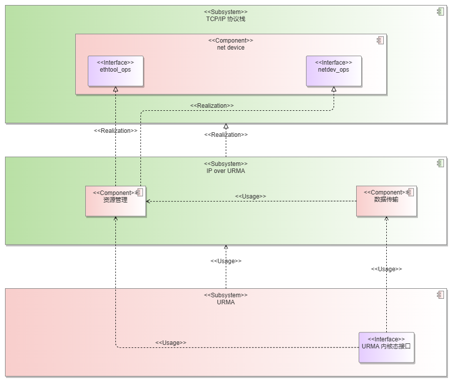

**ipourma.ko**

1.  北向对接内核TCP/IP协议栈接口

2.  南向通过API调用与ubcore.ko对接

3.  创建与UB设备上下文绑定的net device设备，支撑用户通过标准Socket接口使用UB设备能力

    1.  规格与约束

<!-- -->

1.  在模块加载后，会自动根据UB设备上的EID为对应的ipourma设备配置IP，默认IP=EID。不支持用户手动配置IP。

2.  不进行地址解析，不支持ND、ARP、RARP。仅支持IPv6地址，用户在使用socket时需绑定源IP。

3.  ipourma设备会为从协议栈收到的IP数据报加上2字节的IPoURMA报文头。

4.  默认mtu为4094。允许用户修改ipourma设备的mtu，mtu有效范围为\[68,4094\]。非有效范围的mtu修改请求不会生效。

5.  使用公知Jetty通信。加载模块时，从编号32开始依次为每个IP创建一个通信使用的公知jetty。如：设备有2个IP，则这2个IP分别使用公知Jetty32和公知Jetty33通信。

6.  IPoURMA通过sysfs提供数据面统计功能，通过 cat query_ipourma_stats 读取当前统计结果，通过 echo \"reset all status\" \> reset_ipourma_stats 将数据面当前统计结果清零。

7.  不支持使用广播报文，必须使用单播报文。

## UMS

UB Memory based Socket (UMS) 是基于开源SMC-R协议开发的向上兼容TCP socket，向下调用URMA API的内核协议栈。上层使用TCP socket的应用无需修改即可享受UB的红利。UMS比TCP协议栈轻薄，底层基于UB传输，高带宽、低时延（但仍需一次用户态到内核态的数据拷贝），scalable（类似SRM的peer-to-peer RC连接）；高效可靠的远程环形缓冲区直接访问；能自动协议协商和安全回退TCP。

1.  UMS整体架构

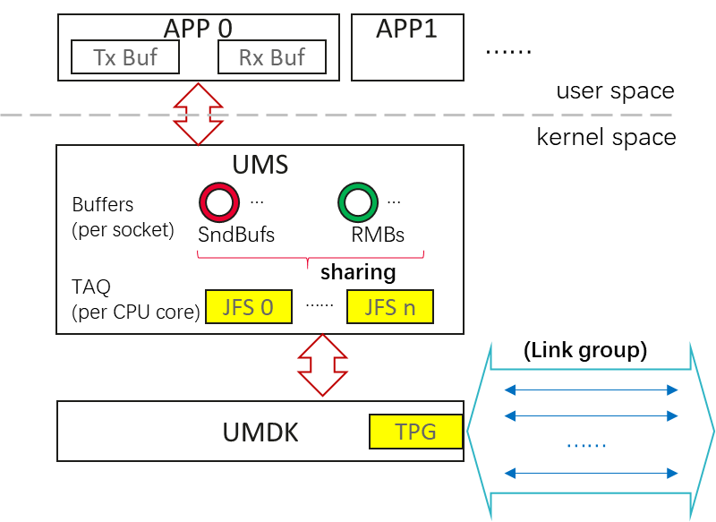

2.  管理面

UMS两节点之间的建链，用于确认两节点间UMS通信能力，若一端不支持UMS，将触发回退机制，回退到TCP连接，若均支持UMS通信，则会建立UB连接。

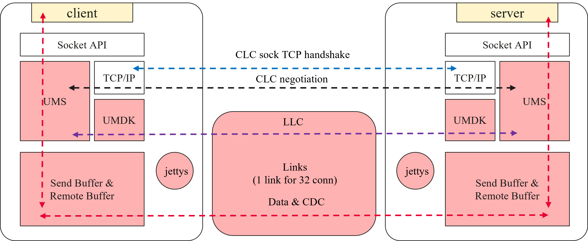

**建链流程：**

1、TCP handshake

- 客户端发送的 SYN/ACK中携带了特殊的TCP选项(Kind = 254，Magic Number = 0xe2d4)，用于表明自身支持UMS。

- 通过检查对端发送的 SYN/ACK，通信节点得知其UMS能力，进而决定是继续使用UMS通信还是回退到TCP（使用clcsocket）。


2、CLC

- Proposal: Link是由服务器管理的，客户端事先并不知情，先发送CLC proposal告诉服务器必要信息，如客户端的Peer ID、MAC、EID、IP subnet。

- Accept: 服务器收到CLC proposal之后，去查找对应的link是否存在。如果不存在则创建link所需的Jetty和connection所需的buf资源。然后向客户端返回CLC accept消息，包含是否是first contatc、RMB index等信息。

- Confirm: 客户端收到CLC accept之后，如果不是first contact，并且根据服务器的信息能查找到对应的link，则直接返回UMS confirm；否则，需要创建对应的Jetty和buffer，再返回UMS Confirm。


3、LLC

- Confirm Link: 服务器收到客户端的CLC confirm之后，发送LLC消息（通过SEND）验证该RC连接是否可靠。LLC消息需要包含Link group的最大容量、link在link group中的编号linknum和在server的编号link user ID。

- Confirm link rsp：客户端收到confirm link LLC后，回复相同格式的LLC消息。


1.  数据面

数据面用于转发上层应用通过TCP socket接口调用发送和接收（write/read）消息。


**数据通路详细过程：**

1.  sendmsg: 应用调socket send接口后，发送端SMC-R协议栈把数据从用户态拷贝到内核态该connction对应的SndBuf，更新SndBuf的Prod指针。

2.  write RMB: 发送端通过WRITE操作把SndBuf数据写入到对端RMB。

3.  CDC notify: 发送端通过SEND发送CDC消息，CDC消息包含最新的Prod指针，还会附带本地RMB的cons指针（作用相当于写RMB的ACK），还有cdc seq和token等信息。

4.  recvmsg: 接收端poll cq得到WC，从WC获得link context，然后根据CDC消息中的token查找link的红黑树结构获得connection，就知道该去哪个connection的RMB中读取数据。同时，也会更新本地保存的RMB.prod=CDC.prod。

5.  CDC reply: 接收端把数据全部读取完之后，就可以更新local.cons=cdc.prod，然后判断和上次回复CDC消息的cons指针的变化，如果大于设定的rmbe_update_limit，则回复CDC来同步发送端的cons指针（频繁回复CDC没有必要，而且会导致类似TCP silly window的问题）。

    1.  模块安装

UMS内核模块包含在umdk-ums的rpm安装包中，用户态工具在umdk-ums-tools的rpm安装包中。在安装之前请先确保URMA已安装。安装完UMS的rpm安装包之后，可以使用命令modprobe ums来加载UMS内核模块。执行完modprobe命令之后，可以通过dmesg命令来查看内核日志，如输出以下内容则代表UMS内核模块被成功加载：


UMS支持在使用命令modprobe ums加载模块时通过模块参数对各项配置进行动态调整，如modprobe ums jfc_work_mode=x，当前支持的模块参数如下

1.  UMS支持的模块参数

+------------------+-----------------------+----------+------------+-------------------------------------------------------------------+
| 参数名           | 描述                  | 类型     | 取值       | 配置说明                                                          |
+:=================+:======================+:=========+:===========+:==================================================================+
| ub_token_disable | ub token开关,默认开启 | bool     | 0x0：false | UMS数据面UB连接默认开启ub token能力，用于Jetty和SEG访问权限校验。 |
|                  |                       |          |            |                                                                   |
|                  |                       |          | 0x1：true  | 该值设置为true时,关闭本端ub token能力。                           |
+------------------+-----------------------+----------+------------+-------------------------------------------------------------------+

加载完UMS内核模块之后，应用中发送的AF_SMC类型的socket（示例：socket(AF_SMC, SOCK_STREAM, 0)）将会被UMS劫持。这种方式需要client/server端的socket同步修改，可仅修改部分需要走ub的socket；


① 由于UMS与内核自带的SMC协议会注册相同的协议族(AF_SMC，即protocol family 43)，故不能同时加载：

1）对于手动加载UMS模块的场景（modprobe ums），需要保证当前未加载smc.ko（可通过lsmod \| grep smc查看），若已加载需要卸载（rmmod smc）

2）由于内核socket框架自带的协议族模块自动加载功能：当用户调用socket接口，指定当前未注册的AF协议族时，系统会尝试从系统路径下已建立索引的ko模块中查找对应协议族的模块尝试加载，所以在未加载UMS的场景下使用AF_SMC创建socket可能会误加载smc模块，建议期望通过此方式加载UMS的用户先将smc模块从系统索引中移除

② UMS暂不支持热升级

2.  规格与约束

1\. 不支持多namespace的场景进行sysctl配置。

2\. local流量不支持走UB通路，直接回退TCP。

3\. segment限制：

源目的相同的socket会共用link(32:1)，每个socket上会注册2个segment(对应send/recv buf)，link上会注册2个segment(连接)，可支持的segment上限同jetty上限。

send/recv buf在连接销毁时不会立即注销，会在link的级别上复用，link销毁时才会销毁。故若用户通过配置接口先后修改3种buf_size建链，最多会注册3组send/recv buf。

4\. jetty限制：

源目的相同的socket会共用link(32:1)，每个link上会创建1个jetty，可支持的jetty上限为64k。

# 性能规格

1.  URMA 性能规格

+-----------------+--------------------------------------------------------------------+----------------------------------------------------------------------------------------+------------------------------------+--------------------------------------+
| 领域            | 性能规格项                                                         | 规格描述                                                                               | 规格值                             | 备注                                 |
+:================+:===================================================================+:=======================================================================================+:===================================+:=====================================+
| **URPC 云存储** | 云存储点对点时延                                                   | 收发4KB静态时延                                                                        | 20us，其中URPC软件消耗小于1us      | 不过交换机                           |
|                 +--------------------------------------------------------------------+----------------------------------------------------------------------------------------+------------------------------------+--------------------------------------+
|                 | 云存储点对点带宽                                                   | 基于DPU智能网卡单IODIE                                                                 | 170Gb                              | 依赖DPU智能网卡单IODIE达成           |
|                 |                                                                    |                                                                                        |                                    |                                      |
|                 |                                                                    | 8KB, 32条流                                                                            |                                    |                                      |
|                 +--------------------------------------------------------------------+----------------------------------------------------------------------------------------+------------------------------------+--------------------------------------+
|                 | 云存储计算节点SDI侧内存占用                                        | 8K个计算节点、256个index节点部署规模下SDI侧内存占用                                    | 500M，其中URPC+URMA管理内存占用70M | 该规格基于以下配置：                 |
|                 |                                                                    |                                                                                        |                                    |                                      |
|                 |                                                                    |                                                                                        |                                    | client配置                           |
|                 |                                                                    |                                                                                        |                                    |                                      |
|                 |                                                                    |                                                                                        |                                    | 包大小：16000                        |
|                 |                                                                    |                                                                                        |                                    |                                      |
|                 |                                                                    |                                                                                        |                                    | 头大小：256                          |
|                 |                                                                    |                                                                                        |                                    |                                      |
|                 |                                                                    |                                                                                        |                                    | rx队列深度：512                      |
|                 |                                                                    |                                                                                        |                                    |                                      |
|                 |                                                                    |                                                                                        |                                    | tx队列深度：512                      |
|                 |                                                                    |                                                                                        |                                    |                                      |
|                 |                                                                    |                                                                                        |                                    | queue数量：32（add 进所有的channel） |
|                 |                                                                    |                                                                                        |                                    |                                      |
|                 |                                                                    |                                                                                        |                                    | channel数量：4096                    |
|                 |                                                                    |                                                                                        |                                    |                                      |
|                 |                                                                    |                                                                                        |                                    | server配置                           |
|                 |                                                                    |                                                                                        |                                    |                                      |
|                 |                                                                    |                                                                                        |                                    | 包大小：16000                        |
|                 |                                                                    |                                                                                        |                                    |                                      |
|                 |                                                                    |                                                                                        |                                    | 头大小：256                          |
|                 |                                                                    |                                                                                        |                                    |                                      |
|                 |                                                                    |                                                                                        |                                    | rx队列深度：512                      |
|                 |                                                                    |                                                                                        |                                    |                                      |
|                 |                                                                    |                                                                                        |                                    | tx队列深度：512                      |
|                 |                                                                    |                                                                                        |                                    |                                      |
|                 |                                                                    |                                                                                        |                                    | queue数量：32                        |
|                 |                                                                    |                                                                                        |                                    |                                      |
|                 |                                                                    |                                                                                        |                                    | queue gourp数量：N/A                 |
|                 +--------------------------------------------------------------------+----------------------------------------------------------------------------------------+------------------------------------+--------------------------------------+
|                 | 云存储部署规模                                                     | 计算侧节点数                                                                           | 8K                                 |                                      |
+-----------------+--------------------------------------------------------------------+----------------------------------------------------------------------------------------+------------------------------------+--------------------------------------+
| **DLock**       | 基于Mlx网卡的锁操作时延                                            | 基于Mlx网卡提供基于URMA的分布式锁操作时延                                              | 20us                               | 业界zookeeper是1000us，redis是100us  |
|                 +--------------------------------------------------------------------+----------------------------------------------------------------------------------------+------------------------------------+--------------------------------------+
|                 | 基于Mlx网卡的锁操作吞吐量                                          | 基于Mlx网卡提供基于URMA的分布式锁操作吞吐量                                            | 1Mops                              |                                      |
|                 +--------------------------------------------------------------------+----------------------------------------------------------------------------------------+------------------------------------+--------------------------------------+
|                 | 基于Mlx网卡的分布式对象CAS/FAA操作在每秒20万次吞吐场景下端到端时延 | 基于Mlx网卡提供基于URMA单边语义的分布式对象CAS/FAA操作在每秒20万次吞吐场景下端到端时延 | 5us                                |                                      |
+-----------------+--------------------------------------------------------------------+----------------------------------------------------------------------------------------+------------------------------------+--------------------------------------+
| **UMS**         | 单流性能                                                           | 典型包长8KB/16KB平均延迟比TCP缩短30%                                                   |                                    |                                      |
|                 +--------------------------------------------------------------------+----------------------------------------------------------------------------------------+------------------------------------+--------------------------------------+
|                 | 多流性能                                                           | 10条连接，典型包长8KB/16KB平均延迟比TCP缩短30%                                         |                                    |                                      |
+-----------------+--------------------------------------------------------------------+----------------------------------------------------------------------------------------+------------------------------------+--------------------------------------+

// todo 建链并发\\ubagg bongding带宽

# 网络安全

UB 的安全目标在于保护通过 UB 协议栈互访的数据资产安全，包括但不限于：

⚫ UBPU 的设备身份、固件和配套软件。

⚫ 内存数据。

⚫ 总线传输数据。

⚫ 各安全功能涉及的密钥、访问凭据和配置参数等敏感数据。


[9.1 UB访问控制](#ub访问控制)

[9.2 内存访问控制](#内存访问控制)

## UB访问控制

### 应用场景

UB 提供了事务层的访问控制功能，访问控制功能的应用场景见下表，包括内存访问和 Jetty 访问两个场景。内存访问场景的访问控制功能实现依赖于 UMMU 的权限控制表，UMMU 权限控制表与地址翻译表独立，内存访问时权限校验与地址翻译分别处理，当两者均操作成功则允许内存访问，否则拒绝内存访问。

1.  访问控制功能应用场景

  ----------------------------------------------------------------------------
  应用场景       是否引入 TokenValue   访问凭据标识   是否引入 UMMU 协助卡控
  -------------- --------------------- -------------- ------------------------
  内存访问       可选                  TokenID        是

  Jetty访问      可选                  TCID           否
  ----------------------------------------------------------------------------

### 功能原理

以内存访问为例，UB 的访问控制功能原理如下：

1\. User 申请访问 Home 特定内存段时，Home 验证 User 身份后，向 User 返回 TokenID 和一个随机数作为 TokenValue。

2\. User 访问 Home 内存时，在数据包中携带 TokenID 和 TokenValue，Home 查表比对内存地址和 TokenValue 等，校验成功后允许访问。

### 权限分配流程

1.  Home在注册segment时，需要应用指定TokenValue，软件栈可以使用两种方式分配分配返回TokenID：

- 调用urma_register_seg配置如下让软件栈自动分配

urma_seg_cfg_t.urma_reg_seg_flag_t.token_id_valid = 0;

- 先调用urma_alloc_token_id分配TokenID，之后调用urma_register_seg时指定该TokenID

urma_seg_cfg_t.token_id = token_id;\
urma_seg_cfg_t.urma_reg_seg_flag_t.token_id_valid = 1;

2.  在注册segment时可以指定token的验证策略

urma_seg_cfg_t.urma_reg_seg_flag_t.token_policy = 0;

1.  token验证策略

  ---------------------------------------------------------------------------------------------------------------------------------------------------------------
  值   URMA定义                   策略
  ---- -------------------------- -------------------------------------------------------------------------------------------------------------------------------
  0    URMA_TOKEN_NONE            只传输 TokenID 或 TCID，不带 TokenValue，这种方式性能最高，但是存在非授权访问风险。

  1    URMA_TOKEN_PLAIN_TEXT      传输 TokenID 或 TCID 和 TokenValue 明文，这种方式具有一定安全性，但是存在网络中间节点非法获取 TokenValue 的风险。

  2    URMA_TOKEN_SIGNED          传输 TokenID 或 TCID 和 TokenValue，并加密保护，而 PLD 是明文，这种方式网络中间节点无法获取 TokenValue，但是可看到 PLD 内容。

  3    URMA_TOKEN_ALL_ENCRYPTED   传输 TokenID 或 TCID 和 TokenValue，并加密保护，PLD 也加密，这种方式最安全，但是带来的硬件开销较大。
  ---------------------------------------------------------------------------------------------------------------------------------------------------------------


以上验证策略能力需要硬件支持，

3.  应用可以将Home的Token信息使用带外通道（例如TLS/IP通道）或者URMA提供的公知jetty通道分发给User。

4.  User在import 远端Home内存时，需要携带token_value+token_id信息。

5.  token安全传输

    a.  **Token安全分发**：

    <!-- -->

    1.  Target（目标方）和Initiator之间需要建立一个安全的通道，这可以通过身份证书、密码或者密钥管理系统（KMS）来实现。

    2.  分发Token时有两种方式：

        - 通过安全的带外通道（Out-of-Band, OoB）完成Token ID和Token Value的分发与派生。

        - Target通过安全的带外通道与Initiator交换对称密钥，然后在内核态使用此对称密钥在UMDK（Unified Memory Device Kit）内部进一步交换Token ID和Token Value。

    <!-- -->

    b.  **Token的查找和使用**：

    <!-- -->

    3.  在使用Token时，Target侧通过报文中的Token ID来索引找到Token Value。

    4.  Initiator侧有三种方式查找和使用Token：

        - 分布式网络编程场景：通过TargetJetty或TargetSeg对象找到Token。

        - SVA/DSVA场景：根据虚拟地址（VA）查找Token，无需TargetSeg，此时需要UMMU（Unified Memory Management Unit）支持访问CPU的页表。

        - Device场景：将Token信息绑定在设备内部某个引擎或队列的Context中，设备访问Host内存时直接从Context中获取。

    <!-- -->

    c.  **Token安全级别**：

    <!-- -->

    5.  不同的性能要求对应不同的安全策略：

        - 只传输Token ID，无需Token Value，性能最高。

        - 传输Token ID和Token Value明文，有一定的安全性，但存在网络中间节点攻击的风险。

        - 传输Token ID和签名值，Payload（负载）明文，网络中间节点无法获取Token Value，但能看到payload内容。

        - 传输Token ID和签名值，payload加密，最安全，但硬件开销较大。

    <!-- -->

    d.  **Token的Initiator隔离策略**：

    <!-- -->

    6.  为了区分不同Initiator的权限，Token分发时可以采取两种策略：

        - 以算代存：Target侧只存放原始Token Value，分发时基于Initiator的EID等信息派生，Initiator访问时携带派生Token Value和派生素材，Target侧验证派生Token的正确性。

        - 以存代算：Target侧为每个Initiator存储不同的Token Value，Initiator访问时携带Token Value，Target侧直接比较报文中的Token Value。

### 权限无效化流程

UB 访问控制功能存在两种粒度的访问权限无效化机制：

⚫ 权限组粒度无效化：

权限组粒度无效化，是由 Home 发起，Home 侧 UMMU 相关软硬件具体执行，无效化 Home 侧UMMU 中的 TokenID 和对应的 TokenValue。此时，持有该 TokenID 和 TokenValue 的权限组内所有 User 访问权限均被无效化。

⚫ 用户粒度无效化：

用户粒度无效化是指无效化权限组内具体 User 的访问权限，同时保证最小化影响权限持续有效的 User，是由 User 发起。步骤如下：

\(1\) 多个 User 均申请获得 Home 的内存访问凭据（可以是分别向 Home 申请，也可以是多个User 之间共享获得），包括 TokenID 和相应的 TokenValue。

\(2\) Home 更新 TokenValue，向权限持续有效的 User 分发更新后的 Tokenvalue，权限失效的User 将不会收到更新后的 TokenValue。

\(3\) Home 仅接受基于更新后的 TokenValue 申请内存访问，从而实现无效化未收到更新后的TokenValue 的 User 的内存访问权限。

## 内存访问控制

URMA北向接口内存权限配置与UB协议定义保持一致，采用如下定义：

#define URMA_ACCESS_LOCAL_ONLY (0x1 \<\< 0)\
#define URMA_ACCESS_READ (0x1 \<\< 1)\
#define URMA_ACCESS_WRITE (0x1 \<\< 2)\
#define URMA_ACCESS_ATOMIC (0x1 \<\< 3)


1、URMA_ACCESS_LOCAL_ONLY置位1，则本地访问时具有READ、WRITE、ATOMIC所有权限，但是外部访问拒绝；

2、URMA_ACCESS_LOCAL_ONLY置位0，则除 本地访问具备所有权限之外，外部访问权限配置由后面三个类型决定，按照用户配置的READ、WRITE、ATOMIC组合生效；

3、Write需要Read权限，Atomic需要Write+Read权限。
