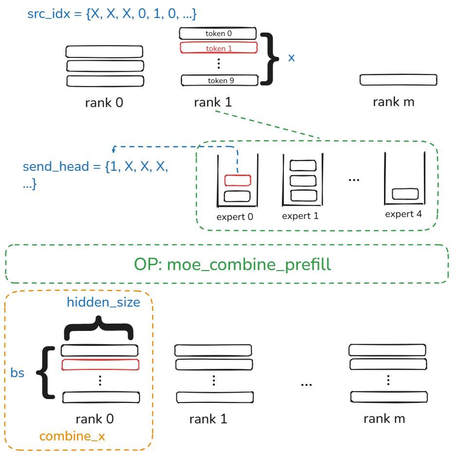
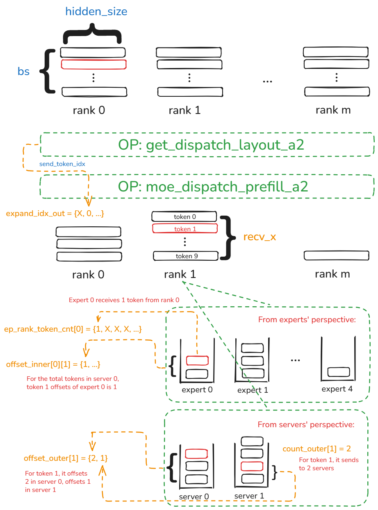
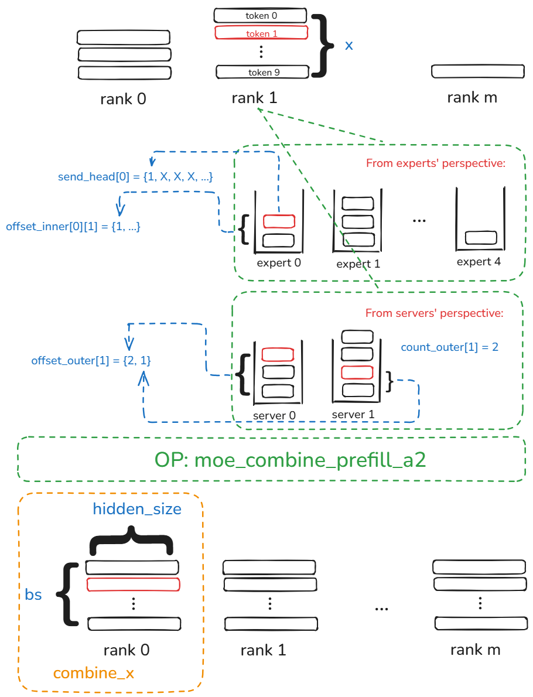

# CAM API Guide
## Introduction
 **CAM**  is short for  **C**ommunication  **A**cceleration for  **M**atrix on Ascend NPU. CAM provides EP (Expert Parallelism) communication kernels, high performance KVCache transfer for PD disaggregation and KVC pooling, AFD communication kernels, RL weights transfer and so on. CAM is easily to be run in single kernel mode or integrated into vllm or SGLang framework. 

## CAM Structure
（To be done）

## CAM API
### 1. EP Communication Kernels
UMDK provides high-performance Python interfaces for communication and fused computation-communication via "umdk_cam_op_lib". Users can use this lib in popular Ascend inference framework, such as vllm-ascend, sglang-kernel-npu, etc.
#### 1.1 Interfaces of Dispatch & Combine
#### 1.1.1 moe_dispatch_shmem ▶
##### 1.1.1.1 Prototype 
```python
moe_dispatch_shmem(
    Tensor x, 
    Tensor expert_ids, 
    Tensor scales, 
    Tensor x_active_mask, 
    int ep_world_size, 
    int ep_rank_id, 
    int moe_expert_num, 
    int tp_world_size, 
    int tp_rank_id, 
    int expert_shard_type, 
    int shared_expert_num, 
    int shared_expert_rank_num, 
    int quant_mode, 
    int global_bs, 
    int expert_token_nums_type, 
    int ext_info)
-> output: List[Tensor]
```
##### 1.1.1.2 Interface Description 
Dispatch interface based on SHMEM, which is used for token dispatch to different experts in EP communication phase. This interface should be used in conjunction with "moe_combine_shmem".
##### 1.1.1.3 Input Parameters
| **📌Parameter** | **🔧Type** | **✅Required/Optional** | **📋Value Range** | **📝Details** |
|----------|----------|--------------|--------------|----------|
|x|Tensor|Required|Shape: (batch_size, hidden_size)|Input token|
|expert_ids|Tensor|Required|Shape: (batch_size, top_k)|Destination expert ID|
|scales|Tensor|Optional|Float type，Shape: (m+1,h) when shared expert exists, (m, h) when there is no shared expert, m is the shared expert number.|Quant parameters|
|x_active_mask|Tensor|Optional|Not supported，set to None|--|
|ep_world_size|int|Required|Supported values：[8, 16, 32, 64, 128, 144, 256, 288]|Rank size in EP Communicator|
|ep_rank_id|int|Required|[0, ep_world_size-1]|Rank ID in EP communicator|
|moe_expert_num|int|Required|[1, 512]|MoE expert number|
|tp_world_size|int|Required|Not supported，set to 0|--|
|tp_rank_id|int|Required|Not supported，set to 0|--|
|expert_shard_type|int|Required|Not supported，set to 0|--|
|shared_expert_num|int|Required|Only support 1, set to 1|Shared expert number|
|shared_expert_rank_num|int|Required|[0, ep_world_size-1]|Shared expert rank number|
|quant_mode|int|Required|set to 0 when no quant，set to 2 when quant|Quant mode|
|global_bs|int|Required|Value constrains by the total Memory buffer size.|Global BS value upper bound in the EP communicator|
|expert_token_nums_type|int|Required|0: Output is the token processing number of each expert；1：Output is the prefix sum of each expert's token processing number|expert_token_nums_out data format indicator|
|ext_info|int|Required|--|Basic address pointer return value after SHMEM initiation|
##### 1.1.1.4 Return Values 
Output is a List of Tensor, which stores the following value sequencially: expand_x, dynamic_scales, expand_idx, expert_token_nums, ep_send_count, tp_send_count and expand_scales.
| **📌Parameter** | **🔧Type** | **📋Value Range** | **📝Details** |
|----------|----------|--------------|----------|
|expand_x|Tensor|Shape: (rank_size * batch_size / shared_expert_num, hidden_size) when the current rank is shared expert; Shape：(expert_num_per_rank * rank_size * batch_size, hidden_size) when the current rank is MoE expert|All expert tokens in the rank|
|dynamic_scales|Tensor|Shape is the same as the first dimension of expand_x, which is: (rank_size * batch_size / shared_expert_num) when the current rank is shared expert; (expert_num_per_rank * rank_size * batch_size) when the current rank is MoE expert|Quant parameters|
|expand_idx|Tensor|Shape：(batch_size, top_k)|In target expert, the send sequence ID when only consider the current rank|
|expert_token_nums|Tensor|(expert_num_on_rank)|Token receive number of each expert in this rank|
|ep_send_count|Tensor|Shape：(expert_num_per_rank * ep_world_size)|Token receive number of each expert from each rank|
|tp_send_count|Tensor|--|Not support|
|expand_scales|Tensor|--|Not support|
##### 1.1.1.5 Constraints and Precautions⚠️
1. Input Shape should satisfy the shape definition above.
2. expand_x data type is int8 when quan mode is on; expand_x data type is bfloat16 when quan mode is off.
3. Current interface do not support A2.
4. Current interface do not support concurrent usage.
5. Do not support dynamic graph when in GE mode; Do not support fullgraph=true.
6. Data type of x do not support bfloat16.
7. Current version does not support shared expert function.
8. User should guarantee the validity of ext_info address.
9. Other Constraits need to be satisfy:
 - top_k supports 8 only.
 - Required: (moe_expert_num + shared_expert_rank_num) ≤ CAM_MAX_EXPERT_NUM, where CAM_MAX_EXPERT_NUM is 512 currently.
 - Required: moe_expert_num % (ep_world_size - shared_expert_rank_num) == 0
 - Required：moe_expert_num / (ep_world_size - shared_expert_rank_num) ≤ MAX_EXPERT_PER_RANK, where MAX_EXPERT_PER_RANK is 32 currently. 
 - Required： if shared_expert_rank_num is not 0，ep_world_size % shared_expert_rank_num == 0，and ep_world_size ≠ shared_expert_rank_num.
 - Required：(batch_size * hidden_size * ep_world_size * expert_num_per_rank * 2) ≤ the space allocated by SHMEM, which is pointed by ext_info.
#### 1.1.2 moe_combine_shmem ▶
##### 1.1.2.1 Prototype 
```python
moe_combine_shmem(
    Tensor expand_x, 
    Tensor expert_ids, 
    Tensor expand_idx, 
    Tensor ep_send_counts, 
    Tensor expert_scales, 
    Tensor tp_send_counts, 
    Tensor x_active_mask, 
    Tensor activation_scale, 
    Tensor weight_scale, 
    Tensor group_list, 
    Tensor expand_scales, 
    int ep_world_size, 
    int ep_rank_id, 
    int moe_expert_num, 
    int tp_world_size, 
    int tp_rank_id, 
    int expert_shard_type, 
    int shared_expert_num, 
    int shared_expert_rank_num, 
    int global_bs, 
    int comm_quant_mode, 
    int ext_info, 
    int out_dtype, 
    int group_list_type)
-> output: Tensor
```
##### 1.1.2.2 Inrterface Description 
Combine interface based on SHMEM, which is used for token combine from different experts in EP communication phase. This interface should be used in conjunction with "moe_dispatch_shmem".
##### 1.1.2.3 Input Parameters 
| **📌Parameter** | **🔧Type** | **✅Required/Optional** | **📋Value Range** | **📝Details** |
|----------|----------|--------------|--------------|----------|
|expand_x|Tensor|Required|Shape: same as expand_x from dispatch output|Token to each expert from dispatch|
|expert_ids|Tensor|Required|Shape:(batch_size, top_k)|Target expert ID|
|expand_idx|Tensor|Required|Shape:(batch_size, top_k)|In target expert, token sequential ID based on current rank|
|ep_send_counts|Tensor|Required|Shape: (expert_num_per_rank * ep_world_size)|Token number from each expert in each rank|
|expert_scales|Tensor|Required|Shape：（batch_size, top_k）|Weights when combine token from each expert|
|tp_send_count|Tensor|Optional|Not support，set to tensor[0] as int8 type|--|
|x_active_mask|Tensor|Optional|Not support，set to None|--|
|activation_scale|Tensor|Optional|Not support，set to None|--|
|weight_scale|Tensor|Optional|Not support，set to None|--|
|group_list|Tensor|Optional|Not support，set to None|--|
|expand_scales|Tensor|Optional|Not support，set to None|--|
|ep_world_size|int|Required|Supported Value：[8, 16, 32, 64, 128, 144, 256, 288]|Rank number in EP communicator|
|ep_rank_id|int|Required|[0, ep_world_size-1]|rank ID in EP communicator|
|moe_expert_num|int|Required|[1, 512]|MoE expert number|
|tp_world_size|int|Required|Not support，set to 1|--|
|tp_rank_id|int|Required|Not support，set to 0|--|
|expert_shard_type|int|Required|Not support，set to 0|--|
|shared_expert_num|int|Required|Set to 1|Shared expert number|
|shared_expert_rank_num|int|Required|[0, ep_world_size-1]|Shared expert rank ID|
|global_bs|int|Required|Value constrains by the total Memory buffer size.|Global BS value upper bound in the EP communicator|
|out_dtype|int|Required|Not support，set to 0|--|
|comm_quant_mode|int|Required|Set to 0 when no quant, set to 2 when quant|Quant mode|
|group_list_type|int|Required|Not support，set to 0|--|
|ext_info|int|Required|--|Basic address pointer return value after SHMEM initiation|
##### 1.1.2.4 Return Values 
Output is a tensor，which stores expand_x。
| **📌Parameter** | **🔧Type** | **📋Value Range** | **📝Details** |
|----------|----------|--------------|----------|
|expand_x|Tensor|Shape:(batch_size, hidden_size)|token combined from different experts|
##### 1.1.2.5 Constraints and Precautions⚠️
1. Input Shape should satisfy the shape definition above.
2. Current interface do not support A2.
3. Current interface do not support concurrent usage.
4. Do not support dynamic graph when in GE mode; Do not support fullgraph=true.
5. Current version does not support shared expert function.
6. User should guarantee the validity of ext_info address.
7. Other Constraits need to be satisfy:
 - top_k supports 8 only.
 - Required: (moe_expert_num + shared_expert_rank_num) ≤ CAM_MAX_EXPERT_NUM, where CAM_MAX_EXPERT_NUM is 512 currently.
 - Required: moe_expert_num % (ep_world_size - shared_expert_rank_num) == 0
 - Required：moe_expert_num / (ep_world_size - shared_expert_rank_num) ≤ MAX_EXPERT_PER_RANK, where MAX_EXPERT_PER_RANK is 32 currently. 
 - Required： if shared_expert_rank_num is not 0，ep_world_size % shared_expert_rank_num == 0，and ep_world_size ≠ shared_expert_rank_num.
 - Required：(batch_size * hidden_size * ep_world_size * expert_num_per_rank * 2) ≤ the space allocated by SHMEM, which is pointed by ext_info.

 #### 1.1.3 get_dispatch_layout ▶
##### 1.1.3.1 Prototype 
```python
get_dispatch_layout(
    Tensor topk_idx, 
    int num_experts, 
    int num_ranks)
-> output: tuple(Tensor, Tensor)
```
##### 1.1.3.2 Interface Description 

Interface used before dispatch in prefill phase for A3, which copies the current tokens in this rank TopK times and rearranges these tokens in experts' granularity. This interface should used with moe_dispatch_prefill and moe_combine_prefill.
##### 1.1.3.3 Input Parameters 
| **📌Parameter** | **🔧Type** | **✅Required/Optional** | **📋Value Range** | **📝Details** |
|----------|----------|--------------|--------------|----------|
|topk_idx|Tensor|Required|Shape:(batch_size, topk)， int64 type，Range：[0, num_experts)|ID info for target experts|
|num_experts|int|Required|Range：(0, 512]|MOE experts number|
|num_ranks|int|Required|Range：[1, 384]|rank number in EP communication group|
##### 1.1.3.4 Return Value
Return value of this interface is a tuple made of 2 tensor, which stores number_tokens_per_expert and send_token_idx respectively.
| **📌Parameter** | **🔧Type** | **📋Value Range** | **📝Details** |
|----------|----------|--------------|----------|
|number_tokens_per_expert|Tensor|Shape：（num_experts）|token value sent to each expert in this rank|
|send_token_idx|Tensor|Shape：(batch_size, top_k)|The position offset of each token after re-arrangement in experts' perspective|
##### 1.1.3.5 Constraints and Precautions ⚠️
1. Input Shape should satisfy the shape definition above.
2. Current interface supports A3 only.
3. Current interface do not support concurrent usage.
4. Do not support dynamic graph when in GE mode; Do not support fullgraph=true.
5. Other Constraits need to be satisfy:
 - top_k value range: (0, 16].
 - batch_size value range: (0, 8000]
 - Required: num_experts % num_ranks == 0
 - Required: num_experts >= num_ranks

 #### 1.1.4 moe_dispatch_prefill ▶
##### 1.1.4.1 Prototype
```python
moe_dispatch_prefill(
    Tensor x, 
    Tensor topk_idx, 
    Tensor topk_weights, 
    Tensor num_tokens_per_expert, 
    Tensor send_token_idx_small, 
    str group_ep, 
    int rank, 
    int num_ranks, 
    bool use_quant) 
-> output: tuple(Tensor, Tensor, Tensor, Tensor, Tensor)
```
##### 1.1.4.2 Interface Description 

Dispatch interface in prefill phase for A3, which sends the tokens to the target experts in the rules of topk_idx.
##### 1.1.4.3 Input Parameters 
| **📌Parameter** | **🔧Type** | **✅Required/Optional** | **📋Value Range** | **📝Details** |
|----------|----------|--------------|--------------|----------|
|x|Tensor|Required|Shape:(batch_size, hidden_size), support bf16 and float16|token sent from current rank|
|topk_idx|Tensor|Required|Shape:(batch_size, topk)， int64 type，Range：[0, num_experts)|target ID of each token|
|topk_weights|Tensor|Required|Shape:(batch_size, topk)， float32 type|weights of target experts for each token|
|number_tokens_per_expert|Tensor|Required|Shape：（num_experts），int type|token number sent to each expert in current rank, must be output number_tokens_per_expert from get_dispatch_layout, cannot be modified|
|send_token_idx_small|Tensor|Required|Shape：(batch_size, top_k), int type|The position offset of each token after re-arrangement in experts' perspective, must be output send_token_idx from get_dispatch_layout, cannot be modified|
|group_ep|str|Required|--|name of HCCL communication group|
|rank|int|Required|[0, num_ranks)|rank ID in communication group|
|num_ranks|int|Required|[2, 384]|rank number of EP group|
|use_quant|bool|Required|True: use quant； False: do not use quant|Dispatch quant indicator|
##### 1.1.4.4 Return Value 
Return value is a tuple made of 5 tensors，which stores：recv_x, dynamic_scales_out, expand_idx_out, recv_count, recv_token_per_expert.
| **📌Parameter** | **🔧Type** | **📋Value Range** | **📝Details** |
|----------|----------|--------------|----------|
|recv_x|Tensor|Shape：(recv_token_num, hidden_size), recv_token_num is the token number received by this rank. When use_quant is true, data type is int8, and data type is the same as input x when use_quant is false.|token received in current rank|
|dynamic_scales_out|Tensor|Shape：(recv_token_num), float type. This value has no meanings when use_quant is false.|dynamic quant scale infos for received tokens in current rank|
|expand_idx_out|Tensor|Shape：(recv_token_num * 3), int type|info triplet of token received by this rank, the three numbers of each triplet is: source rank, index of token in source rank(from BS's perspective), token offset after the re-arrangement in source rank in experts' perspective|
|recv_count|Tensor|Shape：(num_experts), int type|prefix-sum number of token received in this rank from each other ranks|
|recv_tokens_per_expert|Tensor|Shape：(local_expert_num), int64 type|token received by each expert in this rank|
##### 1.1.4.5 Constraints and Precautions ⚠️
1. Input Shape should satisfy the shape definition above.
2. Current interface supports A3 only.
3. Current interface do not support concurrent usage.
4. Do not support dynamic graph when in GE mode; Do not support fullgraph=true.
5. Other Constraits need to be satisfy:
 - top_k value range: (0, 16].
 - BS value range: [1, 8K]
 - num_ranks range: [2, 384]
 - num_experts range: (0, 512]
 - required: (num_experts % num_ranks) == 0
 - required: set HCCL_BUFFERSIZE = 4096
 - Required: num_experts >= num_ranks

 #### 1.1.5 moe_combine_prefill ▶
##### 1.1.5.1 Prototype
```python
moe_combine_prefill(
    Tensor x, 
    Tensor topk_idx, 
    Tensor topk_weights, 
    Tensor src_idx, 
    Tensor send_head,
    str group_ep, 
    int rank, 
    int num_ranks) 
-> output: Tensor
```
##### 1.1.5.2 Interface Description

combine interface in prefill phase for A3, which combines the token sent to each expert in topk_idx rules with weights given by topk_weights.
##### 1.1.5.3 Input Parameters
| **📌Parameter** | **🔧Type** | **✅Required/Optional** | **📋Value Range** | **📝Details** |
|----------|----------|--------------|--------------|----------|
|x|Tensor|Required|Shape:(recv_token_num, hidden_size), support bf16 and float16 types|token received of this rank in dispatch phase|
|topk_idx|Tensor|Required|Shape:(batch_size, topk)， int64 type，Range：[0, num_experts)|target experts info for each token|
|topk_weights|Tensor|Required|Shape:(batch_size, topk)， float32 type|weights of topk experts for each token|
|src_idx|Tensor|Shape：(recv_token_num * 3), int type|info triplet of token received by this rank, the three numbers of each triplet is: source rank, index of token in source rank(from BS's perspective), token offset after the re-arrangement in source rank in experts' perspective. Must be output expand_idx_out from moe_dispatch_prefill, cannot be modified|
|send_head|Tensor|Shape：(num_experts), int type|prefix-sum number of token received in this rank from each other ranks. Must be output recv_count from moe_dispatch_prefill, cannot be modified|
|group_ep|str|Required|--|name of HCCL communication group|
|rank|int|Required|[0, num_ranks)|rank ID of current rank in EP group|
|num_ranks|int|Required|[2, 384]|rank number of EP group|
##### 1.1.5.4 Return Value 
Return value is a tensor，which stores combine_x。
| **📌Parameter** | **🔧Type** | **📋Value Range** | **📝Details** |
|----------|----------|--------------|----------|
|combine_x|Tensor|Shape：(batch_size, hidden_size), data type is the same as x|token received in current rank|
##### 1.1.5.5 Constraints and Precautions ⚠️
1. Input Shape should satisfy the shape definition above.
2. Current interface supports A3 only.
3. Current interface do not support concurrent usage.
4. Do not support dynamic graph when in GE mode; Do not support fullgraph=true.
5. Other Constraits need to be satisfy:
 - top_k value range: (0, 16].
 - BS value range: [1, 8K]
 - num_ranks range: [2, 384]
 - num_experts range: (0, 512]
 - required: (num_experts % num_ranks) == 0
 - required: set HCCL_BUFFERSIZE = 4096
 - Required: num_experts >= num_ranks
6. combine_x accuracy verification standards
 - Non-quantized scenarios: The average relative error shall be within 0.5%
 - Quantized scenarios: The average relative error shall be within 1%

 #### 1.1.6 get_dispatch_layout_a2 ▶
##### 1.1.6.1 Prototype
```python
get_dispatch_layout_a2(
    Tensor topk_idx, 
    int num_experts, 
    int num_ranks)
-> output: tuple(Tensor, Tensor)
```
##### 1.1.6.2 Interface Description 

Interface used befor dispatch in prefill phase for A2, which copies the current tokens in this rank TopK times((TopK + 1) times if shared experts exist) and rearranges these tokens in different granularity. This interface should used with moe_dispatch_prefill_a2 and moe_combine_prefill_a2.
##### 1.1.6.3 Input Parameters 
| **📌Parameter** | **🔧Type** | **✅Required/Optional** | **📋Value Range** | **📝Details** |
|----------|----------|--------------|--------------|----------|
|topk_idx|Tensor|Required|Shape:(batch_size, topk)， int64 or int32 type，Range：[0, num_experts)|ID for target experts|
|num_experts|int|Required|Range：(0, 256]|MOE expert numbers|
|num_ranks|int|Required|Support 16 only|rank number for EP communication group|
##### 1.1.6.4 Return Value
Return value is a tuple made of 2 tensors, which stores number_tokens_per_expert and notify_send_data.
| **📌Parameter** | **🔧Type** | **📋Value Range** | **📝Details** |
|----------|----------|--------------|----------|
|number_tokens_per_expert|Tensor|Shape：(num_experts), int type|token number to each expert from current rank|
|notify_send_data|Tensor|Shape：(num_experts * EXPERT_DATA_SIZE + server_num + max_bs * (1 + 2* server_num + num_experts)), int type. Set EXPERT_DATA_SIZE=4097，max_bs=4096。Shape info for seven parts：<br> 1. num_tokens_per_expert, Shape：（num_experts）；<br> 2. num_token_per_server_uniq, Shape：（num_experts）；<br> 3. num_each_token_to_server, Shape：（max_bs * num_server）;<br> 4. each_token_to_num_server, Shape：（max_bs）;<br> 5. each_token_offset_to_server, Shape：（max_bs * num_server）；<br> 6. send_token_idx, Shape：（max_bs * num_experts）；<br> 7. expert_rank_token_idx, Shape：（num_experts， max_bs）；<br> |tensor made of 7 different parts:<br> 1. token number each expert receives from current rank；<br> 2. token number each server receives from current rank(deduplication)；<br> 3. number each token sent from this rank to each server；<br> 4. server number each token sent from this rank；<br> 5. token offset each token sent to each server in this rank<br> 6. token offset each token sent to each expert in this rank<br> 7. the "each_token_offset_to_server" value of each token received from each expert|
##### 1.1.6.5 Constraints and Precautions ⚠️
1. Input Shape should satisfy the shape definition above.
2. Current interface supports A2 only.
3. Current interface do not support concurrent usage.
4. Do not support dynamic graph when in GE mode; Do not support fullgraph=true.
5. Do not support shared experts.
6. Other Constraits need to be satisfy:
 - top_k range：[2, 8]
 - Required: num_experts % num_ranks == 0
 - Required: num_ranks % 8 == 0
 - Required：export HCCL_INTRA_PCIE_ENABLE = 1, export HCCL_INTRA_ROCE_ENABLE = 0

 #### 1.1.7 moe_dispatch_prefill_a2 ▶
##### 1.1.7.1 Prototype 
```python
moe_dispatch_prefill_a2(
    Tensor x, 
    Tensor topk_idx, 
    Tensor topk_weights, 
    Tensor num_tokens_per_expert,
    Tensor notify_send_data, 
    str group_ep, 
    int rank, 
    int num_ranks, 
    bool use_quant) 
-> output: Tensor[]
```
##### 1.1.7.2 Interface Description 

Dispatch interface in prefill phase for A2, which send token to target experts in topk_idx rules.
##### 1.1.7.3 Input Parameters
| **📌Parameter** | **🔧Type** | **✅Required/Optional** | **📋Value Range** | **📝Details** |
|----------|----------|--------------|--------------|----------|
|x|Tensor|Required|Shape:(batch_size, hidden_size), support bf16 and float16 type|token sent from this rank|
|topk_idx|Tensor|Required|Shape:(batch_size, topk)， int64 or int32 type，range: [0, num_experts)|target expert IDs for each token|
|topk_weights|Tensor|Required|Shape:(batch_size, topk)， float32 type|topk weights of target experts for each token|
|number_tokens_per_expert|Tensor|Required|Shape：（num_experts），int type|token numbers to each expert in current rank, must be output number_tokens_per_expert from get_dispatch_layout_a2, cannot be modified|
|notify_send_data|Tensor|Required|Shape：(num_experts * EXPERT_DATA_SIZE + server_num + max_bs * (1 + 2* server_num + num_experts)), int type|must be output notify_send_data from get_dispatch_layout_a2, cannot be modified|
|group_ep|str|Required|--|name of HCCL communication group|
|rank|int|Required|[0, num_ranks)|rank ID of this rank in EP group|
|num_ranks|int|Required|support 16 only|rank number in EP group|
|use_quant|bool|Required| False: no quant, quant is not supported in current version|Dispatch quant indicator|
##### 1.1.7.4 Return Value
Return value is a list made of 8 tensors, which stores: recv_x, dynamic_scales_out, expand_idx_out, ep_rank_token_cnt, offset_inner, offset_outer, count_outer, expand_scales.
| **📌Parameter** | **🔧Type** | **📋Value Range** | **📝Details** |
|----------|----------|--------------|----------|
|recv_x|Tensor|Shape：(recv_token_num, hidden_size), where recv_token_num is the number received by this rank. Data type is int8 when use_quant is true; type is the same as input x when use_quant is false.|token received in this rank|
|dynamic_scales_out|Tensor|Shape：(recv_token_num), float type. This value has no meanings when use_quant is false.|dynamic quant scales of the token received in this rank|
|expand_idx_out|Tensor|Shape：(maxbs, num_experts), int type|token offset after the re-arrangement in source rank in experts' perspective|
|ep_rank_token_cnt|Tensor|Shape：(num_experts, num_ranks), int type|token number received of each expert from different ranks|
|offset_inner|Tensor|Shape：(2, max_bs, num_experts), int type|token offset of this server from global experts' perspective|
|offset_outer|Tensor|Shape：(max_bs, num_experts), int type|token offset to the target server|
|count_outer|Tensor|Shape：(max_bs), int type|token number to the target server|
|expand_scales|Tensor|Shape：(num_recv_tokens), float type|weights corresponding to topk_weights when receives token|
##### 1.1.7.5 Constraints and Precautions ⚠️
1. Input Shape should satisfy the shape definition above.
2. Current interface supports A2 only.
3. Current interface do not support concurrent usage.
4. Do not support dynamic graph when in GE mode; Do not support fullgraph=true.
5. Do not support shared experts.
6. Other Constraits need to be satisfy:
 - top_k range：[2, 8]
 - BS range：[1，4k]
 - num_experts range：(0， 256]
 - Required: num_experts % num_ranks == 0
 - Required: num_ranks % 8 == 0
 - Required: hidden_size range: (0, 7168] and (hidden_size % 32) == 0
 - Required：export HCCL_BUFFERSIZE=4096
 - Required：export HCCL_INTRA_PCIE_ENABLE = 1, export HCCL_INTRA_ROCE_ENABLE = 0

 #### 1.1.8 moe_combine_prefill_a2 ▶
##### 1.1.8.1 Prototype 
```python
moe_combine_prefill_a2(
    Tensor x, 
    Tensor topk_idx, 
    Tensor topk_weights, 
    Tensor src_idx, 
    Tensor send_head, 
    Tensor expand_scales, 
    Tensor offset_inner, 
    Tensor offset_outer, 
    Tensor count_outer, 
    str group_ep, 
    int rank, 
    int num_ranks)
-> output: Tensor
```
##### 1.1.8.2 Interface Description 

combine interface in prefill phase for A2, which combines the token from the topk experts in weights of topk_weights.
##### 1.1.8.3 Input Parameters
| **📌Parameter** | **🔧Type** | **✅Required/Optional** | **📋Value Range** | **📝Details** |
|----------|----------|--------------|--------------|----------|
|x|Tensor|Required|Shape:(recv_token_num, hidden_size), support bf16 and float16 type|token received in dispatch phase of this rank|
|topk_idx|Tensor|Required|Shape:(batch_size, topk)， int64 or int32 type, range: [0, num_experts)|target expert ID of each token|
|topk_weights|Tensor|Required|Shape:(batch_size, topk)， float32 type|weights of topK target expert for each token|
|src_idx|Tensor|Required|Shape：(max_bs, num_experts), int type|must be output expand_idx_out from moe_dispatch_prefill_a2, cannot be modified|
|send_head|Tensor|Required|Shape：(num_experts), int type|must be output ep_rank_token_cnt from moe_dispatch_prefill_a2, cannot be modified|
|expand_scales|Tensor|Required|Shape：(num_recv_tokens), float type|must be output expand_scales from moe_dispatch_prefill_a2, cannot be modified|
|offset_inner|Tensor|Required|Shape：(2, max_bs, num_experts), int type|must be output offset_inner from moe_dispatch_prefill_a2, cannot be modified|
|offset_outer|Tensor|Required|Shape：(max_bs, num_experts), int type|must be output offset_outer from moe_dispatch_prefill_a2, cannot be modified|
|count_outer|Tensor|Shape：(max_bs), int type|must be output count_outer from moe_dispatch_prefill_a2, cannot be modified|
|group_ep|str|Required|--|HCCL communication group name|
|rank|int|Required|[0, num_ranks)|rank ID in EP group|
|num_ranks|int|Required|support 16 only |rank number in EP group|
##### 1.1.8.4 Return Value 
Return value is a tensor，which stores combine_x.
| **📌Parameter** | **🔧Type** | **📋Value Range** | **📝Details** |
|----------|----------|--------------|----------|
|combine_x|Tensor|Shape：(batch_size, hidden_size), the same type as input x|token received in current rank|
##### 1.1.8.5 Constraints and Precautions ⚠️
1. Input Shape should satisfy the shape definition above.
2. Current interface supports A2 only.
3. Current interface do not support concurrent usage.
4. Do not support dynamic graph when in GE mode; Do not support fullgraph=true.
5. Do not support shared experts.
6. Other Constraits need to be satisfy:
 - top_k range：[2, 8]
 - BS range：[1，4k]
 - num_experts range：(0， 256]
 - Required: num_experts % num_ranks == 0
 - Required: num_ranks % 8 == 0
 - Required: hidden_size range: (0, 7168] and (hidden_size % 32) == 0
 - Required：export HCCL_BUFFERSIZE=4096
 - Required：export HCCL_INTRA_PCIE_ENABLE = 1, export HCCL_INTRA_ROCE_ENABLE = 0

 #### 1.1.9 fused_deep_moe ▶
##### 1.1.9.1 Prototype
```python
fused_deep_moe(
    Tensor x, 
    Tensor expert_ids, 
    Tensor[] gmm1_weight, 
    Tensor[] gmm1_weight_scale, 
    Tensor[] gmm2_weight, 
    Tensor[] gmm2_weight_scale, 
    Tensor expert_scales, 
    Tensor? share_gmm1_weight, 
    Tensor? share_gmm1_weight_scale, 
    Tensor? share_gmm2_weight, 
    Tensor? share_gmm2_weight_scale, 
    Tensor? expert_smooth_scales,
    Tensor? share_smooth_scales,
    Tensor? x_active_mask, 
    str group_ep, 
    int ep_rank_size, 
    int ep_rank_id, 
    int moe_expert_num, 
    int quant_mode, 
    int global_bs) 
-> output: Tensor[]
```
##### 1.1.9.2 Interface Description
Fused computation-communication operator in MoE Decode phase for A3, which merges [Dispatch + FFN(GMM1 + Swiglu + GMM2) + Combine] ,(optional) and shared expert computation in the current card, into an operator for better inference performance.
##### 1.1.9.3 Input Parameters 
| **📌Parameter** | **🔧Type** | **✅Required/Optional** | **📋Value Range** | **📝Details** |
|----------|----------|--------------|--------------|----------|
|x|Tensor|Required|Shape:(batch_size, token_length), support bf16 and float16 type|token to be sent of this rank in dispatch phase |
|expert_ids|Tensor|Required|Shape:(batch_size, topk)，int32 type, range: [-1, num_experts)，where -1 is used as a placeholder. A token cannot sent to an expert beyond one time.|target expert IDs of each token|
|gmm1_weight|Tensor[]|Required|In coupling mode，there is one tensor, Shape:(localExpertNum, token_length, gmm1_hidden_size); In seperated mode，there are localExpertNum tensors, TensorShape：（token_length, gmm1_hidden_size; int8 type|GMM1 weight matrix，supports coupling mode and seperated mode|
|gmm1_weight_scale|Tensor[]|Required|In coupling mode，there is one tensor, Shape:(localExpertNum, gmm1_hidden_size); In seperated mode，there are localExpertNum tensors, each tensor Shape：（gmm1_hidden_size）; float32 type or the same type with x|GMM1 weight scale matrix，supports coupling mode and seperated mode|
|gmm2_weight|Tensor[]|Required|In coupling mode，there is one tensor, Shape:(localExpertNum, gmm1_hidden_size/2, token_length); In seperated mode，there are localExpertNum tensors, each tensor Shape：（gmm1_hidden_size/2, token_length）; int8 type|GMM2 weight matrix，supports coupling mode and seperated mode|
|gmm2_weight_scale|Tensor[]|Required|In coupling mode，there is one tensor, Shape:(localExpertNum, token_length); In seperated mode，there are localExpertNum tensors, each tensor Shape：（token_length）; float32 type or the same type with x|GMM2 weight scale matrix，supports coupling mode and seperated mode|
|expert_scales|Tensor|Required|Shape：(batch_size, topk), float32 type|weights of each expert，used in combine phase|
|share_gmm1_weight|Tensor|Optional|Shape：（token_length, share_gmm1_hidden_size）; int8 type|shared expert MM1 weight matrix|
|share_gmm1_weight_scale|Tensor|Optional|Shape：（share_gmm1_hidden_size）; the same type with gmm1_weight_scale|shared expert MM1 weight scale matrix|
|share_gmm2_weight|Tensor|Optional|Shape：（share_gmm1_hidden_size/2, token_length）; int8 type|shared expert MM2 weight matrix，supports coupling mode and seperated mode|
|share_gmm2_weight_scale|Tensor|Optional|Shape：（token_length）; the same type with gmm2_weight_scale|shared expert MM2 weight scale|
|expert_smooth_scales|Tensor|Optional|Shape: (moe_expert_num, token_length), float32 type|smooth quant scales of routed experts|
|share_smooth_scales|Tensor|Optional|Shape: (token_length), float32 type|smooth quant scales of shared experts|
|x_active_mask|Tensor|Optional|Shape: (batch_size), bool type, value in[true, false], the true value must come before the false value|mask of input x. true means the token will be dispatched, false means the token will not be dispatched|
|group_ep|str|Required|Length of str：(0, 128), make sure it is valid|HCCL communication group name|
|ep_rank_size|int|Required|Required：(ep_rank_size * MoeExpertNumPerRank) ≤ 512, and ep_rank_size > 0|EP group size|
|ep_rank_id|int|Required|range: [0, ep_rank_size)|rank ID in EP group|
|moe_expert_num|int|Required|Required：moe_expert_num % ep_rank_size == 0|MOE expert number|
|quant_mode|int|Required|Reserved parameter, set to 0|quant mode|
|global_bs|int|Required|set to 0 or (batch_size * ep_rank_size) when token is the same in different ranks; set to (max_batch_size * ep_rank_size) otherwise.|max token number among all ranks|
##### 1.1.9.4 Return Value 
Return value is a list of tensors，which stores combine_x and expert_token_nums.
| **📌Parameter** | **🔧type** | **📋Value Range** | **📝Details** |
|----------|----------|--------------|----------|
|combine_x|Tensor|Shape：(batch_size, token_length), the same type as input x|token after combination from experts in different ranks|
|share_output|Tensor|Shape：(batch_size, token_length), the same type as input x|token result from shared expert in current card. This output will exist as placeholder even though shared expert is not enabled|
|expert_token_nums|Tensor|Shape：(local_expert_num), int64 type|token number received by each expert in current rank|
##### 1.1.9.5 Constraints and Precautions ⚠️
1. Input Shape should satisfy the shape definition above.
2. Current interface supports A3 only.
3. Current interface do not support concurrent usage.In extreme cases, repeatedly calling the same operator in a single forward pass may result in undefined behavior. To avoid potential asynchronous timing issues in such scenarios, torch.npu.synchronize() should be added between operator executions.
4. Support aclgraph only when graph in on.
5. Do not support external shared experts, that is, shared experts are deployed on dedicated cards .
6. The performance may decline when batch_size is lower than 16, as it is not the target scenario.
7. Other Constraits need to be satisfy:
 - top_k range：[0， 12] and it should be lower than expert number.
 - BS range：[0，256]
 - num_experts range：(0， 512]
 - Required: local_expert_num ≤ (aivnum / 2), where aivnum is the vector core number
 - Required: token length range: [1024, 7168] and (hidden_size % 256) == 0
 - Required: gmm1_hiden_size range: [1024, 6144] and (gmm1_hiden_size % 256) == 0
 - Required: share_gmm1_hiden_size range: [1024, 6144] and (share_gmm1_hiden_size % 256) == 0
 - Required：HCCL_BUFFERSIZE should be greater than [(ep_rank_size * max_batch_size * moe_expert_num_per_rank * total_length * sizeof(x) * 2) / 1024 / 1024], which should be round up to the nearest integer.
 - Required：global_bs ≥ 0 and（global_bs % ep_rank_size） == 0
 - Required: gmm1_weight, gmm1_weight_scale, gmm2_weight, gmm2_weight_scale should be in the same mode
 - Required: share_gmm1_weight, share_gmm1_weight_scale, share_gmm2_weight, share_gmm2_weight_scale must exist at the same time if shared expert computation is enabled
 - Required: expert_smooth_scales must exist if routed expert smooth quantization is enabled, furthermore, share_smooth_scales must exist if shared expert computation is enabled