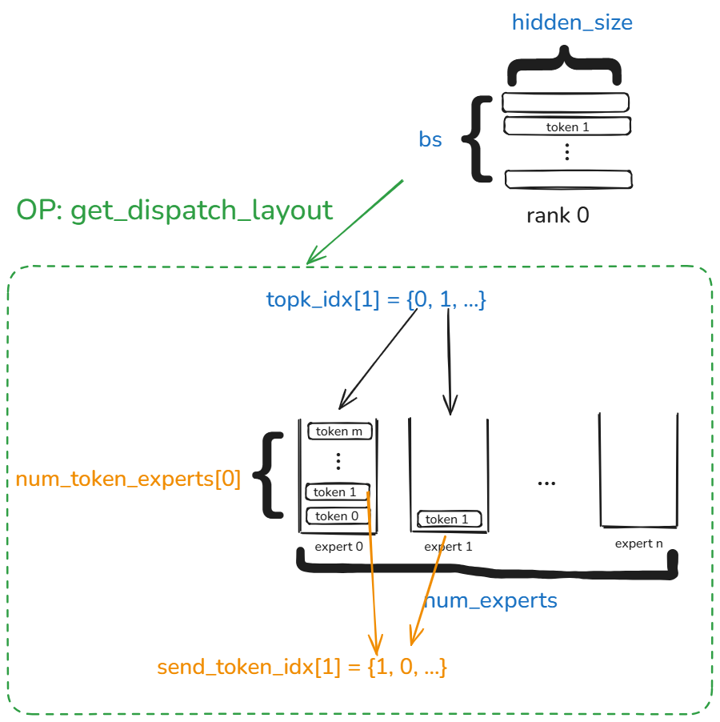
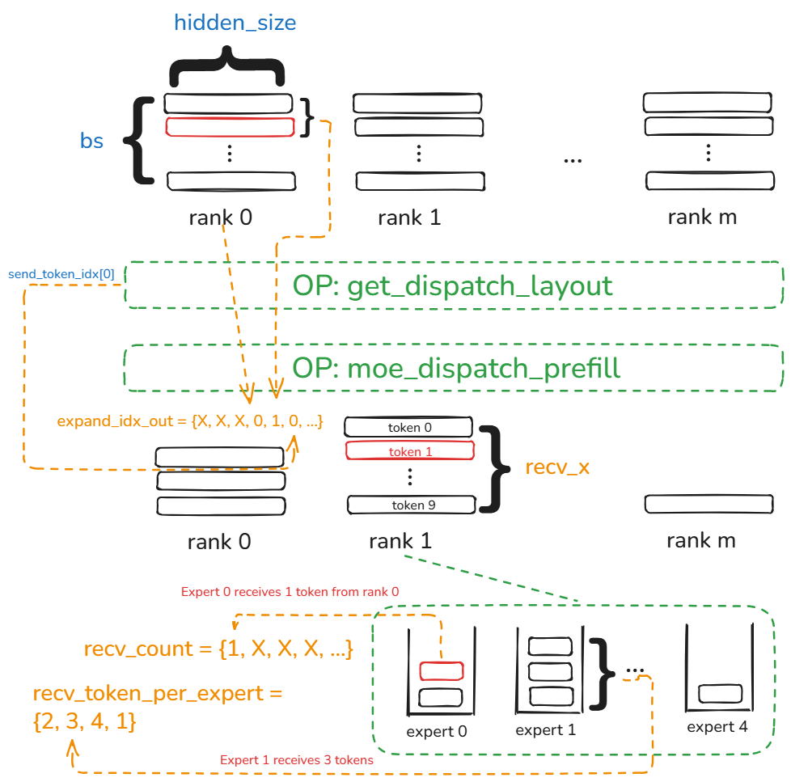
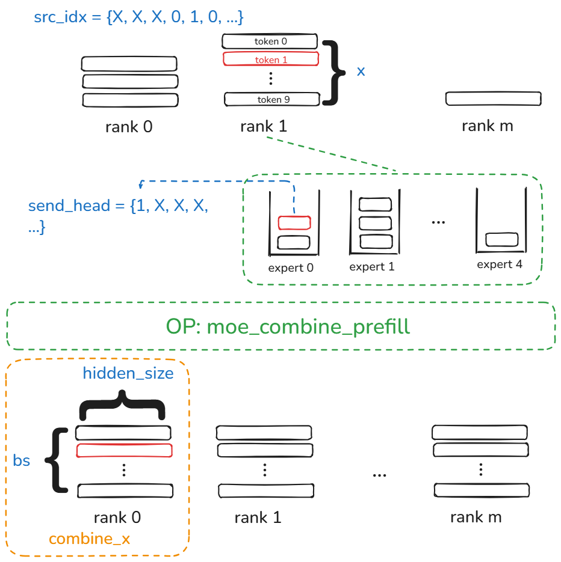

# CAM API Guide
## Introduction
 **CAM**  is short for  **C**ommunication  **A**cceleration for  **M**atrix on Ascend NPU. CAM provides EP (Expert Parallelism) communication kernels, high performance KVCache transfer for PD disaggregation and KVC pooling, AFD communication kernels, RL weights transfer and so on. CAM is easily to be run in single kernel mode or integrated into vllm or SGLang framework. 

## CAM Structure
（To be done）

## CAM API
### 1. EP Communication Kernels
UMDK provides high-performance Python interfaces for communication and fused computation-communication via "umdk_cam_op_lib". Users can use this lib in popular Ascend inference framework, such as vllm-ascend, sglang-kernel-npu, etc.
#### 1.1 Interfaces of Dispatch & Combine
 #### 1.1.1 get_dispatch_layout ▶
##### 1.1.1.1 Prototype 
```python
get_dispatch_layout(
    Tensor topk_idx, 
    int num_experts, 
    int num_ranks)
-> output: tuple(Tensor, Tensor)
```
##### 1.1.1.2 Interface Description 

Interface used before dispatch in prefill phase for A3, which copies the current tokens in this rank TopK times and rearranges these tokens in experts' granularity. This interface should used with moe_dispatch_prefill and moe_combine_prefill.
##### 1.1.1.3 Input Parameters 
| **📌Parameter** | **🔧Type** | **✅Required/Optional** | **📋Value Range** | **📝Details** |
|----------|----------|--------------|--------------|----------|
|topk_idx|Tensor|Required|Shape:(batch_size, topk)， int64 type，Range：[0, num_experts)|ID info for target experts|
|num_experts|int|Required|Range：(0, 512]|MOE experts number|
|num_ranks|int|Required|Range：[1, 384]|rank number in EP communication group|
##### 1.1.1.4 Return Value
Return value of this interface is a tuple made of 2 tensor, which stores num_tokens_per_expert and send_token_idx respectively.
| **📌Parameter** | **🔧Type** | **📋Value Range** | **📝Details** |
|----------|----------|--------------|----------|
|num_tokens_per_expert|Tensor|Shape：（num_experts）|token value sent to each expert in this rank|
|send_token_idx|Tensor|Shape：(batch_size, top_k)|The position offset of each token after re-arrangement in experts' perspective|
##### 1.1.1.5 Constraints and Precautions ⚠️
1. Input Shape should satisfy the shape definition above.
2. Current interface supports A3 only.
3. Current interface does not support concurrent usage.
4. Do not support dynamic graph when in GE mode; Do not support fullgraph=true.
5. Other Constraints need to be satisfied:
 - top_k value range: (0, 16].
 - batch_size value range: (0, 8000]
 - Required: num_experts % num_ranks == 0
 - Required: num_experts >= num_ranks

 #### 1.1.2 moe_dispatch_prefill ▶
##### 1.1.2.1 Prototype
```python
moe_dispatch_prefill(
    Tensor x, 
    Tensor topk_idx, 
    Tensor topk_weights, 
    Tensor num_tokens_per_expert, 
    Tensor send_token_idx_small, 
    str group_ep, 
    int rank, 
    int num_ranks, 
    bool use_quant) 
-> output: tuple(Tensor, Tensor, Tensor, Tensor, Tensor)
```
##### 1.1.2.2 Interface Description 

Dispatch interface in prefill phase for A3, which sends the tokens to the target experts in the rules of topk_idx.
##### 1.1.2.3 Input Parameters 
| **📌Parameter** | **🔧Type** | **✅Required/Optional** | **📋Value Range** | **📝Details** |
|----------|----------|--------------|--------------|----------|
|x|Tensor|Required|Shape:(batch_size, hidden_size), support bf16 and float16|token sent from current rank|
|topk_idx|Tensor|Required|Shape:(batch_size, topk)， int64 type，Range：[0, num_experts)|target ID of each token|
|topk_weights|Tensor|Required|Shape:(batch_size, topk)， float32 type|weights of target experts for each token|
|num_tokens_per_expert|Tensor|Required|Shape：（num_experts），int type|token number sent to each expert in current rank, must be output num_tokens_per_expert from get_dispatch_layout, cannot be modified|
|send_token_idx_small|Tensor|Required|Shape：(batch_size, top_k), int type|The position offset of each token after re-arrangement in experts' perspective, must be output send_token_idx from get_dispatch_layout, cannot be modified|
|group_ep|str|Required|--|name of HCCL communication group|
|rank|int|Required|[0, num_ranks)|rank ID in communication group|
|num_ranks|int|Required|[2, 384]|rank number of EP group|
|use_quant|bool|Required|True: use quant； False: do not use quant|Dispatch quant indicator|
##### 1.1.2.4 Return Value 
Return value is a tuple made of 5 tensors，which stores：recv_x, dynamic_scales_out, expand_idx_out, recv_count, recv_tokens_per_expert.
| **📌Parameter** | **🔧Type** | **📋Value Range** | **📝Details** |
|----------|----------|--------------|----------|
|recv_x|Tensor|Shape：(recv_token_num, hidden_size), recv_token_num is the token number received by this rank. When use_quant is true, data type is int8, and data type is the same as input x when use_quant is false.|token received in current rank|
|dynamic_scales_out|Tensor|Shape：(recv_token_num), float type. This value has no meanings when use_quant is false.|dynamic quant scale infos for received tokens in current rank|
|expand_idx_out|Tensor|Shape：(recv_token_num * 3), int type|info triplet of token received by this rank, the three numbers of each triplet is: source rank, index of token in source rank(from BS's perspective), token offset after the re-arrangement in source rank in experts' perspective|
|recv_count|Tensor|Shape：(num_experts), int type|prefix-sum number of token received in this rank from each other ranks|
|recv_tokens_per_expert|Tensor|Shape：(local_expert_num), int64 type|token received by each expert in this rank|
##### 1.1.2.5 Constraints and Precautions ⚠️
1. Input Shape should satisfy the shape definition above.
2. Current interface supports A3 only.
3. Current interface does not support concurrent usage.
4. Do not support dynamic graph when in GE mode; Do not support fullgraph=true.
5. Other Constraints need to be satisfied:
 - top_k value range: (0, 16].
 - BS value range: [1, 8K]
 - num_ranks range: [2, 384]
 - num_experts range: (0, 512]
 - required: (num_experts % num_ranks) == 0
 - required: set HCCL_BUFFSIZE = 4096
 - Required: num_experts >= num_ranks

 #### 1.1.3 moe_combine_prefill ▶
##### 1.1.3.1 Prototype
```python
moe_combine_prefill(
    Tensor x, 
    Tensor topk_idx, 
    Tensor topk_weights, 
    Tensor src_idx, 
    Tensor send_head,
    str group_ep, 
    int rank, 
    int num_ranks) 
-> output: Tensor
```
##### 1.1.3.2 Interface Description

combine interface in prefill phase for A3, which combines the token sent to each expert in topk_idx rules with weights given by topk_weights.
##### 1.1.3.3 Input Parameters
| **📌Parameter** | **🔧Type** | **✅Required/Optional** | **📋Value Range** | **📝Details** |
|----------|----------|--------------|--------------|----------|
|x|Tensor|Required|Shape:(recv_token_num, hidden_size), support bf16 and float16 types|token received of this rank in dispatch phase|
|topk_idx|Tensor|Required|Shape:(batch_size, topk)， int64 type，Range：[0, num_experts)|target experts info for each token|
|topk_weights|Tensor|Required|Shape:(batch_size, topk)， float32 type|weights of topk experts for each token|
|src_idx|Tensor|Required|Shape：(recv_token_num * 3), int type|info triplet of token received by this rank, the three numbers of each triplet is: source rank, index of token in source rank(from BS's perspective), token offset after the re-arrangement in source rank in experts' perspective. Must be output expand_idx_out from moe_dispatch_prefill, cannot be modified|
|send_head|Tensor|Required|Shape：(num_experts), int type|prefix-sum number of token received in this rank from each other ranks. Must be output recv_count from moe_dispatch_prefill, cannot be modified|
|group_ep|str|Required|--|name of HCCL communication group|
|rank|int|Required|[0, num_ranks)|rank ID of current rank in EP group|
|num_ranks|int|Required|[2, 384]|rank number of EP group|
##### 1.1.3.4 Return Value 
Return value is a tensor，which stores combine_x。
| **📌Parameter** | **🔧Type** | **📋Value Range** | **📝Details** |
|----------|----------|--------------|----------|
|combine_x|Tensor|Shape：(batch_size, hidden_size), data type is the same as x|token received in current rank|
##### 1.1.3.5 Constraints and Precautions ⚠️
1. Input Shape should satisfy the shape definition above.
2. Current interface supports A3 only.
3. Current interface does not support concurrent usage.
4. Do not support dynamic graph when in GE mode; Do not support fullgraph=true.
5. Other Constraints need to be satisfied:
 - top_k value range: (0, 16].
 - BS value range: [1, 8K]
 - num_ranks range: [2, 384]
 - num_experts range: (0, 512]
 - required: (num_experts % num_ranks) == 0
 - required: set HCCL_BUFFSIZE = 4096
 - Required: num_experts >= num_ranks
6. combine_x accuracy verification standards
 - Non-quantized scenarios: The average relative error shall be within 0.5%
 - Quantized scenarios: The average relative error shall be within 1%

 #### 1.1.4 fused_deep_moe ▶
##### 1.1.4.1 Prototype
```python
fused_deep_moe(
    Tensor x, 
    Tensor expert_ids, 
    Tensor[] gmm1_weight, 
    Tensor[] gmm1_weight_scale, 
    Tensor[] gmm2_weight, 
    Tensor[] gmm2_weight_scale, 
    Tensor expert_scales, 
    Tensor? share_gmm1_weight, 
    Tensor? share_gmm1_weight_scale, 
    Tensor? share_gmm2_weight, 
    Tensor? share_gmm2_weight_scale, 
    Tensor? expert_smooth_scales,
    Tensor? share_smooth_scales,
    Tensor? x_active_mask, 
    str group_ep, 
    int ep_rank_size, 
    int ep_rank_id, 
    int moe_expert_num, 
    int quant_mode, 
    int global_bs) 
-> output: Tensor[]
```
##### 1.1.4.2 Interface Description
Fused computation-communication operator in MoE Decode phase for A3, which merges [Dispatch + FFN(GMM1 + Swiglu + GMM2) + Combine] ,(optional) and shared expert computation in the current card, into an operator for better inference performance.
##### 1.1.4.3 Input Parameters 
| **📌Parameter** | **🔧Type** | **✅Required/Optional** | **📋Value Range** | **📝Details** |
|----------|----------|--------------|--------------|----------|
|x|Tensor|Required|Shape:(batch_size, token_length), support bf16 and float16 type|token to be sent of this rank in dispatch phase |
|expert_ids|Tensor|Required|Shape:(batch_size, topk)，int32 type, range: [-1, num_experts)，where -1 is used as a placeholder. A token cannot sent to an expert beyond one time.|target expert IDs of each token|
|gmm1_weight|Tensor[]|Required|In coupling mode，there is one tensor, Shape:(localExpertNum, token_length, gmm1_hidden_size); In separated mode，there are localExpertNum tensors, TensorShape：（token_length, gmm1_hidden_size; int8 type|GMM1 weight matrix，supports coupling mode and separated mode|
|gmm1_weight_scale|Tensor[]|Required|In coupling mode，there is one tensor, Shape:(localExpertNum, gmm1_hidden_size); In separated mode，there are localExpertNum tensors, each tensor Shape：（gmm1_hidden_size）; float32 type or the same type with x|GMM1 weight scale matrix，supports coupling mode and separated mode|
|gmm2_weight|Tensor[]|Required|In coupling mode，there is one tensor, Shape:(localExpertNum, gmm1_hidden_size/2, token_length); In separated mode，there are the localExpertNum tensors, each tensor Shape：（gmm1_hidden_size/2, token_length）; int8 type|GMM2 weight matrix，supports coupling mode and separated mode|
|gmm2_weight_scale|Tensor[]|Required|In coupling mode，there is one tensor, Shape:(localExpertNum, token_length); In separated mode，there are localExpertNum tensors, each tensor Shape：（token_length）; float32 type or the same type with x|GMM2 weight scale matrix，supports coupling mode and separated mode|
|expert_scales|Tensor|Required|Shape：(batch_size, topk), float32 type|weights of each expert，used in combine phase|
|share_gmm1_weight|Tensor|Optional|Shape：（token_length, share_gmm1_hidden_size）; int8 type|shared expert MM1 weight matrix|
|share_gmm1_weight_scale|Tensor|Optional|Shape：（share_gmm1_hidden_size）; the same type with gmm1_weight_scale|shared expert MM1 weight scale matrix|
|share_gmm2_weight|Tensor|Optional|Shape：（share_gmm1_hidden_size/2, token_length）; int8 type|shared expert MM2 weight matrix，supports coupling mode and separated mode|
|share_gmm2_weight_scale|Tensor|Optional|Shape：（token_length）; the same type with gmm2_weight_scale|shared expert MM2 weight scale|
|expert_smooth_scales|Tensor|Optional|Shape: (moe_expert_num, token_length), float32 type|smooth quant scales of routed experts|
|share_smooth_scales|Tensor|Optional|Shape: (token_length), float32 type|smooth quant scales of shared experts|
|x_active_mask|Tensor|Optional|Shape: (batch_size), bool type, value in[true, false], the true value must come before the false value|mask of input x. true means the token will be dispatched, false means the token will not be dispatched|
|group_ep|str|Required|Length of str：(0, 128), make sure it is valid|HCCL communication group name|
|ep_rank_size|int|Required|Required：(ep_rank_size * MoeExpertNumPerRank) ≤ 512, and ep_rank_size > 0|EP group size|
|ep_rank_id|int|Required|range: [0, ep_rank_size)|rank ID in EP group|
|moe_expert_num|int|Required|Required：moe_expert_num % ep_rank_size == 0|MOE expert number|
|quant_mode|int|Required|Reserved parameter, set to 0|quant mode|
|global_bs|int|Required|set to 0 or (batch_size * ep_rank_size) when token is the same in different ranks; set to (max_batch_size * ep_rank_size) otherwise.|max token number among all ranks|
##### 1.1.4.4 Return Value 
Return value is a list of tensors，which stores combine_x and expert_token_nums.
| **📌Parameter** | **🔧type** | **📋Value Range** | **📝Details** |
|----------|----------|--------------|----------|
|combine_x|Tensor|Shape：(batch_size, token_length), the same type as input x|token after combination from experts in different ranks|
|share_output|Tensor|Shape：(batch_size, token_length), the same type as input x|token result from shared expert in current card. This output will exist as placeholder even though shared expert is not enabled|
|expert_token_nums|Tensor|Shape：(local_expert_num), int64 type|token number received by each expert in current rank|
##### 1.1.4.5 Constraints and Precautions ⚠️
1. Input Shape should satisfy the shape definition above.
2. Current interface supports A3 only.
3. Current interface does not support concurrent usage.In extreme cases, repeatedly calling the same operator in a single forward pass may result in undefined behavior. To avoid potential asynchronous timing issues in such scenarios, torch.npu.synchronize() should be added between operator executions.
4. Support aclgraph only when graph in on.
5. Do not support external shared experts, that is, shared experts are deployed on dedicated cards .
6. The performance may decline when batch_size is lower than 16, as it is not the target scenario.
7. Other Constraints need to be satisfied:
 - top_k range：[0， 12] and it should be lower than expert number.
 - BS range：[0，256]
 - num_experts range：(0， 512]
 - Required: token length range: [1024, 7168] and (hidden_size % 256) == 0
 - Required: gmm1_hidden_size range: [1024, 6144] and (gmm1_hidden_size % 1024) == 0
 - Required: share_gmm1_hidden_size range: [1024, 6144] and (share_gmm1_hidden_size % 1024) == 0
 - Required：HCCL_BUFFSIZE should be greater than [(ep_rank_size * max_batch_size * moe_expert_num_per_rank * total_length * sizeof(x) * 2) / 1024 / 1024], which should be round up to the nearest integer.
 - Required：global_bs ≥ 0 and（global_bs % ep_rank_size） == 0
 - Required: gmm1_weight, gmm1_weight_scale, gmm2_weight, gmm2_weight_scale should be in the same mode
 - Required: share_gmm1_weight, share_gmm1_weight_scale, share_gmm2_weight, share_gmm2_weight_scale must exist at the same time if shared expert computation is enabled
 - Required: expert_smooth_scales must exist if routed expert smooth quantization is enabled, furthermore, share_smooth_scales must exist if shared expert computation is enabled

#### 1.2 Zero-Buffer Dispatch & Combine Interfaces
Zero-Buffer DeepEP-style Prefill interfaces based on SHMEM, callable in PyTorch eager mode. The logical pipeline is: `get_dispatch_layout_zb` → (internal notify +) `moe_dispatch_normal_zb` → expert compute → `moe_combine_normal_zb`. The recommended public entry on the current library is `umdk_cam_op_lib.ZbBuffer` (wrapping layout / dispatch / combine and managing SHMEM / `comm_meta_ptr`). The interfaces below describe the underlying operator semantics and constraints.

 #### 1.2.1 get_dispatch_layout_zb ▶
##### 1.2.1.1 Prototype
```python
umdk_cam_op_lib.get_dispatch_layout_zb(
    Tensor topk_idx,
    int num_experts,
    int num_ranks
) -> output: Tuple[Tensor, Tensor]
```
##### 1.2.1.2 Interface Description
`get_dispatch_layout_zb`: on the Zero-Buffer path, counts tokens sent to each expert from each token's topK expert indices, and computes the local send index of each `(token, topk)` from the destination expert's view for subsequent notify / `moe_dispatch_normal_zb`. The underlying call is `aclnnDispatchLayoutZeroBuffer`.
##### 1.2.1.3 Input Parameters
| **📌Parameter** | **🔧Type** | **✅Required/Optional** | **📋Value Range** | **📝Details** |
|----------|----------|--------------|--------------|----------|
|topk_idx|Tensor|Required|Shape: `(batchSize, topK)`, dtype `torch.int64`|Target expert ids|
|num_experts|int|Required|Number of routed MoE experts|Total expert count|
|num_ranks|int|Required|Number of ranks in the communication domain|EP world size|
##### 1.2.1.4 Return Value
Returns a Tuple of 2 Tensors: `number_tokens_per_expert`, `send_token_idx`.
| **📌Parameter** | **🔧type** | **📋Value Range** | **📝Details** |
|----------|----------|--------------|----------|
|number_tokens_per_expert|Tensor|Shape: `(num_experts,)`, dtype `torch.int`|Number of tokens the current rank sends to each expert|
|send_token_idx|Tensor|Shape: `(batchSize, topK)`, dtype `torch.int`|For each token sent to an expert, the local receive index from the current rank at that expert|
##### 1.2.1.5 Constraints and Precautions ⚠️
1. `num_ranks` range: `[1, 384]`. When `num_ranks=1`, layout can still compute correctly, but subsequent notify / dispatch / combine cannot proceed.
2. `num_experts` range: `(0, 512]`.
3. `topk` range: `(0, 16]`.
4. Values in `topk_idx` must be in `[0, num_experts)`.
5. `batchSize` range: `[1, 8000]`.
6. `num_experts % num_ranks == 0`, and `num_experts >= num_ranks`.
7. A2 is not supported (A3 only).
8. Outputs must be passed directly to the subsequent ZB pipeline and must not be rewritten by the user.

 #### 1.2.2 moe_dispatch_normal_zb ▶
##### 1.2.2.1 Prototype
```python
umdk_cam_op_lib.moe_dispatch_normal_zb(
    Tensor x,
    Tensor topk_idx,
    Tensor send_token_idx,
    Tensor num_tokens_per_expert,
    int ep_world_size,
    int ep_rank_id,
    int moe_expert_num,
    int quant_mode,
    int global_bs,
    int comm_meta_ptr
) -> output: Tuple[Tensor, Tensor, Tensor, Tensor, Tensor]
```
##### 1.2.2.2 Interface Description
`moe_dispatch_normal_zb`: normal dispatch on the Zero-Buffer path. Sends input `x` to target experts according to `topk_idx`. The communication window is managed by Zero-Buffer / SHMEM metadata pointed to by `comm_meta_ptr`. Semantics align with `moe_dispatch_prefill`. A single Python call performs notify then dispatch, via `aclnnNotifyDispatchZeroBuffer` and `aclnnMoeDispatchNormalZeroBuffer`.
##### 1.2.2.3 Input Parameters
| **📌Parameter** | **🔧Type** | **✅Required/Optional** | **📋Value Range** | **📝Details** |
|----------|----------|--------------|--------------|----------|
|x|Tensor|Required|Shape: `(batchSize, h)`, supports bf16 / float16|Tokens sent by the current rank|
|topk_idx|Tensor|Required|Shape: `(bs, topK)`, dtype `torch.int32`|TopK expert indices of each token|
|send_token_idx|Tensor|Required|Shape: `(batchSize, topK)`, dtype `torch.int`|Must be the `send_token_idx` output of `get_dispatch_layout_zb`|
|num_tokens_per_expert|Tensor|Required|Shape: `(moe_expert_num,)`, dtype `torch.int`; must reside in SHMEM symmetric memory|Must be the `num_tokens_per_expert` output of `get_dispatch_layout_zb`|
|ep_world_size|int|Required|Number of ranks in the EP domain|EP world size|
|ep_rank_id|int|Required|Rank id of the current card|`[0, ep_world_size)`|
|moe_expert_num|int|Required|Number of routed MoE experts|Total expert count|
|quant_mode|int|Required|`0`: no quant; `2`: dynamic quant|Quantization mode|
|global_bs|int|Required|Usually `max_batch_size * ep_world_size`; must be positive|Upper bound used to allocate recv buffers without host sync after notify|
|comm_meta_ptr|int|Required|Meta-region address from Zero-Buffer / SHMEM init|Communication metadata pointer|
##### 1.2.2.4 Return Value
Returns a Tuple of 5 Tensors: `recv_x`, `dynamic_scales_out`, `put_offset`, `total_recv_tokens`, `recv_tokens_per_expert`.
| **📌Parameter** | **🔧type** | **📋Value Range** | **📝Details** |
|----------|----------|--------------|----------|
|recv_x|Tensor|Shape: `(global_bs, h)`; `torch.int8` when `quant_mode=2`, otherwise same as `x`; in SHMEM|Tokens received by the current rank; truncate with `total_recv_tokens`|
|dynamic_scales_out|Tensor|Shape: `(global_bs,)`, dtype `torch.float`|Dynamic quant scales when `quant_mode=2` (SHMEM); meaningless when `quant_mode=0`|
|put_offset|Tensor|Shape: `(moe_expert_num, ep_world_size)`, dtype `torch.int`|Per-expert write offsets to each rank from internal notify; used as `ep_recv_counts` in combine|
|total_recv_tokens|Tensor|Shape: `(1,)`, dtype `torch.int`|Actual number of tokens received by this rank; used to truncate `recv_x` / scales|
|recv_tokens_per_expert|Tensor|Shape: `(moe_expert_num / ep_world_size,)`, dtype `torch.int64`|Actual tokens received by each local expert on this rank|
##### 1.2.2.5 Constraints and Precautions ⚠️
1. `batchSize` range: `[1, 8000]`.
2. `ep_world_size` range: `[2, 384]`.
3. `ep_rank_id` range: `[0, ep_world_size)`.
4. `moe_expert_num` range: `(0, 512]`.
5. `topk` range: `(0, 16]`.
6. Values in `topk_idx` must be in `[0, moe_expert_num)`.
7. `h` range: `[1024, 7168]`.
8. `moe_expert_num % ep_world_size == 0`, and `moe_expert_num >= ep_world_size`.
9. `global_bs` must be greater than 0.
10. `send_token_idx` / `num_tokens_per_expert` must come directly from `get_dispatch_layout_zb`.
11. Zero-Buffer / SHMEM must be initialized before the call so that `comm_meta_ptr` is valid.
12. Returned `recv_x` / `dynamic_scales_out` are allocated by the `global_bs` upper bound; callers must truncate by `total_recv_tokens` before expert compute and combine.
13. A2 is not supported (A3 only).

 #### 1.2.3 moe_combine_normal_zb ▶
##### 1.2.3.1 Prototype
```python
umdk_cam_op_lib.moe_combine_normal_zb(
    Tensor recv_x,
    Tensor ep_recv_counts,
    Tensor recv_topk_weights,
    Tensor topk_idx,
    Tensor send_token_idx,
    int comm_meta_ptr,
    int ep_world_size,
    int ep_rank_id,
    int tp_world_size,
    int tp_rank_id,
    int moe_expert_num,
    int global_bs
) -> combine_x: Tensor
```
##### 1.2.3.2 Interface Description
`moe_combine_normal_zb`: normal combine on the Zero-Buffer path. Collects and merges `recv_x` in the reverse direction of dispatch, weighted by `recv_topk_weights`, into `combine_x`. Semantics align with `moe_combine_prefill`. The underlying call is `aclnnMoeCombineNormalZeroBuffer`.
##### 1.2.3.3 Input Parameters
| **📌Parameter** | **🔧Type** | **✅Required/Optional** | **📋Value Range** | **📝Details** |
|----------|----------|--------------|--------------|----------|
|recv_x|Tensor|Required|Shape: `(recv_token_num, h)`, supports bf16 / float16|Tokens received in dispatch and processed by experts|
|ep_recv_counts|Tensor|Required|Usually shape `(moe_expert_num, ep_world_size)`, dtype `torch.int`|Per-expert receive counts/offsets across ranks; on the ZB path usually reuse `put_offset` from dispatch notify|
|recv_topk_weights|Tensor|Required|Shape: `(bs, topK)`, dtype `torch.float32`|TopK expert weights of each token|
|topk_idx|Tensor|Required|Shape: `(bs, topK)`, dtype `torch.int32`|TopK expert indices of each token|
|send_token_idx|Tensor|Optional|Shape: `(batchSize, topK)`, dtype `torch.int`; pass `None` if unused|Must be the `send_token_idx` output of `get_dispatch_layout_zb`|
|comm_meta_ptr|int|Required|Same init result as the dispatch side|Zero-Buffer / SHMEM metadata pointer|
|ep_world_size|int|Required|Number of ranks in the EP domain|EP world size|
|ep_rank_id|int|Required|Rank id of the current card|`[0, ep_world_size)`|
|tp_world_size|int|Required|Usually `1`|TP world size|
|tp_rank_id|int|Required|Usually `0`|TP rank id|
|moe_expert_num|int|Required|Number of routed MoE experts|Total expert count|
|global_bs|int|Required|Global BS size of the EP domain|Global batch upper bound|
##### 1.2.3.4 Return Value
| **📌Parameter** | **🔧type** | **📋Value Range** | **📝Details** |
|----------|----------|--------------|----------|
|combine_x|Tensor|Shape: `(batchSize, h)`, same dtype as `recv_x`; `batchSize` from `recv_topk_weights.size(0)`|Tokens gathered back and weighted-combined on this rank|
##### 1.2.3.5 Constraints and Precautions ⚠️
1. `batchSize` range: `[1, 8000]`.
2. `ep_world_size` range: `[2, 384]`.
3. `ep_rank_id` range: `[0, ep_world_size)`.
4. `moe_expert_num` range: `(0, 512]`.
5. `topk` range: `(0, 16]`.
6. Values in `topk_idx` must be in `[0, moe_expert_num)`.
7. `h` range: `[1024, 7168]`.
8. `moe_expert_num % ep_world_size == 0`, and `moe_expert_num >= ep_world_size`.
9. `recv_x` must match the valid receive range of `moe_dispatch_normal_zb` (expert outputs truncated by `total_recv_tokens`).
10. `ep_recv_counts` must come directly from dispatch notify `put_offset` (or equivalent EP send/recv counts).
11. If `send_token_idx` is provided, it must come directly from `get_dispatch_layout_zb`.
12. `comm_meta_ptr` must be valid and from the same communication-domain init as dispatch.
13. A2 is not supported (A3 only).
