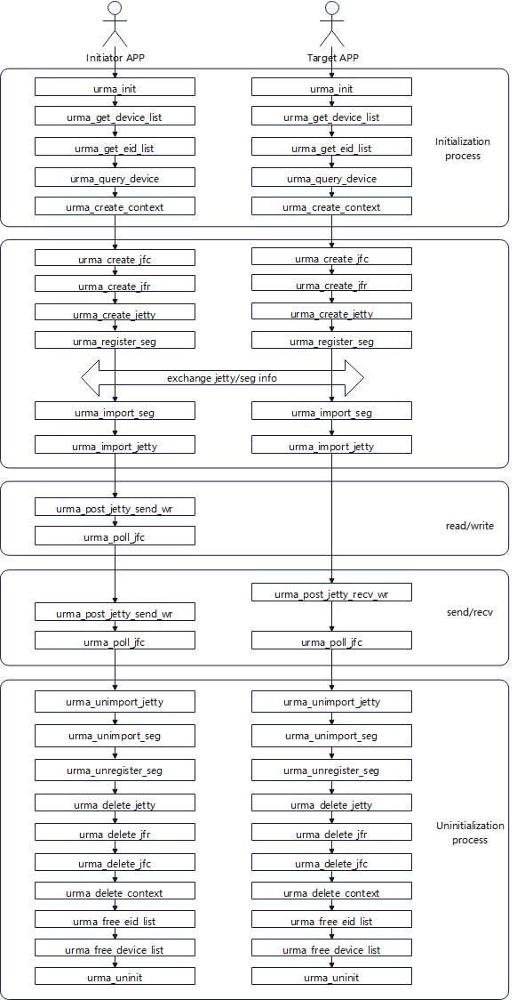
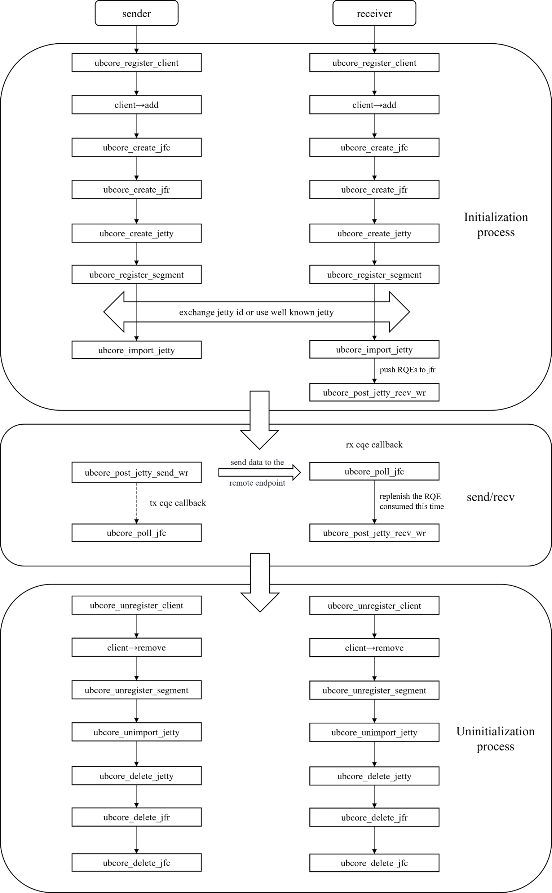
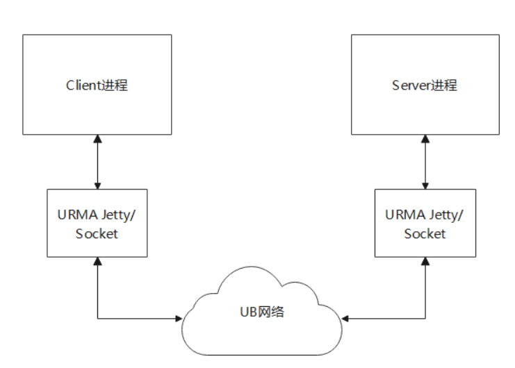
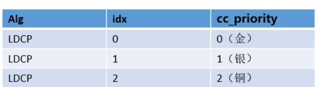

# Revision History

| Revision Date | Revised Chapters | Revision Description | Bug Ticket Link or Background | Revised By |
|---|---|---|---|---|
| 2026.2.12 | ALL | Document baseline | | @qianguoxin、@jerry_lilijun、@wuyuyan_98、@pinchen2025、@autoreconf、@heyu_1014、@wdmmsyf |

---

# Table of Contents

- [Revision History](#revision-history)

- [1 Usage Constraints and Limitations](#1-usage-constraints-and-limitations)
    - [1.1 Version Compatibility Constraints](#11-version-compatibility-constraints)
    - [1.2 Parameter Combination Constraints](#12-parameter-combination-constraints)
        - [1.2.1 trans_mode, tp_type, order_type Combination Interception Table](#121-trans_mode-tp_type-order_type-combination-interception-table)
        - [1.2.2 Validation Rule Description](#122-validation-rule-description)
        - [1.2.3 Other Constraints](#123-other-constraints)

- [2 URMA User-mode API](#2-urma-user-mode-api)
    - [2.1 Programming Examples](#21-programming-examples)
        - [2.1.1 Management Plane](#211-management-plane)
        - [2.1.2 Control Plane](#212-control-plane)
        - [2.1.3 Data Plane](#213-data-plane)
            - [2.1.3.1 One-sided read/write](#2131-one-sided-readwrite)
            - [2.1.3.2 Two-sided send/recv](#2132-two-sided-sendrecv)
        - [2.1.4 Open Source Examples](#214-open-source-examples)
    - [2.2 Management Plane](#22-management-plane)
        - [2.2.1 Initialization](#221-initialization)
            - [2.2.1.1 urma_init](#2211-urma_init)
                - [2.2.1.1.1 urma_init_attr_t](#22111-urma_init_attr_t)
                - [2.2.1.1.2 urma_status_t](#22112-urma_status_t)
            - [2.2.1.2 urma_uninit](#2212-urma_uninit)
        - [2.2.2 Device and Context](#222-device-and-context)
            - [2.2.2.1 device](#2221-device)
                - [2.2.2.1.1 urma_get_device_list](#22211-urma_get_device_list)
                - [2.2.2.1.2 urma_free_device_list](#22212-urma_free_device_list)
                - [2.2.2.1.3 urma_get_device_by_name](#22213-urma_get_device_by_name)
                - [2.2.2.1.4 urma_get_device_by_eid](#22214-urma_get_device_by_eid)
                - [2.2.2.1.5 urma_query_device](#22215-urma_query_device)
            - [2.2.2.2 eid](#2222-eid)
                - [2.2.2.2.1 urma_get_eid_list](#22221-urma_get_eid_list)
                - [2.2.2.2.2 urma_free_eid_list](#22222-urma_free_eid_list)
            - [2.2.2.3 uasid](#2223-uasid)
                - [2.2.2.3.1 urma_get_uasid](#22231-urma_get_uasid)
            - [2.2.2.4 context](#2224-context)
                - [2.2.2.4.1 urma_create_context](#22241-urma_create_context)
                - [2.2.2.4.2 urma_delete_context](#22242-urma_delete_context)
                - [2.2.2.4.3 urma_set_context_opt](#22243-urma_set_context_opt)
            - [2.2.2.5 net addr](#2225-net-addr)
                - [2.2.2.5.1 urma_get_net_addr_list](#22251-urma_get_net_addr_list)
                - [2.2.2.5.2 urma_free_net_addr_list](#22252-urma_free_net_addr_list)
        - [2.2.3 Security](#223-security)
            - [2.2.3.1 urma_alloc_token_id](#2231-urma_alloc_token_id)
                - [2.2.3.1.1 urma_token_id_t](#22311-urma_token_id_t)
                - [2.2.3.1.2 urma_token_id_flag_t](#22312-urma_token_id_flag_t)
            - [2.2.3.2 urma_alloc_token_id_ex](#2232-urma_alloc_token_id_ex)
            - [2.2.3.3 urma_free_token_id](#2233-urma_free_token_id)
    - [2.3 Control Plane](#23-control-plane)
        - [2.3.1 Jetty Related](#231-jetty-related)
            - [2.3.1.1 JFC](#2311-jfc)
                - [2.3.1.1.1 urma_create_jfc](#23111-urma_create_jfc)
                - [2.3.1.1.2 urma_modify_jfc](#23112-urma_modify_jfc)
                - [2.3.1.1.3 urma_delete_jfc](#23113-urma_delete_jfc)
                - [2.3.1.1.4 urma_delete_jfc_batch](#23114-urma_delete_jfc_batch)
            - [2.3.1.2 JFCE](#2312-jfce)
                - [2.3.1.2.1 urma_create_jfce](#23121-urma_create_jfce)
                - [2.3.1.2.2 urma_delete_jfce](#23122-urma_delete_jfce)
            - [2.3.1.3 JFAE](#2313-jfae)
                - [2.3.1.3.1 urma_get_async_event](#23131-urma_get_async_event)
                - [2.3.1.3.2 urma_ack_async_event](#23132-urma_ack_async_event)
            - [2.3.1.4 JFS](#2314-jfs)
                - [2.3.1.4.1 urma_create_jfs](#23141-urma_create_jfs)
                - [2.3.1.4.2 urma_modify_jfs](#23142-urma_modify_jfs)
                - [2.3.1.4.3 urma_query_jfs](#23143-urma_query_jfs)
                - [2.3.1.4.4 urma_delete_jfs](#23144-urma_delete_jfs)
                - [2.3.1.4.5 urma_delete_jfs_batch](#23145-urma_delete_jfs_batch)
                - [2.3.1.4.6 urma_flush_jfs](#23146-urma_flush_jfs)
            - [2.3.1.5 JFR](#2315-jfr)
                - [2.3.1.5.1 urma_create_jfr](#23151-urma_create_jfr)
                - [2.3.1.5.2 urma_modify_jfr](#23152-urma_modify_jfr)
                - [2.3.1.5.3 urma_query_jfr](#23153-urma_query_jfr)
                - [2.3.1.5.4 urma_delete_jfr](#23154-urma_delete_jfr)
                - [2.3.1.5.5 urma_delete_jfr_batch](#23155-urma_delete_jfr_batch)
                - [2.3.1.5.6 urma_import_jfr](#23156-urma_import_jfr)
                - [2.3.1.5.7 urma_import_jfr_ex](#23157-urma_import_jfr_ex)
                - [2.3.1.5.8 urma_unimport_jfr](#23158-urma_unimport_jfr)
                - [2.3.1.5.9 urma_advise_jfr](#23159-urma_advise_jfr)
                - [2.3.1.5.10 urma_advise_jfr_async](#231510-urma_advise_jfr_async)
                - [2.3.1.5.11 urma_unadvise_jfr](#231511-urma_unadvise_jfr)
            - [2.3.1.6 Jetty](#2316-jetty)
                - [2.3.1.6.1 urma_create_jetty](#23161-urma_create_jetty)
                - [2.3.1.6.2 urma_modify_jetty](#23162-urma_modify_jetty)
                - [2.3.1.6.3 urma_query_jetty](#23163-urma_query_jetty)
                - [2.3.1.6.4 urma_delete_jetty](#23164-urma_delete_jetty)
                - [2.3.1.6.5 urma_delete_jetty_batch](#23165-urma_delete_jetty_batch)
                - [2.3.1.6.6 urma_import_jetty](#23166-urma_import_jetty)
                - [2.3.1.6.7 urma_import_jetty_ex](#23167-urma_import_jetty_ex)
                - [2.3.1.6.8 urma_unimport_jetty](#23168-urma_unimport_jetty)
                - [2.3.1.6.9 urma_advise_jetty](#23169-urma_advise_jetty)
                - [2.3.1.6.10 urma_unadvise_jetty](#231610-urma_unadvise_jetty)
                - [2.3.1.6.11 urma_bind_jetty](#231611-urma_bind_jetty)
                - [2.3.1.6.12 urma_bind_jetty_ex](#231612-urma_bind_jetty_ex)
                - [2.3.1.6.13 urma_unbind_jetty](#231613-urma_unbind_jetty)
                - [2.3.1.6.14 urma_flush_jetty](#231614-urma_flush_jetty)
                - [2.3.1.6.15 urma_import_jetty_async](#231615-urma_import_jetty_async)
                - [2.3.1.6.16 urma_unimport_jetty_async](#231616-urma_unimport_jetty_async)
                - [2.3.1.6.17 urma_bind_jetty_async](#231617-urma_bind_jetty_async)
                - [2.3.1.6.18 urma_unbind_jetty_async](#231618-urma_unbind_jetty_async)
                - [2.3.1.6.19 urma_create_notifier](#231619-urma_create_notifier)
                - [2.3.1.6.20 urma_delete_notifier](#231620-urma_delete_notifier)
                - [2.3.1.6.21 urma_wait_notify](#231621-urma_wait_notify)
                - [2.3.1.6.22 urma_ack_notify](#231622-urma_ack_notify)
            - [2.3.1.7 Jetty Group](#2317-jetty-group)
                - [2.3.1.7.1 urma_create_jetty_grp](#23171-urma_create_jetty_grp)
                - [2.3.1.7.2 urma_delete_jetty_grp](#23172-urma_delete_jetty_grp)
        - [2.3.2 Segment](#232-segment)
            - [2.3.2.1 urma_register_seg](#2321-urma_register_seg)
                - [2.3.2.1.1 urma_seg_cfg_t](#23211-urma_seg_cfg_t)
                - [2.3.2.1.2 urma_reg_seg_flag_t](#23212-urma_reg_seg_flag_t)
                - [2.3.2.1.3 urma_target_seg_t](#23213-urma_target_seg_t)
                - [2.3.2.1.4 urma_seg_t](#23214-urma_seg_t)
                - [2.3.2.1.5 urma_ubva_t](#23215-urma_ubva_t)
                - [2.3.2.1.6 urma_seg_attr_t](#23216-urma_seg_attr_t)
                - [2.3.2.1.7 urma_token_t](#23217-urma_token_t)
            - [2.3.2.2 urma_unregister_seg](#2322-urma_unregister_seg)
            - [2.3.2.3 urma_import_seg](#2323-urma_import_seg)
                - [2.3.2.3.1 urma_import_seg_flag_t](#23231-urma_import_seg_flag_t)
            - [2.3.2.4 urma_unimport_seg](#2324-urma_unimport_seg)
        - [2.3.3 TP Channel](#233-tp-channel)
            - [2.3.3.1 urma_get_tpn](#2331-urma_get_tpn)
            - [2.3.3.2 urma_modify_tp](#2332-urma_modify_tp)
                - [2.3.3.2.1 urma_tp_cfg_t](#23321-urma_tp_cfg_t)
                - [2.3.3.2.2 urma_tp_cfg_flag_t](#23322-urma_tp_cfg_flag_t)
                - [2.3.3.2.3 urma_tp_attr_t](#23323-urma_tp_attr_t)
                - [2.3.3.2.4 urma_tp_mod_flag_t](#23324-urma_tp_mod_flag_t)
                - [2.3.3.2.5 urma_tp_state_t](#23325-urma_tp_state_t)
                - [2.3.3.2.6 urma_tp_attr_mask_t](#23326-urma_tp_attr_mask_t)
            - [2.3.3.3 urma_get_tp_list](#2333-urma_get_tp_list)
                - [2.3.3.3.1 urma_get_tp_cfg_t](#23331-urma_get_tp_cfg_t)
                - [2.3.3.3.2 urma_get_tp_cfg_flag_t](#23332-urma_get_tp_cfg_flag_t)
                - [2.3.3.3.3 urma_tp_info_t](#23333-urma_tp_info_t)
            - [2.3.3.4 urma_get_tp_attr](#2334-urma_get_tp_attr)
                - [2.3.3.4.1 urma_tp_attr_value_t](#23341-urma_tp_attr_value_t)
            - [2.3.3.5 urma_set_tp_attr](#2335-urma_set_tp_attr)
    - [2.4 Data Plane](#24-data-plane)
        - [2.4.1 post](#241-post)
            - [2.4.1.1 urma_post_jfs_wr](#2411-urma_post_jfs_wr)
                - [2.4.1.1.1 urma_jfs_wr_t](#24111-urma_jfs_wr_t)
                - [2.4.1.1.2 urma_rw_wr_t](#24112-urma_rw_wr_t)
                - [2.4.1.1.3 urma_send_wr_t](#24113-urma_send_wr_t)
                - [2.4.1.1.4 urma_cas_wr_t](#24114-urma_cas_wr_t)
                - [2.4.1.1.5 urma_faa_wr_t](#24115-urma_faa_wr_t)
                - [2.4.1.1.6 urma_opcode_t](#24116-urma_opcode_t)
                - [2.4.1.1.7 urma_jfs_wr_flag_t](#24117-urma_jfs_wr_flag_t)
                - [2.4.1.1.8 urma_place_order_t](#24118-urma_place_order_t)
                - [2.4.1.1.9 urma_sge_t](#24119-urma_sge_t)
                - [2.4.1.1.10 urma_sg_t](#241110-urma_sg_t)
            - [2.4.1.2 urma_post_jfr_wr](#2412-urma_post_jfr_wr)
                - [2.4.1.2.1 urma_jfr_wr_t](#24121-urma_jfr_wr_t)
            - [2.4.1.3 urma_post_jetty_send_wr](#2413-urma_post_jetty_send_wr)
            - [2.4.1.4 urma_post_jetty_recv_wr](#2414-urma_post_jetty_recv_wr)
        - [2.4.2 poll Related](#242-poll-related)
            - [2.4.2.1 urma_poll_jfc](#2421-urma_poll_jfc)
                - [2.4.2.1.1 urma_cr_t](#24211-urma_cr_t)
                - [2.4.2.1.2 urma_cr_status_t](#24212-urma_cr_status_t)
                - [2.4.2.1.3 urma_cr_opcode_t](#24213-urma_cr_opcode_t)
                - [2.4.2.1.4 urma_cr_flag_t](#24214-urma_cr_flag_t)
                - [2.4.2.1.5 urma_cr_token_t](#24215-urma_cr_token_t)
            - [2.4.2.2 urma_rearm_jfc](#2422-urma_rearm_jfc)
            - [2.4.2.3 urma_wait_jfc](#2423-urma_wait_jfc)
            - [2.4.2.4 urma_ack_jfc](#2424-urma_ack_jfc)
        - [2.4.3 read/write](#243-readwrite)
            - [2.4.3.1 urma_write](#2431-urma_write)
            - [2.4.3.2 urma_read](#2432-urma_read)
        - [2.4.4 send/recv](#244-sendrecv)
            - [2.4.4.1 urma_send](#2441-urma_send)
            - [2.4.4.2 urma_recv](#2442-urma_recv)
    - [2.5 Other](#25-other)
        - [2.5.1 Extensions](#251-extensions)
            - [2.5.1.1 urma_user_ctl](#2511-urma_user_ctl)
                - [2.5.1.1.1 urma_user_ctl_in_t](#25111-urma_user_ctl_in_t)
                - [2.5.1.1.2 urma_user_ctl_out_t](#25112-urma_user_ctl_out_t)
        - [2.5.2 Logging](#252-logging)
            - [2.5.2.1 urma_register_log_func](#2521-urma_register_log_func)
                - [2.5.2.1.1 urma_log_cb_t](#25211-urma_log_cb_t)
            - [2.5.2.2 urma_register_loc_log_func](#2522-urma_register_loc_log_func)
                - [2.5.2.2.1 urma_loc_log_cb](#25221-urma_loc_log_cb)
            - [2.5.2.3 urma_unregister_log_func](#2523-urma_unregister_log_func)
            - [2.5.2.4 urma_log_get_level](#2524-urma_log_get_level)
                - [2.5.2.4.1 urma_vlog_level_t](#25241-urma_vlog_level_t)
            - [2.5.2.5 urma_log_set_level](#2525-urma_log_set_level)
            - [2.5.2.6 urma_log_get_thread_tag](#2526-urma_log_get_thread_tag)
            - [2.5.2.7 urma_log_set_thread_tag](#2527-urma_log_set_thread_tag)
        - [2.5.3 Macro Definitions](#253-macro-definitions)

- [3 URMA Kernel-mode API](#3-urma-kernel-mode-api)
    - [3.1 Programming Examples](#31-programming-examples)
        - [3.1.1 Management Plane](#311-management-plane)
        - [3.1.2 Control Plane](#312-control-plane)
        - [3.1.3 Data Plane](#313-data-plane)
            - [3.1.3.1 Two-sided send/recv](#3131-two-sided-sendrecv)
    - [3.2 Device and Context Management](#32-device-and-context-management)
        - [3.2.1 ubcore_register_device](#321-ubcore_register_device)
            - [3.2.1.1 ubcore_device](#3211-ubcore_device)
            - [3.2.1.2 ubcore_ops](#3212-ubcore_ops)
            - [3.2.1.3 ubcore_device_cfg](#3213-ubcore_device_cfg)
            - [3.2.1.4 ubcore_device_cfg_mask](#3214-ubcore_device_cfg_mask)
            - [3.2.1.5 ubcore_rc_cfg](#3215-ubcore_rc_cfg)
            - [3.2.1.6 ubcore_hash_table](#3216-ubcore_hash_table)
            - [3.2.1.7 ubcore_ht_param](#3217-ubcore_ht_param)
            - [3.2.1.8 ubcore_eid_table](#3218-ubcore_eid_table)
            - [3.2.1.9 ubcore_eid_entry](#3219-ubcore_eid_entry)
            - [3.2.1.10 ubcore_cg_device](#32110-ubcore_cg_device)
            - [3.2.1.11 ubcore_sip_table](#32111-ubcore_sip_table)
            - [3.2.1.12 ubcore_sip_entry](#32112-ubcore_sip_entry)
            - [3.2.1.13 ubcore_logic_device](#32113-ubcore_logic_device)
            - [3.2.1.14 ubcore_port_kobj](#32114-ubcore_port_kobj)
            - [3.2.1.15 ubcore_vtp_bitmap](#32115-ubcore_vtp_bitmap)
        - [3.2.2 ubcore_unregister_device](#322-ubcore_unregister_device)
        - [3.2.3 ubcore_stop_requests](#323-ubcore_stop_requests)
        - [3.2.4 ubcore_alloc_ucontext](#324-ubcore_alloc_ucontext)
            - [3.2.4.1 ubcore_ucontext](#3241-ubcore_ucontext)
            - [3.2.4.2 ubcore_udrv_priv](#3242-ubcore_udrv_priv)
        - [3.2.5 ubcore_free_ucontext](#325-ubcore_free_ucontext)
        - [3.2.6 ubcore_register_client](#326-ubcore_register_client)
            - [3.2.6.1 ubcore_client](#3261-ubcore_client)
        - [3.2.7 ubcore_unregister_client](#327-ubcore_unregister_client)
        - [3.2.8 ubcore_set_client_ctx_data](#328-ubcore_set_client_ctx_data)
        - [3.2.9 ubcore_get_client_ctx_data](#329-ubcore_get_client_ctx_data)
        - [3.2.10 ubcore_get_eid_list](#3210-ubcore_get_eid_list)
            - [3.2.10.1 ubcore_eid_info](#32101-ubcore_eid_info)
            - [3.2.10.2 ubcore_eid](#32102-ubcore_eid)
        - [3.2.11 ubcore_free_eid_list](#3211-ubcore_free_eid_list)
        - [3.2.12 ubcore_query_device_attr](#3212-ubcore_query_device_attr)
            - [3.2.12.1 ubcore_device_attr](#32121-ubcore_device_attr)
            - [3.2.12.2 ubcore_pattern](#32122-ubcore_pattern)
            - [3.2.12.3 ubcore_guid](#32123-ubcore_guid)
            - [3.2.12.4 ubcore_device_cap](#32124-ubcore_device_cap)
            - [3.2.12.5 ubcore_device_feat](#32125-ubcore_device_feat)
            - [3.2.12.6 ubcore_atomic_feat](#32126-ubcore_atomic_feat)
            - [3.2.12.7 ubcore_slice](#32127-ubcore_slice)
            - [3.2.12.8 ubcore_congestion_ctrl_alg](#32128-ubcore_congestion_ctrl_alg)
            - [3.2.12.9 ubcore_port_attr](#32129-ubcore_port_attr)
        - [3.2.13 ubcore_query_device_status](#3213-ubcore_query_device_status)
            - [3.2.13.1 ubcore_device_status](#32131-ubcore_device_status)
            - [3.2.13.2 ubcore_port_status](#32132-ubcore_port_status)
            - [3.2.13.3 ubcore_port_state](#32133-ubcore_port_state)
            - [3.2.13.4 ubcore_speed](#32134-ubcore_speed)
            - [3.2.13.5 ubcore_link_width](#32135-ubcore_link_width)
        - [3.2.14 ubcore_cgroup_reg_dev](#3214-ubcore_cgroup_reg_dev)
        - [3.2.15 ubcore_cgroup_unreg_dev](#3215-ubcore_cgroup_unreg_dev)
        - [3.2.16 ubcore_cgroup_try_charge](#3216-ubcore_cgroup_try_charge)
            - [3.2.16.1 struct ubcore_cg_object](#32161-struct-ubcore_cg_object)
            - [3.2.16.2 enum ubcore_resource_type](#32162-enum-ubcore_resource_type)
        - [3.2.17 ubcore_cgroup_uncharge](#3217-ubcore_cgroup_uncharge)
        - [3.2.18 ubcore_get_mtu](#3218-ubcore_get_mtu)
            - [3.2.18.1 ubcore_mtu](#32181-ubcore_mtu)
        - [3.2.19 ubcore_recv_req](#3219-ubcore_recv_req)
            - [3.2.19.1 ubcore_req_host](#32191-ubcore_req_host)
            - [3.2.19.2 ubcore_req](#32192-ubcore_req)
            - [3.2.19.3 ubcore_msg_opcode](#32193-ubcore_msg_opcode)
        - [3.2.20 ubcore_recv_resp](#3220-ubcore_recv_resp)
            - [3.2.20.1 ubcore_resp](#32201-ubcore_resp)
        - [3.2.21 ubcore_get_device_by_eid](#3221-ubcore_get_device_by_eid)
            - [3.2.21.1 ubcore_transport_type](#32211-ubcore_transport_type)
    - [3.3 Segment Management](#33-segment-management)
        - [3.3.1 ubcore_alloc_token_id](#331-ubcore_alloc_token_id)
            - [3.3.1.1 ubcore_token_id_flag](#3311-ubcore_token_id_flag)
            - [3.3.1.2 ubcore_udata](#3312-ubcore_udata)
            - [3.3.1.3 ubcore_token_id](#3313-ubcore_token_id)
        - [3.3.2 ubcore_free_token_id](#332-ubcore_free_token_id)
        - [3.3.3 ubcore_register_seg](#333-ubcore_register_seg)
            - [3.3.3.1 ubcore_seg_cfg](#3331-ubcore_seg_cfg)
            - [3.3.3.2 ubcore_token](#3332-ubcore_token)
            - [3.3.3.3 ubcore_reg_seg_flag](#3333-ubcore_reg_seg_flag)
            - [3.3.3.4 ubcore_target_seg](#3334-ubcore_target_seg)
            - [3.3.3.5 ubcore_seg](#3335-ubcore_seg)
            - [3.3.3.6 ubcore_ubva](#3336-ubcore_ubva)
            - [3.3.3.7 ubcore_seg_attr](#3337-ubcore_seg_attr)
        - [3.3.4 ubcore_unregister_seg](#334-ubcore_unregister_seg)
        - [3.3.5 ubcore_import_seg](#335-ubcore_import_seg)
            - [3.3.5.1 ubcore_target_seg_cfg](#3351-ubcore_target_seg_cfg)
            - [3.3.5.2 ubcore_import_seg_flag](#3352-ubcore_import_seg_flag)
        - [3.3.6 ubcore_unimport_seg](#336-ubcore_unimport_seg)
    - [3.4 Jetty Management](#34-jetty-management)
        - [3.4.1 JFC Management](#341-jfc-management)
            - [3.4.1.1 ubcore_create_jfc](#3411-ubcore_create_jfc)
                - [3.4.1.1.1 ubcore_jfc_cfg](#34111-ubcore_jfc_cfg)
                - [3.4.1.1.2 ubcore_jfc_flag](#34112-ubcore_jfc_flag)
                - [3.4.1.1.3 ubcore_comp_callback_t](#34113-ubcore_comp_callback_t)
                - [3.4.1.1.4 ubcore_event_callback_t](#34114-ubcore_event_callback_t)
                - [3.4.1.1.5 ubcore_jfc](#34115-ubcore_jfc)
            - [3.4.1.2 ubcore_modify_jfc](#3412-ubcore_modify_jfc)
                - [3.4.1.2.1 ubcore_jfc_attr](#34121-ubcore_jfc_attr)
                - [3.4.1.2.2 ubcore_jfc_attr_mask](#34122-ubcore_jfc_attr_mask)
            - [3.4.1.3 ubcore_delete_jfc](#3413-ubcore_delete_jfc)
            - [3.4.1.4 ubcore_delete_jfc_batch](#3414-ubcore_delete_jfc_batch)
        - [3.4.2 JFS Management](#342-jfs-management)
            - [3.4.2.1 ubcore_create_jfs](#3421-ubcore_create_jfs)
                - [3.4.2.1.1 ubcore_jfs_cfg](#34211-ubcore_jfs_cfg)
                - [3.4.2.1.2 ubcore_jfs_flag](#34212-ubcore_jfs_flag)
                - [3.4.2.1.3 ubcore_transport_mode](#34213-ubcore_transport_mode)
                - [3.4.2.1.4 ubcore_jfs](#34214-ubcore_jfs)
                - [3.4.2.1.5 ubcore_jetty_id](#34215-ubcore_jetty_id)
            - [3.4.2.2 ubcore_modify_jfs](#3422-ubcore_modify_jfs)
                - [3.4.2.2.1 ubcore_jfs_attr](#34221-ubcore_jfs_attr)
                - [3.4.2.2.2 ubcore_jfs_attr_mask](#34222-ubcore_jfs_attr_mask)
                - [3.4.2.2.3 ubcore_jetty_state](#34223-ubcore_jetty_state)
            - [3.4.2.3 ubcore_query_jfs](#3423-ubcore_query_jfs)
            - [3.4.2.4 ubcore_delete_jfs](#3424-ubcore_delete_jfs)
            - [3.4.2.5 ubcore_delete_jfs_batch](#3425-ubcore_delete_jfs_batch)
            - [3.4.2.6 ubcore_flush_jfs](#3426-ubcore_flush_jfs)
                - [3.4.2.6.1 ubcore_cr](#34261-ubcore_cr)
                - [3.4.2.6.2 ubcore_cr_status](#34262-ubcore_cr_status)
                - [3.4.2.6.3 ubcore_cr_opcode](#34263-ubcore_cr_opcode)
                - [3.4.2.6.4 ubcore_cr_flag](#34264-ubcore_cr_flag)
                - [3.4.2.6.5 ubcore_cr_token](#34265-ubcore_cr_token)
        - [3.4.3 JFR Management](#343-jfr-management)
            - [3.4.3.1 ubcore_create_jfr](#3431-ubcore_create_jfr)
                - [3.4.3.1.1 ubcore_jfr_cfg](#34311-ubcore_jfr_cfg)
                - [3.4.3.1.2 ubcore_jfr_flag](#34312-ubcore_jfr_flag)
                - [3.4.3.1.3 ubcore_jfr](#34313-ubcore_jfr)
            - [3.4.3.2 ubcore_modify_jfr](#3432-ubcore_modify_jfr)
                - [3.4.3.2.1 ubcore_jfr_attr](#34321-ubcore_jfr_attr)
                - [3.4.3.2.2 ubcore_jfr_attr_mask](#34322-ubcore_jfr_attr_mask)
                - [3.4.3.2.3 ubcore_jfr_state](#34323-ubcore_jfr_state)
            - [3.4.3.3 ubcore_query_jfr](#3433-ubcore_query_jfr)
            - [3.4.3.4 ubcore_delete_jfr](#3434-ubcore_delete_jfr)
            - [3.4.3.5 ubcore_delete_jfr_batch](#3435-ubcore_delete_jfr_batch)
            - [3.4.3.6 ubcore_import_jfr](#3436-ubcore_import_jfr)
                - [3.4.3.6.1 ubcore_tjetty_cfg](#34361-ubcore_tjetty_cfg)
                - [3.4.3.6.2 ubcore_import_jetty_flag](#34362-ubcore_import_jetty_flag)
                - [3.4.3.6.3 ubcore_target_type](#34363-ubcore_target_type)
                - [3.4.3.6.4 ubcore_jetty_grp_policy](#34364-ubcore_jetty_grp_policy)
                - [3.4.3.6.5 ubcore_tjetty](#34365-ubcore_tjetty)
                - [3.4.3.6.6 ubcore_tp](#34366-ubcore_tp)
                - [3.4.3.6.7 ubcore_vtpn](#34367-ubcore_vtpn)
                - [3.4.3.6.8 ubcore_vtp_state](#34368-ubcore_vtp_state)
            - [3.4.3.7 ubcore_import_jfr_ex](#3437-ubcore_import_jfr_ex)
                - [3.4.3.7.1 ubcore_active_tp_cfg](#34371-ubcore_active_tp_cfg)
                - [3.4.3.7.2 ubcore_active_tp_attr](#34372-ubcore_active_tp_attr)
            - [3.4.3.8 ubcore_unimport_jfr](#3438-ubcore_unimport_jfr)
        - [3.4.4 Jetty Management](#344-jetty-management)
            - [3.4.4.1 ubcore_create_jetty](#3441-ubcore_create_jetty)
                - [3.4.4.1.1 ubcore_jetty_cfg](#34411-ubcore_jetty_cfg)
                - [3.4.4.1.2 ubcore_jetty_flag](#34412-ubcore_jetty_flag)
                - [3.4.4.1.3 ubcore_jetty](#34413-ubcore_jetty)
            - [3.4.4.2 ubcore_modify_jetty](#3442-ubcore_modify_jetty)
                - [3.4.4.2.1 ubcore_jetty_attr](#34421-ubcore_jetty_attr)
                - [3.4.4.2.2 ubcore_jetty_attr_mask](#34422-ubcore_jetty_attr_mask)
            - [3.4.4.3 ubcore_query_jetty](#3443-ubcore_query_jetty)
            - [3.4.4.4 ubcore_delete_jetty](#3444-ubcore_delete_jetty)
            - [3.4.4.5 ubcore_delete_jetty_batch](#3445-ubcore_delete_jetty_batch)
            - [3.4.4.6 ubcore_flush_jetty](#3446-ubcore_flush_jetty)
            - [3.4.4.7 ubcore_import_jetty](#3447-ubcore_import_jetty)
            - [3.4.4.8 ubcore_import_jetty_ex](#3448-ubcore_import_jetty_ex)
            - [3.4.4.9 ubcore_unimport_jetty](#3449-ubcore_unimport_jetty)
            - [3.4.4.10 ubcore_bind_jetty](#34410-ubcore_bind_jetty)
            - [3.4.4.11 ubcore_bind_jetty_ex](#34411-ubcore_bind_jetty_ex)
            - [3.4.4.12 ubcore_unbind_jetty](#34412-ubcore_unbind_jetty)
            - [3.4.4.13 ubcore_import_jetty_async](#34413-ubcore_import_jetty_async)
                - [3.4.4.13.1 ubcore_import_cb](#344131-ubcore_import_cb)
            - [3.4.4.14 ubcore_unimport_jetty_async](#34414-ubcore_unimport_jetty_async)
                - [3.4.4.14.1 ubcore_unimport_cb](#344141-ubcore_unimport_cb)
            - [3.4.4.15 ubcore_bind_jetty_async](#34415-ubcore_bind_jetty_async)
                - [3.4.4.15.1 ubcore_bind_cb](#344151-ubcore_bind_cb)
            - [3.4.4.16 ubcore_unbind_jetty_async](#34416-ubcore_unbind_jetty_async)
                - [3.4.4.16.1 ubcore_unbind_cb](#344161-ubcore_unbind_cb)
        - [3.4.5 Jetty Group Management](#345-jetty-group-management)
            - [3.4.5.1 ubcore_create_jetty_grp](#3451-ubcore_create_jetty_grp)
                - [3.4.5.1.1 ubcore_jetty_grp_flag](#34511-ubcore_jetty_grp_flag)
                - [3.4.5.1.2 ubcore_jetty_grp_cfg](#34512-ubcore_jetty_grp_cfg)
                - [3.4.5.1.3 ubcore_jetty_group](#34513-ubcore_jetty_group)
            - [3.4.5.2 ubcore_delete_jetty_grp](#3452-ubcore_delete_jetty_grp)
    - [3.5 Asynchronous Events](#35-asynchronous-events)
        - [3.5.1 ubcore_register_event_handler](#351-ubcore_register_event_handler)
            - [3.5.1.1 ubcore_event_handler](#3511-ubcore_event_handler)
            - [3.5.1.2 ubcore_event](#3512-ubcore_event)
            - [3.5.1.3 ubcore_event_type](#3513-ubcore_event_type)
        - [3.5.2 ubcore_unregister_event_handler](#352-ubcore_unregister_event_handler)
    - [3.6 Post WR Operations](#36-post-wr-operations)
        - [3.6.1 ubcore_post_jfs_wr](#361-ubcore_post_jfs_wr)
            - [3.6.1.1 ubcore_jfs_wr](#3611-ubcore_jfs_wr)
            - [3.6.1.2 ubcore_opcode](#3612-ubcore_opcode)
            - [3.6.1.3 ubcore_jfs_wr_flag](#3613-ubcore_jfs_wr_flag)
            - [3.6.1.4 ubcore_rw_wr](#3614-ubcore_rw_wr)
            - [3.6.1.5 ubcore_sg](#3615-ubcore_sg)
            - [3.6.1.6 ubcore_sge](#3616-ubcore_sge)
            - [3.6.1.7 ubcore_send_wr](#3617-ubcore_send_wr)
            - [3.6.1.8 ubcore_cas_wr](#3618-ubcore_cas_wr)
            - [3.6.1.9 ubcore_faa_wr](#3619-ubcore_faa_wr)
        - [3.6.2 ubcore_post_jfr_wr](#362-ubcore_post_jfr_wr)
            - [3.6.2.1 ubcore_jfr_wr](#3621-ubcore_jfr_wr)
        - [3.6.3 ubcore_post_jetty_send_wr](#363-ubcore_post_jetty_send_wr)
        - [3.6.4 ubcore_post_jetty_recv_wr](#364-ubcore_post_jetty_recv_wr)
    - [3.7 Completion Records](#37-completion-records)
        - [3.7.1 ubcore_poll_jfc](#371-ubcore_poll_jfc)
        - [3.7.2 ubcore_rearm_jfc](#372-ubcore_rearm_jfc)
    - [3.8 ubcore UVS Interface](#38-ubcore-uvs-interface)
        - [3.8.1 ubcore_set_port_netdev](#381-ubcore_set_port_netdev)
        - [3.8.2 ubcore_unset_port_netdev](#382-ubcore_unset_port_netdev)
        - [3.8.3 ubcore_put_port_netdev](#383-ubcore_put_port_netdev)
        - [3.8.4 ubcore_add_ueid](#384-ubcore_add_ueid)
            - [3.8.4.1 ubcore_ueid_cfg](#3841-ubcore_ueid_cfg)
        - [3.8.5 ubcore_delete_ueid](#385-ubcore_delete_ueid)
        - [3.8.6 ubcore_config_device](#386-ubcore_config_device)
        - [3.8.7 ubcore_add_sip](#387-ubcore_add_sip)
            - [3.8.7.1 ubcore_sip_info](#3871-ubcore_sip_info)
            - [3.8.7.2 ubcore_net_addr](#3872-ubcore_net_addr)
            - [3.8.7.3 ubcore_net_addr_type](#3873-ubcore_net_addr_type)
            - [3.8.7.4 ubcore_net_addr_union](#3874-ubcore_net_addr_union)
        - [3.8.8 ubcore_delete_sip](#388-ubcore_delete_sip)
    - [3.9 DFX Interface](#39-dfx-interface)
        - [3.9.1 ubcore_query_stats](#391-ubcore_query_stats)
            - [3.9.1.1 ubcore_stats_key](#3911-ubcore_stats_key)
            - [3.9.1.2 ubcore_stats_val](#3912-ubcore_stats_val)
        - [3.9.2 ubcore_query_resource](#392-ubcore_query_resource)
            - [3.9.2.1 ubcore_res_key](#3921-ubcore_res_key)
            - [3.9.2.2 ubcore_res_val](#3922-ubcore_res_val)
    - [3.10 Driver Custom Interface](#310-driver-custom-interface)
        - [3.10.1 ubcore_user_control](#3101-ubcore_user_control)
            - [3.10.1.1 ubcore_user_ctl](#31011-ubcore_user_ctl)
            - [3.10.1.2 ubcore_user_ctl_in](#31012-ubcore_user_ctl_in)
            - [3.10.1.3 ubcore_user_ctl_out](#31013-ubcore_user_ctl_out)
    - [3.11 Asynchronous Event Dispatch Interface](#311-asynchronous-event-dispatch-interface)
        - [3.11.1 ubcore_dispatch_async_event](#3111-ubcore_dispatch_async_event)
    - [3.12 Memory Mapping Interface](#312-memory-mapping-interface)
        - [3.12.1 ubcore_umem_get](#3121-ubcore_umem_get)
            - [3.12.1.1 ubcore_umem](#31211-ubcore_umem)
            - [3.12.1.2 ubcore_umem_flag](#31212-ubcore_umem_flag)
        - [3.12.2 ubcore_umem_release](#3122-ubcore_umem_release)
        - [3.12.3 ubcore_umem_find_best_page_size](#3123-ubcore_umem_find_best_page_size)
    - [3.13 Other APIs](#313-other-apis)
        - [3.13.1 ubcore_dispatch_mgmt_event](#3131-ubcore_dispatch_mgmt_event)
            - [3.13.1.1 ubcore_mgmt_event](#31311-ubcore_mgmt_event)
            - [3.13.1.2 ubcore_mgmt_event_type](#31312-ubcore_mgmt_event_type)
        - [3.13.2 ubcore_get_tp_list](#3132-ubcore_get_tp_list)
            - [3.13.2.1 ubcore_get_tp_cfg](#31321-ubcore_get_tp_cfg)
            - [3.13.2.2 ubcore_get_tp_cfg_flag](#31322-ubcore_get_tp_cfg_flag)
            - [3.13.2.3 ubcore_tp_info](#31323-ubcore_tp_info)
            - [3.13.2.4 ubcore_tp_handle](#31324-ubcore_tp_handle)
        - [3.13.3 ubcore_set_tp_attr](#3133-ubcore_set_tp_attr)
            - [3.13.3.1 ubcore_tp_attr_value](#31331-ubcore_tp_attr_value)
        - [3.13.4 ubcore_get_tp_attr](#3134-ubcore_get_tp_attr)
        - [3.13.5 ubcore_exchange_tp_info](#3135-ubcore_exchange_tp_info)

- [4 URMA User-mode Driver Interface](#4-urma-user-mode-driver-interface)

- [5 URMA Kernel-mode Driver Interface](#5-urma-kernel-mode-driver-interface)
    - [5.1 Kernel-mode UB Device Management Interface](#51-kernel-mode-ub-device-management-interface)
        - [5.1.1 UB Device Registration Interface](#511-ub-device-registration-interface)
            - [5.1.1.1 ubcore_device](#5111-ubcore_device)
            - [5.1.1.2 ubcore_eid_entry](#5112-ubcore_eid_entry)
            - [5.1.1.3 ubcore_eid_table](#5113-ubcore_eid_table)
            - [5.1.1.4 ubcore_sip_info](#5114-ubcore_sip_info)
            - [5.1.1.5 ubcore_sip_entry](#5115-ubcore_sip_entry)
            - [5.1.1.6 ubcore_sip_table](#5116-ubcore_sip_table)
            - [5.1.1.7 ubcore_port_kobj](#5117-ubcore_port_kobj)
            - [5.1.1.8 ubcore_eid_attr](#5118-ubcore_eid_attr)
            - [5.1.1.9 ubcore_logic_device](#5119-ubcore_logic_device)
            - [5.1.1.10 ubcore_vtp_bitmap](#51110-ubcore_vtp_bitmap)
            - [5.1.1.11 ubcore_ops](#51111-ubcore_ops)
            - [5.1.1.12 ubcore_transport_type](#51112-ubcore_transport_type)
        - [5.1.2 UB Device Unregistration Interface](#512-ub-device-unregistration-interface)
        - [5.1.3 Memory Mapping Interface](#513-memory-mapping-interface)
            - [5.1.3.1 ubcore_umem](#5131-ubcore_umem)
            - [5.1.3.2 ubcore_umem_flag](#5132-ubcore_umem_flag)
        - [5.1.4 Memory Unmapping Interface](#514-memory-unmapping-interface)
        - [5.1.5 Find Best Page Size Interface](#515-find-best-page-size-interface)
        - [5.1.6 Get MTU Interface](#516-get-mtu-interface)
        - [5.1.7 Get UE Interface](#517-get-ue-interface)
            - [5.1.7.1 Query ue_idx Interface](#5171-query-ue_idx-interface)
            - [5.1.7.2 Query UE State Interface](#5172-query-ue-state-interface)
        - [5.1.8 Send and Receive Message Interface](#518-send-and-receive-message-interface)
            - [5.1.8.1 Send Request Ops Interface](#5181-send-request-ops-interface)
                - [5.1.8.1.1 ubcore_req](#51811-ubcore_req)
                - [5.1.8.1.2 ubcore_msg_opcode](#51812-ubcore_msg_opcode)
            - [5.1.8.2 Send Response Ops Interface](#5182-send-response-ops-interface)
                - [5.1.8.2.1 ubcore_resp_host](#51821-ubcore_resp_host)
                - [5.1.8.2.2 ubcore_resp](#51822-ubcore_resp)
            - [5.1.8.3 Receive Request Interface](#5183-receive-request-interface)
                - [5.1.8.3.1 ubcore_req_host](#51831-ubcore_req_host)
            - [5.1.8.4 Receive Response Interface](#5184-receive-response-interface)
            - [5.1.8.5 Live Migration Request and Response](#5185-live-migration-request-and-response)
                - [5.1.8.5.1 ubcore_function_mig_req](#51851-ubcore_function_mig_req)
                - [5.1.8.5.2 ubcore_mig_resp_status](#51852-ubcore_mig_resp_status)
                - [5.1.8.5.3 ubcore_function_mig_resp](#51853-ubcore_function_mig_resp)
        - [5.1.9 Query Device Attributes Ops Interface](#519-query-device-attributes-ops-interface)
        - [5.1.10 Query Device Status Ops Interface](#5110-query-device-status-ops-interface)
        - [5.1.11 Configure Device Attributes Ops Interface](#5111-configure-device-attributes-ops-interface)
            - [5.1.11.1 ubcore_device_cfg](#51111-ubcore_device_cfg)
            - [5.1.11.2 ubcore_device_cfg_mask](#51112-ubcore_device_cfg_mask)
            - [5.1.11.3 ubcore_rc_cfg](#51113-ubcore_rc_cfg)
            - [5.1.11.4 ubcore_pattern](#51114-ubcore_pattern)
        - [5.1.12 Device Bind Ops Interface](#5112-device-bind-ops-interface)
        - [5.1.13 Device Unbind Ops Interface](#5113-device-unbind-ops-interface)
        - [5.1.14 Device Add Port Ops Interface](#5114-device-add-port-ops-interface)
        - [5.1.15 Configure Port and netdev Mapping](#5115-configure-port-and-netdev-mapping)
        - [5.1.16 Unset Port and netdev Mapping](#5116-unset-port-and-netdev-mapping)
    - [5.2 Kernel-mode ID Configuration and Address Configuration Ops Interface](#52-kernel-mode-id-configuration-and-address-configuration-ops-interface)
        - [5.2.1 Configure Network Address Ops Interface](#521-configure-network-address-ops-interface)
            - [5.2.1.1 ubcore_net_addr](#5211-ubcore_net_addr)
            - [5.2.1.2 ubcore_net_addr_type](#5212-ubcore_net_addr_type)
        - [5.2.2 Delete Network Address Ops Interface](#522-delete-network-address-ops-interface)
        - [5.2.3 Configure UEID Ops Interface](#523-configure-ueid-ops-interface)
            - [5.2.3.1 ubcore_ueid_cfg](#5231-ubcore_ueid_cfg)
        - [5.2.4 Delete UEID Ops Interface](#524-delete-ueid-ops-interface)
        - [5.2.5 Configure Function Live Migration State Ops Interface](#525-configure-function-live-migration-state-ops-interface)
            - [5.2.5.1 ubcore_mig_state](#5251-ubcore_mig_state)
    - [5.3 Kernel-mode Context Management Ops Interface](#53-kernel-mode-context-management-ops-interface)
        - [5.3.1 Context Create Ops Interface](#531-context-create-ops-interface)
            - [5.3.1.1 ubcore_ucontext](#5311-ubcore_ucontext)
            - [5.3.1.2 ubcore_udrv_priv](#5312-ubcore_udrv_priv)
            - [5.3.1.3 ubcore_udata](#5313-ubcore_udata)
        - [5.3.2 Context Destroy Ops Interface](#532-context-destroy-ops-interface)
    - [5.4 Kernel-mode mmap Interface](#54-kernel-mode-mmap-interface)
        - [5.4.1 mmap Ops Interface](#541-mmap-ops-interface)
    - [5.5 Kernel-mode Resource Management Ops Interface](#55-kernel-mode-resource-management-ops-interface)
        - [5.5.1 TP Negotiation and Configuration Management](#551-tp-negotiation-and-configuration-management)
            - [5.5.1.1 TPG Create Ops Interface](#5511-tpg-create-ops-interface)
                - [5.5.1.1.1 ubcore_tpg_cfg](#55111-ubcore_tpg_cfg)
                - [5.5.1.1.2 ubcore_tpg_ext](#55112-ubcore_tpg_ext)
                - [5.5.1.1.3 ubcore_tpg](#55113-ubcore_tpg)
            - [5.5.1.2 TPG Destroy Ops Interface](#5512-tpg-destroy-ops-interface)
            - [5.5.1.3 TP Create and Usage Flow](#5513-tp-create-and-usage-flow)
            - [5.5.1.4 TP Parameter Negotiation](#5514-tp-parameter-negotiation)
            - [5.5.1.5 TP Create Ops Interface](#5515-tp-create-ops-interface)
                - [5.5.1.5.1 ubcore_tp_cfg](#55151-ubcore_tp_cfg)
                - [5.5.1.5.2 ubcore_tp_cfg_flag](#55152-ubcore_tp_cfg_flag)
                - [5.5.1.5.3 ubcore_transport_mode](#55153-ubcore_transport_mode)
                - [5.5.1.5.4 ubcore_tp_state](#55154-ubcore_tp_state)
                - [5.5.1.5.5 ubcore_tp_ext](#55155-ubcore_tp_ext)
                - [5.5.1.5.6 ubcore_tp_flag](#55156-ubcore_tp_flag)
                - [5.5.1.5.7 ubcore_tp_cc_alg](#55157-ubcore_tp_cc_alg)
                - [5.5.1.5.8 ubcore_tp](#55158-ubcore_tp)
            - [5.5.1.6 TP Modify Ops Interface](#5516-tp-modify-ops-interface)
                - [5.5.1.6.1 ubcore_tp_attr](#55161-ubcore_tp_attr)
                - [5.5.1.6.2 ubcore_tp_attr_mask](#55162-ubcore_tp_attr_mask)
                - [5.5.1.6.3 ubcore_tp_mod_flag](#55163-ubcore_tp_mod_flag)
            - [5.5.1.7 TP Destroy Ops Interface](#5517-tp-destroy-ops-interface)
            - [5.5.1.8 Multi-TP Create Ops Interface](#5518-multi-tp-create-ops-interface)
            - [5.5.1.9 Multi-TP Destroy Ops Interface](#5519-multi-tp-destroy-ops-interface)
            - [5.5.1.10 Multi-TP Modify Ops Interface](#55110-multi-tp-modify-ops-interface)
            - [5.5.1.11 Query Congestion Control Algorithm Template Ops Interface](#55111-query-congestion-control-algorithm-template-ops-interface)
                - [5.5.1.11.1 ubcore_cc_entry](#551111-ubcore_cc_entry)
            - [5.5.1.12 VTPN Allocate Ops Interface](#55112-vtpn-allocate-ops-interface)
                - [5.5.1.12.1 ubcore_vtpn](#551121-ubcore_vtpn)
            - [5.5.1.13 VTPN Free Ops Interface](#55113-vtpn-free-ops-interface)
            - [5.5.1.14 VTP Create Ops Interface](#55114-vtp-create-ops-interface)
                - [5.5.1.14.1 ubcore_vtp_cfg](#551141-ubcore_vtp_cfg)
                - [5.5.1.14.2 ubcore_vtp_cfg_flag](#551142-ubcore_vtp_cfg_flag)
                - [5.5.1.14.3 ubcore_vtp](#551143-ubcore_vtp)
            - [5.5.1.15 VTP Destroy Ops Interface](#55115-vtp-destroy-ops-interface)
            - [5.5.1.16 VTP Modify Ops Interface](#55116-vtp-modify-ops-interface)
                - [5.5.1.16.1 ubcore_vtp_attr](#551161-ubcore_vtp_attr)
                - [5.5.1.16.2 ubcore_vtp_attr_mask](#551162-ubcore_vtp_attr_mask)
            - [5.5.1.17 UTP Create Ops Interface](#55117-utp-create-ops-interface)
                - [5.5.1.17.1 ubcore_utp_cfg](#551171-ubcore_utp_cfg)
                - [5.5.1.17.2 ubcore_utp_cfg_flag](#551172-ubcore_utp_cfg_flag)
                - [5.5.1.17.3 ubcore_utp](#551173-ubcore_utp)
            - [5.5.1.18 UTP Destroy Ops Interface](#55118-utp-destroy-ops-interface)
            - [5.5.1.19 CTP Create Ops Interface](#55119-ctp-create-ops-interface)
                - [5.5.1.19.1 ubcore_ctp_cfg](#551191-ubcore_ctp_cfg)
                - [5.5.1.19.2 ubcore_ctp](#551192-ubcore_ctp)
            - [5.5.1.20 CTP Destroy Ops Interface](#55120-ctp-destroy-ops-interface)
        - [5.5.2 JFC Management Interface](#552-jfc-management-interface)
            - [5.5.2.1 JFC Create Ops Interface](#5521-jfc-create-ops-interface)
            - [5.5.2.2 JFC Modify Ops Interface](#5522-jfc-modify-ops-interface)
            - [5.5.2.3 JFC Destroy Ops Interface](#5523-jfc-destroy-ops-interface)
            - [5.5.2.4 JFC Rearm Ops Interface](#5524-jfc-rearm-ops-interface)
        - [5.5.3 JFS Management Interface](#553-jfs-management-interface)
            - [5.5.3.1 JFS Create Ops Interface](#5531-jfs-create-ops-interface)
            - [5.5.3.2 JFS Modify Ops Interface](#5532-jfs-modify-ops-interface)
            - [5.5.3.3 JFS Query Ops Interface](#5533-jfs-query-ops-interface)
            - [5.5.3.4 JFS Flush Ops Interface](#5534-jfs-flush-ops-interface)
            - [5.5.3.5 JFS Destroy Ops Interface](#5535-jfs-destroy-ops-interface)
        - [5.5.4 JFR Management Interface](#554-jfr-management-interface)
            - [5.5.4.1 JFR Create Ops Interface](#5541-jfr-create-ops-interface)
            - [5.5.4.2 JFR Modify Ops Interface](#5542-jfr-modify-ops-interface)
            - [5.5.4.3 JFR Query Ops Interface](#5543-jfr-query-ops-interface)
            - [5.5.4.4 JFR Destroy Ops Interface](#5544-jfr-destroy-ops-interface)
            - [5.5.4.5 JFR Import Ops Interface](#5545-jfr-import-ops-interface)
            - [5.5.4.6 JFR Unimport Ops Interface](#5546-jfr-unimport-ops-interface)
        - [5.5.5 Jetty Management Interface](#555-jetty-management-interface)
            - [5.5.5.1 Jetty Create Ops Interface](#5551-jetty-create-ops-interface)
            - [5.5.5.2 Jetty Modify Ops Interface](#5552-jetty-modify-ops-interface)
            - [5.5.5.3 Jetty Query Ops Interface](#5553-jetty-query-ops-interface)
            - [5.5.5.4 Jetty Destroy Ops Interface](#5554-jetty-destroy-ops-interface)
            - [5.5.5.5 Jetty Import Ops Interface](#5555-jetty-import-ops-interface)
            - [5.5.5.6 Jetty Unimport Ops Interface](#5556-jetty-unimport-ops-interface)
            - [5.5.5.7 Jetty Bind Ops Interface](#5557-jetty-bind-ops-interface)
            - [5.5.5.8 Jetty Unbind Ops Interface](#5558-jetty-unbind-ops-interface)
            - [5.5.5.9 Jetty Flush Ops Interface](#5559-jetty-flush-ops-interface)
        - [5.5.6 Jetty Group Management Interface](#556-jetty-group-management-interface)
            - [5.5.6.1 Jetty Group Create Ops Interface](#5561-jetty-group-create-ops-interface)
            - [5.5.6.2 Jetty Group Destroy Ops Interface](#5562-jetty-group-destroy-ops-interface)
        - [5.5.7 Segment and Token Management Interface](#557-segment-and-token-management-interface)
            - [5.5.7.1 token_id Allocate Ops Interface](#5571-token_id-allocate-ops-interface)
            - [5.5.7.2 token_id Free Ops Interface](#5572-token_id-free-ops-interface)
            - [5.5.7.3 Segment Register Ops Interface](#5573-segment-register-ops-interface)
            - [5.5.7.4 Segment Unregister Ops Interface](#5574-segment-unregister-ops-interface)
            - [5.5.7.5 Segment Import Ops Interface](#5575-segment-import-ops-interface)
            - [5.5.7.6 Segment Unimport Ops Interface](#5576-segment-unimport-ops-interface)
        - [5.5.8 DSCP-VL Mapping Management Interface](#558-dscp-vl-mapping-management-interface)
            - [5.5.8.1 DSCP-VL Mapping Config Interface](#5581-dscp-vl-mapping-config-interface)
            - [5.5.8.2 DSCP-VL Mapping Query Interface](#5582-dscp-vl-mapping-query-interface)
        - [5.5.9 Other Ops Interfaces](#559-other-ops-interfaces)
            - [5.5.9.1 Driver Custom Control user_ctl Ops Interface](#5591-driver-custom-control-user_ctl-ops-interface)
        - [5.5.10 Kernel-mode Asynchronous Event Reporting Interface](#5510-kernel-mode-asynchronous-event-reporting-interface)
            - [5.5.10.1 Jetty Asynchronous Event Callback Interface](#55101-jetty-asynchronous-event-callback-interface)
            - [5.5.10.2 Asynchronous Event Dispatch Interface](#55102-asynchronous-event-dispatch-interface)
        - [5.5.11 Kernel-mode State Query and DFX Interface](#5511-kernel-mode-state-query-and-dfx-interface)
            - [5.5.11.1 Statistics Query Ops Interface](#55111-statistics-query-ops-interface)
            - [5.5.11.2 Resource Query Ops Interface](#55112-resource-query-ops-interface)
        - [5.5.12 Kernel-mode Data Plane Interface](#5512-kernel-mode-data-plane-interface)
            - [5.5.12.1 JFS Send WR Ops Interface](#55121-jfs-send-wr-ops-interface)
            - [5.5.12.2 JFR Receive WR Ops Interface](#55122-jfr-receive-wr-ops-interface)
            - [5.5.12.3 Jetty Send WR Ops Interface](#55123-jetty-send-wr-ops-interface)
            - [5.5.12.4 Jetty Receive WR Ops Interface](#55124-jetty-receive-wr-ops-interface)
            - [5.5.12.5 Rearm JFC Ops Interface](#55125-rearm-jfc-ops-interface)
            - [5.5.12.6 Poll JFC Ops Interface](#55126-poll-jfc-ops-interface)

- [6 UVS Programming Interface](#6-uvs-programming-interface)
    - [6.1 uvs_set_topo_info](#61-uvs_set_topo_info)
    - [6.2 Programming Examples](#62-programming-examples)

# 1 Usage Constraints and Limitations


1. The validity of data plane parameters is the responsibility of the API caller. URMA only validates whether the first-level pointers of input parameters are null; for members of types pointed to by pointers that are themselves pointers, null pointer validation is not performed.

2. For management plane parameters, URMA validates parameter pointers constructed by the API caller (including second-level pointers constructed by the user), but does not validate internal pointers of structures created by URMA (including drivers).

3. Management plane parameter pointer validation follows the basic principle of "whoever uses it validates it" for URMA and drivers, and malicious impacts on the environment outside the API caller's authorized scope are not permitted.

4. Fork operations with any URMA resources are not supported. When using fork without URMA resources, if there are cyclic scenarios, it is necessary to wait for the URMA and system resources to be released before forking again.


The URMA framework APIs do not support arbitrary concurrent calls. For example, concurrent use of a jetty object with its destruction will lead to unpredictable exceptions. Users must ensure the correctness of the calling logic.

These objects include urma_context, jetty, segment, jfc, jfr, jfs, etc.

## 1.1 Version Compatibility Constraints

---

## 1.2 Parameter Combination Constraints

URMA validates the combination of three parameters — `trans_mode`, `tp_type`, and `order_type` — when creating resources such as JFS, JFR, Jetty, and importing remote Jetty. Combinations that do not comply with the rules in the table below will be **intercepted** (an error is returned).

**Parameter Description and UB Protocol Concept Alignment**
- `trans_mode`: A URMA software-defined concept representing the connection types (one-to-one, many-to-many) supported by the transaction layer, combining reliable and unreliable transport. Currently includes three types: RM (Reliable Message), RC (Reliable connection), and UM (Unreliable Message).
- `tp_type`: TP type defined by the UB protocol, including three types: RTP (Reliable Transport), CTP (Compact Transport), and UTP (Unreliable Transport).
- `order_type`: ordering mode defined by the UB protocol, including four types: ROI (Reliable and Ordered by Initiator, defined as URMA_OI in URMA), ROL (Reliable and Ordered by Low Layer, defined as URMA_OL in URMA), ROT (Reliable and Ordered by Target, defined as URMA_OT in URMA), and UNO (Unreliable and Non-Ordering, defined as URMA_NO in URMA). For ease of use, URMA software additionally defines the DEF_ORDER type.

### 1.2.1 trans_mode, tp_type, order_type Combination Interception Table

| trans_mode | tp_type | order_type | Allowed | Description |
|---|---:|---|---|---|
| URMA_TM_RM | URMA_RTP | URMA_DEF_ORDER (0) | Allowed | Default order_type is auto-converted based on trans_mode; flexible configuration is not supported |
| URMA_TM_RM | URMA_RTP | URMA_OI | Allowed | RM mode supports initiator ordering |
| URMA_TM_RM | URMA_RTP | URMA_OT | Allowed | **Driver intercepts based on chip type**; to prevent functional issues, URMA currently intercepts this; can be opened upon application request |
| URMA_TM_RM | URMA_RTP | URMA_OL | Allowed | Allowed by URMA |
| URMA_TM_RM | URMA_RTP | URMA_NO | **Intercepted** | RM is a reliable mode; unreliable non ordering is not supported |
| URMA_TM_RM | URMA_CTP | URMA_DEF_ORDER (0) | Allowed | Same as RTP |
| URMA_TM_RM | URMA_CTP | URMA_OI | Allowed | Same as RTP |
| URMA_TM_RM | URMA_CTP | URMA_OT | Allowed | **Driver intercepts based on chip type**; to prevent functional issues, URMA currently intercepts this; can be opened upon application request |
| URMA_TM_RM | URMA_CTP | URMA_OL | Allowed | Allowed by URMA |
| URMA_TM_RM | URMA_CTP | URMA_NO | **Intercepted** | Same as RTP; RM is reliable |
| URMA_TM_RM | URMA_UTP | Any order_type | **Intercepted** | UTP is only allowed in UM mode; intercepted during jetty creation or connection establishment |
| URMA_TM_RC | URMA_RTP | URMA_DEF_ORDER (0) | Allowed | Default order_type is auto-converted to URMA_OL |
| URMA_TM_RC | URMA_RTP | URMA_OT | Allowed | RC mode supports target ordering; **driver intercepts based on chip type** |
| URMA_TM_RC | URMA_RTP | URMA_OL | Allowed | RC mode supports low layer ordering |
| URMA_TM_RC | URMA_RTP | URMA_OI | Allowed | Driver passes to chip; adapted according to order_type |
| URMA_TM_RC | URMA_RTP | URMA_NO | **Intercepted** | RC is a reliable mode; unreliable non ordering is not supported |
| URMA_TM_RC | URMA_CTP | URMA_DEF_ORDER (0) | Allowed | Same as RTP |
| URMA_TM_RC | URMA_CTP | URMA_OT | Allowed | **Driver intercepts based on chip type** |
| URMA_TM_RC | URMA_CTP | URMA_OL | Allowed | Same as RTP |
| URMA_TM_RC | URMA_CTP | URMA_OI | Allowed | Driver passes to chip; adapted according to order_type |
| URMA_TM_RC | URMA_CTP | URMA_NO | **Intercepted** | Same as RTP; RC is reliable |
| URMA_TM_RC | URMA_UTP | Any order_type | **Intercepted** | UTP is only allowed in UM mode; intercepted during jetty creation or connection establishment |
| URMA_TM_UM | URMA_RTP | Any order_type | **Intercepted** | RTP is not allowed in UM mode |
| URMA_TM_UM | URMA_CTP | URMA_DEF_ORDER (0) | **Intercepted** | Default order_type is auto-converted to URMA_NO, but the UM + CTP + UNO combination is not supported |
| URMA_TM_UM | URMA_CTP | URMA_NO | **Intercepted** | Undefined behavior by the protocol |
| URMA_TM_UM | URMA_CTP | URMA_OI | **Intercepted** | OI (initiator ordering) is only supported in RM mode |
| URMA_TM_UM | URMA_CTP | URMA_OT | **Intercepted** | OT (target ordering) is only supported in RC mode |
| URMA_TM_UM | URMA_CTP | URMA_OL | Supported | Currently intercepted at the user-mode level; supported at the kernel level; this configuration will be opened in the future based on user-mode requirements |
| URMA_TM_UM | URMA_UTP | URMA_DEF_ORDER (0) | Allowed | UM mode allows UTP |
| URMA_TM_UM | URMA_UTP | URMA_NO | Allowed | UM + UTP only supports unreliable non ordering |
| URMA_TM_UM | URMA_UTP | URMA_OI | **Intercepted** | OI is only supported in RM mode |
| URMA_TM_UM | URMA_UTP | URMA_OT | **Intercepted** | OT is only supported in RC mode |
| URMA_TM_UM | URMA_UTP | URMA_OL | **Intercepted** | OL is only supported in RC mode |

### 1.2.2 Validation Rule Description

**Constraints between trans_mode and tp_type**:

- `URMA_UTP` is only allowed in `URMA_TM_UM` transport mode. Using UTP in RM / RC mode will be intercepted.
- `URMA_RTP` is not allowed in `URMA_TM_UM` mode. RTP is intended for RM / RC reliable transport.

**Constraints between trans_mode and order_type**:

- `URMA_OT` (target ordering) and `URMA_OL` (low layer ordering): only supported by `URMA_TM_RC`.
- `URMA_OI` (initiator ordering): supported by both `URMA_TM_RM` and `URMA_TM_RC`.
- `URMA_NO` (unreliable non ordering): RM / RC are reliable modes and do not allow this; only permitted under `URMA_TM_UM`.

**Default order_type conversion rules**:

When `order_type` is set to `URMA_DEF_ORDER` (0), URMA automatically converts it based on `trans_mode`:

| trans_mode | Default order_type |
|---|---|
| URMA_TM_RM | URMA_OI (initiator ordering) |
| URMA_TM_RC | URMA_OL (low layer ordering) |
| URMA_TM_UM | URMA_NO (unreliable non ordering) |

### 1.2.3 Other Constraints

- WRs under UM mode (`URMA_TM_UM`) do not support fence, place_order, and comp_order.
- WRs under out-of-order completion mode (`outorder_comp=1`) do not support fence, place_order, and comp_order.

---

# 2 URMA User-mode API

## 2.1 Programming Examples

The examples in this section are mainly based on jetties in URMA_TM_RM transport mode. Specific configurations (such as Jetty depth, etc.) must be determined by the user. Users may also try other usage patterns (such as other transport modes) on their own.

Figure 1: Basic Flow



The following sections demonstrate parameter filling and API usage for the management plane, control plane, and data plane respectively. Uninitialization and initialization operations are symmetric and do not involve complex parameter filling, so they are not repeated here.

### 2.1.1 Management Plane

- The Initiator and Target each call [2.2.1.1](#2211-urma_init) [urma_init](#2211-urma_init) to initialize resources.

```c
urma_init_attr_t init_attr = {
    .token = 0,
    .uasid = 0
};
urma_init(&init_attr);
```

- The Initiator and Target each obtain a device and eid (using one device and one eid as an example), and query device attributes (specifications, etc.).

```c
int dev_num = 1;
urma_device_t **device_list = urma_get_device_list(&dev_num);
// User selects a device urma_dev from the device list
urma_device_attr_t dev_attr = {0};
urma_query_device(urma_dev, &dev_attr);
uint32_t eid_cnt = 1;
urma_eid_info_t *eid_list = urma_get_eid_list(urma_dev, &eid_cnt);
// User selects the eid_index corresponding to the eid from the eid list, e.g., eid_list[0]
uint32_t eid_index = eid_list[0].eid_index;
```

- The Initiator and Target each create a urma_ctx context.

urma_context_t *urma_ctx = [2.2.2.4.1](#22241-urma_create_context) [urma_create_context](#22241-urma_create_context)(urma_dev, eid_index);

### 2.1.2 Control Plane

- The Initiator and Target each create a jfc.

```c
urma_jfc_cfg_t jfc_cfg = {
    .depth = 64,
    .flag = {.value = 0},
    .ceqn = 0,
    .jfce = nullptr,
    .user_ctx = 0,
};
urma_jfc_t *jfc = urma_create_jfc(urma_ctx, &jfc_cfg);
```

- The Initiator and Target each create a jfr.

```c
static urma_token_t test_token = {
    .token = 0xABCDEF, // Determined by the user
};
urma_jfr_cfg_t jfr_cfg = {
    .depth = 64,
    .flag.bs.tag_matching = URMA_NO_TAG_MATCHING,
    .flag.bs.order_type = 0,
    .trans_mode = URMA_TM_RM,
    .min_rnr_timer = URMA_TYPICAL_MIN_RNR_TIMER,
    .jfc = jfc,
    .token_value = test_token,
    .id = 0,
    .max_sge = 1
};
urma_jfr_t *jfr = urma_create_jfr(urma_ctx, &jfr_cfg);
```

- The Initiator and Target each create a jetty.

```c
urma_jfs_cfg_t jfs_cfg = {
    .depth = 256,
    .flag.bs.order_type = 0,
    .flag.bs.multi_path = 0,
    .trans_mode = URMA_TM_RM,
    .priority = URMA_MAX_PRIORITY, /* Highest priority */
    .max_sge = 1,
    .max_inline_data = 0,
    .rnr_retry = URMA_TYPICAL_RNR_RETRY,
    .err_timeout = URMA_TYPICAL_ERR_TIMEOUT,
    .jfc = jfc,
    .user_ctx = (uint64_t)NULL
};
urma_jetty_cfg_t jetty_cfg = {
    .flag.bs.share_jfr = 1,
    .jfs_cfg = jfs_cfg,
    .shared.jfr = jfr
};
urma_jetty_t *jetty = urma_create_jetty(urma_ctx, &jetty_cfg);
```

- The Initiator and Target each allocate their own data buffer and register it as a segment.

```c
// Example: allocate a 4KB-aligned 1GB buffer
#define PAGE_SIZE (0x1 << PAGE_SHIFT) // 4KB
#define MEM_SIZE 0x40000000 // 1GB
void *va = memalign(PAGE_SIZE, MEM_SIZE);
(void)memset(va, 0, MEM_SIZE);
urma_reg_seg_flag_t flag = {
    .bs.token_policy = URMA_TOKEN_NONE,
    .bs.cacheable = URMA_NON_CACHEABLE,
    .bs.access = URMA_ACCESS_READ | URMA_ACCESS_WRITE | URMA_ACCESS_ATOMIC,
    .bs.token_id_valid = 0,
    .bs.reserved = 0
};
urma_seg_cfg_t seg_cfg = {
    .va = (uint64_t)va,
    .len = MEM_SIZE,
    .token_id = NULL,
    .token_value = test_token,
    .flag = flag,
    .user_ctx = (uintptr_t)NULL,
    .iova = 0
};
urma_target_seg_t *local_tseg = urma_register_seg(urma_ctx, &seg_cfg);
```

- The Initiator and Target exchange jetty and segment information, which can be done via an out-of-band socket or an in-band well-known Jetty channel.

```c
// Obtain peer info
urma_seg_t remote_seg = {
    .ubva.eid = info->eid;
    .ubva.uasid = info->uasid;
    .ubva.va = info->seg_va;
    .len = info->seg_len;
    .attr.value = info->seg_flag;
    .token_id = info->seg_token_id;
};
urma_jetty_id_t remote_jetty_id = info->jetty_id;
```

- The Initiator and Target import the peer's jetty and segment information.

```c
urma_rjetty_t remote_jetty = {
    .jetty_id = remote_jetty_id,
    .trans_mode = URMA_TM_RM,
    .type = URMA_JETTY,
    .tp_type = URMA_RTP,
    .flag.bs.order_type = 0,
    .flag.bs.share_tp = 0
};
urma_target_jetty_t *t_jetty = urma_import_jetty(urma_ctx, &remote_jetty, &test_token);
urma_import_seg_flag_t flag = {
    .bs.cacheable = URMA_NON_CACHEABLE,
    .bs.access = URMA_ACCESS_READ | URMA_ACCESS_WRITE | URMA_ACCESS_ATOMIC,
    .bs.mapping = URMA_SEG_NOMAP,
    .bs.reserved = 0
};
urma_target_seg_t *import_tseg = urma_import_seg(urma_ctx, &remote_seg, &test_token, 0, flag);
```

### 2.1.3 Data Plane

The data plane primarily covers one-sided read/write and two-sided send/recv. One-sided means the peer processor may not need to participate, while two-sided means the peer must participate.

#### 2.1.3.1 One-sided read/write

The parameters and API usage required for read and write are similar; the differences lie in the opposite src/dst in the WR and the different opcodes.

```c
// Common parameter preparation for read/write
urma_sge_t src_sge = {
    .addr = (uint64_t)va,
    .len = MSG_SIZE,
    .tseg = local_tseg
};
urma_sge_t dst_sge = {
    .addr = remote_seg.ubva.va,
    .len = MSG_SIZE,
    .tseg = import_tseg
};
urma_sg_t src_sg = {
    .sge = &src_sge,
    .num_sge = 1
};
urma_sg_t dst_sg = {
    .sge = &dst_sge,
    .num_sge = 1
};
/* write example first */
// write copies data from local src_sg to peer dst_sg
urma_rw_wr_t rw = {
    .src = src_sg,
    .dst = dst_sg
};
urma_jfs_wr_t wr = {
    .opcode = URMA_OPC_WRITE,
    .flag.bs.complete_enable = 1,
    .flag.bs.inline_flag = 0,
    .tjetty = t_jetty,
    .rw = rw,
    .next = NULL
};
urma_jfs_wr_t *bad_wr = NULL;
urma_post_jetty_send_wr(jetty, &wr, &bad_wr);
urma_cr_t cr = {0};
urma_poll_jfc(jfc, 1, &cr);
/* read example */
// read copies data from peer dst_sg to local src_sg
rw.src = dst_sg;
rw.dst = src_sg;
wr.rw = rw;
wr.opcode = URMA_OPC_READ;
urma_post_jetty_send_wr(ctx->jetty, &wr, &bad_wr);
urma_poll_jfc(jfc, 1, &cr);
```

Poll operation notes: As shown above, post and poll are asynchronous communication. Post submits a communication task WR (Work Request) to trigger communication, and poll attempts to obtain completion information CR (Completion Record). If poll is called immediately after post, the communication may not yet be complete, and the poll return value --cr cnt may be 0, indicating no CR is available yet. Therefore, some means are needed to obtain the CR when communication is complete. These means are divided into polling and interrupts. Polling refers to calling poll in a loop until a successful/failed CR is polled. Note: polling is not recommended as a dead loop; it is advisable to insert sleep between poll calls and set a maximum poll count. Interrupts refer to using hardware interrupts to notify of communication completion; they are more complex to use than polling but can better leverage the asynchronous nature.

```c
/* Polling example */
for (int i = 0; i < MAX_POLL_JFC_CNT; i++) {
    cnt = urma_poll_jfc(jfc, 1, &cr);
    if (cnt < 0) {
        fprintf(stderr, "Failed to poll jfc, return_value of urma_poll_jfc is %d\n", cnt);
        return -1;
    } else if (cnt > 0) {
        if (cr.status == URMA_CR_SUCCESS) {
            return 0;
        } else {
            fprintf(stderr, "Failed to poll jfc, cr_status:%d\n", cr.status);
            return -1;
        }
    }
    usleep(SLEEP_TIME);
}
/* Interrupt example */
cnt = urma_wait_jfc(jfce, 1, TIMEOUT, &ev_jfc);
if (cnt < 0 || (cnt == 1 && jfc != ev_jfc)) {
    fprintf(stderr, "Failed to wait jfc\n");
    return -1;
}
cnt = urma_poll_jfc(jfc, 1, &cr);
if (cnt <= 0 || cr.status != URMA_CR_SUCCESS) {
    return -1;
}
uint32_t ack_cnt = 1;
urma_ack_jfc((urma_jfc_t **)&ev_jfc, &ack_cnt, 1);
if (urma_rearm_jfc(jfc, false) != URMA_SUCCESS) {
    return -1;
}
```

#### 2.1.3.2 Two-sided send/recv

Two-sided operations also transfer data from the local seg to the peer seg. The main difference from one-sided write lies in the post operation. Two-sided operations require not only the local side to call [2.4.1.3](#2413-urma_post_jetty_send_wr) [urma_post_jetty_send_wr](#2413-urma_post_jetty_send_wr) to submit a send task, but also the peer to call [2.4.1.4](#2414-urma_post_jetty_recv_wr) [urma_post_jetty_recv_wr](#2414-urma_post_jetty_recv_wr) to prepare for reception. In the diagram, post recv is called before post send; this is not a mandatory requirement. If the local packet arrives at the peer and it is found that the recv WR has not yet been submitted, it will be temporarily buffered on the peer side. However, to ensure communication performance and avoid exhausting the peer buffer, it is recommended that the peer pre-post a batch of recv WRs and promptly replenish them after each consumption. As for poll operations, both ends of a two-sided operation have posted, so both ends can poll. For specific poll usage, please refer to [2.1.3.1](#2131-one-sided-readwrite) [One-sided read/write](#2131-one-sided-readwrite) and will not be repeated here.

Target post recv example:

```c
// Pre-post a batch of recv WRs
uint64_t offset = MSG_SIZE;
for (int i = 0; i < RECV_BATCH_CNT; i++) {
    if (offset + MSG_SIZE > MEM_SIZE) {
        return NULL;
    }
    src_sge.addr = (uint64_t)va + offset;
    src_sge.len = MSG_SIZE;
    src_sge.tseg = local_tseg;
    src_sg.sge = &src_sge;
    src_sg.num_sge = 1;
    wr.src = src_sg;
    wr.user_ctx = offset;
    wr.next = NULL;
    if (urma_post_jetty_recv_wr(jetty, &wr, &bad_wr) != URMA_SUCCESS) {
        fprintf(stderr, "Failed to recv %i in server jfr thread\n", i);
        return NULL;
    }
    offset += MSG_SIZE;
}
// After polling a successful CR, replenish the consumed recv WR
if (cr.opcode == URMA_CR_OPC_SEND) {
    if (urma_post_jetty_recv_wr(jetty, &wr, &bad_wr) != URMA_SUCCESS) {
        fprintf(stderr, "Failed to recv in server jetty thread\n");
        return NULL;
    }
}
```

Initiator post send example:

```c
urma_sge_t src_sge = {
    .addr = (uint64_t)va
    .len = MSG_SIZE,
    .tseg = local_tseg
};
urma_sg_t src_sg = {
    .sge = &src_sge,
    .num_sge = 1
};
urma_send_wr_t send_wr = {
    .src = src_sg,
    .tseg = local_tseg
};
urma_jfs_wr_t jfs_wr = {
    .opcode = URMA_OPC_SEND,
    .flag.bs.complete_enable = 1,
    .tjetty = t_jetty,
    .send = send_wr,
    .next = NULL
};
urma_jfs_wr_t *bad_jfs_wr = NULL;
urma_post_jetty_send_wr(jetty, &jfs_wr, &bad_jfs_wr);
```

### 2.1.4 Open Source Examples

Link to the programming example in the open source code:

<https://atomgit.com/openeuler/umdk/blob/master/src/urma/examples/urma_sample.c>

For compilation and usage, please refer to:

<https://atomgit.com/openeuler/umdk/blob/master/src/urma/examples/README.md>

Compilation methods can also be found in the *URMA Installation and Deployment User Manual*.

Manual compilation output is at: src/build/urma/examples/urma_sample

RPM package installation output is at: /usr/bin/urma_sample

## 2.2 Management Plane

### 2.2.1 Initialization

#### 2.2.1.1 urma_init

1. Header File

#include "urma_api.h"

2. Prototype

[3.2.1.1.2](#22112-urma_status_t) [urma_status_t](#22112-urma_status_t) urma_init([3.2.1.1.1](#22111-urma_init_attr_t) [urma_init_attr_t](#22111-urma_init_attr_t) *conf);

3. Description

Initialize the URMA execution environment. This interface does not support multi-threaded calls. Concurrent calls with urma_register_sysfs_dev and urma_unregister_provider_ops are not supported.

4. Parameters

@param[in] [Required] conf: urma init attr, a random uasid will be assigned when conf is null.

5. Return Value

Return: 0 on success, other value on error.

##### 2.2.1.1.1 urma_init_attr_t

Definition file: [urma_types.h](../../../src/urma/lib/urma/core/include/urma_types.h)

\`\`\`c
typedef struct urma_init_attr {
    uint64_t token; /* [Optional] security token */
    uint32_t uasid; /* [Optional] uasid to set and reserve. If the parameter is 0, the system will randomly assign a non-0 value. */
} urma_init_attr_t;
\`\`\`

##### 2.2.1.1.2 urma_status_t

\`\`\`c
typedef int urma_status_t;
\`\`\`

Definition file: [urma_opcode.h](../../../src/urma/lib/urma/core/include/urma_opcode.h)

\`\`\`c
#define URMA_SUCCESS 0
#define URMA_EAGAIN EAGAIN // Resource temporarily unavailable
#define URMA_ENOMEM ENOMEM // Failed to allocate memory
#define URMA_ENOPERM EPERM // Operation not permitted
#define URMA_ETIMEOUT ETIMEDOUT // Operation time out
#define URMA_EINVAL EINVAL // Invalid argument
#define URMA_EEXIST EEXIST // Exist
#define URMA_EINPROGRESS EINPROGRESS
#define URMA_FAIL 0x1000 /* 0x1000 */
\`\`\`

#### 2.2.1.2 urma_uninit

1. Header File

#include "urma_api.h"

2. Prototype

[3.2.1.1.2](#22112-urma_status_t) [urma_status_t](#22112-urma_status_t) urma_uninit(void);

Definition file: [urma_types.h](../../../src/urma/lib/urma/core/include/urma_types.h)

3. Description

Uninitialize the URMA semantic environment. Will release the uasid. This interface does not support multi-threaded calls. Concurrent calls with urma_register_sysfs_dev and urma_unregister_provider_ops are not supported.

4. Parameters

void

5. Return Value

Return: 0 on success, other value on error.

### 2.2.2 Device and Context

#### 2.2.2.1 device

##### 2.2.2.1.1 urma_get_device_list

1. Header File

#include "urma_api.h"

2. Prototype

[urma_device_t](#_ZH-CN_TOPIC_0000002521872497-chtext) **urma_get_device_list(int *num_devices);

Definition file: [urma_api.h](../../../src/urma/lib/urma/core/include/urma_api.h)

3. Description

Get the device list. Supports reentrant multi-threaded operations.

4. Parameters

@param[out] num_devices: number of urma device.

5. Return Value

Return: pointer array of urma_device; NULL means no device returned.

6. Notes

Note: urma_free_device_list() needs to be called to free memory.

7. [urma_device_t](#_ZH-CN_TOPIC_0000002521872497-chtext)

Definition file: [urma_types.h](../../../src/urma/lib/urma/core/include/urma_types.h)

\`\`\`c
typedef struct urma_device {
    char name[URMA_MAX_NAME]; /* [Public] urma device's name, the names of devices
    in different transport modes are different. */
    char path[URMA_MAX_PATH]; /* [Public] urma device's path in sysfs. */
    urma_transport_type_t type; /* [Public] urma device's transport type. */
    struct urma_provider_ops_t *ops; /* [Private] urma device driver's ops. */
    struct urma_sysfs_dev_t *sysfs_dev; /* [Private] internal device corresponding to the urma device */
} urma_device_t;
\`\`\`

8. [urma_transport_type_t](#_ZH-CN_TOPIC_0000002489912702-chtext)

Definition file: [urma_types.h](../../../src/urma/lib/urma/core/include/urma_types.h)

\`\`\`c
typedef enum urma_transport_type {
    URMA_TRANSPORT_INVALID = -1,
    URMA_TRANSPORT_UB = 0,
    URMA_TRANSPORT_MAX
} urma_transport_type_t;
\`\`\`

9. [urma_provider_ops_t](#_ZH-CN_TOPIC_0000002489752726-chtext)

Definition file: [urma_types.h](../../../src/urma/lib/urma/core/include/urma_types.h)

\`\`\`c
typedef struct urma_provider_ops {
    const char *name;
    urma_device_attr_t attr;
    urma_match_entry_t *match_table;
    urma_status_t (*init)(urma_init_attr_t *conf);
    urma_status_t (*uninit)(void);
    /* Device OPs */
    urma_status_t (*query_device)(urma_device_t *dev, urma_device_attr_t *dev_attr);
    urma_context_t *(*create_context)(urma_device_t *dev, uint32_t eid_index, int dev_fd);
    urma_status_t (*delete_context)(urma_context_t *ctx);
    urma_status_t (*get_uasid)(uint32_t *uasid); /* obsolete */
} urma_provider_ops_t;
\`\`\`

10. [urma_match_entry_t](#_ZH-CN_TOPIC_0000002496889932-chtext)

Definition file: [urma_provider.h](../../../src/urma/lib/urma/core/include/urma_provider.h)

\`\`\`c
typedef struct urma_match_entry {
    uint16_t vendor_id;
    uint16_t device_id;
} urma_match_entry_t;
\`\`\`

11. [urma_sysfs_dev_t](#_ZH-CN_TOPIC_0000002521992509-chtext)

Definition file: [urma_types.h](../../../src/urma/lib/urma/core/include/urma_types.h)

\`\`\`c
typedef struct urma_sysfs_dev {
    char dev_name[URMA_MAX_NAME];
    char sysfs_path[URMA_MAX_SYSFS_PATH];
    char driver_name[URMA_MAX_NAME];
    urma_transport_type_t transport_type; /* transport type */
    urma_driver_t *driver;
    urma_device_t *urma_device;
    urma_device_attr_t dev_attr;
    uint16_t device_id;
    uint16_t vendor_id;
    struct ub_list node; /* Add to device list */
    uint32_t flag;
    struct timespec time_created;
} urma_sysfs_dev_t;
\`\`\`

12. [urma_driver_t](#_ZH-CN_TOPIC_0000002496570596-chtext)

\`\`\`c
typedef struct urma_driver {
    struct urma_provider_ops_t *ops;
    struct ub_list node; /* Add to driver list */
} urma_driver_t;
\`\`\`

13. [ub_list](#_ZH-CN_TOPIC_0000002528650589-chtext)

\`\`\`c
struct ub_list {
    struct ub_list *prev, *next;
};
\`\`\`

##### 2.2.2.1.2 urma_free_device_list

1. Header File

#include "urma_api.h"

2. Prototype

void urma_free_device_list([urma_device_t](#_ZH-CN_TOPIC_0000002521872497-chtext) **device_list);

Definition file: [urma_api.h](../../../src/urma/lib/urma/core/include/urma_api.h)

3. Description

Release the device list. Call after using the device_list. Supports reentrant multi-threaded operations.

4. Parameters

@param[in] [Required] device_list: pointer array of urma_device, return value of urma_get_device_list.


The caller must ensure that the parameter device_list comes from the [3.2.2.1.1](#22211-urma_get_device_list) [urma_get_device_list](#22211-urma_get_device_list) interface; the validity of internal pointers and other parameters is guaranteed by these interfaces, and this interface will not re-validate them; otherwise, it may cause abnormal termination of the caller's process.

5. Return Value

void

##### 2.2.2.1.3 urma_get_device_by_name

1. Header File

#include "urma_api.h"

2. Prototype

[urma_device_t](#_ZH-CN_TOPIC_0000002521872497-chtext) *urma_get_device_by_name(char *dev_name);

Definition file: [urma_api.h](../../../src/urma/lib/urma/core/include/urma_api.h)

3. Description

Get the device handle by device name dev_name. Based on urma_get_device_list. Supports reentrant multi-threaded operations.

4. Parameters

@param[in] [Required] dev_name: device's name;

5. Return Value

Return: urma_device; NULL means no device returned;

##### 2.2.2.1.4 urma_get_device_by_eid

1. Header File

#include "urma_api.h"

2. Prototype

[urma_device_t](#_ZH-CN_TOPIC_0000002521872497-chtext) *urma_get_device_by_eid([urma_eid_t](#_ZH-CN_TOPIC_0000002521872509-chtext) eid, [urma_transport_type_t](#_ZH-CN_TOPIC_0000002489912702-chtext) type);

Definition file: [urma_api.h](../../../src/urma/lib/urma/core/include/urma_api.h)

3. Description

Get the device handle by device eid. Based on [3.2.2.1.1](#22211-urma_get_device_list) [urma_get_device_list](#22211-urma_get_device_list). Supports reentrant multi-threaded operations.

4. Parameters

@param[in] [Required] eid: device's eid;

@param[in] [Required] type: device's transport type;

5. Return Value

Return: pointer of urma_device; NULL means no device returned.

##### 2.2.2.1.5 urma_query_device

1. Header File

#include "urma_api.h"

2. Prototype

[3.2.1.1.2](#22112-urma_status_t) [urma_status_t](#22112-urma_status_t) urma_query_device([urma_device_t](#_ZH-CN_TOPIC_0000002521872497-chtext) *dev, [urma_device_attr_t](#_ZH-CN_TOPIC_0000002521872503-chtext) *dev_attr);

Definition file: [urma_api.h](../../../src/urma/lib/urma/core/include/urma_api.h)

3. Description

Query device attributes dev_attr, including device ID information (EID, GUID); maximum JFC count and depth, maximum JFS, JFR, Jetty, Jetty group count and depth; and status and maximum bandwidth of each physical port. Supports reentrant multi-threaded operations.

4. Parameters

@param[in] [Required] dev: urma_device;

@param[out] dev_attr: Return device attributes, user needs to allocate and free the memory;

5. Return Value

Return: 0 on success, other value on error.

6. [urma_device_attr_t](#_ZH-CN_TOPIC_0000002521872503-chtext)

Definition file: [urma_types.h](../../../src/urma/lib/urma/core/include/urma_types.h)

\`\`\`c
typedef struct urma_device_attr {
    urma_guid_t guid; /* [Public] */
    urma_device_cap_t dev_cap; /* [Public] capabilities of device. */
    uint8_t port_cnt; /* [Public] port number of device. */
    struct urma_port_attr_t port_attr[MAX_PORT_CNT];
    uint32_t reserved_jetty_id_min;
    uint32_t reserved_jetty_id_max;
} urma_device_attr_t;
\`\`\`

7. [urma_guid_t](#_ZH-CN_TOPIC_0000002489752730-chtext)

Definition file: [urma_types.h](../../../src/urma/lib/urma/core/include/urma_types.h)

\`\`\`c
typedef struct urma_guid {
    uint8_t raw[URMA_GUID_SIZE];
} urma_guid_t;
\`\`\`

8. [urma_device_cap_t](#_ZH-CN_TOPIC_0000002521992515-chtext)

Definition file: [urma_types.h](../../../src/urma/lib/urma/core/include/urma_types.h)

\`\`\`c
typedef struct urma_device_cap {
    urma_device_feature_t feature; /* [Public] support feature of device, such as OOO, LS etc. */
    uint32_t max_jfc; /* [Public] max number of jfc supported by the device. */
    uint32_t max_jfs; /* [Public] max number of jfs supported by the device. */
    uint32_t max_jfr; /* [Public] max number of jfr supported by the device. */
    uint32_t max_jetty; /* [Public] max number of jetty supported by the device. */
    uint32_t max_jetty_grp; /* [Public] max number of jetty group supported by the device. */
    uint32_t max_jetty_in_jetty_grp; /* [Public] max number of jetty per jetty group supported by the device. */
    uint32_t max_jfc_depth; /* [Public] max depth of jfc supported by the device. */
    uint32_t max_jfs_depth; /* [Public] max depth of jfs supported by the device. */
    uint32_t max_jfr_depth; /* [Public] max depth of jfr supported by the device. */
    uint32_t max_jfs_inline_len; /* [Public] max inline length(byte) supported by the jfs. */
    uint32_t max_jfs_sge; /* [Public] max number of sge supported by the jfs. */
    uint32_t max_jfs_rsge; /* [Public] max number of remote sge supported by the jfs. */
    uint32_t max_jfr_sge; /* [Public] max number of sge supported by the jfr. */
    uint64_t max_msg_size; /* [Public] max message size supported by the device. */
    uint32_t max_read_size;
    uint32_t max_write_size;
    uint32_t max_cas_size;
    uint32_t max_swap_size;
    uint32_t max_fetch_and_add_size;
    uint32_t max_fetch_and_sub_size;
    uint32_t max_fetch_and_and_size;
    uint32_t max_fetch_and_or_size;
    uint32_t max_fetch_and_xor_size;
    urma_atomic_feature_t atomic_feat; /* [Public] support atomic feature of device */
    uint16_t trans_mode; /* [Public] bit OR of supported transport modes */
    uint16_t sub_trans_mode_cap; /* [Public] bit OR of supported transport modes cap, urma_sub_trans_mode_cap_t */
    uint16_t congestion_ctrl_alg; /* [Public] one or more mode from urma_congestion_ctrl_alg_t */
    uint32_t ceq_cnt; /* [Public] ceq_cnt */
    uint32_t max_tp_in_tpg; /* [Public] max tp in tpg */
    uint32_t max_eid_cnt; /* [Public] max eid count */
    uint64_t page_size_cap; /* [Public] page size capability, must include PAGE_SIZE(4k) */
    uint32_t max_oor_cnt; /* [Public] max OOR window size by packet, only for user tp */
    uint32_t mn; /* [Public] only for user tp */
    uint32_t max_netaddr_cnt; /* [Public] only for user tp */
    urma_order_type_cap_t rm_order_cap;
    urma_order_type_cap_t rc_order_cap;
    urma_tp_type_cap_t rm_tp_cap;
    urma_tp_type_cap_t rc_tp_cap;
    urma_tp_type_cap_t um_tp_cap;
    urma_tp_feature_t tp_feature;
} urma_device_cap_t;
\`\`\`

9. [urma_device_feature_t](#_ZH-CN_TOPIC_0000002489912708-chtext)

Definition file: [urma_types.h](../../../src/urma/lib/urma/core/include/urma_types.h)

\`\`\`c
typedef union urma_device_feature {
    struct {
        uint32_t oor : 1; /* [Public] URMA_OUT_OF_ORDER_RECEIVING. */
        uint32_t jfc_per_wr : 1; /* [Public] URMA_JFC_PER_WR. */
        uint32_t stride_op : 1; /* [Public] URMA_STRIDE_OP. */
        uint32_t load_store_op : 1; /* [Public] URMA_LOAD_STORE_OP. */
        uint32_t non_pin : 1; /* [Public] URMA_NON_PIN. */
        uint32_t pmem : 1; /* [Public] URMA_PERSISTENCE_MEM. */
        uint32_t jfc_inline : 1; /* [Public] URMA_JFC_INLINE. */
        uint32_t spray_en : 1; /* [Public] URMA_SPRAY_ENABLE for UDP port. */
        uint32_t selective_retrans : 1; /* [Public] URMA_SELECTIVE_RETRANS. */
        uint32_t live_migrate : 1; /* [Public] support live migration. */
        uint32_t dca : 1; /* [Public] for user tp */
        uint32_t jetty_grp : 1; /* [Public] support jetty group. */
        uint32_t error_suspend : 1; /* [Public] support suspend jetty or jfs on error. */
        uint32_t outorder_comp : 1; /* [Public] support out-of-order completion. */
        uint32_t mn : 1; /* [Public] for user tp */
        uint32_t clan : 1; /* [Public] for user tp */
        uint32_t muti_seg_per_token_id : 1;
        uint32_t reserved : 15;
    } bs;
    uint32_t value;
} urma_device_feature_t;
\`\`\`

10. [urma_atomic_feature_t](#_ZH-CN_TOPIC_0000002489752732-chtext)

Definition file: [urma_types.h](../../../src/urma/lib/urma/core/include/urma_types.h)

\`\`\`c
typedef union urma_atomic_feature {
    struct {
        uint32_t cas : 1;
        uint32_t swap : 1;
        uint32_t fetch_and_add : 1;
        uint32_t fetch_and_sub : 1;
        uint32_t fetch_and_and : 1;
        uint32_t fetch_and_or : 1;
        uint32_t fetch_and_xor : 1;
        uint32_t reserved : 25;
    } bs;
    uint32_t value;
} urma_atomic_feature_t;
\`\`\`

11. [urma_sub_trans_mode_cap_t](#_ZH-CN_TOPIC_0000002528411323-chtext)

\`\`\`c
typedef enum urma_sub_trans_mode_cap {
    URMA_RC_TP_DST_ORDERING = 0x1, /* rc mode with tp dst ordering */
    URMA_RC_TA_DST_ORDERING = 0x1 << 1, /* rc mode with ta dst ordering */
    URMA_RC_USER_TP = 0x1 << 2, /* rc mode with user tp */
} urma_sub_trans_mode_cap_t;
\`\`\`

12. [urma_congestion_ctrl_alg_t](#_ZH-CN_TOPIC_0000002528409915-chtext)

Definition file: [urma_types.h](../../../src/urma/lib/urma/core/include/urma_types.h)

\`\`\`c
typedef enum urma_congestion_ctrl_alg {
    URMA_CC_NONE = 0x1 << URMA_TP_CC_NONE,
    URMA_CC_DCQCN = 0x1 << URMA_TP_CC_DCQCN,
    URMA_CC_DCQCN_AND_NETWORK_CC = 0x1 << URMA_TP_CC_DCQCN_AND_NETWORK_CC,
    URMA_CC_LDCP = 0x1 << URMA_TP_CC_LDCP,
    URMA_CC_LDCP_AND_CAQM = 0x1 << URMA_TP_CC_LDCP_AND_CAQM,
    URMA_CC_LDCP_AND_OPEN_CC = 0x1 << URMA_TP_CC_LDCP_AND_OPEN_CC,
    URMA_CC_HC3 = 0x1 << URMA_TP_CC_HC3,
    URMA_CC_DIP = 0x1 << URMA_TP_CC_DIP,
    URMA_CC_ACC = 0x1 << URMA_TP_CC_ACC
} urma_congestion_ctrl_alg_t;
\`\`\`

13. [urma_order_type_cap_t](#_ZH-CN_TOPIC_0000002491667086-chtext)

Definition file: [urma_types.h](../../../src/urma/lib/urma/core/include/urma_types.h)

\`\`\`c
typedef union urma_order_type_cap {
    struct {
        uint32_t ot : 1;
        uint32_t oi : 1;
        uint32_t ol : 1;
        uint32_t no : 1;
        uint32_t reserved : 28;
    } bs;
    uint32_t value;
} urma_order_type_cap_t;
\`\`\`

14. [urma_tp_type_cap_t](#_ZH-CN_TOPIC_0000002491827052-chtext)

Definition file: [urma_types.h](../../../src/urma/lib/urma/core/include/urma_types.h)

\`\`\`c
typedef union urma_tp_type_cap {
    struct {
        uint32_t rtp : 1;
        uint32_t ctp : 1;
        uint32_t utp : 1;
        uint32_t reserved : 29;
    } bs;
    uint32_t value;
} urma_tp_type_cap_t;
\`\`\`

15. [urma_tp_feature_t](#_ZH-CN_TOPIC_0000002523906825-chtext)

Definition file: [urma_types.h](../../../src/urma/lib/urma/core/include/urma_types.h)

\`\`\`c
typedef union urma_tp_feature {
    struct {
        uint32_t rm_multi_path : 1;
        uint32_t rc_multi_path : 1;
        uint32_t reserved : 30;
    } bs;
    uint32_t value;
} urma_tp_feature_t;
\`\`\`

16. [urma_port_attr_t](#_ZH-CN_TOPIC_0000002521872505-chtext)

A URMA physical device can contain one or more ports. The active MTU cannot exceed the max MTU value.

Definition file: [urma_types.h](../../../src/urma/lib/urma/core/include/urma_types.h)

\`\`\`c
typedef struct urma_port_attr {
    urma_mtu_t max_mtu; /* [Public] MTU_256, MTU_512, MTU_1024 etc. */
    urma_port_state_t state; /* [Public] PORT_DOWN, PORT_INIT, PORT_ACTIVE */
    urma_link_width_t active_width; /* [Public] link width: X1, X2, X4. */
    urma_speed_t active_speed; /* [Public] bandwidth. */
    urma_mtu_t active_mtu; /* [Public] current effective mtu. */
} urma_port_attr_t;
\`\`\`

17. [urma_mtu_t](#_ZH-CN_TOPIC_0000002521872507-chtext)

Definition file: [urma_types.h](../../../src/urma/lib/urma/core/include/urma_types.h)

\`\`\`c
typedef enum urma_mtu {
    URMA_MTU_256 = 1,
    URMA_MTU_512,
    URMA_MTU_1024,
    URMA_MTU_2048,
    URMA_MTU_4096,
    URMA_MTU_8192,
} urma_mtu_t;
\`\`\`

18. [urma_port_state_t](#_ZH-CN_TOPIC_0000002521992517-chtext)

Definition file: [urma_types.h](../../../src/urma/lib/urma/core/include/urma_types.h)

\`\`\`c
typedef enum urma_port_state {
    URMA_PORT_NOP = 0,
    URMA_PORT_DOWN,
    URMA_PORT_INIT,
    URMA_PORT_ARMED,
    URMA_PORT_ACTIVE,
    URMA_PORT_ACTIVE_DEFER,
} urma_port_state_t;
\`\`\`

19. [urma_link_width_t](#_ZH-CN_TOPIC_0000002489752734-chtext)

Definition file: [urma_types.h](../../../src/urma/lib/urma/core/include/urma_types.h)

\`\`\`c
typedef enum urma_link_width {
    URMA_LINK_X1 = 0x1,
    URMA_LINK_X2 = 0x1 << 1,
    URMA_LINK_X4 = 0x1 << 2,
    URMA_LINK_X8 = 0x1 << 3,
    URMA_LINK_X16 = 0x1 << 4,
    URMA_LINK_X32 = 0x1 << 5,
} urma_link_width_t;
\`\`\`

20. [urma_speed_t](#_ZH-CN_TOPIC_0000002489912710-chtext)

Definition file: [urma_types.h](../../../src/urma/lib/urma/core/include/urma_types.h)

\`\`\`c
typedef enum urma_speed {
    URMA_SP_10M = 0,
    URMA_SP_100M,
    URMA_SP_1G,
    URMA_SP_2_5G,
    URMA_SP_5G,
    URMA_SP_10G,
    URMA_SP_14G,
    URMA_SP_25G,
    URMA_SP_40G,
    URMA_SP_50G,
    URMA_SP_100G,
    URMA_SP_200G,
    URMA_SP_400G,
    URMA_SP_800G,
} urma_speed_t;
\`\`\`

#### 2.2.2.2 eid

##### 2.2.2.2.1 urma_get_eid_list

1. Header File

#include "urma_api.h"

2. Prototype

[urma_eid_info_t](#_ZH-CN_TOPIC_0000002489912704-chtext) * urma_get_eid_list([urma_device_t](#_ZH-CN_TOPIC_0000002521872497-chtext) *dev, uint32_t *cnt);

Definition file: [urma_api.h](../../../src/urma/lib/urma/core/include/urma_api.h)

3. Description

Query the device's current valid EID information list. Supports reentrant multi-threaded operations.

Limited by the OS sysfs cache size (one page), each URMA device per namespace supports obtaining up to 80 EIDs.

The user needs to call [3.2.2.2.2](#22222-urma_free_eid_list) [urma_free_eid_list](#22222-urma_free_eid_list)() to release related resources.

4. Parameters

@param[in] [Required] dev: urma_device;

@param[out] cnt: Return the number of valid eids;

5. Return Value

If it succeeds, it will return the eid_info array pointer. If it fails, it will return NULL.

6. [urma_eid_info_t](#_ZH-CN_TOPIC_0000002489912704-chtext)

Definition file: [urma_types.h](../../../src/urma/lib/urma/core/include/urma_types.h)

\`\`\`c
typedef struct urma_eid_info {
    urma_eid_t eid;
    uint32_t eid_index; /* 0\~UBCORE_MAX_EID_CNT -1 */
} urma_eid_info_t;
\`\`\`

7. [urma_eid_t](#_ZH-CN_TOPIC_0000002521872509-chtext)

Definition file: [urma_types.h](../../../src/urma/lib/urma/core/include/urma_types.h)

\`\`\`c
typedef union urma_eid {
    uint8_t raw[URMA_EID_SIZE]; /* Network Order */
    struct {
        uint64_t reserved; /* If IPv4 mapped to IPv6, == 0 */
        uint32_t prefix; /* If IPv4 mapped to IPv6, == 0x0000ffff */
        uint32_t addr; /* If IPv4 mapped to IPv6, == IPv4 addr */
    } in4;
    struct {
        uint64_t subnet_prefix;
        uint64_t interface_id;
    } in6;
} urma_eid_t;
\`\`\`

##### 2.2.2.2.2 urma_free_eid_list

1. Header File

#include "urma_api.h"

2. Prototype

void urma_free_eid_list([urma_eid_info_t](#_ZH-CN_TOPIC_0000002489912704-chtext) *eid_list);

Definition file: [urma_api.h](../../../src/urma/lib/urma/core/include/urma_api.h)

3. Description

Release the EID information list returned by urma_get_eid_list.

4. Parameters

@param[in] [Required] eid_list: The eid array pointer to be released


The caller must ensure that the parameter eid_list comes from the [3.2.2.2.1](#22221-urma_get_eid_list) [urma_get_eid_list](#22221-urma_get_eid_list) interface; the validity of internal pointers and other parameters is guaranteed by these interfaces, and this interface will not re-validate them; otherwise, it may cause abnormal termination of the caller's process.

5. Return Value

void

#### 2.2.2.3 uasid

##### urma_get_smac

1. Header File

#include "urma_api.h"

2. Prototype

urma_status_t urma_get_smac(const urma_context_t *ctx, uint8_t *mac);

Definition file: [urma_api.h](../../../src/urma/lib/urma/core/include/urma_api.h)

3. Description

Get the source MAC address.

4. Parameters

@param[in] [Required] ctx: the created urma context pointer;

@param[out] [Required] mac: the mac address of source;

5. Return Value

Return: 0 on success, other value on error.

##### urma_get_dmac

1. Header File

#include "urma_api.h"

2. Prototype

urma_status_t urma_get_dmac(const urma_context_t *ctx, const urma_net_addr_t *net_addr, uint8_t *mac);

Definition file: [urma_api.h](../../../src/urma/lib/urma/core/include/urma_api.h)

3. Description

Get the destination MAC address.

4. Parameters

@param[in] [Required] ctx: the created urma context pointer;

@param[in] [Required] net_addr: the ip info (type and net_addr are valid, vlan, mac, prefix_len will not be used);

@param[out] [Required] mac: the mac address of dest;

5. Return Value

Return: 0 on success, other value on error.

##### urma_get_eid_by_ip

1. Header File

#include "urma_api.h"

2. Prototype

urma_status_t urma_get_eid_by_ip(const urma_context_t *ctx, const urma_net_addr_t *net_addr, urma_eid_t *eid);

Definition file: [urma_api.h](../../../src/urma/lib/urma/core/include/urma_api.h)

3. Description

Get the EID based on the IP address.

4. Parameters

@param[in] [Required] ctx: the created urma context pointer;

@param[in] [Required] net_addr: the ip info (type and net_addr are valid);

@param[out] [Required] eid: device eid;

5. Return Value

Return: 0 on success, other value on error.

##### urma_get_ip_by_eid

1. Header File

#include "urma_api.h"

2. Prototype

urma_status_t urma_get_ip_by_eid(const urma_context_t *ctx, const urma_eid_t *eid, urma_net_addr_t *net_addr);

Definition file: [urma_api.h](../../../src/urma/lib/urma/core/include/urma_api.h)

3. Description

Get the IP address based on the EID.

4. Parameters

@param[in] [Required] ctx: the created urma context pointer;

@param[in] [Required] eid: device eid;

@param[out] [Required] net_addr: the ip info (type and net_addr are valid);

5. Return Value

Return: 0 on success, other value on error.

##### 2.2.2.3.1 urma_get_uasid

1. Header File

#include "urma_api.h"

2. Prototype

[3.2.1.1.2](#22112-urma_status_t) [urma_status_t](#22112-urma_status_t) urma_get_uasid(uint32_t *uasid);

Definition file: [urma_api.h](../../../src/urma/lib/urma/core/include/urma_api.h)

3. Description

Get the UASID.

4. Parameters

@param[out] uasid: the address to put uasid

5. Return Value

Return: 0 on success, other value on error.

#### 2.2.2.4 context

##### 2.2.2.4.1 urma_create_context

1. Header File

#include "urma_api.h"

2. Prototype

[urma_context_t](#_ZH-CN_TOPIC_0000002489912714-chtext) *urma_create_context([urma_device_t](#_ZH-CN_TOPIC_0000002521872497-chtext) *dev, uint32_t eid_index)

Definition file: [urma_api.h](../../../src/urma/lib/urma/core/include/urma_api.h)

3. Description

Create a URMA context for the device.

4. Parameters

@param[in] [Required] dev: urma device, by get_device apis.

@param[in] [Required] eid_index: device's eid index.

5. Return Value

Return: urma context pointer on success, NULL on error.

6. [urma_context_t](#_ZH-CN_TOPIC_0000002489912714-chtext)

Definition file: [urma_types.h](../../../src/urma/lib/urma/core/include/urma_types.h)

\`\`\`c
typedef struct urma_context {
    struct urma_device_t *dev; /* [Private] point to the corresponding urma device. */
    struct urma_ops_t *ops; /* [Private] operation of urma device. */
    int dev_fd; /* [Private] fd of urma device's sysfs file. */
    int async_fd; /* [Private] fd of urma device's async event file. */
    pthread_mutex_t mutex; /* [Private] mutex of urma context. */
    urma_eid_t eid; /* [Public] eid of urma device. */
    uint32_t eid_index;
    uint32_t uasid; /* [Public] uasid of current process. */
    struct urma_ref_t ref; /* [Private] reference count of urma context. */
    urma_context_aggr_mode_t aggr_mode; /* [Public] aggregated mode of urma context. */
} urma_context_t;
\`\`\`

7. [urma_ops_t](#_ZH-CN_TOPIC_0000002524152197-chtext)

Definition file: [urma_types.h](../../../src/urma/lib/urma/core/include/urma_types.h)

\`\`\`c
typedef struct urma_ops {
    /* OPs name */
    const char *name;
    /* Jetty OPs */
    urma_jfc_t *(*create_jfc)(urma_context_t *ctx, urma_jfc_cfg_t *jfc_cfg);
    urma_status_t (*modify_jfc)(urma_jfc_t *jfc, urma_jfc_attr_t *attr);
    urma_status_t (*delete_jfc)(urma_jfc_t *jfc);
    urma_status_t (*delete_jfc_batch)(urma_jfc_t **jfc, int jfc_num, urma_jfc_t **bad_jfc);
    urma_jfs_t *(*create_jfs)(urma_context_t *ctx, urma_jfs_cfg_t *jfs);
    urma_status_t (*modify_jfs)(urma_jfs_t *jfs, urma_jfs_attr_t *attr);
    urma_status_t (*query_jfs)(urma_jfs_t *jfs, urma_jfs_cfg_t *cfg, urma_jfs_attr_t *attr);
    int (*flush_jfs)(urma_jfs_t *jfs, int cr_cnt, urma_cr_t *cr);
    urma_status_t (*delete_jfs)(urma_jfs_t *jfs);
    urma_status_t (*delete_jfs_batch)(urma_jfs_t **jfs_arr, int jfs_num, urma_jfs_t **bad_jfs);
    urma_jfr_t *(*create_jfr)(urma_context_t *ctx, urma_jfr_cfg_t *jfr);
    urma_status_t (*modify_jfr)(urma_jfr_t *jfr, urma_jfr_attr_t *attr);
    urma_status_t (*query_jfr)(urma_jfr_t *jfr, urma_jfr_cfg_t *cfg, urma_jfr_attr_t *attr);
    urma_status_t (*delete_jfr)(urma_jfr_t *jfr);
    urma_status_t (*delete_jfr_batch)(urma_jfr_t **jfr_arr, int jfr_num, urma_jfr_t **bad_jfr);
    urma_target_jetty_t *(*import_jfr)(urma_context_t *ctx, urma_rjfr_t *rjfr, urma_token_t *token);
    urma_status_t (*unimport_jfr)(urma_target_jetty_t *target_jfr);
    urma_status_t (*advise_jfr)(urma_jfs_t *jfs, urma_target_jetty_t *tjfr);
    urma_status_t (*unadvise_jfr)(urma_jfs_t *jfs, urma_target_jetty_t *tjfr);
    urma_status_t (*advise_jfr_async)(urma_jfs_t *jfs, urma_target_jetty_t *tjfr, urma_advise_async_cb_func cb_fun,
    void *cb_arg);
    urma_jetty_t *(*create_jetty)(urma_context_t *ctx, urma_jetty_cfg_t *jetty_cfg);
    urma_status_t (*modify_jetty)(urma_jetty_t *jetty, urma_jetty_attr_t *jetty_attr);
    urma_status_t (*query_jetty)(urma_jetty_t *jetty, urma_jetty_cfg_t *cfg, urma_jetty_attr_t *attr);
    int (*flush_jetty)(urma_jetty_t *jetty, int cr_cnt, urma_cr_t *cr);
    urma_status_t (*delete_jetty)(urma_jetty_t *jetty);
    urma_status_t (*delete_jetty_batch)(urma_jetty_t **jetty_arr, int jetty_num, urma_jetty_t **bad_jetty);
    urma_target_jetty_t *(*import_jetty)(urma_context_t *ctx, urma_rjetty_t *rjetty, urma_token_t *rjetty_token);
    urma_status_t (*unimport_jetty)(urma_target_jetty_t *target_jetty);
    urma_status_t (*advise_jetty)(urma_jetty_t *jetty, urma_target_jetty_t *tjetty);
    urma_status_t (*unadvise_jetty)(urma_jetty_t *jetty, urma_target_jetty_t *tjetty);
    urma_status_t (*advise_jetty_async)(urma_jetty_t *jetty, urma_target_jetty_t *tjetty,
    urma_advise_async_cb_func cb_fun, void *cb_arg);
    urma_status_t (*bind_jetty)(urma_jetty_t *jetty, urma_target_jetty_t *tjetty);
    urma_status_t (*unbind_jetty)(urma_jetty_t *jetty);
    urma_jetty_grp_t *(*create_jetty_grp)(urma_context_t *ctx, urma_jetty_grp_cfg_t *cfg);
    urma_status_t (*delete_jetty_grp)(urma_jetty_grp_t *jetty_grp);
    urma_jfce_t *(*create_jfce)(urma_context_t *ctx);
    urma_status_t (*delete_jfce)(urma_jfce_t *jfce);
    /**
    * Get tpn of current jetty
    * @param[in] jetty: the jetty pointer created before
    * Return: 0 or positive as correct tpn; negative as get tpn failure
    */
    int (*get_tpn)(urma_jetty_t *jetty);
    int (*modify_tp)(urma_context_t *ctx, uint32_t tpn, urma_tp_cfg_t *cfg, urma_tp_attr_t *attr,
    urma_tp_attr_mask_t mask);
    /* Control plane OPs */
    urma_status_t (*get_tp_list)(urma_context_t *ctx, urma_get_tp_cfg_t *cfg, uint32_t *tp_cnt,
    urma_tp_info_t *tp_list);
    urma_status_t (*set_tp_attr)(const urma_context_t *ctx, const uint64_t tp_handle, const uint8_t tp_attr_cnt,
    const uint32_t tp_attr_bitmap, const urma_tp_attr_value_t *tp_attr);
    urma_status_t (*get_tp_attr)(const urma_context_t *ctx, const uint64_t tp_handle, uint8_t *tp_attr_cnt,
    uint32_t *tp_attr_bitmap, urma_tp_attr_value_t *tp_attr);
    urma_target_jetty_t *(*import_jetty_ex)(urma_context_t *ctx, urma_rjetty_t *rjetty, urma_token_t *token_value,
    urma_active_tp_cfg_t *active_tp_cfg);
    urma_target_jetty_t *(*import_jfr_ex)(urma_context_t *ctx, urma_rjfr_t *rjfr, urma_token_t *token_value,
    urma_active_tp_cfg_t *active_tp_cfg);
    urma_status_t (*bind_jetty_ex)(urma_jetty_t *jetty, urma_target_jetty_t *tjetty,
    urma_active_tp_cfg_t *active_tp_cfg);
    /* Segment OPs */
    urma_token_id_t *(*alloc_token_id)(urma_context_t *ctx);
    urma_token_id_t *(*alloc_token_id_ex)(urma_context_t *ctx, urma_token_id_flag_t flag);
    urma_status_t (*free_token_id)(urma_token_id_t *token_id);
    urma_target_seg_t *(*register_seg)(urma_context_t *ctx, urma_seg_cfg_t *seg_cfg);
    urma_status_t (*unregister_seg)(urma_target_seg_t *target_seg);
    urma_target_seg_t *(*import_seg)(urma_context_t *ctx, urma_seg_t *seg, urma_token_t *token, uint64_t addr,
    urma_import_seg_flag_t flag);
    urma_status_t (*unimport_seg)(urma_target_seg_t *target_seg);
    /* Events OPs */
    urma_status_t (*get_async_event)(urma_context_t *ctx, urma_async_event_t *event);
    void (*ack_async_event)(urma_async_event_t *event);
    /* Other OPs */
    int (*user_ctl)(urma_context_t *ctx, urma_user_ctl_in_t *in, urma_user_ctl_out_t *out);
    /* Dataplane OPs */
    urma_status_t (*post_jfs_wr)(urma_jfs_t *jfs, urma_jfs_wr_t *wr, urma_jfs_wr_t **bad_wr);
    urma_status_t (*post_jfr_wr)(urma_jfr_t *jfr, urma_jfr_wr_t *wr, urma_jfr_wr_t **bad_wr);
    urma_status_t (*post_jetty_send_wr)(urma_jetty_t *jetty, urma_jfs_wr_t *wr, urma_jfs_wr_t **bad_wr);
    urma_status_t (*post_jetty_recv_wr)(urma_jetty_t *jetty, urma_jfr_wr_t *wr, urma_jfr_wr_t **bad_wr);
    int (*poll_jfc)(urma_jfc_t *jfc, int cr_cnt, urma_cr_t *cr);
    urma_status_t (*rearm_jfc)(urma_jfc_t *jfc, bool solicited_only);
    int (*wait_jfc)(urma_jfce_t *jfce, uint32_t jfc_cnt, int time_out, urma_jfc_t *jfc[]);
    void (*ack_jfc)(urma_jfc_t *jfc[], uint32_t nevents[], uint32_t jfc_cnt);
    /* Jetty async OPs */
    urma_target_jetty_t *(*import_jetty_async)(urma_notifier_t *notifier, const urma_rjetty_t *rjetty,
    const urma_token_t *token_value, uint64_t user_ctx, int timeout);
    urma_status_t (*unimport_jetty_async)(urma_target_jetty_t *target_jetty);
    urma_status_t (*bind_jetty_async)(urma_notifier_t *notifier, urma_jetty_t *jetty, urma_target_jetty_t *tjetty,
    uint64_t user_ctx, int timeout);
    urma_status_t (*unbind_jetty_async)(urma_jetty_t *jetty);
    urma_notifier_t *(*create_notifier)(urma_context_t *ctx);
    urma_status_t (*delete_notifier)(urma_notifier_t *notifier);
    int (*wait_notify)(urma_notifier_t *notifier, uint32_t cnt, urma_notify_t *notify, int timeout);
    void (*ack_notify)(uint32_t cnt, urma_notify_t *notify);
} urma_ops_t;
\`\`\`

8. [urma_ref_t](#_ZH-CN_TOPIC_0000002524072163-chtext)

Definition file: [urma_types.h](../../../src/urma/lib/urma/core/include/urma_types.h)

\`\`\`c
typedef struct urma_ref {
#ifndef \_\_cplusplus
    atomic_ulong atomic_cnt;
#else
    std::atomic_ulong atomic_cnt;
#endif
} urma_ref_t;
\`\`\`

9. [urma_context_aggr_mode_t](#_ZH-CN_TOPIC_0000002528412247-chtext)

Definition file: [urma_types.h](../../../src/urma/lib/urma/core/include/urma_types.h)

\`\`\`c
typedef enum urma_context_aggr_mode {
    URMA_AGGR_MODE_STANDALONE,
    URMA_AGGR_MODE_ACTIVE_BACKUP,
    URMA_AGGR_MODE_BALANCE,
} urma_context_aggr_mode_t;
\`\`\`

##### 2.2.2.4.2 urma_delete_context

1. Header File

#include "urma_api.h"

2. Prototype

[3.2.1.1.2](#22112-urma_status_t) [urma_status_t](#22112-urma_status_t) urma_delete_context([urma_context_t](#_ZH-CN_TOPIC_0000002489912714-chtext) *ctx);

Definition file: [urma_api.h](../../../src/urma/lib/urma/core/include/urma_api.h)

3. Description

Release the device context.

4. Parameters

@param[in] [Required] ctx: handle of the created context.


The caller must ensure that the parameter ctx comes from the [3.2.2.4.1](#22241-urma_create_context) [urma_create_context](#22241-urma_create_context) interface; the validity of internal pointers and other parameters is guaranteed by these interfaces, and this interface will not re-validate them; otherwise, it may cause abnormal termination of the caller's process.

5. Return Value

Return: 0 on success, other value on error.

##### 2.2.2.4.3 urma_set_context_opt

1. Header File

#include "urma_api.h"

2. Prototype

[3.2.1.1.2](#22112-urma_status_t) [urma_status_t](#22112-urma_status_t) urma_set_context_opt([urma_context_t](#_ZH-CN_TOPIC_0000002489912714-chtext) *ctx, [urma_opt_name_t](#_ZH-CN_TOPIC_0000002492112452-chtext) opt_name, const void *opt_value, size_t opt_len);

Definition file: [urma_api.h](../../../src/urma/lib/urma/core/include/urma_api.h)

3. Description

Set context options.

4. Parameters

@param[in] [Required] ctx: handle of the created context.

@param[in] [Required] opt_name: name of option.

@param[in] [Required] opt_value: opt value pointer.

@param[in] [Required] opt_len: len of opt_value.

5. Return Value

Return: 0 on success, other value on error.

6. [urma_opt_name_t](#_ZH-CN_TOPIC_0000002492112452-chtext)

Definition file: [urma_types.h](../../../src/urma/lib/urma/core/include/urma_types.h)

\`\`\`c
typedef enum urma_context_opt_name {
    URMA_OPT_AGGR_MODE,
} urma_opt_name_t;
\`\`\`

#### 2.2.2.5 net addr

##### 2.2.2.5.1 urma_get_net_addr_list

1. Header File

#include "urma_api.h"

2. Prototype

[urma_net_addr_info_t](#_ZH-CN_TOPIC_0000002489752786-chtext) *urma_get_net_addr_list([urma_context_t](#_ZH-CN_TOPIC_0000002489912714-chtext) *ctx, uint32_t *cnt)

Definition file: [urma_api.h](../../../src/urma/lib/urma/core/include/urma_api.h)

3. Description

Based on the URMA context, obtain the net addresses required for user connection establishment from kernel space, returned as an array.

4. Parameters

@param[in] ctx: the created urma context pointer;

@param[out] cnt: numer of net address info

5. Return Value

Return: pointer of net address list; NULL on error.

6. [urma_net_addr_info_t](#_ZH-CN_TOPIC_0000002489752786-chtext)

Definition file: [urma_types.h](../../../src/urma/lib/urma/core/include/urma_types.h)

\`\`\`c
typedef struct urma_net_addr_info {
    urma_net_addr_t netaddr;
    uint32_t index;
} urma_net_addr_info_t;
\`\`\`

7. [urma_net_addr_t](#_ZH-CN_TOPIC_0000002489912762-chtext)

Definition file: [urma_types.h](../../../src/urma/lib/urma/core/include/urma_types.h)

\`\`\`c
typedef struct urma_net_addr {
    sa_family_t sin_family; /* AF_INET/AF_INET6 */
    union {
        struct in_addr in4;
        struct in6_addr in6;
    };
    uint64_t vlan;
    uint8_t mac[URMA_MAC_BYTES];
    uint32_t prefix_len;
} urma_net_addr_t;
\`\`\`

##### 2.2.2.5.2 urma_free_net_addr_list

1. Header File

#include "urma_api.h"

2. Prototype

void urma_free_net_addr_list([urma_net_addr_info_t](#_ZH-CN_TOPIC_0000002489752786-chtext) *net_addr_list);

Definition file: [urma_api.h](../../../src/urma/lib/urma/core/include/urma_api.h)

3. Description

Release the net address information obtained through [3.2.2.5.1](#22251-urma_get_net_addr_list) [urma_get_net_addr_list](#22251-urma_get_net_addr_list)().

4. Parameters

@param[in] net_addr_list: pointer of net address list


The caller must ensure that the parameter net_addr_list comes from the [3.2.2.5.1](#22251-urma_get_net_addr_list) [urma_get_net_addr_list](#22251-urma_get_net_addr_list) interface; the validity of internal pointers and other parameters is guaranteed by these interfaces, and this interface will not re-validate them; otherwise, it may cause abnormal termination of the caller's process. After release, the user should no longer access the net_addr_list pointer.

5. Return Value

void

### 2.2.3 Security

#### 2.2.3.1 urma_alloc_token_id

1. Header File

#include "urma_api.h"

2. Prototype

[3.2.3.1.1](#22311-urma_token_id_t) [urma_token_id_t](#22311-urma_token_id_t) *urma_alloc_token_id([urma_context_t](#_ZH-CN_TOPIC_0000002489912714-chtext) *ctx);

3. Description

Request to allocate a token ID, used to register a segment in the protection table.

4. Parameters

@param[in] [Required] ctx: specifies the urma context;

5. Return Value

Return: pointer to token_id on success, NULL on error.

##### 2.2.3.1.1 urma_token_id_t

Definition file: [urma_types.h](../../../src/urma/lib/urma/core/include/urma_types.h)

\`\`\`c
typedef struct urma_token_id {
    urma_context_t *urma_ctx;
    uint32_t token_id;
    uint64_t handle;
    urma_ref_t ref;
} urma_token_id_t;
\`\`\`

##### 2.2.3.1.2 urma_token_id_flag_t

Definition file: [urma_types.h](../../../src/urma/lib/urma/core/include/urma_types.h)

\`\`\`c
typedef union urma_token_id_flag {
    struct {
        uint32_t multi_seg : 1;
        uint32_t reserved : 31;
    } bs;
    uint32_t value;
} urma_token_id_flag_t;
\`\`\`

#### 2.2.3.2 urma_alloc_token_id_ex

1. Header File

#include "urma_api.h"

2. Prototype

[3.2.3.1.1](#22311-urma_token_id_t) [urma_token_id_t](#22311-urma_token_id_t) *urma_alloc_token_id_ex([urma_context_t](#_ZH-CN_TOPIC_0000002489912714-chtext) *ctx, [3.2.3.1.2](#22312-urma_token_id_flag_t) [urma_token_id_flag_t](#22312-urma_token_id_flag_t) flag);

Definition file: [urma_types.h](../../../src/urma/lib/urma/core/include/urma_types.h)

3. Description

Extended interface for [3.2.3.1](#2231-urma_alloc_token_id) [urma_alloc_token_id](#2231-urma_alloc_token_id)(), adds a flag parameter to control table mode or entry mode. If using table mode, the registered seg address must be page-aligned.

4. Parameters

@param[in] [Required] ctx: specifies the urma context;

@param[in] [Required] flag: decides the mode of token id. use table mode if enable multi_seg in flag.

5. Return Value

Return: pointer to token_id on success, NULL on error.

#### 2.2.3.3 urma_free_token_id

1. Header File

#include "urma_api.h"

2. Prototype

[3.2.1.1.2](#22112-urma_status_t) [urma_status_t](#22112-urma_status_t) urma_free_token_id([3.2.3.1.1](#22311-urma_token_id_t) [urma_token_id_t](#22311-urma_token_id_t) *token_id)

3. Description

Release the token ID.

4. Parameters

@param[in] [Required] token_id: Specifies the token id to be released;


The caller must ensure that the parameter token_id comes from the [3.2.3.1](#2231-urma_alloc_token_id) [urma_alloc_token_id](#2231-urma_alloc_token_id) interface; the validity of internal pointers and other parameters is guaranteed by these interfaces, and this interface will not re-validate them; otherwise, it may cause abnormal termination of the caller's process.

5. Return Value

Return: 0 on success, other value on error

## 2.3 Control Plane

### 2.3.1 Jetty Related

#### 2.3.1.1 JFC

##### 2.3.1.1.1 urma_create_jfc

1. Header File

#include "urma_api.h"

2. Prototype

[urma_jfc_t](#_ZH-CN_TOPIC_0000002521872513-chtext) *urma_create_jfc([urma_context_t](#_ZH-CN_TOPIC_0000002489912714-chtext) *ctx, [urma_jfc_cfg_t](#_ZH-CN_TOPIC_0000002489912716-chtext) *jfc_cfg);

Definition file: [urma_api.h](../../../src/urma/lib/urma/core/include/urma_api.h)

3. Description

Create a JFC based on the configuration.

4. Parameters

@param[in] [Required] ctx: the urma context created before;

@param[in] [Required] jfc_cfg: configuration including: depth, flag, jfce, user context;


Under normal circumstances, insufficient JFC queue depth configuration may affect normal application operation. Under abnormal circumstances, the hardware may construct error CRs to notify the application that the Jetty or JFS status has changed. The types of constructed error CRs include URMA_CR_WR_FLUSH_ERR_DONE and URMA_CR_WR_SUSPEND_ERR_DONE. Sufficient space should also be reserved in the JFC to store hardware-constructed CRs, otherwise JFC overflow may occur. Therefore, it is recommended to configure the JFC queue depth as: queue depth >= total queue depth of associated jetties / number of WRs per CR (default 1) + number of associated jetties.

5. Return Value

Return: the handle of created jfc, not NULL on success; NULL on error.

6. [urma_jfc_cfg_t](#_ZH-CN_TOPIC_0000002489912716-chtext)

Definition file: [urma_types.h](../../../src/urma/lib/urma/core/include/urma_types.h)

\`\`\`c
typedef struct urma_jfc_cfg {
    uint32_t depth; /* [Required] the depth of jfc, no greater than urma_device_cap_t-\>jfc_depth */
    urma_jfc_flag_t flag; /* [Optional] see urma_jfc_flag_t, set flag.value to be 0 by default */
    uint32_t ceqn; /* [Optional] event queue id, no greater than urma_device_cap_t-\>ceq_cnt
    set to 0 by default */
    urma_jfce_t *jfce; /* [Required] the event of jfc */
    uint64_t user_ctx; /* [Optional] private data of jfc, set to NULL by default */
} urma_jfc_cfg_t;
\`\`\`

7. [urma_jfc_flag_t](#_ZH-CN_TOPIC_0000002489752740-chtext)

Definition file: [urma_types.h](../../../src/urma/lib/urma/core/include/urma_types.h)

\`\`\`c
typedef union urma_jfc_flag {
    struct {
        uint32_t lock_free : 1;
        uint32_t jfc_inline : 1;
        uint32_t reserved : 30;
    } bs;
    uint32_t value;
} urma_jfc_flag_t;
\`\`\`

8. [urma_jfce_t](#_ZH-CN_TOPIC_0000002489752796-chtext)

Definition file: [urma_types.h](../../../src/urma/lib/urma/core/include/urma_types.h)

\`\`\`c
typedef struct urma_jfce {
    urma_context_t *urma_ctx; /* [Private] point to urma context. */
    int fd; /* [Private] fd of completed event. */
    struct urma_ref_t ref; /* [Private] reference count of urma context. */
} urma_jfce_t;
\`\`\`

9. [urma_jfc_t](#_ZH-CN_TOPIC_0000002521872513-chtext)

Definition file: [urma_types.h](../../../src/urma/lib/urma/core/include/urma_types.h)

\`\`\`c
typedef struct urma_jfc {
    urma_context_t *urma_ctx; /* [Private] point to urma context. */
    urma_jfc_id_t jfc_id; /* [Public] see urma_jetty_id. */
    urma_jfc_cfg_t jfc_cfg; /* [Public] storage jfc config. */
    uint64_t handle;
    pthread_mutex_t event_mutex;
    pthread_cond_t event_cond;
    uint32_t comp_events_acked;
    uint32_t async_events_acked;
} urma_jfc_t;
\`\`\`

10. [urma_jfc_id_t](#_ZH-CN_TOPIC_0000002521992525-chtext)

typedef struct [urma_jetty_id_t](#_ZH-CN_TOPIC_0000002492112454-chtext) urma_jfc_id_t;

##### 2.3.1.1.2 urma_modify_jfc

1. Header File

#include "urma_api.h"

2. Prototype

[3.2.1.1.2](#22112-urma_status_t) [urma_status_t](#22112-urma_status_t) urma_modify_jfc([urma_jfc_t](#_ZH-CN_TOPIC_0000002521872513-chtext) *jfc, [3.3.1.1.2](#23112-urma_modify_jfc) [urma_modify_jfc](#23112-urma_modify_jfc) *attr);

Definition file: [urma_api.h](../../../src/urma/lib/urma/core/include/urma_api.h)

3. Description

Modify JFC attributes.

4. Parameters

@param[in] [Required] jfc: specify JFC;

@param[in] [Required] attr: attributes to be modified. Supports modifying two JFC interrupt suppression parameters: CQE message count and interrupt interval.

5. Return Value

Return: 0 on success, other value on error.

6. urma_jfc_attr_t

Definition file: [urma_types.h](../../../src/urma/lib/urma/core/include/urma_types.h)

\`\`\`c
typedef struct urma_jfc_attr {
    uint32_t mask; /* mask value, refer to urma_jfc_attr_mask_t */
    uint16_t moderate_count;
    uint16_t moderate_period; /* in micro seconds */
} urma_jfc_attr_t;
\`\`\`

7. urma_jfc_attr_mask_t

Definition file: [urma_types.h](../../../src/urma/lib/urma/core/include/urma_types.h)

\`\`\`c
typedef enum urma_jfc_attr_mask {
    JFC_MODERATE_COUNT = 0x1,
    JFC_MODERATE_PERIOD = 0x1 << 1
} urma_jfc_attr_mask_t;
\`\`\`

##### 2.3.1.1.3 urma_delete_jfc

1. Header File

#include "urma_api.h"

2. Prototype

[3.2.1.1.2](#22112-urma_status_t) [urma_status_t](#22112-urma_status_t) urma_delete_jfc([urma_jfc_t](#_ZH-CN_TOPIC_0000002521872513-chtext) *jfc);

Definition file: [urma_api.h](../../../src/urma/lib/urma/core/include/urma_api.h)

3. Description

Delete the JFC. After successful deletion, the JFC can no longer be accessed.


The caller must ensure that when calling the urma_delete_jfc interface, the lifecycle of other URMA objects (such as jetty, jfs, and jfr) that depend on this jfc has already ended; otherwise, it may cause use-after-free issues.

4. Parameters

@param[in] [Required] jfc: handle of the created jfc;


The caller must ensure that the parameter jfc comes from the [3.3.1.1.1](#23111-urma_create_jfc) [urma_create_jfc](#23111-urma_create_jfc) interface; the validity of internal pointers and other parameters is guaranteed by these interfaces, and this interface will not re-validate them; otherwise, it may cause abnormal termination of the caller's process.

5. Return Value

Return: 0 on success, other value on error.

##### 2.3.1.1.4 urma_delete_jfc_batch

1. Header File

#include "urma_api.h"

2. Prototype

[3.2.1.1.2](#22112-urma_status_t) [urma_status_t](#22112-urma_status_t) urma_delete_jfc_batch([urma_jfc_t](#_ZH-CN_TOPIC_0000002521872513-chtext) **jfc_arr, int jfc_num, urma_jfc_t **bad_jfc);

Definition file: [urma_api.h](../../../src/urma/lib/urma/core/include/urma_api.h)

3. Description

Batch delete JFCs. After successful deletion, the related JFCs can no longer be accessed. If deletion fails, the address of the first failed JFC is returned and the operation exits.

4. Parameters

@param[in] [Required] jfc_arr: the array of the jfc pointer;

@param[in] [Required] jfc_num: array length;

@param[out] [Required] bad_jfc: the address of the first failed jfc pointer;

5. Return Value

Return: 0 on success, EINVAL on invalid parameter, other value on other batch delete errors.


1. All jfc in the array will be checked in order first. If a null pointer is found, bad_jfc will be returned directly without entering batch deletion.

2. Since this interface requires submitting the entire array for deletion in one operation, all jfc must belong to the same dev.

3. bad_jfc will only be filled when the interface returns failure; otherwise, it retains the default input value.

##### urma_alloc_jfc

1. Header File

#include "urma_api.h"

2. Prototype

urma_status_t urma_alloc_jfc(urma_context_t *urma_ctx, urma_jfc_cfg_t *cfg, urma_jfc_t **jfc);

Definition file: [urma_api.h](../../../src/urma/lib/urma/core/include/urma_api.h)

3. Description

Allocate JFC resources.

4. Parameters

@param[in] [Required] ctx: the urma context created before;

@param[in] [Required] cfg: configuration of jfc;

@param[out] [Required] jfc: the address to put the handle of allocated jfc;

5. Return Value

Return: 0 on success, other value on error.

##### urma_free_jfc

1. Header File

#include "urma_api.h"

2. Prototype

urma_status_t urma_free_jfc(urma_jfc_t *jfc);

Definition file: [urma_api.h](../../../src/urma/lib/urma/core/include/urma_api.h)

3. Description

Release an allocated JFC. After release, the jfc pointer can no longer be accessed.

4. Parameters

@param[in] [Required] jfc: the jfc allocated before;

5. Return Value

Return: 0 on success, other value on error.

##### urma_active_jfc

1. Header File

#include "urma_api.h"

2. Prototype

urma_status_t urma_active_jfc(urma_jfc_t *jfc);

Definition file: [urma_api.h](../../../src/urma/lib/urma/core/include/urma_api.h)

3. Description

Activate an allocated JFC. After activation, the JFC can receive completion records.

4. Parameters

@param[in] [Required] jfc: the jfc allocated before;

5. Return Value

Return: 0 on success, other value on error.

##### urma_deactive_jfc

1. Header File

#include "urma_api.h"

2. Prototype

urma_status_t urma_deactive_jfc(urma_jfc_t *jfc);

Definition file: [urma_api.h](../../../src/urma/lib/urma/core/include/urma_api.h)

3. Description

Deactivate an activated JFC.

4. Parameters

@param[in] [Required] jfc: the jfc actived before;

5. Return Value

Return: 0 on success, other value on error.

##### urma_set_jfc_opt

1. Header File

#include "urma_api.h"

2. Prototype

urma_status_t urma_set_jfc_opt(urma_jfc_t *jfc, uint64_t opt, void *buf, uint32_t len);

Definition file: [urma_api.h](../../../src/urma/lib/urma/core/include/urma_api.h)

3. Description

Set JFC options.

4. Parameters

@param[in] [Required] jfc: the jfc allocated before;

@param[in] [Required] opt: the opt to change cfg of jfc;

@param[in] [Required] len: the len of the opt value (byte);

@param[in] [Required] buf: the buffer containing the value to set;

5. Return Value

Return: 0 on success, other value on error.

##### urma_get_jfc_opt

1. Header File

#include "urma_api.h"

2. Prototype

urma_status_t urma_get_jfc_opt(urma_jfc_t *jfc, uint64_t opt, void *buf, uint32_t len);

Definition file: [urma_api.h](../../../src/urma/lib/urma/core/include/urma_api.h)

3. Description

Get JFC options.

4. Parameters

@param[in] [Required] jfc: the jfc allocated before;

@param[in] [Required] opt: the opt to change cfg of jfc;

@param[in] [Required] len: the len of the opt value (byte);

@param[out] [Required] buf: the buffer to store the value;

5. Return Value

Return: 0 on success, other value on error.

#### 2.3.1.2 JFCE

##### 2.3.1.2.1 urma_create_jfce

1. Header File

#include "urma_api.h"

2. Prototype

[urma_jfce_t](#_ZH-CN_TOPIC_0000002489752796-chtext) *urma_create_jfce([urma_context_t](#_ZH-CN_TOPIC_0000002489912714-chtext) *ctx);

Definition file: [urma_api.h](../../../src/urma/lib/urma/core/include/urma_api.h)

3. Description

Create a JFCE. Multiple JFCs in the same process can correspond to one JFCE.

4. Parameters

@param[in] [Required] ctx: the urma context created before;

5. Return Value

Return: the address of created jfce, not NULL on success, NULL on error.

##### 2.3.1.2.2 urma_delete_jfce

1. Header File

#include "urma_api.h"

2. Prototype

[3.2.1.1.2](#22112-urma_status_t) [urma_status_t](#22112-urma_status_t) urma_delete_jfce([urma_jfce_t](#_ZH-CN_TOPIC_0000002489752796-chtext) *jfce);

Definition file: [urma_api.h](../../../src/urma/lib/urma/core/include/urma_api.h)

3. Description

Delete the JFCE. After successful deletion, the JFCE can no longer be used to wait for JFC events and cannot be accessed.

4. Parameters

@param[in] [Required] jfce: the jfce to be deleted;


The caller must ensure that the parameter jfce comes from the [3.3.1.2.1](#23121-urma_create_jfce) [urma_create_jfce](#23121-urma_create_jfce) interface; the validity of internal pointers and other parameters is guaranteed by these interfaces, and this interface will not re-validate them; otherwise, it may cause abnormal termination of the caller's process.

5. Return Value

Return: 0 on success, other value on error

#### 2.3.1.3 JFAE

##### 2.3.1.3.1 urma_get_async_event

1. Header File

#include "urma_api.h"

2. Prototype

[3.2.1.1.2](#22112-urma_status_t) [urma_status_t](#22112-urma_status_t) urma_get_async_event([urma_context_t](#_ZH-CN_TOPIC_0000002489912714-chtext) *ctx, [urma_async_event_t](#_ZH-CN_TOPIC_0000002489752798-chtext) *event);

Definition file: [urma_api.h](../../../src/urma/lib/urma/core/include/urma_api.h)

3. Description

Query device or JETTY related asynchronous events.

4. Parameters

@param[in] [Required] ctx: handle of the created urma context;

@param[out] [Required] event: the address to put event.

5. Return Value

Return: 0 on success, other value on error.

6. [urma_async_event_t](#_ZH-CN_TOPIC_0000002489752798-chtext)

Definition file: [urma_types.h](../../../src/urma/lib/urma/core/include/urma_types.h)

\`\`\`c
typedef struct urma_async_event {
    /* may be SW queue error, may be HW port error */
    const urma_context_t *urma_ctx;
    union {
        urma_jfc_t *jfc;
        urma_jfs_t *jfs;
        urma_jfr_t *jfr;
        urma_jetty_t *jetty;
        urma_jetty_grp_t *jetty_grp;
        uint32_t port_id;
        uint32_t eid_idx;
    } element;
    urma_async_event_type_t event_type;
    void *priv;
} urma_async_event_t;
\`\`\`

7. [urma_async_event_type_t](#_ZH-CN_TOPIC_0000002521872571-chtext)

Definition file: [urma_opcode.h](../../../src/urma/lib/urma/core/include/urma_opcode.h)

\`\`\`c
typedef enum urma_async_event_type {
    URMA_EVENT_JFC_ERR,
    URMA_EVENT_JFS_ERR,
    URMA_EVENT_JFR_ERR,
    URMA_EVENT_JFR_LIMIT,
    URMA_EVENT_JETTY_ERR,
    URMA_EVENT_JETTY_LIMIT,
    URMA_EVENT_JETTY_GRP_ERR,
    URMA_EVENT_PORT_ACTIVE,
    URMA_EVENT_PORT_DOWN,
    URMA_EVENT_DEV_FATAL,
    URMA_EVENT_EID_CHANGE, // eid change, HNM and other management roles will be modified.
    URMA_EVENT_ELR_ERR, /* Entity level error */
    URMA_EVENT_ELR_DONE /* Entity flush done */
} urma_async_event_type_t;
\`\`\`

##### 2.3.1.3.2 urma_ack_async_event

1. Header File

#include "urma_api.h"

2. Prototype

void urma_ack_async_event([urma_async_event_t](#_ZH-CN_TOPIC_0000002489752798-chtext) *event);

Definition file: [urma_api.h](../../../src/urma/lib/urma/core/include/urma_api.h)

3. Description

Acknowledge an asynchronous event.


The event's port_id should not be dereferenced after calling this API.

4. Parameters

@param[in] event: the address to ack event;

5. Return Value

Return: void

#### 2.3.1.4 JFS

##### 2.3.1.4.1 urma_create_jfs

1. Header File

#include "urma_api.h"

2. Prototype

[urma_jfs_t](#_ZH-CN_TOPIC_0000002489752746-chtext) *urma_create_jfs([urma_context_t](#_ZH-CN_TOPIC_0000002489912714-chtext) *ctx, [urma_jfs_cfg_t](#_ZH-CN_TOPIC_0000002521992529-chtext) *jfs_cfg);

Definition file: [urma_api.h](../../../src/urma/lib/urma/core/include/urma_api.h)

3. Description

Create a JFS. A JFS can only be used by one process, but multiple threads within the process can use it simultaneously. Create one or more as needed based on actual requirements. JFS depth is measured in WR units.

4. Parameters

@param[in] [Required] ctx: the urma context created before;

@param[in] [Required] jfs_cfg: address to pu the jfs config;

5. Return Value

Return: the handle of created jfs, not NULL on success, NULL on error.

6. [urma_jfs_cfg_t](#_ZH-CN_TOPIC_0000002521992529-chtext)

Definition file: [urma_types.h](../../../src/urma/lib/urma/core/include/urma_types.h)

\`\`\`c
typedef struct urma_jfs_cfg {
    uint32_t depth; /* [Required] the depth of jfs, defaut urma_device_cap_t-\>jfs_depth */
    urma_jfs_flag_t flag; /* [Optional] see urma_jfs_flag_t definition */
    urma_transport_mode_t trans_mode; /* [Required] transport mode, must be supported by the device */
    uint8_t priority; /* [Optional] set the priority of JFS, ranging from [0, 15]
    Services with low delay need to set high priority. */
    uint8_t max_sge; /* [Optional] max sge count in one wr, defaut urma_device_cap_t-\>max_jfs_sge */
    uint8_t max_rsge; /* [Optional] max remote sge count in one wr, defaut urma_device_cap_t-\>max_jfs_sge */
    uint32_t max_inline_data; /* [Optional] the max inline data size of JFS. if the parameter is 0,
    the system will assign device's max inline data length. */
    uint8_t rnr_retry; /* [Optional] number of times that jfs will resend packets before report error,
    when the remote side is not ready to receive (RNR), ranging from [0, 7],
    the value 0 means never retry and,
    the value 7 means retry infinite number of times for RDMA devices */
    uint8_t err_timeout; /* [Optional] the timeout before report error, ranging from [0, 31],
    the actual timeout in usec is caculated by: 4.096*(2^err_timeout) */
    urma_jfc_t *jfc; /* [Required] need to specify jfc */
    uint64_t user_ctx; /* [Optional] private data of jfs */
} urma_jfs_cfg_t;
\`\`\`


The err_timeout range is 0~31. The actual timeout calculation method: Timeout=4.096us*(2^ err_timeout)

7. [urma_jfs_flag_t](#_ZH-CN_TOPIC_0000002489912722-chtext)

Definition file: [urma_types.h](../../../src/urma/lib/urma/core/include/urma_types.h)

\`\`\`c
typedef union urma_jfs_flag {
    struct {
        uint32_t lock_free : 1; /* default as 0, lock protected */
        uint32_t error_suspend : 1; /* 0: error continue; 1: error suspend */
        uint32_t outorder_comp : 1; /* 0: not support; 1: support out-of-order completion */
        uint32_t order_type : 8; /* (0x0): default, auto config by driver */
        /* (0x1): OT, target ordering */
        /* (0x2): OI, initiator ordering */
        /* (0x3): OL, low layer ordering */
        /* (0x4): UNO, unreliable non ordering */
        uint32_t multi_path : 1; /* 1: multi-path, 0: single path, for ubagg only. */
        uint32_t ctp_rc_mul_path_mode : 1; /* 1: ctp rc mode multi-path */
        uint32_t reserved : 19;
    } bs;
    uint32_t value;
} urma_jfs_flag_t;
\`\`\`


1. error_suspend

A value of 0 indicates that the JFS Exception Mode is Exception continue, meaning that after a JFS error occurs, no user intervention is required and the JFS can continue working.

A value of 1 indicates that the JFS Exception Mode is Exception suspend, meaning that after a JFS error occurs, user intervention is required before it can resume working.

2. outorder_comp

Whether out-of-order completion is supported. Supported when the transport mode is RC or RM, not supported in UM mode.

8. urma_order_type_t

Definition file: [urma_types.h](../../../src/urma/lib/urma/core/include/urma_types.h)

\`\`\`c
typedef enum urma_order_type {
    URMA_DEF_ORDER,
    URMA_OT, // target ordering
    URMA_OI, // initiator ordering
    URMA_OL, // low layer ordering
    URMA_NO // unreliable non ordering
} urma_order_type_t;
\`\`\`

9. [urma_jfs_t](#_ZH-CN_TOPIC_0000002489752746-chtext)

Definition file: [urma_types.h](../../../src/urma/lib/urma/core/include/urma_types.h)

\`\`\`c
typedef struct urma_jfs {
    urma_context_t *urma_ctx; /* [Private] point to urma context. */
    urma_jfs_id_t jfs_id; /* [Public] see urma_jetty_id. */
    urma_jfs_cfg_t jfs_cfg; /* [Public] storage jfs config. */
    uint64_t handle;
    pthread_mutex_t event_mutex;
    pthread_cond_t event_cond;
    uint32_t async_events_acked;
} urma_jfs_t;
\`\`\`

10. [urma_jfs_id_t](#_ZH-CN_TOPIC_0000002521872519-chtext)

typedef struct [urma_jetty_id_t](#_ZH-CN_TOPIC_0000002492112454-chtext) urma_jfs_id_t;

##### 2.3.1.4.2 urma_modify_jfs

1. Header File

#include "urma_api.h"

2. Prototype

[3.2.1.1.2](#22112-urma_status_t) [urma_status_t](#22112-urma_status_t) urma_modify_jfs([urma_jfs_t](#_ZH-CN_TOPIC_0000002489752746-chtext) *jfs, [urma_jfs_attr_t](#_ZH-CN_TOPIC_0000002489912724-chtext) *attr);

Definition file: [urma_api.h](../../../src/urma/lib/urma/core/include/urma_api.h)

3. Description

Modify JFS attributes.

4. Parameters

@param[in] [Required] jfs: the jfs created before;

@param[in] [Required]attr: attributes to be modified.

5. Return Value

Return: 0 on success, other value on error.

6. [urma_jfs_attr_t](#_ZH-CN_TOPIC_0000002489912724-chtext)

Definition file: [urma_types.h](../../../src/urma/lib/urma/core/include/urma_types.h)

\`\`\`c
typedef struct urma_jfs_attr {
    uint32_t mask; /* mask value refer to urma_jfs_attr_mask_t */
    urma_jfs_state_t state;
} urma_jfs_attr_t;
\`\`\`

7. urma_jfs_attr_mask_t

Definition file: [urma_types.h](../../../src/urma/lib/urma/core/include/urma_types.h)

\`\`\`c
typedef enum urma_jfs_attr_mask {
    JFS_STATE = 0x1
} urma_jfs_attr_mask_t;
\`\`\`

8. [urma_jfs_state_t](#_ZH-CN_TOPIC_0000002521872521-chtext)

typedef urma_jetty_state_t urma_jfs_state_t;

##### 2.3.1.4.3 urma_query_jfs

1. Header File

#include "urma_api.h"

2. Prototype

[3.2.1.1.2](#22112-urma_status_t) [urma_status_t](#22112-urma_status_t) urma_query_jfs([urma_jfs_t](#_ZH-CN_TOPIC_0000002489752746-chtext) *jfs, [urma_jfs_cfg_t](#_ZH-CN_TOPIC_0000002521992529-chtext) *cfg, [urma_jfs_attr_t](#_ZH-CN_TOPIC_0000002489912724-chtext) *attr);

Definition file: [urma_api.h](../../../src/urma/lib/urma/core/include/urma_api.h)

3. Description

Query JFS configuration and attributes. Supports reentrant multi-threaded operations.

4. Parameters

@param[in] [Required] jfs: the jfs created before;

@param[out] [Required]cfg: config of jfs;

@param[out] [Required]attr: attributes of jfs;

5. Return Value

Return: 0 on success, other value on error.

##### 2.3.1.4.4 urma_delete_jfs

1. Header File

#include "urma_api.h"

2. Prototype

[3.2.1.1.2](#22112-urma_status_t) [urma_status_t](#22112-urma_status_t) urma_delete_jfs([urma_jfs_t](#_ZH-CN_TOPIC_0000002489752746-chtext) *jfs);

Definition file: [urma_api.h](../../../src/urma/lib/urma/core/include/urma_api.h)

3. Description

Delete the JFS. After successful deletion, the JFS can no longer be accessed.

4. Parameters

@param[in] [Required] jfs: the jfs created before;


The caller must ensure that the parameter jfs comes from the [3.3.1.4.1](#23141-urma_create_jfs) [urma_create_jfs](#23141-urma_create_jfs) interface; the validity of internal pointers and other parameters is guaranteed by these interfaces, and this interface will not re-validate them; otherwise, it may cause abnormal termination of the caller's process.

5. Return Value

Return: 0 on success, other value on error.

##### 2.3.1.4.5 urma_delete_jfs_batch

1. Header File

#include "urma_api.h"

2. Prototype

[3.2.1.1.2](#22112-urma_status_t) [urma_status_t](#22112-urma_status_t) urma_delete_jfs_batch([urma_jfs_t](#_ZH-CN_TOPIC_0000002489752746-chtext) **jfs_arr, int jfs_num, urma_jfs_t **bad_jfs);

Definition file: [urma_api.h](../../../src/urma/lib/urma/core/include/urma_api.h)

3. Description

Batch delete JFSs. After successful deletion, the related JFSs can no longer be accessed. If deletion fails, the address of the first failed JFS is returned and the operation exits.

4. Parameters

@param[in] [Required] jfs_arr: the array of the jfs pointer;

@param[in] [Required] jfs_num: array length;

@param[out] [Required] bad_jfs: the address of the first failed jfs pointer;

5. Return Value

Return: 0 on success, EINVAL on invalid parameter, other value on other batch delete errors.


1. All jfs in the array will be checked in order first. If a null pointer is found, bad_jfs will be returned directly without entering batch deletion.

2. Since this interface requires submitting the entire array for deletion in one operation, all jfs must belong to the same dev.

3. bad_jfs will only be filled when the interface returns failure; otherwise, it retains the default input value.

##### 2.3.1.4.6 urma_flush_jfs

1. Header File

#include "urma_api.h"

2. Prototype

int urma_flush_jfs([urma_jfs_t](#_ZH-CN_TOPIC_0000002489752746-chtext) *jfs, int cr_cnt, [3.4.2.1.1](#24211-urma_cr_t) [urma_cr_t](#24211-urma_cr_t) *cr);

Definition file: [urma_api.h](../../../src/urma/lib/urma/core/include/urma_api.h)

3. Description

After the JFS state transitions to Error state, or after polling a CR with status URMA_CR_WR_SUSPEND_DONE, poll back the unfinished WRs posted to the JFS in the form of CRs.

4. Parameters

@param[in] [Required] jfs: the jfs created before;

@param[in] [Required] cr_cnt: Number of CR expected to be received;

@param[out] [Required] cr: Address for storing CR;

5. Return Value

Return: the number of CR returned, 0 means no CR returned, -1 on error.


If execution is successful, the output parameter cr status will be URMA_CR_WR_FLUSH_ERR.

##### urma_alloc_jfs

1. Header File

#include "urma_api.h"

2. Prototype

urma_status_t urma_alloc_jfs(urma_context_t *urma_ctx, urma_jfs_cfg_t *cfg, urma_jfs_t **jfs);

Definition file: [urma_api.h](../../../src/urma/lib/urma/core/include/urma_api.h)

3. Description

Allocate JFS resources.

4. Parameters

@param[in] [Required] ctx: the urma context created before;

@param[in] [Required] cfg: configuration of jfs;

@param[out] [Required] jfs: the address to put the handle of allocated jfs;

5. Return Value

Return: 0 on success, other value on error.

##### urma_free_jfs

1. Header File

#include "urma_api.h"

2. Prototype

urma_status_t urma_free_jfs(urma_jfs_t *jfs);

Definition file: [urma_api.h](../../../src/urma/lib/urma/core/include/urma_api.h)

3. Description

Release an allocated JFS. After release, the jfs pointer can no longer be accessed.

4. Parameters

@param[in] [Required] jfs: the jfs allocated before;

5. Return Value

Return: 0 on success, other value on error.

##### urma_active_jfs

1. Header File

#include "urma_api.h"

2. Prototype

urma_status_t urma_active_jfs(urma_jfs_t *jfs);

Definition file: [urma_api.h](../../../src/urma/lib/urma/core/include/urma_api.h)

3. Description

Activate an allocated JFS. After activation, the JFS can submit work requests.

4. Parameters

@param[in] [Required] jfs: the jfs allocated before;

5. Return Value

Return: 0 on success, other value on error.

##### urma_deactive_jfs

1. Header File

#include "urma_api.h"

2. Prototype

urma_status_t urma_deactive_jfs(urma_jfs_t *jfs);

Definition file: [urma_api.h](../../../src/urma/lib/urma/core/include/urma_api.h)

3. Description

Deactivate an activated JFS.

4. Parameters

@param[in] [Required] jfs: the jfs actived before;

5. Return Value

Return: 0 on success, other value on error.

##### urma_set_jfs_opt

1. Header File

#include "urma_api.h"

2. Prototype

urma_status_t urma_set_jfs_opt(urma_jfs_t *jfs, uint64_t opt, void *buf, uint32_t len);

Definition file: [urma_api.h](../../../src/urma/lib/urma/core/include/urma_api.h)

3. Description

Set JFS options.

4. Parameters

@param[in] [Required] jfs: the jfs allocated before;

@param[in] [Required] opt: the opt to change cfg of jfs;

@param[in] [Required] len: the len of the opt value (byte);

@param[in] [Required] buf: the buffer to store the value;

5. Return Value

Return: 0 on success, other value on error.

##### urma_get_jfs_opt

1. Header File

#include "urma_api.h"

2. Prototype

urma_status_t urma_get_jfs_opt(urma_jfs_t *jfs, uint64_t opt, void *buf, uint32_t len);

Definition file: [urma_api.h](../../../src/urma/lib/urma/core/include/urma_api.h)

3. Description

Get JFS options.

4. Parameters

@param[in] [Required] jfs: the jfs allocated before;

@param[in] [Required] opt: the opt to change cfg of jfs;

@param[in] [Required] len: the len of the opt value (byte);

@param[out] [Required] buf: the buffer to store the value;

5. Return Value

Return: 0 on success, other value on error.

#### 2.3.1.5 JFR

##### 2.3.1.5.1 urma_create_jfr

1. Header File

#include "urma_api.h"

2. Prototype

[urma_jfr_t](#_ZH-CN_TOPIC_0000002521992537-chtext) *urma_create_jfr([urma_context_t](#_ZH-CN_TOPIC_0000002489912714-chtext) *ctx, [urma_jfr_cfg_t](#_ZH-CN_TOPIC_0000002489752752-chtext) *jfr_cfg);

Definition file: [urma_api.h](../../../src/urma/lib/urma/core/include/urma_api.h)

3. Description

Create a JFR. A JFR can only be used by one process, but multiple threads within the process can use it simultaneously. Create one or more JFRs as needed based on actual requirements. JFR depth is measured in WR units.

4. Parameters

@param[in] [Required] ctx: the urma context created before;

@param[in] [Required] jfr_cfg: address to put the jfr config;

5. Return Value

Return: the handle of created jfr, not NULL on success, NULL on error.

6. [urma_jfr_cfg_t](#_ZH-CN_TOPIC_0000002489752752-chtext)

Definition file: [urma_types.h](../../../src/urma/lib/urma/core/include/urma_types.h)

\`\`\`c
typedef struct urma_jfr_cfg {
    uint32_t id; /* [Optional] specify jfr id. If the parameter is 0,
    the system will randomly assign a non-0 value. */
    uint32_t depth; /* [Required] total depth, include berth, default urma_device_cap_t-\>jfr_depth. */
    urma_jfr_flag_t flag; /* [Optional] whether is in TAG_matching, whether is in DC/IDC mode. */
    urma_transport_mode_t trans_mode; /* [Required] transport mode, must be supported by the device */
    uint8_t max_sge; /* [Optional] max sge count in one wr, default urma_device_cap_t-\>max_jfr_sge. */
    uint8_t min_rnr_timer; /* [Optional] the minimum RNR NACK timer, ranging from [0, 31], i.e.
    the time before jfr sends NACK to the sender for the reason of "ready to receive" */
    urma_jfc_t *jfc; /* [Required] need to specify jfc. */
    urma_token_t token_value; /* [Required] specify token_value for jfr. */
    uint64_t user_ctx; /* [Optional] private data of jfr */
} urma_jfr_cfg_t;
\`\`\`


The values of min_rnr_timer correspond to the following time definitions:

5'b00000 :655.36ms 5'b10000 :2.56ms

5'b00001 :0.01ms 5'b10001 :3.84ms

5'b00010 :0.02ms 5'b10010 :5.12ms

5'b00011 :0.03ms 5'b10011 :7.68ms

5'b00100 :0.04ms 5'b10100 :10.24ms

5'b00101 :0.06ms 5'b10101 :15.36ms

5'b00110 :0.08ms 5'b10110 :20.48ms

5'b00111 :0.12ms 5'b10111 :30.72ms

5'b01000 :0.16ms 5'b11000 :40.96ms

5'b01001 :0.24ms 5'b11001 :61.44ms

5'b01010 :0.32ms 5'b11010 :81.92ms

5'b01011 :0.48ms 5'b11011 :122.88ms

5'b01100 :0.64ms 5'b11100 :163.84ms

5'b01101 :0.96ms 5'b11101 :245.76ms

5'b01110 :1.28ms 5'b11110 :327.68ms

5'b01111 :1.92ms 5'b11111 :491.52ms

7. [urma_jfr_flag_t](#_ZH-CN_TOPIC_0000002521872525-chtext)

Definition file: [urma_types.h](../../../src/urma/lib/urma/core/include/urma_types.h)

\`\`\`c
typedef union urma_jfr_flag {
    struct {
        uint32_t token_policy : 3; /* 0: URMA_TOKEN_NONE
        1: URMA_TOKEN_PLAIN_TEXT
        2: URMA_TOKEN_SIGNED
        3: URMA_TOKEN_ALL_ENCRYPTED
        4: URMA_TOKEN_RESERVED */
        uint32_t tag_matching : 1; /* 0: URMA_NO_TAG_MATCHING.
        1: URMA_WITH_TAG_MATCHING. */
        uint32_t lock_free : 1;
        uint32_t order_type : 8; /* (0x0): default, auto config by driver */
        /* (0x1): OT, target ordering */
        /* (0x2): OI, initiator ordering */
        /* (0x3): OL, low layer ordering */
        /* (0x4): UNO, unreliable non ordering */
        uint32_t reserved : 19;
    } bs;
    uint32_t value;
} urma_jfr_flag_t;
\`\`\`

8. [urma_transport_mode_t](#_ZH-CN_TOPIC_0000002521992519-chtext)

Definition file: [urma_types.h](../../../src/urma/lib/urma/core/include/urma_types.h)

\`\`\`c
typedef enum urma_transport_mode {
    URMA_TM_RM = 0x1, /* Reliable message */
    URMA_TM_RC = 0x1 << 1, /* Reliable connection */
    URMA_TM_UM = 0x1 << 2, /* Unreliable message */
} urma_transport_mode_t;
\`\`\`

9. [urma_jfr_t](#_ZH-CN_TOPIC_0000002521992537-chtext)

Definition file: [urma_types.h](../../../src/urma/lib/urma/core/include/urma_types.h)

\`\`\`c
typedef struct urma_jfr {
    urma_context_t *urma_ctx; /* [Private] point to urma context. */
    urma_jfr_id_t jfr_id; /* [Public] see urma_jetty_id. */
    urma_jfr_cfg_t jfr_cfg; /* [Public] storage jfr config. */
    uint64_t handle;
    pthread_mutex_t event_mutex;
    pthread_cond_t event_cond;
    uint32_t async_events_acked;
} urma_jfr_t;
\`\`\`

10. [urma_jfr_id_t](#_ZH-CN_TOPIC_0000002489912730-chtext)

typedef [urma_jetty_id_t](#_ZH-CN_TOPIC_0000002492112454-chtext) urma_jfr_id_t;

##### 2.3.1.5.2 urma_modify_jfr

1. Header File

#include "urma_api.h"

2. Prototype

[3.2.1.1.2](#22112-urma_status_t) [urma_status_t](#22112-urma_status_t) urma_modify_jfr([urma_jfr_t](#_ZH-CN_TOPIC_0000002521992537-chtext) *jfr, [urma_jfr_attr_t](#_ZH-CN_TOPIC_0000002521872527-chtext) *attr);

Definition file: [urma_api.h](../../../src/urma/lib/urma/core/include/urma_api.h)

3. Description

Modify JFR attributes.

4. Parameters

@param[in] [Required] jfr: specify JFR;

@param[in] [Required] attr: attributes to be modified;

5. Return Value

Return: 0 on success, other value on error.

6. [urma_jfr_attr_t](#_ZH-CN_TOPIC_0000002521872527-chtext)

Definition file: [urma_types.h](../../../src/urma/lib/urma/core/include/urma_types.h)

\`\`\`c
typedef struct urma_jfr_attr {
    uint32_t mask; // mask value refer to urma_jfr_attr_mask_t
    uint32_t rx_threshold;
    urma_jfr_state_t state;
} urma_jfr_attr_t;
\`\`\`

7. urma_jfr_attr_mask_t

Definition file: [urma_types.h](../../../src/urma/lib/urma/core/include/urma_types.h)

\`\`\`c
typedef enum urma_jfr_attr_mask {
    JFR_RX_THRESHOLD = 0x1,
    JFR_STATE = 0x1 << 1
} urma_jfr_attr_mask_t;
\`\`\`

8. [urma_jfr_state_t](#_ZH-CN_TOPIC_0000002489912732-chtext)

Definition file: [urma_opcode.h](../../../src/urma/lib/urma/core/include/urma_opcode.h)

\`\`\`c
typedef enum urma_jfr_state {
    URMA_JFR_STATE_RESET = 0,
    URMA_JFR_STATE_READY,
    URMA_JFR_STATE_ERROR
} urma_jfr_state_t;
\`\`\`

##### 2.3.1.5.3 urma_query_jfr

1. Header File

#include "urma_api.h"

2. Prototype

[3.2.1.1.2](#22112-urma_status_t) [urma_status_t](#22112-urma_status_t) urma_query_jfr([urma_jfr_t](#_ZH-CN_TOPIC_0000002521992537-chtext) *jfr, [urma_jfr_cfg_t](#_ZH-CN_TOPIC_0000002489752752-chtext) *cfg, [urma_jfr_attr_t](#_ZH-CN_TOPIC_0000002521872527-chtext) *attr);

Definition file: [urma_api.h](../../../src/urma/lib/urma/core/include/urma_api.h)

3. Description

Query JFR configuration and attributes.

4. Parameters

@param[in] [Required] jfr: specify JFR;

@param[out] [Required] cfg: config of jfr;

@param[out] [Required] attr: attributes of jfr;

5. Return Value

Return: 0 on success, other value on error.

##### 2.3.1.5.4 urma_delete_jfr

1. Header File

#include "urma_api.h"

2. Prototype

[3.2.1.1.2](#22112-urma_status_t) [urma_status_t](#22112-urma_status_t) urma_delete_jfr([urma_jfr_t](#_ZH-CN_TOPIC_0000002521992537-chtext) *jfr);

Definition file: [urma_api.h](../../../src/urma/lib/urma/core/include/urma_api.h)

3. Description

Delete the JFR.

4. Parameters

@param[in] [Required] jfr: the jfr created before;

5. Return Value

Return: 0 on success, other value on error.


1. The caller must ensure that the parameter jfr comes from the [3.3.1.5.1](#23151-urma_create_jfr) [urma_create_jfr](#23151-urma_create_jfr) interface; the validity of internal pointers and other parameters is guaranteed by these interfaces, and this interface will not re-validate them; otherwise, it may cause abnormal termination of the caller's process.

2. The caller must ensure that when calling the urma_delete_jfr interface, the lifecycle of other URMA objects (jetties using the shared jfr) that depend on this jfr has already ended; otherwise, it may cause use-after-free issues.

##### 2.3.1.5.5 urma_delete_jfr_batch

1. Header File

#include "urma_api.h"

2. Prototype

[3.2.1.1.2](#22112-urma_status_t) [urma_status_t](#22112-urma_status_t) urma_delete_jfr_batch([urma_jfr_t](#_ZH-CN_TOPIC_0000002521992537-chtext) **jfr_arr, int jfr_num, urma_jfr_t **bad_jfr);

Definition file: [urma_api.h](../../../src/urma/lib/urma/core/include/urma_api.h)

3. Description

Batch delete JFRs. After successful deletion, the JFRs can no longer be accessed. If deletion fails, the address of the first failed JFR is returned and the operation exits.

4. Parameters

@param[in] [Required] jfr_arr: the array of the jfr pointer;

@param[in] [Required] jfr_num: array length;

@param[out] [Required] bad_jfr: the address of the first failed jfr pointer;

5. Return Value

Return: 0 on success, EINVAL on invalid parameter, other value on other batch delete errors.


1. All jfr in the array will be checked in order first. If a null pointer is found, bad_jfr will be returned directly without entering batch deletion.

2. Since this interface requires submitting the entire array for deletion in one operation, all jfr must belong to the same dev.

3. bad_jfr will only be filled when the interface returns failure; otherwise, it retains the default input value.

##### 2.3.1.5.6 urma_import_jfr

1. Header File

#include "urma_api.h"

2. Prototype

[urma_target_jetty_t](#_ZH-CN_TOPIC_0000002521992545-chtext) *urma_import_jfr([urma_context_t](#_ZH-CN_TOPIC_0000002489912714-chtext) *ctx, [urma_rjfr_t](#_ZH-CN_TOPIC_0000002489752758-chtext) *rjfr, [3.3.2.1.7](#23217-urma_token_t) [urma_token_t](#23217-urma_token_t) *token_value);

Definition file: [urma_api.h](../../../src/urma/lib/urma/core/include/urma_api.h)

3. Description

Import remote JFR information, including registering its token locally.

4. Parameters

@param[in] [Required] ctx: the urma context created before;

@param[in] [Required] rjfr: the information of remote jfr to import into user node, trans_mode required, trans_mode same to create_jfr trans_mode;

@param[in] [Required] token_value: token_value to put into output jetty/protection table;

5. Return Value

Return: the address of target jfr, not NULL on success, NULL on error.

6. [urma_rjfr_t](#_ZH-CN_TOPIC_0000002489752758-chtext)

Definition file: [urma_types.h](../../../src/urma/lib/urma/core/include/urma_types.h)

\`\`\`c
typedef struct urma_rjfr {
    urma_jfr_id_t jfr_id; /* see urma_jetty_id */
    urma_transport_mode_t trans_mode;
    urma_import_jetty_flag_t flag;
    urma_tp_type_t tp_type;
} urma_rjfr_t;
\`\`\`

7. [urma_import_jetty_flag_t](#_ZH-CN_TOPIC_0000002491952470-chtext)

Definition file: [urma_types.h](../../../src/urma/lib/urma/core/include/urma_types.h)

\`\`\`c
typedef union urma_import_jetty_flag {
    struct {
        uint32_t token_policy : 3;
        uint32_t order_type : 8; /* (0x0): default, auto config by driver */
        /* (0x1): OT, target ordering */
        /* (0x2): OI, initiator ordering */
        /* (0x3): OL, low layer ordering */
        /* (0x4): UNO, unreliable non ordering */
        uint32_t share_tp : 1; /* 1: shared tp; 0: non-shared tp. When rc mode is not ta dst ordering,
        this flag can only be set to 0. */
        uint32_t reserved : 20;
    } bs;
    uint32_t value;
} urma_import_jetty_flag_t;
\`\`\`

8. [urma_tp_type_t](#_ZH-CN_TOPIC_0000002524152199-chtext)

Definition file: [urma_types.h](../../../src/urma/lib/urma/core/include/urma_types.h)

\`\`\`c
typedef enum urma_tp_type {
    URMA_RTP,
    URMA_CTP,
    URMA_UTP
} urma_tp_type_t;
\`\`\`

9. [urma_target_jetty_t](#_ZH-CN_TOPIC_0000002521992545-chtext)

Definition file: [urma_types.h](../../../src/urma/lib/urma/core/include/urma_types.h)

\`\`\`c
typedef struct urma_target_jetty {
    urma_context_t *urma_ctx; /* [Private] point to urma context. */
    urma_jetty_id_t id; /* [Private] see urma_jetty_id. */
    uint64_t handle;
    urma_transport_mode_t trans_mode;
    urma_tp_t tp;
    urma_target_type_t type; // todo supplementary target type
    urma_import_jetty_flag_t flag;
    urma_jetty_grp_policy_t policy;
    urma_tp_type_t tp_type;
} urma_target_jetty_t;
\`\`\`

10. [urma_jetty_id_t](#_ZH-CN_TOPIC_0000002492112454-chtext)

Definition file: [urma_types.h](../../../src/urma/lib/urma/core/include/urma_types.h)

\`\`\`c
typedef struct urma_jetty_id {
    urma_eid_t eid;
    uint32_t uasid; /* maybe zero(stand for kernel) or non-zero(stand for app) */
    uint32_t id;
} urma_jetty_id_t;
\`\`\`

11. [urma_tp_t](#_ZH-CN_TOPIC_0000002489912738-chtext)

Definition file: [urma_types.h](../../../src/urma/lib/urma/core/include/urma_types.h)

\`\`\`c
typedef struct urma_tp {
    uint32_t tpn; /* vtpn */
} urma_tp_t;
\`\`\`

12. [urma_target_type_t](#_ZH-CN_TOPIC_0000002489752762-chtext)

Definition file: [urma_types.h](../../../src/urma/lib/urma/core/include/urma_types.h)

\`\`\`c
typedef enum urma_target_type {
    URMA_JFR = 0,
    URMA_JETTY,
    URMA_JETTY_GROUP
} urma_target_type_t;
\`\`\`

13. [urma_jetty_grp_policy_t](#_ZH-CN_TOPIC_0000002524072165-chtext)

Definition file: [urma_types.h](../../../src/urma/lib/urma/core/include/urma_types.h)

\`\`\`c
typedef enum urma_jetty_grp_policy {
    URMA_JETTY_GRP_POLICY_RR = 0,
    URMA_JETTY_GRP_POLICY_HASH_HINT = 1
} urma_jetty_grp_policy_t;
\`\`\`

##### 2.3.1.5.7 urma_import_jfr_ex

1. Header File

#include "urma_api.h"

2. Prototype

[urma_target_jetty_t](#_ZH-CN_TOPIC_0000002521992545-chtext) *urma_import_jfr_ex([urma_context_t](#_ZH-CN_TOPIC_0000002489912714-chtext) *ctx, [urma_rjfr_t](#_ZH-CN_TOPIC_0000002489752758-chtext) *rjfr, [3.3.2.1.7](#23217-urma_token_t) [urma_token_t](#23217-urma_token_t) *token_value, [urma_import_jfr_ex_cfg_t](#_ZH-CN_TOPIC_0000002521872535-chtext) *cfg);

Definition file: [urma_api.h](../../../src/urma/lib/urma/core/include/urma_api.h)

3. Description

Extended interface for [3.3.1.5.6](#23156-urma_import_jfr) [urma_import_jfr](#23156-urma_import_jfr)(), adds an input parameter urma_import_jfr_ex_cfg_t *cfg.

4. Parameters

@param[in] [Required] ctx: the urma context created before;

@param[in] [Required] rjfr: the information of remote jfr to import into user node, trans_mode required, trans_mode same to create_jfr trans_mode;

@param[in] [Required] token_value: token to put into output jetty/protection table;

@param[in] [Required] cfg: tp active configuration to exchange with target;

5. Return Value

Return: the address of target jfr, not NULL on success, NULL on error

6. [urma_import_jfr_ex_cfg_t](#_ZH-CN_TOPIC_0000002521872535-chtext)

typedef struct [urma_active_tp_cfg_t](#_ZH-CN_TOPIC_0000002525470775-chtext) urma_import_jfr_ex_cfg_t;

7. [urma_active_tp_cfg_t](#_ZH-CN_TOPIC_0000002525470775-chtext)

Definition file: [urma_types.h](../../../src/urma/lib/urma/core/include/urma_types.h)

\`\`\`c
typedef struct urma_active_tp_cfg {
    uint64_t tp_handle;
    uint64_t peer_tp_handle;
    uint64_t tag;
    urma_active_tp_attr_t tp_attr;
} urma_active_tp_cfg_t;
\`\`\`

8. [urma_active_tp_attr_t](#_ZH-CN_TOPIC_0000002528696683-chtext)

Definition file: [urma_types.h](../../../src/urma/lib/urma/core/include/urma_types.h)

\`\`\`c
typedef struct urma_active_tp_attr {
    uint32_t tx_psn;
    uint32_t rx_psn;
    uint64_t reserved;
} urma_active_tp_attr_t;
\`\`\`

##### 2.3.1.5.8 urma_unimport_jfr

1. Header File

#include "urma_api.h"

2. Prototype

[3.2.1.1.2](#22112-urma_status_t) [urma_status_t](#22112-urma_status_t) urma_unimport_jfr([urma_target_jetty_t](#_ZH-CN_TOPIC_0000002521992545-chtext) *target_jfr);

Definition file: [urma_api.h](../../../src/urma/lib/urma/core/include/urma_api.h)

3. Description

Unimport the remote JFR. After successful operation, the process cannot access this remote JFR.

4. Parameters

@param[in] [Required] target_jfr: the target jfr to unimport;


The caller must ensure that the parameter target_jfr comes from the [3.3.1.5.6](#23156-urma_import_jfr) [urma_import_jfr](#23156-urma_import_jfr) interface; the validity of internal pointers and other parameters is guaranteed by these interfaces, and this interface will not re-validate them; otherwise, it may cause abnormal termination of the caller's process.

5. Return Value

Return: 0 on success, other value on error.

##### urma_alloc_jfr

1. Header File

#include "urma_api.h"

2. Prototype

urma_status_t urma_alloc_jfr(urma_context_t *urma_ctx, urma_jfr_cfg_t *cfg, urma_jfr_t **jfr);

Definition file: [urma_api.h](../../../src/urma/lib/urma/core/include/urma_api.h)

3. Description

Allocate JFR resources.

4. Parameters

@param[in] [Required] ctx: the urma context created before;

@param[in] [Required] cfg: configuration of jfr;

@param[out] [Required] jfr: the address to put the handle of allocated jfr;

5. Return Value

Return: 0 on success, other value on error.

##### urma_free_jfr

1. Header File

#include "urma_api.h"

2. Prototype

urma_status_t urma_free_jfr(urma_jfr_t *jfr);

Definition file: [urma_api.h](../../../src/urma/lib/urma/core/include/urma_api.h)

3. Description

Release an allocated JFR. After release, the jfr pointer can no longer be accessed.

4. Parameters

@param[in] [Required] jfr: handle of the allocated jfr;

5. Return Value

Return: 0 on success, other value on error.

##### urma_active_jfr

1. Header File

#include "urma_api.h"

2. Prototype

urma_status_t urma_active_jfr(urma_jfr_t *jfr);

Definition file: [urma_api.h](../../../src/urma/lib/urma/core/include/urma_api.h)

3. Description

Activate an allocated JFR. After activation, the JFR can receive messages.

4. Parameters

@param[in] [Required] jfr: handle of the allocated jfr;

5. Return Value

Return: 0 on success, other value on error.

##### urma_deactive_jfr

1. Header File

#include "urma_api.h"

2. Prototype

urma_status_t urma_deactive_jfr(urma_jfr_t *jfr);

Definition file: [urma_api.h](../../../src/urma/lib/urma/core/include/urma_api.h)

3. Description

Deactivate an activated JFR.

4. Parameters

@param[in] [Required] jfr: the jfr actived before;

5. Return Value

Return: 0 on success, other value on error.

##### urma_set_jfr_opt

1. Header File

#include "urma_api.h"

2. Prototype

urma_status_t urma_set_jfr_opt(urma_jfr_t *jfr, uint64_t opt, void *buf, uint32_t len);

Definition file: [urma_api.h](../../../src/urma/lib/urma/core/include/urma_api.h)

3. Description

Set JFR options.

4. Parameters

@param[in] [Required] jfr: handle of the allocated jfr;

@param[in] [Required] opt: the opt to change cfg of jfr;

@param[in] [Required] len: the len of the opt value (byte);

@param[in] [Required] buf: the buffer to store the value;

5. Return Value

Return: 0 on success, other value on error.

##### urma_get_jfr_opt

1. Header File

#include "urma_api.h"

2. Prototype

urma_status_t urma_get_jfr_opt(urma_jfr_t *jfr, uint64_t opt, void *buf, uint32_t len);

Definition file: [urma_api.h](../../../src/urma/lib/urma/core/include/urma_api.h)

3. Description

Get JFR options.

4. Parameters

@param[in] [Required] jfr: handle of the allocated jfr;

@param[in] [Required] opt: the opt to change cfg of jfr;

@param[in] [Required] len: the len of the opt value (byte);

@param[out] [Required] buf: the buffer to store the value;

5. Return Value

Return: 0 on success, other value on error.

#### 2.3.1.6 Jetty

##### 2.3.1.6.1 urma_create_jetty

1. Header File

#include "urma_api.h"

2. Prototype

[urma_jetty_t](#_ZH-CN_TOPIC_0000002489912746-chtext) *urma_create_jetty([urma_context_t](#_ZH-CN_TOPIC_0000002489912714-chtext) *ctx, [urma_jetty_cfg_t](#_ZH-CN_TOPIC_0000002489752766-chtext) *jetty_cfg);

Definition file: [urma_api.h](../../../src/urma/lib/urma/core/include/urma_api.h)

3. Description

Create a Jetty. A Jetty can only be used by one process, but multiple threads within the process can use it simultaneously. Create one or more jetties as needed based on actual requirements.

4. Parameters

@param[in] [Required] ctx: the urma context created before;

@param[in] [Required] jetty_cfg: pointer of the jetty config;


1. The jetty id specified by the user may already be occupied; the actual assigned id should prevail.

2. UB devices only support Jetty binding to a shared JFR. Before creating a Jetty, the user must first create a receiving shared JFR. When creating a Jetty, the JFR pointer and receiving JFC pointer must be passed in.

3. Jetty depth is in WR units. The jfc depth must be the sum of jfr and jfs depths; otherwise, data loss may occur.

5. Return Value

Return: the handle of created jetty, not NULL on success, NULL on error.

6. [urma_jetty_cfg_t](#_ZH-CN_TOPIC_0000002489752766-chtext)

Definition file: [urma_types.h](../../../src/urma/lib/urma/core/include/urma_types.h)

\`\`\`c
typedef struct urma_jetty_cfg {
    uint32_t id; /* [Optional] user specified jetty id. */
    urma_jetty_flag_t flag; /* [Optional] Connection or connection less */
    /* send configuration */
    urma_jfs_cfg_t jfs_cfg; /* [Required] see urma_jfs_cfg_t */
    /* recv configuration */
    union {
        struct {
            urma_jfr_t *jfr; /* [Optional] shared jfr to receive msg */
            urma_jfc_t *jfc; /* [Optional] To replace the jfc related to the above jfr */
        } shared; /* [Required] */
        urma_jfr_cfg_t *jfr_cfg; /* deprecated */
    };
    urma_jetty_grp_t *jetty_grp; /* [Optional] user specified jetty group. */
    uint64_t user_ctx; /* [Optional] private data of jetty */
} urma_jetty_cfg_t;
\`\`\`

7. [urma_jetty_flag_t](#_ZH-CN_TOPIC_0000002521872541-chtext)

Definition file: [urma_types.h](../../../src/urma/lib/urma/core/include/urma_types.h)

\`\`\`c
typedef union urma_jetty_flag {
    struct {
        uint32_t share_jfr : 1; /* 0: URMA_NO_SHARE_JFR.
        1: URMA_SHARE_JFR. */
        uint32_t reserved : 31;
    } bs;
    uint32_t value;
} urma_jetty_flag_t;
\`\`\`


UB devices only support share_jfr set to URMA_SHARE_JFR.

8. [urma_jetty_grp_t](#_ZH-CN_TOPIC_0000002524152201-chtext)

\`\`\`c
struct urma_jetty_grp {
    urma_context_t *urma_ctx;
    urma_jetty_id_t jetty_grp_id;
    urma_jetty_grp_cfg_t cfg;
    uint32_t jetty_cnt;
    urma_jetty_t **jetty_list;
    pthread_mutex_t list_mutex;
    uint64_t handle; /* use to quickly get uobj of jetty group in kernel module */
    pthread_mutex_t event_mutex;
    pthread_cond_t event_cond;
    uint32_t async_events_acked;
};
\`\`\`

9. [urma_jetty_grp_cfg_t](#_ZH-CN_TOPIC_0000002527065929-chtext)

Definition file: [urma_types.h](../../../src/urma/lib/urma/core/include/urma_types.h)

\`\`\`c
typedef struct urma_jetty_grp_cfg {
    char name[URMA_MAX_NAME];
    urma_jetty_grp_flag_t flag;
    urma_token_t token_value; /* [Required] specify token_value for Jetty group. */
    uint32_t id; /* [Optional] specify Jetty group id.
    If the parameter is 0, UMDK will assign a non_0 value. */
    urma_jetty_grp_policy_t policy; /* Hash or RR(on default) */
    uint64_t user_ctx; /* [Optional] private data of jetty */
} urma_jetty_grp_cfg_t;
\`\`\`

10. [urma_jetty_grp_flag_t](#_ZH-CN_TOPIC_0000002521872565-chtext)

Definition file: [urma_types.h](../../../src/urma/lib/urma/core/include/urma_types.h)

\`\`\`c
typedef union urma_jetty_grp_flag {
    struct {
        uint32_t token_policy : 3; /* 0: URMA_TOKEN_NONE
        1: URMA_TOKEN_PLAIN_TEXT
        2: URMA_TOKEN_SIGNED
        3: URMA_TOKEN_ALL_ENCRYPTED
        4: URMA_TOKEN_RESERVED */
        uint32_t reserved : 29;
    } bs;
    uint32_t value;
} urma_jetty_grp_flag_t;
\`\`\`

11. [urma_jetty_t](#_ZH-CN_TOPIC_0000002489912746-chtext)

\`\`\`c
struct urma_jetty_grp {
    urma_context_t *urma_ctx;
    urma_jetty_id_t jetty_grp_id;
    urma_jetty_grp_cfg_t cfg;
    uint32_t jetty_cnt;
    urma_jetty_t **jetty_list;
    pthread_mutex_t list_mutex;
    uint64_t handle; /* use to quickly get uobj of jetty group in kernel module */
    pthread_mutex_t event_mutex;
    pthread_cond_t event_cond;
    uint32_t async_events_acked;
};
\`\`\`

##### 2.3.1.6.2 urma_modify_jetty

1. Header File

#include "urma_api.h"

2. Prototype

[3.2.1.1.2](#22112-urma_status_t) [urma_status_t](#22112-urma_status_t) urma_modify_jetty([urma_jetty_t](#_ZH-CN_TOPIC_0000002489912746-chtext) *jetty, [urma_jetty_attr_t](#_ZH-CN_TOPIC_0000002521872543-chtext) *attr);

Definition file: [urma_api.h](../../../src/urma/lib/urma/core/include/urma_api.h)

3. Description

Modify Jetty attributes.


UB devices' Jetty only supports using shared JFR, and does not support modifying the Jetty watermark.

4. Parameters

@param[in] [Required] jetty: specify jetty;

@param[in] [Required] attr: attributes to be modified;

5. Return Value

Return: 0 on success, other value on error.

6. [urma_jetty_attr_t](#_ZH-CN_TOPIC_0000002521872543-chtext)

Definition file: [urma_types.h](../../../src/urma/lib/urma/core/include/urma_types.h)

\`\`\`c
typedef struct urma_jetty_attr {
    uint32_t mask; // mask value refer to urma_jetty_attr_mask_t
    uint32_t rx_threshold;
    urma_jetty_state_t state;
} urma_jetty_attr_t;
\`\`\`

7. urma_jetty_attr_mask_t

Definition file: [urma_types.h](../../../src/urma/lib/urma/core/include/urma_types.h)

\`\`\`c
typedef enum urma_jetty_attr_mask {
    JETTY_RX_THRESHOLD = 0x1,
    JETTY_STATE = 0x1 << 1
} urma_jetty_attr_mask_t;
\`\`\`

8. [urma_jetty_state_t](#_ZH-CN_TOPIC_0000002489912748-chtext)

Definition file: [urma_opcode.h](../../../src/urma/lib/urma/core/include/urma_opcode.h)

\`\`\`c
typedef enum urma_jetty_state {
    URMA_JETTY_STATE_RESET = 0,
    URMA_JETTY_STATE_READY,
    URMA_JETTY_STATE_SUSPENDED,
    URMA_JETTY_STATE_ERROR
} urma_jetty_state_t;
\`\`\`

##### 2.3.1.6.3 urma_query_jetty

1. Header File

#include "urma_api.h"

2. Prototype

[3.2.1.1.2](#22112-urma_status_t) [urma_status_t](#22112-urma_status_t) urma_query_jetty([urma_jetty_t](#_ZH-CN_TOPIC_0000002489912746-chtext) *jetty, [urma_jetty_cfg_t](#_ZH-CN_TOPIC_0000002489752766-chtext) *cfg, [urma_jetty_attr_t](#_ZH-CN_TOPIC_0000002521872543-chtext) *attr)

Definition file: [urma_api.h](../../../src/urma/lib/urma/core/include/urma_api.h)

3. Description

Query Jetty configuration and attributes. Supports reentrant multi-threaded operations.

4. Parameters

@param[in] [Required] jetty: the jetty created before;

@param[out] [Required] cfg: config to query;

@param[out] [Required] attr: attributes to query;

5. Return Value

Return: 0 on success, other value on error.


For a jetty using a shared jfr, [3.3.1.6.3](#23163-urma_query_jetty) [urma_query_jetty](#23163-urma_query_jetty) will not query jfr attributes. Please use [3.3.1.5.3](#23153-urma_query_jfr) [urma_query_jfr](#23153-urma_query_jfr) for that.

##### 2.3.1.6.4 urma_delete_jetty

1. Header File

#include "urma_api.h"

2. Prototype

[3.2.1.1.2](#22112-urma_status_t) [urma_status_t](#22112-urma_status_t) urma_delete_jetty([urma_jetty_t](#_ZH-CN_TOPIC_0000002489912746-chtext) *jetty);

Definition file: [urma_api.h](../../../src/urma/lib/urma/core/include/urma_api.h)

3. Description

Delete a Jetty. A successfully deleted Jetty can no longer be accessed. Does not support reentrant multi-threaded operations.

4. Parameters

@param[in] [Required] jetty: the jetty created before;

5. Return Value

Return: 0 on success, other value on error.

##### 2.3.1.6.5 urma_delete_jetty_batch

1. Header File

#include "urma_api.h"

2. Prototype

[3.2.1.1.2](#22112-urma_status_t) [urma_status_t](#22112-urma_status_t) urma_delete_jetty_batch([urma_jetty_t](#_ZH-CN_TOPIC_0000002489912746-chtext) **jetty_arr, int jetty_num, urma_jetty_t **bad_jetty);

Definition file: [urma_api.h](../../../src/urma/lib/urma/core/include/urma_api.h)

3. Description

Batch delete Jetties. After successful deletion, the related Jetties can no longer be accessed. If deletion fails, the address of the first failed Jetty is returned and the operation exits.

4. Parameters

@param[in] [Required] jetty_arr: the array of the jetty pointer;

@param[in] [Required] jetty_num: array length;

@param[out] [Required] bad_jetty: the address of the first failed jetty pointer;

5. Return Value

Return: 0 on success, EINVAL on invalid parameter, other value on other batch delete errors.


1. All jetty in the array will be checked in order first. If a null pointer is found, bad_jetty will be returned directly without entering batch deletion.

2. Since this interface requires submitting the entire array for deletion in one operation, all jetty must belong to the same dev.

3. bad_jetty will only be filled when the interface returns failure; otherwise, it retains the default input value.

##### 2.3.1.6.6 urma_import_jetty

1. Header File

#include "urma_api.h"

2. Prototype

[urma_target_jetty_t](#_ZH-CN_TOPIC_0000002521992545-chtext) *urma_import_jetty([urma_context_t](#_ZH-CN_TOPIC_0000002489912714-chtext) *ctx, [urma_rjetty_t](#_ZH-CN_TOPIC_0000002489912752-chtext) *rjetty, [3.3.2.1.7](#23217-urma_token_t) [urma_token_t](#23217-urma_token_t) *token_value);

Definition file: [urma_api.h](../../../src/urma/lib/urma/core/include/urma_api.h)

3. Description

Import remote Jetty information.

Supports import operations for both connectionless and connection-type jetties. The import operation will not establish a connection relationship with a local jetty.

Supports reentrant multi-threaded operations.

4. Parameters

@param[in] [Required] ctx: the urma context created before;

@param[in] [Required] rjetty: information of remote jetty to import, including jetty id and mode, trans_mode same to create_jetty trans_mode;

@param[in] [Required] token_value: token to put into output jetty protection table;

5. Return Value

Return: the address of target jetty, not NULL on success, NULL on error.


The maximum response time for ubcore to wait for UVS is 30s. If the import task does not receive a response from UVS within 30 seconds, an import failure will be returned to the user.

6. [urma_rjetty_t](#_ZH-CN_TOPIC_0000002489912752-chtext)

Definition file: [urma_types.h](../../../src/urma/lib/urma/core/include/urma_types.h)

\`\`\`c
typedef struct urma_rjetty {
    urma_jetty_id_t jetty_id;
    urma_transport_mode_t trans_mode;
    urma_jetty_grp_policy_t policy;
    urma_target_type_t type;
    urma_import_jetty_flag_t flag;
    urma_tp_type_t tp_type;
} urma_rjetty_t;
\`\`\`

##### 2.3.1.6.7 urma_import_jetty_ex

1. Header File

#include "urma_api.h"

2. Prototype

[urma_target_jetty_t](#_ZH-CN_TOPIC_0000002521992545-chtext) *urma_import_jetty_ex([urma_context_t](#_ZH-CN_TOPIC_0000002489912714-chtext) *ctx, [urma_rjetty_t](#_ZH-CN_TOPIC_0000002489912752-chtext) *rjetty, [3.3.2.1.7](#23217-urma_token_t) [urma_token_t](#23217-urma_token_t) *token_value, [urma_import_jetty_ex_cfg_t](#_ZH-CN_TOPIC_0000002521872549-chtext) *cfg);

Definition file: [urma_api.h](../../../src/urma/lib/urma/core/include/urma_api.h)

3. Description

Extended interface for [3.3.1.6.6](#23166-urma_import_jetty) [urma_import_jetty](#23166-urma_import_jetty), adds parameter [urma_import_jetty_ex_cfg_t](#_ZH-CN_TOPIC_0000002521872549-chtext) *cfg.

4. Parameters

@param[in] [Required] ctx: the urma context created before;

@param[in] [Required] rjetty: information of remote jetty to import, including jetty id and trans_mode, trans_mode same to create_jetty trans_mode;

@param[in] [Required] token_value: token to put into output jetty protection table;

@param[in] [Required] cfg: tp active configuration to exchange with target;

5. Return Value

Return: the address of target jetty, not NULL on success, NULL on error.

6. [urma_import_jetty_ex_cfg_t](#_ZH-CN_TOPIC_0000002521872549-chtext)

typedef struct [urma_active_tp_cfg_t](#_ZH-CN_TOPIC_0000002525470775-chtext) urma_import_jetty_ex_cfg_t;

##### 2.3.1.6.8 urma_unimport_jetty

1. Header File

#include "urma_api.h"

2. Prototype

[3.2.1.1.2](#22112-urma_status_t) [urma_status_t](#22112-urma_status_t) urma_unimport_jetty([urma_target_jetty_t](#_ZH-CN_TOPIC_0000002521992545-chtext) *tjetty);

Definition file: [urma_api.h](../../../src/urma/lib/urma/core/include/urma_api.h)

3. Description

Unimport remote Jetty information. After successful operation, the process cannot access this remote jetty. Supports reentrant multi-threaded operations.

4. Parameters

@param[in] [Required] tjetty: the target jetty to unimport;


The caller must ensure that the parameter tjetty comes from the [3.3.1.6.6](#23166-urma_import_jetty) [urma_import_jetty](#23166-urma_import_jetty) interface; the validity of internal pointers and other parameters is guaranteed by these interfaces, and this interface will not re-validate them; otherwise, it may cause abnormal termination of the caller's process.

5. Return Value

Return: 0 on success, other value on error.

##### 2.3.1.6.9 urma_advise_jetty

1. Header File

#include "urma_api.h"

2. Prototype

[3.2.1.1.2](#22112-urma_status_t) [urma_status_t](#22112-urma_status_t) urma_advise_jetty([urma_jetty_t](#_ZH-CN_TOPIC_0000002489912746-chtext) *jetty, [urma_target_jetty_t](#_ZH-CN_TOPIC_0000002521992545-chtext) *tjetty);

Definition file: [urma_api.h](../../../src/urma/lib/urma/core/include/urma_api.h)

3. Description

Construct the transport channel between local Jetty and remote Jetty.

4. Parameters

@param[in] [Required] jetty: local jetty to construct the transport channel;

@param[in] [Required] tjetty: target jetty imported before;

5. Return Value

Return: 0 on success, URMA_EEXIST if the jetty has been advised, other value on error.


A local jetty can be advised with several remote jetties. A connectionless jetty is free to call the advise API.

##### 2.3.1.6.10 urma_unadvise_jetty

1. Header File

#include "urma_api.h"

2. Prototype

[3.2.1.1.2](#22112-urma_status_t) [urma_status_t](#22112-urma_status_t) urma_unadvise_jetty([urma_jetty_t](#_ZH-CN_TOPIC_0000002489912746-chtext) *jetty, [urma_target_jetty_t](#_ZH-CN_TOPIC_0000002521992545-chtext) *tjetty);

Definition file: [urma_api.h](../../../src/urma/lib/urma/core/include/urma_api.h)

3. Description

Deconstruct the transport channel between local Jetty and remote Jetty.

4. Parameters

@param[in] [Required] jetty: local jetty to deconstruct the transport channel;

@param[in] [Required] tjetty: target jetty imported before;

5. Return Value

Return: 0 on success, other value on error.

##### 2.3.1.6.11 urma_bind_jetty

1. Header File

#include "urma_api.h"

2. Prototype

[3.2.1.1.2](#22112-urma_status_t) [urma_status_t](#22112-urma_status_t) urma_bind_jetty([urma_jetty_t](#_ZH-CN_TOPIC_0000002489912746-chtext) *jetty, [urma_target_jetty_t](#_ZH-CN_TOPIC_0000002521992545-chtext) *tjetty)

Definition file: [urma_api.h](../../../src/urma/lib/urma/core/include/urma_api.h)

3. Description

Bind a remote target Jetty to establish a connection.


1. The Jetty and target Jetty for bind must be in RC mode. Bind between non-RC mode jetties is not supported.

2. Only one successful connection can be established with a target Jetty. To switch to a different target Jetty for a new connection, an unbind operation must be performed first, and then a new connection relationship with the target Jetty can be established. The connection is a one-to-one relationship between the local Jetty and the remote target Jetty; many-to-one or one-to-many connection relationships are not allowed.

3. After a successful connection, all messages sent from the Jetty will be sent to the node specified by tjetty.

4. Supports reentrant multi-threaded operations.

4. Parameters

@param[in] [Required] jetty: local jetty to construct the transport channel;

@param[in] [Required] tjetty: target jetty imported before;

5. Return Value

Return: 0 on success, URMA_EEXIST if the jetty has been binded, other value on error.


1. If the mode of jetty or tjetty is not RC, URMA_ENOPERM error is returned.

2. If jetty or tjetty is NULL, URMA_EINVAL is returned.

3. Reentrant operations on jetty and tjetty return URMA_SUCCESS.

##### 2.3.1.6.12 urma_bind_jetty_ex

1. Header File

#include "urma_api.h"

2. Prototype

[3.2.1.1.2](#22112-urma_status_t) [urma_status_t](#22112-urma_status_t) urma_bind_jetty_ex([urma_jetty_t](#_ZH-CN_TOPIC_0000002489912746-chtext) *jetty, [urma_target_jetty_t](#_ZH-CN_TOPIC_0000002521992545-chtext) *tjetty, [urma_bind_jetty_ex_cfg_t](#_ZH-CN_TOPIC_0000002524072167-chtext) *cfg);

Definition file: [urma_api.h](../../../src/urma/lib/urma/core/include/urma_api.h)

3. Description

Extended interface for [3.3.1.6.11](#231611-urma_bind_jetty) [urma_bind_jetty](#231611-urma_bind_jetty), adds parameter urma_bind_jetty_ex_cfg_t *cfg.

4. Parameters

@param[in] [Required] jetty: local jetty to construct the transport channel;

@param[in] [Required] tjetty: target jetty imported before;

@param[in] [Required] cfg: tp active configuration to exchange with target;

5. Return Value

Return: 0 on success, URMA_EEXIST if the jetty has been binded, other value on error.

6. [urma_bind_jetty_ex_cfg_t](#_ZH-CN_TOPIC_0000002524072167-chtext)

typedef struct [urma_active_tp_cfg_t](#_ZH-CN_TOPIC_0000002525470775-chtext) urma_bind_jetty_ex_cfg_t;

##### 2.3.1.6.13 urma_unbind_jetty

1. Header File

#include "urma_api.h"

2. Prototype

[3.2.1.1.2](#22112-urma_status_t) [urma_status_t](#22112-urma_status_t) urma_unbind_jetty([urma_jetty_t](#_ZH-CN_TOPIC_0000002489912746-chtext) *jetty)

Definition file: [urma_api.h](../../../src/urma/lib/urma/core/include/urma_api.h)

3. Description

Unbind a remote Jetty and disconnect.


1. The Jetty for unbind must be in RC mode. Unbind for non-RC mode jetties is not supported.

2. After a successful unbind, the Jetty cannot send any messages. It must wait to establish a new binding relationship with a target Jetty before it can send messages again.

3. Supports reentrant multi-threaded operations.

4. Parameters

@param[in] [Required] jetty: local jetty to deconstruct the transport channel;

5. Return Value

Return: 0 on success, other value on error.

##### 2.3.1.6.14 urma_flush_jetty

1. Header File

#include "urma_api.h"

2. Prototype

int urma_flush_jetty([urma_jetty_t](#_ZH-CN_TOPIC_0000002489912746-chtext) *jetty, int cr_cnt, [3.4.2.1.1](#24211-urma_cr_t) [urma_cr_t](#24211-urma_cr_t) *cr);

Definition file: [urma_api.h](../../../src/urma/lib/urma/core/include/urma_api.h)

3. Description

After the Jetty state transitions to Error state, or after polling a CR with status URMA_CR_WR_SUSPEND_DONE, poll back the unfinished WRs posted to the Jetty in the form of CRs.

4. Parameters

@param[in] [Required] jetty: local jetty to deconstruct the transport channel;

@param[in] [Required] cr_cnt: Number of CR expected to be received;

@param[out] [Required] cr: Address for storing CR;

5. Return Value

Return: the number of CR returned, 0 means no CR returned, -1 on error.


If execution is successful, the output parameter cr status will be URMA_CR_WR_FLUSH_ERR.

##### 2.3.1.6.15 urma_import_jetty_async

1. Header File

#include "urma_api.h"

2. Prototype

[urma_target_jetty_t](#_ZH-CN_TOPIC_0000002521992545-chtext) *urma_import_jetty_async([urma_notifier_t](#_ZH-CN_TOPIC_0000002524152205-chtext) *notifier, const [urma_rjetty_t](#_ZH-CN_TOPIC_0000002489912752-chtext) *rjetty, const [3.3.2.1.7](#23217-urma_token_t) [urma_token_t](#23217-urma_token_t) *token_value, uint64_t user_ctx, int timeout);

Definition file: [urma_api.h](../../../src/urma/lib/urma/core/include/urma_api.h)

3. Description

Asynchronous version of [3.3.1.6.6](#23166-urma_import_jetty) [urma_import_jetty](#23166-urma_import_jetty).

4. Parameters

@param[in] [Required] notifier: data structure used for sensing asynchronous link establishment results;

@param[in] [Required] rjetty: information of remote jetty to import, including jetty id and trans_mode, trans_mode same to create_jetty trans_mode;

@param[in] [Required] token_value: token to put into output jetty protection table;

@param[in] [Required] user_ctx: user_ctx create by user;

@param[in] [Required] timeout: task timeout set by user (milliseconds);

5. Return Value

Return: the address of target jetty, not NULL on success, NULL on error.

6. [urma_notifier_t](#_ZH-CN_TOPIC_0000002524152205-chtext)

Definition file: [urma_types.h](../../../src/urma/lib/urma/core/include/urma_types.h)

\`\`\`c
typedef struct urma_notifier {
    urma_context_t *urma_ctx;
    int fd;
    void *incomplete_tjetty_list;
} urma_notifier_t;
\`\`\`

##### 2.3.1.6.16 urma_unimport_jetty_async

1. Header File

#include "urma_api.h"

2. Prototype

[3.2.1.1.2](#22112-urma_status_t) [urma_status_t](#22112-urma_status_t) urma_unimport_jetty_async([urma_target_jetty_t](#_ZH-CN_TOPIC_0000002521992545-chtext) *tjetty);

Definition file: [urma_api.h](../../../src/urma/lib/urma/core/include/urma_api.h)

3. Description

Asynchronous version of [3.3.1.6.8](#23168-urma_unimport_jetty) [urma_unimport_jetty](#23168-urma_unimport_jetty).

4. Parameters

@param[in] [Required] tjetty: the target jetty to unimport;

5. Return Value

Return: 0 on success, other value on error.

##### 2.3.1.6.17 urma_bind_jetty_async

1. Header File

#include "urma_api.h"

2. Prototype

[3.2.1.1.2](#22112-urma_status_t) [urma_status_t](#22112-urma_status_t) urma_bind_jetty_async([urma_notifier_t](#_ZH-CN_TOPIC_0000002524152205-chtext) *notifier, [urma_jetty_t](#_ZH-CN_TOPIC_0000002489912746-chtext) *jetty, [urma_target_jetty_t](#_ZH-CN_TOPIC_0000002521992545-chtext) *tjetty, uint64_t user_ctx, int timeout);

Definition file: [urma_api.h](../../../src/urma/lib/urma/core/include/urma_api.h)

3. Description

Asynchronous version of [3.3.1.6.11](#231611-urma_bind_jetty) [urma_bind_jetty](#231611-urma_bind_jetty).

4. Parameters

@param[in] [Required] notifier: data structure used for sensing asynchronous link establishment results;

@param[in] [Required] jetty: local jetty to construct the transport channel;

@param[in] [Required] tjetty: target jetty imported before;

@param[in] [Required] user_ctx: user_ctx create by user;

@param[in] [Required] timeout: task timeout set by user (milliseconds);

5. Return Value

Return: 0 on success, URMA_EEXIST if the jetty has been binded, other value on error.

##### 2.3.1.6.18 urma_unbind_jetty_async

1. Header File

#include "urma_api.h"

2. Prototype

[3.2.1.1.2](#22112-urma_status_t) [urma_status_t](#22112-urma_status_t) urma_unbind_jetty_async([urma_jetty_t](#_ZH-CN_TOPIC_0000002489912746-chtext) *jetty);

Definition file: [urma_api.h](../../../src/urma/lib/urma/core/include/urma_api.h)

3. Description

Supports asynchronous unbind.

Unbind a remote Jetty.

1) The Jetty for unbind must be in RC mode. Unbind for non-RC mode jetties is not supported.

2) After a successful unbind, the Jetty cannot send any messages. It must wait to establish a new binding relationship with a target Jetty before it can send messages again.

Supports reentrant multi-threaded operations.

4. Parameters

@param[in] [Required] jetty: local jetty to deconstruct the transport channel;

5. Return Value

Return: 0 on success, other value on error


The caller must ensure that the parameter jetty comes from the [3.3.1.6.1](#23161-urma_create_jetty) [urma_create_jetty](#23161-urma_create_jetty) interface and tjetty comes from the [3.3.1.6.18](#231618-urma_unbind_jetty_async) [urma_unbind_jetty_async](#231618-urma_unbind_jetty_async) interface; the validity of internal pointers and other parameters is guaranteed by these interfaces, and this interface will not re-validate them; otherwise, it may cause abnormal termination of the caller's process.

##### 2.3.1.6.19 urma_create_notifier

1. Header File

#include "urma_api.h"

2. Prototype

[urma_notifier_t](#_ZH-CN_TOPIC_0000002524152205-chtext) *urma_create_notifier([urma_context_t](#_ZH-CN_TOPIC_0000002489912714-chtext) *ctx);

Definition file: [urma_api.h](../../../src/urma/lib/urma/core/include/urma_api.h)

3. Description

Create a structure variable for notifying asynchronous link establishment results.

4. Parameters

@param[in] [Required] ctx: the urma context created before;

5. Return Value

Return: the address of urma notifier, not NULL on success, NULL on error.

##### 2.3.1.6.20 urma_delete_notifier

1. Header File

#include "urma_api.h"

2. Prototype

[3.2.1.1.2](#22112-urma_status_t) [urma_status_t](#22112-urma_status_t) urma_delete_notifier([urma_notifier_t](#_ZH-CN_TOPIC_0000002524152205-chtext) *notifier);

Definition file: [urma_api.h](../../../src/urma/lib/urma/core/include/urma_api.h)

3. Description

Delete the structure variable for notifying asynchronous link establishment results.

4. Parameters

@param[in] [Required] notifier: data structure used for sensing asynchronous link establishment results;


The caller must ensure that the parameter notifier comes from the [3.3.1.6.19](#231619-urma_create_notifier) [urma_create_notifier](#231619-urma_create_notifier) interface; the validity of internal pointers and other parameters is guaranteed by these interfaces, and this interface will not re-validate them; otherwise, it may cause abnormal termination of the caller's process.

5. Return Value

Return: 0 on success, other value on error.

##### 2.3.1.6.21 urma_wait_notify

1. Header File

#include "urma_api.h"

2. Prototype

int urma_wait_notify([urma_notifier_t](#_ZH-CN_TOPIC_0000002524152205-chtext) *notifier, uint32_t cnt, [urma_notify_t](#_ZH-CN_TOPIC_0000002492112460-chtext) *notify, int timeout);

Definition file: [urma_api.h](../../../src/urma/lib/urma/core/include/urma_api.h)

3. Description

Wait for asynchronous link establishment results.

4. Parameters

@param[in] [Required] notifier: data structure used for sensing asynchronous link establishment results;

@param[in] [Required] cnt: expected number of target jetty to return;

@param[out] [Required] notify: created by user to store target jetty results;

@param[in] [Required] timeout: max time to wait (milliseconds), timeout = 0: return immediately even if no events are ready, timeout = -1: an infinite timeout;

5. Return Value

Return: the number of target jetty returned, 0 means no target jetty returned, -1 on error.

6. [urma_notify_t](#_ZH-CN_TOPIC_0000002492112460-chtext)

Definition file: [urma_types.h](../../../src/urma/lib/urma/core/include/urma_types.h)

\`\`\`c
typedef struct urma_notify {
    urma_notify_type_t type;
    urma_status_t status;
    uint64_t user_ctx;
    union {
        urma_target_jetty_t *tjetty; /* IMPORT */
        urma_jetty_t *jetty; /* BIND */
    };
} urma_notify_t;
\`\`\`

7. [urma_notify_type_t](#_ZH-CN_TOPIC_0000002524072171-chtext)

Definition file: [urma_types.h](../../../src/urma/lib/urma/core/include/urma_types.h)

\`\`\`c
typedef enum urma_notify_type {
    URMA_IMPORT_JETTY_NOTIFY = 0,
    URMA_BIND_JETTY_NOTIFY
} urma_notify_type_t;
\`\`\`

##### 2.3.1.6.22 urma_ack_notify

1. Header File

#include "urma_api.h"

2. Prototype

[3.2.1.1.2](#22112-urma_status_t) [urma_status_t](#22112-urma_status_t) urma_ack_notify([urma_context_t](#_ZH-CN_TOPIC_0000002489912714-chtext) *ctx, uint32_t cnt, [urma_notify_t](#_ZH-CN_TOPIC_0000002492112460-chtext) *notify);

Definition file: [urma_api.h](../../../src/urma/lib/urma/core/include/urma_api.h)

3. Description

This interface is no longer functional and will be removed later.

Keep parameter checks to ensure the function works as before.

4. Parameters

@param[in] [Required] ctx: the created urma context pointer;

@param[in] [Required] cnt: notify array count;

@param[in] [Required] notify: notify array to be acknowledged;

5. Return Value

Return: 0 on success, other value on error.

##### urma_alloc_jetty

1. Header File

#include "urma_api.h"

2. Prototype

urma_status_t urma_alloc_jetty(urma_context_t *urma_ctx, urma_jetty_cfg_t *cfg, urma_jetty_t **jetty);

Definition file: [urma_api.h](../../../src/urma/lib/urma/core/include/urma_api.h)

3. Description

Allocate Jetty resources. A Jetty is a combination of a pair of JFS and JFR.

4. Parameters

@param[in] [Required] ctx: the urma context created before;

@param[in] [Required] cfg: configuration of jetty;

@param[out] [Required] jetty: the address to put the handle of allocated jetty;

5. Return Value

Return: 0 on success, other value on error.

##### urma_free_jetty

1. Header File

#include "urma_api.h"

2. Prototype

urma_status_t urma_free_jetty(urma_jetty_t *jetty);

Definition file: [urma_api.h](../../../src/urma/lib/urma/core/include/urma_api.h)

3. Description

Free an allocated Jetty. After freeing, the jetty pointer can no longer be accessed.

4. Parameters

@param[in] [Required] jetty: handle of the allocated jetty;

5. Return Value

Return: 0 on success, other value on error.

##### urma_active_jetty

1. Header File

#include "urma_api.h"

2. Prototype

urma_status_t urma_active_jetty(urma_jetty_t *jetty);

Definition file: [urma_api.h](../../../src/urma/lib/urma/core/include/urma_api.h)

3. Description

Activate an allocated Jetty. After activation, the Jetty can perform data transfer.

4. Parameters

@param[in] [Required] jetty: handle of the allocated jetty;

5. Return Value

Return: 0 on success, other value on error.

##### urma_deactive_jetty

1. Header File

#include "urma_api.h"

2. Prototype

urma_status_t urma_deactive_jetty(urma_jetty_t *jetty);

Definition file: [urma_api.h](../../../src/urma/lib/urma/core/include/urma_api.h)

3. Description

Deactivate an activated Jetty.

4. Parameters

@param[in] [Required] jetty: handle of the allocated jetty;

5. Return Value

Return: 0 on success, other value on error.

##### urma_set_jetty_opt

1. Header File

#include "urma_api.h"

2. Prototype

urma_status_t urma_set_jetty_opt(urma_jetty_t *jetty, uint64_t opt, void *buf, uint32_t len);

Definition file: [urma_api.h](../../../src/urma/lib/urma/core/include/urma_api.h)

3. Description

Set Jetty options.

4. Parameters

@param[in] [Required] jetty: handle of the allocated jetty;

@param[in] [Required] opt: the opt to change cfg of jetty;

@param[in] [Required] len: the len of the opt value (byte);

@param[in] [Required] buf: the buffer to store the value;

5. Return Value

Return: 0 on success, other value on error.

##### urma_get_jetty_opt

1. Header File

#include "urma_api.h"

2. Prototype

urma_status_t urma_get_jetty_opt(urma_jetty_t *jetty, uint64_t opt, void *buf, uint32_t len);

Definition file: [urma_api.h](../../../src/urma/lib/urma/core/include/urma_api.h)

3. Description

Get Jetty options.

4. Parameters

@param[in] [Required] jetty: handle of the allocated jetty;

@param[in] [Required] opt: the opt to change cfg of jetty;

@param[in] [Required] len: the len of the opt value (byte);

@param[out] [Required] buf: the buffer to store the value;

5. Return Value

Return: 0 on success, other value on error.

#### 2.3.1.7 Jetty Group

Jetty group management APIs include creating and deleting Jetty groups.


Some chips do not support Jetty group management APIs.

##### 2.3.1.7.1 urma_create_jetty_grp

1. Header File

#include "urma_api.h"

2. Prototype

[urma_jetty_grp_t](#_ZH-CN_TOPIC_0000002524152201-chtext) *urma_create_jetty_grp([urma_context_t](#_ZH-CN_TOPIC_0000002489912714-chtext) *ctx, [urma_jetty_grp_cfg_t](#_ZH-CN_TOPIC_0000002527065929-chtext) *cfg)；

Definition file: [urma_api.h](../../../src/urma/lib/urma/core/include/urma_api.h)

3. Description

The user creates a Jetty group with a specified name. A Jetty group is a combination of multiple Jetties, and the Jetties in the group must be resources on the same node.

4. Parameters

@param[in] [Required] ctx: the urma context created before;

@param[in] [Required] cfg: pointer of the jetty group config;

5. Return Value

Return: a non-NULL urma_jetty_grp_t pointer on success; if a Jetty group with the same name already exists, returns the existing non-NULL urma_jetty_grp_t pointer. Returns NULL on failure.

##### 2.3.1.7.2 urma_delete_jetty_grp

1. Header File

#include "urma_api.h"

2. Prototype

[3.2.1.1.2](#22112-urma_status_t) [urma_status_t](#22112-urma_status_t) urma_delete_jetty_grp([urma_jetty_grp_t](#_ZH-CN_TOPIC_0000002524152201-chtext) *jetty_grp);

Definition file: [urma_api.h](../../../src/urma/lib/urma/core/include/urma_api.h)

3. Description

Destroy a Jetty group. By default, only the Jetty group owner can call this interface.

4. Parameters

@param[in] [Required] jetty_grp: the Jetty group created before;


The caller must ensure that the parameter jetty_grp comes from the [3.3.1.7.1](#23171-urma_create_jetty_grp) [urma_create_jetty_grp](#23171-urma_create_jetty_grp) interface; the validity of internal pointers and other parameters is guaranteed by these interfaces, and this interface will not re-validate them; otherwise, it may cause abnormal termination of the caller's process.

5. Return Value

Return: 0 on success, other value on error.

### 2.3.2 Segment

Segment APIs include registering and unregistering segments, importing and unimporting segments, etc.

#### 2.3.2.1 urma_register_seg

1. Header File

#include "urma_api.h"

2. Prototype

[3.3.2.1.3](#23213-urma_target_seg_t) [urma_target_seg_t](#23213-urma_target_seg_t) *urma_register_seg([urma_context_t](#_ZH-CN_TOPIC_0000002489912714-chtext) *ctx, [3.3.2.1.1](#23211-urma_seg_cfg_t) [urma_seg_cfg_t](#23211-urma_seg_cfg_t) *seg_cfg);

3. Description

Register local segment information (including UBVA address and length of the memory segment) with the function entity device.

4. Parameters

@param[in] [Required] ctx: the created urma context pointer;

@param[in] [Required] seg_cfg: Specify cfg of seg to be registered, including address, len, key, and so on;


1. The Kunpeng 950 chip UBMMU module supports the application not specifying a key, and the key is automatically generated internally by ubmmu.

2. The va provided by the user must not be 0.

5. Return Value

Return: pointer to target segment on success, NULL on error.

##### 2.3.2.1.1 urma_seg_cfg_t

Definition file: [urma_types.h](../../../src/urma/lib/urma/core/include/urma_types.h)

```c
typedef struct urma_seg_cfg {
    uint64_t va; /* specify the address of the segment to be registered */
    uint64_t len; /* specify the length of the segment to be registered */
    urma_token_id_t *token_id;
    urma_token_t token_value; /* Security authentication for access */
    urma_reg_seg_flag_t flag;
    uint64_t user_ctx;
    uint64_t iova; /* user iova, maybe zero-based-address */
} urma_seg_cfg_t;
```

##### 2.3.2.1.2 urma_reg_seg_flag_t

Definition file: [urma_types.h](../../../src/urma/lib/urma/core/include/urma_types.h)

```c
typedef union urma_reg_seg_flag {
    struct {
        uint32_t token_policy : 3; /* 0: URMA_TOKEN_NONE.
        1: URMA_TOKEN_PLAIN_TEXT.
        2: URMA_TOKEN_SIGNED.
        3: URMA_TOKEN_ALL_ENCRYPTED.
        4: URMA_TOKEN_RESERVED. */
        uint32_t cacheable : 1; /* 0: URMA_NON_CACHEABLE.
        1: URMA_CACHEABLE. */
        uint32_t dsva : 1;
        uint32_t access : 6; /* (0x1): URMA_ACCESS_LOCAL_ONLY.
        (0x1 << 1): URMA_ACCESS_READ.
        (0x1 << 2): URMA_ACCESS_WRITE.
        (0x1 << 3): URMA_ACCESS_ATOMIC. */
        uint32_t non_pin : 1; /* 0: segment pages pinned.
        1: segment pages non-pinned. */
        uint32_t user_iova : 1; /* 0: segment without user iova addr.
        1: segment with user iova addr. */
        uint32_t token_id_valid : 1; /* 0: token id in cfg is invalid.
        1: token id in cfg is valid. */
        uint32_t reserved : 18;
    } bs;
    uint32_t value;
} urma_reg_seg_flag_t;
```


About urma_reg_seg_flag_t:

1. Regardless of the flags specified by the user, the segment has local read, write, and atomic operation permissions by default.

2. When the URMA_ACCESS_LOCAL_ONLY flag is specified, no other flags are allowed to be specified; otherwise, urma will intercept this incorrect configuration.

3. Other flags can only be specified when URMA_ACCESS_LOCAL_ONLY is not specified. In this case, in addition to the default local read, write, and atomic operation permissions, remote permissions take effect according to user configuration.

4. When URMA_ACCESS_WRITE is configured, URMA_ACCESS_READ must also be configured; otherwise, urma will intercept this incorrect configuration.

5. When URMA_ACCESS_ATOMIC is configured, both URMA_ACCESS_READ and URMA_ACCESS_WRITE must also be configured; otherwise, urma will intercept this incorrect configuration.

##### 2.3.2.1.3 urma_target_seg_t

Definition file: [urma_types.h](../../../src/urma/lib/urma/core/include/urma_types.h)

```c
typedef struct urma_target_seg {
    urma_seg_t seg; /* [Private] see urma_seg_t. */
    uint64_t user_ctx; /* [Private] private data of segment */
    uint64_t mva; /* [Public] mapping addr when import remote seg. */
    urma_context_t *urma_ctx; /* [Private] point to urma context. */
    urma_token_id_t *token_id; /* When registering seg, it is a valid address; when importing seg, it is NULL */
    uint64_t handle;
} urma_target_seg_t;
```

##### 2.3.2.1.4 urma_seg_t

Definition file: [urma_types.h](../../../src/urma/lib/urma/core/include/urma_types.h)

```c
typedef struct urma_seg {
    urma_ubva_t ubva; /* [Public] ubva of segment. */
    uint64_t len; /* [Public] length of segment. */
    urma_seg_attr_t attr; /* [Public] include: access flag, token policy, cacheability. */
    uint32_t token_id; /* [Private] match token */
} urma_seg_t;
```

##### 2.3.2.1.5 urma_ubva_t

Definition file: [urma_types.h](../../../src/urma/lib/urma/core/include/urma_types.h)

```c
typedef struct urma_ubva {
    urma_eid_t eid;
    uint32_t uasid; // 24 bit for UB; 16 bit for IB
    uint64_t va;
} __attribute__((packed)) urma_ubva_t;
```

##### 2.3.2.1.6 urma_seg_attr_t

Definition file: [urma_types.h](../../../src/urma/lib/urma/core/include/urma_types.h)

```c
typedef union urma_seg_attr {
    struct {
        uint32_t token_policy : 3; /* 0: URMA_TOKEN_NONE.
        1: URMA_TOKEN_PLAIN_TEXT.
        2: URMA_TOKEN_SIGNED.
        3: URMA_TOKEN_ALL_ENCRYPTED.
        4: URMA_TOKEN_RESERVED. */
        uint32_t cacheable : 1; /* 0: URMA_NON_CACHEABLE.
        1: URMA_CACHEABLE. */
        uint32_t dsva : 1;
        uint32_t access : 6; /* (0x1): URMA_ACCESS_LOCAL_WRITE.
        (0x1 << 1): URMA_ACCESS_REMOTE_READ.
        (0x1 << 2): URMA_ACCESS_REMOTE_WRITE.
        (0x1 << 3): URMA_ACCESS_REMOTE_ATOMIC.
        (0x1 << 4): URMA_ACCESS_REMOTE_INVALIDATE. */
        uint32_t non_pin : 1; /* 0: segment pages pinned.
        1: segment pages non-pinned. */
        uint32_t user_iova : 1; /* 0: segment without user iova addr.
        1: segment with user iova addr. */
        uint32_t user_token_id : 1; /* 0: token_id is allocated and should be freed by urma.
        1: token_id is allocated by user in urma_seg_cfg. */
        uint32_t reserved : 18;
    } bs;
    uint32_t value;
} urma_seg_attr_t;
```

##### 2.3.2.1.7 urma_token_t

Definition file: [urma_types.h](../../../src/urma/lib/urma/core/include/urma_types.h)

```c
typedef struct urma_token {
    uint32_t token;
} urma_token_t;
```

#### 2.3.2.2 urma_unregister_seg

1. Header File

#include "urma_api.h"

2. Prototype

[3.2.1.1.2](#22112-urma_status_t) [urma_status_t](#22112-urma_status_t) urma_unregister_seg([3.3.2.1.3](#23213-urma_target_seg_t) [urma_target_seg_t](#23213-urma_target_seg_t) *target_seg)

Definition file: [urma_types.h](../../../src/urma/lib/urma/core/include/urma_types.h)

3. Description

Unregister a local segment.

4. Parameters

@param[in] [Required] target_seg: target segment to be unregistered;


The caller must ensure that the parameter target_seg comes from the [3.3.2.1](#2321-urma_register_seg) [urma_register_seg](#2321-urma_register_seg) interface; the validity of internal pointers and other parameters is guaranteed by these interfaces, and this interface will not re-validate them; otherwise, it may cause abnormal termination of the caller's process.

5. Return Value

Return: 0 on success, other value on error.

#### 2.3.2.3 urma_import_seg

1. Header File

#include "urma_api.h"

2. Prototype

[3.3.2.1.3](#23213-urma_target_seg_t) [urma_target_seg_t](#23213-urma_target_seg_t) *urma_import_seg([urma_context_t](#_ZH-CN_TOPIC_0000002489912714-chtext) *ctx, [3.3.2.1.4](#23214-urma_seg_t) [urma_seg_t](#23214-urma_seg_t) *seg, [3.3.2.1.7](#23217-urma_token_t) [urma_token_t](#23217-urma_token_t) *token_value, uint64_t addr, [3.3.2.3.1](#23231-urma_import_seg_flag_t) [urma_import_seg_flag_t](#23231-urma_import_seg_flag_t) flag);

3. Description

Register peer segment information (including UBVA address and length of the memory segment) with the function entity device.


1. This interface fills in the MMU page table and UBMMU page table.

ctx is used to locate the TPA range, find the TPA-UBVA mapping table on the corresponding FUNCTION ENTITY device, and fill it in.

Filling in MVA-UBVA does not depend on ctx; this table is a shared table.

2. If the flag specifies mapping the segment space to the local process space, mmap will be called to allocate the process VA.

3. Supports reentrant multi-threaded operations.

4. Parameters

@param[in] [Required] ctx: the created urma context pointer;

@param[in] [Required] seg: handle of memory segment to import;

@param[in] [Required] token_value: token to put into output protection table;

@param[in] [Optional] addr: the virtual address to which the segment will be mapped;

@param[in] [Required] flag: flag to indicate the import attribute of memory segment;

5. Return Value

Return: pointer to target segment on success, NULL on error.

##### 2.3.2.3.1 urma_import_seg_flag_t

Definition file: [urma_types.h](../../../src/urma/lib/urma/core/include/urma_types.h)

```c
typedef union urma_import_seg_flag {
    struct {
        uint32_t cacheable : 1; /* 0: URMA_NON_CACHEABLE.
        1: URMA_CACHEABLE. */
        uint32_t access : 6; /* (0x1): URMA_ACCESS_LOCAL_WRITE.
        (0x1 << 1): URMA_ACCESS_REMOTE_READ.
        (0x1 << 2): URMA_ACCESS_REMOTE_WRITE.
        (0x1 << 3): URMA_ACCESS_REMOTE_ATOMIC.
        (0x1 << 4): URMA_ACCESS_REMOTE_INVALIDATE.
        */
        uint32_t mapping : 1; /* 0: URMA_SEG_NOMAP/
        1: URMA_SEG_MAPPED. */
        uint32_t reserved : 24;
    } bs;
    uint32_t value;
} urma_import_seg_flag_t;
```

#### 2.3.2.4 urma_unimport_seg

1. Header File

#include "urma_api.h"

2. Prototype

[3.2.1.1.2](#22112-urma_status_t) [urma_status_t](#22112-urma_status_t) urma_unimport_seg([3.3.2.1.3](#23213-urma_target_seg_t) [urma_target_seg_t](#23213-urma_target_seg_t) *tseg);

Definition file: [urma_types.h](../../../src/urma/lib/urma/core/include/urma_types.h)

3. Description

Unimport peer segment information. After successful unimport, the application can no longer access the segment.

If the segment space has a mapping to the local process, the unmapping process will call free to release the MVA. After successful unmapping, the MVA can no longer be accessed.

Supports reentrant multi-threaded operations.

4. Parameters

@param[in] [Required] tseg: the address of the target segment to unimport;

5. Return Value

Return: 0 on success, other value on error.


The caller must ensure that the parameter tseg comes from the [3.3.2.3](#2323-urma_import_seg) [urma_import_seg](#2323-urma_import_seg) interface; the validity of internal pointers and other parameters is guaranteed by these interfaces, and this interface will not re-validate them; otherwise, it may cause abnormal termination of the caller's process.

### 2.3.3 TP Channel

TP layer transport channel resource TP Channel related interfaces.

#### 2.3.3.1 urma_get_tpn

1. Header File

#include "urma_api.h"

2. Prototype

int urma_get_tpn([urma_jetty_t](#_ZH-CN_TOPIC_0000002489912746-chtext) *jetty);

3. Description

Get the corresponding tpn from the driver based on the jetty pointer passed in by the user.


This interface is only used for the UB protocol user link establishment scheme. It should be called after calling the [3.3.1.6.1](#23161-urma_create_jetty) [urma_create_jetty](#23161-urma_create_jetty) interface.

4. Parameters

@param[in] [Required] jetty: the created jetty pointer

5. Return Value

Return: >= 0 on success, return as tpn; < 0 on error.

#### 2.3.3.2 urma_modify_tp

1. Header File

#include "urma_api.h"

2. Prototype

int urma_modify_tp([urma_context_t](#_ZH-CN_TOPIC_0000002489912714-chtext) *ctx, uint32_t tpn, [3.3.3.2.1](#23321-urma_tp_cfg_t) [urma_tp_cfg_t](#23321-urma_tp_cfg_t) *cfg, [3.3.3.2.3](#23323-urma_tp_attr_t) [urma_tp_attr_t](#23323-urma_tp_attr_t) *attr, [3.3.3.2.6](#23326-urma_tp_attr_mask_t) [urma_tp_attr_mask_t](#23326-urma_tp_attr_mask_t) mask);

3. Description

Modify the TP state. Called after bind jetty.

4. Parameters

@param[in] ctx: the created urma context pointer;

@param[in] tpn: tpn of tp created before;

@param[in] cfg: tp configurations filled by user;

@param[in] attr: tp attributes filled by user;

@param[in] mask: bitmap configurations for tp attributes

5. Return Value

Return: 0 on success; other values on error.

##### 2.3.3.2.1 urma_tp_cfg_t

Definition file: [urma_types.h](../../../src/urma/lib/urma/core/include/urma_types.h)

```c
typedef struct urma_tp_cfg {
    urma_tp_cfg_flag_t flag; /* flag of initial tp */
    /* transport layer attributes */
    urma_transport_mode_t trans_mode;
    uint8_t retry_num;
    uint8_t retry_factor; /* for calculate the time slot to retry */
    uint8_t ack_timeout;
    uint8_t dscp;
    uint32_t oor_cnt; /* OOR window size: by packet */
} urma_tp_cfg_t;
```

##### 2.3.3.2.2 urma_tp_cfg_flag_t

Definition file: [urma_types.h](../../../src/urma/lib/urma/core/include/urma_types.h)

```c
typedef union urma_tp_cfg_flag {
    struct {
        uint32_t target : 1; /* 0: initiator, 1: target */
        uint32_t loopback : 1;
        uint32_t dca_enable : 1;
        /* for the bonding case, the hardware selects the port
        * ignoring the port of the tp context and
        * selects the port based on the hash value
        * along with the information in the bonding group table.
        */
        uint32_t bonding : 1;
        uint32_t reserved : 28;
    } bs;
    uint32_t value;
} urma_tp_cfg_flag_t;
```

##### 2.3.3.2.3 urma_tp_attr_t

Definition file: [urma_types.h](../../../src/urma/lib/urma/core/include/urma_types.h)

```c
typedef struct urma_tp_attr {
    urma_tp_mod_flag_t flag;
    uint32_t peer_tpn;
    urma_tp_state_t state;
    uint32_t tx_psn;
    uint32_t rx_psn;
    urma_mtu_t mtu;
    uint8_t cc_pattern_idx;
    uint32_t oos_cnt; /* out of standing packet cnt */
    uint32_t local_net_addr_idx;
    urma_net_addr_t peer_net_addr;
    uint16_t data_udp_start;
    uint16_t ack_udp_start;
    uint8_t udp_range;
    uint8_t hop_limit;
    uint32_t flow_label;
    uint8_t port_id;
    uint8_t mn; /* 0~15, a packet contains only one msg if mn is set as 0 */
    urma_transport_type_t peer_trans_type;
} urma_tp_attr_t;
```

##### 2.3.3.2.4 urma_tp_mod_flag_t

Definition file: [urma_types.h](../../../src/urma/lib/urma/core/include/urma_types.h)

```c
typedef union urma_tp_mod_flag {
    struct {
        uint32_t oor_en : 1; /* out of order receive, 0: disable 1: enable */
        uint32_t sr_en : 1; /* selective retransmission, 0: disable 1: enable */
        uint32_t cc_en : 1; /* congestion control algorithm, 0: disable 1: enable */
        uint32_t cc_alg : 4; /* The value is ubcore_tp_cc_alg_t */
        uint32_t spray_en : 1; /* spray with src udp port, 0: disable 1: enable */
        uint32_t clan : 1; /* clan domain, 0: disable 1: enable */
        uint32_t reserved : 23;
    } bs;
    uint32_t value;
} urma_tp_mod_flag_t;
```

##### 2.3.3.2.5 urma_tp_state_t

Definition file: [urma_types.h](../../../src/urma/lib/urma/core/include/urma_types.h)

```c
typedef enum urma_tp_state {
    URMA_TP_STATE_RESET = 0,
    URMA_TP_STATE_PASSIVE,
    URMA_TP_STATE_ACTIVE,
    URMA_TP_STATE_BRAKE,
    URMA_TP_STATE_ERROR
} urma_tp_state_t;
```

##### 2.3.3.2.6 urma_tp_attr_mask_t

Definition file: [urma_types.h](../../../src/urma/lib/urma/core/include/urma_types.h)

```c
typedef union urma_tp_attr_mask {
    struct {
        uint32_t flag : 1;
        uint32_t peer_tpn : 1;
        uint32_t state : 1;
        uint32_t tx_psn : 1;
        uint32_t rx_psn : 1; /* modify both rx psn and tx psn when restore tp */
        uint32_t mtu : 1;
        uint32_t cc_pattern_idx : 1;
        uint32_t oos_cnt : 1;
        uint32_t local_net_addr_idx : 1;
        uint32_t peer_net_addr : 1;
        uint32_t data_udp_start : 1;
        uint32_t ack_udp_start : 1;
        uint32_t udp_range : 1;
        uint32_t hop_limit : 1;
        uint32_t flow_label : 1;
        uint32_t port_id : 1;
        uint32_t mn : 1;
        uint32_t peer_trans_type : 1;
        uint32_t reserved : 14;
    } bs;
    uint32_t value;
} urma_tp_attr_mask_t;
```

#### 2.3.3.3 urma_get_tp_list

1. Header File

#include "urma_api.h"

2. Prototype

[3.2.1.1.2](#22112-urma_status_t) [urma_status_t](#22112-urma_status_t) urma_get_tp_list([urma_context_t](#_ZH-CN_TOPIC_0000002489912714-chtext) *ctx, [3.3.3.3.1](#23331-urma_get_tp_cfg_t) [urma_get_tp_cfg_t](#23331-urma_get_tp_cfg_t) *cfg, uint32_t *tp_cnt, [3.3.3.3.3](#23333-urma_tp_info_t) [urma_tp_info_t](#23333-urma_tp_info_t) *tp_list);

Definition file: [urma_types.h](../../../src/urma/lib/urma/core/include/urma_types.h)

3. Description

Get the available TP list.

4. Parameters

@param[in] [Required] ctx: the created urma context pointer;

@param[in] [Required] tp_cfg: tp configuration to get;

@param[in && out] [Required] tp_cnt: tp_cnt is the length of tp_list buffer as in parameter; tp_cnt is the number of tp as out parameter;

@param[out] [Required] tp_list: tp list to get, the buffer is allocated by user;

5. Return Value

Return: 0 on success, other value on error.

##### 2.3.3.3.1 urma_get_tp_cfg_t

Definition file: [urma_types.h](../../../src/urma/lib/urma/core/include/urma_types.h)

```c
typedef struct urma_get_tp_cfg {
    urma_get_tp_cfg_flag_t flag;
    urma_transport_mode_t trans_mode;
    urma_eid_t local_eid;
    urma_eid_t peer_eid;
} urma_get_tp_cfg_t;
```

##### 2.3.3.3.2 urma_get_tp_cfg_flag_t

Definition file: [urma_types.h](../../../src/urma/lib/urma/core/include/urma_types.h)

```c
typedef union urma_get_tp_cfg_flag {
    struct {
        uint32_t ctp : 1;
        uint32_t rtp : 1;
        uint32_t utp : 1;
        uint32_t uboe : 1;
        uint32_t pre_defined : 1;
        uint32_t dynamic_defined : 1;
        uint32_t reserved : 26;
    } bs;
    uint32_t value;
} urma_get_tp_cfg_flag_t;
```

##### 2.3.3.3.3 urma_tp_info_t

Definition file: [urma_types.h](../../../src/urma/lib/urma/core/include/urma_types.h)

```c
typedef struct urma_tp_info {
    uint64_t tp_handle;
} urma_tp_info_t;
```

#### 2.3.3.4 urma_get_tp_attr

1. Header File

#include "urma_api.h"

2. Prototype

[3.2.1.1.2](#22112-urma_status_t) [urma_status_t](#22112-urma_status_t) urma_get_tp_attr(const [urma_context_t](#_ZH-CN_TOPIC_0000002489912714-chtext) *ctx, const uint64_t tp_handle, uint8_t *tp_attr_cnt, uint32_t *tp_attr_bitmap, [3.3.3.4.1](#23341-urma_tp_attr_value_t) [urma_tp_attr_value_t](#23341-urma_tp_attr_value_t) *tp_attr);

Definition file: [urma_api.h](../../../src/urma/lib/urma/core/include/urma_api.h)

3. Description

Get TP attributes.

4. Parameters

@param[in] [Required] ctx: the created urma context pointer;

@param[in] [Required] tp_handle: tp_handle got by urma_get_tp_list;

@param[out] [Required] tp_attr_cnt: number of tp attribution values to get;

@param[out] [Required] tp_attr_bitmap: tp attributions bitmap to get;

@param[out] [Required] tp_attr: tp attribution values to get;


The correspondence between each bit of tp_attr_bitmap and the tp_attr field is as follows (see [3.3.3.4.1](#23341-urma_tp_attr_value_t) [urma_tp_attr_value_t](#23341-urma_tp_attr_value_t) for field meanings):

0-retry_times_init: 3 bit 1-at: 5 bit 2-SIP: 128 bit

3-DIP: 128 bit 4-SMA: 48 bit 5-DMA: 48 bit

6-vlan_id: 12 bit 7-vlan_en: 1 bit 8-dscp: 6 bit

9-at_times: 5 bit 10-sl: 4 bit 11-ttl: 8 bit

5. Return Value

Return: 0 on success, other value on error.

##### 2.3.3.4.1 urma_tp_attr_value_t

```c
#pragma pack(1)
```

Definition file: [urma_types.h](../../../src/urma/lib/urma/core/include/urma_types.h)

```c
typedef struct urma_tp_attr_value {
    uint8_t retry_times_init : 3;
    uint8_t at               : 5;
    uint8_t sip[URMA_IP_ADDR_BYTES];
    uint8_t dip[URMA_IP_ADDR_BYTES];
    uint8_t sma[URMA_MAC_BYTES];
    uint8_t dma[URMA_MAC_BYTES];
    uint16_t vlan_id : 12;
    uint8_t vlan_en  : 1;
    uint8_t dscp     : 6;
    uint8_t at_times : 5;
    uint8_t sl       : 4;
    uint8_t ttl;
    uint16_t ack_udp_srcport;
    uint16_t data_udp_srcport;
    uint8_t udp_srcport_range : 4;
    uint8_t spray_en : 1;
    uint8_t udp_global_en : 1;
    uint8_t reserve_0 : 2;
    uint16_t sl_bitmap;
    uint8_t dscp_config_mode : 1;
    uint8_t reserve_1 : 7;
    uint8_t reserved[70];
} urma_tp_attr_value_t;
#pragma pack()
```

#### 2.3.3.5 urma_set_tp_attr

1. Header File

#include "urma_api.h"

2. Prototype

[3.2.1.1.2](#22112-urma_status_t) [urma_status_t](#22112-urma_status_t) urma_set_tp_attr(const [urma_context_t](#_ZH-CN_TOPIC_0000002489912714-chtext) *ctx, const uint64_t tp_handle, const uint8_t tp_attr_cnt, const uint32_t tp_attr_bitmap, const [3.3.3.4.1](#23341-urma_tp_attr_value_t) [urma_tp_attr_value_t](#23341-urma_tp_attr_value_t) *tp_attr);

Definition file: [urma_api.h](../../../src/urma/lib/urma/core/include/urma_api.h)

3. Description

Set TP attribute values.

4. Parameters

@param[in] [Required] ctx: the created urma context pointer;

@param[in] [Required] tp_handle: tp_handle got by urma_get_tp_list;

@param[in] [Required] tp_attr_cnt: number of tp attributions;

@param[in] [Required] tp_attr_bitmap: tp attributions bitmap;

@param[in] [Required] tp_attr: tp attribution values to set;

5. Return Value

Return: 0 on success, other value on error.

## 2.4 Data Plane

### 2.4.1 Post

#### 2.4.1.1 urma_post_jfs_wr

1. Header File

#include "urma_api.h"

2. Prototype

[3.2.1.1.2](#22112-urma_status_t) [urma_status_t](#22112-urma_status_t) urma_post_jfs_wr([urma_jfs_t](#_ZH-CN_TOPIC_0000002489752746-chtext) *jfs, [3.4.1.1.1](#24111-urma_jfs_wr_t) [urma_jfs_wr_t](#24111-urma_jfs_wr_t) *wr, [3.4.1.1.1](#24111-urma_jfs_wr_t) [urma_jfs_wr_t](#24111-urma_jfs_wr_t) **bad_wr);

3. Description

Initiate one-sided, two-sided, or atomic operation requests. After the operation is successful, the application can poll JFC to obtain completion messages.

Uses the JFC associated with JFS to query CR.

Can specify ordering and other flags.

Supports reentrant multi-threaded operations.

4. Parameters

@param[in] jfs: the jfs created before, which is used to put command;

@param[in] wr: the posting request all information, including src addr, dst addr, len, jfc, flag, ordering etc.

@param[out] bad_wr: the first of failure request.

5. Return Value

Return: 0 on success, other value on error


The caller must ensure that the parameter jfs comes from the [3.3.1.4.1](#23141-urma_create_jfs) [urma_create_jfs](#23141-urma_create_jfs) interface; the validity of internal pointers and other parameters is guaranteed by the urma_create_jfs interface, and this interface will not re-validate them; otherwise, it may cause abnormal termination of the caller's process.

##### 2.4.1.1.1 urma_jfs_wr_t

Definition file: [urma_types.h](../../../src/urma/lib/urma/core/include/urma_types.h)

```c
typedef struct urma_jfs_wr {
    urma_opcode_t opcode;
    urma_jfs_wr_flag_t flag;
    urma_target_jetty_t *tjetty;
    uint64_t user_ctx; // completion data
    union {
        urma_rw_wr_t rw;
        urma_send_wr_t send;
        urma_cas_wr_t cas;
        urma_faa_wr_t faa;
    };
    struct urma_jfs_wr *next;
} urma_jfs_wr_t;
```

##### 2.4.1.1.2 urma_rw_wr_t

Definition file: [urma_types.h](../../../src/urma/lib/urma/core/include/urma_types.h)

```c
typedef struct urma_rw_wr {
    urma_sg_t src; // including total data length. src is local va for write, and remote va for read.
    urma_sg_t dst; // dst is remote va for write, and local va for read.
    uint8_t target_hint; // required when using jetty group
    uint64_t notify_data; // notify data or imm data in host byte order;
} urma_rw_wr_t;
```


- According to the UB protocol, write and read operations only support one remote sge. Therefore, for write operations, dst.num_sge must be 1; for read operations, src.num_sge must be 1. Excess sge may be ignored by the NIC or cause data plane operation failure, depending on the underlying hardware implementation.

- urma also supports the write_with_notify feature. After writing data to the remote memory, no CQE is generated on the remote side, and no RQE is consumed. For write_with_notify, dst.num_sge = 2, notify data indicates the notify data to be written to the peer, dst[1] indicates the notify address and target segment; dst[0] has the same meaning as in write, indicating the remote memory information to be written by src sg. Supports dst[0] and dst[1] originating from different target segments. The notify length is fixed at 8B.

##### 2.4.1.1.3 urma_send_wr_t

Definition file: [urma_types.h](../../../src/urma/lib/urma/core/include/urma_types.h)

```c
typedef struct urma_send_wr {
    urma_sg_t src; // including total data length
    uint8_t target_hint; // required when using jetty group
    uint64_t imm_data; // imm_data in host byte order;
    urma_target_seg_t *tseg; /* tseg used only when send with invalidate */
} urma_send_wr_t;
```

##### 2.4.1.1.4 urma_cas_wr_t

Definition file: [urma_types.h](../../../src/urma/lib/urma/core/include/urma_types.h)

```c
typedef struct urma_cas_wr {
    urma_sge_t *dst; // len is the data length of CAS operation
    urma_sge_t *src; // local address for destination original value writeback, len represents the buffer length.
    union { // Value compared with destination value
        uint64_t cmp_data; // When the len <= 8B, it indicates the CMP value.
        uint64_t cmp_addr; // When the len > 8B, it indicates the data address.
    };
    union { // If destination value is the same as cmp_data, destination value will be changed to swap_data
        uint64_t swap_data; // When the len <= 8B, it indicates the swap value.
        uint64_t swap_addr; // When the len > 8B, it indicates the data address.
    };
} urma_cas_wr_t;
```

##### 2.4.1.1.5 urma_faa_wr_t

Definition file: [urma_types.h](../../../src/urma/lib/urma/core/include/urma_types.h)

```c
typedef struct urma_faa_wr {
    urma_sge_t *dst; // len is the data length of FAA operation
    urma_sge_t *src; // local address for destination original value writeback, len represents the buffer length.
    union {
        uint64_t operand; // When the len <= 8B, it indicates the operand value.
        uint64_t operand_addr; // When the len > 8B, it indicates the data address.
    };
} urma_faa_wr_t;
```

##### 2.4.1.1.6 urma_opcode_t

Definition file: [urma_types.h](../../../src/urma/lib/urma/core/include/urma_types.h)

```c
typedef enum urma_opcode {
    URMA_OPC_WRITE = 0x00,
    URMA_OPC_WRITE_IMM = 0x01,
    URMA_OPC_WRITE_NOTIFY = 0x02, // not support result will return for URMA_OPC_WRITE_NOTIFY
    URMA_OPC_READ = 0x10,
    URMA_OPC_CAS = 0x20,
    URMA_OPC_SWAP = 0x21,
    URMA_OPC_FADD = 0x22,
    URMA_OPC_FSUB = 0x23,
    URMA_OPC_FAND = 0x24,
    URMA_OPC_FOR = 0x25,
    URMA_OPC_FXOR = 0x26,
    URMA_OPC_SEND = 0x40, // remote JFR/jetty ID
    URMA_OPC_SEND_IMM = 0x41, // remote JFR/jetty ID
    URMA_OPC_SEND_INVALIDATE = 0x42, // remote JFR/jetty ID and seg token id
    URMA_OPC_NOP = 0x51,
    URMA_OPC_WRITE_ATOMIC = 0x60, // Non-standard definition of OPCODE
    URMA_OPC_LAST
} urma_opcode_t;
```

##### 2.4.1.1.7 urma_jfs_wr_flag_t

Definition file: [urma_types.h](../../../src/urma/lib/urma/core/include/urma_types.h)

```c
typedef union urma_jfs_wr_flag {
    struct {
        uint32_t place_order : 2;      /* 0: There is no order with other WR
                                          1: relax order
                                          2: strong order
                                          3: reserve */ /* see urma_place_order_t */
        uint32_t comp_order       : 1; /* 0: There is no completion order with othwe WR.
                                          1: Completion order with previous WR. */
        uint32_t fence            : 1; /* 0: There is not fence.
                                          1: Fence with previous read and atomic WR */
        uint32_t solicited_enable : 1; /* 0: There is not solicited.
                                          1: solicited. It will trigger an event on remote side */
        uint32_t complete_enable  : 1; /* 0: Do not notify local process after the task is complete.
                                          1: Notify local process after the task is completed. */
        uint32_t inline_flag      : 1; /* 0: not inline.
                                          1: inline data. */

        uint32_t db_bypass        : 1;
        uint32_t has_drv_ext      : 1;
        uint32_t reserved         : 23;
    } bs;
    uint32_t value;
} urma_jfs_wr_flag_t;
```


- If the jetty/jfs is in UM mode, the WR does not support fence, place_order, and comp_order.

- If the jetty/jfs is in completion out-of-order mode, the WR does not support fence, place_order, and comp_order.

- When the Jetty/JFS is in RM or RC mode and configured to completion ordered mode, if the WR specifies comp_order, it means the receiving side cqe reporting is ordered, and the sent packet will carry the comp_order flag.

##### 2.4.1.1.8 urma_place_order_t

Definition file: [urma_opcode.h](../../../src/urma/lib/urma/core/include/urma_opcode.h)

```c
typedef enum urma_place_order{
    URMA_NO_ORDER = 0, // No order
    URMA_RELAX_ORDER, // Relax order
    URMA_STRONG_ORDER // Strong order
} urma_place_order_t;
```

##### 2.4.1.1.9 urma_sge_t

Definition file: [urma_types.h](../../../src/urma/lib/urma/core/include/urma_types.h)

```c
typedef struct urma_sge {
    uint64_t addr;
    uint32_t len;
    /* Driver verification
     * remote seg: Either tseg or user tseg is not NULL.
     *             If both of them are not NULL, ignore user_tseg.
     * local seg: user_tseg is not supported, tseg must not NULL.
     */
    urma_target_seg_t *tseg;
    urma_user_tseg_t *user_tseg; /* To support the exemption of import_seg */
} urma_sge_t;
```

##### 2.4.1.1.10 urma_sg_t

Definition file: [urma_types.h](../../../src/urma/lib/urma/core/include/urma_types.h)

```c
typedef struct urma_sg {
    urma_sge_t *sge;
    uint32_t num_sge;
} urma_sg_t;
```

#### 2.4.1.2 urma_post_jfr_wr

1. Header File

#include "urma_api.h"

2. Prototype

[3.2.1.1.2](#22112-urma_status_t) [urma_status_t](#22112-urma_status_t) urma_post_jfr_wr([urma_jfr_t](#_ZH-CN_TOPIC_0000002521992537-chtext) *jfr, [3.4.1.2.1](#24121-urma_jfr_wr_t) [urma_jfr_wr_t](#24121-urma_jfr_wr_t) *wr, [3.4.1.2.1](#24121-urma_jfr_wr_t) [urma_jfr_wr_t](#24121-urma_jfr_wr_t) **bad_wr)

Definition file: [urma_api.h](../../../src/urma/lib/urma/core/include/urma_api.h)

3. Description

Initiate a receive operation to fill the recv buffer request. After the receive operation is successful, the application can poll JFC to obtain completion messages.

Uses the JFC associated with JFR to store cqe.

Supports reentrant multi-threaded operations.

4. Parameters

@param[in] jfr: the jfr created before, which is used to put command;

@param[in] wr: the posting request all information, including sge, flag.

@param[out] bad_wr: the first of failure request.

5. Return Value

Return: 0 on success, other value on error.


The caller must ensure that the parameter jfr comes from the [3.3.1.5.1](#23151-urma_create_jfr) [urma_create_jfr](#23151-urma_create_jfr) interface; the validity of internal pointers and other parameters is guaranteed by the urma_create_jfr interface, and this interface will not re-validate them; otherwise, it may cause abnormal termination of the caller's process.

##### 2.4.1.2.1 urma_jfr_wr_t

Definition file: [urma_types.h](../../../src/urma/lib/urma/core/include/urma_types.h)

```c
typedef struct urma_jfr_wr {
    urma_sg_t src; // includeing buffer length
    uint64_t user_ctx; // completion data, eg. wr id
    struct urma_jfr_wr *next;
} urma_jfr_wr_t;
```


In IB scenarios, when src in urma_jfr_wr contains an sge with len 0, the corresponding behavior is determined by the NIC driver and hardware. In the mlnx cx5 environment, unpredictable errors may occur.

#### 2.4.1.3 urma_post_jetty_send_wr

1. Header File

#include "urma_api.h"

2. Prototype

[3.2.1.1.2](#22112-urma_status_t) [urma_status_t](#22112-urma_status_t) urma_post_jetty_send_wr([urma_jetty_t](#_ZH-CN_TOPIC_0000002489912746-chtext) *jetty, [3.4.1.1.1](#24111-urma_jfs_wr_t) [urma_jfs_wr_t](#24111-urma_jfs_wr_t) *wr, [3.4.1.1.1](#24111-urma_jfs_wr_t) [urma_jfs_wr_t](#24111-urma_jfs_wr_t) **bad_wr)

Definition file: [urma_api.h](../../../src/urma/lib/urma/core/include/urma_api.h)

3. Description

Initiate one-sided, two-sided, or atomic operation requests. After the operation is successful, the application can poll JFC to obtain completion messages. This interface submits send requests to the Jetty.

Uses the JFC associated with the jetty send channel to query CR.

Can specify ordering and other flags.

Supports reentrant multi-threaded operations.

4. Parameters

@param[in] jetty: the jetty created before, which is used to put command;

@param[in] wr: the posting request all information, including src addr, dst addr, len, jfc, flag, ordering etc.

@param[out] bad_wr: the first of failure request.

5. Return Value

Return: 0 on success, other value on error


The caller must ensure that the parameter jetty comes from the [3.3.1.6.1](#23161-urma_create_jetty) [urma_create_jetty](#23161-urma_create_jetty) interface; the validity of internal pointers and other parameters is guaranteed by the urma_create_jetty interface, and this interface will not re-validate them; otherwise, it may cause abnormal termination of the caller's process.

#### 2.4.1.4 urma_post_jetty_recv_wr

1. Header File

#include "urma_api.h"

2. Prototype

[3.2.1.1.2](#22112-urma_status_t) [urma_status_t](#22112-urma_status_t) urma_post_jetty_recv_wr([urma_jetty_t](#_ZH-CN_TOPIC_0000002489912746-chtext) *jetty, [3.4.1.2.1](#24121-urma_jfr_wr_t) [urma_jfr_wr_t](#24121-urma_jfr_wr_t) *wr, [3.4.1.2.1](#24121-urma_jfr_wr_t) [urma_jfr_wr_t](#24121-urma_jfr_wr_t)**bad_wr)

3. Description

Initiate a receive operation to fill the recv buffer request. After the receive operation is successful, the application can poll JFC to obtain completion messages.

Uses the JFC associated with the jetty to store cqe.

Supports reentrant multi-threaded operations.

4. Parameters

@param[in] jetty: the jetty created before, which is used to put command;

@param[in] wr: the posting request all information, including sge, flag.

@param[out] bad_wr: the first of failure request.

5. Return Value

Return: 0 on success, other value on error


The caller must ensure that the parameter jetty comes from the [3.3.1.6.1](#23161-urma_create_jetty) [urma_create_jetty](#23161-urma_create_jetty) interface; the validity of internal pointers and other parameters is guaranteed by the urma_create_jetty interface, and this interface will not re-validate them; otherwise, it may cause abnormal termination of the caller's process.

### 2.4.2 Poll Related

#### 2.4.2.1 urma_poll_jfc

1. Header File

#include "urma_api.h"

2. Prototype

int urma_poll_jfc([urma_jfc_t](#_ZH-CN_TOPIC_0000002521872513-chtext) *jfc, int cr_cnt, [3.4.2.1.1](#24211-urma_cr_t) [urma_cr_t](#24211-urma_cr_t) *cr)

3. Description

Call urma_poll_jfc to poll the JFC. The polling result is returned to the address specified by the cr parameter. The cr data structure includes the request execution result, data length transferred, error type, and other information.

Supports reentrant multi-threaded operations.

4. Parameters

@param[in] jfc: jetty completion queue to poll

@param[in] cr_cnt: the expected number of completion record to get

@param[out] cr: the completion record array to fill at least cr_cnt completion records

5. Return Value

Return: the number of completion record returned, 0 means no completion record returned, -1 on error

6. Notes

Note that: at most 16 completion records can be polled for RDMA device


The caller must ensure that the parameter jfc comes from the [3.3.1.1.1](#23111-urma_create_jfc) [urma_create_jfc](#23111-urma_create_jfc) interface; the validity of internal pointers and other parameters is guaranteed by the urma_create_jfc interface, and this interface will not re-validate them; otherwise, it may cause abnormal termination of the caller's process.

The caller must ensure that the number of cr_cnt and the address count in cr are consistent. The interface only performs a non-zero check on cr_cnt. Otherwise, it may cause abnormal termination of the caller's process.

##### 2.4.2.1.1 urma_cr_t

Definition file: [urma_types.h](../../../src/urma/lib/urma/core/include/urma_types.h)

```c
typedef struct urma_cr {
    urma_cr_status_t status;
    uint64_t user_ctx; // user_ctx related to a work request
    urma_cr_opcode_t opcode; // Only for recv
    urma_cr_flag_t flag; // indicate notify data or swap data is valid or not
    uint32_t completion_len; // The number of bytes transferred
    uint32_t local_id; // Local jetty ID, or JFS ID, or JFR ID, depends on flag
    urma_jetty_id_t remote_id; // Valid only for receiving CR. The remote jetty where the
    // received msg comes from Jetty ID or JFS ID, depends on flag.
    union {
        uint64_t imm_data; // Valid only for receiving CR: send/write/read with imm.
        urma_cr_token_t invalid_token; // Valid only for receiving CR: send with invalidate.
    };
    uint32_t tpn ; // TP number or TPG number
    uintptr_t user_data; // e.g. use as pointer to local jetty struct.
} urma_cr_t;
```

##### 2.4.2.1.2 urma_cr_status_t

Definition file: [urma_opcode.h](../../../src/urma/lib/urma/core/include/urma_opcode.h)

```c
typedef enum urma_cr_status { // completion record status
    URMA_CR_SUCCESS = 0,
    URMA_CR_UNSUPPORTED_OPCODE_ERR, /* Opcode in the WR is not supported */
    URMA_CR_LOC_LEN_ERR, /* Local data too long error */
    URMA_CR_LOC_OPERATION_ERR, /* Local operation err */
    URMA_CR_LOC_ACCESS_ERR, /* Access to local memory error */
    URMA_CR_REM_RESP_LEN_ERR, /* Local Operation Error, with sub-status of Remote Response Length Error */
    URMA_CR_REM_UNSUPPORTED_REQ_ERR,
    URMA_CR_REM_OPERATION_ERR, /* Error when target jetty can not complete the operation */
    URMA_CR_REM_ACCESS_ABORT_ERR, /* Error when target jetty access memory error or abort the operation */
    URMA_CR_ACK_TIMEOUT_ERR, /* Retransmission exceeds the maximum number of times */
    URMA_CR_RNR_RETRY_CNT_EXC_ERR, /* RNR retries exceeded the maximum number: remote jfr has no buffer */
    URMA_CR_WR_FLUSH_ERR, /* Jetty in the error state, and the hardware has processed the WR. */
    URMA_CR_WR_SUSPEND_DONE, /* Hardware constructs a fake CQE, and user_ctx is invalid. */
    URMA_CR_WR_FLUSH_ERR_DONE, /* Hardware constructs a fake CQE, and user_ctx is invalid. */
    URMA_CR_WR_UNHANDLED, /* Return of flush jetty/jfs, and the hardware has not processed the WR. */
    URMA_CR_LOC_DATA_POISON, /* Local Data Poison */
    URMA_CR_REM_DATA_POISON, /* Remote Data Poison */
} urma_cr_status_t;
```

##### 2.4.2.1.3 urma_cr_opcode_t

Definition file: [urma_opcode.h](../../../src/urma/lib/urma/core/include/urma_opcode.h)

```c
typedef enum urma_cr_opcode {
    URMA_CR_OPC_SEND = 0x00,
    URMA_CR_OPC_SEND_WITH_IMM,
    URMA_CR_OPC_SEND_WITH_INV,
    URMA_CR_OPC_WRITE_WITH_IMM,
} urma_cr_opcode_t;
```

##### 2.4.2.1.4 urma_cr_flag_t

Definition file: [urma_types.h](../../../src/urma/lib/urma/core/include/urma_types.h)

```c
typedef union urma_cr_flag {
    struct {
        uint8_t s_r : 1; // Indicate CR stands for sending or receiving, 0: send, 1: recv.
        uint8_t jetty : 1; // Indicate CR stands for jetty or jfs/jfr, 0: jfs/jfr, 1: jetty.
        uint8_t suspend_done : 1; // Real CR associated with the WR, user_ctx is valid
        uint8_t flush_err_done : 1; // Real CR associated with the WR, user_ctx is valid
        uint8_t reserved : 4;
    } bs;
    uint8_t value;
} urma_cr_flag_t;
```

##### 2.4.2.1.5 urma_cr_token_t

Definition file: [urma_types.h](../../../src/urma/lib/urma/core/include/urma_types.h)

```c
typedef struct urma_cr_token {
    uint32_t token_id;
    urma_token_t token_value;
} urma_cr_token_t;
```

#### 2.4.2.2 urma_rearm_jfc

1. Header File

#include "urma_api.h"

2. Prototype

[3.2.1.1.2](#22112-urma_status_t) [urma_status_t](#22112-urma_status_t) urma_rearm_jfc([urma_jfc_t](#_ZH-CN_TOPIC_0000002521872513-chtext) *jfc, bool solicited_only)

Definition file: [urma_types.h](../../../src/urma/lib/urma/core/include/urma_types.h)

3. Description

Re-arm the JFC event notification mechanism. After the application calls urma_wait_jfc and returns, this function needs to be called to re-set the notification mechanism.

4. Parameters

@param[in] jfc: jetty completion queue to arm to interrupt mode

@param[in] solicited_only: indicate it will trigger event only for packets with solicited flag.

5. Return Value

Return: 0 on success, other value on error


The caller must ensure that the parameter jfc comes from the [3.3.1.1.1](#23111-urma_create_jfc) [urma_create_jfc](#23111-urma_create_jfc) interface; the validity of internal pointers and other parameters is guaranteed by the urma_create_jfc interface, and this interface will not re-validate them; otherwise, it may cause abnormal termination of the caller's process.

#### 2.4.2.3 urma_wait_jfc

1. Header File

#include "urma_api.h"

2. Prototype

int urma_wait_jfc([urma_jfce_t](#_ZH-CN_TOPIC_0000002489752796-chtext) *jfce, uint32_t jfc_cnt, int time_out, [urma_jfc_t](#_ZH-CN_TOPIC_0000002521872513-chtext) *jfc[])

3. Description

Wait for a JFC to generate a new JFCE. This operation blocks the calling process. If the process is awakened, the jfc handle is returned to the specified address. The application needs to further call urma_poll_jfc to obtain cr.


In interrupt mode, the relative order of urma_wait_jfc, [3.4.2.1](#2421-urma_poll_jfc) [urma_poll_jfc](#2421-urma_poll_jfc), and [3.4.2.4](#2424-urma_ack_jfc) [urma_ack_jfc](#2424-urma_ack_jfc) must be strictly guaranteed; otherwise, unexpected results may occur.

4. Parameters

@param[in] jfce: jetty event channel to wait on

@param[in] jfc_cnt: expected jfc count to return

@param[in] time_out: max time to wait (milliseconds),

timeout = 0: return immediately even if no events are ready,

timeout=-1: an infinite timeout

@param[out] jfc: address to put the jfc handle

5. Return Value

Return: the number of jfc returned, 0 means no jfc returned, -1 on error


The caller must ensure that the parameter jfce comes from the [3.3.1.2.1](#23121-urma_create_jfce) [urma_create_jfce](#23121-urma_create_jfce) interface; the validity of internal pointers and other parameters is guaranteed by the urma_create_jfce interface, and this interface will not re-validate them; otherwise, it may cause abnormal termination of the caller's process.

The caller must ensure that jfc_cnt and the number of addresses in jfc are consistent. The interface only performs a non-zero check on jfc_cnt. Otherwise, it may cause abnormal termination of the caller's process.

Repeatedly calling this API without calling [urma_poll_jfc] may lead to number of jfc which is larger than expected in IP provider. This error is controllable.

#### 2.4.2.4 urma_ack_jfc

1. Header File

#include "urma_api.h"

2. Prototype

void urma_ack_jfc([urma_jfc_t](#_ZH-CN_TOPIC_0000002521872513-chtext) *jfc[], uint32_t nevents[], uint32_t jfc_cnt)

3. Description

Acknowledge that the completion event generated by the JFC has been processed.

4. Parameters

@param[in] jfc: jfc pointer array to be acknowledged;

@param[in] nevents: event count array to be acknowledged;

@param[in] jfc_cnt: number of elements in the array

5. Return Value

Return: void


The caller must ensure that the parameter jfc comes from the [3.4.2.3](#2423-urma_wait_jfc) [urma_wait_jfc](#2423-urma_wait_jfc) interface; the validity of internal pointers and other parameters is guaranteed by the urma_wait_jfc interface, and this interface will not re-validate them; otherwise, it may cause abnormal termination of the caller's process.

The caller must ensure that the number of addresses in jfc, the number of elements in the nevents array, and jfc_cnt are consistent. The interface only performs a non-zero check on jfc_cnt. Otherwise, it may cause abnormal termination of the caller's process.

### 2.4.3 Read/Write

#### 2.4.3.1 urma_write

1. Header File

#include "urma_api.h"

2. Prototype

[3.2.1.1.2](#22112-urma_status_t) [urma_status_t](#22112-urma_status_t) urma_write([urma_jfs_t](#_ZH-CN_TOPIC_0000002489752746-chtext) *jfs, [urma_target_jetty_t](#_ZH-CN_TOPIC_0000002521992545-chtext)*target_jfr, [3.3.2.1.3](#23213-urma_target_seg_t) [urma_target_seg_t](#23213-urma_target_seg_t) *dst_tseg, [3.3.2.1.3](#23213-urma_target_seg_t) [urma_target_seg_t](#23213-urma_target_seg_t)*src_tseg, uint64_t dst, uint64_t src, uint32_t len, [3.4.1.1.7](#24117-urma_jfs_wr_flag_t) [urma_jfs_wr_flag_t](#24117-urma_jfs_wr_flag_t) flag, uint64_t user_ctx);

3. Description

Call urma_write to initiate a one-sided write operation request, sending data from the specified local memory start position to the specified destination address. Before the write request is finally completed, the application must not modify the local memory content. After successfully writing data to the remote node, the application can poll JFC to obtain completion messages.

Uses the default JFS for sending, uses the JFC associated with JFS to store cqe, ordering and flag are default values.

Supports reentrant multi-threaded operations.

4. Parameters

@param[in] jfs: the jfs created before, which is used to put command;

@param[in] target_jfr: destination jetty receiver;

@param[in] dst_tseg: the dst target seg imported before;

@param[in] src_tseg: the src target seg registered before;

@param[in] dst: destination address(mapping va on user node or rva in ubva on home node) to be written into

@param[in] src: source address(local process address space) to fetch data

@param[in] len: the data len to be written

@param[in] flag: flag to control jfs work request attribute

@param[in] user_ctx: the user context, such as request id(rid) etc.

5. Return Value

Return: 0 on success, other value on error


The caller must ensure that the parameter jfs comes from the [3.3.1.4.1](#23141-urma_create_jfs) [urma_create_jfs](#23141-urma_create_jfs) interface, dst_tseg comes from the [3.3.2.3](#2323-urma_import_seg) [urma_import_seg](#2323-urma_import_seg) interface, and src_tseg comes from the [3.3.2.1](#2321-urma_register_seg) [urma_register_seg](#2321-urma_register_seg) interface; otherwise, it may cause abnormal termination of the caller's process. The validity of internal pointers and other parameters is guaranteed by these interfaces, and this interface will not re-validate them.

#### 2.4.3.2 urma_read

1. Header File

#include "urma_api.h"

2. Prototype

[3.2.1.1.2](#22112-urma_status_t) [urma_status_t](#22112-urma_status_t) urma_read([urma_jfs_t](#_ZH-CN_TOPIC_0000002489752746-chtext) *jfs, [urma_target_jetty_t](#_ZH-CN_TOPIC_0000002521992545-chtext)*target_jfr, [3.3.2.1.3](#23213-urma_target_seg_t) [urma_target_seg_t](#23213-urma_target_seg_t) *dst_tseg, urma_target_seg_t *src_tseg, uint64_t dst, uint64_t src, uint32_t len, [3.4.1.1.7](#24117-urma_jfs_wr_flag_t) [urma_jfs_wr_flag_t](#24117-urma_jfs_wr_flag_t) flag, uint64_t user_ctx);

3. Description

Call urma_read to initiate a one-sided read operation request, reading data from the specified remote address to the specified local buffer start position, with the number of bytes to read specified in the parameters. Before the read request is finally completed, the application must not modify the local buffer content. After successfully reading data from the remote node to local memory, the application can poll JFC to obtain completion messages.

Uses the default JFS for sending, uses the JFC associated with JFS to store cqe, ordering and flag are default values.

Supports reentrant multi-threaded operations.

4. Parameters

@param[in] jfs: the jfs created before, which is used to put command;

@param[in] target_jfr: destination jetty receiver;

@param[in] dst_tseg: the seg registered before;

@param[in] src_tseg: the target seg imported before;

@param[in] dst: destination address(local process address space) to be written into

@param[in] src: source address(mapping va or rva in ubva) to fetch data

@param[in] len: the data len to be written

@param[in] flag: the flag to control jfs work request attribute

@param[in] user_ctx: the user context, such as request id(rid) etc.

5. Return Value

Return: 0 on success, other value on error


The caller must ensure that the parameter jfs comes from the [3.3.1.4.1](#23141-urma_create_jfs) [urma_create_jfs](#23141-urma_create_jfs) interface, dst_tseg comes from the [3.3.2.1](#2321-urma_register_seg) [urma_register_seg](#2321-urma_register_seg) interface, and src_tseg comes from the [3.3.2.3](#2323-urma_import_seg) [urma_import_seg](#2323-urma_import_seg) interface; otherwise, it may cause abnormal termination of the caller's process. The validity of internal pointers and other parameters is guaranteed by these interfaces, and this interface will not re-validate them.

### 2.4.4 Send/Recv

#### 2.4.4.1 urma_send

1. Header File

#include "urma_api.h"

2. Prototype

[3.2.1.1.2](#22112-urma_status_t) [urma_status_t](#22112-urma_status_t)urma_send([urma_jfs_t](#_ZH-CN_TOPIC_0000002489752746-chtext) *jfs, [urma_target_jetty_t](#_ZH-CN_TOPIC_0000002521992545-chtext) *target_jfr, [3.3.2.1.3](#23213-urma_target_seg_t) [urma_target_seg_t](#23213-urma_target_seg_t) *src_tseg, uint64_t src, uint32_t len, [3.4.1.1.7](#24117-urma_jfs_wr_flag_t) [urma_jfs_wr_flag_t](#24117-urma_jfs_wr_flag_t) flag, uint64_t user_ctx);

3. Description

Call urma_send to initiate a two-sided send operation request, sending data from the specified local buffer start position to the specified destination address. Before the send request is finally completed, the application must not modify the local buffer content. After successfully writing data to the remote node, the application can poll JFC to obtain completion messages.

Uses the default jetty id, jfc id, ordering, and flag.

Supports reentrant multi-threaded operations.

4. Parameters

@param[in] jfs: the jfs created before, which is used to put command;

@param[in] target_jfr: destination jetty receiver(with full qualified jfr id);

@param[in] src_tseg: the seg registered before, can be NULL only when flag.bs.inline_flag == URMA_INLINE_ENABLE;

@param[in] src: source address for sending;

@param[in] len: data length;

@param[in] flag: flag to control jfs work request attribute

@param[in] user_ctx: the user context, such as request id(rid) etc;

5. Return Value

Return: 0 on success, other value on error.


The caller must ensure that the parameter jfs comes from the [3.3.1.4.1](#23141-urma_create_jfs) [urma_create_jfs](#23141-urma_create_jfs) interface, target_jfr comes from the [3.3.1.5.6](#23156-urma_import_jfr) [urma_import_jfr](#23156-urma_import_jfr) interface, and src_tseg comes from the [3.3.2.1](#2321-urma_register_seg) [urma_register_seg](#2321-urma_register_seg) interface unless flag.bs.inline_flag is URMA_INLINE_ENABLE; otherwise, it may cause abnormal termination of the caller's process. The validity of internal pointers and other parameters is guaranteed by these interfaces, and this interface will not re-validate them.

#### 2.4.4.2 urma_recv

1. Header File

#include "urma_api.h"

2. Prototype

[3.2.1.1.2](#22112-urma_status_t) [urma_status_t](#22112-urma_status_t) urma_recv([urma_jfr_t](#_ZH-CN_TOPIC_0000002521992537-chtext) *jfr, [3.3.2.1.3](#23213-urma_target_seg_t) [urma_target_seg_t](#23213-urma_target_seg_t) *recv_tseg, uint64_t buf, uint32_t len, uint64_t user_ctx)

3. Description

Call urma_recv to initiate a two-sided recv operation request, placing the specified local buffer into the jetty's corresponding receive queue. After successfully receiving data from the remote end, the application can poll JFC or wait for a jfc event to obtain a completion message.

Supports reentrant multi-threaded operations.

4. Parameters

@param[in] jfr: jetty receiver;

@param[in] recv_tseg: the locally registered segment before for receiving;

@param[in] buf: buffer address for receiving;

@param[in] len: buffer length;

@param[in] user_ctx: the user context, such as request id(rid) etc;

5. Return Value

Return: 0 on success, other value on error


The caller must ensure that the parameter jfr comes from the [3.3.1.5.1](#23151-urma_create_jfr) [urma_create_jfr](#23151-urma_create_jfr) interface, and recv_tseg comes from the [3.3.2.1](#2321-urma_register_seg) [urma_register_seg](#2321-urma_register_seg) interface; otherwise, it may cause abnormal termination of the caller's process. The validity of internal pointers and other parameters is guaranteed by these interfaces, and this interface will not re-validate them.

## 2.5 Other

### 2.5.1 Extensions

#### 2.5.1.1 urma_user_ctl

1. Header File

#include "urma_api.h"

2. Prototype

[3.2.1.1.2](#22112-urma_status_t) [urma_status_t](#22112-urma_status_t) urma_user_ctl([urma_context_t](#_ZH-CN_TOPIC_0000002489912714-chtext) *ctx, [3.5.1.1.1](#25111-urma_user_ctl_in_t) [urma_user_ctl_in_t](#25111-urma_user_ctl_in_t) *in, [3.5.1.1.2](#25112-urma_user_ctl_out_t) [urma_user_ctl_out_t](#25112-urma_user_ctl_out_t) *out)

3. Description

Open interface. The user can directly use this interface to operate the driver. The specific input parameters must meet the hardware driver requirements.

4. Parameters

@param[in] ctx: the created urma context pointer;

@param[in] in: user ioctl cmd;

@param[out] out: result of execution;

5. Return Value

Return: 0 on success, other value on error


The caller must ensure that the parameter ctx comes from the [3.2.2.4.1](#22241-urma_create_context) [urma_create_context](#22241-urma_create_context) interface; the validity of internal pointers and other parameters is guaranteed by the urma_create_context interface, and this interface will not re-validate them; otherwise, it may cause abnormal termination of the caller's process.

##### 2.5.1.1.1 urma_user_ctl_in_t

Definition file: [urma_types.h](../../../src/urma/lib/urma/core/include/urma_types.h)

```c
typedef struct urma_user_ctl_in {
    uint64_t addr; /* [Required] the address of the input parameter buffer. */
    uint32_t len; /* [Required] the length of the input parameter buffer */
    /*
    * Opcode is simultaneously recognized by user and driver.
    * User opcode should be distinguished with enum urma_user_ctl_ops_t, which is only used by URMA.
    */
    uint32_t opcode; /* [Required] */
} urma_user_ctl_in_t;
```

##### 2.5.1.1.2 urma_user_ctl_out_t

Definition file: [urma_types.h](../../../src/urma/lib/urma/core/include/urma_types.h)

```c
typedef struct urma_user_ctl_out {
    uint64_t addr; /* [Optional] the address of the output parameter buffer. */
    uint32_t len; /* [Optional] the length of the output parameter buffer */
    uint32_t reserved;
} urma_user_ctl_out_t;
```

### 2.5.2 Logging

#### 2.5.2.1 urma_register_log_func

1. Header File

#include "urma_api.h"

2. Prototype

[3.2.1.1.2](#22112-urma_status_t) [urma_status_t](#22112-urma_status_t)urma_register_log_func([3.5.2.1.1](#25211-urma_log_cb_t) [urma_log_cb_t](#25211-urma_log_cb_t) func)

Definition file: [urma_types.h](../../../src/urma/lib/urma/core/include/urma_types.h)

3. Description

The user registers a specified log function.

4. Parameters

@param[in] func: log callback func

5. Return Value

Return: 0 on success, other value on error

##### 2.5.2.1.1 urma_log_cb_t

typedef void (*urma_log_cb_t)(int level, char *message);

#### 2.5.2.2 urma_register_loc_log_func

1. Header File

#include "urma_api.h"

2. Prototype

[3.2.1.1.2](#22112-urma_status_t) [urma_status_t](#22112-urma_status_t) urma_register_loc_log_func([3.5.2.2.1](#25221-urma_loc_log_cb) [urma_loc_log_cb](#25221-urma_loc_log_cb) func)

Definition file: [urma_api.h](../../../src/urma/lib/urma/core/include/urma_api.h)

3. Description

The user registers a location log function with file, function, and line information.

4. Parameters

@param[in] func: location log callback function;

5. Return Value

Return: 0 on success, other value on error


If both urma_register_log_func and urma_register_loc_log_func are called, the last registered function will be used.

##### 2.5.2.2.1 urma_loc_log_cb

typedef void (*urma_loc_log_cb)(int level, const char *file, const char *function, int line, char *message);

#### 2.5.2.3 urma_unregister_log_func

1. Header File

#include "urma_api.h"

2. Prototype

[3.2.1.1.2](#22112-urma_status_t) [urma_status_t](#22112-urma_status_t) urma_unregister_log_func(void)

Definition file: [urma_types.h](../../../src/urma/lib/urma/core/include/urma_types.h)

3. Description

Unregister the user-specified log function, and use the default syslog() from urma.

4. Parameters

NA

5. Return Value

Return: 0 on success, other value on error

#### 2.5.2.4 urma_log_get_level

1. Header File

#include "urma_api.h"

2. Prototype

[3.5.2.4.1](#25241-urma_vlog_level_t) [urma_vlog_level_t](#25241-urma_vlog_level_t) urma_log_get_level(void)

3. Description

The application obtains log level information.

4. Parameters

NA

5. Return Value

Return: log level urma_vlog_level_t

##### 2.5.2.4.1 urma_vlog_level_t

Definition file: [urma_types.h](../../../src/urma/lib/urma/core/include/urma_types.h)

```c
typedef enum urma_vlog_level {
    URMA_VLOG_LEVEL_EMERG = 0,
    URMA_VLOG_LEVEL_ALERT = 1,
    URMA_VLOG_LEVEL_CRIT = 2,
    URMA_VLOG_LEVEL_ERR = 3,
    URMA_VLOG_LEVEL_WARNING = 4,
    URMA_VLOG_LEVEL_NOTICE = 5,
    URMA_VLOG_LEVEL_INFO = 6,
    URMA_VLOG_LEVEL_DEBUG = 7,
    URMA_VLOG_LEVEL_MAX = 8,
} urma_vlog_level_t;
```

#### 2.5.2.5 urma_log_set_level

1. Header File

#include "urma_api.h"

2. Prototype

void urma_log_set_level([3.5.2.4.1](#25241-urma_vlog_level_t) [urma_vlog_level_t](#25241-urma_vlog_level_t) level)

Definition file: [urma_types.h](../../../src/urma/lib/urma/core/include/urma_types.h)

3. Description

The application sets log level information.

4. Parameters

@param[in] level: log level to set;

5. Return Value

Return: void

#### 2.5.2.6 urma_log_get_thread_tag

1. Header File

#include "urma_api.h"

2. Prototype

const char* urma_log_get_thread_tag(void);

3. Description

Get the user-defined log tag (thread granularity).

4. Parameters

NA

5. Return Value

Return: const char *

#### 2.5.2.7 urma_log_set_thread_tag

1. Header File

#include "urma_api.h"

2. Prototype

void urma_log_set_thread_tag(const char* tag);

3. Description

Set the user-defined log tag (thread granularity).

4. Parameters

@param[in] tag: log tag per thread;

5. Return Value

Return: void

### 2.5.3 Macro Definitions

Definition file: [urma_opcode.h](../../../src/urma/lib/urma/core/include/urma_opcode.h)

```c
#define URMA_TOKEN_NONE 0 /* Indicates the verification policy of the key. */
#define URMA_TOKEN_PLAIN_TEXT 1
#define URMA_TOKEN_SIGNED 2
#define URMA_TOKEN_ALL_ENCRYPTED 3
#define URMA_TOKEN_RESERVED 4
#define URMA_TOKEN_ID_INVALID 0
#define URMA_TOKEN_ID_VALID 1
#define URMA_DSVA_DISABLE 0 /* Indicates whether it is a segment of dsva. */
#define URMA_DSVA_ENABLE 1
#define URMA_NON_CACHEABLE 0 /* Indicates whether the segment can be cached by multiple hosts. */
#define URMA_CACHEABLE 1
#define URMA_ACCESS_LOCAL_ONLY (0x1 << 0)
#define URMA_ACCESS_READ (0x1 << 1)
#define URMA_ACCESS_WRITE (0x1 << 2)
#define URMA_ACCESS_ATOMIC (0x1 << 3)
#define URMA_LOCAL_MEMORY 0 /* Indicates that the physical memory is remote. */
#define URMA_REMOTE_MEMORY 1
#define URMA_SEG_NOMAP 0 /* Indicates that the current process has mapped this segment */
#define URMA_SEG_MAPPED 1
#define URMA_ADDR_TYPE_MVA 0
#define URMA_ADDR_TYPE_UBVA 1
#define URMA_COMPLETE_ENABLE 1 /* Notify the source after the task is completed. */
#define URMA_COMPLETE_DISABLE 0 /* Do not notify the source after the task is complete. */
#define URMA_COMPLETE_TYPE_JFC 0 /* Complete notification via JFC. */
#define URMA_COMPLETE_TYPE_CF 1 /* Complete notification via DDR address */
#define URMA_DEPENDENCY_NONE 0 /* There is no dependency between commands. */
#define URMA_DEPENDENCY_FIRST 1 /* Subsequent commands depend on the execution result of the current command. */
#define URMA_DEPENDENCY_DELAY 2 /* The current command is executed only when the command that the preamble depends on is executed \
successfully. */
```

Definition file: [urma_opcode.h](../../../src/urma/lib/urma/core/include/urma_opcode.h)

```c
#define URMA_NOTIFY_DISABLE 0 /* The destination is not notified when the task is completed. */
#define URMA_NOTIFY_ENABLE 1 /* Notify the destination when the task is completed. */
#define URMA_NOTIFY_TYPE_JFC 0 /* Complete notification via JFC. */
#define URMA_NOTIFY_TYPE_RVA 1 /* Complete notification via DDR address. */
#define URMA_INLINE_DISABLE 0 /* The data is generated by source_address assignment. */
#define URMA_INLINE_ENABLE 1 /* The data is carried in the command. */
#define URMA_SOLICITED_DISABLE 0 /* There is no interruption when notifying through JFC. */
#define URMA_SOLICITED_ENABLE 1 /* Interrupt occurred while notifying via JFC. */
#define URMA_FENCE_DISABLE 0 /* There is no fence. */
#define URMA_FENCE_ENABLE 1 /* Fence with previous WRs. */
#define URMA_REGULAR 1 /* regular, specifies stride format. */
#define URMA_IRREGULAR 0 /* irregular, specifies S/G format. */
#define URMA_NO_TAG_MATCHING 0
#define URMA_WITH_TAG_MATCHING 1
#define URMA_NONPOST_LS 0
#define URMA_POST_LS 1
#define URMA_NO_SHARE_JFR 0
#define URMA_SHARE_JFR 1
#define URMA_TYPICAL_RNR_RETRY 7 /* typical value of rnr retry for jfs cfg */
#define URMA_TYPICAL_ERR_TIMEOUT 17 /* typical value of err_timeout for jfs cfg */
#define URMA_TYPICAL_MIN_RNR_TIMER 12 /* typical value of min_rnr_timer for jfr cfg */
#define URMA_MAX_PRIORITY 15
#define URMA_SUCCESS 0
#define URMA_EAGAIN EAGAIN /* Resource temporarily unavailable */
#define URMA_ENOMEM ENOMEM /* Failed to allocate memory */
#define URMA_ENOPERM EPERM /* Operation not permitted */
#define URMA_ETIMEOUT ETIMEDOUT /* Operation time out */
#define URMA_EINVAL EINVAL /* Invalid argument */
#define URMA_EEXIST EEXIST /* Exist */
#define URMA_EINPROGRESS EINPROGRESS
#define URMA_FAIL 0x1000 /* 0x1000 */
```

---
# 3 URMA Kernel-mode API

Kernel-mode applications, such as smc-r, and applications that support user-mode processes, such as uburma, share the same set of URMA kernel-mode API interfaces. udata is used to distinguish between user mode and kernel mode: passing udata=NULL indicates kernel mode, and udata!=NULL indicates user mode.

## 3.1 Programming Examples

First register the client, then call back the add function (customized according to user requirements).

1. Kernel-mode packet sending and receiving flow diagram



### 3.1.1 Management Plane

- Kernel-mode URMA communication requires registering a client and callback functions with ubcore to obtain ubcore_device for communication. First, create the client structure.

```c
static int mymod_ubcore_add_device(struct ubcore_device *ubc_dev);
static void mymod_ubcore_remove_device(struct ubcore_device *ubc_dev, void *client_ctx);
struct ubcore_client g_mymod_ubcore_client = {
    .list_node = LIST_HEAD_INIT(g_mymod_ubcore_client.list_node),
    .client_name = "mymod",
    .add = mymod_ubcore_add_device,
    .remove = mymod_ubcore_remove_device,
};
```

- A global linked list can be used to store ubc_dev in the callback function for subsequent communication.

```c
struct mymod_dev_priv {
    struct list_head list;
    struct ubcore_device *ubc_dev;
    /* other priv data
    * \...
    * \...
    * \... */
};
DEFINE_SPINLOCK(priv_list_lock);
struct list_head priv_list_head = LIST_HEAD_INIT(priv_list_head);
static int mymod_ubcore_add_device(struct ubcore_device *ubc_dev)
{
    struct mymod_dev_priv *priv = kzalloc(sizeof(struct mymod_dev_priv), GFP_KERNEL);
    priv-\>ubc_dev = ubc_dev;
    spin_lock(&priv_list_lock);
    list_add_tail(&priv-\>list, &priv_list_head);
    spin_unlock(&priv_list_lock);
    ubcore_set_client_ctx_data(ubc_dev, &g_mymod_ubcore_client, priv); // The third parameter is recorded in client_ctx and becomes an input parameter in the remove callback
}
```

- Release the private structure in the unregister callback function, or traverse the linked list to release.

```c
static void mymod_ubcore_remove_device(struct ubcore_device *ubc_dev, void *client_ctx)
{
    struct mymod_dev_priv *priv = client_ctx;
    if (priv == NULL)
    return;
    spin_lock(&priv_list_lock);
    list_del(&priv-\>list, &priv_list_head);
    spin_unlock(&priv_list_lock);
    return ;
}
```

- Register/unregister the ubcore client during kernel module init/exit.

- Note: ubcore_register_client will directly call callbacks serially for existing ubcore_device. Without considering the complex case of dynamically adding devices, after registering the client, the devices in the global linked list can be used for communication.

```c
static int \_\_init mymod_init(void)
{
    int ret = 0;
    ret = ubcore_register_client(&g_mymod_ubcore_client);
    if (ret != 0) {
        pr_err("Register ubcore client failed.\n");
        return ret;
    }
    pr_info("Register ubcore client success.\n");
    /* create communication resources
    * \...
    * \...
    * \...*/
    return 0;
}
static void \_\_exit mymod_exit(void)
{
    /* release communication resources
    * \...
    * \...
    * \...*/
    ubcore_unregister_client(&g_mymod_ubcore_client);
}
```

### 3.1.2 Control Plane

- The client and server create jfc respectively.

```c
void my_jfce(struct ubcore_jfc *jfc){
    // User-defined handling of cqe
}
struct ubcore_jfc_cfg jfc_cfg = {
    .depth = 64,
    .flag = {.value = 0},
    .ceqn = 0,
    .jfc_context = NULL,
}
struct ubcore_jfc *jfc = ubcore_create_jfc(ubc_dev, &jfc_cfg, my_jfce, NULL, NULL);
```

- The client and server create jfr respectively.

```c
struct ubcore_jfr_cfg jfr_cfg = {
    .depth = 64;
    .flag.bs.token_policy = UBCORE_TOKEN_NONE;
    .trans_mode = UBCORE_TP_RM;
    .eid_index = eid_index;
    .max_sge = 1;
    .jfc = jfc;
};
ubcore_create_jfr(urma_dev, &jfr_cfg, NULL, NULL);
```

- The client and server create jetty respectively.

```c
struct ubcore_jetty_cfg jetty_cfg = {
    .id = jetty_id;
    .flag.bs.share_jfr = 1;
    .trans_mode = UBCORE_TP_RM;
    .eid_index = eid_index;
    .jfs_depth = 64;
    .priority = 0; /* Highest priority */
    .max_send_sge = 1;
    .max_send_rsge = 1;
    .jfr_depth = 64;
    .max_recv_sge = 1;
    .send_jfc = tx_jfc;
    .recv_jfc = rx_jfc;
    .jfr = jfr;
};
ubcore_create_jetty(ubc_dev, &jetty_cfg, NULL, NULL);
```

- The client and server allocate their own data buffers and register the data buffer as a segment.

```c
// Take allocating a 4KB buffer as an example
#define BUFFER_SIZE (0x1 << PAGE_SHIFT)
union ubcore_reg_seg_flag flag = {
    .bs.token_policy = UBCORE_TOKEN_NONE,
    .bs.cacheable = UBCORE_NON_CACHEABLE,
    .bs.access = (UBCORE_ACCESS_READ | UBCORE_ACCESS_WRITE),
    .bs.token_id_valid = 0,
    .bs.reserved = 0
};
void *va = kzalloc(BUFFER_SIZE, GFP_KERNEL);
struct ubcore_seg_cfg cfg = {
    .va = va;
    .len = BUFFER_SIZE;
    .flag = flag;
};
struct ubcore_target_seg *local_tseg = ubcore_register_seg(ubc_dev, &cfg, NULL);
```

- The client and server exchange jetty information, which can be done through an out-of-band socket, or through an in-band well-known Jetty channel. Take the well-known Jetty as an example.

```c
struct ubcore_tjetty_cfg tjetty_cfg = {
    .id.eid = dst_eid;
    .id.id = jetty_id;
    .flag.bs.token_policy = UBCORE_TOKEN_NONE;
    .tp_type = UBCORE_CTP;
    .trans_mode = UBCORE_TP_RM;
    .type = UBCORE_JETTY;
    .eid_index = eid_index;
};
struct ubcore_tjetty *tjetty = ubcore_import_jetty(ubc_dev, &tjetty_cfg, NULL);
```

### 3.1.3 Data Plane

#### 3.1.3.1 Two-sided send/recv

A two-sided operation sends data from the local seg to the peer seg. A two-sided operation requires the local side to call ubcore_post_jetty_send_wr to submit the send task, and the peer side to call ubcore_post_jetty_recv_wr to prepare for receiving. When the local packet arrives at the peer and the recv wr has not yet been submitted, it will be temporarily buffered in the peer buffer. To ensure communication performance and avoid exhausting the peer buffer, it is recommended that the peer pre-post a batch of recv wr and replenish them promptly after each consumption.

Server posts recv wr

```c
/* post recv wr */
struct ubcore_jfr_wr rx_wr;
struct ubcore_sge rx_sge;
struct ubcore_jfr_wr *jfr_bad_wr = NULL;
rx_wr.user_ctx = user_ctx;
rx_wr.src.sge = &rx_sge;
rx_wr.src.num_sge = 1;
rx_sge.tseg = local_tseg; /* tseg obtained from previous register */
rx_sge.addr = local_tseg-\>seg.ubva.va;
rx_sge.len = BUFFER_SIZE;
ret = ubcore_post_jetty_recv_wr(jetty, &rx_wr, &jfr_bad_wr);
if (ret != 0) {
    pr_err("post jetty recv wr failed.\n");
    return NULL;
}
```

Client posts send wr

```c
/* post send wr */
struct ubcore_sge tx_sge = { 0 };
struct ubcore_jfs_wr tx_wr = { 0 };
struct ubcore_jfs_wr *jfs_bad_wr = NULL;
tx_wr.user_ctx = user_ctx;
tx_wr.opcode = UBCORE_OPC_SEND;
tx_wr.send.src.sge = &tx_sge;
tx_wr.flag.bs.complete_enable = 1;
tx_wr.tjetty = tjetty;
tx_sge.tseg = local_tseg;
tx_sge.addr = local_tseg-\>seg.ubva.va;
tx_sge.len = tx_size; /* actual data length to send */
ret = ubcore_post_jetty_send_wr(jetty, &tx_wr, &jfs_bad_wr);
if (ret != 0) {
    pr_err("post jetty send wr failed.\n");
    return NULL;
}
```

After posting wr, when the send/receive is complete, you can attempt to obtain completion information through a poll operation. You can use either polling or interrupt methods (see [2.1.3.1](#2131-one-sided-readwrite) [One-sided read/write](#2131-one-sided-readwrite)). In kernel mode, interrupts are recommended.

```c
/* Interrupt + napi to obtain and process receive completion information, supplement recv wr example */
#define MY_NAPI_RX_WEIGHT 64
struct my_napi_struct {
    struct ubcore_jfc *rx_jfc;
    struct napi_struct napi;
}
void handle_rx_wc(struct ubcore_cr rx_cr)
{
    /* User-defined handling of completion information */
}
int my_napi_rx_poll(struct napi_struct *napi, int budget)
{
    struct ubcore_jfc *rx_jfc = container_of(napi, struct my_napi_struct, napi)-\>rx_jfc;
    struct ubcore_cr rx_cr[MY_NAPI_RX_WEIGHT];
    int left, max_num, actual_num, i, ret;
    int done = 0;
    while(done < budget) {
        left = budget - done;
        max_num = min(MY_NAPI_RX_WEIGHT, left);
        actual_num = ubcore_poll_jfc(rx_jfc, max_num, rx_cr);
        if (actual_num < 0) {
            pr_info("poll jfc failed\n");
            break;
        }
        for (i = 0; i < actual_num; i++) {
            handle_rx_wc(rx_cr[i]);
            done++;
        }
    }
    ubcore_rearm_jfc(rx_jfc, false);
}
```

## 3.2 Device and Context Management

### 3.2.1 ubcore_register_device

1. Header File

#include "ubcore_uapi.h"

2. Prototype

int ubcore_register_device([4.2.1.1](#3211-ubcore_device) [ubcore_device](#3211-ubcore_device) *dev);

3. Description

Register a UB device with ubcore.

4. Parameters

@param[in] dev: the ubcore device;

5. Return Value

Return: 0 on success, other value on error

#### 3.2.1.1 ubcore_device

```c
struct ubcore_device {
    struct list_head list_node; /* add to device list */
    /* driver fills start */
    char dev_name[UBCORE_MAX_DEV_NAME];
    struct device *dma_dev;
    struct device dev;
    struct net_device *netdev;
    ubcore_ops *ops;
    ubcore_transport_type transport_type;
    ubcore_device_attr attr;
    struct attribute_group
    *group[UBCORE_MAX_ATTR_GROUP]; /* driver may fill group [1] */
    /* driver fills end */
    ubcore_device_cfg cfg;
    /* port management */
    struct list_head port_list;
    /* For ubcore client */
    struct rw_semaphore client_ctx_rwsem;
    struct list_head client_ctx_list;
    struct list_head event_handler_list;
    struct rw_semaphore event_handler_rwsem;
    ubcore_hash_table ht[UBCORE_HT_NUM]; /* to be replaced with uobj */
    /* protect from unregister device */
    atomic_t use_cnt;
    struct completion comp;
    bool dynamic_eid; /* Assign eid dynamically with netdev notifier */
    ubcore_eid_table eid_table;
    ubcore_cg_device cg_device;
    ubcore_sip_table sip_table;
    /* logic device list and mutex */
    ubcore_logic_device ldev;
    struct mutex ldev_mutex;
    struct list_head ldev_list;
    /* ue_idx to uvs_instance mapping */
    void **ue2uvs_table;
    struct rw_semaphore ue2uvs_rwsem;
    /* for vtp audit */
    ubcore_vtp_bitmap vtp_bitmap;
};
```

#### 3.2.1.2 ubcore_ops

```c
struct ubcore_ops {
    struct module *owner; /* kernel driver module */
    char driver_name[UBCORE_MAX_DRIVER_NAME]; /* user space driver name */
    uint32_t abi_version; /* abi version of kernel driver */
    /**
    * add a function entity id (eid) to ub device (for uvs)
    * @param[in] dev: the ubcore_device handle;
    * @param[in] ue_idx: ue_idx;
    * @param[in] cfg: eid and the upi of ue to which the eid belongs can be specified;
    * @return: the index of eid/upi, less than 0 indicating error
    */
    int (*add_ueid)(struct ubcore_device *dev, uint16_t ue_idx,
    struct ubcore_ueid_cfg *cfg);
    /**
    * delete a function entity id (eid) to ub device (for uvs)
    * @param[in] dev: the ubcore_device handle;
    * @param[in] ue_idx: ue_idx;
    * @param[in] cfg: eid and the upi of ue to which the eid belongs can be specified;
    * @return: 0 on success, other value on error
    */
    int (*delete_ueid)(struct ubcore_device *dev, uint16_t ue_idx,
    struct ubcore_ueid_cfg *cfg);
    /**
    * query device attributes
    * @param[in] dev: the ub device handle;
    * @param[out] attr: attributes for the driver to fill in
    * @return: 0 on success, other value on error
    */
    int (*query_device_attr)(struct ubcore_device *dev,
    struct ubcore_device_attr *attr);
    /**
    * query device status
    * @param[in] dev: the ub device handle;
    * @param[out] status: status for the driver to fill in
    * @return: 0 on success, other value on error
    */
    int (*query_device_status)(struct ubcore_device *dev,
    struct ubcore_device_status *status);
    /**
    * query resource
    * @param[in] dev: the ub device handle;
    * @param[in] key: resource type and key;
    * @param[in/out] val: addr and len of value
    * @return: 0 on success, other value on error
    */
    int (*query_res)(struct ubcore_device *dev, struct ubcore_res_key *key,
    struct ubcore_res_val *val);
    /**
    * config device
    * @param[in] dev: the ub device handle;
    * @param[in] cfg: device configuration
    * @return: 0 on success, other value on error
    */
    int (*config_device)(struct ubcore_device *dev,
    struct ubcore_device_cfg *cfg);
    /**
    * set ub network address
    * @param[in] dev: the ub device handle;
    * @param[in] net_addr: net_addr to set
    * @param[in] index: index by sip table
    * @return: 0 on success, other value on error
    */
    int (*add_net_addr)(struct ubcore_device *dev,
    struct ubcore_net_addr *net_addr, uint32_t index);
    /**
    * unset ub network address
    * @param[in] dev: the ub device handle;
    * @param[in] idx: net_addr idx by sip table entry
    * @return: 0 on success, other value on error
    */
    int (*delete_net_addr)(struct ubcore_device *dev, uint32_t idx);
    /**
    * allocate a context from ubep for a user process
    * @param[in] dev: the ub device handle;
    * @param[in] eid: function entity id (eid) index to set;
    * @param[in] udrv_data: user space driver data
    * @return: pointer to user context on success, null or error,
    */
    struct ubcore_ucontext *(*alloc_ucontext)(
    struct ubcore_device *dev, uint32_t eid_index,
    struct ubcore_udrv_priv *udrv_data);
    /**
    * free a context to ubep
    * @param[in] uctx: the user context created before;
    * @return: 0 on success, other value on error
    */
    int (*free_ucontext)(struct ubcore_ucontext *uctx);
    /**
    * mmap doorbell or jetty buffer, etc
    * @param[in] uctx: the user context created before;
    * @param[in] vma: linux vma including vm_start, vm_pgoff, etc;
    * @return: 0 on success, other value on error
    */
    int (*mmap)(struct ubcore_ucontext *ctx, struct vm_area_struct *vma);
    /* segment part */
    /** alloc token id to ubep
    * @param[in] dev: the ub device handle;
    * @param[in] flag: token_id_flag;
    * @param[in] udata: ucontext and user space driver data
    * @return: token id pointer on success, NULL on error
    */
    struct ubcore_token_id *(*alloc_token_id)(
    struct ubcore_device *dev, union ubcore_token_id_flag flag,
    struct ubcore_udata *udata);
    /** free key id from ubep
    * @param[in] token_id: the token id alloced before;
    * @return: 0 on success, other value on error
    */
    int (*free_token_id)(struct ubcore_token_id *token_id);
    /** register segment to ubep
    * @param[in] dev: the ub device handle;
    * @param[in] cfg: segment attributes and configurations
    * @param[in] udata: ucontext and user space driver data
    * @return: target segment pointer on success, NULL on error
    */
    struct ubcore_target_seg *(*register_seg)(struct ubcore_device *dev,
    struct ubcore_seg_cfg *cfg,
    struct ubcore_udata *udata);
    /** unregister segment from ubep
    * @param[in] tseg: the segment registered before;
    * @return: 0 on success, other value on error
    */
    int (*unregister_seg)(struct ubcore_target_seg *tseg);
    /** import a remote segment to ubep
    * @param[in] dev: the ub device handle;
    * @param[in] cfg: segment attributes and import configurations
    * @param[in] udata: ucontext and user space driver data
    * @return: target segment handle on success, NULL on error
    */
    struct ubcore_target_seg *(*import_seg)(
    struct ubcore_device *dev, struct ubcore_target_seg_cfg *cfg,
    struct ubcore_udata *udata);
    /** unimport seg from ubep
    * @param[in] tseg: the segment imported before;
    * @return: 0 on success, other value on error
    */
    int (*unimport_seg)(struct ubcore_target_seg *tseg);
    /** add port for bound device
    * @param[in] dev: the ub device handle;
    * @param[in] port_cnt: port count
    * @param[in] port_list: port list
    * @return: target segment handle on success, NULL on error
    */
    int (*add_port)(struct ubcore_device *dev, uint32_t port_cnt,
    uint32_t *port_list);
    /* jetty part */
    /**
    * create jfc with ubep.
    * @param[in] dev: the ub device handle;
    * @param[in] cfg: jfc attributes and configurations
    * @param[in] udata: ucontext and user space driver data
    * @return: jfc pointer on success, NULL on error
    */
    struct ubcore_jfc *(*create_jfc)(struct ubcore_device *dev,
    struct ubcore_jfc_cfg *cfg,
    struct ubcore_udata *udata);
    /**
    * modify jfc from ubep.
    * @param[in] jfc: the jfc created before;
    * @param[in] attr: ubcore jfc attr;
    * @param[in] udata: ucontext and user space driver data
    * @return: 0 on success, other value on error
    */
    int (*modify_jfc)(struct ubcore_jfc *jfc, struct ubcore_jfc_attr *attr,
    struct ubcore_udata *udata);
    /**
    * destroy jfc from ubep.
    * @param[in] jfc: the jfc created before;
    * @return: 0 on success, other value on error
    */
    int (*destroy_jfc)(struct ubcore_jfc *jfc);
    /**
    * batch destroy jfc from ubep.
    * @param[in] jfc_arr: the jfc array created before;
    * @param[in] jfc_num: jfc array length;
    * @param[out] bad_jfc_index: when delete err, return jfc index in the array;
    * @return: 0 on success, other value on error
    */
    int (*destroy_jfc_batch)(struct ubcore_jfc **jfc_arr, int jfc_num,
    int *bad_jfc_index);
    /**
    * rearm jfc.
    * @param[in] jfc: the jfc created before;
    * @param[in] solicited_only: rearm notify by message marked with solicited flag
    * @return: 0 on success, other value on error
    */
    int (*rearm_jfc)(struct ubcore_jfc *jfc, bool solicited_only);
    /**
    * create jfs with ubep.
    * @param[in] dev: the ub device handle;
    * @param[in] cfg: jfs attributes and configurations
    * @param[in] udata: ucontext and user space driver data
    * @return: jfs pointer on success, NULL on error
    */
    struct ubcore_jfs *(*create_jfs)(struct ubcore_device *dev,
    struct ubcore_jfs_cfg *cfg,
    struct ubcore_udata *udata);
    /**
    * modify jfs from ubep.
    * @param[in] jfs: the jfs created before;
    * @param[in] attr: ubcore jfs attr;
    * @param[in] udata: ucontext and user space driver data
    * @return: 0 on success, other value on error
    */
    int (*modify_jfs)(struct ubcore_jfs *jfs, struct ubcore_jfs_attr *attr,
    struct ubcore_udata *udata);
    /**
    * query jfs from ubep.
    * @param[in] jfs: the jfs created before;
    * @param[out] cfg: jfs configurations;
    * @param[out] attr: ubcore jfs attributes;
    * @return: 0 on success, other value on error
    */
    int (*query_jfs)(struct ubcore_jfs *jfs, struct ubcore_jfs_cfg *cfg,
    struct ubcore_jfs_attr *attr);
    /**
    * flush jfs from ubep.
    * @param[in] jfs: the jfs created before;
    * @param[in] cr_cnt: the maximum number of CRs expected to be returned;
    * @param[out] cr: the addr of returned CRs;
    * @return: the number of CR returned, 0 means no completion record returned, -1 on error
    */
    int (*flush_jfs)(struct ubcore_jfs *jfs, int cr_cnt,
    struct ubcore_cr *cr);
    /**
    * destroy jfs from ubep.
    * @param[in] jfs: the jfs created before;
    * @return: 0 on success, other value on error
    */
    int (*destroy_jfs)(struct ubcore_jfs *jfs);
    /**
    * batch destroy jfs from ubep.
    * @param[in] jfs_arr: the jfs array created before;
    * @param[in] jfs_num: jfs array length;
    * @param[out] bad_jfs_index: when error, return error jfs index in the array;
    * @return: 0 on success, other value on error
    */
    int (*destroy_jfs_batch)(struct ubcore_jfs **jfs_arr, int jfs_num,
    int *bad_jfs_index);
    /**
    * create jfr with ubep.
    * @param[in] dev: the ub device handle;
    * @param[in] cfg: jfr attributes and configurations
    * @param[in] udata: ucontext and user space driver data
    * @return: jfr pointer on success, NULL on error
    */
    struct ubcore_jfr *(*create_jfr)(struct ubcore_device *dev,
    struct ubcore_jfr_cfg *cfg,
    struct ubcore_udata *udata);
    /**
    * modify jfr from ubep.
    * @param[in] jfr: the jfr created before;
    * @param[in] attr: ubcore jfr attr;
    * @param[in] udata: ucontext and user space driver data
    * @return: 0 on success, other value on error
    */
    int (*modify_jfr)(struct ubcore_jfr *jfr, struct ubcore_jfr_attr *attr,
    struct ubcore_udata *udata);
    /**
    * query jfr from ubep.
    * @param[in] jfr: the jfr created before;
    * @param[out] cfg: jfr configurations;
    * @param[out] attr: ubcore jfr attributes;
    * @return: 0 on success, other value on error
    */
    int (*query_jfr)(struct ubcore_jfr *jfr, struct ubcore_jfr_cfg *cfg,
    struct ubcore_jfr_attr *attr);
    /**
    * destroy jfr from ubep.
    * @param[in] jfr: the jfr created before;
    * @return: 0 on success, other value on error
    */
    int (*destroy_jfr)(struct ubcore_jfr *jfr);
    /**
    * batch destroy jfr from ubep.
    * @param[in] jfr_arr: the jfr array created before;
    * @param[in] jfr_num: jfr array length;
    * @param[out] bad_jfr_index: when error, return error jfr index in the array;
    * @return: 0 on success, other value on error
    */
    int (*destroy_jfr_batch)(struct ubcore_jfr **jfr_arr, int jfr_num,
    int *bad_jfr_index);
    /**
    * import jfr to ubep.
    * @param[in] dev: the ub device handle;
    * @param[in] cfg: remote jfr attributes and import configurations
    * @param[in] udata: ucontext and user space driver data
    * @return: target jfr pointer on success, NULL on error
    */
    struct ubcore_tjetty *(*import_jfr)(struct ubcore_device *dev,
    struct ubcore_tjetty_cfg *cfg,
    struct ubcore_udata *udata);
    /**
    * import jfr to ubep by control plane.
    * @param[in] dev: the ub device handle;
    * @param[in] cfg: remote jfr attributes and import configurations;
    * @param[in] active_tp_cfg: tp configuration to active;
    * @param[in] udata: ucontext and user space driver data
    * @return: target jfr pointer on success, NULL on error
    */
    struct ubcore_tjetty *(*import_jfr_ex)(
    struct ubcore_device *dev, struct ubcore_tjetty_cfg *cfg,
    struct ubcore_active_tp_cfg *active_tp_cfg,
    struct ubcore_udata *udata);
    /**
    * unimport jfr from ubep.
    * @param[in] tjfr: the target jfr imported before;
    * @return: 0 on success, other value on error
    */
    int (*unimport_jfr)(struct ubcore_tjetty *tjfr);
    /**
    * create jetty with ubep.
    * @param[in] dev: the ub device handle;
    * @param[in] cfg: jetty attributes and configurations
    * @param[in] udata: ucontext and user space driver data
    * @return: jetty pointer on success, NULL on error
    */
    struct ubcore_jetty *(*create_jetty)(struct ubcore_device *dev,
    struct ubcore_jetty_cfg *cfg,
    struct ubcore_udata *udata);
    /**
    * modify jetty from ubep.
    * @param[in] jetty: the jetty created before;
    * @param[in] attr: ubcore jetty attr;
    * @param[in] udata: ucontext and user space driver data
    * @return: 0 on success, other value on error
    */
    int (*modify_jetty)(struct ubcore_jetty *jetty,
    struct ubcore_jetty_attr *attr,
    struct ubcore_udata *udata);
    /**
    * query jetty from ubep.
    * @param[in] jetty: the jetty created before;
    * @param[out] cfg: jetty configurations;
    * @param[out] attr: ubcore jetty attributes;
    * @return: 0 on success, other value on error
    */
    int (*query_jetty)(struct ubcore_jetty *jetty,
    struct ubcore_jetty_cfg *cfg,
    struct ubcore_jetty_attr *attr);
    /**
    * flush jetty from ubep.
    * @param[in] jetty: the jetty created before;
    * @param[in] cr_cnt: the maximum number of CRs expected to be returned;
    * @param[out] cr: the addr of returned CRs;
    * @return: the number of CR returned, 0 means no completion record returned, -1 on error
    */
    int (*flush_jetty)(struct ubcore_jetty *jetty, int cr_cnt,
    struct ubcore_cr *cr);
    /**
    * destroy jetty from ubep.
    * @param[in] jetty: the jetty created before;
    * @return: 0 on success, other value on error
    */
    int (*destroy_jetty)(struct ubcore_jetty *jetty);
    /**
    * batch destroy jetty from ubep.
    * @param[in] jetty_arr: the jetty array created before;
    * @param[in] jetty_num: jetty array length;
    * @param[out] bad_jetty_index: when error, return error jetty index in the array;
    * @return: 0 on success, other value on error
    */
    int (*destroy_jetty_batch)(struct ubcore_jetty **jetty_arr,
    int jetty_num, int *bad_jetty_index);
    /**
    * import jetty to ubep.
    * @param[in] dev: the ub device handle;
    * @param[in] cfg: remote jetty attributes and import configurations
    * @param[in] udata: ucontext and user space driver data
    * @return: target jetty pointer on success, NULL on error
    */
    struct ubcore_tjetty *(*import_jetty)(struct ubcore_device *dev,
    struct ubcore_tjetty_cfg *cfg,
    struct ubcore_udata *udata);
    /**
    * import jetty to ubep by control plane.
    * @param[in] dev: the ub device handle;
    * @param[in] cfg: remote jetty attributes and import configurations
    * @param[in] active_tp_cfg: tp configuration to active
    * @param[in] udata: ucontext and user space driver data
    * @return: target jetty pointer on success, NULL on error
    */
    struct ubcore_tjetty *(*import_jetty_ex)(
    struct ubcore_device *dev, struct ubcore_tjetty_cfg *cfg,
    struct ubcore_active_tp_cfg *active_tp_cfg,
    struct ubcore_udata *udata);
    /**
    * unimport jetty from ubep.
    * @param[in] tjetty: the target jetty imported before;
    * @return: 0 on success, other value on error
    */
    int (*unimport_jetty)(struct ubcore_tjetty *tjetty);
    /**
    * bind jetty from ubep.
    * @param[in] jetty: the jetty created before;
    * @param[in] tjetty: the target jetty imported before;
    * @param[in] udata: ucontext and user space driver data
    * @return: 0 on success, other value on error
    */
    int (*bind_jetty)(struct ubcore_jetty *jetty,
    struct ubcore_tjetty *tjetty,
    struct ubcore_udata *udata);
    /**
    * bind jetty from ubep by control plane.
    * @param[in] jetty: the jetty created before;
    * @param[in] tjetty: the target jetty imported before;
    * @param[in] active_tp_cfg: tp configuration to active;
    * @param[in] udata: ucontext and user space driver data
    * @return: 0 on success, other value on error
    */
    int (*bind_jetty_ex)(struct ubcore_jetty *jetty,
    struct ubcore_tjetty *tjetty,
    struct ubcore_active_tp_cfg *active_tp_cfg,
    struct ubcore_udata *udata);
    /**
    * unbind jetty from ubep.
    * @param[in] jetty: the jetty binded before;
    * @return: 0 on success, other value on error
    */
    int (*unbind_jetty)(struct ubcore_jetty *jetty);
    /**
    * create jetty group to ubep.
    * @param[in] dev: the ub device handle;
    * @param[in] cfg: pointer of the jetty group config;
    * @param[in] udata: ucontext and user space driver data
    * @return: jetty group pointer on success, NULL on error
    */
    struct ubcore_jetty_group *(*create_jetty_grp)(
    struct ubcore_device *dev, struct ubcore_jetty_grp_cfg *cfg,
    struct ubcore_udata *udata);
    /**
    * destroy jetty group to ubep.
    * @param[in] jetty_grp: the jetty group created before;
    * @return: 0 on success, other value on error
    */
    int (*delete_jetty_grp)(struct ubcore_jetty_group *jetty_grp);
    /**
    * create tpg.
    * @param[in] dev: the ub device handle;
    * @param[in] cfg: tpg init attributes
    * @param[in] udata: ucontext and user space driver data
    * @return: tp pointer on success, NULL on error
    */
    struct ubcore_tpg *(*create_tpg)(struct ubcore_device *dev,
    struct ubcore_tpg_cfg *cfg,
    struct ubcore_udata *udata);
    /**
    * destroy tpg.
    * @param[in] tp: tp pointer created before
    * @return: 0 on success, other value on error
    */
    int (*destroy_tpg)(struct ubcore_tpg *tpg);
    /**
    * get tpid list by control plane.
    * @param[in] dev: ubcore device pointer created before
    * @param[in] cfg: tpid configuration to be matched
    * @param[in && out] tp_cnt: tp_cnt is the length of tp_list buffer as in parameter;
    * tp_cnt is the number of tp as out parameter
    * @param[out] tp_list: tp list to get, the buffer is allocated by user;
    * @param[in && out] udata: ucontext and user space driver data
    * @return: 0 on success, other value on error
    */
    int (*get_tp_list)(struct ubcore_device *dev,
    struct ubcore_get_tp_cfg *cfg, uint32_t *tp_cnt,
    struct ubcore_tp_info *tp_list,
    struct ubcore_udata *udata);
    /**
    * set tp attributions by control plane.
    * @param[in] dev: ubcore device pointer created before;
    * @param[in] tp_handle: tp_handle got by ubcore_get_tp_list;
    * @param[in] tp_attr_cnt: number of tp attributions;
    * @param[in] tp_attr_bitmap: tp attributions bitmap, current bitmap is as follow:
    * 0-retry_times_init: 3 bit 1-at: 5 bit 2-SIP: 128 bit
    * 3-DIP: 128 bit 4-SMA: 48 bit 5-DMA: 48 bit
    * 6-vlan_id: 12 bit 7-vlan_en: 1 bit 8-dscp: 6 bit
    * 9-at_times: 5 bit 10-sl: 4 bit 11-tti: 8 bit
    * @param[in] tp_attr: tp attribution values to set;
    * @param[in && out] udata: ucontext and user space driver data;
    * @return: 0 on success, other value on error
    */
    int (*set_tp_attr)(struct ubcore_device *dev, const uint64_t tp_handle,
    const uint8_t tp_attr_cnt,
    const uint32_t tp_attr_bitmap,
    const struct ubcore_tp_attr_value *tp_attr,
    struct ubcore_udata *udata);
    /**
    * get tp attributions by control plane.
    * @param[in] dev: ubcore device pointer created before;
    * @param[in] tp_handle: tp_handle got by ubcore_get_tp_list;
    * @param[out] tp_attr_cnt: number of tp attributions;
    * @param[out] tp_attr_bitmap: tp bitmap, the same as tp_attr_bitmap in set_tp_attr;
    * @param[out] tp_attr: tp attribution values to get;
    * @param[in && out] udata: ucontext and user space driver data;
    * @return: 0 on success, other value on error
    */
    int (*get_tp_attr)(struct ubcore_device *dev, const uint64_t tp_handle,
    uint8_t *tp_attr_cnt, uint32_t *tp_attr_bitmap,
    struct ubcore_tp_attr_value *tp_attr,
    struct ubcore_udata *udata);
    /**
    * active tp by control plane.
    * @param[in] dev: ubcore device pointer created before
    * @param[in] active_cfg: tp configuration to active
    * @return: 0 on success, other value on error
    */
    int (*active_tp)(struct ubcore_device *dev,
    struct ubcore_active_tp_cfg *active_cfg);
    /**
    * deactivate tp by control plane.
    * @param[in] dev: ubcore device pointer created before
    * @param[in] tp_handle: tp_handle value got before
    * @param[in] udata: [Optional] udata should be NULL when called
    * by kernel application and be valid when called
    * by user space application
    * @return: 0 on success, other value on error
    */
    int (*deactive_tp)(struct ubcore_device *dev,
    union ubcore_tp_handle tp_handle,
    struct ubcore_udata *udata);
    /**
    * create tp.
    * @param[in] dev: the ub device handle;
    * @param[in] cfg: tp init attributes
    * @param[in] udata: ucontext and user space driver data
    * @return: tp pointer on success, NULL on error
    */
    struct ubcore_tp *(*create_tp)(struct ubcore_device *dev,
    struct ubcore_tp_cfg *cfg,
    struct ubcore_udata *udata);
    /**
    * modify tp.
    * @param[in] tp: tp pointer created before
    * @param[in] attr: tp attributes
    * @param[in] mask: attr mask indicating the attributes to be modified
    * @return: 0 on success, other value on error
    */
    int (*modify_tp)(struct ubcore_tp *tp, struct ubcore_tp_attr *attr,
    union ubcore_tp_attr_mask mask);
    /**
    * modify user tp.
    * @param[in] dev: the ub device handle
    * @param[in] tpn: tp number of the tp created before
    * @param[in] cfg: user configuration of the tp
    * @param[in] attr: tp attributes
    * @param[in] mask: attr mask indicating the attributes to be modified
    * @return: 0 on success, other value on error
    */
    int (*modify_user_tp)(struct ubcore_device *dev, uint32_t tpn,
    struct ubcore_tp_cfg *cfg,
    struct ubcore_tp_attr *attr,
    union ubcore_tp_attr_mask mask);
    /**
    * destroy tp.
    * @param[in] tp: tp pointer created before
    * @return: 0 on success, other value on error
    */
    int (*destroy_tp)(struct ubcore_tp *tp);
    /**
    * create multi tp.
    * @param[in] dev: the ub device handle;
    * @param[in] cnt: the number of tp, must be less than or equal to 32;
    * @param[in] cfg: array of tp init attributes
    * @param[in] udata: array of ucontext and user space driver data
    * @param[out] tp: pointer array of tp
    * @return: created tp cnt, 0 on error
    */
    int (*create_multi_tp)(struct ubcore_device *dev, uint32_t cnt,
    struct ubcore_tp_cfg *cfg,
    struct ubcore_udata *udata,
    struct ubcore_tp **tp);
    /**
    * modify multi tp.
    * @param[in] cnt: the number of tp;
    * @param[in] tp: pointer array of tp created before
    * @param[in] attr: array of tp attributes
    * @param[in] mask: array of attr mask indicating the attributes to be modified
    * @param[in] fail_tp: pointer of tp failed to modify
    * @return: modified successfully tp cnt, 0 on error
    */
    int (*modify_multi_tp)(uint32_t cnt, struct ubcore_tp **tp,
    struct ubcore_tp_attr *attr,
    union ubcore_tp_attr_mask *mask,
    struct ubcore_tp **fail_tp);
    /**
    * destroy multi tp.
    * @param[in] cnt: the number of tp;
    * @param[in] tp: pointer array of tp created before
    * @return: destroyed tp cnt, 0 on error
    */
    int (*destroy_multi_tp)(uint32_t cnt, struct ubcore_tp **tp);
    /**
    * allocate vtp.
    * @param[in] dev: the ub device handle;
    * @return: vtpn pointer on success, NULL on error
    */
    struct ubcore_vtpn *(*alloc_vtpn)(struct ubcore_device *dev);
    /**
    * free vtpn.
    * @param[in] vtpn: vtpn pointer allocated before
    * @return: 0 on success, other value on error
    */
    int (*free_vtpn)(struct ubcore_vtpn *vtpn);
    /**
    * create vtp.
    * @param[in] dev: the ub device handle;
    * @param[in] cfg: vtp init attributes
    * @param[in] udata: ucontext and user space driver data
    * @return: vtp pointer on success, NULL on error
    */
    struct ubcore_vtp *(*create_vtp)(struct ubcore_device *dev,
    struct ubcore_vtp_cfg *cfg,
    struct ubcore_udata *udata);
    /**
    * destroy vtp.
    * @param[in] vtp: vtp pointer created before
    * @return: 0 on success, other value on error
    */
    int (*destroy_vtp)(struct ubcore_vtp *vtp);
    /**
    * create utp.
    * @param[in] dev: the ub device handle;
    * @param[in] cfg: utp init attributes
    * @param[in] udata: ucontext and user space driver data
    * @return: utp pointer on success, NULL on error
    */
    struct ubcore_utp *(*create_utp)(struct ubcore_device *dev,
    struct ubcore_utp_cfg *cfg,
    struct ubcore_udata *udata);
    /**
    * destroy utp.
    * @param[in] utp: utp pointer created before
    * @return: 0 on success, other value on error
    */
    int (*destroy_utp)(struct ubcore_utp *utp);
    /**
    * create ctp.
    * @param[in] dev: the ub device handle;
    * @param[in] cfg: ctp init attributes
    * @param[in] udata: ucontext and user space driver data
    * @return: ctp pointer on success, NULL on error
    */
    struct ubcore_ctp *(*create_ctp)(struct ubcore_device *dev,
    struct ubcore_ctp_cfg *cfg,
    struct ubcore_udata *udata);
    /**
    * destroy ctp.
    * @param[in] ctp: ctp pointer created before
    * @return: 0 on success, other value on error
    */
    int (*destroy_ctp)(struct ubcore_ctp *ctp);
    /**
    * UE send msg to MUE device.
    * @param[in] dev: UE or MUE device;
    * @param[in] msg: msg to send;
    * @return: 0 on success, other value on error
    */
    int (*send_req)(struct ubcore_device *dev, struct ubcore_req *msg);
    /**
    * MUE send msg to UE device.
    * @param[in] dev: MUE device;
    * @param[in] msg: msg to send;
    * @return: 0 on success, other value on error
    */
    int (*send_resp)(struct ubcore_device *dev,
    struct ubcore_resp_host *msg);
    /**
    * query cc table to get cc pattern idx
    * @param[in] dev: the ub device handle;
    * @param[in] cc_entry_cnt: cc entry cnt;
    * @return: return NULL on fail, otherwise, return cc entry array
    */
    struct ubcore_cc_entry *(*query_cc)(struct ubcore_device *dev,
    uint32_t *cc_entry_cnt);
    /**
    * bond slave net device
    * @param[in] bond: bond netdev;
    * @param[in] slave: slave netdev;
    * @param[in] upper_info: change upper event info;
    * @return: 0 on success, other value on error
    */
    int (*bond_add)(struct net_device *bond, struct net_device *slave,
    struct netdev_lag_upper_info *upper_info);
    /**
    * unbond slave net device
    * @param[in] bond: bond netdev;
    * @param[in] slave: slave netdev;
    * @return: 0 on success, other value on error
    */
    int (*bond_remove)(struct net_device *bond, struct net_device *slave);
    /**
    * update slave net device
    * @param[in] bond: bond netdev;
    * @param[in] slave: slave netdev;
    * @param[in] lower_info: change lower state event info;
    * @return: 0 on success, other value on error
    */
    int (*slave_update)(struct net_device *bond, struct net_device *slave,
    struct netdev_lag_lower_state_info *lower_info);
    /**
    * operation of user ioctl cmd.
    * @param[in] dev: the ub device handle;
    * @param[in] user_ctl: kdrv user control command pointer;
    * Return: 0 on success, other value on error
    */
    int (*user_ctl)(struct ubcore_device *dev,
    struct ubcore_user_ctl *user_ctl);
    /** data path ops */
    /**
    * post jfs wr.
    * @param[in] jfs: the jfs created before;
    * @param[in] wr: the wr to be posted;
    * @param[out] bad_wr: the first failed wr;
    * @return: 0 on success, other value on error
    */
    int (*post_jfs_wr)(struct ubcore_jfs *jfs, struct ubcore_jfs_wr *wr,
    struct ubcore_jfs_wr **bad_wr);
    /**
    * post jfr wr.
    * @param[in] jfr: the jfr created before;
    * @param[in] wr: the wr to be posted;
    * @param[out] bad_wr: the first failed wr;
    * @return: 0 on success, other value on error
    */
    int (*post_jfr_wr)(struct ubcore_jfr *jfr, struct ubcore_jfr_wr *wr,
    struct ubcore_jfr_wr **bad_wr);
    /**
    * post jetty send wr.
    * @param[in] jetty: the jetty created before;
    * @param[in] wr: the wr to be posted;
    * @param[out] bad_wr: the first failed wr;
    * @return: 0 on success, other value on error
    */
    int (*post_jetty_send_wr)(struct ubcore_jetty *jetty,
    struct ubcore_jfs_wr *wr,
    struct ubcore_jfs_wr **bad_wr);
    /**
    * post jetty receive wr.
    * @param[in] jetty: the jetty created before;
    * @param[in] wr: the wr to be posted;
    * @param[out] bad_wr: the first failed wr;
    * @return: 0 on success, other value on error
    */
    int (*post_jetty_recv_wr)(struct ubcore_jetty *jetty,
    struct ubcore_jfr_wr *wr,
    struct ubcore_jfr_wr **bad_wr);
    /**
    * poll jfc.
    * @param[in] jfc: the jfc created before;
    * @param[in] cr_cnt: the maximum number of CRs expected to be polled;
    * @return: 0 on success, other value on error
    */
    int (*poll_jfc)(struct ubcore_jfc *jfc, int cr_cnt,
    struct ubcore_cr *cr);
    /**
    * query_stats. success to query and buffer length is enough
    * @param[in] dev: the ub device handle;
    * @param[in] key: type and key value of the ub device to query;
    * @param[in/out] val: address and buffer length of query results
    * @return: 0 on success, other value on error
    */
    int (*query_stats)(struct ubcore_device *dev,
    struct ubcore_stats_key *key,
    struct ubcore_stats_val *val);
    /**
    * config function migrate state.
    * @param[in] dev: the ub device handle;
    * @param[in] ue_idx: ue id;
    * @param[in] cnt: config count;
    * @param[in] cfg: eid and the upi of ue to which the eid belongs can be specified;
    * @param[in] state: config state (start, rollback and finish)
    * @return: config success count, -1 on error
    */
    int (*config_function_migrate_state)(struct ubcore_device *dev,
    uint16_t ue_idx, uint32_t cnt,
    struct ubcore_ueid_cfg *cfg,
    enum ubcore_mig_state state);
    /**
    * modify vtp.
    * @param[in] vtp: vtp pointer to be modified;
    * @param[in] attr: vtp attr, tp that we want to change;
    * @param[in] mask: attr mask;
    * @return: 0 on success, other value on error
    */
    int (*modify_vtp)(struct ubcore_vtp *vtp, struct ubcore_vtp_attr *attr,
    union ubcore_vtp_attr_mask *mask);
    /**
    * query ue index.
    * @param[in] dev: the ub device handle;
    * @param[in] devid: ue devid to query
    * @param[out] ue_idx: ue id;
    * @return: 0 on success, other value on error
    */
    int (*query_ue_idx)(struct ubcore_device *dev,
    struct ubcore_devid *devid, uint16_t *ue_idx);
    /**
    * config dscp-vl mapping
    * @param[in] dev:the ub dev handle;
    * @param[in] dscp: the dscp value array
    * @param[in] vl: the vl value array
    * @param[in] num: array num
    * @return: 0 on success, other value on error
    */
    int (*config_dscp_vl)(struct ubcore_device *dev, uint8_t *dscp,
    uint8_t *vl, uint8_t num);
    /**
    * query ue stats, for migration currently.
    * @param[in] dev: the ub device handle;
    * @param[in] cnt: array count;
    * @param[in] ue_idx: ue id array;
    * @param[out] stats: ue counters
    * @return: 0 on success, other value on error
    */
    int (*query_ue_stats)(struct ubcore_device *dev, uint32_t cnt,
    uint16_t *ue_idx, struct ubcore_ue_stats *stats);
    /**
    * query dscp-vl mapping
    * @param[in] dev:the ub dev handle;
    * @param[in] dscp: the dscp value array
    * @param[in] num: array num
    * @param[out] vl: the vl value array
    * @return: 0 on success, other value on error
    */
    int (*query_dscp_vl)(struct ubcore_device *dev, uint8_t *dscp,
    uint8_t num, uint8_t *vl);
    /**
    * When UVS or UB dataplane is running:
    * 1. disassociate_ucontext != NULL means support rmmod driver.
    * 2. disassociate_ucontext == NULL means rmmod driver will fail because module is in use.
    * If disassociate_ucontext != NULL:
    * 1. When remove MUE/UE device, will call it;
    * 2. When remove MUE device, will not call it because there are no uctx.
    * @param[in] uctx: the ubcore_ucontext
    */
    void (*disassociate_ucontext)(struct ubcore_ucontext *uctx);
};
```

#### 3.2.1.3 ubcore_device_cfg

```c
struct ubcore_device_cfg {
    uint16_t ue_idx; /* ue id or mue id. e.g: bdf id */
    union ubcore_device_cfg_mask mask;
    struct ubcore_rc_cfg rc_cfg;
    uint32_t slice; /* TA slice size byte */
    uint8_t pattern; /* 0: pattern1; 1: pattern3 */
    bool virtualization;
    uint32_t suspend_period; /* us */
    uint32_t suspend_cnt; /* TP resend cnt */
    uint32_t min_jetty_cnt;
    uint32_t max_jetty_cnt;
    uint32_t min_jfr_cnt;
    uint32_t max_jfr_cnt;
    uint32_t reserved_jetty_id_min;
    uint32_t reserved_jetty_id_max;
};
```

#### 3.2.1.4 ubcore_device_cfg_mask

```c
union ubcore_device_cfg_mask {
    struct {
        uint32_t rc_cnt : 1;
        uint32_t rc_depth : 1;
        uint32_t slice : 1;
        uint32_t pattern : 1;
        uint32_t virtualization : 1;
        uint32_t suspend_period : 1;
        uint32_t suspend_cnt : 1;
        uint32_t min_jetty_cnt : 1;
        uint32_t max_jetty_cnt : 1;
        uint32_t min_jfr_cnt : 1;
        uint32_t max_jfr_cnt : 1;
        uint32_t reserved_jetty_id_min : 1;
        uint32_t reserved_jetty_id_max : 1;
        uint32_t reserved : 19;
    } bs;
    uint32_t value;
};
```

#### 3.2.1.5 ubcore_rc_cfg

```c
struct ubcore_rc_cfg {
    uint32_t rc_cnt; /* rc queue count */
    uint32_t depth;
};
```

#### 3.2.1.6 ubcore_hash_table

```c
struct ubcore_hash_table {
    ubcore_ht_param p;
    struct hlist_head *head;
    /* Prevent the same jetty
    * from being bound by different tjetty
    */
    ubcore_jetty_id rc_tjetty_id;
    spinlock_t lock;
    struct kref kref;
};
```

#### 3.2.1.7 ubcore_ht_param

```c
struct ubcore_ht_param {
    uint32_t size;
    uint32_t node_offset; /* offset of hlist node in the hash table object */
    uint32_t key_offset;
    uint32_t key_size;
    int (*cmp_f)(void *obj, const void *key);
    void (*free_f)(void *obj);
    void (*get_f)(void *obj);
};
```

#### 3.2.1.8 ubcore_eid_table

```c
struct ubcore_eid_table {
    uint32_t eid_cnt;
    ubcore_eid_entry *eid_entries;
    spinlock_t lock;
};
```

#### 3.2.1.9 ubcore_eid_entry

```c
struct ubcore_eid_entry {
    ubcore_eid eid;
    uint32_t eid_index;
    struct net *net;
    bool valid;
};
```

#### 3.2.1.10 ubcore_cg_device

```c
struct ubcore_cg_device {
#ifdef CONFIG_CGROUP_RDMA
    struct rdmacg_device dev;
#endif
};
```

#### 3.2.1.11 ubcore_sip_table

```c
struct ubcore_sip_table {
    struct mutex lock;
    uint32_t max_sip_cnt;
    ubcore_sip_entry *entry;
    DECLARE_BITMAP(index_bitmap, UBCORE_MAX_SIP);
};
```

#### 3.2.1.12 ubcore_sip_entry

```c
struct ubcore_sip_entry {
    ubcore_sip_info sip_info;
    atomic_t uvs_cnt;
    uint64_t reserve;
};
```

#### 3.2.1.13 ubcore_logic_device

```c
struct ubcore_logic_device {
    struct device *dev;
    ubcore_port_kobj port[UBCORE_MAX_PORT_CNT];
    struct list_head node; /* add to ldev list */
    possible_net_t net;
    ubcore_device *ub_dev;
    const struct attribute_group *dev_group[UBCORE_ATTR_GROUP_MAX];
};
```

#### 3.2.1.14 ubcore_port_kobj

```c
struct ubcore_port_kobj {
    struct kobject kobj;
    ubcore_device *dev;
    uint8_t port_id;
};
```

#### 3.2.1.15 ubcore_vtp_bitmap

```c
struct ubcore_vtp_bitmap {
    struct mutex lock;
    uint32_t max_vtp_cnt;
    uint64_t *bitmap;
};
```

### 3.2.2 ubcore_unregister_device

1.  Header File

#include "ubcore_uapi.h"

2.  Prototype

void ubcore_unregister_device([4.2.1.1](#3211-ubcore_device) [ubcore_device](#3211-ubcore_device) *dev)

3.  Description

Actively called when the UDMA driver is unloaded to unregister the UB device.

4.  Parameters

@param[in] dev: the ubcore device;

5.  Return Value

void

### 3.2.3 ubcore_stop_requests

1.  Header File

#include "ubcore_api.h"

2.  Prototype

void **ubcore_stop_requests**([4.2.1.1](#3211-ubcore_device) [ubcore_device](#3211-ubcore_device) *dev);

3.  Description

The UDMA driver calls this interface to stop the flow.

4.  Parameters

@param[in] dev: the ubcore device;

5.  Return Value

void

### 3.2.4 ubcore_alloc_ucontext

1.  Header File

#include "ubcore_uapi.h"

2.  Prototype

[4.2.4.1](#3241-ubcore_ucontext) [ubcore_ucontext](#3241-ubcore_ucontext) *ubcore_alloc_ucontext([4.2.1.1](#3211-ubcore_device) [ubcore_device](#3211-ubcore_device) *dev, uint32_t eid_index, [4.2.4.2](#3242-ubcore_udrv_priv) [ubcore_udrv_priv](#3242-ubcore_udrv_priv) *udrv_data);

3.  Description

Application specifies the device to allocate an context.

4.  Parameters

@param[in] dev: ubcore_device found by add ops in the client.

@param[in] eid_index: function entity id (eid) index to set;

@param[in] udrv_data (optional): ucontext and user space driver data

5.  Return Value

ubcore_ucontext pointer on success, NULL on fail.

Note: this API is called only by uburma representing user-space application, not by other kernel modules.

#### 3.2.4.1 ubcore_ucontext

```c
struct ubcore_ucontext {
    ubcore_device *ub_dev;
    ubcore_eid eid;
    uint32_t eid_index;
    void *jfae; /* jfae uobj */
    [struct ubcore_cg_object](#32161-struct-ubcore_cg_object) cg_obj;
    atomic_t use_cnt;
};
```

#### 3.2.4.2 ubcore_udrv_priv

```c
struct ubcore_udrv_priv {
    uint64_t in_addr;
    uint32_t in_len;
    uint64_t out_addr;
    uint32_t out_len;
};
```

### 3.2.5 ubcore_free_ucontext

1.  Header File

#include "ubcore_uapi.h"

2.  Prototype

void ubcore_free_ucontext([4.2.1.1](#3211-ubcore_device) [ubcore_device](#3211-ubcore_device) *dev, [4.2.4.1](#3241-ubcore_ucontext) [ubcore_ucontext](#3241-ubcore_ucontext) *ucontext);

3.  Description

Free the allocated context.

4.  Parameters

@param[in] dev: device to free context.

@param[in] ucontext: handle of the allocated context.

Note: this API is called only by uburma representing user-space application, not by other kernel modules

### 3.2.6 ubcore_register_client

1.  Header File

#include "ubcore_uapi.h"

2.  Prototype

int ubcore_register_client([4.2.6.1](#3261-ubcore_client) [ubcore_client](#3261-ubcore_client) *new_client);

3.  Description

Register a kernel-mode application client (e.g., uburma) with ubcore.

4.  Parameters

@param[in] [Required] dev: the ubcore_device handle;

@param[in] [Required] new_client: ubcore client to be registered

5.  Return Value

Return: 0 on success, other value on error

#### 3.2.6.1 ubcore_client

```c
struct ubcore_client {
    struct list_head list_node;
    char *client_name;
    int (*add)(ubcore_device *dev);
    void (*remove)(ubcore_device *dev, void *client_ctx);
    /* The driver needs to stay and resolve the memory mapping first, */
    /* and then release the jetty resources. */
    void (*stop)(ubcore_device *dev, void *client_ctx);
};
```

### 3.2.7 ubcore_unregister_client

1.  Header File

#include "ubcore_uapi.h"

2.  Prototype

void ubcore_unregister_client([4.2.6.1](#3261-ubcore_client) [ubcore_client](#3261-ubcore_client) *rm_client);

3.  Description

Unregister a ubcore kernel-mode application client.

4.  Parameters

@param[in] [Required] rm_client: ubcore client to be unregistered

5.  Return Value

NA

### 3.2.8 ubcore_set_client_ctx_data

1.  Header File

#include "ubcore_uapi.h"

2.  Prototype

void ubcore_set_client_ctx_data([4.2.1.1](#3211-ubcore_device) [ubcore_device](#3211-ubcore_device) *dev, [4.2.6.1](#3261-ubcore_client) [ubcore_client](#3261-ubcore_client) *client, void *data);

3.  Description

The kernel-mode application client sets the private data of the ubcore device.

4.  Parameters

@param[in] dev: the ubcore_device handle;

@param[in] client: ubcore client pointer;

@param[in] data: client private data to be set;

5.  Return Value

NA

### 3.2.9 ubcore_get_client_ctx_data

1.  Header File

#include "ubcore_uapi.h"

2.  Prototype

void *ubcore_get_client_ctx_data([4.2.1.1](#3211-ubcore_device) [ubcore_device](#3211-ubcore_device) *dev, [4.2.6.1](#3261-ubcore_client) [ubcore_client](#3261-ubcore_client) *client);

3.  Description

The kernel-mode application client retrieves the private data of the ubcore device.

4.  Parameters

@param[in] dev: the ubcore_device handle;

@param[in] client: ubcore client pointer;

5.  Return Value

client private data set before.

The data pointer previously set by calling ubcore_set_client_ctx_data, may be NULL.

### 3.2.10 ubcore_get_eid_list

1.  Header File

#include "ubcore_api.h"

2.  Prototype

[4.2.10.1](#32101-ubcore_eid_info) [ubcore_eid_info](#32101-ubcore_eid_info) *ubcore_get_eid_list([4.2.1.1](#3211-ubcore_device) [ubcore_device](#3211-ubcore_device) *dev, uint32_t *cnt);

3.  Description

Query the array of currently valid eid information (including eid and eid_index) of the device.

4.  Parameters

@param[in] [Required] dev: the ubcore device;

@param[out] [Required] cnt: eid cnt;

5.  Return Value

Returns a pointer to the eid_info array on success, with the number of elements being cnt; returns NULL on failure; the user should call ubcore_free_eid_list to release it.

#### 3.2.10.1 ubcore_eid_info

```c
struct ubcore_eid_info {
    ubcore_eid eid;
    uint32_t eid_index; /* 0\~MAX_EID_CNT -1 */
};
```

#### 3.2.10.2 ubcore_eid

```c
union ubcore_eid {
    uint8_t raw[UBCORE_EID_SIZE];
    struct {
        uint64_t reserved;
        uint32_t prefix;
        uint32_t addr;
    } in4;
    struct {
        uint64_t subnet_prefix;
        uint64_t interface_id;
    } in6;
};
```

### 3.2.11 ubcore_free_eid_list

1.  Header File

#include "ubcore_api.h"

2.  Prototype

void ubcore_free_eid_list([4.2.10.1](#32101-ubcore_eid_info) [ubcore_eid_info](#32101-ubcore_eid_info) *eid_list);

3.  Description

ubcore_free_eid_list releases the eid_list returned by ubcore_get_eid_list.

4.  Parameters

@param[in] eid_list: the eid list to be freed;

5.  Return Value

void

### 3.2.12 ubcore_query_device_attr

1.  Header File

#include "ubcore_uapi.h"

2.  Prototype

int ubcore_query_device_attr([4.2.1.1](#3211-ubcore_device) [ubcore_device](#3211-ubcore_device) *dev, [4.2.12.1](#32121-ubcore_device_attr) [ubcore_device_attr](#32121-ubcore_device_attr) *attr);

3.  Description

Query the attributes and capabilities of multiple ubep devices.

4.  Parameters

@param[in] [Required] dev: ubcore_device;

@param[out] attr: Return device attributes, user needs to allocate and free the memory;

5.  Return Value

Return: 0 on success, other value on error

#### 3.2.12.1 ubcore_device_attr

```c
struct ubcore_device_attr {
    ubcore_guid guid;
    uint16_t fe_idx;
    ubcore_device_cap dev_cap;
    uint32_t reserved_jetty_id_min;
    uint32_t reserved_jetty_id_max;
    ubcore_port_attr port_attr[UBCORE_MAX_PORT_CNT];
    uint8_t port_cnt;
    bool virtualization; /* In VM or not, must set by driver when register device */
    bool tp_maintainer; /* device used to maintain TP resource */
    ubcore_pattern pattern;
};
```

#### 3.2.12.2 ubcore_pattern

```c
enum ubcore_pattern {
    UBCORE_PATTERN_1 = 0,
    UBCORE_PATTERN_3
};
```

#### 3.2.12.3 ubcore_guid

```c
struct ubcore_guid {
    uint8_t raw[UBCORE_GUID_SIZE];
};
```

#### 3.2.12.4 ubcore_device_cap

```c
struct ubcore_device_cap {
    ubcore_device_feat feature;
    uint32_t max_jfc;
    uint32_t max_jfs;
    uint32_t max_jfr;
    uint32_t max_jetty;
    uint32_t max_tp_cnt;
    uint32_t max_tpg_cnt;
    /* max_vtp_cnt_per_fe * max_fe_cnt Equal to the number of VTPs on the entire card */
    uint32_t max_vtp_cnt_per_fe;
    uint32_t max_jetty_grp;
    uint32_t max_jetty_in_jetty_grp;
    uint32_t max_rc; /* max rc queues */
    uint32_t max_jfc_depth;
    uint32_t max_jfs_depth;
    uint32_t max_jfr_depth;
    uint32_t max_rc_depth; /* max depth of each rc queue */
    uint32_t max_jfs_inline_size;
    uint32_t max_jfs_sge;
    uint32_t max_jfs_rsge;
    uint32_t max_jfr_sge;
    uint64_t max_msg_size;
    uint32_t max_read_size;
    uint32_t max_write_size;
    uint32_t max_cas_size;
    uint32_t max_swap_size;
    uint32_t max_fetch_and_add_size;
    uint32_t max_fetch_and_sub_size;
    uint32_t max_fetch_and_and_size;
    uint32_t max_fetch_and_or_size;
    uint32_t max_fetch_and_xor_size;
    /* max read command outstanding count in the function entity */
    uint64_t max_rc_outstd_cnt;
    uint32_t max_sip_cnt_per_fe;
    uint32_t max_dip_cnt_per_fe;
    uint32_t max_seid_cnt_per_fe;
    uint16_t trans_mode; /* one or more from ubcore_transport_mode_t */
    uint16_t sub_trans_mode_cap; /* one or more from ubcore_sub_trans_mode_cap */
    uint16_t congestion_ctrl_alg; /* one or more mode from ubcore_congestion_ctrl_alg_t */
    uint16_t ceq_cnt; /* completion vector count */
    uint32_t max_tp_in_tpg;
    uint32_t max_utp_cnt;
    uint32_t max_oor_cnt; /* max OOR window size by packet */
    uint32_t mn;
    uint32_t min_slice; /* 32K, 64K */
    uint32_t max_slice; /* 256K, 64K */
    ubcore_atomic_feat atomic_feat;
    uint32_t max_eid_cnt;
    uint32_t max_upi_cnt;
    uint32_t max_netaddr_cnt;
    uint16_t max_fe_cnt; /* PF: greater than or equal to 0; FE: must be 0 */
    uint64_t page_size_cap;
};
```

#### 3.2.12.5 ubcore_device_feat

```c
union ubcore_device_feat {
    struct {
        uint32_t oor : 1;
        uint32_t jfc_per_wr : 1;
        uint32_t stride_op : 1;
        uint32_t load_store_op : 1;
        uint32_t non_pin : 1;
        uint32_t pmem : 1;
        uint32_t jfc_inline : 1;
        uint32_t spray_en : 1;
        uint32_t selective_retrans : 1;
        uint32_t live_migrate : 1;
        uint32_t dca : 1;
        uint32_t jetty_grp : 1;
        uint32_t err_suspend : 1;
        uint32_t outorder_comp : 1;
        uint32_t mn : 1;
        uint32_t clan : 1;
        uint32_t muti_seg_per_token_id : 1;
        uint32_t reserved : 15;
    } bs;
    uint32_t value;
};
```

#### 3.2.12.6 ubcore_atomic_feat

```c
union ubcore_atomic_feat {
    struct {
        uint32_t cas : 1;
        uint32_t swap : 1;
        uint32_t fetch_and_add : 1;
        uint32_t fetch_and_sub : 1;
        uint32_t fetch_and_and : 1;
        uint32_t fetch_and_or : 1;
        uint32_t fetch_and_xor : 1;
        uint32_t reserved : 25;
    } bs;
    uint32_t value;
};
```

#### 3.2.12.7 ubcore_slice

```c
enum ubcore_slice {
    UBCORE_SLICE_32K = 1 << 15,
    UBCORE_SLICE_64K = 1 << 16,
    UBCORE_SLICE_128K = 1 << 17,
    UBCORE_SLICE_256K = 1 << 18
};
```

#### 3.2.12.8 ubcore_congestion_ctrl_alg

```c
enum ubcore_congestion_ctrl_alg {
    UBCORE_CC_NONE = 0x1 << UBCORE_TP_CC_NONE,
    UBCORE_CC_DCQCN = 0x1 << UBCORE_TP_CC_DCQCN,
    UBCORE_CC_DCQCN_AND_NETWORK_CC = 0x1 << UBCORE_TP_CC_DCQCN_AND_NETWORK_CC,
    UBCORE_CC_LDCP = 0x1 << UBCORE_TP_CC_LDCP,
    UBCORE_CC_LDCP_AND_CAQM = 0x1 << UBCORE_TP_CC_LDCP_AND_CAQM,
    UBCORE_CC_LDCP_AND_OPEN_CC = 0x1 << UBCORE_TP_CC_LDCP_AND_OPEN_CC,
    UBCORE_CC_HC3 = 0x1 << UBCORE_TP_CC_HC3,
    UBCORE_CC_DIP = 0x1 << UBCORE_TP_CC_DIP,
    UBCORE_CC_ACC = 0x1 << UBCORE_TP_CC_ACC
};
```

#### 3.2.12.9 ubcore_port_attr

```c
struct ubcore_port_attr {
    ubcore_mtu max_mtu;
};
```

### 3.2.13 ubcore_query_device_status

1.  Header File

#include "ubcore_uapi.h"

2.  Prototype

int ubcore_query_device_status([4.2.1.1](#3211-ubcore_device) [ubcore_device](#3211-ubcore_device) *dev, [4.2.13.1](#32131-ubcore_device_status) [ubcore_device_status](#32131-ubcore_device_status) *status);

3.  Description

The application queries the device status.

4.  Parameters

@param[in] [Required] dev: ubcore device, by get_device apis.

@param[out] [Required] status: status returned to client.

5.  Return Value

0 on success, other value on error

#### 3.2.13.1 ubcore_device_status

```c
struct ubcore_device_status {
    ubcore_port_status port_status[UBCORE_MAX_PORT_CNT];
};
```

#### 3.2.13.2 ubcore_port_status

```c
struct ubcore_port_status {
    ubcore_port_state state; /* PORT_DOWN, PORT_INIT, PORT_ACTIVE */
    ubcore_speed active_speed; /* bandwidth */
    ubcore_link_width active_width; /* link width: X1, X2, X4 */
    ubcore_mtu active_mtu;
};
```

#### 3.2.13.3 ubcore_port_state

```c
enum ubcore_port_state {
    UBCORE_PORT_NOP = 0,
    UBCORE_PORT_DOWN,
    UBCORE_PORT_INIT,
    UBCORE_PORT_ARMED,
    UBCORE_PORT_ACTIVE,
    UBCORE_PORT_ACTIVE_DEFER
};
```

#### 3.2.13.4 ubcore_speed

```c
enum ubcore_speed {
    UBCORE_SP_10M = 0,
    UBCORE_SP_100M,
    UBCORE_SP_1G,
    UBCORE_SP_2_5G,
    UBCORE_SP_5G,
    UBCORE_SP_10G,
    UBCORE_SP_14G,
    UBCORE_SP_25G,
    UBCORE_SP_40G,
    UBCORE_SP_50G,
    UBCORE_SP_100G,
    UBCORE_SP_200G,
    UBCORE_SP_400G,
    UBCORE_SP_800G
};
```

#### 3.2.13.5 ubcore_link_width

```c
enum ubcore_link_width {
    UBCORE_LINK_X1 = 0x1,
    UBCORE_LINK_X2 = 0x1 << 1,
    UBCORE_LINK_X4 = 0x1 << 2,
    UBCORE_LINK_X8 = 0x1 << 3,
    UBCORE_LINK_X16 = 0x1 << 4,
    UBCORE_LINK_X32 = 0x1 << 5
};
```

### 3.2.14 ubcore_cgroup_reg_dev

1.  Header File

#include "ubcore_uapi.h"

2.  Prototype

void ubcore_cgroup_reg_dev([4.2.1.1](#3211-ubcore_device) [ubcore_device](#3211-ubcore_device) *dev);

3.  Description

Add the device to cgroup to support resource counting and control.

4.  Parameters

@param[in] [Required] dev: ubcore device, by get_device apis.

5.  Return Value

void

### 3.2.15 ubcore_cgroup_unreg_dev

1.  Header File

#include "ubcore_uapi.h"

2.  Prototype

void ubcore_cgroup_unreg_dev([4.2.1.1](#3211-ubcore_device) [ubcore_device](#3211-ubcore_device) *dev);

3.  Description

Remove the device from cgroup.

4.  Parameters

@param[in] [Required] dev: ubcore device, by get_device apis.

5.  Return Value

void

### 3.2.16 ubcore_cgroup_try_charge

1.  Header File

#include "ubcore_uapi.h"

2.  Prototype

int ubcore_cgroup_try_charge([4.2.16.1](#32161-struct-ubcore_cg_object) [struct ubcore_cg_object](#32161-struct-ubcore_cg_object) *cg_obj, [4.2.1.1](#3211-ubcore_device) [ubcore_device](#3211-ubcore_device) *dev, [4.2.16.2](#32162-enum-ubcore_resource_type) [enum ubcore_resource_type](#32162-enum-ubcore_resource_type) type);

3.  Description

Attempt to consume one resource count on the device.

4.  Parameters

@param[in] [Required] cg_obj: the cgroup obj;

@param[in] [Required] dev: the ubcore device handle;

@param[in] type: the cgroup resource type

5.  Return Value

0 on success, other value on error

#### 3.2.16.1 struct ubcore_cg_object

```c
struct ubcore_cg_object {
#ifdef CONFIG_CGROUP_RDMA
    struct rdma_cgroup *cg;
#endif
};
```

#### 3.2.16.2 enum ubcore_resource_type

```c
enum ubcore_resource_type {
    UBCORE_RESOURCE_HCA_HANDLE = 0,
    UBCORE_RESOURCE_HCA_OBJECT,
    UBCORE_RESOURCE_HCA_MAX
};
```

Currently supports two resource types:

UBCORE_RESOURCE_HCA_HANDLE: Counts contexts.

UBCORE_RESOURCE_HCA_OBJECT: Counts the following resources:

token, segment, target_seg, jfr, jfs, jfc, target_jfr, jetty, target_jetty, jetty_group

### 3.2.17 ubcore_cgroup_uncharge

1.  Header File

#include "ubcore_uapi.h"

2.  Prototype

int ubcore_cgroup_uncharge([4.2.16.1](#32161-struct-ubcore_cg_object) [struct ubcore_cg_object](#32161-struct-ubcore_cg_object) *cg_obj, [4.2.1.1](#3211-ubcore_device) [ubcore_device](#3211-ubcore_device) *dev, [4.2.16.2](#32162-enum-ubcore_resource_type) [enum ubcore_resource_type](#32162-enum-ubcore_resource_type) type);

3.  Description

Release one resource count on the device.

4.  Parameters

@param[in] [Required] cg_obj: the cgroup obj;

@param[in] [Required] dev: the ubcore device handle;

@param[in] type: the cgroup resource type.

5.  Return Value

void

### 3.2.18 ubcore_get_mtu

1.  Header File

#include "ubcore_api.h"

2.  Prototype

[4.2.18.1](#32181-ubcore_mtu) [ubcore_mtu](#32181-ubcore_mtu) ubcore_get_mtu(int mtu);

3.  Description

Get the UB MTU value. Called by the driver.

4.  Parameters

@param[in] [Required] mtu: specifies the MTU value of the NIC interface.

5.  Return Value

The MTU of the UB protocol, this value removes the length of the network layer, transport layer, transaction layer header and ICRC.

#### 3.2.18.1 ubcore_mtu

```c
enum ubcore_mtu {
    UBCORE_MTU_256 = 1,
    UBCORE_MTU_512,
    UBCORE_MTU_1024,
    UBCORE_MTU_2048,
    UBCORE_MTU_4096,
    UBCORE_MTU_8192
};
```

### 3.2.19 ubcore_recv_req

1.  Header File

#include "ubcore_api.h"

2.  Prototype

int ubcore_recv_req([4.2.1.1](#3211-ubcore_device) [ubcore_device](#3211-ubcore_device) *dev, [4.2.19.1](#32191-ubcore_req_host) [ubcore_req_host](#32191-ubcore_req_host) *req);

3.  Description

ubcore is used to receive request messages. When the driver receives a message, it calls this interface to pass the data to ubcore. The driver allocates and frees the message space.

4.  Parameters

@param[in] dev: TPF device;

@param[in] msg: received msg;

5.  Return Value

0 on success, other value on error

#### 3.2.19.1 ubcore_req_host

```c
struct ubcore_req_host {
    uint16_t src_fe_idx;
    ubcore_req req;
};
```

#### 3.2.19.2 ubcore_req

```c
struct ubcore_req {
    uint32_t msg_id;
    ubcore_msg_opcode opcode;
    uint32_t len;
    uint8_t data[0];
};
```

#### 3.2.19.3 ubcore_msg_opcode

```c
enum ubcore_msg_opcode {
    /* 630 Verion msg start */
    UBCORE_MSG_CREATE_VTP = 0x0,
    UBCORE_MSG_DESTROY_VTP = 0x1,
    UBCORE_MSG_ALLOC_EID = 0x2,
    UBCORE_MSG_DEALLOC_EID = 0x3,
    UBCORE_MSG_CONFIG_DEVICE = 0x4,
    UBCORE_MSG_VTP_STATUS_NOTIFY = 0x5, // TPF notify PF/VF
    /* 630 Verion msg end. Do not change! */
    /* 930 Verion msg start. */
    UBCORE_MSG_UPDATE_EID_TABLE_NOTIFY = 0x6, // TPF notify PF/VF
    UBCORE_MSG_FE2TPF_TRANSFER = 0x7, // FE-TPF common transfer
    /* 930 Verion msg end. */
    /* 630 Verion msg start */
    UBCORE_MSG_STOP_PROC_VTP_MSG = 0x10, // Live migration
    UBCORE_MSG_QUERY_VTP_MIG_STATUS = 0x11, // Live migration
    UBCORE_MSG_FLOW_STOPPED = 0x12, // Live migration
    UBCORE_MSG_MIG_ROLLBACK = 0x13, // Live migration
    UBCORE_MSG_MIG_VM_START = 0x14, // Live migration
    UBCORE_MSG_NEGO_VER = 0x15, // Verion negotiation, processed by backend ubcore.
    /* 630 Verion msg start end. Do not change! */
    /* 930 Verion msg start. */
    UBCORE_MSG_NOTIFY_FASTMSG_DRAIN = 0x16,
    /* 930 Verion msg end. */
    UBCORE_MSG_UPDATE_NET_ADDR = 0x17,
    UBCORE_MSP_UPDATE_EID = 0x18
};
```

### 3.2.20 ubcore_recv_resp

1.  Header File

#include "ubcore_api.h"

2.  Prototype

int ubcore_recv_resp([4.2.1.1](#3211-ubcore_device) [ubcore_device](#3211-ubcore_device) *dev, [4.2.20.1](#32201-ubcore_resp) [ubcore_resp](#32201-ubcore_resp)*resp);

3.  Description

ubcore is used to receive response messages. When the driver receives a message, it calls this interface to pass the data to ubcore. The driver allocates and frees the message space.

4.  Parameters

@param[in] dev: VF or PF device;

@param[in] msg: received msg;

5.  Return Value

0 on success, other value on error

#### 3.2.20.1 ubcore_resp

```c
struct ubcore_resp {
    uint32_t msg_id;
    ubcore_msg_opcode opcode;
    uint32_t len;
    uint8_t data[0];
};
```

### 3.2.21 ubcore_get_device_by_eid

1.  Header File

#include "ubcore_uapi.h"

2.  Prototype

[4.2.1.1](#3211-ubcore_device) [ubcore_device](#3211-ubcore_device) *ubcore_get_device_by_eid([4.2.10.2](#32102-ubcore_eid) [ubcore_eid](#32102-ubcore_eid), [4.2.21.1](#32211-ubcore_transport_type) [ubcore_transport_type](#32211-ubcore_transport_type) type);

3.  Description

Find the UB device by eid and transport type.

4.  Parameters

@param[in] eid: the eid of device;

@param[in] type: transport type;

5.  Return Value

ubcore device pointer on success, NULL on error

#### 3.2.21.1 ubcore_transport_type

```c
enum ubcore_transport_type {
    UBCORE_TRANSPORT_INVALID = -1,
    UBCORE_TRANSPORT_UB = 0,
    UBCORE_TRANSPORT_MAX
};
```

## 3.3 Segment Management

### 3.3.1 ubcore_alloc_token_id

1.  Header File

#include "ubcore_uapi.h"

2.  Prototype

[4.3.1.3](#3313-ubcore_token_id) [ubcore_token_id](#3313-ubcore_token_id)*ubcore_alloc_token_id([4.2.1.1](#3211-ubcore_device) [ubcore_device](#3211-ubcore_device) *dev, [4.3.1.1](#3311-ubcore_token_id_flag) [ubcore_token_id_flag](#3311-ubcore_token_id_flag) flag, [4.3.1.2](#3312-ubcore_udata) [ubcore_udata](#3312-ubcore_udata) *udata);

3.  Description

A kernel-mode application passes a device pointer to request a token id, while a user-mode application specifies the context to which the token id belongs via udata. A key id represents a UBMMU memory address space; two user-mode processes cannot share the same token id, but two segments of the same application can share the same token id. Similarly, two kernel-mode segments can share the same token id.

4.  Parameters

@param[in] [Required] dev: the ubcore device handle;

@param[in] flag: token_id_flag;

@param[in] [Required] udata: ucontext and user space driver data;

5.  Return Value

Returns a pointer to the token id on success, NULL on failure.

#### 3.3.1.1 ubcore_token_id_flag

```c
union ubcore_token_id_flag {
    struct {
        uint32_t pa : 1;
        uint32_t multi_seg : 1;
        uint32_t reserved : 30;
    } bs;
    uint32_t value;
};
```

#### 3.3.1.2 ubcore_udata

```c
struct ubcore_udata {
    ubcore_ucontext *uctx;
    ubcore_udrv_priv *udrv_data;
};
```

#### 3.3.1.3 ubcore_token_id

```c
struct ubcore_token_id {
    ubcore_device *ub_dev;
    ubcore_ucontext *uctx;
    uint32_t token_id; // driver fill
    ubcore_token_id_flag flag;
    atomic_t use_cnt;
};
```

### 3.3.2 ubcore_free_token_id

1.  Header File

#include "ubcore_uapi.h"

2.  Prototype

int ubcore_free_token_id([4.3.1.3](#3313-ubcore_token_id) [ubcore_token_id](#3313-ubcore_token_id) *token_id);

3.  Description

Release the token id registered on the UB device.

4.  Parameters

@param[in] [Required] token_id: the token_id id alloced before;

5.  Return Value

0 on success, other value on error

### 3.3.3 ubcore_register_seg

1.  Header File

#include "ubcore_uapi.h"

2.  Prototype

[4.3.3.4](#3334-ubcore_target_seg) [ubcore_target_seg](#3334-ubcore_target_seg) *ubcore_register_seg([4.2.1.1](#3211-ubcore_device) [ubcore_device](#3211-ubcore_device) *dev, [4.3.3.1](#3331-ubcore_seg_cfg) [ubcore_seg_cfg](#3331-ubcore_seg_cfg) *cfg, [4.3.1.2](#3312-ubcore_udata) [ubcore_udata](#3312-ubcore_udata) *udata);

3.  Description

Register memory by specifying kernel va address, length, flags, and token value.

Registration supports either specifying a token id or not. If the user does not specify a token id, a new token id is returned as output. The server application can pass the seg field from the returned tseg to the client for importing and reading/writing. When registering a segment, if remote write or remote atomic permissions are specified, the application must also specify local write permission.

4.  Parameters

@param[in] [Required] dev: the ubcore device handle;

@param[in] [Required] cfg: segment configurations;

@param[in] [Required] udata: ucontext and user space driver data;

5.  Return Value

Returns a pointer to the target segment on success, NULL on failure.

#### 3.3.3.1 ubcore_seg_cfg

```c
struct ubcore_seg_cfg {
    uint64_t va;
    uint64_t len;
    uint32_t eid_index;
    ubcore_token_id *token_id;
    ubcore_token token_value;
    ubcore_reg_seg_flag flag;
    uint64_t user_ctx;
    uint64_t iova;
};
```

#### 3.3.3.2 ubcore_token

```c
struct ubcore_token {
    uint32_t token;
};
```

#### 3.3.3.3 ubcore_reg_seg_flag

```c
#define UBCORE_ACCESS_LOCAL_ONLY 0x1
#define UBCORE_ACCESS_READ (0x1 << 1)
#define UBCORE_ACCESS_WRITE (0x1 << 2)
#define UBCORE_ACCESS_ATOMIC (0x1 << 3)
union ubcore_reg_seg_flag {
    struct {
        uint32_t token_policy : 3;
        uint32_t cacheable : 1;
        uint32_t dsva : 1;
        uint32_t access : 6;
        uint32_t non_pin : 1;
        uint32_t user_iova : 1;
        uint32_t token_id_valid : 1;
        uint32_t pa : 1;
        uint32_t reserved : 17;
    } bs;
    uint32_t value;
};
```


1. When registering a segment, regardless of any flags specified, the segment has local read, write, and atomic operation permissions by default.
2. When registering a segment, if the UBCORE_ACCESS_LOCAL_ONLY flag is specified, no other flags may be specified; otherwise, urma will intercept this misconfiguration.
3. When registering a segment, only when UBCORE_ACCESS_LOCAL_ONLY is NOT specified can other flags be specified. In this case, in addition to the default local read, write, and atomic operation permissions, the remote permissions take effect according to the user configuration.
4. When registering a segment, if the UBCORE_ACCESS_WRITE flag is configured, UBCORE_ACCESS_READ must also be configured; otherwise, urma will intercept this misconfiguration.
5. When registering a segment, if the UBCORE_ACCESS_ATOMIC flag is configured, both UBCORE_ACCESS_READ and UBCORE_ACCESS_WRITE must also be configured; otherwise, urma will intercept this misconfiguration.

#### 3.3.3.4 ubcore_target_seg

```c
struct ubcore_target_seg {
    ubcore_device *ub_dev;
    ubcore_ucontext *uctx;
    ubcore_seg seg;
    uint64_t mva;
    ubcore_token_id *token_id;
    atomic_t use_cnt;
};
```

#### 3.3.3.5 ubcore_seg

```c
struct ubcore_seg {
    ubcore_ubva ubva;
    uint64_t len;
    ubcore_seg_attr attr;
    uint32_t token_id;
};
```

#### 3.3.3.6 ubcore_ubva

```c
struct ubcore_ubva {
    ubcore_eid eid;
    uint64_t va;
} \_\_packed;
```

#### 3.3.3.7 ubcore_seg_attr

```c
union ubcore_seg_attr {
    struct {
        uint32_t token_policy : 3;
        uint32_t cacheable : 1;
        uint32_t dsva : 1;
        uint32_t access : 6;
        uint32_t non_pin : 1;
        uint32_t user_iova : 1;
        uint32_t user_token_id : 1;
        uint32_t pa : 1;
        uint32_t reserved : 17;
    } bs;
    uint32_t value;
};
```

### 3.3.4 ubcore_unregister_seg

1.  Header File

#include "ubcore_uapi.h"

2.  Prototype

int ubcore_unregister_seg([4.3.3.4](#3334-ubcore_target_seg) [ubcore_target_seg](#3334-ubcore_target_seg) *tseg);

3.  Description

Unregister a segment. Before the server application unregisters a segment, it should ensure that the client application has already unimported this segment, and that the server application no longer uses the tseg for data plane operations.

4.  Parameters

@param[in] [Required] tseg: the tseg pointer obtained from registration;

5.  Return Value

Return: 0 on success, other value on error

### 3.3.5 ubcore_import_seg

1.  Header File

#include "ubcore_uapi.h"

2.  Prototype

[4.3.3.4](#3334-ubcore_target_seg) [ubcore_target_seg](#3334-ubcore_target_seg) *ubcore_import_seg([4.2.1.1](#3211-ubcore_device) [ubcore_device](#3211-ubcore_device) *dev, [4.3.5.1](#3351-ubcore_target_seg_cfg) [ubcore_target_seg_cfg](#3351-ubcore_target_seg_cfg) *cfg, [4.3.1.2](#3312-ubcore_udata) [ubcore_udata](#3312-ubcore_udata) *udata);

3.  Description

The user imports remote memory by providing UBVA, length, token id, token value, and other information. The application must ensure that the remote segment configuration values are valid, e.g., the token value matches the one specified during registration.

4.  Parameters

@param[in] [Required] dev: ubcore_device pointer;

@param[in] [Required] cfg: remote segment configuration to be imported;

@param[in] [Required] udata: user-mode driver custom data. When a kernel-mode application directly calls this interface, set to NULL;

5.  Return Value

Return: pointer to target segment on success, NULL on error

#### 3.3.5.1 ubcore_target_seg_cfg

```c
struct ubcore_target_seg_cfg {
    ubcore_seg seg;
    ubcore_import_seg_flag flag;
    uint64_t mva; /* optional */
    ubcore_token token_value;
};
```

#### 3.3.5.2 ubcore_import_seg_flag

```c
union ubcore_import_seg_flag {
    struct {
        uint32_t cacheable : 1;
        uint32_t access : 6;
        uint32_t mapping : 1;
        uint32_t reserved : 24;
    } bs;
    uint32_t value;
};
```

### 3.3.6 ubcore_unimport_seg

1.  Header File

#include "ubcore_uapi.h"

2.  Prototype

int ubcore_unimport_seg([4.3.3.4](#3334-ubcore_target_seg) [ubcore_target_seg](#3334-ubcore_target_seg) *tseg);

3.  Description

Unimport remote memory. Before the application unimports this tseg, it must ensure that the data plane no longer uses the tseg for reading/writing.

4.  Parameters

@param[in] [Required] tseg: the address of the target segment to unimport;

5.  Return Value

Return: 0 on success, other value on error

## 3.4 Jetty Management

### 3.4.1 JFC Management

#### 3.4.1.1 ubcore_create_jfc

1.  Header File

#include "ubcore_uapi.h"

2.  Prototype

[4.4.1.1.5](#34115-ubcore_jfc) [ubcore_jfc](#34115-ubcore_jfc) *ubcore_create_jfc([4.2.1.1](#3211-ubcore_device) [ubcore_device](#3211-ubcore_device) *dev, [4.4.1.1.1](#34111-ubcore_jfc_cfg) [ubcore_jfc_cfg](#34111-ubcore_jfc_cfg) *cfg,

[4.4.1.1.3](#34113-ubcore_comp_callback_t) [ubcore_comp_callback_t](#34113-ubcore_comp_callback_t) jfce_handler, [4.4.1.1.4](#34114-ubcore_event_callback_t) [ubcore_event_callback_t](#34114-ubcore_event_callback_t) jfae_handler, [4.3.1.2](#3312-ubcore_udata) [ubcore_udata](#3312-ubcore_udata) *udata);

3.  Description

The user passes parameters such as depth (in CRs), EQ ID, and flags (lock free, jfc_inline) to create a JFC. The actual depth of the successfully created JFC is no less than the depth requested by the user.

When creating a JFC, the user passes in a completion event callback function and an asynchronous event callback function. The driver invokes the callback functions to notify the user of events. The user can also pass a custom jfc_context.

A user can associate one JFC to create one or more JFSs, JFRs, or jetties. Send and receive completions can also share one JFC.

To prevent JFC overflow, it is recommended that:

(1) The depth of the JFC can be set to the sum of the depths of all JFSs, JFRs, or jetties sharing it.

(2) The application should read completion records in a timely manner to ensure the JFC does not overflow; otherwise, a JFC async event will be reported. The application can poll continuously to read completion records, or be event-triggered and read completion records in the callback function.

The hardware may construct error CRs to notify the application that the Jetty or JFS state has changed. The types of error CRs constructed include UBCORE_CR_WR_FLUSH_ERR_DONE and UBCORE_CR_WR_SUSPEND_ERR_DONE. The application should reserve sufficient space in the JFC for hardware-constructed CRs; otherwise, JFC overflow will occur.

4.  Parameters

@param[in] [Required] dev: ubcore_device pointer;

@param[in] [Required] cfg: jfc configuration information;

@param[in] [Required] jfce_handler: completion event callback function;

@param[in] [Required] jfae_handler: asynchronous event callback function;

@param[in] [Required] udata: user-mode driver custom data. Fill NULL when called directly by kernel-mode applications;

5.  Return Value

Return: the handle of created jfc, not NULL on success; NULL on error

##### 3.4.1.1.1 ubcore_jfc_cfg

```c
struct ubcore_jfc_cfg {
    uint32_t depth;
    ubcore_jfc_flag flag;
    uint32_t ceqn;
    void *jfc_context;
};
```

eq_id: Indicates the EQ number used by the JFC, ranging from 0 to num_comp_vectors - 1 of the device.

##### 3.4.1.1.2 ubcore_jfc_flag

```c
union ubcore_jfc_flag {
    struct {
        uint32_t lock_free : 1;
        uint32_t jfc_inline : 1;
        uint32_t reserved : 30;
    } bs;
    uint32_t value;
};
```

##### 3.4.1.1.3 ubcore_comp_callback_t

typedef void (*ubcore_comp_callback_t)([4.4.1.1.5](#34115-ubcore_jfc) [ubcore_jfc](#34115-ubcore_jfc) *jfc);

##### 3.4.1.1.4 ubcore_event_callback_t

```c
typedef void (*ubcore_event_callback_t)(ubcore_event *event,
ubcore_ucontext *ctx);
```

##### 3.4.1.1.5 ubcore_jfc

```c
struct ubcore_jfc {
    ubcore_device *ub_dev;
    ubcore_ucontext *uctx;
    ubcore_jfc_cfg jfc_cfg;
    uint32_t id; /* allocated by driver */
    ubcore_comp_callback_t jfce_handler;
    ubcore_event_callback_t jfae_handler;
    uint64_t urma_jfc; /* user space jfc pointer */
    struct hlist_node hnode;
    atomic_t use_cnt;
};
```

#### 3.4.1.2 ubcore_modify_jfc

1.  Header File

#include "ubcore_uapi.h"

2.  Prototype

int ubcore_modify_jfc([4.4.1.1.5](#34115-ubcore_jfc) [ubcore_jfc](#34115-ubcore_jfc) *jfc, [4.4.1.2.1](#34121-ubcore_jfc_attr) [ubcore_jfc_attr](#34121-ubcore_jfc_attr)r *attr, [4.3.1.2](#3312-ubcore_udata) [ubcore_udata](#3312-ubcore_udata) *udata);

3.  Description

Modify the event moderation attributes of the JFC, suppressing event reporting based on the number of CRs (moderate_count) and interval (moderate_period).

4.  Parameters

@param[in] [Required] jfc: specify JFC;

@param[in] [Required] attr: attributes to be modified;

@param[in] [Required] udata: user-mode driver custom data. Fill NULL when called directly by kernel-mode applications;

5.  Return Value

Return: 0 on success, other value on error

##### 3.4.1.2.1 ubcore_jfc_attr

```c
struct ubcore_jfc_attr {
    uint32_t mask; /* mask value refer to enum ubcore_jfc_attr_mask */
    uint16_t moderate_count;
    uint16_t moderate_period; /* in micro seconds */
};
```

##### 3.4.1.2.2 ubcore_jfc_attr_mask

```c
enum ubcore_jfc_attr_mask {
    UBCORE_JFC_MODERATE_COUNT = 0x1,
    UBCORE_JFC_MODERATE_PERIOD = 0x1 << 1
};
```

#### 3.4.1.3 ubcore_delete_jfc

1.  Header File

#include "ubcore_uapi.h"

2.  Prototype

int ubcore_delete_jfc([4.4.1.1.5](#34115-ubcore_jfc) [ubcore_jfc](#34115-ubcore_jfc) *jfc);

3.  Description

Destroy the JFC. If there are still other JFSs, JFRs, or jetties using the JFC, the destruction fails.

4.  Parameters

@param[in] [Required] jfc: handle of the created jfc;

5.  Return Value

Return: 0 on success, other value on error

#### 3.4.1.4 ubcore_delete_jfc_batch

1.  Header File

#include "ubcore_uapi.h"

2.  Prototype

int ubcore_delete_jfc_batch([4.4.1.1.5](#34115-ubcore_jfc) [ubcore_jfc](#34115-ubcore_jfc) **jfc_arr, int jfc_num, int *bad_jfc_index);

3.  Description

Batch destroy JFCs.

4.  Parameters

@param[in] jfc_arr: the jfc array created before;

@param[in] jfc_num: jfc array length;

@param[out] bad_jfc_index: when error, return error jfc index in the array;

5.  Return Value

0 on success, EINVAL on invalid parameter, other value on other batch delete errors.


1. If a deletion failure occurs (including invalid parameters), the interface returns at the first jfc that failed deletion. All jfcs before this jfc will be deleted normally.

### 3.4.2 JFS Management

#### 3.4.2.1 ubcore_create_jfs

1.  Header File

#include "ubcore_uapi.h"

2.  Prototype

[4.4.2.1.4](#34214-ubcore_jfs) [ubcore_jfs](#34214-ubcore_jfs) *ubcore_create_jfs([4.2.1.1](#3211-ubcore_device) [ubcore_device](#3211-ubcore_device) *dev, [4.4.2.1.1](#34211-ubcore_jfs_cfg) [ubcore_jfs_cfg](#34211-ubcore_jfs_cfg) *cfg,

[4.4.1.1.4](#34114-ubcore_event_callback_t) [ubcore_event_callback_t](#34114-ubcore_event_callback_t) jfae_handler, [4.3.1.2](#3312-ubcore_udata) [ubcore_udata](#3312-ubcore_udata) *udata);

3.  Description

The user passes parameters such as depth (in WRs), associated JFC, flag (lock free), priority, sge count, maximum inline length, rnr_retry, err_timeout, etc. to create a JFS in RM or UM mode. User-specified specifications, such as sge count, rsge (currently only supports 1), and maximum inline length, must not exceed the device specifications. The depth, sge count, and inline length of the successfully created JFS are no less than the user-specified specifications.

When creating a JFS, the user can pass a custom jfs_context and an asynchronous event callback function.

When creating a JFS, transaction layer retransmission parameters can be configured. rnr_retry indicates the number of retransmissions caused by the peer's receiver not being ready, and err_timeout is the timeout for reporting errors at the transaction layer.

4.  Parameters

@param[in] [Required] dev: ubcore_device pointer;

@param[in] [Required] cfg: jfs configuration information;

@param[in] [Required] jfae_handler: asynchronous event callback function;

@param[in] [Required] udata: user-mode driver custom data. Fill NULL when called directly by kernel-mode applications;

5.  Return Value

Return: the handle of created jfs, not NULL on success, NULL on error

##### 3.4.2.1.1 ubcore_jfs_cfg

```c
struct ubcore_jfs_cfg {
    uint32_t depth;
    ubcore_jfs_flag flag;
    ubcore_transport_mode trans_mode;
    uint32_t eid_index;
    uint8_t priority;
    uint8_t max_sge;
    uint8_t max_rsge;
    uint32_t max_inline_data;
    uint8_t rnr_retry;
    uint8_t err_timeout;
    void *jfs_context;
    ubcore_jfc *jfc;
};
```

##### 3.4.2.1.2 ubcore_jfs_flag

```c
enum ubcore_order_type {
    UBCORE_DEF_ORDER,
    UBCORE_OT, // target ordering
    UBCORE_OI, // initiator ordering
    UBCORE_OL, // low layer ordering
    UBCORE_NO // unreliable non ordering
};
union ubcore_jfs_flag {
    struct {
        uint32_t lock_free : 1;
        uint32_t error_suspend : 1;
        uint32_t outorder_comp : 1;
        uint32_t order_type : 8; /* (0x0): default, auto config by driver */
        /* (0x1): OT, target ordering */
        /* (0x2): OI, initiator ordering */
        /* (0x3): OL, low layer ordering */
        /* (0x4): UNO, unreliable non ordering */
        uint32_t multi_path : 1;
        uint32_t ctp_rc_mul_path_mode : 1; /* 1: ctp rc mode multi-path */
        uint32_t reserved : 19;
    } bs;
    uint32_t value;
};
```

When outorder_comp is 1, it indicates completion out-of-order mode. WR does not support fence, place_order, and comp_order.

##### 3.4.2.1.3 ubcore_transport_mode

```c
enum ubcore_transport_mode {
    UBCORE_TP_RM = 0x1, /* Reliable message */
    UBCORE_TP_RC = 0x1 << 1, /* Reliable connection */
    UBCORE_TP_UM = 0x1 << 2 /* Unreliable message */
};
```

##### 3.4.2.1.4 ubcore_jfs

```c
struct ubcore_jfs {
    ubcore_device *ub_dev;
    ubcore_ucontext *uctx;
    ubcore_jfs_cfg jfs_cfg;
    ubcore_jetty_id jfs_id; /* driver fill jfs_id->id */
    ubcore_event_callback_t jfae_handler;
    uint64_t urma_jfs; /* user space jfs pointer */
    struct hlist_node hnode;
    atomic_t use_cnt;
    struct kref ref_cnt;
    struct completion comp;
    ubcore_hash_table *tptable; /* Only for devices not natively supporting RM mode */
};
```

##### 3.4.2.1.5 ubcore_jetty_id

```c
struct ubcore_jetty_id {
    ubcore_eid eid;
    uint32_t id;
};
```

#### 3.4.2.2 ubcore_modify_jfs

1.  Header File

#include "ubcore_uapi.h"

2.  Prototype

int ubcore_modify_jfs( [4.4.2.1.4](#34214-ubcore_jfs) [ubcore_jfs](#34214-ubcore_jfs) *jfs, [4.4.2.2.1](#34221-ubcore_jfs_attr) [ubcore_jfs_attr](#34221-ubcore_jfs_attr) *attr, [4.3.1.2](#3312-ubcore_udata) [ubcore_udata](#3312-ubcore_udata) *udata);

3.  Description

UB Core calls the UBN vendor driver to modify the JFS, supporting modification of the RX WR low watermark and state.

4.  Parameters

@param[in] [Required] jfs: specify JFs;

@param[in] [Required] attr: attributes to be modified;

@param[in] [Required] udata: user-mode driver custom data. Fill NULL when called directly by kernel-mode applications;

5.  Return Value

Return: 0 on success, other value on error

##### 3.4.2.2.1 ubcore_jfs_attr

```c
struct ubcore_jfs_attr {
    uint32_t mask; /* mask value refer to ubcore_jfs_attr_mask_t */
    ubcore_jetty_state state;
};
```

##### 3.4.2.2.2 ubcore_jfs_attr_mask

```c
enum ubcore_jfs_attr_mask {
    UBCORE_JFS_STATE = 0x1
};
```

##### 3.4.2.2.3 ubcore_jetty_state

```c
enum ubcore_jetty_state {
    UBCORE_JETTY_STATE_RESET = 0,
    UBCORE_JETTY_STATE_READY,
    UBCORE_JETTY_STATE_SUSPENDED,
    UBCORE_JETTY_STATE_ERROR
};
```

#### 3.4.2.3 ubcore_query_jfs

1.  Header File

#include "ubcore_uapi.h"

2.  Prototype

int ubcore_query_jfs([4.4.2.1.4](#34214-ubcore_jfs) [ubcore_jfs](#34214-ubcore_jfs) *jfs, [4.4.2.1.1](#34211-ubcore_jfs_cfg) [ubcore_jfs_cfg](#34211-ubcore_jfs_cfg) *cfg, [4.4.2.2.1](#34221-ubcore_jfs_attr) [ubcore_jfs_attr](#34221-ubcore_jfs_attr) *attr);

3.  Description

Query JFS configuration and attributes. The JFS must be specified.

4.  Parameters

@param[in] [Required] jfs: specify JFs;

@param[out] [Required] cfg: attributes to be query;

@param[out] [Required] attr: attributes to be query;

5.  Return Value

Return: 0 on success, other value on error

#### 3.4.2.4 ubcore_delete_jfs

1.  Header File

#include "ubcore_uapi.h"

2.  Prototype

int ubcore_delete_jfs([4.4.2.1.4](#34214-ubcore_jfs) [ubcore_jfs](#34214-ubcore_jfs) *jfs);

3.  Description

Delete a previously created JFS.

4.  Parameters

@param[in] [Required] jfs: the jfs created before;

5.  Return Value

Return: 0 on success, other value on error

#### 3.4.2.5 ubcore_delete_jfs_batch

1.  Header File

#include "ubcore_uapi.h"

2.  Prototype

int ubcore_delete_jfs_batch([4.4.2.1.4](#34214-ubcore_jfs) [ubcore_jfs](#34214-ubcore_jfs) **jfs_arr, int jfs_num, int *bad_jfs_index);

3.  Description

Batch delete JFSs.

4.  Parameters

@param[in] jfs_arr: the jfs array created before;

@param[in] jfs_num: jfs array length;

@param[out] bad_jfs_index: when error, return error jfs index in the array;

5.  Return Value

0 on success, EINVAL on invalid parameter, other value on other batch delete errors.


1. If a deletion failure occurs (including invalid parameters), the interface returns at the first jfs that failed deletion. All jfss before this jfs will be deleted normally.

#### 3.4.2.6 ubcore_flush_jfs

1.  Header File

#include "ubcore_uapi.h"

2.  Prototype

int ubcore_flush_jfs([4.4.2.1.4](#34214-ubcore_jfs) [ubcore_jfs](#34214-ubcore_jfs) *jfs, int cr_cnt, [4.4.2.6.1](#34261-ubcore_cr) [ubcore_cr](#34261-ubcore_cr) *cr);

3.  Description

The udma driver returns the WRs in the JFS that have not been executed by hardware to the application through CRs.

4.  Parameters

@param[in] [Required] jfs: the jfs created before;

@param[in] [Required] cr_cnt: the maximum number of completion records expected to be returned;

@param[out] [Required] cr: the address to store the completion record information;

5.  Return Value

the number of completion record returned, 0 means no completion record returned, -1 on error

##### 3.4.2.6.1 ubcore_cr

```c
struct ubcore_cr {
    ubcore_cr_status status;
    uint64_t user_ctx;
    ubcore_cr_opcode opcode;
    ubcore_cr_flag flag;
    uint32_t completion_len; /* The number of bytes transferred */
    uint32_t local_id; /* Local jetty ID, or JFS ID, or JFR ID, depending on flag */
    /* Valid only for receiving CR. The remote jetty where received msg
    * comes from, may be jetty ID or JFS ID, depending on flag.
    */
    ubcore_jetty_id remote_id;
    union {
        uint64_t imm_data; /* Valid only for received CR */
        struct ubcore_cr_token invalid_token;
    };
    uint32_t tpn;
    uintptr_t user_data; /* Use as pointer to local jetty struct */
};
```

##### 3.4.2.6.2 ubcore_cr_status

```c
/* Must be consistent with urma_cr_status_t */
enum ubcore_cr_status { // completion record status
    UBCORE_CR_SUCCESS = 0,
    UBCORE_CR_UNSUPPORTED_OPCODE_ERR,
    UBCORE_CR_LOC_LEN_ERR, // Local data too long error
    UBCORE_CR_LOC_OPERATION_ERR, // Local operation err
    UBCORE_CR_LOC_ACCESS_ERR, // Access to local memory error when WRITE_WITH_IMM
    UBCORE_CR_REM_RESP_LEN_ERR,
    UBCORE_CR_REM_UNSUPPORTED_REQ_ERR,
    UBCORE_CR_REM_OPERATION_ERR,
    /* Memory access protection error occurred in the remote node */
    UBCORE_CR_REM_ACCESS_ABORT_ERR,
    UBCORE_CR_ACK_TIMEOUT_ERR,
    /* RNR retries exceeded the maximum number: remote jfr has no buffer */
    UBCORE_CR_RNR_RETRY_CNT_EXC_ERR,
    UBCORE_CR_FLUSH_ERR,
    UBCORE_CR_WR_SUSPEND_DONE,
    UBCORE_CR_WR_FLUSH_ERR_DONE,
    UBCORE_CR_WR_UNHANDLED,
    UBCORE_CR_LOC_DATA_POISON,
    UBCORE_CR_REM_DATA_POISON
};
```

##### 3.4.2.6.3 ubcore_cr_opcode

```c
enum ubcore_cr_opcode {
    UBCORE_CR_OPC_SEND = 0x00,
    UBCORE_CR_OPC_SEND_WITH_IMM,
    UBCORE_CR_OPC_SEND_WITH_INV,
    UBCORE_CR_OPC_WRITE_WITH_IMM
};
```

##### 3.4.2.6.4 ubcore_cr_flag

```c
union ubcore_cr_flag {
    struct {
        uint8_t s_r : 1; /* Indicate CR stands for sending or receiving */
        uint8_t jetty : 1; /* Indicate id in the CR stands for jetty or JFS/JFR */
        uint8_t suspend_done : 1;
        uint8_t flush_err_done : 1;
        uint8_t reserved : 4;
    } bs;
    uint8_t value;
};
```

##### 3.4.2.6.5 ubcore_cr_token

```c
struct ubcore_cr_token {
    uint32_t token_id;
    ubcore_token token_value;
};
```

### 3.4.3 JFR Management

#### 3.4.3.1 ubcore_create_jfr

1.  Header File

#include "ubcore_uapi.h"

2.  Prototype

[4.4.3.1.3](#34313-ubcore_jfr) [ubcore_jfr](#34313-ubcore_jfr) *ubcore_create_jfr([4.2.1.1](#3211-ubcore_device) [ubcore_device](#3211-ubcore_device) *dev, [4.4.3.1.1](#34311-ubcore_jfr_cfg) [ubcore_jfr_cfg](#34311-ubcore_jfr_cfg) *cfg,

[4.4.1.1.4](#34114-ubcore_event_callback_t) [ubcore_event_callback_t](#34114-ubcore_event_callback_t) jfae_handler, [4.3.1.2](#3312-ubcore_udata) [ubcore_udata](#3312-ubcore_udata) *udata);

3.  Description

The user passes parameters such as depth (in WRs), associated JFC, flag (lock free, token policy), sge count, token value, min_rnr_timer, etc. to create a JFR in RM or UM mode. The depth and sge count of the successfully created JFR are no less than the user-specified specifications.

The JFR ID can identify a service, so the user can specify a JFR ID to create a JFR. When creating a JFR, the user can pass a custom jfr_context and an asynchronous event callback function. Only transaction layer retransmission parameters can be configured when creating a JFR. min_rnr_timer indicates the receiver not ready timeout; if the timeout is exceeded, a NACK is sent to the sender.

4.  Parameters

@param[in] [Required] dev: ubcore_device pointer;

@param[in] [Required] cfg: jfr configuration information;

@param[in] [Required] jfae_handler: asynchronous event callback function;

@param[in] [Required] udata: user-mode driver custom data. Fill NULL when called directly by kernel-mode applications;

5.  Return Value

Return: the handle of created jfr, not NULL on success, NULL on error

##### 3.4.3.1.1 ubcore_jfr_cfg

```c
struct ubcore_jfr_cfg {
    uint32_t id; /* user may assign id */
    uint32_t depth;
    ubcore_jfr_flag flag;
    ubcore_transport_mode trans_mode;
    uint32_t eid_index;
    uint8_t max_sge;
    uint8_t min_rnr_timer;
    ubcore_token token_value;
    ubcore_jfc *jfc;
    void *jfr_context;
};
```

##### 3.4.3.1.2 ubcore_jfr_flag

```c
union ubcore_jfr_flag {
    struct {
        /* 0: UBCORE_TOKEN_NONE
        * 1: UBCORE_TOKEN_PLAIN_TEXT
        * 2: UBCORE_TOKEN_SIGNED
        * 3: UBCORE_TOKEN_ALL_ENCRYPTED
        * 4: UBCORE_TOKEN_RESERVED
        */
        uint32_t token_policy : 3;
        uint32_t tag_matching : 1;
        uint32_t lock_free : 1;
        uint32_t order_type : 8; /* (0x0): default, auto config by driver */
        /* (0x1): OT, target ordering */
        /* (0x2): OI, initiator ordering */
        /* (0x3): OL, low layer ordering */
        /* (0x4): UNO, unreliable non ordering */
        uint32_t reserved : 19;
    } bs;
    uint32_t value;
};
```

##### 3.4.3.1.3 ubcore_jfr

```c
struct ubcore_jfr {
    ubcore_device *ub_dev;
    ubcore_ucontext *uctx;
    ubcore_jfr_cfg jfr_cfg;
    ubcore_jetty_id jfr_id; /* driver fill jfr_id->id */
    ubcore_event_callback_t jfae_handler;
    uint64_t urma_jfr; /* user space jfr pointer */
    struct hlist_node hnode;
    atomic_t use_cnt;
    struct kref ref_cnt;
    struct completion comp;
    ubcore_hash_table *tptable; /* Only for devices not natively supporting RM mode */
};
```

#### 3.4.3.2 ubcore_modify_jfr

1.  Header File

#include "ubcore_uapi.h"

2.  Prototype

int ubcore_modify_jfr([4.4.3.1.3](#34313-ubcore_jfr) [ubcore_jfr](#34313-ubcore_jfr) *jfr, [4.4.3.2.1](#34321-ubcore_jfr_attr) [ubcore_jfr_attr](#34321-ubcore_jfr_attr) *attr, [4.3.1.2](#3312-ubcore_udata) [ubcore_udata](#3312-ubcore_udata) *udata);

3.  Description

Modify the JFR watermark. When the number of WRs (recv buffer) in the JFR falls below the watermark, a JFR_LIMIT low watermark asynchronous event is triggered, and the JFR's asynchronous event callback function jfae_handler is invoked. After receiving the async event, the application should call post_recv to replenish WRs. The watermark set by the application must not exceed the JFR depth. 0 means the watermark mechanism is not desired. When setting the watermark, the current number of WRs in the JFR should be considered. If the configured watermark is greater than the current number of WRs in the JFR, a low watermark event will be received immediately.

4.  Parameters

@param[in] [Required] jfr: specify JFR;

@param[in] [Required] attr: attributes to be modified;

@param[in] [Required] udata: user-mode driver custom data. Fill NULL when called directly by kernel-mode applications;

5.  Return Value

Return: 0 on success, other value on error

##### 3.4.3.2.1 ubcore_jfr_attr

```c
struct ubcore_jfr_attr {
    uint32_t mask; /* mask value refer to enum ubcore_jfr_attr_mask */
    uint32_t rx_threshold;
    ubcore_jfr_state state;
};
```

##### 3.4.3.2.2 ubcore_jfr_attr_mask

```c
enum ubcore_jfr_attr_mask {
    UBCORE_JFR_RX_THRESHOLD = 0x1,
    UBCORE_JFR_STATE = 0x1 << 1
};
```

##### 3.4.3.2.3 ubcore_jfr_state

```c
enum ubcore_jfr_state {
    UBCORE_JFR_STATE_RESET = 0,
    UBCORE_JFR_STATE_READY,
    UBCORE_JFR_STATE_ERROR
};
```

#### 3.4.3.3 ubcore_query_jfr

1.  Header File

#include "ubcore_uapi.h"

2.  Prototype

int ubcore_query_jfr([4.4.3.1.3](#34313-ubcore_jfr) [ubcore_jfr](#34313-ubcore_jfr) *jfr, [4.4.3.1.1](#34311-ubcore_jfr_cfg) [ubcore_jfr_cfg](#34311-ubcore_jfr_cfg) *cfg, [4.4.3.2.1](#34321-ubcore_jfr_attr) [ubcore_jfr_attr](#34321-ubcore_jfr_attr) *attr);

3.  Description

Query JFR configuration and attributes. The JFR must be specified.

4.  Parameters

@param[in] [Required] jfr: specify JFR;

@param[out] [Required] cfg: attributes to be query;

@param[out] [Required] attr: attributes to be query;

5.  Return Value

Return: 0 on success, other value on error

#### 3.4.3.4 ubcore_delete_jfr

1.  Header File

#include "ubcore_uapi.h"

2.  Prototype

int ubcore_delete_jfr([4.4.3.1.3](#34313-ubcore_jfr) [ubcore_jfr](#34313-ubcore_jfr) *jfr);

3.  Description

Destroy JFR from ubcore device.

4.  Parameters

@param[in] [Required] jfr: the jfr created before;

5.  Return Value

Return: 0 on success, other value on error

#### 3.4.3.5 ubcore_delete_jfr_batch

1.  Header File

#include "ubcore_uapi.h"

2.  Prototype

int ubcore_delete_jfr_batch([4.4.3.1.3](#34313-ubcore_jfr) [ubcore_jfr](#34313-ubcore_jfr) **jfr_arr, int jfr_num, int *bad_jfr_index);

3.  Description

Batch delete JFRs.

4.  Parameters

@param[in] jfr_arr: the jfr array created before;

@param[in] jfr_num: jfr array length;

@param[out] bad_jfr_index: when error, return error jfr index in the array;

5.  Return Value

0 on success, EINVAL on invalid parameter, other value on other batch delete errors.


1. If a deletion failure occurs (including invalid parameters), the interface returns at the first jfr that failed deletion. All jfrs before this jfr will be deleted normally.

#### 3.4.3.6 ubcore_import_jfr

1.  Header File

#include "ubcore_uapi.h"

2.  Prototype

[4.4.3.6.5](#34365-ubcore_tjetty) [ubcore_tjetty](#34365-ubcore_tjetty) *ubcore_import_jfr([4.2.1.1](#3211-ubcore_device) [ubcore_device](#3211-ubcore_device) *dev, [4.4.3.6.1](#34361-ubcore_tjetty_cfg) [ubcore_tjetty_cfg](#34361-ubcore_tjetty_cfg) *cfg, [4.3.1.2](#3312-ubcore_udata) [ubcore_udata](#3312-ubcore_udata) *udata);

3.  Description

Import user-specified remote JFR information, including jfr id (containing eid), token value, transport mode, etc., and return a target jetty pointer. The application should ensure that the passed remote JFR information is valid; otherwise, sending messages to the remote JFR using the target jetty will fail.

Importing an RM-type JFR implicitly establishes a link with the remote node. Importing a UM-type JFR implicitly creates an unreliable tp (essentially a remote address handle), which is recorded in the tp of the target jetty.

4.  Parameters

@param[in] [Required] dev: ubcore_device pointer;

@param[in] [Required] cfg: jfr configuration information;

@param[in] [Required] udata: user-mode driver custom data. Fill NULL when called directly by kernel-mode applications;

5.  Return Value

Return: the address of target jfr, not NULL on success, NULL on error

##### 3.4.3.6.1 ubcore_tjetty_cfg

```c
struct ubcore_tjetty_cfg {
    ubcore_jetty_id
    id; /* jfr, jetty or jetty group id to be imported */
    ubcore_import_jetty_flag flag;
    ubcore_transport_mode trans_mode;
    uint32_t eid_index;
    ubcore_target_type type;
    ubcore_jetty_grp_policy policy;
    ubcore_token token_value; /* jfr, jetty or jetty group token_value to be imported */
};
```

##### 3.4.3.6.2 ubcore_import_jetty_flag

```c
union ubcore_import_jetty_flag {
    struct {
        uint32_t token_policy : 3;
        uint32_t order_type : 8; /* (0x0): default, auto config by driver */
        /* (0x1): OT, target ordering */
        /* (0x2): OI, initiator ordering */
        /* (0x3): OL, low layer ordering */
        /* (0x4): UNO, unreliable non ordering */
        uint32_t share_tp : 1;
        uint32_t reserved : 20;
    } bs;
    uint32_t value;
};
```

##### 3.4.3.6.3 ubcore_target_type

enum ubcore_target_type { UBCORE_JFR = 0, UBCORE_JETTY, UBCORE_JETTY_GROUP };

##### 3.4.3.6.4 ubcore_jetty_grp_policy

```c
enum ubcore_jetty_grp_policy {
    UBCORE_JETTY_GRP_POLICY_RR = 0,
    UBCORE_JETTY_GRP_POLICY_HASH_HINT = 1
};
```

##### 3.4.3.6.5 ubcore_tjetty

```c
struct ubcore_tjetty {
    ubcore_device *ub_dev;
    ubcore_ucontext *uctx;
    ubcore_tjetty_cfg cfg;
    ubcore_tp *tp;
    ubcore_vtpn *vtpn;
    atomic_t use_cnt;
    struct mutex lock;
};
```

##### 3.4.3.6.6 ubcore_tp

```c
struct ubcore_tp {
    uint32_t tpn; /* driver assigned in creating tp */
    uint32_t peer_tpn;
    ubcore_device *ub_dev;
    ubcore_tp_flag flag; /* indicate initiator or target, etc */
    uint32_t local_net_addr_idx;
    struct ubcore_net_addr peer_net_addr;
    /* only for RC START */
    union {
        ubcore_eid local_eid;
        ubcore_jetty_id local_jetty;
    };
    union {
        union ubcore_eid peer_eid;
        struct ubcore_jetty_id peer_jetty;
    };
    /* only for RC END */
    ubcore_transport_mode trans_mode;
    ubcore_tp_state state;
    uint32_t rx_psn;
    uint32_t tx_psn;
    ubcore_mtu mtu;
    uint16_t data_udp_start; /* src udp port start, for multipath data */
    uint16_t ack_udp_start; /* src udp port start, for multipath ack */
    uint8_t udp_range; /* src udp port range, for both multipath data and ack */
    uint8_t port_id; /* optional, physical port, only for non-bonding */
    uint8_t retry_num;
    uint8_t retry_factor;
    uint8_t ack_timeout;
    uint8_t dscp;
    uint8_t cc_pattern_idx;
    uint8_t hop_limit;
    struct ubcore_tpg *tpg; /* NULL if no tpg, eg. UM mode */
    uint32_t oor_cnt; /* out of order window size for recv: packet cnt */
    uint32_t oos_cnt; /* out of order window size for send: packet cnt */
    struct ubcore_tp_ext tp_ext; /* driver fill in creating tp */
    struct ubcore_tp_ext peer_ext; /* ubcore fill before modifying tp */
    atomic_t use_cnt;
    struct hlist_node hnode; /* driver inaccessible */
    struct kref ref_cnt;
    struct completion comp;
    uint32_t flow_label;
    uint8_t mn; /* 0~15, a packet contains only one msg if mn is set as 0 */
    ubcore_transport_type
    peer_trans_type; /* Only for user tp connection */
    struct mutex lock; /* protect TP state */
    void *priv; /* ubcore private data for tp management */
    uint32_t ue_idx;
};
```

##### 3.4.3.6.7 ubcore_vtpn

```c
struct ubcore_vtpn {
    uint32_t vtpn; /* driver fills */
    ubcore_device *ub_dev;
    /* ubcore private, inaccessible to driver */
    ubcore_transport_mode trans_mode;
    /* vtpn key start */
    ubcore_eid local_eid;
    union ubcore_eid peer_eid;
    uint32_t local_jetty;
    uint32_t peer_jetty;
    /* vtpn key end */
    uint32_t eid_index;
    struct mutex state_lock;
    ubcore_vtp_state state; /* protect by state_lock */
    struct hlist_node hnode; /* key: eid + jetty */
    struct hlist_node vtpn_hnode; /* key: vtpn */
    atomic_t use_cnt;
    struct kref ref_cnt;
    struct completion comp;
    struct list_head node; /* vtpn node in vtpn_wait_list */
    struct list_head list; /* vtpn head to restore tjetty/jetty/cb node */
    struct list_head
    disconnect_list; /* vtpn head to restore disconnect vtpn node */
    uint64_t tp_handle;
    uint64_t peer_tp_handle;
    uint64_t tag;
    bool uspace; /* true: user space; false: kernel space */
};
```

##### 3.4.3.6.8 ubcore_vtp_state

```c
enum ubcore_vtp_state {
    UBCORE_VTPS_RESET = 0,
    UBCORE_VTPS_READY = 1,
    UBCORE_VTPS_WAIT_DESTROY = 2,
};
```

#### 3.4.3.7 ubcore_import_jfr_ex

1.  Header File

#include "ubcore_uapi.h"

2.  Prototype

```c
struct ubcore_tjetty *
ubcore_import_jfr_ex(ubcore_device *dev,
ubcore_tjetty_cfg *cfg,
ubcore_active_tp_cfg *active_tp_cfg,
ubcore_udata *udata);
```

3.  Description

Import remote JFR information via the control plane, including jfr id (containing eid), token value, transport mode, etc., and return a target jetty pointer. The application should ensure that the passed remote JFR information is valid; otherwise, sending messages to the remote JFR using the target jetty will fail.

Importing an RM-type JFR implicitly establishes a link with the remote node. Importing a UM-type JFR implicitly creates an unreliable tp (essentially a remote address handle), which is recorded in the tp of the target jetty.

4.  Parameters

@param[in] dev: the ubcore device handle;

@param[in] cfg: remote jfr attributes and import configurations;

@param[in] active_tp_cfg: tp configuration to active;

@param[in] udata (optional): ucontext and user space driver data;

5.  Return Value

target jfr pointer on success, NULL on error

##### 3.4.3.7.1 ubcore_active_tp_cfg

```c
struct ubcore_active_tp_cfg {
    ubcore_tp_handle tp_handle;
    ubcore_tp_handle peer_tp_handle;
    uint64_t tag;
    ubcore_active_tp_attr tp_attr;
};
```

##### 3.4.3.7.2 ubcore_active_tp_attr

```c
struct ubcore_active_tp_attr {
    uint32_t tx_psn;
    uint32_t rx_psn;
    uint64_t reserved;
};
```

#### 3.4.3.8 ubcore_unimport_jfr

1.  Header File

#include "ubcore_uapi.h"

2.  Prototype

int ubcore_unimport_jfr([4.4.3.6.5](#34365-ubcore_tjetty) [ubcore_tjetty](#34365-ubcore_tjetty) *tjfr);

3.  Description

Unimport a remote JFR. Unimporting a JFR implicitly decreases the reference count of the tp. When the count reaches zero, the disconnection process is triggered.

Unimporting a target jetty will release the tjfr structure. The application must ensure that all requests initiated using the target JFR have been polled from the JFC to obtain completion records (including errors).

4.  Parameters

@param[in] [Required] tjfr: the target jfr imported before;

5.  Return Value

Return: 0 on success, other value on error

### 3.4.4 Jetty Management

#### 3.4.4.1 ubcore_create_jetty

1.  Header File

#include "ubcore_uapi.h"

2.  Prototype

[4.4.4.1.3](#34413-ubcore_jetty) [ubcore_jetty](#34413-ubcore_jetty) *ubcore_create_jetty([4.2.1.1](#3211-ubcore_device) [ubcore_device](#3211-ubcore_device) *dev, [4.4.4.1.1](#34411-ubcore_jetty_cfg) [ubcore_jetty_cfg](#34411-ubcore_jetty_cfg) *cfg,

[4.4.1.1.4](#34114-ubcore_event_callback_t) [ubcore_event_callback_t](#34114-ubcore_event_callback_t) jfae_handler, [4.3.1.2](#3312-ubcore_udata) [ubcore_udata](#3312-ubcore_udata) *udata);

3.  Description

Create a Jetty in RM, RC, or UM mode. When creating a Jetty, the user needs to pass send configuration parameters, such as send depth, associated send JFC, send sge count, maximum inline length, priority, rnr_retry, err_timeout, etc. When creating a Jetty, the user can pass a custom jetty_context and an asynchronous event callback function.

UB devices only support Jetty binding to a shared JFR. Before creating a Jetty, the user must first create a receive shared JFR. When creating a Jetty, the JFR pointer and the receive JFC pointer must be provided.

The successfully created Jetty's send depth, send sge and inline length, exclusive receive depth, and receive sge are no less than the user-specified specifications.

Similar to creating a JFR, the user can specify a Jetty ID to create a Jetty. For each PF or VF, the Jetty ID and JFR ID share the same namespace and must not conflict.

Supports specifying a jetty group pointer in cfg. The newly created Jetty is automatically added to the jetty group. When the Jetty is destroyed, it is automatically removed from the jetty group.

4.  Parameters

@param[in] [Required] dev: ubcore_device pointer;

@param[in] [Required] cfg: jetty configuration information;

@param[in] [Required] jfae_handler: asynchronous event callback function;

@param[in] [Required] udata: user-mode driver custom data. Fill NULL when called directly by kernel-mode applications;

5.  Return Value

Return: the handle of created jetty, not NULL on success, NULL on error

##### 3.4.4.1.1 ubcore_jetty_cfg

```c
struct ubcore_jetty_cfg {
    uint32_t id; /* user may assign id */
    ubcore_jetty_flag flag;
    ubcore_transport_mode trans_mode;
    uint32_t eid_index;
    uint32_t jfs_depth;
    uint8_t priority;
    uint8_t max_send_sge;
    uint8_t max_send_rsge;
    uint32_t max_inline_data;
    uint8_t rnr_retry;
    uint8_t err_timeout;
    uint32_t jfr_depth; /* deprecated */
    uint8_t min_rnr_timer; /* deprecated */
    uint8_t max_recv_sge; /* deprecated */
    ubcore_token token_value; /* deprecated */
    ubcore_jfc *send_jfc;
    ubcore_jfc *recv_jfc; /* must set */
    ubcore_jfr *jfr; /* must set, shared jfr */
    ubcore_jetty_group
    *jetty_grp; /* [Optional] user specified jetty group */
    void *jetty_context;
};
```

##### 3.4.4.1.2 ubcore_jetty_flag

```c
union ubcore_jetty_flag {
    struct {
        uint32_t share_jfr : 1; /* 0: URMA_NO_SHARE_JFR. 1: URMA_SHARE_JFR. */
        uint32_t lock_free : 1;
        uint32_t error_suspend : 1;
        uint32_t outorder_comp : 1;
        uint32_t order_type : 8; /* (0x0): default, auto config by driver */
        /* (0x1): OT, target ordering */
        /* (0x2): OI, initiator ordering */
        /* (0x3): OL, low layer ordering */
        /* (0x4): UNO, unreliable non ordering */
        uint32_t multi_path : 1;
        uint32_t reserved : 19;
    } bs;
    uint32_t value;
};
```

##### 3.4.4.1.3 ubcore_jetty

```c
struct ubcore_jetty {
    ubcore_device *ub_dev;
    ubcore_ucontext *uctx;
    ubcore_jetty_cfg jetty_cfg;
    ubcore_jetty_id jetty_id; /* driver fill jetty_id->id */
    ubcore_tjetty *remote_jetty; // bind to remote jetty
    ubcore_event_callback_t jfae_handler;
    uint64_t urma_jetty; /* user space jetty pointer */
    struct hlist_node hnode;
    atomic_t use_cnt;
    struct kref ref_cnt;
    struct completion comp;
    ubcore_hash_table *tptable; /* Only for devices not natively supporting RM mode */
};
```

#### 3.4.4.2 ubcore_modify_jetty

1.  Header File

#include "ubcore_uapi.h"

2.  Prototype

int ubcore_modify_jetty([4.4.4.1.3](#34413-ubcore_jetty) [ubcore_jetty](#34413-ubcore_jetty) *jetty, [4.4.4.2.1](#34421-ubcore_jetty_attr) [ubcore_jetty_attr](#34421-ubcore_jetty_attr) *attr, [4.3.1.2](#3312-ubcore_udata) [ubcore_udata](#3312-ubcore_udata) *udata);

3.  Description

Modify the Jetty watermark. Only supports modifying the watermark of non-shared-JFR type jetties. When the number of WRs (recv buffer) in the Jetty falls below the watermark, a JETTY_LIMIT asynchronous event is triggered, and the Jetty's asynchronous event callback function jfae_handler is invoked. After receiving the async event, the application should call post_recv to replenish WRs. The watermark set by the application must not exceed the Jetty's receive depth. 0 means the watermark mechanism is not desired. If the configured watermark is greater than the current number of receive WRs in the Jetty, a low watermark event will be received immediately.

4.  Parameters

@param[in] [Required] jetty: specify jetty;

@param[in] [Required] attr: attributes to be modified;

@param[in] [Required] udata: user-mode driver custom data. Fill NULL when called directly by kernel-mode applications;

5.  Return Value

Return: 0 on success, other value on error

##### 3.4.4.2.1 ubcore_jetty_attr

```c
struct ubcore_jetty_attr {
    uint32_t mask; /* mask value refer to enum ubcore_jetty_attr_mask */
    uint32_t rx_threshold;
    ubcore_jetty_state state;
};
```

##### 3.4.4.2.2 ubcore_jetty_attr_mask

```c
enum ubcore_jetty_attr_mask {
    UBCORE_JETTY_RX_THRESHOLD = 0x1,
    UBCORE_JETTY_STATE = 0x1 << 1
};
```

#### 3.4.4.3 ubcore_query_jetty

1.  Header File

#include "ubcore_uapi.h"

2.  Prototype

int ubcore_query_jetty([4.4.4.1.3](#34413-ubcore_jetty) [ubcore_jetty](#34413-ubcore_jetty) *jetty, [4.4.4.1.1](#34411-ubcore_jetty_cfg) [ubcore_jetty_cfg](#34411-ubcore_jetty_cfg) *cfg, [4.4.4.2.1](#34421-ubcore_jetty_attr) [ubcore_jetty_attr](#34421-ubcore_jetty_attr) *attr);

3.  Description

Query Jetty configuration and attributes. The Jetty must be specified.

4.  Parameters

@param[in] [Required] jetty: specify jetty;

@param[out] [Required] cfg: cfg to be query;

@param[out] [Required] attr: attributes to be query;

5.  Return Value

Return: 0 on success, other value on error

#### 3.4.4.4 ubcore_delete_jetty

1.  Header File

#include "ubcore_uapi.h"

2.  Prototype

int ubcore_delete_jetty([4.4.4.1.3](#34413-ubcore_jetty) [ubcore_jetty](#34413-ubcore_jetty) *jetty);

3.  Description

Destroy a Jetty. Before deleting a Jetty, the application should ensure that no applications on other nodes are still using this Jetty.

4.  Parameters

@param[in] [Required] jetty: the jetty created before;

5.  Return Value

Return: 0 on success, other value on error


The caller must ensure that the parameter jetty comes from the return value of the ubcore_create_jetty interface. The validity of internal pointers and other parameters has been guaranteed by the ubcore_create_jetty interface, and this interface will not re-validate them; otherwise, the caller process may exit abnormally.

#### 3.4.4.5 ubcore_delete_jetty_batch

1.  Header File

#include "ubcore_uapi.h"

2.  Prototype

int ubcore_delete_jetty_batch([4.4.4.1.3](#34413-ubcore_jetty) [ubcore_jetty](#34413-ubcore_jetty) **jetty_arr, int jetty_num, int *bad_jetty_index);

3.  Description

Batch destroy jetties. Before deleting jetties, the application should ensure that no applications on other nodes are still using these jetties.

4.  Parameters

@param[in] jetty_arr: the jetty array created before;

@param[in] jetty_num: jetty array length;

@param[out] bad_jetty_index: when error, return error jetty index in the array;

5.  Return Value

0 on success, EINVAL on invalid parameter, other value on other batch delete errors.


1. The caller must ensure that the parameter jetty comes from the return value of the ubcore_create_jetty interface. The validity of internal pointers and other parameters has been guaranteed by the ubcore_create_jetty interface, and this interface will not re-validate them; otherwise, the caller process may exit abnormally.

2. If a deletion failure occurs (including invalid parameters), the interface returns at the first jetty that failed deletion. All jetties before this jetty will be deleted normally.

#### 3.4.4.6 ubcore_flush_jetty

1.  Header File

#include "ubcore_uapi.h"

2.  Prototype

int ubcore_flush_jetty([4.4.4.1.3](#34413-ubcore_jetty) [ubcore_jetty](#34413-ubcore_jetty) *jetty, int cr_cnt, [4.4.2.6.1](#34261-ubcore_cr) [ubcore_cr](#34261-ubcore_cr) *cr);

3.  Description

The udma driver returns the WRs in the jetty that have not been executed by hardware to the application through CRs.

4.  Parameters

@param[in] [Required] jetty: the jetty created before;

@param[in] [Required] cr_cnt: the maximum number of CRs expected to be returned;

@param[out] [Required] cr: the addr of returned CRs

5.  Return Value

Return: the number of completion record returned, 0 means no completion record returned, -1 on error

#### 3.4.4.7 ubcore_import_jetty

1.  Header File

#include "ubcore_uapi.h"

2.  Prototype

[4.4.3.6.5](#34365-ubcore_tjetty) [ubcore_tjetty](#34365-ubcore_tjetty) *ubcore_import_jetty([4.2.1.1](#3211-ubcore_device) [ubcore_device](#3211-ubcore_device) *dev, [4.4.4.1.1](#34411-ubcore_jetty_cfg) [ubcore_jetty_cfg](#34411-ubcore_jetty_cfg) *cfg, [4.3.1.2](#3312-ubcore_udata) [ubcore_udata](#3312-ubcore_udata) *udata);

3.  Description

The user inputs remote jetty or jetty group information, including jetty id (containing eid), token value, transport mode, etc., to import a jetty. The interface returns a target jetty pointer. Importing an RM-type jetty implicitly establishes a link with the remote node. Importing a UM-type jetty implicitly creates an unreliable tp (essentially a remote address handle), which is recorded in the tp of the target jetty.

When importing a jetty group, only RM and UM type jetty groups are supported. If importing an RM-mode jetty and no link has been established with the peer, a link is implicitly established. The created tp pointer is stored in the target jetty pointer. If importing a UM data structure, a destination address handle is created. Supports importing the same jetty group configuration multiple times. The application must ensure that the jetty group configuration is valid; otherwise, the data plane cannot send data to the peer through the tjetty.

4.  Parameters

@param[in] [Required] dev: the ubcore device handle;

@param[in] [Required] cfg: remote jetty attributes and import configurations;

@param[in] [Required] udata: user-mode driver custom data. Fill NULL when called directly by kernel-mode applications;

5.  Return Value

Return: the address of target jetty, not NULL on success, NULL on error

#### 3.4.4.8 ubcore_import_jetty_ex

1.  Header File

#include "ubcore_uapi.h"

2.  Prototype

```c
struct ubcore_tjetty *ubcore_import_jetty_ex(ubcore_device *dev,
ubcore_tjetty_cfg *cfg, ubcore_active_tp_cfg *active_tp_cfg,
ubcore_udata *udata);
```

3.  Description

Via the control plane, the user inputs remote jetty or jetty group information, including jetty id (containing eid), token value, transport mode, etc., to import a jetty. The interface returns a target jetty pointer. Importing an RM-type jetty implicitly establishes a link with the remote node. Importing a UM-type jetty implicitly creates an unreliable tp (essentially a remote address handle), which is recorded in the tp of the target jetty.

When importing a jetty group, only RM and UM type jetty groups are supported. If importing an RM-mode jetty and no link has been established with the peer, a link is implicitly established. The created tp pointer is stored in the target jetty pointer. If importing a UM data structure, a destination address handle is created. Supports importing the same jetty group configuration multiple times. The application must ensure that the jetty group configuration is valid; otherwise, the data plane cannot send data to the peer through the tjetty.

4.  Parameters

@param[in] dev: the ubcore device handle;

@param[in] cfg: remote jetty attributes and import configurations

@param[in] active_tp_cfg: tp configuration to active

@param[in] udata (optional): ucontext and user space driver data

5.  Return Value

target jetty pointer on success, NULL on error

#### 3.4.4.9 ubcore_unimport_jetty

1.  Header File

#include "ubcore_uapi.h"

2.  Prototype

int ubcore_unimport_jetty([4.4.3.6.5](#34365-ubcore_tjetty) [ubcore_tjetty](#34365-ubcore_tjetty) *tjetty);

3.  Description

Unimport a remote jetty or jetty group. Unimporting a Jetty implicitly decreases the reference count of the tp stored in the tjetty. When the count reaches zero, the disconnection process is triggered.

Unimporting a target jetty will release the tjetty structure. The application must ensure that all requests initiated using the target jetty have been polled from the JFC to obtain completion records (including errors).

4.  Parameters

@param[in] [Required] tjetty: the target jetty to unimport;

5.  Return Value

Return: 0 on success, other value on error

#### 3.4.4.10 ubcore_bind_jetty

1.  Header File

#include "ubcore_uapi.h"

2.  Prototype

int ubcore_bind_jetty(struct [4.4.4.1.3](#34413-ubcore_jetty) [ubcore_jetty](#34413-ubcore_jetty) *jetty, [4.4.3.6.5](#34365-ubcore_tjetty) [ubcore_tjetty](#34365-ubcore_tjetty) *tjetty, [4.3.1.2](#3312-ubcore_udata) [ubcore_udata](#3312-ubcore_udata) *udata);

3.  Description

The bind interface is for RC-type jetties. It binds a local RC-type jetty pointer with an already imported RC-type target jetty pointer in a one-to-one relationship.

Binding can be done one-sidedly, without depending on the peer having already imported the jetty, and without requiring the peer to call the bind jetty interface simultaneously. The bind function also implicitly creates an RC-type TP, which is stored in the tjetty. Only the party that actively calls bind has send and receive capabilities. The party that passively responds to the bind request will have an RC-type TP created and associated with the jetty at the lower layer, enabling message reception but not message transmission.

4.  Parameters

@param[in] [Required] jetty: local jetty to construct the transport channel;

@param[in] [Required] tjetty: target jetty imported before;

@param[in] [Required] udata: user-mode driver custom data. Fill NULL when called directly by kernel-mode applications;

5.  Return Value

Return: 0 on success, other value on error

6.  Remarks

Note: A local jetty can be binded with only one remote jetty. Only supported by jetty under URMA_TM_RC.

#### 3.4.4.11 ubcore_bind_jetty_ex

1.  Header File

#include "ubcore_uapi.h"

2.  Prototype

```c
int ubcore_bind_jetty_ex(ubcore_jetty *jetty, ubcore_tjetty *tjetty,
ubcore_active_tp_cfg *active_tp_cfg, ubcore_udata *udata);
```

3.  Description

Via the control plane, the bind interface is for RC-type jetties. It binds a local RC-type jetty pointer with an already imported RC-type target jetty pointer in a one-to-one relationship.

Binding can be done one-sidedly, without depending on the peer having already imported the jetty, and without requiring the peer to call the bind jetty interface simultaneously. The bind function also implicitly creates an RC-type TP, which is stored in the tjetty. Only the party that actively calls bind has send and receive capabilities. The party that passively responds to the bind request will have an RC-type TP created and associated with the jetty at the lower layer, enabling message reception but not message transmission.

4.  Parameters

@param[in] jetty: local jetty to bind;

@param[in] tjetty: target jetty imported before;

@param[in] active_tp_cfg: tp configuration to active;

@param[in] udata (optional): ucontext and user space driver data

5.  Return Value

0 on success, other value on error

6.  Remarks

Note: A local jetty can be binded with only one remote jetty. Only supported by jetty under URMA_TM_RC.

#### 3.4.4.12 ubcore_unbind_jetty

1.  Header File

#include "ubcore_uapi.h"

2.  Prototype

int ubcore_unbind_jetty([4.4.4.1.3](#34413-ubcore_jetty) [ubcore_jetty](#34413-ubcore_jetty) *jetty);

3.  Description

Unbind the binding relationship between a local jetty and a remote jetty. Both communicating parties must each call this interface to release the established binding. It implicitly destroys the RC TP associated with the jetty (stored in the tjetty) but does not destroy the peer's RC TP.

4.  Parameters

@param[in] [Required] jetty: local jetty to unbind;

5.  Return Value

Return: 0 on success, other value on error

#### 3.4.4.13 ubcore_import_jetty_async

1.  Header File

#include "ubcore_uapi.h"

2.  Prototype

[4.4.4.1.3](#34413-ubcore_jetty) [ubcore_jetty](#34413-ubcore_jetty) *ubcore_import_jetty_async([4.2.1.1](#3211-ubcore_device) [ubcore_device](#3211-ubcore_device) *dev, [4.4.3.6.1](#34361-ubcore_tjetty_cfg) [ubcore_tjetty_cfg](#34361-ubcore_tjetty_cfg) *cfg, int timeout, [4.4.4.13.1](#344131-ubcore_import_cb) [ubcore_import_cb](#344131-ubcore_import_cb) *cb,[4.3.1.2](#3312-ubcore_udata) [ubcore_udata](#3312-ubcore_udata) *udata);

3.  Description

Supports asynchronous import.

The user inputs remote jetty or jetty group information, including jetty id (containing eid), token value, transport mode, etc., to import a jetty. The interface returns a target jetty pointer. Importing an RM-type jetty implicitly establishes a link with the remote node. Importing a UM-type jetty implicitly creates an unreliable tp (essentially a remote address handle), which is recorded in the tp of the target jetty.

When importing a jetty group, only RM and UM type jetty groups are supported. If importing an RM-mode jetty and no link has been established with the peer, a link is implicitly established. The created tp pointer is stored in the target jetty pointer. If importing a UM data structure, a destination address handle is created. Supports importing the same jetty group configuration multiple times. The application must ensure that the jetty group configuration is valid; otherwise, the data plane cannot send data to the peer through the tjetty.

4.  Parameters

@param[in] [Required] dev: the ubcore device handle;

@param[in] [Required] cfg: remote jetty attributes and import configurations;

@param[in] [Required] timeout: max time to wait (milliseconds)

@param[in] [Required] cb: callback function pointer with custom user argument

@param[in] [Required] udata: user-mode driver custom data. Fill NULL when called directly by kernel-mode applications;

5.  Return Value

@return: target jetty pointer on success, NULL on error

##### 3.4.4.13.1 ubcore_import_cb

```c
struct ubcore_import_cb {
    void *user_arg; /* uburma_tjetty */
    void (*callback)(ubcore_tjetty *tjetty, int status,
    void *user_arg);
};
```

#### 3.4.4.14 ubcore_unimport_jetty_async

1.  Header File

#include "ubcore_uapi.h"

2.  Prototype

int ubcore_unimport_jetty_async([4.4.3.6.5](#34365-ubcore_tjetty) [ubcore_tjetty](#34365-ubcore_tjetty) *tjetty, int timeout, [4.4.4.14.1](#344141-ubcore_unimport_cb) [ubcore_unimport_cb](#344141-ubcore_unimport_cb) *cb);

3.  Description

Unimport a remote jetty or jetty group. Unimporting a Jetty implicitly decreases the reference count of the tp stored in the tjetty. When the count reaches zero, the disconnection process is triggered.

Unimporting a target jetty will release the tjetty structure. The application must ensure that all requests initiated using the target jetty have been polled from the JFC to obtain completion records (including errors).

4.  Parameters

@param[in] [Required] tjetty: the target jetty to unimport;

@param[in] [Required] timeout: max time to wait (milliseconds);

@param[in] [Required] cb: callback function pointer with custom user argument;

5.  Return Value

@return: 0 on success, other value on error

##### 3.4.4.14.1 ubcore_unimport_cb

```c
struct ubcore_unimport_cb {
    void *user_arg;
    void (*callback)(int status, void *user_arg);
};
```

#### 3.4.4.15 ubcore_bind_jetty_async

1.  Header File

#include "ubcore_uapi.h"

2.  Prototype

int ubcore_bind_jetty_async([4.4.4.1.3](#34413-ubcore_jetty) [ubcore_jetty](#34413-ubcore_jetty) *jetty, [4.4.3.6.5](#34365-ubcore_tjetty) [ubcore_tjetty](#34365-ubcore_tjetty) *tjetty, int timeout, [4.4.4.15.1](#344151-ubcore_bind_cb) [ubcore_bind_cb](#344151-ubcore_bind_cb) *cb, [4.3.1.2](#3312-ubcore_udata) [ubcore_udata](#3312-ubcore_udata) *udata);

3.  Description

The bind interface is for RC-type jetties. It binds a local RC-type jetty pointer with an already imported RC-type target jetty pointer in a one-to-one relationship.

Binding can be done one-sidedly, without depending on the peer having already imported the jetty, and without requiring the peer to call the bind jetty interface simultaneously. The bind function also implicitly creates an RC-type TP, which is stored in the tjetty. Only the party that actively calls bind has send and receive capabilities. The party that passively responds to the bind request will have an RC-type TP created and associated with the jetty at the lower layer, enabling message reception but not message transmission.

4.  Parameters

@param[in] [Required] jetty: local jetty to construct the transport channel;

@param[in] [Required] tjetty: target jetty imported before;

@param[in] [Required] timeout: max time to wait (milliseconds);

@param[in] [Required] cb: callback function pointer with custom user argument;

@param[in] [Required] udata: user-mode driver custom data. Fill NULL when called directly by kernel-mode applications;

5.  Return Value

Return: 0 on success, other value on error

6.  Remarks

Note: A local jetty can be binded with only one remote jetty. Only supported by jetty under URMA_TM_RC.

##### 3.4.4.15.1 ubcore_bind_cb

```c
struct ubcore_bind_cb {
    void *user_arg; /* uburma_tjetty */
    void (*callback)(ubcore_jetty *jetty,
    ubcore_tjetty *tjetty, int status,
    void *user_arg);
};
```

#### 3.4.4.16 ubcore_unbind_jetty_async

1.  Header File

#include "ubcore_uapi.h"

2.  Prototype

int ubcore_unbind_jetty_async([4.4.4.1.3](#34413-ubcore_jetty) [ubcore_jetty](#34413-ubcore_jetty) *jetty, int timeout, [4.4.4.16.1](#344161-ubcore_unbind_cb) [ubcore_unbind_cb](#344161-ubcore_unbind_cb) *cb);

3.  Description

Unbind the binding relationship between a local jetty and a remote jetty. Both communicating parties must each call this interface to release the established binding. It implicitly destroys the RC TP associated with the jetty (stored in the tjetty) but does not destroy the peer's RC TP.

4.  Parameters

@param[in] [Required] jetty: local jetty to unbind;

@param[in] [Required] timeout: max time to wait (milliseconds);

@param[in] [Required] cb: callback function pointer with custom user argument;

5.  Return Value

Return: 0 on success, other value on error

##### 3.4.4.16.1 ubcore_unbind_cb

```c
struct ubcore_unbind_cb {
    void *user_arg;
    void (*callback)(int status, void *user_arg);
};
```

### 3.4.5 Jetty Group Management

#### 3.4.5.1 ubcore_create_jetty_grp

1.  Header File

#include "ubcore_uapi.h"

2.  Prototype

[4.4.5.1.3](#34513-ubcore_jetty_group) [ubcore_jetty_group](#34513-ubcore_jetty_group) *ubcore_create_jetty_grp([4.2.1.1](#3211-ubcore_device) [ubcore_device](#3211-ubcore_device) *dev, [4.4.5.1.2](#34512-ubcore_jetty_grp_cfg) [ubcore_jetty_grp_cfg](#34512-ubcore_jetty_grp_cfg) *cfg,

[4.4.1.1.4](#34114-ubcore_event_callback_t) [ubcore_event_callback_t](#34114-ubcore_event_callback_t) jfae_handler, [4.3.1.2](#3312-ubcore_udata) [ubcore_udata](#3312-ubcore_udata) *udata);

3.  Description

The user specifies parameters such as token, maximum jetty count, and transport mode to create a jetty group. The returned jetty group data structure contains the assigned jetty group ID. The application can later use the returned jetty group pointer to create jetties. The application can query device capability to obtain the maximum number of jetties supported by a single jetty group.

Currently, only RM-type jetty groups are supported. Jetties created in a jetty group must match the group's transport mode. The server application can transmit the jetty group ID, token, and transport mode to the client application for the latter to import the jetty group.

When a jetty group receives a message but has no valid jetty, the jfae_handler callback function is invoked to report an asynchronous event.

4.  Parameters

@param[in] [Required] dev: ubcore_device pointer;

@param[in] [Required] cfg: jetty group configuration information;

@param[in] [Required] jfae_handler: asynchronous event callback function;

@param[in] [Required] udata: user-mode driver custom data. Fill NULL when called directly by kernel-mode applications;

5.  Return Value

Return: jetty group pointer on success, NULL on error

##### 3.4.5.1.1 ubcore_jetty_grp_flag

```c
union ubcore_jetty_grp_flag {
    struct {
        uint32_t token_policy : 3;
        uint32_t reserved : 29;
    } bs;
    uint32_t value;
};
```

##### 3.4.5.1.2 ubcore_jetty_grp_cfg

```c
struct ubcore_jetty_grp_cfg {
    char name[UBCORE_JETTY_GRP_MAX_NAME];
    uint32_t eid_index;
    ubcore_jetty_grp_flag flag;
    ubcore_token token_value;
    uint32_t id;
    ubcore_jetty_grp_policy policy;
    uint64_t user_ctx;
};
```

##### 3.4.5.1.3 ubcore_jetty_group

```c
struct ubcore_jetty_group {
    ubcore_device *ub_dev;
    ubcore_ucontext *uctx;
    ubcore_jetty_grp_cfg jetty_grp_cfg;
    ubcore_jetty_id jetty_grp_id; /* driver fill jetty_grp_id->id */
    uint32_t jetty_cnt; /* current jetty cnt in the jetty group */
    ubcore_jetty **jetty;
    ubcore_event_callback_t jfae_handler;
    uint64_t urma_jetty_grp; /* user space jetty_grp pointer */
    struct mutex lock; /* Protect jetty array */
};
```

#### 3.4.5.2 ubcore_delete_jetty_grp

1.  Header File

#include "ubcore_uapi.h"

2.  Prototype

int ubcore_delete_jetty_grp([4.4.5.1.3](#34513-ubcore_jetty_group) [ubcore_jetty_group](#34513-ubcore_jetty_group) *jetty_grp);

3.  Description

Delete a jetty group. The application must ensure that all jetties within the group have been deleted before deleting the jetty group.

4.  Parameters

@param[in] [Required] jetty_grp: the jetty group pointer to delete;

5.  Return Value

Return: 0 on success, other value on error

## 3.5 Asynchronous Events

### 3.5.1 ubcore_register_event_handler

1.  Header File

#include "ubcore_uapi.h"

2.  Prototype

void ubcore_register_event_handler([4.2.1.1](#3211-ubcore_device) [ubcore_device](#3211-ubcore_device) *dev, [4.5.1.1](#3511-ubcore_event_handler) [ubcore_event_handler](#3511-ubcore_event_handler) *handler);

3.  Description

Register an exception event handler. ubcore_register_event_handler is called by kernel applications or ubcore clients (such as the uburma module) to register with ubcore. UB Core adds the handler to the device's handler linked list. Only asynchronous events of type port, TP, ID_change, and device will invoke the event_callback function in the handler.

4.  Parameters

@param[in] [Required] dev: contains vendor-customized device private data;

@param[out] [Required] event: async_event handler to be unregistered

5.  Return Value

Return: void

#### 3.5.1.1 ubcore_event_handler

```c
struct ubcore_event_handler {
    void (*event_callback)(ubcore_event *event,
    ubcore_event_handler *handler);
    struct list_head node;
};
```

#### 3.5.1.2 ubcore_event

```c
struct ubcore_event {
    struct ubcore_device *ub_dev;
    union {
        ubcore_jfc *jfc;
        ubcore_jfs *jfs;
        ubcore_jfr *jfr;
        ubcore_jetty *jetty;
        ubcore_jetty_group *jetty_grp;
        ubcore_tp *tp;
        ubcore_vtp *vtp;
        uint32_t port_id;
        uint32_t eid_idx;
    } element;
    ubcore_event_type event_type;
};
```

#### 3.5.1.3 ubcore_event_type

```c
enum ubcore_event_type {
    UBCORE_EVENT_JFC_ERR = 0,
    UBCORE_EVENT_JFS_ERR,
    UBCORE_EVENT_JFR_ERR,
    UBCORE_EVENT_JFR_LIMIT_REACHED,
    UBCORE_EVENT_JETTY_ERR,
    UBCORE_EVENT_JETTY_LIMIT_REACHED,
    UBCORE_EVENT_JETTY_GRP_ERR,
    UBCORE_EVENT_PORT_ACTIVE,
    UBCORE_EVENT_PORT_DOWN,
    UBCORE_EVENT_DEV_FATAL,
    UBCORE_EVENT_EID_CHANGE,
    UBCORE_EVENT_TP_ERR,
    UBCORE_EVENT_TP_SUSPEND,
    UBCORE_EVENT_TP_FLUSH_DONE,
    UBCORE_EVENT_ELR_ERR,
    UBCORE_EVENT_ELR_DONE,
    UBCORE_EVENT_MIGRATE_VTP_SWITCH,
    UBCORE_EVENT_MIGRATE_VTP_ROLLBACK
};
```

### 3.5.2 ubcore_unregister_event_handler

1.  Header File

#include "ubcore_uapi.h"

2.  Prototype

void ubcore_unregister_event_handler([4.2.1.1](#3211-ubcore_device) [ubcore_device](#3211-ubcore_device) *dev, [4.5.1.1](#3511-ubcore_event_handler) [ubcore_event_handler](#3511-ubcore_event_handler) *handler);

3.  Description

Unregister an asynchronous event handler. ubcore_unregister_event_handler is called by kernel applications or ubcore clients to unregister from the UBN protocol stack. UB Core removes the handler from the device's handler linked list.

4.  Parameters

@param[in] [Required] dev: contains vendor-customized device private data;

@param[in] [Required] handler: async_event handler to be unregistered

5.  Return Value

Return: void

## 3.6 Post WR Operations

### 3.6.1 ubcore_post_jfs_wr

1.  Header File

#include "ubcore_uapi.h"

2.  Prototype

int ubcore_post_jfs_wr([4.4.2.1.4](#34214-ubcore_jfs) [ubcore_jfs](#34214-ubcore_jfs) *jfs, [4.6.1.1](#3611-ubcore_jfs_wr) [ubcore_jfs_wr](#3611-ubcore_jfs_wr) *wr, [4.6.1.1](#3611-ubcore_jfs_wr) [ubcore_jfs_wr](#3611-ubcore_jfs_wr) **bad_wr);

3.  Description

Initiate one-sided, two-sided, or atomic operations on a JFS. Supports batch submission of requests using the next pointer. The application can also use this interface to initiate invalid segment requests.

The application can poll the JFC associated with the JFS to obtain completion records (including execution errors). If a jfce_handler was specified when creating the JFC, the jfce_handler is called to notify the application upon completion or error. Before obtaining the completion record, the application must not unimport the target jetty or target segment included in the request, and must not access the memory region of the segment involved in the WR. If the application uses inline sending, the inline length must not exceed the max_inline_data of the JFS. After the interface returns, the application can modify the memory involved in the WR.

The application must ensure that the number of in-flight requests (submitted but not yet completed) does not exceed the JFS depth. If multiple JFSs are associated with the same JFC, the application must also ensure that the JFC does not overflow.

A JFS can only send requests to remote JFRs (already imported as target jetties) of the same transport type (RM or UM).

4.  Parameters

@param[in] jfs: the jfs created before, which is used to put command;

@param[in] wr: the posting request all information, including src addr, dst addr, len, jfc, flag, ordering etc;

@param[out] bad_wr: the first of failure request.

5.  Return Value

Return: 0 on success, other value on error

#### 3.6.1.1 ubcore_jfs_wr

```c
struct ubcore_jfs_wr {
    ubcore_opcode opcode;
    ubcore_jfs_wr_flag flag;
    uint64_t user_ctx;
    ubcore_tjetty *tjetty;
    union {
        ubcore_rw_wr rw;
        ubcore_send_wr send;
        ubcore_cas_wr cas;
        ubcore_faa_wr faa;
    };
    struct ubcore_jfs_wr *next;
};
```

#### 3.6.1.2 ubcore_opcode

```c
enum ubcore_opcode {
    UBCORE_OPC_WRITE = 0x00,
    UBCORE_OPC_WRITE_IMM = 0x01,
    UBCORE_OPC_WRITE_NOTIFY = 0x02,
    UBCORE_OPC_READ = 0x10,
    UBCORE_OPC_CAS = 0x20,
    UBCORE_OPC_SWAP = 0x21,
    UBCORE_OPC_FADD = 0x22,
    UBCORE_OPC_FSUB = 0x23,
    UBCORE_OPC_FAND = 0x24,
    UBCORE_OPC_FOR = 0x25,
    UBCORE_OPC_FXOR = 0x26,
    UBCORE_OPC_SEND = 0x40, // remote JFR/jetty ID
    UBCORE_OPC_SEND_IMM = 0x41, // remote JFR/jetty ID
    UBCORE_OPC_SEND_INVALIDATE = 0x42, // remote JFR/jetty ID and seg token id
    UBCORE_OPC_NOP = 0x51,
    UBCORE_OPC_WRITE_ATOMIC = 0x60, // Non-standard definition of OPCODE
    UBCORE_OPC_LAST
};
```

#### 3.6.1.3 ubcore_jfs_wr_flag

```c
union ubcore_jfs_wr_flag {
    struct {
        /* 0: There is no order with other WR.
        * 1: relax order.
        * 2: strong order.
        * 3: reserve.
        */
        uint32_t place_order : 2;
        /* 0: There is no completion order with other WR
        * 1: Completion order with previous WR.
        */
        uint32_t comp_order : 1;
        /* 0: There is no fence.
        * 1: Fence with previous read and atomic WR
        */
        uint32_t fence : 1;
        /* 0: not solicited.
        * 1: solicited. It will trigger an event
        * on remote side
        */
        uint32_t solicited_enable : 1;
        /* 0: Do not notify local process
        * after the task is complete.
        * 1: Notify local process
        * after the task is completed.
        */
        uint32_t complete_enable : 1;
        /* 0: No inline.
        * 1: Inline data.
        */
        uint32_t inline_flag : 1;
        uint32_t reserved : 25;
    } bs;
    uint32_t value;
};
```


- solicited_enable: Indicates that when the peer receives this request, it should generate both a completion record and a completion event.

- complete_enable: Generate a completion record on the local side.

- inline_flag: Inline send. The corresponding memory does not need to be registered, and a local target segment does not need to be filled. After the interface returns, the application can access the corresponding memory.

- fence: Wait for previous read and atomic operations to complete before sending the current WR.

- comp_order: If a WR specifies comp_order, it means the receive-side r-cqe reporting is ordered, and the sent packet will carry the comp_order flag.

- place_order: Transaction ordering. Controls whether requests are executed in order. strong means waiting for previous WRs marked relax and strong to complete before executing this WR. relax requests have no order guarantee between each other. no order has no execution order restrictions.


- If the jetty/jfs is in UM mode, then WR does not support fence, place_order, and comp_order.

- If the jetty/jfs is in completion out-of-order mode, then WR does not support fence, place_order, and comp_order.

- When the Jetty/JFS is in RM or RC mode and configured in completion ordering mode, if the WR specifies comp_order, it means the receive-side cqe reporting is ordered, and the sent packet will carry the comp_order flag.

#### 3.6.1.4 ubcore_rw_wr

```c
struct ubcore_rw_wr {
    ubcore_sg src;
    ubcore_sg dst;
    uint8_t target_hint; /* hint of jetty in a target jetty group */
    uint64_t notify_data; /* notify data or immeditate data in host byte order */
};
```


For write and write_imm operations, src indicates local memory information, dst[0] indicates remote destination memory information. dst.num_sge = 1, can only write to a contiguous remote address.

For read operations, src indicates remote source memory information. src.num_sge = 1, can only read from a contiguous remote address. dst indicates local destination memory information.

For write notify operations, dst.num_sge = 2. notify_data indicates the notify data to be written to the peer. dst[1] indicates the notify address and target segment. dst[0] has the same meaning as write, indicating the remote memory information where the src sg data is to be written. Supports dst[0] and dst[1] originating from different target segments.

#### 3.6.1.5 ubcore_sg

```c
struct ubcore_sg {
    ubcore_sge *sge;
    uint32_t num_sge;
};
```

#### 3.6.1.6 ubcore_sge

```c
struct ubcore_sge {
    uint64_t addr;
    uint32_t len;
    ubcore_target_seg *tseg;
};
```

#### 3.6.1.7 ubcore_send_wr

```c
struct ubcore_send_wr {
    ubcore_sg src;
    uint8_t target_hint; /* hint of jetty in a target jetty group */
    uint64_t imm_data; /* immeditate data in host byte order */
    ubcore_target_seg *tseg; /* Used only when send with invalidate */
};
```

#### 3.6.1.8 ubcore_cas_wr

```c
struct ubcore_cas_wr {
    ubcore_sge *dst; /* len is the data length of CAS operation */
    ubcore_sge *src; /* Local address for destination original value written back */
    union {
        uint64_t cmp_data; /* When the len <= 8B, it indicates the CMP value. */
        uint64_t cmp_addr; /* When the len > 8B, it indicates the data address. */
    };
    union {
        /* If destination value is the same as cmp_data,
        * destination value will be change to swap_data.
        */
        uint64_t swap_data;
        uint64_t swap_addr;
    };
};
```

#### 3.6.1.9 ubcore_faa_wr

```c
struct ubcore_faa_wr {
    ubcore_sge *dst; /* len in the sge is the length of faa at remote side */
    ubcore_sge *src; /* Local address for destination original value written back */
    union {
        uint64_t operand; /* Addend */
        uint64_t operand_addr;
    };
};
```

### 3.6.2 ubcore_post_jfr_wr

1.  Header File

#include "ubcore_uapi.h"

2.  Prototype

int ubcore_post_jfr_wr([4.4.3.1.3](#34313-ubcore_jfr) [ubcore_jfr](#34313-ubcore_jfr) *jfr, [4.6.2.1](#3621-ubcore_jfr_wr) [ubcore_jfr_wr](#3621-ubcore_jfr_wr) *wr, [4.6.2.1](#3621-ubcore_jfr_wr) [ubcore_jfr_wr](#3621-ubcore_jfr_wr) **bad_wr);

3.  Description

Initiate receive operation requests to fill recv buffers on the JFR. The application can poll the JFC to obtain completion messages (including errors), or obtain completion events through the JFC's jfce_handler. Supports batch submission of receive requests using the next pointer. Before obtaining the completion record, the application must not access the submitted recv buffers. Each received Send, Send with invalidate, Send/Write immediate, or Write notify from the peer consumes one WR's recv buffer. The application must ensure that the recv buffer length is no less than the received message length. The application must ensure that the JFR does not overflow, and needs to replenish recv buffers in a timely manner to ensure there are available recv buffers in the JFR when messages are received.

4.  Parameters

@param[in] jfr: the jfr created before, which is used to put command;

@param[in] wr: the posting request all information, including sge, flag;

@param[out] bad_wr: the first of failure request.

5.  Return Value

Return: 0 on success, other value on error

#### 3.6.2.1 ubcore_jfr_wr

```c
struct ubcore_jfr_wr {
    ubcore_sg src;
    uint64_t user_ctx;
    struct ubcore_jfr_wr *next;
};
```

### 3.6.3 ubcore_post_jetty_send_wr

1.  Header File

#include "ubcore_uapi.h"

2.  Prototype

int ubcore_post_jetty_send_wr([4.4.4.1.3](#34413-ubcore_jetty) [ubcore_jetty](#34413-ubcore_jetty) *jetty, [4.6.1.1](#3611-ubcore_jfs_wr) [ubcore_jfs_wr](#3611-ubcore_jfs_wr) *wr, [4.6.1.1](#3611-ubcore_jfs_wr) [ubcore_jfs_wr](#3611-ubcore_jfs_wr) **bad_wr);

3.  Description

Initiate one-sided, two-sided, or atomic operation requests on a jetty. The functionality is similar to post_jfs_wr. A Jetty can only send requests to remote jetties of the same transport type (RM, RC, or UM).

4.  Parameters

@param[in] jetty: the jetty created before, which is used to put command;

@param[in] wr: the posting request all information, including src addr, dst addr, len, jfc, flag, ordering etc;

@param[out] bad_wr: the first of failure request.

5.  Return Value

Return: 0 on success, other value on error

### 3.6.4 ubcore_post_jetty_recv_wr

1.  Header File

#include "ubcore_uapi.h"

2.  Prototype

int ubcore_post_jetty_recv_wr([4.4.4.1.3](#34413-ubcore_jetty) [ubcore_jetty](#34413-ubcore_jetty) *jetty, [4.6.2.1](#3621-ubcore_jfr_wr) [ubcore_jfr_wr](#3621-ubcore_jfr_wr) *wr, [4.6.2.1](#3621-ubcore_jfr_wr) [ubcore_jfr_wr](#3621-ubcore_jfr_wr) **bad_wr);

3.  Description

Initiate receive operation requests to fill recv buffers on a jetty. The functionality is similar to post_jfr_recv_wr. Since a Jetty uses a shared JFR, this interface actually submits receive requests to the shared JFR associated with the Jetty.

4.  Parameters

@param[in] jetty: the jetty created before, which is used to put command;

@param[in] wr: the posting request all information, including sge, flag;

@param[out] bad_wr: the first of failure request.

5.  Return Value

Return: 0 on success, other value on error

## 3.7 Completion Records

### 3.7.1 ubcore_poll_jfc

1.  Header File

#include "ubcore_uapi.h"

2.  Prototype

int ubcore_poll_jfc([4.4.1.1.5](#34115-ubcore_jfc) [ubcore_jfc](#34115-ubcore_jfc) *jfc, int cr_cnt, [4.4.2.6.1](#34261-ubcore_cr) [ubcore_cr](#34261-ubcore_cr) *cr);

3.  Description

The application reads completion records (CRs) from the JFC. After submitting requests, the application should promptly obtain completion records from the associated JFC to avoid CR overflow.

4.  Parameters

@param[in] jfc: jetty completion queue to poll;

@param[in] cr_cnt: the maximum number of CRs expected to be polled;

@param[out] cr: the completion record array to fill at least cr_cnt completion records.

5.  Return Value

Return: the number of completion record returned, 0 means no completion record returned, -1 on error

6.  Remarks

Note that: at most 16 completion records can be polled for RDMA device

### 3.7.2 ubcore_rearm_jfc

1.  Header File

#include "ubcore_uapi.h"

2.  Prototype

int ubcore_rearm_jfc([4.4.1.1.5](#34115-ubcore_jfc) [ubcore_jfc](#34115-ubcore_jfc) *jfc, bool solicited_only);

3.  Description

Enable the event notification mechanism of the JFC. When a new completion record is generated in the JFC and the completion event aggregation condition is met, a new completion event is also placed in the CEQ corresponding to the JFC. When the driver subsequently processes the interrupt, it will call the JFC's jfce_handler to notify of the new completion event. Whether existing completion records in the JFC at the time of calling this interface generate completion events is determined by the driver implementation and is not guaranteed. One call generates only one event notification. After receiving the event notification, the application needs to call this function to re-arm the notification mechanism.

When solicited_only is set, events are only reported on the receiving side when a WR with the solicited flag set by the sender (including Send, Send/Write immediate, Send with invalidate) is received and a completion record is generated. Rearm is effective for failed send or receive WRs and is not constrained by solicited_only.

4.  Parameters

@param[in] jfc: jetty completion queue to arm to interrupt mode;

@param[in] solicited_only: indicate it will trigger event only for packets with solicited flag.

5.  Return Value

Return: 0 on success, other value on error

## 3.8 ubcore UVS Interface

### 3.8.1 ubcore_set_port_netdev

1.  Header File

#include "ubcore_api.h"

2.  Prototype

int ubcore_set_port_netdev([4.2.1.1](#3211-ubcore_device) [ubcore_device](#3211-ubcore_device) *dev, struct net_device *ndev, unsigned int port_id);

3.  Description

Invoke ndev bind port_id, called only by driver

4.  Parameters

@param[in] dev: the ubcore device;

@param[in] ndev: The netdev corresponding to the initial port;

@param[in] port_id: The physical port_id is the same as the port_id presented in the sysfs file, and port_id is configured in TP during link establishment.

5.  Return Value

Return: 0 on success, other value on error

### 3.8.2 ubcore_unset_port_netdev

1.  Header File

#include "ubcore_api.h"

2.  Prototype

int ubcore_unset_port_netdev([4.2.1.1](#3211-ubcore_device) [ubcore_device](#3211-ubcore_device) *dev, struct net_device *ndev, unsigned int port_id);

3.  Description

Invoke ndev unbind port_id, called only by driver

4.  Parameters

@param[in] dev: the ubcore device;

@param[in] ndev: The netdev corresponding to the initial port;

@param[in] port_id: The physical port_id is the same as the port_id presented in the sysfs file, and port_id is configured in TP during link establishment.

5.  Return Value

Return: 0 on success, other value on error

### 3.8.3 ubcore_put_port_netdev

1.  Header File

#include "ubcore_api.h"

2.  Prototype

void ubcore_put_port_netdev([4.2.1.1](#3211-ubcore_device) [ubcore_device](#3211-ubcore_device) *dev);

3.  Description

Invoke ndev unbind port_id, called only by driver

4.  Parameters

@param[in] dev: ubcore_device pointer.

5.  Return Value

Return: void

### 3.8.4 ubcore_add_ueid

1.  Header File

#include "ubcore_uapi.h"

2.  Prototype

int ubcore_add_ueid([4.2.1.1](#3211-ubcore_device) [ubcore_device](#3211-ubcore_device) *dev, uint16_t ue_idx, [4.8.4.1](#3841-ubcore_ueid_cfg) [ubcore_ueid_cfg](#3841-ubcore_ueid_cfg) *cfg);

3.  Description

Called by uvs to add a new EID to the device. In virtualization scenarios, the UPI to which the new EID belongs can be specified.

4.  Parameters

@param[in] dev: ubcore_device pointer;

@param[in] ue_idx: ue_eid;

@param[in] cfg: UEID information to add, including EID, UPI value, and EID index.

5.  Return Value

Return: the index of eid/upi, less than 0 indicating error

#### 3.8.4.1 ubcore_ueid_cfg

```c
struct ubcore_ueid_cfg {
    ubcore_eid eid;
    uint32_t upi;
    uint32_t eid_index;
    guid_t guid;
};
```

### 3.8.5 ubcore_delete_ueid

1.  Header File

#include "ubcore_uapi.h"

2.  Prototype

int ubcore_delete_ueid([4.2.1.1](#3211-ubcore_device) [ubcore_device](#3211-ubcore_device) *dev, uint16_t ue_idx, [4.8.4.1](#3841-ubcore_ueid_cfg) [ubcore_ueid_cfg](#3841-ubcore_ueid_cfg) *cfg);

3.  Description

Called by uvs to delete an EID from the device.

4.  Parameters

@param[in] dev: ubcore_device pointer;

@param[in] ue_idx: ue_idx;

@param[in] cfg: UEID information to delete, including EID, UPI value, and EID index.

5.  Return Value

Return: 0 on success, other value on error

### 3.8.6 ubcore_config_device

1.  Header File

#include "ubcore_uapi.h"

2.  Prototype

int ubcore_config_device([4.2.1.1](#3211-ubcore_device) [ubcore_device](#3211-ubcore_device) *dev, [4.2.1.3](#3213-ubcore_device_cfg) [ubcore_device_cfg](#3213-ubcore_device_cfg) *cfg);

3.  Description

UVS configures function attributes.

4.  Parameters

@param[in] dev: ubcore_device pointer;

@param[in] cfg: device configuration information.

5.  Return Value

Return: 0 on success, other value on error

### 3.8.7 ubcore_add_sip

1.  Header File

#include "ubcore_api.h"

2.  Prototype

int ubcore_add_sip([4.8.7.1](#3871-ubcore_sip_info) [ubcore_sip_info](#3871-ubcore_sip_info) *sip, uint32_t *sip_idx);

3.  Description

The cloud management system calls through Uvs to the ubcore interface to set the device name and sip information used for link establishment.

4.  Parameters

@param[in] sip: Specify the sip information used to establish the link, including device name;

@param[in] sip_idx: sip_idx.

5.  Return Value

Return: 0 on success, other value on error

#### 3.8.7.1 ubcore_sip_info

```c
struct ubcore_sip_info {
    char dev_name[UBCORE_MAX_DEV_NAME];
    ubcore_net_addr addr;
    uint32_t prefix_len;
    uint8_t port_cnt;
    uint8_t port_id[UBCORE_MAX_PORT_CNT];
    uint32_t mtu;
    char netdev_name[UBCORE_MAX_DEV_NAME]; /* for change mtu */
    bool is_active;
};
```

#### 3.8.7.2 ubcore_net_addr

```c
struct ubcore_net_addr {
    ubcore_net_addr_type type;
    ubcore_net_addr_union net_addr;
    uint64_t vlan; /* available for UBOE */
    uint8_t mac[UBCORE_MAC_BYTES]; /* available for UBOE */
    uint32_t prefix_len;
};
```

#### 3.8.7.3 ubcore_net_addr_type

```c
enum ubcore_net_addr_type {
    UBCORE_NET_ADDR_TYPE_IPV4 = 0,
    UBCORE_NET_ADDR_TYPE_IPV6
};
```

#### 3.8.7.4 ubcore_net_addr_union

```c
union ubcore_net_addr_union {
    uint8_t raw[UBCORE_NET_ADDR_BYTES];
    struct {
        uint64_t reserved1;
        uint32_t reserved2;
        uint32_t addr;
    } in4;
    struct {
        uint64_t subnet_prefix;
        uint64_t interface_id;
    } in6;
};
```

### 3.8.8 ubcore_delete_sip

1.  Header File

#include "ubcore_api.h"

2.  Prototype

int ubcore_delete_sip([4.8.7.1](#3871-ubcore_sip_info) [ubcore_sip_info](#3871-ubcore_sip_info) *sip);

3.  Description

The cloud management system calls through Uvs to the ubcore interface to delete sip information.

4.  Parameters

@param[in] sip: Specify the sip information used to establish the link, including device name, sip, mac, vlan, physical port list.

5.  Return Value

Return: 0 on success, other value on error

## 3.9 DFX Interface

This section only defines DFX functions. The data structure definitions for the DFX interface can be found in the "UMDK URMA Driver Programming Interface Specification".

### 3.9.1 ubcore_query_stats

1.  Header File

#include "ubcore_uapi.h"

2.  Prototype

int ubcore_query_stats([4.2.1.1](#3211-ubcore_device) [ubcore_device](#3211-ubcore_device) *dev, [4.9.1.1](#3911-ubcore_stats_key) [ubcore_stats_key](#3911-ubcore_stats_key) *key, [4.9.1.2](#3912-ubcore_stats_val) [ubcore_stats_val](#3912-ubcore_stats_val) *val);

3.  Description

Query device statistics information.

4.  Parameters

@param[in] [Required] dev: ubcore_device pointer;

@param[in] [Required] key: specifies the type and key value of the information to query;

@param[in/out] [Required] val: returns the storage address and actual data length of the query results.

5.  Return Value

0 indicates query success, non-zero indicates query failure. When the buffer specified in val is sufficient, the query operation succeeds and returns the actual data length filled. When the buffer is insufficient, the query fails and the driver fills in the expected buffer length.

#### 3.9.1.1 ubcore_stats_key

```c
struct ubcore_stats_key {
    uint8_t type; /* stats type, refer to enum ubcore_stats_key_type */
    uint32_t key; /* key can be tpn/tpgn/jetty_id/token_id/ctx_id/etc */
};
```

#### 3.9.1.2 ubcore_stats_val

```c
struct ubcore_stats_val {
    /* this addr is alloc and free by ubcore,
    * refer to struct ubcore_stats_com_val
    */
    uint64_t addr;
    /* [in/out] real length filled when success
    * to query and buffer length enough;
    * expected length filled and return failure when buffer length not enough
    */
    uint32_t len;
};
```

### 3.9.2 ubcore_query_resource

1.  Header File

#include "ubcore_uapi.h"

2.  Prototype

int ubcore_query_resource([4.2.1.1](#3211-ubcore_device) [ubcore_device](#3211-ubcore_device) *dev, [4.9.2.1](#3921-ubcore_res_key) [ubcore_res_key](#3921-ubcore_res_key) *key, [4.9.2.2](#3922-ubcore_res_val) [ubcore_res_val](#3922-ubcore_res_val) *val);

3.  Description

query_res is a function pointer and a member of the ubcore_ops_t structure. It is registered by the vendor driver with the UBN protocol stack when calling the ubcore_register_device interface. query_res provides device-level resource usage queries, such as the number of created Jetties and the UPI of VFs.

4.  Parameters

@param[in] [Required] dev: ubcore_device pointer;

@param[in] [Required] key: specifies the type and key value of the information to query;

@param[in/out] [Required] val: returns the storage address and actual data length of the query results.

5.  Return Value

0 indicates query success, non-zero indicates query failure. When the buffer specified in val is sufficient, the query operation succeeds and returns the actual data length filled. When the buffer is insufficient, the query fails and the driver fills in the expected buffer length.

#### 3.9.2.1 ubcore_res_key

```c
struct ubcore_res_key {
    uint8_t type; /* refer to ubcore_res_key_type_t */
    uint32_t key; /* as UPI, key is ue_idx */
    uint32_t key_ext; /* only for vtp */
    uint32_t key_cnt; /* only for rc */
};
```

#### 3.9.2.2 ubcore_res_val

```c
struct ubcore_res_val {
    uint64_t addr; /* allocated and free by ubcore */
    /* in&out. As a input parameter,
    * it indicates the length allocated by the ubcore
    * As a output parameter, it indicates the actual data length.
    */
    uint32_t len;
};
```

## 3.10 Driver Custom Interface

This section only defines DFX functions. The data structure definitions for the DFX interface can be found in the "UMDK URMA Driver Programming Interface Specification".

### 3.10.1 ubcore_user_control

1.  Header File

#include "ubcore_uapi.h"

2.  Prototype

int ubcore_user_control([4.2.1.1](#3211-ubcore_device) [ubcore_device](#3211-ubcore_device) *dev, [4.10.1.1](#31011-ubcore_user_ctl) [ubcore_user_ctl](#31011-ubcore_user_ctl) *k_user_ctl);

3.  Description

Kernel-mode applications call this interface to instruct the UDMA driver to execute the user_ctl command.

4.  Parameters

@param[in] dev: the ubcore device handle;

@param[in] k_user_ctl: async_event handler to be registered. Note: the handler will be called when driver reports an async_event with ubcore_dispatch_async_event.

5.  Return Value

0 on success, other value on error

#### 3.10.1.1 ubcore_user_ctl

```c
struct ubcore_user_ctl {
    ubcore_ucontext *uctx;
    ubcore_user_ctl_in in;
    ubcore_user_ctl_out out;
    ubcore_udrv_priv udrv_data;
};
```

#### 3.10.1.2 ubcore_user_ctl_in

```c
struct ubcore_user_ctl_in {
    uint64_t addr;
    uint32_t len;
    uint32_t opcode;
};
```

#### 3.10.1.3 ubcore_user_ctl_out

```c
struct ubcore_user_ctl_out {
    uint64_t addr;
    uint32_t len;
    uint32_t reserved;
};
```

## 3.11 Asynchronous Event Dispatch Interface

### 3.11.1 ubcore_dispatch_async_event

1.  Header File

#include "ubcore_api.h"

2.  Prototype

void ubcore_dispatch_async_event([4.5.1.2](#3512-ubcore_event) [ubcore_event](#3512-ubcore_event) *event);

3.  Description

Used for dispatching asynchronous events. When a device exception occurs, the chip reports it to the UDMA driver through a hardware interrupt. The UDMA driver parses the interrupt information, locates the faulty device, and calls ubcore_dispatch_async_event to report the exception to the UB Core protocol stack. The UB Core protocol stack further notifies the upper-layer clients.

Device exceptions include link state changes, RAS exceptions, etc.

4.  Parameters

@param[in] event: asynchronous event.

5.  Return Value

void

## 3.12 Memory Mapping Interface

### 3.12.1 ubcore_umem_get

1.  Header File

#include "ubcore_api.h"

2.  Prototype

[4.12.1.1](#31211-ubcore_umem) [ubcore_umem](#31211-ubcore_umem) *ubcore_umem_get([4.2.1.1](#3211-ubcore_device) [ubcore_device](#3211-ubcore_device) *dev, uint64_t va,

uint64_t len, [4.12.1.2](#31212-ubcore_umem_flag) [ubcore_umem_flag](#31212-ubcore_umem_flag) flag)

3.  Description

The UDMA driver actively calls this when it needs to allocate physical memory for Jetty queues and segments (non-SVA case) and perform DMA mapping.

4.  Parameters

@param[in] dev: the ubcore device;

@param[in] va: the VA address to be mapped;

@param[in] len: Length of the address space to be allocated and mapped by DMA;

@param[in] flag: Attribute flags.

5.  Return Value

umem ptr on success, ERR_PTR on error

#### 3.12.1.1 ubcore_umem

```c
struct ubcore_umem {
    struct ubcore_device *ub_dev;
    struct mm_struct *owning_mm;
    uint64_t length;
    uint64_t va;
    union ubcore_umem_flag flag;
    struct sg_table sg_head;
    uint32_t nmap;
};
```

#### 3.12.1.2 ubcore_umem_flag

```c
union ubcore_umem_flag {
    struct {
        uint32_t non_pin : 1; /* 0: pinned to physical memory. 1: non pin. */
        uint32_t writable : 1; /* 0: read-only. 1: writable. */
        uint32_t reserved : 30;
    } bs;
    uint32_t value;
};
```

### 3.12.2 ubcore_umem_release

1.  Header File

#include "ubcore_api.h"

2.  Prototype

void ubcore_umem_release([4.12.1.1](#31211-ubcore_umem) [ubcore_umem](#31211-ubcore_umem) *umem);

3.  Description

Release umem physical memory and unmap DMA.

4.  Parameters

@param[in] [Required]umem: the ubcore umem created before.

5.  Return Value

void

### 3.12.3 ubcore_umem_find_best_page_size

1.  Header File

#include "ubcore_api.h"

2.  Prototype

uint64_t ubcore_umem_find_best_page_size([4.12.1.1](#31211-ubcore_umem) [ubcore_umem](#31211-ubcore_umem) *umem, uint64_t page_size_bitmap, uint64_t va)

3.  Description

Find the optimal page size for the current segment.

4.  Parameters

@param[in] umem: umem struct, return of ubcore_umem_get;

@param[in] page_size_bitmap: bitmap of HW supported page sizes, must include PAGE_SIZE;

@param[in] va: Initial address of this segment.

5.  Return Value

Return: For kernel versions earlier than 5.3, returns a fixed size of 4k. For kernel versions 5.3 and later, if the memory does not support obtaining the optimal page size, returns 0; otherwise, returns the optimal page size.

## 3.13 Other APIs

### 3.13.1 ubcore_dispatch_mgmt_event

1.  Header File

#include "ubcore_api.h"

2.  Prototype

void ubcore_dispatch_mgmt_event([4.13.1.1](#31311-ubcore_mgmt_event) [ubcore_mgmt_event](#31311-ubcore_mgmt_event) *event);

3.  Description

UB device dispatches driver management events. Called by UDMA.

4.  Parameters

@param[in] event: event message, including event type, eid_info, etc.

5.  Return Value

void

#### 3.13.1.1 ubcore_mgmt_event

```c
struct ubcore_mgmt_event {
    ubcore_device *ub_dev;
    union {
        ubcore_eid_info *eid_info;
    } element;
    ubcore_mgmt_event_type event_type;
};
```

#### 3.13.1.2 ubcore_mgmt_event_type

```c
enum ubcore_mgmt_event_type {
    UBCORE_MGMT_EVENT_EID_ADD,
    UBCORE_MGMT_EVENT_EID_RMV,
};
```

### 3.13.2 ubcore_get_tp_list

1.  Header File

#include "ubcore_uapi.h"

2.  Prototype

```c
int ubcore_get_tp_list(ubcore_device *dev, ubcore_get_tp_cfg *cfg,
uint32_t *tp_cnt, ubcore_tp_info *tp_list, ubcore_udata *udata);
```

3.  Description

Get the TP list from the UB device.

4.  Parameters

@param[in] dev: ubcore device pointer created before;

@param[in] cfg: configuration to be matched;

@param[in && out] tp_cnt: tp_cnt is the length of tp_list buffer as in parameter; tp_cnt is the number of tp as out parameter;

@param[out] tp_list: tp info list to get;

@param[in && out] udata: ucontext and user space driver data.

5.  Return Value

0 on success, other value on error

#### 3.13.2.1 ubcore_get_tp_cfg

```c
struct ubcore_get_tp_cfg {
    ubcore_get_tp_cfg_flag flag;
    ubcore_transport_mode trans_mode;
    ubcore_eid local_eid;
    ubcore_eid peer_eid;
};
```

#### 3.13.2.2 ubcore_get_tp_cfg_flag

```c
union ubcore_get_tp_cfg_flag {
    struct {
        uint32_t ctp : 1;
        uint32_t rtp : 1;
        uint32_t utp : 1;
        uint32_t uboe : 1;
        uint32_t pre_defined : 1;
        uint32_t dynamic_defined : 1;
        uint32_t reserved : 26;
    } bs;
    uint32_t value;
};
```

#### 3.13.2.3 ubcore_tp_info

```c
struct ubcore_tp_info {
    ubcore_tp_handle tp_handle;
};
```

#### 3.13.2.4 ubcore_tp_handle

```c
union ubcore_tp_handle {
    struct {
        uint64_t tpid : 24;
        uint64_t tpn_start : 24;
        uint64_t tp_cnt : 5;
        uint64_t ctp : 1;
        uint64_t rtp : 1;
        uint64_t utp : 1;
        uint64_t uboe : 1;
        uint64_t pre_defined : 1;
        uint64_t dynamic_defined : 1;
        uint64_t reserved : 5;
    } bs;
    uint64_t value;
};
```

### 3.13.3 ubcore_set_tp_attr

1.  Header File

#include "ubcore_uapi.h"

2.  Prototype

```c
int ubcore_set_tp_attr(ubcore_device *dev, const uint64_t tp_handle,
const uint8_t tp_attr_cnt, const uint32_t tp_attr_bitmap,
const ubcore_tp_attr_value *tp_attr, ubcore_udata *udata);
```

3.  Description

Set TP attributes through the control plane.

4.  Parameters

@param[in] dev: ubcore device pointer created before;

@param[in] tp_handle: tp_handle got by ubcore_get_tp_list;

@param[in] tp_attr_cnt: number of tp attributions;

@param[in] tp_attr_bitmap: tp attributions bitmap, current bitmap is as follow:

```c
* 0-retry_times_init: 3 bit 1-at: 5 bit 2-SIP: 128 bit
* 3-DIP: 128 bit 4-SMA: 48 bit 5-DMA: 48 bit
* 6-vlan_id: 12 bit 7-vlan_en: 1 bit 8-dscp: 6 bit
```

* 9-at_times: 5 bit 10-sl: 4 bit 11-tti: 8 bit

@param[in] tp_attr: tp attribution values to set;

@param[in && out] udata: ucontext and user space driver data.

5.  Return Value

0 on success, other value on error

#### 3.13.3.1 ubcore_tp_attr_value

```c
struct ubcore_tp_attr_value {
    uint8_t retry_times_init : 3;
    uint8_t at : 5;
    uint8_t sip[UBCORE_IP_ADDR_BYTES];
    uint8_t dip[UBCORE_IP_ADDR_BYTES];
    uint8_t sma[UBCORE_MAC_BYTES];
    uint8_t dma[UBCORE_MAC_BYTES];
    uint16_t vlan_id : 12;
    uint8_t vlan_en : 1;
    uint8_t dscp : 6;
    uint8_t at_times : 5;
    uint8_t sl : 4;
    uint8_t ttl;
    uint8_t reserved[78];
};
```

### 3.13.4 ubcore_get_tp_attr

1.  Header File

#include "ubcore_uapi.h"

2.  Prototype

```c
int ubcore_get_tp_attr(ubcore_device *dev, const uint64_t tp_handle, uint8_t *tp_attr_cnt,
uint32_t *tp_attr_bitmap, ubcore_tp_attr_value *tp_attr, ubcore_udata *udata);
```

3.  Description

Get TP attributes through the control plane.

4.  Parameters

@param[in] dev: ubcore device pointer created before;

@param[in] tp_handle: tp_handle got by ubcore_get_tp_list;

@param[in] tp_attr_cnt: number of tp attributions;

@param[in] tp_attr_bitmap: tp attributions bitmap, current bitmap is as follow:

```c
* 0-retry_times_init: 3 bit 1-at: 5 bit 2-SIP: 128 bit
* 3-DIP: 128 bit 4-SMA: 48 bit 5-DMA: 48 bit
* 6-vlan_id: 12 bit 7-vlan_en: 1 bit 8-dscp: 6 bit
```

* 9-at_times: 5 bit 10-sl: 4 bit 11-tti: 8 bit

@param[in] tp_attr: tp attribution values to set;

@param[in && out] udata: ucontext and user space driver data.

5.  Return Value

0 on success, other value on error

### 3.13.5 ubcore_exchange_tp_info

1.  Header File

#include "ubcore_uapi.h"

2.  Prototype

```c
int ubcore_exchange_tp_info(ubcore_device *dev,
ubcore_get_tp_cfg *cfg, uint64_t tp_handle,
uint32_t tx_psn, uint64_t *peer_tp_handle,
uint32_t *rx_psn, ubcore_udata *udata);
```

3.  Description

Exchange TP information of UB devices.

4.  Parameters

@param[in] dev: ubcore device pointer created before;

@param[in] cfg: configuration to be matched;

@param[in] tp_handle: local tp handle;

@param[in] tx_psn: local packet sequence number;

@param[out] peer_tp_handle: tp_handle got by ubcore_exchange_tp_info;

@param[out] rx_psn: remote packet sequence number;

@param[in] [Optional] udata: udata should be NULL when called by kernel application and be valid when called by user space application.

5.  Return Value

0 on success, other value on error```

---
# 4 URMA User-mode Driver Interface

\-\-\--Not updated yet

---
# 5 URMA Kernel-mode Driver Interface

## 5.1 Kernel-mode UB Device Management Interface

When the UDMA driver is loaded, it registers the device with UB Core and provides ops functions.

### 5.1.1 UB Device Registration Interface

1.  Header File

#include "ubcore_api.h"

2.  Prototype

int ubcore_register_device(struct ubcore_device *dev);

3.  Description

Register a UB device to ubcore.

4.  Parameters

@param[in] dev: the ubcore device;

5.  Return Value

Return: 0 on success, other value on error

#### 5.1.1.1 ubcore_device

```c
struct ubcore_device {
    struct list_head list_node; /* add to device list */
    /* driver fills start */
    char dev_name[UBCORE_MAX_DEV_NAME];
    struct device *dma_dev;
    struct device dev;
    struct net_device *netdev;
    struct ubcore_ops *ops;
    enum ubcore_transport_type transport_type;
    struct ubcore_device_attr attr;
    struct attribute_group *group[UBCORE_MAX_ATTR_GROUP]; /* driver may fill group [1] */
    /* driver fills end */
    struct ubcore_device_cfg cfg;
    /* port management */
    struct list_head port_list;
    /* For ubcore client */
    struct rw_semaphore client_ctx_rwsem;
    struct list_head client_ctx_list;
    struct list_head event_handler_list;
    struct rw_semaphore event_handler_rwsem;
    struct ubcore_hash_table ht[UBCORE_HT_NUM]; /* to be replaced with uobj */
    /* protect from unregister device */
    atomic_t use_cnt;
    struct completion comp;
    bool dynamic_eid; /* Assign eid dynamically with netdev notifier */
    struct ubcore_eid_table eid_table;
    struct ubcore_cg_device cg_device;
    struct ubcore_sip_table sip_table;
    /* logic device list and mutex */
    struct ubcore_logic_device ldev;
    struct mutex ldev_mutex;
    struct list_head ldev_list;
    /* ue_idx to uvs_instance mapping */
    void **ue2uvs_table;
    struct rw_semaphore ue2uvs_rwsem;
    /* for vtp audit */
    struct ubcore_vtp_bitmap vtp_bitmap;
};
```

#### 5.1.1.2 ubcore_eid_entry

```c
struct ubcore_eid_entry {
    union ubcore_eid eid;
    uint32_t eid_index;
    struct net *net;
    bool valid;
};
```

#### 5.1.1.3 ubcore_eid_table

```c
struct ubcore_eid_table {
    uint32_t eid_cnt;
    struct ubcore_eid_entry *eid_entries;
    spinlock_t lock;
};
```

#### 5.1.1.4 ubcore_sip_info

```c
struct ubcore_sip_info {
    char dev_name[UBCORE_MAX_DEV_NAME];
    struct ubcore_net_addr addr;
    uint32_t prefix_len;
    uint8_t port_cnt;
    uint8_t port_id[UBCORE_MAX_PORT_CNT];
    uint32_t mtu;
    char netdev_name[UBCORE_MAX_DEV_NAME]; /* for change mtu */
    bool is_active;
};
```

#### 5.1.1.5 ubcore_sip_entry

```c
struct ubcore_sip_entry {
    struct ubcore_sip_info sip_info;
    atomic_t uvs_cnt;
    uint64_t reserve;
};
```

#### 5.1.1.6 ubcore_sip_table

```c
struct ubcore_sip_table {
    struct mutex lock;
    uint32_t max_sip_cnt;
    struct ubcore_sip_entry *entry;
    DECLARE_BITMAP(index_bitmap, UBCORE_MAX_SIP);
};
```

#### 5.1.1.7 ubcore_port_kobj

```c
struct ubcore_port_kobj {
    struct kobject kobj;
    struct ubcore_device *dev;
    uint8_t port_id;
};
```

#### 5.1.1.8 ubcore_eid_attr

```c
struct ubcore_eid_attr {
    char name[UBCORE_EID_GROUP_NAME_LEN];
    uint32_t eid_idx;
    struct device_attribute attr;
};
```

#### 5.1.1.9 ubcore_logic_device

```c
struct ubcore_logic_device {
    struct device *dev;
    struct ubcore_port_kobj port[UBCORE_MAX_PORT_CNT];
    struct list_head node; /* add to ldev list */
    possible_net_t net;
    struct ubcore_device *ub_dev;
    const struct attribute_group *dev_group[UBCORE_ATTR_GROUP_MAX];
};
```

#### 5.1.1.10 ubcore_vtp_bitmap

```c
struct ubcore_vtp_bitmap {
    struct mutex lock;
    uint32_t max_vtp_cnt;
    uint64_t *bitmap;
};
```

#### 5.1.1.11 ubcore_ops

```c
struct ubcore_ops {
    struct module *owner; /* kernel driver module */
    char driver_name[UBCORE_MAX_DRIVER_NAME]; /* user space driver name */
    uint32_t abi_version; /* abi version of kernel driver */
    /**
    ** add a function entity id (eid) to ub device (for uvs)
    ** @param[in] dev: the ubcore_device handle;
    ** @param[in] ue_idx: ue_idx;
    ** @param[in] cfg: eid and the upi of ue to which the eid belongs can be specified;
    ** @return: the index of eid/upi, less than 0 indicating error
    **/
    int (*add_ueid)(struct ubcore_device *dev, uint16_t ue_idx,
    struct ubcore_ueid_cfg *cfg);
    /**
    ** delete a function entity id (eid) to ub device (for uvs)
    ** @param[in] dev: the ubcore_device handle;
    ** @param[in] ue_idx: ue_idx;
    ** @param[in] cfg: eid and the upi of ue to which the eid belongs can be specified;
    ** @return: 0 on success, other value on error
    **/
    int (*delete_ueid)(struct ubcore_device *dev, uint16_t ue_idx,
    struct ubcore_ueid_cfg *cfg);
    /**
    ** query device attributes
    ** @param[in] dev: the ub device handle;
    ** @param[out] attr: attributes for the driver to fill in
    ** @return: 0 on success, other value on error
    **/
    int (*query_device_attr)(struct ubcore_device *dev,
    struct ubcore_device_attr *attr);
    /**
    ** query device status
    ** @param[in] dev: the ub device handle;
    ** @param[out] status: status for the driver to fill in
    ** @return: 0 on success, other value on error
    **/
    int (*query_device_status)(struct ubcore_device *dev,
    struct ubcore_device_status *status);
    /**
    ** query resource
    ** @param[in] dev: the ub device handle;
    ** @param[in] key: resource type and key;
    ** @param[in/out] val: addr and len of value
    ** @return: 0 on success, other value on error
    **/
    int (*query_res)(struct ubcore_device *dev, struct ubcore_res_key *key,
    struct ubcore_res_val *val);
    /**
    ** config device
    ** @param[in] dev: the ub device handle;
    ** @param[in] cfg: device configuration
    ** @return: 0 on success, other value on error
    **/
    int (*config_device)(struct ubcore_device *dev,
    struct ubcore_device_cfg *cfg);
    /**
    ** set ub network address
    ** @param[in] dev: the ub device handle;
    ** @param[in] net_addr: net_addr to set
    ** @param[in] index: index by sip table
    ** @return: 0 on success, other value on error
    **/
    int (*add_net_addr)(struct ubcore_device *dev,
    struct ubcore_net_addr *net_addr, uint32_t index);
    /**
    ** unset ub network address
    ** @param[in] dev: the ub device handle;
    ** @param[in] idx: net_addr idx by sip table entry
    ** @return: 0 on success, other value on error
    **/
    int (*delete_net_addr)(struct ubcore_device *dev, uint32_t idx);
    /**
    ** allocate a context from ubep for a user process
    ** @param[in] dev: the ub device handle;
    ** @param[in] eid: function entity id (eid) index to set;
    ** @param[in] udrv_data: user space driver data
    ** @return: pointer to user context on success, null or error,
    **/
    struct ubcore_ucontext *(*alloc_ucontext)(
    struct ubcore_device *dev, uint32_t eid_index,
    struct ubcore_udrv_priv *udrv_data);
    /**
    ** free a context to ubep
    ** @param[in] uctx: the user context created before;
    ** @return: 0 on success, other value on error
    **/
    int (*free_ucontext)(struct ubcore_ucontext *uctx);
    /**
    ** mmap doorbell or jetty buffer, etc
    ** @param[in] uctx: the user context created before;
    ** @param[in] vma: linux vma including vm_start, vm_pgoff, etc;
    ** @return: 0 on success, other value on error
    **/
    int (*mmap)(struct ubcore_ucontext *ctx, struct vm_area_struct *vma);
    /* segment part */
    /** alloc token id to ubep
    ** @param[in] dev: the ub device handle;
    ** @param[in] flag: token_id_flag;
    ** @param[in] udata: ucontext and user space driver data
    ** @return: token id pointer on success, NULL on error
    **/
    struct ubcore_token_id *(*alloc_token_id)(
    struct ubcore_device *dev, union ubcore_token_id_flag flag,
    struct ubcore_udata *udata);
    /** free key id from ubep
    ** @param[in] token_id: the token id alloced before;
    ** @return: 0 on success, other value on error
    **/
    int (*free_token_id)(struct ubcore_token_id *token_id);
    /** register segment to ubep
    ** @param[in] dev: the ub device handle;
    ** @param[in] cfg: segment attributes and configurations
    ** @param[in] udata: ucontext and user space driver data
    ** @return: target segment pointer on success, NULL on error
    **/
    struct ubcore_target_seg *(*register_seg)(struct ubcore_device *dev,
    struct ubcore_seg_cfg *cfg,
    struct ubcore_udata *udata);
    /** unregister segment from ubep
    ** @param[in] tseg: the segment registered before;
    ** @return: 0 on success, other value on error
    **/
    int (*unregister_seg)(struct ubcore_target_seg *tseg);
    /** import a remote segment to ubep
    ** @param[in] dev: the ub device handle;
    ** @param[in] cfg: segment attributes and import configurations
    ** @param[in] udata: ucontext and user space driver data
    ** @return: target segment handle on success, NULL on error
    **/
    struct ubcore_target_seg *(*import_seg)(
    struct ubcore_device *dev, struct ubcore_target_seg_cfg *cfg,
    struct ubcore_udata *udata);
    /** unimport seg from ubep
    ** @param[in] tseg: the segment imported before;
    ** @return: 0 on success, other value on error
    **/
    int (*unimport_seg)(struct ubcore_target_seg *tseg);
    /** add port for bound device
    ** @param[in] dev: the ub device handle;
    ** @param[in] port_cnt: port count
    ** @param[in] port_list: port list
    ** @return: target segment handle on success, NULL on error
    **/
    int (*add_port)(struct ubcore_device *dev, uint32_t port_cnt,
    uint32_t *port_list);
    /* jetty part */
    /**
    ** create jfc with ubep.
    ** @param[in] dev: the ub device handle;
    ** @param[in] cfg: jfc attributes and configurations
    ** @param[in] udata: ucontext and user space driver data
    ** @return: jfc pointer on success, NULL on error
    **/
    struct ubcore_jfc *(*create_jfc)(struct ubcore_device *dev,
    struct ubcore_jfc_cfg *cfg,
    struct ubcore_udata *udata);
    /**
    ** modify jfc from ubep.
    ** @param[in] jfc: the jfc created before;
    ** @param[in] attr: ubcore jfc attr;
    ** @param[in] udata: ucontext and user space driver data
    ** @return: 0 on success, other value on error
    **/
    int (*modify_jfc)(struct ubcore_jfc *jfc, struct ubcore_jfc_attr *attr,
    struct ubcore_udata *udata);
    /**
    ** destroy jfc from ubep.
    ** @param[in] jfc: the jfc created before;
    ** @return: 0 on success, other value on error
    **/
    int (*destroy_jfc)(struct ubcore_jfc *jfc);
    /**
    ** batch destroy jfc from ubep.
    ** @param[in] jfc_arr: the jfc array created before;
    ** @param[in] jfc_num: jfc array length;
    ** @param[out] bad_jfc_index: when delete err, return jfc index in the array;
    ** @return: 0 on success, other value on error
    **/
    int (*destroy_jfc_batch)(struct ubcore_jfc **jfc_arr, int jfc_num,
    int *bad_jfc_index);
    /**
    ** rearm jfc.
    ** @param[in] jfc: the jfc created before;
    ** @param[in] solicited_only: rearm notify by message marked with solicited flag
    ** @return: 0 on success, other value on error
    **/
    int (*rearm_jfc)(struct ubcore_jfc *jfc, bool solicited_only);
    /**
    ** create jfs with ubep.
    ** @param[in] dev: the ub device handle;
    ** @param[in] cfg: jfs attributes and configurations
    ** @param[in] udata: ucontext and user space driver data
    ** @return: jfs pointer on success, NULL on error
    **/
    struct ubcore_jfs *(*create_jfs)(struct ubcore_device *dev,
    struct ubcore_jfs_cfg *cfg,
    struct ubcore_udata *udata);
    /**
    ** modify jfs from ubep.
    ** @param[in] jfs: the jfs created before;
    ** @param[in] attr: ubcore jfs attr;
    ** @param[in] udata: ucontext and user space driver data
    ** @return: 0 on success, other value on error
    **/
    int (*modify_jfs)(struct ubcore_jfs *jfs, struct ubcore_jfs_attr *attr,
    struct ubcore_udata *udata);
    /**
    ** query jfs from ubep.
    ** @param[in] jfs: the jfs created before;
    ** @param[out] cfg: jfs configurations;
    ** @param[out] attr: ubcore jfs attributes;
    ** @return: 0 on success, other value on error
    **/
    int (*query_jfs)(struct ubcore_jfs *jfs, struct ubcore_jfs_cfg *cfg,
    struct ubcore_jfs_attr *attr);
    /**
    ** flush jfs from ubep.
    ** @param[in] jfs: the jfs created before;
    ** @param[in] cr_cnt: the maximum number of CRs expected to be returned;
    ** @param[out] cr: the addr of returned CRs;
    ** @return: the number of CR returned, 0 means no completion record returned, -1 on error
    **/
    int (*flush_jfs)(struct ubcore_jfs *jfs, int cr_cnt,
    struct ubcore_cr *cr);
    /**
    ** destroy jfs from ubep.
    ** @param[in] jfs: the jfs created before;
    ** @return: 0 on success, other value on error
    **/
    int (*destroy_jfs)(struct ubcore_jfs *jfs);
    /**
    ** batch destroy jfs from ubep.
    ** @param[in] jfs_arr: the jfs array created before;
    ** @param[in] jfs_num: jfs array length;
    ** @param[out] bad_jfs_index: when error, return error jfs index in the array;
    ** @return: 0 on success, other value on error
    **/
    int (*destroy_jfs_batch)(struct ubcore_jfs **jfs_arr, int jfs_num,
    int *bad_jfs_index);
    /**
    ** create jfr with ubep.
    ** @param[in] dev: the ub device handle;
    ** @param[in] cfg: jfr attributes and configurations
    ** @param[in] udata: ucontext and user space driver data
    ** @return: jfr pointer on success, NULL on error
    **/
    struct ubcore_jfr *(*create_jfr)(struct ubcore_device *dev,
    struct ubcore_jfr_cfg *cfg,
    struct ubcore_udata *udata);
    /**
    ** modify jfr from ubep.
    ** @param[in] jfr: the jfr created before;
    ** @param[in] attr: ubcore jfr attr;
    ** @param[in] udata: ucontext and user space driver data
    ** @return: 0 on success, other value on error
    **/
    int (*modify_jfr)(struct ubcore_jfr *jfr, struct ubcore_jfr_attr *attr,
    struct ubcore_udata *udata);
    /**
    ** query jfr from ubep.
    ** @param[in] jfr: the jfr created before;
    ** @param[out] cfg: jfr configurations;
    ** @param[out] attr: ubcore jfr attributes;
    ** @return: 0 on success, other value on error
    **/
    int (*query_jfr)(struct ubcore_jfr *jfr, struct ubcore_jfr_cfg *cfg,
    struct ubcore_jfr_attr *attr);
    /**
    ** destroy jfr from ubep.
    ** @param[in] jfr: the jfr created before;
    ** @return: 0 on success, other value on error
    **/
    int (*destroy_jfr)(struct ubcore_jfr *jfr);
    /**
    ** batch destroy jfr from ubep.
    ** @param[in] jfr_arr: the jfr array created before;
    ** @param[in] jfr_num: jfr array length;
    ** @param[out] bad_jfr_index: when error, return error jfr index in the array;
    ** @return: 0 on success, other value on error
    **/
    int (*destroy_jfr_batch)(struct ubcore_jfr **jfr_arr, int jfr_num,
    int *bad_jfr_index);
    /**
    ** import jfr to ubep.
    ** @param[in] dev: the ub device handle;
    ** @param[in] cfg: remote jfr attributes and import configurations
    ** @param[in] udata: ucontext and user space driver data
    ** @return: target jfr pointer on success, NULL on error
    **/
    struct ubcore_tjetty *(*import_jfr)(struct ubcore_device *dev,
    struct ubcore_tjetty_cfg *cfg,
    struct ubcore_udata *udata);
    /**
    ** import jfr to ubep by control plane.
    ** @param[in] dev: the ub device handle;
    ** @param[in] cfg: remote jfr attributes and import configurations;
    ** @param[in] active_tp_cfg: tp configuration to active;
    ** @param[in] udata: ucontext and user space driver data
    ** @return: target jfr pointer on success, NULL on error
    **/
    struct ubcore_tjetty *(*import_jfr_ex)(
    struct ubcore_device *dev, struct ubcore_tjetty_cfg *cfg,
    struct ubcore_active_tp_cfg *active_tp_cfg,
    struct ubcore_udata *udata);
    /**
    ** unimport jfr from ubep.
    ** @param[in] tjfr: the target jfr imported before;
    ** @return: 0 on success, other value on error
    **/
    int (*unimport_jfr)(struct ubcore_tjetty *tjfr);
    /**
    ** create jetty with ubep.
    ** @param[in] dev: the ub device handle;
    ** @param[in] cfg: jetty attributes and configurations
    ** @param[in] udata: ucontext and user space driver data
    ** @return: jetty pointer on success, NULL on error
    **/
    struct ubcore_jetty *(*create_jetty)(struct ubcore_device *dev,
    struct ubcore_jetty_cfg *cfg,
    struct ubcore_udata *udata);
    /**
    ** modify jetty from ubep.
    ** @param[in] jetty: the jetty created before;
    ** @param[in] attr: ubcore jetty attr;
    ** @param[in] udata: ucontext and user space driver data
    ** @return: 0 on success, other value on error
    **/
    int (*modify_jetty)(struct ubcore_jetty *jetty,
    struct ubcore_jetty_attr *attr,
    struct ubcore_udata *udata);
    /**
    ** query jetty from ubep.
    ** @param[in] jetty: the jetty created before;
    ** @param[out] cfg: jetty configurations;
    ** @param[out] attr: ubcore jetty attributes;
    ** @return: 0 on success, other value on error
    **/
    int (*query_jetty)(struct ubcore_jetty *jetty,
    struct ubcore_jetty_cfg *cfg,
    struct ubcore_jetty_attr *attr);
    /**
    ** flush jetty from ubep.
    ** @param[in] jetty: the jetty created before;
    ** @param[in] cr_cnt: the maximum number of CRs expected to be returned;
    ** @param[out] cr: the addr of returned CRs;
    ** @return: the number of CR returned, 0 means no completion record returned, -1 on error
    **/
    int (*flush_jetty)(struct ubcore_jetty *jetty, int cr_cnt,
    struct ubcore_cr *cr);
    /**
    ** destroy jetty from ubep.
    ** @param[in] jetty: the jetty created before;
    ** @return: 0 on success, other value on error
    **/
    int (*destroy_jetty)(struct ubcore_jetty *jetty);
    /**
    ** batch destroy jetty from ubep.
    ** @param[in] jetty_arr: the jetty array created before;
    ** @param[in] jetty_num: jetty array length;
    ** @param[out] bad_jetty_index: when error, return error jetty index in the array;
    ** @return: 0 on success, other value on error
    **/
    int (*destroy_jetty_batch)(struct ubcore_jetty **jetty_arr,
    int jetty_num, int *bad_jetty_index);
    /**
    ** import jetty to ubep.
    ** @param[in] dev: the ub device handle;
    ** @param[in] cfg: remote jetty attributes and import configurations
    ** @param[in] udata: ucontext and user space driver data
    ** @return: target jetty pointer on success, NULL on error
    **/
    struct ubcore_tjetty *(*import_jetty)(struct ubcore_device *dev,
    struct ubcore_tjetty_cfg *cfg,
    struct ubcore_udata *udata);
    /**
    ** import jetty to ubep by control plane.
    ** @param[in] dev: the ub device handle;
    ** @param[in] cfg: remote jetty attributes and import configurations
    ** @param[in] active_tp_cfg: tp configuration to active
    ** @param[in] udata: ucontext and user space driver data
    ** @return: target jetty pointer on success, NULL on error
    **/
    struct ubcore_tjetty *(*import_jetty_ex)(
    struct ubcore_device *dev, struct ubcore_tjetty_cfg *cfg,
    struct ubcore_active_tp_cfg *active_tp_cfg,
    struct ubcore_udata *udata);
    /**
    ** unimport jetty from ubep.
    ** @param[in] tjetty: the target jetty imported before;
    ** @return: 0 on success, other value on error
    **/
    int (*unimport_jetty)(struct ubcore_tjetty *tjetty);
    /**
    ** bind jetty from ubep.
    ** @param[in] jetty: the jetty created before;
    ** @param[in] tjetty: the target jetty imported before;
    ** @param[in] udata: ucontext and user space driver data
    ** @return: 0 on success, other value on error
    **/
    int (*bind_jetty)(struct ubcore_jetty *jetty,
    struct ubcore_tjetty *tjetty,
    struct ubcore_udata *udata);
    /**
    ** bind jetty from ubep by control plane.
    ** @param[in] jetty: the jetty created before;
    ** @param[in] tjetty: the target jetty imported before;
    ** @param[in] active_tp_cfg: tp configuration to active;
    ** @param[in] udata: ucontext and user space driver data
    ** @return: 0 on success, other value on error
    **/
    int (*bind_jetty_ex)(struct ubcore_jetty *jetty,
    struct ubcore_tjetty *tjetty,
    struct ubcore_active_tp_cfg *active_tp_cfg,
    struct ubcore_udata *udata);
    /**
    ** unbind jetty from ubep.
    ** @param[in] jetty: the jetty binded before;
    ** @return: 0 on success, other value on error
    **/
    int (*unbind_jetty)(struct ubcore_jetty *jetty);
    /**
    ** create jetty group to ubep.
    ** @param[in] dev: the ub device handle;
    ** @param[in] cfg: pointer of the jetty group config;
    ** @param[in] udata: ucontext and user space driver data
    ** @return: jetty group pointer on success, NULL on error
    **/
    struct ubcore_jetty_group *(*create_jetty_grp)(
    struct ubcore_device *dev, struct ubcore_jetty_grp_cfg *cfg,
    struct ubcore_udata *udata);
    /**
    ** destroy jetty group to ubep.
    ** @param[in] jetty_grp: the jetty group created before;
    ** @return: 0 on success, other value on error
    **/
    int (*delete_jetty_grp)(struct ubcore_jetty_group *jetty_grp);
    /**
    ** create tpg.
    ** @param[in] dev: the ub device handle;
    ** @param[in] cfg: tpg init attributes
    ** @param[in] udata: ucontext and user space driver data
    ** @return: tp pointer on success, NULL on error
    **/
    struct ubcore_tpg *(*create_tpg)(struct ubcore_device *dev,
    struct ubcore_tpg_cfg *cfg,
    struct ubcore_udata *udata);
    /**
    ** destroy tpg.
    ** @param[in] tp: tp pointer created before
    ** @return: 0 on success, other value on error
    **/
    int (*destroy_tpg)(struct ubcore_tpg *tpg);
    /**
    ** get tpid list by control plane.
    ** @param[in] dev: ubcore device pointer created before
    ** @param[in] cfg: tpid configuration to be matched
    ** @param[in && out] tp_cnt: tp_cnt is the length of tp_list buffer as in parameter;
    ** tp_cnt is the number of tp as out parameter
    ** @param[out] tp_list: tp list to get, the buffer is allocated by user;
    ** @param[in && out] udata: ucontext and user space driver data
    ** @return: 0 on success, other value on error
    **/
    int (*get_tp_list)(struct ubcore_device *dev,
    struct ubcore_get_tp_cfg *cfg, uint32_t *tp_cnt,
    struct ubcore_tp_info *tp_list,
    struct ubcore_udata *udata);
    /**
    ** set tp attributions by control plane.
    ** @param[in] dev: ubcore device pointer created before;
    ** @param[in] tp_handle: tp_handle got by ubcore_get_tp_list;
    ** @param[in] tp_attr_cnt: number of tp attributions;
    ** @param[in] tp_attr_bitmap: tp attributions bitmap, current bitmap is as follow:
    ** 0-retry_times_init: 3 bit 1-at: 5 bit 2-SIP: 128 bit
    ** 3-DIP: 128 bit 4-SMA: 48 bit 5-DMA: 48 bit
    ** 6-vlan_id: 12 bit 7-vlan_en: 1 bit 8-dscp: 6 bit
    ** 9-at_times: 5 bit 10-sl: 4 bit 11-tti: 8 bit
    ** @param[in] tp_attr: tp attribution values to set;
    ** @param[in && out] udata: ucontext and user space driver data;
    ** @return: 0 on success, other value on error
    **/
    int (*set_tp_attr)(struct ubcore_device *dev, const uint64_t tp_handle,
    const uint8_t tp_attr_cnt,
    const uint32_t tp_attr_bitmap,
    const struct ubcore_tp_attr_value *tp_attr,
    struct ubcore_udata *udata);
    /**
    ** get tp attributions by control plane.
    ** @param[in] dev: ubcore device pointer created before;
    ** @param[in] tp_handle: tp_handle got by ubcore_get_tp_list;
    ** @param[out] tp_attr_cnt: number of tp attributions;
    ** @param[out] tp_attr_bitmap: tp bitmap, the same as tp_attr_bitmap in set_tp_attr;
    ** @param[out] tp_attr: tp attribution values to get;
    ** @param[in && out] udata: ucontext and user space driver data;
    ** @return: 0 on success, other value on error
    **/
    int (*get_tp_attr)(struct ubcore_device *dev, const uint64_t tp_handle,
    uint8_t *tp_attr_cnt, uint32_t *tp_attr_bitmap,
    struct ubcore_tp_attr_value *tp_attr,
    struct ubcore_udata *udata);
    /**
    ** active tp by control plane.
    ** @param[in] dev: ubcore device pointer created before
    ** @param[in] active_cfg: tp configuration to active
    ** @return: 0 on success, other value on error
    **/
    int (*active_tp)(struct ubcore_device *dev,
    struct ubcore_active_tp_cfg *active_cfg);
    /**
    ** deactivate tp by control plane.
    ** @param[in] dev: ubcore device pointer created before
    ** @param[in] tp_handle: tp_handle value got before
    ** @param[in] udata: [Optional] udata should be NULL when called
    ** by kernel application and be valid when called
    ** by user space application
    ** @return: 0 on success, other value on error
    **/
    int (*deactive_tp)(struct ubcore_device *dev,
    union ubcore_tp_handle tp_handle,
    struct ubcore_udata *udata);
    /**
    ** create tp.
    ** @param[in] dev: the ub device handle;
    ** @param[in] cfg: tp init attributes
    ** @param[in] udata: ucontext and user space driver data
    ** @return: tp pointer on success, NULL on error
    **/
    struct ubcore_tp *(*create_tp)(struct ubcore_device *dev,
    struct ubcore_tp_cfg *cfg,
    struct ubcore_udata *udata);
    /**
    ** modify tp.
    ** @param[in] tp: tp pointer created before
    ** @param[in] attr: tp attributes
    ** @param[in] mask: attr mask indicating the attributes to be modified
    ** @return: 0 on success, other value on error
    **/
    int (*modify_tp)(struct ubcore_tp *tp, struct ubcore_tp_attr *attr,
    union ubcore_tp_attr_mask mask);
    /**
    ** modify user tp.
    ** @param[in] dev: the ub device handle
    ** @param[in] tpn: tp number of the tp created before
    ** @param[in] cfg: user configuration of the tp
    ** @param[in] attr: tp attributes
    ** @param[in] mask: attr mask indicating the attributes to be modified
    ** @return: 0 on success, other value on error
    **/
    int (*modify_user_tp)(struct ubcore_device *dev, uint32_t tpn,
    struct ubcore_tp_cfg *cfg,
    struct ubcore_tp_attr *attr,
    union ubcore_tp_attr_mask mask);
    /**
    ** destroy tp.
    ** @param[in] tp: tp pointer created before
    ** @return: 0 on success, other value on error
    **/
    int (*destroy_tp)(struct ubcore_tp *tp);
    /**
    ** create multi tp.
    ** @param[in] dev: the ub device handle;
    ** @param[in] cnt: the number of tp, must be less than or equal to 32;
    ** @param[in] cfg: array of tp init attributes
    ** @param[in] udata: array of ucontext and user space driver data
    ** @param[out] tp: pointer array of tp
    ** @return: created tp cnt, 0 on error
    **/
    int (*create_multi_tp)(struct ubcore_device *dev, uint32_t cnt,
    struct ubcore_tp_cfg *cfg,
    struct ubcore_udata *udata,
    struct ubcore_tp **tp);
    /**
    ** modify multi tp.
    ** @param[in] cnt: the number of tp;
    ** @param[in] tp: pointer array of tp created before
    ** @param[in] attr: array of tp attributes
    ** @param[in] mask: array of attr mask indicating the attributes to be modified
    ** @param[in] fail_tp: pointer of tp failed to modify
    ** @return: modified successfully tp cnt, 0 on error
    **/
    int (*modify_multi_tp)(uint32_t cnt, struct ubcore_tp **tp,
    struct ubcore_tp_attr *attr,
    union ubcore_tp_attr_mask *mask,
    struct ubcore_tp **fail_tp);
    /**
    ** destroy multi tp.
    ** @param[in] cnt: the number of tp;
    ** @param[in] tp: pointer array of tp created before
    ** @return: destroyed tp cnt, 0 on error
    **/
    int (*destroy_multi_tp)(uint32_t cnt, struct ubcore_tp **tp);
    /**
    ** allocate vtp.
    ** @param[in] dev: the ub device handle;
    ** @return: vtpn pointer on success, NULL on error
    **/
    struct ubcore_vtpn *(*alloc_vtpn)(struct ubcore_device *dev);
    /**
    ** free vtpn.
    ** @param[in] vtpn: vtpn pointer allocated before
    ** @return: 0 on success, other value on error
    **/
    int (*free_vtpn)(struct ubcore_vtpn *vtpn);
    /**
    ** create vtp.
    ** @param[in] dev: the ub device handle;
    ** @param[in] cfg: vtp init attributes
    ** @param[in] udata: ucontext and user space driver data
    ** @return: vtp pointer on success, NULL on error
    **/
    struct ubcore_vtp *(*create_vtp)(struct ubcore_device *dev,
    struct ubcore_vtp_cfg *cfg,
    struct ubcore_udata *udata);
    /**
    ** destroy vtp.
    ** @param[in] vtp: vtp pointer created before
    ** @return: 0 on success, other value on error
    **/
    int (*destroy_vtp)(struct ubcore_vtp *vtp);
    /**
    ** create utp.
    ** @param[in] dev: the ub device handle;
    ** @param[in] cfg: utp init attributes
    ** @param[in] udata: ucontext and user space driver data
    ** @return: utp pointer on success, NULL on error
    **/
    struct ubcore_utp *(*create_utp)(struct ubcore_device *dev,
    struct ubcore_utp_cfg *cfg,
    struct ubcore_udata *udata);
    /**
    ** destroy utp.
    ** @param[in] utp: utp pointer created before
    ** @return: 0 on success, other value on error
    **/
    int (*destroy_utp)(struct ubcore_utp *utp);
    /**
    ** create ctp.
    ** @param[in] dev: the ub device handle;
    ** @param[in] cfg: ctp init attributes
    ** @param[in] udata: ucontext and user space driver data
    ** @return: ctp pointer on success, NULL on error
    **/
    struct ubcore_ctp *(*create_ctp)(struct ubcore_device *dev,
    struct ubcore_ctp_cfg *cfg,
    struct ubcore_udata *udata);
    /**
    ** destroy ctp.
    ** @param[in] ctp: ctp pointer created before
    ** @return: 0 on success, other value on error
    **/
    int (*destroy_ctp)(struct ubcore_ctp *ctp);
    /**
    ** UE send msg to MUE device.
    ** @param[in] dev: UE or MUE device;
    ** @param[in] msg: msg to send;
    ** @return: 0 on success, other value on error
    **/
    int (*send_req)(struct ubcore_device *dev, struct ubcore_req *msg);
    /**
    ** MUE send msg to UE device.
    ** @param[in] dev: MUE device;
    ** @param[in] msg: msg to send;
    ** @return: 0 on success, other value on error
    **/
    int (*send_resp)(struct ubcore_device *dev,
    struct ubcore_resp_host *msg);
    /**
    ** query cc table to get cc pattern idx
    ** @param[in] dev: the ub device handle;
    ** @param[in] cc_entry_cnt: cc entry cnt;
    ** @return: return NULL on fail, otherwise, return cc entry array
    **/
    struct ubcore_cc_entry *(*query_cc)(struct ubcore_device *dev,
    uint32_t *cc_entry_cnt);
    /**
    ** bond slave net device
    ** @param[in] bond: bond netdev;
    ** @param[in] slave: slave netdev;
    ** @param[in] upper_info: change upper event info;
    ** @return: 0 on success, other value on error
    **/
    int (*bond_add)(struct net_device *bond, struct net_device *slave,
    struct netdev_lag_upper_info *upper_info);
    /**
    ** unbond slave net device
    ** @param[in] bond: bond netdev;
    ** @param[in] slave: slave netdev;
    ** @return: 0 on success, other value on error
    **/
    int (*bond_remove)(struct net_device *bond, struct net_device *slave);
    /**
    ** update slave net device
    ** @param[in] bond: bond netdev;
    ** @param[in] slave: slave netdev;
    ** @param[in] lower_info: change lower state event info;
    ** @return: 0 on success, other value on error
    **/
    int (*slave_update)(struct net_device *bond, struct net_device *slave,
    struct netdev_lag_lower_state_info *lower_info);
    /**
    ** operation of user ioctl cmd.
    ** @param[in] dev: the ub device handle;
    ** @param[in] user_ctl: kdrv user control command pointer;
    ** Return: 0 on success, other value on error
    **/
    int (*user_ctl)(struct ubcore_device *dev,
    struct ubcore_user_ctl *user_ctl);
    /** data path ops */
    /**
    ** post jfs wr.
    ** @param[in] jfs: the jfs created before;
    ** @param[in] wr: the wr to be posted;
    ** @param[out] bad_wr: the first failed wr;
    ** @return: 0 on success, other value on error
    **/
    int (*post_jfs_wr)(struct ubcore_jfs *jfs, struct ubcore_jfs_wr *wr,
    struct ubcore_jfs_wr **bad_wr);
    /**
    ** post jfr wr.
    ** @param[in] jfr: the jfr created before;
    ** @param[in] wr: the wr to be posted;
    ** @param[out] bad_wr: the first failed wr;
    ** @return: 0 on success, other value on error
    **/
    int (*post_jfr_wr)(struct ubcore_jfr *jfr, struct ubcore_jfr_wr *wr,
    struct ubcore_jfr_wr **bad_wr);
    /**
    ** post jetty send wr.
    ** @param[in] jetty: the jetty created before;
    ** @param[in] wr: the wr to be posted;
    ** @param[out] bad_wr: the first failed wr;
    ** @return: 0 on success, other value on error
    **/
    int (*post_jetty_send_wr)(struct ubcore_jetty *jetty,
    struct ubcore_jfs_wr *wr,
    struct ubcore_jfs_wr **bad_wr);
    /**
    ** post jetty receive wr.
    ** @param[in] jetty: the jetty created before;
    ** @param[in] wr: the wr to be posted;
    ** @param[out] bad_wr: the first failed wr;
    ** @return: 0 on success, other value on error
    **/
    int (*post_jetty_recv_wr)(struct ubcore_jetty *jetty,
    struct ubcore_jfr_wr *wr,
    struct ubcore_jfr_wr **bad_wr);
    /**
    ** poll jfc.
    ** @param[in] jfc: the jfc created before;
    ** @param[in] cr_cnt: the maximum number of CRs expected to be polled;
    ** @return: 0 on success, other value on error
    **/
    int (*poll_jfc)(struct ubcore_jfc *jfc, int cr_cnt,
    struct ubcore_cr *cr);
    /**
    ** query_stats. success to query and buffer length is enough
    ** @param[in] dev: the ub device handle;
    ** @param[in] key: type and key value of the ub device to query;
    ** @param[in/out] val: address and buffer length of query results
    ** @return: 0 on success, other value on error
    **/
    int (*query_stats)(struct ubcore_device *dev,
    struct ubcore_stats_key *key,
    struct ubcore_stats_val *val);
    /**
    ** config function migrate state.
    ** @param[in] dev: the ub device handle;
    ** @param[in] ue_idx: ue id;
    ** @param[in] cnt: config count;
    ** @param[in] cfg: eid and the upi of ue to which the eid belongs can be specified;
    ** @param[in] state: config state (start, rollback and finish)
    ** @return: config success count, -1 on error
    **/
    int (*config_function_migrate_state)(struct ubcore_device *dev,
    uint16_t ue_idx, uint32_t cnt,
    struct ubcore_ueid_cfg *cfg,
    enum ubcore_mig_state state);
    /**
    ** modify vtp.
    ** @param[in] vtp: vtp pointer to be modified;
    ** @param[in] attr: vtp attr, tp that we want to change;
    ** @param[in] mask: attr mask;
    ** @return: 0 on success, other value on error
    **/
    int (*modify_vtp)(struct ubcore_vtp *vtp, struct ubcore_vtp_attr *attr,
    union ubcore_vtp_attr_mask *mask);
    /**
    ** query ue index.
    ** @param[in] dev: the ub device handle;
    ** @param[in] devid: ue devid to query
    ** @param[out] ue_idx: ue id;
    ** @return: 0 on success, other value on error
    **/
    int (*query_ue_idx)(struct ubcore_device *dev,
    struct ubcore_devid *devid, uint16_t *ue_idx);
    /**
    ** config dscp-vl mapping
    ** @param[in] dev:the ub dev handle;
    ** @param[in] dscp: the dscp value array
    ** @param[in] vl: the vl value array
    ** @param[in] num: array num
    ** @return: 0 on success, other value on error
    **/
    int (*config_dscp_vl)(struct ubcore_device *dev, uint8_t *dscp,
    uint8_t *vl, uint8_t num);
    /**
    ** query ue stats, for migration currently.
    ** @param[in] dev: the ub device handle;
    ** @param[in] cnt: array count;
    ** @param[in] ue_idx: ue id array;
    ** @param[out] stats: ue counters
    ** @return: 0 on success, other value on error
    **/
    int (*query_ue_stats)(struct ubcore_device *dev, uint32_t cnt,
    uint16_t *ue_idx, struct ubcore_ue_stats *stats);
    /**
    ** query dscp-vl mapping
    ** @param[in] dev:the ub dev handle;
    ** @param[in] dscp: the dscp value array
    ** @param[in] num: array num
    ** @param[out] vl: the vl value array
    ** @return: 0 on success, other value on error
    **/
    int (*query_dscp_vl)(struct ubcore_device *dev, uint8_t *dscp,
    uint8_t num, uint8_t *vl);
    /**
    ** When UVS or UB dataplane is running:
    ** 1. disassociate_ucontext != NULL means support rmmod driver.
    ** 2. disassociate_ucontext == NULL means rmmod driver will fail because module is in use.
    ** If disassociate_ucontext != NULL:
    ** 1. When remove MUE/UE device, will call it;
    ** 2. When remove MUE device, will not call it because there are no uctx.
    ** @param[in] uctx: the ubcore_ucontext
    **/
    void (*disassociate_ucontext)(struct ubcore_ucontext *uctx);
};
```

#### 5.1.1.12 ubcore_transport_type

```c
enum ubcore_transport_type {
    UBCORE_TRANSPORT_INVALID = -1,
    UBCORE_TRANSPORT_UB = 0,
    UBCORE_TRANSPORT_MAX
};
```

### 5.1.2 UB Device Unregistration Interface

1.  Header File

#include "ubcore_api.h"

2.  Prototype

void ubcore_unregister_device(struct ubcore_device *dev)

3.  Description

Actively called when the UDMA driver is unloaded to unregister the UB device.

4.  Parameters

@param[in] dev: the ubcore device;

5.  Return Value

NA

### 5.1.3 Memory Mapping Interface

1.  Header File

#include "ubcore_api.h"

2.  Prototype

struct ubcore_umem *ubcore_umem_get(struct ubcore_device *dev, uint64_t va,

uint64_t len, union ubcore_umem_flag flag)

3.  Description

Actively called when the UDMA driver needs to allocate physical memory for Jetty queues and segments in non-SVA cases, and perform DMA mapping.

4.  Parameters

@param[in] dev: the ubcore device;

@param[in] va: the VA address to be mapped.

@param[in] len: Length of the address space to be allocated and mapped by DMA.

@param[in] flag: Attribute flags

5.  Return Value

umem ptr on success, ERR_PTR on error

#### 5.1.3.1 ubcore_umem

```c
struct ubcore_umem {
    struct ubcore_device *ub_dev;
    struct mm_struct *owning_mm;
    uint64_t length;
    uint64_t va;
    union ubcore_umem_flag flag;
    struct sg_table sg_head;
    uint32_t nmap;
};
```

#### 5.1.3.2 ubcore_umem_flag

```c
union ubcore_umem_flag {
    struct {
        uint32_t non_pin : 1; /* 0: pinned to physical memory. 1: non pin. */
        uint32_t writable : 1; /* 0: read-only. 1: writable. */
        uint32_t reserved : 30;
    } bs;
    uint32_t value;
};
```

### 5.1.4 Memory Unmapping Interface

1.  Header File

#include "ubcore_api.h"

2.  Prototype

void ubcore_umem_release(struct ubcore_umem *umem);

3.  Description

Release the umem physical memory and unmap the DMA mapping.

4.  Parameters

@param[in] [Required]umem: the ubcore umem created before

5.  Return Value

NA

### 5.1.5 Find Best Page Size Interface

1.  Header File

#include "ubcore_api.h"

2.  Prototype

uint64_t ubcore_umem_find_best_page_size(struct ubcore_umem *umem, uint64_t page_size_bitmap, uint64_t va)

3.  Description

Find the optimal page size for the current segment.

4.  Parameters

@param[in] umem: umem struct, return of ubcore_umem_get;

@param[in] page_size_bitmap: bitmap of HW supported page sizes, must include PAGE_SIZE;

@param[in] va: Initial address of this segment.

5.  Return Value

Return: For kernel versions earlier than 5.3, returns a fixed size of 4k; for kernel versions 5.3 and later, returns 0 if the memory does not support obtaining the optimal page size; otherwise returns the optimal page size.

### 5.1.6 Get MTU Interface

1.  Header File

#include "ubcore_api.h"

2.  Prototype

enum ubcore_mtu ubcore_get_mtu(int mtu);

3.  Description

Get the UB MTU value. Called by the driver.

4.  Parameters

@param[in] [Required] mtu: specifies the MTU value of the NIC interface.

5.  Return Value

The MTU of the UB protocol, this value removes the length of the network layer, transport layer, transaction layer header and ICRC.

### 5.1.7 Get UE Interface

#### 5.1.7.1 Query ue_idx Interface

1.  Header File

#include "ubcore_api.h"

2.  Prototype

int (*query_ue_idx)(struct ubcore_device *dev, struct ubcore_devid *devid, uint16_t *ue_idx);

3.  Description

Query the value of ue_idx.

4.  Parameters

@param[in] dev: the ub device handle;

@param[in] devid: ue devid to query

@param[out] ue_idx: ue id;

5.  Return Value

*0 on success, other value on error*.

#### 5.1.7.2 Query UE State Interface

1.  Header File

#include "ubcore_api.h"

2.  Prototype

int (*query_ue_stats)(struct ubcore_device *dev, uint32_t cnt,

uint16_t *ue_idx, struct ubcore_ue_stats *stats);

3.  Description

Query the UE status.

4.  Parameters

@param[in] dev: the ub device handle;

@param[in] cnt: array count;

@param[in] ue_idx: ue id array;

@param[out] stats: ue counters

5.  Return Value

*0 on success, other value on error*.

### 5.1.8 Send and Receive Message Interface

#### 5.1.8.1 Send Request ops Interface

1.  Header File

#include "ubcore_types.h"

2.  Prototype

int (*send_req)(struct ubcore_device *dev, struct ubcore_req *msg);

3.  Description

Used to send request messages from VM to HOST or SPU.

4.  Parameters

@param[in] dev: VF or PF device;

@param[in] msg: msg to send;

5.  Return Value

0 on success, other value on error

##### 5.1.8.1.1 ubcore_req

```c
struct ubcore_req {
    uint32_t msg_id;
    enum ubcore_msg_opcode opcode;
    uint32_t len;
    uint8_t data[];
};
```

##### 5.1.8.1.2 ubcore_msg_opcode

```c
enum ubcore_msg_opcode {
    /* 630 Verion msg start */
    UBCORE_MSG_CREATE_VTP = 0x0,
    UBCORE_MSG_DESTROY_VTP = 0x1,
    UBCORE_MSG_ALLOC_EID = 0x2,
    UBCORE_MSG_DEALLOC_EID = 0x3,
    UBCORE_MSG_CONFIG_DEVICE = 0x4,
    UBCORE_MSG_VTP_STATUS_NOTIFY = 0x5, // MUE notify MUE/UE
    UBCORE_MSG_UPDATE_EID_TABLE_NOTIFY = 0x6, // MUE notify MUE/UE
    UBCORE_MSG_UE2MUE_TRANSFER = 0x7, // UE-MUE common transfer
    UBCORE_MSG_STOP_PROC_VTP_MSG = 0x10, // Live migration
    UBCORE_MSG_QUERY_VTP_MIG_STATUS = 0x11, // Live migration
    UBCORE_MSG_FLOW_STOPPED = 0x12, // Live migration
    UBCORE_MSG_MIG_ROLLBACK = 0x13, // Live migration
    UBCORE_MSG_MIG_VM_START = 0x14, // Live migration
    UBCORE_MSG_NEGO_VER = 0x15, // Verion negotiation, processed by backend ubcore.
    UBCORE_MSG_NOTIFY_FASTMSG_DRAIN = 0x16,
    UBCORE_MSG_UPDATE_NET_ADDR = 0x17,
    UBCORE_MSP_UPDATE_EID = 0x18
};
```

#### 5.1.8.2 Send Response ops Interface

1.  Header File

#include "ubcore_types.h"

2.  Prototype

int (*send_resp)(struct ubcore_device *dev, struct ubcore_resp_host *msg);

3.  Description

Used for HOST or SPU to send response messages to VM.

4.  Parameters

@param[in] dev: TPF device;

@param[in] msg: msg to send;

5.  Return Value

0 on success, other value on error

##### 5.1.8.2.1 ubcore_resp_host

```c
struct ubcore_req_host {
    uint16_t src_fe_idx;
    struct ubcore_req req;
};
```

##### 5.1.8.2.2 ubcore_resp

```c
struct ubcore_resp {
    uint32_t msg_id;
    enum ubcore_msg_opcode opcode;
    uint32_t len;
    uint8_t data[];
};
```

#### 5.1.8.3 Receive Request Interface

1.  Header File

#include "ubcore_api.h"

2.  Prototype

int ubcore_recv_req(struct ubcore_device *dev, struct ubcore_req_host *req);

3.  Description

ubcore is used to receive request messages. When the driver receives a message, it calls this interface to pass the data to ubcore. The driver allocates and frees the msg space.

4.  Parameters

@param[in] dev: TPF device;

@param[in] req: received msg;

5.  Return Value

0 on success, other value on error

##### 5.1.8.3.1 ubcore_req_host

```c
struct ubcore_req_host {
    uint16_t src_fe_idx;
    struct ubcore_req req;
};
```

#### 5.1.8.4 Receive Response Interface

1.  Header File

#include "ubcore_api.h"

2.  Prototype

int ubcore_recv_resp(struct ubcore_device *dev, struct ubcore_resp *resp);

3.  Description

ubcore is used to receive response messages. When the driver receives a message, it calls this interface to pass the data to ubcore. The driver allocates and frees the msg space.

4.  Parameters

@param[in] dev: VF or PF device;

@param[in] msg: received msg;

5.  Return Value

0 on success, other value on error

#### 5.1.8.5 Live Migration Request and Response

The migration driver interfaces with qemu to sense each state of migration: when flow is stopped, notify UVS to stop processing deletion and new connection requests; query whether UVS has completed new connections on the migration destination; notify UVS when flow stop is complete; notify UVS of rollback when rollback occurs; notify UVS when the destination VM starts up.

##### 5.1.8.5.1 ubcore_function_mig_req

```c
struct ubcore_function_mig_req {
    uint16_t mig_fe_idx;
};
```

##### 5.1.8.5.2 ubcore_mig_resp_status

```c
enum ubcore_mig_resp_status {
    UBCORE_MIG_MSG_PROC_SUCCESS,
    UBCORE_MIG_MSG_PROC_FAILURE,
    UBCORE_VTP_MIG_COMPLETE,
    UBCORE_VTP_MIG_UNCOMPLETE
};
```

##### 5.1.8.5.3 ubcore_function_mig_resp

```c
struct ubcore_function_mig_resp {
    uint16_t mig_fe_idx;
    enum ubcore_mig_resp_status status;
};
```

### 5.1.9 Query Device Attributes Ops Interface

1.  Header File

#include "ubcore_types.h"

2.  Prototype

int (*query_device_attr)(struct ubcore_device *dev, struct ubcore_device_attr *attr);

3.  Description

After registering the UB device, ubcore calls this interface to query and save the device attributes.

4.  Parameters

@param[in] dev: the ub device handle;

@param[out] attr: attributes for the driver to fill in

5.  Return Value

0 on success, other value on error

### 5.1.10 Query Device Status Ops Interface

1.  Header File

#include "ubcore_types.h"

2.  Prototype

int (*query_device_status)(struct ubcore_device *dev, struct ubcore_device_status *status);

3.  Description

query_device_status is a function pointer, a member of the ubcore_ops_t structure. It is registered by the vendor driver with the UB protocol stack when the ubcore_register_device interface is called. At the user interface level, the UB protocol stack provides corresponding query API interfaces to the user. The UB protocol stack calls this interface, obtains the device status from the driver, and returns it directly to the application.

4.  Parameters

@param[in] dev: the ub device handle;

@param[out] status: status for the driver to fill in

5.  Return Value

0 on success, other value on error

### 5.1.11 Configure Device Attributes Ops Interface

1.  Header File

#include "ubcore_types.h"

2.  Prototype

int (*config_device)(struct ubcore_device *dev, struct ubcore_device_cfg *cfg);

3.  Description

The administrator or cloud management system configures device attributes by calling this interface through uvs.

4.  Parameters

@param[in] dev: the ub device handle;

@param[in] cfg: device configuration

5.  Return Value

0 on success, other value on error

#### 5.1.11.1 ubcore_device_cfg

```c
struct ubcore_device_cfg {
    uint16_t ue_idx; /* ue id or mue id. e.g: bdf id */
    union ubcore_device_cfg_mask mask;
    struct ubcore_rc_cfg rc_cfg;
    uint32_t slice; /* TA slice size byte */
    uint8_t pattern; /* 0: pattern1; 1: pattern3 */
    bool virtualization;
    uint32_t suspend_period; /* us */
    uint32_t suspend_cnt; /* TP resend cnt */
    uint32_t min_jetty_cnt;
    uint32_t max_jetty_cnt;
    uint32_t min_jfr_cnt;
    uint32_t max_jfr_cnt;
    uint32_t reserved_jetty_id_min;
    uint32_t reserved_jetty_id_max;
};
```

#### 5.1.11.2 ubcore_device_cfg_mask

```c
union ubcore_device_cfg_mask {
    struct {
        uint32_t rc_cnt : 1;
        uint32_t rc_depth : 1;
        uint32_t slice : 1;
        uint32_t pattern : 1;
        uint32_t virtualization : 1;
        uint32_t suspend_period : 1;
        uint32_t suspend_cnt : 1;
        uint32_t min_jetty_cnt : 1;
        uint32_t max_jetty_cnt : 1;
        uint32_t min_jfr_cnt : 1;
        uint32_t max_jfr_cnt : 1;
        uint32_t reserved_jetty_id_min : 1;
        uint32_t reserved_jetty_id_max : 1;
        uint32_t reserved : 19;
    } bs;
    uint32_t value;
};
```

#### 5.1.11.3 ubcore_rc_cfg

```c
struct ubcore_rc_cfg {
    uint32_t rc_cnt; /* rc queue count */
    uint32_t depth;
};
```

#### 5.1.11.4 ubcore_pattern

```c
enum ubcore_pattern {
    UBCORE_PATTERN_1 = 0,
    UBCORE_PATTERN_3
};
```

### 5.1.12 Device Bind Ops Interface

1.  Header File

#include "ubcore_types.h"

2.  Prototype

int (*bond_add)(struct net_device *bond, struct net_device *slave, struct netdev_lag_upper_info *upper_info);

3.  Description

bond slave net device

4.  Parameters

@param[in] bond: bond netdev;

@param[in] slave: slave netdev;

@param[in] upper_info: change upper event info;

5.  Return Value

0 on success, other value on error

### 5.1.13 Device Unbind Ops Interface

1.  Header File

#include "ubcore_types.h"

2.  Prototype

int (*bond_remove)(struct net_device *bond, struct net_device *slave);

3.  Description

unbond slave net device

4.  Parameters

@param[in] bond: bond netdev;

@param[in] slave: slave netdev;

5.  Return Value

0 on success, other value on error

### 5.1.14 Device Add Port ops Interface

1.  Header File

#include "ubcore_types.h"

2.  Prototype

int (*add_port)(struct ubcore_device *dev, uint32_t port_cnt, uint32_t *port_list);

3.  Description

After receiving the command to add a port, ubcore calls the udma driver to add a port to the bond device. The udma driver adds the port information to the bonding group table.

4.  Parameters

@param[in] dev: the ub device handle;

@param[in] port_cnt: port count

@param[in] port_list: port list

5.  Return Value

0 on success, other value on error

### 5.1.15 Configure Port and netdev Mapping

1.  Header File

#include "ubcore_api.h"

2.  Prototype

int ubcore_set_port_netdev(struct ubcore_device *dev, struct net_device *ndev,

unsigned int port_id);

3.  Description

Configure the binding relationship between the physical port of ubcore_device and the netdev device.

4.  Parameters

@param[in] dev: the ubcore device;

@param[in] ndev: The netdev corresponding to the initial port

@param[in] port_id: The physical port_id is the same as the port_id presented in the sysfs file, and port_id is configured in TP during link establishment.

5.  Return Value

0 on success, other value on error

### 5.1.16 Unset Port and netdev Mapping

1.  Header File

#include "ubcore_api.h"

2.  Prototype

int ubcore_unset_port_netdev(struct ubcore_device *dev, struct net_device *ndev,

unsigned int port_id);

3.  Description

Remove the binding relationship between the physical port of ubcore_device and the netdev device.

4.  Parameters

@param[in] dev: the ubcore device;

@param[in] ndev: The netdev corresponding to the initial port

@param[in] port_id: The physical port_id is the same as the port_id presented in the sysfs file, and port_id is configured in TP during link establishment.

5.  Return Value

0 on success, other value on error

## 5.2 Kernel-mode ID Configuration and Address Configuration ops Interface

This section describes the EID and network address configuration interfaces between ubcore and the UDMA driver.

### 5.2.1 Configure Network Address ops Interface

1.  Header File

#include "ubcore_types.h"

2.  Prototype

int (*add_net_addr)(struct ubcore_device *dev, struct ubcore_net_addr *net_addr,

uint32_t index);

3.  Description

UB Core calls the UDMA driver to set network address and other information.

4.  Parameters

@param[in] dev: the ub device handle;

@param[in] net_addr: net_addr to set

@param[in] index: index by sip table

5.  Return Value

0 on success, other value on error

#### 5.2.1.1 ubcore_net_addr

```c
struct ubcore_net_addr {
    enum ubcore_net_addr_type type;
    union ubcore_net_addr_union net_addr;
    uint64_t vlan; /* available for UBOE */
    uint8_t mac[UBCORE_MAC_BYTES]; /* available for UBOE */
    uint32_t prefix_len;
};
```

#### 5.2.1.2 ubcore_net_addr_type

```c
enum ubcore_net_addr_type {
    UBCORE_NET_ADDR_TYPE_IPV4 = 0,
    UBCORE_NET_ADDR_TYPE_IPV6
};
```

### 5.2.2 Delete Network Address ops Interface

1.  Header File

#include "ubcore_types.h"

2.  Prototype

int (*delete_net_addr)(struct ubcore_device *dev, uint32_t idx);

3.  Description

UB Core calls the UDMA driver to delete network address and other information.

4.  Parameters

@param[in] dev: the ub device handle;

@param[in] idx: net_addr idx by sip table entry

5.  Return Value

0 on success, other value on error

### 5.2.3 Configure UEID ops Interface

1.  Header File

#include "ubcore_types.h"

2.  Prototype

int (*add_ueid)(struct ubcore_device *dev, uint16_t ue_idx, struct ubcore_ueid_cfg *cfg);

3.  Description

UB Core calls the UDMA driver to configure the function's eid and upi. The driver implements the following functions in this interface:

(1) Add seid table. Since the eid idx is passed from the front-end to the back-end, the NIC needs to support adding eids based on the specified idx. The idx parameter needs to be added as input to the add ueid interface. The eid idx is addressed within the VF.

(2) Configure the UPI + EID -\> FE_IDX mapping table, mainly used for finding the VF in the packet receiving direction.

4.  Parameters

@param[in] dev: the ubcore_device handle;

@param[in] ue_idx: ue_idx;

@param[in] cfg: eid and the upi of fe to which the eid belongs can be specified;

5.  Return Value

the index of eid/upi, less than 0 indicating error


UB Core uniformly uses the add_ueid interface to configure eid and upi, including virtualized and non-virtualized scenarios, pattern1 and pattern3.

(1) In virtualized scenarios, EID of VF can only be configured through TPF.

(2) In non-virtualized pattern3 EID configuration, use the dev pointer corresponding to the function itself for configuration, write 0xFFFF for fe_idx, and fill the valid value for upi.

(3) In non-virtualized pattern1 EID configuration, use the dev pointer corresponding to the function itself for configuration, write 0xFFFF for fe_idx, and fill an invalid value (0) for upi.

#### 5.2.3.1 ubcore_ueid_cfg

```c
struct ubcore_ueid_cfg {
    union ubcore_eid eid;
    uint32_t upi;
    uint32_t eid_index;
    guid_t guid;
};
```

### 5.2.4 Delete UEID ops Interface

1.  Header File

#include "ubcore_types.h"

2.  Prototype

int (*delete_ueid)(struct ubcore_device *dev, uint16_t ue_idx, struct ubcore_ueid_cfg *cfg);

3.  Description

UB Core calls the UDMA driver to delete the EID and UPI values of the VF or PF.

4.  Parameters

@param[in] dev: the ubcore_device handle;

@param[in] ue_idx: ue_idx;

@param[in] cfg: eid and the upi of fe to which the eid belongs can be specified;

5.  Return Value

0 on success, other value on error

### 5.2.5 Configure Function Live Migration State ops Interface

1.  Header File

#include "ubcore_types.h"

2.  Prototype

int (*config_function_migrate_state)(

struct ubcore_device *dev, uint16_t ue_idx, uint32_t cnt,

struct ubcore_ueid_cfg *cfg, enum ubcore_mig_state state);

3.  Description

During migration, when the source VM is destroyed, since third-party nodes have not completed the vtp-to-tp switch, an additional configuration entry is needed to indicate that the VM is being migrated. When the migration source receives messages for this VM, it will not lose messages due to the VM being destroyed. Similarly, when rollback occurs, the migration destination needs to be set to the rollback state, and the migration source needs to restore the migration state to normal state.

4.  Parameters

@param[in] dev: the ub device handle;

@param[in] ue_idx: ue id;

@param[in] cnt: config count;

@param[in] cfg: eid and the upi of fe to which the eid belongs can be specified;

@param[in] state: config state (start, rollback and finish)

5.  Return Value

config success count, -1 on error

#### 5.2.5.1 ubcore_mig_state

```c
enum ubcore_mig_state {
    UBCORE_MIG_STATE_START,
    UBCORE_MIG_STATE_ROLLBACK,
    UBCORE_MIG_STATE_FINISH
};
```

## 5.3 Kernel-mode context Management ops Interface

This section describes the URMA context lifecycle interface between UBCore and the UB kernel-mode driver.

### 5.3.1 Context Create ops Interface

1.  Header File

#include "ubcore_types.h"

2.  Prototype

struct ubcore_ucontext *(*alloc_ucontext)(struct ubcore_device *dev,

uint32_t eid_index, struct ubcore_udrv_priv *udrv_data);

3.  Description

UB Core calls the UDMA driver to create a URMA context.

4.  Parameters

@param[in] dev: the ub device handle;

@param[in] eid: function entity id (eid) index to set;

@param[in] udrv_data: user space driver data

5.  Return Value

pointer to user context on success, null or error,

#### 5.3.1.1 ubcore_ucontext

```c
struct ubcore_ucontext {
    struct ubcore_device *ub_dev;
    union ubcore_eid eid;
    uint32_t eid_index;
    void *jfae; /* jfae uobj */
    struct ubcore_cg_object cg_obj;
    atomic_t use_cnt;
};
```

#### 5.3.1.2 ubcore_udrv_priv

```c
struct ubcore_udrv_priv {
    uint64_t in_addr;
    uint32_t in_len;
    uint64_t out_addr;
    uint32_t out_len;
};
```

#### 5.3.1.3 ubcore_udata

```c
struct ubcore_udata {
    struct ubcore_ucontext *uctx;
    struct ubcore_udrv_priv *udrv_data;
};
```

### 5.3.2 Context Destroy ops Interface

1.  Header File

#include "ubcore_types.h"

2.  Prototype

int (*free_ucontext)(struct ubcore_ucontext *uctx);

3.  Description

UB Core calls the UDMA driver to destroy the URMA Context.

4.  Parameters

@param[in] uctx: the user context created before;

5.  Return Value

0 on success, other value on error

## 5.4 Kernel-mode mmap Interface

### 5.4.1 mmap ops Interface

1.  Header File

#include "ubcore_types.h"

2.  Prototype

int (*mmap)(struct ubcore_ucontext *ctx, struct vm_area_struct *vma);

3.  Description

UB Core calls the UDMA driver to map physical spaces such as jetty doorbell.

4.  Parameters

@param[in] uctx: the user context created before;

@param[in] vma: linux vma including vm_start, vm_pgoff, etc;

5.  Return Value

0 on success, other value on error

## 5.5 Kernel-mode Resource Management ops Interface

This section describes the control plane interfaces between UBCore and the UB kernel-mode driver. It mainly includes the lifecycle interfaces for Jetty resources and Segment lifecycle (including security tokens). UBCore is responsible for connection negotiation and routing communication establishment, while the driver is responsible for hardware-related actual connection resource management.

### 5.5.1 TP Negotiation and Configuration Management

TP is a physical connection group between two nodes/multi-path devices or a logical connection between Jettys. It is specified by the transport type.


#### 5.5.1.1 TPG Create ops Interface

1.  Header File

#include "ubcore_types.h"

2.  Prototype

struct ubcore_tpg *(*create_tpg)(struct ubcore_device *dev, struct ubcore_tpg_cfg *cfg, struct ubcore_udata *udata);

3.  Description

Create a TP Group, supporting RC or RM types.

4.  Parameters

@param[in] dev: the ub device handle;

On DPU smart NIC, dev is the TPF device pointer or the device pointer used for link establishment; on Kunpeng 950, dev may be PF.

@param[in] cfg: tpg init attributes

@param[in] udata: ucontext and user space driver data

5.  Return Value

tp pointer on success, NULL on error

##### 5.5.1.1.1 ubcore_tpg_cfg

```c
struct ubcore_tpg_cfg {
    /* transaction layer attributes */
    union ubcore_eid local_eid;
    union ubcore_eid peer_eid;
    /* tranport layer attributes */
    enum ubcore_transport_mode trans_mode;
    uint8_t dscp;
    enum ubcore_tp_cc_alg cc_alg;
    uint8_t cc_pattern_idx;
    uint32_t tp_cnt;
    struct ubcore_net_addr local_net_addr;
};
```

##### 5.5.1.1.2 ubcore_tpg_ext

```c
struct ubcore_tpg_ext {
    uint64_t addr;
    uint32_t len;
};
```

##### 5.5.1.1.3 ubcore_tpg

```c
struct ubcore_tpg {
    uint32_t tpgn;
    struct ubcore_device *ub_dev;
    struct ubcore_tpg_cfg tpg_cfg; /* filled by ubcore when creating tp */
    struct ubcore_tpg_ext tpg_ext; /* filled by ubn driver when creating tp */
    struct ubcore_tpg_ext peer_ext; /* filled by ubcore before modifying tp */
    struct ubcore_tp *
    tp_list[UBCORE_MAX_TP_CNT_IN_GRP]; // UBCORE_MAX_TP_CNT_IN_GRP=32
    struct hlist_node hnode; /* driver inaccessible */
    struct kref ref_cnt;
    struct mutex mutex;
    uint32_t ue_idx;
    uint32_t peer_tpgn; // Only for tpg audit with peer, driver inaccessible
};
```

#### 5.5.1.2 TPG Destroy ops Interface

1.  Header File

#include "ubcore_types.h"

2.  Prototype

int (*destroy_tpg)(struct ubcore_tpg *tpg);

3.  Description

destroy_tpg is a function pointer, a member of the ubcore_ops_t structure. It is registered by the vendor driver with the UB protocol stack when the ubcore_register_device interface is called.

4.  Parameters

@param[in] tp: tp pointer created before

5.  Return Value

0 on success, other value on error

#### 5.5.1.3 TP Create and Usage Flow


1. The client and server create process context, Jetty queue, and Segment resources.

2. Both ends of the application first negotiate necessary two-sided communication information parameters such as EID/VA/TOKEN.

3. The client then calls urma_import_jfr/urma_import_jetty functions. The input parameters of these functions both contain the remote address information. They implicitly call the create_tpg and create_tp interfaces to create TPG and TP (for the same remote address information, TPG and TP context are only created on the first call, subsequent calls return the already created TPG/TP Index and increment the TPG/TP reference count), and return the TPG/TP index to the user-mode driver and lib.

4. The application sends WQE through the Post Send interface. The user-mode driver needs to fill in tpgn in the WQE, and the chip selects the path based on tpgn.

#### 5.5.1.4 TP Parameter Negotiation

TP parameter negotiation can use well-known Jetty or Socket methods for TP parameter negotiation. Refer to the TP attribute field table for negotiation parameters.



| TP Attribute Field | Field Description |
| --- | --- |
| local flag | Includes: local node congestion control algorithm |
| remote flag | Includes: remote congestion control algorithm |
| local_net_addr | Local node network address |
| peer_net_addr | Remote node network address |
| local_eid | Local node EID, used for TA connection |
| peer_eid | Remote node EID, used for TA connection |
| trans_mode | Transport service type, three types: URMA_TM_RM, URMA_TM_RC, URMA_TM_UM |
| State | TP state, four types: Reset, RTR, RTS, Error |
| rx_psn | Expected receive PSN |
| tx_psn | Initial send direction PSN |
| local MTU | Local node maximum transfer unit |
| remote MTU | Remote maximum transfer unit |
| local tpn | Local node TP number |
| remote tpn | Remote TP number |
| tp cnt | Number of TPs (needs negotiation but not placed in tp context) |
| slice | Packet fragmentation size |

#### 5.5.1.5 TP Create ops Interface

1.  Header File

#include "ubcore_types.h"

2.  Prototype

struct ubcore_tp *(*create_tp)(struct ubcore_device *dev, struct ubcore_tp_cfg *cfg, struct ubcore_udata *udata);

3.  Description

If a tpg is specified, create a tp from that tpg; otherwise, create a tp directly.

For UB devices such as Kunpeng 950 and DPU smart NIC, when creating RC mode and RM mode TPs, tpg must be non-NULL; but for Kunpeng 920F, tpg can be NULL.

4.  Parameters

@param[in] dev: the ub device handle;

@param[in] cfg: tp init attributes

@param[in] udata: ucontext and user space driver data

5.  Return Value

Returns the TP object. On success, returns the address of the ubcore_tp_t structure; on failure, returns NULL.

##### 5.5.1.5.1 ubcore_tp_cfg

```c
struct ubcore_tp_cfg {
    union ubcore_tp_cfg_flag flag; /* flag of initial tp */
    /* transaction layer attributes */
    union {
        union ubcore_eid local_eid;
        struct ubcore_jetty_id local_jetty;
    };
    uint16_t ue_idx; /* rc mode only */
    union {
        union ubcore_tp_cfg peer_eid;
        struct ubcore_jetty_id peer_jetty;
    };
    /* tranport layer attributes */
    enum ubcore_transport_mode trans_mode;
    uint8_t retry_num;
    uint8_t retry_factor; /* for calculate the time slot to retry */
    uint8_t ack_timeout;
    uint8_t dscp; /* priority */
    uint32_t oor_cnt; /* OOR window size: by packet */
    struct ubcore_tpg *tpg; /* NULL if no tpg, eg.UM mode */
};
```

##### 5.5.1.5.2 ubcore_tp_cfg_flag

```c
union ubcore_tp_cfg_flag {
    struct {
        uint32_t target : 1; /* 0: initiator, 1: target */
        uint32_t loopback : 1;
        uint32_t ack_resp : 1;
        uint32_t dca_enable : 1;
        /* for the bonding case, the hardware selects the port
        * ignoring the port of the tp context and
        * selects the port based on the hash value
        * along with the information in the bonding group table.
        */
        uint32_t bonding : 1;
        uint32_t reserved : 27;
    } bs;
    uint32_t value;
};
```

##### 5.5.1.5.3 ubcore_transport_mode

```c
enum ubcore_transport_mode {
    UBCORE_TP_RM = 0x1, /* Reliable message */
    UBCORE_TP_RC = 0x1 << 1, /* Reliable connection */
    UBCORE_TP_UM = 0x1 << 2 /* Unreliable message */
};
```

##### 5.5.1.5.4 ubcore_tp_state

```c
enum ubcore_tp_state {
    UBCORE_TP_STATE_RESET = 0,
    UBCORE_TP_STATE_RTR,
    UBCORE_TP_STATE_RTS,
    UBCORE_TP_STATE_SUSPENDED,
    UBCORE_TP_STATE_ERR
};
```

##### 5.5.1.5.5 ubcore_tp_ext

```c
struct ubcore_tp_ext {
    uint64_t addr;
    uint32_t len;
};
```

##### 5.5.1.5.6 ubcore_tp_flag

```c
union ubcore_tp_flag {
    struct {
        uint32_t target : 1; /* 0: initiator, 1: target */
        uint32_t oor_en : 1; /* out of order receive, 0: disable 1: enable */
        uint32_t sr_en : 1; /* selective retransmission, 0: disable 1: enable */
        uint32_t cc_en : 1; /* congestion control algorithm, 0: disable 1: enable */
        uint32_t cc_alg : 4; /* The value is ubcore_tp_cc_alg_t */
        uint32_t spray_en : 1; /* spray with src udp port, 0: disable 1: enable */
        uint32_t loopback : 1;
        uint32_t ack_resp : 1;
        uint32_t dca_enable : 1; /* dynamic connection, 0: disable 1: enable */
        uint32_t bonding : 1;
        uint32_t clan : 1;
        uint32_t reserved : 18;
    } bs;
    uint32_t value;
};
```

##### 5.5.1.5.7 ubcore_tp_cc_alg

```c
enum ubcore_tp_cc_alg {
    UBCORE_TP_CC_NONE = 0,
    UBCORE_TP_CC_DCQCN,
    UBCORE_TP_CC_DCQCN_AND_NETWORK_CC,
    UBCORE_TP_CC_LDCP,
    UBCORE_TP_CC_LDCP_AND_CAQM,
    UBCORE_TP_CC_LDCP_AND_OPEN_CC,
    UBCORE_TP_CC_HC3,
    UBCORE_TP_CC_DIP,
    UBCORE_TP_CC_ACC,
    UBCORE_TP_CC_NUM
};
```

##### 5.5.1.5.8 ubcore_tp

```c
struct ubcore_tp {
    uint32_t tpn; /* driver assigned in creating tp */
    uint32_t peer_tpn;
    struct ubcore_device *ub_dev;
    union ubcore_tp_flag flag; /* indicate initiator or target, etc */
    uint32_t local_net_addr_idx;
    struct ubcore_net_addr peer_net_addr;
    /* only for RC START */
    union {
        union ubcore_eid local_eid;
        struct ubcore_jetty_id local_jetty;
    };
    union {
        union ubcore_eid peer_eid;
        struct ubcore_jetty_id peer_jetty;
    };
    /* only for RC END */
    enum ubcore_transport_mode trans_mode;
    enum ubcore_tp_state state;
    uint32_t rx_psn;
    uint32_t tx_psn;
    enum ubcore_mtu mtu;
    uint16_t data_udp_start; /* src udp port start, for multipath data */
    uint16_t ack_udp_start; /* src udp port start, for multipath ack */
    uint8_t udp_range; /* src udp port range, for both multipath data and ack */
    uint8_t port_id; /* optional, physical port, only for non-bonding */
    uint8_t retry_num;
    uint8_t retry_factor;
    uint8_t ack_timeout;
    uint8_t dscp;
    uint8_t cc_pattern_idx;
    uint8_t hop_limit;
    struct ubcore_tpg *tpg; /* NULL if no tpg, eg. UM mode */
    uint32_t oor_cnt; /* out of order window size for recv: packet cnt */
    uint32_t oos_cnt; /* out of order window size for send: packet cnt */
    struct ubcore_tp_ext tp_ext; /* driver fill in creating tp */
    struct ubcore_tp_ext peer_ext; /* ubcore fill before modifying tp */
    atomic_t use_cnt;
    struct hlist_node hnode; /* driver inaccessible */
    struct kref ref_cnt;
    struct completion comp;
    uint32_t flow_label;
    uint8_t mn; /* 0\~15, a packet contains only one msg if mn is set as 0 */
    enum ubcore_transport_type
    peer_trans_type; /* Only for user tp connection */
    struct mutex lock; /* protect TP state */
    void *priv; /* ubcore private data for tp management */
    uint32_t ue_idx;
};
```

#### 5.5.1.6 TP Modify ops Interface

1.  Header File

#include "ubcore_types.h"

2.  Prototype

int (*modify_tp)(struct ubcore_tp *tp, struct ubcore_tp_attr *attr, union ubcore_tp_attr_mask mask);

3.  Description

Modify the TP attributes and state. The UDMA driver modifies the TP context based on the parameters and notifies the chip to modify the TP attributes and state through the message channel. After the driver returns modify success, ubcore modifies the information in the input tp based on the attr and mask values.

4.  Parameters

@param[in] tp: tp pointer created before

@param[in] attr: tp attributes

@param[in] mask: attr mask indicating the attributes to be modified

5.  Return Value

0 on success, other value on error

##### 5.5.1.6.1 ubcore_tp_attr

```c
struct ubcore_tp_attr {
    union ubcore_tp_mod_flag flag;
    uint32_t peer_tpn;
    enum ubcore_tp_state state;
    uint32_t tx_psn;
    uint32_t rx_psn;
    enum ubcore_mtu mtu;
    uint8_t cc_pattern_idx;
    struct ubcore_tp_ext peer_ext;
    uint32_t oos_cnt; /* out of standing packet cnt */
    uint32_t local_net_addr_idx;
    struct ubcore_net_addr peer_net_addr;
    uint16_t data_udp_start;
    uint16_t ack_udp_start;
    uint8_t udp_range;
    uint8_t hop_limit;
    uint32_t flow_label;
    uint8_t port_id;
    uint8_t mn; /* 0\~15, a packet contains only one msg if mn is set as 0 */
    enum ubcore_transport_type
    peer_trans_type; /* Only for user tp connection */
};
```

##### 5.5.1.6.2 ubcore_tp_attr_mask

```c
union ubcore_tp_attr_mask {
    struct {
        uint32_t flag : 1;
        uint32_t peer_tpn : 1;
        uint32_t state : 1;
        uint32_t tx_psn : 1;
        uint32_t rx_psn : 1; /* modify both rx psn and tx psn when restore tp */
        uint32_t mtu : 1;
        uint32_t cc_pattern_idx : 1;
        uint32_t peer_ext : 1;
        uint32_t oos_cnt : 1;
        uint32_t local_net_addr_idx : 1;
        uint32_t peer_net_addr : 1;
        uint32_t data_udp_start : 1;
        uint32_t ack_udp_start : 1;
        uint32_t udp_range : 1;
        uint32_t hop_limit : 1;
        uint32_t flow_label : 1;
        uint32_t port_id : 1;
        uint32_t mn : 1;
        uint32_t peer_trans_type : 1; /* user tp only */
        uint32_t reserved : 13;
    } bs;
    uint32_t value;
};
```

##### 5.5.1.6.3 ubcore_tp_mod_flag

```c
union ubcore_tp_mod_flag {
    struct {
        uint32_t oor_en : 1; /* out of order receive, 0: disable 1: enable */
        uint32_t sr_en : 1; /* selective retransmission, 0: disable 1: enable */
        uint32_t cc_en : 1; /* congestion control algorithm, 0: disable 1: enable */
        uint32_t cc_alg : 4; /* The value is ubcore_tp_cc_alg_t */
        uint32_t spray_en : 1; /* spray with src udp port, 0: disable 1: enable */
        uint32_t clan : 1; /* clan domain, 0: disable 1: enable */
        uint32_t reserved : 23;
    } bs;
    uint32_t value;
};
```

#### 5.5.1.7 TP Destroy ops Interface

1.  Header File

#include "ubcore_types.h"

2.  Prototype

int (*destroy_tp)(struct ubcore_tp *tp);

3.  Description

destroy_tp is a function pointer, a member of the ubcore_ops_t structure. It is registered by the vendor driver with the UB protocol stack when the ubcore_register_device interface is called.

4.  Parameters

@param[in] tp: tp pointer created before

5.  Return Value

0 on success, other value on error

#### 5.5.1.8 Multi-TP Create ops Interface

1.  Header File

#include "ubcore_types.h"

2.  Prototype

int (*create_multi_tp)(struct ubcore_device *dev, uint32_t cnt, struct ubcore_tp_cfg *cfg,

struct ubcore_udata *udata, struct ubcore_tp **tp);

3.  Description

Create multiple TPs from the specified tpg or directly. Newly created TPs can belong to the same or different tpgs. UDMA returns upon the first tp creation failure.

4.  Parameters

@param[in] dev: the ub device handle;

@param[in] cnt: the number of tp, must be less than or equal to 32;

@param[in] cfg: array of tp init attributes

@param[in] udata: array of ucontext and user space driver data

@param[out] tp: pointer array of tp

5.  Return Value

created tp cnt, 0 on error

#### 5.5.1.9 Multi-TP Destroy ops Interface

1.  Header File

#include "ubcore_types.h"

2.  Prototype

int (*destroy_multi_tp)(uint32_t cnt, struct ubcore_tp **tp);

3.  Description

Destroy multiple TPs. UDMA returns upon the first tp destruction failure.

4.  Parameters

@param[in] cnt: the number of tp;

@param[in] tp: pointer array of tp created before

5.  Return Value

destroyed tp cnt, 0 on error

#### 5.5.1.10 Multi-TP Modify ops Interface

1.  Header File

#include "ubcore_types.h"

2.  Prototype

int (*modify_multi_tp)(uint32_t cnt, struct ubcore_tp **tp, struct ubcore_tp_attr *attr,

union ubcore_tp_attr_mask *mask, struct ubcore_tp **fail_tp);

3.  Description

Modify attributes of multiple TPs. UDMA returns upon the first modification failure.

4.  Parameters

@param[in] cnt: the number of tp;

@param[in] tp: pointer array of tp created before

@param[in] attr: array of tp attributes

@param[in] mask: array of attr mask indicating the attributes to be modified

@param[in] fail_tp: pointer of tp failed to modify

5.  Return Value

modified successfully tp cnt, 0 on error

#### 5.5.1.11 Query Congestion Control Algorithm Template ops Interface

1.  Header File

#include "ubcore_types.h"

2.  Prototype

struct ubcore_cc_entry *(*query_cc)(struct ubcore_device *dev, uint32_t *cc_entry_cnt);

3.  Description

Query the congestion control template, for example:



4.  Parameters

@param[in] dev: the ub device handle;

@param[in] cc_entry_cnt: cc entry cnt;

5.  Return Value

return NULL on fail, otherwise, return cc entry array

##### 5.5.1.11.1 ubcore_cc_entry

```c
struct ubcore_cc_entry {
    enum ubcore_tp_cc_alg alg;
    uint8_t cc_pattern_idx;
    uint8_t cc_priority;
} __packed;
```

#### 5.5.1.12 VTPN Allocate ops Interface

1.  Header File

#include "ubcore_types.h"

2.  Prototype

struct ubcore_vtpn *(*alloc_vtpn)(struct ubcore_device *dev);

3.  Description

Allocate a free vtpn number.

4.  Parameters

@param[in] dev: the ub device handle;

5.  Return Value

vtpn pointer on success, NULL on error

##### 5.5.1.12.1 ubcore_vtpn

```c
struct ubcore_vtpn {
    uint32_t vtpn; /* driver fills */
    struct ubcore_device *ub_dev;
    /* ubcore private, inaccessible to driver */
    enum ubcore_transport_mode trans_mode;
    /* vtpn key start */
    union ubcore_eid local_eid;
    union ubcore_eid peer_eid;
    uint32_t local_jetty;
    uint32_t peer_jetty;
    /* vtpn key end */
    uint32_t eid_index;
    struct mutex state_lock;
    enum ubcore_vtp_state state; /* protect by state_lock */
    struct hlist_node hnode; /* key: eid + jetty */
    struct hlist_node vtpn_hnode; /* key: vtpn */
    atomic_t use_cnt;
    struct kref ref_cnt;
    struct completion comp;
    struct list_head node; /* vtpn node in vtpn_wait_list */
    struct list_head list; /* vtpn head to restore tjetty/jetty/cb node */
    struct list_head
    disconnect_list; /* vtpn head to restore disconnect vtpn node */
    uint64_t tp_handle;
    uint64_t peer_tp_handle;
    uint64_t tag;
    bool uspace; /* true: user space; false: kernel space */
};
```

#### 5.5.1.13 VTPN Free ops Interface

1.  Header File

#include "ubcore_types.h"

2.  Prototype

int (*free_vtpn)(struct ubcore_vtpn *vtpn);

3.  Description

4.  Parameters

@param[in] [Required] rm_client: kernel-mode application client to be unregistered.

5.  Return Value

0 on success, other value on error

#### 5.5.1.14 VTP Create ops Interface

1.  Header File

#include "ubcore_types.h"

2.  Prototype

struct ubcore_vtp *(*create_vtp)(struct ubcore_device *dev,

struct ubcore_vtp_cfg *cfg, struct ubcore_udata *udata);

3.  Description

Map VTP to TPG, UTP, or Clan domain TP.

4.  Parameters

@param[in] dev: the ub device handle;

@param[in] cfg: vtp init attributes

@param[in] udata: ucontext and user space driver data

5.  Return Value

vtp pointer on success, NULL on error

##### 5.5.1.14.1 ubcore_vtp_cfg

```c
struct ubcore_vtp_cfg {
    uint16_t fe_idx; // vfid or pfid
    uint32_t vtpn;
    uint32_t local_jetty;
    /* key start */
    union ubcore_eid local_eid;
    union ubcore_eid peer_eid;
    uint32_t peer_jetty;
    /* key end */
    union ubcore_vtp_cfg_flag flag;
    enum ubcore_transport_mode trans_mode;
    union {
        struct ubcore_tpg *tpg;
        struct ubcore_tp *tp;
        struct ubcore_utp *utp; // idx of dip
        struct ubcore_ctp *ctp; /* valid when clan is true */
    };
};
```

##### 5.5.1.14.2 ubcore_vtp_cfg_flag

```c
union ubcore_vtp_cfg_flag {
    struct {
        uint32_t clan_tp : 1;
        uint32_t migrate : 1;
        uint32_t reserve : 30;
    } bs;
    uint32_t value;
};
```

##### 5.5.1.14.3 ubcore_vtp

```c
struct ubcore_vtp {
    struct ubcore_device *ub_dev;
    struct ubcore_vtp_cfg cfg; /* driver fills */
    struct hlist_node hnode; /* driver inaccessible */
    uint32_t role; /* current side is initiator, target or duplex */
    struct kref ref_cnt;
    uint32_t eid_idx;
    uint32_t upi;
    bool share_mode;
};
```

#### 5.5.1.15 VTP Destroy ops Interface

1.  Header File

#include "ubcore_types.h"

2.  Prototype

int (*destroy_vtp)(struct ubcore_vtp *vtp);

3.  Description

Destroy the specified VTP, removing the mapping relationship from VTP to TPG, UTP, or Clan domain TP.

4.  Parameters

@param[in] vtp: vtp pointer created before

5.  Return Value

0 on success, other value on error

#### 5.5.1.16 VTP Modify ops Interface

1.  Header File

#include "ubcore_types.h"

2.  Prototype

int (*modify_vtp)(struct ubcore_vtp *vtp, struct ubcore_vtp_attr *attr,

union ubcore_vtp_attr_mask *mask);

3.  Description

When the UB data plane sends packets, it finds the TP recorded in the vtp entry based on the vtpn carried in the WQE for packet sending. After migration, the TP recorded in the vtp table needs to be switched to the TP of the migration destination. If relying on the cloud management plane to refresh the location table to trigger TP switching, when the scale of third-party nodes is large, the table entry refresh time is long, which will increase the flow stop time. Therefore, after the migration source stops flow, when receiving data plane messages from third-party nodes, the migration status is carried in the response message. The NIC of the third-party node reports an asynchronous event to notify UVS to modify the tp in the vtp table.

4.  Parameters

@param[in] vtp: vtp pointer to be modified;

@param[in] attr: vtp attr, tp that we want to change;

@param[in] mask: attr mask;

5.  Return Value

0 on success, other value on error

##### 5.5.1.16.1 ubcore_vtp_attr

```c
struct ubcore_vtp_attr {
    union {
        struct ubcore_tpg *tpg;
        struct ubcore_tp *tp;
        struct ubcore_utp *utp; // idx of dip
        struct ubcore_ctp *ctp; /* clan domain */
    } tp;
};
```

##### 5.5.1.16.2 ubcore_vtp_attr_mask

```c
union ubcore_vtp_attr_mask {
    struct {
        uint32_t tp : 1;
        uint32_t reserved : 31;
    } bs;
    uint32_t value;
};
```

#### 5.5.1.17 UTP Create ops Interface

1.  Header File

#include "ubcore_types.h"

2.  Prototype

struct ubcore_utp *(*create_utp)(struct ubcore_device *dev,

struct ubcore_utp_cfg *cfg, struct ubcore_udata *udata);

3.  Description

Create a UM type TP, i.e., UTP. The UDMA driver adds a UTP entry, configures SIP index, DIP and other information.

4.  Parameters

@param[in] dev: the ub device handle;

@param[in] cfg: utp init attributes

@param[in] udata: ucontext and user space driver data

5.  Return Value

utp pointer on success, NULL on error

##### 5.5.1.17.1 ubcore_utp_cfg

```c
struct ubcore_utp_cfg {
    /* transaction layer attributes */
    union ubcore_utp_cfg_flag flag;
    uint16_t udp_start; // src udp port start
    uint8_t udp_range; // src udp port range
    uint32_t local_net_addr_idx;
    struct ubcore_net_addr peer_net_addr;
    uint32_t flow_label;
    uint8_t dscp;
    uint8_t hop_limit;
    uint32_t port_id;
    enum ubcore_mtu mtu;
};
```

##### 5.5.1.17.2 ubcore_utp_cfg_flag

```c
union ubcore_utp_cfg_flag {
    struct {
        uint32_t loopback : 1;
        uint32_t spray_en : 1;
        uint32_t clan : 1;
        uint32_t reserved : 29;
    } bs;
    uint32_t value;
};
```

##### 5.5.1.17.3 ubcore_utp

```c
struct ubcore_utp {
    uint32_t utpn; /* driver fills */
    struct ubcore_device *ub_dev;
    struct ubcore_utp_cfg utp_cfg; /* filled by ubcore when createing utp. */
    struct hlist_node hnode;
    struct kref ref_cnt;
    uint32_t ue_idx;
};
```

#### 5.5.1.18 UTP Destroy ops Interface

1.  Header File

#include "ubcore_types.h"

2.  Prototype

int (*destroy_utp)(struct ubcore_utp *utp);

3.  Description

Destroy the UTP. The UDMA driver deletes the UTP entry.

4.  Parameters

@param[in] utp: utp pointer created before

5.  Return Value

0 on success, other value on error

#### 5.5.1.19 CTP Create ops Interface

1.  Header File

#include "ubcore_types.h"

2.  Prototype

struct ubcore_ctp *(*create_ctp)(struct ubcore_device *dev,

struct ubcore_ctp_cfg *cfg, struct ubcore_udata *udata);

3.  Description

Create a clan domain simple TP (i.e., CTP).

4.  Parameters

@param[in] dev: the ub device handle;

@param[in] cfg: ctp init attributes

@param[in] udata: ucontext and user space driver data

5.  Return Value

ctp pointer on success, NULL on error

##### 5.5.1.19.1 ubcore_ctp_cfg

```c
struct ubcore_ctp_cfg {
    struct ubcore_net_addr peer_net_addr;
    uint32_t cna_len;
};
```

##### 5.5.1.19.2 ubcore_ctp

```c
struct ubcore_ctp {
    uint32_t ctpn; /* driver fills */
    struct ubcore_device *ub_dev;
    struct ubcore_ctp_cfg ctp_cfg; /* filled by ubcore when createing cp. */
    atomic_t use_cnt;
    struct hlist_node hnode;
    struct kref ref_cnt;
    struct completion comp;
    uint32_t ue_idx;
};
```

#### 5.5.1.20 CTP Destroy ops Interface

1.  Header File

#include "ubcore_types.h"

2.  Prototype

int (*destroy_ctp)(struct ubcore_ctp *ctp);

3.  Description

Destroy the clan domain simple TP.

4.  Parameters

@param[in] ctp: ctp pointer created before

5.  Return Value

0 on success, other value on error

### 5.5.2 JFC Management Interface

#### 5.5.2.1 JFC Create ops Interface

1.  Header File

#include "ubcore_types.h"

2.  Prototype

struct ubcore_jfc *(*create_jfc)(struct ubcore_device *dev, struct ubcore_jfc_cfg *cfg, struct ubcore_udata *udata);

3.  Description

UB Core calls the UDMA driver to create JFC.

4.  Parameters

@param[in] dev: the ub device handle;

@param[in] cfg: jfc attributes and configurations

@param[in] udata: ucontext and user space driver data

5.  Return Value

jfc pointer on success, NULL on error

#### 5.5.2.2 JFC Modify ops Interface

1.  Header File

#include "ubcore_types.h"

2.  Prototype

int (*modify_jfc)(struct ubcore_jfc *jfc, struct ubcore_jfc_attr *attr, struct ubcore_udata *udata);

3.  Description

UB Core calls the UDMA driver to modify JFC.

4.  Parameters

@param[in] jfc: the jfc created before;

@param[in] attr: ubcore jfc attr;

@param[in] udata: ucontext and user space driver data

5.  Return Value

0 on success, other value on error

#### 5.5.2.3 JFC Destroy ops Interface

1.  Header File

#include "ubcore_types.h"

2.  Prototype

int (*destroy_jfc)(struct ubcore_jfc *jfc);

3.  Description

Unregister a ubcore kernel-mode application client.

4.  Parameters

@param[in] jfc: the jfc created before;

5.  Return Value

@return: 0 on success, other value on error

#### 5.5.2.4 JFC Rearm ops Interface

1.  Header File

#include "ubcore_types.h"

2.  Prototype

int (*rearm_jfc)(struct ubcore_jfc *jfc, bool solicited_only);

3.  Description

UB Core calls the UDMA driver to enable JFC interrupt.

4.  Parameters

@param[in] jfc: the jfc created before;

@param[in] solicited_only: rearm notify by message marked with solicited flag

Indicates whether solicited, that is, only requests with the solicited flag that generate CQE will produce events.

5.  Return Value

0 on success, other value on error

### 5.5.3 JFS Management Interface

#### 5.5.3.1 JFS Create ops Interface

1.  Header File

#include "ubcore_types.h"

2.  Prototype

struct ubcore_jfs *(*create_jfs)(struct ubcore_device *dev, struct ubcore_jfs_cfg *cfg, struct ubcore_udata *udata);

3.  Description

UB Core calls the UDMA driver to create JFS.

4.  Parameters

@param[in] dev: the ub device handle;

@param[in] cfg: jfs attributes and configurations

@param[in] udata: ucontext and user space driver data

5.  Return Value

jfs pointer on success, NULL on error

#### 5.5.3.2 JFS Modify ops Interface

1.  Header File

#include "ubcore_types.h"

2.  Prototype

int (*modify_jfs)(struct ubcore_jfs *jfs, struct ubcore_jfs_attr *attr,

struct ubcore_udata *udata);

3.  Description

UB Core calls the UDMA driver to modify JFS, supporting modification of the RX WR/WQE low watermark and state.

4.  Parameters

@param[in] jfs: the jfs created before;

@param[in] attr: ubcore jfs attr;

@param[in] udata: ucontext and user space driver data

5.  Return Value

0 on success, other value on error

#### 5.5.3.3 JFS Query ops Interface

1.  Header File

#include "ubcore_types.h"

2.  Prototype

int (*query_jfs)(struct ubcore_jfs *jfs, struct ubcore_jfs_cfg *cfg, struct ubcore_jfs_attr *attr);

3.  Description

Query JFS configuration and attributes for the specified JFS. Supports reentrant multi-threaded operations.

4.  Parameters

@param[in] jfs: the jfs created before;

@param[out] cfg: jfs configurations;

@param[out] attr: ubcore jfs attributes;

5.  Return Value

0 on success, other value on error

#### 5.5.3.4 JFS Flush ops Interface

1.  Header File

#include "ubcore_types.h"

2.  Prototype

int (*flush_jfs)(struct ubcore_jfs *jfs, int cr_cnt, struct ubcore_cr *cr);

3.  Description

The UDMA driver returns WRs that have not been executed by the hardware in jfs to the application through CR.

4.  Parameters

@param[in] jfs: the jfs created before;

@param[in] cr_cnt: the maximum number of CRs expected to be returned;

@param[out] cr: the addr of returned CRs;

5.  Return Value

the number of CR returned, 0 means no completion record returned, -1 on error

#### 5.5.3.5 JFS Destroy ops Interface

1.  Header File

#include "ubcore_types.h"

2.  Prototype

int (*destroy_jfs)(struct ubcore_jfs *jfs);

3.  Description

UB Core calls the UDMA driver to destroy JFS.

4.  Parameters

@param[in] jfs: the jfs created before;

5.  Return Value

0 on success, other value on error

### 5.5.4 JFR Management Interface

#### 5.5.4.1 JFR Create ops Interface

1.  Header File

#include "ubcore_types.h"

2.  Prototype

struct ubcore_jfr *(*create_jfr)(struct ubcore_device *dev,

struct ubcore_jfr_cfg *cfg,

struct ubcore_udata *udata);

3.  Description

UB Core calls the UDMA driver to create JFR.

4.  Parameters

@param[in] dev: the ub device handle;

@param[in] cfg: jfr attributes and configurations

@param[in] udata: ucontext and user space driver data

5.  Return Value

jfr pointer on success, NULL on error

#### 5.5.4.2 JFR Modify ops Interface

1.  Header File

#include "ubcore_types.h"

2.  Prototype

int (*modify_jfr)(struct ubcore_jfr *jfr, struct ubcore_jfr_attr *attr,

struct ubcore_udata *udata);

3.  Description

UB Core calls the UDMA driver to modify JFR.

4.  Parameters

@param[in] jfr: the jfr created before;

@param[in] attr: ubcore jfr attr;

@param[in] udata: ucontext and user space driver data

5.  Return Value

0 on success, other value on error

#### 5.5.4.3 JFR Query ops Interface

1.  Header File

#include "ubcore_types.h"

2.  Prototype

int (*query_jfr)(struct ubcore_jfr *jfr, struct ubcore_jfr_cfg *cfg,

struct ubcore_jfr_attr *attr);

3.  Description

Query JFR configuration and attributes for the specified JFR. Supports reentrant multi-threaded operations.

4.  Parameters

@param[in] jfr: the jfr created before;

@param[out] cfg: jfr configurations;

@param[out] attr: ubcore jfr attributes;

5.  Return Value

0 on success, other value on error

#### 5.5.4.4 JFR Destroy ops Interface

1.  Header File

#include "ubcore_types.h"

2.  Prototype

int (*destroy_jfr)(struct ubcore_jfr *jfr);

3.  Description

UB Core calls the UDMA driver to destroy JFR.

4.  Parameters

@param[in] jfr: the jfr created before;

5.  Return Value

0 on success, other value on error

#### 5.5.4.5 JFR Import ops Interface

1.  Header File

#include "ubcore_types.h"

2.  Prototype

struct ubcore_tjetty *(*import_jfr)(struct ubcore_device *dev,

struct ubcore_tjetty_cfg *cfg,

struct ubcore_udata *udata);

3.  Description

UB Core calls the UDMA driver to import JFR.

4.  Parameters

@param[in] dev: the ub device handle;

@param[in] cfg: remote jfr attributes and import configurations

@param[in] udata: ucontext and user space driver data

5.  Return Value

target jfr pointer on success, NULL on error

#### 5.5.4.6 JFR Unimport ops Interface

1.  Header File

#include "ubcore_types.h"

2.  Prototype

int (*unimport_jfr)(struct ubcore_tjetty *tjfr);

3.  Description

UB Core calls the UDMA driver to unimport JFR.

4.  Parameters

@param[in] tjfr: the target jfr imported before;

5.  Return Value

0 on success, other value on error

### 5.5.5 Jetty Management Interface

#### 5.5.5.1 Jetty Create ops Interface

1.  Header File

#include "ubcore_types.h"

2.  Prototype

struct ubcore_jetty *(*create_jetty)(struct ubcore_device *dev,

struct ubcore_jetty_cfg *cfg,

struct ubcore_udata *udata);

3.  Description

UB Core calls the UDMA driver to create Jetty.

4.  Parameters

@param[in] dev: the ub device handle;

@param[in] cfg: jetty attributes and configurations

@param[in] udata: ucontext and user space driver data

5.  Return Value

jetty pointer on success, NULL on error

#### 5.5.5.2 Jetty Modify ops Interface

1.  Header File

#include "ubcore_types.h"

2.  Prototype

int (*modify_jetty)(struct ubcore_jetty *jetty, struct ubcore_jetty_attr *attr,

struct ubcore_udata *udata);

3.  Description

UB Core calls the UDMA driver to modify Jetty, supporting modification of the RX WR low watermark and state.

4.  Parameters

@param[in] jetty: the jetty created before;

@param[in] attr: ubcore jetty attr;

@param[in] udata: ucontext and user space driver data

5.  Return Value

0 on success, other value on error

#### 5.5.5.3 Jetty Query ops Interface

1.  Header File

#include "ubcore_types.h"

2.  Prototype

int (*query_jetty)(struct ubcore_jetty *jetty, struct ubcore_jetty_cfg *cfg,

struct ubcore_jetty_attr *attr);

3.  Description

Query Jetty configuration and attributes for the specified Jetty.

4.  Parameters

@param[in] jetty: the jetty created before;

@param[out] cfg: jetty configurations;

@param[out] attr: ubcore jetty attributes;

5.  Return Value

0 on success, other value on error

#### 5.5.5.4 Jetty Destroy ops Interface

1.  Header File

#include "ubcore_uapi.h"

2.  Prototype

int (*destroy_jetty)(struct ubcore_jetty *jetty);

3.  Description

UB Core calls the UDMA driver to destroy Jetty.

4.  Parameters

@param[in] jetty: the jetty created before;

5.  Return Value

0 on success, other value on error

#### 5.5.5.5 Jetty Import ops Interface

1.  Header File

#include "ubcore_types.h"

2.  Prototype

struct ubcore_tjetty *(*import_jetty)(struct ubcore_device *dev,

struct ubcore_tjetty_cfg *cfg,

struct ubcore_udata *udata);

3.  Description

UB Core calls the UDMA driver to import Jetty or Jetty group.

4.  Parameters

@param[in] dev: the ub device handle;

@param[in] cfg: remote jetty attributes and import configurations

@param[in] udata: ucontext and user space driver data

5.  Return Value

target jetty pointer on success, NULL on error

#### 5.5.5.6 Jetty Unimport ops Interface

1.  Header File

#include "ubcore_types.h"

2.  Prototype

int (*unimport_jetty)(struct ubcore_tjetty *tjetty);

3.  Description

UB Core calls the UDMA driver to unimport Jetty or Jetty group.

4.  Parameters

@param[in] tjetty: the target jetty imported before;

5.  Return Value

0 on success, other value on error

#### 5.5.5.7 Jetty Bind ops Interface

1.  Header File

#include "ubcore_types.h"

2.  Prototype

int (*bind_jetty)(struct ubcore_jetty *jetty, struct ubcore_tjetty *tjetty,

struct ubcore_udata *udata);

3.  Description

UB Core calls the UDMA driver to import bind Jetty.

4.  Parameters

@param[in] jetty: the jetty created before;

@param[in] tjetty: the target jetty imported before;

@param[in] udata: ucontext and user space driver data

5.  Return Value

0 on success, other value on error

#### 5.5.5.8 Jetty Unbind ops Interface

1.  Header File

#include "ubcore_types.h"

2.  Prototype

int (*unbind_jetty)(struct ubcore_jetty *jetty);

3.  Description

UB Core calls the UDMA driver to unbind Jetty.

4.  Parameters

@param[in] jetty: the jetty binded before;

5.  Return Value

0 on success, other value on error

#### 5.5.5.9 Jetty Flush ops Interface

1.  Header File

#include "ubcore_types.h"

2.  Prototype

int (*flush_jetty)(struct ubcore_jetty *jetty, int cr_cnt, struct ubcore_cr *cr);

3.  Description

Unregister a ubcore kernel-mode application client.

4.  Parameters

@param[in] jetty: the jetty created before;

@param[in] cr_cnt: the maximum number of CRs expected to be returned;

@param[out] cr: the addr of returned CRs;

5.  Return Value

the number of CR returned, 0 means no completion record returned, -1 on error

### 5.5.6 Jetty Group Management Interface

#### 5.5.6.1 Jetty Group Create ops Interface

1.  Header File

#include "ubcore_types.h"

2.  Prototype

struct ubcore_jetty_group *(*create_jetty_grp)(struct ubcore_device *dev,

struct ubcore_jetty_grp_cfg *cfg, struct ubcore_udata *udata);

3.  Description

Create a new jetty group, supporting specified id and token. Only supports RM mode.

4.  Parameters

@param[in] dev: the ub device handle;

@param[in] cfg: pointer of the jetty group config;

@param[in] udata: ucontext and user space driver data

5.  Return Value

jetty group pointer on success, NULL on error

#### 5.5.6.2 Jetty Group Destroy ops Interface

1.  Header File

#include "ubcore_types.h"

2.  Prototype

int (*delete_jetty_grp)(struct ubcore_jetty_group *jetty_grp);

3.  Description

Call this API to destroy a Jetty group. After successful destruction, the Jetty group can no longer be used to receive messages or store receive buffers.

4.  Parameters

@param[in] jetty_grp: the jetty group created before;

5.  Return Value

0 on success, other value on error

### 5.5.7 Segment and Token Management Interface

#### 5.5.7.1 token_id Allocate ops Interface

1.  Header File

#include "ubcore_types.h"

2.  Prototype

struct ubcore_token_id *(*alloc_token_id)(struct ubcore_device *dev, union ubcore_token_id_flag flag,

struct ubcore_udata *udata);

3.  Description

UB Core calls the UDMA driver to allocate token id.

4.  Parameters

@param[in] dev: the ub device handle;

@param[in] flag: token_id_flag;

@param[in] udata: ucontext and user space driver data

5.  Return Value

token id pointer on success, NULL on error

#### 5.5.7.2 token_id Free ops Interface

1.  Header File

#include "ubcore_types.h"

2.  Prototype

int (*free_token_id)(struct ubcore_token_id *token_id);

3.  Description

UB Core calls the UDMA driver to free token id.

4.  Parameters

@param[in] token_id: the token id alloced before;

5.  Return Value

0 on success, other value on error

#### 5.5.7.3 Segment Register ops Interface

1.  Header File

#include "ubcore_types.h"

2.  Prototype

struct ubcore_target_seg *(*register_seg)(struct ubcore_device *dev,

struct ubcore_seg_cfg *cfg,

struct ubcore_udata *udata);

3.  Description

UB Core calls the UDMA driver to register a segment.

4.  Parameters

@param[in] dev: the ub device handle;

@param[in] cfg: segment attributes and configurations

@param[in] udata: ucontext and user space driver data

5.  Return Value

target segment pointer on success, NULL on error

#### 5.5.7.4 Segment Unregister ops Interface

1.  Header File

#include "ubcore_types.h"

2.  Prototype

int (*unregister_seg)(struct ubcore_target_seg *tseg);

3.  Description

UB Core calls the UDMA driver to unregister segment and token.

4.  Parameters

@param[in] tseg: the segment registered before;

5.  Return Value

0 on success, other value on error

#### 5.5.7.5 Segment Import ops Interface

1.  Header File

#include "ubcore_types.h"

2.  Prototype

struct ubcore_target_seg *(*import_seg)(struct ubcore_device *dev,

struct ubcore_target_seg_cfg *cfg,

struct ubcore_udata *udata);

3.  Description

UB Core calls the UDMA driver to import a segment.

4.  Parameters

@param[in] dev: the ub device handle;

@param[in] cfg: segment attributes and import configurations

@param[in] udata: ucontext and user space driver data

5.  Return Value

target segment handle on success, NULL on error

#### 5.5.7.6 Segment Unimport ops Interface

1.  Header File

#include "ubcore_types.h"

2.  Prototype

int (*unimport_seg)(struct ubcore_target_seg *tseg);

3.  Description

UB Core calls the UDMA driver to unimport a remote segment and token.

4.  Parameters

@param[in] tseg: the segment imported before;

5.  Return Value

0 on success, other value on error

### 5.5.8 DSCP-VL Mapping Management Interface

#### 5.5.8.1 DSCP-VL Mapping Config Interface

1.  Header File

#include "ubcore_types.h"

2.  Prototype

int (*config_dscp_vl)(struct ubcore_device *dev, uint8_t *dscp,

uint8_t *vl, uint8_t num);

3.  Description

Configure the dscp-vl mapping relationship.

4.  Parameters

@param[in] dev:the ub dev handle;

@param[in] dscp: the dscp value array

@param[in] vl: the vl value array

@param[in] num: array num

5.  Return Value

0 on success, other value on error

#### 5.5.8.2 DSCP-VL Mapping Query Interface

1.  Header File

#include "ubcore_types.h"

2.  Prototype

int (*query_dscp_vl)(struct ubcore_device *dev, uint8_t *dscp,

uint8_t num, uint8_t *vl);

3.  Description

Query the dscp-vl mapping relationship.

4.  Parameters

@param[in] dev:the ub dev handle;

@param[in] dscp: the dscp value array

@param[in] num: array num

@param[out] vl: the vl value array

5.  Return Value

0 on success, other value on error

### 5.5.9 Other Ops Interfaces

#### 5.5.9.1 Driver Custom Control user_ctl ops Interface

1.  Header File

#include "ubcore_types.h"

2.  Prototype

int (*user_ctl)(struct ubcore_device *dev, struct ubcore_user_ctl *user_ctl);

3.  Description

UB Core calls the UDMA driver to execute the user ctl command.

4.  Parameters

@param[in] dev: the ub device handle;

@param[in] user_ctl: kdrv user control command pointer;

5.  Return Value

0 on success, other value on error

### 5.5.10 Kernel-mode Asynchronous Event Reporting Interface

#### 5.5.10.1 Jetty Asynchronous Event Callback Interface

1.  Header File

#include "ubcore_types.h"

2.  Prototype

typedef void (*ubcore_event_callback_t)(struct ubcore_event *event, struct ubcore_ucontext *ctx);

3.  Description

ubcore_event_callback_t is a function pointer, a member of the JFS, JFR, Jetty, JFC, and Jetty group structures. It is registered by the UB Core protocol stack with the kernel-mode driver when creating Jetty or JFC. Once an exception occurs in JFS, JFR, Jetty, JFC, or Jetty group, the chip reports it to the UDMA driver through a hardware interrupt. The UDMA driver parses the interrupt information, finds the abnormal JFS, JFR, Jetty, JFC, or Jetty group, and calls ubcore_event_callback to report the exception to the UB Core protocol stack.

4.  Parameters

@param[in] [Required] event: exception event description structure, including device number, Jetty type number, and exception event type. UB Core selects different post-processing strategies based on this field.

@param[in] [Required] ctx: context information defined by the UB Core protocol stack. Through this field, the corresponding JFAE (Jetty For Async Event) can be found.

5.  Return Value

NA

#### 5.5.10.2 Asynchronous Event Dispatch Interface

1.  Header File

#include "ubcore_api.h"

2.  Prototype

void ubcore_dispatch_async_event(struct ubcore_event *event);

3.  Description

Used for dispatching async events. Once a device exception occurs, the chip reports it to the UDMA driver through a hardware interrupt. The UDMA driver parses the interrupt information, finds the abnormal device, and calls ubcore_dispatch_async_event to report the exception to the UB Core protocol stack. The UB Core protocol stack further notifies the upper-layer client.

Device exceptions include Link state switching, RAS exceptions, etc.

4.  Parameters

@param[in] event: asynchronous event;

5.  Return Value

NA

### 5.5.11 Kernel-mode State Query and DFX Interface

Chip status queries need to be delegated to kernel mode to enable communication between the kernel-mode driver and user-mode DFX tools.

#### 5.5.11.1 Statistics Query ops Interface

1.  Header File

#include "ubcore_uapi.h"

2.  Prototype

int (*query_stats)(struct ubcore_device *dev, struct ubcore_stats_key *key,

struct ubcore_stats_val *val);

3.  Description

query_stats is a function pointer. query_stats provides device-level statistics query, including packet send/receive counts, device real-time running status, etc.

4.  Parameters

@param[in] dev: the ub device handle;

@param[in] key: type and key value of the ub device to query;

@param[in/out] val: address and buffer length of query results

5.  Return Value

0 on success, other value on error

#### 5.5.11.2 Resource Query ops Interface

1.  Header File

#include "ubcore_types.h"

2.  Prototype

int (*query_res)(struct ubcore_device *dev, struct ubcore_res_key *key,

struct ubcore_res_val *val);

3.  Description

query_res is a function pointer. query_res provides device-level resource usage queries, such as the number of created Jettys and VF UPI.

4.  Parameters

@param[in] dev: the ub device handle;

@param[in] key: resource type and key;

@param[in/out] val: addr and len of value

5.  Return Value

0 on success, other value on error

### 5.5.12 Kernel-mode Data Plane Interface

#### 5.5.12.1 JFS Send WR ops Interface

1.  Header File

#include "ubcore_types.h"

2.  Prototype

int (*post_jfs_wr)(struct ubcore_jfs *jfs, struct ubcore_jfs_wr *wr,

struct ubcore_jfs_wr **bad_wr);

3.  Description

Initiate a request for single-sided, double-sided, or atomic operations. After the operation succeeds, the application can poll the JFC to get the completion message. Ordering and other flags can be specified.

4.  Parameters

@param[in] jfs: the jfs created before;

@param[in] wr: the wr to be posted;

@param[out] bad_wr: the first failed wr;

5.  Return Value

0 on success, other value on error

#### 5.5.12.2 JFR Receive WR ops Interface

1.  Header File

#include "ubcore_types.h"

2.  Prototype

int (*post_jfr_wr)(struct ubcore_jfr *jfr, struct ubcore_jfr_wr *wr,

struct ubcore_jfr_wr **bad_wr);

3.  Description

Initiate a request to fill the recv buffer for receive operations. After the receive operation succeeds, the application can poll the JFC to get the completion message.

4.  Parameters

@param[in] jfr: the jfr created before;

@param[in] wr: the wr to be posted;

@param[out] bad_wr: the first failed wr;

5.  Return Value

0 on success, other value on error

#### 5.5.12.3 Jetty Send WR ops Interface

1.  Header File

#include "ubcore_types.h"

2.  Prototype

int (*post_jetty_send_wr)(struct ubcore_jetty *jetty, struct ubcore_jfs_wr *wr,

struct ubcore_jfs_wr **bad_wr);

3.  Description

Initiate a request for single-sided, double-sided, or atomic operations. After the operation succeeds, the application can poll the JFC to get the completion message. Ordering and other flags can be specified.

4.  Parameters

@param[in] jetty: the jetty created before;

@param[in] wr: the wr to be posted;

@param[out] bad_wr: the first failed wr;

5.  Return Value

0 on success, other value on error

#### 5.5.12.4 Jetty Receive WR ops Interface

1.  Header File

#include "ubcore_types.h"

2.  Prototype

int (*post_jetty_recv_wr)(struct ubcore_jetty *jetty, struct ubcore_jfr_wr *wr,

struct ubcore_jfr_wr **bad_wr);

3.  Description

Initiate a request to fill the recv buffer for receive operations. After the receive operation succeeds, the application can poll the JFC to get the completion message.

4.  Parameters

@param[in] jetty: the jetty created before;

@param[in] wr: the wr to be posted;

@param[out] bad_wr: the first failed wr;

5.  Return Value

0 on success, other value on error

#### 5.5.12.5 Rearm JFC ops Interface

1.  Header File

#include "ubcore_types.h"

2.  Prototype

int (*rearm_jfc)(struct ubcore_jfc *jfc, bool solicited_only);

3.  Description

Reset the event notification mechanism of jfc. After the application calls wait_jfc and returns, it needs to call this function to reset the notification mechanism.

4.  Parameters

@param[in] jfc: the jfc created before;

@param[in] solicited_only: rearm notify by message marked with solicited flag

5.  Return Value

0 on success, other value on error

#### 5.5.12.6 Poll JFC ops Interface

1.  Header File

#include "ubcore_types.h"

2.  Prototype

int (*poll_jfc)(struct ubcore_jfc *jfc, int cr_cnt, struct ubcore_cr *cr);

3.  Description

Poll JFC, the poll result is returned to the address specified by the cr parameter. The cr data structure includes the request execution result, transmitted data length, error type and other information.

4.  Parameters

@param[in] jfc: the jfc created before;

@param[in] cr_cnt: the maximum number of CRs expected to be polled;

5.  Return Value

0 on success, other value on error

---
# 6 UVS Programming Interface

## 6.1 uvs_set_topo_info

1.  Header File

#include "uvs_api.h"

2.  Prototype

int **uvs_set_topo_info**(void **topo**, uint32_t *topo_num*);

3.  Scenario

Computing scenario

4.  Description

Set topology information to the ubagg module and ubcore module. The topology information is passed in by the MXE module.

5.  Parameters

*@param[in] topo: topo info of one bonding device*

*@param[in] topo_num: number of bonding devices*

6.  Return Value

*Return: 0 on success, other value on error*

## 6.2 Programming Examples
