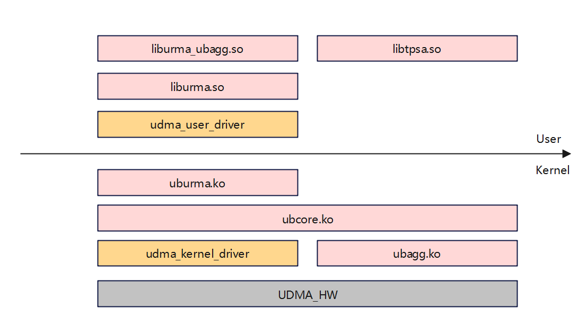

# Revision History

| Revision Date | Revised Chapters | Revision Description | Bug Ticket Link or Background | Revised By |
|---|---|---|---|---|
| 2026.2.12 | ALL | Document baseline | | @qianguoxin、@jerry_lilijun、@guguguo0127 |

---

# Table of Contents

- [Revision History](#revision-history)

- [1 Compilation Guide](#1-compilation-guide)
    - [1.1 Component Overview](#11-component-overview)
    - [1.2 Separate Compilation of User-mode Components](#12-separate-compilation-of-user-mode-components)
    - [1.3 Separate Compilation of Kernel-mode Components](#13-separate-compilation-of-kernel-mode-components)

- [2 Installation Guide](#2-installation-guide)
    - [2.1 Installation Package Overview](#21-installation-package-overview)
    - [2.2 Installation Dependencies](#22-installation-dependencies)
    - [2.3 User-mode Installation](#23-user-mode-installation)
    - [2.4 URMA RPM Package Installation](#24-urma-rpm-package-installation)
    - [2.5 Kernel-mode ko Installation](#25-kernel-mode-ko-installation)

- [3 Feature Dependencies](#3-feature-dependencies)

- [4 Verification and Running Examples](#4-verification-and-running-examples)
    - [4.1 Device Verification](#41-device-verification)
    - [4.2 Performance Test Example](#42-performance-test-example)

# 1 Compilation Guide

## 1.1 Component Overview

The URMA component is a high-performance communication component consisting of user-mode and kernel-mode parts:
- User-mode: Provides the application programming interface. Source repository: https://gitcode.com/openeuler/umdk

- Kernel-mode: Located in the `drivers/ub/urma` directory of the OpenEuler kernel source: https://gitcode.com/openeuler/kernel

## 1.2 Separate Compilation of User-mode Components

**Compilation Steps**

1. Install build tools and packages

```bash
yum install -y git rpm-build make cmake gcc glibc-devel kernel-devel libnl3-devel openssl-devel
```

2. Download the source code, navigate to `src/`, and create and enter a `build` directory

```bash
mkdir build
cd build
```

3. Run configuration and compilation

```bash
cmake -DCMAKE_VERBOSE_MAKEFILE=on \
-DCMAKE_INSTALL_PREFIX=/usr \
-DBUILD_ALL=disable \
-DBUILD_URMA=enable \
-DBUILD_UDMA=disable \
-DBUILD_UMS=disable \
..
make -j$(nproc)
```

**Parameter Descriptions**

- `-DCMAKE_VERBOSE_MAKEFILE=on`: Displays detailed compilation information for easier troubleshooting

- `-DCMAKE_INSTALL_PREFIX=/usr`: Specifies the installation path as the system directory

- `-DBUILD_URMA=enable`: Explicitly enables URMA module compilation

## 1.3 Separate Compilation of Kernel-mode Components

**Prerequisites**

Before compiling the kernel-mode components separately, you must run a full kernel compilation at least once to ensure the dependency files are correctly generated.

**Compilation Steps**

1. Install build tools

```bash
yum install -y dpkg dpkg-devel openssl openssl-devel
yum install -y ncurses ncurses-devel bison flex bc libdrm build elfutils-libelf-devel
```

2. Navigate to the kernel source directory

```bash
cd kernel
```

3. Configure the kernel (if not already configured)

```bash
make openeuler_defconfig
```

4. Compile the URMA kernel module separately

```bash
make M=drivers/ub/urma -j$(nproc)
```

**Build Output**

After compilation, `.ko` kernel module files will be generated in the `drivers/ub/urma` directory, including `ubcore.ko`, `ubagg.ko`, and `uburma.ko`. Verify with the following command:

```bash
cd drivers/ub/urma
find . -type f -name "*.ko"
# ./drivers/ub/urma/ubcore/ubcore.ko
# ./drivers/ub/urma/ubagg/ubagg.ko
# ./drivers/ub/urma/uburma/uburma.ko
```

---
# 2 Installation Guide

## 2.1 Installation Package Overview

URMA installation packages are available for both aarch64 and x86_64 architectures, supporting ARM and x86 platforms respectively. The following table describes the RPM packages:

**UMDK Installation Package Description**

<table style="width:83%;">
<colgroup>
<col style="width: 14%" />
<col style="width: 40%" />
<col style="width: 27%" />
</colgroup>
<thead>
<tr>
<th>Component</th>
<th>Installation Package</th>
<th>Remarks</th>
</tr>
</thead>
<tbody>
<tr>
<td rowspan="5">urma</td>
<td>umdk-urma-lib-xxx.rpm</td>
<td>URMA user-mode installation package</td>
</tr>
<tr>
<td>umdk-urma-bin-xxx.rpm</td>
<td>URMA kernel module installation package; must be paired with the corresponding kernel</td>
</tr>
<tr>
<td>umdk-urma-devel-xxx.rpm</td>
<td>URMA development package, including development header files</td>
</tr>
<tr>
<td>umdk-urma-tools-xxx.rpm</td>
<td>URMA tools package, including urma_admin, urma_perftest, and other auxiliary commands</td>
</tr>
<tr>
<td>umdk-urma-examples-xxx.rpm</td>
<td>Contains usage examples for the URMA user-mode programming API</td>
</tr>
</tbody>
</table>


> Cross-release-version standalone upgrades are not currently supported between URMA components

## 2.2 Installation Dependencies

```bash
yum install -y rpm-build
yum install -y make
yum install -y cmake
yum install -y gcc
yum install -y gcc-c++
yum install -y glibc-devel
yum install -y openssl-devel
yum install -y glib2-devel
yum install -y libnl3-devel
yum install -y kernel-devel  # ubcore dependency, from the openEuler kernel
```

## 2.3 User-mode Installation

### Method 1: Build and install using make install

```bash
cd src
mkdir build
cd build
cmake .. -D BUILD_ALL=disable -D BUILD_URMA=enable
make install -j
```

### Method 2: Compile RPM packages separately

RPM packages are generated under `/root/rpmbuild/RPMS/aarch64`:

```bash
mkdir -p /root/rpmbuild/SOURCES/
cd /UMDK
tar -czf /root/rpmbuild/SOURCES/umdk-26.06.0.tar.gz --exclude=.git `ls -A`
rpmbuild -ba umdk.spec --with urma
cd /root/rpmbuild/RPMS/aarch64
rpm -Uvh umdk-urma-lib-26.06.0-0.aarch64.rpm --force --nodeps
rpm -Uvh umdk-urma-bin-26.06.0-0.aarch64.rpm --force --nodeps
rpm -Uvh umdk-urma-tools-26.06.0-0.aarch64.rpm --force --nodeps
rpm -Uvh umdk-urma-example-26.06.0-0.aarch64.rpm --force --nodeps
rpm -Uvh umdk-urma-devel-26.06.0-0.aarch64.rpm --force --nodeps
```

### Method 3: Install via yum

```bash
yum install -y umdk-urma-lib-26.06.0-0.aarch64
yum install -y umdk-urma-bin-26.06.0-0.aarch64
yum install -y umdk-urma-example-26.06.0-0.aarch64
yum install -y umdk-urma-tools-26.06.0-0.aarch64
yum install -y umdk-urma-devel-26.06.0-0.aarch64
```

## 2.4 URMA RPM Package Installation

The URMA subsystem provides high-bandwidth, low-latency data services within the UBUS system and supports running on UBUS-native hardware platforms. The driver for UBUS-native hardware must be provided by HiSilicon.

**Supported Platform Architecture for URMA**




URMA is installed via RPM and requires root privileges.


**Installation Notes:**

1. URMA components include kernel modules such as ubcore, and each driver version (e.g., liburma-udma.so) must be strictly paired with the corresponding kernel version.

2. It is recommended to install URMA using RPM packages. User-mode components (including liburma.so, liburma_common.so, etc.) are installed by default under `/usr/lib64/`, and user-mode drivers (liburma-udma.so) are installed by default under `/usr/lib64/urma/`.

3. Since liburma.so of the URMA subsystem loads drivers from the `urma` subdirectory at the same level as the installation path, if the application needs to specify a URMA installation directory, the driver must be installed in the following format:

   `/XXX/YYY/urma/liburma-udma.so`

The unified runtime components provided by the URMA subsystem are two RPM packages: umdk-urma-lib and umdk-urma-bin. The umdk-urma-tools package provides URMA runtime management tools. If development based on URMA is required, the umdk-urma-devel package must also be installed.

**RPM Installation Commands:**

```bash
rpm -ivh umdk-urma-lib-26.06.0-B004.oe2403sp3.aarch64.rpm
rpm -ivh umdk-urma-bin-26.06.0-B004.oe2403sp3.aarch64.rpm
rpm -ivh umdk-urma-devel-26.06.0-B004.oe2403sp3.aarch64.rpm
rpm -ivh umdk-urma-tools-26.06.0-B004.oe2403sp3.aarch64.rpm
rpm -ivh umdk-urma-examples-26.06.0-B004.oe2403sp3.aarch64.rpm
```

## 2.5 Kernel-mode ko Installation

After installing the RPM packages, the kernel modules must be loaded. ubcore, ubagg, and uburma are mandatory modules. Additionally, the HiSilicon kernel module udma.ko must be loaded (using modprobe or insmod; follow the specific loading command provided by HiSilicon).

```bash
modprobe ubcore
modprobe uburma
modprobe ubagg
```

> **Additional Notes**: On certain platforms, more detailed kernel module loading order and parameters may be required. The following is a complete loading example that includes HiSilicon kernel modules:
>
> ```bash
> cd /lib/modules/$(uname -r)/kernel/drivers
> insmod ub/ubfi/ubfi.ko.xz cluster=1  # Remove the cluster=1 parameter when using a VF network card
> insmod iommu/ummu-core/ummu-core.ko.xz
> insmod ub/hisi-ub/kernelspace/ummu/drivers/ummu.ko.xz
> insmod ub/hisi-ub/kernelspace/ubus/ubus.ko.xz cc_en=0 um_entry_size=1
> insmod ub/hisi-ub/kernelspace/ubus/vendor/hisi/hisi_ubus.ko.xz msg_wait=2000 fe_msg=1 um_entry_size1=0 cfg_entry_offset=512
> insmod ub/hisi-ub/kernelspace/ubase/ubase.ko.xz
> insmod ub/hisi-ub/kernelspace/unic/unic.ko.xz tx_timeout_reset_bypass=1
> insmod ub/hisi-ub/kernelspace/cdma/cdma.ko.xz
> modprobe ubcore uburma
> modprobe udma dfx_switch=1 jfc_arm_mode=2 is_active=0 fast_destroy_tp=0
> modprobe ubagg
> ```

---
# 3 Feature Dependencies

- **System Requirements**: OpenEuler 24.03 SP3 or later

- **Kernel Version**: Must match the kernel used for compilation. For example: compiling for OpenEuler 6.6.0 requires the corresponding Linux-6.6.0 mainline kernel.

- **Runtime Dependencies**:
  - liburma.so, liburma_common.so, liburma_ubagg.so (user-mode libraries)
  - ubcore.ko, ubagg.ko, uburma.ko (kernel modules)

---
# 4 Verification and Running Examples

## 4.1 Device Verification

Use the `urma_admin` tool to verify that devices are properly detected:

```bash
urma_admin show
```

Example output:

```
num ubep_dev tp_type eid link
--- ---------------- -------- -------------------------------------------- --------
0 udma3 UB eid0 0000:0000:0000:00xx:00xx:00xx:00xx:1001 ACTIVE
1 udma3 UB eid1 0000:0000:0000:00xx:00xx:00xx:00xx:1002 ACTIVE
2 udma5 UB eid0 0000:0000:0000:00xx:00xx:00xx:00xx:1003 ACTIVE
3 udma5 UB eid1 0000:0000:0000:00xx:00xx:00xx:00xx:1004 ACTIVE
4 udma2 UB eid0 0000:0000:0000:00xx:00xx:00xx:00xx:1005 ACTIVE
5 udma4 UB eid0 0000:0000:0000:00xx:00xx:00xx:00xx:1006 ACTIVE
```

## 4.2 Performance Test Example

```bash
systemctl start scbus-daemon.service

# Start the server
urma_perftest send_bw -d bonding_dev_0 -s 2 -n 10 -I 128 -p 1

# Start the client (replace <server_ip> with the actual server IP)
urma_perftest send_bw -d bonding_dev_0 -s 2 -n 10 -I 128 -p 1 -S <server_ip>
```
