# Revision History

| Revision Date | Revised Chapters | Revision Description | Bug Ticket Link or Background | Revised By |
|---|---|---|---|---|
| 2026.2.12 | ALL | Document baseline | | @qianguoxin、@lairuilang、@wanghang73、@eingesch、@chenjingwei0113、@duelu、@autoreconf、@wdmmsyf |

---

# Table of Contents

- [Revision History](#revision-history)

- [1 UMDK Overview](#1-umdk-overview)

- [2 URMA Introduction](#2-urma-introduction)
    - [2.1 Basic Concepts](#21-basic-concepts)
        - [2.1.1 UB](#211-ub)
        - [2.1.2 UBVA Address Model](#212-ubva-address-model)
        - [2.1.3 Segment](#213-segment)
        - [2.1.4 Jetty](#214-jetty)
        - [2.1.5 UBoE](#215-uboe)

- [3 Compilation and Installation](#3-compilation-and-installation)
    - [3.1 RPM Package Compilation](#31-rpm-package-compilation)
    - [3.2 URMA RPM Installation](#32-urma-rpm-installation)

- [4 Quick Start](#4-quick-start)

- [5 URMA Architecture](#5-urma-architecture)
    - [5.1 Management Plane](#51-management-plane)
        - [5.1.1 Distributed Control](#511-distributed-control)
            - [5.1.1.1 Reliable Connection Protocol](#5111-reliable-connection-protocol)
            - [5.1.1.2 Shared Transport Layer](#5112-shared-transport-layer)
            - [5.1.1.3 Frontend-Backend Separated Connection Setup](#5113-frontend-backend-separated-connection-setup)
            - [5.1.1.4 Connection State Machine Management](#5114-connection-state-machine-management)
        - [5.1.2 Centralized Control](#512-centralized-control)
            - [5.1.2.1 Endpoint-Management Plane Connection Setup](#5121-endpoint-management-plane-connection-setup)
            - [5.1.2.2 Transport-Layer-Aware Connection Setup](#5122-transport-layer-aware-connection-setup)
            - [5.1.2.3 Transport-Layer-Unaware Connection Setup](#5123-transport-layer-unaware-connection-setup)
    - [5.2 Control Plane](#52-control-plane)
        - [5.2.1 Context Management](#521-context-management)
        - [5.2.2 Jetty Management](#522-jetty-management)
        - [5.2.3 Segment Management](#523-segment-management)
        - [5.2.4 Asynchronous Events](#524-asynchronous-events)
            - [5.2.4.1 flush jetty](#5241-flush-jetty)
        - [5.2.5 Device Attributes](#525-device-attributes)
        - [5.2.6 Token Secure Transport](#526-token-secure-transport)
    - [5.3 Data Plane](#53-data-plane)
        - [5.3.1 One-sided Operations](#531-one-sided-operations)
        - [5.3.2 Two-sided Operations](#532-two-sided-operations)
        - [5.3.3 Completion Records](#533-completion-records)

- [6 Key Features](#6-key-features)
    - [6.1 Feature Tree](#61-feature-tree)
    - [6.2 Device Aggregation](#62-device-aggregation)
        - [6.2.1 Aggregation Device Basic Concepts](#621-aggregation-device-basic-concepts)
        - [6.2.2 Aggregation Device Basic Usage Flow](#622-aggregation-device-basic-usage-flow)
        - [6.2.3 Aggregation Device Feature List and Constraints](#623-aggregation-device-feature-list-and-constraints)
    - [6.3 Virtualization](#63-virtualization)
        - [6.3.1 Containers](#631-containers)
        - [6.3.2 Virtual Machines](#632-virtual-machines)
    - [6.4 Tool Manual](#64-tool-manual)
        - [6.4.1 urma_perftest](#641-urma_perftest)
        - [6.4.2 urma_admin](#642-urma_admin)
    - [6.5 DFX Diagnostics](#65-dfx-diagnostics)
        - [6.5.1 URMA Logging](#651-urma-logging)

- [7 Ecosystem Compatibility](#7-ecosystem-compatibility)
    - [7.1 RoUB](#71-roub)
    - [7.2 IPoURMA](#72-ipourma)
    - [7.3 UMS](#73-ums)

- [8 Performance Specifications](#8-performance-specifications)

- [9 Network Security](#9-network-security)
    - [9.1 UB Access Control](#91-ub-access-control)
        - [9.1.1 Application Scenarios](#911-application-scenarios)
        - [9.1.2 Functional Principles](#912-functional-principles)
        - [9.1.3 Permission Assignment Flow](#913-permission-assignment-flow)
        - [9.1.4 Permission Invalidation Flow](#914-permission-invalidation-flow)
    - [9.2 Memory Access Control](#92-memory-access-control)

# 1 UMDK Overview

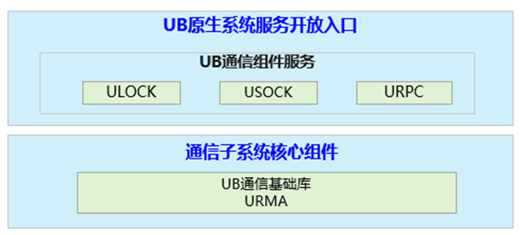

The Unified Memory Development Kit (UMDK) is a distributed communication software library centered on memory semantics. It provides high-performance communication interfaces between hosts, between devices, and between hosts and devices within data center networks, enabling and unleashing the hardware capabilities of the UnifiedBus. UMDK includes the following components:

1.  **URMA (Unified Remote Memory Access)**: The UB (Unified Bus) foundational communication library. By abstracting away the differences in underlying hardware drivers, it provides upper-layer users with unified methods for one-sided, two-sided, and atomic operations on remote memory — forming the basis for inter-application communication. To this end, URMA provides two categories of interfaces: northbound application programming interfaces that offer communication APIs to applications, and southbound driver programming interfaces that provide APIs for driver developers to integrate into UMDK.

2.  **URPC (Unified Remote Process Call)**: A high-performance RPC library that supports UnifiedBus-native high-performance RPC communication between hosts and devices, as well as RPC acceleration.

3.  **ULOCK (Unified Lock)**: A high-performance distributed lock that supports UnifiedBus-native high-performance state synchronization, accelerating global resource allocation for distributed applications such as databases.

4.  **USOCK (Unified Socket)**: UnifiedBus communication ecosystem builder, compatible with standard Socket programming interfaces, enabling TCP applications to improve network communication performance with zero code modifications.

---
# 2 URMA Introduction

URMA (Unified Remote Memory Access) is the core foundational communication library of UMDK. Its design philosophy is to achieve efficient and flexible distributed memory operations through unified memory access semantics. URMA provides upper-layer applications with a unified programming interface that supports multiple methods of accessing remote memory — including one-sided operations, two-sided messaging, and atomic operations — while abstracting away the differences in underlying hardware drivers.

In terms of system architecture, URMA provides two categories of interfaces: northbound, facing applications with a concise communication API; and southbound, facing driver developers with a standardized integration specification, making it easy for different hardware to join the UB ecosystem.

In real-world workloads, URMA not only provides high-bandwidth, low-latency message communication and data forwarding capabilities for various services in data centers, but also lays the foundation for higher-level semantic orchestration features. It significantly reduces end-to-end communication latency for big data services and provides critical high-performance data service support for HPC, AI, and other high-performance computing scenarios.

The architecture of URMA and its peripheral components is shown below:


- **ubcore.ko**: The URMA core module, providing fundamental capabilities. It offers interfaces upward to kernel-mode applications and supports kernel-mode driver integration downward.

- **uburma.ko**: Encapsulates the functionality of ubcore.ko as system calls for user-mode use.

- **liburma.so (CMD API)**: The user-mode driver interface layer, encapsulating the system calls of uburma.ko and providing an entry point for user-mode drivers.

- **liburma.so (USER API)**: The user-mode application interface layer, providing interfaces upward to user programs and supporting user-mode driver registration downward.

## 2.1 Basic Concepts

### 2.1.1 UB

Unified Bus, the UnifiedBus, comprising endpoints, switches, and software.

### 2.1.2 UBVA Address Model

UBVA (Unified Bus Virtual Address) is a hierarchical virtual address on the UBUS bus. It supports unified addressing of shared memory across multiple nodes on the bus, breaking the address boundaries of individual nodes and allowing applications to perform cross-node addressing and data access through VA. It consists of two parts: EID and VA address.

### 2.1.3 Segment

A Segment is a contiguous block of VA (Virtual Address) space, with physical memory allocated to correspond to the segment. It is created by the segment home node. The user-side application maps the segment to the process's virtual address space, allowing direct access to remote memory through the mapped address. The VA address of the segment and the VA mapped by the user process can be the same or different. The scenario where VA addresses are the same is referred to as the DSVA (Direct Shared Virtual Address) scenario.

### 2.1.4 Jetty

Jetty is a unified operational interface for the transaction layer, which can be viewed as the "port" for transaction execution — used to manage queues of submitted IO tasks or received messages. Jetty is primarily classified into the following types:

1.  **JFS (Jetty for Send)**: Used to submit send tasks (WQE, Work Queue Element).

2.  **JFR (Jetty for Receive)**: Used to submit receive tasks.

3.  **JFC (Jetty for Completion)**: Used to store completion queue records (CQE, Completion Queue Element) for send and receive tasks.

4.  **Jetty**: Combines the functionality of both JFS and JFR, supporting submission of both send and receive tasks.

### 2.1.5 UBoE

UB over Ethernet (UBoE) refers to the packet format in which UB transaction layer and transport layer semantics are carried over Ethernet/IP. As shown in the following figures, optional fields after the ETH header may use OPtag to carry enhanced load balancing, congestion control, and network isolation feature fields. The Optag format is defined and maintained within the ETH link layer protocol family; the following is for reference only.

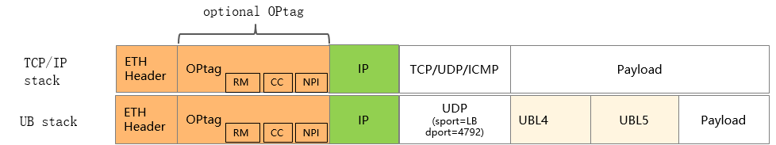

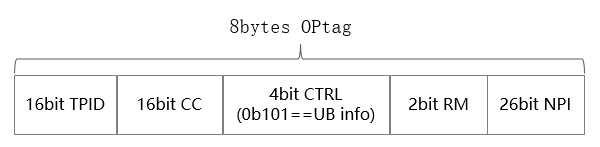

---
# 3 Compilation and Installation

## 3.1 RPM Package Compilation

**Method 1: Compile URMA RPM Package Separately**

1. Navigate to the root directory of the UMDK project.

2. Package the source code:

```bash
tar -czf /root/rpmbuild/SOURCES/umdk-26.06.0.tar.gz --exclude=.git `ls -A`
```

3. Compile the RPM package:

```bash
rpmbuild -ba umdk.spec --with urma
```

**Method 2: Build and Install Using make install**

1. Navigate to the UMDK/src project root directory.

2. Create and enter the build directory:

```bash
mkdir build
cd build
```

3. Configure, compile, and install:

```bash
cmake .. -D BUILD_ALL=disable -D BUILD_URMA=enable
make install -j
```

## 3.2 URMA RPM Installation

Note: URMA requires the ability to invoke URMA component capabilities; the URMA software must be installed in advance.

```bash
rpm -ivh /root/rpmbuild/RPMS/aarch64/umdk-urma-*.rpm
```

---
# 4 Quick Start

This chapter introduces the basic flow of URMA communication. To help readers build an overall understanding before diving into details, this chapter uses a client-server model to illustrate the four core phases of URMA communication: resource preparation, connection establishment, data transfer, and resource release.

The URMA communication flow can be divided into four main phases:

**Phase 1: Resource Preparation**

In this phase, the application needs to complete the initialization of the underlying communication framework and the creation of key resources. First, the initialization function is called to create a context; all subsequent URMA operations are performed at the context granularity. Next, communication endpoints (Jetty, JFR, JFS, JFC) are created to provide channels for subsequent data transmission and reception. At the same time, the application must register the memory regions (Segments) used for data exchange locally; this memory will be exposed for UB hardware access.

**Phase 2: Connection Establishment**

The connection establishment phase is responsible for building the data path between the communicating parties. The application must obtain the peer resource IDs, addresses, and access permission information on its own; this information is typically transferred via an out-of-band mechanism. After obtaining the necessary information, the application maps remote resources (including Jetty and Segment) locally through import operations. This process establishes an end-to-end logical connection, allowing the local application to reference remote resources as if they were local memory.

**Phase 3: Data Transfer**

The data transfer phase is the critical link for implementing core functionality. The application initiates data transfer operations by submitting Work Requests (WR) to the Jetty. These requests describe parameters such as the operation type, source and target addresses, and size. The system processes these requests asynchronously, and the application confirms the execution results by polling the JFC. The main operation types include:

- **Two-sided SEND/RECV operations**: A traditional message-passing model based on receiver buffers. Note that a SEND operation on the sender side can only succeed after a RECV operation has been submitted on the receiver side.

- **One-sided READ/WRITE operations**: Direct reads from and writes to remote memory without involving the remote CPU.

**Phase 4: Termination**

The termination phase ensures the proper release of system resources and cleanup of the environment. In the reverse order of creation, the application first destroys Jetty and Segment resources, and finally destroys the context and unloads the URMA communication framework.

Using a simple client-server model as an example, the application flow is as follows:


See the URMA user-mode programming examples for sample programs.

---
# 5 URMA Architecture

The URMA architecture consists of three main parts: the Management Plane, Control Plane, and Data Plane.

The URMA Control Plane and Data Plane are analogous to RDMA — they are functional planes based on UB transaction layer concepts. The Control Plane is used to manage UB transaction layer objects such as Jetty and Segment, while the Data Plane is responsible for data plane transport based on the UB transaction layer and is the core of URMA's high performance. The Management Plane is the plane that manages the mapping and lifecycle between the transaction layer and the transport layer, with flexible deployment modes; it is the core plane for managing URMA connection establishment.

## 5.1 Management Plane

The URMA Management Plane is a software module that provides transport layer connection management services based on UB transaction layer Jetty objects. The hierarchical relationship of the Management Plane within the UB protocol stack is shown below:


In the figure above, UBFM is the manager of the UB Domain, responsible for interconnection, communication, and computing resource management within the domain, dynamically handling events that arise during system operation.

UMMU is the UB Memory Management Unit.

The Management Plane refers to the plane that manages the mapping and management between the transaction layer and the transport layer.

The URMA protocol stack supports both distributed control and centralized control, depending on the underlying hardware. The differences are illustrated below.

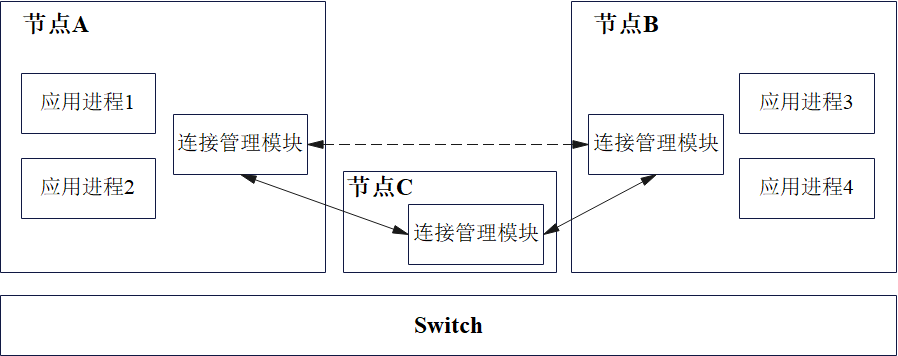

Distributed Control

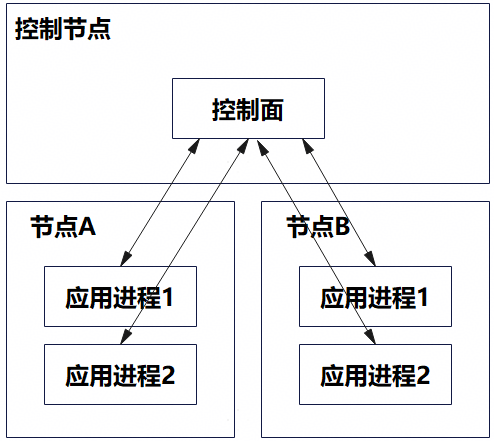

Centralized Control

### 5.1.1 Distributed Control

The transaction layer of the URMA protocol is primarily exposed through the URMA API, while the transport layer is generally not exposed to the outside. During the connection setup process, users may create or reuse the transport layer, so a control plane is needed to maintain the lifecycle of transport layer creation and state machines — hence the concept of the Management Plane.

Distributed control means that the Management Plane, together with the transaction layer and transport layer protocol software, is deployed in a distributed manner on the endpoint side to complete endpoint-side transaction layer connection setup. The current SDI6.0 hardware form factor supports distributed control.

The core of distributed control lies in connection management based on a software architecture where the transaction layer and transport layer are separated.

#### 5.1.1.1 Reliable Connection Protocol

The URMA Management Plane is responsible for providing connection management mechanisms for reliable connection modes. This protocol behavior is called the Reliable Connection Protocol.

Reliable Connection Protocol between Initiator and Target:

(1) In the initiator node's connection setup flow, a local transport layer is created, and the connection management module sends a connection request to the target node's connection management module, as shown by CONN_REQ in the figure below.

(2) After receiving the connection request, the target node's connection management module notifies the protocol framework and protocol driver, creates a transport layer on this node, and transitions the transport layer to the RTR state. The target node's connection management module then sends a connection response to the initiator node's connection management module, as shown by CONN_REP in the figure below.

(3) After receiving the connection response, the initiator node's connection management module notifies the protocol framework and protocol driver, transitioning the local node's transport layer to the RTS state. The initiator's connection management module then sends a connection acknowledgment to the target's connection management module, as shown by CONN_ACK in the figure below.

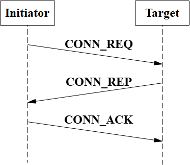

#### 5.1.1.2 Shared Transport Layer

For scenarios where both sides initiate connection setup simultaneously, a shared transport layer protocol is created to conserve transport layer resources.

A shared transport layer refers to the operation where, after the initiator node and target node have completed connection setup, the target node initiates a connection setup toward the initiator node. The figure below shows the shared peer transport layer for this scenario — i.e., the transport layer created when Node A initiates a connection toward Node B will be shared when Node B initiates a connection toward Node A.

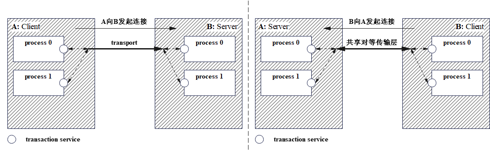

The protocol for the shared transport layer in this scenario is shown below. The interaction flow is as follows:

(1) The target node initiates connection setup. Upon querying and finding that a transport layer already exists, it shares the transport layer instead of creating a new one. The target node's connection management module sends a shared peer transport layer connection request to the initiator node's connection management module, as shown by CONN_REUSE_REQ in the figure below.

(2) After receiving the shared peer transport layer connection request, the initiator's connection management module queries and finds that a transport layer already exists on this node, so it shares the transport layer instead of creating a new one. The initiator's connection management module sends a shared peer transport layer connection response to the target's connection management module, as shown by CONN_REUSE_REP in the figure below.


Additionally, the Management Plane also provides a connection rejection protocol and a disconnection protocol. The flows are as follows:

- **Connection Rejection Protocol**

The figure below shows the connection rejection behavior for this scenario. The protocol interaction flow is as follows:

(1) The initiator node initiates connection setup. The connection management module on this node sends a connection request to the target node's connection management module, as shown by CONN_REQ in the figure below.

(2) The target node's connection management module receives the connection request and checks it locally, including necessary transaction layer and transport layer configuration permission checks. In the scenario described in this flow, the target node's check fails, and its connection management module replies with a connection rejection message, as shown by CONN_REJ in the figure below.

(3) After receiving the connection rejection message, the initiator node's connection management module executes an error rollback flow, including selective destruction of local transport layer resources (not destroyed in transport layer reuse scenarios) and destruction of transaction layer resources, and returns a connection setup failure result. The flow ends.

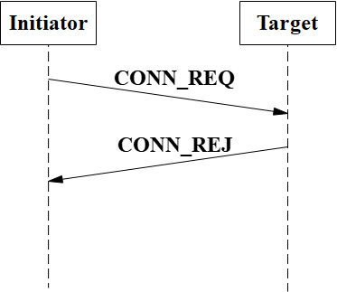

- **Disconnection Notification Protocol**

This flow describes the behavior of each node in a disconnection scenario. A characteristic of this flow is that the peer node sends only a single disconnection notification. The protocol interaction flow is as follows:

(1) The initiator node's user process initiates disconnection, or the protocol framework automatically initiates disconnection in scenarios such as process exit. If both ends are in a shared peer transport layer scenario, after the user triggers disconnection, this node's connection management module sends a disconnection notification to the target's connection management module, as shown by DCONN_NOTIFY in the figure below. After the disconnection message is sent, this node automatically transitions to the connection setup state as the target node (refer to the connection state machine management in the next section), waiting for the target node's disconnection notification.

(2) After receiving the disconnection notification, the target node's connection management module notifies the protocol framework and protocol driver to enter the disconnection flow. This node automatically transitions to the initiator connection setup state. When this node initiates a disconnection operation, it transitions from the initiator connection setup state to the REST state and destroys local transport layer resources. At the same time, the target node's connection management module sends a disconnection notification to the initiator node's connection management module, as shown by DCONN_NOTIFY in the figure below.

(3) After receiving the disconnection notification, the initiator node's connection management module notifies the protocol framework and protocol driver to enter the disconnection flow. This node, having transitioned to the target connection setup state in step (1), then transitions to the disconnection complete state, destroys local transport layer resources, and the disconnection flow ends.


#### 5.1.1.3 Frontend-Backend Separated Connection Setup

To ensure security isolation, the URMA protocol stack employs a frontend-backend separated deployment approach. The frontend is responsible for interfacing with users to manage transaction layer resources, while the backend Management Plane is responsible for maintaining the transport layer lifecycle.

The figure below shows the frontend-backend separated deployment of the connection management module and application processes. Virtual machines are started on both Node A and Node B, with application processes running on the VMs. Auxiliary devices are deployed on both Node A and Node B. The auxiliary devices may take forms including but not limited to: (1) node hardware auxiliary devices, such as DPU devices in the virtualization domain; (2) virtual devices deployed in software-isolated memory, etc. Auxiliary devices are commonly referred to as backend devices. In this deployment mode, the configuration of the connection management module is system-isolated from the application processes. A daemon process is deployed on the auxiliary device, and the connection management module runs within the daemon process, providing connection setup and disconnection services for multiple application processes in the frontend VM. System administrators access the connection management module on the backend device and perform management tasks such as querying and network configuration of the connection management module through command-line interfaces.


The figure below shows the scenario of independently deploying the connection management module, illustrating the method for isolating malicious attacks, using the VM frontend-backend embodiment as an example. Application processes are deployed on VM frontend nodes, interacting with external networks and data, and are exposed to the risk of malicious attacks. The connection management module is deployed on backend auxiliary devices, running on a different operating system from the application processes. When an application process is subjected to an external malicious attack, the attack cannot penetrate to the connection management module through system isolation, ensuring the security of transaction layer, transport layer, and user information deployed on the node devices.

The advantages of an independently and flexibly deployed connection management module are as follows:

(1) **Isolated deployment limits attack scope and improves security**

In cloud security scenarios, frontend-backend plus VM separated deployment is used. Frontend user processes are isolated from the backend management module. When an attacker conducts a malicious attack on a user process, the malicious code has difficulty penetrating to the backend management module, the core functions of the control plane remain unaffected, and the attack scope is limited.

(2) **Frontend-backend isolation prevents privilege escalation**

Only authorized personnel and processes have the privilege to access and operate the backend management module. In cloud security scenarios, only the minimum required privileges are assigned to frontend processes. Attacks on user processes are confined to the VM and container scope, preventing attack privilege escalation that would allow access to backend system resources.

(3) **System stability and flexible deployment**

The backend management module adopts flexible deployment methods — such as cross-node, distributed, or node-centralized control — to meet the needs of different networking scenarios. The management module's independent deployment form reduces the impact of abnormal crashes of user processes. The management module's independent process deployment form facilitates troubleshooting and maintenance management by operations personnel.

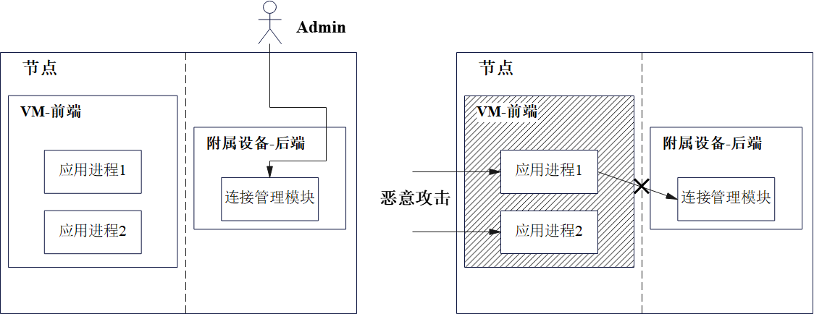

#### 5.1.1.4 Connection State Machine Management

The figure below is an example of connection state machine management. The connection state machine management flow is as follows:

The state machine transitions for connection setup, disconnection, shared peer transport layer, and connection rejection flows are described with reference to Figure 14:

(1) The initiator user triggers connection setup. Local transport layer resources are created. The initiator is in the reset state, sends a connection request to the target (1401), and transitions to the REQ sent state.

(2) The target user triggers connection setup, initially in the reset state. After the target receives the connection request (1404), it transitions to the REQ received state. The target creates transport layer resources, sends a connection reply to the initiator (1405), and after sending, transitions to the REP sent state.

(3) If the initiator does not receive a connection reply and triggers a timeout (1402), it transitions to the timeout transient state, then automatically transitions (1403) to reset. The connection setup flow fails.

(4) When the initiator is in the REQ sent state and receives a connection request message (1408), it transitions to the peer compare state, comparing information from both ends to determine whether this node is the initiator or the target. If no connection request message has been received at this point, it is determined to be the initiator (1409) and automatically transitions back to the REQ sent state. If a connection request message has already been received, it is determined to be the target (1410) and automatically transitions to the REQ received state.

(5) When the initiator is in the REQ sent state and receives a connection response message (1411), it transitions to the REP received state. After completing the local transport layer state transition, it automatically sends a connection acknowledgment (1412) and automatically transitions to the Initiator established state.

(6) Continuing from step (2) — the target flow: when the target is in the REP sent state and receives a connection acknowledgment (1413), it transitions to the Target established state. If no connection acknowledgment is received and a timeout is triggered (1406), it transitions to the timeout transient state and automatically transitions (1407) to the reset state; the target connection setup flow fails. The connection setup flow ends here.

(7) In a shared peer transport layer scenario, when the target node user triggers a connection setup operation, this node sends a shared peer transport layer connection request (1414), then transitions to the REUSE sent state, waiting for the corresponding connection response.

(8) The initiator node receives the shared peer transport layer connection request (1415) and transitions to the REUSE received transient state. If the shared connection request check passes on the initiator node, a shared peer transport layer connection response is sent to the target (1416) and the node transitions to the reused state. If the shared connection request check fails on the initiator node, a shared peer transport layer connection rejection message is sent (1419) and the node transitions back to the Initiator established state.

(9) Continuing from step (7) — the target flow: the target node is in the REUSE sent state. If no shared connection reply message is received and a timeout is triggered (1417), it transitions back to the Target established state. If a shared peer transport layer connection reply is received (1418), it transitions to the reused transient state. The shared peer transport layer flow ends here.

(10) For any node in the reused state: if the user triggers disconnection first and this node sends a disconnection notification (1420), this node transitions to the NOTIFY sent on reuse transient state and automatically transitions (1423) to the Target established state. If this node receives a disconnection notification (1424), it transitions to the NOTIFY received transient state, destroys transport layer resources, and automatically transitions (1407) to the reset state.

(10) For any node in the reused state: if a disconnection notification is received first (1421), this node transitions to the NOTIFY received on reuse transient state and automatically transitions (1422) to the Initiator established state. If the user on this node triggers disconnection and sends a disconnection notification (1424), this node transitions to the NOTIFY sent transient state and initiates a transition (1425) to the reset state. The disconnection flow ends here.

State descriptions:

**(1) reset:** Initial connection setup state.

**(2) REQ sent:** Connection request sent completed state.

**(3) timeout:** Timeout state.

**(4) peer compare:** Initiator/target switch comparison state.

**(5) REP received:** Connection response received completed state.

**(6) Initiator established:** Initiator connection setup completed state.

**(7) NOTIFY sent:** Disconnection notification sent completed state.

**(8) Reuse received:** Shared peer transport layer connection request received completed state.

**(9) NOTIFY received on reuse:** Shared peer transport layer disconnection notification received completed state.

**(10) NOTIFY sent on reuse:** Shared peer transport layer disconnection notification sent completed state.

**(11) reused:** Shared peer transport layer state.

**(12) REQ received:** Connection request received completed state.

**(13) REP sent:** Connection response sent completed state.

**(14) Target established:** Target connection setup completed state.

**(15) NOTIFY received:** Disconnection notification received completed state.

**(16) Reuse sent:** Shared peer transport layer connection request sent completed state.

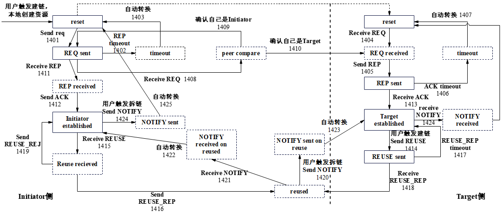

### 5.1.2 Centralized Control

Centralized control refers to a deployment where the Management Plane is separated from the transaction layer and transport layer protocol software: the Management Plane is deployed on a control node, while the protocol software is deployed on endpoint nodes. This form is called out-of-band deployment. Within the centralized control paradigm, there is also a deployment mode different from the out-of-band form — namely, similar to distributed control, where both the Management Plane and the protocol software are deployed on endpoint nodes without an additional control node. This form is called in-band deployment. Current hardware form factors such as KunPeng CPU and NPU support centralized control.

#### 5.1.2.1 Endpoint-Management Plane Connection Setup

The main flow of centralized control is: the endpoint user requests the Management Plane to allocate transport layer resources through the URMA protocol stack. After completing the transport layer information exchange, the endpoint triggers the transport layer state transition to the active state, at which point the UB protocol stack becomes capable of communication. In the disconnection flow, the endpoint triggers the transport layer state transition to the deactivated state, at which point the connection is disconnected and communication is no longer possible.

#### 5.1.2.2 Transport-Layer-Aware Connection Setup

Based on connection primitives, users may choose to use transport-layer-aware connection setup. The connection setup flow is roughly as follows:

1.  Obtain the transport layer.

2.  Exchange transaction layer and transport layer information.

3.  Import the peer transaction layer object to complete connection setup.

The connection setup and disconnection flows are shown in the figure below:


Relevant URMA APIs (user-mode example):

```c
/**
* get available tp list from control plane.
* @param[in] [Required] ctx: the created urma context pointer;
* @param[in] [Required] tp_cfg: tp configuration to get;
* @param[in && out] [Required] tp_cnt: tp_cnt is the length of tp_list buffer as in parameter;
* tp_cnt is the number of tp as out parameter;
* @param[out] [Required] tp_list: tp list to get, the buffer is allocated by user;
* Return: 0 on success, other value on error
*/
urma_status_t urma_get_tp_list(urma_context_t *ctx, urma_get_tp_cfg_t *cfg, uint32_t *tp_cnt,
urma_tp_info_t *tp_list);
/**
* Import a remote jetty by control plane.
* Note: trans_mode from rjetty should be the same as the trans_mode of get_tp_list,
* users should obey this rule in case of unexpected errors.
* @param[in] [Required] ctx: the urma context created before;
* @param[in] [Required] rjetty: information of remote jetty to import, including jetty id and trans_mode,
* trans_mode same to create_jetty trans_mode;
* @param[in] [Required] token_value: token to put into output jetty protection table;
* @param[in] [Required] cfg: tp active configuration to exchange with target;
* Return: the address of target jetty, not NULL on success, NULL on error
*/
urma_target_jetty_t *urma_import_jetty_ex(urma_context_t *ctx, urma_rjetty_t *rjetty,
urma_token_t *token_value, urma_import_jetty_ex_cfg_t *cfg);
/**
* Bind jetty: construct the transport channel between local jetty and remote jetty by control plane.
* Note: trans_mode from tjetty should be the same as the trans_mode of get_tp_list,
* users should obey this rule in case of unexpected errors.
* @param[in] [Required] jetty: local jetty to construct the transport channel;
* @param[in] [Required] tjetty: target jetty imported before;
* Return: 0 on success, URMA_EEXIST if the jetty has been binded, other value on error;
* @param[in] [Required] cfg: tp active configuration to exchange with target;
* Note: A local jetty can be binded with only one remote jetty. Only supported by jetty under URMA_TM_RC.
*/
urma_status_t urma_bind_jetty_ex(urma_jetty_t *jetty, urma_target_jetty_t *tjetty,
urma_bind_jetty_ex_cfg_t *cfg);
```

Users should focus on the URMA API usage flow based on transport-layer-aware connection setup.

#### 5.1.2.3 Transport-Layer-Unaware Connection Setup

In the centralized control connection setup scheme, URMA also provides a transport-layer-unaware connection setup scheme — i.e., users do not need to perform transport-layer-related API operations. After creating transaction layer resources such as Jetty, the connection setup flow is triggered through transport-layer-unaware APIs. The URMA internal adaptation layer encapsulates the flow based on the transport-layer-aware process. The specific flow is as follows:


Relevant URMA APIs:

```c
/**
* Import a remote jetty.
* @param[in] [Required] ctx: the urma context created before;
* @param[in] [Required] rjetty: information of remote jetty to import, including jetty id and trans_mode,
* trans_mode same to create_jetty trans_mode;
* @param[in] [Required] token_value: token to put into output jetty protection table;
* Return: the address of target jetty, not NULL on success, NULL on error
*/
urma_target_jetty_t *urma_import_jetty(urma_context_t *ctx, urma_rjetty_t *rjetty,
urma_token_t *token_value);
/**
* Bind jetty: construct the transport channel between local jetty and remote jetty.
* @param[in] [Required] jetty: local jetty to construct the transport channel;
* @param[in] [Required] tjetty: target jetty imported before;
* Return: 0 on success, URMA_EEXIST if the jetty has been binded, other value on error
* Note: A local jetty can be binded with only one remote jetty. Only supported by jetty under URMA_TM_RC.
*/
urma_status_t urma_bind_jetty(urma_jetty_t *jetty, urma_target_jetty_t *tjetty);
```

Users should focus on the URMA API usage flow based on transport-layer-unaware connection setup.

## 5.2 Control Plane

### 5.2.1 Context Management

1.  Overview

URMA supports different hardware platforms. During initialization, the corresponding provider must be configured, and the device to be used must be specified, thereby creating a context.

2.  Application Scenario

URMA context management must be executed at the initial stage of application runtime. Subsequent Jetty, Segment management, and data plane operations all depend on this operation.

3.  Instructions for Use

    1.  Call the *urma_init* function to configure the platform and set the uasid. If the uasid is not specified, the system will randomly assign one. Specifying a uasid may cause the function to fail.

    2.  Call the *urma_query_device* function to query the device's attributes and obtain information such as the eid. If the application has already obtained the device's eid, this step can be skipped.

    3.  Call the *urma_create_context* function to create a device context. The sum of resources created by one process (including hardware doorbell registers, Jetty, Segment, etc.) is isolated from other processes.

\-\-\--End

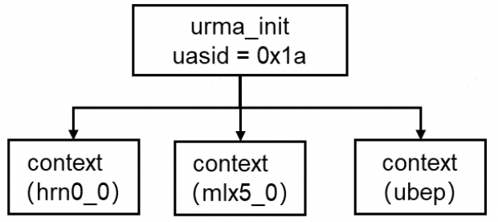

```c
typedef struct urma_context {
    struct urma_device *dev; /* [Private] point to the corresponding urma device. */
    struct urma_ops *ops; /* [Private] operation of urma device. */
    int dev_fd; /* [Private] fd of urma device's sysfs file. */
    int async_fd; /* [Private] fd of urma device's async event file. */
    pthread_mutex_t mutex; /* [Private] mutex of urma context. */
    urma_eid_t eid; /* [Public] eid of urma device. */
    uint32_t eid_index;
    uint32_t uasid; /* [Public] uasid of current process. */
    struct urma_ref ref; /* [Private] reference count of urma context. */
} urma_context_t;
```

1.  **struct urma_device *dev**: A pointer to the urma_device structure, which contains information related to a specific URMA device, such as device attributes and operation functions.

2.  **struct urma_ops *ops**: A pointer to the urma_ops structure, which defines the set of operations for interacting with a URMA device, such as open, close, read, write, etc.

3.  **int dev_fd**: An integer variable representing the file descriptor to the URMA device's sysfs file. sysfs is a Linux kernel interface that allows user-space programs to access kernel data structures — such as device status information — through the file system interface.

4.  **int async_fd**: An integer variable representing the file descriptor to the URMA device's asynchronous event file. This file descriptor is used to receive asynchronous event notifications generated by the device, such as data transfer completion and error occurrence.

5.  **pthread_mutex_t mutex**: A mutex lock used to synchronize access to the data within the urma_context_t structure. In a multi-threaded environment, the mutex ensures that only one thread can modify the data in the structure at any time, preventing data races.

6.  **urma_eid_t eid**: A variable of type urma_eid_t, representing the globally unique identifier (EID, Endpoint ID) of the URMA device. In RoCE networks, the EID is used to identify an endpoint on the network.

7.  **uint32_t eid_index**: An unsigned 32-bit integer, possibly used to index or identify additional information related to the EID, such as the specific position of this EID within the device context.

8.  **uint32_t uasid**: An unsigned 32-bit integer representing the User Assisted Segment Identifier (UASID) of the current process.

9.  **struct urma_ref ref**: An instance of the urma_ref structure, used to track the reference count of urma_context_t.

### 5.2.2 Jetty Management

1.  Overview

URMA execution resource management is performed through Jetty. Jetty is a URMA software operation object; with the help of Jetty, UBEP and software implement message interaction. Jetty is primarily used for message-semantic receive and send operations, as well as command submission for memory semantics. Jetty is exclusive to a process. According to their purpose, Jetty can be subdivided into Jetty, Jetty For Send (JFS), Jetty For Receive (JFR), and Jetty For Complete (JFC).

1.  **Jetty**: Jetty is a full-featured communication object in URMA. It supports both sending (sending data to other Jetties) and receiving (receiving data from other Jetties). A Jetty object contains a Send Queue (SQ, Send Queue Buffer) for submitting Work Queue Entries (WQE), and it is also associated with a JFC (Jetty for Complete) to manage the completion status of data transfers. Jetty can be used independently, or in the unidirectional model, as a combination of JFS and JFR.

2.  **JFS (Jetty for Sending)**: JFS is a variant of Jetty dedicated to send operations. In the unidirectional model, on the Initiator side, JFS is used to submit DMA tasks or send messages. JFS contains only an SQ, does not support receive operations, and only performs Send operations or one-sided UDMA operations. JFS is typically used in conjunction with JFR to conserve receive buffer resources.

3.  **JFR (Jetty for Receiving)**: JFR is another variant of Jetty, dedicated to receive operations. In the unidirectional model, on the Target side, JFR is used to prepare resources for receiving messages; it contains a Receive Queue (RQ, Receive Queue Buffer). JFR only performs Recv operations and does not support sending. JFR typically works together with JFS to provide the receive endpoint for unidirectional communication.

4.  **JFC (Jetty for Complete)**: JFC is an auxiliary entity of Jetty. It does not directly participate in data transfer but manages the completion status of Jetty, JFS, and JFR. Each Jetty, JFS, or JFR requires a JFC to record the completion status of data transfers. JFC contains a Completion Queue (CQ, Complete Queue Buffer) for polling completion events (CQE, Complete Queue Entry).

    1.  Application Scenario

Before performing specific read, write, send, receive, etc. operations, the relevant Jetty resources must be created. All subsequent read, write, send, receive, etc. operations depend on the created Jetty resources.

2.  Precautions

When creating a JFC, specify the associated JFCE in order to wait for completion events and obtain completion records in interrupt mode. JFCE: the channel for receiving completion events. In kernel mode, JFCE is implemented as a file; in user mode, it is implemented as an opened JFCE file handle.

3.  Instructions for Use

1.  The programming framework for implementing message semantics using Jetty is shown in the figure below, where JFC is in polling mode without a bound JFCE:

1.  Message Semantics Usage Example


2.  The programming framework for interrupt mode using JFCE is shown below:

2.  JFC Interrupt Mode Programming Example

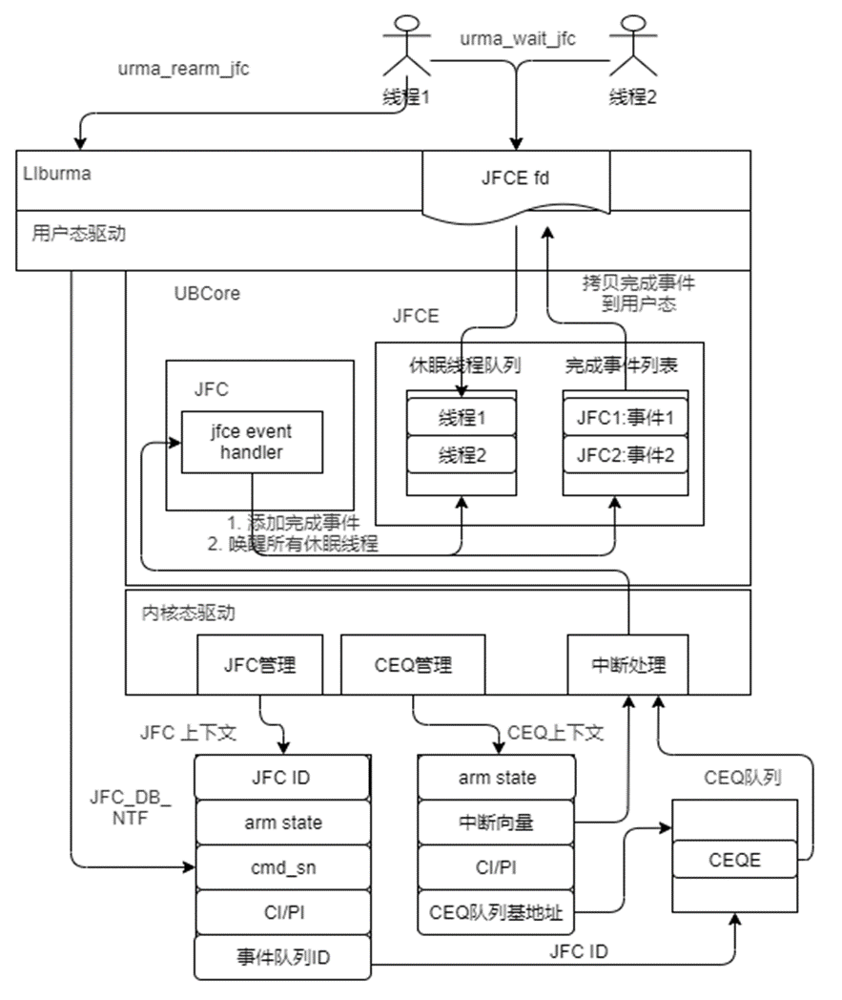

### 5.2.3 Segment Management

1.  Overview

Segment is the abstract data structure through which URMA manages and accesses memory accessed by memory transaction instructions. A Segment is a contiguous block of UBA address space, with physical memory allocated to correspond to the segment. In the URMA one-sided memory access programming model, Segment is the fundamental memory management object. The Target side creates and registers a Segment, and the Initiator side applies to use the remote Segment, constructing a Target Segment (containing TokenId, ubva, etc.), after which it can proceed to access remote memory.

**UBVA Address Model**

2.  Application Scenario

URMA-semantic memory management.

**Register memory (register_seg): Allow the device to access a segment of the process's memory**

- Permissions: local write, remote read, remote write, remote atomic.

- Difference from RDMA: No need to create a PD in advance; a key must be passed in (may be modified).

**Before accessing remote memory, first import the memory (import_seg)**

- Add a Segment access table entry to verify that this process has the permission to access the segment.

- RDMA applications do not need to import MR; they directly exchange the server process's va and rkey with the client through an out-of-band channel, after which the client can use the va and rkey to perform RDMA operations.

- In URMA, each client registers a segment and passes in a different derived key.

- When using a bond device for import_segment, the eid in the seg must not be empty; otherwise, it cannot be sent to the peer. There is no such restriction when using a bare udma device, and udma does not check the content of seg for emptiness.

  1.  Precautions

(1) When a local user reads from or writes to remote memory, both the local buffer and the remote memory must be registered with the device by calling urma_register_seg in advance. If not in use, urma_unregister_seg must be called to deregister.

(2) Before an application uses remote memory for reading or writing, urma_import_seg must be called to obtain the target_segment.

(3) When registering a segment, if the remote write or remote atomic permission is declared, the application must also declare the local write permission; otherwise, the registration fails.

2.  Instructions for Use

(1) Using local memory: allocate a VA, call urma_register_seg to register the segment.

(2) Freeing local memory: call urma_unregister_seg to deregister the segment.

(3) Using remote memory: urma_import_segment to obtain targ_segment and mva.

(4) Freeing remote memory: unimport_segment to deregister the segment.

```c
typedef struct urma_seg {
    urma_ubva_t ubva; /* [Public] ubva of segment. */
    uint64_t len; /* [Public] length of segment. */
    urma_seg_attr_t attr; /* [Public] include: access flag, token policy, cacheability. */
    uint32_t token_id; /* [Private] match token */
} urma_seg_t;
typedef struct urma_target_seg {
    urma_seg_t seg; /* [Private] see urma_seg_t. */
    uint64_t user_ctx; /* [Private] private data of segment */
    uint64_t mva; /* [Public] mapping addr when import remote seg. */
    urma_context_t *urma_ctx; /* [Private] point to urma context. */
    urma_token_id_t *token_id; /* When registering seg, it is a valid address; when importing seg, it is NULL */
    uint64_t handle;
} urma_target_seg_t;
```

The object returned by register and import is urma_target_seg_t.

The programming framework for implementing memory semantics based on Segment is shown below:

1.  Memory Semantics Programming Example


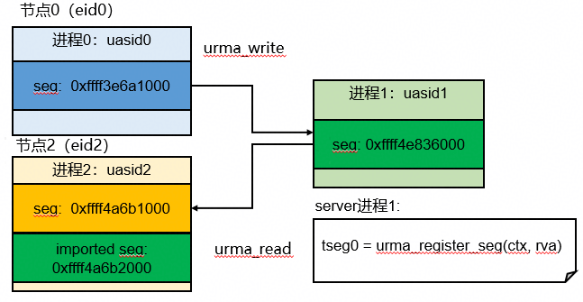

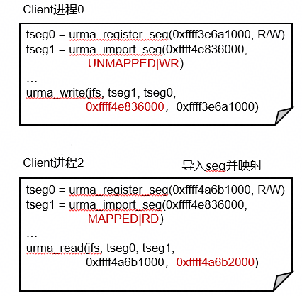

**One-sided Memory Access**:

- **Read**: The user (Initiator) initiates a URMA read transaction in the Jetty's Send Queue (SQ). The udma driver reads a Service Queue Element (SQE) from the SQ queue and parses the instruction information. The user's Transaction Processing Unit (TP) encapsulates the read request into a packet and sends it to the target (Target). After the target receives the request, the transaction engine reads data from the specified memory region. The target's TP encapsulates the data into a packet and sends it back to the user. After receiving the data, the user places it into the buffer specified by mr.

- **Write**: The user initiates a URMA write transaction in the Jetty's Send Queue. The user reads the SQE from the SQ and parses the information. Based on the SQE information, the user retrieves data from local memory, assembles it into a packet, and sends it to the target. After the target receives the packet, the transaction engine stores the data into the specified memory region. After the target completes the operation, it sends a Transaction Acknowledgment (TAACK) to the user. After receiving the TAACK, the user's TP encapsulates it into a packet and sends it to the user.

### 5.2.4 Asynchronous Events

1.  Overview

The hardware reports asynchronous events in the following situations: the application sends a WR that the hardware cannot process; access exceeds the permissions of local or remote memory; driver-side cq, sq, or rq queue overflow; driver unload; driver ELR reset; abnormal port status; etc.

The application obtains the type of the exception that occurred and the specific exception object: the exception context, port, JFS, JFC, JFR, etc. Asynchronous event handling is implemented through two interfaces: urma_get_async_event and urma_ack_async_event. These two interfaces are primarily used to handle asynchronous event notifications from kernel mode in user mode.


```c
/* softub currently only report URMA_EVENT_JFC_ERR and URMA_EVENT_JETTY_ERR; other events are not handled in softub;*/
URMA_EVENT_JFC_ERR,
URMA_EVENT_JFS_ERR,
URMA_EVENT_JFR_ERR,
URMA_EVENT_JFR_LIMIT, /* Jfr Flow Record,over flow */
URMA_EVENT_JETTY_ERR,
URMA_EVENT_JETTY_LIMIT, /* Jetty Flow Record,over flow */
URMA_EVENT_JETTY_GRP_ERR, /* Jetty Asynchronous Error Event Reporting */
URMA_EVENT_PORT_ACTIVE, /* The port status is currently active */
URMA_EVENT_PORT_DOWN, /* The port status is currently down */
URMA_EVENT_DEV_FATAL,
URMA_EVENT_EID_CHANGE, /* eid change, HNM and other management roles will be modified */
URMA_EVENT_ELR_ERR, /* ELR Reset,Entity level error */
```

URMA_EVENT_ELR_DONE /* Entity flush done */

2.  Application Scenario

URMA exception scenarios.

3.  Precautions

Before an application deletes an object (e.g., JFS, JFR, JFC, Jetty), if it has obtained an exception event generated by that object, it must call the acknowledge exception interface (urma_ack_async_event) before it can delete the object.

4.  Instructions for Use

(1) The user calls the urma_get_async_event interface to obtain the exception event.

(2) The user performs categorized handling based on the exception event type, such as printing log information.

(3) The user calls the urma_ack_async_event interface to notify UMDK that the exception has been handled.

1.  **urma_get_async_event:**

*  Function: This interface is used to obtain events from the URMA asynchronous event queue. When the kernel detects an exception or state change related to URMA resources (such as Jetty, JFC, JFS, etc.), it records these events into the asynchronous event queue. The user-mode driver polls this queue by calling urma_get_async_event to obtain the latest exception events.

*  Parameters: Typically requires a context pointer of type urma_context_t, which was created during urma_create_context and is used to communicate with the kernel.

*  Return Value: urma_get_async_event returns urma_status_t to inform the user of the function's completion status. A return value of 0 indicates success; other values indicate that the interface call failed, and the event pointer in the parameters points to the obtained event.

2.  **urma_ack_async_event:**

*  Function: urma_ack_async_event is used to acknowledge to the kernel that an exception event has been processed. After the user-mode driver obtains an event through urma_get_async_event and processes the relevant logic, it typically needs to call urma_ack_async_event to tell the kernel that this event has been processed and can be cleaned up or further handled.

*  Parameters: Typically requires the urma_async_event_t structure previously obtained from urma_get_async_event, so the kernel knows which event has been acknowledged.

#### 5.2.4.1 flush jetty

URMA supports flushing WRs in Jetty queues. The specific usage is divided into the following four scenarios:

1.  TP error causes the jetty to transition to the suspended state, with outstanding WRs.

(1) When there is an ordering requirement, the application needs to flush in order to retry WRs based on order.

(2) In JFS unordered mode, the application can go directly from suspend done to ready and continue sending.

(3) For SO-type WQEs, due to waiting, although the WQE has been taken to the TP but not yet processed, an ERR is reported at this time.

2.  TP error causes the jetty to transition to the suspended state; the hardware has no outstanding WRs, and the hardware constructs suspend done.

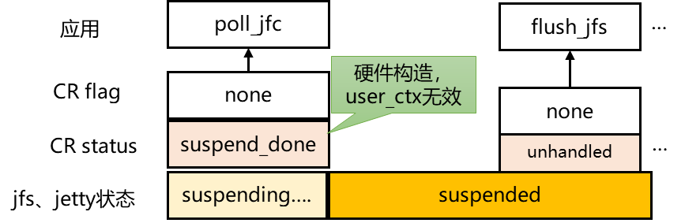

Scenarios where the hardware constructs suspend done:

(1) The application completes modifying the jetty to the suspend state.

3.  The hardware transitions the jetty to the error state, with outstanding WRs.

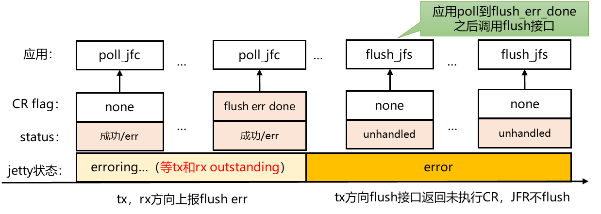

All outstanding TX and RX RQEs of the jetty must be completed and CQEs reported before flush err done can be reported, for the following reasons:

(1) If a packet is designated to the jetty and the hardware has already fetched an RQE from the JFR, it is considered an outstanding RQE.

(2) If the application does not wait for outstanding RQEs to complete, the software cannot safely release the RQE memory, as the hardware may still be accessing this memory.

(3) If the hardware reports flush done without waiting for outstanding RQEs to complete, there are two additional consequences: (a) the software may delete the jetty, in which case the hardware cannot report the RX CQE when the RQE completes; (b) the software may also create a new jetty with exactly the same jetty ID, in which case the hardware will report an incorrect RX CQE, leading to a serious error.

4.  The hardware or application transitions the jetty to the error state; the hardware constructs flush_err_done; the hardware has no outstanding WRs.

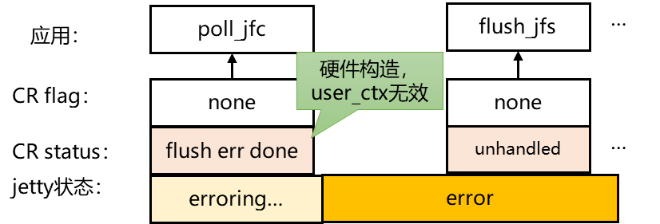

Scenarios where the hardware constructs flush_err_done:

(1) The application completes modifying the jetty to err.

(2) The hardware actively places the jetty into error state, but there are no outstanding WRs.

### 5.2.5 Device Attributes

UB device attributes can be roughly divided into three categories: read-only and immutable device resource specifications, readable and writable device configuration information, and read-only but variable device port status. Currently, the URMA framework presents these uniformly through the sysfs file system. The paths are as follows; these files can be directly operated using commands such as cat and echo:

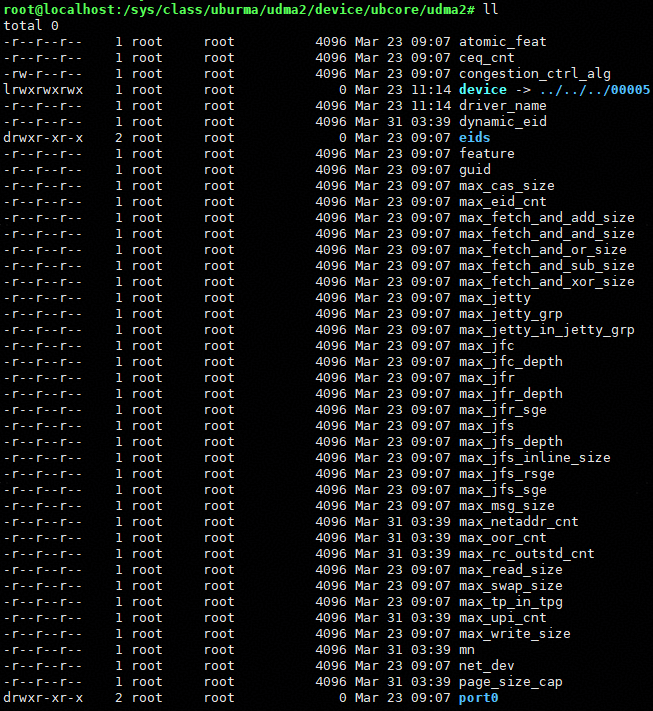

Details of device attributes are as follows:


The device attributes of the UB transport layer depend on the UB driver implementation.

1.  URMA Device Attributes

| Attribute | Readable | Writable | Variable | Remarks | UB | IB | IP |
|---|---|---|---|---|---|---|---|
| eid | √ | √ | √ | Device eid | √ | √ | √ |
| guid | √ | x | x | Device guid | √ | x | x |
| feature | √ | x | x | Features supported by the device, including OOO (out_of_order), jfc_per_wr, stride_op, load_store_op, non_pin, pmem (persistence_mem), etc. | √ | √ | √ |
| max_jfc | √ | x | x | Maximum number of JFCs the device supports creating | √ | √ | √ |
| max_jfs | √ | x | x | Maximum number of JFSs the device supports creating | √ | √ | √ |
| max_jfr | √ | x | x | Maximum number of JFRs the device supports creating | √ | √ | √ |
| max_jfc_depth | √ | x | x | Maximum configurable queue depth for JFC | √ | √ | √ |
| max_jfs_depth | √ | x | x | Maximum configurable queue depth for JFS | √ | √ | √ |
| max_jfr_depth | √ | x | x | Maximum configurable queue depth for JFR | √ | √ | √ |
| max_jfs_inline_len | √ | x | x | Maximum inline size supported by JFS for messages, in bytes | √ | √ | x |
| max_jfs_sge | √ | x | x | Maximum number of SGEs supported by JFS in a single WR | √ | √ | √ |
| max_jfr_sge | √ | x | x | Maximum number of SGEs supported by JFR in a single WR | √ | √ | √ |
| max_msg_size | √ | x | x | Maximum message size supported by the device for transmission, in bytes | √ | √ | x |
| tp_mode | √ | x | x | Device transport layer mode, enumeration values: SRM (shared reliable message), RC (reliable connection), UM (unreliable message) | √ | √ | √ |
| port_count | √ | x | x | Number of ports the device has | √ | √ | √ |
| max_mtu | √ | x | x | Maximum configurable MTU value for the port, enumeration values: MTU_256, MTU_512, MTU_1024, etc. | √ | √ | √ |
| state | √ | x | √ | Port status, enumeration values: PORT_DOWN, PORT_INIT, PORT_ARMED, PORT_ACTIVE, PORT_ACTIVE_DEFER | √ | √ | √ |
| active_width | √ | x | √ | Active link bandwidth of the port, enumeration values: WIDTH_X1, WIDTH_X2, WIDTH_X4 | √ | √ | x |
| active_speed | √ | x | √ | Active speed of the port, enumeration values: SP_10M, SP_100M, SP_1G, SP_10G, SP_25G, SP_40G, SP_100G, etc. | √ | √ | x |
| active_mtu | √ | x | √ | Active MTU value of the NIC device port, enumeration values: MTU_256, MTU_512, MTU_1024, etc. | √ | √ | √ |

URMA device attributes can be queried and configured using the urma_admin tool. See the tool demonstration chapter for specific usage.

### 5.2.6 Token Secure Transport

## 5.3 Data Plane

**Transport Modes — RM, RC, UM**

**URMA_TM_RC: Reliable Connection**

- Establishes a one-to-one binding relationship; messages can only be sent to the bound jetty, and segments within the target process can be accessed.

- **Guarantees reliability and supports ordering.**

- One jetty can only establish a connection with one target process for sending messages. One-to-many communication is not supported.

**URMA_TM_RM: Reliable Message**

- Multiple connection relationships are established between Jetties / between JFS and JFR. Messages can be sent to jetties/JFRs of different target processes on multiple nodes, and segments of different processes on multiple nodes can be accessed.

- **Guarantees reliability and supports ordered/unordered modes.**

- From JFS to a target process, ordering can only be enforced at the source end, which increases latency.

**URMA_TM_UM: Unreliable Message**

- No connection relationship exists between Jetties / between JFS and JFR. Messages can be sent to jetties/JFRs of different target processes on multiple nodes. One-sided semantics are not supported.

- **Reliability and ordering are not guaranteed.**

- Without a connection, ordering cannot be enforced, and the underlying layer does not guarantee reliability.

**Introduction to Reliability and Ordering**

**URMA_TM_RC: Reliable Connection**

- A unique TP connection exists between Jetties. WRs issued in order are executed in order at the destination.

- Natively supports FENCE ordering, execution ordering, and completion ordering.

- The underlying layer performs ACK and failure retransmission for data, guaranteeing reliability.

**URMA_TM_UM: Unreliable Message**

- No connection is created from the same jetty/JFS to the target process.

- Ordering is not guaranteed.

- The underlying layer does not guarantee reliability.

**URMA_TM_RM: Reliable Message**

- From the application perspective, one jetty/JFS can communicate with multiple remote jetties/JFRs, appearing as connectionless.

- Based on XRC implementation:

  - Only one jetty connection is created from the same jetty/JFS to the target process. WRs issued in order are executed in order at the destination.

  - Natively supports FENCE ordering, execution ordering, and completion ordering.

- Based on RC implementation: Execution ordering and completion ordering are not supported.

  - Multiple QP connections are created from the same jetty/JFS to the target process; ordered execution of WRs cannot be guaranteed.

The different transport modes are illustrated below:

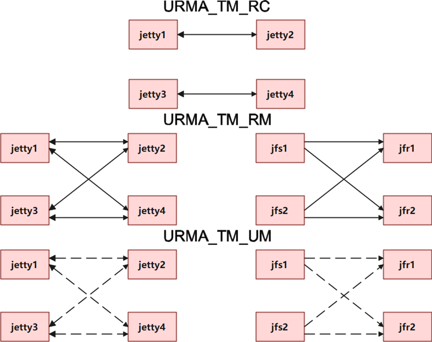

The support for contiguous/non-contiguous operation addresses by one-sided and two-sided operations is shown in the table below:

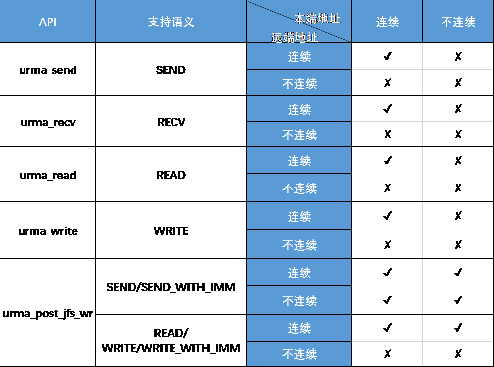


URMA over IP supports sending messages up to 1G in size — i.e., the sum of the lengths of all SGEs in one WR must not exceed 1G.

### 5.3.1 One-sided Operations

1.  Overview

UMDK one-sided operations provide read and write semantics, similar to IB's read/write interfaces. They require knowledge of the local address and the peer address. During one-sided operations, only the local process is operating; no awareness from the peer application is needed.

UMDK one-sided operation buffers support local contiguous memory, local non-contiguous memory, and remote contiguous memory. urma_read and urma_write only support reads and writes of contiguous addresses. urma_post_jfs_wr supports the local side accessing non-contiguous addresses in the form of SGL.

UMDK supports write operations with immediate data (see the urma_post_jfs_wr interface). The written immediate data will appear in the receiver's completion record.

According to the UB protocol, write and read operations support only one remote SGE. Therefore, for write operations, dst.num_sge must be 1; for read operations, src.num_sge must be 1. Excess SGEs will be ignored by the NIC.

In one-sided write operations, the fence flag in urma_jfs_wr_flag must be set to enable ordering. The maximum value for one-sided operations can be checked in the environment via `cat /sys/class/ubcore/udma1/max_write_size`.


2.  Application Scenario

UMDK one-sided operations do not require the peer CPU's involvement. Unlike two-sided send/recv operations, which are generally used for transmitting control information, one-sided read/write operations are suitable for large-scale data transfers.

3.  Precautions

(1) The user's local send and receive buffers must be registered with the device by calling urma_register_seg in advance.

(2) For the IB transport layer, before a JFS sends a message to a JFR, urma_advise_jfr must be called to notify UMDK to establish the transport channel from the JFS to the JFR. UB JFS natively has the capability for one-to-many communication, so the urma_advise_jfr step is not required before sending messages.

(3) The maximum send message size varies between different transport layers and can be obtained by querying the device attributes.

(4) The above one-sided, two-sided, and atomic operations are all non-blocking. A successful return only indicates that the command has been added to the send or receive queue; it does not mean that it has fully completed. UMDK supports learning whether a one-sided, two-sided, or atomic operation has completed through polling or interrupt mode. The completion record is used to describe the operation completion information. Once the operation completes, the hardware writes the completion record to the JFC Completion Queue. When the user polls the JFC, UMDK reads the completion records from the Completion Queue and returns them to the user. Completion records for one-sided, two-sided, atomic, etc. operations will by default be written to the JFC associated with the JFS or JFR. UB devices support specifying the JFC ID to which the completion record should be written in the JFS command (i.e., WQE).


URMA's one-sided semantic packets follow the general RDMA implementation in the industry and present security risks similar to RDMA, limited to use within trusted data center networks.

4.  Instructions for Use

The process for UMDK one-sided read/write is:

1.  Call urma_read, urma_write, or urma_post_jfs_wr to submit a read or write request to the previously registered JFS.

2.  Call urma_poll_jfc to poll and check whether a CQE has arrived in the JFC. When urma_poll_jfc returns a value greater than 0, it means a CQE has been polled, indicating that the read operation is complete. After the request completes, the user can reuse (modify or free) the send message buffer.

- **urma_post_jetty_send_wr**: This function is used to initiate a one-sided operation request, such as writing to remote memory. Function parameters include jetty (the port for command execution), wr (the send request containing information such as source address, destination address, and length), and bad_wr (used to store the WR that failed to send). If the operation is successful, the function returns 0; otherwise, it returns an error code.

- **urma_read**: This function allows the application to read data from remote memory, also without the involvement of the remote process.

- **urma_write**: This function allows the application to write data to remote memory, also without requiring a response from the remote process. Note: URMA's one-sided write operation does not support notifying the remote side, but does support carrying IMM (Immediate) data — a small block of data that can be appended to a message for conveying additional information.

- 

### 5.3.2 Two-sided Operations

1.  Overview

Message semantics provide two-sided Messaging services, similar to UDP/TCP socket interfaces or IB's send/receive interfaces. UMDK's message semantics are asynchronous and non-blocking. The message receiver must explicitly receive messages, and after receiving, read the message before proceeding with other processing.

UMDK supports one-to-many message semantics: sending messages from the same JFS to different JFRs, which may be located on different remote nodes or processes.

UMDK supports sending messages inline. When the message size is smaller than the UMDK inline threshold, UMDK will automatically send the message inline, reducing DMA overhead to improve send performance.

UMDK two-sided operations support both contiguous and non-contiguous memory for both the local and remote sides. urma_send and urma_recv only support contiguous addresses. urma_post_jfs_wr and urma_post_jfr_wr support the local and remote sides using contiguous addresses or SGL-type non-contiguous addresses.

UMDK supports sending immediate data to the receiver (see the urma_post_jfs_wr interface). The sent immediate data will appear in the receiver's completion record.

2.  Application Scenario

Message semantics are widely applicable — for example, implementing MPI send/recv message passing, RPC semantics, implementing UCX AM message semantics, etc.

3.  Precautions

(1) The user's local send and receive buffers must be registered with the device by calling urma_register_seg in advance.

(2) For the IB transport layer, before a JFS sends a message to a JFR, urma_advise_jfr must be called to notify UMDK to establish the transport channel from the JFS to the JFR. UB JFS natively has the capability for one-to-many communication, so the urma_advise_jfr step is not required before sending messages.

(3) The maximum send message size varies between different transport layers and can be obtained by querying the device attributes.

4.  Instructions for Use

The message receive process is:

(1) Call urma_recv or urma_post_jfr_wr to submit a receive request, adding the local receive buffer to the JFR.

(2) Call urma_poll_jfc to poll the receive request. Once the request completes, the user can read the message content from the receive buffer.

To improve throughput, the server side can submit multiple receive requests in batch. After each successful message reception, supplement the JFR with a new receive request. Alternatively, when the number of receive requests in the JFR falls below a certain threshold, supplement the JFR with new receive requests.

The receiver learns the specific effective message length received through the receive length in the completion record, and also learns through the completion record whether the sender sent immediate data.

The message send process is:

(1) The user calls urma_send or urma_post_jfs_wr to submit a send request through the JFS.

(2) Call urma_poll_jfc to poll the receive request. Once the request completes, the user can reuse (modify or free) the send message buffer.

- **urma_post_jetty_send_wr**: In two-sided operations, this function is also used to initiate requests, but the sent data may be received and processed by the remote process.

- **urma_recv**: The receiver uses this function to receive data from remote memory.

- **urma_send**: The sender uses this function to send data to remote memory. It supports carrying IMM data and can be set to with invalid, meaning the operation will continue even if the target address is invalid.

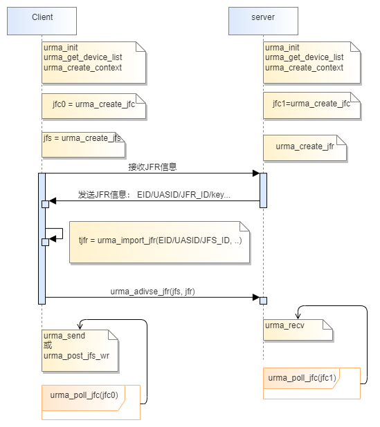

### 5.3.3 Completion Records

1.  Overview

The one-sided, two-sided, and atomic operations described above are all non-blocking. A successful return only indicates that the command has been added to the send or receive queue; it does not mean that it has fully completed. UMDK supports learning whether a one-sided, two-sided, or atomic operation has completed through polling or interrupt mode. The completion record is used to describe the operation completion information. Once the operation completes, the hardware writes the completion record to the JFC Completion Queue. When the user polls the JFC, UMDK reads the completion records from the Completion Queue and returns them to the user.

Completion records for one-sided, two-sided, atomic, etc. operations will by default be written to the JFC associated with the JFS or JFR. UB devices support specifying the JFC ID to which the completion record should be written in the JFS command (i.e., WQE).

2.  Application Scenario

The polling mode is used in low-latency scenarios. The user continuously queries completion records to obtain the execution status of operations for the next step. Continuous polling increases CPU utilization. The interrupt mode is used in scenarios where communication is less frequent. The user thread waits for completion events in a sleep state, incurring low CPU overhead. When a completion event occurs, UMDK wakes the waiting thread.

3.  Precautions

(1) When the user calls urma_recv, a completion record is always generated upon receive completion. When the user calls urma_read/write/cas/fao/send, the default operation generates a completion record. If the JFC is in the event-enabled (armed) state, it will also by default generate a completion event.

(2) If the user uses urma_post_jfs_wr to send requests in batch, the user can specify whether to generate a completion record or completion event.

(3) When the user submits an operation (including one-sided, two-sided, atomic, etc.), they must ensure themselves that the JFC to which the completion record is to be written will not overflow.

(4) If there are unread completion records remaining in the JFC, urma_rearm_jfc will return failure.

(5) When urma_modify_jetty/jfs transitions to the ERROR/SUSPEND state, a completion record is generated. The user must ensure themselves that the JFC to which the completion record is to be written will not overflow.

4.  Instructions for Use

The flow for waiting for completion events in interrupt mode is as follows:

(1) Call urma_rearm_jfc to enable completion events.

(2) Submit JFS operations (including one-sided, two-sided, atomic, etc.), specifying whether completion records and completion events are required.

(3) Call urma_wait_jfc to block and wait for a completion event; the JFC that generated the completion event is returned. UMDK will by default disable the JFC completion event.

(4) Verify that the returned JFC matches the JFC used for the submitted JFS operations.

(5) Loop calling urma_poll_jfc to read completion records until no new completion records remain.

(6) Return to step (1) to re-enable events.


The flow for polling completion events is as follows:

The user calls urma_poll_jfc to query completion records in polling mode. Polling is a non-blocking way to query completion records. If the Completion Queue is empty, the user cannot obtain any completion records. Instructions for using completion records are as follows:

(1) The user learns whether the operation completed successfully through the status field of the completion record. If an error occurred, the status field of the completion record reflects the cause of the operation error.

(2) The completion length indicates the length of data that was successfully executed, such as the send length or the received message length.

(3) If the completion record is of JFS type, the user can modify or free the local buffer corresponding to the operation.

(4) If the completion record is of JFR type, it indicates that the user can read the message from the receive buffer.

(5) If the notify_data flag is enabled, the completion record also carries immediate data.

(6) The user associates the completion with a specific operation through the operation context (e.g., the user_ctx parameter in the urma_read API) in the completion_record_data of the completion record.

**Recommended Order of Interrupt Interface Calls:**

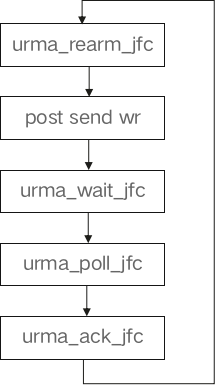

5.  Triggering Scenarios

The following scenarios trigger the JFC to generate a completion record:

1. During regular data plane operations, if an unsupported operation type is encountered, the message length exceeds the system-allowed limit, the request format does not comply with specification requirements, or local or peer memory resources being accessed have been deregistered — on the premise that the work request submission operation succeeded — a completion record is generated.

2. A Flush operation completes normally without any exceptions or errors.

3. Jetty/JFS successfully transitions to the SUSPEND state.

4. Jetty/JFS successfully transitions to the ERROR state.

---
# 6 Key Features

## 6.1 Feature Tree

#### Management Interface

| Feature L1 | Feature L2 | Feature L3 | Feature L4 | Feature L5 | Feature Description | KP950 | ST910D |
|---|---|---|---|---|---|---|---|
| Management Interface | URMA Init | init/uninit | Basic capability | — | Initialize/uninitialize URMA runtime | √ | √ |
| Management Interface | URMA Init | init/uninit | token | — | Specify security token | × | × |
| Management Interface | URMA Init | init/uninit | uasid | — | Specify process uasid | × | × |
| Management Interface | Device & Context Mgmt | get/free_device_list | — | — | Get/free device list | √ | √ |
| Management Interface | Device & Context Mgmt | get_device_by_name | — | — | Get device by name | √ | √ |
| Management Interface | Device & Context Mgmt | get_device_by_eid | — | — | Get device by EID | √ | √ |
| Management Interface | Device & Context Mgmt | query_device | — | — | Query device attributes | √ | √ |
| Management Interface | Device & Context Mgmt | create/delete_context | — | — | Create/delete device context | √ | √ |
| Management Interface | JFC Basic Capability | create/delete_jfc | Basic capability | — | Create/delete JFC | √ | √ |
| Management Interface | JFC Basic Capability | create/delete_jfc | cfg.flag.jfc_inline | — | Support inline config | √ | √ |
| Management Interface | JFC Basic Capability | delete_jfc_batch | — | — | Batch delete JFC | × | × |
| Management Interface | JFC Basic Capability | modify_jfc | moderate_count/moderate_period | — | Modify JFC interrupt suppression params | × | × |
| Management Interface | JFS Basic Capability | create/delete_jfs | Basic capability | — | Create/delete JFS | √ | √ |
| Management Interface | JFS Basic Capability | create/delete_jfs | lock_free | — | Lock-free mode | √ | √ |
| Management Interface | JFS Basic Capability | create/delete_jfs | error_suspend | — | Data plane error suspend | √ | √ |
| Management Interface | JFS Basic Capability | create/delete_jfs | outorder_comp | — | Out-of-order completion reporting | √ | √ |
| Management Interface | JFS Basic Capability | create/delete_jfs | order_type | OT | target ordering | √ | √ |
| Management Interface | JFS Basic Capability | create/delete_jfs | order_type | OI | initiator ordering | √ | √ |
| Management Interface | JFS Basic Capability | create/delete_jfs | order_type | OL | low layer ordering (hardware) | √ | √ |
| Management Interface | JFS Basic Capability | create/delete_jfs | order_type | UNO | unreliable non ordering | √ | √ |
| Management Interface | JFS Basic Capability | create/delete_jfs | multi_path | — | Device multi-path capability | √ | √ |
| Management Interface | JFS Basic Capability | create/delete_jfs | ctp_rc_mul_path_mode | — | Multi-path for CTP in RC mode | √ | √ |
| Management Interface | JFS Basic Capability | create/delete_jfs | trans_mode | RM | Reliable message mode | √ | √ |
| Management Interface | JFS Basic Capability | create/delete_jfs | trans_mode | RC | Reliable connection mode | √ | √ |
| Management Interface | JFS Basic Capability | create/delete_jfs | trans_mode | UM | Unreliable message mode | √ | √ |
| Management Interface | JFS Basic Capability | create/delete_jfs | priority | — | Configure priority | √ | √ |
| Management Interface | JFS Basic Capability | create/delete_jfs | max_inline_data | — | Configure inline size | √ | √ |
| Management Interface | JFS Basic Capability | create/delete_jfs | rnr_retry | — | Configure RNR retry count | √ | √ |
| Management Interface | JFS Basic Capability | create/delete_jfs | err_timeout | — | Configure error timeout | √ | √ |
| Management Interface | JFS Basic Capability | delete_jfs_batch | — | — | Batch delete JFS | √ | √ |
| Management Interface | JFS Basic Capability | modify_jfs | state | — | Modify JFS state machine | √ | √ |
| Management Interface | JFR Basic Capability | create/delete_jfr | Basic capability | — | Create/delete JFR | √ | √ |
| Management Interface | JFR Basic Capability | create/delete_jfr | Specify jfr_id | — | Specify JFR ID | √ | √ |
| Management Interface | JFR Basic Capability | create/delete_jfr | token_policy | NONE | No TokenValue | √ | √ |
| Management Interface | JFR Basic Capability | create/delete_jfr | token_policy | PLAIN_TEXT | Plain text TokenValue | √ | √ |
| Management Interface | JFR Basic Capability | create/delete_jfr | token_policy | SIGNED | Encrypted TokenValue, plain PLD | √ | √ |
| Management Interface | JFR Basic Capability | create/delete_jfr | token_policy | ALL_ENCRYPTED | All encrypted | × | × |
| Management Interface | JFR Basic Capability | create/delete_jfr | lock_free | — | Lock-free mode | √ | √ |
| Management Interface | JFR Basic Capability | create/delete_jfr | order_type | OT | target ordering | √ | √ |
| Management Interface | JFR Basic Capability | create/delete_jfr | order_type | OI | initiator ordering | √ | √ |
| Management Interface | JFR Basic Capability | create/delete_jfr | order_type | OL | low layer ordering (hardware) | √ | √ |
| Management Interface | JFR Basic Capability | create/delete_jfr | order_type | UNO | unreliable non ordering | √ | √ |
| Management Interface | JFR Basic Capability | create/delete_jfr | trans_mode | RM | Reliable message mode | √ | √ |
| Management Interface | JFR Basic Capability | create/delete_jfr | trans_mode | RC | Reliable connection mode | √ | √ |
| Management Interface | JFR Basic Capability | create/delete_jfr | trans_mode | UM | Unreliable message mode | √ | √ |
| Management Interface | JFR Basic Capability | create/delete_jfr | min_rnr_timer | — | Configure min RNR timer | √ | √ |
| Management Interface | JFR Basic Capability | delete_jfr_batch | — | — | Batch delete JFR | √ | √ |
| Management Interface | JFR Basic Capability | modify_jfr | rx_threshold | — | Modify RX WQ low watermark | √ | √ |
| Management Interface | JFR Basic Capability | modify_jfr | state | — | Modify JFR state machine | √ | √ |
| Management Interface | JFR Basic Capability | import/unimport_jfr | — | — | Import/unimport remote JFR | √ | √ |
| Management Interface | JFR Basic Capability | import_jfr_async | — | — | Async import source JFR | √ | √ |
| Management Interface | Jetty Basic Capability | create/delete_jetty | Basic capability | — | Create/delete Jetty | √ | √ |
| Management Interface | Jetty Basic Capability | create/delete_jetty | jetty_cfg | — | Config same as JFS & JFR | √ | √ |
| Management Interface | Jetty Basic Capability | create/delete_jetty | jetty_id | — | Specify jetty id | √ | √ |
| Management Interface | Jetty Basic Capability | create/delete_jetty | share_jfr | — | Configure shared JFR | √ | √ |
| Management Interface | Jetty Basic Capability | create/delete_jetty | jetty_grp | — | Configure Jetty Group | × | × |
| Management Interface | Jetty Basic Capability | delete_jetty_batch | — | — | Batch delete Jetty | √ | √ |
| Management Interface | Jetty Basic Capability | modify_jetty | state | — | Modify Jetty state | √ | √ |
| Management Interface | Jetty Basic Capability | modify_jetty | rx_threshold | — | Modify RX WQ low watermark | × | × |
| Management Interface | Jetty Basic Capability | import/unimport_jetty | Basic capability | — | Import/unimport remote jetty | √ | √ |
| Management Interface | Jetty Basic Capability | import/unimport_jetty | tp_type | RTP | Reliable transport mode | √ | √ |
| Management Interface | Jetty Basic Capability | import/unimport_jetty | tp_type | CTP | Lightweight transport mode | √ | √ |
| Management Interface | Jetty Basic Capability | import/unimport_jetty | tp_type | UTP | Unreliable transport mode | √ | √ |
| Management Interface | Jetty Basic Capability | bind/unbind_jetty | — | — | Bind/unbind remote jetty | √ | √ |
| Management Interface | Jetty Basic Capability | import_jetty_async | — | — | Async import remote Jetty | × | × |
| Management Interface | Jetty Basic Capability | bind_jetty_async | — | — | Async bind source Jetty | × | × |
| Management Interface | JFCE Basic Capability | create/delete_jfce | — | — | Create/delete JFCE | √ | √ |
| Management Interface | Async Event Report | get_async_event | Query jetty exception | — | Query jetty async exception | √ | √ |
| Management Interface | Async Event Report | get_async_event | Port exception | — | Port async exception | √ | √ |
| Management Interface | Async Event Report | get_async_event | Device exception | — | Device async exception | √ | √ |
| Management Interface | Async Event Report | get_async_event | Entity exception | — | Entity async exception | √ | √ |
| Management Interface | Async Event Report | ack_async_event | — | — | Acknowledge async events | √ | √ |
| Management Interface | Segment Management | register/unregister_seg | Basic function | — | Register/unregister memory | √ | √ |
| Management Interface | Segment Management | register/unregister_seg | token_policy | — | Specify key verification policy | √ | √ |
| Management Interface | Segment Management | register/unregister_seg | cacheable | — | Enable caching | √ | √ |
| Management Interface | Segment Management | register/unregister_seg | access | LOCAL_ONLY | Local access only | √ | √ |
| Management Interface | Segment Management | register/unregister_seg | access | ACCESS_READ | Remote read access | √ | √ |
| Management Interface | Segment Management | register/unregister_seg | access | ACCESS_WRITE | Remote write access | √ | √ |
| Management Interface | Segment Management | register/unregister_seg | access | ACCESS_ATOMIC | Remote atomic access | √ | √ |
| Management Interface | Segment Management | register/unregister_seg | non_pin | — | Support non-pinned memory | × | × |
| Management Interface | Segment Management | register/unregister_seg | user_iova | — | Use IOVA | × | × |
| Management Interface | Segment Management | register/unregister_seg | token_id_valid | — | Specify token_id | √ | √ |
| Management Interface | Segment Management | import/unimport_seg | Basic function | — | Import/unimport remote memory | √ | √ |
| Management Interface | Segment Management | import/unimport_seg | cacheable | — | Enable caching | √ | √ |
| Management Interface | Segment Management | import/unimport_seg | mapping | — | Map to local address | √ | √ |
| Management Interface | JFC Extended Capability | alloc/free_jfc | — | — | Allocate/free JFC memory | √ | √ |
| Management Interface | JFC Extended Capability | active/deactive_jfc | — | — | Hardware enable/disable JFC | √ | √ |
| Management Interface | JFC Extended Capability | set/get_jfc_opt | Basic capability | — | Set/get JFC attributes | √ | √ |
| Management Interface | JFC Extended Capability | set/get_jfc_opt | Basic attributes | — | Basic JFC creation attributes | √ | √ |
| Management Interface | JFC Extended Capability | set/get_jfc_opt | CQE_BASE_ADDR | — | CQE base address | √ | √ |
| Management Interface | JFC Extended Capability | set/get_jfc_opt | JFC_ID | — | JFC ID | √ | √ |
| Management Interface | JFC Extended Capability | set/get_jfc_opt | JFC_DB_ADDR | — | CQ Doorbell address | √ | √ |
| Management Interface | JFC Extended Capability | set/get_jfc_opt | JFC_DB_STATUS | — | JFC Doorbell status | × | × |
| Management Interface | JFC Extended Capability | set/get_jfc_opt | JFC_PI | — | JFC queue PI value | √ | √ |
| Management Interface | JFC Extended Capability | set/get_jfc_opt | JFC_PI_TYPE | — | JFC queue PI type | √ | √ |
| Management Interface | JFC Extended Capability | set/get_jfc_opt | JFC_CI | — | JFC queue CI value | √ | √ |
| Management Interface | JFS Extended Capability | alloc/free_jfs | — | — | Allocate/free JFS memory | √ | √ |
| Management Interface | JFS Extended Capability | active/deactive_jfs | — | — | Hardware enable/disable JFS | √ | √ |
| Management Interface | JFS Extended Capability | set/get_jfs_opt | Basic capability | — | Set/get JFS attributes | √ | √ |
| Management Interface | JFR Extended Capability | alloc/free_jfr | — | — | Allocate/free JFR memory | √ | √ |
| Management Interface | JFR Extended Capability | active/deactive_jfr | — | — | Hardware enable/disable JFR | √ | √ |
| Management Interface | JFR Extended Capability | set/get_jfr_opt | Basic capability | — | Set/get JFR attributes | √ | √ |
| Management Interface | Jetty Extended Capability | alloc/free_jetty | — | — | Allocate/free JETTY memory | √ | √ |
| Management Interface | Jetty Extended Capability | active/deactive_jetty | — | — | Hardware enable/disable JETTY | √ | √ |
| Management Interface | Jetty Extended Capability | set/get_jetty_opt | Basic capability | — | Set/get JETTY attributes | √ | √ |
| Management Interface | TP-Aware Connection | get_tp_list | — | — | Static query of available TPs | √ | √ |
| Management Interface | TP-Aware Connection | get/set_tp_attr | — | — | Get/set TP attributes | √ | √ |
| Management Interface | TP-Aware Connection | import_jetty_ex | — | — | Specify TP connection | √ | √ |
| Management Interface | Device Aggregation | Basic capability | — | — | Create context with aggregation device | √ | √ |
| Management Interface | Device Aggregation | Configure topology | — | — | Configure aggregation topology | √ | √ |
| Management Interface | IP over URMA | Basic capability | — | — | TCP/IP stack over URMA | √ | √ |
| Management Interface | Verbs over URMA | Basic capability | — | — | RDMA stack over URMA | √ | √ |

#### Data Plane Interface

| Feature L1 | Feature L2 | Feature L3 | Feature L4 | Feature L5 | Feature Description | KP950 | ST910D |
|---|---|---|---|---|---|---|---|
| Data Plane Interface | post Operations | post_jfs_wr | — | — | Post JFS work request | √ | √ |
| Data Plane Interface | post Operations | post_jfr_wr | — | — | Post JFR work request | √ | √ |
| Data Plane Interface | post Operations | post_jetty_send_wr | — | — | Post Jetty send work request | √ | √ |
| Data Plane Interface | post Operations | post_jetty_recv_wr | — | — | Post Jetty recv work request | √ | √ |
| Data Plane Interface | Send Configuration | Execution order | none | — | No ordering | √ | √ |
| Data Plane Interface | Send Configuration | Execution order | RO | — | Relaxed ordering | √ | √ |
| Data Plane Interface | Send Configuration | Execution order | SO | — | Strong ordering | √ | √ |
| Data Plane Interface | Send Configuration | Completion order | — | — | Maintain completion order | √ | √ |
| Data Plane Interface | Send Configuration | fence operation | — | — | Fence operation | √ | √ |
| Data Plane Interface | Send Configuration | solicited enable | — | — | Solicited enable | √ | √ |
| Data Plane Interface | Send Configuration | Config completion event | — | — | Configure completion event | √ | √ |
| Data Plane Interface | Send Configuration | Config inline | — | — | Configure inline | √ | √ |
| Data Plane Interface | Send Configuration | import-free seg | — | — | Support import-free segment | todo | todo |
| Data Plane Interface | Memory Continuity | sgl config | Non-contiguous remote send/recv & local read/write/send/recv | — | SGL support | √ | √ |
| Data Plane Interface | Memory Continuity | wr_list config | — | — | WR list configuration | √ | √ |
| Data Plane Interface | One-sided Operations | read | Only 1 src sge | — | Read operation | √ | √ |
| Data Plane Interface | One-sided Operations | write | Only 1 dst sge | — | Write operation | √ | √ |
| Data Plane Interface | One-sided Operations | write | Support remote notify | — | Support remote notify | √ | √ |
| Data Plane Interface | One-sided Operations | write | Support IMM data | — | Support IMM data | √ | √ |
| Data Plane Interface | One-sided Operations | write | write_with_atomic_add | — | Write with atomic add | √ | √ |
| Data Plane Interface | Two-sided Operations | send | — | — | Send operation | √ | √ |
| Data Plane Interface | Two-sided Operations | send | Support IMM data | — | Support IMM data | √ | √ |
| Data Plane Interface | Two-sided Operations | send | with invalid | — | Send with invalid | √ | √ |
| Data Plane Interface | Two-sided Operations | recv | — | — | Receive operation | √ | √ |
| Data Plane Interface | Atomic Operations | cas | — | — | Compare and swap | × | × |
| Data Plane Interface | Atomic Operations | cas | Support mask | — | CAS with mask | × | × |
| Data Plane Interface | Atomic Operations | faa | — | — | Fetch and add | × | × |
| Data Plane Interface | Atomic Operations | faa | Support mask | — | FAA with mask | × | × |
| Data Plane Interface | Completion Operations | poll_jfc | Support multiple CRs | — | Poll JFC for completion records | √ | √ |
| Data Plane Interface | Completion Operations | poll_jfc | CR parsing | status | Completion status | √ | √ |
| Data Plane Interface | Completion Operations | poll_jfc | CR parsing | flag.s_r | Send or receive completion | √ | √ |
| Data Plane Interface | Completion Operations | poll_jfc | CR parsing | opcode | Opcode from sender in receiver CR | √ | √ |
| Data Plane Interface | Completion Operations | poll_jfc | CR parsing | user_ctx | User context private data | √ | √ |
| Data Plane Interface | Completion Operations | poll_jfc | CR parsing | completion_len | Completion length | √ | √ |
| Data Plane Interface | Completion Operations | poll_jfc | CR parsing | local_id | Local jetty_id | √ | √ |
| Data Plane Interface | Completion Operations | poll_jfc | CR parsing | remote_id | Remote jetty info in receiver CR | √ | √ |
| Data Plane Interface | Completion Operations | poll_jfc | CR parsing | imm_data | IMM data | √ | √ |
| Data Plane Interface | Completion Operations | rearm_jfc | — | — | Rearm JFC | √ | √ |
| Data Plane Interface | Completion Operations | rearm_jfc | solicited_only | — | Only for solicited packets | √ | √ |
| Data Plane Interface | Completion Operations | wait_jfc | — | — | Wait for events from multiple JFCs | √ | √ |
| Data Plane Interface | Completion Operations | ack_jfc | — | — | Acknowledge events processed | √ | √ |

#### DFX Interface

| Feature L1 | Feature L2 | Feature L3 | Feature L4 | Feature L5 | Feature Description | KP950 | ST910D |
|---|---|---|---|---|---|---|---|
| DFX Interface | urma_admin Config | eid | — | — | Configure EID | × | × |
| DFX Interface | urma_admin Config | upi | PF config | — | PF UPI config | × | × |
| DFX Interface | urma_admin Config | upi | VF config | — | VF UPI config | × | × |
| DFX Interface | urma_admin Query | Device list | — | — | Query all devices basic info | — | — |
| DFX Interface | urma_admin Query | Device attributes | device_cap | feature | Hardware features | √ | √ |
| DFX Interface | urma_admin Query | Device attributes | device_cap | max_jfc | Max JFC count | √ | √ |
| DFX Interface | urma_admin Query | Device attributes | device_cap | max_jfs | Max JFS count | √ | √ |
| DFX Interface | urma_admin Query | Device attributes | device_cap | max_jfr | Max JFR count | √ | √ |
| DFX Interface | urma_admin Query | Device attributes | device_cap | max_jetty | Max jetty count | √ | √ |
| DFX Interface | urma_admin Query | Device attributes | device_cap | max_jetty_in_jetty_grp | Max jetty group count | √ | √ |
| DFX Interface | urma_admin Query | Device attributes | device_cap | jfc_depth | Max JFC depth | √ | √ |
| DFX Interface | urma_admin Query | Device attributes | device_cap | jfs_depth | Max JFS depth | √ | √ |
| DFX Interface | urma_admin Query | Device attributes | device_cap | jfr_depth | Max JFR depth | √ | √ |
| DFX Interface | urma_admin Query | Device attributes | device_cap | max_jfs_inline_size | Max inline size | √ | √ |
| DFX Interface | urma_admin Query | Device attributes | device_cap | max_jfs_sge | Max SGE count in JFS | √ | √ |
| DFX Interface | urma_admin Query | Device attributes | device_cap | max_jfs_rsge | Max RSGE count in JFS | √ | √ |
| DFX Interface | urma_admin Query | Device attributes | device_cap | max_jfr_sge | Max SGE count in JFR | √ | √ |
| DFX Interface | urma_admin Query | Device attributes | device_cap | max_msg_size | Max message size | √ | √ |
| DFX Interface | urma_admin Query | Device attributes | device_cap | max_read_size | Max read size | √ | √ |
| DFX Interface | urma_admin Query | Device attributes | device_cap | max_write_size | Max write size | √ | √ |
| DFX Interface | urma_admin Query | Device attributes | device_cap | max_cas_size | Max CAS size | √ | √ |
| DFX Interface | urma_admin Query | Device attributes | device_cap | max_swap_size | Max swap size | √ | √ |
| DFX Interface | urma_admin Query | Device attributes | device_cap | max_fetch_and_add_size | Max fetch_and_add size | √ | √ |
| DFX Interface | urma_admin Query | Device attributes | device_cap | max_fetch_and_sub_size | Max fetch_and_sub size | √ | √ |
| DFX Interface | urma_admin Query | Device attributes | device_cap | max_fetch_and_and_size | Max fetch_and_and size | √ | √ |
| DFX Interface | urma_admin Query | Device attributes | device_cap | max_fetch_and_or_size | Max fetch_and_or size | √ | √ |
| DFX Interface | urma_admin Query | Device attributes | device_cap | max_fetch_and_xor_size | Max fetch_and_xor size | √ | √ |
| DFX Interface | urma_admin Query | Device attributes | device_cap | atomic_feat | Atomic operation features | √ | √ |
| DFX Interface | urma_admin Query | Device attributes | device_cap | trans_mode | Transport modes | √ | √ |
| DFX Interface | urma_admin Query | Device attributes | device_cap | congestion_ctrl_alg | Congestion control algorithms | √ | √ |
| DFX Interface | urma_admin Query | Device attributes | device_cap | ceq_cnt | CEQ count | √ | √ |
| DFX Interface | urma_admin Query | Device attributes | device_cap | max_tp_in_tpg | Max TPs in TPG | √ | √ |
| DFX Interface | urma_admin Query | Device attributes | device_cap | max_eid_cnt | Max EID count | √ | √ |
| DFX Interface | urma_admin Query | Device attributes | device_cap | page_size_cap | Page size capability | √ | √ |
| DFX Interface | urma_admin Query | Device attributes | device_cap | max_oor_cnt | Max OOR count | √ | √ |
| DFX Interface | urma_admin Query | Device attributes | device_cap | mn | Manufacturer name | √ | √ |
| DFX Interface | urma_admin Query | Device attributes | device_cap | max_netaddr_cnt | Max net address count | √ | √ |
| DFX Interface | urma_admin Query | Device attributes | device_cap | rm_order_cap | RM ordering capability | √ | √ |
| DFX Interface | urma_admin Query | Device attributes | device_cap | rc_order_cap | RC ordering capability | √ | √ |
| DFX Interface | urma_admin Query | Device attributes | device_cap | rm_tp_cap | RM TP capability | √ | √ |
| DFX Interface | urma_admin Query | Device attributes | device_cap | rc_tp_cap | RC TP capability | √ | √ |
| DFX Interface | urma_admin Query | Device attributes | device_cap | um_tp_cap | UM TP capability | √ | √ |
| DFX Interface | urma_admin Query | Device attributes | device_cap | tp_feature | TP features | √ | √ |
| DFX Interface | urma_admin Query | Device attributes | device_cap | priority_info | Priority information | √ | √ |
| DFX Interface | urma_admin Query | Device attributes | port_cnt | — | Port count | √ | √ |
| DFX Interface | urma_admin Query | Device attributes | port_attr | max_mtu | Max MTU | √ | √ |
| DFX Interface | urma_admin Query | Device attributes | port_attr | state | Port state | √ | √ |
| DFX Interface | urma_admin Query | Device attributes | port_attr | active_width | Active link width | √ | √ |
| DFX Interface | urma_admin Query | Device attributes | port_attr | active_speed | Active link speed | √ | √ |
| DFX Interface | urma_admin Query | Device attributes | port_attr | active_mtu | Active MTU | √ | √ |
| DFX Interface | urma_admin Query | Topology information | UE | cna | CNA EID of each UE port printed by `urma_admin show topo [NODE_ID]`; `Invalid EID` means the port has no valid CNA EID. | √ | √ |
| DFX Interface | urma_admin Query | upi | — | — | UPI query | — | — |
| DFX Interface | urma_perftest | Test type config | send_lat | — | Send latency test | √ | √ |
| DFX Interface | urma_perftest | Test type config | read_lat | — | Read latency test | √ | √ |
| DFX Interface | urma_perftest | Test type config | write_lat | — | Write latency test | √ | √ |
| DFX Interface | urma_perftest | Test type config | atomic_lat | — | Atomic latency test | √ | √ |
| DFX Interface | urma_perftest | Test type config | send_bw | — | Send bandwidth test | √ | √ |
| DFX Interface | urma_perftest | Test type config | read_bw | — | Read bandwidth test | √ | √ |
| DFX Interface | urma_perftest | Test type config | write_bw | — | Write bandwidth test | √ | √ |
| DFX Interface | urma_perftest | Test type config | atomic_bw | — | Atomic bandwidth test | √ | √ |
| DFX Interface | urma_perftest | Run param config | all | — | Run 2~2^15 range by powers of 2 | √ | √ |
| DFX Interface | urma_perftest | Run param config | atomic_type | — | Atomic type: cas/faa | √ | √ |
| DFX Interface | urma_perftest | Run param config | simplex_mode | — | Simplex jfs/jfr mode | √ | √ |
| DFX Interface | urma_perftest | Run param config | bidirectional | — | Bidirectional mode | √ | √ |
| DFX Interface | urma_perftest | Run param config | jfc_depth | — | JFC depth | √ | √ |
| DFX Interface | urma_perftest | Run param config | dev | — | Device name | √ | √ |
| DFX Interface | urma_perftest | Run param config | duration | — | Test duration | √ | √ |
| DFX Interface | urma_perftest | Run param config | use_jfce | — | Use interrupt notification | √ | √ |
| DFX Interface | urma_perftest | Run param config | eid_idx | — | EID index | √ | √ |
| DFX Interface | urma_perftest | Run param config | err_timeout | — | Error report timeout | √ | √ |
| DFX Interface | urma_perftest | Run param config | user_flat_api | — | Use flat APIs | √ | √ |
| DFX Interface | urma_perftest | Run param config | cpu_freq_f | — | CPU freq threshold warning | √ | √ |
| DFX Interface | urma_perftest | Run param config | help | — | Help mode | √ | √ |
| DFX Interface | urma_perftest | Run param config | inline_size | — | Inline size | √ | √ |
| DFX Interface | urma_perftest | Run param config | share_jfr | — | Share JFR on jetty creation | √ | √ |
| DFX Interface | urma_perftest | Run param config | jettys | — | Jetty/jfs/jfr count | √ | √ |
| DFX Interface | urma_perftest | Run param config | token_policy | — | Token transport policy | √ | √ |
| DFX Interface | urma_perftest | Run param config | iters | — | Iteration count | √ | √ |
| DFX Interface | urma_perftest | Run param config | no_peak | — | No peak output | √ | √ |
| DFX Interface | urma_perftest | Run param config | jfs_post_list | — | Sender WR list chain count | √ | √ |
| DFX Interface | urma_perftest | Run param config | lock_free | — | Jetty lock-free mode | √ | √ |
| DFX Interface | urma_perftest | Run param config | priority | — | Jetty scheduling priority | √ | √ |
| DFX Interface | urma_perftest | Run param config | trans_mode | — | Transport mode: RC/RM/UM | √ | √ |
| DFX Interface | urma_perftest | Run param config | port | — | Port number | √ | √ |
| DFX Interface | urma_perftest | Run param config | cq_num | — | CR generation per N WRs | √ | √ |
| DFX Interface | urma_perftest | Run param config | jfs_post_list | — | Receiver WR list chain count | √ | √ |
| DFX Interface | urma_perftest | Run param config | jfr_depth | — | JFR depth | √ | √ |
| DFX Interface | urma_perftest | Run param config | size | — | Transfer byte size | √ | √ |
| DFX Interface | urma_perftest | Run param config | server | — | Server IP address | √ | √ |
| DFX Interface | urma_perftest | Run param config | jfs_depth | — | JFS depth | √ | √ |
| DFX Interface | urma_perftest | Run param config | warm_up | — | Warm-up mode | √ | √ |
| DFX Interface | urma_perftest | Run param config | infinite | — | Infinite test mode | √ | √ |
| DFX Interface | urma_perftest | Run param config | single_path | — | Single path mode | √ | √ |
| DFX Interface | urma_perftest | Run param config | inf_period_ms | — | ms-level stats printing | √ | √ |
| DFX Interface | urma_perftest | Run param config | rate_limit | — | Rate limit | √ | √ |
| DFX Interface | urma_perftest | Run param config | rate_units | — | Rate units | √ | √ |
| DFX Interface | urma_perftest | Run param config | burst_size | — | Burst packet size | √ | √ |
| DFX Interface | urma_perftest | Run param config | enable_ipv6 | — | Enable IPv6 listener | √ | √ |
| DFX Interface | urma_perftest | Run param config | enable_credit | — | Enable credit flow control | √ | √ |
| DFX Interface | urma_perftest | Run param config | credit_threshold | — | Credit threshold | √ | √ |
| DFX Interface | urma_perftest | Run param config | credit_notify_cnt | — | Credit notify count | √ | √ |
| DFX Interface | urma_perftest | Run param config | jettys_pre_jfr | — | JFR share count | √ | √ |
| DFX Interface | urma_perftest | Run param config | seg_pre_jetty | — | SGE count per jetty | √ | √ |
| DFX Interface | urma_perftest | Run param config | enable_imm | — | Enable immediate data | √ | √ |
| DFX Interface | urma_perftest | Run param config | enable_err_continue | — | Continue on error | √ | √ |
| DFX Interface | urma_perftest | Run param config | enable_notify | — | Enable write_with_notify | √ | √ |
| DFX Interface | urma_perftest | Run param config | enable_sync_stream | — | Enable synchronized multi-stream | √ | √ |
| DFX Interface | urma_perftest | Run param config | sge_num | — | SGE count per WR | √ | √ |
| DFX Interface | urma_perftest | Run param config | enable_write_dirty | — | Write dirty | √ | √ |
| DFX Interface | urma_perftest | Run param config | pair_num | — | Multi-path connection count | √ | √ |
| DFX Interface | urma_perftest | Run param config | async_import | — | Async connection | × | × |
| DFX Interface | urma_perftest | Run param config | tp_aware | — | TP-aware connection | √ | √ |
| DFX Interface | urma_perftest | Run param config | tp_reuse | — | TP reuse mode | √ | √ |
| DFX Interface | urma_perftest | Run param config | ctp | — | CTP transport layer | √ | √ |
| DFX Interface | urma_perftest | Run param config | jetty_id | — | Specify jetty id | √ | √ |
| DFX Interface | urma_perftest | Run param config | wait_jfc_timeout | — | Interrupt mode wait timeout | √ | √ |

#### Runtime Environment

| Feature L1 | Feature L2 | Feature L3 | Feature L4 | Feature L5 | Feature Description | KP950 | ST910D |
|---|---|---|---|---|---|---|---|
| Runtime Environment | OS | EulerOS | V2R8 | — | EulerOS V2R8 support | — | — |
| Runtime Environment | OS | EulerOS | V2R9 | — | EulerOS V2R9 support | — | — |
| Runtime Environment | OS | EulerOS | V2R10 | — | EulerOS V2R10 support | — | — |
| Runtime Environment | OS | openEuler | 22.03 | — | openEuler 22.03 support | — | — |
| Runtime Environment | OS | HCE | 2.0 2403 | — | HCE 2.0 2403 support | — | — |
| Runtime Environment | OS | HCE | 3.0.2506 | — | HCE 3.0.2506 support | — | — |
| Runtime Environment | Platform | Bare metal | — | — | Bare metal support | — | — |
| Runtime Environment | Platform | Virtual machine | — | — | VM support | — | — |
| Runtime Environment | Platform | Container | — | — | Container support | — | — |

URMA provides multi-device aggregation capabilities to achieve bandwidth multiplication, failover, and load balancing. Additionally, aggregation devices can abstract away complex network topologies, simplify usage, and provide user-friendly UB foundational communication capabilities.

### 6.2.1 Aggregation Device Basic Concepts

In general-purpose computing workloads, users typically adopt two deployment topologies: 2-plane × 8-node 1D Full-Mesh and 2-plane × 16-node 2D Full-Mesh.

 

Taking the 1D Full-Mesh topology as an example: this topology contains 8 nodes, each with 2 IODies located on two fully symmetric planes. Each IODie is equipped with 9 physical ports, of which 7 are used for direct connection to the IODies of the other 7 nodes within the same plane. The connection pattern is identical across both planes. In this topology, any two node IODies within the same plane have exactly one direct physical port connection.

Each IODie hosts one or more UB devices, and each UB device is configured with two types of EIDs: primary EID and port EID. A port EID only has access permission for its corresponding direct-connect port and supports both CTP and RTP communication. A primary EID can access all physical ports of that IODie and supports CTP communication with all nodes in the same plane.

To simplify the user's perception of complex topologies and multiple EID types, URMA aggregates the UB devices on the two IODies of the same node into a single virtual URMA device — called an aggregation device — and aggregates all EIDs on the two UB devices into a single unified bonding EID. Users can communicate directly through the aggregation device's bonding EID without needing to understand the underlying topology or distinguish between primary EIDs and port EIDs.

Based on the user-configured communication mode, the aggregation device queries the topology and selects the appropriate EID for communication. On this basis, it also implements bandwidth aggregation and failover functions. URMA aggregation devices support three aggregation modes:

**Standalone Mode**: The simplest aggregation form; actually uses only one physical device. Primarily used to abstract away topology and EID types.

**Active-Backup Mode**: A high-availability solution; actually uses only one physical device. When the active device fails, traffic is switched to the standby device.

**Balance Mode**: A bandwidth aggregation solution; uses multiple devices simultaneously to increase throughput, supporting methods such as round-robin for load balancing. Additionally, when one device fails, its traffic is switched to other devices.

Active-Backup Mode:

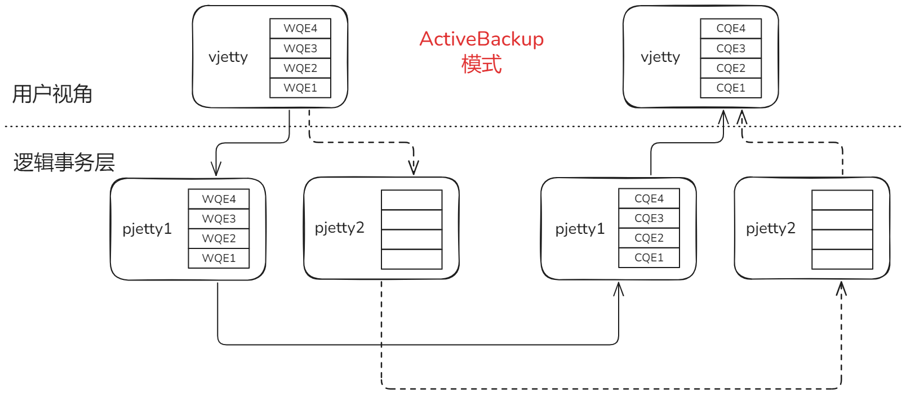

Balance Mode:

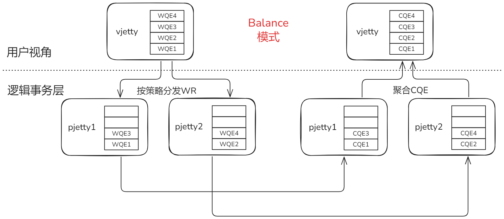

See the URMA Programming API User Manual for details on the related interfaces, including: urma_set_context_opt and other APIs.

If you wish to communicate directly using UB devices, you need to query the network topology. The URMA management tool provides the `urma_admin show topo` command to query topology information. This tool displays the logical networking relationships among the aggregation device EID (bondingEID), primaryEID, and portEID. **Note: Whether physical ports can communicate depends on the hardware state. This tool only supports querying the logical networking relationships among EIDs; it does not guarantee that the physical ports corresponding to this logical networking can actually communicate.**

**show topo Command Usage Example**

This example uses an 8-node, 2-IODie hardware environment to query a pair of ordinary device EIDs directly connected between node2 and node4.

Execute `urma_admin show topo` on node4; the output format is as follows:


Execute `urma_admin show topo` on node2:


The above output indicates the following between node2 and node4:

IODIE0:
- (node4, port4) ↔ (node2, port4) connected
- :::40:10:00:dfdf:8c5 and :::40:10:00:dfdf:845 connected

IODIE1:
- (node4, port4) and (node2, port4) connected
- :::40:10:00:dfdf:8c5 and :::40:10:00:dfdf:845 connected

### 6.2.2 Aggregation Device Basic Usage Flow

- **Bootstrapping Connection Setup Scenario**

Bootstrapping connection setup refers to the connection method that uses a URMA well-known jetty as the channel for exchanging connection setup information. The overall flow is shown below:

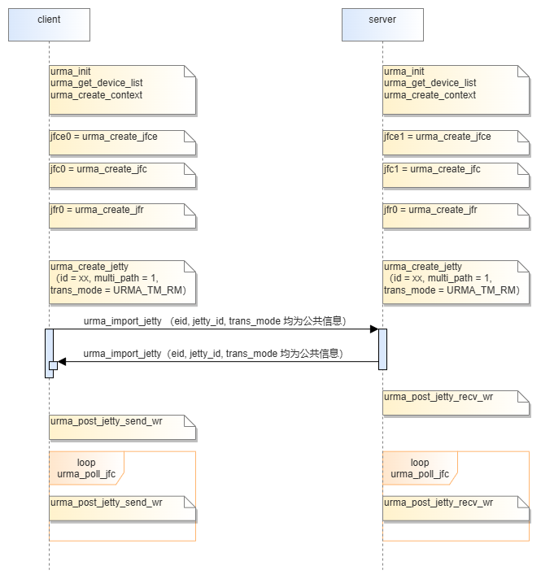

The bootstrapping connection setup scenario requires the use of a well-known jetty. The well-known jetty must be configured with trans_mode = URMA_TM_RM and the multi-path option enabled. In scenarios where data send/receive ordering is required, it is recommended to set place_order = URMA_STRONG_ORDER in jfs_wr.

- **General Data Transfer Scenario**

For general data transfer scenarios, it is recommended to use non-well-known jetties with single-path RC mode.

Note that in this transfer scenario, both sides must complete the bind_jetty operation before two-sided communication can occur.

The overall code is the same as above. The figure below shows the urma_bind_jetty flow:

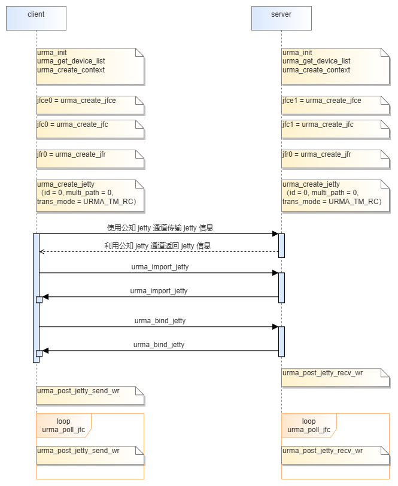

UB adopts an architecture where the transaction layer and transport layer are separated. The protocol defines transport layer types: RTP (Reliable Transport Protocol), CTP (Compact Transport Protocol), and UTP (Unreliable Transport Protocol).

Single-path is RC mode based on RTP; multi-path is RM mode based on CTP.

In single-path RM mode, the interface only knows the peer jetty information but does not know which jetty the local side is bound to. The user uses RQE for dual-end operations, and RQE cannot determine which JFR to receive data from.

The bind operation in RC mode can bind both ends' jetties.

The bonding device is TP-unaware.

### 6.2.3 Aggregation Device Feature List and Constraints

- **Usage Constraints**

1. In the KunPeng 950 scenario, there is only one aggregation device, and its name is always bonding_dev_0.

2. Single-path mode jetties and multi-path mode jetties cannot communicate with each other. Communication is only possible when both ends' jetties have the same single-path/multi-path option parameters.

3. The capabilities supported by different jetties' single-path, multi-path modes, and transport modes may differ.

4. When using aggregation devices, the choice of TP/CTP for the transport layer depends only on the parameters set when creating the jetty and jfs/jfr. The CTP parameter in the rjetty flag passed to urma_import_jetty will be ignored.

- **Aggregation Device Feature List**

  1.  Aggregation Device Feature List

| Device Name | EID Count | Mode | RTP/CTP | Transport Mode | Loopback | Max Send Pkt Size | Reliability | Reachable EID |
|---|---|---|---|---|---|---|---|---|
| bonding_dev_0 | 1 | jetty multi-path | CTP | RM (ROI order) | No | 4kB | TA ACK | Any node's agg EID |
| bonding_dev_0 | 1 | jetty multi-path | CTP | RM (ROI order) | No | 4kB | No retransmit | Any node's agg EID |
| bonding_dev_0 | 1 | jetty multi-path | CTP | RC (ROL order) | No | 4kB | No reliability mech | Any node's agg EID |
| bonding_dev_0 | 1 | jetty single-path | RTP | RC (ROL order) | Yes | 64kB | Same as single dev RC | Any node's agg EID |
| bonding_dev_0 | 1 | jfs/jfr multi-path | CTP | RM (ROI order) | No | 4kB | TA ACK | Any node's agg EID |
| bonding_dev_0 | 1 | jfs/jfr multi-path | CTP | RM (ROI order) | No | 4kB | No retransmit | Any node's agg EID |
- **Aggregation Device URMA Feature API Summary**

The aggregation device already supports most URMA APIs. The following lists the unsupported URMA APIs and their impact:

1.  Unsupported URMA APIs on Aggregation Device

| Unsupported URMA API | Function and Impact |
|---|---|
| urma_query_jfs | Query JFS status, primarily a DFX function; non-essential interface |
| urma_flush_jfs | Clear JFS software queue; functional interface — not needed if app does not require all submitted SQEs to be reported |
| urma_advise_jfr/urma_unadvise_jfr | Non-UB functional API |
| urma_query_jetty | Query jetty status and receiver watermark; primarily DFX, non-essential. Note: jetty receiver watermark feature not currently supported on KP950 HW |
| urma_flush_jetty | Clear jetty send software queue; functional interface — not needed if app does not require all submitted SQEs to be reported |
| urma_advise_jetty_async | Non-UB functional API |
| urma_create_jetty_grp/urma_delete_jetty_grp | Create/delete jetty group; functional interface |
| urma_get_tpn | Current control plane does not support this capability |
| urma_modify_tp | Current control plane does not support this capability |
## 6.3 Virtualization

A UB physical device may contain one or more sets of device resources (UE, UB Entity) and may also have one or more physical ports. When the Host accesses device resources, access requests can enter from any port and reach the corresponding device resources, meaning that these ports are shared by multiple sets of device resources. When the system allocates multiple sets of device resources to different users, a certain degree of isolation is required between these resources.

UB devices support implementing multiple Ports, and different UB devices can communicate through these ports. A UE is a set of device resources within a UB device that provides isolation — it is not only an addressable entity but also provides specific functionality and describes the device resources occupied by that entity. Through Port interconnections between devices, software can access the device resources corresponding to a UE. As the basic unit for a UB device to partition its own resources, the UE provides users with a way to manage device resources. UB devices allow users to partition resources at a finer granularity, so in practice, multiple UEs may simultaneously depend on a particular type of resource configuration to provide services.

### 6.3.1 Containers

In container environments, to enable flexible management of URMA physical devices, URMA introduces a logical device mechanism. Each physical device belongs to only one namespace, but logical devices can be created in different namespaces; each logical device likewise belongs to only one namespace. A logical device serves as an independent access interface, visible only within its owning namespace, and has the same name as the physical device. Additionally, EIDs on URMA devices can be configured with namespace attributes and bound to the logical device in the corresponding namespace; EIDs are also visible only within their owning namespace. When a logical device is deleted, its EIDs are automatically migrated back to the original physical device.

Based on the logical device management mechanism, URMA in containers supports the following two operating modes:

- **Automatic Mode**: The system automatically manages the lifecycle of logical devices. When a namespace is created or destroyed, the system automatically creates or destroys logical devices corresponding to all URMA physical devices in that namespace. All containers can directly recognize and use these URMA devices without additional user configuration.

- **Manual Mode**: The creation and deletion of logical devices is entirely controlled by the user. Users can create logical devices for specified URMA physical devices in specific namespaces as needed, and can flexibly adjust the namespace to which a physical device belongs.


URMA provides a set of commands to configure devices and EIDs.

Enable or disable device sharing:

urma_admin system set dev_sharing {on|off}

Set the namespace of a physical device:

urma_admin dev set <dev_name\> ns <netns\>

Expose or unexpose a device in a namespace:

urma_admin dev expose <dev_name\> <netns\>

urma_admin dev unexpose <dev_name\> <netns\>

Set the namespace of an EID:

urma_admin eid set <dev_name\> <eid_idx\> ns <netns\>

### 6.3.2 Virtual Machines

When a UB NIC's UE is passed through to a VM, URMA usage in the VM is no different from usage on bare metal.


## 6.4 Tool Manual


Command-line parameters are divided into required and optional categories. Required parameters are described using <\> and optional parameters using [].

### 6.4.1 urma_perftest

A performance tool for URMA latency and bandwidth testing. It covers four semantic categories — send/receive, read, write, and atomic operations — with each category supporting both latency and bandwidth tests. Separate urma_perftest processes are started on the server side and client side to conduct tests and output results.

1.  Command Format

```
Usage: urma_perftest command [command options]
urma_perftest URMA perftest tool
Command syntax:
read_lat Test for read latency.
write_lat Test for write latency.
send_lat Test for send latency.
atomic_lat Test for atomic latency.
read_bw Test for read bandwidth.
write_bw Test for write bandwidth.
send_bw Test for send bandwidth.
atomic_bw Test for atomic bandwidth.
```

2.  Function Description

```
Send/recv latency test (server): urma_perftest send_lat -d <DEV_NAME\> -s [SIZE] -n [ITERATIONS]
Send/recv latency test (client): urma_perftest send_lat -d <DEV_NAME\> -s [SIZE] -n [ITERATIONS] -S <SERVER_IP\>
Read latency test (server): urma_perftest read_lat -d <DEV_NAME\> -s [SIZE] -n [ITERATIONS]
Read latency test (client): urma_perftest read_lat -d <DEV_NAME\> -s [SIZE] -n [ITERATIONS] -S <SERVER_IP\>
Write latency test (server): urma_perftest write_lat -d <DEV_NAME\> -s [SIZE] -n [ITERATIONS]
Write latency test (client): urma_perftest write_lat -d <DEV_NAME\> -s [SIZE] -n [ITERATIONS] -S <SERVER_IP\>
Atomic latency test (server): urma_perftest atomic_lat -d <DEV_NAME\> -s [SIZE] -n [ITERATIONS] -A cas
Atomic latency test (client): urma_perftest atomic_lat -d <DEV_NAME\> -s [SIZE] -n [ITERATIONS] -S <SERVER_IP\> -A cas
Send/recv bandwidth test (server): urma_perftest send_bw -d <DEV_NAME\> -s [SIZE] -n [ITERATIONS]
Send/recv bandwidth test (client): urma_perftest send_bw -d <DEV_NAME\> -s [SIZE] -n [ITERATIONS] -S <SERVER_IP\>
Read bandwidth test (server): urma_perftest read_bw -d <DEV_NAME\> -s [SIZE] -n [ITERATIONS]
Read bandwidth test (client): urma_perftest read_bw -d <DEV_NAME\> -s [SIZE] -n [ITERATIONS] -S <SERVER_IP\>
Write bandwidth test (server): urma_perftest write_bw -d <DEV_NAME\> -s [SIZE] -n [ITERATIONS]
Write bandwidth test (client): urma_perftest write_bw -d <DEV_NAME\> -s [SIZE] -n [ITERATIONS] -S <SERVER_IP\>
Atomic bandwidth test (server): urma_perftest atomic_bw -d <DEV_NAME\> -s [SIZE] -n [ITERATIONS] -A cas
Atomic bandwidth test (client): urma_perftest atomic_bw -d <DEV_NAME\> -s [SIZE] -n [ITERATIONS] -S <SERVER_IP\> -A cas
```

3.  Parameter Description

urma_perftest parameters:

```
Options:
  -a, --all[order]            Run sizes from 2 till 2^23,
                              default 2^12 for send, 2^16 for others, order: exponent of 2.
  -A, --atomic_type <type>    Specify atomic type, {cas|faa}.
  -b, --simplex_mode          Run with simplex mode(jfs/jfr), duplex jetty mode for reserved.
  -B, --bidirection           Measure bidirectional bandwidth (default unidirectional).
  -c, --jfc_inline            Enable jfc_inline to upgrade latency performance.
  -C, --jfc_depth <dep>       Size of jfc depth (default 4096 for bw, 1024 for ip bw, 1 for lat.
  -d, --dev <dev_name>        The name of ubep device.
  -D, --duration <second>     Run test for a customized period of seconds, this cfg covers iters.
  -e, --use_jfce              use jfc event.
  --eid_idx                   Specified eid index of device.
  -E, --err_timeout <time>    the timeout before report error, ranging from [0, 31],
                              the actual timeout in usec is caculated by: 4.096*(2^err_timeout).
  -f, --use_flat_api          Choose to use flat API, only works in SIMPLEX mode.
  -F, --cpu_freq_f            To report warnings when CPU frequency drifts, default as NOT.
  -h, --help                  Show help info.
  -I, --inline_size <size>    Max size of message to be sent in inline (default 0).
  -j, --share_jfr <true/false> share jfr on create jetty.
  -J, --jettys <num of jetty> Num of jettys(default 1).
  -K, --token_policy <policy> default 0: NONE, 1: PLAIN_TEXT, 2: SIGNED, 3: ALL_ENCRYPTED.
  -n, --iters <iters>         Number of exchanges (at least 5, default 10000).
  -N, --no_peak               Cancel peak-bw calculation.
  -l, --jfs_post_list <size>  Post list of send WQEs of <list size> size.
  -L, --lock_free             Jetty's interior is unlocked.
  -O, --priority              set the priority of JFS, ranging from [0, 15].
  -p, --trans_mode <mode>     Transport mode: 0 for RM(default), 1 for RC, 2 for UM.
  -P, --port <id>             Server port for bind or connect, default 21115.
  -Q, --cq_mod <num>          Generate Cqe only after <--cq_mod> completion.
  -r, --jfr_post_list <size>  Post list of receive WQEs of <list size> size.
  -R, --jfr_depth <dep>       Size of jfr depth (default 512 for BW, 1 for LAT).
  -s, --size <size>           Size of message to exchange (default 2).
  -S, --server <ip>           Server ip for bind or connect, default: 127.0.0.1 .
  -T, --jfs_depth <dep>       Size of jfs depth (default 128 for BW, 1 for LAT).
  -u, --uboe                  Enable uboe (default false), the parametre sip, dip are required.
                                                                            dscp, vlan, sl are optional
  -w, --warm_up               Choose to use warm_up function, only for read/write/atomic bw test.
  -y, --infinite[second]      Run perftest infinitely, only available for BW test.
                              Print period for infinite mode, default 2 seconds.
  --inf_period_ms             Print period (ms) for infinite mode. Must be a multiple of 50.
                              if set, value of infinite will be overwrite.
  --rate_limit <rate>         Set the maximum rate of sent packages. default unit is [Gbps].
  --rate_units <units>        Set the units for rate, MBps (M), Gbps (G)(default) or Kpps (P).
  --burst_size <size>         Set the amount of pkts to send in a burst when using rate limiter.
  --order_type <type>         Order type: 0 for default order,
                   1 for OT (target order), 2 for OI(init order), 3 for OL(layer order), 4 for NO(no order).
  --enable_ipv6               enable ipv6 for server ip. default disable.
  --enable_credit             enable send credit, default: disable.
  --credit_threshold <num>    Exceed the threshold and do not send, default: jfr_depth * 3 / 4.
  --credit_notify_cnt <num>   Notify the send side after recv packets, default: jfr_depth / 4.
  --jettys_pre_jfr <num>      How many jettys share a jfr, default: jettys.
  --seg_pre_jetty             Enable a segment for each Jetty, default: disable.
  --enable_imm                Enable immediate data for write or send, default: disable.
  --enable_err_continue       Enable continue running when cr erros, default: disable.
  --enable_notify            Enable write_with_notify for WRITE tests, default: disable.
  --enable_sync_stream       Enable synchronized multi-stream in multi-Jetty bandwidth tests, default: disable.
  --enable_user_tp            Enable user tp for UB device, if enable,UVS is not required. default: disable.
  --oor_en                    Enable out of order for user_tp, default: disable.
  --spray_en                  Enable multipathing for user_tp, default: disable.
  --cc_en                     Enable congestion control for user_tp, default: disable.
  --cc_alg <num>              Set congestion Control Algorithm for user_tp, [0, 7], default: 0.
  --retry_num  <num>          Set retry num for user_tp, default: 7.
  --ack_timeout <num>         Set ack timeout for user_tp, default: 15.
  --sge_num <num>             Set sge_num for wr, default: 1.
  --enable_write_dirty <time> Enable write dirty and set the period of write dirty, default: disable.
  --pair_num <num>            Enable multiplayer model and set the number of connection, default: disable.
  --sip <ip>                  Set source ip address.
  --dip <ip>                  Set dest ip address.
  --dscp <dscp>               Set dscp .
  --vlan <vlan_id>            Set vlan_id .
  --sl <sl>                   Set sl .
  --async_import              Enable asynchronous connection establishment
  --tp_aware                  Enable tp aware connect, default: disable.
  --tp_reuse                  Reuse tp in RM mode if enable tp aware, default: disable.
  --ctp                       Use ctp, default: disable.
  --jetty_id                  Set the jetty_id, default: 0.
  --wait_jfc_timeout          Set timeout parameter for urma_wait_jfc (in milliseconds),
                              timeout = 0: return immediately even if no events are ready,
                              timeout = -1: an infinite timeout,
                              default: 1000(1s).
  --page_size                 Set page size, default: 4096.
  --hugepage_size <size>      Page size for allocated memory. Only support 2MB or 1GB currently.
  --bind_ip <ip>              The ip for bind.
  --bond_mode                 Set bonding device mode, support: standalone, active_backup, balance.
  --bond_level                Set bonding device level, support: iodie, port.
```


| Flag | Parameter Name | Type | Description | Required | Valid Range | Default Value |
|---|---|---|---|---|---|---|
| Flag          | Parameter Name      | Type     | Description                                                                                                                                                                                                                                                | Required     | Valid Range                          | Default Value                  |
| -a            | all                 | uint32_t | Auto-test and output results for packet sizes from 2 to 2^23. Note: conflicts with -s. Optional parameter specifies order (exponent of 2).                                                                                                                 | Optional     | 1~23                                 | 16                             |
| -A            | atomic_type         | enum     | Atomic operation type.                                                                                                                                                                                                                                     | Yes          | cas or faa                           | cas                            |
| -b            | simplex_mode        | bool     | Enable simplex mode (JFS/JFR). In simplex mode, data transfer is in one direction only.                                                                                                                                                                    | No           | -                                    | Disabled                       |
| -B            | bidirection         | bool     | Measure bidirectional bandwidth (send-to-receive and receive-to-send). Default is unidirectional.                                                                                                                                                          | No           | -                                    | Disabled                       |
| -c            | jfc_inline          | bool     | Enable jfc_inline. When enabled, small data (typically < 8 or 16 bytes) can be written directly into the CQE.                                                                                                                                              | No           | -                                    | Disabled                       |
| -C            | jfc_depth           | uint32_t | JFC depth. Default 4096 for BW tests, 1024 for IP BW tests, 1 for latency tests.                                                                                                                                                                          | Yes          | 0 ~ U32_MAX                          | Lat: 1; BW: 4096               |
| -d            | dev                 | char *   | Device name.                                                                                                                                                                                                                                               | Yes          | -                                    | -                              |
| -D            | duration            | uint32_t | Test duration in seconds. Note: conflicts with -n; this setting overrides iters.                                                                                                                                                                          | Yes          | 4 ~ U32_MAX                          | 5                              |
| -e            | use_jfce            | bool     | Use event notification mechanism.                                                                                                                                                                                                                          | No           | -                                    | Disabled                       |
| \--eid idx    | eid index           | uint32_t | EID index. EID is the unique identifier for endpoints in URMA communication.                                                                                                                                                                              |              |                                      |                                |
| -E            | err_timeout         | uint8_t  | Error timeout when creating JFS or jetty as sender. Timeout = 4.096*(2^err_timeout).                                                                                                                                                                     | Yes          | 0~31                                 | 17                             |
| -f            | use_flat_api        | bool     | Use urma_send/urma_recv/urma_read/urma_write data plane APIs. Must be paired with JFS/JFR. Only effective in simplex mode.                                                                                                                             | No           | -                                    | Disabled                       |
| -F            | cpu_freq_f          | bool     | Report warning when CPU frequency differs significantly between measurement methods.                                                                                                                                                                       | No           | -                                    | Disabled                       |
| -h            | help                | -        | Print usage information.                                                                                                                                                                                                                                   | No           | -                                    | -                              |
| -I(ASCII 73)  | inline_size         | uint32_t | Inline size.                                                                                                                                                                                                                                               | Yes          | 0~912                                | Lat: 220; BW: 0                |
| -j            | share_jfr           | bool     | Use shared JFR.                                                                                                                                                                                                                                            | Yes          | true/false                           | Disabled                       |
| -J            | jettys              | uint32_t | Number of jetties. The theoretical upper limit depends on /sys/class/ubcore/udmaxx/max_jetty and chip capability. In multi-jetty scenarios, each jetty pair consumes TP resources, so feasibility also depends on the control plane's TP upper limit.        | Yes          | 1~NA* (min of 65535 and chip limit)  | 1                              |
| -K            | token_policy        | uint32_t | Configure token_policy.                                                                                                                                                                                                                                    | Yes          | 0~3                                  | 0                              |
| -n            | iters               | uint64_t | Number of iterations. Note: conflicts with -D.                                                                                                                                                                                                             | Yes          | Min: 5                               | BW: 50000; Lat: 10000          |
| -N            | no_peak             | bool     | Cancel peak bandwidth calculation. BW test only.                                                                                                                                                                                                           | No           | -                                    | Disabled                       |
| -l(ASCII 108) | jfs_post_list       | uint32_t | Number of send-side WQEs.                                                                                                                                                                                                                                  | Yes          | Depends on other params              | 1                              |
| -L            | lock_free           | bool     | Configure Jetty's internal data structures as lock-free.                                                                                                                                                                                                   | No           | -                                    | Disabled                       |
| -O            | priority            | uint8_t  | Configure JFS priority.                                                                                                                                                                                                                                    | Yes          | 0~15                                 | 15                             |
| -p            | trans_mode          | uint32_t | URMA transport mode: 0 = RM, 1 = RC, 2 = UM.                                                                                                                                                                                                               | Yes          | 0~2                                  | 0                              |
| -P            | port                | uint16_t | Socket port number.                                                                                                                                                                                                                                        | Yes          | Unrestricted                         | 21115                          |
| -Q            | cq_mod              | uint32_t | Generate a CQE every N completions on the send side.                                                                                                                                                                                                       | Yes          | 1~1024                               | 100                            |
| -r            | jfr_post_list       | uint32_t | Number of receive-side WQEs.                                                                                                                                                                                                                               | Yes          | See description                      | 1                              |
| -R            | jfr_depth           | uint32_t | Receive-side jetty depth. Upper bound is min(32768, chip max jfr depth).                                                                                                                                                                                  | Yes          | 1~32768                              | Send/recv tests: 512; others: 1|
| -s            | size                | uint32_t | Single packet transfer size. Note: conflicts with -a.                                                                                                                                                                                                      | Yes          | Unrestricted                         | Atomic: 8; BW: 65536; Lat: 2   |
| -S            | server              | char *   | Server IP in X.X.X.X format. Required for client. Default: 127.0.0.1.                                                                                                                                                                                     | Yes          | Unrestricted                         | 127.0.0.1                      |
| -T            | jfs_depth           | uint32_t | Send-side jetty depth.                                                                                                                                                                                                                                    | Yes          | 1~15000                              | BW: 128; Lat: 1                |
| -w            | warm_up             | bool     | Enable warm-up before perftest. Only effective for read/write/atomic BW tests.                                                                                                                                                                            | No           | -                                    | Disabled                       |
| -y            | infinite            | uint32_t | Infinite mode for BW tests. Optional parameter specifies print interval in seconds (default 2).                                                                                                                                                           | Optional     | -                                    | 2                              |
| \--           | single_path         | bool     | Aggregation device single-path mode. All traffic goes through one selected physical interface.                                                                                                                                                            | Optional     |                                      | false                          |
|               | inf_period_ms       | uint32_t | Print bandwidth at ms granularity. Must be a multiple of 50. Effective with -y. ~2ms tolerance.                                                                                                                                                            | Optional     | Multiple of 50                       | 0                              |
| -             | rate_limit          | uint32_t | Rate limit value. Default unit: Gbps.                                                                                                                                                                                                                      | Optional     | Unrestricted                         | 0                              |
| -             | rate_units          | char     | Rate limit units: MBps (M), Gbps (G)(default), or Kpps (P).                                                                                                                                                                                               | Optional     | [MGP]                                | G                              |
| -             | burst_size          | uint32_t | Number of packets to send consecutively per burst when using rate limiter.                                                                                                                                                                                | Optional     | Unrestricted (large values reduce accuracy) | jfs_depth config value     |
|               | order_type          | uint32_t | Order type. 0 = default order, 1 = OT (target order), 2 = OI (initiator order), 3 = OL (layer order), 4 = NO (no order).                                                                                                                                  | Optional     | 0~4                                  | 0                              |
|               | enable_ipv6         | bool     | Enable IPv6 for server IP. Must be set when -S uses an IPv6 address.                                                                                                                                                                                      | Optional     |                                      | Disabled                       |
|               | enable_credit       | bool     | Enable credit-based flow control in send tests. Enabling may reduce throughput.                                                                                                                                                                           | No           |                                      | Disabled                       |
|               | credit_threshold    | uint32_t | Threshold at which sender stops sending. Setting too high may cause packet loss.                                                                                                                                                                          | Yes          | Unrestricted                         | jfr_depth * 3 / 4              |
|               | credit_notify_cnt   | uint32_t | Number of packets received before notifying sender.                                                                                                                                                                                                       | Yes          | Unrestricted                         | jfr_depth / 4                  |
|               | jettys_pre_jfr      | uint32_t | How many jetties share one JFR.                                                                                                                                                                                                                           | Optional     | Unrestricted                         | jettys                         |
|               | seg_pre_jetty       | bool     | Enable one segment per jetty for testing.                                                                                                                                                                                                                 | Optional     |                                      | Disabled                       |
|               | enable_imm          | bool     | Enable immediate data test.                                                                                                                                                                                                                               | Optional     |                                      | Disabled                       |
|               | enable_err_continue | bool     | Continue sending when CR errors occur.                                                                                                                                                                                                                    | Optional     |                                      | Disabled                       |
|               | enable_notify       | bool     | Enable write_with_notify for WRITE tests. The tool fills a fixed notify data value.                                                                                                                                                                      | Optional     |                                      | Disabled                       |
|               | enable_sync_stream  | bool     | Enable synchronized multi-stream transmission in multi-Jetty bandwidth tests.                                                                                                                                                                            | Optional     |                                      | Disabled                       |
|               | enable_user_tp      | bool     | Enable user-mode connection setup. When enabled, user TP can be used without UVS.                                                                                                                                                                         | Optional     |                                      | Disabled                       |
|               | oor_en              | bool     | Enable out-of-order for user-mode connection setup.                                                                                                                                                                                                       | Optional     |                                      | Disabled                       |
|               | spray_en            | bool     | Enable multipathing for user-mode connection setup.                                                                                                                                                                                                       | Optional     |                                      | Disabled                       |
|               | cc_en               | bool     | Enable congestion control for user-mode connection setup.                                                                                                                                                                                                 | Optional     |                                      | Disabled                       |
|               | cc_alg              | uint32_t | Congestion control algorithm for user-mode connection setup.                                                                                                                                                                                              | Optional     | [0, 7]                               | 0                              |
|               | retry_num           | uint32_t | Retry count for user-mode connection setup.                                                                                                                                                                                                               | Optional     |                                      | 7                              |
|               | ack_timeout         | uint32_t | ACK timeout for user-mode connection setup.                                                                                                                                                                                                               | Optional     |                                      | 15                             |
|               | sge_num             | uint32_t | Number of SGEs per WR.                                                                                                                                                                                                                                    | Optional     |                                      | Disabled                       |
|               | enable_write_dirty  | bool     | Enable write dirty functionality.                                                                                                                                                                                                                         | Optional     |                                      | false                          |
|               | pair_num            | uint32_t | Server: set to client count; Client: set to server count. Auto-adjusts jetty count to match.                                                                                                                                                             | Optional     |                                      | 1                              |
|               | async_import        | -        | Enable asynchronous connection establishment.                                                                                                                                                                                                             | Optional     |                                      |                                |
|               | tp_aware            | bool     | Enable transport-path-aware connection.                                                                                                                                                                                                                   | Optional     |                                      | false                          |
| \--tp_reuse            | tp_reuse            | bool     | Allow TP reuse in RM mode.                                                                                                                                                                                                                                |              |                                      | false                          |
| \--ctp                 | ctp                 | uint32_t | CTP is a simplified transport layer without connection management (connectionless).                                                                                                                                                                       | Optional     | /* 0: default, tp; 1: ctp */         | 0                              |
| \--jetty_id            | jetty_id            | uint32_t | User-specified jetty_id value; must be unique.                                                                                                                                                                                                            | Optional     |                                      | 0                              |
| \--wait_jfc_timeout    | wait_jfc_timeout    | int32_t  | Timeout for urma_wait_jfc (in ms). 0 = return immediately; -1 = infinite wait; default 1000 (1s).                                                                                                                                                        | Optional     |                                      | 1000                           |


urma_perftest parameter values are generally not validated; users should configure them within the recommended ranges. Configurations exceeding the recommended ranges are not guaranteed to operate normally.


**Implicit Relationships Among urma_perftest Parameters**

1.  Conflicting configurations are not allowed. Examples: -a and -s, -D and -n, etc.

2.  Parameters -d and client-side -S are mandatory; other parameters are optional.

3.  Write operations do not support -e; otherwise, an error is returned.

4.  Read/atomic operations do not use inline_size; configuring -I will produce a warning and inline_size is forced to 0.

5.  -J (multiple jetties) can only be configured in BW tests; configuring it in latency tests returns an error.

6.  -N (no peak calculation) is only for BW tests; configuring it in latency tests returns failure.

7.  -n, -T, -J, -I, -R, and -Q have strict range limits (see table above); exceeding them triggers a warning and returns failure.

8.  Atomic operation semantics: configuring -s to a value other than 8 triggers a warning and returns failure.

9.  When jfs_post_list/jfr_post_list exceeds 1 in BW tests with iteration mode (-n): if the iteration count is not divisible by jfs_post_list/jfr_post_list, a warning is generated and failure is returned.

10. When jfs_post_list exceeds 1 in BW tests and cq_mod is 0, it is forced equal to jfs_post_list.

11. When jfs_post_list exceeds 1 in BW tests and cq_mod is not 0: if jfs_post_list is not divisible by cq_mod, a warning is generated and failure is returned.

12. In send/recv BW tests, when jfr_depth/jfs_depth is not divisible by jfr_post_list, an exception warning is reported but failure is not returned.

13. Two-sided operation -B can only be combined with BW tests; configuring it in latency tests returns an error.

14. -f can only be configured when -b is also set; otherwise, an error is returned.

15. Parameter values may be automatically adjusted under different test scenarios, including but not limited to:
    - Iteration mode (-n): if jfs_depth exceeds the iteration count, it is forced to the iteration count.
    - Iteration mode (-n) write operations: if jfr_depth exceeds the iteration count, it is forced to the iteration count.
    - When packet size exceeds the limit (8192) and -a, -e are configured with cq_mod = 0, cq_mod is forced to 1; cq_mod > 1 triggers a warning.
    - If cq_mod exceeds jfs depth, it is forced to jfs depth.
    - With -a configured, the default packet size range is 2~8388608.
    - Duration mode (-D): iteration count is auto-initialized to 0, no_peak is auto-enabled. Configuring -e or -a in this mode triggers a warning and returns failure.

16. When jfs_post_list exceeds 1 in BW tests: if jfs_depth < jfs_post_list, a warning is generated and failure is returned.

17. In UM mode, the size parameter should not exceed the MTU. Behavior is unpredictable if size exceeds MTU.

18. Rate limiting is only supported in BW tests. Rate limiting is not supported in infinite mode, atomic tests, or bidirectional send tests.

19. Infinite mode (-y) conflicts with write_imm and send test bidirectional mode (-B).

20. User-mode connection setup (enable_user_tp) is only supported on certain chips. Other connection parameters must be coordinated with the driver, otherwise flow interruption may occur.

21. The write_imm test model is consistent with send_recv.

22. The maximum sge_num value depends on chip limitations, and size must be divisible by sge_num.

23. Multi-SGE tests depend on chip support; some chips (e.g., 1822 roce) cannot operate normally.

24. When using shared JFR: cfg->jfr_depth * (cfg->jettys / cfg->jettys_pre_jfr) must be >= (cfg->jettys * cfg->jfr_post_list).

25. UBoE connection setup requires --uboe with --sip and --dip. --dscp, --vlan, and --sl can be configured as needed.

26. jfs_post_list, jfr_post_list, and jfr_depth parameters affect flow control thresholds. The use_jfce parameter affects the -B bidirectional flow and is temporarily not supported.


- Rate limiting is only supported in BW tests; atomic and bidirectional send tests do not support rate limiting.
- In software rate limiting scenarios, the actual effective value will be smaller than the configured value; the smaller the packet length, the larger the deviation.
- The rate limit value must be less than the actual maximum bandwidth.
- When configuring --rate_units P, --rate_limit must not be too small, otherwise it may appear stuck. burst_size must not exceed pps, otherwise execution is impossible.
- send_imm tests are not supported on some chips such as DPU smart NICs.

1.  Example

    1.  Use hiroce gids or show_gids to query dev_name and server_ip. Example: dev_name: mlx5_0, server_ip: X.X.X.X


1.  Execute urma_perftest -h to view the command line.

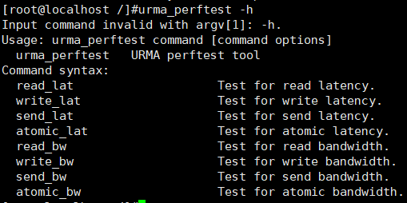

2.  On server X.X.X.X, execute:

urma_perftest write_lat -d hrn0_0 -n 100000 -a -I 128

3.  On client Y.Y.Y.Y, execute:

urma_perftest write_lat -d hrn0_0 -S 10.151.151.77 -n 100000 -a -I 128

4.  Check results

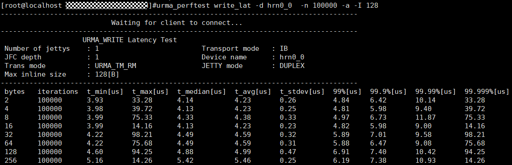


5.  Configure rate limiting

```c
urma_perftest write_bw -d hrn0_0 -a \--rate_limit 0.1 \--rate_units G \--burst_size 1
```

urma_perftest write_bw -d hrn0_0 -a -S 10.151.151.77 \--rate_limit 0.1 \--rate_units G \--burst_size 1

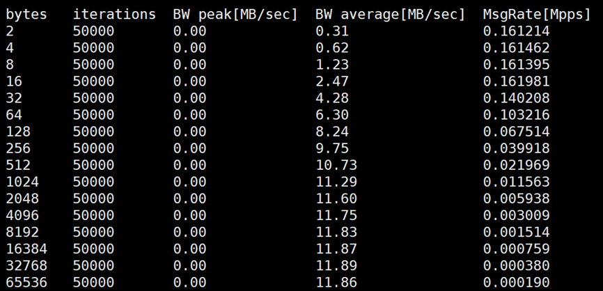

\-\-\--End

### 6.4.2 urma_admin

The URMA framework presents the attributes of resources at different granularities through sysfs, including various attributes of jetty resources, port status, etc. The urma_admin tool can query device attributes and status via the command line, and can configure some attributes — such as updating the EID, switching the EID update mode, querying device attributes, etc.

1.  Command Format

```
Usage: urma_admin <command> [options]

Commands:
  show          Show information
  dev           Device management operations
  eid           EID management operations
  main_ue_eid   Main UE EID query table operations
  system        System configuration operations
  agg           Aggregation device operations
  perf          Control plane DFX latency tracer operations

Options:
  -h, --help     Show help and exit
  -V, --version  Show version and exit
```

2.  Function Description

```
urma_admin show [--dev <dev>] [--brief|--all] [--whole]          Show URMA devices information
urma_admin show topo [NODE_ID]                                   Show topology of specified node, default is current node
urma_admin show dev <dev> jfc [JFC_ID]                           Show JFC resources
urma_admin show dev <dev> jfs [JFS_ID]                           Show JFS resources
urma_admin show dev <dev> jfr [JFR_ID]                           Show JFR resources
urma_admin show dev <dev> jetty [JETTY_ID]                       Show Jetty resources
urma_admin show dev <dev> jetty_group [JETTY_GROUP_ID]           Show Jetty Group resources
urma_admin show dev <dev> rc [RC_ID]                             Show RC resources
urma_admin show dev <dev> seg [TOKEN_ID]                         Show SEG resources
urma_admin show dev <dev> tp [TP_ID]                             Show TPID list or a single TPID state of the device
urma_admin show dev <dev> tpreuse                                Show TPID reuse entries of the device
urma_admin dev set <dev> ns <netns>                              Set net namespace of UB device
urma_admin dev set <dev> sl --sl <sl> --priority <priority>      Configure SL and priority mapping
urma_admin dev expose <dev> <netns>                              Expose UB device to a network namespace
urma_admin dev unexpose <dev> <netns>                            Unexpose UB device from a network namespace
urma_admin eid add <dev> <eid_idx> <eid> [--ns <netns>] [--mode <eid_mode>]  Add static EID
urma_admin eid del <dev> <eid_idx>                               Delete static EID
urma_admin eid set <dev> <eid_idx> ns <netns>                    Set namespace of an EID
urma_admin eid set <dev> <eid_idx> mode {static|dynamic}         Set EID mode
urma_admin main_ue_eid insert <eid> <main_ue_eid>                Insert a main UE EID mapping
urma_admin main_ue_eid delete <eid>                              Delete a main UE EID mapping
urma_admin main_ue_eid lookup <eid>                              Query a main UE EID mapping
urma_admin main_ue_eid flush                                     Clear the main UE EID table
urma_admin system show                                           Show system configuration
urma_admin system set dev_sharing {on|off}                       Enable or disable UB device sharing
urma_admin system set eid_sharing {on|off}                       Enable or disable EID sharing
urma_admin agg add <eid> <dev_name>                              Add an aggregation device
urma_admin agg del <eid>                                         Delete an aggregation device
urma_admin agg expose <eid> <netns>                              Expose an aggregation device and related EIDs
urma_admin perf start                                            Start DFX collection
urma_admin perf stop                                             Stop DFX collection
urma_admin perf show                                             Show DFX statistics results
```

3.  Parameter Description

| Command Element | Description | Required | Valid Range | Default |
|---|---|---|---|---|
| `<dev>` | Device name, for example udma1 | Required | String up to 63 bytes | None |
| `<netns>` | Network namespace path, for example /proc/$pid/ns/net | Required | Valid namespace path | None |
| `<eid_idx>` | EID index | Required | 0~65535 | None |
| `<eid>` | EID value | Required | IPv4, IPv6, or mapped EID string | None |
| `<main_ue_eid>` | Main UE EID mapped from one or more EIDs | Required | IPv4, IPv6, or mapped EID string | None |
| `<node_id>` | Topology node ID | Optional | uint32_t | Current node |
| --brief | In show command, show bonding devices first if they exist | Optional | - | Enabled |
| --all | In show command, show all devices | Optional | - | Disabled |
| --whole | In show command, show complete device information | Optional | - | Disabled |
| --sl | Service level for dev set sl | Required for dev set sl | 0~255 | None |
| --priority | Priority for dev set sl | Required for dev set sl | 0~255 | None |
| dev_sharing | Device namespace sharing mode | Required for system set | - | None |
| eid_sharing | EID namespace sharing mode | Required for system set | - | None |
| {on\|off} | Sharing switch | Required for system set dev_sharing/eid_sharing | on/off | None |
| {static\|dynamic} | EID mode | Required for eid set mode | static/dynamic | None |

[] indicates optional parameters; <\> indicates required parameters.

urma_admin show -w parameter notes:

1.  atomic_feature: Bitmask value, as follows:
    - compare_and_swap = 1
    - swap = 2
    - fetch_and_add = 4
    - fetch_and_sub = 8
    - fetch_and_or = 16
    - fetch_and_xor = 32
    - Example: atomic_feature = 0x5 means [compare_and_swap(1) | fetch_and_add(4)]

2.  trans_mode: Bitmask value, as follows:
    - RM (Reliable message) = 1
    - RC (Reliable connection) = 2
    - UM (Unreliable message) = 4
    - Example: trans_mode = 0x7 means [RM(1) | RC(2) | UM(4)]

3.  congestion_ctrl_alg: Bitmask value, as follows:
    - NONE = 1
    - DCQCN = 2
    - DCQCN_AND_NETWORK_CC = 4
    - LDCP = 8
    - LDCP_AND_CAQM = 16
    - LDCP_AND_OPEN_CC = 32
    - HC3 = 64
    - DIP = 128
    - ACC = 256
    - Example: congestion_ctrl_alg = 0x13 means [NONE(1) | DCQCN(2) | LDCP_AND_CAQM(16)]

Example:

```
# urma_admin add_eid --dev ubep_beta --idx 1
# urma_admin add_eid --dev ubep_beta --idx 1 --ns /proc/11962/ns/net
# urma_admin del_eid --dev ubep_beta --idx 1
# urma_admin set_eid_mode -d ubep_beta -m
# urma_admin set_eid_mode -d ubep_beta
# urma_admin show_stats -d ubep_beta --resource_type 5 --key 2
# urma_admin show_res -d ubep_beta --resource_type 5 --key 1 -C 1
# urma_admin list_res -d ubep_beta --resource_type 5 --key 1
# urma_admin set_ns_mode -M 0
# urma_admin show dev ubep_beta tp
# urma_admin show dev ubep_beta tp 1001
# urma_admin show dev ubep_beta tpreuse
# urma_admin system show
# urma_admin system set dev_sharing on
# urma_admin system set eid_sharing off
# urma_admin agg add 192.168.1.100 bonding_dev_0
# urma_admin agg expose 192.168.1.100 /proc/11962/ns/net
# urma_admin perf start
# urma_admin perf show
```


urma_admin operations use rsyslog to redirect logs to /var/log/umdk/urma/urma_admin.log. Size-based rotation, compression, and retention depend on logrotate. Frequent short-interval command invocations may prevent log rotation.

## 6.5 DFX Diagnostics

URMA DFX capabilities primarily include URMA logging. Additionally, urma_admin also has some diagnostic capabilities; see the urma_admin tool manual chapter for details.

### 6.5.1 URMA Logging

URMA uses the OS's built-in rsyslog tool to implement log redirection and printing, with the corresponding configuration path at /etc/rsyslog.d/*.conf. Size-based log rotation, compression, and retention depend on the OS's built-in logrotate tool, with the corresponding configuration path at /etc/logrotate.d/**. Products can modify the configuration files as needed to meet different requirements.


1.  Log redirection depends on the system's rsyslog tool, which must be installed and configured separately.

2.  Size-based rotation, compression, retention, and automatic deletion of old compressed files depend on the system's logrotate tool, which must be installed and configured separately.

3.  The user group and permissions of log files can also be configured by modifying the /etc/rsyslog.d/*.conf file. See the example below.


1.  Log Redirection

URMA supports user-mode log redirection, allowing logs to be uniformly directed to an application-specified framework for printing by registering a callback function.

```c
typedef void(*urma_log_cb_t)(int level, char *message);
urma_status_t **urma_register_log_func**(urma_log_cb_t func);
urma_status_t **urma_unregister_log_func**(void);
```

---
# 7 Ecosystem Compatibility

## 7.1 RoUB

The Verbs interface is currently the core of RDMA programming and is widely used in high-performance networking. To maintain compatibility with standard Verbs semantics and avoid directly modifying upper-layer applications, we have introduced an intermediate adaptation layer: **RoUB** (RDMA over UB). RoUB implements transparent mapping from URMA capabilities to standard Verbs interfaces, allowing existing RDMA applications based on libibverbs to use URMA capabilities without any code changes.


RDMA over UB dynamically creates corresponding IB devices based on the existing UB devices in the system. Therefore, the operational capabilities on these IB devices are limited by the actual functionality and specifications of the underlying UB devices.

1.  Context View


- **User applications** call RDMA verbs through the standard libibverbs.
- **RoUB user-mode library** is responsible for wrapping these calls into internal implementations and calling the URMA user-mode library through liburma.
- **RoUB kernel driver** registers an ib_device with the Linux RDMA subsystem and maps resource requests to **UBcore**.
- **UBcore** serves as the unified entry point for underlying hardware discovery and resource allocation.

1.  Overall Architecture


**libroub.so**:

1. Northbound: interfaces with user-mode Verbs interfaces.
2. Southbound: interfaces with liburma.so through API calls.
3. Creates a Verbs device context bound to the URMA device context, implementing the Verbs device user-mode interface.
4. Enables UB hardware through URMA API calls to support RDMA connection setup and communication with UB hardware.

**roub.ko**:

1. Northbound: interfaces with kernel-mode RDMA interfaces.
2. Southbound: interfaces with ubcore.ko through API calls.
3. Creates an IB device bound to the UB device, supporting user-mode creation of the corresponding Verbs device context.
4. Enables UB hardware through ubcore API calls to support RDMA event mechanisms with UB hardware.

2.  Specifications and Constraints

1.  When performing IBV_WR_SEND operations, the total data length of all Scatter-Gather Entries (SGEs) in a single work request must not exceed 64 KB.

2.  When performing IBV_WR_RDMA_WRITE or IBV_WR_RDMA_READ operations, the total data length of all SGEs must not exceed 2 GB.

3.  post send currently supports only these 4 commands: IBV_WR_RDMA_WRITE, IBV_WR_RDMA_WRITE_WITH_IMM, IBV_WR_SEND, IBV_WR_RDMA_READ.

4.  Currently, only RC-mode QPs can be created. The environment variable ROUB_RC_MODE can be modified to determine the URMA-layer implementation.

5.  The environment variable ROUB_RC_MODE defaults to RS and can only be set to RS or RM. Setting is case-insensitive, and only the first 2 characters of the input are read.

6.  Nodes with different ROUB_RC_MODE values can establish connections but cannot perform data communication.

7.  The maximum number of Queue Pairs (QPs) that can be created in the system must not exceed 50% (i.e., 1/2) of the maximum number of Jetties supported by the NIC.

8.  When creating a QP, max_send_sge is at most 8, and max_recv_sge can only be 1.

9.  When creating the max_qp-th QP, if creation fails, retrying a few times will succeed.

10. Currently, only the ibv_wc from ibv_post_recv operations contains valid opcode and wc_flags fields.

## 7.2 IPoURMA

The Socket interface is currently the core of network programming and is widely used in high-performance networking. To maintain compatibility with the standard TCP/IP protocol stack and avoid directly modifying upper-layer applications, we have introduced an intermediate adaptation layer: **IPoURMA** (IP over URMA). IPoURMA implements transparent mapping from URMA capabilities to standard Socket interfaces, allowing existing Socket-based applications to use URMA capabilities without any code changes.

1.  Context View

    1.  IPoURMA Context View

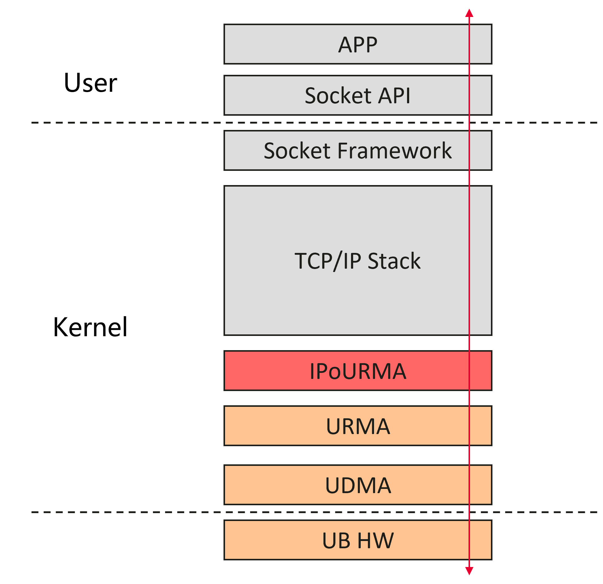

- **User applications** assemble/parse IP datagrams by calling standard Socket interfaces.
- **IPoURMA adaptation layer** registers a net_device with the Linux kernel, passes IP datagrams obtained from the protocol stack down to the hardware through Ubcore, and passes IP datagrams uploaded from the hardware up to the protocol stack.
- **Ubcore** provides a unified entry point for hardware discovery and resource allocation.

1.  Overall Architecture


**ipourma.ko**:

1.  Northbound: interfaces with the kernel TCP/IP protocol stack.
2.  Southbound: interfaces with ubcore.ko through API calls.
3.  Creates a net_device bound to the UB device context, enabling users to use UB device capabilities through standard Socket interfaces.

    1.  Specifications and Constraints

1.  After the module is loaded, IP addresses are automatically configured for the corresponding ipourma devices based on the EIDs on the UB devices. The default IP = EID. Users are not supported to manually configure IPs.

2.  Address resolution is not performed; ND, ARP, and RARP are not supported. Only IPv6 addresses are supported. Users must bind the source IP when using sockets.

3.  The ipourma device adds a 2-byte IPoURMA header to IP datagrams received from the protocol stack.

4.  The default MTU is 4094. Users are allowed to modify the MTU of the ipourma device; the valid MTU range is [68, 4094]. MTU modification requests outside the valid range will not take effect.

5.  Well-known Jetties are used for communication. When the module is loaded, starting from index 32, one well-known jetty is created for each IP for communication. For example: if a device has 2 IPs, these 2 IPs use Well-known Jetty 32 and Well-known Jetty 33 respectively for communication.

6.  IPoURMA provides data plane statistics through sysfs. Current statistics can be read via `cat query_ipourma_stats`, and data plane statistics can be cleared via `echo "reset all status" > reset_ipourma_stats`.

7.  Broadcast packets are not supported; only unicast packets must be used.

## 7.3 UMS

UB Memory based Socket (UMS) is a kernel protocol stack developed based on the open-source SMC-R protocol. It is upward-compatible with TCP sockets and calls the URMA API downward. Upper-layer applications using TCP sockets can enjoy the benefits of UB without any modifications. UMS is more lightweight than the TCP protocol stack, is based on UB transport underneath, offers high bandwidth and low latency (though still requiring one user-to-kernel data copy), is scalable (peer-to-peer RC connections similar to SRM), provides efficient and reliable direct remote ring buffer access, and supports automatic protocol negotiation and safe fallback to TCP.

1.  UMS Overall Architecture


2.  Management Plane

Connection setup between two UMS nodes is used to confirm the UMS communication capability between the two nodes. If one end does not support UMS, a fallback mechanism is triggered to fall back to a TCP connection. If both ends support UMS communication, a UB connection is established.


**Connection Setup Flow:**

1. TCP handshake

- The SYN/ACK sent by the client carries a special TCP option (Kind = 254, Magic Number = 0xe2d4) to indicate that it supports UMS.
- By inspecting the SYN/ACK sent by the peer, the communicating node learns the peer's UMS capability and decides whether to continue using UMS communication or fall back to TCP (using clcsocket).


2. CLC

- Proposal: Links are managed by the server, and the client is not aware of them beforehand. The client first sends a CLC proposal to inform the server of necessary information, such as the client's Peer ID, MAC, EID, and IP subnet.
- Accept: After receiving the CLC proposal, the server looks up whether the corresponding link exists. If it does not exist, the server creates the Jetty resources required for the link and the buffer resources required for the connection, then returns a CLC accept message to the client, containing information such as whether it is the first contact and the RMB index.
- Confirm: After receiving the CLC accept, if it is not the first contact and the client can find the corresponding link based on the server's information, it directly returns a UMS confirm; otherwise, it needs to create the corresponding Jetty and buffer, then return the UMS Confirm.

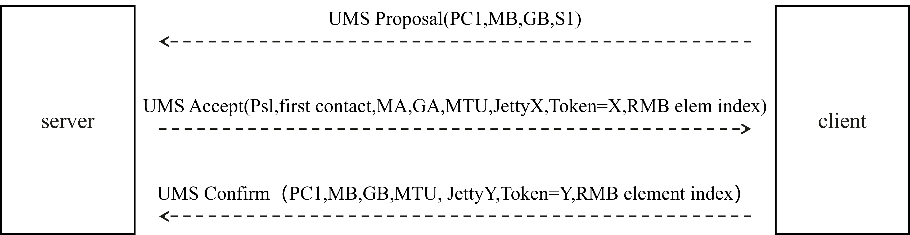

3. LLC

- Confirm Link: After receiving the client's CLC confirm, the server sends an LLC message (via SEND) to verify whether the RC connection is reliable. The LLC message must contain the Link group's maximum capacity, the link's number within the link group (linknum), and the link's user ID on the server side.
- Confirm link rsp: After receiving the confirm link LLC, the client replies with an LLC message of the same format.


1.  Data Plane

The data plane is used to forward messages sent and received (write/read) by upper-layer applications through TCP socket interface calls.

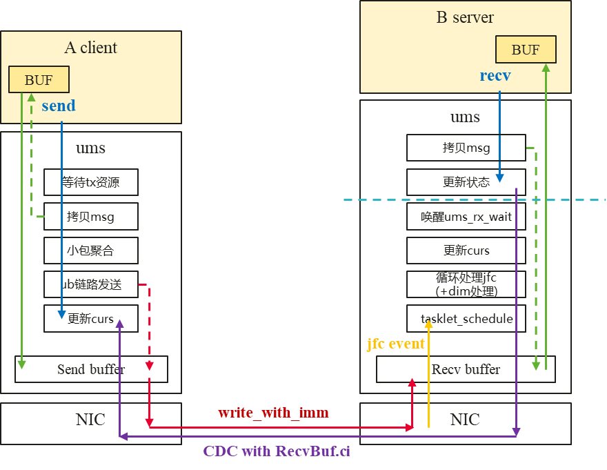

**Detailed Data Path Process:**

1.  sendmsg: After the application calls the socket send interface, the sender's SMC-R protocol stack copies data from user mode to the kernel-mode SndBuf corresponding to that connection, and updates the SndBuf's Prod pointer.

2.  write RMB: The sender writes the SndBuf data to the peer's RMB through a WRITE operation.

3.  CDC notify: The sender sends a CDC message via SEND. The CDC message contains the latest Prod pointer, the local RMB's cons pointer (functionally equivalent to an ACK for writing to the RMB), as well as the CDC seq and token, among other information.

4.  recvmsg: The receiver polls the CQ to obtain a WC, gets the link context from the WC, and then uses the token from the CDC message to look up the link's red-black tree structure to obtain the connection, thereby knowing which connection's RMB to read data from. At the same time, it also updates the locally stored RMB.prod = CDC.prod.

5.  CDC reply: After the receiver has read all the data, it can update local.cons = cdc.prod, and then check the change in the cons pointer since the last CDC reply. If the change is greater than the configured rmbe_update_limit, it replies with a CDC to synchronize the sender's cons pointer. (Frequent CDC replies are unnecessary and can cause problems similar to TCP silly window syndrome.)

    1.  Module Installation

The UMS kernel module is included in the umdk-ums RPM package, and user-mode tools are in the umdk-ums-tools RPM package. Before installation, ensure that URMA is already installed. After installing the UMS RPM package, you can use the command `modprobe ums` to load the UMS kernel module. After executing the modprobe command, you can use the `dmesg` command to view the kernel log. Output like the following indicates that the UMS kernel module has been successfully loaded:

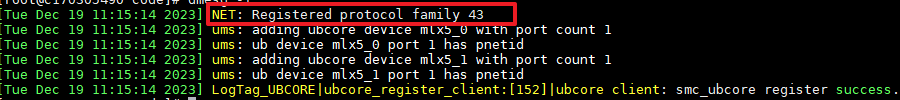

UMS supports dynamically adjusting various configurations through module parameters when loading the module with `modprobe ums`, e.g., `modprobe ums jfc_work_mode=x`. The currently supported module parameters are as follows:

1.  UMS Supported Module Parameters

| Parameter Name | Description | Type | Values | Configuration Notes |
|---|---|---|---|---|
| ub_token_disable | UB token switch, enabled by default | bool | 0x0: false | UMS data plane UB connections have UB token enabled by default for Jetty and SEG access permission verification |
| ub_token_disable | UB token switch, enabled by default | bool | 0x1: true | Setting this to true disables UB token on the local end |
After the UMS kernel module is loaded, AF_SMC-type sockets created in applications (example: socket(AF_SMC, SOCK_STREAM, 0)) will be intercepted by UMS. This method requires synchronous modification of both client and server sockets, allowing only the sockets that need to use UB to be modified.


① Because UMS and the kernel's built-in SMC protocol register the same protocol family (AF_SMC, i.e., protocol family 43), they cannot be loaded simultaneously:

1) For manual UMS module loading scenarios (modprobe ums), ensure that smc.ko is not currently loaded (check with `lsmod | grep smc`). If loaded, unload it first (`rmmod smc`).

2) Due to the kernel socket framework's built-in protocol family module auto-loading feature: when a user calls the socket interface specifying an AF protocol family that is not currently registered, the system attempts to find and load the module corresponding to that protocol family from the indexed ko modules under the system path. Therefore, using AF_SMC to create a socket before UMS is loaded may accidentally load the smc module. It is recommended that users expecting to load UMS this way first remove the smc module from the system index.

② UMS does not currently support hot upgrades.

2.  Specifications and Constraints

1. sysctl configuration is not supported in multi-namespace scenarios.

2. Local traffic is not supported to use the UB path and directly falls back to TCP.

3. Segment constraints:
   - Sockets with the same source and destination share a link (32:1). Each socket registers 2 segments (corresponding to send/recv buffers), and each link registers 2 segments (for connection). The supported segment upper limit is the same as the jetty upper limit.
   - Send/recv buffers are not immediately destroyed when a connection is torn down; they are reused at the link level and only destroyed when the link is destroyed. Therefore, if a user successively modifies 3 different buf_size values for connection setup through the configuration interface, at most 3 sets of send/recv buffers will be registered.

4. Jetty constraints:
   - Sockets with the same source and destination share a link (32:1). Each link creates 1 jetty. The supported jetty upper limit is 64k.

---
# 8 Performance Specifications

1.  URMA Performance Specifications

| Domain | Performance Specification Item | Specification Description | Specification Value | Notes |
|---|---|---|---|---|
| URPC Cloud Storage | Cloud storage point-to-point latency | 4KB static send/recv latency | 20us, URPC software overhead < 1us | Without switch |
| URPC Cloud Storage | Cloud storage point-to-point bandwidth | Based on DPU smart NIC single IODIE, 8KB, 32 streams | 170Gb | Depends on DPU smart NIC single IODIE |
| URPC Cloud Storage | Cloud storage compute node SDI-side memory | SDI-side memory under 8K compute nodes, 256 index nodes | 500MB, URPC+URMA mgmt ~70MB | pkt: 16000, header: 256, rx/tx depth: 512, queue: 32, channel: 4096 |
| URPC Cloud Storage | Cloud storage deployment scale | Compute-side node count | 8K | — |
| DLock | Lock operation latency (Mlx NIC) | Distributed lock operation latency based on URMA over Mlx NIC | 20us | zookeeper ~1000us, redis ~100us |
| DLock | Lock operation throughput (Mlx NIC) | Distributed lock operation throughput based on URMA over Mlx NIC | 1M ops | — |
| DLock | Distributed object CAS/FAA E2E latency | E2E latency at 200K TPS | 5us | — |
| UMS | Single-flow performance | Typical 8KB/16KB avg latency ~30% lower than TCP | — | — |
| UMS | Multi-flow performance | 10 connections, typical 8KB/16KB avg latency ~30% lower than TCP | — | — |
// TODO: connection setup concurrency \ ubagg bonding bandwidth

---
# 9 Network Security

The security objectives of UB are to protect the security of data assets accessed through the UB protocol stack, including but not limited to:

- UBPU device identity, firmware, and companion software.
- Memory data.
- Bus transmission data.
- Sensitive data such as keys, access credentials, and configuration parameters involved in various security functions.

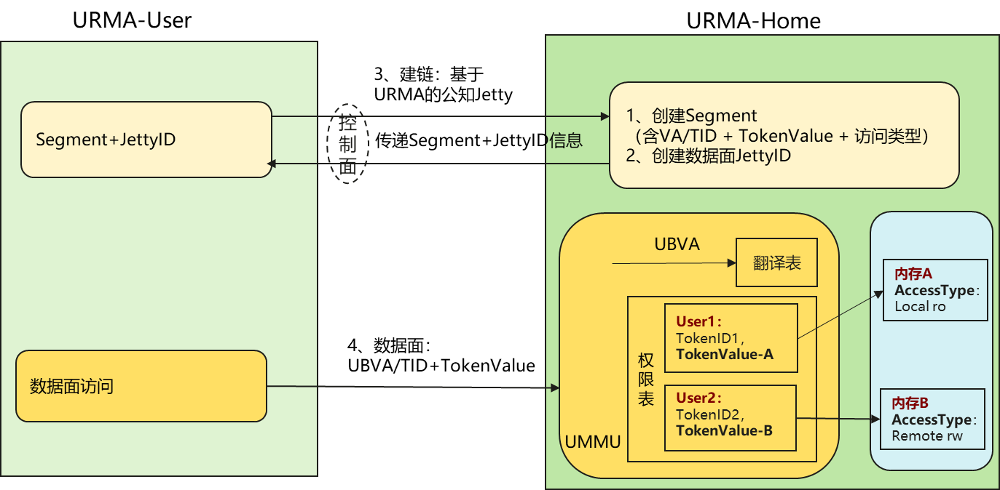

## 9.1 UB Access Control

### 9.1.1 Application Scenarios

UB provides transaction-layer access control functionality. The application scenarios for access control are shown in the table below, covering two scenarios: memory access and Jetty access. The implementation of access control for memory access scenarios depends on the UMMU permission control table. The UMMU permission control table is independent of the address translation table. During memory access, permission verification and address translation are processed separately; when both succeed, memory access is permitted; otherwise, memory access is denied.

1.  Access Control Application Scenarios

| Application Scenario | Whether TokenValue is Introduced | Access Credential Identifier | Whether UMMU Assistance is Introduced |
|---|---|---|---|
| Memory Access | Optional | TokenID | Yes |
| Jetty Access | Optional | TCID | No |

### 9.1.2 Functional Principles

Taking memory access as an example, the functional principles of UB access control are as follows:

1. When a User applies to access a specific memory segment on the Home side, the Home verifies the User's identity and returns a TokenID and a random number as the TokenValue to the User.

2. When the User accesses the Home's memory, it carries the TokenID and TokenValue in the data packet. The Home performs a table lookup to compare the memory address, TokenValue, etc. After successful verification, access is granted.

### 9.1.3 Permission Assignment Flow

1.  When the Home registers a segment, the application must specify the TokenValue. The software stack can allocate and return the TokenID in two ways:

- Call urma_register_seg with the following configuration to let the software stack auto-allocate:

urma_seg_cfg_t.urma_reg_seg_flag_t.token_id_valid = 0;

- First call urma_alloc_token_id to allocate a TokenID, then specify that TokenID when calling urma_register_seg:

```c
urma_seg_cfg_t.token_id = token_id;
urma_seg_cfg_t.urma_reg_seg_flag_t.token_id_valid = 1;
```

2.  The token verification policy can be specified when registering a segment:

urma_seg_cfg_t.urma_reg_seg_flag_t.token_policy = 0;

1.  Token Verification Policies

| Value | URMA Definition | Policy |
|---|---|---|
| 0 | URMA_TOKEN_NONE | Only the TokenID or TCID is transmitted without the TokenValue. This approach has the highest performance but carries the risk of unauthorized access. |
| 1 | URMA_TOKEN_PLAIN_TEXT | The TokenID or TCID and TokenValue are transmitted in plain text. This provides some security but carries the risk that intermediate network nodes may illegally obtain the TokenValue. |
| 2 | URMA_TOKEN_SIGNED | The TokenID or TCID and TokenValue are transmitted with encryption protection, while the PLD is in plain text. Intermediate network nodes cannot obtain the TokenValue, but can see the PLD content. |
| 3 | URMA_TOKEN_ALL_ENCRYPTED | The TokenID or TCID and TokenValue are transmitted with encryption protection, and the PLD is also encrypted. This is the most secure approach but incurs significant hardware overhead. |


The above verification policy capabilities require hardware support.

3.  The application can distribute the Home's Token information to the User using an out-of-band channel (e.g., TLS/IP channel) or the well-known jetty channel provided by URMA.

4.  When the User imports remote Home memory, it must carry the token_value + token_id information.

5.  Token Secure Transport

    a.  **Secure Token Distribution**:

    1.  A secure channel must be established between the Target and the Initiator. This can be achieved through identity certificates, passwords, or a Key Management System (KMS).

    2.  There are two ways to distribute Tokens:

        - Token ID and Token Value distribution and derivation through a secure out-of-band (OoB) channel.

        - The Target exchanges a symmetric key with the Initiator through a secure out-of-band channel, then uses this symmetric key within UMDK (Unified Memory Device Kit) in kernel mode to further exchange the Token ID and Token Value.

    b.  **Token Lookup and Use**:

    3.  When using a Token, the Target side indexes and finds the Token Value using the Token ID in the packet.

    4.  The Initiator side has three ways to look up and use a Token:

        - Distributed network programming scenario: Find the Token through the TargetJetty or TargetSeg object.

        - SVA/DSVA scenario: Look up the Token based on the Virtual Address (VA) without needing a TargetSeg. This requires UMMU (Unified Memory Management Unit) support for accessing the CPU's page tables.

        - Device scenario: Bind the Token information to the context of a specific engine or queue within the device; when the device accesses Host memory, it retrieves the Token directly from the context.

    c.  **Token Security Levels**:

    5.  Different performance requirements correspond to different security policies:

        - Transmit only the Token ID, without the Token Value: highest performance.

        - Transmit Token ID and Token Value in plain text: provides some security, but carries the risk of attacks from intermediate network nodes.

        - Transmit Token ID and signed value, with payload in plain text: intermediate network nodes cannot obtain the Token Value, but can see the payload content.

        - Transmit Token ID and signed value, with encrypted payload: most secure, but incurs significant hardware overhead.

    d.  **Token Initiator Isolation Strategy**:

    6.  To differentiate the permissions of different Initiators, two strategies can be adopted during Token distribution:

        - Compute-instead-of-store: The Target side stores only the original Token Value and derives a value based on the Initiator's EID and other information at distribution time. The Initiator carries the derived Token Value and derivation materials when accessing. The Target side verifies the correctness of the derived Token.

        - Store-instead-of-compute: The Target side stores a different Token Value for each Initiator. The Initiator carries the Token Value when accessing. The Target side directly compares the Token Value in the packet.

### 9.1.4 Permission Invalidation Flow

UB access control provides two granularities of access permission invalidation mechanisms:

- Permission-group granularity invalidation:

Permission-group granularity invalidation is initiated by the Home side and specifically executed by the Home-side UMMU-related software and hardware. It invalidates the TokenID and corresponding TokenValue in the Home-side UMMU. At this point, the access permissions of all Users within the permission group holding that TokenID and TokenValue are invalidated.

- User granularity invalidation:

User granularity invalidation refers to invalidating the access permissions of a specific User within a permission group while minimizing the impact on Users whose permissions should remain valid. It is initiated by the User. The steps are as follows:

(1) Multiple Users all apply for and obtain the Home's memory access credentials (either by applying to the Home individually or by sharing among multiple Users), including the TokenID and the corresponding TokenValue.

(2) The Home updates the TokenValue and distributes the updated TokenValue to Users whose permissions should remain valid. Users whose permissions are to be invalidated will not receive the updated TokenValue.

(3) The Home only accepts memory access requests based on the updated TokenValue, thereby invalidating the memory access permissions of Users who did not receive the updated TokenValue.

## 9.2 Memory Access Control

URMA's northbound interface memory permission configuration is consistent with the UB protocol definition and uses the following definitions:

```c
#define URMA_ACCESS_LOCAL_ONLY (0x1 << 0)
#define URMA_ACCESS_READ (0x1 << 1)
#define URMA_ACCESS_WRITE (0x1 << 2)
#define URMA_ACCESS_ATOMIC (0x1 << 3)
```


1. When URMA_ACCESS_LOCAL_ONLY is set to 1, local access has all permissions (READ, WRITE, ATOMIC), but external access is denied.

2. When URMA_ACCESS_LOCAL_ONLY is set to 0, in addition to local access having all permissions, external access permissions are determined by the subsequent three flags and take effect according to the user-configured combination of READ, WRITE, and ATOMIC.

3. Write requires Read permission; Atomic requires Write + Read permission.
